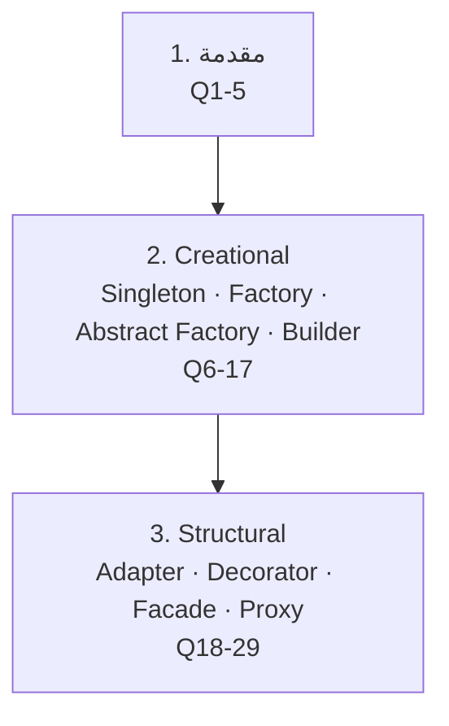
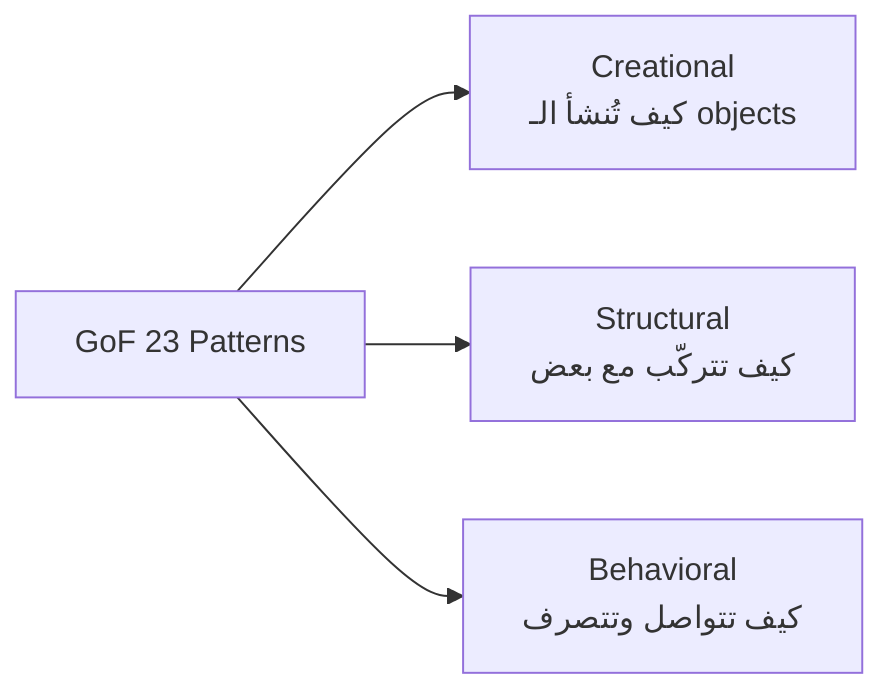
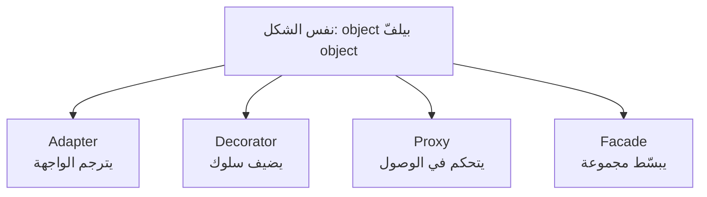
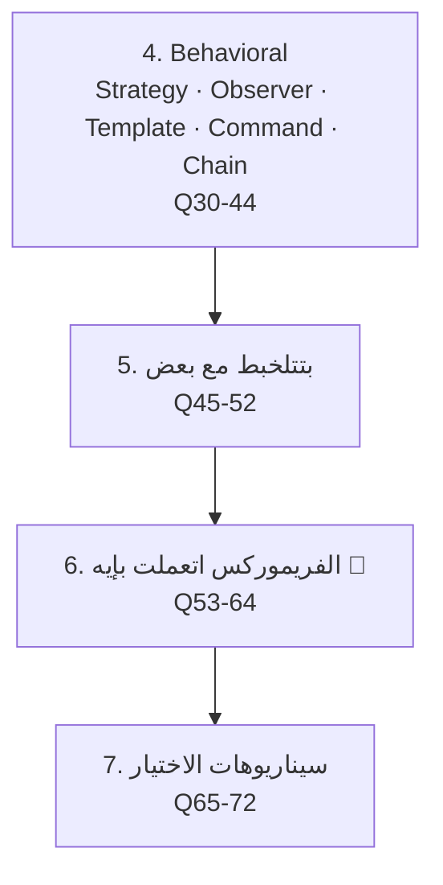

# تراك 2 — Design Patterns: بنك أسئلة إنترفيو (المرحلة 1)

> **إزاي تذاكر:** laddering (سهل → صعب → سيناريو). كل pattern بنفس البنية: **المشكلة** اللي بيحلها → **الفكرة** → **كود Java (كومنتات إنجليزي)** → **مثال حقيقي** (فين بتلاقيه) → **↳ الفخ / الفرق عن اللي بيشبهه**.

> **العام vs الخاص بـ Java:** الباترنز مفاهيم عامة بتتنقل بين اللغات، الأمثلة Java كأداة. أي تفصيلة خاصة بـ Java متعلّمة بـ **📌 Java-specific**.

> **حالة الملف:** المرحلة 1 (مقدمة + Creational + Structural). المرحلة 2 (Behavioral + بتتلخبط + الفريموركس + سيناريوهات) جاية بعد المراجعة.

## 🗺️ خريطة المرحلة 1



---

# القسم 1 — مقدمة (Q1–5)

### 1. إيه هو الـ Design Pattern؟
حل **متكرر ومجرّب** لمشكلة تصميم شائعة بتتكرر في سياقات مختلفة. مش كود جاهز تنسخه، ده **قالب تفكير** بتطبّقه حسب حالتك.
↳ الفخ: الـ pattern مش library ولا كود تـ import. ده وصفة تصميم.

### 2. ليه نستخدم الـ Design Patterns؟
بتدّي **لغة مشتركة** بين المطورين ("اعمل ده Strategy" أوضح من شرح طويل)، وحلول مجرّبة بتتجنّب أخطاء معروفة، وكود أسهل في التوسّع والصيانة.
↳ اربطها بتجربتك: "لما فريقي قال 'نعمله Factory'، الكل فهم القصد فوراً من غير شرح."

### 3. إيه هي مجموعة الـ GoF؟
**Gang of Four** — الكتاب الكلاسيكي (1994) اللي وثّق 23 pattern في تلات عائلات: **Creational** (الإنشاء)، **Structural** (الهيكلة)، **Behavioral** (السلوك).

↳ مش لازم تحفظ الـ23 — المشهورين بس (اللي في الملف ده).

### 4. إيه الفرق بين Design Pattern و Design Principle و Architecture Pattern؟
**Principle** = قاعدة عامة (SOLID, DRY). **Design Pattern** = حل لمشكلة تصميم على مستوى الكلاسات (Strategy). **Architecture Pattern** = تنظيم على مستوى النظام كله (MVC, Microservices, Layered).
↳ الترتيب من العام للمحدد: Principle → Architecture → Design Pattern.

### 5. الـ Design Patterns دايماً حل كويس؟
لأ. الاستخدام الزايد (**over-engineering**) بيعقّد الكود بلا داعي. الـ pattern بيلمع لما فيه فعلاً مشكلة متكررة أو نقطة تغيّر متوقعة — مش عشان "نستخدم pattern".
↳ الإجابة دي بتبيّن نضج: "بطبّق الـ pattern لما المشكلة موجودة، مش استعراضاً."

---

# القسم 2 — Creational Patterns (Q6–17)

الفكرة العامة: **بتتحكم في إزاي الـ objects بتتخلق** بدل الـ `new` المباشر.

### 6. إيه الـ Singleton؟
**المشكلة:** محتاج نسخة **واحدة بس** من كلاس في النظام كله (زي config أو connection pool)، ومحدش يعمل تانية.
**الفكرة:** تخبّي الـ constructor وتكشف نقطة وصول واحدة.
```java
class AppConfig {
    private static final AppConfig INSTANCE = new AppConfig(); // eager, thread-safe
    private AppConfig() { }                                    // hide the constructor
    static AppConfig getInstance() { return INSTANCE; }
}
```
**مثال حقيقي:** الـ logger، الـ config، الـ DB connection pool.
↳ الفخ: بيتعتبر anti-pattern أحياناً (global state، صعوبة اختبار). في الـ frameworks الحديثة الـ **DI container** بيدّيك singleton من غير عيوبه.

### 7. إيه مشاكل الـ Singleton؟
global state مخفي، بيصعّب الـ unit testing (مينفعش تحقن mock بسهولة)، وبيكسر SRP (بيدير دورة حياته + شغله)، ومشاكل في الـ concurrency لو مش متعمل صح.
↳ الحل الحديث: خلّي الـ DI container يدير النسخة الواحدة (`@Injectable` scope singleton).

### 8. الفرق بين Eager و Lazy initialization في الـ Singleton؟
**Eager**: بتتخلق مع تحميل الكلاس (بسيطة وthread-safe، بس بتتخلق حتى لو مش هتتستخدم). **Lazy**: بتتخلق أول مرة تُطلب (بتوفّر موارد، بس محتاجة حماية للـ concurrency).
```java
// lazy + thread-safe via holder idiom
class Config {
    private Config() {}
    private static class Holder { static final Config INSTANCE = new Config(); }
    static Config get() { return Holder.INSTANCE; } // initialized on first access
}
```
> 📌 **Java-specific:** الـ "initialization-on-demand holder" ده idiom بتاع Java لعمل lazy singleton آمن بلا locks.

### 9. إيه الـ Factory Method؟
**المشكلة:** عايز تنشئ objects من غير ما الكود المستخدم يعرف الكلاس الملموس بالظبط.
**الفكرة:** method بتقرر النوع اللي هيترجع، والكود بيتعامل مع الـ interface.
```java
interface Transport { void deliver(); }
class Truck implements Transport { public void deliver() {} }
class Ship implements Transport { public void deliver() {} }

class TransportFactory {
    Transport create(String mode) {
        if (mode.equals("sea")) return new Ship(); // hides the concrete choice
        return new Truck();
    }
}
```
**مثال حقيقي:** `Calendar.getInstance()`، أي `createX()`.
↳ الفخ: الفرق عن الـ Abstract Factory — ده بينشئ **object واحد**، الأبستراكت بينشئ **عائلة**.

### 10. إيه الـ Abstract Factory؟
**المشكلة:** عايز تنشئ **عائلة من objects مترابطة** لازم تبقى متوافقة مع بعض (زي عناصر UI لثيم معيّن).
**الفكرة:** factory بترجع factories/objects متجانسة.
```java
interface UIFactory {
    Button createButton();
    Checkbox createCheckbox();   // same family, guaranteed compatible
}
class DarkThemeFactory implements UIFactory {
    public Button createButton() { return new DarkButton(); }
    public Checkbox createCheckbox() { return new DarkCheckbox(); }
}
```
**مثال حقيقي:** مكتبات الـ UI cross-platform، الـ theming.
↳ الفخ: Factory Method = منتج واحد. Abstract Factory = عائلة منتجات متوافقة.

### 11. الفرق بين Factory Method و Abstract Factory؟
| | Factory Method | Abstract Factory |
|---|---|---|
| بينشئ | object واحد | عائلة objects مترابطة |
| الآلية | method واحدة | interface فيه كذا method |
| المستوى | class | مجموعة classes |
↳ الجملة: "Factory Method بيخبّي إنشاء **نوع**، Abstract Factory بيخبّي إنشاء **عائلة**."

### 12. إيه الـ Builder؟
**المشكلة:** object معقّد بـ params كتير نصهم اختياري → **constructor explosion** و`null`s غامضة.
**الفكرة:** بناء خطوة خطوة بأسماء واضحة، وفصل البناء عن التمثيل.
```java
User user = new User.Builder()
    .name("Mohamed").age(30).city("Cairo") // readable, order-independent, optional
    .build();
```
**مثال حقيقي:** `StringBuilder`، `HttpClient.newBuilder()`، الـ query builders.
↳ الفخ: الفرق عن Factory — الـ Factory بيخبّي **أنهي نوع**، الـ Builder بيدير **إزاي تبني object معقّد** خطوة خطوة.

### 13. إمتى Builder وإمتى Factory؟
**Builder**: object واحد معقّد بخطوات/params كتير اختيارية. **Factory**: إخفاء أي نوع بيترجع (اختيار بين أنواع).
↳ ممكن يشتغلوا مع بعض: factory بترجع builder.

### 14. إيه الـ Fluent Interface وعلاقته بالـ Builder؟
أسلوب بترجع فيه كل method الـ object نفسه (`return this`) عشان تعمل chaining. الـ Builder بيستخدمه.
```java
class QueryBuilder {
    QueryBuilder where(String c) { /* ... */ return this; } // enables chaining
    QueryBuilder orderBy(String c) { /* ... */ return this; }
}
```
↳ الفخ: الـ fluent interface أسلوب، الـ Builder pattern غرض — مش نفس الحاجة بالظبط.

### 15. الـ Singleton إزاي بيتكسر في البيئات المتعددة الـ threads؟
لو الـ lazy init من غير حماية، threadين ممكن يدخلوا في نفس اللحظة ويعملوا نسختين. الحل: eager، أو holder idiom، أو double-checked locking.
> 📌 **Java-specific:** الـ double-checked locking محتاج `volatile` عشان يشتغل صح بسبب الـ memory model.
↳ في الإنترفيو: "بستخدم holder idiom — lazy وثread-safe بلا locks."

### 16. سيناريو: عندي نظام بيدعم قواعد بيانات مختلفة (MySQL/Postgres) ولازم كل واحدة تيجي بكل مكوناتها (connection/query/transaction) متوافقة. أنهي pattern؟
**Abstract Factory** — كل DB عندها factory بترجع مكوناتها المتوافقة كعائلة واحدة.
↳ لو كان object واحد بس (connection) → Factory Method يكفي.

### 17. سيناريو: عندي API request فيه 15 خيار، معظمهم اختياري. أنهي pattern؟
**Builder** — بناء الـ request خطوة خطوة بأسماء واضحة بدل constructor بـ 15 param.
↳ ده بالظبط اللي بيعمله `HttpRequest.newBuilder()`.

---

# القسم 3 — Structural Patterns (Q18–29)

الفكرة العامة: **بتنظّم إزاي الـ objects بتتركّب مع بعض** لتكوين هياكل أكبر.

### 18. إيه الـ Adapter؟
**المشكلة:** عندك كلاس واجهته مش متوافقة مع اللي الكود بتاعك متوقعه (زي مكتبة قديمة أو خارجية).
**الفكرة:** تلفّه في كلاس بيترجم الواجهة.
```java
interface ModernPayment { void charge(double amount); }
class LegacyGateway { void makePayment(double a) {} }        // incompatible interface

class PaymentAdapter implements ModernPayment {
    private final LegacyGateway legacy;
    PaymentAdapter(LegacyGateway legacy) { this.legacy = legacy; }
    public void charge(double amount) { legacy.makePayment(amount); } // translate the call
}
```
**مثال حقيقي:** `Arrays.asList()`، محوّلات الـ SDK، ربط مكتبة خارجية بكودك.
↳ الفخ: الـ Adapter بيغيّر **الواجهة** بلا ما يضيف سلوك. الـ Decorator بيضيف **سلوك** بلا ما يغيّر الواجهة.

### 19. إيه الـ Decorator؟
**المشكلة:** عايز تضيف سلوك لـ object **بلا** وراثة و**بلا** تعديل كلاسه، وبمرونة وقت التشغيل.
**الفكرة:** تلفّ الـ object في object بنفس الواجهة بيضيف حاجة قبل/بعد.
```java
interface Coffee { double cost(); }
class Espresso implements Coffee { public double cost() { return 20; } }

class MilkDecorator implements Coffee {
    private final Coffee inner;                       // wraps another Coffee
    MilkDecorator(Coffee inner) { this.inner = inner; }
    public double cost() { return inner.cost() + 5; } // adds behavior
}
// new MilkDecorator(new Espresso()) -> stackable at runtime
```
**مثال حقيقي:** الـ Java I/O streams (`BufferedReader(new FileReader(...))`)، middleware wrapping.
↳ الفخ: الفرق عن الوراثة — الـ Decorator بيركّب السلوك **runtime** وبيتـ stack، الوراثة **compile-time** وصلبة.

### 20. إيه الـ Facade؟
**المشكلة:** نظام فرعي معقّد بكذا كلاس، والكود المستخدم مش عايز يتعامل مع التعقيد ده.
**الفكرة:** واجهة **واحدة مبسّطة** بتخبّي النظام الفرعي.
```java
class VideoConverter {                     // facade over codecs, readers, writers, filters
    File convert(String file, String format) {
        // internally coordinates many complex subsystem classes
        return new File("output." + format);
    }
}
```
**مثال حقيقي:** أي SDK بيقدّم `client.doTheThing()` بيخبّي وراه تعقيد كبير.
↳ الفخ: الـ Facade بيبسّط **مجموعة** كلاسات. الـ Adapter بيوفّق **كلاس واحد** لواجهة مختلفة.

### 21. إيه الـ Proxy؟
**المشكلة:** عايز تتحكم في الوصول لـ object (تأجيل إنشائه، تحكّم صلاحيات، caching، logging) بلا ما تغيّره.
**الفكرة:** object بديل بنفس الواجهة بيقف قدام الأصلي.
```java
interface Image { void display(); }
class RealImage implements Image {
    RealImage(String file) { /* expensive load */ }
    public void display() {}
}
class LazyImageProxy implements Image {
    private RealImage real;
    private final String file;
    LazyImageProxy(String file) { this.file = file; }
    public void display() {
        if (real == null) real = new RealImage(file); // lazy: load only when needed
        real.display();
    }
}
```
**مثال حقيقي:** الـ ORM lazy loading، الـ security proxies، الـ caching proxies.
↳ الفخ: الـ Proxy بيتحكم في **الوصول** لنفس الواجهة. الـ Decorator بيضيف **سلوك**. الشكل متشابه، القصد مختلف.

### 22. الفرق بين Adapter و Decorator و Proxy و Facade في جملة لكل واحد؟
- **Adapter**: بيغيّر الواجهة عشان تتوافق (translate).
- **Decorator**: بيضيف سلوك بنفس الواجهة (enhance).
- **Proxy**: بيتحكم في الوصول بنفس الواجهة (control).
- **Facade**: بيبسّط مجموعة كلاسات في واجهة واحدة (simplify).

↳ دي **أكتر مجموعة بتتلخبط** في الإنترفيوهات — احفظ الفرق بالقصد مش الشكل.

### 23. الـ Adapter vs Facade — الفرق الدقيق؟
Adapter: بيخلّي واجهة **موجودة** تتوافق مع واجهة **متوقعة** (كلاس واحد غالباً). Facade: بيخترع واجهة **جديدة مبسّطة** فوق نظام فرعي معقّد (كذا كلاس).
↳ Adapter لتوافق، Facade لتبسيط.

### 24. الـ Decorator vs Proxy — الفرق الدقيق؟
الشكل واحد (نفس الواجهة، بيلفّ)، بس القصد مختلف: Decorator **بيضيف قدرات** (المستخدم عايز الإضافة)، Proxy **بيتحكم في الوصول** (المستخدم مش لازم يعرف إن فيه وسيط).
↳ الجملة: "Decorator بيقول 'زوّدتك'، Proxy بيقول 'أنا حارس الباب'."

### 25. إمتى Decorator أحسن من الوراثة؟
لما عايز تركيبات كتير من السلوك (coffee + milk + sugar + caramel...). الوراثة كانت هتحتاج class لكل تركيبة (انفجار كلاسات). الـ Decorator بيركّبهم runtime.
↳ الجملة: "الوراثة للتركيبات = انفجار كلاسات، الـ Decorator = تركيب مرن."

### 26. سيناريو: عندي مكتبة دفع خارجية واجهتها مختلفة عن نظامي. أنهي pattern؟
**Adapter** — تلفّها في كلاس بينفّذ واجهة نظامك ويترجم النداءات.
↳ لو عايز كمان تضيف logging/retry فوقها → تدمج Adapter + Decorator.

### 27. سيناريو: عايز أضيف caching و logging لـ service بلا ما ألمس كوده. أنهي pattern؟
**Proxy** (أو Decorator حسب القصد) — object بديل بنفس الواجهة بيعمل الـ caching/logging قبل ما ينادي الأصلي.
> 📌 **Java-specific:** Spring AOP بيعمل ده تلقائياً عبر **dynamic proxies** (زي `@Cacheable`, `@Transactional`).
↳ ده بالظبط اللي بيعمله الـ AOP.

### 28. سيناريو: عندي نظام فيديو معقّد (codecs، filters، readers) والمستخدم عايز `convert(file)` بس. أنهي pattern؟
**Facade** — كلاس واحد بواجهة بسيطة بيخبّي كل التعقيد.
↳ الفخ: ده مش بيقلّل التعقيد، بيخبّيه — النظام الفرعي لسه موجود.

### 29. الـ Structural patterns دي بتشترك في إيه؟
كلها بتحل مشاكل **تركيب الـ objects** عن طريق **wrapping/composition** بدل الوراثة — تجسيد عملي لمبدأ "favor composition over inheritance".
↳ ربط جميل بالـ OOP: الـ Structural patterns هي الـ composition في أبهى صورها.

---

## ✅ Checkpoint — المرحلة 1

1. الفرق بين pattern و principle و architecture
2. الـ Design Pattern مش دايماً حل (over-engineering)
3. Factory Method vs Abstract Factory vs Builder
4. Singleton: مشاكله + eager/lazy + thread-safety
5. Adapter vs Decorator vs Proxy vs Facade (الأربعة بالقصد)
6. Decorator vs الوراثة (انفجار الكلاسات)
7. Proxy + AOP (caching/transactions)
8. الـ Structural = composition عملياً

---

*المرحلة 2 جاية → Behavioral (Strategy · Observer · Template Method · Command · Chain of Responsibility) · Patterns بتتلخبط · **الفريموركس اتعملت بإيه** 🎯 · سيناريوهات الاختيار.*

---
---

# تراك 2 — Design Patterns: المرحلة 2

## 🗺️ خريطة المرحلة 2



---

# القسم 4 — Behavioral Patterns (Q30–44)

الفكرة العامة: **بتنظّم إزاي الـ objects بتتواصل وتتصرف** مع بعض.

### 30. إيه الـ Strategy؟
**المشكلة:** عندك كذا طريقة لعمل نفس العملية (خوارزميات ترتيب، طرق دفع) وعايز تبدّل بينهم runtime بلا if/else طويلة.
**الفكرة:** كل خوارزمية بتنفّذ نفس الـ interface، والسياق بياخدها كـ dependency.
```java
interface DiscountStrategy { double apply(double price); }
class VipDiscount implements DiscountStrategy { public double apply(double p) { return p * 0.8; } }

class Checkout {
    private final DiscountStrategy discount;                // injected, swappable at runtime
    Checkout(DiscountStrategy discount) { this.discount = discount; }
    double total(double price) { return discount.apply(price); }
}
```
**مثال حقيقي:** خوارزميات الترتيب، طرق الدفع/الشحن، الـ validation strategies.
↳ الفخ: الفرق عن Template Method — Strategy بيبدّل **الخوارزمية كلها** (composition)، Template Method بيبدّل **خطوة** جوه هيكل ثابت (inheritance).

### 31. إيه الـ Observer؟
**المشكلة:** عايز objects كتير تتبلّغ تلقائياً لما object تاني يتغيّر، من غير ما يبقوا معتمدين على بعض بإحكام.
**الفكرة:** الـ subject بيحتفظ بقائمة observers وبيبلّغهم عند التغيير (**one-to-many**).
```java
interface OrderObserver { void onStatusChanged(String status); }

class Order {
    private final List<OrderObserver> observers = new ArrayList<>();
    void subscribe(OrderObserver o) { observers.add(o); }
    void updateStatus(String status) {
        observers.forEach(o -> o.onStatusChanged(status)); // notify all, one-to-many
    }
}
```
**مثال حقيقي:** event systems، الـ pub/sub، RxJS observables، Redux subscribers.
↳ الفخ: الفرق عن Pub/Sub — Observer بيعرف الـ subject observers بتاعته مباشرة (coupling أقوى شوية)، Pub/Sub بيمرّ عبر **broker/event bus** وسيط (الطرفين ملهمش فكرة عن بعض).

### 32. إيه الـ Template Method؟
**المشكلة:** عندك خوارزمية بخطوات ثابتة الترتيب، بس بعض الخطوات بتختلف حسب النوع.
**الفكرة:** الأب بيحدد **الهيكل** في method نهائية، والأبناء بيعملوا override للخطوات المتغيّرة بس.
```java
abstract class DataPipeline {
    final void run() {              // fixed skeleton, can't be reordered
        readData();
        transform();
        writeResult();
    }
    abstract void transform();      // subclasses vary this step only
    void readData() { /* shared default */ }
    void writeResult() { /* shared default */ }
}
```
**مثال حقيقي:** فريموركات الاختبار (`setUp() → test() → tearDown()`)، معالجة الملفات بخطوات ثابتة.
↳ الفخ: بيستخدم **الوراثة** (compile-time)، عكس Strategy اللي بيستخدم **composition** (runtime).

### 33. إيه الـ Command؟
**المشكلة:** عايز تحوّل "طلب تنفيذ عملية" لـ object قائم بذاته — عشان تقدر تأجّله، تحطه في queue، تعمله undo، أو تسجّله (log).
**الفكرة:** كل عملية بتتغلّف في object بيحمل كل ما يلزم لتنفيذها.
```java
interface Command { void execute(); void undo(); }

class AddItemCommand implements Command {
    private final Cart cart;
    private final Item item;
    AddItemCommand(Cart cart, Item item) { this.cart = cart; this.item = item; }
    public void execute() { cart.add(item); }
    public void undo() { cart.remove(item); }              // undo support built in
}
```
**مثال حقيقي:** الـ undo/redo في المحررات، الـ task queues، الـ transaction logs.
↳ الفخ: الفرق عن Strategy — Command بيغلّف **طلب/عملية** (فيها بيانات + تنفيذ + ممكن undo)، Strategy بيغلّف **خوارزمية بديلة** لنفس العملية.

### 34. إيه الـ Chain of Responsibility؟
**المشكلة:** طلب واحد لازم يمرّ على سلسلة من المعالجات، وكل واحد يقرر يعالجه أو يمرّره للتالي، من غير ما الطالب يعرف مين هيعالجه.
**الفكرة:** كل handler عنده reference للـ handler التالي، وبيقرر: يعالج ويوقف، أو يمرّر.
```java
abstract class Middleware {
    protected Middleware next;
    Middleware setNext(Middleware next) { this.next = next; return this; }
    abstract void handle(Request req);
}
class AuthMiddleware extends Middleware {
    void handle(Request req) {
        if (!req.isAuthenticated()) { throw new SecurityException("unauthorized"); }
        if (next != null) next.handle(req);            // pass to the next link
    }
}
```
**مثال حقيقي:** middleware في Express/NestJS، الـ servlet filters، معالجة الـ exceptions في طبقات.
↳ ده أساس قسم الفريموركس الجاي — Express بالكامل مبني على الـ pattern ده.

### 35. الفرق بين Chain of Responsibility و Decorator؟
الشكل شبه (كذا object متسلسل)، بس القصد مختلف: **Decorator** كل حلقة بتضيف سلوك و**بتنادي التالي دايماً**. **Chain of Responsibility** كل حلقة **تقرر** تعالج وتوقف، أو تمرّر — مش كل حلقة لازم تشتغل.
↳ الجملة: "Decorator كله بيشتغل، Chain حلقة واحدة بس ممكن تشتغل وتوقف السلسلة."

### 36. إيه الـ State pattern؟ (مقدمة سريعة)
object بيغيّر سلوكه بالكامل حسب حالته الداخلية، وكأنه بيغيّر الكلاس بتاعه وقت التشغيل. كل حالة بتنفّذ نفس الـ interface.
```java
interface OrderState { void next(Order order); }
class PendingState implements OrderState { public void next(Order o) { o.setState(new ShippedState()); } }
```
**مثال حقيقي:** حالات الطلب (pending → shipped → delivered)، حالات الاتصال (connected/disconnected).
↳ الفخ: الفرق عن Strategy — State بيبدّل نفسه **تلقائياً** بناءً على انتقالات داخلية، Strategy بيتبدّل **من بره** بواسطة المستخدم.

### 37. Strategy vs State — الفرق الدقيق؟
| | Strategy | State |
|---|---|---|
| مين بيبدّل | المستخدم من بره | الـ object نفسه (self-transition) |
| العلاقة بين الأنواع | مستقلين عن بعض | بيعرفوا بعض (انتقالات) |
| المثال | خوارزمية ترتيب | حالة طلب |
↳ الشكل الكودي متطابق تقريباً — الفرق في **القصد ومين المتحكم**.

### 38. إيه الـ Iterator pattern؟ (مقدمة سريعة)
بيوفّر طريقة موحّدة للمرور على عناصر collection **من غير ما تكشف تفاصيل تخزينها الداخلية** (array, linked list, tree).
```java
for (String item : list) { /* ... */ }   // Iterator hides internal structure
```
> 📌 **Java-specific:** الـ `for-each` في Java مبني على `Iterable`/`Iterator` interfaces تحت السطح.
↳ ده أكتر pattern بتستخدمه يومياً من غير ما تحس بيه.

### 39. إيه الـ Mediator pattern؟ (مقدمة سريعة)
بدل ما objects كتير تتواصل مباشرة مع بعض (شبكة تعقيد N×N)، كلهم بيتواصلوا عبر **وسيط مركزي واحد**.
```java
class ChatRoom {                                    // mediator: users don't talk directly
    void send(String msg, User from) { /* broadcasts to other users */ }
}
```
**مثال حقيقي:** air traffic control، chat rooms، الـ event bus المركزي.
↳ الفخ: بيقلّل الـ coupling بين الأطراف، بس ممكن الـ mediator نفسه يبقى "god object" لو كبر أوي.

### 40. Observer vs Mediator — الفرق؟
Observer: subject واحد بيبلّغ observers كتير (**one-to-many**). Mediator: أطراف كتير بتتواصل عبر وسيط واحد (**many-to-many عبر hub**).
↳ Observer للإشعارات، Mediator لتنسيق تفاعلات معقّدة بين أطراف متعددة.

### 41. الـ Command بيفيد في الـ Undo/Redo إزاي بالظبط؟
كل command بيحتفظ بالبيانات الكافية لعكس نفسه (`undo()`)، والنظام بيحتفظ بـ **stack من الـ commands المنفّذة**. الـ undo = pop وتنفيذ `undo()`.
```java
Deque<Command> history = new ArrayDeque<>();
history.push(command); command.execute();
// undo: history.pop().undo();
```
↳ ده تطبيق عملي مباشر لسؤال 33.

### 42. الـ Template Method فايدته الرئيسية؟
بيحقق **Don't Repeat Yourself** على مستوى الخوارزمية: الخطوات المشتركة مكتوبة مرة في الأب، والاختلاف الوحيد في الأبناء.
↳ لاحظ الربط بمبدأ **Open/Closed** — تضيف نوع جديد بـ override للخطوات بس.

### 43. الـ Chain of Responsibility فايدته إيه غير الـ middleware؟
بيفكّ الترابط بين **الطالب** و**المعالج**: الطالب مش لازم يعرف مين هيعالج طلبه، وتقدر تضيف/تشيل/تعيد ترتيب المعالجين بلا ما تلمس كود الطالب.
↳ ده تطبيق حي لـ Open/Closed.

### 44. الخمس Behavioral patterns دي بتشترك في إيه؟
كلها بتحل مشاكل **كيف تتواصل الـ objects وتتصرف** مع بعض بمرونة، غالباً بالاعتماد على **polymorphism** بدل الـ conditionals الطويلة.
↳ ربط بالـ OOP: كل الـ Behavioral patterns تقريباً تطبيق عملي لمبدأ "حوّل الـ if/else لنظام أنواع".

---

# القسم 5 — Patterns بتتلخبط مع بعض (Q45–52)

### 45. Factory Method vs Abstract Factory vs Builder — جدول نهائي.
| | يحل إيه | ينشئ |
|---|---|---|
| Factory Method | إخفاء نوع الـ object | object واحد |
| Abstract Factory | عائلة objects متوافقة | كذا object مترابط |
| Builder | تعقيد البناء (params كتير) | object واحد معقّد، خطوة خطوة |
↳ الفخ: التلاتة "creational" بس بيحلوا مشاكل مختلفة تماماً — مش بدائل لبعض.

### 46. Adapter vs Decorator vs Proxy vs Facade — جدول نهائي.
| | القصد | يغيّر الواجهة؟ |
|---|---|---|
| Adapter | توافق | أيوة (بيترجمها) |
| Decorator | إضافة سلوك | لأ (نفسها بالظبط) |
| Proxy | تحكّم في الوصول | لأ (نفسها بالظبط) |
| Facade | تبسيط نظام معقّد | بينشئ واجهة جديدة أبسط |
↳ لو المُنترفيور وراك كود بيلفّ object، اسأل نفسك: بيترجم؟ بيضيف؟ بيتحكم؟ ولا بيبسّط مجموعة؟

### 47. Strategy vs State vs Template Method — جدول نهائي.
| | مين بيبدّل | الآلية |
|---|---|---|
| Strategy | المستخدم من برّه | composition، كائن بديل بالكامل |
| State | الـ object نفسه | composition، بس بينتقل ذاتياً |
| Template Method | لا حد "بيبدّل" وقت التشغيل | inheritance، خطوة داخل هيكل ثابت |
↳ التلاتة بيحلوا "سلوك متغيّر"، الفرق في **مين المتحكم** و**الوراثة أو composition**.

### 48. Observer vs Mediator vs Pub/Sub — جدول نهائي.
| | العلاقة | الوسيط |
|---|---|---|
| Observer | subject واحد → observers كتير | مفيش وسيط، subject بيعرف الـ observers |
| Mediator | أطراف كتير ↔ أطراف كتير | وسيط مركزي بيعرف الكل |
| Pub/Sub | publishers ↔ subscribers | event bus/broker، الطرفين ملهمش فكرة عن بعض |
↳ الفرق الجوهري: **درجة المعرفة بين الأطراف** (مين عارف مين).

### 49. Command vs Strategy — الفرق الدقيق؟
Command بيغلّف **طلب كامل** (بيانات + تنفيذ + ممكن undo/queue/log). Strategy بيغلّف **خوارزمية بديلة** لنفس العملية بلا حالة إضافية غالباً.
↳ لو محتاج queue/undo/log → Command. لو محتاج تبديل خوارزمية بس → Strategy.

### 50. Decorator vs Chain of Responsibility — إمتى تلخبط؟
لو شفت objects متسلسلة كلها بتنفّذ نفس الواجهة — اسأل: **كل واحدة بتشتغل دايماً؟** (Decorator) ولا **ممكن توقف السلسلة؟** (Chain).
↳ الفحص العملي: لو فيه `if` بيقرر "أعالج ولا أمرّر" → Chain. لو مفيش قرار وكله بيتنفّذ → Decorator.

### 51. Facade vs Adapter — إمتى تلخبط؟
لو الهدف "توافق واجهة قديمة مع جديدة" → Adapter (غالباً كلاس واحد). لو الهدف "تبسيط نظام كامل معقّد" → Facade (غالباً كذا كلاس).
↳ الفحص العملي: هل فيه واجهتين لازم يتوافقوا؟ ولا مجرد تعقيد عايز تبسيطه؟

### 52. إطار عملي: إزاي تفرّق أي زوج patterns بيتلخبطوا؟
اسأل ثلاث أسئلة: (1) **الهدف إيه بالظبط؟** (توافق/إضافة/تحكم/تبسيط/تبديل...). (2) **مين بيتحكم في التغيير؟** (المستخدم من برّه ولا الـ object نفسه). (3) **composition ولا inheritance؟**
↳ الإطار ده بيحل أي التباس بين patterns شكلها متشابه.

---

# القسم 6 — الفريموركس اتعملت بإيه 🎯 (Q53–64)

### 53. Express.js مبني على أنهي pattern؟
**Chain of Responsibility** — كل `app.use(middleware)` بيضيف حلقة في السلسلة، وكل middleware بيقرر يكمل بـ `next()` أو يوقف السلسلة (يرد response أو يرمي error).
```javascript
app.use((req, res, next) => {
    if (!req.user) return res.status(401).end();  // stops the chain
    next();                                         // passes to the next handler
});
```
↳ الجملة: "الـ middleware pipeline كله Chain of Responsibility بحروفه."

### 54. NestJS مبني على أنهي patterns؟
مجموعة: **Dependency Injection / IoC** (الـ providers بتتحقن)، **Decorator pattern** (`@Injectable`, `@Controller`, `@Get` بتضيف metadata)، **Module pattern** (تنظيم الـ providers)، و**Chain of Responsibility** (الـ guards/interceptors/pipes بتتنفّذ كسلسلة قبل الـ handler).
```java
// conceptually: @Injectable marks a class as available for DI — metadata via decorators
```
↳ اربطها بستاكك: "الـ DI بيخلّيني أحقن mock في الاختبارات، والـ decorators بتفصل الـ concerns (routing عن الـ business logic)."

### 55. Spring Framework مبني على أنهي patterns؟
**DI/IoC container** (جوهر الفريمورك)، **Proxy pattern** (الـ AOP بيعمل dynamic proxies للـ `@Transactional`, `@Cacheable`)، **Template Method** (`JdbcTemplate` بيحدد الهيكل الثابت ويسيبلك خطوة التنفيذ)، **Factory** (`BeanFactory`).
↳ ربط جميل: "الـ `@Transactional` نفسها Proxy — Spring بيلف الـ method بـ proxy بيبدأ transaction قبل النداء ويعمل commit/rollback بعده."

### 56. React مبني على أنهي patterns؟
**Composite pattern** (شجرة الـ components — كل component ممكن يحتوي components تانية بنفس المعاملة)، **Observer** (الـ state/hooks — `useState` بيغيّر الحالة فيبلّغ الـ re-render).
↳ الجملة: "شجرة الـ JSX هي Composite حرفياً، وكل `setState` هو إشعار Observer بيسبب re-render."

### 57. Redux مبني على أنهي patterns؟
**Observer** (الـ store بيبلّغ الـ subscribers عند أي تغيير)، **Command** (كل `action` object بيمثّل طلب تغيير بمعلوماته الكاملة)، **Singleton** (store واحد للتطبيق كله).
```javascript
store.dispatch({ type: "ADD_ITEM", payload: item }); // the action is a Command object
```
↳ الجملة: "الـ action هو Command، الـ store singleton، والـ subscribe/notify هو Observer."

### 58. Angular مبني على أنهي patterns؟
**DI/IoC** (الـ services والـ `@Injectable`)، **Observer** (RxJS `Observable`s في كل حتة — HTTP calls، forms، events)، **Decorator** (`@Component`, `@NgModule` بتحقن metadata).
↳ شبه NestJS جداً في الفلسفة — نفس الفريق (Google/community مشترك في الأفكار).

### 59. Sequelize / TypeORM (الـ ORMs) مبنية على أنهي patterns؟
**Active Record** (الـ entity نفسها بتعرف تحفظ/تجيب نفسها — `user.save()`) أو **Data Mapper** (فصل الـ entity عن منطق التخزين — TypeORM بيدعم الاتنين)، و**Repository pattern** (تجميع عمليات DB خلف واجهة موحّدة)، و**Proxy** (lazy loading للـ relations).
↳ follow-up: "الفرق بين Active Record و Data Mapper؟" → Active Record الـ entity بتعرف تحفظ نفسها (بساطة، coupling أعلى)، Data Mapper بيفصل التخزين تماماً عن الـ entity (تعقيد أكتر، مرونة أعلى).

### 60. NestJS Guards/Interceptors/Pipes — أنهي pattern بالظبط؟
**Chain of Responsibility** — كل request بيمرّ على تسلسل: Middleware → Guards → Interceptors (before) → Pipes → Handler → Interceptors (after). كل واحدة تقدر توقف الطلب (زي Guard بيرفض التوثيق) أو تمرّره.
↳ ده نفس مبدأ Express middleware بس بمراحل مسمّاة ومنظّمة أكتر.

### 61. الـ Observer pattern فين بالظبط في الـ JavaScript/Node ecosystem؟
`EventEmitter` في Node.js نفسه تطبيق مباشر — `.on()` (subscribe) و `.emit()` (notify).
```javascript
emitter.on("orderPlaced", (order) => { /* observer callback */ });
emitter.emit("orderPlaced", order);            // notifies all subscribers
```
↳ ده الأساس اللي كذا framework (Express نفسه، الـ streams) مبني فوقه.

### 62. لماذا الـ DI Container أساسه Factory pattern عملياً؟
الـ container نفسه بيعمل دور factory ضخم: بيقرر إزاي ينشئ كل dependency (بالـ constructor، بالـ scope: singleton/request/transient) وبيحقنها. أنت بتطلب "الـ interface"، والـ container "factory" بيقرر التنفيذ.
↳ ده بيربط Factory (Creational) بـ DI (architectural) في جملة واحدة.

### 63. الفرق بين الـ pattern الأصلي في GoF واستخدامه في framework حديث — بياخد نفس الشكل بالظبط؟
لأ غالباً — الأفكار بتتبنى بس مش بنفس الكود الحرفي. مثلاً الـ Observer في GoF كلاس بـ `attach/notify`، لكن في React بقى hooks، وفي RxJS بقى streams تفاعلية. **الجوهر واحد، التنفيذ بيتطور.**
↳ ده سؤال نضج — بيوري إنك فاهم الفكرة مش بس حافظ الكود.

### 64. ليه فهم الـ patterns دي مهم لمطور NestJS بالذات؟
لأن الفريمورك **مبني بالكامل** عليها: تفهم DI تقدر تدير الـ scopes صح، تفهم Decorator تفهم إزاي الـ metadata بتتقرا، تفهم Chain of Responsibility تعرف ترتّب guards/interceptors/pipes صح وتحل مشاكل الترتيب دي.
↳ إجابة ممتازة تربط كل حاجة اتعلمتها بشغلك الفعلي.

---

# القسم 7 — سيناريوهات الاختيار (Q65–72)

### 65. عندي نظام إشعارات (email/SMS/push) وممكن نضيف قنوات. أنهي pattern؟
**Strategy** لاختيار قناة واحدة وقت التشغيل، أو **Observer** للبث لكل القنوات عند حدث. عملياً بتدمجهم: service بيمسك list من `Channel` (interface واحد) ويلفّ عليهم عند الحدث.
↳ قناة جديدة = class جديد بس، الباقي متعملش فيه تعديل.

### 66. عندي API request عايز validation + logging + retry حواليه بلا ما ألمس الـ business logic. أنهي pattern؟
**Decorator** (أو middleware عبر Chain of Responsibility لو بترتّبهم في سلسلة). كل طبقة بتضيف قدرة بلا ما تلمس الأصل.
↳ لو عايز إمكانية "توقف" السلسلة (مثلاً auth بيرفض) → فكّر Chain of Responsibility بدل Decorator البحت.

### 67. عندي كذا نوع تقرير (PDF/Excel/CSV) وكل نوع خطوات إنشائه مختلفة شوية بس نفس التسلسل العام. أنهي pattern؟
**Template Method** — الهيكل العام (اجمع بيانات → نسّق → احفظ) ثابت في الأب، وكل نوع بيعمل override للخطوة المختلفة (التنسيق).
↳ لو الاختلاف بين الأنواع "خوارزمية كاملة" مش خطوة واحدة → فكّر Strategy بدل كده.

### 68. عندي عملية checkout معقّدة بتلمس Inventory وPayment وShipping، وعايز واجهة بسيطة للـ controller. أنهي pattern؟
**Facade** — كلاس `CheckoutFacade` بيوفّر method واحدة `checkout()` بتنسّق الأنظمة الفرعية دي من ورا الكواليس.
↳ ده بيفصل الـ controller عن تعقيد التنسيق الداخلي.

### 69. عايز أضيف نوع دفع جديد بلا ما ألمس كود الـ checkout الموجود. أنهي pattern؟
**Strategy** — كل طريقة دفع كلاس بينفّذ نفس الـ interface. طريقة جديدة = class جديد، الـ checkout مش بيتغيّر. ده تطبيق مباشر لـ Open/Closed.
↳ لو محتاج كمان undo/queue للدفعة → فكّر Command كمان.

### 70. عايز أوفّر نسخة واحدة بس من الـ Redis connection في التطبيق كله. أنهي pattern؟
**Singleton** — بس في الفريموركات الحديثة الأفضل تسيب الـ DI container يديره كـ singleton scope بدل ما تكتب Singleton يدوي (بتاخد فايدة الـ pattern بلا عيوبه في الاختبار).
↳ الإجابة الناضجة: "المبدأ Singleton، بس التنفيذ العملي أسيبه للـ DI container."

### 71. عايز أعمل rate limiter و auth check قبل ما الـ request يوصل للـ controller، وكل واحد لوحده يقدر يرفض الطلب. أنهي pattern؟
**Chain of Responsibility** — كل فحص حلقة، وأي حلقة تقدر توقف السلسلة (رفض الطلب) أو تمرّره للتالي.
↳ ده بالظبط بنية الـ guards في NestJS.

### 72. عايز أبني query معقّد لقاعدة بيانات فيه شروط اختيارية كتير (where/orderBy/limit ممكن أي تركيبة). أنهي pattern؟
**Builder** — `QueryBuilder` بيبني الاستعلام خطوة خطوة بـ fluent interface، وكل الشروط اختيارية بأسماء واضحة.
↳ ده نفسه اللي بتستخدمه ORMs زي TypeORM (`createQueryBuilder()`).

---

## ✅ Checkpoint نهائي — Design Patterns كامل

**المرحلة 1:** Singleton (+ thread-safety) · Factory Method vs Abstract Factory vs Builder · Adapter vs Decorator vs Proxy vs Facade (بالقصد).
**المرحلة 2:** Strategy vs State vs Template Method · Observer vs Mediator vs Pub/Sub · Command vs Strategy · Chain of Responsibility vs Decorator · **الفريموركس** (Express=Chain, NestJS=DI+Decorator+Chain, Spring=DI+Proxy+Template, React=Composite+Observer, Redux=Observer+Command+Singleton, ORMs=Active Record/Data Mapper+Repository+Proxy) · سيناريوهات الاختيار العملية.

---

## 🫒 زتونة الإنترفيو

> **"الـ Design Patterns مش وصفات تُحفظ — دي حلول متكررة لمشاكل تصميم بتتكرر. الـ Creational بتتحكم في إزاي الـ objects بتتخلق (Singleton لنسخة واحدة، Factory لإخفاء النوع، Builder لتعقيد البناء). الـ Structural بتنظّم إزاي الـ objects بتتركّب — كلها تطبيق عملي لمبدأ composition over inheritance (Adapter يترجم، Decorator يزوّد، Proxy يتحكم، Facade يبسّط). والـ Behavioral بتنظّم التواصل والسلوك، وغالباً بتستبدل الـ conditionals الطويلة بـ polymorphism (Strategy وState بيبدّلوا السلوك، Chain of Responsibility بيوزّع المسؤولية على سلسلة). واللي بيخليني أقدّر الفريموركات اللي بشتغل بيها إني بشوف الأفكار دي حيّة قدامي كل يوم — الـ middleware في Express Chain of Responsibility، والـ DI في NestJS هو Factory على مستوى الفريمورك كله."**

---

*التراك الجاي → **03 — Backend & System Design**: API Gateway، monolith vs microservices، caching، message queues، وأسئلة تصميم النظام (Truecaller/URL shortener) — والـ Backend patterns (Repository/DI/CQRS/Saga) اللي شيلناها من هنا هتتحط جواه.*
