# تراك 3 — Backend Engineering: بنك أسئلة إنترفيو (المرحلة 1)

> **إزاي تذاكر:** laddering (سهل → صعب → سيناريو). كل مفهوم: **المشكلة/الفكرة** → **مثال Node.js/curl/config** (كومنتات إنجليزي) → **↳ الفخ / الفرق عن اللي بيشبهه**.

> **اللغة:** Node.js/Express للأمثلة (بلا NestJS)، مع curl و nginx configs حيث ينفع.

> **حالة الملف:** المرحلة 1 (الأقسام 1–4): Backend intro · Networking · HTTP · Request Lifecycle. باقي المراحل جاية بعد المراجعة.

## 🗺️ خريطة المرحلة 1

- **القسم 1 — Backend intro** (Q1–10): client/server, stateless/stateful, sync/async
- **القسم 2 — Networking للـ backend** (Q11–23): DNS, TCP/UDP, TLS, WebSockets, HTTP/2/3
- **القسم 3 — HTTP بعمق** (Q24–38): methods, status codes, headers, idempotency, CORS
- **القسم 4 — Request Lifecycle كامل** (Q39–50): من URL للـ response

---

# القسم 1 — مقدمة Backend (Q1–10)

### 1. إيه الـ Backend؟
الكود اللي بيشتغل على **الـ server** (مش في المتصفح)، ومسؤول عن: منطق العمل، البيانات، الأمان، والتكامل مع خدمات تانية. الـ frontend بيطلب، الـ backend بيرد.
↳ الفخ: "الـ backend هو الـ API" — مش دقيق. الـ API واجهة الـ backend، بس فيه كمان workers, cron jobs, message consumers مش APIs.

### 2. Client vs Server — الفرق الجوهري؟
Client = بيبدأ الطلب (browser, mobile app, أي service بيستدعي). Server = بيستنى الطلبات ويرد عليها. الفرق دور، مش تقنية — service ممكن يكون server لطرف و client لطرف تاني.
↳ في الـ microservices، كل service بيكون client و server في نفس الوقت.

### 3. إيه الـ Request/Response model؟
النموذج الأساسي: الـ client بيبعت **request**، الـ server بيعالجه ويرجّع **response**. متزامن غالباً (client بيستنى).
```
client ──── request ────▶ server
client ◀─── response ──── server
```
↳ ده مش النموذج الوحيد — فيه push-based (WebSockets, SSE) و async (queues).

### 4. Stateless vs Stateful — إيه الفرق؟
**Stateless**: كل request مستقل، الـ server مبيحتفظش بأي معلومة عن الـ client بين الطلبات. **Stateful**: الـ server بيحتفظ بحالة (session/context) بين الطلبات لنفس الـ client.
↳ الجملة: "stateless = كل request بيوصل بكل حاجة يحتاجها لتنفيذه."

### 5. ليه الـ stateless architecture مفضّلة في الـ backend الحديث؟
لأنها **بتتوسّع أفقياً** بسهولة: أي server يقدر يعالج أي request بدون معرفة سابقة، فتقدر تضيف servers وتحط load balancer قدامهم بلا مشاكل. الـ stateful بيربط الـ client بـ server معيّن.
```js
// stateless: token carries the identity, any server can validate it
app.get('/profile', (req, res) => {
    const user = verifyToken(req.headers.authorization); // no server memory needed
    res.json(user);
});
```
↳ الفخ: "stateless" مش معناه مفيش state أبداً — الـ state موجود، بس بره الـ server (DB, cache, client-side).

### 6. الـ HTTP نفسه stateless — إيه معنى ده؟
كل HTTP request مستقل بذاته على مستوى البروتوكول؛ الـ server مبيفتكرش الطلبات السابقة. الحاجات اللي بتخلي التطبيق يفتكرك (sessions, cookies, tokens) مبنية **فوق** الـ HTTP، مش جزء منه.
↳ ده اللي بيخلي HTTP scalable — كل request مفهوم لوحده.

### 7. Sync vs Async في الـ backend — إيه الفرق؟
**Sync**: الكود بيستنى العملية تخلص قبل ما يكمل (blocking). **Async**: العملية بتبدأ والكود بيكمل، والنتيجة بتيجي بعدين (callback/promise/await).
```js
// sync (blocks the event loop — BAD in Node.js)
const data = fs.readFileSync('file.txt');
// async (non-blocking — Node.js style)
const data = await fs.promises.readFile('file.txt');
```
> 📌 **Node-specific:** Node.js single-threaded، فأي عملية blocking بتوقّف الـ event loop وبتوقّف كل الـ requests الأخرى. عشان كده الـ async أساسي هنا.
↳ الفخ: async ≠ multi-threaded. Node بيعمل concurrency بـ event loop على thread واحد.

### 8. Blocking vs Non-blocking I/O — الفرق؟
Blocking: الـ thread واقف مستني الـ I/O يخلص. Non-blocking: الـ thread بيسجّل callback ويكمل شغل تاني، والـ OS بيبلغ لما الـ I/O يخلص.
↳ Node.js كل الـ I/O بتاعه non-blocking by default — ده جوهر قوّته للـ backend.

### 9. Concurrency vs Parallelism؟
**Concurrency**: التعامل مع كذا حاجة في نفس الفترة (بالتناوب على core واحد). **Parallelism**: تنفيذ كذا حاجة في نفس اللحظة (على cores مختلفة).
↳ Node على thread واحد بيدّي concurrency عالي (بالـ event loop) بس مش parallelism (محتاج workers/cluster للـ CPU-bound work).

### 10. إمتى تحتاج stateful architecture رغم عيوبها؟
لما الـ state معقّد وتنقله في كل request مكلف (real-time gaming, live collaboration مع OT/CRDT، connections طويلة). أو لما الأداء بيتطلب in-memory state (Redis نفسه stateful).
↳ الحل الوسط الشائع: الـ application layer stateless، والـ state في طبقة منفصلة (Redis, DB).

---

# القسم 2 — Networking للـ Backend (Q11–23)

### 11. إيه الـ IP address والـ Port؟
IP = عنوان الجهاز على الشبكة. Port = رقم بيحدد أي **تطبيق** على الجهاز يستقبل الاتصال. الاتنين مع بعض = "socket" (`192.168.1.10:3000`).
↳ الفخ: `localhost = 127.0.0.1` (نفس الجهاز)، `0.0.0.0` = "استمع على كل الـ IPs بتاعتي".

### 12. إيه الـ DNS ودوره في الـ backend؟
Domain Name System — بيترجم اسم domain (`api.example.com`) لـ IP address. أول خطوة قبل أي request خارجي.
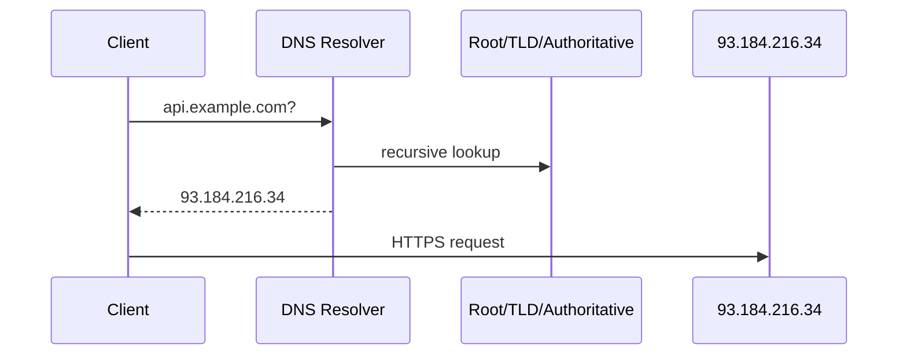
↳ الفخ: الـ DNS lookup ممكن يكون bottleneck خفي — عشان كده بيتـ cache على كذا طبقة (OS, resolver, browser).

### 13. الفرق بين A record و CNAME و MX؟
**A**: بيربط domain بـ IPv4. **AAAA**: بيربطه بـ IPv6. **CNAME**: بيربط domain بـ domain تاني (alias). **MX**: بيحدد mail servers للـ domain.
↳ الاستخدام العملي: `A` للـ APIs، `CNAME` للـ CDNs (`cdn.example.com → xxx.cloudfront.net`).

### 14. TTL في الـ DNS معناه إيه؟
Time-To-Live — كام ثانية الـ record يتـ cache قبل ما يتسأل تاني. TTL قليل = تغيير سريع لكن حمل أعلى على الـ DNS. TTL كبير = العكس.
↳ فخ عملي: قبل تغيير IP، قلّل الـ TTL بأيام عشان الـ cached القديم يخلص بسرعة يوم النقل.

### 15. TCP vs UDP — الفرق؟
| | TCP | UDP |
|---|---|---|
| Connection | connection-oriented (handshake) | connectionless |
| Reliability | مضمون (retransmit, order) | بدون ضمان |
| Speed | أبطأ (overhead) | أسرع |
| Use cases | HTTP, DB, SSH | DNS, video/voice, gaming |
↳ في الـ backend: **HTTP فوق TCP دايماً** (لحد HTTP/3 اللي بيبني على UDP). قواعد البيانات كلها TCP.

### 16. إيه الـ TCP handshake؟
3 خطوات قبل ما البيانات تبدأ: **SYN** (client يقول "عايز أتكلم") → **SYN-ACK** (server يقول "تمام") → **ACK** (client يأكد).
↳ ده overhead ثابت في كل connection جديد — سبب أهمية **keep-alive** والـ connection pooling.

### 17. إيه الفرق بين HTTP و HTTPS؟
HTTPS = HTTP فوق **TLS** (تشفير). بيضمن: **confidentiality** (محدش يقرا)، **integrity** (محدش يعدّل)، **authenticity** (السيرفر هو اللي بيدّعي).
↳ الفخ: HTTPS مش بس تشفير — بيثبت هوية السيرفر عبر الـ certificate.

### 18. إيه الـ TLS handshake؟ (بالمختصر)
بعد الـ TCP handshake: الـ client والـ server بيتفقوا على cipher suite، السيرفر بيبعت certificate، الـ client بيتحقق منها، ويتفقوا على مفتاح تشفير مشترك.
↳ overhead إضافي — عشان كده الـ **TLS session resumption** و**HTTP/2** مهمين للأداء.

### 19. إيه الـ Certificate والـ CA؟
Certificate = ملف بيثبت إن الـ domain ده فعلاً بتاع مين، موقّع من **Certificate Authority (CA)** موثوقة (Let's Encrypt, DigiCert). المتصفح بيثق في CAs محددة مسبقاً.
↳ فخ عملي: certificate منتهي = "connection not secure" — لازم renewal تلقائي (Let's Encrypt بيعمل ده بسهولة).

### 20. إيه الـ WebSockets وليه بنستخدمها؟
بروتوكول بيسمح بـ **اتصال ثنائي الاتجاه دائم** بين client و server (بدل request/response). بيبدأ كـ HTTP بعدين "upgrade" لـ WebSocket.
```js
// server pushes without client asking every time
ws.on('connection', (socket) => {
    socket.send('welcome');                       // server-initiated message
    socket.on('message', (msg) => { /* ... */ });
});
```
↳ الاستخدامات: chat, live updates, real-time gaming, collaborative editing.

### 21. WebSockets vs Server-Sent Events (SSE) vs Long Polling؟
| | الاتجاه | تعقيد | استخدام |
|---|---|---|---|
| Long Polling | client بيسأل ويستنى response | بسيط | fallback قديم |
| SSE | server → client (one-way) | بسيط، فوق HTTP | notifications, live feed |
| WebSockets | ثنائي الاتجاه | معقّد نسبياً | chat, gaming |
↳ الفخ: مش كل real-time محتاج WebSockets — لو الـ server بس بيدفع للـ client، SSE أبسط بكتير.

### 22. HTTP/1.1 vs HTTP/2 vs HTTP/3 — الفروق؟
- **HTTP/1.1**: request واحد لكل connection في اللحظة → **head-of-line blocking**. الحل القديم: كذا connection متوازي.
- **HTTP/2**: **multiplexing** — كذا request متوازي على connection واحد، header compression، server push.
- **HTTP/3**: نفس فوايد HTTP/2 لكن فوق **QUIC (UDP)** بدل TCP — بيحل head-of-line blocking على مستوى النقل نفسه.
↳ الفخ: HTTP/2 حلّ HoL blocking في التطبيق، بس TCP لسه بيسبب HoL blocking في النقل — HTTP/3 حلّها.

### 23. ليه HTTP/3 اختار UDP بدل TCP؟
لأن TCP بيضمن الترتيب على مستوى الـ connection كله، فلو packet واحد ضاع، كل الـ streams بتستنى — head-of-line blocking. UDP مفيهوش الضمان ده، فـ QUIC (فوق UDP) بيدير الترتيب per-stream، فضياع packet في stream ميأثرش على الباقي.
↳ ده يبيّن إنك فاهم "ليه" مش بس "إيه".

---

# القسم 3 — HTTP بعمق (Q24–38)

### 24. إيه أشهر HTTP methods وإيه الفرق بينها؟
**GET** (قراءة، آمن، idempotent) · **POST** (إنشاء، مش idempotent) · **PUT** (استبدال كامل، idempotent) · **PATCH** (تعديل جزئي، مش idempotent بالضرورة) · **DELETE** (حذف، idempotent).
↳ الفخ: "safe" ≠ "idempotent". GET safe و idempotent. DELETE مش safe بس idempotent.

### 25. Idempotency — يعني إيه؟
تنفيذ نفس الـ request كذا مرة يدّي نفس النتيجة زي مرة واحدة. مهم للـ **retries** — لو الشبكة فصلت، تقدر تعيد الـ request بأمان.
```
GET /users/5        → idempotent (نفس النتيجة)
DELETE /users/5     → idempotent (بعد أول مرة، اليوزر مش موجود)
POST /users         → مش idempotent (كل مرة يوزر جديد)
```
↳ الفخ العملي: عشان تخلي POST idempotent، ضيف **idempotency key** في الـ header (Stripe بيعمل كده للـ payments).

### 26. Safe methods — يعني إيه؟
الـ methods اللي **مبتغيّرش state** على الـ server (GET, HEAD, OPTIONS). المفروض تقدر تنفّذها بلا قلق (proxies بتـ cache-ها، bots بتـ crawl-ها).
↳ الفخ: لو GET بتاعك بيغيّر state (زي `/logout?...`)، ده انتهاك للـ HTTP spec وبيسبب باجات (prefetching بيسجّل خروج المستخدم).

### 27. إيه هي عائلات الـ HTTP status codes؟
- **1xx**: informational (نادر).
- **2xx**: success (200 OK, 201 Created, 204 No Content).
- **3xx**: redirection (301 permanent, 302 temporary, 304 Not Modified).
- **4xx**: client error (400, 401, 403, 404, 409, 422, 429).
- **5xx**: server error (500, 502, 503, 504).
↳ الفخ: **200 لكل حاجة** anti-pattern شائع — الـ status code جزء من الـ API contract.

### 28. الفرق بين 401 و 403؟
**401 Unauthorized**: مش عارف مين أنت (مفيش token أو token غلط). **403 Forbidden**: عارفك، بس مش مسموحلك تعمل الحاجة دي.
↳ الجملة: "401 = who are you؟ · 403 = I know you, but no."

### 29. الفرق بين 502, 503, 504؟
- **502 Bad Gateway**: أنا reverse proxy، الـ upstream رجّعلي رد باطل.
- **503 Service Unavailable**: أنا نفسي مش قادر أخدمك دلوقتي (maintenance/overload).
- **504 Gateway Timeout**: أنا reverse proxy، الـ upstream ماردّش عليّ في الوقت المحدد.
↳ في الإنتاج: 502 و 504 غالباً مشاكل الـ upstream (app crashed / slow). 503 غالباً anti-overload.

### 30. إيه الفرق بين 301 و 302؟
**301 Permanent**: انقل بشكل دائم (المتصفحات والـ SEO بتحدّث الروابط). **302 Temporary / 307**: انقل مؤقتاً بس (الرابط الأصلي فضل صالح).
↳ الفخ: 301 بيتـ cache بقوة — لو غلطت وحطيته، صعب الرجوع.

### 31. إيه الـ HTTP headers الشائعة اللي لازم تعرفها؟
`Content-Type` (نوع الـ body) · `Authorization` (auth token) · `Accept` (الأنواع اللي الـ client بيقبلها) · `Cache-Control` (تعليمات الـ caching) · `Cookie` / `Set-Cookie` (state في المتصفح) · `Origin` / `Referer` (من فين جاي الـ request) · `X-Forwarded-For` (الـ IP الأصلي ورا proxy).
↳ الفخ العملي: `X-Forwarded-For` **مش موثوق** — أي حد يقدر يزوّره. اقرأه بس لو الـ proxy بتاعك بيحطه.

### 32. إيه الـ Cache-Control والـ ETag؟
- **`Cache-Control`**: تعليمات caching (`max-age=3600`, `no-cache`, `private`, `public`, `immutable`).
- **`ETag`**: بصمة على المحتوى. الـ client بيبعت `If-None-Match: <etag>` في الطلب التالي، السيرفر يرد **304 Not Modified** لو المحتوى مبيتغيّرش (بلا body → توفير bandwidth).
```
# first response
ETag: "abc123"
Cache-Control: max-age=60
# next request
If-None-Match: "abc123"    → 304 Not Modified, empty body
```
↳ الفخ: `no-cache` ≠ "متعملش cache" — دي معناها "اعمل cache بس اسأل قبل الاستخدام". `no-store` هي اللي بتمنع الـ caching تماماً.

### 33. إيه الـ CORS ومشكلته الرئيسية؟
**Cross-Origin Resource Sharing** — آلية أمان في المتصفح بتمنع صفحة من origin (`https://a.com`) من عمل requests لـ origin تاني (`https://api.b.com`) إلا لو الـ API صرّح بذلك عبر headers.
```js
// Express: allow specific origin
app.use((req, res, next) => {
    res.setHeader('Access-Control-Allow-Origin', 'https://a.com'); // explicit allow
    next();
});
```
↳ الفخ: **CORS مسؤولية السيرفر، مش الـ client**. المتصفح هو اللي بيفرضه، وبيتحقق من الـ headers اللي السيرفر بيبعتها.

### 34. إيه الـ Preflight request؟
قبل requests معينة (مش GET/HEAD/POST-simple)، المتصفح بيبعت request `OPTIONS` الأول عشان يتأكد إن الـ server هيسمح — لو الرد بيسمح، بيبعت الطلب الفعلي.
↳ الفخ الأدائي: كل request بيعمل preflight = مضاعفة الـ round-trips. الحل: `Access-Control-Max-Age` عشان المتصفح يـ cache نتيجة الـ preflight.

### 35. HTTP keep-alive — بيعمل إيه؟
بيسمح باستخدام نفس الـ TCP connection لكذا request متتالي، بدل ما تعمل handshake جديد لكل واحد. متعمل by default في HTTP/1.1.
↳ الفخ: بيوفّر latency كبير — بس محتاج تحديد timeout وconnection limits عشان مياكلش موارد.

### 36. إيه الفرق بين `Content-Type` و `Accept`؟
`Content-Type`: الـ **body** اللي أنا **باعته** نوعه إيه. `Accept`: أنا **بأقبل** أي أنواع في الرد.
```
Content-Type: application/json     # I'm sending JSON
Accept: application/json           # I want JSON back
```
↳ الفخ العملي: أخطاء 415 (Unsupported Media Type) و 406 (Not Acceptable) بتيجي من التلخبط بين الاتنين.

### 37. Cookies بشكل عام — إيه فايدتها في الـ backend؟
مخزن صغير على الـ client، الـ server بيبعتها بـ `Set-Cookie`، والمتصفح بيبعتها مع كل request للـ domain في `Cookie` header. أشهر استخدام: **session IDs** أو **auth tokens**.
```
Set-Cookie: sid=abc123; HttpOnly; Secure; SameSite=Strict; Max-Age=3600
```
↳ التفصيل الكامل في قسم Sessions & Auth (المرحلة 3).

### 38. الفرق بين `PUT` و `PATCH` في التصميم العملي؟
`PUT`: **استبدال كامل** — لو ما بعتش field، هيتشال. `PATCH`: **تعديل جزئي** — الـ fields اللي ما بعتش تفضل زي ما هي.
↳ الفخ: كتير من الـ APIs بتقول "PUT" وبتعمل PATCH فعلياً. الأصح تلتزم بالمعنى ولو مش هتعمل كده، ماتخدعش بالاسم.

---

# القسم 4 — Request Lifecycle كامل (Q39–50)

### 39. سيناريو: كتبت `https://api.example.com/users` في الـ browser وضغطت Enter. إيه اللي بيحصل step-by-step؟
(1) **DNS lookup** → IP. (2) **TCP handshake** (3-way). (3) **TLS handshake** (لو HTTPS). (4) **HTTP request** بيتبعت. (5) الـ request بيوصل لـ **load balancer / reverse proxy**. (6) بيتوجّه لـ **app server**. (7) الـ app بيعالج (middleware → route handler → DB/cache). (8) الـ **response** بيرجع بنفس الطريق. (9) الـ browser بيعرض/يستهلك.
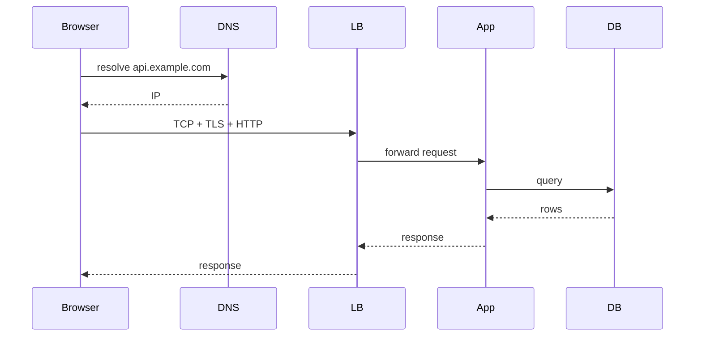
↳ ده أشهر سؤال إنترفيو backend على الإطلاق — احفظ الـ 9 خطوات نايم.

### 40. الـ request بيدخل الـ app server — إيه أول حاجة بتحصل؟
الـ **HTTP server** (Node's `http` module أو Express جوّه) بيقرا الـ request line + headers + body، ويحوّلها لـ object (`req`)، وبينشئ `res` object، ويسلّمهم للـ handler.
↳ في Express، ده وقت ما الـ middleware chain بيبدأ يشتغل.

### 41. إيه الـ Middleware Chain في Express؟
سلسلة functions كل واحدة بتشوف الـ request، تعدّل عليه لو محتاج، وتقرر تكمل (`next()`) أو توقف السلسلة (ترد response). ده تطبيق مباشر لـ **Chain of Responsibility**.
```js
app.use((req, res, next) => { req.startedAt = Date.now(); next(); }); // continue
app.use((req, res, next) => {
    if (!req.headers.authorization) return res.status(401).end();     // stop the chain
    next();
});
```
↳ الترتيب مهم جداً — logging قبل auth بيسجّل حتى الطلبات المرفوضة.

### 42. الـ route handler خلص شغله — إيه بعد كده؟
الـ handler بيعمل `res.send()` / `res.json()` / إلخ. الـ Express بيبني الـ HTTP response (status line + headers + body) ويبعتها على الـ socket. الـ middleware اللي عمل `next()` مش بتشتغل تاني إلا لو مسجّلة كـ error/response middleware.
↳ الفخ: أي حاجة `async` بعد `res.send()` هتشتغل بس مش هتغيّر الـ response — دي مصدر باجات دقيقة.

### 43. الـ Event Loop في Node.js — دوره في lifecycle؟
Node بيعالج I/O بشكل non-blocking عبر event loop: كل عملية async بتتسجّل بـ callback، والـ loop بيدور على مراحل (timers → I/O callbacks → poll → check → close). أي **blocking code** في handler بيوقّف كل الـ requests.
```js
// BAD: blocks the entire event loop
app.get('/hash', (req, res) => {
    const h = crypto.pbkdf2Sync(pwd, salt, 100000, 64, 'sha512'); // sync = blocks
    res.send(h);
});
// GOOD: async version keeps the loop free
app.get('/hash', (req, res) => {
    crypto.pbkdf2(pwd, salt, 100000, 64, 'sha512', (e, h) => res.send(h));
});
```
> 📌 **Node-specific:** ده جوهر ليه Node بيتفوّق في I/O-heavy workloads (APIs, proxies) وبيتضرّب في CPU-heavy (encryption, image processing).
↳ للـ CPU-bound: استخدم `worker_threads` أو خدمة منفصلة.

### 44. الـ DB query داخل الـ handler — إيه اللي بيحصل؟
الـ app بياخد connection من الـ **connection pool**، بيبعت الاستعلام عبر driver على TCP، الـ DB بيعالج، بيرجّع النتيجة، الـ connection بيرجع للـ pool.
↳ الفخ: لو الـ pool صغير والـ queries بطيئة، الطلبات بتبدأ تصف في queue → latency عالي وأحياناً timeouts.

### 45. الـ response بيرجع للـ client — بيمرّ إزاي؟
نفس الطريق بالعكس: من الـ app → الـ reverse proxy (ممكن يعمل compression/caching) → الشبكة → الـ client. الـ TCP connection ممكن يفضل مفتوح (keep-alive) للطلب التالي.
↳ الـ **buffer** في الـ proxy: لو الـ client بطيء، الـ proxy بيخزّن الرد ويحرّر الـ app connection بسرعة.

### 46. إيه الأماكن اللي ممكن الـ request يقف فيها في الطريق؟
**DNS lookup** (بطء الـ resolver) · **TCP handshake** (شبكة سيئة) · **TLS handshake** (certificate عملياً بتتحقق) · **LB queue** (عدد الـ backends قليل) · **App middleware** (auth check بطيء) · **DB pool** (كل الـ connections مستخدمة) · **DB query** (index مفقود) · **Response compression** · **Client network**.
↳ ده اللي بيخلي **الـ observability + trace IDs** ضرورية — عشان تعرف الـ latency راح لفين.

### 47. إيه الـ Backpressure في الـ backend؟
لما الـ producer أسرع من الـ consumer — الـ data بتتراكم. في Node streams مثلاً، لو الـ client بيقرا ببطء، الـ writer بيبطّئ.
```js
// pipe handles backpressure automatically
readableStream.pipe(writableStream);        // slows source when destination is slow
```
↳ الفخ: تجاهل الـ backpressure = memory leak + crashes تحت الحمل.

### 48. الـ Connection Pooling — إيه ودوره؟
بدل ما تفتح TCP connection جديدة للـ DB لكل query (مكلف)، بتحتفظ بـ pool من connections مفتوحة وبتوزّع الاستعلامات عليها.
```js
const pool = new Pool({ max: 20 });         // reuse up to 20 connections
const { rows } = await pool.query('SELECT ...'); // borrow → run → return
```
↳ الفخ: الـ pool size صغير جداً = طوابير. كبير جداً = ضغط على الـ DB. عادةً بيتعاير بالـ load testing.

### 49. لو الـ backend كله بيشتغل صح لكن الـ user بيشوف latency، الـ latency ممكن يجي من فين؟
**قبل الـ backend**: DNS، TCP، TLS، الشبكة، أقرب PoP للـ CDN. **جوّه الـ backend**: LB، middleware، DB، cache miss. **بعد الـ backend**: response size، compression، شبكة الـ client، render في المتصفح.
↳ الحل التشخيصي: **distributed tracing** — بتشوف كل خطوة كام mstook.

### 50. طب لو request واحد فشل بشكل غير متوقّع، إزاي أدبّج المشكلة؟
تتبّع الـ **trace ID / correlation ID** عبر الـ logs في كل الخدمات اللي مسّها. ده اللي بيربط الـ 5 logs المتفرقة في request واحد متكامل.
```
[traceId=abc-123] LB    received /users
[traceId=abc-123] App   auth OK, querying DB
[traceId=abc-123] DB    slow query 1200ms
[traceId=abc-123] App   returned 200 in 1250ms
```
↳ التفصيل الكامل في قسم Observability (المرحلة 4) — بس الفكرة هنا: **بلا trace ID، dبج microservices مستحيل**.

---

## ✅ Checkpoint — المرحلة 1

1. Stateless vs Stateful — وليه stateless بيتوسّع أفقياً
2. Sync/Async في Node وليه blocking كارثة على event loop
3. DNS: A/CNAME، TTL، ليه bottleneck خفي
4. TCP vs UDP وإمتى إيه · TCP handshake · TLS handshake
5. HTTP/1.1 → HTTP/2 → HTTP/3 (مشاكل head-of-line blocking)
6. HTTP methods + idempotency + safety
7. Status codes (401 vs 403، 502 vs 503 vs 504)
8. Cache-Control vs ETag · CORS + preflight
9. Request lifecycle كامل (9 خطوات من الـ URL للـ response)
10. Event loop + connection pooling + backpressure
11. Trace ID كمقدمة (التفصيل في المرحلة 4)

---

*المرحلة 2 جاية → Proxies (forward vs reverse) · Load Balancers (algorithms, L4/L7) · Caching بعمق (layers, invalidation, stampede) · Redis عملياً.*

---
---

# تراك 3 — Backend Engineering: المرحلة 2

## 🗺️ خريطة المرحلة 2

- **القسم 5 — Proxies** (Q51–60): forward vs reverse, TLS termination, API Gateway
- **القسم 6 — Load Balancers** (Q61–70): L4/L7, algorithms, sticky sessions, health checks
- **القسم 7 — Caching بعمق** (Q71–85): layers, invalidation, stampede, penetration
- **القسم 8 — Redis عملياً** (Q86–100): data structures, TTL, persistence, use cases

---

# القسم 5 — Proxies (Q51–60)

### 51. إيه الـ Proxy؟
Server وسيط بيقف بين client و server آخر، بيمرّر الـ requests بينهم. **بيغيّر** أو **بيراقب** أو **بيتحكم** في الترافيك في النص.
↳ في الـ backend، الـ proxies بتحل مشاكل الأداء، الأمان، والتحكم بلا لمس التطبيق نفسه.

### 52. Forward Proxy vs Reverse Proxy — الفرق الجوهري؟
**Forward proxy**: بيقف قدام **الـ clients** ويمثّلهم قدام الـ internet. **Reverse proxy**: بيقف قدام **الـ servers** ويمثّلهم قدام الـ clients.
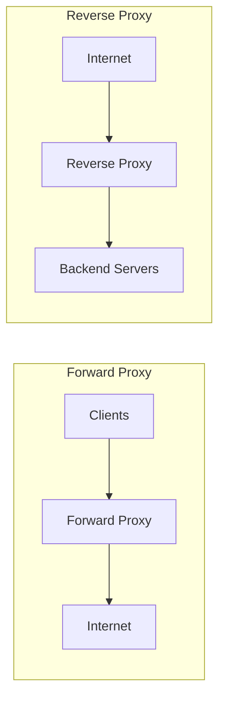
↳ الجملة السهلة: "Forward بيخبّي الـ clients، Reverse بيخبّي الـ servers."

### 53. أشهر استخدامات الـ Forward Proxy؟
تصفّح مقيّد (شركات/مدارس)، تجاوز حجب، caching للترافيك الصادر، إخفاء هوية الـ clients، فلترة المحتوى.
↳ في الـ backend، أنت غالباً بتتعامل مع **reverse proxies** — الـ forward بيخص الـ IT/networking.

### 54. أشهر استخدامات الـ Reverse Proxy؟
**Load balancing** · **TLS termination** (فك التشفير في مكان واحد) · **Caching** للاستجابات · **Compression** · **Rate limiting** · **إخفاء بنية الـ backend** · **Path-based routing** (`/api` → service A، `/auth` → service B).
```nginx
# nginx as reverse proxy with TLS termination
server {
    listen 443 ssl;
    ssl_certificate /etc/ssl/cert.pem;    # decrypt here, forward plain HTTP
    location /api {
        proxy_pass http://api_backend;    # forward to upstream
        proxy_set_header X-Forwarded-For $remote_addr;
    }
}
```
↳ أشهر الأدوات: **nginx**, **HAProxy**, **Envoy**, **Traefik**، والـ cloud LBs.

### 55. إيه الـ TLS Termination؟ وليه بنعملها في الـ reverse proxy؟
فك تشفير HTTPS في الـ proxy، والترافيك الداخلي بين الـ proxy والـ backend بيبقى HTTP عادي (على شبكة موثوقة).
**الفايدة**: (1) الـ backend مش بيصرف CPU على التشفير. (2) certificate management في مكان واحد. (3) الـ proxy بيقدر يقرأ الـ headers ويعمل routing/caching.
↳ الفخ: الشبكة الداخلية لازم تكون آمنة (VPC/private network)، وإلا الترافيك الحساس بيبقى مكشوف.

### 56. Proxy vs Reverse Proxy vs API Gateway — الفرق؟
- **Proxy** (forward): بيمثّل الـ clients.
- **Reverse proxy**: بيمثّل الـ servers، وبيوفّر خصائص عامة (LB, TLS, caching).
- **API Gateway**: reverse proxy **متخصّص للـ APIs** — يضيف auth، rate limiting per-user، request transformation، aggregation، quotas.
↳ الجملة: "الـ API Gateway = reverse proxy فيه ذكاء business-level."

### 57. الفرق بين reverse proxy و load balancer؟
كل load balancer هو reverse proxy، لكن مش كل reverse proxy load balancer. الـ LB **متخصص** في توزيع الحمل. الـ reverse proxy ممكن يعمل ده وحاجات تانية (caching, TLS, routing).
↳ في الأدوات الحديثة (nginx, HAProxy, Envoy)، الفرق نظري — نفس الأداة بتعمل الاتنين.

### 58. الـ Reverse Proxy وحماية الـ backend — إزاي؟
بيمثّل نقطة دخول واحدة، فبتقدر تركّز فيها: **rate limiting** ضد DDoS، **WAF** (Web Application Firewall)، **IP whitelisting/blacklisting**، **request size limits**، وإخفاء تفاصيل الـ backend (النسخة، الـ framework، الـ IPs الحقيقية).
↳ فخ عملي: من غير reverse proxy، تعرّض الـ app server مباشرة للـ internet = سطح هجوم أوسع.

### 59. سيناريو: عندي 3 microservices ومكشوفة بـ IPs منفصلة. المشكلة والحل؟
المشاكل: الـ client لازم يعرف الـ 3 عناوين، CORS pain، بلا نقطة مركزية للـ auth/rate-limit، certificate management مبعثر.
الحل: **reverse proxy / API gateway** واحد على `api.example.com`، ويمرّر داخلياً حسب الـ path.
```nginx
location /users  { proxy_pass http://user_service;  }
location /orders { proxy_pass http://order_service; }
location /notif  { proxy_pass http://notif_service; }
```
↳ ده أساس الـ **BFF pattern** (Backend For Frontend) والـ API Gateway.

### 60. الـ `X-Forwarded-For` header — ليه مهم في وجود reverse proxy؟
لأن الـ backend شايف الـ IP بتاع الـ proxy، مش الـ client الأصلي. الـ proxy بيضيف الـ IP الأصلي في `X-Forwarded-For` عشان الـ backend يعرفه (للـ logging, rate limiting, geolocation).
```
X-Forwarded-For: 203.0.113.5, 10.0.0.1
                 ^^^^ real client   ^^^^ intermediate proxy
```
↳ الفخ الأمني: **متثقش في الـ header ده إلا لو الـ proxy بتاعك بيحطه**. أي client يقدر يزوّره في request مباشر.

---

# القسم 6 — Load Balancers (Q61–70)

### 61. إيه الـ Load Balancer وليه محتاجه؟
Server بيوزّع الطلبات الواردة على مجموعة backends. **الفايدة**: (1) horizontal scaling — تضيف servers، (2) high availability — لو server وقع، الترافيك بيروح للباقيين، (3) rolling deployments بلا downtime.
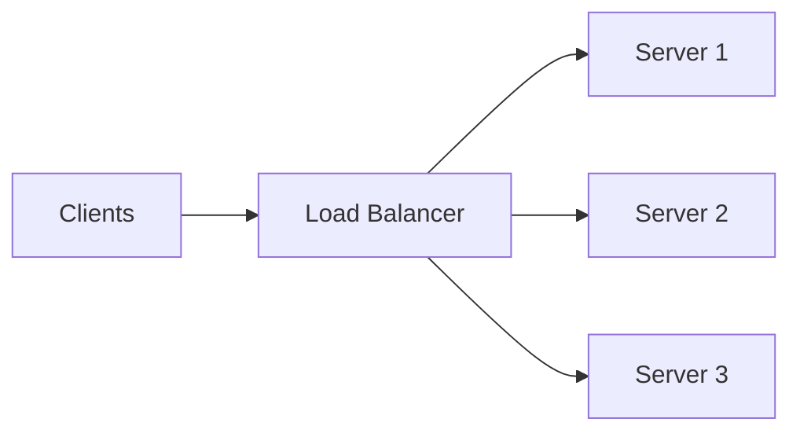
↳ من غير LB، أي server = single point of failure.

### 62. Layer 4 vs Layer 7 Load Balancing — الفرق؟
**L4 (Transport)**: يوزّع بناءً على IP/port بلا ما يقرأ محتوى الـ request. أسرع، أرخص، بس أقل ذكاءً.
**L7 (Application)**: يقرأ الـ HTTP request كامل — يقدر يوزّع حسب path، header، cookie، method. أذكى، بس overhead أعلى.
↳ عملياً: L4 للأداء الخام (gaming servers, TCP-based)، L7 للـ APIs (routing حسب path، sticky sessions، header-based logic).

### 63. أشهر خوارزميات الـ Load Balancing؟
| الخوارزمية | إزاي بتشتغل | مناسبة لـ |
|---|---|---|
| **Round Robin** | بالدور على السيرفرات | أحمال متجانسة |
| **Weighted Round Robin** | كل سيرفر ليه وزن | سيرفرات بقدرات مختلفة |
| **Least Connections** | يوزّع على الأقل مشغولية | requests بأوقات متفاوتة |
| **IP Hash** | نفس الـ IP دايماً لنفس السيرفر | sticky by IP |
| **Least Response Time** | الأسرع دلوقتي | مهم للـ latency |
↳ الفخ: Round Robin بسيط بس مبيراعيش الحمل الفعلي — server ضعيف ممكن يغرق.

### 64. إيه الـ Sticky Sessions (Session Affinity)؟
الـ LB يضمن إن الـ client يوصل لنفس الـ server كل مرة. بيتحقق عبر cookie من الـ LB أو IP hash.
```
LB sets: Set-Cookie: srv=backend-2      # subsequent requests go to backend-2
```
↳ الفخ الأكبر: **بيكسر الـ horizontal scaling والـ high availability**. لو الـ server وقع، الـ users بتاعته بيفقدوا الـ session. الحل الحديث: sessions في Redis مشتركة → sticky غير مطلوبة.

### 65. إيه الـ Health Check؟
الـ LB بيسأل كل backend كل فترة "أنت لسه شغال؟" (طلب HTTP بسيط لـ `/health`). لو الرد فشل مرات معيّنة، الـ LB بيشيله من الـ pool.
```js
// simple health endpoint
app.get('/health', (req, res) => {
    if (isDbReachable()) return res.status(200).json({ ok: true });
    res.status(503).json({ ok: false });        // LB will drop this instance
});
```
↳ الفخ: `/health` لازم يفحص الاعتماديات الحرجة (DB, cache). health check ساذج بيرجّع 200 دايماً = flappy false-positives.

### 66. الفرق بين Liveness و Readiness checks؟
- **Liveness**: "لسه حي؟" — لو لأ، أعد التشغيل (restart).
- **Readiness**: "جاهز أستقبل ترافيك؟" — لو لأ، اطلعني من الـ LB بس ماتـ restart-نيش.
↳ مثال: app بيحمّل بيانات في الـ startup — hoي (`liveness=OK`) بس مش جاهز (`readiness=FAIL`) لحد ما يخلص.

### 67. Horizontal vs Vertical Scaling؟
**Vertical (scale up)**: قوّي السيرفر (CPU/RAM أكبر). سقفه محدود، وتوقف عشان تعمله.
**Horizontal (scale out)**: ضيف سيرفرات موازية. سقفه شبه غير محدود، بيحتاج LB وstateless design.
↳ القاعدة الحديثة: **horizontal دايماً أفضل** — أرخص، أمرن، وresilient. الـ vertical للحاجات اللي مبتتوسّعش أفقياً (بعض قواعد البيانات).

### 68. Active-Active vs Active-Passive؟
- **Active-Active**: كل السيرفرات بتشتغل وبتستقبل ترافيك. توزيع الحمل + redundancy.
- **Active-Passive**: واحد نشط، الباقي standby ينشط لو الأصلي وقع (failover). موارد مهدرة نسبياً لكن أبسط.
↳ Active-Active الافتراضي في الـ APIs الحديثة. Active-Passive بيظهر في قواعد البيانات (primary/replica).

### 69. سيناريو: الـ LB بيوزّع Round Robin وسيرفر واحد بيغرق دايماً. ليه ممكن؟
سببين شائعين: (1) الـ requests بأوقات معالجة متفاوتة (Round Robin مبيراعيش)، (2) sticky sessions بتوجّه client ثقيل لنفس السيرفر دايماً.
الحل: بدّل لـ **Least Connections** أو **Least Response Time**، وشوف الـ session strategy.
↳ الفخ: مش دايماً السيرفر نفسه ضعيف — الخوارزمية هي المشكلة.

### 70. سيناريو: عايز أعمل blue-green deployment بلا downtime. إزاي الـ LB بيساعد؟
عندك بيئتين متطابقتين (blue شغالة، green جديدة). تنشر الجديد على green، تختبر، وبعدين تحوّل الـ LB يوجّه الترافيك لـ green بدل blue. لو حصلت مشكلة، ترجّع للـ blue بلحظة.
↳ بديل خفيف: **canary deployment** — الـ LB يوجّه 5% للجديد، وتزوّد تدريجياً.

---

# القسم 7 — Caching بعمق (Q71–85)

### 71. إيه الـ Caching وليه؟
تخزين مؤقت لبيانات مطلوبة كتير في مكان أسرع من مصدرها الأصلي. الفايدة: **latency أقل + حمل أقل + تكلفة أقل**.
↳ الجملة: "أسرع query هي اللي مش بتحصل — الـ cache بيحقق ده."

### 72. طبقات الـ Caching في backend حديث؟
كل طبقة بتخبّي الطلبات عن اللي بعدها:
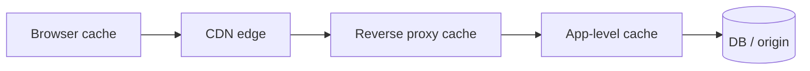
كل طبقة معناها: **الطلب مبيوصلش للـ DB إلا لو الكل عجز**.
↳ الأسئلة العملية بتفرّق بين الطبقات دي (سؤال HTTP `Cache-Control` = browser، Redis = app-level).

### 73. Cache Hit vs Cache Miss؟
**Hit**: البيانات في الـ cache → رد سريع. **Miss**: مش موجودة → روح للمصدر، خزّن، ورد.
مقياس الجودة: **hit rate** (نسبة الـ hits من الإجمالي). Hit rate 90%+ عادةً هدف طيب.
↳ الفخ: hit rate منخفض = الـ cache مش بيفيد، وممكن يبقى overhead.

### 74. Cache-Aside (Lazy Loading) — إيه هي؟
النمط الأشهر: التطبيق بيدير الـ cache بنفسه.
```js
async function getUser(id) {
    const cached = await redis.get(`user:${id}`);
    if (cached) return JSON.parse(cached);              // cache hit
    const user = await db.query('SELECT ...', [id]);     // miss → fetch
    await redis.set(`user:${id}`, JSON.stringify(user), 'EX', 300); // populate
    return user;
}
```
↳ الفخ: أول request بعد miss بيبقى بطيء. لو كتير طلبات جت في نفس اللحظة → **cache stampede** (سؤال 82).

### 75. Write-Through vs Write-Back vs Write-Around؟
- **Write-Through**: اكتب على الـ cache والـ DB في نفس الوقت. متسق، بس أبطأ.
- **Write-Back**: اكتب على الـ cache بس، والـ cache بيكتب على الـ DB لاحقاً. أسرع، خطر فقد بيانات لو الـ cache مات.
- **Write-Around**: اكتب على الـ DB مباشرة، الـ cache بيتحدّث عند القراءة. الأبسط، بس أول قراءة بعد الكتابة miss.
↳ الاختيار حسب الأولوية: consistency (through) vs speed (back) vs simplicity (around).

### 76. أنماط Cache Invalidation؟
- **TTL** (Time-To-Live): البيانات تنتهي تلقائياً بعد فترة. أبسط وأشهر.
- **Explicit invalidation**: التطبيق يمسح المفاتيح المتأثرة عند الكتابة.
- **Event-based**: تغيير في DB → event → invalidate cache (بـ CDC/triggers).
```js
await db.updateUser(id, data);
await redis.del(`user:${id}`);              // explicit invalidation on write
```
↳ المقولة الشهيرة: *"There are only two hard things in Computer Science: cache invalidation and naming things."*

### 77. Eviction Policies — إيه هي؟
لما الـ cache بيمتلي، أنهي key اللي يتشال؟
- **LRU (Least Recently Used)**: الأقل استخداماً حديثاً. الأشهر.
- **LFU (Least Frequently Used)**: الأقل تكراراً.
- **FIFO**: الأقدم يخرج.
- **TTL-based**: الأقرب لانتهاء صلاحيته.
↳ Redis بيدعم كل دي (`maxmemory-policy`).

### 78. Cache Stampede (Thundering Herd) — إيه هي؟
key منتهي/مش موجود، فجأة آلاف الطلبات بتشتغل على نفسه في نفس اللحظة → كلهم miss → كلهم بيروحوا DB → DB بيغرق.
↳ الحل جاي في السؤال الجاي.

### 79. طب إزاي بنحل الـ Cache Stampede؟
1. **Locking / Single-flight**: أول request بس يروح DB، الباقي يستنى نتيجته.
2. **Probabilistic early expiration**: كل request عنده احتمال صغير يجدّد الـ cache قبل انتهاء الـ TTL.
3. **Stale-while-revalidate**: قدّم القيمة القديمة وحدّث في الخلفية.
```js
// simplified single-flight with Redis lock
const lock = await redis.set(`lock:${key}`, '1', 'NX', 'EX', 5);
if (lock) {
    const value = await db.query(...);
    await redis.set(key, JSON.stringify(value), 'EX', 300);
    await redis.del(`lock:${key}`);
} else {
    // wait briefly and read again
}
```
↳ الفخ: cache stampede بيظهر تحت الحمل بس، فبيتلاقى في الإنتاج مش في الـ dev.

### 80. Cache Penetration — إيه هي؟ (مختلفة عن stampede)
الطلبات بتسأل عن keys **مش موجودة أصلاً** — miss دايم → كل request بيروح DB.
مثال: هجوم بأرقام IDs عشوائية.
**الحل**: خزّن "null" في الـ cache بـ TTL قصير للـ keys المفقودة، أو استخدم **Bloom filter** لفلترة المفقود قبل ما يوصل DB.

### 81. Cache Coherence — يعني إيه؟
لما فيه كذا نسخة للبيانات (DB + Redis + CDN + browser)، ازاي نضمن إنهم متسقين؟ صعب جداً في التوزيع الكامل — عشان كده الـ **TTL** هو الحل العملي (اقبل عدم اتساق مؤقت).
↳ ده تطبيق لـ **eventual consistency**.

### 82. Local (In-memory) Cache vs Distributed Cache (Redis)؟
| | Local (in-process) | Distributed (Redis) |
|---|---|---|
| السرعة | أسرع (لا شبكة) | أبطأ شوية (شبكة) |
| الحجم | محدود بذاكرة الـ instance | كبير جداً |
| المشاركة | كل instance ليه نسخته | كل الـ instances يشوفوا نفس البيانات |
| الاتساق | صعب (كل instance مختلف) | مركزي |
↳ الاستخدام العملي: local للـ hot data الصغيرة (config, feature flags) + Redis للـ shared state.

### 83. الـ CDN — إيه هو وإيه دوره في الـ caching؟
Content Delivery Network — شبكة سيرفرات موزّعة جغرافياً بتـ cache المحتوى الثابت (صور, JS, CSS) قرب الـ users.
↳ في الـ backend الحديث: CDNs الحديثة (Cloudflare, Fastly) تقدر تـ cache API responses كمان (edge caching).

### 84. سيناريو: صفحة home page بتضرب DB بألف query كل ثانية. الحل؟
أضف طبقة **cache-aside** بـ Redis: أول request يجيب من DB ويخزّن، الباقي يقرا من Redis. TTL معقول (30s-5min حسب freshness المطلوبة).
```js
async function getHomePage() {
    const cached = await redis.get('home:v1');
    if (cached) return JSON.parse(cached);
    const data = await computeExpensiveHomePage();      // 200ms
    await redis.set('home:v1', JSON.stringify(data), 'EX', 60);
    return data;
}
```
↳ الفخ: cache stampede محتمل — طبّق single-flight لو الترافيك عالي.

### 85. سيناريو: بيانات المستخدم بتـ cache وبعد التعديل بتفضل قديمة. الحل؟
**Explicit invalidation** عند الكتابة: كل update بيمسح الـ key المرتبط. أو **write-through** (اكتب على الاتنين).
```js
await db.updateUser(id, changes);
await redis.del(`user:${id}`);              // invalidate stale copy
```
↳ الفخ الشائع: نسيان الـ invalidation في مسار من مسارات الكتابة = "bugs بتظهر يوم" لحد ما TTL يعدي.

---

# القسم 8 — Redis عملياً (Q86–100)

### 86. إيه الـ Redis؟
in-memory data store مفتوح المصدر، **key-value** بس بـ **data structures** غنية (strings, hashes, lists, sets, sorted sets, streams). سريع جداً (~100k+ ops/sec).
↳ الفخ: Redis مش بس cache — ده full-fledged data store بيستخدم كـ queue، message broker، rate limiter، session store، leaderboard، إلخ.

### 87. أشهر Redis data structures واستخداماتها؟
| النوع | مثال استخدام |
|---|---|
| **String** | cache، counters، config |
| **Hash** | user object (`user:5 → {name, email, age}`) |
| **List** | queue بسيطة (LPUSH/RPOP)، feed |
| **Set** | unique items (visitor IPs, tags) |
| **Sorted Set** | leaderboard، rate limiting بالوقت |
| **Stream** | event log، Kafka-lite |
| **Bitmap / HyperLogLog** | analytics فعّالة (unique visitors) |
↳ اختيار الـ structure المناسب أهم من الاستخدام نفسه — Redis بيدّي performance مختلف حسب النوع.

### 88. INCR / DECR في Redis — ليه أهميته؟
عمليات atomic على counters. مثالية للـ rate limiting، counters real-time، limits.
```js
const count = await redis.incr(`rate:${userId}:${minute}`);
await redis.expire(`rate:${userId}:${minute}`, 60);
if (count > 100) throw new Error('rate limit exceeded');
```
↳ الأتومية بتضمن إن حتى تحت الحمل، مفيش double counting.

### 89. TTL في Redis — إزاي بيشتغل؟
كل key ممكن يكون له وقت انتهاء (`EX`, `PX`). Redis بيمسحه تلقائياً. مهم جداً للـ caching والـ sessions.
```
SET session:xyz "data" EX 3600      # expires in 1 hour
```
↳ الفخ: من غير TTL، الـ keys بتتراكم → memory leak.

### 90. Redis Pub/Sub — إزاي بيشتغل؟
publishers ينشروا على channels، subscribers يستقبلوا فوراً. **Fire-and-forget** — لو مفيش subscriber وقت النشر، الرسالة تضيع.
```js
// subscriber
sub.subscribe('order-events');
sub.on('message', (channel, msg) => console.log(msg));
// publisher
pub.publish('order-events', JSON.stringify({ id: 1 }));
```
↳ الفخ: مش بديل عن queue حقيقية — لا persistence، لا acknowledgments، لا retries.

### 91. Redis Streams — إيه الفرق عن Pub/Sub؟
Streams **بتحتفظ بالرسائل** (append-only log)، بتدعم **consumer groups** (زي Kafka)، والـ consumers يقدروا يقرأوا من نقطة معيّنة أو من الأول.
↳ للـ event streaming والـ queues الجادة، Streams أفضل بكتير من Pub/Sub.

### 92. Redis Persistence — RDB vs AOF؟
- **RDB (snapshot)**: صورة كاملة كل فترة. سريعة للـ restore، بس ممكن تفقد آخر ثواني.
- **AOF (append-only file)**: كل عملية بتتكتب في log. أدق (فقد أقل)، بس أثقل.
- **Combined**: الاتنين مع بعض (الأنصح للإنتاج).
↳ الفخ: Redis in-memory بس **مش cache بحت** — عنده persistence لو ضبطته.

### 93. Redis Cluster vs Sentinel؟
- **Sentinel**: high availability. primary/replicas، وSentinels بيراقبوا ويعملوا failover تلقائي.
- **Cluster**: horizontal scaling. البيانات مقسّمة (sharded) على nodes، وكل node مسؤول عن slots معيّنة (0–16383).
↳ Sentinel لو محتاج HA بس، Cluster لو محتاج scale بيانات أكبر من RAM node واحد.

### 94. Redis عملياً كـ session store — ليه؟
سريع، بيدعم TTL طبيعياً، ومشترك بين كل الـ app instances (stateless architecture). وبيغني عن الـ sticky sessions.
```js
// session middleware backed by Redis
app.use(session({
    store: new RedisStore({ client: redis }),
    secret: 'x',
    cookie: { maxAge: 3600000 }
}));
```
↳ التفصيل في قسم Sessions & Auth (المرحلة 3).

### 95. Redis كـ rate limiter — إزاي؟
الأسلوب الأبسط: **fixed window** بـ `INCR + EXPIRE`.
```js
async function allow(userId) {
    const key = `rate:${userId}:${Math.floor(Date.now() / 60000)}`;
    const count = await redis.incr(key);
    if (count === 1) await redis.expire(key, 60);
    return count <= 100;                    // 100 req/min
}
```
↳ الفخ: fixed window مبيمنعش burst على حد الفواصل. الأدق: **sliding window** بـ sorted set.

### 96. Redis كـ distributed lock — إزاي؟
```js
// simplified: SET NX (only if not exists) + EX (TTL to avoid dead locks)
const acquired = await redis.set('lock:resource', requestId, 'NX', 'EX', 10);
if (acquired) {
    try { /* critical section */ } finally { await redis.del('lock:resource'); }
}
```
↳ للـ distributed locking الجاد، فيه algorithm اسمه **Redlock** (عبر Cluster) — بس فيه جدل حوله، وأدوات زي **ZooKeeper**/**etcd** غالباً أفضل للـ correctness.

### 97. Redis atomic operations — يعني إيه؟
كل command في Redis atomic بطبيعته. للعمليات المتعددة، فيه **MULTI/EXEC** (transactions) و**Lua scripts** (نفّذ كذا خطوة atomically).
```
MULTI
INCR counter
INCR total
EXEC                    # both run atomically
```
↳ الفخ: Redis transactions **مبتعمليش rollback** لو الوسط فشل — بس بتنفّذ الكل بلا تداخل.

### 98. Redis واستهلاك الذاكرة — إزاي أتحكم؟
- ضع `maxmemory` وسياسة eviction (`allkeys-lru` مثلاً).
- استخدم **TTL** لكل key ممكن.
- اختار data structure كفء (Hashes مضغوطة لبيانات صغيرة).
- راقب عبر `INFO memory` و `MEMORY USAGE key`.
↳ الفخ: Redis بيكرش الـ process لو الذاكرة خلصت وسياسة الـ eviction `noeviction` (الافتراضية أحياناً).

### 99. سيناريو: بستخدم Redis كـ cache، وفجأة الـ latency ارتفعت جداً. مصادر شائعة؟
(1) **Big keys** (query على sorted set فيه ملايين العناصر). (2) **Slow commands** (`KEYS *` في الإنتاج = ينوّم Redis). (3) **Network** بين app و Redis. (4) **Memory pressure** → swapping. (5) **Connection pool** صغير.
↳ التشخيص: `SLOWLOG GET`, `INFO commandstats`, `MONITOR` بحذر.

### 100. سيناريو: عايز أعمل leaderboard لأعلى 100 مستخدم. أنهي Redis structure؟
**Sorted Set** — كل مستخدم score، والـ commands `ZADD` و `ZREVRANGE` بتديك الترتيب فوراً بلا سورت خارجي.
```
ZADD leaderboard 1500 user:5
ZADD leaderboard 2300 user:9
ZREVRANGE leaderboard 0 99 WITHSCORES     # top 100
```
↳ ده أشهر use case بيبيّن قوة Redis — عملية بتاخد ms بدل query معقّد على DB.

---

## ✅ Checkpoint — المرحلة 2

1. Forward vs Reverse Proxy · Reverse Proxy vs API Gateway
2. TLS termination في الـ proxy · X-Forwarded-For ومخاطره
3. L4 vs L7 · خوارزميات LB · sticky sessions ومشاكلها
4. Liveness vs Readiness · Horizontal vs Vertical · Blue-Green vs Canary
5. طبقات الـ caching (browser → CDN → RP → app → DB)
6. Cache-aside · Write-through/back/around · Invalidation
7. Cache stampede + الحلول (single-flight, early expiration)
8. Cache penetration، Bloom filters
9. Redis data structures (متى إيه)، INCR/TTL/Streams vs Pub/Sub
10. Redis كـ rate limiter · session store · distributed lock
11. RDB vs AOF · Cluster vs Sentinel · Big keys وslow commands

---

*المرحلة 3 جاية → Sessions & Auth (cookies, JWT, OAuth2) · APIs (REST/GraphQL/gRPC/API Gateway/pagination/rate limiting) · Message Queues (Kafka vs RabbitMQ, DLQ, idempotency) · Databases في الـ backend (pooling, N+1, transactions, sharding, replication).*

---
---

# تراك 3 — Backend Engineering: المرحلة 3

## 🗺️ خريطة المرحلة 3

- **القسم 9 — Sessions & Auth** (Q101–115): cookies, JWT, OAuth2, CSRF/XSS
- **القسم 10 — APIs & Communication** (Q116–130): REST/GraphQL/gRPC, API Gateway, pagination, rate limiting
- **القسم 11 — Message Queues & Async** (Q131–142): Kafka vs RabbitMQ, DLQ, idempotency
- **القسم 12 — Databases في الـ backend** (Q143–155): pooling, N+1, transactions, sharding, replication

---

# القسم 9 — Sessions & Auth (Q101–115)

### 101. إيه الفرق بين Authentication و Authorization؟
**Authentication (AuthN)**: مين أنت؟ (تسجيل دخول، التحقق من الهوية).
**Authorization (AuthZ)**: أنت مسموحلك تعمل إيه؟ (صلاحيات، roles).
↳ الجملة: "AuthN بيثبت مين، AuthZ بيقرر إيه." الاتنين مختلفين تماماً وبيتلخبطوا كتير.

### 102. إيه الـ Cookie؟
مخزن صغير على الـ browser بيتحط بـ `Set-Cookie` header من السيرفر، وبيتبعت تلقائياً في كل request للـ domain في `Cookie` header.
```
Set-Cookie: sid=abc123; HttpOnly; Secure; SameSite=Strict; Max-Age=3600; Path=/
```
↳ الفخ: الـ cookies بتاعت الـ subdomain، الـ path، والـ SameSite بتتحكم في متى بتتبعت — سوء ضبطها = ثغرات أمنية.

### 103. Cookie flags الأمنية — إيه فايدتها؟
- **`HttpOnly`**: JavaScript مبيقدرش يقرأها (بيحمي من XSS يسرق التوكن).
- **`Secure`**: تتبعت بس على HTTPS.
- **`SameSite=Strict/Lax/None`**: بيتحكم في إرسالها في الـ cross-site requests (حماية من CSRF).
- **`Max-Age` / `Expires`**: مدة الحياة.
↳ الفخ: `SameSite=None` **لازم** يبقى معاه `Secure`، وإلا المتصفح هيرفضها.

### 104. Session-based Auth — إزاي بيشتغل؟
1. المستخدم بيسجّل دخول.
2. السيرفر بينشئ **session** في storage (Redis/DB) بـ ID عشوائي.
3. السيرفر بيبعت الـ ID في cookie (`sid=abc`).
4. كل request بعد كده، المتصفح بيبعت الـ cookie، السيرفر بيقرا الـ ID ويجيب الـ session.
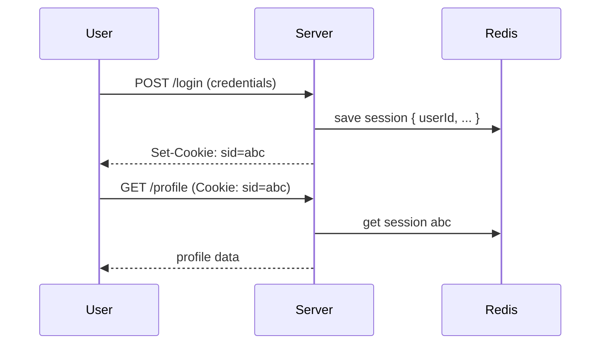
↳ ده stateful — السيرفر لازم يحتفظ بالـ sessions.

### 105. JWT (JSON Web Token) — إيه هو؟
Token موقّع فيه بيانات المستخدم نفسها، السيرفر مبيحتفظش بحاجة. مكوّن من 3 أجزاء مفصولة بنقط: `header.payload.signature` (base64 URL-encoded).
```
eyJhbGc...  .  eyJzdWIiOjEsImV4cCI6MTY5MjB9  .  X3sK2p...
   header              payload (claims)             signature
```
↳ السيرفر بيتحقق من التوقيع بس، مش محتاج DB lookup — stateless.

### 106. Session vs JWT — الفرق العملي؟
| | Session | JWT |
|---|---|---|
| State | stateful (server storage) | stateless (self-contained) |
| Revocation | فوري (امسح من الـ store) | صعبة (لازم blacklist) |
| Scaling | يحتاج store مشترك (Redis) | scales تلقائياً |
| Size | ID صغير في cookie | token أكبر في كل request |
| الأمان لو اتسرق | ألغيه فوراً | صالح لحد ما ينتهي |
↳ الاختيار: **sessions** لو محتاج revocation فوري، **JWT** لو الـ scaling الأولوية.

### 107. أشهر مشاكل JWT العملية؟
- **حجم كبير** بيتبعت في كل request → bandwidth.
- **مبيتلغيش** — لو اتسرق، صالح لحد انتهاء `exp`.
- الناس بتحط بيانات حسّاسة في الـ payload (وهو **مش مشفّر**، بس **موقّع** — أي حد يقدر يقرأه بـ base64 decode).
- الـ `alg: none` vulnerability لو الـ library ضعيفة.
↳ الحل الشائع لمشكلة الإلغاء: **refresh tokens** قصيرة + access tokens قصيرة.

### 108. Access Token vs Refresh Token — الفرق؟
- **Access token**: قصير العمر (5–15 دقيقة)، بيتبعت مع كل request، لو اتسرق ضرره محدود.
- **Refresh token**: طويل العمر (أيام/أسابيع)، بيتبعت بس لتجديد الـ access، متخزّن بحذر (HttpOnly cookie).
```
1. Login → { access: 15min, refresh: 30days }
2. Access expires → POST /refresh with refresh token → new access
3. Logout → invalidate refresh token in DB
```
↳ الفخ: الـ refresh token لازم يكون في DB / cache عشان تقدر تلغيه (بيرجّعك stateful جزئياً — والده مقبول).

### 109. OAuth 2.0 — إيه هو؟
Protocol للسماح لـ **app** يوصل لـ **resources** بتاعت user في service تاني، **بدون** ما يعرف الـ password. المستخدم بيوافق عند الـ provider، والتطبيق بياخد token محدود.
```
User → App: "Sign in with Google"
App → Google: redirect user for consent
User ↔ Google: login + approve
Google → App: authorization code
App → Google (server-to-server): code → access_token
App uses access_token to call Google APIs on user's behalf
```
↳ ده Authorization بروتوكول، مش Authentication. الـ **OpenID Connect** بيبني فوقه للـ authentication.

### 110. الـ Grant Types في OAuth2 الأشهر؟
- **Authorization Code (+ PKCE)**: للـ web/mobile apps. الأكثر أماناً. PKCE لحماية public clients.
- **Client Credentials**: server-to-server، مفيش user.
- **Implicit** و **Password**: قديمة، **مبقاش منصوح بيهم**.
↳ الفخ الحديث: أي حاجة تانية غير Authorization Code + PKCE = علامة تحذير في المراجعة.

### 111. الفرق بين OAuth 2.0 و OpenID Connect (OIDC)؟
OAuth 2.0 = **authorization** (وصول). OIDC = طبقة **authentication** فوق OAuth، بترجع **ID token** فيها هوية المستخدم (اسم، إيميل...).
↳ لو محتاج تعرف "مين المستخدم" → OIDC. لو محتاج تصل لـ APIs بتاعته → OAuth.

### 112. إيه هجوم CSRF؟ وإزاي بنحمي منه؟
**Cross-Site Request Forgery**: موقع خبيث بيخلي متصفح المستخدم يبعت request لموقعك (والـ cookie بتاعتك بتتبعت تلقائياً).
**الحماية**: 
1. `SameSite=Strict/Lax` cookies (الحماية الحديثة الأقوى).
2. **CSRF token** في كل request state-changing.
3. اتحقق من `Origin` / `Referer` headers.
↳ الفخ: JWT في Authorization header (مش cookie) مش عرضة لـ CSRF بطبيعته، بس عرضة لـ XSS يقرا الـ storage.

### 113. XSS vs CSRF — الفرق؟
- **XSS (Cross-Site Scripting)**: كود خبيث بيتشغّل **جوّه** موقعك (في متصفح الضحية). بيقدر يقرا cookies (لو مش HttpOnly)، localStorage، ويعمل أي طلب باسم المستخدم.
- **CSRF**: طلب من **موقع خارجي** بيستغل الـ session cookie بتاعك.
↳ الفخ: `HttpOnly` cookie بيحمي من XSS يسرق الـ cookie، بس **مش بيحمي من XSS يعمل requests** (لسه بيتبعت تلقائياً).

### 114. تخزين الـ passwords الصح؟
**متخزّنش الـ password أبداً كنص**. استخدم **hash + salt** بخوارزمية بطيئة بقصد: **bcrypt** / **argon2** / **scrypt**. البطء بيحمي من brute-force.
```js
import bcrypt from 'bcrypt';
const hash = await bcrypt.hash(password, 12);     // cost factor 12
const ok = await bcrypt.compare(input, hash);
```
↳ الفخ: **متستخدمش MD5/SHA-1/SHA-256** للـ passwords — سريعة جداً = ضعيفة. لازم خوارزمية مصمّمة للـ hashing البطيء.

### 115. Rate limiting للـ auth endpoints — ليه ضروري؟
عشان تحمي من brute-force على تسجيل الدخول. **10 محاولات في الدقيقة** لكل IP/user حاجز معقول.
```js
const attempts = await redis.incr(`login:${ip}`);
if (attempts === 1) await redis.expire(`login:${ip}`, 60);
if (attempts > 10) return res.status(429).json({ error: 'too many attempts' });
```
↳ الفخ: بس على IP = هجوم من IPs متعددة يعدّي. الأفضل: IP + username. وضع **account lockout** كمان لكن بحذر (attacker ممكن يقفل accounts الناس).

---

# القسم 10 — APIs & Communication (Q116–130)

### 116. إيه الـ REST API؟
Architectural style مبني على HTTP: **resources** بـ URIs، **methods** بتعبّر عن العملية، **stateless**. مش بروتوكول — دي مجموعة قواعد.
```
GET    /users        # list
GET    /users/5      # read
POST   /users        # create
PUT    /users/5      # replace
PATCH  /users/5      # partial update
DELETE /users/5      # delete
```
↳ الفخ: أغلب الـ APIs اللي بتسمّي نفسها REST مش REST كامل (مبتطبّقش HATEOAS مثلاً) — عملياً "REST-ish".

### 117. أشهر مبادئ REST؟
1. **Stateless**: كل request مستقل.
2. **Resource-based URIs**: `/users/5` مش `/getUser?id=5`.
3. **HTTP methods بمعناها**: GET للقراءة، POST للإنشاء...
4. **Status codes** المناسبة.
5. **Representations** (JSON عادة).
6. **HATEOAS** (الاستجابة فيها روابط للأفعال التالية) — نادراً بيتطبّق.
↳ الفخ الشائع: `POST /users/delete/5` — كسر تام للـ REST (استخدم `DELETE /users/5`).

### 118. GraphQL — إيه الفرق عن REST؟
**GraphQL**: endpoint واحد (`/graphql`)، الـ client بيحدد **بالظبط** إيه اللي عايزه في query لغة مخصصة، والسيرفر بيرجّع الشكل ده بالظبط.
```graphql
query { user(id: 5) { name email posts { title } } }
```
↳ الفوائد: **overfetching/underfetching** بتقل، والـ client عنده مرونة كاملة. العيوب: complexity، caching أصعب من REST، N+1 problem شائع.

### 119. REST vs GraphQL vs gRPC — إمتى إيه؟
| | REST | GraphQL | gRPC |
|---|---|---|---|
| Protocol | HTTP/1.1 | HTTP | HTTP/2 |
| Format | JSON | JSON | Protobuf (binary) |
| Schema | OpenAPI (اختياري) | Schema إجباري | .proto إجباري |
| Streaming | محدود | subscriptions | native (bidirectional) |
| Best for | Public APIs, CRUD | Mobile, complex data needs | Service-to-service, performance |
↳ Rule of thumb: REST للـ public/external، gRPC للـ internal microservices، GraphQL لو الـ client محتاج مرونة عالية.

### 120. إيه الـ API Gateway؟ وليه محتاجه في microservices؟
Reverse proxy متخصّص للـ APIs بيوحّد الدخول لـ services متعددة. بيعمل: **routing** حسب path، **auth** مركزي، **rate limiting** per-user، **request/response transformation**، **aggregation** (يجمّع من كذا service)، **caching**، **logging مركزي**.
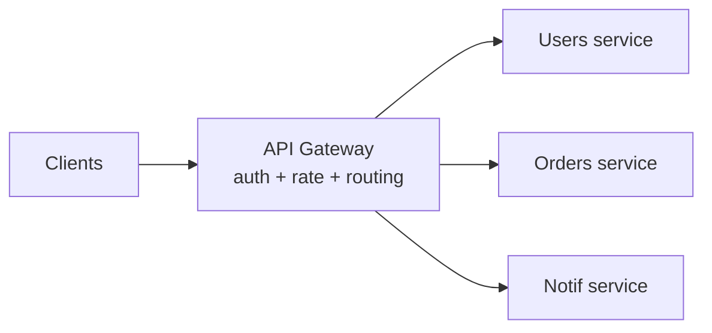
↳ الفخ: الـ Gateway ممكن يبقى **god object** — حط فيه cross-cutting concerns بس، مش business logic.

### 121. API Versioning — إيه الأساليب؟
- **URL**: `/v1/users`, `/v2/users` — الأشهر والأوضح.
- **Header**: `Accept: application/vnd.api.v2+json` — أنظف بس أخفى.
- **Query param**: `/users?version=2` — الأضعف.
↳ القاعدة العملية: URL versioning هو الأكثر شيوعاً لأنه واضح للـ developers ومباشر في الـ logs.

### 122. Pagination — أساليبها؟
- **Offset-based**: `?page=2&limit=20`. بسيط بس بطيء على الصفحات البعيدة (`OFFSET 100000`).
- **Cursor-based**: `?after=lastSeenId`. أسرع، ثابت مع الإدخالات الجديدة.
- **Keyset**: نوع من cursor يستخدم index محدد.
```
# offset — slow on deep pages
GET /users?page=5001&limit=20

# cursor — stable and fast
GET /users?after=eyJpZCI6MTAwMH0
```
↳ الفخ: offset pagination على DB كبير + real-time inserts = بيانات مكررة أو ضايعة. الـ cursor بيحل ده.

### 123. Rate Limiting — الأساليب والفروقات؟
- **Fixed window**: `100 req / minute`. بسيط، بس burst عند حد الفواصل.
- **Sliding window**: window متحرك، أدق، أثقل حسابياً.
- **Token bucket**: bucket فيه tokens، كل request بياخد token، الـ bucket بيعبّى بمعدل ثابت. بيسمح بـ burst مؤقت.
- **Leaky bucket**: الطلبات تخرج بمعدل ثابت من queue. بيمهّد الحمل.
↳ الأشهر عملياً: token bucket (مرونة) أو sliding window (دقّة).

### 124. أشهر Response Codes للـ Rate Limiting؟
**429 Too Many Requests** — مع headers توضّح الحد الحالي:
```
X-RateLimit-Limit: 100
X-RateLimit-Remaining: 3
X-RateLimit-Reset: 1721300000     # unix timestamp
Retry-After: 30                    # seconds
```
↳ الـ client الكويس بيقرا `Retry-After` ويستنى تلقائياً.

### 125. Idempotency Keys — إمتى محتاجهم؟
لضمان إن POST مبيتكررش عند retry. الـ client بيبعت `Idempotency-Key: <uuid>` مع الـ request، السيرفر يحتفظ بنتيجة العملية لهذا المفتاح لفترة.
```js
const key = req.header('Idempotency-Key');
const cached = await redis.get(`idem:${key}`);
if (cached) return res.json(JSON.parse(cached));         // return the same result
const result = await processPayment(...);
await redis.set(`idem:${key}`, JSON.stringify(result), 'EX', 86400);
```
↳ Stripe و Square بيعتمدوا عليها في مدفوعاتهم — لو الشبكة فصلت، الـ retry مش بيسحب تاني.

### 126. إيه الـ HATEOAS؟
Hypermedia As The Engine Of Application State — الرد بيحتوي روابط للأفعال التالية. الفكرة: الـ client يـ discover الـ API من الردود بدل ما يعرفها مسبقاً.
```json
{ "id": 5, "name": "Ali", "_links": { "orders": "/users/5/orders", "delete": "/users/5" } }
```
↳ الفخ: نادراً بيتطبّق في الحقيقة لأنه معقّد للـ clients — بس السؤال شهير في إنترفيوهات REST النظرية.

### 127. HTTP Long Polling vs WebSocket vs SSE للـ real-time APIs؟
- **Long polling**: client بيسأل ويستنى response لحد ما فيه تحديث. بسيط، متوافق. Overhead عالي.
- **SSE**: server push فوق HTTP. one-way (server → client). ممتاز للـ notifications.
- **WebSocket**: ثنائي الاتجاه، connection دائم. لل chat، gaming، collaboration.
↳ التفصيل في المرحلة 1، لكن هنا نظر للـ API design.

### 128. Backward Compatibility في الـ API — إزاي؟
- **متحذفش fields** — سيبها deprecated.
- **متغيّرش معنى field موجود** — ضيف field جديد.
- **متجعلش field optional إجباري** — تكسر clients قديمة.
- استخدم versioning للتغييرات الكاسرة.
↳ القاعدة: الـ old clients لازم تفضل شغّالة لفترة deprecation معلن عنها.

### 129. إيه الفرق بين Synchronous و Asynchronous API؟
- **Sync**: الـ client يستنى الرد لحد ما العملية تخلص.
- **Async**: الـ server يرد فوراً بـ 202 Accepted + `Location` لينك لتتبّع، والعملية بتخلص في الخلفية.
```
POST /videos/upload → 202 Accepted, Location: /jobs/xyz
GET /jobs/xyz       → { status: "processing" } → later: { status: "done", result: "..." }
```
↳ الأنسب للعمليات الطويلة (video encoding, reports generation). الـ client بيعمل poll أو subscribe لإشعار.

### 130. سيناريو: عندي API قديم بيرجّع كل بيانات المستخدم مع الـ posts والـ friends في request واحد (10MB). العملاء بيشتكوا من البطء. الحل؟
- **Pagination** للـ collections الكبيرة (posts, friends).
- **Field selection** (`?fields=name,email`) عشان الـ client يطلب اللي يحتاجه.
- **Separate resources** بدل الـ mega-response (`/users/5`, `/users/5/posts`, `/users/5/friends`).
- **GraphQL** لو المرونة دي شرط.
↳ ده مثال overfetching الكلاسيكي — REST جيد التصميم أو GraphQL بيحلوه.

---

# القسم 11 — Message Queues & Async (Q131–142)

### 131. ليه محتاج Message Queue؟
لفصل الـ producers عن الـ consumers، معالجة أحمال في الخلفية، ولحماية النظام من الـ spikes.
**فوايد**: (1) الـ producer مش مستني، (2) الـ consumer يشتغل بمعدله، (3) resilience لو الـ consumer وقع، (4) توزيع الشغل على workers متعددين.
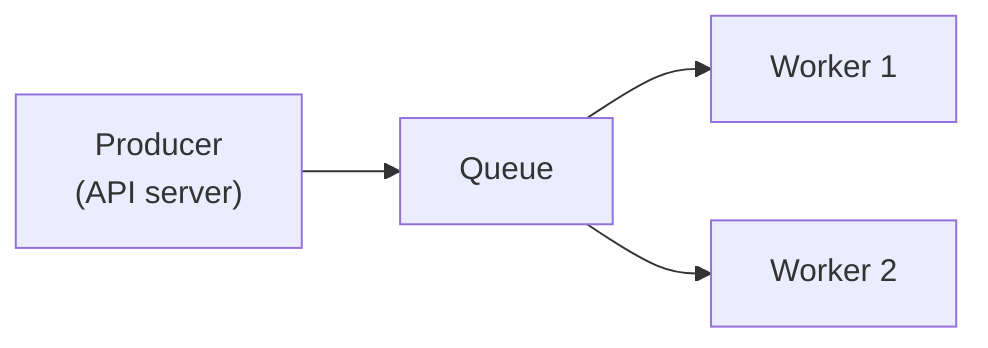
↳ مثال: طلب يتسجّل، والـ email يتبعت من worker في الخلفية — الـ API يرد فوراً.

### 132. Queue vs Pub/Sub — الفرق؟
- **Queue**: رسالة واحدة → **consumer واحد بس** (work distribution).
- **Pub/Sub**: رسالة واحدة → **كل الـ subscribers** (broadcast).
↳ الفخ: Kafka بيدعم الاتنين عبر consumer groups. RabbitMQ عبر exchange types.

### 133. Kafka vs RabbitMQ — الفرق الجوهري؟
| | Kafka | RabbitMQ |
|---|---|---|
| النموذج | Log-based (persistent stream) | Broker traditional |
| Message retention | تفضل لفترة/حجم محدد | تتشال بعد الاستهلاك |
| Ordering | مضمون داخل partition | مضمون داخل queue |
| Throughput | عالي جداً (ملايين/ثانية) | عالي (عشرات آلاف/ثانية) |
| Use case | event streaming, logs, analytics | task queues, RPC |
↳ الجملة: "Kafka log تقدر تعيد قراءته، RabbitMQ inbox بتُقرأ مرة."

### 134. Consumer Groups في Kafka — يعني إيه؟
مجموعة consumers بتقرا نفس الـ topic بشكل موزّع — كل partition لواحد بس من الـ group. لو زوّدت consumers فوق عدد الـ partitions، الزيادة بتقعد فاضية.
↳ ده بيدّي horizontal scaling للاستهلاك، والـ ordering محفوظ داخل الـ partition.

### 135. At-most-once vs At-least-once vs Exactly-once؟
- **At-most-once**: الرسالة ممكن تضيع، بس متتكررش. للحاجات اللي فقدها مقبول (metrics).
- **At-least-once**: مضمون توصل، بس ممكن تتكرر (شائع). محتاج **idempotent consumers**.
- **Exactly-once**: مثالياً، بس صعبة عملياً وبتكلف performance.
↳ الأكثر شيوعاً: at-least-once + idempotent processing = بديل عملي لـ exactly-once.

### 136. Idempotency في الـ Consumers — ليه ضرورية؟
لأن at-least-once معناها ممكن تعالج نفس الرسالة أكتر من مرة. الـ consumer لازم يعطي **نفس النتيجة** حتى لو نفّذ نفس الرسالة كذا مرة.
```js
async function handleOrder(msg) {
    const existed = await db.query('SELECT id FROM processed WHERE msg_id = $1', [msg.id]);
    if (existed.rows.length) return;                     // already processed, skip
    await db.transaction(async (tx) => {
        await tx.insertOrder(msg.order);
        await tx.insertProcessed(msg.id);
    });
}
```
↳ الفخ: بلا idempotency + at-least-once = رسائل مكررة تسبب double payments، double emails، إلخ.

### 137. إيه الـ Dead Letter Queue (DLQ)؟
Queue تانية بتاخد الرسائل اللي فشلت بعد عدد محاولات معيّن. بدل ما تفضل تعمل retry بلا نهاية أو تضيع، تروح لـ DLQ للتحقيق اليدوي.
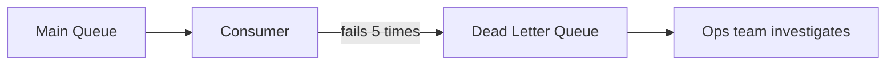
↳ الفخ: DLQ بلا مراقبة = دفن للمشاكل. لازم alerts عليها.

### 138. Retry strategies للـ failed messages؟
- **Immediate retry**: خطر لو المشكلة مستمرة.
- **Fixed delay**: retry كل X ثانية.
- **Exponential backoff**: `1s → 2s → 4s → 8s...`. الأكثر شيوعاً.
- **Jittered backoff**: exponential + عشوائية عشان الـ retries متتزامنش من consumers متعددين.
↳ للـ APIs الخارجية، exponential + jitter تقريباً شرط عشان تجنّب "thundering herd".

### 139. Ordering guarantees — إمتى مهم وإمتى لأ؟
مهم لما تسلسل الأحداث ذو معنى (state machine: pending → paid → shipped، ماينفعش تعالجهم مقلوبين).
غير مهم للأحداث المستقلة (send email A, send email B — الترتيب مالوش قيمة).
↳ Kafka: ordering مضمون داخل partition واحد. لو محتاج ordering لكيان معيّن، استخدم مفتاحه كـ partition key.

### 140. Fan-out — يعني إيه؟
حدث واحد بيوصل لكذا consumer/service. في RabbitMQ عبر **fanout exchange**، وفي Kafka بـ topics متعددين مشتركين في نفس الحدث.
↳ استخدام شائع: order placed → email service + inventory service + analytics service.

### 141. Backpressure في الـ Queues — إزاي بنتعامل؟
لو الـ producers أسرع من الـ consumers، الـ queue بتتراكم. الحلول: (1) auto-scale consumers، (2) rate-limit producers، (3) drop messages مع أولوية، (4) apply backpressure للـ producers (يستنى قبل ما يبعت).
↳ الفخ: تجاهل الـ backpressure = الـ queue تكبر بلا حدود → out of memory أو تأخير كبير.

### 142. سيناريو: طلب checkout بيبعت إيميل، تحديث inventory، وتحديث analytics. المشكلة في الـ sync approach والحل؟
**المشكلة**: الـ API بيستنى الـ 3 عمليات → latency عالي، ولو واحدة فشلت الطلب كله يفشل.
**الحل**: الـ API بيسجّل الطلب في DB ويـ publish حدث `OrderPlaced` على queue، والـ 3 consumers يعالجوا كل واحد شغله بشكل مستقل ومع retries.
```js
// producer
await db.insert('orders', order);
await queue.publish('OrderPlaced', { orderId: order.id });   // fire and continue
return res.status(201).json(order);                          // fast response
```
↳ ده أساس الـ **event-driven architecture** في الـ microservices.

---

# القسم 12 — Databases في الـ backend (Q143–155)

### 143. Connection Pooling — ليه ضروري؟
فتح TCP connection جديدة للـ DB لكل query = handshake TCP + auth = بطء وضغط على الـ DB. الـ pool بيحتفظ بـ connections جاهزة ويعيد استخدامها.
```js
const pool = new Pool({ max: 20, idleTimeoutMillis: 30000 });
const { rows } = await pool.query('SELECT ...');  // borrow → run → return to pool
```
↳ الفخ: pool صغير جداً = طوابير. كبير جداً = ضغط على الـ DB (كل DB عندها max connections).

### 144. الـ N+1 Query Problem؟
لما تجيب N من الـ parent، وبعدين تعمل query لكل واحد لتجيب الـ children — بقيت N+1 queries بدل 2.
```js
// N+1 — bad
const posts = await db.query('SELECT * FROM posts');           // 1
for (const p of posts) {
    p.author = await db.query('SELECT ... WHERE id=$1', [p.authorId]);   // N
}
// fix: join or IN clause
const posts = await db.query(`
    SELECT p.*, u.name AS author FROM posts p JOIN users u ON u.id = p.author_id
`);                                                             // 1 query
```
↳ من أشهر مشاكل الأداء، شائع جداً مع ORMs.

### 145. Eager Loading vs Lazy Loading؟
- **Lazy**: الـ related data تتحمّل لما تُطلب. مرن بس بيسبب N+1.
- **Eager**: بتجيب كل حاجة في query واحد. أسرع لو محتاج البيانات، بس ممكن يجيب أكتر من اللازم.
↳ القاعدة: eager للحالات اللي بتحتاج البيانات المرتبطة دايماً، lazy لو مش لازم.

### 146. ACID — يعني إيه؟
خصائص المعاملات (transactions) في القواعد التقليدية:
- **Atomicity**: الكل أو لا شيء.
- **Consistency**: من حالة صحيحة لحالة صحيحة.
- **Isolation**: المعاملات ما تشوفش بعضها في المنتصف.
- **Durability**: بعد commit، البيانات محفوظة حتى لو انقطعت الكهرباء.
↳ الـ NoSQL كتير بيتنازل عن بعض دي مقابل الأداء والـ scalability.

### 147. Isolation Levels — الأربعة الرئيسية؟
من الأضعف للأقوى:
- **Read Uncommitted**: تشوف تغييرات لسه ما اتـ commit — dirty reads.
- **Read Committed**: تشوف بس اللي اتـ commit — الأشهر (Postgres default).
- **Repeatable Read**: نفس الـ query يدّي نفس النتيجة داخل المعاملة.
- **Serializable**: كأن المعاملات نُفّذت بالتتابع — أقوى ضمان، أبطأ.
↳ الفخ: زيادة الـ isolation = أمان أعلى + concurrency أقل. اختار الأقل اللي يحقق متطلباتك.

### 148. أنواع الـ Concurrency Anomalies؟
- **Dirty Read**: قراءة بيانات لسه ما اتـ commit.
- **Non-Repeatable Read**: نفس الصف بيقرا بقيم مختلفة في نفس المعاملة.
- **Phantom Read**: صفوف جديدة بتظهر بين قراءتين لنفس الـ range.
- **Lost Update**: تحديثين متزامنين، واحد يضيع.
↳ كل isolation level بيمنع شوية منهم — الجدول في أي مصدر Postgres بيوضّح البقية.

### 149. Optimistic vs Pessimistic Locking؟
- **Pessimistic**: اقفل الصف بـ `SELECT ... FOR UPDATE`، حد تاني يستنى.
- **Optimistic**: مفيش قفل، بس اتحقق قبل الحفظ إن الـ version لسه زي ما كان (`WHERE version=$1`).
↳ Pessimistic للصراع العالي، Optimistic للحالات النادرة (retry لو حصل conflict).

### 150. SQL vs NoSQL — إمتى إيه؟
- **SQL**: schema صارم، relations، ACID، queries معقّدة. للـ transactional systems (banking, orders).
- **NoSQL**: مرن، يتوسّع أفقياً بسهولة، عمليات بسيطة سريعة. للـ big data، caching، document/graph/key-value.
↳ الفخ: مش "أحدهما أفضل" — كل نوع لسياق. الأنظمة الحديثة polyglot (بتستخدم الاتنين معاً).

### 151. أنواع الـ NoSQL؟
- **Document**: MongoDB — JSON-like documents.
- **Key-Value**: Redis, DynamoDB — بسيط وسريع.
- **Column-family**: Cassandra — big data, wide rows.
- **Graph**: Neo4j — علاقات معقّدة.
↳ الاختيار حسب نمط البيانات والاستعلامات.

### 152. Replication — إيه هي ودورها؟
عمل نسخ من الـ DB على nodes متعددة. الفوايد: **قراءة موزّعة** (read replicas)، **HA** (لو الـ primary وقع، replica بيتحول)، **backup**.
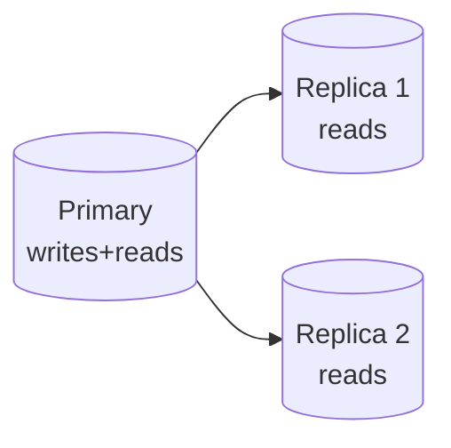
↳ الفخ: **replication lag** — الـ replicas ممكن تكون متأخرة ثواني عن الـ primary. القراءة منها ممكن ترجّع بيانات قديمة.

### 153. Sharding — إيه هي؟
تقسيم الـ data على كذا DB (كل جزء shard). كل shard يحمل subset من البيانات (users A-M على shard 1، N-Z على shard 2 مثلاً).
↳ الفخ: cross-shard queries معقّدة وبطيئة. اختار الـ **shard key** بحذر عشان توزّع الحمل بالتساوي.

### 154. Replication vs Sharding — الفرق؟
- **Replication**: نفس البيانات على كذا node → قراءة سريعة + HA.
- **Sharding**: بيانات مختلفة على كذا node → تخزين وكتابة موزّعة.
↳ الأنظمة الكبيرة بتعمل الاتنين: sharding للتوسّع + replication لكل shard.

### 155. Indexing — الأساسيات؟
Index هيكل مساعد (B-tree غالباً) بيسرّع القراءة على أعمدة معيّنة على حساب سرعة الكتابة والمساحة.
```sql
CREATE INDEX idx_users_email ON users(email);   -- speeds up WHERE email = ...
```
↳ الفخ: index كتير على جدول = writes بطيئة. index قليل = reads بطيئة. توازن حسب نمط الاستخدام.
↳ التفصيل الكامل للـ DB في تراك DB منفصل (لسه هيتعمل).

---

## ✅ Checkpoint — المرحلة 3

1. AuthN vs AuthZ · Cookies flags · Session vs JWT · Access vs Refresh tokens
2. OAuth 2.0 flows · OIDC · CSRF vs XSS · password hashing
3. REST principles · GraphQL vs REST vs gRPC · API Gateway
4. Versioning · Pagination (offset vs cursor) · Rate limiting algorithms · Idempotency keys
5. Queue vs Pub/Sub · Kafka vs RabbitMQ · at-least-once + idempotent consumers
6. DLQ · retry strategies (exponential + jitter) · ordering · fan-out · backpressure
7. Connection pooling · N+1 · eager vs lazy loading
8. ACID · isolation levels · concurrency anomalies · optimistic vs pessimistic
9. SQL vs NoSQL · Replication vs Sharding · Indexing basics

---

*المرحلة 4 جاية → Backend Patterns (Repository, UoW, CQRS, Saga, Circuit Breaker, Bulkhead) · Monolith vs Microservices · Resilience & Scaling · Observability موسّع (logs, trace IDs, distributed tracing, metrics).*

---
---

# تراك 3 — Backend Engineering: المرحلة 4

## 🗺️ خريطة المرحلة 4

- **القسم 13 — Backend Patterns** (Q156–167): Repository, Unit of Work, CQRS, Saga, Circuit Breaker, Bulkhead
- **القسم 14 — Monolith vs Microservices** (Q168–177): متى إيه، service discovery، distributed transactions
- **القسم 15 — Resilience & Scaling** (Q178–189): timeouts, retries, backoff, graceful degradation
- **القسم 16 — Observability موسّع** (Q190–206): logs, trace IDs, distributed tracing, metrics

---

# القسم 13 — Backend Patterns (Q156–167)

### 156. إيه الـ Repository Pattern؟
طبقة abstraction بين الـ business logic والـ DB. الـ code بيتعامل مع repository interface (`UserRepository`)، مش مع الـ DB مباشرة.
```js
class UserRepository {
    async findById(id) { return db.query('SELECT * FROM users WHERE id=$1', [id]); }
    async save(user)   { /* ... */ }
}
// business logic uses the repository, not raw SQL
async function activateUser(id, repo) {
    const user = await repo.findById(id);
    user.active = true;
    await repo.save(user);
}
```
**الفوايد**: تبديل الـ DB أو الـ ORM في مكان واحد + testing أسهل (mock الـ repository).
↳ الفخ: over-engineering لو الـ app بسيط — الـ ORM نفسه غالباً بيدّي repository جاهز.

### 157. إيه الـ Unit of Work؟
Pattern بيتتبّع التغييرات على objects متعددة داخل عملية واحدة، ويحفظهم كلهم في **transaction واحدة** في الآخر.
```js
const uow = new UnitOfWork();
uow.register(user);
uow.register(order);
await uow.commit();          // one DB transaction wraps all writes
```
↳ في Node، غالباً بتستخدم الـ transactions المدمجة في الـ ORM (Sequelize/TypeORM) بدل تنفيذ UoW من الصفر.

### 158. إيه الـ CQRS؟
**Command Query Responsibility Segregation**: فصل عمليات الكتابة (Commands) عن عمليات القراءة (Queries) — ممكن يبقوا في models مختلفة، DBs مختلفة، حتى services مختلفة.
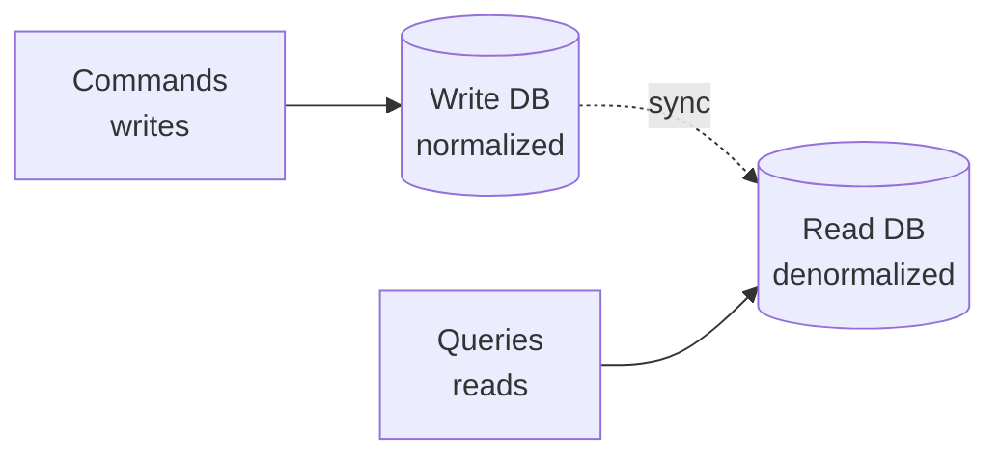
**فوائد**: أداء قراءة عالي، تصميم مناسب لكل جهة. **عيوب**: تعقيد + eventual consistency.
↳ لا تطبّقه إلا لو الـ read/write patterns مختلفين جداً — over-engineering شائع.

### 159. Event Sourcing — إيه هو؟
بدل ما تخزّن الـ **state الحالي**، خزّن **كل الأحداث** اللي وصلتلك للحالة دي. الـ state = replay للأحداث.
```
UserCreated { id:5, name:"Ali" }
NameChanged { id:5, name:"Aly" }
UserDeactivated { id:5 }
// current state = replay of the above events
```
**فوائد**: audit trail كامل، time travel debugging، تطبيق طبيعي مع CQRS.
↳ الفخ: تعقيد كبير، تغيير schema الأحداث صعب.

### 160. إيه الـ Saga Pattern؟
حل للـ **distributed transactions** في microservices: بدل transaction ACID واحدة، سلسلة عمليات محلية كل واحدة لها **compensation** لعكسها لو فشلت خطوة لاحقة.
```
Order created ──▶ Payment charged ──▶ Inventory reserved ──▶ Ship
       │                │                    │
       └── cancel ──────┴── refund ──────────┴── unreserve
```
**نوعان**: **Choreography** (كل service بيسمع الـ events) و **Orchestration** (منسّق مركزي بيدير الخطوات).
↳ الفخ: الـ compensation مش دايماً بترجع الحالة الأصلية بالضبط — بعض العمليات (زي إرسال إيميل) مستحيل تعكسها.

### 161. Choreography vs Orchestration في Saga؟
- **Choreography**: كل service بيتفاعل مع الـ events بشكل مستقل، مفيش منسّق. مرن بس صعب تتبّع الـ flow.
- **Orchestration**: خدمة منسّقة (orchestrator) بتحدد ترتيب الاستدعاءات وتدير الـ compensation. أوضح، بس نقطة مركزية.
↳ عملياً: choreography لسيناريوهات بسيطة، orchestration للـ workflows المعقّدة.

### 162. إيه الـ Circuit Breaker Pattern؟
لما service اعتمادي بيفشل باستمرار، توقف الاستدعاءات مؤقتاً بدل ما تعمل retries تخنق النظام. حالات: **closed** (طبيعي) → **open** (يفصل بعد فشل متكرر) → **half-open** (اختبار بعد timeout).
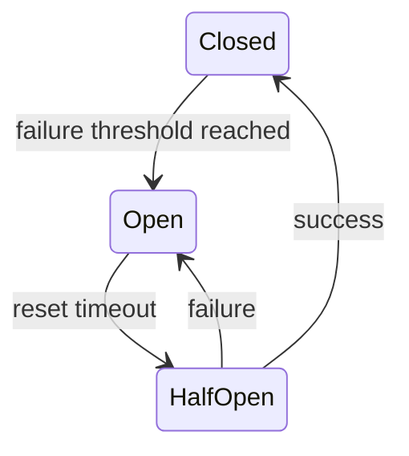
```js
// simplified with a library like 'opossum'
const breaker = new CircuitBreaker(callExternalApi, { timeout: 3000, errorThresholdPercentage: 50 });
breaker.fallback(() => 'cached fallback response');
```
↳ الفخ: بلا circuit breaker، فشل service بيتحوّل لـ cascading failure عبر النظام.

### 163. إيه الـ Bulkhead Pattern؟
اعزل الـ resources عشان فشل جزء ميعديش للباقي — زي الأقسام في السفينة اللي بتمنع الغرق الكامل.
مثال: connection pools منفصلة لكل service خارجي — لو واحد اتعطّل واستنزف connections، الباقي مش هيتأثر.
↳ عملياً: pools منفصلة، thread pools، rate limits per-tenant.

### 164. إيه الـ Sidecar Pattern؟
container/process بيمشي **جنب** التطبيق ويوفّرله خدمات (logging, config, service mesh) بلا ما التطبيق يعرف بيه.
↳ مثال شهير: Envoy proxy جنب كل service في Istio — بيدير كل الـ networking.

### 165. إيه الـ Retry with Exponential Backoff (كنمط)؟
لو استدعاء فشل، استنى فترة متزايدة وحاول تاني — بدل ما تفشل فوراً. مع jitter عشان تجنّب thundering herd.
```js
async function callWithRetry(fn, maxAttempts = 5) {
    for (let attempt = 1; attempt <= maxAttempts; attempt++) {
        try { return await fn(); }
        catch (e) {
            if (attempt === maxAttempts) throw e;
            const wait = 2 ** attempt * 100 + Math.random() * 100;   // exponential + jitter
            await new Promise(r => setTimeout(r, wait));
        }
    }
}
```
↳ الفخ: مش كل فشل يستاهل retry (400 Bad Request مثلاً — الـ retry مش هينجح).

### 166. إيه الـ Outbox Pattern؟
عشان تضمن publish رسالة على queue **مع** save على DB بشكل atomic. بدل ما تكتب على الاتنين مباشرة، اكتب على DB بس في جدول `outbox`، وworker منفصل يقرأ من الجدول ويـ publish.
```
BEGIN
    INSERT INTO orders ...;
    INSERT INTO outbox (event) VALUES ('OrderPlaced', ...);
COMMIT;
-- outbox relay worker → publishes to queue
```
↳ بيحل مشكلة "dual write" — تجنّب حالة كتبت على DB بس فشلت في الـ queue أو العكس.

### 167. سيناريو: خدمة استدعاء طرف ثالث بتفشل أحياناً وبتبطّئ كل شيء. أنهي patterns تجمّعهم؟
1. **Circuit Breaker**: افصل الاستدعاء لو الفشل متكرر.
2. **Timeout**: مبتستناش أكتر من X.
3. **Retry with backoff**: لو فشل مؤقت، حاول تاني.
4. **Bulkhead**: pool منفصل عشان مياكلش موارد الباقي.
5. **Fallback**: خطة بديلة (cached response، default value).
↳ الجمع بيدّي resilience حقيقية — كل pattern لوحده مش كفاية.

---

# القسم 14 — Monolith vs Microservices (Q168–177)

### 168. إيه الـ Monolith؟
كل منطق الـ app في codebase واحد و deployment واحد. بسيط للبداية، تعقيد داخلي بيكبر مع الوقت.
↳ الفخ: "Monolith = سيئ" — خطأ شائع. Monolith كويس التصميم أفضل من microservices سيئة التصميم بمراحل.

### 169. إيه الـ Microservices؟
تقسيم الـ app لخدمات صغيرة مستقلة، كل واحدة **بترتب نفسها**، **بتنتشر لوحدها**، وبتتواصل مع الباقي عبر شبكة (HTTP/queue).
↳ ده architectural style، مش هدف في حد ذاته — استخدمه لما بيحل مشاكلك.

### 170. إمتى تختار Microservices على Monolith؟
لما فيه مشاكل حقيقية بيحلها: (1) فرق كبيرة بتزاحم على نفس الـ codebase، (2) خدمات محتاجة scale مختلف، (3) tech stacks مختلفة، (4) domain boundaries واضحة.
↳ الجملة: "الـ microservices بتحل مشاكل تنظيمية أكتر من تقنية."

### 171. عيوب Microservices؟
تعقيد **شبكي** (latency, failures, retries)، **distributed transactions** صعبة، **debugging** موزّع، **deployment** أعقد، **eventual consistency**، تكلفة infrastructure أعلى.
↳ الفخ: التحوّل لـ microservices بلا استعداد = distributed monolith، أسوأ من الاتنين.

### 172. Service Discovery — إيه هو؟
إزاي الـ service يعرف عنوان services تانية في بيئة ديناميكية (containers بتظهر وتختفي). **Client-side** (client يسأل registry) أو **Server-side** (LB بيدير الـ discovery).
↳ أدوات: Consul, Eureka, Kubernetes DNS.

### 173. Synchronous vs Asynchronous communication بين services؟
- **Sync** (HTTP/gRPC): بسيط، بس بيربط الـ services (لو المستدعى وقع، الـ caller بيتأثر).
- **Async** (queues): decoupled، resilient، بس بيضيف complexity (eventual consistency، ordering).
↳ القاعدة: sync للـ queries المباشرة، async للـ commands اللي مش محتاجة رد فوري.

### 174. Distributed Transactions — التحدي؟
لما عملية واحدة (checkout) بتلمس كذا service (payment, inventory, shipping)، مفيش transaction ACID واحدة تغطي كلهم. الحلول: **Saga pattern** (compensation)، **two-phase commit** (نادراً بيتستخدم — بطيء وهش).
↳ الفخ: محاولة تطبيق ACID عبر services = ألم. الأفضل: eventual consistency + saga.

### 175. Shared Database في Microservices — ليه سيئة؟
لأنها **بتربط** الـ services عبر schema مشترك: تغيير في الـ DB بيكسر خدمات كتير، ومفيش deployment مستقل حقيقي.
↳ القاعدة: **database per service** — كل خدمة تمتلك بياناتها، ومحدش يوصلها إلا عبر API بتاعها.

### 176. Service Mesh — إيه هو؟
طبقة infrastructure بتدير التواصل بين الـ services (via sidecars): mTLS، retries، circuit breaking، observability — كل ده بلا لمس كود الخدمات.
↳ أشهر أداة: **Istio** (بـ Envoy). الفايدة: cross-cutting concerns في مكان واحد.

### 177. سيناريو: عندنا monolith بيكبر ومحتاج نقسّمه. من أين نبدأ؟
1. **Identify bounded contexts** (DDD): المجالات المستقلة.
2. **Strangler Fig pattern**: افصل service واحد بالتدريج، حط proxy يوجّه الـ routes الجديدة للخدمة الجديدة والباقي للـ monolith.
3. ركّز على الأجزاء اللي فيها ألم حقيقي (scale, تغيير سريع، فريق منفصل).
↳ الفخ: تقسيم الكل مرة واحدة = كارثة. Big bang rewrites بتفشل غالباً.

---

# القسم 15 — Resilience & Scaling (Q178–189)

### 178. إيه الفرق بين Availability و Reliability؟
- **Availability**: نسبة الوقت اللي الـ service شغّال فيه (99.9% = "three nines" = ~9 ساعات downtime في السنة).
- **Reliability**: احتمال إن الـ service يشتغل صح لفترة معيّنة (مش بيقع، مش بيرجّع أخطاء).
↳ ممكن يكون available بس مش reliable (رد بس بأخطاء).

### 179. إيه الفرق بين SLA و SLO و SLI؟
- **SLI**: Indicator — مقياس فعلي (latency, error rate).
- **SLO**: Objective — الهدف الداخلي (99.9% requests < 200ms).
- **SLA**: Agreement — الوعد التعاقدي مع العميل، غالباً أضعف من الـ SLO.
↳ الجملة: "SLI بتقيس، SLO الهدف، SLA الوعد الرسمي."

### 180. Graceful Degradation — يعني إيه؟
لما جزء يفشل، النظام يستمر بشكل منقوص بدل ما ينهار كلياً. مثال: search بيفشل → عرض recommendations من cache.
↳ الفخ: مش كل فشل يستحق graceful degradation — بعض العمليات لازم تفشل صريحاً.

### 181. Timeouts — ليه ضروري تضبطهم على كل استدعاء خارجي؟
بلا timeout، استدعاء بطيء بيخنق threads/connections لأجل غير مسمى، وبعدين النظام كله يتوقّف.
```js
const res = await fetch(url, { signal: AbortSignal.timeout(5000) });    // 5s ceiling
```
↳ الفخ: default HTTP client في كتير من اللغات مفيش timeout افتراضي = خطر خفي.

### 182. Retries متى تكون خطر؟
- لو الاستدعاء **مش idempotent** (double charge).
- لو مفيش backoff (thundering herd).
- لو الفشل دائم (400) — بتضيّع موارد.
- **Retry storms**: كل client بيعمل retry في نفس الوقت = هجوم غير مقصود.
↳ القاعدة: retry مع backoff + jitter + max attempts + circuit breaker.

### 183. Fallbacks — إيه هي وأمثلة؟
لو الاستدعاء الأساسي فشل، ارجع لخطة B: cached data، default value، خدمة بديلة.
```js
try { return await primaryService.get(id); }
catch (e) { return await cache.get(id) ?? DEFAULT_RESPONSE; }
```
↳ الفخ: fallback ضعيف ممكن يخبّي مشاكل حقيقية. لازم monitoring على معدل استخدام الـ fallback.

### 184. Horizontal Scaling الفعلي — إيه المتطلبات؟
- **Stateless services** (state في Redis/DB مركزي).
- **Load balancer** قدامهم.
- **Session store مشترك** (لا sticky sessions).
- **Idempotent operations** (retries آمنة).
- **Config عبر env vars** (نفس الـ image يشتغل في أي بيئة).
↳ من غير ده، أضف instances = مشاكل جديدة مش scaling حقيقي.

### 185. Auto-scaling — إيه الأنواع؟
- **Reactive**: بناء على metric حالي (CPU > 70% → أضف instance).
- **Scheduled**: توسيع في أوقات متوقعة (رمضان، Black Friday).
- **Predictive**: ML على أنماط تاريخية.
↳ الفخ: scale-up أسرع من scale-down عادة — تجنّب flapping (add/remove بسرعة).

### 186. Caching كأداة resilience — إزاي؟
- تخدم من الـ cache لو الـ upstream وقع (**serve stale**).
- تقلل الحمل على المصادر الحرجة.
- تدّي graceful degradation طبيعية.
↳ الجملة: "cache مش بس للأداء — بيدّي resilience كمان."

### 187. Failure Domain — يعني إيه؟
نطاق الفشل: لو فشل حصل، إيه اللي هيتأثر معاه؟ الأنظمة الجيدة بتقسّم الـ failure domains (multi-AZ، multi-region) عشان فشل في مكان ميهدّش النظام كله.
↳ مثال: DB في زون واحد = نقطة فشل. Multi-AZ replication = resilience.

### 188. Chaos Engineering — إيه هي؟
اختبار الـ resilience بحقن أخطاء متعمّدة في الإنتاج (اقتل instances عشوائياً، أوقف الشبكة لخدمة). Netflix بدأتها بأدوات زي Chaos Monkey.
↳ الفكرة: "لو النظام مبيتحكش على أخطاء متوقعة، اكتشفها في وقتك أنت مش وقتها."

### 189. سيناريو: الـ API بيتوقّف كل مرة الـ DB بيرد بطيء. الحلول؟
1. **Timeouts** على DB queries.
2. **Circuit breaker** حوالين الـ DB لو الفشل متكرر.
3. **Bulkhead**: connection pools منفصلة لعمليات critical vs non-critical.
4. **Read replicas** لتوزيع الحمل.
5. **Cache** للبيانات المقروءة كتير.
6. **Graceful degradation**: خدمة limited لو الـ DB مش متاح.
↳ الحل شامل: طبقات من الحماية، مش خط دفاع واحد.

---

# القسم 16 — Observability موسّع (Q190–206)

### 190. إيه الـ Observability؟ وإيه الفرق عن الـ Monitoring؟
- **Monitoring**: بتراقب metrics محددة سلفاً (CPU, memory, error rate). بيجاوب "هل النظام شغّال؟"
- **Observability**: قدرتك على **فهم الحالة الداخلية** للنظام من مخرجاته الخارجية. بيجاوب "ليه النظام مش شغّال؟"
↳ الجملة: "Monitoring بيقولك 'فيه مشكلة'، observability بيقولك 'المشكلة إيه'."

### 191. إيه الـ 3 Pillars للـ Observability؟
1. **Logs**: أحداث نصية بترتيب زمني (structured events).
2. **Metrics**: قياسات رقمية بمرور الوقت (counters, gauges, histograms).
3. **Traces**: تتبّع request عبر كذا service.
↳ الاتنين وسبعة Pillars الحديثة بيضيف **Events/Profiles**، بس التلاتة دي الأساس.

### 192. إيه الـ Structured Logging؟ وليه أفضل من `console.log`؟
Logs بشكل JSON (أو أي format منظّم) بدل نص حر. كل log فيه fields يمكن query عليها.
```js
// bad: unstructured
console.log(`User ${userId} bought ${itemId} for ${price}`);
// good: structured
logger.info('purchase', { userId, itemId, price, traceId: req.traceId });
```
↳ الفخ: نص حر في الإنتاج = مستحيل تعمل قابلة search/aggregate. كل logging system حديث بيتوقّع structured JSON.

### 193. Log Levels — الترتيب والاستخدام؟
- **DEBUG**: تفاصيل التطوير (متطلعش في الإنتاج غالباً).
- **INFO**: أحداث عادية (request started, user logged in).
- **WARN**: حاجة غير متوقعة بس مش خطر.
- **ERROR**: عملية فشلت، النظام لسه شغّال.
- **FATAL**: النظام نفسه مش هيقدر يكمل.
↳ الفخ: كل حاجة `INFO` = noise. كل حاجة `ERROR` = alert fatigue. اضبط الـ levels بحذر.

### 194. إيه الـ Correlation ID والـ Trace ID؟
- **Correlation ID / Request ID**: معرّف واحد للـ request كامل، بيربط logs من services مختلفة معالجة نفس الطلب.
- **Trace ID**: نفس الفكرة، بس مع بنية أعمق (spans, parent-child) للـ distributed tracing.
```
[traceId=abc-123] gateway    received /checkout
[traceId=abc-123] orders     creating order
[traceId=abc-123] payments   charging card
[traceId=abc-123] gateway    returned 200
```
↳ من غيرهم، debug microservices شبه مستحيل.

### 195. إزاي تنقل الـ Trace ID بين services؟
عبر **HTTP headers** (`traceparent` في W3C standard، أو `X-Trace-Id`). كل service بيقرا الـ ID الجاي، بيضيفه في logs بتاعته، ويمرّره في أي استدعاء لخدمة تانية.
```js
app.use((req, res, next) => {
    req.traceId = req.header('traceparent') || crypto.randomUUID();
    next();
});
// pass it downstream
await fetch(url, { headers: { traceparent: req.traceId } });
```
↳ الفخ: نسيان تمرير الـ trace ID لخدمة واحدة = انقطاع في السلسلة، صعوبة الـ debug.

### 196. إيه الـ Distributed Tracing؟
تتبّع request عبر كل الخدمات اللي مسّها، مع timing لكل خطوة (span). بيوريك بالظبط الـ latency راح لفين.
```mermaid
gantt
    title Trace: /checkout
    dateFormat X
    axisFormat %L
    section gateway
    receive           :0, 5
    section auth
    verify token      :5, 15
    section orders
    create order      :15, 45
    section payments
    charge card       :45, 250
    section gateway
    return response   :250, 260
```
↳ الفخ: بلا distributed tracing، latency عالية في microservices = تخمين.

### 197. إيه الـ Span؟ والـ Parent-Child spans؟
- **Span**: وحدة عمل واحدة داخل trace (استدعاء دالة، query على DB، HTTP call).
- كل span له **parent span** (اللي استدعاه)، عشان تتبني شجرة تدفّق كاملة.
```
trace-abc
  ├─ span: gateway.handleRequest      (260ms)
  │    ├─ span: auth.verifyToken      (10ms)
  │    ├─ span: orders.createOrder    (30ms)
  │    │    └─ span: db.insert        (25ms)
  │    └─ span: payments.charge       (205ms)   ← bottleneck
```
↳ التسلسل ده بيوضّح فوراً الـ span البطيء (payments في المثال ده).

### 198. إيه الـ OpenTelemetry؟
Standard مفتوح لجمع الـ traces والـ metrics والـ logs بشكل موحّد، مع SDKs لكل لغة. بيبعت البيانات لأي backend (Jaeger, Zipkin, Datadog, ...).
↳ الفخ: OpenTelemetry بديل حديث لـ vendor-specific tracing — بتـ instrument مرة واحدة وتبدّل الـ backend وقت ما تحب.

### 199. أنواع الـ Metrics؟
- **Counter**: بيزيد بس (عدد الـ requests, عدد الأخطاء).
- **Gauge**: قيمة بترتفع وتقل (عدد الـ active connections, memory usage).
- **Histogram**: توزيع القيم (latency distribution: p50, p95, p99).
- **Summary**: زي الـ histogram بس بيحسب quantiles جهة الـ client.
↳ الفخ: **متعتمدش على average latency لوحده** — الـ p99 هو اللي بيحكي القصة (الأسوأ 1% من الطلبات).

### 200. RED و USE methods؟
**RED** (للخدمات): **R**ate (requests/sec)، **E**rrors (errors/sec)، **D**uration (latency).
**USE** (للـ resources): **U**tilization، **S**aturation، **E**rrors.
↳ ابدأ بالـ RED للـ APIs والـ USE للـ hosts/DBs — بيغطوا 90% من الرؤية.

### 201. Metrics vs Logs vs Traces — إمتى إيه؟
- **Metrics** للـ **aggregate view**: "كام request في الدقيقة؟" — رخيصة، سريعة.
- **Logs** للـ **event details**: "إيه اللي حصل بالظبط في الطلب ده؟" — غنية بس مكلفة.
- **Traces** للـ **causality**: "الـ latency جت من فين في الطلب ده؟"
↳ التلاتة **مكمّلين** لبعض، مش بدائل.

### 202. Sampling في الـ Tracing — ليه؟
تسجيل كل trace = تكلفة عالية جداً. الحل: **sampling** (سجّل 1% مثلاً)، أو **head-based** (قرّر عند الـ بداية) vs **tail-based** (بعد الانتهاء — سجّل بس الـ traces البطيئة أو الفاشلة).
↳ الفخ: sampling ثابت ممكن يفوّت مشاكل نادرة. Tail-based يضمن التقاط الـ errors.

### 203. Alerting — القواعد الأساسية؟
- **Alert on symptoms, not causes**: "latency عالي" أفضل من "CPU عالي" (الـ CPU ممكن يبقى عالي بلا مشكلة حقيقية).
- **Actionable alerts**: أي alert لازم يبقى فيه حاجة تعملها.
- **تجنّب alert fatigue**: كتير alerts = الفريق بيتجاهل المهم.
↳ القاعدة الذهبية: "لو مبتقدرش تعمل حاجة، ما تعملهاش alert."

### 204. Golden Signals (Google SRE)؟
أربعة signals أساسية لأي service:
1. **Latency**: كام mstook.
2. **Traffic**: كام طلب.
3. **Errors**: نسبة الفشل.
4. **Saturation**: إد إيه الـ resources مضغوطة.
↳ ابدأ dashboards بيهم قبل أي حاجة.

### 205. سيناريو: طلب واحد في الإنتاج فشل. إزاي تدبج المشكلة؟
1. **جيب الـ trace ID** من رد الخطأ أو الـ logs.
2. **ابحث بالـ trace ID** عبر كل الـ services → هتلاقي كل الـ logs المرتبطة.
3. افتح الـ **trace في الـ tracing UI** → هتشوف السلسلة، وأنهي span فشل.
4. اقرا الـ **error message + stack trace** في الـ log بتاع الـ span الفاشل.
5. راجع **metrics** حواليه (spike، صحة الـ dependencies).
↳ من غير trace ID = ساعات بحث. مع trace ID = دقايق.

### 206. سيناريو: الـ latency طبيعي في المتوسط بس بعض المستخدمين بيشتكوا. إزاي تشخّص؟
- شوف الـ **p95 و p99** (مش الـ average).
- استخدم **traces** للـ requests البطيئة (tail-based sampling).
- قارن الـ p99 بين المناطق الجغرافية / الـ endpoints / الـ users.
- ابحث عن الـ outlier: query معيّن، user segment، وقت معيّن.
↳ الفخ: الـ average بيخبّي مشاكل real — الأسوأ 1% ممكن يبقى عاملين للـ users المهمين.

---

## ✅ Checkpoint نهائي — Backend Engineering كامل

**المرحلة 1:** Stateless architecture · DNS/TCP/TLS · HTTP methods/status/headers · Request lifecycle · Event loop · Connection pooling.
**المرحلة 2:** Forward vs Reverse Proxy · L4/L7 LB · Sticky sessions · Caching layers · Cache stampede · Redis (data structures, rate limit, lock, streams).
**المرحلة 3:** Session vs JWT · OAuth2/OIDC · CSRF vs XSS · REST/GraphQL/gRPC · API Gateway · Pagination (offset vs cursor) · Rate limiting algorithms · Kafka vs RabbitMQ · DLQ · Idempotent consumers · N+1 · ACID · Isolation · Replication vs Sharding.
**المرحلة 4:** Repository/UoW/CQRS/Saga · Circuit Breaker · Bulkhead · Outbox · Monolith vs Microservices · Service discovery · Distributed transactions · SLA/SLO/SLI · Timeouts/Retries/Fallbacks · **Logs/Metrics/Traces (3 pillars)** · **Trace ID/Correlation ID** · **Distributed tracing (spans, parent-child)** · **OpenTelemetry** · RED/USE · Golden signals · Sampling · Debugging with trace IDs.

---

## 🫒 زتونة الإنترفيو

> **"الـ backend engineering مش مجرد كتابة APIs — دي فن بناء نظام يقدر يستقبل ملايين الطلبات بلا ما يقع، ويقول ليك ليه لو وقع. الأساس stateless architecture (عشان الـ horizontal scaling)، فوقيها طبقات الـ proxies والـ caching (عشان الأداء)، وبعدها الـ auth والـ APIs الصح تصميماً (عشان الأمان والاستخدام)، وorchestration ذكي للـ async work (queues + idempotency + DLQ)، وحماية من الفشل بالـ resilience patterns (timeouts, retries, circuit breakers, bulkheads). وأخيراً الـ observability — لأن نظام ما تقدرش تشوف جواه = نظام ما تقدرش تحكم فيه. الـ trace ID الواحد بيربط logs من 5 خدمات في قصة واحدة، والـ p99 بيقولك حقيقة اللي المستخدمين بيشوفوه، مش الـ average اللي بيخفّي المشاكل."**

---

*التراك الجاي → **04 — System Design**: تصميم أنظمة كاملة (Truecaller, URL shortener, chat app, notification system, rate limiter)، والإطار المنهجي لتصميم أي نظام في إنترفيو.*
