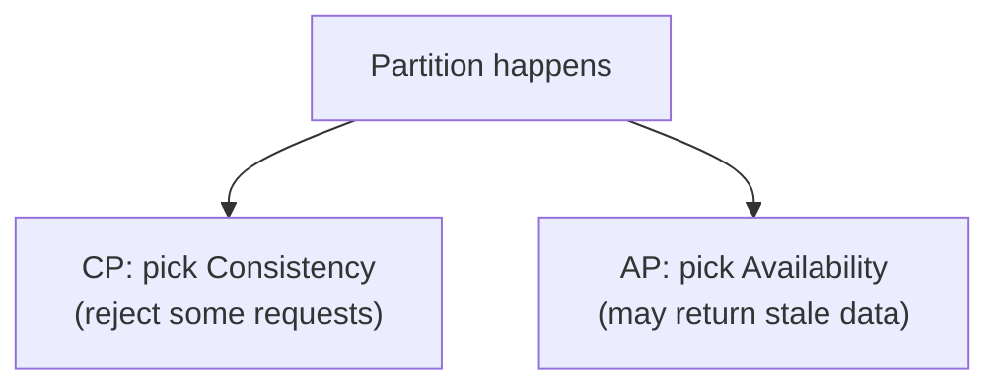
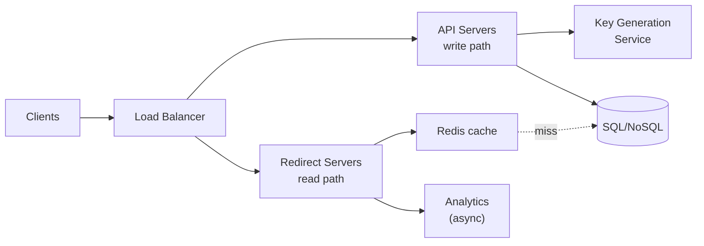
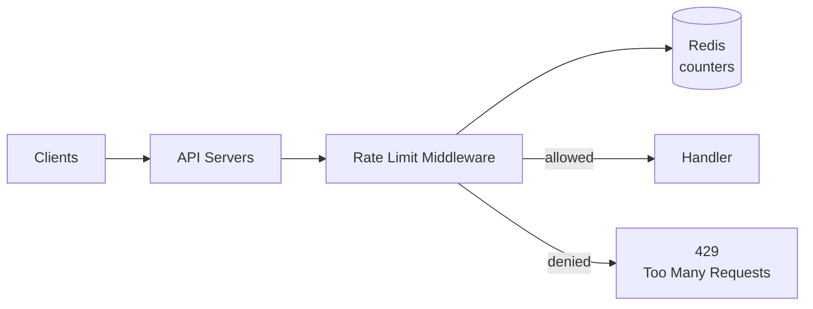
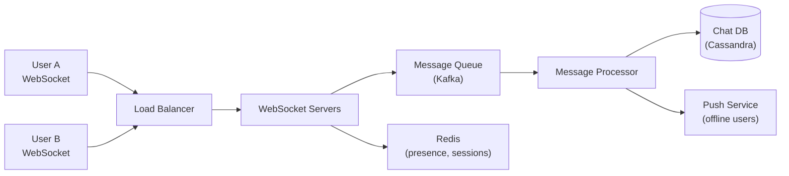

# تراك 4 — System Design: بنك أسئلة إنترفيو

> **ملحوظة مهمة:** System Design في إنترفيوهات الـ mid-level backend بيبقى غالباً سؤال أو اتنين قصار، مش full session. الملف ده مركّز على اللي بيتسأل فعلاً، مش full curriculum.

> **إزاي تذاكر:** ابدأ بالإطار المنهجي (لازم تعرفه قبل أي case study)، بعدين Building Blocks، وبعدين الـ 3 case studies بالترتيب (كل واحدة بتبني على اللي قبلها).

## 🗺️ خريطة الملف

- **القسم 1 — الإطار المنهجي** (Q1–8): إزاي تدير جلسة system design
- **القسم 2 — Building Blocks quick reference** (Q9–15): المكونات الجاهزة تركبها
- **القسم 3 — URL Shortener** (Q16–22): warm-up كلاسيكي
- **القسم 4 — Rate Limiter** (Q23–27): سؤال مصغّر شائع
- **القسم 5 — Chat App** (Q28–35): WebSockets, real-time, delivery

---

# القسم 1 — الإطار المنهجي (Q1–8)

### 1. إزاي تبدأ جلسة system design صح؟
**متبدأش بالتصميم فوراً**. الترتيب الصح:
1. **Clarifying questions** (2-5 دقايق): افهم السؤال بالظبط.
2. **Functional requirements**: إيه اللي النظام لازم يعمله.
3. **Non-functional requirements**: scale, latency, availability.
4. **Back-of-envelope estimation**: QPS, storage, bandwidth.
5. **High-level design**: mermaid architecture.
6. **Deep dive**: schema, APIs, bottlenecks.
7. **Trade-offs & scaling story**: من 1K لـ 1B users.
↳ الفخ الأشهر: junior بيبدأ يرسم فوراً. senior بيسأل ويحدد الـ scope.

### 2. إيه أهم Clarifying Questions تسألها؟
- **مين الـ users؟** (public app? internal tool? B2B؟)
- **كام user؟** (1K, 1M, 1B؟)
- **إيه الـ core features؟** (اختار 2-3، متحاولش تبني كل حاجة)
- **Read-heavy ولا write-heavy؟** (نسبة R:W)
- **Real-time ولا لأ؟** (thresholds مقبولة)
- **Consistency ولا availability أهم؟**
- **Existing constraints؟** (cloud provider, legacy systems)
↳ الجملة الذهبية: "قبل ما أصمم، عايز أفهم..." — بتشتري وقت وتوري نضج.

### 3. الفرق بين Functional و Non-Functional requirements؟
- **Functional**: إيه اللي النظام بيعمله (create post, send message, upload photo).
- **Non-functional**: إزاي بيعمله (latency < 200ms, 99.9% uptime, يخدم 10M DAU).
↳ الفخ: junior بيركّز على الـ functional. senior بيسأل عن الـ non-functional لأنها اللي بتحدد التصميم.

### 4. Back-of-envelope estimation — الأرقام اللي لازم تحفظها؟
| رقم | القيمة |
|---|---|
| Requests/sec في اليوم | DAU × requests-per-user / 86400 |
| Read/Write ratio نموذجي | 100:1 (Twitter), 10:1 (شائع) |
| متوسط حجم tweet/post | ~1KB |
| متوسط حجم صورة | ~500KB |
| متوسط حجم فيديو (1 دقيقة) | ~10MB |
| Latency SSD | ~1ms |
| Latency RAM | ~100ns (10000x أسرع من SSD) |
| Latency شبكة (same DC) | ~0.5ms |
| Latency شبكة (cross-region) | ~50-150ms |
↳ الأرقام دي بتخليك تحسب سريع بلا حاسبة.

### 5. إزاي تحسب الـ QPS؟
```
DAU = 10 million
Requests per user per day = 20
Total requests/day = 200 million
QPS = 200,000,000 / 86,400 ≈ 2,300 requests/sec
Peak QPS = QPS × 3 (عادةً) ≈ 7,000
```
↳ اضرب في 3 للـ peak — الحمل مش موزّع بالتساوي عبر اليوم.

### 6. إزاي تحسب الـ Storage؟
```
Daily new records = 10 million posts
Size per post = 1 KB
Daily storage = 10 GB
Yearly = 10 × 365 ≈ 3.6 TB
مع replication (×3) و metadata و indexes (×2): ~20 TB/year
```
↳ متنساش الـ multiplier — الـ storage الفعلي أكبر بكتير من raw data.

### 7. إيه الـ CAP Theorem؟ وإزاي تستخدمه في trade-offs؟
في نظام distributed، ما تقدرش تحقق التلاتة مع بعض عند حدوث network partition:
- **C**onsistency: كل الـ reads بترجّع أحدث write.
- **A**vailability: كل request بيرد.
- **P**artition tolerance: النظام بيشتغل رغم انقطاع الشبكة.

↳ في الواقع: P حتمي (الشبكة بتفشل)، فالاختيار بين CP و AP. Banking = CP. Social feed = AP.

### 8. Consistency Models — Strong vs Eventual؟
- **Strong**: كل قراءة تشوف آخر كتابة فوراً. مكلف في التوزيع.
- **Eventual**: بعد فترة، كل الـ replicas بيتفقوا. أسرع، أرخص.
- **Read-your-writes**: انت شخصياً تشوف كتاباتك فوراً، الباقي eventual.
- **Causal**: العلاقات السببية محفوظة.
↳ عملياً: أغلب الأنظمة الحديثة eventual مع read-your-writes للـ UX الصحيح.

---

# القسم 2 — Building Blocks Quick Reference (Q9–15)

### 9. إمتى SQL وإمتى NoSQL؟
| السياق | الاختيار |
|---|---|
| Transactions معقّدة (banking, orders) | SQL |
| Relations معقّدة + joins | SQL |
| Schema بيتغيّر بسرعة | NoSQL (document) |
| Scale أفقي ضخم للـ writes | NoSQL |
| Key-value بسيط سريع | Redis/DynamoDB |
| Time-series data | Cassandra/InfluxDB |
| Graph relations | Neo4j |
↳ في نفس النظام ممكن تستخدم أكتر من نوع (polyglot persistence).

### 10. إمتى Cache وإزاي تختار الطبقة؟
| الطبقة | المدة | الاستخدام |
|---|---|---|
| Browser cache | دقايق-ساعات | assets ثابتة |
| CDN | ساعات-أيام | صور، videos، static content |
| Reverse proxy cache | دقايق | HTML pages, API responses |
| Application cache (Redis) | ثواني-ساعات | user sessions, hot data, counters |
| DB query cache | مدمج | queries متكررة |
↳ القاعدة: cache على أقرب طبقة ممكنة للـ user.

### 11. إمتى تحتاج Queue؟
- عملية بطيئة مش لازم تخلص فوراً (email, video processing).
- توزيع الحمل بين workers متعددين.
- Decoupling بين services.
- Buffer للـ spikes (peak traffic).
↳ الفخ: كل حاجة async في queue = complexity زيادة. استخدمها لما فعلاً محتاجها.

### 12. Load Balancer type — L4 ولا L7؟
- **L4**: للأداء الخام، gaming servers، TCP-based.
- **L7**: للـ APIs، path-based routing، SSL termination، feature-based routing.
↳ عملياً في الـ backend: L7 (nginx, HAProxy, cloud LBs).

### 13. Read replicas vs Sharding — إمتى إيه؟
- **Read replicas**: للـ read-heavy workloads. البيانات كاملة على كل replica.
- **Sharding**: لما البيانات نفسها كبيرة جداً على node واحد. البيانات موزّعة.
- **الاتنين مع بعض**: كل shard له replicas.
↳ ابدأ بـ read replicas (أبسط). Sharding آخر حل لما مفيش بديل.

### 14. CDN — إمتى تستخدمه وإزاي؟
- **دايماً** لـ static assets (images, JS, CSS).
- **API responses** لو الـ data مش personalized (edge caching).
- **Video streaming** (adaptive bitrate).
↳ الفايدة الكبيرة: بيقلل latency للـ users البعيدين جغرافياً + بيحمي origin server.

### 15. Message Broker — Kafka ولا RabbitMQ؟
- **Kafka**: event streaming، logs، analytics، high throughput، retention.
- **RabbitMQ**: task queues، RPC، routing معقّد بـ exchanges.
↳ الجملة: "Kafka log تعيد قراءته، RabbitMQ inbox بتُقرأ مرة."

---

# القسم 3 — URL Shortener (Q16–22)

### 16. الـ Clarifying Questions لـ URL Shortener؟
1. **Custom aliases** مسموحة (`/mycompany`)؟
2. **Expiration** للـ URLs؟
3. **Analytics** (clicks, geo, devices)؟
4. **Scale**: كام URL/day، كام read/write ratio؟
5. **Length** للـ short code (7 characters كافي لـ trillions)؟
↳ للتبسيط: no custom aliases، no expiration، 100M URLs/day، read:write = 100:1.

### 17. Requirements و Estimation؟
**Functional**: shorten(long_url) → short_url · redirect(short_url) → long_url · analytics.
**Non-functional**: low latency (<100ms redirect)، high availability، URLs لا تُخمّن.
**Estimation**:
```
100M writes/day = ~1,200 QPS write
Read:Write = 100:1 → 120,000 QPS read
Storage per URL = ~500 bytes → 50 GB/day → 18 TB/year
```
↳ الرقم ده بيوري إن الـ read-heavy = cache الحل الجوهري.

### 18. High-level Design لـ URL Shortener؟

↳ الفصل بين write path و read path مهم لأن الأحمال مختلفة جداً.

### 19. إزاي تولّد الـ Short Code؟
3 طرق شائعة:
1. **Hash-based** (MD5 → base62 → أول 7 chars): collisions ممكنة، محتاج check.
2. **Counter-based** (auto-increment → base62): بسيط، بس sequential (guessable).
3. **Pre-generated keys** (KGS يولّد ملايين مسبقاً في Redis، APIs بتاخد منه): scalable ومتنبأش.
↳ للـ production الحقيقي: KGS الأفضل (لا collisions، لا guessing، سريع).

### 20. SQL ولا NoSQL؟
النظام بسيط (key-value lookup)، بلا relations معقّدة، read-heavy، وscale ضخم → **NoSQL** (Cassandra/DynamoDB) مناسب.
SQL برضه شغّال (Postgres مع hash index على `short_code`)، بس NoSQL بيتوسّع أسهل.
↳ الفخ: مفيش إجابة "صحيحة" — قدّم الاتنين مع trade-offs.

### 21. الـ Bottlenecks المتوقعة والحلول؟
- **DB reads**: cache aggressive في Redis (short_code → long_url)، TTL أسبوع مثلاً.
- **Cache stampede** على URLs viral: single-flight أو probabilistic expiration.
- **Analytics** بيبطّئ الـ redirect: افصله async في queue.
- **Hot short codes**: consistent hashing على multiple cache nodes.
↳ 99% من الأداء بيجي من الـ cache — hit rate عالي = latency منخفض.

### 22. Follow-ups شائعة؟
- **إزاي تمنع الـ URLs الخبيثة؟** integrate malware detection APIs.
- **إزاي تحسب clicks بدقة تحت الحمل؟** counter في Redis، flush دوري لـ DB.
- **Custom aliases مع الـ pre-generated keys إزاي؟** جدول منفصل للـ custom + check قبل الإنشاء.
- **Expiration**: TTL في DB + cleanup job، أو TTL في Redis مباشرة.

---

# القسم 4 — Rate Limiter (Q23–27)

### 23. Clarifying Questions لـ Rate Limiter؟
1. **Per-user, per-IP, per-API-key**؟
2. **Global rate ولا per-endpoint**؟
3. **Distributed** (كذا server) ولا single؟
4. **Sync ولا async check**؟
5. **إيه اللي بيحصل عند تجاوز الحد** (block, queue, throttle)؟
↳ للتبسيط: per-user، per-endpoint، distributed، sync، return 429.

### 24. أنهي algorithm تختار؟ (خلاصة)
| Algorithm | مميزات | عيوب |
|---|---|---|
| **Fixed Window** | بسيط | burst عند حدود الفواصل |
| **Sliding Window** | دقيق | أثقل حسابياً |
| **Token Bucket** | يسمح بـ burst | معقّد شوية |
| **Leaky Bucket** | يمهّد الحمل | مش مرن للـ burst |
↳ الأشهر عملياً: **token bucket** (Stripe, AWS) أو **sliding window**.

### 25. Distributed Rate Limiter — التحدي الحقيقي؟
لو عندك كذا API server، كل واحد بيحسب لوحده = المستخدم يقدر يعمل N × servers طلبات. لازم **shared state** (Redis).
```js
// distributed token bucket in Redis (simplified)
async function allow(userId, limit, window) {
    const key = `rate:${userId}`;
    const count = await redis.incr(key);
    if (count === 1) await redis.expire(key, window);
    return count <= limit;
}
```
↳ الفخ: كل request بيعمل Redis call = latency. الحل: local cache قصير + periodic sync.

### 26. High-level Architecture؟

↳ الـ middleware بيقف قبل الـ handler — قرار الفلترة الأول.

### 27. Follow-ups شائعة؟
- **Response format**: 429 + `Retry-After` header + `X-RateLimit-*` headers.
- **Redis failure**: fail open (اسمح بكل الطلبات مؤقتاً) ولا fail closed (ارفض)؟ عادةً fail open للـ availability.
- **Sliding window بـ sorted set**: عناصر بـ score = timestamp، احذف اللي أقدم من الـ window.
- **Multi-tier limits**: 10/second + 1000/hour مع بعض.

---

# القسم 5 — Chat App (Q28–35)

### 28. Clarifying Questions لـ Chat App؟
1. **1-on-1 ولا group chats**؟ (حجم الـ group الأقصى؟)
2. **Text فقط ولا media** (images, videos, files)؟
3. **Delivery guarantees**: at-most-once, at-least-once, exactly-once؟
4. **Read receipts + typing indicators + presence**؟
5. **Offline messages**: إزاي بيوصلوا لما اليوزر يرجع؟
6. **Scale**: كام DAU، كام message/second؟
↳ للتبسيط: 1-on-1 + groups لحد 100، text + images، read receipts + presence، 500M DAU.

### 29. Estimation؟
```
DAU = 500M
Messages per user per day = 40
Total messages/day = 20 billion
Messages/sec = 20B / 86,400 ≈ 230,000
Peak (×3) = 700,000 messages/sec
Storage per message = ~100 bytes text + metadata
Daily storage = 20B × 100B = 2 TB (text only)
```
↳ الأرقام دي بتحدد التصميم — 700K messages/sec = محتاج توزيع جدي.

### 30. High-level Design؟

↳ الـ WebSocket servers stateless-ish — الـ state (اليوزر في connection فين) في Redis.

### 31. WebSocket ولا HTTP polling؟
**WebSocket** بلا شك — real-time bidirectional. HTTP polling بيهدر resources ويدّي latency عالي.
```js
// WebSocket connection lifecycle
ws.on('connection', (socket) => {
    socket.userId = authenticate(socket);
    connections.set(socket.userId, socket);            // track this connection
    socket.on('message', (msg) => routeMessage(msg));
    socket.on('close', () => connections.delete(socket.userId));
});
```
↳ الـ WebSocket بيسمح للسيرفر يـ push للـ client بلا polling.

### 32. إزاي توصل رسالة من User A لـ User B لو كل واحد على WebSocket server مختلف؟
User A مربوط على WS-1، User B على WS-3. رسالة من A → WS-1 → **message queue (Kafka)** → WS-3 يقرا Kafka → يبعت لـ B.
البديل: WS-1 يسأل Redis "B فين مربوط؟" → يبعت مباشرة لـ WS-3.
↳ الأشهر عملياً: Kafka pub/sub + كل WS server subscribes لـ users بتوعه.

### 33. Delivery Guarantees — إزاي؟
**At-least-once** الحل العملي:
1. Client A بيبعت الرسالة بـ `client_id` فريد.
2. Server يخزّنها في DB أول ما توصل.
3. Server يبعت `ack` للـ A → A يعرف إنها اتحفظت.
4. Server يحاول يوصلها لـ B عبر WebSocket. لو B offline، تفضل في DB.
5. B يبعت `ack` لما يستلم → server يعلّمها delivered.
6. B يفتح المحادثة → server يعلّمها read.
↳ الـ `client_id` بيمنع duplicates لو A أعاد الإرسال.

### 34. تصميم الـ DB Schema؟
| جدول | fields أساسية |
|---|---|
| `messages` | `id, chat_id, sender_id, content, created_at, status` |
| `chats` | `id, type (1-1/group), created_at` |
| `chat_members` | `chat_id, user_id, joined_at, last_read_at` |
| `presence` (Redis) | `user_id → { status, last_seen }` |

**Sharding key**: `chat_id` — كل الرسائل بتاعت محادثة معاً على نفس الـ shard = queries سريعة.
```sql
-- most common query: get last 50 messages in a chat
SELECT * FROM messages WHERE chat_id = ? ORDER BY created_at DESC LIMIT 50;
```
↳ الـ index الأساسي: `(chat_id, created_at DESC)` — الـ hot query.

### 35. Follow-ups شائعة على Chat App؟
- **Group chat scaling** (100+ members): fan-out على write vs read — لكل group members قليلين، اعمل fan-out على write.
- **Media messages**: ارفع للـ blob storage (S3)، ابعت الـ URL في الرسالة.
- **Encryption**: end-to-end encryption (Signal Protocol) — السيرفر مبيقراش المحتوى.
- **Push notifications** لـ offline users: FCM/APNs بعد timeout معيّن.
- **Typing indicators**: بيتبعت عبر WebSocket بلا حفظ في DB (fire-and-forget).
- **Message ordering داخل chat**: server timestamps + `chat_id` كـ partition key = ordering مضمون داخل الـ chat.
- **Presence (online/offline)**: Redis مع TTL — heartbeat كل 30 ثانية.

---

## ✅ Checkpoint نهائي — System Design

1. **الإطار**: clarifying questions → requirements → estimation → HLD → deep dive → trade-offs.
2. **الأرقام**: DAU × requests/user / 86400 = QPS. اضرب ×3 للـ peak. Storage: raw × 6 (replication + indexes).
3. **CAP + Consistency models**: أغلب الأنظمة الحديثة AP + eventual + read-your-writes.
4. **URL Shortener**: KGS للـ short codes، cache aggressive، async analytics.
5. **Rate Limiter**: token bucket + Redis shared state + fail open.
6. **Chat App**: WebSocket + Kafka + Cassandra + Redis presence + at-least-once + client_id.

---

## 🫒 زتونة الإنترفيو

> **"System Design مش عن الإجابة الصح — دي عن إزاي بتفكر تحت الضغط. المُنترفيور مش عايز يشوف نظام كامل، عايز يشوف: هل بتسأل قبل ما تصمم؟ هل بتعرف الأرقام أهم من الرسم؟ هل بتتعامل مع الـ trade-offs بوعي؟ هل بتحدد الـ bottlenecks قبل ما تحصل؟ الإطار المنهجي (clarifying → requirements → estimation → design → deep dive) هو اللي بيفرّق junior عن senior، مش عدد المكونات في الرسمة. وأخيراً: no perfect design — كل تصميم trade-off بين consistency و availability، بين cost و performance، بين simplicity و flexibility. اللي بتقوله بصوت عالي عن هذه الاختيارات هو اللي بيحدد نتيجة الإنترفيو."**

---

*تراكات جاية → Databases (SQL/NoSQL بعمق) · DevOps (Docker, CI/CD, K8s) · Behavioral (STAR).*
