# الدليل الشامل والمعماري الكامل لأسئلة المقابلات الفنية لمهندس الـ Backend

> 💡 **ملاحظة منهجية وتوجيهية:**
> هذا المستند يحتوي على 100 سؤال وجواب تغطي كافة جوانب هندسة الـ Backend، البنية التحتية، قواعد البيانات، الأنظمة الموزعة، الأمان، وتصميم النظم (System Design).
> الشرح مكتوب بالعامية المصرية السلسة والعميقة 100%، ممتلئ بالأمثلة الواقعية، المخططات الهيكلية (Mermaid)، والأكواد التطبيقية، مع إضافة تشبيهات مبسطة جداً لكل مفهوم ("إزاي تشرحها لطفل صغير؟") دون أي اختصار أو تقليل من التفاصيل التقنية.

---

## Q1 — إيه اللي بيحصل فعلياً لما تكتب URL في المتصفح وتدوس Enter؟

### أصل الحكاية

السؤال ده هو الكلاسيكو الأكبر في كل المقابلات الفنية للباك اند. الهدف منه مش إنك تقول "المتصفح بيكلم السيرفر والموقع بيفتح"، الهدف هو اختبار مدى استيعابك العميق لطبقات الشبكة (Networking Layers)، الـ DNS Resolution، اتصالات الـ TCP/TLS، والـ HTTP Pipeline.

الرحلة بتمر بـ 6 مراحل متتالية:

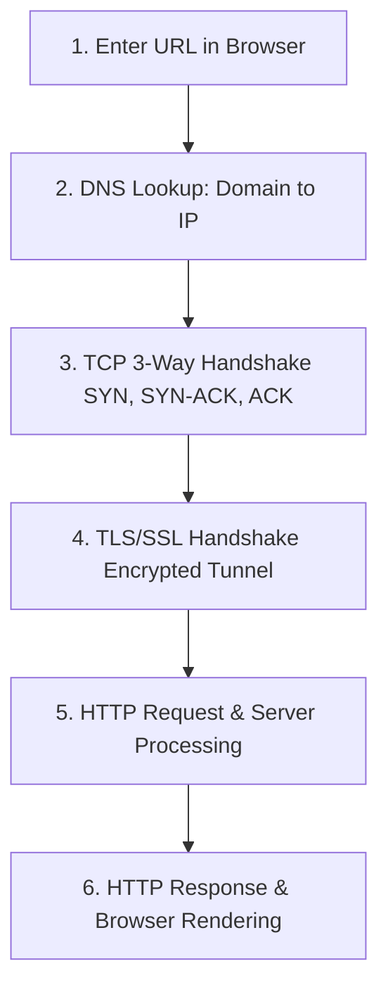

1. **DNS Lookup (ترجمة العنوان)**: المتصفح بيتحقق الأول من الـ Browser Cache، ثم OS Cache، ثم Router Cache، وأخيراً يكلم الـ DNS Resolver لتحويل `https://store.com` لـ IP زي `192.0.2.1`.
2. **TCP 3-Way Handshake (تأسيس الاتصال)**: المتصفح بيبعت `SYN` للسيرفر على البورت 443، السيرفر بيرد بـ `SYN-ACK`، والمتصفح بيرد بـ `ACK`.
3. **TLS/SSL Handshake (تأمين الاتصال)**: الاتفاق على مفاتيح التشفير (Client Hello -> Server Hello + Certificate Verification -> Key Exchange).
4. **HTTP Request Transmission**: المتصفح بيبعت طلب الـ HTTP (مثلاً `GET /api/v1/products`).
5. **Server Processing**: السيرفر (Nginx -> Node.js API -> Database) يعالج الطلب ويرجع الرد.
6. **HTTP Response & Rendering**: العميل بيستلم الـ HTML/JSON ويبدأ يعرض الصفحة.

> 💡 **إزاي تشرحها لطفل صغير؟**
> تخيل إنك عايش في بيت وعايز تطلب لعبة من محل اسمه "سوبر تويز":
> 1. بتفتش في الدليل عن رقم تليفون المحل (DNS).
> 2. بتتصل بالمحل والراجل بيرد عليك: "أهلاً بك، سامعني؟" وتقوله "أيوه سامعك" (TCP Handshake).
> 3. بتتفقوا على كلمة سر بينكم عشان محدش غريب يتجسس على مكالمتكم (TLS Handshake).
> 4. بتقوله: "عايز لعبة الدبوس الأحمر" (HTTP Request).
> 5. الدليفري يجيبلك اللعبة لحد باب البيت (HTTP Response).

---

## Q2 — إيه الـ DNS (Domain Name System) وإزاي بيحول الاسم لـ IP Address؟

### أصل الحكاية

الشبكة والإنترنت مبيفهموش أسماء الكلمات زي `google.com`، الأجهزة بتفهم فقط أرقام الـ **IP Addresses** (زي `142.250.190.46`). الـ **DNS** هو دليل التليفونات العالمي للإنترنت.

رحلة الـ DNS Resolution التكرارية (Iterative DNS Query):
1. **Browser / OS Cache**: فحص الذاكرة المؤقتة للجهاز.
2. **Recursive Resolver (ISP / 8.8.8.8)**: لو مش عنده، بيبدأ يبحث في الشجرة الهرمية:
3. **Root Name Server (`.`)**: بيوجه الـ Resolver لـ TLD Server.
4. **TLD Name Server (`.com`)**: بيوجه الـ Resolver لـ Authoritative Name Server.
5. **Authoritative Name Server**: بيحتفظ بالـ DNS Records الفعلية ويرجع الـ IP النهائي.

> 💡 **إزاي تشرحها لطفل صغير؟**
> زي لما تسأل في المدرسة عن ولد اسمه "علي":
> - تسأل الناظر: "فين علي؟" يقولك: "أنا معرفوش، بس روح لمبنى سنة رابعة" (Root Server).
> - تروح لمبنى سنة رابعة يسألوك: "أنهي فصل؟ روح لفصل 4/2" (TLD Server).
> - تفتح باب فصل 4/2، المدرس يقولك: "اه علي قاعد في الدسك التالت برقم 15!" (Authoritative Server).

---

## Q3 — إيه الفرق بين الـ IP Address والـ Domain Name والـ Port؟

### أصل الحكاية

عشان تقدر توصل لأي ميزة أو برنامج جوه السيرفرات السحابية، محتاج تلات عناوين رئيسية:

- **IP Address (عنوان الجهاز)**: المعرف الفريد للجهاز السيرفر في الشبكة (زي عنوان المبنى أو العمارة).
- **Domain Name (اسم النطاق)**: اسم سهل ومقروء للبشر ينوب عن الـ IP (زي اسم برج السلام).
- **Port Number (منفذ الخدمة)**: رقم المنفذ البرمجي المعين لخدمة معينة جوه نفس السيرفر (زي رقم الشقة جوه العمارة). (مثلاً: Port 80 لـ HTTP، Port 443 لـ HTTPS، Port 5432 لـ PostgreSQL).

> 💡 **إزاي تشرحها لطفل صغير؟**
> - **IP Address**: عنوان عمارة صاحبك (شارع النصر عمارة 12).
> - **Domain Name**: اسم دلع العمارة اللي الناس عارفاها بيه (عمارة اللوتس).
> - **Port**: رقم الشقة اللي صاحبك عايش فيها جوه العمارة (شقة رقم 5)!

---

## Q4 — إيه الـ Client-Server Model وإزاي المتصفح بيتواصل مع السيرفر؟

### أصل الحكاية

معمارية **Client-Server** هي الأساس اللي أتبنى عليه الـ Web كلو. المعمارية بتعتمد على توزيع الأدوار بين طرفين:

- **Client (العميل)**: هو التطبيق اللي بيطلب البيانات أو الخدمات (زي المتصفح، تطبيق الموبايل، أو جهاز IoT). العميل دايماً هو اللي بيبدأ الكلام.
- **Server (السيرفر)**: هو الجهاز/التطبيق اللي بيستمع للطلبات القادمة، يطبق قواعد العمل (Business Logic)، يقرأ من الداتابيز، ويرجع الرد.

> 💡 **إزاي تشرحها لطفل صغير؟**
> زي المطعم بالضبط:
> - **العميل (Client)**: الزبون اللي قاعد على الطاولة ويطلب المنيو.
> - **السيرفر (Server)**: الطباخ جوه المطبخ اللي بيستلم أوردر الزبون، يطبخه، ويبعته على الطاولة!

---

## Q5 — إيه الـ TCP/IP Model بشكل مبسط؟

### أصل الحكاية

عشان البيانات تتنقل عبر الشبكة من جهازي لجهازك، بتعدي على 4 طبقات حاسمة (TCP/IP 4-Layer Model):

1. **Application Layer**: بروتوكولات التطبيقات (HTTP, HTTPS, FTP, SSH, SMTP).
2. **Transport Layer**: بروتوكولات نقل البيانات وضمان وصولها (TCP, UDP).
3. **Internet Layer**: توجيه الحزم عبر الشبكة (IP, ICMP, Routing).
4. **Network Access / Link Layer**: نقل الكروت والأسلاك والأسلاك اللاسلكية Physical Layer (Ethernet, Wi-Fi).

---

## Q6 — إيه الفرق بين الـ TCP والـ UDP؟ ومتى تستخدم كل واحد؟

### أصل الحكاية

في طبقة النقل (Transport Layer)، قدامك بروتوكولين معزولين تماماً:

- **TCP (Transmission Control Protocol)**: بروتوكول موثوق (Reliable Connection-Oriented). بيضمن وصول كل حرف بالترتيب الصح وبدون أي فقدان للبيانات، مع إعادة إرسال الحزم المفقودة. (مناسب لـ REST APIs، المعاملات المالية، الإيميلات).
- **UDP (User Datagram Protocol)**: بروتوكول سريع وغير معني بالاتصال (Connectionless & Unreliable). بيبعت البيانات فوراً بدون انتظار التأكيد أو إعادة الإرسال. (مناسب لـ البث المباشر Live Streaming، الألعاب أونلاين Online Gaming، والمكالمات الصوتية WebRTC).

> 💡 **إزاي تشرحها لطفل صغير؟**
> - **TCP**: زي لما تبعت جواب مسجل في البوسطة لازم المستلم يوقع عليه ولما يضيع الجواب البوسطة تبعت غيره لحد ما يوصل سليم.
> - **UDP**: زي لما ترمي كرات مائية على الحيطة بسرعة جداً! مش مهم كرة تقع في السكة، المهم الكرة اللي بعدها تروح فوراً من غير ما توقف اللعب!

---

## Q7 — إيه الـ Three-Way Handshake بتاع TCP؟

### أصل الحكاية

قبل ما أي بيانات تتنقل بـ TCP، لازم السيرفر والعميل ينفذوا مصافحة ثلاثية (**3-Way Handshake**) للتأكد من إن الطرفين جاهزين ولديهم الأرقام التسلسلية (Sequence Numbers):

1. **SYN (Synchronize)**: العميل يرسل إشارة "عايز اتصل بيك برقم sequence X".
2. **SYN-ACK**: السيرفر بيرد "أنا استلمت طلبك وجاهز برقم sequence Y".
3. **ACK (Acknowledge)**: العميل بيرد "تمام، استلمت تأكيدك وبدأت الاتصال!".

---

## Q8 — إيه الفرق بين الـ HTTP والـ HTTPS؟ وإيه دور الـ SSL/TLS Certificate؟

### أصل الحكاية

- **HTTP (Hypertext Transfer Protocol)**: ينقل البيانات بين العميل والسيرفر بصيغة النص الصريح (Plaintext). لو هكر وقف في الشبكة (Man-in-the-Middle)، يقدر يقرأ كلمات السر والبيانات البنكية بسهولة!
- **HTTPS (HTTP Secure)**: هو نفس بروتوكول HTTP ولكنه يمر داخل نفق تشفير آمن بـ **TLS/SSL Encryption**. البيانات بتتشفر كلياً ولا يمكن قراءتها حتى لو تم اعتراضها.

شهادة الـ **SSL/TLS Certificate** الصادرة من جهات موثوقة (Certificate Authorities - CA) بتثبت هوية السيرفر وتوفر مفاتيح التشفير العامة والخاصة (Asymmetric & Symmetric Keys).

---

## Q9 — إيه الـ Ports الشهيرة؟ ولليه محتاجين أرقام مختلفة أصلاً؟

### أصل الحكاية

البورتات المفتوحة في أي نظام هي 65,535 بورت. البورتات المشهورة (Well-Known Ports):
- **Port 80**: HTTP العادي.
- **Port 443**: HTTPS المشفر.
- **Port 22**: SSH للدخول الآمن للسيرفرات.
- **Port 5432**: PostgreSQL Database.
- **Port 3306**: MySQL Database.
- **Port 6379**: Redis Cache.

---

## Q10 — إيه الـ HTTP أصلاً وإيه معنى إنه Stateless Protocol؟

### أصل الحكاية

بروتوكول **HTTP** هو بروتوكول **Stateless (عديم الذاكرة)**. معناه إن السيرفر بيعامل كل HTTP Request كطلب جديد مستقل كلياً ليس له أي علاقة بالطلب الذي سبقه! السيرفر لا يتذكر تلقائياً هل هذا المستخدم سجل دخوله منذ ثانية أم لا، ولذلك نحتاج لتقنيات مثل Cookies, Sessions, أو JWT لنقل حالة المستخدم (State) مع كل طلب.

---

## Q41 — إيه الفرق بين Vertical Scaling وHorizontal Scaling، وليه Horizontal أصعب تقنياً؟

### أصل الحكاية

في مواقع المتاجر الكبيرة، لما عدد الزباين يزيد فجأة من 1,000 زبون لمليون زبون في مواسم التخفيضات (زي الجمعة البيضاء)، سيرفر الباك اند بيبدأ يتخنق وتظهر مشاكل في الـ CPU والـ RAM. قدامك طريقين هندسيين عشان تكبر قدرة السيستم بتاعك:

1. **Vertical Scaling (Scale-Up - التكبير الرأسي)**: إنك تجيب نفس السيرفر وتزود امكانياته العتادية (مثلاً ترفع الـ RAM من 8GB لـ 64GB وتزود الـ CPU Cores).
2. **Horizontal Scaling (Scale-Out - التكبير الأفقي)**: إنك تشتري سيرفرات زيانية صغيرة وتخليهم يشتغلوا جنب بعض بالتوازي ورا **Load Balancer** بيوزع الطلبات عليهم.

> 💡 **إزاي تشرحها لطفل صغير؟**
> تخيل إن عندك بيت صغير فيه أوضة واحدة:
> - **Vertical Scaling**: تبني دور تاني وتالت فوق نفس البيت (تكبر المبنى الرأسي). بس فيه حد أقصى للارتفاع والبيت هيقع لو زودت أوي!
> - **Horizontal Scaling**: تشتري أرض جنب البيت وتبني 10 بيوت شبه بعض بالضبط! وتجيب بواب عند الشارع (Load Balancer) يوزع الزوار على الـ 10 بيوت!

| وجه المقارنة | Vertical Scaling (Scale-Up) | Horizontal Scaling (Scale-Out) |
|---|---|---|
| **الفكرة** | تزويد موارد السيرفر الواحد (RAM/CPU) | زيادة عدد السيرفرات المتوازية |
| **الحد الأقصى** | ليه حد عتادي حتمي (Hardware Limit) | مرن ومش محدود نظرياً (Elastic Scale) |
| **التكلفة** | غالية جداً بتصاعد مكلف في السيرفرات الضخمة | اقتصادية وتدريجية على حسب الحاجة |
| **التعقيد الهندسي** | سهل جداً (مش محتاج تعدل كود) | معقد (محتاج كود Stateless و DB Pooling) |

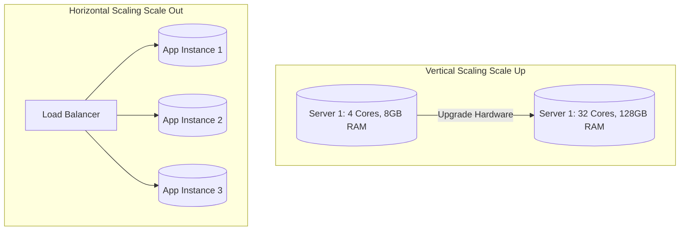

```javascript
// كود Express API جاهز للتكبير الأفقي (Stateless)
const express = require('express');
const app = express();

// إياك تخزن بيانات الـ Session في ذاكرة السيرفر المحلية!
// غلط: const userSessions = {}; 

// الصح: استخدم Redis خارجي مركزي لحفظ الـ Session والتوكينات!
const redis = require('redis');
const redisClient = redis.createClient({ url: process.env.REDIS_URL });

app.get('/api/v1/profile', async (req, res) => {
  const token = req.headers.authorization;
  const user = await redisClient.get(`session:${token}`);
  if (!user) return res.status(401).json({ error: 'غير مصرح لك بالدخول' });
  res.json(JSON.parse(user));
});
```

#### مثال 1: التطبيق العملي — تكبير السيرفرات في مواسم التخفيضات (Black Friday)

في المتجر، استخدام **Horizontal Scaling** مع **Auto-Scaling Groups** في AWS بيخلي السيستم يفتح 20 سيرفر Node.js أوتوماتيك أثناء الذروة، ويرجع يقفلهم لـ 2 سيرفر في الليل، وده بيوفر آلاف الدولارات في فاتورة السحابة.

#### مثال 2: فخ شائع — حفظ ملفات الصور المرفوعة على القرص الصلب المحلي للسيرفر

من الأخطاء الكارثية إنك تحفظ الصور المرفوعة جوه فولدر `uploads/` محلي على السيرفر! لو عندك 3 سيرفرات ورا Load Balancer، الزبون اللي يرفع صورته على سيرفر 1، لما يعمل Refresh والطلب يروح لسيرفر 2 الصور مش هتبان! الحل إنك ترفع الصور على **Object Storage خارجي (زي AWS S3)**.

#### مثال 3: حالة إنتاجية — معالجة مشكلة انفجار الاتصالات بالداتابيز (Connection Explosion)

لما عدد سيرفرات الباك اند يزيد لـ 50 سيرفر أفقي، كل سيرفر بيفتح 20 اتصال بالداتابيز (إجمالي 1,000 اتصال). سيرفر PostgreSQL هيقع تحت الضغط ده! الحل إنك تحط **PgBouncer (Connection Pooler)** كطبقة مركزية بين السيرفرات والداتابيز.

---

## Q42 — إيه هو الـ Middleware، وإزاي الـ Request بيمشي في "خط أنابيب" جوّه السيرفر؟

### أصل الحكاية

لما تبني تطبيق باك اند احترافي، غلط جداً تحط كل الكود (فحص التوثيق، تسجيل اللوجات، التطهير، وقواعد العمل) جوه دالة الـ Controller الرئيسية.

الـ **Middleware** هو دالة برمجية بتقف في نص الطريق بين استقبال الـ HTTP Request والوصول للـ Controller النهائي. الميدل وير بيشتغل بنمط **Chain of Responsibility / Pipeline Pattern**:
الطلب بيدخل الميدل وير الأول (مثلاً Logging Middleware)، ينفذ مهمته، وبعدين ينادي دالة `next()` عشان يمرر الطلب للميدل وير اللي بعده (زي Auth Middleware)، وهكذا لحد ما يوصل للـ Controller.

> 💡 **إزاي تشرحها لطفل صغير؟**
> تخيل إنك داخل المطار عشان تسافر:
> - **المحطة الأولى (Middleware 1)**: الموظف بيفتش التذكرة وباسمك (Auth check). لو التذكرة صحيحة يقولك "عدي للمحطة اللي بعدها" (`next()`).
> - **المحطة الثانية (Middleware 2)**: موظف الأمان بيحط الشنطة في الجهاز ويفتشها (Validation & Sanitization).
> - **المحطة الأخيرة (Controller)**: تدخل طيارتك بسلام وتسافر!

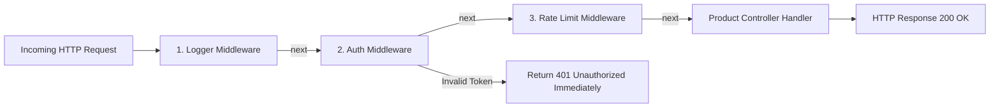

```javascript
// مثال تطبيقي لخط أنابيب الـ Middleware في Express
const express = require('express');
const app = express();

// 1. ميدل وير تسجيل اللوجات
app.use((req, res, next) => {
  console.log(`[${new Date().toISOString()}] ${req.method} ${req.url}`);
  next(); // مرر الطلب للميدل وير اللي بعده!
});

// 2. ميدل وير فحص الهوية والتوثيق
const authenticateToken = (req, res, next) => {
  const token = req.headers['authorization'];
  if (!token) return res.status(401).json({ error: 'التوكين مفقود (401)' });
  
  // فحص صحة التوكين...
  req.user = { id: 42, role: 'ADMIN' };
  next(); // المستخدم تمام، كمل!
};

// استخدام الميدل وير في الـ Route
app.post('/api/v1/products', authenticateToken, (req, res) => {
  res.json({ message: 'تم إضافة المنتج بنجاح بواسطة الأدمن', user: req.user });
});
```

---

## Q43 — إزاي Node.js بيتعامل مع آلاف الطلبات المتزامنة وهو أصلاً Single-Threaded؟

### أصل الحكاية

فيه لغبطة بتكشف المطورين لما يعرفوا إن Node.js شغال بسيرفر أحادي الخيط (**Single-Threaded Event Loop**)، وبيسألوا: "إزاي بيقدر يشيل 50,000 زبون في نفس اللحظة من غير ما يتخنق؟"

السر في معمارية الـ **Non-Blocking I/O** وقوة مكتبة **libuv**:
في Node.js، الـ Main Thread مسؤول بس عن تنفيذ كود الـ JavaScript ومراقبة الأحداث (**Event Loop**). لما يجيله طلب قراءة من الداتابيز أو ملف، Node.js مبيقفش مستني! بيبعت الطلب لنظام التشغيل (OS Kernel) أو لـ **libuv Thread Pool** في الخلفية، ويفرغ الـ Event Loop فوراً لاستقبال طلبات الزباين التانيين. وأول ما الداتابيز تخلص، الـ Callback بيرجع للـ Event Loop عشان يرد على الزبون.

> 💡 **إزاي تشرحها لطفل صغير؟**
> تخيل مطعم بيتزا فيه جرسون واحد شاطر جداً (Event Loop):
> - **طريقة Blocking العادية**: الجرسون ياخد الأوردر من الطاولة 1، ويروح يقف في المطبخ 10 دقائق جنب الفران لحد ما البيتزا تستوي! الطاولات التانية هتموت من الجوع!
> - **طريقة Node.js Non-Blocking**: الجرسون ياخد الأوردر من طاولة 1 ويديه للمطبخ، ويروح فوراً ياخد أوردرات من طاولة 2 و 3 و 4. وأول ما طباخ المطبخ ينادي "بيتزا 1 جهزت!"، الجرسون يروح ياخدها ويديهالهم في ثانية!

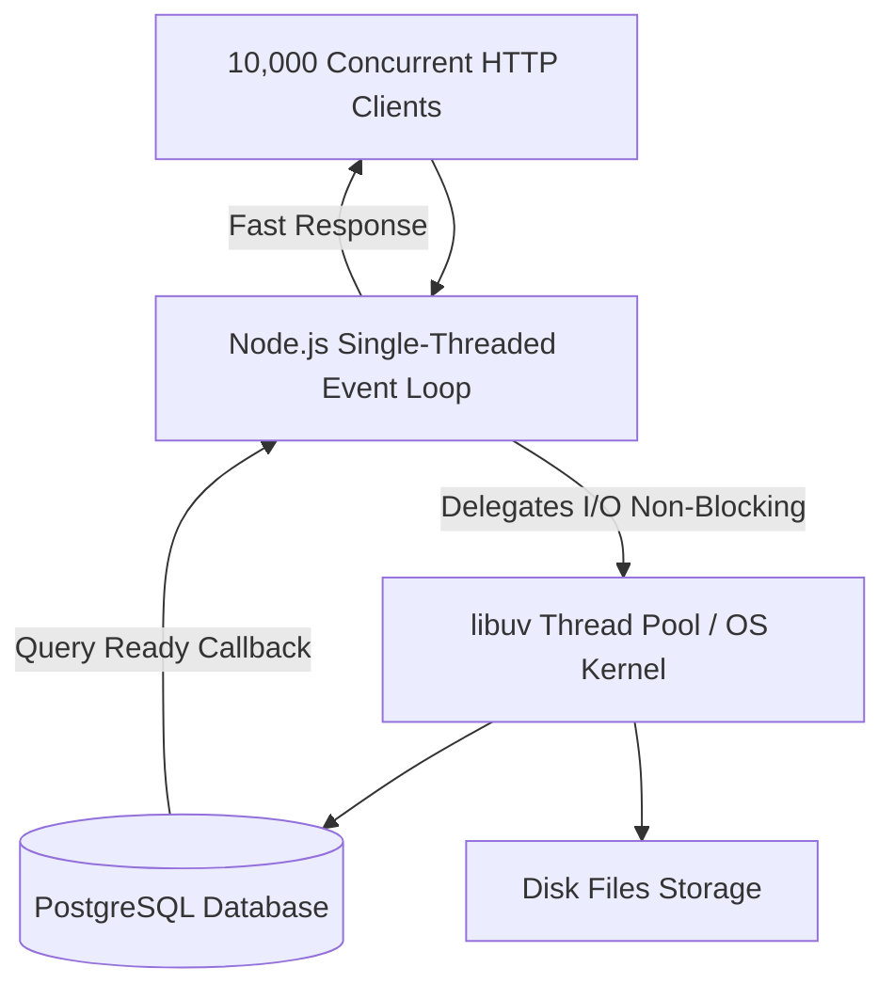

---

## Q44 — إمتى تستخدم Message Queues بدل ما تعالج العملية مباشرة جوّه الـ Request؟

### أصل الحكاية

لما الزبون يدوس "تأكيد الشراء" في المتجر، السيستم محتاج يعمل حاجات كتير: خصم الفلوس من الكارت البنكي، حجز المخزون، عمل فاتورة PDF، بعت إيميل للزبون، بعت رسالة SMS، وتحديث إحصائيات المبيعات.

لو نفذت كل المهمات دي متزامنة جوه الـ HTTP Request الرئيسي، الرد هياخد 8 ثواني كاملة! ولو سيرفر الإيميلات وقع، عملية الشراء كلها هتفشل والزبون هيضايق ويطفش.

الحل المعماري هو استخدام **Message Queue (طابور الرسائل)** زي **RabbitMQ** أو **Apache Kafka**:
السيرفر بيعالج الحاجات الحساسة المباشرة بس (خصم الفلوس وحجز القطعة) في 50ms، ويرمي رسالة (Event/Job) في الـ Queue ويرجع للزبون `200 OK Success`. في الخلفية، سيرفرات فرعية معزولة (**Background Workers / Consumers**) بتسحب الرسائل وتطلع الـ PDF وتبعت الإيميلات والـ SMS براحتها من غير ما أداء المتجر يربك أو يقل!

> 💡 **إزاي تشرحها لطفل صغير؟**
> تخيل إنك واقف في طابور المخبز بتشتري عيش:
> - **من غير Queue (مباشر)**: الفرّان ياخد منك الفلوس، ويروح يزرع القمح، ويطحنه، ويخبزه، ويديك العيش! الطابور كله هيقف ويموت من التعب!
> - **مع الـ Queue**: الفرّان ياخد الفلوس ويديك وصل في ثانية واحدة ويقولك "عدي على شباك الاستلام هناك". وفي الصالة جوه، العمال الشاطرين بيطلعوا العيش ويدوهولك من شباك الاستلام براحتهم!

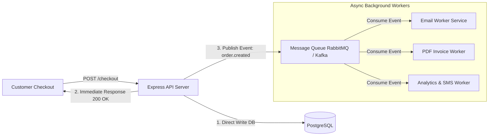

---

## Q45 — إيه هي الـ Database Connection Pooling وليه إجباري تستخدمها؟

### أصل الحكاية

إنشاء اتصال جديد مع قاعدة البيانات (PostgreSQL/MySQL) عملية مكلفة وتقيلة جداً على السيرفر! العملية بتطلب فتح TCP Handshake، وتشفير TLS، وفحص بيانات التوثيق (User Authentication Check)، وده بيستهلك من 50ms لـ 100ms وكمية RAM كبيرة لكل اتصال.

لو كود الباك اند بيفتح اتصال جديد مع كل HTTP Request يقفله لما يخلص، الداتابيز هتنسحق وتقع تحت ضغط 1,000 طلب في الثانية بسبب استهلاك الـ CPU والذاكرة في فتح وإغلاق الاتصالات!

الحل هو **Database Connection Pooling**:
السيرفر بيفتح أول ما يشتغل أسطول ثابت ومجهز من الاتصالات المفتوحة (مثلاً Pool فيه 20 اتصال). لما يجي HTTP Request محتاج يقرأ من الداتابيز، بيستعير اتصال جاهز من الـ Pool ينفذ بيه الاستعلام فوراً، وأول ما يخلص يرجع الاتصال للـ Pool عشان الطلب اللي بعده يستفاد منه، من غير ما يقفل الاتصال خالص!

> 💡 **إزاي تشرحها لطفل صغير؟**
> تخيل إنك رايح مشوار:
> - **من غير Pool**: كل ما تعوز تمشي مشوار، تروح تشتري عربية جديدة زيرو، تسجلها في المرور، وتركبها، ولما توصل تفكها خردة وترميها! (إرهاق وفلوس باظت!).
> - **مع Connection Pool**: إنت مأجر جراج فيه 5 تاكسيات شغالين ومجهزين وسواقينهم قاعدين مستنيين. تاخد تاكسي تعمل المشوار، وترجعه الجراج يستفاد منه اللي بعدك في ثانية!

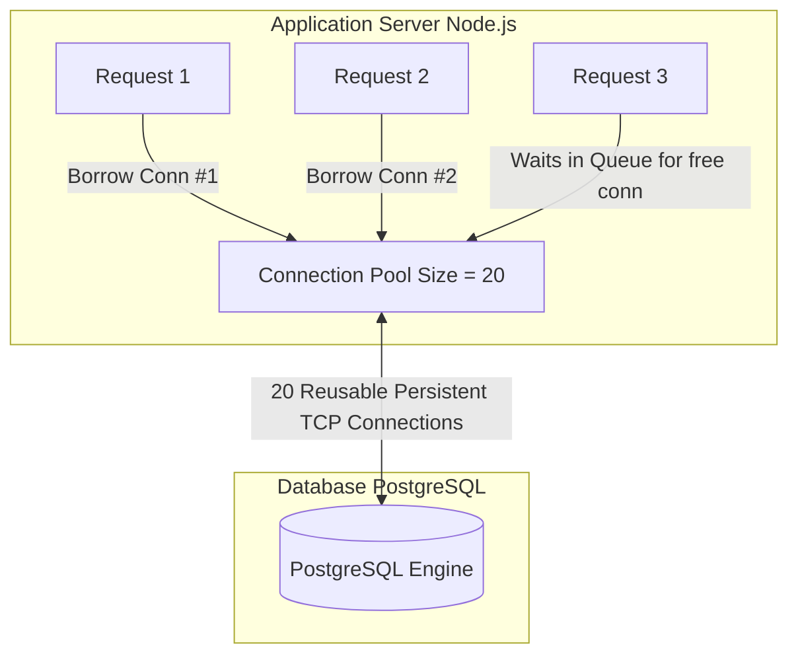

---

## Q46 — إزاي الـ Caching بـ Redis بيحسّن أداء الـ API ومبدأ Cache-Aside Pattern؟

### أصل الحكاية

الاستعلامات المتكررة على قواعد البيانات الرئيسية (زي Postgres أو MySQL) بتقرأ البيانات من الهارد ديسك (Disk I/O)، وتأخد وقت (مثلاً من 50ms لـ 200ms). لو عندك صفحة رئيسية في المتجر عليها 100,000 زبون بيقرأوا نفس قائمة المنتجات، الداتابيز هتتعب وتتبطأ جداً.

الـ **Caching** هو حفظ نتائج الاستعلامات الأكثر قراءة في ذاكرة الوصول العشوائي السريعة جداً (**In-Memory Storage زي Redis**) واللي بترجع البيانات في **أقل من 1 millisecond!**

أشهر نمط معماري للكاش هو **Cache-Aside Pattern (Lazy Loading)**:
1. لما يجي طلب للـ API، السيرفر بيشوف الـ Redis الأول (**Cache Hit?**).
2. لو البيانات موجودة في Redis، بيرجعها فوراً للزبون (بتأخد 1ms بس).
3. لو البيانات مش موجودة (**Cache Miss!**)، السيرفر بيقرأها من الداتابيز الرئيسية، ويحفظ نسخة منها في Redis مع وقت انتهاء الصلاحية (**TTL**)، ويرجع الرد للزبون.

> 💡 **إزاي تشرحها لطفل صغير؟**
> تخيل إنك بتذاكر في أوضتك:
> - **الداتابيز**: هي المكتبة الضخمة اللي في أول الشارع، كل ما تعوز معلومة تنزل تمشي للمكتبة وتدور في الكتب وترجع (مجهود و 20 دقيقة!).
> - **الـ Redis Cache**: هو درج المكتب اللي جنب إيدك! تفتح الدرج في ثانية واحدة وتاخد المعلومة!

```mermaid
flowchart TD
    Client[Client Request GET /products] --> API[Express API Server]
    API -->|1. Check Key in Redis| Redis[(Redis Cache In-Memory)]
    
    Redis -- 2a. Cache Hit Return Data 1ms --> API
    
    Redis -. 2b. Cache Miss! .-> API
    API -->|3. Query Primary DB| DB[(PostgreSQL Main DB)]
    DB -->|4. Return Data| API
    API -->|5. Write Async to Redis with TTL| Redis
    
    API -->|6. Return HTTP Response 200 OK| Client
```

---

## Q47 — إيه الفرق بين Authentication وAuthorization، وليه التفريق بينهم مصيري؟

### أصل الحكاية

فيه لغبطة دايماً بين الكلمتين عشان بيسيبوا أول حرفين "Auth"، لكنهم مفهومين معزولين أمنياً تماماً:

- **Authentication (إثبات الهوية - AuthN)**: الإجابة عن سؤال **"إنت مين؟"**. هي عملية التحقق من شخصية المستخدم (إدخال البريد وكلمة السر، البصمة، أو كود OTP). الرد بيكون: "أهلاً بك، اتأكدنا إنك أحمد".
- **Authorization (فحص الصلاحيات - AuthZ)**: الإجابة عن سؤال **"إيه اللي مسموحلك تعمله؟"**. هي عملية التحقق من هل المستخدم ده ليه الحق والصلاحية إنه ينفذ الأكشن ده ولا لأ (مثلاً: هل أحمد مسموح له يمسح المنتج ده أو يشوف تقارير الأرباح؟).

> 💡 **إزاي تشرحها لطفل صغير؟**
> تخيل إنك رايح ملاهي ألعاب:
> - **إثبات الهوية (AuthN)**: الأمن عند الباب يفحص كارنيه المدرسة ويتأكد من صورتك واسمك، ويقولك "أهلاً بك يا أحمد جوه الملاهي!" (Authentication).
> - **فحص الصلاحيات (AuthZ)**: لما تروح تركب قطار الموت، الموظف يبص على تذكرتك ويقولك "عذراً يا أحمد، تذكرتك صفراء عادية مش VIP، مش مسموحلك تركب اللعبة دي!" (Authorization).

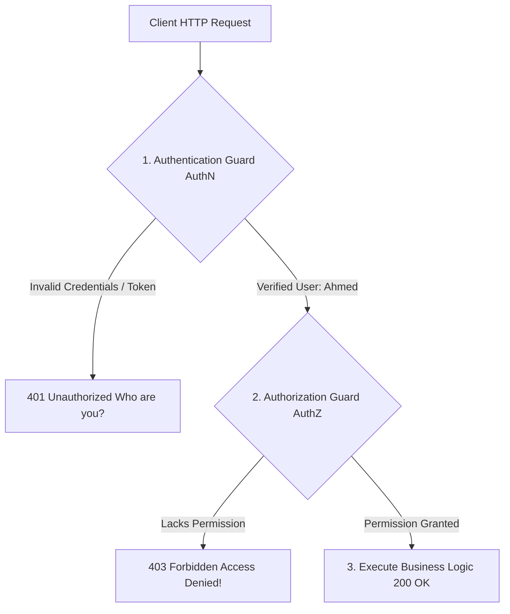

---

## Q48 — إيه الفرق بين Session-Based Auth وJWT Auth، ومتى تختار كل واحد؟

### أصل الحكاية

عشان نتفادى طبيعة الـ HTTP الـ Stateless، عندك طريقتين عشان تدير دخول المستخدمين وتفتكرهم:

1. **Stateful Session-Based Authentication**: لما المستخدم يسجل دخوله، السيرفر بيعمل Session في الـ Memory أو Redis برقم فريد `SessionID` ويبعته للعميل في Cookie مشفرة. مع كل طلب، العميل بيبعت الـ Cookie، والسيرفر يقارن الـ `SessionID` بالبيانات المحفوظة عنده في الـ Redis.
2. **Stateless JWT (JSON Web Token) Authentication**: لما المستخدم يسجل دخوله، السيرفر بيطلع توكين مشفر محتوي على بيانات المستخدم (Payload) ويوقعه بـ Secret Key. السيرفر بيبعت التوكين للعميل. مع كل طلب، العميل بيبعت التوكين، والسيرفر بيتحقق من التوقيع فوراً **من غير ما يرجع لداتابيز أو Redis!**

> 💡 **إزاي تشرحها لطفل صغير؟**
> - **Session**: زي لما تسيب إيدتك في دفتر الأمانات بتاع الفندق وتأخد مفتاح برقم 105. كل ما تعوز حاجة تشاور للموظف بالمفتاح، وهو يروح يفتح الدفتر عنده في الأرشيف ويفحص البيانات!
> - **JWT**: زي لما الملاهي تديك أسورة ذكية مشفرة على إيدك مكتوب عليها بخاتم حراري سري "أحمد - اشتراك ذهبي". الموظف يبص على الأسورة بالضوء البنفسجي، يعرف هويتك في ثانية من غير ما يرجع لأي دفتر!

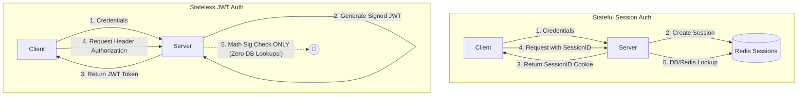

---

## Q49 — إزاي الـ Refresh Token والـ Short-Lived Access Token بيشتغلوا مع بعض بأمان؟

### أصل الحكاية

المهندسين واجهوا مشكلة معمارية في نظام الـ JWT:
لو خليت عمر الـ Access Token طويل (مثلاً سنة)، فلو اتسرق التوكين، المهاجم هيضل يخترق حساب الزبون سنة كاملة ومفيش طريقة تقفله!
ولو خليت عمر الـ Access Token قصير (مثلاً 10 دقائق)، فالزبون هيتضايق كل 10 دقائق يلاقيه بره السيستم ويطلب منه يدخل الباسورد تاني!

الحل هو معمارية الـ **Dual-Token System (Access Token + Refresh Token)**:
1. **Access Token (عمر قصير ~ 15 دقيقة)**: بيتبعت مع كل طلب API، ومش بيتحفظ في الداتابيز (Stateless).
2. **Refresh Token (عمر طويل ~ 7 لـ 30 يوم)**: بيروح بس لـ Endpoint مخصص للتجديد (`POST /api/v1/auth/refresh`)، وبيتحفظ مشفر في الداتابيز أو Redis ومحفوظ في **`HttpOnly SameSite=Strict Cookie`** عشان يحميه من ثغرات XSS وCSRF.

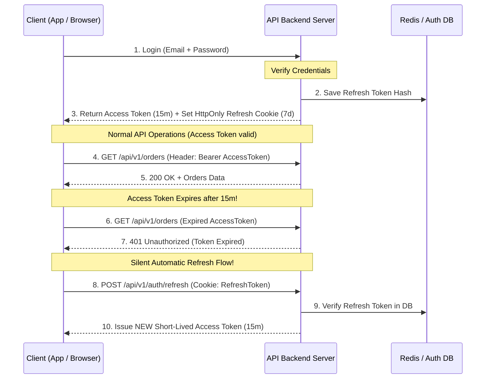

---

## Q50 — إزاي بتشتغل عملية "تسجيل الدخول بجوجل" فعلياً (OAuth 2.0 Authorization Code Flow)؟

### أصل الحكاية

لما تفتح موقع وتلاقي زرار "تسجيل الدخول بـ Google"، بدل ما تطلب من الزبون يعمل باسورد جديدة ويقلق على أمان حسابه، الموقع بيعتمد على خادم توثيق خارجي موثوق ببروتوكول **OAuth 2.0 / OpenID Connect (OIDC)**.

النمط المعياري والأكثر أماناً هو **Authorization Code Flow with PKCE**:

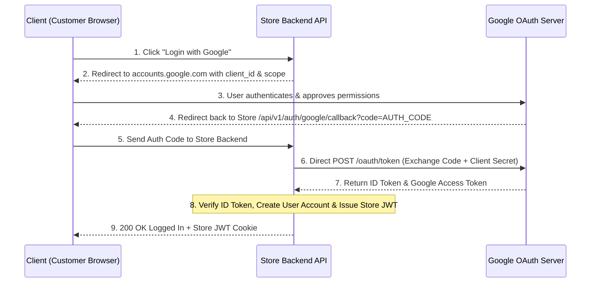

---

## Q51 — إزاي بتصمم نظام صلاحيات (RBAC) بدل ما تكتب `if` statements منتشرة في كل حتة؟

### أصل الحكاية

في نظام المتجر، عندك أنواع مختلفة من المستخدمين: **زبون (Customer)**، **تاجر (Merchant)**، **دعم فني (Support)**، و **مدير (Admin)**.
لو كتبت فحص الصلاحيات يدوياً جوه كل دالة بكتابة شروط `if (user.role === 'ADMIN' || (user.role === 'MERCHANT' && product.merchantId === user.id))`... الكود هيتحول لفوضى عارمة، وتطلعلك ثغرات أمنية خطيرة مع كل ميزة جديدة!

الحل المعماري صح هو تصميم **Role-Based Access Control (RBAC)** أو **Attribute-Based Access Control (ABAC)**.
بنبسط الدنيا وبنفصل الصلاحيات في 3 جداول في قاعدة البيانات:
1. **Users**: جدول المستخدمين.
2. **Roles**: جدول الأدوار (زي `ADMIN`, `MERCHANT`, `CUSTOMER`).
3. **Permissions**: جدول الصلاحيات الدقيقة (زي `products:create`, `orders:refund`, `users:delete`).
بنربط الأدوار بالصلاحيات، ونفحص الصلاحية عبر **Authorize Guard / Middleware** موحد يقرأ اسم الصلاحية المطلوبة قبل ما الكود يشتغل.

> 💡 **إزاي تشرحها لطفل صغير؟**
> تخيل إنك عامل ملهى ألعاب:
> - بدل ما تقف جنب كل لعبة وتسأل كل عيل "إنت ابن مين؟ وهل مسموحلك تركب هنا؟" (شروط الـ if المجهدة!).
> - إنت بتديه **أسورة على إيده** (Role): الأسورة الخضراء فيها خرمين للعبتين (Permissions)، والأسورة الذهبية فيها 10 أخرام لكل الألعاب.
> - موظف اللعبة (Guard) بيبص على خرم اللعبة في الأسورة بس، لو موجود يدخله فوراً!

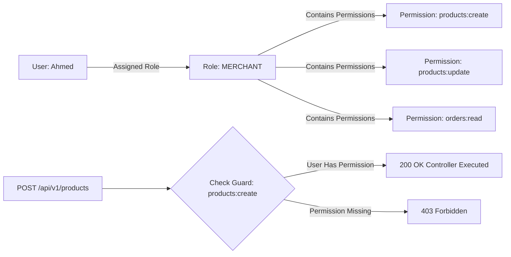

---

## Q52 — إيه هو SQL Injection فعلياً، وإزاي Parameterized Queries بتحل المشكلة جذرياً؟

### أصل الحكاية

بتعتبر ثغرة **SQL Injection (حقن أوامر SQL)** واحدة من أقدم وأخطر الكوارث الأمنية في التاريخ. بتحصل لما الباك اند يدمج المدخلات اللي الزبون بيسجلها (User Inputs) كـ String Concatenation جوه استعلام الـ SQL اللي رايح للداتابيز!

تخيل كود تسجيل الدخول الخاطئ ده:
`SELECT * FROM users WHERE email = '` + req.body.email + `' AND password = '` + req.body.password + `'`
لو المهاجم كتب في خانة الإيميل النص الخبيث ده: `' OR '1'='1`
الاستعلام بيتحول جوه قاعدة البيانات لـ:
`SELECT * FROM users WHERE email = '' OR '1'='1' AND password = ''`
ولأن الشرط `'1'='1'` صحيح دايماً، الداتابيز بتلغي فحص الباسورد وترجع أول حساب (اللي هو حساب المدير Admin)! وتتم عملية الاختراق بنجاح!

الحل النهائي للمشكلة دي هو **Parameterized Queries (Prepared Statements)**:
فصل كود استعلام الـ SQL تماماً عن البيانات! السيرفر بيبعت هيكل الاستعلام الأول لمحرك PostgreSQL عشان يجهزه (Compile)، وبعدين بيبعت المدخلات كـ **Parameters معزولة ومستقلة**. الداتابيز بتتعامل مع المدخلات كـ Plain Text نصي صامت بس، حتى لو النص جواه أوامر SQL خبيثة!

> 💡 **إزاي تشرحها لطفل صغير؟**
> تخيل إنك بتكتب رسالة لواحد صاحبك وبتقوله: "افتح الباب لأحمد":
> - **طريقة الحقن الخاطئة (Vulnerable)**: لو أحمد كتب اسمه كـ "أحمد واضرب الراجل اللي واقف بره". صاحبك يقرأ الكلام على بعضه وينفذ الأمرين!
> - **طريقة المعاملات المعزولة (Parameterized)**: إنت بتديه فورماً رسمياً: الخانة الأولى (البيانات) محفوفة في مظروف مقفول، والخلفية (الأمر) "افتح الباب لـ [المظروف]". صاحبك بيتعامل مع المظروف كـ نص صامت ومبينفذش الأوامر اللي جواه!

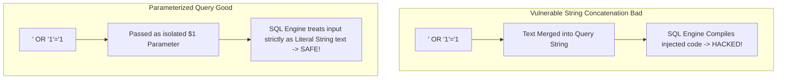

---

## Q53 — إيه الفرق بين XSS وCSRF، وليه الحماية من الاتنين مختلفة تماماً؟

### أصل الحكاية

من أكثـر المشاكل الأمنية اللي بيحصل فيها خلط هي الثغرتين **XSS (Cross-Site Scripting)** و **CSRF (Cross-Site Request Forgery)**.

- **XSS (حقن السكريبتات الخبيثة)**: المهاجم بيحقن كود JavaScript خبيث جوه متجر التجارة (مثلاً في تقييمات المنتجات). لما أي زبون يفتح صفحة المنتج، بيتنفذ كود الـ JS الخبيث جوه متصفح الزبون، وبيقدر يسرق الـ Cookies والـ Access Tokens ويبعتها لسيرفر الهكر!
- **CSRF (تزوير الطلبات عبر المواقع)**: المهاجم بيستغل إن متصفح الزبون شايل Cookie الدخول المشفرة الخاصة بالمتجر. المهاجم بيغري الزبون يفتح موقع خبيث خارجي، والموقع الخبيث بيبعت طلب خفي `POST https://store.com/api/v1/cart/checkout`! ولأن الطلب رايح للمتجر، المتصفح بيرفق Cookie الدخول أوتوماتيكياً، فيظن سيرفر المتجر إن الزبون هو اللي طلب الشراء بنفسه!

> 💡 **إزاي تشرحها لطفل صغير؟**
> - **XSS**: زي ما واحد خبيث يدخل جوه كراستك ويكتب كلمة سرك بالرصاص، وكل ما تفتح الكراسة السحر ده يشتغل ويسرق الباسورد!
> - **CSRF**: زي ما واحد يستغلك وإنت نائم ويأخد صباعك يبصم بيه على ورقة بيع من غير ما تاخد بالك!

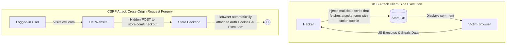

---

## Q54 — إزاي بتخزن الباسوردات بأمان في الـ Database، ولإيه Hashing مش Encryption؟

### أصل الحكاية

من أكبر الأخطاء الكارثية في أمان الباك اند هي تخزين كلمات سر المستخدمين في شكل نص واضح (Plaintext Passwords)، أو استخدام التشفير العادي ثنائي الاتجاه (Symmetric Encryption)! لو الداتابيز اتسربت أو اتخترقت، المهاجم هيسرق الباسوردات بتاعة ملايين الزباين ويستخدمها في اختراق إيميلاتهم وحساباتهم البنكية!

القواعد الأمنية الصارمة لتخزين كلمات السر:
1. **استخدام Hashing مش Encryption**: التشفير (Encryption) هو عملية اتجاهين (Two-Way) ليها مفتاح فك تشفير (Decryption Key) بيتكشف لو اخترق السيرفر. بينما الـ **Hashing** هو عملية اتجاه واحد (One-Way Cryptographic Function) مستحيل رياضياً ترجع لنصها الأصلي!
2. **إضافة Salt عشوائي فريد لكل كلمة سر**: الـ **Salt** هو نص عشوائي بيتضاف للباسورد قبل الـ Hash عشان يمنع هجمات الجداول الجاهزة (**Rainbow Tables Attack**).
3. **استخدام Slow Adaptive Hashing Algorithms**: استخدام خوارزميات بطيئة مصممة للتشفير زي **Bcrypt**, **Argon2id**, أو **PBKDF2**. البطء المتعمد ده (Work Factor / Salt Rounds) بيمنع الهكر إنه يجرب مليارات الباسوردات في الثانية بكروت الشاشة (GPU Bruteforce Attacks).

> 💡 **إزاي تشرحها لطفل صغير؟**
> - **التشفير (Encryption)**: زي ما تحط لعبتك جوه صندوق وتدير المفتاح. لو الهكر سرق المفتاح بيقدر يفتح الصندوق وياخد اللعبة!
> - **الـ Hashing**: زي ما تحط بيضة جوه خلاط وتفرمها! مستحيل باي طريقة في العالم ترجع المفروم ده لبيضة سليمة تاني! ولما تحب تتأكد إن البيضة كانت صحيحة، تفرم بيضة تانية وتقارن شكل المفرومين ببعض!

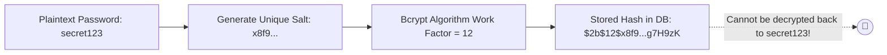

---

## Q55 — إيه هي الـ Database Indexes، وإزاي B-Tree Index بيسرّع البحث من O(N) لـ O(log N)؟

### أصل الحكاية

تخيل جدول المنتجات في متجر فيه 5,000,000 منتج. لما تدور على منتج برقم الـ SKU بتاعه `SELECT * FROM products WHERE sku = 'IPHONE-15-PRO'`... لو الجدول مفيش فيه **Index (فهرس)**، محرك الداتابيز هيضطر يقرأ الـ 5 مليون صف من الهارد ديسك صف صف (**Full Table Scan**) بأداء زمني $O(N)$ ياخد 5 ثواني كاملة!

الـ **Database Index** هو هيكل بيانات جانبي (عادةً **B-Tree Index**) بيحتفظ بعمود معين مترتب في شجرة بحث متوازنة.
البحث في شجرة الـ B-Tree بيقلل عدد عمليات القراءة بشكل خرافي: بدل ما تفحص 5,000,000 صف، المحرك بيقطع الشجرة في 4 خطوات بس ($O(\log N)$) ويوصل للمكان المضبوط في أقل من **1 millisecond!**

> 💡 **إزاي تشرحها لطفل صغير؟**
> تخيل إنك بتدور على كلمة في كتاب من 1000 صفحة:
> - **من غير Index**: بتفتح الكتاب من أول صفحة وتقرأ صفحة صفحة لحد ما تلاقي الكلمة في الصفحة رقم 800 (مجهود وتعب كبير!).
> - **مع الـ Index**: بتفتح **الفهرس** في أول الكتاب، تلاقي الكلمة مكتوب جنبها "صفحة 800"، تفتح صفحة 800 فوراً في ثانية واحدة!

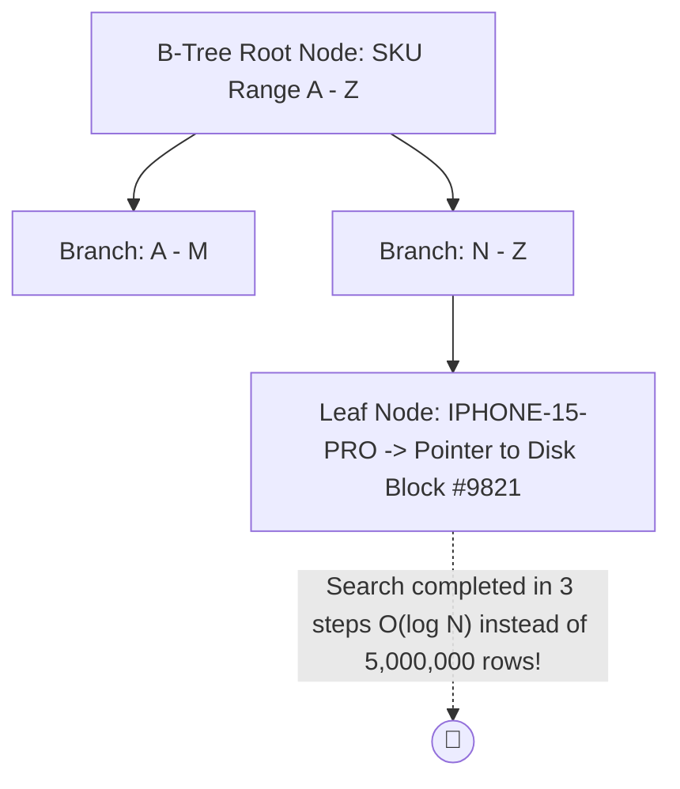

---

## Q56 — إزاي بتقرأ الـ EXPLAIN ANALYZE عشان تكتشف الاستعلامات البطيئة؟

### أصل الحكاية

لما تلاحظ إن صفحة الشراء بقت بطيئة وبتاخد ثانيتين عشان ترد، إزاي تكتشف فين المشكلة بالضبط جوه استعلام الـ SQL؟

الأداة التحليلية الأساسية هي **`EXPLAIN ANALYZE`**:
أمر بتحطه قبل استعلام الـ SQL وبيجبر قاعدة البيانات تنفذ الاستعلام وتطلعلك تقرير تفصيلي لخطة المحرك (**Query Execution Plan**):
- **Scan Type**: هل المحرك استخدم Index Scan ولا Seq Scan (Full Table Scan بطيء)؟
- **Execution Cost & Time**: الوقت والمجهود المستغرق في كل خطوة بالملي ثانية.
- **Rows Filtered**: عدد الصفوف المقرؤة والمرفوضة.

```sql
-- فحص أداء الاستعلام في PostgreSQL
EXPLAIN ANALYZE 
SELECT * FROM orders 
WHERE customer_id = 42 AND status = 'PENDING';
```

---

## Q57 — إيه الفرق بين Database Partitioning وSharding؟

### أصل الحكاية

لما حجم الداتابيز يكبر جداً وتعدي 1 Terabyte وجدول الطلبات يبقى فيه 500 مليون صف... أداء الـ Indexes بيقل والصيانة والـ Backups بتبقى معقدة وتقيلة على سيرفر واحد!

قدامك تقنيتين عشان تقسم البيانات الضخمة دي:
- **Vertical / Horizontal Partitioning (التقسيم الداخلي - في نفس السيرفر)**: تقسيم جدول كبير لـ جداول أصغر (Partitions) بتعيش جوه **نفس سيرفر قاعدة البيانات** (مثال: تقسيم جدول `orders` بالسنة: `orders_2024`, `orders_2025`).
- **Sharding (التقسيم الموزع - على سيرفرات مختلفة)**: تقسيم وتوزيع بيانات الجدول على **أجهزة وسيرفرات داتابيز مستقلة تماماً (Shards)** عبر الـ **Shard Key** (مثال: الزباين من ID 1-1M على Shard 1، والزباين من ID 1M-2M على Shard 2).

> 💡 **إزاي تشرحها لطفل صغير؟**
> - **Partitioning**: عندك دولاب ملابس ضخم في أوضتك، قسمته لأرفف (رف الصيف، ورف الشتا). الملابس كلها جوه نفس الدولاب ونفس الأوضة!
> - **Sharding**: الدولاب اتخنق، فاشتريت 3 دولابات حطيت واحد في أوضتك، وواحد في أوضة أخوك، وواحد في الصالة! كل دولاب في مكان مستقل تماماً.

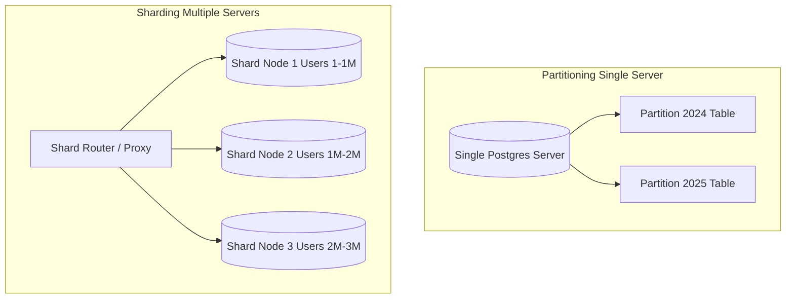

---

## Q58 — إزاي تصمم Rate Limiting لحماية الـ Endpoints من الـ Abuse؟

### أصل الحكاية

تخيل لو مهاجم أو Bot حاول يبعت 10,000 طلب في الثانية لصفحة تسجيل الدخول عشان يجرب باسوردات مسروقة (Brute Force Attack)، أو يغرق السيرفر بالطلبات! من غير حماية، سيرفر المتجر هيقع تماماً بسباب هجوم الـ Denial of Service (DoS).

الحل هو **Rate Limiting (تحجيم معدل الطلبات)**:
تحديد حد أقصى لعدد الطلبات المسموح بيها للمستخدم أو الـ IP خلال وقت معين (مثلاً: مسموح بـ 100 طلب بس كل دقيقة لكل IP). لو العميل عدى الحد ده، السيرفر بيرفض الطلب فوراً ويرجع **`429 Too Many Requests`**.

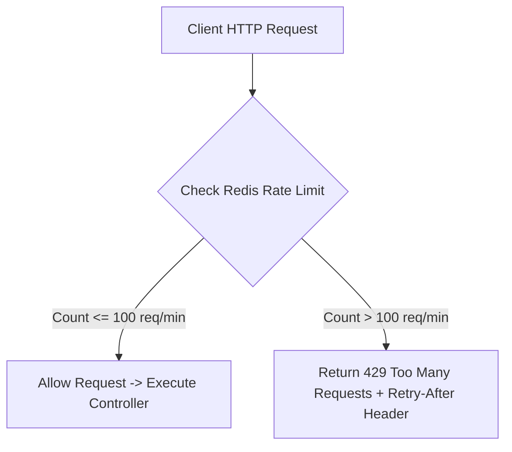

---

## Q59 — إيه هو CAP Theorem، وإيه معناه لمهندس الـ Backend؟

### أصل الحكاية

لما تصمم أي نظام بيانات موزع (Distributed Data System) متكون من عدة أجهزة موصولة بشبكة... **CAP Theorem (مبدأ بروور)** ببيقولك إن **مستحيل علمياً وهندسياً لـ أي نظام موزع إنه يضمن الـ 3 خصائص دول مع بعض في نفس اللحظة**:

1. **Consistency (C - الاتساق المطلق)**: كل القراءات بترجع أحدث داتا اتكتبت في السيستم فوراً في كل الأجهزة في نفس الميكروثانية.
2. **Availability (A - التوفرية الدائمة)**: كل طلب قراءة أو كتابة بيستقبل رد ناجح ومش خطأ في كل الأوقات من أي جهاز شغال.
3. **Partition Tolerance (P - تحمل انقطاع الشبكة)**: السيستم يفضل شغال حتى لو شبكة الاتصال بين السيرفرات قطعت.

في الواقع، انقطاع الشبكة (Network Partition - P) حتمي وهيمر عليك! فبكده لازم تختار حتماً بين نظامين:
- **CP System (Consistency + Partition Tolerance)**: بتفضل الاتساق والدقة؛ ويرفض أو يوقف الطلبات لو مش ضامن موازنتها مع باقي الأجهزة (زي MongoDB, HBase).
- **AP System (Availability + Partition Tolerance)**: بتفضل الاستمرارية والتوفر؛ ويرجع الداتا المتاحة فوراً حتى لو كانت قديمة شوية ولسه ماملتش مزامنة (زي Cassandra, DynamoDB).

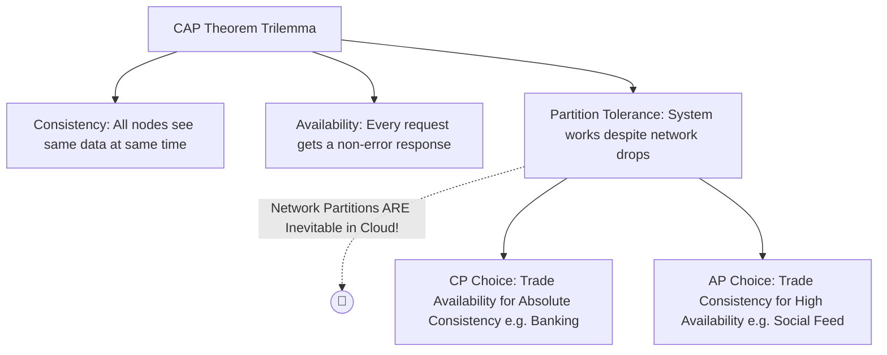

---

## Q60 — إمتى تعمل Database Normalization، وإمتى تكون الـ Denormalization هي القرار الصح؟

### أصل الحكاية

لما تصمم جداول قاعدة البيانات العلاقاتية (Relational DB)، قدامك قرارين معمارين عكس بعض في هيكلة الداتا:

- **Normalization (التطبيع الهيكلي - 3NF)**: فكرة "فصل البيانات ومنع التكرار". بنقسم البيانات لـ جداول فرعية متصلة بـ Foreign Keys عشان مفيش معلومة تتكرر مرتين، ونضمن إن مفيش تضارب يحصل لما نعدل معلومة (Data Integrity). (مثال: جدول `orders` فيه بس `user_id` و `product_id` بدل ما نكرر اسم ورقم وعنوان الزبون في كل أوردر).
- **Denormalization (إلغاء التطبيع - التكرار الموجه)**: فكرة "دمج وتكرار البيانات عمداً عشان تسرّع القراءة". بنكرر البيانات في نفس الجدول عشان نتفادى استعلامات الـ `JOIN` المعقدة والبطيئة وتتم القراءة في 1ms.

> 💡 **إزاي تشرحها لطفل صغير؟**
> تخيل إنك بترتب لعبك جوه الأوضة:
> - **Normalization (التطبيع)**: إنت حاطط كل لعبة في الصندوق بتاعها بالضبط (صندوق العربيات، صندوق المكعبات). الأوضة منظمة جداً ومفيش لعبة مكررة! بس لما تعوز تلعب لعبة فيها عربية ومكعب، بتضطر تفتح الصندوقين وتجمعهم مع بعض (JOINs).
> - **Denormalization (إلغاء التطبيع)**: إنت جهزت شنطة سريعة حطيت فيها العربية والمكعب مع بعض. كررنا اللعب بس الشنطة جاهزة تفتحها وتلعب في ثانية واحدة من غير ما تدور في الصناديق!

| وجه المقارنة | Normalization (3NF) | Denormalization |
|---|---|---|
| **الهدف الأساسي** | منع تكرار البيانات وضمان الـ Integrity | تسريع استعلامات القراءة (Read Performance) |
| **سرعة الكتابة (Write)** | سريعة جداً (تعديل المكان الأصلي فقط) | أبطأ (تعديل البيانات المكررة في أماكن متعددة) |
| **سرعة القراءة (Read)** | أبطأ (تتطلب JOINs معقدة) | سريعة جداً (قراءة من جدول واحد مباشرة) |
| **المساحة (Storage)** | توفير في مساحة القرص الصلب | استهلاك مساحة أكبر بسب تكرار البيانات |

---

## Q61 — إيه هو Docker ولإيه بيحل مشكلة "It works on my machine"؟

### أصل الحكاية

من أكبر المشاكل اللي واجهت فرق الباك اند تاريخياً هي مشكلة "الكود شغال على جهازي ممتاز، بس واصل للسيرفر ومش شغال!". وده بيحصل بسبب اختلاف البيئات البرمجية: نسخة Node.js مختلفة، مكتبة C++ مفقودة في السيرفر، أو إعدادات نظام التشغيل مختلفة بين جهازك و Ubuntu اللي على السيرفر.

**Docker** اخترع تقنية الـ **Containerization (الحاويات)** عشان يحل المشكلة دي من جزرها. بدل ما ترفع الكود بس، Docker بيخليك تغلف وتجمع التطبيق مع الكود، والـ Runtime (Node.js 20)، والمكتبات الخارجية (NPM Dependencies)، وحتى ملفات نظام التشغيل جوه **Docker Image** موحدة ومعزولة تماماً. الـ Container بيضمن إن الكود هيشتغل بنفس الأداء بالضبط على جهازك، سيرفرات الـ Staging، وسيرفرات Production السحابية.

> 💡 **إزاي تشرحها لطفل صغير؟**
> تخيل إنك رايح رحلة ومحتاج أكل:
> - **من غير Docker**: بتاخد العيش في إيدك، والجبنة في جيبك، والشاي في كوباية... لما توصل البحر تلاقي الشاي اتدفق والجبنة باظت!
> - **مع Docker**: إنت بتاخد **وجبة هابي ميل مقفولة جاهزة (Container)** فيها السندوتش والبطاطس والمنديل واللعبة. تفتحها على البحر، تفتحها في الطيارة، تفتحها في أي مكان في العالم... هتاكل نفس الوجبة بنفس الطعم والجاهزية!

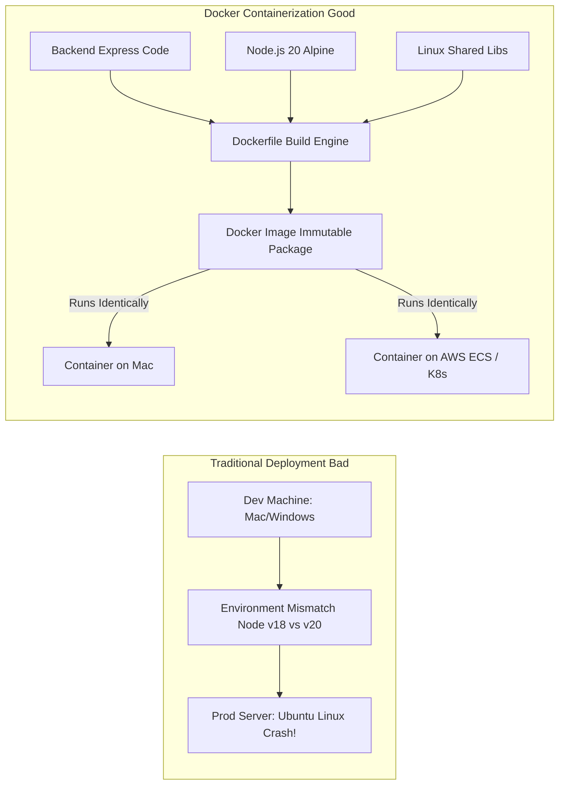

---

## Q62 — إيه هو الـ CI/CD Pipeline وإيه الخطوات الإجبارية فيه؟

### أصل الحكاية

في الشركات والمشاريع المحترفة، ممنوع إن المهندس يكتب كود على جهازه ويرفعه للسيرفر مباشرة يدوي بـ FTP أو SSH! الخطأ البشري وارد، وممكن ترفع كود مكسور فيه Syntax Error أو مش عادّي الـ Unit Tests، وتتسبب في سقوط المتجر وخسارة الفلوس.

الحل هو بناء **CI/CD Pipeline (خط الأنابيب الآلي للنشر والمكاملة)** بـ GitHub Actions أو GitLab CI:
- **CI (Continuous Integration - المكاملة المستمرة)**: عند كل `git push` أو Pull Request، سيرفرات الـ CI بتقوم أوتوماتيك بسحب الكود، تشغيل الـ Linter، فحص الـ TypeScript، وتنفيذ الـ Unit & Integration Tests. لو أي test فشل، الـ PR بيتقفل وما بينزلش السيرفر.
- **CD (Continuous Deployment / Delivery - النشر المستمر)**: لما الكود يتدمج في `main` branch، الـ CD بيعمل Docker Image جديدة، يرفعها للـ Container Registry (زي ECR/DockerHub)، وينشرها تلقائياً على سيرفرات Production من غير ما تلمس حاجة بإيدك!

> 💡 **إزاي تشرحها لطفل صغير؟**
> تخيل إنك في مصنع بسكويت:
> - البسكويت بيمشي على حزام ناقل آلي (Pipeline):
>   1. أول جهاز بيقيس حجم البسكويتة (Linting & TypeScript Check).
>   2. ثاني جهاز بيدوق البسكويتة عشان يتأكد إنها مش محروقة (Unit & Integration Tests).
>   3. لو البسكويتة ممتازة، الجهاز الأخير بيغلفها برسمة المصنع ويرميها في كرتونة الشحن للمحلات (Deployment) أوتوماتيك من غير ما إنسان يلمسها!

```mermaid
flowchart LR
    Dev[Developer Push Code] --> Trigger[GitHub Actions Trigger]
    subgraph CI Phase Continuous Integration
        Trigger --> Lint[1. Lint & Format Check]
        Lint --> Compile[2. TypeScript Compile]
        Compile --> Tests[3. Run Unit & Integration Tests]
    end

    subgraph CD Phase Continuous Deployment
        Tests -- Pass --> Build[4. Build Production Docker Image]
        Build --> Push[5. Push to Registry ECR]
        Push --> Deploy[6. Deploy to Production K8s Cluster]
    end
    
    Tests -- Fail --> Block[Block Deployment & Notify Slack]
```

---

## Q63 — إزاي بتدير الـ Secrets والـ Environment Variables بأمان في Production؟

### أصل الحكاية

من أكبر الأخطاء الكارثية في أمان الباك اند هي كتابة أسرار النظام (باسورد قاعدة البيانات، API Keys لـ Stripe، أو JWT Secret Key) صريحة داخل الكود المرفوع على Git repository (Hardcoding Secrets). أي شخص يوصل لـ Git Repo يقدر يسرق كل المفاتيح والبيانات البنكية!

القاعدة المعمارية الصارمة (The Twelve-Factor App): **فصل الإعدادات والأسرار تماماً عن الكود.**
في الباك اند، بنقرأ المتغيرات الحساسة من **Environment Variables (`process.env`)**. في التطوير المحلي، بنحفظهم في ملف `.env` محلي ومش مرفوع على Git صراحة (`.gitignore`). وفي بيئة Production، بنضخ الأسرار عبر خدمات مشفرة زي **AWS Secrets Manager** أو **HashiCorp Vault** أو **Kubernetes Secrets**.

> 💡 **إزاي تشرحها لطفل صغير؟**
> تخيل إنك عندك صندوق ألعاب مقفول بقفل:
> - بدل ما تكتب الرقم السري بتاعة القفل بخط عريض على الصندوق بره بالطباشير (Hardcoding Secrets)، إنت بتسيب مكان الرقم فاضي!
> - وأول ما تعوز تفتح الصندوق، بابا (Secrets Manager) بييجي يكتب الرقم السري بنفسه في السر من غير ما حد يشوفه!

---

## Q64 — إيه دور Nginx كـ Reverse Proxy وLoad Balancer؟

### أصل الحكاية

في بيئة الإنتاج، ممنوع تكشف سيرفر Node.js (Express/NestJS) مباشرة للإنترنت العام! سيرفر Node.js اتصمم ليكون API Application Server ممتاز، بس مش مصمم عشان يدير اتصالات الشبكة الخام، أو يصد هجمات الـ Slowloris، أو يفك تشفير الـ SSL/TLS، أو يقدم الملفات الثابتة (Static Files).

الحل إنك تحط **Nginx** قدام سيرفرات الباك اند يشتغل كـ **Reverse Proxy** و **Layer 7 Load Balancer**.
الـ Reverse Proxy بيقف في المواجهة يستقبل طلبات الـ HTTP/HTTPS من المتصفحات، ينفذ فحص الأمان وفك تشفير الـ SSL/TLS (SSL Termination)، ويوزع الحمل على سيرفرات Node.js الداخلية الخفية، ويدير الاتصالات بكفاءة فائقة.

> 💡 **إزاي تشرحها لطفل صغير؟**
> تخيل إنك في فندق ضخم:
> - **Nginx (بواب الفندق الشاطر)**: واقف بره الفندق، بيستقبل كل الضيوف، يفحص التذاكر والأمن، ويوزع الناس على أسانسيرات مختلفة عشان مفيش أسانسير يزحم!
> - **Node.js (موظفي الخدمات الداخلية)**: شغالين جوه الأوض براحتهم بيطبخوا ويجهزوا الطلبات من غير ما يوجعوا دماغهم بزحمة الشارع بره!

```mermaid
flowchart TD
    Internet[Public Internet Clients] -->|HTTPS Port 443| Nginx[Nginx Reverse Proxy & Load Balancer]
    
    subgraph Internal Isolated Network
        Nginx -->|SSL Termination & Static Files| Static[Static Assets / Public Images]
        Nginx -->|Round Robin HTTP Port 3000| Node1[Node.js API Instance 1]
        Nginx -->|Round Robin HTTP Port 3000| Node2[Node.js API Instance 2]
        Nginx -->|Round Robin HTTP Port 3000| Node3[Node.js API Instance 3]
    end
```

---

## Q65 — إزاي تضمن Zero-Downtime Deployment بدون ما المستخدم يحس بأي انقطاع؟

### أصل الحكاية

في الأنظمة القديمة، لما الفريق يعوز ينزل تحديث جديد في الباك اند، كانوا يوقفوا السيرفرات وتظهر للزباين صفحة "الموقع تحت الصيانة يرجى العودة لاحقاً". في المتاجر الكبيرة، إيقاف المتجر 10 دقائق في الذروة معناه خسارة آلاف المعاملات وإحباط الزباين.

الهدف في الإنتاج هو تحقيق **Zero-Downtime Deployment (النشر من غير أي انقطاع للخدمة)**. قدامك استراتيجيتين رئيسيتين:
1. **Rolling Update**: تحديث السيرفرات سيرفر بعد سيرفر بالتدريج. Nginx يوجه الطلبات للسيرفرات الشغالة، ولما السيرفر الجديد يكتمل ويكون Healthy، Nginx يوجه له حركة المرور، وينتقل لتحديث السيرفر اللي بعده.
2. **Blue-Green Deployment**: تجهيز بيئتين كاملتين متطابقتين (Blue هي الحالية، Green هي التحديث الجديد). الكود الجديد ينزل على Green ويختبر 100%. لما يجهز، الـ Load Balancer يقلب الاتجاه فوراً في 1 millisecond لـ Green!

> 💡 **إزاي تشرحها لطفل صغير؟**
> تخيل إنك بتغير عجلة العربية وهي ماشية في السباق:
> - بدل ما توقف العربية 10 دقائق وتخسر السباق (Downtime).
> - بييجي طقم الصيانة السريع يغير عجلة بعجلة والعربية ماشية، فالزبون اللي راكب مبيحسش بأي وقوف خالص ويوصل في ميعاده!

```mermaid
flowchart TD
    subgraph Rolling Update Strategy
        LB[Load Balancer]
        LB --> S1[Server 1: Updated v2.0 - Healthy]
        LB --> S2[Server 2: Updating... Temporarily Drained]
        LB --> S3[Server 3: Old v1.0 - Active]
    end
```

---

## Q66 — إيه هو Kubernetes بالتبسيط، وإمتى تحتاجه فعلاً؟

### أصل الحكاية

لما المنصة تكون صغيرة، تشغيل 2 Docker Containers ورا Nginx بـ `docker-compose` على سيرفر VPS كافي جداً. لكن لما المنصة تكبر وتتحول لـ 30 Microservice مع مئات الـ Containers الموزعة على عشرات السيرفرات السحابية... الإدارة اليدوية دي هتحول لكابوس! مين هيراقب لو حاوية وقعت ويعيد تشغيلها؟ مين هيعمل Auto-scaling للحاويات لما الزحمة تزيد؟ ومين هيوزع الـ Network Traffic بين السيرفرات؟

هنا بييجي دور **Kubernetes (K8s)**: هو نظام إدارة وتنظيم الحاويات المعيارية العالمي (**Container Orchestration Engine**). فكّر في Kubernetes كـ "المايسترو" الأوتوماتيكي اللي بيدير أوركسترا من آلاف الـ Containers على أسطول من السيرفرات (Cluster):
- **Self-Healing**: لو حاوية اتخنقت أو وقعت، K8s بيقتلها وينشئ واحدة جديدة فوراً في أقل من ثانية!
- **Auto-Scaling**: بيزود ويقلل عدد الـ Pods تلقائياً بناءً على حمولة الـ CPU والذاكرة.
- **Service Discovery & Load Balancing**: بينظم شبكة الاتصال الداخلية بين كل الخدمات مع توزيع الحمل.

> 💡 **إزاي تشرحها لطفل صغير؟**
> تخيل مدير أوركسترا موسيقية (المايسترو):
> - واقف قدامه 100 عازف (Containers).
> - لو عازف منهم اتخنق أو تعب وفصل، المايسترو بلمحة عين بيشاور لعازف ثاني احتياطي (Self-Healing) يدخل فوراً في نفس الميكروثانية من غير ما الجماهير تحس إن الموسيقى قطعت!

```mermaid
flowchart TD
    subgraph Kubernetes Cluster Architecture
        ControlPlane[K8s Control Plane / API Server Master]
        
        subgraph wn1 ["Worker Node 1"]
            Pod1[Pod: Store API v2]
            Pod2[Pod: Store API v2]
        end
        
        subgraph wn2 ["Worker Node 2"]
            Pod3[Pod: Payment Service]
            Pod4[Pod: Redis Cache]
        end

        ControlPlane -->|Monitors & Auto-Heals| wn1
        ControlPlane -->|Monitors & Auto-Heals| wn2
    end
```

---

## Q67 — إيه الفرق بين Monitoring وObservability (Logs, Metrics, Traces)؟

### أصل الحكاية

لما الباك اند يشتغل في الإنتاج، السؤال اللي بيشغل بال المهندسين: "هل التطبيق شغال كويس في اللحظة دي ولا فيه مشاكل استخبت؟"

- **Monitoring (الرصد والقياس)**: بيجيب عن سؤال **"هل السيستم شغال ولا فيه مشكلة؟"**. هو متابعة للمؤشرات المعروفة (زي: هل الـ CPU عالي؟ هل الـ Memory 90%؟ كم عدد الـ 500 Errors؟). لو المؤشر كبر، بيتبعت Alert للمهندسين.
- **Observability (الفيزيائية والشفافية الداخلية)**: هي القدرة على الإجابة عن سؤال **"ليه السيستم بيتصرف بالشكل الغريب ده؟"** باستكشاف الأسباب الجذرية للأخطاء غير المتوقعة من خلال فحص مخرجات السيستم الداخلية.

الـ Observability بتعتمد على **الأعمدة الثلاثة الرئيسية (The Three Pillars of Observability)**:
1. **Metrics (المقاييس)**: أرقام مجمعة إحصائية بمرور الوقت (مثل: عدد الطلبات/ثانية، زمن الاستجابة P99 latency). (أدوات: Prometheus & Grafana).
2. **Logs (السجلات)**: نص تفصيلي لأحداث ومجريات الكود مع Timestamp (مثل: "فشل الاتصال بـ Stripe للزبون #42"). (أدوات: ELK Stack / Grafana Loki).
3. **Traces (التتبع الموزع)**: تتبع مسار الطلب الواحد وهو بيتنقل بين مئات الـ Microservices لحساب الوقت المستغرق في كل محطة. (أدوات: Jaeger & OpenTelemetry).

```mermaid
flowchart TD
    subgraph The Three Pillars of Observability
        M[1. Metrics: Quantitative Aggregates e.g. Request Rate, CPU%] --> G[Grafana Dashboard]
        L[2. Logs: Event Text Context e.g. Error Stack Traces] --> Loki[Loki / Elasticsearch]
        T[3. Traces: Distributed Request Flow Path Across Services] --> Jaeger[Jaeger / OpenTelemetry]
    end
```

---

## Q68 — إيه هو الـ Request-Response Pattern، ولإيه هو الأساس اللي كل حاجة تانية بتتقاس عليه؟

### أصل الحكاية

نمط **Request-Response Pattern** هو النموذج الأبوي والأكثر استخداماً في عالم تصميم الشبكات والـ Web APIs. الفكرة بسيطة ومبنية على مبدأ **Client-Initiated Communication**:
العميل (الـ Client زي المتصفح أو تطبيق الموبايل) هو دايماً الطرف اللي بيبدأ الكلام. العميل يرسل **Request** عبر الاتصال، يفضل واقف مستني، والسيرفر يستقبل الطلب، يعالجه، ويرد بـ **Response** واحد وينهي المعاملة.

```mermaid
sequenceDiagram
    participant C as Client (Customer Browser)
    participant S as Web Server (Node.js)

    Note over C,S: Request-Response Pattern (Synchronous / Client-Driven)
    C->>S: 1. HTTP Request (GET /api/v1/orders/42)
    Note over S: Server processes request & queries DB
    S-->>C: 2. HTTP Response (200 OK + JSON Payload)
    Note over C,S: Connection is finished / Idle
```

---

## Q69 — إيه الفرق بين Synchronous وAsynchronous Workloads؟

### أصل الحكاية

في الباك اند، المهمات المطلوبة من السيرفر بتنقسم لنوعين معزولين من حيث التنفيذ وتجربة المستخدم:

- **Synchronous Workload (المعالجة المباشرة المتزامنة)**: العميل يبعت الطلب، ويفضل واقف مستني في نفس اللحظة لحد ما السيرفر يخلص المعالجة بالكامل ويرجع الرد النهائي. (خطوة بخطوة، والخطوة اللي بعدها ما تبدأش إلا لما اللي قبلها تخلص).
- **Asynchronous Workload (المعالجة غير المتزامنة المؤجلة)**: العميل يبعت الطلب، السيرفر يتأكد من صحة البيانات الأساسية، ويرجع رد فوري للعميل بـ `202 Accepted` بـ "استلمت طلبك وجاري المعالجة". المعالجة الفعلية بتتم في الخلفية بشكل مستقل من غير ما العميل يفضل واقف مستني!

```mermaid
flowchart TD
    subgraph sync1 ["1. Synchronous Flow (Client Waits)"]
        C1[Client Request] -->|Waits...| S1[Server processes DB + Stripe + Email]
        S1 -->|Response after 5 seconds| C1
    end

    subgraph async1 ["2. Asynchronous Flow (Decoupled & Fast)"]
        C2[Client Request] --> S2[Server pushes Job to Queue]
        S2 -- Immediate Response < 50ms --> C2
        S2 -. Background Job .-> W[Worker processes Heavy Tasks]
    end
```

---

## Q70 — إيه هو الـ Polling، وإيه مشاكله الحقيقية في الإنتاج؟

### أصل الحكاية

تخيل سيناريو في المتجر: الزبون فتح شاشة "متابعة حالة الطلب" وعايز يعرف أول ما السائق يستلم الطلب ويتحرك. زي ما عرفنا، بروتوكول HTTP مبني على Request-Response (السيرفر مش بيقدر يكلم المتصفح من نفسه).

أبسط حل للمشكلة دي هو **Short Polling**:
الفرونت اند يعمل تايمر `setInterval` يبعت HTTP Request للسيرفر كل 3 ثواني ليطلب التحديث: "هل فيه جديد؟ هل فيه جديد؟ هل فيه جديد؟".
السيرفر يستقبل الطلب، يقرأ من الداتابيز، ولو مفيش جديد يرجع `202 No Update` ويقفل الاتصال، ليعود المتصفح ويبعت طلب جديد بعد 3 ثواني!

```mermaid
sequenceDiagram
    participant C as Client (Customer Browser)
    participant S as API Server Node.js

    Note over C,S: Short Polling (HTTP Request every 3s)
    C->>S: GET /api/v1/orders/42/status (t = 0s)
    S-->>C: 200 OK { status: 'PREPARING' }
    
    C->>S: GET /api/v1/orders/42/status (t = 3s)
    S-->>C: 200 OK { status: 'PREPARING' } (No change - Wasted Request!)
    
    C->>S: GET /api/v1/orders/42/status (t = 6s)
    S-->>C: 200 OK { status: 'PREPARING' } (No change - Wasted Request!)

    C->>S: GET /api/v1/orders/42/status (t = 9s)
    S-->>C: 200 OK { status: 'SHIPPED' } (Status Changed!)
```

---

## Q71 — إيه هو الـ Long Polling، وإزاي بيحسّن على Polling العادي؟

### أصل الحكاية

عشان نحل مشكلة الـ Short Polling وإهدار ملايين طلبات الـ HTTP الفارغة (Q70)، اخترعنا **Long Polling (Hanging GET Pattern)**:
الفرونت اند يبعت HTTP Request عادي للسيرفر يطلب التحديث: "هل فيه تحديث لشحنة الزبون #42؟".
السيرفر يقرأ البيانات، **ولو مفيش جديد، السيرفر مبيردش فوراً ومبيقفلش الاتصال!** السيرفر يمسك الـ HTTP Connection مفتوح ومُعلق عنده لمدة تصل لـ 30 ثانية.
أول ما السائق يغير الحالة لـ "تم التسليم" أو يمر الـ Timeout، السيرفر يكتب الرد فوراً ويرجعه للعميل ويقفل الاتصال. وفي نفس اللحظة المتصفح يستلم الرد ويفتح طلب Long Polling جديد!

> 💡 **إزاي تشرحها لطفل صغير؟**
> بدل ما تنكش بابا كل 10 ثواني "وصلنا؟ وصلنا؟ وصلنا؟":
> إنت بتقول لبابا مرة واحدة بس: "أول ما نوصل البحر يا بابا ناديني فوراً!"... بابا يفضل ساكت مركز في السواقة، وأول ما توصلوا الشاطئ ينادي بصوت عالي: "وصلنا البحر يلا انزل!".

```mermaid
sequenceDiagram
    participant C as Client (Customer Browser)
    participant S as API Server Node.js

    Note over C,S: Long Polling Flow (Hanging Request)
    C->>S: 1. GET /orders/42/status (t = 0s)
    Note over S: Server holds connection OPEN (No data change yet...)
    
    Note over S: Event occurs at t = 12s! Driver updated location!
    S-->>C: 2. 200 OK { status: 'DELIVERED' } (t = 12s Instant!)
    
    C->>S: 3. Immediately opens NEW Long Polling Request
```

---

## Q72 — إيه هو الـ Server-Sent Events (SSE)، وإزاي بيختلف عن Long Polling؟

### أصل الحكاية

لو نظامك محتاج ينقل تحديثات مستمرة من السيرفر للعميل بس في اتجاه واحد (Unidirectional Streaming زي: أسعار الأسهم اللحظية، الإشعارات، أو شريط كتابة نتائج الذكاء الاصطناعي ChatGPT)... فـ **Server-Sent Events (SSE)** هو الاختيار المعماري الأبسط والأقوى!

في SSE، العميل بيفتح اتصال HTTP عادي بطلب `GET /api/v1/stream` مع Header `Accept: text/event-stream`.
السيرفر مبيقفلش الاتصال إطلاقاً! وبيسيب الاتصال مفتوح كـ **Persistent HTTP Stream**، ويبدأ يضخ الأحداث والتحديثات متتالية كـ text formatted events وقت ما يعوز.

> 💡 **إزاي تشرحها لطفل صغير؟**
> زي محطة الراديو في العربية:
> - إنت بتفتح الراديو وتسكت (تفتح قناة الاتصال).
> - المذيع في السيرفر يفضل يذيع أغنية ورا أغنية وخبر ورا خبر، والتحديثات توصلك فوراً وتسمعها بدون ما تدوس على أي زرار!

```mermaid
sequenceDiagram
    participant C as Client (Browser EventSource)
    participant S as Server Node.js (SSE)

    C->>S: 1. GET /api/v1/live-feed (Header: Accept: text/event-stream)
    S-->>C: 2. 200 OK (Header: Content-Type: text/event-stream, Connection: keep-alive)
    
    Note over S: Server pushes stream events over existing connection:
    S-->>C: data: {"price": 105.4} \n\n (t = 1s)
    S-->>C: data: {"price": 106.2} \n\n (t = 3s)
    S-->>C: data: {"price": 104.9} \n\n (t = 8s)
```

---

## Q73 — إيه هو WebSockets، وإزاي بيحل مشكلة الاتصال في الاتجاهين؟

### أصل الحكاية

لما تصمم تطبيق شات (زي WhatsApp) أو لعبة أونلاين فيها 10 لاعبين بيتحركوا في نفس اللحظة... أنماط الـ HTTP العادية مابتبقاش كافية لأنك محتاج تواصل لحظي في الاتجاهين (**Full-Duplex Bi-directional Communication**).

**WebSockets (WS)** هو بروتوكول شبكة يبدأ بـ HTTP Request عادية فيها Header `Upgrade: websocket`.
السيرفر بيوافق ويرد بـ `101 Switching Protocols`. يتحول الاتصال فوراً من HTTP لـ **WebSocket Protocol فوق TCP connection ثابت ومفتوح في الاتجاهين**. الطرفين (العميل والسيرفر) يقدروا يبعتوا داتا نصية أو binary لبعض في أي وقت بأقل Overhead ممكن!

```mermaid
sequenceDiagram
    participant C as Client (Browser WebSocket)
    participant S as Node.js WebSocket Server (Socket.io / ws)

    C->>S: 1. HTTP GET /socket.io (Header: Upgrade: websocket)
    S-->>C: 2. 101 Switching Protocols (Handshake Complete!)
    
    Note over C,S: Open Full-Duplex TCP Tunnel (Zero HTTP Overhead!)
    C->>S: 3. WS Frame: "Hello Server!"
    S-->>C: 4. WS Frame: "Hello Client!"
    S-->>C: 5. WS Frame: Push event "New Order Received"
    C->>S: 6. WS Frame: Send message "User Typing..."
```

---

## Q74 — إيه هو WebRTC، وليه هو مختلف تماماً عن كل Patterns التواصل اللي فاتت؟

### أصل الحكاية

كل الأنماط اللي فاتت (REST, Long Polling, SSE, WebSockets) بتشترك في حاجة واحدة: البيانات دايماً بتعدي على سيرفر الباك اند (Client-to-Server).

لكن لما تصمم تطبيق مكالمات فيديو أو صوت بالزمن الحقيقي (زي Zoom أو Google Meet) بين اثنين، مرور ميجابايت من فيديوهات HD على سيرفرك هيستهلك الـ Bandwidth والتكلفة، ويسبب بطء (Latency)!

**WebRTC (Web Real-Time Communication)** هو بروتوكول لتمكين التواصل **المباشر بين متصفحين من غير ما تعدي الداتا على السيرفر (Peer-to-Peer / P2P)**!

دور سيرفر الباك اند بيقتصر بس في البداية على مرحلة الـ **Signaling**:
السيرفر ينقل بيانات التعارف الأولية بين الجهازين (SDP Offer/Answer و ICE Candidates عبر WebSockets). بمجرد ما المتصفحين يتعرفوا على العناوين العامة لبعضهم، الاتصال يتقلب P2P بروتوكول **UDP (SRTP)**، وتتنقل الصوت والفيديو مباشرة بين الجهازين بسرعة الضوء!

```mermaid
sequenceDiagram
    participant PeerA as Client A (Browser)
    participant Server as Signaling Server (Node.js)
    participant PeerB as Client B (Browser)

    Note over PeerA,PeerB: Phase 1: Signaling via Backend Server
    PeerA->>Server: 1. Send SDP Offer & ICE Candidates
    Server->>PeerB: 2. Forward SDP Offer to Peer B
    PeerB->>Server: 3. Send SDP Answer
    Server->>PeerA: 4. Forward SDP Answer to Peer A

    Note over PeerA,PeerB: Phase 2: Direct Peer-to-Peer Audio/Video Stream (UDP)
    PeerA<->>PeerB: 5. Direct Encrypted P2P Media Stream (Zero Server Load!)
```

---

## Q75 — إيه هو الـ Publish-Subscribe Pattern (Pub/Sub)، وإزاي بيختلف عن الـ Patterns اللي فاتت؟

### أصل الحكاية

نمط **Publish-Subscribe (Pub/Sub)** هو نمط معماري ممتاز لفك الارتباط تماماً (**Decoupling**) بين اللي بيطلع الأحداث (Publishers) واللي بيستقبل الأحداث (Subscribers).

في الأنظمة القديمة، الخدمة (Order Service) كانت محتاجة تنادي بنفسها على (Email Service, Inventory Service, SMS Service)... فأي ميزة جديدة كانت تطلب تخش تعدل كود الـ Order Service!

في نمط الـ Pub/Sub:
الـ Publisher ميعرفش مين هيستلم الداتا وميهمهوش! هو بيطلق حدث على قناة موضوعية (**Channel / Topic زي `order.created`**) في الـ **Message Broker (زي Redis Pub/Sub أو NATS)**.
أي خدمة في السيستم مهتمة بالحدث بتعمل **Subscribe** على القناة، فتستلم نسخة من الرسالة فوراً وتنفذ مهمتها بشكل مستقل تماماً.

```mermaid
flowchart TD
    Pub[Order Service Publisher] -->|Publish event to topic: order.created| Broker[Redis Pub/Sub / NATS Broker]

    Broker -->|Broadcast copy| Sub1[Inventory Service Subscriber]
    Broker -->|Broadcast copy| Sub2[Email Notification Subscriber]
    Broker -->|Broadcast copy| Sub3[Analytics Dashboard Subscriber]
```

---

## Q76 — إيه هو gRPC، وإيه دور Protocol Buffers فيه؟

### أصل الحكاية

مع معظم المتاجر والأنظمة اللي مبنية بـ Microservices، التواصل الداخلي بين الخدمات بـ REST API و JSON بيبقى أبطأ وأتقل من اللزوم! الـ JSON نص صريح بياخد وقت في الـ Parsing، وبروتوكول HTTP/1.1 بيفتح اتصالات كتير مجهدة.

شركة Google اخترعت **gRPC (Google Remote Procedure Call)** عشان تحل المشكلة دي:
إطار عمل خارق للتواصل بين الخدمات الميكروية الموزعة بيعتمد على:
1. **HTTP/2**: كـ Transport Layer بيعدي اتصالات كتير (**Multiplexing**) في اتصال TCP واحد مشفر ومضغوط.
2. **Protocol Buffers (Protobuf)**: كـ Serialization mechanism مشفرة بـ Binary Format أصغر وأسرع 10 مرات من JSON!

```mermaid
flowchart LR
    subgraph Microservice Architecture
        ClientService[Order Service Node.js] -->|gRPC Call Binary Protobuf over HTTP/2| ServerService[Payment Service Go/Java]
        
        ServerService -- Fast Binary Response < 2ms --> ClientService
    end

    Note over ClientService,ServerService: Strongly Typed Contract defined in .proto file!
```

---

## Q77 — إيه الفرق بين Multiplexing وDemultiplexing، وإيه علاقة Stateful/Stateless والـ Sidecar Pattern بالتواصل بين الخدمات؟

### أصل الحكاية

السؤال ده في الإنترفيو المتقدم بيختبر معرفتك العميقة بكيفية توجيه وإدارة حركة المرور (Traffic Management) في شبكات الباك اند والميكروسيرفيسز:

- **Multiplexing (تجميع الإشارات)**: عملية دمج عدة طلبات أو تدفقات بيانات مختلفة وإرسالها مع بعض عبر قناة اتصال واحدة (Single Physical TCP Connection) لتوفير اتصالات الشبكة وتقليل الـ Overhead (زي ما بيحصل في HTTP/2).
- **Demultiplexing (تفكيك الإشارات)**: العملية العكسية عند المستقبل، حيث يتم قراءة الحزم وتفكيكها وفصل كل Stream ووجهته الصحيحة.
- **Sidecar Pattern (نمط الحاوية المرافقة)**: في معمارية الميكروسيرفيسز، بدل ما تكتب كود الأمان وتشفير mTLS وإدارة الـ Retries والتتبع (Tracing) جوه كود التطبيق نفسه... بنحط حاوية مساعدة خفيفة (**Sidecar Proxy زي Envoy**) تعيش جنب حاوية التطبيق في نفس الـ Pod. الـ Sidecar بتتولى كل مهمات الشبكة والأمان في السر من غير ما كودك يحس بأي تعقيد.

```mermaid
flowchart LR
    subgraph Kubernetes Pod Boundary
        AppContainer[Main API Application Container Node.js] <-->|Localhost Loopback| Sidecar[Envoy Sidecar Proxy Container]
    end

    Sidecar <-->|mTLS Encrypted Traced Traffic| ServiceMesh[Service Mesh Network / Other Services]
```

---

## Q78 — إيه هو Contract-First API Design، وإزاي بيمنع الاختلاف بين الـ Frontend والـ Backend؟

### أصل الحكاية

في كتير من الفرق البرمجية، بيحصل نزاع شهير: مهندس الباك اند يخلص الـ API ويقول "أنا خلصت الـ Endpoints"، يجي مهندس الفرونت اند يربط يكتشف إن أسماء الحقول مختلفة (`user_name` بدل `username`)، أو الـ Response Format مش اللي اتفقوا عليه! وده بيضيع أيام في التعديلات.

الحل المعماري هو **Contract-First API Design (التصميم المبني على العقد أولاً)**:
قبل ما يكتب أي مهندس سطر كود واحد، مهندسين الباك اند والفرونت اند ببيجتمعوا ويكتبوا **العقد الموحد للـ API (OpenAPI / Swagger Specification)** بملف YAML أو JSON.
الملف ده بيحدد كل الـ Endpoints، الـ Headers، صيغة الـ Request/Response Payload، وحتى الـ Error Status Codes بدقة متناهية.

---

## Q79 — إزاي تصمم نظام Webhooks آمن وموثوق للـ Consumers بتوعك؟

### أصل الحكاية

لما تصمم منصة مدفوعات (زي Stripe أو Paymob) أو منصة متجر، وتحتاج تبلغ سيرفرات العملاء الخارجيين بالحدث أول ما يحصل (مثلاً: "تم دفع الفاتورة بنجاح")... فإنت بتبعت **Webhook (HTTP POST Callback Notification)** لسيرفر العميل.

تصميم نظام Webhook احترافي بيتطلب 3 قواعد معمارية صارمة:
1. **الأمان والتوقيع المشفر (HMAC Signature)**: إرسال Header محتوي على توقيع مشفر `X-Signature-256` بـ Secret Key مشترك. السيرفر المستلم يفحص التوقيع عشان يتأكد إن الرسالة قادمة فعلاً من منصتك ومش مزورة من هكر!
2. **إعادة المحاولة التلقائية (Exponential Backoff Retries)**: لو سيرفر العميل كان واقع ورجع `500` أو `Timeout`... نظام الـ Webhook يعيد المحاولة تلقائياً (بعد 10 ثواني، دقيقة، 15 دقيقة، ثم ساعة) لحد ما تكتمل أو تروح لـ DLQ.
3. **مبدأ الـ Idempotency في المستلم**: توجيه المستلم للاعتماد على `Event-ID` فريد لمنع تكرار معالجة نفس الإشعار لو بعث مرتين.

---

## Q80 — إيه هو الـ Idempotency Key، ولليه ضروري في العمليات المالية أو الحساسة؟

### أصل الحكاية

تخيل زبون بيشتري منتج من المتجر بـ 1,000$، وضغط على زرار "تأكيد الدفع". الطلب وصل للباك اند وتم خصم المبلغ من البنك بنجاح... وفي نفس اللحظة، شبكة الموبايل عند الزبون قطعت قبل ما يستلم الرد!
الزبون شاف الشاشة معلقة، فقام ضغط على زرار "تأكيد الدفع" تاني!
من غير حماية، السيرفر هيعامل الطلب الثاني كطلب جديد ويخصم 1,000$ تانية من حسابه البنكي! وده خطأ محاسبي مدمر!

الحل هو تطبيق **Idempotency Key Pattern**:
الفرونت اند بيولّد **UUID عشوائي فريد لكل عملية دفع** (مثلاً `idempotency-key: 9b1deb4d-3b7d-4bad-9bdd-2b0d7b3dcb6d`) ويبعته في الـ Header.
السيرفر يحفظ هذا الـ Key في **Redis Cache لمدة 24 ساعة**.
- **الطلب الأول**: السيرفر يفحص الـ Key في Redis، مبيلاقيهوش، فيحفظه كـ `PENDING` وينفذ عملية الخصم من البنك، ويحدث الـ Key بـ `COMPLETED` والرد.
- **الطلب المكرر**: السيرفر يفحص الـ Key في Redis، يلاقيه `COMPLETED` ومحفوظ عنده الرد القديم... **فلا ينفذ أي سحب من البنك مرة أخرى!** ويرجع نفس الرد الناجح القديم فوراً في 1ms!

```mermaid
sequenceDiagram
    participant C as Client (App)
    participant S as API Backend
    participant R as Redis Cache
    participant Bank as Stripe Payment Gateway

    C->>S: 1. POST /checkout (Header Idempotency-Key: UUID-123)
    S->>R: 2. SETNX idempotency:UUID-123 "PENDING"
    Note over R: Returns TRUE (Key acquired!)
    
    S->>Bank: 3. Charge Credit Card $1,000
    Bank-->>S: 4. Success (TxnID: tx_999)
    S->>R: 5. Update Key with Response Data
    S-->>C: 6. 200 OK Payment Successful

    Note over C,S: Network Drop! Client Retries SAME Request!
    C->>S: 7. POST /checkout (Header Idempotency-Key: UUID-123)
    S->>R: 8. SETNX idempotency:UUID-123 "PENDING"
    Note over R: Returns FALSE (Key ALREADY EXISTS!)
    S->>R: 9. Fetch Saved Response
    S-->>C: 10. Return Saved 200 OK (Zero Charge to Bank!)
```

---

## Q81 — إزاي تعمل Breaking Change في الـ API من غير ما تكسر الـ Clients القدامى؟

### أصل الحكاية

في بيئة الإنتاج، عندك ملايين المستخدمين شغالين بـ نسخ قديمة من تطبيق الموبايل (iOS/Android v1.2) مش بيحدثوا التطبيق أوتوماتيكياً. لو غيرت اسم عامود في الـ JSON Response (`user_name` بقى `fullName`)، كل التطبيقات القديمة هتقع فوراً بـ Null Pointer Exceptions!

قواعد التعامل مع الـ **Breaking Changes**:
1. **API Versioning**: نقل التعديلات لـ Version جديد كلياً (`/api/v2/products`) مع الإبقاء على `/api/v1/products` شغال من غير تغيير.
2. **Deprecation Strategy**: إرسال Headers توضح إن الـ v1 سينتهي دعمه بعد 6 أشهر.
3. **Expand and Contract Pattern**: إضافة الحقل الجديد جنب الحقل القديم في الـ v1 لفترة انتقالية عشان تضمن توافق كل العملاء.

---

## Q82 — إزاي تصمم API لرفع الملفات (File Upload)، وإيه الفرق بين Multipart وPresigned URLs؟

### أصل الحكاية

عند رفع الصور ومقاطع الفيديو لمنصة المتجر، عندك طريقتين معماريتين لرفع الملفات:

1. **Multipart/Form-Data (الرفع المباشر عبر السيرفر)**: العميل يرفع الملف لسيرفر الباك اند، السيرفر يستقبله في الـ RAM/Disk، وبعدين يرجع يرفعه لـ Cloud Storage (AWS S3).
   - *العيب*: بيستهلك الـ RAM والـ Bandwidth والـ CPU لسيرفر الباك اند بشكل ضخم ويسبب بطء السيستم!
2. **Presigned Upload URLs (الرفع المباشر لـ S3 - الأفضل إطلاقاً)**:
   - العميل يطلب من الباك اند: "أنا عايز ارفع صورة حجمها 2MB نوعها png".
   - الباك اند يفحص الصلاحيات ويطلب من AWS S3 توليد **Presigned Upload URL** مؤقت وموقع مشفر مدته 5 دقائق.
   - الباك اند يرجع الرابط للعميل.
   - العميل يرفع الصورة **مباشرة من المتصفح لـ AWS S3** من غير ما تلمس الصورة سيرفر الباك اند خالص!

```mermaid
sequenceDiagram
    participant C as Client (Browser / App)
    participant S as API Backend Server
    participant S3 as AWS S3 Object Storage

    Note over C,S: Presigned Upload Pattern (High Performance)
    C->>S: 1. POST /api/v1/uploads/presigned-url { filename: "product.png" }
    Note over S: Verify Auth & File Restrictions
    S->>S3: 2. Generate Signed Upload URL (Valid for 5 mins)
    S3-->>S: 3. Return Presigned URL: https://s3.amazonaws.com/bucket/product.png?signature=xyz
    S-->>C: 4. Return Presigned URL to Client

    C->>S3: 5. Direct PUT File Data to S3 Presigned URL
    S3-->>C: 6. 200 OK Upload Successful!
    C->>S: 7. POST /api/v1/products { imageUrl: "https://s3.amazonaws.com/bucket/product.png" }
```

---

## Q83 — إيه هو الـ Circuit Breaker Pattern، وليه مصيري في الأنظمة الموزعة؟

### أصل الحكاية

تخيل سيرفر الباك اند بيعتمد على خدمة خارجية (زي بوابة دفع بنكية أو خدمة شحن). لو الخدمة الخارجية دي وقعت وبقت بتاخد 30 ثانية في كل طلب وتجيب Error...
من غير حماية، كل طلبات الزباين على سيرفرك هتفضل معلقة 30 ثانية تستنى الـ Timeout، وده بيتسبب في نفاذ اتصالات السيرفر (Thread Exhaustion) وسقوط متجرك كلياً تبعاً لسقوط الخدمة الخارجية (**Cascading Failure**)!

الحل هو تطبيق **Circuit Breaker Pattern (قاطع التيار الكهربائي)** بـ 3 حالات:
1. **Closed (طبيعي)**: الطلبات بتمر كالمعتاد للخدمة الخارجية.
2. **Open (مقطوع - مفعل)**: لو نسبة الأخطاء تخطت 50% في آخر دقيقة، القاطع "يتفتح" فوراً! أي طلب جديد يترفض في 1ms بـ Error محلي فوري من غير محاولة الاتصال بالخدمة الفاشلة حمايةً لسيرفرك!
3. **Half-Open (اختبار جزئي)**: بعد مرور 30 ثانية، القاطع يمرر طلب واحد كاختبار. لو نجح، يرجع لـ Closed، ولو فشل يرجع لـ Open.

```mermaid
stateDiagram-v2
    [*] --> Closed
    Closed --> Open: Error Rate > 50% (Trip Circuit!)
    Open --> HalfOpen: Sleep Window Expired (30s)
    HalfOpen --> Closed: Test Request Succeeds
    HalfOpen --> Open: Test Request Fails
```

---

## Q84 — إيه هو Exponential Backoff مع Jitter وليه بنستخدمه في الـ Retries؟

### أصل الحكاية

لما السيرفر يفشل في الاتصال بالداتابيز أو Message Queue، القواعد بتقول تعمل **Retry (إعادة محاولة)**.
لو عملت Retry فوراً بعد 100ms، والداتابيز كان فيها زحمة... فـ 5,000 سيرفر هيعملوا Retry في نفس الميكروثانية، وده هيغرق الداتابيز ويمنعها من التعافي تماماً (**Thundering Herd Problem / Retry Storm**)!

الحل هو **Exponential Backoff with Jitter**:
1. **Exponential Backoff**: تضاعف زمن الانتظار بعد كل محاولة فاشلة ($2^1=2s, 2^2=4s, 2^3=8s, 2^4=16s$).
2. **Jitter (العشوائية)**: إضافة قيمة عشوائية صغيرة لكل محاولة لتشتيت السيرفرات عن بعضها عشان ما يطلبوش في نفس الميكروثانية!
   $$\text{Wait Time} = 2^{\text{attempt}} + \text{random\_jitter}(0, 1000\text{ms})$$

---

## Q85 — إيه المراحل (Phases) الدقيقة اللي بيمر بيها Node.js Event Loop؟

### أصل الحكاية

في Q43 عرفنا إن Node.js شغال بـ Event Loop. السؤال المتقدم في الإنترفيو: إيه هي الدورة التفصيلية للـ Event Loop جوه مكتبة **libuv** في كل Tick؟

الـ Event Loop ينقسم لـ 6 مراحل متتالية تنفذ بالتكرار:

```mermaid
flowchart TD
    Timers[1. Timers Phase: setTimeout & setInterval] --> Pending[2. Pending Callbacks: Pending I/O]
    Pending --> Idle[3. Idle, Prepare: Internal libuv]
    Idle --> Poll[4. Poll Phase: Retrieve new I/O Events & Execute Callbacks]
    Poll --> Check[5. Check Phase: setImmediate Callbacks]
    Check --> Close[6. Close Callbacks: e.g. socket.on 'close']
    Close --> Timers
```

---

## Q86 — إيه الفرق العملي بين Worker Threads وCluster Module في Node.js؟

### أصل الحكاية

توسيع قدرة Node.js للاستفادة من كل الـ CPU Cores في السيرفر بيتطلب التقنيتين دول:

- **Cluster Module (Multi-Process)**: بيعمل نسخ عملية مستقلة كلياً (**Multiple Node.js Processes**) بتعيش على بورتات مختلفة مع تداول الموارد خلف Master Process. لكل Process ذاكرة RAM و Event Loop منفصلة تماماً. (ممتاز لـ Horizontal Scaling محلي لزيادة عدد طلبات الـ HTTP/sec).
- **Worker Threads Module (Multi-Threading)**: بيعمل خيوط متعددة (**Multiple Threads**) بتعيش جوه **نفس الـ Process الواحد** وبتتشارك الذاكرة نفسها (**SharedArrayBuffer / ArrayBuffer**). (ممتاز لـ CPU-bound tasks زي معالجة الصور والتشفير).

| وجه المقارنة | Cluster Module | Worker Threads |
|---|---|---|
| **النوع** | Multi-Processing (عمليات مستقلة) | Multi-Threading (خيوط داخل نفس العملية) |
| **مشاركة الذاكرة** | مفيش ذاكرة مشتركة (Isolated RAM) | ذاكرة مشتركة (Shared Memory Space) |
| **الهدف الرئيسي** | زيادة قدرة معالجة طلبات الـ I/O HTTP | معالجة الحسابات الثقيلة (CPU-Intensive Tasks) |
| **زمن الإنشاء** | أبطأ وأتقل في استهلاك الـ RAM | أسرع وأخف في استهلاك الـ RAM |

---

## Q87 — إزاي تتفادى الـ Race Conditions وتستخدم Redis Redlock للـ Distributed Locking؟

### أصل الحكاية

تخيل متجر يملك **قطعة واحدة بس أخيرة في المخزون** من هاتف آيفون.
في نفس الميكروثانية، جاء زبونين "أحمد" و "محمد" ضغطوا على "تأكيد الشراء".
لو السيرفر قرا المخزون للزبونين في نفس اللحظة: `stock = 1`... السيرفر هيسمح للزبونين بالشراء، والمخزون هيصبح `-1`! وتحدث الكارثة!

الحل هو **Distributed Locking (القفل الموزع)** بـ **Redis Redlock Algorithm**:
قبل تعديل المورد المشترك، السيرفر يطلب قفل حصري في Redis:
`SET lock:product:42 random_token NX PX 5000`
- **أحمد**: يحصل على القفل أولاً، ينفذ عملية الشراء، ويخصم القطعة.
- **محمد**: يجد القفل محجوزاً، فيتتظر أو يرفض طلبه بـ "المنتج نفاذ".
- عند انتهاء أحمد، يمسح القفل بأمان عبر Lua Script يفحص الـ token.

---

## Q88 — إيه هو Thread Pool Starvation في Node.js وإزاي تجتنبه؟

### أصل الحكاية

مكتبة **libuv** في Node.js تملك أسطول داخلي افتراضي من 4 Threads يُسمى **Thread Pool**. هذا الـ Pool بيستخدم لتنفيذ العمليات غير المدعومة بـ OS Kernel Async I/O (زي: `fs` file operations, `crypto` hashing like bcrypt/pbkdf2, و DNS lookups).

لو جالك 4 طلبات متزامنة تنفذ تشفير عالي بـ `bcrypt.hash` بـ rounds مرتفعة... الـ 4 threads في الـ Pool يتسدوا كلياً! أي طلب خامس محتاج يقرأ ملف أو ينفذ تشفير سينتظر معلقاً حتى يفرغ أحد الـ Threads (**Thread Pool Starvation**)!

الحل:
1. رفع حجم الـ Pool: `process.env.UV_THREADPOOL_SIZE = 64`.
2. نقل التشفير الثقيل لـ **Worker Threads** معزولة.

---

## Q89 — إزاي بتكتشف وتصلح الـ Memory Leaks في تطبيقات Node.js؟

### أصل الحكاية

في Node.js، الـ Garbage Collector (GC) في محرك V8 بيقوم أوتوماتيك بتنظيف الذاكرة ومسح الكائنات اللي مابقتش مستخدمة. الـ **Memory Leak** بيحصل لما كائنات تفضل محجوزة في الـ RAM بروابط مستمرة تمنع الـ GC من مسحها، لحد ما تبتلع الـ RAM بالكامل وينهار السيرفر بـ `FATAL ERROR: CALL_AND_RETRY_LAST Allocation failed - JavaScript heap out of memory`.

أشهر 3 أسباب للـ Memory Leak:
1. **Global Variables**: حفظ البيانات في متغيرات عامة `global.cache = []` بتكبر من غير حدود.
2. **Uncleared Event Listeners / Timers**: نسيان نداء `clearInterval` أو `socket.off()`.
3. **Closures Scope Leak**: الاحتفاظ بروابط لكائنات ضخمة داخل الـ Closures.

الأدوات والحلول:
استخدام **Chrome DevTools Heap Snapshot** أو **Node.js `--inspect` flag** لمقارنة الـ Snapshots واكتشاف الكائنات المتراكمة في الـ Heap.

---

## Q90 — إيه هي Node.js Streams ولإيه بنحتاجها للتعامل مع البيانات الضخمة (Backpressure)؟

### أصل الحكاية

لو عندك ملف فيديو بحجم 4 Gigabytes على القرص الصلب وعايز تبعته للعميل عبر الـ API... لو استخدمت `fs.readFile()`، Node.js سيحاول قراءة الـ 4GB بالكامل وتحميلهم جوه الـ RAM مرة واحدة! السيرفر سينهار فوراً من نفاذ الذاكرة!

الحل هو **Streams (البث المتدفق)**:
قراءة ونقل البيانات على هيئة قطع صغيرة متتالية (**Chunks** بحجم 64KB مثلاً) من المصدر للمستقبل بسلاسة فائقة ودون استهلاك للـ RAM!

أنواع الـ Streams:
- **Readable**: (قراءة تدفقية زي قراءة ملف).
- **Writable**: (كتابة تدفقية زي الاستجابة للعميل).
- **Duplex**: (قراءة وكتابة زي WebSocket).
- **Transform**: (تعديل البيانات أثناء التدفق زي ضغط Gzip).

**مفهوم الـ Backpressure (ضغط التدفق العكسي)**:
لو سيرفر القراءة بيقرأ بسعة 100MB/s، بينما العميل بيستقبل بسعة 1MB/s بسبب بطء شبكته... البيانات ستتراكم في الـ Buffer وتستهلك الـ RAM! الـ **Backpressure** هو نظام تنبيه تلقائي يجعل الـ Readable Stream يوقف القراءة مؤقتاً `stream.pause()` حتى ينتهي العميل من استهلاك الـ Buffer الحالي، فيعود للبث `stream.resume()`.

---

## Q91 — إيه هو 2PC (Two-Phase Commit) ولإيه يعتبر معقد في الأنظمة الموزعة؟

### أصل الحكاية

في نظام الميكروسيرفيسز الموزع، عند إتمام شراء يتطلب تعديل قواعد بيانات متعددة معزولة (Order DB, Payment DB, Inventory DB)... كيف نضمن إما نجاح العملية في كل قواعد البيانات معاً أو إلغائها كلياً من الجميع بنفس اللحظة (ACID Across Services)؟

النمط الكلاسيكي القديم هو **Two-Phase Commit (2PC)** عبر **Coordinator**:
1. **Phase 1: Prepare Phase**: الـ Coordinator يسأل كل قواعد البيانات: "هل أنتم جاهزون لتنفيذ المعاملة؟". تجيب قواعد البيانات وحجز الموارد بـ "Yes Prepared".
2. **Phase 2: Commit Phase**: لو أجمعت جميع القواعد بـ Yes، يرسل الـ Coordinator أمر "Commit" للجميع.

*سبب تجنبه في الأنظمة الحديثة*: 2PC هو **Blocking Protocol**! القواعد تظل حابسة الـ Locks ومقفلة حتى ينتهي الجميع، ولو انقطعت الشبكة، السيستم ينهار ويتوقف، ولذا استبدل بـ **Saga Pattern (Q92)**.

---

## Q92 — إيه هو Saga Pattern، وإيه الفرق بين Choreography وOrchestration؟

### أصل الحكاية

لحل مشكلة 2PC المتوقفة، اخترع نظام **Saga Pattern**:
تقسيم المعاملة الموزعة الكبيرة إلى سلسلة من المعاملات المحلية الصغيرة (**Local Transactions**). كل خدمة تنفذ معاملات وتطلق حدث (Event) لتستحث الخدمة التالية. ولو فشلت أي خطوة في السلسلة، تنطلق سلسلة من **الخطوات التعويضية (Compensating Transactions)** لإلغاء وتعديل ما تم كلياً بالترتيب العكسي!

نمطا الـ Saga:
1. **Choreography (التنسيق الذاتي المستقل)**: الخدمات تتواصل مع بعضها عبر الأحداث (Pub/Sub) بدون وجود قائد مركزي.
2. **Orchestration (التنسيق المركزي)**: وجود سيرفر موجه فرعي (**Saga Orchestrator**) يخبر كل خدمة بدورها ومتى تنفذ الخطوات التعويضية.

> 💡 **إزاي تشرحها لطفل صغير؟**
> تخيل إنك بتشتري هدايا لـ 3 أصحاب:
> - اشتريت الهدايا لـ الأولاني والتاني، وتطول للـ تالت قلك "معنديش المقاس ده!".
> - بدل ما تقعد تعيط، بتنفذ **خطوات تعويضية عكسية**: ترجع للتاني ترجع الهدية وتسترد الفلوس، وترجع للأولاني ترجع الهدية وتسترد فلوسك كلياً وتلغي الرحلة بسلام!

```mermaid
flowchart LR
    subgraph Saga Orchestration Pattern
        Orchestrator[Saga Orchestrator] -->|1. Create Order| OrderSvc[Order Service]
        Orchestrator -->|2. Process Payment| PaySvc[Payment Service]
        PaySvc -- Payment Failed! --> Orchestrator
        Orchestrator -.->|3. Compensating: Cancel Order| OrderSvc
    end
```

---

## Q93 — إيه هو Event Sourcing ولإيه الـ State الحالية هي مجرد مشتق من الأحداث؟

### أصل الحكاية

في قواعد البيانات التقليدية، بنحفظ فقط **الحالة الحالية (Current State)** بالـ `UPDATE` (مثلاً: رصيد حسابك الآن 50$).
العيب: التاريخ القديم ضاع! لا تعرف كيف وصل الرصيد لـ 50$ وما هي التغييرات التي حدثت!

**Event Sourcing**:
مبدأ ينص على **عدم التعديل أو المسح إطلاقاً (Immutable Event Log)**!
بدلاً من حفظ الرصيد الحالي، نحفظ **سلسلة الأحداث التاريخية التي وقعت بالترتيب الزمن الكرونولوجي**:
1. `AccountCreated` (+0$)
2. `MoneyDeposited` (+100$)
3. `ItemPurchased` (-30$)
4. `ItemPurchased` (-20$)
الحالة الحالية (50$) هي مجرد ناتج حسابي تجميعي (Replay) لكل الأحداث من البداية حتى الآن!

> 💡 **إزاي تشرحها لطفل صغير؟**
> زي كراسة حساب المصروفات:
> بدل ما تكتب في الصفحة "معايا 50 جنيه" وتمسحها بالاستيكة كل يوم:
> إنت بتكتب بالتفصيل: "ماما إدتني 100"، "اشتريت كشكول بـ 30"، "اشتريت عصير بـ 20". فتقدر ترجع لأي يوم في الماضي وتعرف فلوسك راحت فين بالضبط!

---

## Q94 — إيه هو CQRS (Command Query Responsibility Segregation) وليه بنفصل القراءة عن الكتابة؟

### أصل الحكاية

في الأنظمة الكبيرة، نمط العمليات على البيانات مختلف تماماً:
- **Write Operations (Commands)**: تتطلب قواعد عمل معقدة، فحص اتساق المحاسبة، وتكون قليلة العدد (10% من الضغط).
- **Read Operations (Queries)**: تتطلب سرعة فائقة، دمج بيانات معقدة (Denormalized Data)، وتكون ضخمة العدد (90% من الضغط).

**CQRS Pattern**:
فصل النموذج البرمجي وقاعدة البيانات الخاصة بـ **الكتابة (Command Database زي PostgreSQL)** عن نموذج وقاعدة البيانات الخاصة بـ **القراءة (Query Database زي Elasticsearch / Redis)** كلياً!
عند الكتابة في PostgreSQL، ينطلق حدث عبر Pub/Sub لتحديث قاعدة بيانات القراءة Elasticsearch فوراً، ليحصل الزبائن على استعلامات قراءة فائقة السرعة.

```mermaid
flowchart TD
    Client[Client Browser / App] -->|Write Commands POST/PUT| WriteAPI[Command API]
    Client -->|Read Queries GET| ReadAPI[Query API]

    WriteAPI -->|Strict Normalized Writes| WriteDB[(PostgreSQL Primary Write DB)]
    WriteDB -->|Sync Events via Outbox/Kafka| ReadDB[(Elasticsearch Read DB)]
    
    ReadAPI -->|Fast Denormalized Reads 1ms| ReadDB
```

---

## Q95 — إيه هو Transactional Outbox Pattern، وإزاي بيحل مشكلة Dual-Write Problem؟

### أصل الحكاية

في تطبيقات الميكروسيرفيسز، يقع المطورون في ثغرة **Dual-Write Problem**:
عند إتمام الشراء، الكود يكتب في الداتابيز: `await db.orders.create()` ثم يرسل الحدث لـ Kafka: `await kafka.send('order.created')`.
لو السيرفر كراش أو انقطعت الشبكة بين الخطوتين: البيانات ستنكتب في الداتابيز ولن ترسل لـ Kafka، فتتضارب بيانات النظام كلياً!

الحل هو **Transactional Outbox Pattern**:
1. حفظ البيانات والحدث معاً في **نفس جدول الداتابيز محلياً (`outbox` table)** داخل **Atomic DB Transaction واحدة** تسلم 100% أو تفشل 100%.
2. خدمة فرعية خفيفة جداً (**Outbox Relayer / Debezium Change Data Capture - CDC**) تقرأ جدول الـ Outbox باستمرار وترسل الأحداث لـ Kafka بأمان مطلق، ثم تمسحها من الـ Outbox.

---

## Q96 — إيه هو الـ API Gateway ودوره الحقيقي في معمارية Microservices؟

### أصل الحكاية

في نظام الميكروسيرفيسز الذي يتكون من 30 خدمة مستقلة، من الخطأ جعل العميل في المتصفح يكلم الـ 30 خدمة مباشرة بأدوار وتأمين متباعد!

الـ **API Gateway** هو البوابة المركزية الوحيدة (Single Entry Point) التي تقف أمام جميع الميكروسيرفيسز وتوفر:
1. **Request Routing**: توجيه الطلب للخدمة الداخلية الصحيحة (`/api/v1/orders` -> Order Service).
2. **Authentication & Token Verification**: فحص الـ JWT التوكينز مركزياً وحظر الطلبات الباطلة قبل أن تلمس الخدمات الداخلية.
3. **Rate Limiting & Shielding**: حماية الخدمات من الـ Abuse.
4. **Protocol Translation**: تحويل HTTP/JSON الخارجي إلى gRPC/Protobuf داخلي.

---

## Q97 — إيه هي الـ Event-Driven Architecture (EDA) وليه المستقبل رايح لها؟

### أصل الحكاية

في المعمارية التقليدية (Monolithic / Synchronous REST)، الخدمات مرتبطة صراحة ببعضها (Tight Coupling). لو خدمة وقعت، كل الخدمات التابعة لها تتوقف وتنهار كدوومينو!

**Event-Driven Architecture (EDA)**:
معمارية مبنية على **إنتاج، اكتشاف، واستهلاك الأحداث (Events)** في الزمن الحقيقي.
عند حدوث أي فعل في النظام (مثل `OrderPlaced`)، الخدمة تطلق حدثاً صادقاً (Fact)، وباقي الخدمات تتفاعل معه باختيارها دون أن تطلب أي خدمة من الأخرى شيئاً صراحة.

مزايا EDA:
- **Decoupling المطلق**: إضافة خدمات جديدة دون تعديل الكود القديم.
- **High Availability**: لو خدمة المستلم متوقفة، الأحداث تنتظر في الـ Queue حتى تعود الخدمة وتستكمل المعالجة بدون فقدان أي بيانات.

---

## Q98 — إزاي بتدير الـ Database Migrations بـ Expand-and-Contract Pattern بدون أي Downtime؟

### أصل الحكاية

عند تعديل هضم قاعدة البيانات في بيئة الإنتاج (مثلاً: تغيير اسم عامود `name` لـ `full_name`)، تنفيذ `ALTER TABLE` مباشرة سيكسر سيرفرات الباك اند القديمة التي ما زالت شغالة أثناء الـ Deployment!

الحل هو اتباع **Expand and Contract Pattern** على 3 مراحل معزولة:
1. **Phase 1 (Expand - التوسعة)**: إضافة العامود الجديد `full_name` بجانب العامود القديم `name`. الكود الجديد يكتب في العامودين معاً، ويقرأ من القديم لو الجديد مفقود.
2. **Phase 2 (Data Backfill - ملء البيانات)**: تشغيل سكريبت في الخلفية ينقل البيانات القديمة للعامود الجديد `full_name`.
3. **Phase 3 (Contract - الانكماش)**: بعد اكتمال نشر الكود الجديد 100% والتأكد من استقراره، يتم مسح العامود القديم `name` بسلام وآمان مطلق.

---

## Q99 — إيه هو الـ Senior System Design Mindset، وليه مفيش حل سحري (Trade-offs)؟

### أصل الحكاية

الفرق الجوهري بين المهندس المبتدئ والمهندس الـ Senior في مقابلات وتصميم الأنظمة (System Design) بيتخص في كلمة واحدة: **Trade-offs (الموازنة والتضحيات المتوازنة)**.

المهندس المبتدئ بيظن إن فيه تقنية سحرية مطلقة لازم يستخدمها دايماً (بيقول: "أنا هستخدم Microservices و Redis و Kafka و Cassandra في كل المشاريع!").

بينما المهندس الـ Senior عارف إنه **مفيش حل سحري في الهندسة (No Silver Bullet)**:
كل قرار معماري بتاخده ليه مزايا وبيقابله ضريبة وتكلفة تشغيلية وتفرعات:
- اخترت Microservices؟ كسبت Scale، وضحيت بالبساطة وزودت تعقيد الـ Deployment والـ Distributed Tracing.
- اخترت NoSQL؟ كسبت High Write Throughput، وضحيت بالـ ACID Transactions والـ Complex Joins.
- اخترت Caching؟ كسبت سرعة 1ms، وضحيت بالتحديث الـ Stale Data وتعقيد الـ Invalidation.

الـ Senior Mindset بتبدأ دايماً بـ: **فهم المتطلبات (Requirements)، كشف القيود (Constraints)، واختيار الأداة الأبسط اللي بتأدي الغرض بأقل تكلفة وتعقيد ممكن!**

---

## Q100 — الخاتمة المعمارية الشاملة: كيف تصبح مهندس Backend خارق؟

### أصل الحكاية

وصلنا لنهاية هذا الدليل المعماري الخارق الذي ضم 100 سؤال وجواب تغطي كافة أركان الباك اند وتصميم النظم.

لكي تصبح مهندساً خارقاً وتتفوق في أي مقابلة فنية عالمية، تذكر دايماً القواعد الخمس الذهبية:

1. **افهم الأصول والأساسيات (Fundamentals First)**: افهم كيف تعمل الشبكة (TCP/IP)، نظام التشغيل (OS Internals & Memory)، وقواعد البيانات (Indexes & Storage Engines) قبل أن تغرق في أطر العمل الشائعة.
2. **اكتب كوداً نظيفاً ومختبراً (Clean & Tested Code)**: الكود ليس موجهاً للكمبيوتر فقط، الكود يقرأه البشر. صمم كودك بمبادئ SOLID و الـ Clean Architecture واضمنه بـ Integration Tests محصنة.
3. **احمِ النظام (Security in Mind)**: لا تضع الأمان كخطوة مؤجلة. اقضِ على SQL Injection, XSS, CSRF, و IDOR من السطر الأول.
4. **فكر في الأداء والتكلفة (Performance & Cost Efficiency)**: تحسين الاستعلام الفردي بـ Index ممتاز يوفر على الشركة آلاف الدولارات في السيرفرات السحابية أكثر من مجرد شراء سيرفرات أكبر.
5. **اعتنق التواضع والتعلم المستمر**: التكنولوجيا تتطور كل يوم، المهندس الحقيقي هو من يستمر في الفضول والتجربة والتعلم وبناء الأنظمة الحقيقية التي تخدم البشرية بكفاءة وثبات.

---
*تم بحمد الله وتوفيقه الدليل المعماري النهائي لأسئلة المقابلات الفنية لمهندس الـ Backend.*
