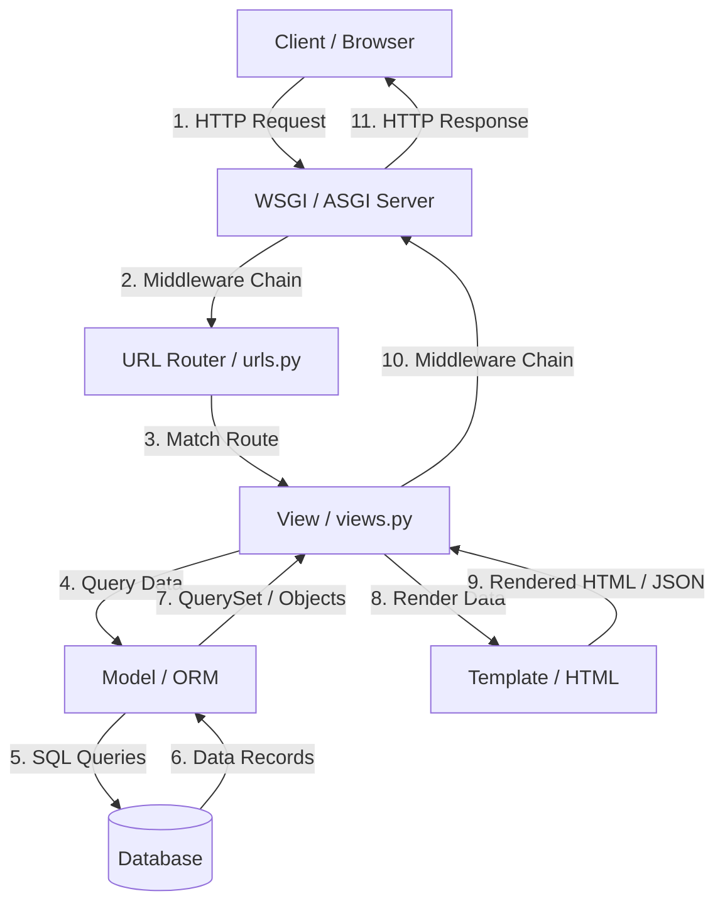

# 🧱 Django & DRF من الصفر (Q1 → نهاية الملف)

> [!info] 📖 إزاي تذاكر الملف ده؟
> الملف ده بيغطي رحلة بناء الـ API من أول الـ Request ما يدخل لحد ما الداتا ترجع لليوزر. كل سؤال بيبني على اللي قبله عشان يثبت المفاهيم التقنية بعمق ويديك إجابات نموذجية للإنترفيوهات.

## Q1 — هو إيه الـ (Django) ده أصلاً؟ وإيه حكاية الـ "Batteries Included" دي؟

### أصل الحكاية:
لما بنقرر ندخل عالم الـ (Backend) بنلاقي قدامنا طريقين؛ يا إما نبني كل حاجة من الصفر بأيدينا ونقعد نربط الداتا بيز ونعمل نظام حماية للمسارات ونعمل نظام تسجيل دخول لليوزرات، يا إما نستخدم فريم وورك يشيل الليلة دي عننا. الـ (Django) بيفكر كأنه شيف في مطعم مجهز؛ هو مش بس بيديك البوتاجاز، ده بيديك السكاكين والتوابل وحتة اللحمة كمان! دي فكرة الـ "Batteries Included" (البطاريات متضمنة) - يعني جانجو بييجي ومعاه كل حاجة هتحتاجها علشان تبني موقع أو (API) متكامل من غير ما تحتاج تدور على مكتبات خارجية تعملك الحاجات الأساسية زي الـ (Admin Panel) أو الـ (ORM) أو الـ (Authentication).
المشكلة العملية اللي بيحلها جانجو هي السرعة والأمان؛ بدل ما تضيع أسبوعين تضبط نظام الحماية من الـ (SQL Injection) والـ (CSRF Attacks) وتأمين الـ (Passwords) في الداتا بيز، جانجو بيبقى عامل حسابه في الحاجات دي من أول لحظة، وده بيخليك تركز على البزنس لوجيك (Business Logic) بتاعك على طول وتنجز مشروعك بسرعة.

علشان نشوف إزاي الإعدادات دي بتيجي جاهزة، خلينا نبص على شكل الـ `settings.py` اللي جانجو بيكريتها أوتوماتيك وبتوضح إزاي كل الأدوات دي مدمجة باي ديفولت (by default) ومش محتاجة تصطبها بنفسك.

```python
# settings.py
# Django automatically enables these core apps out of the box

INSTALLED_APPS: list[str] = [
    'django.contrib.admin',          # Built-in admin panel interface
    'django.contrib.auth',           # Authentication system (users, groups, permissions)
    'django.contrib.contenttypes',   # Database relation helper for models
    'django.contrib.sessions',       # Session framework for tracking requests
    'django.contrib.messages',       # Cookie- and session-based message framework
    'django.contrib.staticfiles',    # Static files management (CSS, JS, Images)
]
```

#### مثال 1: عمل مشروع جديد
علشان نكريت مشروع جديد بجانجو، بنستخدم أداة الـ (CLI) اللي بتنزل معاه وبتعمل لينا هيكل المشروع بالكامل في ثانية.

```python
# run this in your terminal to create the project template
# django-admin startproject myproject
```

#### مثال 2: استخدام نظام تسجيل الدخول الجاهز
هنا بنشوف إزاي بنستخدم الموديل الجاهز لليوزرات علشان نعمل يوزر جديد ونسيفه في الداتا بيز بكلمة سر متفرمة ومتأمنة (Hashed Password) من غير ما نكتب كود تشفير بنفسنا.

```python
from django.contrib.auth.models import User

# Creating a new user using Django's built-in User model and hashing mechanism
def create_new_user(username: str, email: str, password: str) -> User:
    # create_user hashes the password automatically using PBKDF2
    user: User = User.objects.create_user(
        username=username,
        email=email,
        password=password
    )
    return user
```

#### مثال 3: تأمين الفورمات ضد الـ CSRF
جانجو بيفرض حماية ضد هجمات الـ (Cross-Site Request Forgery) بشكل تلقائي. الكود ده بيوضح إزاي جانجو بيرفض الـ (POST requests) اللي معندهاش توكن الحماية ده.

```python
from django.views.decorators.csrf import csrf_protect
from django.http import HttpResponse, HttpRequest

@csrf_protect
def secure_submit_view(request: HttpRequest) -> HttpResponse:
    # If the request is POST, Django automatically validates the CSRF token in header/body
    if request.method == 'POST':
        return HttpResponse("Data saved safely because token was verified.")
    return HttpResponse("GET requests don't need CSRF token validation.")
```

### الفايدة الانترفيوية:
* **صيغة السؤال في الإنترفيو:** What is Django and what does the "Batteries Included" philosophy mean?
* **الإجابة المثالية:** جانجو هو فريم وورك مكتوب بالـ Python مبني على فكرة توفير كل الأدوات الأساسية اللي المطور بيحتاجها علشان يبني موقع متكامل من غير ما يلف على مكتبات خارجية. معنى الـ "Batteries Included" إن الفريم وورك بييجي جاهز بنظام (Authentication) كامل للتعامل مع اليوزرات والصلاحيات، وجاهز بـ (ORM) قوي للتعامل مع الداتا بيز، ومعاه لوحة تحكم إدارية (Admin Panel) بتتبني لوحدها، بجانب أنظمة حماية مدمجة ضد الثغرات الشهيرة زي الـ (CSRF) والـ (SQL Injection) والـ (XSS). ده بيوفر وقت المطور وبيضمن إن السيستم مبني على قواعد حماية قوية وصح من الأول.

---

## Q2 — إيه الفرق بين الـ (Project) والـ (App) في جانجو؟ وليه متقسمين كده؟

### أصل الحكاية:
لما بنيجي نعمل مشروع بـ (Django)، أول خطوة بنعملها هي كتابة `startproject`. ده بيعمل لينا الـ (Project) الكبير. بعد كدة بنبدأ نكريت حاجات أصغر جواه اسمها الـ (Apps) عن طريق `startapp`.
التشبيه هنا: الـ (Project) عامل زي "المول التجاري" الكبير اللي بيوفر البنية التحتية، الإضاءة، الأمن، وتوصيلات الميه. الـ (App) هو "المحل" اللي بيتبنى جوة المول ده وبيقدم خدمة معينة ومستقلة بذاتها (زي كافيه، أو محل لبس). المول (الـ Project) دوره إنه يتحكم في الإعدادات العامة للموقع كله، والـ (Routing) الرئيسي للـ URLs، والـ Middlewares. المحل (الـ App) دوره يركز في وظيفته وبس (مثلاً App خاص باليوزرات، أو App للمنتجات، أو App للمدفوعات).
جانجو اتقسم كدة علشان يحقق مبدأ الـ (Reusability) أو إعادة الاستخدام. لو كتبت الـ (App) بتاع المنتجات بشكل صح وبطريقة مستقلة، هتقدر تفصله وتاخده زي ما هو وتنقله لمشروع تاني خالص وهيشتغل من غير ما تعيد كتابته من الصفر.

خلينا نبص على الهيكل التنظيمي للمشروع والـ (Apps) وإزاي بنربطهم في الإعدادات.

```python
# Project Directory Structure:
# myproject/                <-- The Project (The Mall)
#    settings.py            <-- Shared configurations
#    urls.py                <-- Main routing desk
#    wsgi.py
# shop/                     <-- An App (The Shoe Store)
#    models.py              <-- Shoe database tables
#    views.py               <-- Shoe business logic
#    urls.py                <-- Shoe specific URLs
```

#### مثال 1: تسجيل الـ App جوة الـ Project
بعد ما بنكريت الـ (App) عن طريق `python manage.py startapp shop` لازم نروح للمول (الـ Project) ونقوله إن في محل جديد فتح وسجل اسمه في الـ `settings.py`.

```python
# myproject/settings.py
# Registering the new 'shop' app to make Django aware of its models and migrations

INSTALLED_APPS: list[str] = [
    'django.contrib.admin',
    'django.contrib.auth',
    'django.contrib.contenttypes',
    'django.contrib.sessions',
    'django.contrib.messages',
    'django.contrib.staticfiles',
    
    # Registering our custom app
    'shop.apps.ShopConfig', 
]
```

#### مثال 2: توجيه المسارات من الـ Project للـ App
هنا بنشوف إزاي ملف الـ URLs الرئيسي للمشروع بياخد الطلب ويوجهه لملف الـ URLs الداخلي بتاع الـ (App) علشان يخليه يتعامل معاه.

```python
# myproject/urls.py
from django.contrib import admin
from django.urls import path, include

# Route requests starting with 'shop/' to the shop app's URLs file
urlpatterns: list = [
    path('admin/', admin.site.urls),
    path('shop/', include('shop.urls')), # Delegating to the app's URLs
]
```

#### مثال 3: ملف الـ URLs الخاص بالـ App نفسه
ده ملف الـ URLs الداخلي بتاع الـ (App) اللي بيحدد أنهي دالة أو كلاس هيتعامل مع المسار لما يجيلنا.

```python
# shop/urls.py
from django.urls import path
from .views import product_list_view

# Routing internally inside the shop app
urlpatterns: list = [
    path('products/', product_list_view, name='product-list'), # Resolves to /shop/products/
]
```

### الفايدة الانترفيوية:
* **صيغة السؤال في الإنترفيو:** What is the difference between a Django Project and a Django App?
* **الإجابة المثالية:** الـ (Project) في جانجو هو الكونتينر الكبير اللي بيحتوي على الإعدادات العامة وتوصيلات الداتا بيز والـ URLs والـ Middlewares للمشروع كله. أما الـ (App) فهو تطبيق مصغر وجزء من الـ (Project) بيكون مسؤول عن وظيفة معينة ومحددة جوة السيستم (زي المدفوعات أو العربة). الـ (Project) الواحد ممكن يحتوي على كذا (App)، والـ (App) الواحد ممكن نستخدمه في أكتر من مشروع لو اتصمم بشكل مستقل. الفصل ده بيساعد في تنظيم الكود وتسهيل صيانته وتطبيق مبدأ الـ (Single Responsibility Principle) على مستوى التطبيق.

---

## Q3 — إيه هي معمارية الـ (MVT) وإزاي بتختلف عن الـ (MVC) الشهيرة؟

### أصل الحكاية:
في معمارية الـ (MVC) التقليدية اللي بنسمع عنها في لغات تانية، بيكون عندنا تلات حاجات: (Model) وهو الداتا، و (View) وهو الشكل النهائي للموقع، و (Controller) وهو العقل المفكر اللي بياخد الـ Request ويوجه الداتا.
جانجو لما نزل، المطورين بتوعه قالوا احنا هنعمل معمارية شبهها بس هنسميها (MVT) وهي اختصار لـ (Model, View, Template).
الناس سألوهم: طب فين الـ (Controller) اللي بيتحكم في الدنيا؟ قالوا: جانجو نفسه كـ (Framework) هو الـ (Controller). هو اللي بياخد الـ Request ويشوف الـ URL المطلوب ويبعته للـ View المناسب.
- الـ (Model) في جانجو: هو المسؤول عن بنية البيانات والتعامل مع الداتا بيز (الـ Data Layer).
- الـ (Template) في جانجو: هو ملف الـ HTML اللي بيتعرض فيه الداتا لليوزر (الـ Presentation Layer).
- الـ (View) في جانجو: هو البزنس لوجيك اللي بيتحكم في إيه اللي هيحصل بالداتا دي؛ بياخد الطلب، يطلب الداتا من الـ (Model)، ويبعتها للـ (Template) علشان تترندر وترجع لليوزر (الـ Logic Layer).
المشكلة اللي بتتحل هنا هي فصل الشغل؛ الباك إند ديفيلوبر بيكتب اللوجيك في الـ (View)، والفرونت إند ديفيلوبر بيعدل في الـ (Template) من غير ما حد يبوظ شغل التاني.

خلينا نبص على الكود البسيط ده لـ View بيوضح دور الـ (MVT) في تجميع الداتا وعرضها في تمبلت.

```python
# shop/views.py
from django.shortcuts import render
from django.http import HttpRequest, HttpResponse
from .models import Product

# The VIEW connects the Model and the Template
def product_list_view(request: HttpRequest) -> HttpResponse:
    # 1. Query data from the MODEL (Data Layer)
    products = Product.objects.filter(is_active=True)
    
    # 2. Pass the data to the TEMPLATE (Presentation Layer) inside the context dict
    context: dict = {
        'products': products,
        'title': 'Active Products'
    }
    
    # 3. Render and return the HTTP Response
    return render(request, 'shop/product_list.html', context)
```

دورة حياة الـ Request كاملة في جانجو بتوضح إزاي الـ (MVT) بيشتغل:



#### مثال 1: الموديل اللي بيمثل الداتا
هنا الموديل بيحدد شكل الجدول في الداتا بيز.

```python
# shop/models.py
from django.db import models

class Product(models.Model):
    name = models.CharField(max_length=200)
    price = models.DecimalField(max_digits=10, decimal_digits=2)
    is_active = models.BooleanField(default=True)
```

#### مثال 2: التمبلت اللي بيعرض الداتا
وده جزء من ملف الـ HTML اللي بياخد الداتا اللي باعتها الـ View ويعرضها لليوزر باستخدام لغة تمبلت جانجو (DTL).

```html
<!-- shop/templates/shop/product_list.html -->
<h1>{{ title }}</h1>
<ul>
    
        <li>{{ product.name }} - ${{ product.price }}</li>
    
        <li>No products found.</li>
    
</ul>
```

### الفايدة الانترفيوية:
* **صيغة السؤال في الإنترفيو:** Explain the MVT architecture in Django and how it differs from MVC.
* **الإجابة المثالية:** معمارية الـ (MVT) هي النسخة الخاصة بجانجو من الـ (MVC). الـ (Model) في جانجو بيقوم بنفس دور الـ (Model) في الـ (MVC) وهو التعامل مع البيانات والداتا بيز. الـ (Template) بيقوم بدور الـ (View) وهو ملفات الـ (HTML) المسؤولة عن العرض. أما الـ (View) في جانجو فبيقوم بدور الـ (Controller) وهو كتابة البزنس لوجيك وربط الـ Model بالـ Template. دور الـ (Controller) الرئيسي في جانجو بيقوم بيه الفريم وورك نفسه لما بيستقبل الـ Request ويوجهه للـ View المناسب بناء على ملف الـ URLs.

---

## Q4 — إزاي الـ (URL Routing) بيشتغل؟ وإزاي بنربط الـ URL بـ View معين؟

### أصل الحكاية:
الـ (URL Routing) هو زي الراجل اللي واقف على باب الشركة ويسألك: "أنت رايح أنهي مكتب؟" ويوجهك للمكتب الصح. لما يوزر بيكتب لينك في المتصفح بتاعه ويدوس إنتر، الـ (Request) ده بيوصل لجانجو، فجانجو بياخد الـ (URL) اللي مكتوب ويبدأ يقارنه بالـ (URLs) اللي متسجلة عنده في ملف `urls.py`.
جانجو بيمشي على ملف الـ `urls.py` ده سطر سطر من فوق لتحت. أول مسار بيطابق الـ (URL) اللي جاي، جانجو بيوقف البحث ويوجه الـ (Request) ده للـ (View) المرتبط بالمسار ده فوراً. لو السيرفر خلص الملف كله وملقاش أي تطابق، بيرجع لليوزر رد 404 (Page Not Found).
المشكلة اللي بيحلها الـ (URL Routing) هي تنظيم الـ (Endpoints) بتاعة الـ API والموقع، ويخلي المسارات نضيفة وسهلة القراءة ومستقلة تماماً عن اسم ملف الـ Python أو مكانه على السيرفر.

خلينا نشوف كود بيوضح إزاي بنكتب الـ (Paths) وبنستخدم الـ (Path Converters) لتمرير داتا من الـ URL للـ View.

```python
# shop/urls.py
from django.urls import path
from .views import product_detail_view, category_products_view

urlpatterns: list = [
    # 1. Matching dynamic integer as product primary key (pk)
    path('products/<int:pk>/', product_detail_view, name='product-detail'),
    
    # 2. Matching dynamic string as category slug
    path('category/<slug:category_slug>/', category_products_view, name='category-products'),
]
```

#### مثال 1: الـ View اللي بيستقبل الرقم الديناميكي من الـ URL
الـ View ده بياخد الـ `pk` اللي جانجو طلعه من الـ URL ويبدأ يستخدمه علشان يدور على المنتج في الداتا بيز.

```python
# shop/views.py
from django.http import HttpResponse, HttpRequest, Http404
from .models import Product

def product_detail_view(request: HttpRequest, pk: int) -> HttpResponse:
    try:
        # Fetching the product using the primary key passed from the URL pattern
        product = Product.objects.get(id=pk)
        return HttpResponse(f"Product: {product.name}, Price: {product.price}")
    except Product.DoesNotExist:
        raise Http404("This product does not exist in our store.")
```

#### مثال 2: استخدام الـ (Regular Expressions) في الـ URLs
ساعات بنحتاج نعمل شروط معقدة أكتر للمسارات، زي ماتشينج لتاريخ معين أو صيغة معينة. جانجو بيوفر الـ `re_path` للحالات دي.

```python
# shop/urls.py (Advanced Regex Matching)
from django.urls import re_path
from .views import archive_view

urlpatterns: list = [
    # Match dates like /archive/2026/
    re_path(r'^archive/(?P<year>[0-9]{4})/$', archive_view, name='archive-year'),
]
```

#### مثال 3: كتابة الـ View للـ Regex
الكود ده بيستقبل قيمة الـ `year` اللي اتفلترت بالـ (Regex) كـ (keyword argument).

```python
# shop/views.py
def archive_view(request: HttpRequest, year: str) -> HttpResponse:
    return HttpResponse(f"Showing archives for the year: {year}")
```

### الفايدة الانترفيوية:
* **صيغة السؤال في الإنترفيو:** How does URL routing work in Django and what are path converters?
* **الإجابة المثالية:** الـ (URL Routing) في جانجو بيشتغل عن طريق مقارنة مسار الـ (Request) بالأنماط (Patterns) المتسجلة في ملف الـ `urls.py` الرئيسي والـ (Apps) التابعة ليه بشكل تتابعي من فوق لتحت. الـ (Path Converters) هي طرق لتحديد نوع البيانات اللي هتيجي في الـ (URL) وكمان سحبها وتمريرها كـ (Parameters) للـ (View) بشكل مباشر، زي الـ `<int:pk>` اللي بيضمن إن القيمة تكون رقم صحيح بس، والـ `<slug:name>` اللي بيقبل نصوص مفصلة بشرطة، والـ `<uuid:id>` وغيرها.

---

## Q5 — إيه الفرق الأساسي بين الـ (FBVs) والـ (CBVs) في جانجو العادي؟ وإمتى نستخدم كل واحد؟

### أصل الحكاية:
زي ما شفنا في Q4، بعد ما المسار يتحدد بنروح للـ (View). جانجو بيسمحلك تكتب الـ View ده بطريقتين: يا إما دالة بسيطة (Function-Based View - FBV) يا إما كلاس كامل (Class-Based View - CBV).
الـ (FBVs) هي الطريقة الكلاسيكية البسيطة؛ بتكتب دالة بتاخد الـ (Request) وتكتب كود عادي جواه (if conditions) علشان تفصل بين الـ (GET Request) والـ (POST Request). دي بتكون سهلة في القراية ومباشرة جداً ومفيش فيها أي سحر أو تعقيد.
الـ (CBVs) هي الطريقة التانية؛ بتعمل كلاس بيورث من كلاس أساسي في جانجو زي `View` أو `ListView`. ده بيخليك تقسم الكود لميثودز جاهزة زي `get()` و `post()` بدلاً من الـ (if conditions).
المشكلة اللي بتظهر هي: التكرار والوقت مقابل التعقيد. الـ (FBV) بتخليك تكرر كود كتير لو عندك كذا View بيعملوا نفس الحاجة بالظبط (زي إنك تجيب ليستة منتجات من الداتا بيز وتعرضها). الـ (CBV) بتلغي التكرار ده خالص بـ (Generic Views) جاهزة، بس لو حبيت تعمل حركة برة الصندوق أو تعدل تعديل مش تقليدي، بتلاقي نفسك غرقان في كلاسات ووراثة معقدة جداً وصعبة في الـ (Debugging).

خلينا نقارن بين الطريقتين بالكود علشان نوضح إزاي نفس العملية بتتعمل في الاتنين.

```python
# shop/views.py
from django.http import HttpRequest, HttpResponse
from django.views import View
from .models import Product

# --- WAY 1: Function-Based View (FBV) ---
def product_list_fbv(request: HttpRequest) -> HttpResponse:
    # Explicitly checking the HTTP method using conditional logic
    if request.method == 'GET':
        products = Product.objects.all()
        return HttpResponse(f"FBV response: {len(products)} products found.")
    return HttpResponse("Method not allowed", status=405)


# --- WAY 2: Class-Based View (CBV) ---
class ProductListCBV(View):
    # Django dispatches requests internally to helper methods matching the HTTP verb name
    def get(self, request: HttpRequest) -> HttpResponse:
        products = Product.objects.all()
        return HttpResponse(f"CBV response: {len(products)} products found.")
```

#### مثال 1: استخدام الـ (Generic ListView) لتوفير الكود
ده مثال لـ (CBV) بيستخدم الـ `ListView` الجاهز في جانجو. الكود ده بيجيب كل المنتجات أوتوماتيك ويبعتها لصفحة معينة من غير ما نكتب سطر استعلام واحد بإيدينا!

```python
# shop/views.py
from django.views.generic import ListView
from .models import Product

class ProductListView(ListView):
    model = Product                          # Tells Django to query Product.objects.all()
    template_name = 'shop/product_list.html' # Tells Django which template to render
    context_object_name = 'products'         # Changes the variable name inside the template context
```

#### مثال 2: استخدام الـ Decorators مع الـ FBV لحماية الصفحة
في الـ (FBV)، بنقدر نحمي الصفحة بسهولة جداً بكتابة (Decorator) فوق الدالة على طول.

```python
from django.contrib.auth.decorators import login_required

@login_required
def dashboard_fbv(request: HttpRequest) -> HttpResponse:
    return HttpResponse(f"Welcome back {request.user.username}!")
```

#### مثال 3: حماية الـ CBV باستخدام الـ (LoginRequiredMixin)
في الـ (CBV)، مش بينفع نستخدم الـ (Decorators) العادية بشكل مباشر فوق الكلاس، ولازم نستخدم (Mixin) ونخليه يورث منه.

```python
from django.contrib.auth.mixins import LoginRequiredMixin

class DashboardCBV(LoginRequiredMixin, View):
    # This view is protected and requires user to be logged in
    def get(self, request: HttpRequest) -> HttpResponse:
        return HttpResponse(f"Welcome back {request.user.username} from CBV dashboard!")
```

### الفايدة الانترفيوية:
* **صيغة السؤال في الإنترفيو:** What is the difference between Function-Based Views and Class-Based Views in Django? When should you use each?
* **الإجابة المثالية:** الـ (FBVs) هي دوال بتستقبل الـ Request وبترجع Response، وبتتميز ببساطتها ووضوحها التام وسهولة استخدام الـ (Decorators) عليها، وهي الأنسب للمهام البسيطة أو اللوجيك المخصص المعقد. الـ (CBVs) هي كلاسات بتستغل الـ (Object-Oriented Programming) لتسهيل إعادة استخدام الكود عن طريق الـ (Inheritance) والـ (Generic Views)، وهي الأنسب للعمليات المتكررة زي الـ (CRUD operations) والـ (Forms). القرار بيعتمد على التعقيد؛ لو اللوجيك قياسي ونمطي يفضل (CBVs)، لو اللوجيك مخصص جداً وبسيط يفضل (FBVs).

---

## Q6 — إيه هو الـ (ORM) وإيه المشكلة اللي بيحلها مقارنة بكتابة (Raw SQL)؟

### أصل الحكاية:
لما بنتعامل مع الداتا بيز، اللغة الرسمية اللي بتفهمها هي الـ (SQL). عشان تجيب داتا كنت بتكتب كود شبه `SELECT * FROM products WHERE price > 100;`. المشكلة هنا إننا بنكتب كود الباك إند بلغة تانية خالص وهي الـ (Python) اللي بتتعامل مع الـ (Objects) والـ (Classes).
هنا بييجي دور الـ (ORM) وهي اختصار لـ (Object-Relational Mapping). الـ (ORM) هو المترجم اللي بيقف بين لغة الـ (Python) ولغة الـ (SQL).
الـ (ORM) بيفكر كدة: "أنا هخلي المطور يكتب كود Python نضيف جداً، وأنا هترجم الكود ده لـ SQL مناسب لنوع الداتا بيز اللي شغال عليها تحت في الخلفية".
بدل ما تقعد تكتب كويري SQL طويلة وتخاف من ثغرات الـ (SQL Injection) لو نسيت تعمل فلترة للداتا، الـ (ORM) بيهتم بالموضوع ده وبيفلتر المدخلات لوحده.
المشكلة العملية اللي بيحلها هي الـ (Database Portability) وسرعة التطوير؛ لو قررت فجأة تنقل من (SQLite) لـ (PostgreSQL) في بيئة الإنتاج، مش هتغير ولا سطر كود Python، الـ (ORM) هو اللي هيغير طريقة الترجمة لوحده للداتا بيز الجديدة.

خلينا نقارن بين كتابة الكويري بالـ SQL وكتابتها بـ Django ORM.

```python
# Comparing raw SQL query execution with Django ORM syntax

# --- Raw SQL equivalent (Manual connection and binding) ---
# SELECT * FROM shop_product WHERE is_active = True AND price > 100.00;

# --- Django ORM (Safe, clean and mapped to Python objects) ---
from decimal import Decimal
from .models import Product

# Django ORM generates the exact SQL above safely under the hood
active_expensive_products = Product.objects.filter(
    is_active=True, 
    price__gt=Decimal('100.00')
)
```

#### مثال 1: تعديل البيانات بالـ ORM
تعديل ريكورد في الداتا بيز بيبقى بسيط زي تعديل متغير عادي في أوبجكت Python ثم استدعاء ميثود `save()`.

```python
# Modifying a product status using Django ORM
def mark_product_out_of_stock(product_id: int) -> None:
    # 1. Fetch object from DB
    product = Product.objects.get(id=product_id)
    # 2. Change Python object property
    product.is_active = False
    # 3. Save triggers UPDATE query automatically
    product.save()
```

#### مثال 2: فخ الـ (Raw SQL Injection)
لو اضطرينا نكتب SQL يدوي، فيه غلطة شائعة جداً ممكن تدمر أمان الموقع لو دمجنا المدخلات مباشرة في النص (String concatenation).

```python
# BAD: Vulnerable to SQL Injection
def search_product_unsafe(user_input: str) -> list[Product]:
    query = f"SELECT * FROM shop_product WHERE name = '{user_input}'"
    return list(Product.objects.raw(query))

# GOOD: Safe parameterized raw query
def search_product_safe(user_input: str) -> list[Product]:
    query = "SELECT * FROM shop_product WHERE name = %s"
    # Django escapes user_input automatically to prevent SQL Injection
    return list(Product.objects.raw(query, [user_input]))
```

#### مثال 3: إنشاء ريكورد جديد وحفظه
الكود ده بيوضح إزاي الـ (ORM) بياخد أوبجكت بايثون جديد وبيكتبه في الداتا بيز بـ `create()`.

```python
# Creating and saving a new record in a single transaction
new_product = Product.objects.create(
    name="Wireless Headset",
    price=Decimal('59.99'),
    is_active=True
)
# new_product now contains the primary key (id) populated automatically by the database
```

### الفايدة الانترفيوية:
* **صيغة السؤال في الإنترفيو:** What is Django ORM and what are its advantages over raw SQL?
* **الإجابة المثالية:** الـ (Django ORM) هو نظام وسيط بيسمح لينا بالتعامل مع قواعد البيانات عن طريق كتابة كود بايثون و (Objects) بدلاً من كتابة استعلامات (SQL) يدوية. أهم مميزاته هي: أولاً، الحماية التلقائية من ثغرات الـ (SQL Injection) عن طريق الـ (Parameterization) التلقائي. ثانياً، استقلالية قاعدة البيانات (Database Abstraction)؛ بحيث تقدر تغير نوع الداتا بيز من غير ما تعدل كود البزنس لوجيك. ثالثاً، سرعة التطوير والتكامل التام مع باقي أدوات جانجو زي الـ (Forms) والـ (Admin Panel).

---

## Q7 — إيه الفرق بين الـ (makemigrations) والـ (migrate)؟ وإيه اللي بيحصل في الداتا بيز بالظبط؟

### أصل الحكاية:
زي ما شفنا في Q6، الـ (ORM) بيخلينا نكتب الـ (Models) بلغة البايثون. طب إزاي الداتا بيز الفعلية (زي PostgreSQL) هتعرف إننا ضفنا جدول جديد أو مسحنا حقل معين؟ الداتا بيز مش بتفهم بايثون، بتفهم أوامر تعديل الجداول (DDL - Data Definition Language). هنا بييجي دور الـ (Migrations) كجسر بين كود البايثون والـ Schema بتاعة الداتا بيز.
العملية دي بتتقسم لخطوتين مهمين جداً:
الخطوة الأولى: `makemigrations`. جانجو بيبص على ملف الـ `models.py` ويقارن حالته الحالية بآخر حالة مسجلة في ملفات الـ (migrations) السابقة. لو لقى تغييرات، بيكريت ملف بايثون جديد في فولدر الـ `migrations` جواه وصف دقيق للتعديل ده (زي: "احنا هنضيف عمود جديد اسمه age في جدول user"). ده بيكون زي خطة التصميم الهندسي للمبنى.
الخطوة الثانية: `migrate`. هنا جانجو بياخد ملف الخطة ده، ويشوف أنهي خطط لسه منفذهاش على الداتا بيز الفعلية، ويترجم الخطط دي لأوامر SQL حقيقية زي `ALTER TABLE` أو `CREATE TABLE` وينفذها فوراً على الداتا بيز.
المشكلة العملية اللي بيحلها النظام ده هي تتبع التغيرات في الداتا بيز ومزامنتها بين كل المطورين في الفريق؛ مفيش مطور بيحتاج يعدل الجداول يدوياً على جهازه، الكل بيكتب نفس الأمر والـ migrations بتظبط السيستم لوحدها.

خلينا نشوف شكل الكود لما بنضيف موديل جديد، وإزاي ده بيتحول لملف خطة (Migration).

```python
# shop/models.py
from django.db import models

class Category(models.Model):
    title = models.CharField(max_length=100)
    # After saving this, we run: python manage.py makemigrations
```

لما بنشغل أمر الـ `makemigrations` بيطلع ملف بايثون جديد جوة فولدر الـ `migrations/0001_initial.py` وبيبقى شكله كدة تقريباً:

```python
# shop/migrations/0001_initial.py
# Django auto-generated migration file

from django.db import migrations, models

class Migration(migrations.Migration):
    initial = True
    dependencies = []

    operations = [
        migrations.CreateModel(
            name='Category',
            fields=[
                ('id', models.BigAutoField(auto_created=True, primary_key=True, serialize=False, verbose_name='ID')),
                ('title', models.CharField(max_length=100)),
            ],
        ),
    ]
```

#### مثال 1: فحص الـ SQL الفعلي قبل التطبيق
علشان نكون متأكدين جانجو هيعمل إيه بالظبط في الداتا بيز، بنقدر نخليه يورينا أمر الـ SQL الحقيقي اللي هيتنفذ بس من غير ما ينفذه فعلاً، وده مفيد جداً في الإنتاج للتأكد من السلامة.

```python
# Run in terminal to see generated SQL for migration 0001:
# python manage.py sqlmigrate shop 0001
```

الناتج اللي بيعرضه الأمر ده على الشاشة بيكون كود SQL حقيقي:
```sql
-- Generated SQL for PostgreSQL
CREATE TABLE "shop_category" (
    "id" bigserial NOT NULL PRIMARY KEY, 
    "title" varchar(100) NOT NULL
);
```

#### مثال 2: معرفة حالة الـ Migrations
لو عايزين نعرف أنهي خطط اتنفذت وأنهي لسه مستني، بنستخدم الـ `showmigrations` اللي بيعرض حالة كل ملف.

```python
# Run in terminal:
# python manage.py showmigrations
# Output shows [X] for applied migrations, and [ ] for unapplied ones
```

#### مثال 3: التراجع عن خطوة migration
لو عملنا خطوة غلط وعايزين نرجع خطوة لورا في الداتا بيز، بنقدر نعمل `migrate` لاسم الملف اللي قبله عشان جانجو يعمل تراجع (Rollback).

```python
# Run in terminal to rollback to the initial state:
# python manage.py migrate shop zero
# This runs the DROP TABLE statements generated by Django under the hood
```

### الفايدة الانترفيوية:
* **صيغة السؤال في الإنترفيو:** What is the difference between makemigrations and migrate in Django?
* **الإجابة المثالية:** أمر `makemigrations` هو المسؤول عن فحص التغيرات في الـ `models.py` وكتابة ملفات بايثون جديدة (تسمى migrations) بتوصف التعديل ده كـ (Draft) أو رسم هندسي. أما أمر `migrate` فهو المسؤول عن مقارنة ملفات الـ migrations دي بجدول اسمه `django_migrations` في الداتا بيز عشان يعرف إيه اللي لسه متنفذش، وبعدين يترجم الخطط دي لأوامر SQL حقيقية وينفذها علشان يغير هيكل الداتا بيز الفعلي.

---

## Q8 — إيه الفرق الجوهري بين (null=True) و (blank=True) في الـ (Models)؟

### أصل الحكاية:
ده أشهر سؤال بيوقع المبتدئين في الإنترفيوهات لأن المفهومين شبه بعض ظاهرياً بس بيشتغلوا في مستويات مختلفة خالص في الأبلكيشن.
الـ (ORM) بيقسم التعامل مع القيم الفاضية لحتتين:
- `null=True`: دي خاصة بـ "قاعدة البيانات" (Database level). معناها إن العمود ده في الداتا بيز مسموح إنه يتخزن فيه قيمة فاضية وهي (NULL). لو القيمة مش مبعوتة خالص، الـ SQL هيرضى يخزنها كـ `NULL`.
- `blank=True`: دي خاصة بـ "الـ Validation والتطبيق" (Application level). معناها لما اليوزر يملى فورم في الـ (Admin Panel) أو نبعت داتا للـ API، مسموح للمتصفح أو اليوزر إنه يسيب الخانة دي فاضية وميطلعش خطأ (Field is required).
التشبيه هنا: `blank=True` هي حارس البوابة الخارجي اللي بيفتشك؛ بيسمحلك تدخل من غير ما تكتب حاجة في الخانة دي. أما `null=True` فهي الخزنة جوة الداتا بيز؛ بتسمح للدرج إنه يفضل فاضي ومكتوب عليه (NULL).
المشكلة الكبيرة والخطأ الشائع بيحصل مع حقول النصوص زي الـ (CharField) أو الـ (TextField). لو عملت الاثنين مع بعض في نفس الحقل، الداتا بيز هيبقى فيها طريقتين لتمثيل النص الفاضي: يا إما نص فاضي حقيقي `""` يا إما `NULL`. جانجو بينصح بقوة إننا نستخدم `blank=True` بس مع النصوص، وجانجو لوحده هيخزن النص الفاضي كـ `""` ويوحد طريقة تمثيل الداتا الفاضية.

خلينا نقارن في جدول سريع بين تأثير كل خيار في الأبلكيشن.

| الخيار | مستوى التأثير | القيمة المخزنة في الداتا بيز | الاستخدام الشائع |
| :--- | :--- | :--- | :--- |
| `null=True` | Database level | `NULL` | الأرقام، التواريخ، والعلاقات (ForeignKey) |
| `blank=True` | Form/API Validation | `""` أو القيمة الافتراضية | الحقول النصية الاختيارية |

#### مثال 1: الطريقة الصحيحة لحقول النصوص
هنا بنشوف إزاي بنخلي حقل الاسم التاني اختياري من غير ما نخليه `null=True`.

```python
# shop/models.py
from django.db import models

class UserProfile(models.Model):
    # For text fields, use blank=True ONLY. Django stores empty value as ""
    middle_name = models.CharField(max_length=50, blank=True)
```

#### مثال 2: الاستخدام الصحيح مع التواريخ والأرقام
التواريخ والأرقام في الداتا بيز مش بينفع تتخزن كـ نصوص فاضية `""`. لو الحقل ده اختياري، لازم نستخدم `null=True` و `blank=True` مع بعض علشان الداتا بيز تقبل الـ `NULL` والـ Validation يقبل الفراغ.

```python
# Dates and numbers cannot hold empty strings, so they MUST use null=True
birth_date = models.DateField(null=True, blank=True)
discount_rate = models.IntegerField(null=True, blank=True)
```

#### مثال 3: فخ الـ (Null) مع العلاقات
لما نعمل علاقة زي الـ (ForeignKey) ونعوز نخليها اختيارية (يعني لو الموظف مش تابع لقسم معين)، لازم نستخدم الاثنين مع بعض. لو نسينا `null=True` وحطينا `blank=True` بس، الداتا بيز هترفض تخزن الريكورد وهيطلع خطأ (IntegrityError).

```python
class Employee(models.Model):
    # ForeignKeys must have null=True if the relationship is optional
    department = models.ForeignKey(
        'Department', 
        on_delete=models.SET_NULL, 
        null=True, 
        blank=True
    )
```

### الفايدة الانترفيوية:
* **صيغة السؤال في الإنترفيو:** What is the difference between null=True and blank=True in Django models?
* **الإجابة المثالية:** الفرق هو إن `null=True` متعلق بقاعدة البيانات (Database Validation)، وبيحدد لو كان العمود في الجدول ينفع يقبل قيمة `NULL` ولا لأ. أما `blank=True` فمتعلق بالـ Validation بتاع الفريم وورك (Form validation)، وبيحدد لو كان الحقل اختياري وممكن نسيبه فاضي لما نملى الفورم أو نبعت داتا للـ API. مع الحقول النصية زي الـ (CharField)، بنستخدم `blank=True` بس لتجنب وجود قيمتين فاضيتين في الداتا بيز (`NULL` و `""`)، ومع الحقول غير النصية زي الأرقام والتواريخ والعلاقات، بنستخدم الاثنين مع بعض.

---

## Q9 — إيه هي العلاقات في الداتا بيز وإزاي بنعملها في جانجو؟ (OneToOne, ForeignKey, ManyToMany)

### أصل الحكاية:
الداتا بيز مبنية على ربط الجداول ببعضها علشان نمنع تكرار البيانات وننظمها. في جانجو، بنمثل العلاقات دي بتلات أنواع أساسية من الحقول في الـ (Models):
1. `OneToOneField` (واحد لواحد): كل سطر في الجدول الأول مرتبط بسطر واحد بس في الجدول التاني. التشبيه: اليوزر والبروفايل بتاعه؛ كل يوزر ليه بروفايل واحد، والبروفايل ده خاص بيوزر واحد بس.
2. `ForeignKey` (واحد لكثير - Many-to-One): سطر واحد في جدول مرتبط بـ سطور كتير في جدول تاني. التشبيه: الكاتب والكتب؛ كاتب واحد ممكن يكتب كتب كتير، بس الكتاب الواحد ليه كاتب واحد بس.
3. `ManyToManyField` (كثير لكثير): كذا سطر في جدول مرتبط بـ كذا سطر في جدول تاني. التشبيه: الطالب والكورسات؛ الطالب يقدر يسجل في كورس أو أكتر، والكورس بيبقى فيه طالب أو أكتر.
المشكلة العملية اللي بيحلها ضبط العلاقات دي هي الحفاظ على سلامة البيانات (Referential Integrity)؛ يعني لو مسحت كاتب، إيه اللي يحصل للكتب بتاعته؟ جانجو بيخلينا نحدد ده بـ `on_delete` زي `CASCADE` (امسح الكتب مع الكاتب) أو `SET_NULL` (سيب الكتب وامسح اسم الكاتب بس).

خلينا نكتب الموديلز اللي بتمثل العلاقات دي عملياً مع استخدام الـ `related_name` لتسهيل البحث العكسي.

```python
# shop/models.py
from django.db import models
from django.contrib.auth.models import User

# 1. OneToOne Relationship
class Profile(models.Model):
    user = models.OneToOneField(User, on_delete=models.CASCADE, related_name='profile')
    bio = models.TextField(blank=True)


# 2. ForeignKey (Many-to-One)
class Product(models.Model):
    name = models.CharField(max_length=200)
    # One merchant can have many products
    merchant = models.ForeignKey(User, on_delete=models.CASCADE, related_name='products')


# 3. ManyToMany Relationship
class Tag(models.Model):
    name = models.CharField(max_length=50)
    # A product can have many tags, and a tag can belong to many products
    products = models.ManyToManyField(Product, related_name='tags')
```

#### مثال 1: البحث العكسي (Reverse Lookup)
لما نستخدم الـ `related_name` بنقدر نوصل للداتا المرتبطة بسهولة جداً من الطرف التاني للعلاقة. الكود ده بيوريك إزاي تجيب كل المنتجات الخاصة بيوزر معين بدون كتابة فلترة معقدة.

```python
# Fetch all products created by a specific user using the related_name
def get_user_products(user: User) -> list[Product]:
    # Django uses 'products' related_name to perform reverse query automatically
    user_products = user.products.all()
    return list(user_products)
```

#### مثال 2: فخ الـ (on_delete) المفقود
في الإصدارات الجديدة من جانجو، إجباري تحدد الـ `on_delete` مع الـ `ForeignKey` والـ `OneToOneField`. لو نسيت تحدده، جانجو مش هيقبل يشتغل وهيطلع خطأ وقت الـ compilation.

```python
# BAD: Will throw a TypeError during Django startup
# category = models.ForeignKey('Category')

# GOOD: Must specify on_delete behavior explicitly
# category = models.ForeignKey('Category', on_delete=models.PROTECT)
```

#### مثال 3: وسيط علاقة ManyToMany مخصص (through)
ساعات بنحتاج نخزن معلومات إضافية عن العلاقة بين الجدولين (مثلاً: تاريخ انضمام الطالب للكورس). جانجو بيسمح لنا نعمل جدول وسيط مخصص باستخدام خيار `through`.

```python
class Student(models.Model):
    name = models.CharField(max_length=100)
    courses = models.ManyToManyField('Course', through='Enrollment')

class Course(models.Model):
    title = models.CharField(max_length=100)

# The custom intermediary table
class Enrollment(models.Model):
    student = models.ForeignKey(Student, on_delete=models.CASCADE)
    course = models.ForeignKey(Course, on_delete=models.CASCADE)
    date_enrolled = models.DateField(auto_now_add=True)
    grade = models.CharField(max_length=2, blank=True)
```

### الفايدة الانترفيوية:
* **صيغة السؤال في الإنترفيو:** Explain DB relationships in Django and what 'related_name' is used for.
* **الإجابة المثالية:** العلاقات في جانجو بتتعمل بتلات طرق: `OneToOneField` لربط ريكورد بواحد تاني مماثل، و `ForeignKey` لعمل علاقة (One-to-Many)، و `ManyToManyField` لعلاقة (Many-to-Many). الـ `related_name` هو خيار بنستخدمه لتحديد الاسم اللي هنعمل بيه استعلام عكسي (Reverse Lookup) من الجدول التاني. لو معرفناهوش، جانجو بيكريت اسم افتراضي بيكون عبارة عن اسم الموديل متبوعاً بـ `_set` (زي `product_set`)، واستخدامه بيخلي الكود أنظف وأسهل في القراءة.

---

## Q10 — إيه هو مبدأ الـ (Lazy Evaluation) في الـ (QuerySets)؟ وليه هو سلاح ذو حدين؟

### أصل الحكاية:
لما بنكتب في كود جانجو سطر زي `active_users = User.objects.filter(is_active=True)`، للوهلة الأولى بنفتكر إن جانجو راح للداتا بيز وجاب اليوزرات حالا والسطر ده خد وقت في التنفيذ. الحقيقة هي إن السطر ده سريع جداً لأنه ملمسش الداتا بيز أصلاً!
ده بنسميه الـ (Lazy Evaluation) أو "التقييم الكسول".
الـ (QuerySet) بيفكر كدة: "أنا مش هعمل مشوار للداتا بيز وأتحرك من مكاني غير لما المطور يجبرني ويحتاج الداتا دي فعلياً علشان يعرضها أو يستخدمها".
طب إمتى جانجو بيجبر الـ (QuerySet) إنه يروح للداتا بيز؟
1. لما تلف عليها بـ (Loop) زي `for user in active_users`.
2. لما تحولها لـ (List) زي `list(active_users)`.
3. لما تعمل عليها (Slicing) مع تحديد خطوة معينة أو تحاول تطبعها.
4. لما تعمل عليها اختبار شرطي زي `if active_users`.
الميزة الكبيرة (سلاح ذو حدين - الجانب الإيجابي): توفير الاستعلامات؛ تقدر تقعد تفلتر وتعدل في الـ (QuerySet) كذا مرة في كود البايثون، وفي الآخر جانجو هيجمع الفلاتر دي كلها ويبعت استعلام SQL واحد للداتا بيز لما تحتاج الداتا.
العيب والخطورة (الجانب السلبي): لو مش فاهم المفهوم ده، ممكن تكرر الاستعلامات من غير ما تحس وتعمل ضغط رهيب على الداتا بيز (Database hits) لأنك بتعمل (Evaluate) للـ QuerySet كذا مرة ورا بعض بشكل غير مباشر.

خلينا نشوف الكود ده ونشوف إزاي الفلترة المتكررة مش بتعمل غير استعلام واحد بس في الآخر.

```python
# shop/views.py
from django.db.models import QuerySet
from .models import Product

def lazy_demo() -> int:
    # 1. No database query is executed here yet
    q1: QuerySet = Product.objects.filter(is_active=True)
    
    # 2. Still no database query executed
    q2: QuerySet = q1.filter(price__gt=50)
    
    # 3. Still no database query executed
    q3: QuerySet = q2.exclude(name__icontains="damaged")
    
    # 4. Now, the QuerySet is evaluated and ONE SQL query hits the database
    product_list = list(q3) 
    
    return len(product_list)
```

#### مثال 1: فخ التقييم المتكرر (Multiple Evaluations)
الكود ده بيوضح خطأ شائع جداً بيخلي جانجو يروح للداتا بيز مرتين ورا بعض بدل مرة واحدة بسبب استخدام الـ QuerySet مرتين بشكل منفصل.

```python
# BAD: Hits the database twice
def print_products_bad() -> None:
    products = Product.objects.all()
    
    if products:  # DB hit 1: Checks if any records exist
        for product in products:  # DB hit 2: Fetches the data to iterate
            print(product.name)

# GOOD: Hits the database once
def print_products_good() -> None:
    products = Product.objects.all()
    
    # Convert to list to evaluate once and cache the result
    product_list = list(products)  # DB hit 1: Fetches all data
    
    if product_list:  # Uses cached list, no DB hit
        for product in product_list:  # Uses cached list, no DB hit
            print(product.name)
```

#### مثال 2: استخدام الـ `exists()` والـ `count()` بذكاء
ساعات بنحتاج نعرف بس لو كان فيه داتا موجودة أو عددها كام من غير ما نجيب الداتا كلها للميموري. جانجو بيوفر ميثودز مخصصة بتعمل كويري سريعة جداً بترجع رقم أو قيمة منطقية بس.

```python
# GOOD: exists() executes a fast 'LIMIT 1' query instead of loading all objects
def has_active_products() -> bool:
    return Product.objects.filter(is_active=True).exists()

# GOOD: count() executes 'SELECT COUNT(*)' directly in SQL
def get_product_count() -> int:
    return Product.objects.filter(is_active=True).count()
```

#### مثال 3: فخ التكرار جوة اللوب (Unintentional Evaluation)
لما بنطلب داتا مرتبطة جوة لوب، ده بيجبر الـ ORM يعمل استعلام جديد مع كل لفة، وده هنشرحه بالتفصيل في السؤال الجاي كأكبر مشكلة أداء.

```python
# Lazy evaluation trap in loops (Demonstrating N+1 preview)
def print_merchant_names_bad() -> None:
    # QuerySet of products is lazy
    products = Product.objects.all()
    
    for product in products:
        # Every iteration triggers a new query to fetch the merchant object
        print(product.merchant.username)
```

### الفايدة الانترفيوية:
* **صيغة السؤال في الإنترفيو:** What is Lazy Evaluation in Django QuerySets?
* **الإجابة المثالية:** الـ (Lazy Evaluation) في جانجو يعني إن الـ (QuerySet) مش بيتنفذ في قاعدة البيانات فوراً وقت إنشائه. جانجو بيقعد يجمع شروط الفلترة والترتيب ويبني كود الـ SQL في الميموري، ومش بيبعت الاستعلام الفعلي للداتا بيز غير لما نطلب الداتا دي بشكل صريح (Evaluation Trigger) زي إننا نلف عليها بـ (Loop) أو نحولها لـ (List) أو نعمل عليها عمليات فحص. الميزة إنها بتوفر استعلامات غير ضرورية وتسمح بدمج الفلاتر، وعيبها إن المطور لو مش فاهمها ممكن يعمل استعلامات متكررة من غير ما يقصد ويسبب مشاكل أداء كبيرة للسيستم.

---


## Q11 — إيه هي مشكلة الـ (N+1 Query Problem) بالتفصيل الكامل؟

### أصل الحكاية
زي ما شفنا في Q10، الـ (Lazy Evaluation) بيأجل الاستعلام لحد ما نحتاج الداتا. المشكلة بتبدأ لما نكون بنعمل (Loop) على QuerySet، وجوا اللوب ده بنحاول نوصل لـ Object مرتبط بالريكورد الأساسي (زي مثلاً إننا نلف على منتجات ونجيب اسم التاجر بتاع كل منتج).
الـ ORM بيفكر: "أنت طلبت مني المنتجات، جبتلك المنتجات في استعلام واحد (ده الـ 1). دلوقتي جوة اللوب، أنت بتسألني عن التاجر بتاع أول منتج؟ حاضر هعمل استعلام أجيبه. التاجر بتاع تاني منتج؟ حاضر استعلام تاني"... وهكذا. 
يعني لو عندنا 100 منتج، هنعمل استعلام أساسي (1) + 100 استعلام فرعي (N) = 101 استعلام! دي كارثة في الأداء بتوقع السيرفر لو الترافيك زاد، لأن كل استعلام بياخد وقت (Network Call) للداتا بيز.

#### مثال 1: فخ الـ N+1 Query (الكارثة)
```python
from myapp.models import Product

def get_product_merchant_names() -> list[str]:
    # 1 Query: Fetch all products
    products = Product.objects.all()
    
    names = []
    # N Queries: Fetch merchant for EACH product
    for product in products:
        names.append(product.merchant.name) 
        
    return names
```

> [!danger] فخ إنترفيو
> في الإنترفيو، هيسألك "إزاي تكتشف إن عندك N+1؟" الإجابة العملية هي استخدام مكتبة `django-debug-toolbar` في الـ Development، أو إنك تلاحظ استعلامات متكررة جداً لنفس الجدول في الـ APM tools.

### الفايدة الانترفيوية
* **صيغة السؤال:** Explain the N+1 Query Problem in Django and how it affects performance.
* **الإجابة المثالية:** مشكلة الـ (N+1) بتحصل لما بنستعلم عن داتا أساسية (استعلام واحد)، وبعدين نعمل (Loop) على النتيجة وداخل الـ Loop ده بنوصل لـ (Related Object) سواء كان ForeignKey أو ManyToMany. بسبب الـ (Lazy Evaluation)، جانجو بيضطر يعمل استعلام جديد منفصل لكل ريكورد عشان يجيب الداتا المرتبطة بيه، وده معناه لو بنعرض 100 ريكورد هنعمل 101 استعلام للداتا بيز بدل استعلام واحد أو اتنين. ده بيعمل ضغط هائل (Overhead) على الداتا بيز والنتورك وبيبطأ الـ Response Time جداً. بنحل المشكلة دي بأننا نعرّف جانجو من الأول يجيب الداتا المرتبطة معاه باستخدام `select_related` أو `prefetch_related`.

---

## Q12 — إزاي نحل الـ (N+1) باستخدام الـ (select_related) والـ (prefetch_related)؟

### أصل الحكاية
عشان نحل مشكلة الـ (N+1) اللي شفناها في Q11، لازم نبلغ جانجو من البداية: "بقولك إيه، وإنت رايح تجيب المنتجات، هات معاك بيانات التجار بالمرة عشان هنحتاجها". 
جانجو بيوفرلنا أداتين للموضوع ده، وكل أداة ليها استخدام حسب نوع العلاقة:
1. **`select_related`**: بيستخدم الـ `JOIN` في الـ SQL عشان يجيب كل حاجة في استعلام واحد كبير. ده بينفع مع العلاقات اللي بترجع ريكورد واحد بس (زي `ForeignKey` و `OneToOne`).
2. **`prefetch_related`**: بيعمل استعلامين منفصلين تماماً، واحد للمنتجات، والتاني للتجار، وبيجمّعهم (Join) في الميموري بتاعة بايثون. ده بينفع مع العلاقات اللي بترجع أكتر من ريكورد (زي `ManyToMany` و الـ `ForeignKey` العكسي).

| الأداة | نوع العلاقات المناسب ليها | بتشتغل إزاي في الـ SQL؟ | كم استعلام بيحصل؟ |
|---------|---------------------------|-------------------------|-------------------|
| `select_related` | ForeignKey, OneToOne | `INNER/LEFT JOIN` | استعلام واحد مدمج |
| `prefetch_related`| ManyToMany, Reverse FK | `SELECT ... WHERE id IN (...)` | استعلامين (أو أكتر) |

#### مثال 1: الحل السحري بـ select_related (للفورين كي)
```python
from myapp.models import Product

def get_product_merchant_names_optimized() -> list[str]:
    # 1 Query with SQL JOIN fetches both Product and Merchant data
    products = Product.objects.select_related("merchant").all()
    
    names = []
    for product in products:
        # NO extra query here! Data is already loaded in memory.
        names.append(product.merchant.name) 
        
    return names
```

#### مثال 2: الحل بـ prefetch_related (للماني تو ماني)
```python
from myapp.models import Product

def get_product_tags_optimized() -> list[list[str]]:
    # 2 Queries: One for Products, One for all related Tags
    # Django matches them up in Python memory
    products = Product.objects.prefetch_related("tags").all()
    
    tags_list = []
    for product in products:
        # NO extra queries in this loop!
        tags = [tag.name for tag in product.tags.all()]
        tags_list.append(tags)
        
    return tags_list
```

### الفايدة الانترفيوية
* **صيغة السؤال:** What is the exact difference between select_related and prefetch_related, and when to use each?
* **الإجابة المثالية:** الاتنين بيُستخدموا عشان يحلوا أزمة الـ N+1 Query Problem، بس الطريقة مختلفة. الـ `select_related` بيعمل `SQL JOIN` على مستوى الداتا بيز، فبيجيب الداتا الأساسية والمرتبطة في استعلام واحد، وده بنستخدمه مع الـ (Single-valued relationships) زي `ForeignKey` و `OneToOne`. أما الـ `prefetch_related` بيعمل استعلامين منفصلين، استعلام للجدول الأساسي واستعلام تاني باستخدام `IN` للجدول المرتبط، وبيعملهم (Mapping) جوة ميموري بايثون. وبنستخدمه مع الـ (Multi-valued relationships) زي `ManyToMany` أو الـ (Reverse ForeignKey) لأن الـ SQL JOIN في الحالات دي هيعمل (Data Duplication) ويستهلك ميموري ضخمة.

---

## Q13 — إيه هي الـ (Q Objects) والـ (F Objects)؟ وإزاي بيحلوا مشاكل الاستعلامات؟

### أصل الحكاية
الـ ORM بتاع جانجو سهل جداً، بس لما نيجي نكتب شروط معقدة شوية، بنلاقي نفسنا محتاجين أدوات متقدمة:
الـ **`Q Objects`** بتفكر كأنها أقواس رياضية: "أنا عايز المنتجات اللي سعرها أقل من 100 **أو** التاجر بتاعها اسمه أحمد". جانجو العادي بيعمل (AND) دايماً بين شروط الفلتر، فالـ Q بيدينا قوة الـ (OR - `|`) والـ (NOT - `~`).
الـ **`F Objects`** بتفكر كأنها إشارة مباشرة للحقل في الداتا بيز: "أنا عايز أزود سعر المنتج بـ 10 جنيه". بدل ما نجيب السعر من الداتا بيز، نزوده في بايثون، وبعدين نحفظه (واللي ممكن يعمل مشكلة Race Condition لو اتنين اشتروا في نفس اللحظة)، الـ F بتخلي الداتا بيز هي اللي تعمل العملية الحسابية دي بنفسها في مستوى الـ SQL.

#### مثال 1: الفلترة المعقدة باستخدام Q Objects
```python
from django.db.models import Q
from myapp.models import Product

def get_special_products():
    # Translates to: WHERE (price < 100 OR is_discounted = True) AND NOT (stock = 0)
    products = Product.objects.filter(
        Q(price__lt=100) | Q(is_discounted=True),
        ~Q(stock=0)
    )
    return products
```

#### مثال 2: تفادي الكارثة بـ F Objects (Race Conditions)
```python
from django.db.models import F
from myapp.models import Product

def increment_views_bad(product_id: int) -> None:
    # سيء جداً: بيجيب القيمة للميموري وبعدين يزودها
    # لو 2 يوزرز عملوا كده في نفس الملي ثانية، الزيادة هتبقى 1 بدل 2
    product = Product.objects.get(id=product_id)
    product.views += 1
    product.save()

def increment_views_good(product_id: int) -> None:
    # ممتاز: بيترجم لـ UPDATE product SET views = views + 1
    # الداتا بيز هي اللي بتدير القفل (Locking) وتضمن صحة الرقم
    Product.objects.filter(id=product_id).update(views=F("views") + 1)
```

### الفايدة الانترفيوية
* **صيغة السؤال:** How do you perform complex queries with OR logic, and what is an F object used for?
* **الإجابة المثالية:** بستخدم الـ `Q objects` عشان أعمل استعلامات معقدة فيها (OR) باستخدام علامة الـ Pipe `|` أو (NOT) باستخدام التيلدا `~`، لأن الـ `filter()` العادي بيعمل (AND) بس. أما الـ `F objects` فبستخدمها عشان أشير لقيمة عمود معين في الداتا بيز وأعمل عمليات حسابية عليه مباشرة على مستوى الـ SQL من غير ما أسحب الداتا لميموري بايثون. أهم فايدة للـ `F objects` هي تجنب الـ (Race Conditions) في حالات الـ (Concurrent updates) زي زيادة عدد المشاهدات، لأن التعديل بيحصل بقيمة العمود الحالية في الداتا بيز مش القيمة القديمة اللي اتسحبت في الـ Memory.

---

## Q14 — إزاي نعمل (Aggregation) و (Annotation) في جانجو؟

### أصل الحكاية
في أوقات كتير مبنبقاش عايزين الريكوردز نفسها، إحنا عايزين "إحصائيات" عنها، زي (متوسط الأسعار، مجموع المبيعات، عدد المنتجات).
* الـ **`aggregate`** بيفكر: "أنا هطلع نتيجة نهائية واحدة للجدول كله". (زي ما تقول للداتا بيز: هاتيلي متوسط أسعار كل المنتجات). الناتج بيكون Dictionary.
* الـ **`annotate`** بيفكر: "أنا هضيف حقل جديد مؤقت لكل ريكورد في الـ QuerySet بناءً على حسبة معينة". (زي ما تقول: هاتيلي كل التجار، وضيفي جنب كل تاجر عدد المنتجات اللي بيبيعها). الناتج بيكون QuerySet عادي بس فيه Attribute زيادة.

#### مثال 1: حساب إحصائية نهائية (Aggregate)
```python
from django.db.models import Avg, Max
from myapp.models import Product

def get_price_statistics() -> dict[str, float]:
    # Translates to: SELECT AVG(price) AS price__avg, MAX(price) AS max_price FROM product
    stats = Product.objects.aggregate(
        Avg(price), 
        max_price=Max(price) # نقدر نحدد اسم الـ key في القاموس
    )
    # Output: {price__avg: 500.5, max_price: 2000.0}
    return stats
```

#### مثال 2: إضافة معلومة لكل ريكورد (Annotate)
```python
from django.db.models import Count
from myapp.models import Merchant

def get_merchants_with_product_count():
    # Translates to: SELECT merchant.*, COUNT(product.id) AS product_count FROM merchant GROUP BY merchant.id
    merchants = Merchant.objects.annotate(
        product_count=Count(product)
    )
    
    for merchant in merchants:
        # product_count is an injected attribute!
        print(f"Merchant {merchant.name} has {merchant.product_count} products.")
```

### الفايدة الانترفيوية
* **صيغة السؤال:** Differentiate between aggregate() and annotate() in Django ORM.
* **الإجابة المثالية:** الـ `aggregate()` بنستخدمه عشان نعمل عملية حسابية (زي Sum, Avg, Count) على الـ QuerySet بالكامل ونطلع بنتيجة إجمالية واحدة. الناتج بتاعه بيكون (Dictionary) ومش (QuerySet) فمش بنقدر نعمل عليه فلترة بعد كده. أما الـ `annotate()` فهو مكافئ للـ `GROUP BY` في الـ SQL، بيعمل العملية الحسابية لكل ريكورد جوة الـ QuerySet وبيضيف النتيجة كأنها (Virtual Field) لكل أوبجكت. الـ `annotate()` بيرجع (QuerySet) عادي جداً، فبنقدر نعمل بعده `filter()` أو `order_by()` بناءً على الحقل الجديد اللي إحنا لسه ضايفينه.
