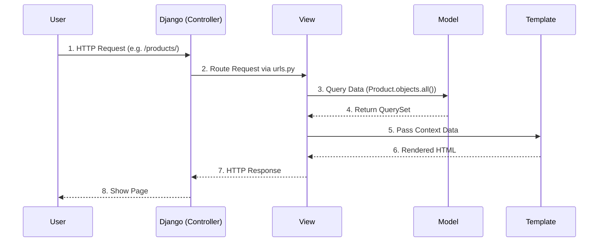

# 🧱 Django & DRF من الصفر (Q1 → نهاية الملف)

> [!info] 📖 إزاي تذاكر الملف ده؟
> الملف ده بياخدك في رحلة بناء الـ API من أول ما الـ Request بيخبط في الباب لحد ما الداتا ترجع لليوزر. كل سؤال بيبني على اللي قبله عشان تتشرب الـ Architecture من جوه مش مجرد حفظ كود.

## Q1 — إيه هو الـ (Django) أصلاً وإيه مبدأ الـ "Batteries Included" اللي بيميزه؟

### أصل الحكاية
تخيل إنك بتفتح مطعم جديد. بدل ما تبني المطبخ وتشتري الأفران وتعمل نظام الكاشير من الصفر، فيه شركة بتجيبلك مطعم جاهز ومجهز بكل حاجة، وأنت بس بتحط المنيو بتاعك وتظبط الديكور. ده بالظبط هو الـ (Django).
جانجو هو (High-level Python Web Framework) مبني على فكرة اسمها (Batteries Included)، يعني بييجي معاه "البطاريات" بتاعته: نظام User Authentication جاهز، ORM محترم عشان تكلم الداتا بيز، Admin Panel ببلاش، وحماية من الـ Security threats المشهورة (زي CSRF و SQL Injection). هو مش بيسيبك تختار كل تفصيلة زي Flask، هو بيفترض إنك عايز تبني سيستم بسرعة وبطريقة Standard. المشكلة اللي بيحلها هي تضييع الوقت في اختراع العجلة من تاني في كل بروجكت بنعمله.

```python
# مجرد إنك تعمل بروجكت جديد، جانجو بيديك ده جاهز
from django.contrib import admin
from django.urls import path

# الـ Admin Panel جاهزة للاستخدام من غير ما تكتب سطر كود فيها
urlpatterns = [
    path('admin/', admin.site.urls),
]
```

### الفايدة الانترفيوية
"What is Django and what does 'Batteries Included' mean in its context?"

**الإجابة المثالية:**
Django is a high-level Python web framework that encourages rapid development and clean, pragmatic design. The "Batteries Included" philosophy means it comes out-of-the-box with almost everything needed to build a fully functional web application, such as an ORM, authentication system, routing, an admin interface, and security middlewares. This approach drastically reduces development time and enforces a standardized, secure architecture, unlike micro-frameworks like Flask where you have to assemble these components yourself.

---

## Q2 — إيه الفرق بين الـ (Project) والـ (App) في جانجو؟ وليه متقسمين كده؟

### أصل الحكاية
زي ما شفنا في Q1 إن جانجو بيجهزلك كل حاجة، هو كمان بيجبرك على تنظيم الكود بشكل معين.
الـ (Project) هو الوعاء الكبير اللي شايل كل حاجة، هو الـ Website كله على بعضه بكل إعداداته (الـ `settings.py`). أما الـ (App) فهو موديول أو جزء صغير بيعمل وظيفة محددة جوه الويب سايت ده.
تخيل الـ Project كأنه الـ "مول" التجاري، والـ App هو "محل" جوه المول ده. المول بيوفر الكهربا والخدمات العامة (الـ settings والـ routing الأساسي)، لكن كل محل (App) ليه البضاعة بتاعته والمخزن بتاعه (Models) والعمال بتوعه (Views).
جانجو عمل كده عشان يحقق مبدأ الـ (Reusability). لو عملت App بيعمل Blog، ممكن تاخده زي ما هو كده تحطه في Project تاني ويشتغل عادي.

```python
# في ملف settings.py للـ Project
INSTALLED_APPS = [
    'django.contrib.admin', # App جاهز من جانجو
    'django.contrib.auth',  # App للـ Authentication
    
    # الـ Apps بتاعتنا
    'users.apps.UsersConfig',  # App خاص باليوزرز
    'store.apps.StoreConfig',  # App خاص بالمتجر
]
```

### الفايدة الانترفيوية
"What is the difference between a Project and an App in Django?"

**الإجابة المثالية:**
In Django, a "Project" refers to the entire web application and its configuration, containing settings, base URLs, and environment variables. An "App" is a self-contained, isolated module within the project that performs a specific functionality (e.g., a blog app, a payment app). The main purpose of this separation is reusability; a project can contain multiple apps, and a single app can be reused across multiple projects without modification.

---

## Q3 — إيه هي معمارية الـ (MVT - Model View Template) وإزاي بتختلف عن الـ (MVC) الشهيرة؟

### أصل الحكاية
زي ما قسمنا الكود لـ Apps في Q2، جوه الـ App الواحد لازم نقسم الشغل. أغلب الفريم ووركس بتستخدم (MVC - Model View Controller)، بس جانجو ليه رأي تاني وسماه (MVT - Model View Template).
في الـ MVC: الـ Controller بيستقبل الـ Request، يكلم الـ Model يجيب الداتا، ويبعتها للـ View عشان تتعرض.
في الـ MVT بتوع جانجو: الـ Framework نفسه هو اللي بيلعب دور الـ Controller (هو اللي بيستقبل الـ Request ويوجهه عن طريق الـ `urls.py`). والـ (View) في جانجو هو اللي بيعمل الـ Business Logic وبيكلم الـ Model، وبعدين يبعت الداتا للـ (Template) اللي هو الـ HTML.
يعني باختصار: View جانجو = Controller في MVC. و Template جانجو = View في MVC.



### الفايدة الانترفيوية
"Explain the MVT architecture in Django. How does it relate to MVC?"

**الإجابة المثالية:**
Django follows the MVT (Model-View-Template) architectural pattern, which is essentially a slight variation of MVC. In MVT, the "Model" handles data representation and database interactions. The "View" acts as the business logic layer, receiving the request, fetching data from the Model, and passing it to the "Template". The "Template" handles the presentation layer (HTML). The key difference from MVC is that Django itself (specifically the routing system via `urls.py`) acts as the "Controller", dispatching incoming requests to the appropriate View.

---

## Q4 — إزاي الـ (URL Routing) بيشتغل؟ وإزاي بنربط الـ URL بـ View معين؟

### أصل الحكاية
بما إن جانجو نفسه هو الـ Controller (زي ما شفنا في MVT)، فهو محتاج "خريطة" عشان يعرف يودي كل Request فين. الخريطة دي هي الـ (URL Routing).
لما يوزر يكتب لينك، جانجو بيمسك اللينك ده ويدور في ملف `urls.py` سطر بسطر من فوق لتحت. أول ما يلاقي Pattern بيماتش اللينك ده، بيقوم باعت الـ Request للـ View المربوط بيه. المشكلة اللي النظام ده بيحلها هي فصل الـ URLs عن الكود نفسه، عشان لو حبيت تغير شكل اللينك في المستقبل، تغيره في مكان واحد من غير ما تكسر الـ Views.

```python
# urls.py
from django.urls import path
from . import views

urlpatterns = [
    # مثال 1: URL بسيط
    path('products/', views.product_list, name='product-list'),
    
    # مثال 2: URL بياخد Parameter (Path Variable)
    # الـ <int:pk> دي بتتبعت كـ Argument للـ View
    path('products/<int:pk>/', views.product_detail, name='product-detail'),
]
```

```python
# views.py
from django.http import HttpResponse

def product_detail(request, pk: int):
    # الـ pk وصل هنا من الـ URL
    return HttpResponse(f"Product ID is {pk}")
```

### الفايدة الانترفيوية
"How does the URL dispatcher work in Django?"

**الإجابة المثالية:**
Django's URL dispatcher works by matching the requested URL against a list of URL patterns defined in `urls.py`. It reads the `urlpatterns` list sequentially from top to bottom and stops at the first successful match. Once matched, Django imports and calls the associated View function or class, passing the `HttpRequest` object along with any captured parameters (path variables) defined in the URL pattern. This loosely coupled design allows for clean, SEO-friendly URLs.

---

## Q5 — إيه الفرق الأساسي بين الـ (Function-Based Views - FBVs) والـ (Class-Based Views - CBVs) في جانجو العادي؟ وإمتى نستخدم كل واحد؟

### أصل الحكاية
احنا اتفقنا في Q3 إن الـ (View) هو قلب الـ Logic. جانجو بيديك طريقتين تكتب بيهم الـ View.
الـ (FBVs) هي الطريقة البديهية: فانكشن عادية بتاخد Request وترجع Response. سهلة القراية ومباشرة.
الـ (CBVs) ظهرت عشان تحل مشكلة التكرار (DRY). لو عندك 5 صفحات بيعرضوا List of items، بدل ما تكتب نفس كود الـ Query والـ Rendering 5 مرات، بتعمل Class تورث من `ListView` جاهزة في جانجو، وهي بتعمل كل السحر ورا الكواليس.
الـ CBVs بتوفر كود جداً، بس عيبها إنها بتخبي الـ Logic (Implicit) ومحتاج تكون فاهم الـ Flow بتاعها كويس عشان تعرف تعملها Override لو احتجت.

#### مثال 1: Function-Based View (صريح ومباشر)
```python
from django.shortcuts import render
from .models import Product

def product_list_fbv(request):
    # لو عايز تفصل الـ GET عن الـ POST هتعمل if conditions
    if request.method == 'GET':
        products = Product.objects.all()
        return render(request, 'products.html', {'products': products})
```

#### مثال 2: Class-Based View (مختصر وبيعتمد على الوراثة)
```python
from django.views.generic import ListView
from .models import Product

# كل الكود اللي فوق اختصرناه هنا!
class ProductListCBV(ListView):
    model = Product
    template_name = 'products.html'
    context_object_name = 'products'
```

> [!warning] فخ الـ CBVs
> كتير مبتدئين بيستخدموا CBVs في كل حاجة. لو الـ Logic بتاعك معقد وفيه شروط كتير مش Standard CRUD، استخدام الـ FBV هيكون أنضف وأسهل في القراية بكتير.

### الفايدة الانترفيوية
"What is the difference between Function-Based Views (FBV) and Class-Based Views (CBV)? When do you use which?"

**الإجابة المثالية:**
Function-Based Views are simple Python functions that receive a request and return a response. They use explicit control flow like `if request.method == 'POST'` to handle different HTTP verbs, making them highly readable and suitable for complex, custom logic. Class-Based Views, on the other hand, use Python classes and inheritance. They map HTTP verbs to specific class methods (e.g., `get()`, `post()`) and leverage generic views to abstract boilerplate code for standard CRUD operations. I use CBVs for standard operations to adhere to the DRY principle, and FBVs when the logic is highly custom and overriding multiple CBV methods would make the code unreadable.

---

## Q6 — إيه هو الـ (ORM) وإيه المشكلة اللي بيحلها مقارنة بكتابة (Raw SQL)؟

### أصل الحكاية
دلوقتي الـ View بتاعنا (اللي اتكلمنا عنه في Q5) محتاج يكلم الداتا بيز. زمان كنا بنكتب (Raw SQL) زي `SELECT * FROM users`. المشكلة إن لو غيرنا نوع الداتا بيز من MySQL لـ PostgreSQL، هنضطر نعدل أكواد كتير. زائد إن الـ SQL مش متوافق مع طريقة تفكيرنا في الـ OOP.
هنا بيجي الـ (Object-Relational Mapping - ORM). ده مترجم بيقعد في النص، بيفكر: "أنت كديفيلوبر اتعامل مع كلاسات بايثون (Models)، وأنا هترجم الكلاسات دي لجداول، وهترجم الأوامر بتاعتك لـ SQL Query مناسب لنوع الداتا بيز اللي انت مستخدمها".
الـ ORM بيحميك من الـ SQL Injection وبيديك كود بايثون نضيف.

```python
# بالـ ORM بتكتب كده:
active_users = User.objects.filter(is_active=True)

# الـ ORM بيترجمها ورا الكواليس لـ:
# SELECT * FROM users_user WHERE is_active = True;
```

### الفايدة الانترفيوية
"Explain what an ORM is and why Django uses it."

**الإجابة المثالية:**
An ORM (Object-Relational Mapping) is a layer that maps object-oriented code to relational database tables. Django uses its built-in ORM to allow developers to interact with the database using Python classes and methods instead of writing raw SQL queries. This solves several problems: it abstracts the database backend (allowing easy switching from SQLite to PostgreSQL, for example), mitigates SQL injection vulnerabilities by automatically escaping values, and maintains code consistency by keeping everything in Python paradigms.

---

## Q7 — إيه الفرق بين الـ (makemigrations) والـ (migrate)؟ وإيه اللي بيحصل في الداتا بيز بالظبط؟

### أصل الحكاية
بما إننا شغالين بالـ ORM (زي ما فهمنا في Q6)، إحنا بنعدل في كلاسات بايثون. بس الداتا بيز ماتعرفش حاجة عن بايثون، هي محتاجة SQL.
أمر `makemigrations` ده عامل زي المهندس المعماري اللي بيبص على تعديلاتك في الكود (الـ Models) ويرسم "مخطط" (Blueprint) للتعديلات دي في فايل بايثون صغير. لحد اللحظة دي، الداتا بيز مالمسهاش الهوا.
أمر `migrate` هو "المقاول" اللي بياخد المخطط ده ويروح ينفذه فعلياً في الداتا بيز (يكريت جدول، يمسح عمود، الخ). بيترجم المخطط ده لـ SQL ويشغله.

> [!tip] Checkpoint
> `makemigrations` = بيعمل فايل التعديلات (Blueprint).
> `migrate` = بينفذ الفايل ده في الـ DB (Execution).

```bash
# 1. عدلت في الـ Model، دلوقتي هتعمل المخطط:
python manage.py makemigrations 
# Output: Migrations for 'store': store/migrations/0002_product_price.py

# 2. تنفذ المخطط في الداتا بيز:
python manage.py migrate
# Output: Applying store.0002_product_price... OK
```

### الفايدة الانترفيوية
"What is the difference between `makemigrations` and `migrate` commands?"

**الإجابة المثالية:**
`makemigrations` is the command that inspects your Django models, detects any changes made to them, and generates migration files which act as a blueprint or version control for your database schema. Running it does not touch the database. `migrate`, on the other hand, is the command that executes these migration files against the actual database. It translates the Python-based migration files into SQL and applies them to create or alter tables, ensuring the database schema is synchronized with your Django models.

---

## Q8 — إيه الفرق الجوهري بين (null=True) و (blank=True) في الـ (Models)؟

### أصل الحكاية
ده أشهر فخ للمبتدئين في أي إنترفيو جانجو. لما بتعمل Field في الـ Model وعايزه يكون اختياري، بتحتار بين الاتنين.
الـ `null=True` دي بتكلم **الداتا بيز** مباشرة. بتقول للـ Database: "عادي، العمود ده ممكن يخزن قيمة `NULL`".
أما الـ `blank=True` دي بتكلم **الـ Validation والـ Forms** بتاعت جانجو (أو الـ Serializers). بتقولهم: "لو اليوزر ساب الحقل ده فاضي في الفورم، عدوها وماتطلعوش إيرور Required".

> [!danger] فخ الـ String Fields
> جانجو بيمنعك تستخدم `null=True` مع الحقول النصية زي `CharField`. ليه؟ عشان جانجو بيفضل يخزن النص الفاضي كـ Empty String `""` مش كـ `NULL`، عشان مايبقاش فيه قيمتين بيعبروا عن نفس الحاجة. فلو عايز حقل نصي اختياري، استخدم `blank=True` بس.

```python
from django.db import models

class UserProfile(models.Model):
    # Field 1: String field
    # الصح للحقل النصي: blank=True فقط (بيتحفظ كـ "")
    bio = models.TextField(blank=True) 
    
    # Field 2: Numeric/Date field
    # محتاج الاتنين لو عايزه اختياري في الفورم والداتا بيز
    age = models.IntegerField(null=True, blank=True) 
```

### الفايدة الانترفيوية
"Explain the difference between `null=True` and `blank=True` in Django models."

**الإجابة المثالية:**
The difference lies in where the validation occurs. `null=True` is database-related; it tells the database layer to allow `NULL` values for that specific column. `blank=True` is validation-related; it tells Django's forms and serializers that the field is not strictly required, allowing empty inputs during validation. A crucial edge case is with string-based fields (like `CharField`); you should avoid using `null=True` because Django prefers to store empty strings instead of `NULL` to prevent having two possible values for "no data". For non-string fields like Integers or Dates, both are usually required if the field is fully optional.

---

## Q9 — إيه هي العلاقات في الداتا بيز وإزاي بنعملها في جانجو؟ (OneToOne, ForeignKey, ManyToMany)

### أصل الحكاية
بما إن الـ ORM بيترجم الـ Tables (كما ذكرنا في Q6)، فهو لازم يعبر عن الـ Relationships اللي بين الـ Tables دي.
1. **OneToOneField**: واحد لواحد. زي اليوزر والـ Profile بتاعه. اليوزر ليه بروفايل واحد، والبروفايل بتاع يوزر واحد.
2. **ForeignKey**: واحد لمتعدد (One-to-Many). أشهر علاقة. زي الـ (Category) والـ (Product). القسم جواه منتجات كتير، بس المنتج الواحد تبع قسم واحد بس.
3. **ManyToManyField**: متعدد لمتعدد. زي الـ (Student) والـ (Course). الطالب بيسجل في كورسات كتير، والكورس فيه طلاب كتير. جانجو هنا بيعمل جدول تالت في النص (Junction Table) ورا الكواليس من غير ما تتدخل.

#### مثال عملي للعلاقات:
```python
class Category(models.Model):
    name = models.CharField(max_length=100)

class Product(models.Model):
    name = models.CharField(max_length=100)
    # One to Many: المنتج ليه Category واحد
    # on_delete=models.CASCADE معناه لو الـ Category اتمسح، امسح المنتجات بتاعته
    category = models.ForeignKey(Category, on_delete=models.CASCADE, related_name='products')

class Tag(models.Model):
    name = models.CharField(max_length=50)
    # Many to Many: المنتج ليه Tags كتير، والـ Tag فيه منتجات كتير
    products = models.ManyToManyField(Product, related_name='tags')
```

### الفايدة الانترفيوية
"How do you implement One-to-Many and Many-to-Many relationships in Django models?"

**الإجابة المثالية:**
In Django, a One-to-Many relationship is implemented using a `ForeignKey` field. You place the `ForeignKey` on the "Many" side of the relationship (e.g., a Product having a `ForeignKey` to a Category). You must specify the `on_delete` behavior, such as `CASCADE` or `SET_NULL`. For a Many-to-Many relationship, you use the `ManyToManyField`. You can define it on either model. Behind the scenes, Django's ORM automatically creates an intermediate junction table to handle the mapping, though you can use the `through` argument if you need to add extra fields to that intermediate table.

---

## Q10 — إيه هو مبدأ الـ (Lazy Evaluation) في الـ (QuerySets)؟ وليه هو سلاح ذو حدين؟

### أصل الحكاية
الـ QuerySet (نتيجة استعلامك للـ DB) في جانجو "كسول جداً" (Lazy). جانجو بيفكر: "أنت طلبت داتا، أنا هعمل كأني جبتها واسجل الـ Query، بس مش هكلم الداتا بيز فعلاً ولا هصرف وقت غير لما **تأمرني** إني أطبعها أو ألوب عليها".
الميزة العظيمة هنا إنك ممكن تبني Query معقد جداً على كذا خطوة من غير ما ترهق الـ DB.
بس السلاح ده ذو حدين! لأنك لو مش فاهم إمتى الـ Query بيتعمله (Evaluation) یعنی (بيخبط في الداتا بيز)، ممكن تلاقي نفسك بتعمل Queries كتير جداً جوه For-loop من غير ما تحس.

#### مثال 1: الكسل الجميل (مفيش DB Hits)
```python
# هنا الداتا بيز مالمسهاش أي حاجة خالص! الكود سريع جداً
users = User.objects.filter(is_active=True)
users = users.exclude(age__lt=18)
users = users.order_by('-date_joined')
```

#### مثال 2: لحظة الـ Evaluation (ضربة الداتا بيز)
```python
# أول ما تبدأ تلوب، جانجو هيلم الكود اللي فات ويعمل SQL Query واحد بس!
for user in users:
    print(user.name) 
```

### الفايدة الانترفيوية
"What does it mean that Django QuerySets are Lazy? What are the benefits?"

**الإجابة المثالية:**
Lazy Evaluation in Django QuerySets means that the ORM does not actually execute the SQL query against the database when the QuerySet is created or filtered. It delays execution until the data is explicitly evaluated—such as when iterating over it, slicing it, or converting it to a list. The primary benefit is performance optimization; it allows developers to chain multiple filters and exclusions programmatically across different parts of the code to build complex queries without hitting the database multiple times. It only translates into a single, optimized SQL query at the exact moment the data is needed.

---

## Q11 — إيه هي مشكلة الـ (N+1 Query Problem) بالتفصيل الكامل؟ (شرح الكارثة اللي بتحصل في الأداء)

### أصل الحكاية
دي أهم مشكلة ممكن تقابلك كـ Backend Developer في أي فريم وورك بيستخدم ORM. بما إن الـ ORM كسول (Lazy Evaluation زي ما قايلين في Q10)، هو بيجيب الداتا على القد.
تخيل إنك بتجيب قائمة بـ 100 كتاب (`Book`)، وعايز تطبع اسم الكاتب (`Author`) بتاع كل كتاب (علاقة ForeignKey).
جانجو هيعمل Query يجيب الـ 100 كتاب. (دي الـ 1 Query).
بعدين وإنت بتعمل Loop على الكتب عشان تطبع اسم الكاتب، جانجو هيلاقي نفسه معندوش داتا الكاتب ده، فهيروح يخبط في الداتا بيز مرة عشان يجيبه! فهيعمل 100 Query إضافية للـ 100 كتاب.
الإجمالي: 1 + 100 = 101 Query! دي اسمها الـ (N+1 Problem)، ولو الـ N دي كانت 1000، السيرفر هيقع من كتر الـ Requests للداتا بيز.

#### مثال الكارثة (N+1 Problem):
```python
# 1 Query: جاب كل الكتب (مثلاً 100 كتاب)
books = Book.objects.all()

for book in books:
    # الكارثة هنا:
    # book.author دي بتخبط في الداتا بيز في كل لفة! (100 Queries)
    # Total = 101 Queries!
    print(f"{book.title} by {book.author.name}") 
```

### الفايدة الانترفيوية
"Explain the N+1 query problem in Django ORM and how it affects performance."

**الإجابة المثالية:**
The N+1 query problem occurs when the ORM fetches a list of items (1 query) and then makes an additional query for each item to fetch its related data (N queries), resulting in N+1 total queries. In Django, this happens due to lazy evaluation when looping through a QuerySet and accessing a related ForeignKey or ManyToMany field that hasn't been loaded in memory. This severely degrades performance and causes high latency because database trips are expensive. It turns a simple list display into hundreds or thousands of redundant database calls.

---

## Q12 — إزاي نحل الـ (N+1) باستخدام الـ (select_related) والـ (prefetch_related)؟ وإيه الفرق بينهم؟

### أصل الحكاية
عشان نحل مصيبة الـ N+1 اللي شرحناها في Q11، لازم نفهم الـ ORM إحنا محتاجين إيه مسبقاً (Eager Loading).
جانجو بيدينا أداتين:
1. `select_related`: بنستخدمها مع علاقات الـ (One-to-One) أو الـ (Foreign Key). دي بتعمل **SQL JOIN**، يعني بتجيب الداتا كلها في (Query واحد) ضخم.
2. `prefetch_related`: بنستخدمها مع علاقات الـ (Many-to-Many) أو الـ (Reverse Foreign Key). دي مستحيل تتعمل بـ JOIN لأن الداتا هتتكرر بشكل بشع، فجانجو بيعمل **2 Queries** بس: واحد يجيب الكتب، وواحد يجيب كل المؤلفين المرتبطين بالكتب دي، ويجمعهم في الميموري بتاعة بايثون.

| الأداة | نوع العلاقة | بيعمل كام Query؟ | الطريقة في الداتا بيز |
| :--- | :--- | :--- | :--- |
| `select_related` | ForeignKey, OneToOne | Query 1 فقط | SQL `INNER JOIN` |
| `prefetch_related` | ManyToMany, Reverse FK | 2 Queries | منفصلين وبيتلزقوا بـ Python |

#### مثال 1: الحل السحري بـ select_related (FK)
```python
# Query 1: هيعمل SQL JOIN ويجيب الكتب والمؤلفين في خبطة واحدة
books = Book.objects.select_related('author').all()

for book in books:
    # الداتا دي أصلًا جات في الميموري، مفيش DB hits هنا خالص!
    # Total = 1 Query فقط
    print(f"{book.title} by {book.author.name}") 
```

#### مثال 2: الحل بـ prefetch_related (M2M)
```python
# Book has ManyToMany with Tags
# Query 1: يجيب الكتب
# Query 2: يجيب كل الـ tags الخاصة بالكتب دي `WHERE book_id IN (...)`
books = Book.objects.prefetch_related('tags').all()

for book in books:
    # Total = 2 Queries فقط، مهما كان عدد الكتب
    tags = [tag.name for tag in book.tags.all()]
```

### الفايدة الانترفيوية
"How do you solve the N+1 problem in Django? What is the difference between `select_related` and `prefetch_related`?"

**الإجابة المثالية:**
We solve the N+1 problem using eager loading via `select_related` and `prefetch_related`. `select_related` is used for single-valued relationships (ForeignKey and OneToOne). It translates to a SQL `JOIN` at the database level, fetching all related data in a single, complex query. `prefetch_related` is used for multi-valued relationships (ManyToMany and reverse ForeignKeys). Instead of a `JOIN`, it executes an additional separate query for each specified relation using an `IN` clause, and then stitches the related data together in Python memory. Using them correctly turns 1000 queries into just 1 or 2 queries.

---

## Q13 — إيه هي الـ (Q Objects) والـ (F Objects)؟ وإزاي بيحلوا مشاكل الاستعلامات المعقدة والـ (Race Conditions)؟

### أصل الحكاية
الـ ORM بيخليك تعمل Filters بسهولة زي `filter(age=20)`. بس لو عايز أقول "هاتلي اليوزر اللي عمره 20 **أو** اسمه أحمد"؟ هنا الـ ORM العادي بيقف، وبنحتاج الـ (Q Objects) عشان نعمل `OR` أو `NOT`.
أما الـ (F Objects)، دي بطلة قصة تانية. لو عايز أزود راتب موظف بـ 1000. العادي إنك تجيب الراتب من الـ DB للميموري، تزود 1000، وتحفظ. بس لو في 2 يوزرز عملوا كده في نفس اللحظة (Race Condition)، الداتا هتبوظ. الـ F Object بتخليك تقول للداتا بيز: "أنا معرفش الراتب كام دلوقتي، بس أياً كان هو كام، زود عليه 1000 عندك إنت".

#### مثال 1: Q Objects (OR / NOT)
```python
from django.db.models import Q

# عايز منتج سعره فوق 100 "أو" يكون Category بتاعه Electronics
# العامل `|` يعني OR. والعامل `~` يعني NOT.
Product.objects.filter(
    Q(price__gt=100) | Q(category__name='Electronics')
)
```

#### مثال 2: F Objects (منع الـ Race Conditions وتقليل الميموري)
```python
from django.db.models import F

# الطريقة الغلط (ممكن يحصل فيها Race Condition)
product = Product.objects.get(id=1)
product.views_count = product.views_count + 1
product.save()

# الطريقة الصح بـ F Object
# بتتبعت للـ DB كـ: UPDATE product SET views_count = views_count + 1
Product.objects.filter(id=1).update(views_count=F('views_count') + 1)
```

### الفايدة الانترفيوية
"What are Q objects and F objects in Django ORM? Can you give use cases?"

**الإجابة المثالية:**
`Q objects` are used to encapsulate keyword arguments for queries, allowing for complex lookups using logical operators like `OR` (`|`) and `NOT` (`~`), which standard `.filter()` chaining cannot do (since standard chaining acts as a logical `AND`). `F objects` represent the value of a model field directly at the database level. They are incredibly useful for performing updates based on a field's current value without pulling it into Python memory. This is crucial for avoiding race conditions in concurrent environments, as the operation (like incrementing a view counter) is resolved atomically by the database engine.

---

## Q14 — إزاي نعمل (Aggregation) و (Annotation) في جانجو عشان نطلّع إحصائيات من الداتا بيز؟

### أصل الحكاية
تخيل إنك عايز متوسط أسعار الكتب كلها، أو عايز تجيب كل كاتب وجنبه عدد الكتب اللي ألفها.
في الـ SQL كنا بنستخدم وظايف زي `COUNT()` و `AVG()` و `GROUP BY`.
في جانجو بنستخدم `aggregate` و `annotate`.
- `aggregate`: بترجع **رقم واحد** (أو قاموس صغير). يعني بتبص على الجدول كله وتديك النتيجة. (مثال: متوسط الأسعار).
- `annotate`: دي بتضيف **عمود وهمي جديد** لكل صف (Object) في الـ QuerySet. يعني بتجيب لستة الكتاب، وبتـ"علّم" (Annotate) على كل كاتب بعدد كتبه. (بتعادل الـ GROUP BY).

#### مثال 1: Aggregate (إحصائية للجدول كله)
```python
from django.db.models import Avg, Count

# هترجع Dictionary: {'price__avg': 150.5}
# ده مش QuerySet!
result = Book.objects.aggregate(Avg('price'))
print(result['price__avg'])
```

#### مثال 2: Annotate (إحصائية لكل عنصر)
```python
# هترجع QuerySet من المؤلفين، بس كل مؤلف بقى جواه field جديد اسمه book_count
authors = Author.objects.annotate(book_count=Count('book'))

for author in authors:
    # book_count ده مش field في الـ Model، ده Annotation اتعمل بالـ ORM!
    print(f"{author.name} wrote {author.book_count} books")
```

### الفايدة الانترفيوية
"What is the difference between `aggregate` and `annotate` in Django?"

**الإجابة المثالية:**
Both `aggregate` and `annotate` are used to perform database-level statistical calculations (like Count, Avg, Sum). The difference is the scope of their output. `aggregate` calculates values over the entire QuerySet and returns a Python dictionary containing the final calculated values (terminal operation). `annotate`, however, behaves like a SQL `GROUP BY`; it calculates summary values for each individual item in the QuerySet and attaches that result as a new attribute to each object, returning a new QuerySet that can be further filtered or ordered.

---
<!-- CONTINUE_HERE_1 -->
