# دليل مرجعي شامل: Java, OOP, SOLID & Design Patterns

---

## 📑 فهرس المحتويات والموديولات (Table of Contents)

| الموديول / المحور الرئيسي | نطاق الأسئلة | أبرز الموضوعات والمحاور التخصصية |
| :--- | :---: | :--- |
| **الموديول الأول: أسس ومفاهيم البرمجة كائنية التوجه (OOP Fundamentals & Memory)** | **Q1 – Q12** | الذاكرة (Heap vs Metaspace)، Encapsulation, Abstraction, Inheritance, Polymorphism, Interfaces vs Abstract Classes, Coupling & Cohesion, Overloading vs Overriding, Immutability. |
| **الموديول الثاني: مبادئ التصميم الخمسة (SOLID Principles)** | **Q13 – Q27** | مبادئ SRP, OCP, LSP, ISP, DIP بالتفصيل الميداني، التطبيق على الكود القديم، ميزات Java الحديثة (Records, Sealed Classes)، والمقارنة الحاكمة لمنع الـ Over-Engineering. |
| **الموديول الثالث: أنماط التصميم (Design Patterns)** | **Q28 – Q54** | أنماط الإنشاء (Creational)، أنماط الهيكل (Structural)، وأنماط السلوك (Behavioral) بمدخل ثنائي ("ليه محتاجينه" و "إزاي بيتطبق")، وحالة دراسية شاملة للأنماط (Q54). |
| **الموديول الرابع: الكود النظيف وإعادة الهيكلة (Clean Code & Refactoring)** | **Q55 – Q68** | Meaningful Names, Small Functions & SLAP, Comments, Formatting, Error Handling, Arity Reduction, DRY, Code Smells (God Class, Feature Envy, Shotgun Surgery), Safe Refactoring, Boy Scout Rule, Premature Optimization. |
| **الموديول الخامس: التصميم منخفض المستوى (Low-Level Design - LLD)** | **Q69 – Q81** | منهجية الـ 5-Step LLD Framework, UML Class Diagrams, Pattern Selection Tree، وتطبيقات عملية متكاملة بالكود: <br>• **Parking Lot System** (Q73–Q75)<br>• **Elevator System** (Q76–Q78)<br>• **Vending Machine System** (Q79–Q81) |
| **الموديول السادس: التصميم عالي المستوى من منظور الـ OOP (HLD Basics)** | **Q82 – Q88** | Microservices SRP Boundaries, API Gateway (Distributed Facade), Circuit Breaker (Protection Proxy), Event Brokers Kafka (Distributed Observer), LLD vs HLD Boundaries, Fault Tolerance. |
| **الموديول السابع: المراجعة الشاملة والحالة الدراسية النهائية (Master Case Study)** | **Q89** | **Master Airline Reservation Engine**: حالة دراسية متكاملة تدمج OOP + SOLID + Patterns + Clean Code + LLD + HLD في كود موحد قابل للتشغيل. |

---

### 📖 قبل ما نبدأ: ليه أصلاً محتاجين OOP؟

قبل ما البرمجة الكائنية (Object-Oriented Programming) تطلع للوجود، كانت البرمجة الإجرائية (Procedural Programming) هي السائدة. في البرمجة الإجرائية، الكود عبارة عن بيانات متناثرة في متغيرات (Variables/Structures) والدوال (Functions) بتلف وتشتغل على البيانات دي من أي مكان. 

#### المشكلة التصميمية قبل OOP:
في البرامج الكبيرة، لما البيانات تبقى مفصولة عن الدوال اللي بتعدلها، الكود بيتحول لما يسمى **Spaghetti Code**. أي دالة في أي مكان في الكود تقدر تكتشف متغير وتغير قيمته بدون حماية، وده بيؤدي لحالات غير صحيحة للبيانات (Invalid State).

#### إيه اللي كان بيحصل لما نحلها بالطريقة العادية (من غير OOP)؟

تخيل معايا كود إجرائي لحساب بنكي في C أو Java بدون encapsulation:

```java
// Procedural approach: Data is completely separated from logic
public class BankAccountData {
    public String accountNumber;
    public double balance;
    public String accountType; // "SAVINGS", "CHECKING"
}

public class BankServices {
    public static void withdraw(BankAccountData account, double amount) {
        // Anyone can pass negative amount or withdraw more than balance
        // Logic scattered everywhere, zero data integrity protection!
        if (amount > 0 && account.balance >= amount) {
            account.balance -= amount;
        }
    }
}
```

في الكود ده:
1. أي دالة في المشروع تقدر تدخل على `account.balance` وتغيرها لـ `-500000` بدون ما تعدي على `withdraw`.
2. لو أضفنا شرط جديد (مثلاً: حظر السحب لو الحساب مجمد)، لازم نلف على كل دالة بتغير الرصيد في الكود كله ونعدل فيها.

#### إمتى بالظبط تحس إنك محتاج OOP؟ (الإشارات والـ Symptoms)
* لما تلاقي الدوال عندك بتبعت نفس مجموعة المتغيرات لبعضها طول الوقت (`withdraw(accNum, balance, status, amount)`).
* لما تغير في هيكل بيانات (Struct/Fields) في مكان، فتكتشف إن فيه 20 دالة اتكسرت في أماكن مختلفة.
* لما صعوبة تتبع القيم الخطأ (Bugs) تزيد لأن البيانات مكشوفة ومتاحة للتعديل من أي مكان في النظام.

#### إمتى ماتستخدمش OOP (أو تستخدم أسلوب تاني)؟
* **العمليات الحسابية الخالصة (Data Pipelines / Pure Math)**: لو الكود عبارة عن تحويل بيانات دخل لبيانات خرج (Input -> Transformation -> Output) بدون حالة ممتدة (No Stateful Objects)، الأسلوب الوظيفي (Functional Programming) بيبقى أنظف وأبسط بكثير.
* **السكربتات البسيطة والمعالجة السريعة**: تعقيد الـ Classes والهياكل مالوش داعي لو بتكتب سكربت بيقرا ملف ويغير كلمة فيه.

---

## Q1 — ما الفرق بين الـ Class والـ Object في الذاكرة والتصميم؟

### أصل الحكاية

عشان تفهم الفرق صح، انسي الكود لحظة وتخيل المخطط المعماري (Blueprint) لفيلا. المخطط مرسوم على ورق، مالمسش الأرض، محدش يقدر يسكن جواه، وما بياخدش مساحة من أرض الواقع غير مساحة الورقة نفسها! لكن لما المقاول ياخد المخطط ده ويبني بيه 3 فيلات على الأرض، كل فيلا بقى ليها عنوان، مساحة حقيقية، ألوان مختلفة، وسكان.

الـ Class هو المخطط المعماري (Type & Blueprint)، والـ Object هو الفيلا المبنية فعلياً في الذاكرة (Heap Memory Instance). 

من الناحية الفنية في Java:
- الـ **Class**: هو تعبير عن المفهوم وهيكل البيانات والسلوك (Data Attributes & Methods)، بيتحمل في الـ `Metaspace` (سابقاً PermGen) مرة واحدة لما الـ ClassLoader يقراه.
- الـ **Object**: هو نسخة حية تم إنشاؤها في الـ `Heap Memory` باستخدام الكلمة المفتاحية `new`. كل Object محتفظ بقيم المتغيرات الخاصة بيه (`Instance Variables`) وله عنوان في الذاكرة (Memory Reference).

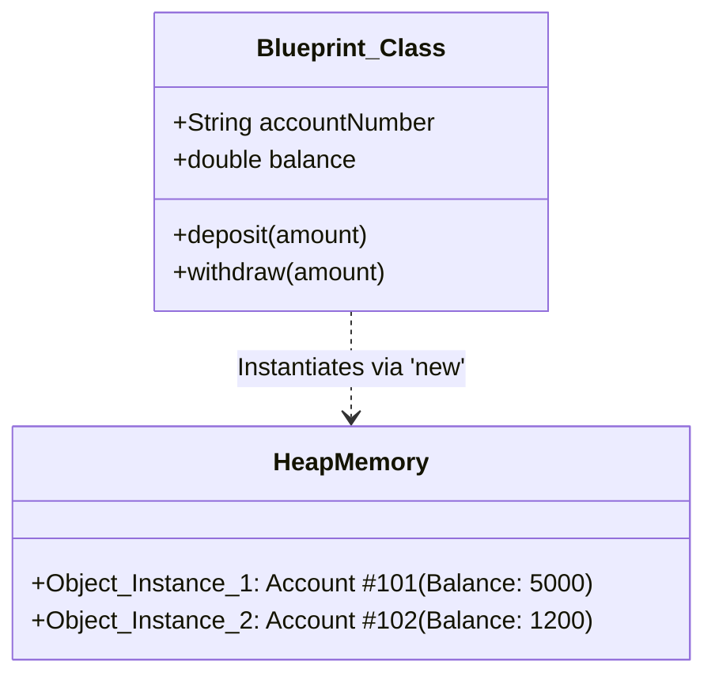
```mermaid
classDiagram
    class Blueprint_Class {
        +String accountNumber
        +double balance
        +deposit(amount)
        +withdraw(amount)
    }
    class HeapMemory {
        +Object_Instance_1: Account #101 (Balance: 5000)
        +Object_Instance_2: Account #102 (Balance: 1200)
    }
    Blueprint_Class ..> HeapMemory : Instantiates via 'new'
```

#### مثال 1: تطبيق عملي
في نظام إدارة مكتبة، الـ `Book` كـ Class بيحدد المواصفات العامة للكتب، بينما الـ Objects هي النسخ الفعلية المطبوعة المتوفرة في الرفوف:

```java
// The Blueprint (Class) loaded once in Metaspace
public class Book {
    private final String isbn;
    private String title;
    private boolean isBorrowed;

    public Book(String isbn, String title) {
        this.isbn = isbn;
        this.title = title;
        this.isBorrowed = false;
    }

    public void borrowBook() {
        if (isBorrowed) {
            throw new IllegalStateException("Book is already borrowed!");
        }
        this.isBorrowed = true;
    }
}

// Memory Allocation (Objects created on Heap)
public class Main {
    public static void main(String[] args) {
        // Creating two distinct object instances on Heap
        Book book1 = new Book("978-0134685991", "Effective Java");
        Book book2 = new Book("978-0596009205", "Head First Design Patterns");

        book1.borrowBook(); // State of book1 changes, book2 remains unaffected
    }
}
```

#### مثال 2: فخ شائع (Static Reference Misconception)
تخليط المتغيرات الخاصة بالـ Class (`static`) مع المتغيرات الخاصة بالـ Object (`instance variables`):

```java
// PITFALL: Using static for data that should belong to individual objects!
public class UserSession {
    // BUG: This variable is shared across ALL objects and all threads!
    private static String loggedInUserEmail;

    public void login(String email) {
        loggedInUserEmail = email; // Overwrites loggedInUserEmail for EVERY user in the app!
    }
}
```

#### مثال 3: حالة إنتاج حقيقية
في أنظمة الـ High-Frequency Trading أو الألعاب، إنشاء ملايين الـ Objects في الـ Heap بيسبب إجهاد للـ Garbage Collector (GC Pauses). هنا بنضطر نستخدم نماذج مثل **Object Pooling** لإعادة استخدام الـ Objects بدل إنشاء Class Instances جديدة باستمرار:

```java
// Reusing instances to prevent GC Overhead in Production
public class ConnectionPool {
    private final List<DatabaseConnection> availableConnections = new ArrayList<>();

    public DatabaseConnection acquireConnection() {
        if (availableConnections.isEmpty()) {
            return new DatabaseConnection(); // Create object only when needed
        }
        return availableConnections.remove(0); // Reuse object instance
    }

    public void releaseConnection(DatabaseConnection connection) {
        availableConnections.add(connection); // Return to pool instead of GC collection
    }
}
```

> [!example] 🎯 مستوى التعمق أساسي

---

## Q2 — ما هي الكبسولة (Encapsulation) ولماذا تتعدى مجرد كتابة Getters و Setters؟

### أصل الحكاية

الخطأ الشائع الأكثر انتشاراً هو الظن بأن Encapsulation تعني جعل جميع المتغيرات `private` وإنشاء `get` و `set` لكل متغير! لو عملت كده، أنت مكسّبتش أي حماية حقيقية للبيانات، لأن الـ `Setter` أتاح للعالم الخارجي تغيير القيمة بدون قيود.

Encapsulation في أصلها هي **حماية قواعد العمل (Business Invariants)** وتجميع البيانات مع الدوال التي تحكمها في غلاف مغلق لا يمكن اختراقه ببيانات غير صحيحة.

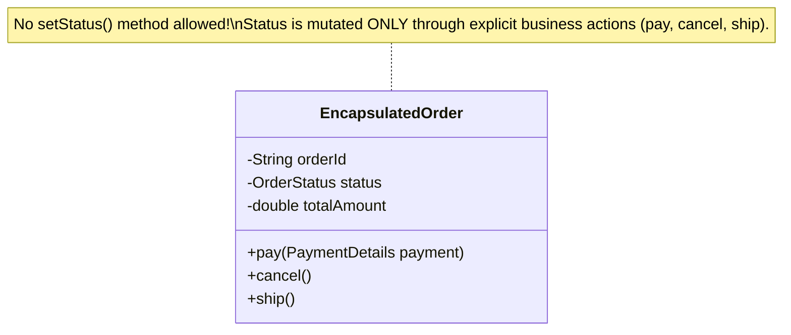
```mermaid
classDiagram
    class EncapsulatedOrder {
        -String orderId
        -OrderStatus status
        -double totalAmount
        +pay(PaymentDetails payment)
        +cancel()
        +ship()
    }
    note for EncapsulatedOrder "No setStatus() method allowed!\nStatus is mutated ONLY through explicit business actions (pay, cancel, ship)."
```

#### مثال 1: تطبيق عملي
نظام حجز غرف الفنادق. تغيير حالة الحجز لازم يخضع لقوانين صارمة مش مجرد `setStatus()`:

```java
public enum ReservationStatus { PENDING, CONFIRMED, CANCELLED, CHECKED_IN }

public class HotelReservation {
    private final String reservationId;
    private ReservationStatus status;
    private double paidAmount;
    private final double totalRoomPrice;

    public HotelReservation(String reservationId, double totalRoomPrice) {
        this.reservationId = reservationId;
        this.totalRoomPrice = totalRoomPrice;
        this.status = ReservationStatus.PENDING;
        this.paidAmount = 0.0;
    }

    // Encapsulated Business Logic - Enforces Valid State Transitions
    public void confirmPayment(double amount) {
        if (this.status != ReservationStatus.PENDING) {
            throw new IllegalStateException("Only pending reservations can be paid.");
        }
        if (amount < this.totalRoomPrice) {
            throw new IllegalArgumentException("Insufficient payment amount.");
        }
        this.paidAmount = amount;
        this.status = ReservationStatus.CONFIRMED;
    }

    // Controlled Getter - Read-Only access
    public ReservationStatus getStatus() {
        return status;
    }
}
```

#### مثال 2: فخ شائع (Exposing Mutable Objects)
تسريب مرجع لـ Object قابل للتعديل (Mutable Object Leakage) عبر الـ Getter:

```java
// PITFALL: Breaking encapsulation by returning mutable collection references
public class CustomerAccount {
    private final List<String> creditCards = new ArrayList<>();

    // BAD: External code can clear or modify creditCards directly without account verification!
    public List<String> getCreditCards() {
        return creditCards; 
    }

    // GOOD: Return unmodifiable view or defensive copy
    public List<String> getCreditCardsEncapsulated() {
        return Collections.unmodifiableList(creditCards);
    }
}
```

#### مثال 3: حالة إنتاج حقيقية
في أنظمة البنوك (Financial Core Engines)، حساب الفائدة أو التسوية الحسابية محمي بشرط عدم الوصول للـ Balance مباشرة، حتى داخل نفس الموديول:

```java
public class LedgerAccount {
    private BigDecimal balance = BigDecimal.ZERO;

    // Strict invariant protection with BigDecimal precision
    public synchronized void recordTransaction(BigDecimal amount, TransactionType type) {
        Objects.requireNonNull(amount, "Amount cannot be null");
        if (amount.compareTo(BigDecimal.ZERO) <= 0) {
            throw new IllegalArgumentException("Transaction amount must be positive");
        }

        if (type == TransactionType.DEBIT) {
            if (balance.compareTo(amount) < 0) {
                throw new InsufficientBalanceException("Account balance exceeded");
            }
            balance = balance.subtract(amount);
        } else if (type == TransactionType.CREDIT) {
            balance = balance.add(amount);
        }
    }
}
```

> [!example] 🎯 مستوى التعمق أساسي

---

## Q3 — ما هو التجريد (Abstraction) وكيف يختلف عن الكبسولة (Encapsulation)؟

### أصل الحكاية

الفرق بين التجريد والكبسولة دايماً بيسبب لغبطة:
- **Encapsulation (إخفاء التفاصيل والتنفيذ للحماية)**: بتركز على *إزاي* نحمي البيانات ونغلفها (How it is implemented and protected).
- **Abstraction (إخفاء التعقيد وإبراز الواجهة)**: بتركز على *ماذا* يستطيع الكائن أن يفعل من غير ما تشغل بالك بالتفاصيل الخارجية (What the object does, hiding background complexity).

تخيل قيادة السيارة:
- **Abstraction**: أنت عندك دواسة بنزين ودركسيون ودواسة فرامل (Interface بسيط). مش محتاج تعرف غرف الاحتراق الداخلي والـ Spark Plugs شغالين إزاي عشان تسوق.
- **Encapsulation**: المحرك محاط بغطاء حديدي مقفول (Private fields/logic)، محمي من إن حد يرمي فيه مية أو يغير فوهة الـ Fuel Injector وهو شغال.

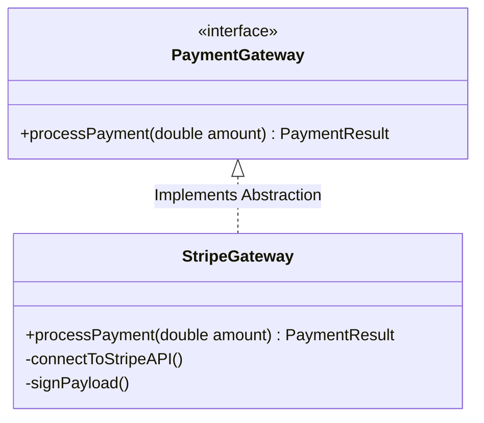
```mermaid
classDiagram
    class PaymentGateway {
        <<interface>>
        +processPayment(double amount) PaymentResult
    }
    class StripeGateway {
        +processPayment(double amount) PaymentResult
        -connectToStripeAPI()
        -signPayload()
    }
    PaymentGateway <|.. StripeGateway : Implements Abstraction
```

#### مثال 1: تطبيق عملي
تجريد التعامل مع إرسال الإشعارات (Push Notifications, SMS, Email) من خلال Abstraction موحد:

```java
// Abstraction Contract - Focuses on WHAT can be done
public interface NotificationSender {
    void sendNotification(String recipient, String message);
}

// Low-level detail hidden behind Abstraction
public class TwilioSmsSender implements NotificationSender {
    @Override
    public void sendNotification(String recipient, String message) {
        // Complex HTTP calls, OAuth tokens, and payload formatting hidden here
        connectToTwilioGateway();
        executeSmsApiCall(recipient, message);
    }

    private void connectToTwilioGateway() { /* Complex logic */ }
    private void executeSmsApiCall(String to, String msg) { /* Low level details */ }
}
```

#### مثال 2: فخ شائع (Leaky Abstraction)
لما الـ Abstraction يسرب تفاصيل التكنولوجيا المستخدمة في التوقيع (Signature)، فيجبر المستدعي يعتمد على تفاصيل البنية التحتية:

```java
// PITFALL: Leaky Abstraction
public interface UserRepository {
    // BAD: Exposing SQL Exception or DB-specific types leaks DB details to higher layers!
    java.sql.ResultSet findUserRawSql(String query) throws java.sql.SQLException; 
}

// CLEAN ABSTRACTION: Completely technology-agnostic
public interface UserRepositoryClean {
    User findById(String userId);
}
```

#### مثال 3: حالة إنتاج حقيقية
في أنظمة الـ Distributed Storage (مثل Amazon S3 أو Google Cloud Storage)، الـ Application الكود بيتطابق مع Abstraction اسمه `FileStorageService` بغض النظر عن هل الملف بيتخزن على Local Disk أو AWS S3 أو Azure Blob Storage:

```java
public interface StorageService {
    String uploadFile(String fileName, byte[] data);
    byte[] downloadFile(String fileId);
}

public class AwsS3StorageService implements StorageService {
    @Override
    public String uploadFile(String fileName, byte[] data) {
        // Complex AWS SDK v2 multipart upload logic with retry policies
        return "https://s3.amazonaws.com/my-bucket/" + fileName;
    }

    @Override
    public byte[] downloadFile(String fileId) {
        // Streaming S3 object bytes
        return new byte[0];
    }
}
```

> [!example] 🎯 مستوى التعمق متوسط

---

## Q4 — متى تكون الوراثة (Inheritance) فخاً خطيراً، وما هي مشاكل الـ Tight Coupling التي تسببها؟

### أصل الحكاية

الوراثة هي أول مفهوم بيتم تدريسه في الـ OOP كأنه الحل السحري لإعادة استخدام الكود (Code Reuse). لكن في الأنظمة الحقيقية، الوراثة تعتبر من أقوى العلاقات اقتراناً (Strongest Coupling) بين الـ Classes.

عند استخدام الوراثة (`extends`):
1. الـ Child Class بيصبح معتمد كلياً على تفاصيل تنفيذ الـ Parent Class (Breaks Encapsulation across hierarchy).
2. أي تغيير في الـ Parent قد يكسر الـ Child بطرق غير متوقعة (Fragile Base Class Problem).
3. العلاقة تكون دائمة وتُحدد في وقت التجميع (Compile-time relation)، ولا يمكن تغيير سلوك الابن في الـ Runtime.

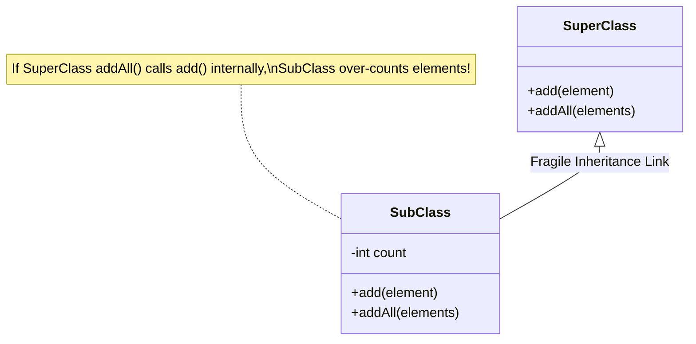
```mermaid
classDiagram
    SuperClass <|-- SubClass : Fragile Inheritance Link
    class SuperClass {
        +add(element)
        +addAll(elements)
    }
    class SubClass {
        -int count
        +add(element)
        +addAll(elements)
    }
    note for SubClass "If SuperClass addAll() calls add() internally,\nSubClass over-counts elements!"
```

#### مثال 1: تطبيق عملي (مشكلة Fragile Base Class)
تخيل بنحاول نعمل Custom HashSet بيحسب عدد العناصر التي تمت إضافتها إجمالياً:

```java
// PITFALL: Unexpected behavior due to base class internal details
public class CountingHashSet<E> extends HashSet<E> {
    private int addCount = 0;

    @Override
    public boolean add(E e) {
        addCount++;
        return super.add(e);
    }

    @Override
    public boolean addAll(Collection<? extends E> c) {
        // HashSet's internal addAll calls add() for each element!
        // If we also increment addCount here, elements get counted TWICE!
        addCount += c.size(); 
        return super.addAll(c);
    }

    public int getAddCount() {
        return addCount;
    }
}
```

#### مثال 2: فخ شائع (Inheritance for Code Reuse instead of "IS-A")
استخدام الوراثة فقط لمجرد إعادة استخدام كود مكتوب، وليس لأن العلاقة الحقيقية هي علاقة "IS-A":

```java
// PITFALL: Bad inheritance modeling! A Door is NOT a FrameworkLogger!
public class Door extends LoggerFramework {
    public void open() {
        logInfo("Door opened"); // Horrible design: Door inherited 50 unnecessary logger methods!
    }
}
```

#### مثال 3: حالة إنتاج حقيقية
في أنظمة الـ E-Commerce، تصميم الفئات حسب أنواع المنتجات بالوراثة يؤدي لظاهرة **Class Explosion**:

```java
// BAD: Hierarchy Explosion
class Product {}
class PhysicalProduct extends Product {}
class DigitalProduct extends Product {}
class DiscountedPhysicalProduct extends PhysicalProduct {} // Nightmare to maintain!

// BETTER: Use Composition instead of Inheritance
public class ProductItem {
    private String id;
    private BigDecimal price;
    private ProductType type; // Physical or Digital
    private DiscountStrategy discountStrategy; // Composition!
}
```

> [!example] 🎯 مستوى التعمق متوسط

---

## Q5 — كيف نحقق المرونة باستخدام التجميع (Composition over Inheritance)؟

### أصل الحكاية

قاعدة التصميم الذهبية بتقول: **"Prefer Composition Over Inheritance"** (فضل التجميع على الوراثة).
بدل ما تقول كائن "هو نوع من" كائن تاني (`IS-A`), خليه "يحتوي على" كائن تاني (`HAS-A`).

التجميع بيدينا مرونة خرافية:
- تقدر تغير السلوك في الـ Runtime عن طريق استبدال الكائن المضمّن.
- الكائن الخارجي بيبقى معتمد بس على الـ Interface بتاع الكائن المضمّن (Loose Coupling).
- مفيش مشكلة الـ Fragile Base Class لأن التفاصيل الداخلية مش مكشوفة.

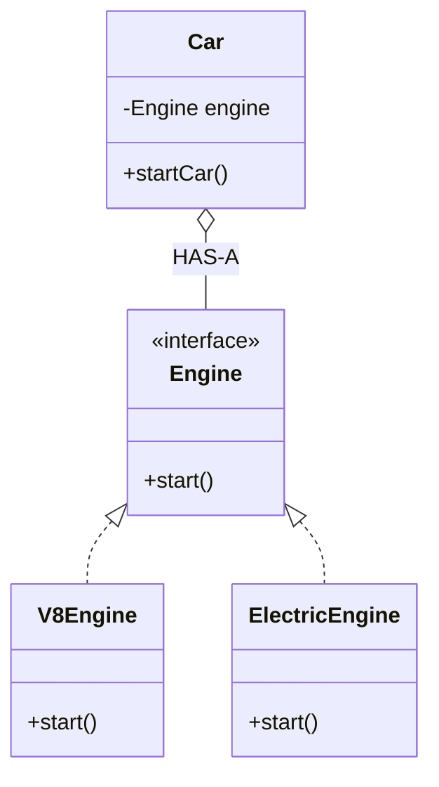
```mermaid
classDiagram
    class Car {
        -Engine engine
        +startCar()
    }
    class Engine {
        <<interface>>
        +start()
    }
    class V8Engine {
        +start()
    }
    class ElectricEngine {
        +start()
    }
    Car o-- Engine : HAS-A
    Engine <|.. V8Engine
    Engine <|.. ElectricEngine
```

#### مثال 1: تطبيق عملي
تحديد محرك السيارة والديناميكية في تغييره وقت التشغيل (Runtime composition):

```java
public interface Engine {
    void start();
}

public class V8Engine implements Engine {
    @Override
    public void start() {
        // Roaring combustion sound
    }
}

public class ElectricEngine implements Engine {
    @Override
    public void start() {
        // Silent electric power on
    }
}

// Flexible Class using Composition (HAS-A)
public class Vehicle {
    private Engine engine; // Composed dependency

    public Vehicle(Engine engine) {
        this.engine = engine;
    }

    // Dynamic behavior change at runtime!
    public void setEngine(Engine newEngine) {
        this.engine = newEngine;
    }

    public void drive() {
        engine.start();
    }
}
```

#### مثال 2: فخ شائع (Over-Delegation / Boilerplate Code)
الشكوى الشائعة من الـ Composition هي كتابة Wrapper Methods كتيرة لو الكائن جواه 20 دالة محتاج يوجهها للكائن المضمّن:

```java
// Tradeoff: Forwarding Methods boilerplate
public class CustomListWrapper<E> implements List<E> {
    private final List<E> innerList = new ArrayList<>();

    @Override public int size() { return innerList.size(); }
    @Override public boolean isEmpty() { return innerList.isEmpty(); }
    // Must forward all 25+ List interface methods manually!
}
```

#### مثال 3: حالة إنتاج حقيقية
في محركات الألعاب (Game Engines like Unity or Custom Java Engines), استخدام نمط **Component Architecture** يتيح بناء أي كائن في اللعبة (Monster, Player, Obstacle) بديناميكية تامة عن طريق تجميع مكونات (HealthComponent, RenderComponent, PhysicsComponent):

```java
public class GameObject {
    private final Map<Class<?>, Object> components = new HashMap<>();

    public <T> void addComponent(Class<T> type, T component) {
        components.put(type, component);
    }

    public <T> T getComponent(Class<T> type) {
        return type.cast(components.get(type));
    }
}
```

> [!example] 🎯 مستوى التعمق متوسط

---

## Q6 — ما هو تعدد الأشكال (Polymorphism) وما هي أنواعه الثلاثة في Java؟

### أصل الحكاية

كلمة Polymorphism أصلها يوناني ويعني "تعدد الأشكال" (Poly = العديد، Morph = الشكل).
في الـ OOP، التعدد معناه: القدرة على التعامل مع كائنات مختلفة من خلال واجهة موحدة، بحيث يتصرف كل كائن بالطريقة المناسبة لنوعه الفعلي في الـ Runtime.

توجد 3 أنواع رئيسية لتعدد الأشكال في Java:
1. **Subtyping Polymorphism (Runtime Polymorphism)**: تحكمه الـ Inheritance والـ Interfaces مدموجة بـ Dynamic Binding.
2. **Ad-hoc Polymorphism (Compile-time Polymorphism)**: تحكمه زيادة تحميل الدوال (`Method Overloading`).
3. **Parametric Polymorphism (Generics)**: كتابة كود يتعامل مع أنواع متعددة دون تحديد نوع معين مسبقاً (`List<T>`).

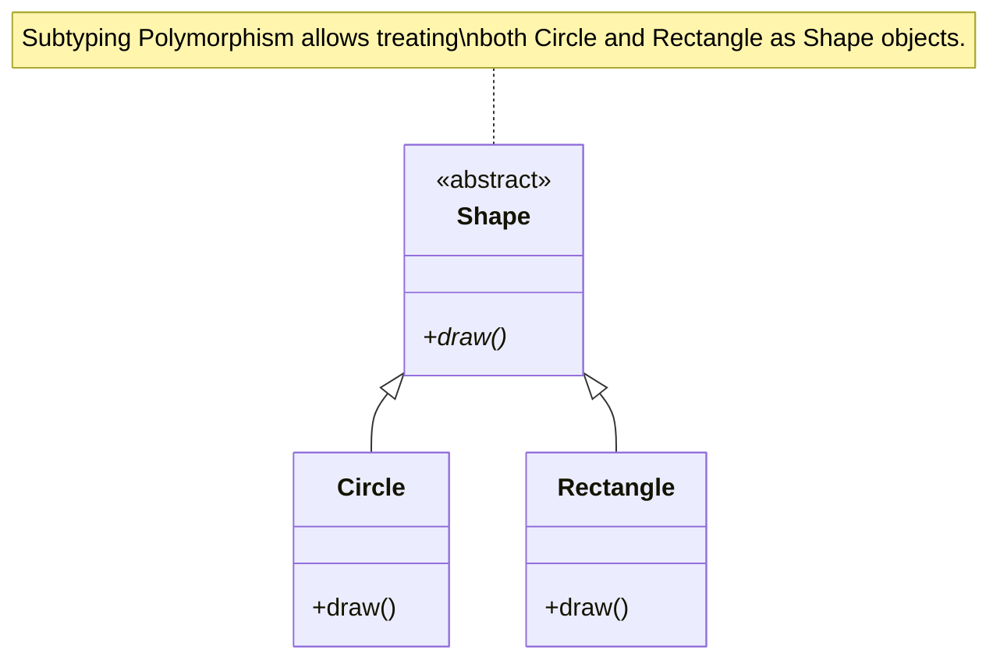
```mermaid
classDiagram
    class Shape {
        <<abstract>>
        +draw()*
    }
    class Circle {
        +draw()
    }
    class Rectangle {
        +draw()
    }
    Shape <|-- Circle
    Shape <|-- Rectangle
    note for Shape "Subtyping Polymorphism allows treating\nboth Circle and Rectangle as Shape objects."
```

#### مثال 1: تطبيق عملي (Subtyping Polymorphism)
نظام معالجة مدفوعات يتعامل مع أي بوابة دفع بنفس الطريقة:

```java
public interface PaymentProcessor {
    void process(BigDecimal amount);
}

public class PaypalProcessor implements PaymentProcessor {
    @Override public void process(BigDecimal amount) { /* Paypal API */ }
}

public class CreditCardProcessor implements PaymentProcessor {
    @Override public void process(BigDecimal amount) { /* Credit Card Gateway */ }
}

public class CheckoutService {
    // Polymorphic invocation
    public void checkout(PaymentProcessor processor, BigDecimal amount) {
        processor.process(amount); // Dispatched to actual instance method at runtime!
    }
}
```

#### مثال 2: فخ شائع (Loss of Type Information / Excessive Casting)
إساءة استخدام Polymorphism عن طريق كسر التجريد والوصول إلى `instanceof` بشكل مكثف:

```java
// PITFALL: Code Smell! Defeats the purpose of Polymorphism!
public void processShape(Shape shape) {
    if (shape instanceof Circle) {
        ((Circle) shape).drawCircleSpecific();
    } else if (shape instanceof Rectangle) {
        ((Rectangle) shape).drawRectangleSpecific();
    }
}
```

#### مثال 3: حالة إنتاج حقيقية (Parametric + Subtype Combined)
في فريم ورك مثل Spring Data JPA، دمج التعدد البارامتري (Generics) مع Subtyping لبناء Repositories موحدة:

```java
public interface GenericRepository<T, ID> {
    T findById(ID id);
    List<T> findAll();
    void save(T entity);
}

public class UserRepository implements GenericRepository<User, Long> {
    @Override public User findById(Long id) { return null; }
    @Override public List<User> findAll() { return Collections.emptyList(); }
    @Override public void save(User entity) { }
}
```

> [!example] 🎯 مستوى التعمق متوسط

---

## Q7 — Interface أم Abstract Class: كيف تختار البناء المعماري الصحيح؟

### أصل الحكاية

ده من أكثر الأسئلة المعمارية أهمية في Java. الاختيار مش مجرد مسألة "هل محتاج كود جاهز ولا لأ؟".
- الـ **Abstract Class** يمثل علاقة **"IS-A" (Identical identity & Shared Code)**. بيعبر عن ركيزة أساسية هرمية لكائنات تشترك في الهوية وفي كود تنفيذي محدد وفي متغيرات حالة (State / Fields).
- الـ **Interface** يمثل علاقة **"CAN-DO" (Capability / Behavior Contract)**. بيعبر عن عقد سلوكي يمكن لأي كائن تطبيقه مهما كانت هوية الكائن أو مكانه في شجرة الوراثة.

| وجه المقارنة | Abstract Class | Interface |
| :--- | :--- | :--- |
| **نوع العلاقة** | IS-A | CAN-DO / Role |
| **Multiple Inheritance** | غير مدعوم في Java | مدعوم (Class implements multiple interfaces) |
| **الحالة (State)** | يمكن محاكاة وتخزين حالة (`private fields`) | لا يحتوي على حالة (فقط `public static final constants`) |
| **المشيدات (Constructors)** | يحتوي على constructors تنفذها الفئات الأبناء | لا يحتوي على constructors |

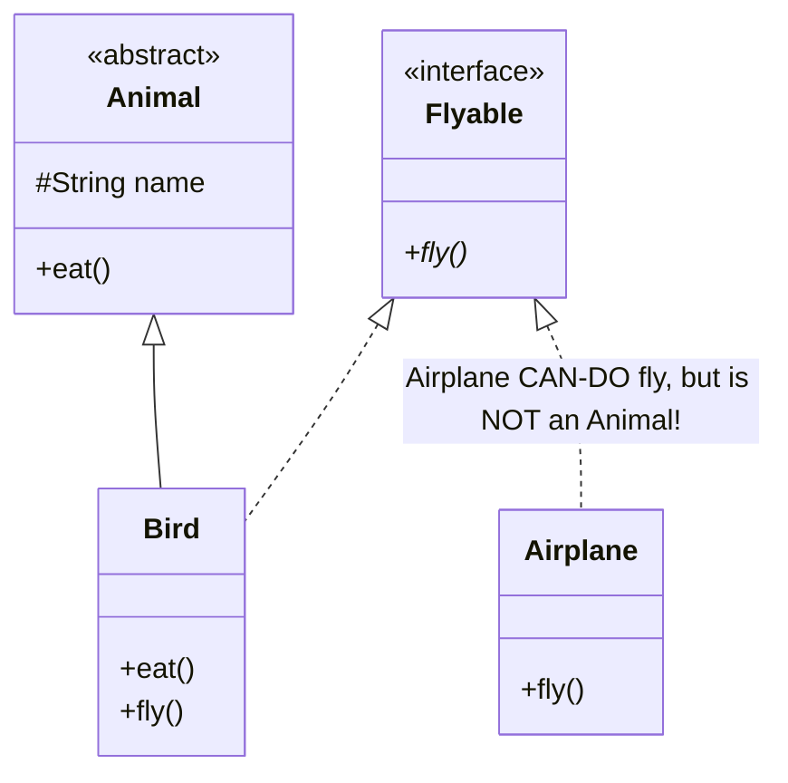
```mermaid
classDiagram
    class Animal {
        <<abstract>>
        #String name
        +eat()
    }
    class Flyable {
        <<interface>>
        +fly()*
    }
    class Bird {
        +eat()
        +fly()
    }
    class Airplane {
        +fly()
    }
    Animal <|-- Bird
    Flyable <|.. Bird
    Flyable <|.. Airplane : Airplane CAN-DO fly, but is NOT an Animal!
```

#### مثال 1: تطبيق عملي
طائر البطريق والنسر والطائرة:

```java
public abstract class Animal {
    protected String name;

    public Animal(String name) {
        this.name = name;
    }

    public abstract void makeSound();
}

public interface Flyable {
    void fly();
}

public class Eagle extends Animal implements Flyable {
    public Eagle(String name) { super(name); }

    @Override public void makeSound() { /* Eagle screech */ }
    @Override public void fly() { /* Flying high */ }
}

public class Penguin extends Animal { // Penguin is Animal, but CANNOT Fly!
    public Penguin(String name) { super(name); }

    @Override public void makeSound() { /* Penguin honk */ }
}
```

#### مثال 2: فخ شائع (Default Methods Abuse in Interfaces)
بعد Java 8، الـ Interface أصح فيه `default methods`. الفخ هو تحويل الـ Interface إلى Abstract Class مليان Stateful-like Logic أو Helper code يخالف غرض التجريد:

```java
// PITFALL: Misusing interface default methods for complex state logic
public interface BadInterfaceUsage {
    default void doComplexWork() {
        // BAD: Creating tight coupling and complex procedural code inside interface!
        System.out.println("Step 1");
        System.out.println("Step 2");
    }
}
```

#### مثال 3: حالة إنتاج حقيقية
في مكتبة Java I/O (`java.io`), الـ `InputStream` هو Abstract Class يمثل الهوية الأساسية لكل الـ Streams وتخزين الـ Buffers، بينما `Closeable` و `AutoCloseable` هي Interfaces تعبر عن قدرة الكائن على الإغلاق:

```java
public abstract class InputStream implements Closeable {
    public abstract int read() throws IOException;
    
    public int read(byte b[], int off, int len) throws IOException {
        // Shared base template logic
        return 0;
    }
}
```

> [!example] 🎯 مستوى التعمق متقدم

---

## Q8 — ما هو الاقتران (Coupling) وكيف ننتقل من الاقتران القوي (Tight Coupling) إلى الضعيف (Loose Coupling)؟

### أصل الحكاية

الـ **Coupling** بيقيس مدى اعتماد كلاس معين على تفاصيل كلاس تاني.
- **Tight Coupling**: الكلاس A كاتب جوه الكود بتاعه `new ClassB()`. لو عدلنا أي حاجة في `ClassB` أو احتجنا نغيره بـ `ClassC`، الكلاس `ClassA` هيتكسر فوراً ولازم نتخل ونعدل فيه هو كمان.
- **Loose Coupling**: الكلاس A بتتعامل مع `InterfaceB`. الكلاس A ميعرفش مين الكائن الحقيقي اللي متمرر له ومبيهمهوش، المهم إنه بيطبق العقد (`Contract`).

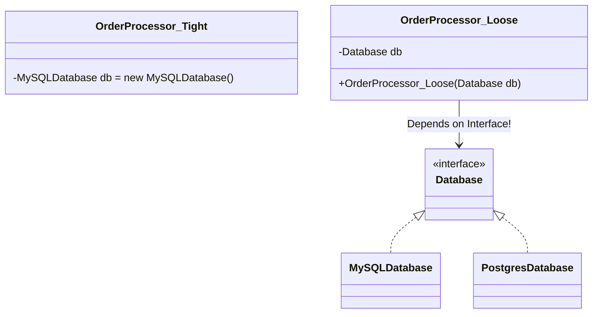
```mermaid
classDiagram
    class OrderProcessor_Tight {
        -MySQLDatabase db = new MySQLDatabase()
    }
    class OrderProcessor_Loose {
        -Database db
        +OrderProcessor_Loose(Database db)
    }
    class Database {
        <<interface>>
    }
    Database <|.. MySQLDatabase
    Database <|.. PostgresDatabase
    OrderProcessor_Loose --> Database : Depends on Interface!
```

#### مثال 1: تطبيق عملي
تحويل نظام التنبيهات من Tight Coupling لـ Loose Coupling عبر Dependency Injection:

```java
// TIGHT COUPLING (BAD)
public class OrderServiceTight {
    private EmailService emailService = new EmailService(); // Hardcoded dependency!

    public void placeOrder() {
        // ... place order
        emailService.sendEmail("Order Placed"); // Impossible to swap with SMS or Mock for testing!
    }
}

// LOOSE COUPLING (CLEAN)
public interface MessageSender {
    void sendMessage(String message);
}

public class OrderServiceLoose {
    private final MessageSender messageSender; // Dependency on Abstraction

    // Constructor Injection
    public OrderServiceLoose(MessageSender messageSender) {
        this.messageSender = messageSender;
    }

    public void placeOrder() {
        messageSender.sendMessage("Order Placed");
    }
}
```

#### مثال 2: فخ شائع (Hidden Coupling via Static Singletons or Global State)
ظن أن الاقتران انتهى باستخدام Singletons استاتيكية، في حين أنه اقتران مخفي أشد خطورة:

```java
// PITFALL: Hidden Tight Coupling through Static Service Locator / Singletons
public class OrderServiceHiddenCoupling {
    public void process() {
        // Tightly coupled to ConfigManager static state! Cannot test in isolation!
        String dbUrl = ConfigManager.getInstance().getDbUrl(); 
    }
}
```

#### مثال 3: حالة إنتاج حقيقية
في فريم ورك مثل Spring Framework، الـ Dependency Injection Container (IoC Container) هو المسؤول عن الربط بين المكونات لتسليم Loose Coupling كامل وقت الـ Runtime:

```java
@Service
public class TradeExecutionEngine {
    private final MatchingEngine matchingEngine;

    @Autowired // Spring injects the loosely coupled implementation automatically
    public TradeExecutionEngine(MatchingEngine matchingEngine) {
        this.matchingEngine = matchingEngine;
    }
}
```

> [!example] 🎯 مستوى التعمق أساسي

---

## Q9 — ما هي التماسكية (Cohesion) وكيف نقيس مدى جودة الـ Class المكتوب؟

### أصل الحكاية

الـ **Cohesion** هي قياس مدى ارتباط المسؤوليات والدوال داخل نفس الكلاس ببعضها وبدف فكرة واحدة تخدم الكلاس.
- **Low Cohesion (سيء)**: الكلاس عبارة عن "سلة قمامة" (God Object / Utility Monster) جواه دوال لطباعة التظارير، الاتصال بالداتابيز، وحساب الضرائب، وإرسال ايميلات!
- **High Cohesion (ممتاز)**: الكلاس مركز جداً وبيعمل حاجة واحدة بس وبيعملها صح. كل المتغيرات والدوال اللي جواه بتخدم الهدف الموحد ده.

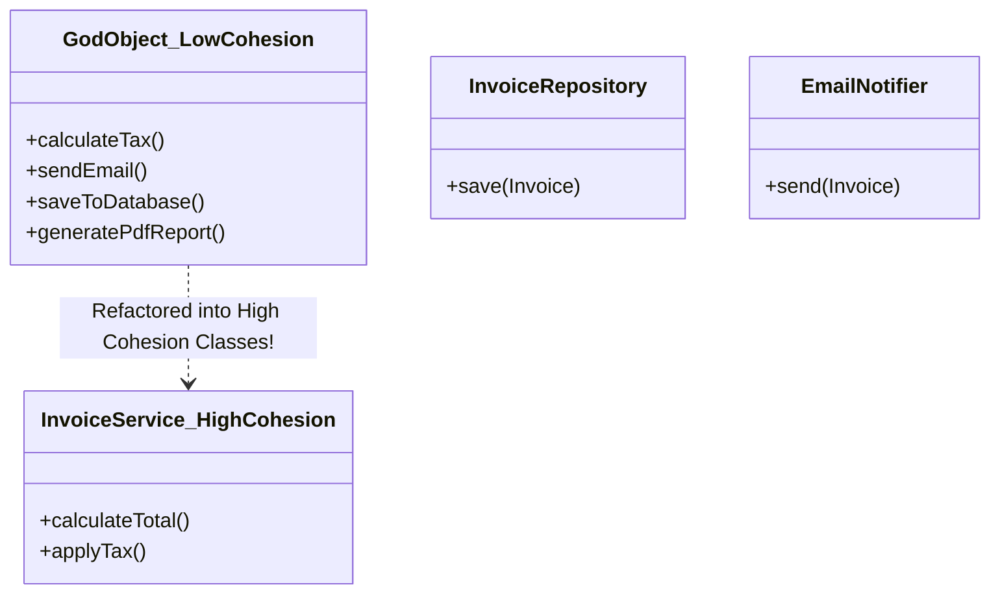
```mermaid
classDiagram
    class GodObject_LowCohesion {
        +calculateTax()
        +sendEmail()
        +saveToDatabase()
        +generatePdfReport()
    }
    class InvoiceService_HighCohesion {
        +calculateTotal()
        +applyTax()
    }
    class InvoiceRepository {
        +save(Invoice)
    }
    class EmailNotifier {
        +send(Invoice)
    }
    GodObject_LowCohesion ..> InvoiceService_HighCohesion : Refactored into High Cohesion Classes!
```

#### مثال 1: تطبيق عملي
تقسيم كلاس معالجة المستخدمين من Low Cohesion إلى عالي التماسكية:

```java
// LOW COHESION (BAD)
public class UserManagerBad {
    public void registerUser(String username) { /* DB save */ }
    public void sendWelcomeEmail(String email) { /* SMTP code */ }
    public String exportUserPdfReport(String userId) { /* PDF generation */ }
}

// HIGH COHESION (CLEAN)
public class UserRepository {
    public void saveUser(User user) { /* Pure Persistence logic */ }
}

public class UserNotificationService {
    public void sendWelcomeEmail(User user) { /* Pure Notification logic */ }
}

public class UserReportGenerator {
    public byte[] generatePdfReport(User user) { /* Pure Report Generation */ }
}
```

#### مثال 2: فخ شائع (Misunderstanding Utility Classes)
إنشاء كلاسات باسم `StringUtils` أو `GeneralUtils` وتحويلها تدريجياً لـ God Classes تجمع دوال مالهاش علاقة ببعض:

```java
// PITFALL: Low cohesion disguised as Utility Class
public class AppUtils {
    public static String formatDate(Date date) { return ""; }
    public static boolean validateCreditCard(String card) { return false; }
    public static void restartServer() { /* Why is server control in AppUtils?! */ }
}
```

#### مثال 3: حالة إنتاج حقيقية
في المعمارية السليمة (Clean Architecture / DDD)، الـ Aggregate Root بيكون عالي التماسكية جداً، بحيث لا يحتوي إلا على الـ Invariants والبيانات التي تخص هويته فقط:

```java
public class ShoppingCart {
    private final List<CartItem> items = new ArrayList<>();

    public void addItem(Product product, int quantity) {
        // High Cohesion: Only deals with Cart domain rules
        CartItem existing = findItem(product.getId());
        if (existing != null) {
            existing.incrementQuantity(quantity);
        } else {
            items.add(new CartItem(product, quantity));
        }
    }

    public BigDecimal calculateTotal() {
        return items.stream()
                .map(CartItem::getSubtotal)
                .reduce(BigDecimal.ZERO, BigDecimal::add);
    }
}
```

> [!example] 🎯 مستوى التعمق أساسي

---

## Q10 — ما الفرق الحقيقي بين Method Overloading و Method Overriding من حيث الـ Binding والذاكرة؟

### أصل الحكاية

الفرق بين Overloading و Overriding أعمق من مجرد "نفس الاسم بموديل مختلف" أو "نفس الاسم في الابن":
- **Method Overloading**: هو **Static Binding (Compile-time Polymorphism)**. المترجم (Compiler) هو اللي بيحدد أنهي دالة بالضبط هيتم استدعاؤها بناءً على الـ Reference Type والـ Arguments في وقت الـ Compilation.
- **Method Overriding**: هو **Dynamic Binding (Runtime Polymorphism)**. القرار بيتأجل لحد الـ Runtime، و الـ JVM بيستخدم الـ **vtable (Virtual Method Table)** الخاصة بالكائن الحقيقي المبنود في الـ Heap لمعرفة التنفيذ المطلوب.

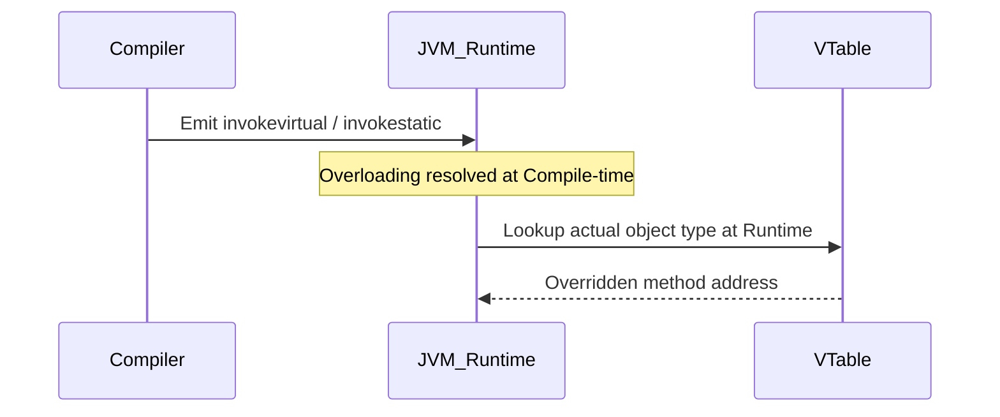
```mermaid
sequenceDiagram
    participant Compiler
    participant JVM_Runtime
    participant VTable
    
    Compiler->>JVM_Runtime: Emit invokevirtual / invokestatic
    Note over JVM_Runtime: Overloading resolved at Compile-time
    JVM_Runtime->>VTable: Lookup actual object type at Runtime
    VTable-->>JVM_Runtime: Overridden method address
```

#### مثال 1: تطبيق عملي
توضيح الفرق في طريقة المعالجة:

```java
public class Printer {
    // Method Overloading (Static Binding - Resolved at Compile Time)
    public void print(String text) {
        System.out.println("Text: " + text);
    }

    public void print(int number) {
        System.out.println("Number: " + number);
    }
}

public class BaseService {
    public void execute() {
        System.out.println("Base execution");
    }
}

public class SubService extends BaseService {
    // Method Overriding (Dynamic Binding - Resolved at Runtime via vtable)
    @Override
    public void execute() {
        System.out.println("SubService execution");
    }
}
```

#### مثال 2: فخ شائع (Overloading with Reference Types vs Actual Runtime Types)
خدعة المترجم في اختيار دالة الـ Overload بناءً على المرجع الظاهري وليس الكائن الحقيقي:

```java
public class OverloadPitfall {
    public static void process(Animal a) { System.out.println("Animal version"); }
    public static void process(Dog d) { System.out.println("Dog version"); }

    public static void main(String[] args) {
        Animal myDog = new Dog();
        process(myDog); // Output: "Animal version"! Because Overloading is resolved at compile time using Reference Type (Animal)!
    }
}
```

#### مثال 3: حالة إنتاج حقيقية
في أنظمة الـ High-Performance Java، الـ JVM بيقوم بـ **Inlining** للدوال الـ Overridden لو كان عنده كلاس ابن واحد بس تنفيذي (Bi-morphic vs Mono-morphic call site optimization):

```java
public abstract class FastTask {
    public abstract void run();
}

public class SingleImplementation extends FastTask {
    @Override
    public void run() {
        // JVM JIT Compiler will inline this method directly, bypassing vtable lookup!
    }
}
```

> [!example] 🎯 مستوى التعمق متقدم

---

## Q11 — ما هي عدم القابلية للتغيير (Immutability) ولماذا تعد ركيزة أساسية في الـ OOP الحديث؟

### أصل الحكاية

الكائن القابل للتعديل (Mutable Object) بيغير حالته الداخليّة باستمرار. في الأنظمة متعددة الخيوط (Multithreaded Systems)، ده يعتبر المصدر الأول لليسمى **Race Conditions** و **Data Corruption**.

الكائن غير القابل للتعديل (**Immutable Object**):
- بمجرد ما يُبنى في الذاكرة، حالته مستحيل تتغير أبداً.
- يعتبر **Thread-safe تلقائياً** بدون الحاجة لـ `synchronized` أو Locks.
- ممتاز للاستخدام كـ Key في الـ `HashMap` أو العناصر داخل `HashSet` لأن الـ `hashCode` يظل ثابتاً للأبد.

قواعد بناء Immutable Class في Java:
1. جعل الكلاس `final` لمنع الوراثة والـ Overriding.
2. جعل جميع المتغيرات `private final`.
3. عدم توفير Setter Methods.
4. إجراء Defensive Copying لأي Mutable Object داخل الـ Constructor أو الـ Getter.

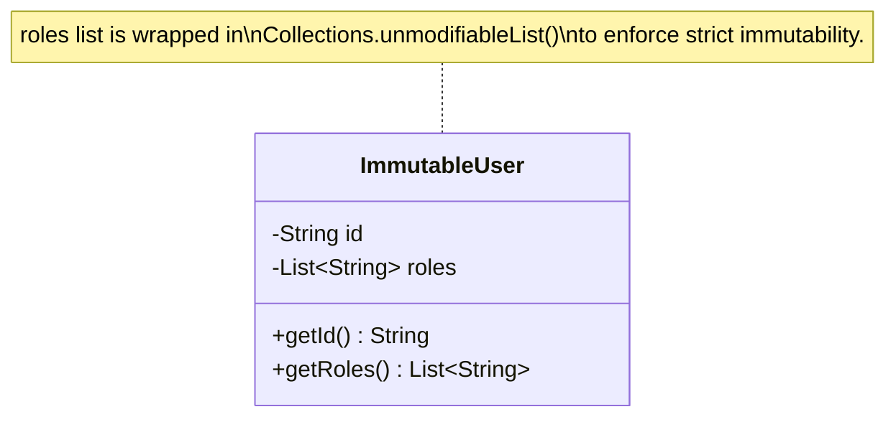
```mermaid
classDiagram
    class ImmutableUser {
        -String id
        -List~String~ roles
        +getId() String
        +getRoles() List~String~
    }
    note for ImmutableUser "roles list is wrapped in\nCollections.unmodifiableList()\nto enforce strict immutability."
```

#### مثال 1: تطبيق عملي
بناء Immutable Value Object بالشكل السليم:

```java
public final class Money {
    private final BigDecimal amount;
    private final Currency currency;

    public Money(BigDecimal amount, Currency currency) {
        this.amount = Objects.requireNonNull(amount);
        this.currency = Objects.requireNonNull(currency);
    }

    public BigDecimal getAmount() { return amount; }
    public Currency getCurrency() { return currency; }

    // Operations return NEW instances instead of modifying state
    public Money add(Money other) {
        if (!this.currency.equals(other.currency)) {
            throw new IllegalArgumentException("Currency mismatch");
        }
        return new Money(this.amount.add(other.amount), this.currency);
    }
}
```

#### مثال 2: فخ شائع (Leaking Defensive Copies)
نسيان الـ Defensive Copy للمتغيرات الـ Mutable مثل `java.util.Date` أو `List`:

```java
// PITFALL: Broken Immutability!
public final class MutableLeak {
    private final Date creationDate;

    public MutableLeak(Date creationDate) {
        // BAD: Direct reference assignment allows caller to modify date outside!
        this.creationDate = creationDate; 
    }

    public Date getCreationDate() {
        // BAD: Returning reference allows caller to call .setTime() and mutate instance!
        return creationDate; 
    }
    
    // FIX: Always return new Date(creationDate.getTime())
}
```

#### مثال 3: حالة إنتاج حقيقية
استخدام الـ **Java 16+ Records** لبناء Immutable Data Transfer Objects (DTOs) بنظافة وسرعة في بيئة التوزيع (Distributed Microservices):

```java
// Java Record: Automatically final, private final fields, auto-generated getters, equals, hashCode & toString
public record OrderEventPayload(
    String orderId,
    BigDecimal amount,
    Instant timestamp
) {
    public OrderEventPayload {
        Objects.requireNonNull(orderId, "orderId must not be null");
        if (amount.compareTo(BigDecimal.ZERO) < 0) {
            throw new IllegalArgumentException("Amount cannot be negative");
        }
    }
}
```

> [!example] 🎯 مستوى التعمق متوسط

---

## Q12 — Association, Aggregation, و Composition: كيف تمثل العلاقات بين الكائنات في Java؟

### أصل الحكاية

في تصميم الأنظمة، الكائنات بتتعامل مع بعضها بعلاقات مختلفة كلياً من حيث مدى قوة الربط ودورة الحياة (Lifecycle Dependency):

1. **Association**: علاقة بينية عامة جداً ("أ يعرف بـ"). الكائنين مستقلين تماماً في دوره حياتهما. (مثال: معلم وطالب).
2. **Aggregation**: علاقة "يحتوي على" ضعيفة (`HAS-A`). الكائن التابع جزء من الكائن الرئيسي، لكن لو الكائن الرئيسي اتمسح من الذاكرة، الكائن التابع **بيفضل عايش**. (مثال: قسم وجامعة — لو القسم اتقفل، الدكاترة مازالوا موجودين).
3. **Composition**: علاقة "يحتوي على" قوية وقاطعة. الكائن التابع جزء لا يتجزأ من الكائن الرئيسي، ولو الكائن الرئيسي اتمسح من الذاكرة، الكائن التابع **بيموت ومبييبقاش له وجود**. (مثال: كتاب وصفحاته — لو أحرقنا الكتاب، الصفحات انتهت معه).

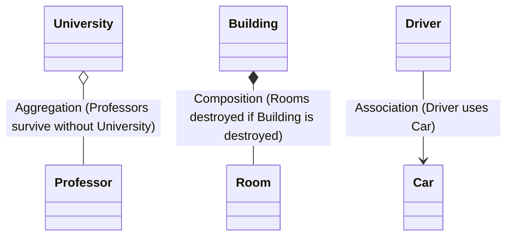
```mermaid
classDiagram
    University o-- Professor : Aggregation (Professors survive without University)
    Building *-- Room : Composition (Rooms destroyed if Building is destroyed)
    Driver --> Car : Association (Driver uses Car)
```

#### مثال 1: تطبيق عملي
تمثيل العلاقات الثلاث في كود Java واضح:

```java
// 1. Association (Driver uses Car)
public class Driver {
    public void drive(Car car) { // Passed as parameter
        car.startEngine();
    }
}

// 2. Aggregation (Department HAS-A Professor - Independent Lifecycles)
public class Professor {
    private String name;
    public Professor(String name) { this.name = name; }
}

public class Department {
    private List<Professor> professors; // Set from outside
    public Department(List<Professor> professors) {
        this.professors = professors;
    }
}

// 3. Composition (House HAS-A Room - Coupled Lifecycles)
public class Room {
    private String name;
    public Room(String name) { this.name = name; }
}

public class House {
    private final List<Room> rooms = new ArrayList<>(); // Instantiated INSIDE House

    public House() {
        // Rooms are tightly bound to the existence of this House instance
        rooms.add(new Room("Living Room"));
        rooms.add(new Room("Bed Room"));
    }
}
```

#### مثال 2: فخ شائع (Mixing Aggregation Lifecycle with Composition)
تمثيل Composition عن طريق قبول المراجع من الخارج وتخزينها كأنها مملوكة حصرياً، بينما هي معروضة للتعديل والتدمير من بره الكلاس.

#### مثال 3: حالة إنتاج حقيقية
في أنظمة الـ ORM (مثل Hibernate / JPA)، يتم ترجمة هذه العلاقات عبر التعليقات التوضيحية (`@OneToMany`, `@ManyToMany`, `cascade = CascadeType.ALL`, `orphanRemoval = true`):

```java
@Entity
public class OrderAggregate {
    @Id 
    private Long id;

    // Composition in JPA: Cascade ALL + orphanRemoval ensures OrderItems die with Order!
    @OneToMany(cascade = CascadeType.ALL, orphanRemoval = true)
    private List<OrderItem> items = new ArrayList<>();
}
```

> [!example] 🎯 مستوى التعمق متوسط

---

> [!tip] Checkpoint
> **تهانينا! أكملنا الموديول الأول: أساسيات ومرتكزات الـ OOP.**
> تم تغطية الفرق المفاهيمي والذاكري للـ Class & Object، حماية invariants بالـ Encapsulation، إدارة التعقيد بالـ Abstraction، مخاطر الوراثة وميزات Composition، أنواع Polymorphism الثلاثة، الفرق المعماري بين Interface و Abstract Class، معايير Coupling & Cohesion، آليات Overloading/Overriding (vtable), مبدأ Immutability، وأخيراً العلاقات الهيكلية (Association, Aggregation, Composition).
> **الموديول التالي**: SOLID Principles - المبادئ الخمسة للتصميم المتين والأنظيف.

---

### 📖 قبل ما نبدأ: ليه المبادئ دي (SOLID) ظهرت أصلاً؟

في تسعينيات القرن الماضي وبدايات الألفية، لاحظ رائد الهندسة "Uncle Bob" (Robert C. Martin) أن كود الأنظمة البرمجية بيمر بدورة حياة مأساوية بتتحول فيها الأنظمة من النظافة والسرعة إلى بيئة معقدة تصاب بأربعة أمراض تصميمة قاتلة:

1. **Rigidity (الصلابة)**: أي تعديل بسيط في الكود بيحتاج تعديلات متتالية في 20 مكان تاني!
2. **Fragility (الهشاشة)**: لما تعدل كود في موديول (أ)، تكتشف إن موديول (ب) في مكان مالوش أي علاقة اتكسر فجأة!
3. **Immobility (عدم الحركة/عدم القابلية لإعادة الاستخدام)**: عايز تستخدم كود مكتوب لإرسال ايميل في مشروع جديد، فتكتشف إنه مشابك ومقترن بـ 50 كلاس تانيين تخص المشروع القديم، فتقرر تكتبه من جديد!
4. **Viscosity (اللزوجة)**: عمل الشيء الصح وتطبيق التصميم السليم أصعب وأبطأ بكثير من خرق القواعد وكتابة كود عشوائي سريع (Hacks).

ظهرت مبادئ **SOLID** الخمسة كدستور هندسي متكامل لحماية الأنظمة البرمجية من هذه الأمراض الأربعة.

---

## Q13 — ما هو مبدأ المسؤولية الواحدة (Single Responsibility Principle - SRP) ولماذا يسيء الكثير فهمه؟

### أصل الحكاية

الخطأ الشائع جداً هو تفسير SRP على إن: "الكلاس المفروض يعمل حاجة واحدة بس" (Do only one thing).
ده تعريف دالة (Single Function Concept)، مش مبدأ SRP الكلاساتي!

التعريف الصحيح والمطابق لما قاله Robert C. Martin هو:
> **"A class should have one, and only one, reason to change."**
> (الكلاس يجب أن يكون له سبب واحد وواحد فقط للتغيير).

ماذا يعني "سبب واحد للتغيير"؟
السبب للتغيير بيجي من **الشخص أو الجهة (Actor / Stakeholder)** اللي بتطلب التعديل ده في النظام.
- لو الكلاس جواه كود بيخدم قسم المحاسبة (حساب الأجور) + كود بيخدم قسم الموارد البشرية (ساعات العمل) + كود بيخدم قسم تقنية المعلومات (حفظ البيانات في SQL)... يبقى الكلاس ده عنده 3 أسباب للتغيير، ومخالف لـ SRP!

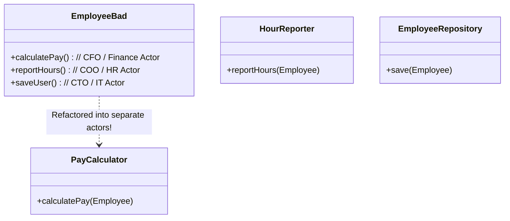
```mermaid
classDiagram
    class EmployeeBad {
        +calculatePay() // CFO / Finance Actor
        +reportHours()  // COO / HR Actor
        +saveUser()     // CTO / IT Actor
    }
    class PayCalculator {
        +calculatePay(Employee)
    }
    class HourReporter {
        +reportHours(Employee)
    }
    class EmployeeRepository {
        +save(Employee)
    }
    EmployeeBad ..> PayCalculator : Refactored into separate actors!
```

#### مثال 1: مخالفة SRP بالكود (Violation)
كلاس بيخدم أكتر من actor وبيجمع التقرير والحساب والتخزين في كلاس واحد:

```java
// SRP VIOLATION: Class has multiple reasons to change (Finance, HR, IT DB admins)
public class Employee {
    private String id;
    private String name;
    private double hourlyRate;

    // Reason to change #1: Finance department changes tax calculation rules
    public BigDecimal calculatePay() {
        return BigDecimal.valueOf(hourlyRate * 160).multiply(BigDecimal.valueOf(0.85));
    }

    // Reason to change #2: HR department changes working hours report format
    public String generateHoursReport() {
        return "Employee " + name + " worked 160 hours.";
    }

    // Reason to change #3: Database team changes table structure or shifts to MongoDB
    public void saveToDatabase() {
        String sql = "INSERT INTO employees VALUES ('" + id + "', '" + name + "')";
        // SQL execution logic
    }
}
```

#### مثال 2: فخ شائع (Over-abstraction & Anti-SRP Exaggeration)
الفخ العكسي هو تقسيم الكود لكلاسات قزمية (Anemic Classes) فيها دالة واحدة لدرجة إن المشروع يبقى فيه 10,000 كلاس مالهمش لزمة، وده بيزود اللزوجة والتعقيد بدون فايدة:

```java
// PITFALL: Over-splitting logic into unnecessary single-method classes
public class EmployeeNameGetter { public String getName(Employee e) { return e.getName(); } }
public class EmployeeNameSetter { public void setName(Employee e, String name) { e.setName(name); } }
```

#### مثال 3: حالة إنتاج حقيقية
في أنظمة الـ E-Commerce، فصل كلاس الـ Invoice لمعالجة الحسابات، توليد الـ PDF، وإرسال الرسائل:

```java
public class Invoice {
    private final String invoiceId;
    private final List<LineItem> items;

    public Invoice(String invoiceId, List<LineItem> items) {
        this.invoiceId = invoiceId;
        this.items = List.copyOf(items);
    }

    // Domain Logic ONLY: High cohesion calculation
    public BigDecimal calculateTotalAmount() {
        return items.stream()
                .map(LineItem::getPrice)
                .reduce(BigDecimal.ZERO, BigDecimal::add);
    }
}
```

> [!example] 🎯 مستوى التعمق أساسي

---

## Q14 — كيف تطبق SRP عملياً في كود Java لتحقيق صيانة سهلة؟

### أصل الحكاية

لتطبيق SRP عملياً، بنستخدم أسلوب الـ **Separation of Concerns**. بنفصل الـ Domain Model (البيانات وقواعد العمل الخالصة) عن الـ Infrastructure Services (التخزين، الشبكة، طباعة التقارير).

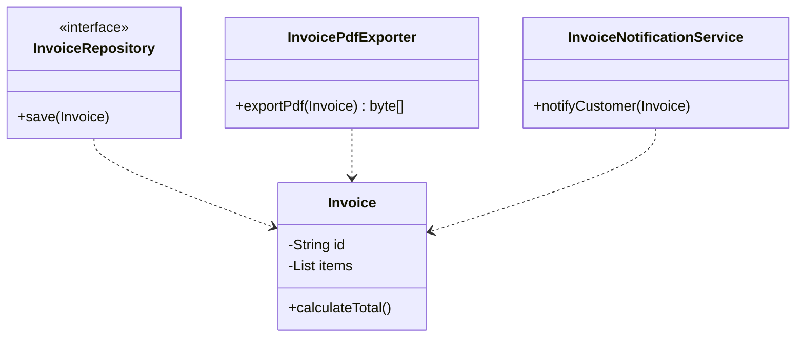
```mermaid
classDiagram
    class Invoice {
        -String id
        -List items
        +calculateTotal()
    }
    class InvoiceRepository {
        <<interface>>
        +save(Invoice)
    }
    class InvoicePdfExporter {
        +exportPdf(Invoice) byte[]
    }
    class InvoiceNotificationService {
        +notifyCustomer(Invoice)
    }
    InvoiceRepository ..> Invoice
    InvoicePdfExporter ..> Invoice
    InvoiceNotificationService ..> Invoice
```

#### مثال 1: تطبيق عملي (Clean Refactored SRP Architecture)

```java
// 1. Pure Domain Model
public class Invoice {
    private final String id;
    private final BigDecimal amount;

    public Invoice(String id, BigDecimal amount) {
        this.id = id;
        this.amount = amount;
    }
    public String getId() { return id; }
    public BigDecimal getAmount() { return amount; }
}

// 2. Persistence Concern (IT Actor)
public interface InvoiceRepository {
    void save(Invoice invoice);
}

// 3. Document Export Concern (Operations Actor)
public class InvoicePdfExporter {
    public byte[] exportToPdf(Invoice invoice) {
        // PDF library calls (iText / PDFBox)
        return new byte[0];
    }
}

// 4. Notification Concern (Customer Support Actor)
public class InvoiceNotificationService {
    public void sendInvoiceEmail(Invoice invoice, String email) {
        // SMTP logic
    }
}
```

#### مثال 2: فخ شائع (Leaking Infrastructure into Domain Entities)
استخدام JPA Annotations أو SQL Queries مباشرة داخل الكائنات المسؤولة عن الـ Business Logic:

```java
// PITFALL: Mixing JPA Database Concerns inside Domain Business Rules
public class OrderDomain {
    public void processDiscount() {
        // ... business logic
        // BAD: Directly calling Database EntityManager inside Domain Entity!
        EntityManagerHolder.getEm().merge(this); 
    }
}
```

#### مثال 3: حالة إنتاج حقيقية
في فريم ورك مثل Spring Boot، تقسيم الكود لمطبقات موحدة (`@RestController`, `@Service`, `@Repository`) هو أسلوب قياسي لتطبيق SRP على مستوى الطبقات (Layered SRP):

```java
@RestController
@RequestMapping("/api/orders")
public class OrderController { // Concern #1: HTTP Request parsing & response mapping
    private final OrderService orderService;

    public OrderController(OrderService orderService) {
        this.orderService = orderService;
    }

    @PostMapping
    public ResponseEntity<Void> createOrder(@RequestBody CreateOrderRequest request) {
        orderService.processOrder(request.toCommand());
        return ResponseEntity.ok().build();
    }
}
```

> [!example] 🎯 مستوى التعمق أساسي

---

## Q15 — ما هو مبدأ المفتوح/المغلق (Open/Closed Principle - OCP) ولماذا نكره الـ if/else المتكررة؟

### أصل الحكاية

تعريف مبدأ OCP الشهير الصادر من Bertrand Meyer ينص على:
> **"Software entities (classes, modules, functions) should be open for extension, but closed for modification."**
> (الكيانات البرمجية يجب أن تكون مفتوحة للتمديد، ولكن مغلقة أمام التعديل).

ماذا يعني ذلك؟
- **مفتوح للتمديد (Open for Extension)**: تقدر تضيف ميزات وسلوكيات جديدة للنظام بسهولة عند ظهور متطلبات جديدة.
- **مغلق للتعديل (Closed for Modification)**: تقدر تضيف الميزات الجديدة دي **من غير ما تلمس أو تعدل** الكود الفعلي القديم المختبر والمشغل في الإنتاج!

العدو الأول لمبدأ OCP هو الـ `if/else` الحجمية أو الـ `switch` المعتمدة على الأنواع (Type-based switching). كل ما ينزل نوع جديد، تضطر تفتح الكلاس القديم وتضيف `else if` جديدة، وده بيكسر اختبارات الـ Unit Tests القاديمة وبيخلق ريسك عالي لظهور ثغرات وبجات جديدة.

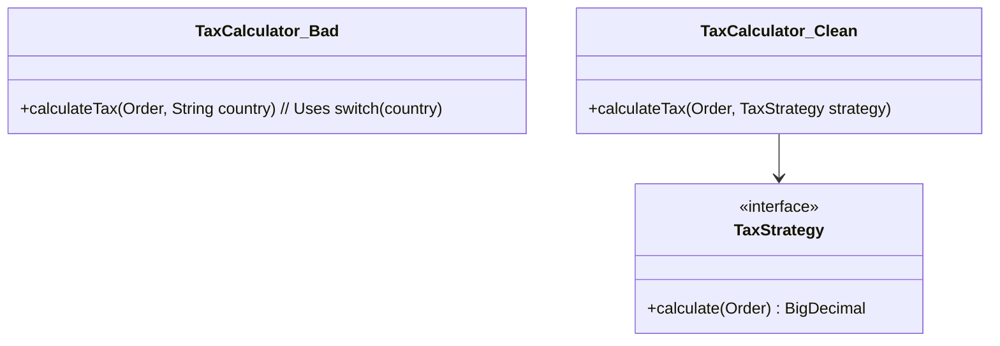
```mermaid
classDiagram
    class TaxCalculator_Bad {
        +calculateTax(Order, String country) // Uses switch(country)
    }
    class TaxCalculator_Clean {
        +calculateTax(Order, TaxStrategy strategy)
    }
    class TaxStrategy {
        <<interface>>
        +calculate(Order) BigDecimal
    }
    TaxCalculator_Clean --> TaxStrategy
```

#### مثال 1: كود يخالف OCP (Violation)
نظام لحساب خصومات التذاكر يعتمد على الـ `switch`:

```java
// OCP VIOLATION: Modifying existing class for every new customer type!
public class DiscountCalculatorBad {
    public BigDecimal calculateDiscount(String customerType, BigDecimal price) {
        if ("REGULAR".equalsIgnoreCase(customerType)) {
            return price.multiply(BigDecimal.valueOf(0.05));
        } else if ("VIP".equalsIgnoreCase(customerType)) {
            return price.multiply(BigDecimal.valueOf(0.20));
        } else if ("SUPER_VIP".equalsIgnoreCase(customerType)) { // Modification needed here!
            return price.multiply(BigDecimal.valueOf(0.30));
        }
        return BigDecimal.ZERO;
    }
}
```

#### مثال 2: فخ شائع (Premature OCP Abstraction)
تطبيق OCP والتجريد بشكل مبكر جداً في أماكن نادرة التغير (Premature Optimization)، مما يحول الكود لـ Over-engineered abstraction maze:

```java
// PITFALL: Creating Interfaces for things that will NEVER have alternative extensions
public interface StringCapitalizer { String capitalize(String str); }
public class DefaultStringCapitalizer implements StringCapitalizer { ... }
```

#### مثال 3: حالة إنتاج حقيقية
في أنظمة الـ Payment Gateways, عدم تطبيق OCP بيخلق مشكلة عند إضافة بوابة دفع جديدة (مثلاً: ApplePay أو Fawry):

```java
// Production Risk when OCP is violated:
// Adding Fawry payment broke PayPal integration tests because same class was edited!
```

> [!example] 🎯 مستوى التعمق متوسط

---

## Q16 — كيف تطبق OCP في Java باستخدام Interfaces والـ Polymorphism؟

### أصل الحكاية

الحل السحري لتطبيق OCP في Java هو استخدام **Abstractions (Interfaces / Abstract Classes)** وتمرير التنفيذ وقت التشغيل. عند إضافة متطلب جديد، بنقوم بإنشاء Class جديد بيطبق نفس الـ Interface من غير ما نعدل خط كود واحد في الـ Core Logic.

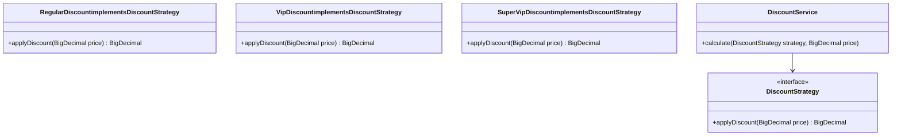
```mermaid
classDiagram
    class DiscountStrategy {
        <<interface>>
        +applyDiscount(BigDecimal price) BigDecimal
    }
    class RegularDiscount implements DiscountStrategy {
        +applyDiscount(BigDecimal price) BigDecimal
    }
    class VipDiscount implements DiscountStrategy {
        +applyDiscount(BigDecimal price) BigDecimal
    }
    class SuperVipDiscount implements DiscountStrategy {
        +applyDiscount(BigDecimal price) BigDecimal
    }
    class DiscountService {
        +calculate(DiscountStrategy strategy, BigDecimal price)
    }
    DiscountService --> DiscountStrategy
```

#### مثال 1: تطبيق عملي (OCP Compliant Code)

```java
// 1. Abstraction Contract
public interface DiscountStrategy {
    BigDecimal applyDiscount(BigDecimal price);
}

// 2. Extensions (New classes added WITHOUT touching existing code!)
public class RegularDiscount implements DiscountStrategy {
    @Override
    public BigDecimal applyDiscount(BigDecimal price) {
        return price.multiply(BigDecimal.valueOf(0.05));
    }
}

public class VipDiscount implements DiscountStrategy {
    @Override
    public BigDecimal applyDiscount(BigDecimal price) {
        return price.multiply(BigDecimal.valueOf(0.20));
    }
}

// NEW requirement: Super VIP discount added seamlessly!
public class SuperVipDiscount implements DiscountStrategy {
    @Override
    public BigDecimal applyDiscount(BigDecimal price) {
        return price.multiply(BigDecimal.valueOf(0.30));
    }
}

// 3. Core Service Closed for Modification
public class DiscountService {
    public BigDecimal calculatePrice(DiscountStrategy discountStrategy, BigDecimal originalPrice) {
        return originalPrice.subtract(discountStrategy.applyDiscount(originalPrice));
    }
}
```

#### مثال 2: فخ شائع (Switch On Enum inside Factory)
إخفاء مخالفة OCP داخل Factory Class يحتوي على `switch` صريحة تحتم التعديل عند ظهور نوع جديد.

#### مثال 3: حالة إنتاج حقيقية
في أنظمة الـ Spring Boot، تجميع كل الـ Beans التي تطبق Interface واحد تلقائياً داخل List أو Map باستخدام Dependency Injection:

```java
@Service
public class ReportEngine {
    private final Map<String, ReportExporter> exporters;

    // Spring auto-injects ALL implementations of ReportExporter into the Map!
    // Adding a new Exporter class automatically registers it without modifying ReportEngine!
    @Autowired
    public ReportEngine(List<ReportExporter> exporterList) {
        exporters = exporterList.stream()
                .collect(Collectors.toMap(ReportExporter::getFormatName, Function.identity()));
    }

    public void export(String format, ReportData data) {
        ReportExporter exporter = exporters.get(format);
        if (exporter == null) throw new IllegalArgumentException("Unsupported format");
        exporter.export(data);
    }
}
```

> [!example] 🎯 مستوى التعمق متوسط

---

<!-- PROGRESS: last completed = Q16 | next = Q17 | module = SOLID Principles -->

## Q17 — ما هو مبدأ إحلال ليسكوف (Liskov Substitution Principle - LSP) وكيف تكشف خرق هذا المبدأ؟

### أصل الحكاية

تمت صياغة هذا المبدأ بواسطة الفلكية والعالمة Barbara Liskov عام 1987. المبدأ ينص رياضياً على:
> **"If S is a subtype of T, then objects of type T may be replaced with objects of type S without altering any of the desirable properties of the program."**
> (إذا كان S ناعاً فرعياً من T، يجب أن يكون بمقدورنا استبدال كائنات T بكائنات S دون كسر أي من الخصائص المتوقعة في البرنامج).

بكلمات أبسط: **الابن لازم يوفي بكامل وعود الأب!**
لو كلاس ابن أورث من كلاس أب، وطلبنا من الابن يقوم بمهمة كان الأب بيعملها، والابن ضرب Exception أو غير السلوك بطريقة مفاجئة لدرجة إن الكود المستدعي اتكسر... يبقى كدة خرقنا مبدأ LSP!

أبرز 3 إشارات تكشف خرق LSP:
1. رمي `UnsupportedOperationException` داخل دالة موروثة من الأب.
2. تغيير الـ Preconditions (اشتراط شروط أشد على المدخلات في الابن مقارنة بالأب).
3. إضعاف الـ Postconditions (الابن بيطلع مخرجات لا تلتزم بضمانات الأب).

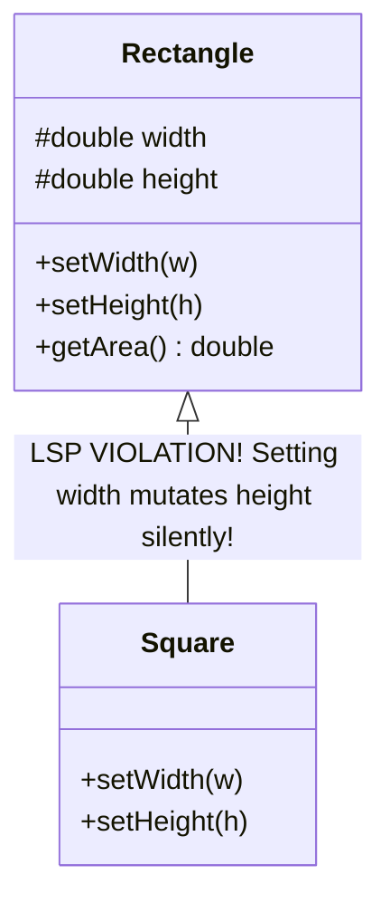
```mermaid
classDiagram
    class Rectangle {
        #double width
        #double height
        +setWidth(w)
        +setHeight(h)
        +getArea() double
    }
    class Square {
        +setWidth(w)
        +setHeight(h)
    }
    Rectangle <|-- Square : LSP VIOLATION! Setting width mutates height silently!
```

#### مثال 1: مخالفة LSP المدرسية (Square-Rectangle Problem)

```java
// LSP VIOLATION: Square breaks the mathematical contract of Rectangle!
public class Rectangle {
    protected double width;
    protected double height;

    public void setWidth(double width) { this.width = width; }
    public void setHeight(double height) { this.height = height; }
    public double getArea() { return width * height; }
}

public class Square extends Rectangle {
    @Override
    public void setWidth(double width) {
        this.width = width;
        this.height = width; // Silently mutates height!
    }

    @Override
    public void setHeight(double height) {
        this.width = height;
        this.height = height; // Silently mutates width!
    }
}

// Client Code Broken by Square:
public class TestLsp {
    public static void verifyArea(Rectangle rect) {
        rect.setWidth(5);
        rect.setHeight(4);
        // Expecting 5 * 4 = 20. But if rect is Square, width becomes 4, area becomes 16!
        assert rect.getArea() == 20.0 : "LSP Broken!";
    }
}
```

#### مثال 2: فخ شائع (Throwing UnsupportedOperationException)
وراثة كلاس دون الرغبة في دعم جميع دواله، فيتم اختيار رمي خطأ عند استدعاء الدالة:

```java
// PITFALL: ReadOnlyFile violates LSP because File promises write access!
public class ReadOnlyFile extends File {
    public ReadOnlyFile(String pathname) { super(pathname); }

    @Override
    public boolean delete() {
        throw new UnsupportedOperationException("Read-only files cannot be deleted!"); // Breaks LSP!
    }
}
```

#### مثال 3: حالة إنتاج حقيقية
في أنظمة البنوك، الـ `ReadOnlyAccount` المستمر في الوراثة من `Account` يسبب كارثة في معالجة المدفوعات إذا ألقى استثناء عند طلب السحب:

```java
// Production Bug: Account hierarchy violating LSP in Payment Batch Processor
public class FixedDepositAccount extends BankAccount {
    @Override
    public void withdraw(BigDecimal amount) {
        throw new IllegalStateException("Withdrawals not allowed before maturity date!");
    }
}
```

> [!example] 🎯 مستوى التعمق متوسط

---

## Q18 — كيف تطبق LSP في Java لتضمن استبدال الأبناء بدون أخطاء؟

### أصل الحكاية

لتطبيق LSP بشكل سليم، يجب إعادة النظر في شجرة الوراثة. لو الابن مش قادر يحقق كامل واجهة الأب بدون استثناءات أو شروط غريبة، يبقى العلاقة بينهما **ليست IS-A** صريحة!
الحل هو:
1. فصل الـ Interfaces الشاملة إلى واجهات أصغر وأكثر تخصصاً (Interface Segregation).
2. استخدام التجميع (Composition) بدلاً من الوراثة المجبورة.
3. التزام الأبناء بـ **Design by Contract** (عدم تقوية Preconditions ولا إضعاف Postconditions).

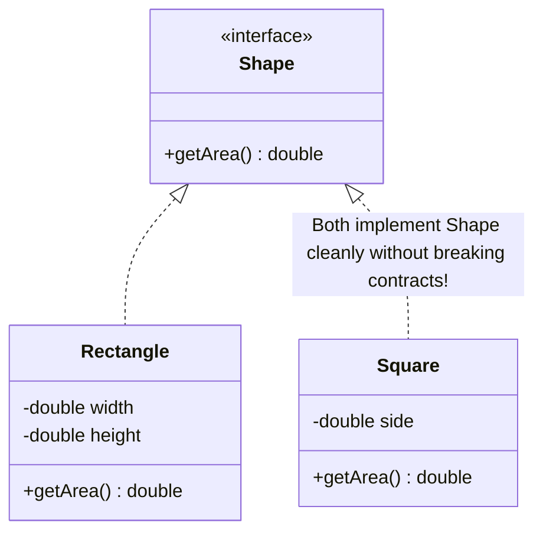
```mermaid
classDiagram
    class Shape {
        <<interface>>
        +getArea() double
    }
    class Rectangle {
        -double width
        -double height
        +getArea() double
    }
    class Square {
        -double side
        +getArea() double
    }
    Shape <|.. Rectangle
    Shape <|.. Square : Both implement Shape cleanly without breaking contracts!
```

#### مثال 1: تطبيق عملي (LSP Compliant Refactoring)

```java
// Clean LSP Hierarchy via explicit Shape contract
public interface Shape {
    double getArea();
}

public class Rectangle implements Shape {
    private final double width;
    private final double height;

    public Rectangle(double width, double height) {
        this.width = width;
        this.height = height;
    }

    @Override
    public double getArea() {
        return width * height;
    }
}

public class Square implements Shape {
    private final double side;

    public Square(double side) {
        this.side = side;
    }

    @Override
    public double getArea() {
        return side * side;
    }
}
```

#### مثال 2: فخ شائع (Instanceof checking in caller code)
استخدام `instanceof` في الكود المستدعي لتفادي سلوك الابن المخالف هو دليل صريح على كسر LSP:

```java
// PITFALL: Defeating Polymorphism to bypass LSP violation
public void processAccount(BankAccount account) {
    if (account instanceof FixedDepositAccount) {
        // Skip withdrawal logic to avoid exception... Smells bad!
    } else {
        account.withdraw(BigDecimal.TEN);
    }
}
```

#### مثال 3: حالة إنتاج حقيقية
في أنظمة الـ Stream Processing (مثل Apache Flink / Java Streams)، جميع مجاري البيانات تفي بعقد `Spliterator` أو `Iterator` بدون مفاجآت وقت التشغيل:

```java
public class CustomStreamProcessor {
    public <T> void processAll(Iterator<T> iterator) {
        // Guaranteed LSP behavior across ArrayList, LinkedList, or Custom Lazy Iterators
        while (iterator.hasNext()) {
            T item = iterator.next();
            // Process safely without expecting UnsupportedOperationException from hasNext()
        }
    }
}
```

> [!example] 🎯 مستوى التعمق متوسط

---

## Q19 — ما هو مبدأ فصل الواجهات (Interface Segregation Principle - ISP) وكيف تحمي كودك من الواجهات الضخمة؟

### أصل الحكاية

ينص مبدأ ISP على:
> **"Clients should not be forced to depend upon interfaces that they do not use."**
> (يجب ألا تُجبر الكائنات المستدعية على الاعتماد على واجهات لا تستخدم دوالها).

عند كتابة واجهة ضخمة تحتوي على 20 دالة (Fat / Pollution Interface)، أي كلاس يقرر تطبيق هذه الواجهة سيُجبر على كتابة تنفيذ لجميع الـ 20 دالة، حتى لو كان يحتاج دالتين فقط!
ده بيؤدي إلى:
1. كتابة Empty Method Implementations أو رمي `UnsupportedOperationException`.
2. إعادة تجميع (Re-compilation) واختبار الكلاسات غير المعنية كلما تغيرت دالة غير مستخدمة في الـ Interface الضخم.

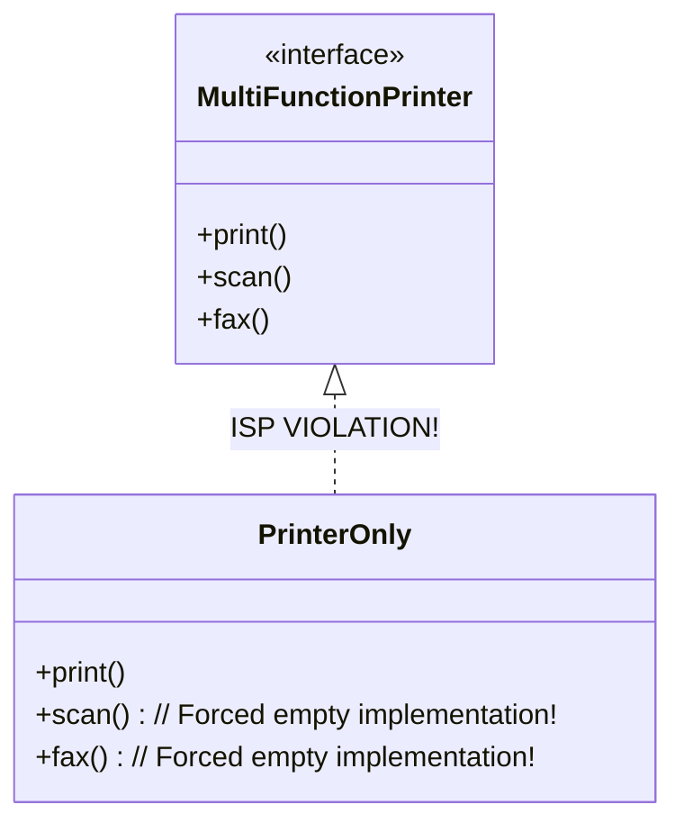
```mermaid
classDiagram
    class MultiFunctionPrinter {
        <<interface>>
        +print()
        +scan()
        +fax()
    }
    class PrinterOnly {
        +print()
        +scan() // Forced empty implementation!
        +fax()  // Forced empty implementation!
    }
    MultiFunctionPrinter <|.. PrinterOnly : ISP VIOLATION!
```

#### مثال 1: كود يخالف ISP (Violation)

```java
// ISP VIOLATION: Fat Interface forcing unnecessary implementations
public interface SmartDevice {
    void print();
    void scan();
    void fax();
    void internetFax();
}

public class BasicPrinter implements SmartDevice {
    @Override
    public void print() {
        // Actual printing logic
    }

    @Override
    public void scan() {
        // FORCED IMPLEMENTATION: Basic printer cannot scan!
        throw new UnsupportedOperationException("Scanning not supported");
    }

    @Override
    public void fax() {
        // FORCED IMPLEMENTATION
        throw new UnsupportedOperationException("Fax not supported");
    }

    @Override
    public void internetFax() {
        // FORCED IMPLEMENTATION
        throw new UnsupportedOperationException("Internet Fax not supported");
    }
}
```

#### مثال 2: فخ شائع (ISP vs SRP confusion)
الظن بأن ISP يطالب بدالة واحدة فقط داخل كل Interface! المراد هو فصل الواجهات **حسب احتياج المستدعي (Client-driven Interfaces)** وليس تفكيك الواجهات بشكل مبالغ فيه.

#### مثال 3: حالة إنتاج حقيقية
في أنظمة الـ E-Commerce Storage، واجهة التخزين الموحدة التي تفرض دوال الـ Caching والـ Purging والـ Direct SQL على كلاسات مجرد قرائية:

```java
// Fat Persistence Interface violating ISP in enterprise apps
public interface MassiveRepository<T> {
    void save(T entity);
    T findById(Long id);
    void purgeCache(); // Cache concern forced on all DB implementations!
    void executeRawDdl(String sql); // DDL concern forced on read repositories!
}
```

> [!example] 🎯 مستوى التعمق أساسي

---

## Q20 — كيف تطبق ISP في Java باستخدام الواجهات المتخصصة (Role-based Interfaces)؟

### أصل الحكاية

لتطبيق ISP، يتم تقسيم الواجهة الضخمة إلى عدة واجهات صغيرة مخصصة للرواد (Role-based Interfaces). الكلاس الذكي يقدر يطبق أكثر من Interface في Java (`implements Printer, Scanner`), والمستدعي يستقبل فقط الـ Interface الذي يلزمه.

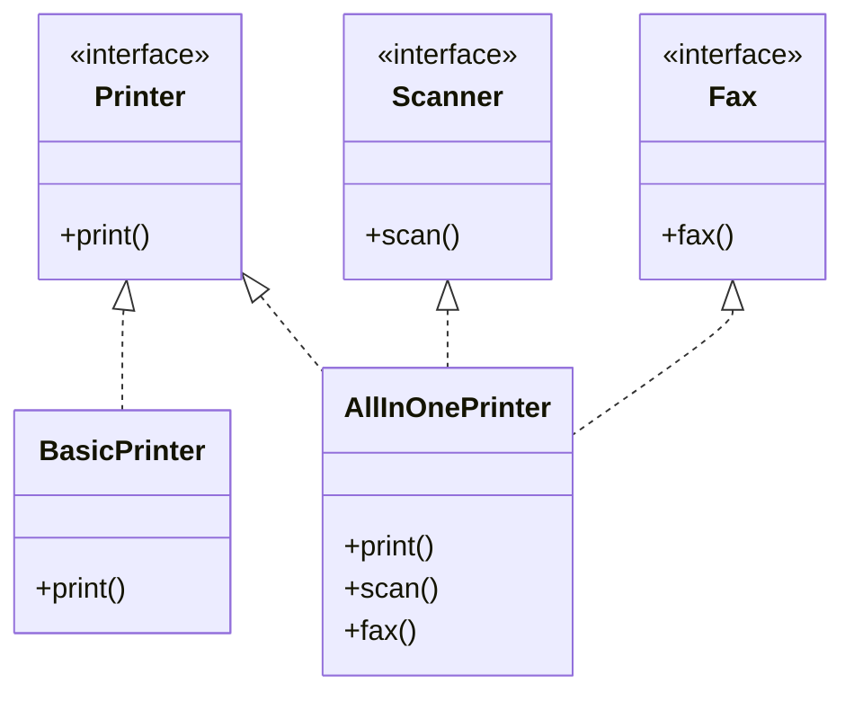
```mermaid
classDiagram
    class Printer {
        <<interface>>
        +print()
    }
    class Scanner {
        <<interface>>
        +scan()
    }
    class Fax {
        <<interface>>
        +fax()
    }
    class BasicPrinter {
        +print()
    }
    class AllInOnePrinter {
        +print()
        +scan()
        +fax()
    }
    Printer <|.. BasicPrinter
    Printer <|.. AllInOnePrinter
    Scanner <|.. AllInOnePrinter
    Fax <|.. AllInOnePrinter
```

#### مثال 1: تطبيق عملي (ISP Compliant Refactoring)

```java
// Role-based Clean Interfaces
public interface Printer {
    void print(Document doc);
}

public interface Scanner {
    Document scan();
}

public interface FaxMachine {
    void sendFax(Document doc, String number);
}

// Simple printer only depends on what it actually does!
public class SimpleBlackAndWhitePrinter implements Printer {
    @Override
    public void print(Document doc) {
        // Pure printing logic
    }
}

// Advanced printer implements multiple role interfaces cleanly
public class EnterprisePrinter implements Printer, Scanner, FaxMachine {
    @Override public void print(Document doc) { /* Print */ }
    @Override public Document scan() { return new Document(); }
    @Override public void sendFax(Document doc, String number) { /* Fax */ }
}
```

#### مثال 2: فخ شائع (Interface Pollution via Default Methods)
إضافة دوال جديدة لـ Interface قديم واستخدام `default` لتجنب كسر الكلاسات، مما يحول الواجهة بالتدريج إلى Fat Interface ملوث بـ default methods لا تهم جميع الكائنات.

#### مثال 3: حالة إنتاج حقيقية
في مكتبة Java Standard Library، تصميم الـ Interfaces مرشح نموذجي لـ ISP:
الكلاس `ArrayList` يطبق واجهات متخصصة مستقلة: `List`, `RandomAccess`, `Cloneable`, `Serializable`. المستدعي الذي يحتاج فقط القراءة العشوائية يستقبل `RandomAccess`.

```java
public class DataExporter {
    // Only accepts objects that express the Serializable capability (Role Interface)
    public void exportToFile(Serializable data) {
        // Serialization logic
    }
}
```

> [!example] 🎯 مستوى التعمق أساسي

---

## Q21 — ما هو مبدأ عكس التبعية (Dependency Inversion Principle - DIP) وما الفرق بينه وبين الـ Inversion of Control (IoC) والـ Dependency Injection (DI)؟

### أصل الحكاية

ارتبط الاقتران المباشر في البرمجة الإجرائية والـ OOP التقليدي بمسار خطير: الكلاسات عالية المستوى التي تحتوي قواعد العمل الرئيسية (Business Core Logic) كانت تنشئ وتعتمد صراحة على الكلاسات منخفضة المستوى المتخصصة في البنية التحتية (`DatabaseConnection`, `SmsSender`, `FileWriter`).

مشكلة هذا الاتجاه التقليسي هي أن أي تعديل أو استبدال في التكنولوجيا منخفضة المستوى (مثلاً: الانتقال من MySQL إلى MongoDB أو من SMTP إلى SendGrid) يمتد ويتسبب في تدمير وتعديل الكود عالي المستوى في قلب النظام!

جاء مبدأ **cعكس التبعية (DIP)** ليعكس هذا اتجاه التبعية 180 درجة عبر شقين صريحين:
1. **High-level modules should not depend on low-level modules. Both should depend on abstractions.**
2. **Abstractions should not depend on details. Details should depend on abstractions.**

ولإزالة اللبس بين المفاهيم الثلاثة المتشابكة:
- **DIP (Principle)**: المبدأ المعماري النظري الداعي للاعتماد على الـ Abstraction وتحديد الملكية.
- **IoC (Inversion of Control - Concept)**: النمط العام لعكس قيادة التطبيق (إعطاء التحكم لفريم ورك أو Container يستدعي كودك بدلاً من استدعاء كودك للخدمات بنفسه).
- **DI (Dependency Injection - Technique)**: الأداة أو التقنية الفعالة لتمرير التبعيات المعتمدة من الخارج (عبر Constructor أو Setter) لتحقيق DIP.

```mermaid
classDiagram
    class BusinessOrderEngine {
        -PaymentGateway paymentGateway
        +process(BigDecimal amount)
    }
    class PaymentGateway {
        <<interface>>
        +charge(BigDecimal amount) boolean
    }
    class StripePaymentAdapter {
        +charge(BigDecimal amount) boolean
    }
    class PaypalPaymentAdapter {
        +charge(BigDecimal amount) boolean
    }
    BusinessOrderEngine --> PaymentGateway : High-Level Depends on Abstraction
    StripePaymentAdapter ..> PaymentGateway : Low-Level Implements Abstraction
    PaypalPaymentAdapter ..> PaymentGateway : Low-Level Implements Abstraction
```

#### مثال 1: تطبيق عملي (المشكلة والكود المخالف صراحة لـ DIP)

```java
// Low-level Infrastructure Detail Class
public class MySQLDirectDatabase {
    public void executeRawSqlQuery(String query) {
        System.out.println("Executing raw SQL on MySQL Server: " + query);
    }
}

// DIP VIOLATION: High-level core business logic directly instantiates and depends on MySQL!
public class FinancialAuditServiceBad {
    // Tightly coupled to concrete database implementation
    private final MySQLDirectDatabase database = new MySQLDirectDatabase();

    public void auditTransaction(String transactionId, BigDecimal amount) {
        // High-level rule polluted with SQL syntax and concrete DB reference
        String sql = "INSERT INTO audit_log VALUES ('" + transactionId + "', " + amount + ")";
        database.executeRawSqlQuery(sql);
    }
}
```

#### مثال 2: فخ شائع (Package Ownership Pitfall - Creating Abstractions in Low-Level Package)

```java
// PITFALL: Placing the interface in the Infrastructure/Low-Level package leaks details to Core!

// Infrastructure Package: com.app.infrastructure.db
package com.app.infrastructure.db;

public interface SqlQueryExecutor { // BAD: Naming & Package belong to low-level DB details!
    void executeSql(String sql);
}

// Core Domain Package: com.app.core
package com.app.core;

import com.app.infrastructure.db.SqlQueryExecutor; // BAD DEPENDENCY DIRECTION! Core imports Infrastructure!

public class AccountBalanceService {
    private final SqlQueryExecutor executor; // Still architecturally coupled to DB concept!

    public AccountBalanceService(SqlQueryExecutor executor) {
        this.executor = executor;
    }
}
```

#### مثال 3: حالة إنتاج حقيقية (Framework-Agnostic Production DIP Architecture)

```java
// Core Domain Package (com.app.domain) - OWNS the Abstraction
public interface PaymentGatewayPort {
    boolean processTransaction(String orderId, BigDecimal amount);
}

// High-Level Domain Service (Pure Business Rules, zero imports of framework or low-level SDKs)
public class CheckoutUseCase {
    private final PaymentGatewayPort paymentGatewayPort;

    public CheckoutUseCase(PaymentGatewayPort paymentGatewayPort) {
        this.paymentGatewayPort = Objects.requireNonNull(paymentGatewayPort, "Payment port required");
    }

    public void executeCheckout(String orderId, BigDecimal amount) {
        if (amount.compareTo(BigDecimal.ZERO) <= 0) {
            throw new IllegalArgumentException("Invalid checkout amount");
        }
        boolean success = paymentGatewayPort.processTransaction(orderId, amount);
        if (!success) {
            throw new IllegalStateException("Payment declined by gateway provider");
        }
    }
}

// Infrastructure Layer (com.app.infrastructure.adapters) - IMPORTS Core Domain
public class StripeSdkAdapter implements PaymentGatewayPort {
    @Override
    public boolean processTransaction(String orderId, BigDecimal amount) {
        // Low-level Stripe SDK API calls, OAuth signing & network retries
        System.out.println("Processing via Stripe REST API v3 for order: " + orderId);
        return true;
    }
}
```

> [!example] 🎯 مستوى التعمق متقدم

---

## Q22 — كيف تطبق DIP في Java باستخدام Dependency Injection (DI)؟

### أصل الحكاية

لتطبيق DIP، نعكس اتجاه التبعية (Invert Dependency).
بدلاً من أن يستدعي الموديول عالي المستوى `new LowLevelClass()`, ننشئ واجهة `MessageService` يملكها الموديول عالي المستوى. الموديول منخفض المستوى يطبق الواجهة، ويتم حصر عملية الربط وإرسال المرجع عبر الـ Constructor Injection.

```mermaid
classDiagram
    class NotificationService {
        -MessageSender sender
        +NotificationService(MessageSender sender)
        +notify(String msg)
    }
    class MessageSender {
        <<interface>>
        +send(String msg)
    }
    class EmailSender implements MessageSender {
        +send(String msg)
    }
    class SmsSender implements MessageSender {
        +send(String msg)
    }
    NotificationService --> MessageSender
```

#### مثال 1: تطبيق عملي (DIP & Constructor Injection)

```java
// 1. High-Level Abstraction Contract
public interface MessageSender {
    void send(String message);
}

// 2. Low-Level Implementation #1
public class EmailSender implements MessageSender {
    @Override
    public void send(String message) {
        // Sent via Email
    }
}

// 3. Low-Level Implementation #2
public class SmsSender implements MessageSender {
    @Override
    public void send(String message) {
        // Sent via SMS Gateway
    }
}

// 4. High-Level Core Module depending purely on Abstraction
public class NotificationManager {
    private final MessageSender messageSender; // DIP Applied!

    // Dependency Injection via Constructor
    public NotificationManager(MessageSender messageSender) {
        this.messageSender = Objects.requireNonNull(messageSender, "Sender cannot be null");
    }

    public void processNotification(String text) {
        messageSender.send(text);
    }
}
```

#### مثال 2: فخ شائع (Field Injection Abuse in Frameworks)
استخدام `@Autowired` على الـ Fields مباشرة بدل الـ Constructor Injection، مما يمنع إنشاء الكائن بشكل مستقل في الـ Unit Tests بدون فتح Spring Container:

```java
// PITFALL: Field Injection prevents immutability and easy unit testing!
@Service
public class BadService {
    @Autowired
    private PaymentRepository repository; // BAD: Cannot pass mock repository in pure JUnit test!
}
```

#### مثال 3: حالة إنتاج حقيقية
في أنظمة الـ Hexagonal Architecture (Ports and Adapters), الـ Port هو الـ Interface المعكوس، والـ Adapter هو التنفيذ الخارجي (DB Adapter, REST Adapter) الذي يحقق DIP بالكامل:

```java
// Port (High-Level Domain Layer)
public interface OrderPersistencePort {
    void saveOrder(Order order);
}

// Adapter (Infrastructure Layer)
@Repository
public class PostgresOrderAdapter implements OrderPersistencePort {
    @Override
    public void saveOrder(Order order) {
        // Hibernate SQL execution
    }
}
```

> [!example] 🎯 مستوى التعمق متقدم

---

## Q23 — حالة دراسية: كيف تقوم بإعادة هيكلة (Refactoring) كود قديم أحادي لمراعاة مبادئ SOLID؟

### أصل الحكاية

في المشاريع الحقيقية، نادراً ما تبدأ من الصفر. المشهد الشائع هو استلام كود قديم (Legacy Monolithic Class) يحتوي على 3000 سطر، يجمع بين فتح اتصال القاعدة، حساب الأسعار، إرسال الفواتير، ومعالجة أخطاء الشبكة!
لتحويل هذا المنظر إلى كود مطابق لـ SOLID دون كسر النظام في الإنتاج، نتبع الاستراتيجية التالية:
1. كتابة **Characterization Tests** لحفظ السلوك الحالي للنظام.
2. استخراج الـ Domain Entities وفصلها عن الـ DB Concerns (تطبيق SRP).
3. استخراج الـ Interfaces للخدمات الخارجية (تطبيق DIP & ISP).
4. تحويل الشرطية الملتوية `if/else` إلى Strategy Classes (تطبيق OCP).

```mermaid
graph TD
    LegacyGodClass -->|Refactor SRP| DomainEntity[Invoice Entity]
    LegacyGodClass -->|Refactor DIP| RepoInterface[InvoiceRepository]
    LegacyGodClass -->|Refactor OCP| StrategyInterface[TaxCalculator]
    LegacyGodClass -->|Refactor ISP| NotifierInterface[EmailNotifier]
```

#### مثال 1: الكود القديم المتهالك (Legacy Monolith Before Refactoring)

```java
// LEGACY NIGHTMARE: Violates ALL SOLID Principles!
public class LegacyOrderProcessor {
    public void process(String orderId, String type, double price) {
        // DB connection logic directly mixed inside!
        System.out.println("Connecting to MySQL at 192.168.1.5...");
        
        // Tax logic with hardcoded type switching (OCP & SRP Violation)
        double tax = 0;
        if (type.equals("FOOD")) {
            tax = price * 0.05;
        } else if (type.equals("ELECTRONICS")) {
            tax = price * 0.14;
        }

        double total = price + tax;

        // SQL Execution (SRP Violation)
        System.out.println("INSERT INTO orders VALUES ('" + orderId + "', " + total + ")");

        // Hardcoded SMTP Mailer (DIP & SRP Violation)
        System.out.println("Sending email via SMTP server smtp.gmail.com...");
    }
}
```

#### مثال 2: خطة الهيكلة التدريجية (Refactored Clean Code)

```java
// 1. Immutable Domain Model
public record Order(String id, BigDecimal price, OrderType type) {}

// 2. OCP Tax Calculator Strategy
public interface TaxStrategy {
    BigDecimal calculateTax(BigDecimal price);
}

// 3. DIP Persistence Port
public interface OrderRepository {
    void save(Order order, BigDecimal totalWithTax);
}

// 4. DIP Notification Port
public interface NotificationService {
    void notifyReceipt(Order order, BigDecimal total);
}

// 5. Clean Refactored Core Coordinator
public class CleanOrderProcessor {
    private final OrderRepository repository;
    private final NotificationService notificationService;
    private final Map<OrderType, TaxStrategy> taxStrategies;

    public CleanOrderProcessor(OrderRepository repository, 
                               NotificationService notificationService,
                               Map<OrderType, TaxStrategy> taxStrategies) {
        this.repository = repository;
        this.notificationService = notificationService;
        this.taxStrategies = taxStrategies;
    }

    public void process(Order order) {
        TaxStrategy strategy = taxStrategies.getOrDefault(order.type(), p -> BigDecimal.ZERO);
        BigDecimal tax = strategy.calculateTax(order.price());
        BigDecimal total = order.price().add(tax);

        repository.save(order, total);
        notificationService.notifyReceipt(order, total);
    }
}
```

#### مثال 3: حالة إنتاج حقيقية
إجراء هذا التعديل تحت مظلة **Feature Flags** والتأكد من تطابق النتائج عن طريق الـ Parallel Run (تشغيل الكود القديم والجديد جنباً إلى جنب لمقارنة الـ Logs قبل التخلص من الكود القديم).

> [!example] 🎯 مستوى التعمق متقدم

---

## Q24 — ما الفرق بين تطبيق SOLID الموزون والتجريد المفرط (Over-Engineering)؟

### أصل الحكاية

تطبيق مبادئ SOLID ليس غاية هندسية في حد ذاتها، بل هو **وسيلة اقتصادية لتقليل تكلفة التغيير الفعلي المستقبلي (Cost of Change)**.

الفخ البشع الذي يقع فيه المطورون عقب استيعاب مفاهيم SOLID هو الـ **Over-Engineering (التجريد المفرط والمبكر)**. بدلاً من حل المشكلة البسيطة المطروحة، يبدأ المطور في تخيل متطلبات خيالية قد لا تحدث أبداً في المستقبل، فيقوم بـ:
- إنشاء `Interface` و `AbstractFactory` و `Strategy` لكلاس يحتوي على دالة واحدة لن تتغير قيمتها في التاريخ!
- تفكيك الكود إلى 40 كلاس قزمي، مما يجعل تتبع قراءة استدعاء دالة واحدة يفرض على المهندس فتح 15 ملفاً والتنقل بين حزم متعددة!

العقلية المعمارية الناضجة توازن بين مبادئ SOLID وبين مبادئ **YAGNI (You Aren't Gonna Need It)** و **KISS (Keep It Simple, Stupid)** عبر قاعدة **Rule of Three**: لا تقم بتوليد Abstraction إلا بعد تكرار الحاجة أو نمط التغيير 3 مرات فعلية في النظام!

```mermaid
graph TD
    Requirement[New Feature Request] --> IsComplex{Is requirement variant likely?}
    IsComplex -- No --> SimpleKISS[KISS Design: Direct High-Cohesion Class]
    IsComplex -- Yes --> CheckRule3{Has variant occurred 2+ times?}
    CheckRule3 -- No --> WaitRefactor[Keep Simple & Monitor Change Pattern]
    CheckRule3 -- Yes --> ApplySOLID[Balanced SOLID Refactoring: Add Interface & Strategy]
```

#### مثال 1: تطبيق عملي (Premature Abstraction vs Balanced Code)

```java
// OVER-ENGINEERED NIGHTMARE: Creating interface + factory + strategy for a simple string trimmer!
public interface StringTrimmingStrategy {
    String trim(String input);
}

public class DefaultWhitespaceTrimmingStrategy implements StringTrimmingStrategy {
    @Override
    public String trim(String input) {
        return input == null ? "" : input.trim();
    }
}

public class StringTrimmingFactory {
    public static StringTrimmingStrategy getStrategy() {
        return new DefaultWhitespaceTrimmingStrategy(); // Over-engineering at its worst!
    }
}

// BALANCED SOLID: High-Cohesion stateless helper class
public final class StringUtilsClean {
    private StringUtilsClean() {} // Non-instantiable

    public static String trimToEmpty(String input) {
        return input == null ? "" : input.trim();
    }
}
```

#### مثال 2: فخ شائع (The Dumb 1:1 Interface Anti-Pattern)

```java
// PITFALL: Blindly creating IService / ServiceImpl pairs for EVERY single class!

// Interface with ZERO alternative implementations in 5 years!
public interface IUserService {
    User findUserById(Long id);
    void registerUser(User user);
}

// Concrete class that just duplicates the exact interface 1:1
public class UserServiceImpl implements IUserService {
    @Override
    public User findUserById(Long id) {
        return new User(id, "John");
    }

    @Override
    public void registerUser(User user) {
        System.out.println("User registered: " + user.getName());
    }
}

// BALANCED APPROACH: Inject the Concrete UserClass directly UNTIL a 2nd implementation or Mocking need arises!
```

#### مثال 3: حالة إنتاج حقيقية (Refactoring when Variant Reality Hits)

```java
// PHASE 1 (Startup Prototype): Simple direct implementation without premature interfaces
public class OrderTaxCalculator {
    public BigDecimal calculateTax(BigDecimal amount) {
        return amount.multiply(BigDecimal.valueOf(0.14)); // Standard VAT only
    }
}

// PHASE 2 (International Expansion): Refactoring to SOLID OCP ONLY when new requirements arrive!
public interface TaxPolicy {
    BigDecimal calculateTax(BigDecimal amount);
}

public class EgVatTaxPolicy implements TaxPolicy {
    @Override public BigDecimal calculateTax(BigDecimal amount) { 
        return amount.multiply(BigDecimal.valueOf(0.14)); 
    }
}

public class UsSalesTaxPolicy implements TaxPolicy {
    private final String state;
    public UsSalesTaxPolicy(String state) { this.state = state; }
    
    @Override public BigDecimal calculateTax(BigDecimal amount) {
        return "CA".equalsIgnoreCase(state) ? amount.multiply(BigDecimal.valueOf(0.085)) : amount.multiply(BigDecimal.valueOf(0.05));
    }
}
```

> [!example] 🎯 مستوى التعمق متقدم

---

## Q25 — كيف تؤثر ميزات Java الحديثة (Records, Sealed Classes, Pattern Matching) على تطبيق مبادئ SOLID؟

### أصل الحكاية

طفرة الإصدارات الحديثة في لغة Java من Java 14 وحتى Java 21 أعادت تشكيل كيفية تحرير كود مطابق لـ SOLID بأقل حشو برمجي (Boilerplate Code) وبأمان تام يضمنه الـ Compiler:

1. **Records (Java 16+)**: قضت على مئات أسطر الـ getters/equals/hashCode الخاوية. الـ Record يُعد تطبيقا مثالياً صريحاً لـ **SRP** على مستوى الـ Data Carriers والـ Value Objects، مع فرض الـ Immutability الحتمية التامة (Thread-safe by default).
2. **Sealed Classes / Interfaces (Java 17+)**: سمحت للـ Domain Designer بتحديد وحصر الفئات الأبناء المسموح لها بالوراثة (`permits`). هذا القيد يعزز مبدئي **OCP** و **LSP** لأن الـ Hierarchy أصبحت معلومة ومغلقة عند حد معين لا يمكن لاختراق عشوائي من أطراف أخرى كسر ضمانات الأب!
3. **Pattern Matching for switch (Java 21+)**: ألغت الحاجة لكتابة كود `instanceof` ملوث يخالف الـ LSP، حيث أصبح الـ Compiler يقوم بعملية **Exhaustiveness Check** ليضمن أن كل نوع فرعي ممثل ومحسوب حسابه صراحة دون أي Runtime Exceptions مفاجئة!

```mermaid
classDiagram
    class DomainEvent {
        <<sealed interface>>
    }
    class OrderCreatedEvent {
        <<record>>
        +String orderId
        +BigDecimal total
    }
    class OrderCancelledEvent {
        <<record>>
        +String orderId
        +String reason
    }
    DomainEvent <|.. OrderCreatedEvent : Sealed Permit
    DomainEvent <|.. OrderCancelledEvent : Sealed Permit
```

#### مثال 1: تطبيق عملي (Sealed Classes + Pattern Matching for OCP & LSP Compiler Safety)

```java
// Sealed Interface cleanly defining a fixed domain hierarchy (OCP + LSP protection)
public sealed interface OrderStatusEvent permits OrderCreated, OrderShipped, OrderCancelled {}

public record OrderCreated(String orderId, BigDecimal amount) implements OrderStatusEvent {}
public record OrderShipped(String orderId, String trackingNumber) implements OrderStatusEvent {}
public record OrderCancelled(String orderId, String reason) implements OrderStatusEvent {}

// Processor using Java 21 Pattern Matching with exhaustive check
public class ModernOrderProcessor {
    public String processEvent(OrderStatusEvent event) {
        // Compiler guarantees ALL permitted subtypes are handled! No runtime LSP surprises!
        return switch (event) {
            case OrderCreated created -> "Created order " + created.orderId() + " with amount $" + created.amount();
            case OrderShipped shipped -> "Shipped order " + shipped.orderId() + " via tracking " + shipped.trackingNumber();
            case OrderCancelled cancelled -> "Cancelled order " + cancelled.orderId() + " due to: " + cancelled.reason();
        };
    }
}
```

#### مثال 2: فخ شائع (Misusing Records for Stateful Domain Aggregates)

```java
// PITFALL: Using Java Record as a Stateful Entity with Mutating Business Logic

// BAD: Records are IMMUTABLE. Trying to simulate state change inside a Record breaks domain rules!
public record BankAccountRecord(String accountId, BigDecimal balance) {
    // WRONG DESIGN: Aggregates need identity and invariant guards, not just raw data DTOs!
    public BankAccountRecord deposit(BigDecimal amount) {
        return new BankAccountRecord(accountId, this.balance.add(amount)); // Misleading usage!
    }
}

// CLEAN DESIGN: Use Records FOR Data Carriers / Value Objects ONLY (SRP Separation)
public record MoneyValueObject(BigDecimal amount, String currency) {
    public MoneyValueObject {
        Objects.requireNonNull(amount, "Amount required");
        Objects.requireNonNull(currency, "Currency required");
    }
}
```

#### مثال 3: حالة إنتاج حقيقية (Event-Driven Microservices Payloads with Records & DIP)

```java
// Immutable Domain Event Definition in High-Level API (Pure SRP Data Transfer Object)
public record PaymentSettlementEvent(
    String transactionRef,
    BigDecimal grossAmount,
    BigDecimal netAmount,
    Instant timestamp
) {
    public PaymentSettlementEvent {
        if (grossAmount.compareTo(BigDecimal.ZERO) <= 0) {
            throw new IllegalArgumentException("Gross amount must be positive");
        }
    }
}

// Service consumer adhering to DIP via Record Event
public class LedgerEventConsumer {
    public void onEvent(PaymentSettlementEvent event) {
        System.out.println("Auditing transaction: " + event.transactionRef() + 
                           " | Net: $" + event.netAmount() + 
                           " at " + event.timestamp());
    }
}
```

> [!example] 🎯 مستوى التعمق متقدم

> [!example] 🎯 مستوى التعمق متقدم

---

## Q26 — كيف تنعكس مبادئ SOLID على مستوى الـ Microservices والمعمارية الموزعة؟

### أصل الحكاية

مبادئ SOLID لم تُصمم لتنظيم الـ Object-Oriented Classes بلغة Java داخل العملية الواحدة (Single Process) فحسب! عند ارتقاء المعمارية إلى الأنظمة الموزعة (Microservices Architecture), تنعكس المبادئ الخمسة بنفس القوة والخطورة على مستوى الخدمات المنسقة (Services Level):

1. **Single Service Responsibility (Service SRP)**: كل Microservice تمتلك سياقاً محدداً (Bounded Context in DDD) وتكون مسؤولة حظرياً عن دومين بيانات موحد بقاعدة بيانات خاصة بها (`Single Database Per Service`).
2. **Service Open/Closed (Service OCP)**: تصميم عقود الـ APIs (REST / gRPC / Protobuf) لتكون مفتوحة للتمديد عبر إضافة حقول جديدة واختيارية (Non-breaking Backward-Compatible Extensions) ودون تكسير الخدمات القديمة المستهلكة.
3. **Service Interface Segregation (Service ISP)**: الاستغناء عن الـ Payloads المعممة الضخمة واستخدام GraphQL أو Backend-For-Frontend (BFF) لمنع إجبار المايكروسيرفيسز المستهلكة على تنزيل بيانات لا تهمها.
4. **Service Dependency Inversion (Service DIP)**: استبدال الاتصالات المباشرة المتزامنة (`HTTP REST Chains`) بـ **Event-Driven Architecture (Kafka / RabbitMQ)**، حيث تعتمد الخدمة الناشرة على `Event Contract Abstraction` بدلاً من الاعتماد الصريح على عنوان الخدمة المستهلكة.

```mermaid
graph LR
    OrderService[Order Microservice] -->|Publishes OrderPlacedEvent| KafkaBroker((Kafka Event Broker))
    KafkaBroker -->|Subscribes| NotificationService[Notification Microservice]
    KafkaBroker -->|Subscribes| InventoryService[Inventory Microservice]
    KafkaBroker -->|Subscribes| AnalyticsService[Analytics Microservice]
```

#### مثال 1: تطبيق عملي (Distributed Service DIP via Kafka Broker)

```java
// Domain Event Abstraction shared across Microservices Boundary
public record OrderPlacedEvent(
    String orderId,
    String customerId,
    BigDecimal totalAmount,
    Instant timestamp
) {}

// Publisher Microservice (Order Service): Zero knowledge of downstream services!
public class OrderServicePublisher {
    private final KafkaTemplate<String, OrderPlacedEvent> kafkaTemplate;

    public OrderServicePublisher(KafkaTemplate<String, OrderPlacedEvent> kafkaTemplate) {
        this.kafkaTemplate = kafkaTemplate;
    }

    public void checkoutOrder(String orderId, String customerId, BigDecimal total) {
        OrderPlacedEvent event = new OrderPlacedEvent(orderId, customerId, total, Instant.now());
        // Service DIP: Emitting event abstraction to broker, completely decoupled!
        kafkaTemplate.send("orders-topic", orderId, event);
    }
}
```

#### مثال 2: فخ شائع (The Distributed Monolith Anti-Pattern - Violating Service SRP & DIP)

```java
// PITFALL: Synchronous REST Chain creating a Fragile Distributed Monolith!
public class OrderServiceDistributedMonolith {
    private final RestTemplate restTemplate = new RestTemplate();

    public void checkout(String orderId) {
        // BAD: Tight Coupling to Network Addresses of 3 downstream microservices!
        // If Payment, Inventory or Email service is down -> Order Checkout crashes entirely!
        restTemplate.postForLocation("http://payment-service/pay", orderId);
        restTemplate.postForLocation("http://inventory-service/deduct", orderId);
        restTemplate.postForLocation("http://email-service/send", orderId);
    }
}
```

#### مثال 3: حالة إنتاج حقيقية (Service ISP & OCP via Non-Breaking API Versioning)

```java
// Production API DTO supporting Service OCP (Backward & Forward Compatibility)
public class OrderResponseV2 {
    private final String orderId;
    private final BigDecimal totalAmount;
    // Non-breaking OCP extension: Added new field without breaking V1 clients!
    private final String paymentStatus; 

    public OrderResponseV2(String orderId, BigDecimal totalAmount, String paymentStatus) {
        this.orderId = orderId;
        this.totalAmount = totalAmount;
        this.paymentStatus = paymentStatus == null ? "UNKNOWN" : paymentStatus;
    }

    public String getOrderId() { return orderId; }
    public BigDecimal getTotalAmount() { return totalAmount; }
    public String getPaymentStatus() { return paymentStatus; }
}
```

> [!example] 🎯 مستوى التعمق متقدم

> [!example] 🎯 مستوى التعمق متقدم

---

## Q27 — مراجعة شاملة ومصفوفة تقييم مبادئ SOLID

### أصل الحكاية

لتلخيص المبادئ الخمسة في ذهنك، إليك مصفوفة التقييم السريعة التي تذكرك بالفرق والجرد المعماري لكل مبدأ:

| المبدأ | اسمه بالعربي | السؤال الجوهري لكشف الخرق | الحل التصميمي في Java |
| :--- | :--- | :--- | :--- |
| **SRP** | المسؤولية الواحدة | هل يوجد أكثر من Actor قد يطلب تعديل هذا الكلاس؟ | فصل الكود بـ Separation of Concerns |
| **OCP** | المفتوح / المغلق | هل أحتاج لتعديل الكلاس عند إضافة نوع جديد؟ | استخدام Polymorphism و Strategy Pattern |
| **LSP** | إحلال ليسكوف | هل يرمي الابن Exceptions أو يغير ضمانات الأب؟ | إعادة تصميم شجرة الوراثة والتزام العقود |
| **ISP** | فصل الواجهات | هل الكلاس مجبور على كتابة تنفيذ لدوال لا يحتاجها؟ | تقسيم الـ Interface لـ Role-based Interfaces |
| **DIP** | عكس التبعية | هل الكلاس ينشئ موديولات منخفضة المستوى بـ `new`؟ | الاعتماد على Abstractions وتمريرها بـ DI |

```mermaid
mindmap
  root((SOLID Principles))
    SRP
      Actor-driven
      High Cohesion
    OCP
      Open for Extension
      Closed for Modification
    LSP
      Subtype Substitution
      Contract Integrity
    ISP
      Role Interfaces
      No Forced Implementation
    DIP
      Depend on Abstractions
      Dependency Injection
```

#### مثال 1: تطبيق عملي (Checklist Matrix)
قبل تقديم أي Pull Request، اربط كودك بالمصفوفة أعلاه للتأكد من خلوه من العيوب التصميمية البارزة.

#### مثال 2: فخ شائع (SOLID Dogmatism)
الإصرار على الالتزام الحرفي بمبادئ SOLID حتى في الكود المؤقت (Scratch/Internal Scripts) أو البرامج متناهية الصغر، مما يضيع الوقت الهندسي في تعقيد بلا قيمة تجارية صريحة.

#### مثال 3: حالة إنتاج حقيقية
تطبيق SOLID كمعيار مراجعة كود أساسي (Code Review Standard) في فرق الهندسة البرمجية الكبيرة لضمان تجانس الكود وسهولة نقل المطورين بين المشاريع المختلفة.

> [!example] 🎯 مستوى التعمق متوسط

---

> [!tip] Checkpoint
> **تهانينا! أكملنا الموديول الثاني: مبادئ SOLID الخمسة.**
> تم الشرح والتمثيل بالكود لكل من: SRP (سبب التغيير الواحد), OCP (التمديد بدون تعديل), LSP (ضمانات الأبناء), ISP (فصل الواجهات حسب احتياج المستدعي), و DIP (عكس التبعية وإدارتها بـ DI). بالإضافة إلى حالات دراسية في الـ Refactoring, تجنب الـ Over-Engineering, استخدام ميزات Java الحديثة, وتطبيق SOLID على مستوى الـ Microservices.
> **الموديول التالي**: Design Patterns (أنماط التصميم الشهيرة: Creational, Structural, Behavioral).

---

### 📖 قبل ما نبدأ: ليه أصلاً محتاجين Design Patterns؟

بعد ما فهمنا الـ OOP و SOLID، السؤال اللي بيطرح نفسه دايماً: **"طالما عندي OOP و SOLID، ليه محتاج أتعلّم Design Patterns؟"**

الـ Design Pattern مش كود جاهز بتاخده Copy/Paste، ومش مكتبة (Library) بتعمل لها `import`. الـ Design Pattern هو **وصف أو قالب لحل مشكلة تصميمية تكررت آلاف المرات** عبر تاريخ الهندسة البرمجية.

#### المشكلة التصميمية قبل ظهور أنماط التصميم:
قبل ما كتاب الـ Gang of Four (GoF) ينزل سنة 1994، كانت كل شركة وكل مطور لما يواجهوا مشكلة تصميمية (مثلاً: إزاي أنشئ كائنات بدون ما أربط كودي بأنواع صريحة، أو إزاي أخاطب نظام قديم دون تعديل كوده)، كانوا بيبدأوا يخترعوا العجلة من الأول. والنتيجة كانت حلول محلية (Ad-hoc Solutions) مليانة عيوب وثغرات أمنية ومشكلات في الـ Dynamic Coupling.

#### الفارق الجوهري بين "الحل العادي" والـ Design Pattern:
- **الحل العادي الإجرائي**: بيركز على حل المشكلة الفورية في اللحظة الحالية بـ `if/else` أو كود مباشر، ومبيفكرش في صيانة الكود بعد سنة أو لما المتطلبات تزيد.
- **الـ Design Pattern**: بيحل المشكلة الفورية **وبيحمي الكود مستقبلياً** ضد التغيير، وبيقلل الاقتران، وبيحقق مبادئ SOLID بشكل مجرّب ومثبت (Battle-tested).

#### لغة التواصل الموحدة (Shared Ubiquitous Language):
أحد أهم فوائد الـ Design Patterns هي إنها أصبحت **لغة مشتركة بين المطورين**. لما تقول لزميلك في الفريق: "احنا هنا هنستخدم **Strategy Pattern**" أو "المكان ده محتاج **Decorator Pattern**"، زميلك بفهم فوراً الهيكل المعماري، الـ Class Diagram، والمرونة المتوقعة في ثانية واحدة من غير ما تشرح له 50 سطر كود!

#### إمتى بالظبط تحس إنك محتاج Design Pattern؟ (الإشارات والـ Symptoms)
* لما تلاقي نفسك بتكرر كود إنشائي معقد لـ Objects في 10 أماكن مختلفة (محتاج Creational Pattern).
* لما تلاقي نفسك عايز تدمج كلاسات مش متوافقة مع بعضها أو تحمي كلاس من التعديل مع إضافة سلوكيات جديدة (محتاج Structural Pattern).
* لما تلاقي الخوارزميات وتدفق الاتصالات بين الكائنات أصبح معقداً مليئاً بالـ Shared State والـ Conditional Logic (محتاج Behavioral Pattern).

#### إمتى **ماتستخدمش** Design Pattern؟
* **لما المشكلة تكون بسيطة ومش محتاجة**: خذ هذه القاعدة الذهبية في ذهنك: **"Unnecessary Pattern application is Over-Engineering."** لو عندك طريقة شحن واحدة أو نوع داتابيز واحد ومستحيل يتغير، إنشاؤك لـ Factory أو Strategy مالوش أي قيمة وهيزود تعقيد المشروع بدون داعٍ!

---

### 📖 قبل ما نبدأ: أنماط الإنشاء (Creational Design Patterns)

أنماط الإنشاء بتركز على **عملية إنشاء الكائنات (Object Creation Mechanisms)**.
في الكود العادي، لما تكتب `new OrderService()`, أنت كدة ربطت كودك بالتنفيذ الفعلي (Concrete Implementation) وحددت لحظة ومكان الإنشاء في الـ Stack/Heap بشكل صريح.

أنماط الإنشاء بتيجي عشان تعزل عملية الإنشاء عن بقية الكود، بحيث الكود المستدعي ميعرفش *إزاي* الكائن اتكريت ولا *أني نوع* بالضبط اتكريت، وبكدة بنحقق OCP و Loose Coupling.

الأنماط الإنكشائية الأشهر التي سندرسها عمقاً (ليه وإزاي):
1. **Singleton Pattern**: ضمان وجود نسخة واحدة فقط من الكائن في الذاكرة.
2. **Factory Method Pattern**: تفويض عملية الإنشاء للأبناء لتفادي `new` الصريحة.
3. **Builder Pattern**: بناء الكائنات المعقدة خطوة بخطوة وتفادي constructors الضخمة المربكة.

---

## Q28 — Singleton Pattern (ليه محتاجينه؟): ما هي مشكلة الكائنات المتعددة وتأثيرها على ذاكرة وموارد النظام؟

### أصل الحكاية

في بعض الأحيان في التطبيقات، وجود أكثر من نسخة (Instance) لكلاس معين يعتبر bug خطير أو هدر مدمر لموارد النظام!
تخيل معايا:
- كلاس مسك الاتصال بقاعدة البيانات (Database Connection Pool). لو كل دالة عملت `new DatabasePool()`, النظام هيفتح آلاف الاتصالات مع الـ DB Server لحد ما السيرفر يقع!
- كلاس مدير الإعدادات (Configuration Manager). لو كل موديول قرأ ملف الإعدادات وعمل منه نسخة خاصة بيه، وتعدل خيار في الـ Config وقت التشغيل، الموديولات التانية مش هتحس بالتعديل وهيحصل Data Inconsistency!

هنا تظهر الحاجة لـ **Singleton Pattern**: ضمان أن الكلاس لا يملك سوى **نسخة واحدة فقط (Single Instance)** طوال فترة تشغيل التطبيق (Application Lifecycle), وتوفير نقطة وصول عالمية موحدة لها (`Global Access Point`).

```mermaid
classDiagram
    class ClientA {
    }
    class ClientB {
    }
    class SingletonRegistry {
        -static SingletonRegistry instance
        -SingletonRegistry()
        +static getInstance() SingletonRegistry
    }
    ClientA --> SingletonRegistry : getInstance()
    ClientB --> SingletonRegistry : getInstance() (Returns SAME memory reference!)
```

#### مثال 1: تطبيق عملي (المشكلة بدون Singleton)

```java
// PROBLEM WITHOUT SINGLETON: Multiple loggers writing to the same file causing file locks & race conditions!
public class BadLogger {
    public BadLogger() {
        // Opens file handle to app.log
    }
    public void log(String msg) {
        // Writes to file
    }
}

// Client code creating multiple instances needlessly
public class ServiceA {
    public void doWork() {
        BadLogger logger = new BadLogger(); // File handle #1 opened!
        logger.log("Service A work");
    }
}

public class ServiceB {
    public void doWork() {
        BadLogger logger = new BadLogger(); // File handle #2 opened! Conflict!
        logger.log("Service B work");
    }
}
```

#### مثال 2: فخ شائع (The Singleton Anti-Pattern Misconception)
ليه فيه ناس بتعتبر الـ Singleton **Anti-Pattern**؟
لأن الـ Singleton لو أسيء استخدامه بيتحول لـ **Global State (متغير عام)**. وده بيكسر اختبارات الـ Unit Testing لأن التستات بتأثر على حالة بعضها البعض (State Leakage across tests) ومبيعرفوش يعملوا Mock لـ Singleton بسهولة!

#### مثال 3: حالة إنتاج حقيقية
في أنظمة الـ Desktop Graphics أو Game Engines، كلاس الـ `DisplayManager` أو الـ `HardwareInputListener` يجب أن يكون Singleton مطلقاً لمنع تضارب الإشارات القادمة من كارت الشاشة أو الماوس.

> [!example] 🎯 مستوى التعمق أساسي

---

## Q29 — Singleton Pattern (إزاي بيتطبق؟): ما هي الطرق المختلفة لبنائه في Java وكيف تجعله آمن مع الـ Multithreading والـ Reflection؟

### أصل الحكاية

تطبيق الـ Singleton ليس مجرد `private static instance`. في بيئات الإنتاج متعددة الخيوط (Multithreaded Environments), الطرق البسيطة بتفشل وبيحصل إنشاء لـ 2 instances في نفس اللحظة (Race Condition)!
لذلك توجد طرق متعددة لبنائه في Java تتدرج من البسيط إلى الأكثر أماناً:

1. **Lazy Initialization with Double-Checked Locking (Volatile)**.
2. **Bill Pugh Singleton Holder (Initialization-on-demand holder idiom)**: الأفضل أداءً باستخدام ميزات الـ Java ClassLoader.
3. **Enum Singleton**: الطريقة المثالية التامة الموصى بها في كتاب Effective Java لمنع ثغرات الـ Reflection والـ Serialization!

```mermaid
sequenceDiagram
    participant Thread1
    participant Thread2
    participant BillPughHolder
    
    Thread1->>BillPughHolder: getInstance()
    Note over BillPughHolder: ClassLoader loads SingletonHolder inner class ONCE
    BillPughHolder-->>Thread1: Unique Instance Address
    Thread2->>BillPughHolder: getInstance()
    BillPughHolder-->>Thread2: Same Unique Instance Address (No Locking overhead!)
```

#### مثال 1: تطبيق عملي (الطرق الثلاث الاحترافية في Java)

```java
// APPROACH 1: Bill Pugh Singleton (Recommended for Standard Objects)
public class DatabaseConnectionManager {

    private DatabaseConnectionManager() {
        // Private constructor prevents instantiation outside
    }

    // Static Inner Holder Class - Loaded ONLY when getInstance() is called
    private static class SingletonHolder {
        private static final DatabaseConnectionManager INSTANCE = new DatabaseConnectionManager();
    }

    public static DatabaseConnectionManager getInstance() {
        return SingletonHolder.INSTANCE;
    }
}

// APPROACH 2: Enum Singleton (100% Thread-Safe + Reflection-Proof + Serialization-Safe!)
public enum AppConfigRegistry {
    INSTANCE; // Guaranteed by JVM to be a strict Singleton!

    private final Map<String, String> configs = new HashMap<>();

    public void setConfig(String key, String value) {
        configs.put(key, value);
    }

    public String getConfig(String key) {
        return configs.get(key);
    }
}
```

#### مثال 2: فخ شائع (Naïve Lazy Singleton in Multithreading)

```java
// BROKEN SINGLETON IN MULTITHREADED ENVIRONMENT!
public class UnsafeLazySingleton {
    private static UnsafeLazySingleton instance;

    private UnsafeLazySingleton() {}

    public static UnsafeLazySingleton getInstance() {
        if (instance == null) { 
            // RACE CONDITION! Two threads can enter here simultaneously and create TWO objects!
            instance = new UnsafeLazySingleton();
        }
        return instance;
    }
}
```

#### مثال 3: حالة إنتاج حقيقية
في فريم ورك Spring، جميع الـ Beans تعتبر **Singleton Scoped** بافتراضياً. لكن Spring لا يطبق الـ Singleton عبر الكلاس نفسه بل عبر الـ **ApplicationContext Container (Registry of Singletons)** الذي يدير دورة حياة كائن واحد ويقدمه عند الطلب.

> [!example] 🎯 مستوى التعمق متقدم

---

## Q30 — Factory Method Pattern (ليه محتاجينه؟): ما هي أزمة الـ new الصريحة والاقتران بالكلاسات الحقيقية؟

### أصل الحكاية

استخدام الكلمة المفتاحية `new` مباشرة في الكود بيخلي الكلاس بتاعك مقترن اقتران قوي (Tightly Coupled) بالكلاس الفعلي (Concrete Class).
تخيل معايا كود لتطبيق حجز رحلات:

```java
public class BookingService {
    public void createTransport(String type) {
        if (type.equals("CAB")) {
            CabTransport transport = new CabTransport();
            transport.book();
        } else if (type.equals("BUS")) {
            BusTransport transport = new BusTransport();
            transport.book();
        }
    }
}
```

المشكلة هنا:
1. كلاس `BookingService` أصبح "عارف" تفاصيل كل وسائل المواصلات (`CabTransport`, `BusTransport`).
2. كل ما ينزل وسيلة نقل جديدة (مثلاً: `ScooterTransport`), تضطر تفتح `BookingService` وتعدل في `if/else` (مخالفة صريحة لـ OCP و DIP!).

هنا يأتي دور **Factory Method Pattern**: نحن نريد إزاحة عملية إنشاء الكائن خارج الكود الرئيسي، وتفويض قرار الإنشاء إلى **Method/Subclass** متخصصة تعيد Interface مجرد!

```mermaid
classDiagram
    class Transport {
        <<interface>>
        +deliver()
    }
    class Logistics {
        <<abstract>>
        +planDelivery()
        +createTransport()* Transport
    }
    class RoadLogistics {
        +createTransport() Transport
    }
    class SeaLogistics {
        +createTransport() Transport
    }
    Logistics <|-- RoadLogistics
    Logistics <|-- SeaLogistics
    Transport <|.. Truck
    Transport <|.. Ship
    RoadLogistics ..> Truck : Creates
    SeaLogistics ..> Ship : Creates
```

#### مثال 1: تطبيق عملي (المشكلة بدون Factory Method)
نظام توليد المستندات (PDF, Word, HTML) مقترن بالنوع الصريح.

#### مثال 2: فخ شائع (Simple Factory vs Factory Method Pattern)
الخلط بين **Simple Factory** (مجرد كلاس جواه static method فيها switch/if-else) وبين **Factory Method Pattern** (الذي يعتمد على الوراثة والـ Polymorphism وتفويض الإنشاء للأبناء).

#### مثال 3: حالة إنتاج حقيقية
في أنظمة الـ Cross-Platform UI frameworks، زر الـ Button يتم إنشاؤه عبر Factory Method: على Windows يتم إنشاء `WindowsButton`, وعلى Mac يتم إنشاء `MacButton`, بينما كود الـ Application الرئيسي يتحدث فقط مع `Button` interface!

> [!example] 🎯 مستوى التعمق متوسط

---

## Q31 — Factory Method Pattern (إزاي بيتطبق؟): كيف تفوض إنشاء الكائنات للأبناء لتفادي التعديل في الكود الرئيسي؟

### أصل الحكاية

لتطبيق Factory Method:
1. ننشئ Interface موحد للمنتجات (`Product Interface`).
2. ننشئ Abstract Creator Class يحتوي على الـ **Factory Method** المجردة (`abstract Product createProduct()`).
3. الأبناء (`Concrete Creators`) يورثون الكلاس ويقومون بتنفيذ الـ Factory Method لإعادة المنتج المناسب.

```mermaid
classDiagram
    class Document {
        <<interface>>
        +open()
    }
    class PdfDocument implements Document {
        +open()
    }
    class WordDocument implements Document {
        +open()
    }
    class DocumentApp {
        <<abstract>>
        +openDocument()
        +createDocument()* Document
    }
    class PdfApp extends DocumentApp {
        +createDocument() Document
    }
    class WordApp extends DocumentApp {
        +createDocument() Document
    }
```

#### مثال 1: تطبيق عملي (Factory Method Code)

```java
// 1. Product Interface
public interface Document {
    void open();
}

// 2. Concrete Products
public class PdfDocument implements Document {
    @Override
    public void open() {
        // Open PDF rendering engine
    }
}

public class WordDocument implements Document {
    @Override
    public void open() {
        // Open Word rendering engine
    }
}

// 3. Creator Abstract Class with Factory Method
public abstract class DocumentApplication {
    
    // Core Business Logic relying on abstraction!
    public void openDocument() {
        Document doc = createDocument(); // Call Factory Method
        doc.open();
    }

    // THE FACTORY METHOD (Delegated to subclasses)
    protected abstract Document createDocument();
}

// 4. Concrete Creators
public class PdfApplication extends DocumentApplication {
    @Override
    protected Document createDocument() {
        return new PdfDocument(); // Instantiates PDF product
    }
}

public class WordApplication extends DocumentApplication {
    @Override
    protected Document createDocument() {
        return new WordDocument(); // Instantiates Word product
    }
}
```

#### مثال 2: فخ شائع (Over-creating Factories)
إنشاء Creator Class لكل كائن بسيط في السيستم بدون وجود سلوكيات وأصل منطقي يبرر وجود الـ Factory Hierarchy.

#### مثال 3: حالة إنتاج حقيقية
في مكتبة Java Standard Library، الدالة `Iterator<E> iterator()` في `Collection<E>` تعتبر Factory Method! الكلاس الحقيقي مثل `ArrayList` بيعيد `Itr` بينما `HashSet` بيعيد `KeyIterator`, والكود بتاعك بيتكلم بس مع الـ `Iterator` Interface!

> [!example] 🎯 مستوى التعمق متوسط

---

## Q32 — Builder Pattern (ليه محتاجينه؟): ما هي مشكلة الـ Telescoping Constructors والـ Mutable Setters في الكائنات المعقدة؟

### أصل الحكاية

لما الكلاس بتاعك يكون جواه متغيرات كثيرة (مثلاً 10 أو 15 Variable) وبعضها اختياري (Optional) وبعضها إجباري (Mandatory), بتظهر مشكلتين شهيرتين:

1. **Telescoping Constructor Anti-Pattern**: بتضطر تعمل Overloading لـ Constructors كتيرة جداً:
   `User(name)`
   `User(name, email)`
   `User(name, email, phone)`
   `User(name, email, phone, address)`... الكود بيبقى بشع وصعب القراءة جداً وممكن تلغبط ترتيب الـ Parameters اللي من نفس النوع (`String, String`) من غير ما الـ Compiler يحس!
2. **JavaBeans Pattern (No-arg constructor + Setters)**: بتعمل `new User()` وبعدين تبدأ تنادي `setPhone()`, `setAddress()`... المشكلة هنا إن الكائن بيعيش فترة في الذاكرة في حالة غير مكتملة (Incomplete/Inconsistent State), وفقدنا ميزة الـ Immutability لأن الـ Setters خلته Mutable!

هنا يأتي **Builder Pattern**: لبناء الكائنات المعقدة خطوة بخطوة بواجهة مرئية واضحة (Fluent API), مع الحفاظ الكامل على الـ Immutability وسلامة الكائن (Invariant Validation).

```mermaid
classDiagram
    class HttpRequest {
        -String url
        -String method
        -Map headers
        -String body
        -int timeout
        -HttpRequest(Builder builder)
    }
    class Builder {
        -String url
        -String method
        +setHeader(k, v) Builder
        +setBody(b) Builder
        +build() HttpRequest
    }
    HttpRequest +-- Builder : Inner Static Class
```

#### مثال 1: تطبيق عملي (مشكلة Telescoping Constructor)

```java
// TELESCOPING CONSTRUCTOR NIGHTMARE
public class UserProfileBad {
    private String username; // Required
    private String email;    // Required
    private String phone;    // Optional
    private String address;  // Optional
    private int age;         // Optional

    public UserProfileBad(String username, String email) {
        this(username, email, null);
    }
    public UserProfileBad(String username, String email, String phone) {
        this(username, email, phone, null);
    }
    public UserProfileBad(String username, String email, String phone, String address) {
        this(username, email, phone, address, 0);
    }
    public UserProfileBad(String username, String email, String phone, String address, int age) {
        // Confusion when calling: UserProfileBad("john", "email", "Cairo", "12345", 25) -> Address passed as Phone by mistake!
    }
}
```

#### مثال 2: فخ شائع (Forgetting Validation inside build())
استخدام Builder تجميلي دون تفعيل التحقق من القيود (Validation Checks) داخل دالة `build()`, مما يتيح إنشاء كائنات ناقصة للبيانات الإجبارية.

#### مثال 3: حالة إنتاج حقيقية
في التعامل مع الـ HTTP Clients (مثل `java.net.http.HttpRequest` أو OkHttpClient), بناء الطلبات المعقدة بالـ Builder يعتبر المعيار القياسي في جميع مكتبات الشبكات الحديثة.

> [!example] 🎯 مستوى التعمق أساسي

---

## Q33 — Builder Pattern (إزاي بيتطبق؟): كيف تبني Fluent API سلس لبناء الكائنات القاسية والـ Immutable؟

### أصل الحكاية

لتطبيق Builder Pattern الاحترافي في Java:
1. جعل الـ Constructor الخاص بالكلاس الرئيسي `private` لاستحالة إنشائه بـ `new` مباشرة.
2. إنشاء `public static class Builder` داخل الكلاس الرئيسي.
3. الـ Builder يحتوي على نفس المتغيرات، والدوال الخاصة بالتعبئة تعيد مرجع الـ Builder نفسه (`return this`) لتمكين الـ Method Chaining.
4. دالة `build()` تقوم بالتحقق من القواعد ثم استدعاء الـ Private Constructor للـ Main Class.

```mermaid
sequenceDiagram
    participant Client
    participant Builder
    participant HttpRequest
    
    Client->>Builder: new Builder("https://api.com")
    Client->>Builder: setMethod("POST")
    Client->>Builder: setBody("{'data':1}")
    Client->>Builder: build()
    Builder->>HttpRequest: new HttpRequest(this)
    HttpRequest-->>Client: Fully constructed Immutable Instance
```

#### مثال 1: تطبيق عملي (Fluent Builder Pattern Code)

```java
public final class UserProfile {
    // All fields are private final (Immutable!)
    private final String username; 
    private final String email;    
    private final String phone;    
    private final String address;  

    // Private Constructor accepting Builder
    private UserProfile(Builder builder) {
        this.username = builder.username;
        this.email = builder.email;
        this.phone = builder.phone;
        this.address = builder.address;
    }

    public String getUsername() { return username; }
    public String getEmail() { return email; }
    public String getPhone() { return phone; }
    public String getAddress() { return address; }

    // THE STATIC BUILDER CLASS
    public static class Builder {
        // Mandatory fields
        private final String username;
        private final String email;

        // Optional fields with defaults
        private String phone = "";
        private String address = "";

        public Builder(String username, String email) {
            this.username = Objects.requireNonNull(username, "Username required");
            this.email = Objects.requireNonNull(email, "Email required");
        }

        public Builder phone(String phone) {
            this.phone = phone;
            return this; // Enables Method Chaining (Fluent API)
        }

        public Builder address(String address) {
            this.address = address;
            return this;
        }

        public UserProfile build() {
            // Business Invariant Validation before instantiation!
            if (email.contains("@") == false) {
                throw new IllegalArgumentException("Invalid email format");
            }
            return new UserProfile(this);
        }
    }
}

// Client Code Usage: Clean, Readable, and Immutable!
public class Main {
    public static void main(String[] args) {
        UserProfile user = new UserProfile.Builder("mkhaled", "m@example.com")
                .phone("+20100000000")
                .address("Cairo, Egypt")
                .build();
    }
}
```

#### مثال 2: فخ شائع (Lombok @Builder Pitfalls)
الاعتماد الأعمى على `@Builder` من مكتبة Lombok دون إدراك أنها تمنع تنفيذ الـ Custom Constructor Validations إلا إذا تم استبدال الجزء المناسب يدوياً.

#### مثال 3: حالة إنتاج حقيقية
توليد استعلامات قواعد البيانات المعقدة (مثل `CriteriaBuilder` في JPA أو Elasticsearch Query Builders) يعتمد كلياً على Builder Pattern لمنع خطأ الـ SQL Syntax.

> [!example] 🎯 مستوى التعمق متوسط

---

<!-- PROGRESS: last completed = Q33 | next = Q34 | module = Structural Design Patterns -->

### 📖 قبل ما نبدأ: أنماط الهيكلة (Structural Design Patterns)

أنماط الهيكلة بتركز على **كيفية تجميع الكلاسات والكائنات في هياكل أكبر وأكثر مرونة (Class and Object Composition)**.

في الأنظمة البرمجية الحقيقية، بتواجه مشاكل زي:
- عندك كلاس قديم أو مكتبة من طرف ثالث (Third-party library) الـ Interface بتاعها مش متوافق مع النظام بتاعك، وما ينفعش تعدل في كود المكتبة.
- عايز تضيف وظائف وسلوكيات جديدة لكائن معين وقت التشغيل من غير ما تؤثر على الكائنات التانية ومن غير ما تدخل في غابة من الوراثة (Inheritance Explosion).
- عندك نظام فرعي معقد جداً مليان عشرات الكلاسات، وعايز تقدم واجهة بسيطة وموحدة للعملاء.

أنماط الهيكلة تقدم الحلول الهندسة الجاهزة لهذه التحديات:
1. **Adapter Pattern**: محول فيش الكهرباء - يربط واجهتين غير متوافقين.
2. **Decorator Pattern**: غلاف الهدية - يضيف مسؤوليات جديدة للكائن ديناميكياً.
3. **Facade Pattern**: ريموت الكنترول - يوفر واجهة بسيطة وموحدة لنظام معقد.
4. **Proxy Pattern**: الحارس الشخصي / الوكيل - يتحكم في الوصول للكائن الأصلي وإضافة وظائف مساعدة مثل الـ Caching أو الـ Security.

---

## Q34 — Adapter Pattern (ليه محتاجينه؟): ما هي مشكلة عدم توافق الواجهات وكيف نربط بين الأكواد دون تعديلها؟

### أصل الحكاية

تخيل مسافر معاه شاحن لاب توب بذراع ثنائي (مكبس أوروبي) ووصل فندق في لندن لقوى الفيشة ثلاثية (مكبس بريطاني)!
هل هيغير شاحن اللاب توب كله؟ ولا هيطالب الفندق يكسر حوائط الغرفة ويغير الفيشة؟
الحل الطبيعي هو شراء **محول (Adapter)**: قطعة بسيطة في النص بتاخد الفيشة الثنائية من ناحية وبتدخل في المكبس الثلاثي من الناحية التانية!

في البرمجيات، المشكلة دي بتحدث باستمرار لما تحاول تدمج مكتبة جديدة أو نظام قديم (Legacy System) مع تطبيقك الحديث:
- تطبيقك متوقع التعامل مع `JsonPaymentProcessor`.
- المكتبة الخارجية اللي استوردتها بتوفر `XmlBankGateway`.
- لو عدلت في كود تطبيقك، هتكسر الـ Open/Closed Principle. ولو حاولت تعدل في المكتبة الخارجية، مش هتقدر لأنها كود مغلق (Third-party SDK)!

الـ **Adapter Pattern** يحل هذه الأزمة عن طريق إنشاء كلاس محول (Adapter Class) يغلف الكائن غير المتوافق ويترجم الاستدعاءات بينهما بدون تعديل سطر واحد في أي من الطرفين!

```mermaid
classDiagram
    class Target {
        <<interface>>
        +request()
    }
    class Adapter {
        -Adaptee adaptee
        +request()
    }
    class Adaptee {
        +specificRequest()
    }
    Target <|.. Adapter
    Adapter --> Adaptee : Wraps & Translates
```

#### مثال 1: تطبيق عملي (المشكلة بدون Adapter)

```java
// Modern System Expects JSON Data
public interface JsonStockAnalyzer {
    void analyzeJsonData(String jsonPayload);
}

// Incompatible Legacy SDK that only provides XML output
public class LegacyXmlStockProvider {
    public String getStockDataAsXml() {
        return "<stocks><symbol>AAPL</symbol><price>180</price></stocks>";
    }
}

// Without Adapter: High-level business code is forced to parse XML manually everywhere!
```

#### مثال 2: فخ شائع (Adapter vs Proxy confusion)
الخلط بين Adapter و Proxy: الـ Adapter يغير الـ Interface ليطابق توقعات المستدعي، بينما الـ Proxy يستجيب لنفس الـ Interface بالضبط بهدف التحكم في الوصول أو الـ Caching.

#### مثال 3: حالة إنتاج حقيقية
في التطبيقات المصرفية، ربط أنظمة Core Banking القديمة (تتحدث كود COBOL أو ISO-8583 binary format) مع خدمات الـ Mobile Banking الحديثة (تتحدث REST/JSON) عبر أنماط Adapter موزعة.

> [!example] 🎯 مستوى التعمق أساسي

---

## Q35 — Adapter Pattern (إزاي بيتطبق؟): كيف تبني Class أو Object Adapter في Java؟

### أصل الحكاية

لتطبيق الـ Adapter Pattern في Java (Object Adapter Approach):
1. نحدد الـ **Target Interface** الذي يتوقعه تطبيقنا الحديث.
2. الكلاس **Adaptee** هو الخدمة الخارجية أو القديمة المراد ربطها.
3. ننشئ **Adapter Class** يطبق الـ Target Interface ويحتوي على مرجع (Composition) من الـ Adaptee داخل Constructor.
4. داخل الـ Adapter Method، نقوم بتحويل البيانات واستدعاء دالة الـ Adaptee.

```mermaid
sequenceDiagram
    participant Client
    participant Adapter
    participant LegacyXmlProvider
    
    Client->>Adapter: analyzeJsonData(json)
    Note over Adapter: Converts JSON request to XML format
    Adapter->>LegacyXmlProvider: fetchXmlData()
    LegacyXmlProvider-->>Adapter: Return XML string
    Note over Adapter: Translates XML to expected JSON structure
    Adapter-->>Client: Returns Processed Analysis
```

#### مثال 1: تطبيق عملي (Object Adapter Pattern Code)

```java
// 1. Target Interface (What our modern app expects)
public interface PaymentGateway {
    void processPayment(String customerId, BigDecimal amount);
}

// 2. Adaptee (Third-Party Legacy Service with incompatible interface)
public class OldPaypalSdk {
    public void makeTransaction(double dollars, String userEmail) {
        System.out.println("Processing $" + dollars + " for email: " + userEmail);
    }
}

// 3. Adapter Class (Bridging the gap cleanly!)
public class PaypalPaymentAdapter implements PaymentGateway {
    private final OldPaypalSdk oldPaypalSdk;

    public PaypalPaymentAdapter(OldPaypalSdk oldPaypalSdk) {
        this.oldPaypalSdk = oldPaypalSdk;
    }

    @Override
    public void processPayment(String customerId, BigDecimal amount) {
        // Translation Step: Lookup email from customerId & convert BigDecimal to double
        String customerEmail = lookupEmailByCustomerId(customerId);
        double dollarAmount = amount.doubleValue();

        // Forwarding call to adaptee
        oldPaypalSdk.makeTransaction(dollarAmount, customerEmail);
    }

    private String lookupEmailByCustomerId(String id) {
        return "user_" + id + "@example.com";
    }
}
```

#### مثال 2: فخ شائع (Class Adapter via Multiple Inheritance)
في لغات مثل C++، يمكن تطبيق Adapter عبر الوراثة المتعددة (`class Adapter : public Target, private Adaptee`). في Java، الوراثة المتعددة للكلاسات غير مسموحة، لذلك الـ **Object Adapter (Composition)** هو الخيار القياسي والآمن دائماً.

#### مثال 3: حالة إنتاج حقيقية
في مكتبة Java Standard Library، الدالة `java.io.InputStreamReader` تعمل كـ Adapter يحول الـ `InputStream` (Byte Stream) إلى `Reader` (Character Stream)!

> [!example] 🎯 مستوى التعمق متوسط

---

## Q36 — Decorator Pattern (ليه محتاجينه؟): كيف نتفادى انفجار الوراثة (Inheritance Explosion) عند إضافة ميزات ديناميكية؟

### أصل الحكاية

تخيل بنعمل كلاسات لنظام مبيعات كافيه (Coffee Shop Order System):
- عندنا مشروب أساسي: `Espresso`, `Tea`.
- الزبون يقدر يطلب إضافات: `Milk`, `Sugar`, `Whip`, `Caramel`...
لو قررنا نستخدم الوراثة لتغطية كل الاحتمالات الممكنة، هنكتشف إننا محتاجين نكريت:
`EspressoWithMilk`
`EspressoWithMilkAndSugar`
`EspressoWithMilkAndSugarAndWhip`
`TeaWithMilk`...
ده بيسمى **Inheritance Explosion** (انفجار عدد الكلاسات لآلاف الاحتمالات)!

علاوة على ذلك، الوراثة تكون حتمية في وقت التجميع (Compile-time static relation). لو الكائن اتكريت، مستحيل تضيف له ميزة جديدة في الـ Runtime أو تشيل منه إضافة!

هنا يتدخل **Decorator Pattern**: يتيح لك إضافة مسؤوليات وسلوكيات جديدة للكائن **ديناميكياً في الـ Runtime** عن طريق تغليف الكائن الأصلي داخل كائنات أخرى (Decorators) تملك نفس الـ Interface.

```mermaid
classDiagram
    class Coffee {
        <<interface>>
        +getCost() double
        +getDescription() String
    }
    class SimpleCoffee implements Coffee {
        +getCost() double
        +getDescription() String
    }
    class CoffeeDecorator {
        <<abstract>>
        #Coffee decoratedCoffee
    }
    class MilkDecorator {
        +getCost() double
        +getDescription() String
    }
    Coffee <|.. SimpleCoffee
    Coffee <|.. CoffeeDecorator
    CoffeeDecorator o-- Coffee
    CoffeeDecorator <|-- MilkDecorator
```

#### مثال 1: تطبيق عملي (المشكلة بدون Decorator)
انفجار الوراثة عند محاولة إنشاء أنواع مختلفة من الرسائل المشفرة والمضغوطة والمحفوظة.

#### مثال 2: فخ شائع (Decorator vs Inheritance Abuse)
الظن بأن الـ Decorator يلغي الوراثة تماماً! الـ Decorator يستغل الوراثة لتحديد الـ Type المطابق فقط، بينما يرسخ الـ Composition لنقل السلوك الحقيقي.

#### مثال 3: حالة إنتاج حقيقية
في أنظمة الـ Middleware والـ HTTP Request Pipelines (مثل Spring Security Filters or Express.js Middlewares), تلتف طبقات الأمان والـ Compression والـ Logging كـ Decorators حول طلب الـ HTTP الأصلي.

> [!example] 🎯 مستوى التعمق متوسط

---

## Q37 — Decorator Pattern (إزاي بيتطبق؟): كيف تغلف الكائنات بـ Wrappers متداخلة لتركيب السلوكيات وقت التشغيل؟

### أصل الحكاية

لتطبيق Decorator Pattern:
1. ننشئ Component Interface الموحد (`Coffee`).
2. الكلاس الأساسي يطبق الواجهة (`SimpleCoffee`).
3. ننشئ Abstract Decorator Class يطبق الواجهة ويحتوي على مرجع من نفس الواجهة (`protected Coffee decoratedCoffee`).
4. الـ Concrete Decorators يورثون الـ Abstract Decorator ويقومون بتنفيذ الدالة + إضافة السلوك الخاص بهم.

```mermaid
sequenceDiagram
    participant Client
    participant WhipDecorator
    participant MilkDecorator
    participant SimpleCoffee
    
    Client->>WhipDecorator: getCost()
    WhipDecorator->>MilkDecorator: getCost()
    MilkDecorator->>SimpleCoffee: getCost()
    SimpleCoffee-->>MilkDecorator: 10.0
    MilkDecorator-->>WhipDecorator: 10.0 + 2.0 (Milk) = 12.0
    WhipDecorator-->>Client: 12.0 + 3.0 (Whip) = 15.0
```

#### مثال 1: تطبيق عملي (Decorator Pattern Code)

```java
// 1. Component Interface
public interface Coffee {
    double getCost();
    String getDescription();
}

// 2. Concrete Base Component
public class SimpleCoffee implements Coffee {
    @Override public double getCost() { return 10.0; }
    @Override public String getDescription() { return "Simple Coffee"; }
}

// 3. Base Decorator Class (Implements interface & holds instance)
public abstract class CoffeeDecorator implements Coffee {
    protected final Coffee decoratedCoffee;

    public CoffeeDecorator(Coffee coffee) {
        this.decoratedCoffee = Objects.requireNonNull(coffee);
    }

    @Override public double getCost() { return decoratedCoffee.getCost(); }
    @Override public String getDescription() { return decoratedCoffee.getDescription(); }
}

// 4. Concrete Decorator #1: Milk
public class MilkDecorator extends CoffeeDecorator {
    public MilkDecorator(Coffee coffee) { super(coffee); }

    @Override public double getCost() { return super.getCost() + 2.5; }
    @Override public String getDescription() { return super.getDescription() + ", Milk"; }
}

// 5. Concrete Decorator #2: Whip
public class WhipDecorator extends CoffeeDecorator {
    public WhipDecorator(Coffee coffee) { super(coffee); }

    @Override public double getCost() { return super.getCost() + 3.5; }
    @Override public String getDescription() { return super.getDescription() + ", Whip"; }
}

// Usage: Dynamic Wrapping at Runtime!
public class Main {
    public static void main(String[] args) {
        Coffee myOrder = new SimpleCoffee(); // Cost: 10.0
        myOrder = new MilkDecorator(myOrder); // Cost: 12.5
        myOrder = new WhipDecorator(myOrder); // Cost: 16.0

        System.out.println(myOrder.getDescription() + " -> $" + myOrder.getCost());
    }
}
```

#### مثال 2: فخ شائع (Order Sensitivity in Decorators)
نسيان أن ترتيب التغليف (Order of Decorators) قد يغير النتيجة لو كانت الحسابات تعتمد على الترتيب (مثلاً: تطبيق الخصم قبل ولا بعد إضافة الضريبة).

#### مثال 3: حالة إنتاج حقيقية
في مكتبة Java I/O، الاستخدام الأيقوني الأشهر للـ Decorator Pattern:
`new BufferedReader(new InputStreamReader(new FileInputStream("file.txt")))`
الكلاس `FileInputStream` هو المكون الأساسي، و `InputStreamReader` يضيف تحويل الحروف، و `BufferedReader` يضيف ذاكرة التخزين المؤقت (Buffering)!

> [!example] 🎯 مستوى التعمق متقدم

---

## Q38 — Facade Pattern (ليه محتاجينه؟): كيف تخفي تعقيدات الأنظمة الفرعية خلف واجهة بسيطة وموحدة؟

### أصل الحكاية

تخيل دخلت سينما منزلية وتريد مشاهدة فيلم:
عشان تبدأ المشاهدة، تضطر لتشغيل 6 أجهزة مستقلة بالترتيب:
1. `projector.powerOn()`
2. `projector.setInput("HDMI-1")`
3. `soundSystem.turnOn()`
4. `soundSystem.setVolume(8)`
5. `roomLights.dim(10)`
6. `blurayPlayer.play(movie)`

إذا كان كود التطبيق المباشر (Client Code) مضطراً لحفظ واستدقاء هذا التتابع المعقد من عشرات الكلاسات في كل مكان في النظام، ستنشأ المآسي التالية:
1. **High Coupling**: الكود المستدعي أصبح مقترناً بكافة التفاصيل الداخلية للـ Subsystems.
2. **Fragility**: لو تغير ترتيب التشغيل في أحد الأجهزة أو استُبدل كلاس الصوت بكلاس جديد، ستتكسر عشرات الأماكن في التطبيق.

جاء **Facade Pattern (واجهة الواجهة الأنثوية)** ليحل الأزمة: يضع **كلاس موحد بسيط (Facade Class)** يقدم واجهة ناعمة عالية المستوى (`watchMovie()`), ويقوم هو خلف الكواليس بإدارة وتنسيق كل الأنظمة الفرعية المعقدة.

```mermaid
classDiagram
    class HomeTheaterFacade {
        -Projector projector
        -Amplifier amp
        -Lights lights
        -DvdPlayer dvd
        +watchMovie(String movie)
        +endMovie()
    }
    class Projector { +on() +setInput() }
    class Amplifier { +on() +setVolume() }
    class Lights { +dim() }
    class DvdPlayer { +play() }
    HomeTheaterFacade --> Projector
    HomeTheaterFacade --> Amplifier
    HomeTheaterFacade --> Lights
    HomeTheaterFacade --> DvdPlayer
```

#### مثال 1: تطبيق عملي (المشكلة والكود الملوث بدون Facade)

```java
// Subsystems
public class InventoryChecker { public boolean check(String sku) { return true; } }
public class PaymentGateway { public boolean pay(String card, double amt) { return true; } }
public class ShippingService { public String ship(String sku) { return "TRK-900"; } }

// CLIENT CODE WITHOUT FACADE: Tightly coupled nightmare calling 3 subsystems manually!
public class ECommerceControllerBad {
    private final InventoryChecker inventory = new InventoryChecker();
    private final PaymentGateway payment = new PaymentGateway();
    private final ShippingService shipping = new ShippingService();

    public void checkout(String sku, String card, double amount) {
        // High coupling: Controller knows EVERY exact subsystem detail and invocation order!
        if (inventory.check(sku)) {
            if (payment.pay(card, amount)) {
                String tracking = shipping.ship(sku);
                System.out.println("Order shipped: " + tracking);
            }
        }
    }
}
```

#### مثال 2: فخ شائع (Facade Anti-Pattern: The God Object Facade)

```java
// PITFALL: Polluting the Facade with Heavy Business Invariants & Data Manipulations!
public class BadOrderFacade {
    private final InventoryChecker inventory = new InventoryChecker();

    public void checkoutBad(String sku) {
        // WRONG: Facade should DELEGATE, not contain pure business rules or math!
        double discount = 0.10;
        double tax = 0.14;
        double finalPrice = 100 * (1 - discount) * (1 + tax); // Business math leak!
        
        inventory.check(sku);
    }
}

// CLEAN DESIGN: Facade ONLY coordinates subsystem calls!
```

#### مثال 3: حالة إنتاج حقيقية (Cloud Multi-Service Upload Orchestration Facade)

```java
// Complex Low-Level Cloud Infrastructure Subsystems
public class SecurityTokenManager { public String getAuthToken() { return "TOKEN-XYZ"; } }
public class DataCompressor { public byte[] compress(byte[] raw) { return raw; } }
public class S3Uploader { public void upload(String bucket, String name, byte[] data, String token) {} }

// Production Facade for Cloud Storage
public class CloudStorageFacade {
    private final SecurityTokenManager tokenManager = new SecurityTokenManager();
    private final DataCompressor compressor = new DataCompressor();
    private final S3Uploader uploader = new S3Uploader();

    public void uploadFileToCloud(String fileName, byte[] rawBytes) {
        String token = tokenManager.getAuthToken();
        byte[] compressedData = compressor.compress(rawBytes);
        uploader.upload("my-enterprise-bucket", fileName, compressedData, token);
        System.out.println("File uploaded seamlessly via CloudStorageFacade!");
    }
}
```

> [!example] 🎯 مستوى التعمق أساسي

---

## Q39 — Facade Pattern (إزاي بيتطبق؟): كيف تبني واجهة موحدة لتقليل الاقتران بين العميل والأنظمة الفرعية؟

### أصل الحكاية

لتطبيق Facade Pattern:
1. نحتفظ بالأنظمة الفرعية (Subsystems) كما هي دون تغيير كودها.
2. ننشئ Facade Class يحتوي على المراجع الخاصة بالأنظمة الفرعية.
3. يقدم الـ Facade دوال بسيطة تعبر عن استخدامات العميل الشهيرة (`placeOrder()`).
4. العميل يتحدث فقط مع الـ Facade.

```mermaid
sequenceDiagram
    participant Client
    participant OrderFacade
    participant Inventory
    participant Payment
    participant Shipping
    
    Client->>OrderFacade: placeOrder(itemId, qty, card)
    OrderFacade->>Inventory: checkAndDeduct(itemId, qty)
    OrderFacade->>Payment: charge(card, amount)
    OrderFacade->>Shipping: scheduleDelivery(itemId)
    OrderFacade-->>Client: OrderSuccessConfirmation
```

#### مثال 1: تطبيق عملي (Facade Pattern Code)

```java
// Subsystem 1: Inventory
public class InventoryService {
    public boolean isAvailable(String productId) { return true; }
    public void deductStock(String productId) { }
}

// Subsystem 2: Payment
public class PaymentGatewayService {
    public boolean processPayment(String accountId, BigDecimal amount) { return true; }
}

// Subsystem 3: Shipping
public class LogisticsService {
    public String createShippingLabel(String productId) { return "TRACK-12345"; }
}

// THE FACADE CLASS
public class OrderProcessingFacade {
    private final InventoryService inventory = new InventoryService();
    private final PaymentGatewayService payment = new PaymentGatewayService();
    private final LogisticsService logistics = new LogisticsService();

    // Unified simple method for the client
    public boolean checkout(String productId, String accountId, BigDecimal amount) {
        if (!inventory.isAvailable(productId)) {
            throw new IllegalStateException("Product out of stock");
        }

        boolean paid = payment.processPayment(accountId, amount);
        if (!paid) return false;

        inventory.deductStock(productId);
        String trackingCode = logistics.createShippingLabel(productId);
        System.out.println("Order complete! Tracking code: " + trackingCode);
        return true;
    }
}
```

#### مثال 2: فخ شائع (Preventing Direct Subsystem Access)
منع المطورين من الوصول للأنظمة الفرعية كلياً. الـ Facade يهدف للتبسيط، لكنه لا يحظر استخدام الأنظمة الفرعية بشكل مباشر إذا احتاج مطور متقدم تفاصيل أكثر دقة!

#### مثال 3: حالة إنتاج حقيقية
في فريم ورك Spring Boot، الموديول `JdbcTemplate` يمثل Facade خرافي يغلف تعقيدات فتح واغلاق الـ JDBC Connection والـ ResultSet parsing والـ Transaction Management.

> [!example] 🎯 مستوى التعمق أساسي

---

## Q40 — Proxy Pattern (ليه محتاجينه؟): ما هي أزمة التحكم في الوصول والـ Lazy Loading والـ Security في الكائنات؟

### أصل الحكاية

تخيل تطبيق لعرض مستندات PDF سرية ضخمة (حجم الملف 200 ميجابايت لكل ملف):
لو التطبيق عند الفتح قام بـ:
1. قراءة الـ 200 ميجابايت من الأقراص الصلبة وتحميلها في الـ Heap Memory فورا لكل ملف.
2. عدم التحقق من صلاحيات المستخدم إلا بعد انتهاء عملية التحميل في الذاكرة!

النتيجة:
1. **Memory Exhaustion & GC Pauses**: الذاكرة تمتلئ بملفات قد لا يفتحها المستخدم أبداً (Eager Loading waste).
2. **Security Vulnerability**: تم استهلاك موارد النظام قبل التأكد من صلاحية المستخدم للوصول.

يقدم **Proxy Pattern (الوكيل / الحارس الشخصي)** حلاً خرافياً: كائن وكيل خفيف الخلية يمتلك **نفس الـ Interface** الخاص بالكائن الأصلي الثقيل. الكود المستدعي يتعامل مع الـ Proxy دون أن يدري أنه لا يتحدث مع الكائن الحقيقي بعد. يقوم الـ Proxy بالفحص أو الـ Caching أو الـ Lazy Loading، وعندما تكتمل الشروط، ينشئ أو ينادي الكائن الأصلي الحقيقي (`RealSubject`).

```mermaid
classDiagram
    class DocumentService {
        <<interface>>
        +displayDocument(String userRole)
    }
    class RealDocumentService {
        -byte[] heavyPdfData
        +displayDocument(String userRole)
    }
    class ProtectionAndLazyProxy {
        -RealDocumentService realService
        +displayDocument(String userRole)
    }
    DocumentService <|.. RealDocumentService
    DocumentService <|.. ProtectionAndLazyProxy
    ProtectionAndLazyProxy --> RealDocumentService : Controls Access & Lazy Loads
```

#### مثال 1: تطبيق عملي (المشكلة بدون Proxy: Eager Heavy Loading)

```java
public interface DatabaseReport {
    void renderReport();
}

// Heavy Object doing expensive query in constructor!
public class HeavyDatabaseReport implements DatabaseReport {
    private final String reportId;

    public HeavyDatabaseReport(String reportId) {
        this.reportId = reportId;
        loadExpensiveQueryFromDb(); // BAD: Executed eagerly on instantiation!
    }

    private void loadExpensiveQueryFromDb() {
        System.out.println("Executing 30-second SQL query on DB for report: " + reportId);
    }

    @Override
    public void renderReport() {
        System.out.println("Rendering report UI for " + reportId);
    }
}

// WITHOUT PROXY: Instantiating 100 reports freezes the server for 30 minutes even if user views 0 reports!
```

#### مثال 2: فخ شائع (Protection Proxy Code: Checking Permissions Before Real Instance Access)

```java
// Protection Proxy inspecting roles BEFORE allowing real method invocation
public class SecurityProxyReport implements DatabaseReport {
    private final String reportId;
    private final String currentUserRole;
    private HeavyDatabaseReport realReport; // Lazy reference

    public SecurityProxyReport(String reportId, String currentUserRole) {
        this.reportId = reportId;
        this.currentUserRole = currentUserRole;
    }

    @Override
    public void renderReport() {
        // SECURITY GUARD: Protection Proxy Check
        if (!"MANAGER".equalsIgnoreCase(currentUserRole) && !"ADMIN".equalsIgnoreCase(currentUserRole)) {
            throw new SecurityException("Access Denied: Insufficient privilege to view report " + reportId);
        }

        // LAZY LOADING GUARD: Instantiated ONLY if security passes and method is actually called!
        if (realReport == null) {
            realReport = new HeavyDatabaseReport(reportId);
        }
        realReport.renderReport();
    }
}
```

#### مثال 3: حالة إنتاج حقيقية (Database Caching Proxy to Prevent DB Thundering Herd)

```java
public interface UserProfileRepository {
    String getUserBio(Long userId);
}

public class PostgresUserRepository implements UserProfileRepository {
    @Override
    public String getUserBio(Long userId) {
        System.out.println("Fetching user bio directly from Postgres Disk for ID: " + userId);
        return "Software Architect from Cairo";
    }
}

// Production Caching Proxy Layer
public class RedisCachingUserProxy implements UserProfileRepository {
    private final PostgresUserRepository realRepository = new PostgresUserRepository();
    private final Map<Long, String> inMemoryRedisCache = new ConcurrentHashMap<>();

    @Override
    public String getUserBio(Long userId) {
        // 1. Check Proxy Cache first
        if (inMemoryRedisCache.containsKey(userId)) {
            System.out.println("[CACHE HIT] Bio served directly from Proxy Memory!");
            return inMemoryRedisCache.get(userId);
        }

        // 2. Cache Miss: Delegate to real DB service
        System.out.println("[CACHE MISS] Delegating to Postgres DB...");
        String bio = realRepository.getUserBio(userId);
        inMemoryRedisCache.put(userId, bio);
        return bio;
    }
}
```

> [!example] 🎯 مستوى التعمق متوسط

---

## Q41 — Proxy Pattern (إزاي بيتطبق؟): كيف تبني Static و Dynamic Proxy في Java مع الـ Reflection؟

### أصل الحكاية

تطبيق الـ Proxy يملك شكلين في Java:
1. **Static Proxy**: كلاس مكتوب يدوياً يطبق نفس الواجهة.
2. **Dynamic Proxy (`java.lang.reflect.Proxy`)**: توليد الـ Proxy في الذاكرة وقت التشغيل (Runtime) دون كتابة كلاسات صريحة، باستخدام `InvocationHandler`.

```mermaid
sequenceDiagram
    participant Client
    participant Proxy
    participant RealImage
    
    Client->>Proxy: displayImage()
    alt RealImage not initialized
        Proxy->>RealImage: new RealImage("disk_path.png")
        Note over RealImage: Heavy disk IO loading...
    end
    Proxy->>RealImage: displayImage()
    RealImage-->>Client: Image Displayed
```

#### مثال 1: تطبيق عملي (Static & Dynamic Proxy Code)

```java
// 1. Subject Interface
public interface Image {
    void display();
}

// 2. Real Subject (Expensive Object)
public class RealImage implements Image {
    private final String fileName;

    public RealImage(String fileName) {
        this.fileName = fileName;
        loadFromDisk(); // Heavy IO operation!
    }

    private void loadFromDisk() {
        System.out.println("Loading heavy image file from disk: " + fileName);
    }

    @Override
    public void display() {
        System.out.println("Displaying image: " + fileName);
    }
}

// 3. Static Proxy (Lazy Loading Control)
public class ProxyImage implements Image {
    private final String fileName;
    private RealImage realImage; // Lazy reference

    public ProxyImage(String fileName) {
        this.fileName = fileName;
    }

    @Override
    public void display() {
        // Created ONLY when display is called for the first time!
        if (realImage == null) {
            realImage = new RealImage(fileName);
        }
        realImage.display();
    }
}
```

#### مثال 2: Dynamic Proxy Example in Java (`InvocationHandler`)

```java
// Dynamic Proxy creating Logging/Security wrappers dynamically!
public class SecurityDynamicProxy implements InvocationHandler {
    private final Object target;
    private final String userRole;

    public SecurityDynamicProxy(Object target, String userRole) {
        this.target = target;
        this.userRole = userRole;
    }

    @Override
    public Object invoke(Object proxy, Method method, Object[] args) throws Throwable {
        if (method.getName().startsWith("delete") && !"ADMIN".equals(userRole)) {
            throw new SecurityException("Access Denied: Only ADMIN can perform delete!");
        }
        return method.invoke(target, args); // Forward call to real instance
    }
}
```

#### مثال 3: حالة إنتاج حقيقية
فريم ورك Spring AOP (Aspect-Oriented Programming) ومعالجات المعاملات البنكية `@Transactional` تستخدم Dynamic Proxies لتوليد الكود الذي يفتح ويغلق الـ Transaction حول دوالك تلقائياً!

> [!example] 🎯 مستوى التعمق متقدم

---

<!-- PROGRESS: last completed = Q41 | next = Q42 | module = Behavioral Design Patterns -->

### 📖 قبل ما نبدأ: أنماط السلوك (Behavioral Design Patterns)

أنماط السلوك بتركز على **خوارزميات الاتصال وتوزيع المسؤوليات بين الكائنات (Algorithms and Assignment of Responsibilities)**.

خلافاً لأنماط الإنشاء (اللي بتهتم بإزاي نكريت الكائنات) وأنماط الهيكلة (اللي بتهتم بإزاي نربط الكلاسات في هياكل)، أنماط السلوك بتهتم بـ **إزاي الكائنات بتتحادث وتتبادل البيانات والسلوكيات فيما بينها وقت التشغيل (Runtime Interactions)** من غير ما تتأثر بالـ Coupling المباشر.

أنماط السلوك التي سندرسها بعمق (ليه وإزاي):
1. **Strategy Pattern**: اختيار خوارزميات مختلفة وتبديلها ديناميكياً وقت التشغيل.
2. **Observer Pattern**: إرسال تنبيهات تلقائية للـ Subscribers عند تغير حالة الـ Subject.
3. **Command Pattern**: تغليف الطلبات كـ Objects لتنفيذ الـ Undo/Redo والـ Queuing.
4. **Template Method Pattern**: تحديد القالب الهيكلي للخوارزمية في الأب وتفويض الخطوات الفرعية للأبناء.
5. **State Pattern**: تغيير سلوك الكائن بالكامل تلقائياً بمجرد تغير حالته الداخلية (Finite State Machine).
6. **Chain of Responsibility Pattern**: تمرير الطلب عبر سلسلة من المعالجات (Handlers) حتى يقرر أحدهم معالجته.

---

## Q42 — Strategy Pattern (ليه محتاجينه؟): ما هي مشكلة الخوارزميات المتعددة في الـ if/else المتكررة؟

### أصل الحكاية

تخيل بنصمم تطبيق لحساب تكاليف الشحن (Shipping Calculator) لتجرية تسوق عالمية:
عنندنا الطرق التالية لحساب الشحن:
- `StandardShipping`: حساب حسب الوزن فقط.
- `ExpressShipping`: حساب حسب الوزن + سرعة التسليم.
- `InternationalShipping`: حساب حسب الوزن + الجمارك + الدولة.

الحل التقليدي "العادي" هو وضع `switch` أو `if/else` ضخمة داخل كلاس `ShippingCalculator`:

```java
// NAIVE STRATEGY: Violates Open/Closed Principle!
public class ShippingCalculatorBad {
    public BigDecimal calculate(String type, BigDecimal weight, String country) {
        if ("STANDARD".equals(type)) {
            return weight.multiply(BigDecimal.valueOf(1.5));
        } else if ("EXPRESS".equals(type)) {
            return weight.multiply(BigDecimal.valueOf(3.0)).add(BigDecimal.TEN);
        } else if ("INTERNATIONAL".equals(type)) {
            // Complex custom calculation
            return weight.multiply(BigDecimal.valueOf(5.0));
        }
        throw new IllegalArgumentException("Unknown type");
    }
}
```

المشكلة في الكود ده:
1. كل ما نضيف طريقة شحن جديدة، لازم نفتح كلاس `ShippingCalculatorBad` ونعدل فيه (مخالفة OCP).
2. مستحيل نعمل Unit Test لطريقة شحن واحدة في معزل عن باقي الطرق (Low Cohesion).
3. الخوارزميات المختلفة كلها مكدسة في ملف واحد، مما يحوله إلى Spaghetti Code معقد.

الـ **Strategy Pattern** يحل هذه المشكلة بعزل كل خوارزمية في كلاس مستقل يطبق interface موحد، مما يسمح للعميل باختيار الخوارزمية وتبديلها ديناميكياً.

```mermaid
classDiagram
    class ShippingContext {
        -ShippingStrategy strategy
        +calculateCost(weight) BigDecimal
    }
    class ShippingStrategy {
        <<interface>>
        +calculate(weight) BigDecimal
    }
    class StandardShipping implements ShippingStrategy {
        +calculate(weight) BigDecimal
    }
    class ExpressShipping implements ShippingStrategy {
        +calculate(weight) BigDecimal
    }
    ShippingContext --> ShippingStrategy
```

#### مثال 1: تطبيق عملي (المشكلة بدون Strategy)
نظام معالجة الدفع يمتلئ بـ 50 شرطية لتفريق Visa عن Mastercard عن PayPal.

#### مثال 2: فخ شائع (Strategy for Single Static Algorithm)
تطبيق Strategy Pattern على عملية حسابية تملك طريقة واحدة فقط ولن تملك سواه أبداً، مما يزيد التعقيد بغير هدف.

#### مثال 3: حالة إنتاج حقيقية
في محركات الألعاب (Game AI), تتغير الـ Strategy الخاصة بالعدو ديناميكياً: لو دم العدو عالي يتبع `AggressiveAttackStrategy`, ولو دمه منخفض يتحول إلى `FleeAndHealStrategy`.

> [!example] 🎯 مستوى التعمق متوسط

---

## Q43 — Strategy Pattern (إزاي بيتطبق؟): كيف تشيل الـ if/else وتضمن التبديل الديناميكي للخوارزميات في الـ Runtime؟

### أصل الحكاية

لتطبيق Strategy Pattern:
1. نحدد الـ **Strategy Interface** التي تصرح عن دالة الخوارزمية (`ShippingStrategy`).
2. ننشئ **Concrete Strategies** تصنف كل خوارزمية في كلاس مستقر بذاته.
3. ننشئ الـ **Context Class** الذي يحفظ مرجعاً للـ Strategy ويقبل حقنها عبر الـ Constructor أو الـ Setter.

```mermaid
sequenceDiagram
    participant Client
    participant ShippingContext
    participant ExpressShipping
    
    Client->>ShippingContext: setStrategy(ExpressShipping)
    Client->>ShippingContext: calculateCost(weight: 10kg)
    ShippingContext->>ExpressShipping: calculate(10kg)
    ExpressShipping-->>ShippingContext: Return $40.00
    ShippingContext-->>Client: Return $40.00
```

#### مثال 1: تطبيق عملي (Strategy Pattern Code)

```java
// 1. Strategy Interface
public interface ShippingStrategy {
    BigDecimal calculateCost(BigDecimal weightInKg);
}

// 2. Concrete Strategy #1: Standard
public class StandardShippingStrategy implements ShippingStrategy {
    @Override
    public BigDecimal calculateCost(BigDecimal weightInKg) {
        return weightInKg.multiply(BigDecimal.valueOf(2.5));
    }
}

// 3. Concrete Strategy #2: Express
public class ExpressShippingStrategy implements ShippingStrategy {
    @Override
    public BigDecimal calculateCost(BigDecimal weightInKg) {
        return weightInKg.multiply(BigDecimal.valueOf(5.0)).add(BigDecimal.valueOf(10.0));
    }
}

// 4. Concrete Strategy #3: International
public class InternationalShippingStrategy implements ShippingStrategy {
    @Override
    public BigDecimal calculateCost(BigDecimal weightInKg) {
        return weightInKg.multiply(BigDecimal.valueOf(12.0)).add(BigDecimal.valueOf(25.0));
    }
}

// 5. Context Class
public class ShippingCostCalculator {
    private ShippingStrategy strategy;

    public ShippingCostCalculator(ShippingStrategy strategy) {
        this.strategy = Objects.requireNonNull(strategy, "Strategy cannot be null");
    }

    public void setStrategy(ShippingStrategy strategy) {
        this.strategy = strategy; // Dynamic runtime swap!
    }

    public BigDecimal calculate(BigDecimal weight) {
        return strategy.calculateCost(weight);
    }
}
```

#### مثال 2: فخ شائع (Strategy vs State Pattern similarity)
الهيكل العظمي لـ Strategy مطاطق جداً لـ State Pattern! الفرق في المعنى: الـ Strategy مستقلة تماماً وموجهة لحل مشكلة حسابية ببدائل مختلفة، بينما الـ State تغير حالات الكائن التفاعلية الداخليّة.

#### مثال 3: حالة إنتاج حقيقية
في مكتبة Java Standard Library، الدالة `Collections.sort(List<T>, Comparator<? super T>)` تستقبل `Comparator` كـ Strategy لبناء أساليب الترتيب المختلفة.

> [!example] 🎯 مستوى التعمق متوسط

---

## Q44 — Observer Pattern (ليه محتاجينه؟): ما هي مشكلة الـ Polling والاقتران القوي عند إرسال الإشعارات؟

### أصل الحكاية

تخيل بنعمل كلاس لتطبيق تداول أسهم بورصة (`StockMarketEngine`):
عندنا كلاس السهم أسعاره تتغير في أجزاء من الثانية. وعندنا 3 موديولات مستقلة محتاجة تعرف بالتعديل فوراً:
1. `PushNotifier`: إرسال تنبيه للموبايل.
2. `AutoTraderBot`: تنفيذ أمر شراء تلقائي لو السعر هبط.
3. `AuditFileLogger`: تدوين التغير في سجل ملفات البورصة.

توجد طريقتان بدائيتان لتصميم هذه العملية وكلاهما يسبب كارثة:
- **الطريقة الأولى (Polling Loop)**: الموديولات الـ 3 تظل في حلقة تكرارية نهائية (`while(true)`) تسأل الـ Engine كل 100 مللي ثانية: "هل السعر اتغير؟". المشكلة: استهلاك مدمر للـ CPU وشبكة اتصالات خاوية وتأخير زمني (Latency).
- **الطريقة الثانية (Hardcoded Monolithic Call)**: كلاس `StockMarketEngine` يتضمن بنفسه مراجع صريحة لـ `PushNotifier` و `AutoTraderBot` وينادي عليهم فوراً. المشكلة: خرق صريح لمبدأي **SRP** و **OCP**؛ لو أضفنا موديول رابع، سنضطر للتعديل في كود المحرك الفعلي ومحي التماسك!

يقدم **Observer Pattern (Publish-Subscribe)** حلاً هندسياً مجرباً: الناشر (`Subject / Publisher`) يملك قائمة مجردة من المستمعين (`Observers`). عند حدوث التغير، يطلق الناشر تنبيهاً موحداً لجميع المستمعين المسجلين عبر `Interface` مجرد دون أن يعلم هويتهم أو تفاصيل تنفيذهم!

```mermaid
classDiagram
    class StockSubject {
        -List~StockObserver~ observers
        +registerObserver(StockObserver o)
        +removeObserver(StockObserver o)
        +notifyObservers()
    }
    class StockObserver {
        <<interface>>
        +onPriceUpdate(String symbol, double price)
    }
    class MobileNotifier {
        +onPriceUpdate(String symbol, double price)
    }
    class AutoTradingBot {
        +onPriceUpdate(String symbol, double price)
    }
    StockSubject o-- StockObserver
    StockObserver <|.. MobileNotifier
    StockObserver <|.. AutoTradingBot
```

#### مثال 1: تطبيق عملي (المشكلة والكود الملوث بدون Observer Pattern)

```java
// Low-level concrete notification modules
public class MobilePushService { public void sendPush(String msg) {} }
public class DatabaseAuditLogger { public void log(String msg) {} }

// BAD DESIGN: Tightly Coupled Publisher directly invoking concrete modules!
public class OrderProcessorBad {
    private final MobilePushService pushService = new MobilePushService();
    private final DatabaseAuditLogger auditLogger = new DatabaseAuditLogger();

    public void completeOrder(String orderId) {
        // Core order logic
        System.out.println("Order completed: " + orderId);

        // BAD: Directly coupled notification logic inside Order Processor!
        pushService.sendPush("Order " + orderId + " completed!");
        auditLogger.log("Audit log for order " + orderId);
        // Adding SMS Notification requires MUTATING this class! Violates OCP!
    }
}
```

#### مثال 2: فخ شائع (The Lapsed Listener Memory Leak Problem)

```java
// PITFALL: Forgetting to unregister listeners leads to catastrophic Memory Leaks!
public class MemoryLeakSubject {
    private final List<StockObserver> listeners = new ArrayList<>();

    public void addListener(StockObserver observer) {
        listeners.add(observer); // Retains STRONG memory reference to observer!
    }

    // MISSING removeListener() method!
    // Result: Even if client code sets 'observer = null', Garbage Collector CANNOT reclaim it
    // because listeners list inside Subject is holding onto it indefinitely!
}

// FIX: Always provide explicit unsubscribe/remove listener methods + Defensive Snapshot Copies
```

#### مثال 3: حالة إنتاج حقيقية (Stock Market Real-Time Observer System)

```java
// 1. Abstraction Contract
public interface StockMarketObserver {
    void onPriceChanged(String ticker, BigDecimal newPrice);
}

// 2. Publisher Class (Pure Decoupled Subject)
public class StockTickerPublisher {
    private final String ticker;
    private BigDecimal currentPrice;
    private final List<StockMarketObserver> observers = new CopyOnWriteArrayList<>();

    public StockTickerPublisher(String ticker, BigDecimal initialPrice) {
        this.ticker = ticker;
        this.currentPrice = initialPrice;
    }

    public void subscribe(StockMarketObserver observer) {
        observers.add(Objects.requireNonNull(observer));
    }

    public void unsubscribe(StockMarketObserver observer) {
        observers.remove(observer);
    }

    public void updatePrice(BigDecimal newPrice) {
        this.currentPrice = newPrice;
        // Notify all subscribers without knowing who they are!
        for (StockMarketObserver observer : observers) {
            observer.onPriceChanged(ticker, newPrice);
        }
    }
}

// 3. Independent Concrete Observer
public class AlgorithmicTraderBot implements StockMarketObserver {
    @Override
    public void onPriceChanged(String ticker, BigDecimal newPrice) {
        if (newPrice.compareTo(BigDecimal.valueOf(100.00)) < 0) {
            System.out.println("[ALGO TRADER] Auto-buying " + ticker + " at price $" + newPrice);
        }
    }
}
```

> [!example] 🎯 مستوى التعمق أساسي

---

## Q45 — Observer Pattern (إزاي بيتطبق؟): كيف تبني نظام Pub/Sub آمن مع التنبيهات التلقائية؟

### أصل الحكاية

لتطبيق Observer Pattern:
1. ننشئ **Observer Interface** الذي تصرح عن دالة التحديث (`update()`).
2. ننشئ **Subject Interface / Base Class** يدير إضافة وتنحية المستمعين وتنبيههم.
3. الـ Concrete Subject يطلق التنبيه لجميع القائمة عند تحديث حالته.

```mermaid
sequenceDiagram
    participant StockPublisher
    participant MobileObserver
    participant BotObserver
    
    StockPublisher->>StockPublisher: updatePrice(150.00)
    StockPublisher->>MobileObserver: update(150.00)
    StockPublisher->>BotObserver: update(150.00)
```

#### مثال 1: تطبيق عملي (Observer Pattern Code)

```java
// 1. Observer Interface
public interface StockObserver {
    void onPriceChanged(String symbol, BigDecimal newPrice);
}

// 2. Subject Interface / Registry
public class StockMarketPublisher {
    private final String symbol;
    private BigDecimal price;
    private final List<StockObserver> observers = new ArrayList<>();

    public StockMarketPublisher(String symbol, BigDecimal initialPrice) {
        this.symbol = symbol;
        this.price = initialPrice;
    }

    public synchronized void subscribe(StockObserver observer) {
        observers.add(Objects.requireNonNull(observer));
    }

    public synchronized void unsubscribe(StockObserver observer) {
        observers.remove(observer);
    }

    public void setPrice(BigDecimal newPrice) {
        this.price = newPrice;
        notifyAllObservers();
    }

    private void notifyAllObservers() {
        List<StockObserver> copy;
        synchronized (this) {
            copy = new ArrayList<>(this.observers); // Safe snapshot copy for iteration
        }
        for (StockObserver observer : copy) {
            observer.onPriceChanged(symbol, price);
        }
    }
}

// 3. Concrete Observers
public class MobileNotificationSubscriber implements StockObserver {
    @Override
    public void onPriceChanged(String symbol, BigDecimal newPrice) {
        System.out.println("[PUSH NOTIFICATION] " + symbol + " is now $" + newPrice);
    }
}

public class AutomatedTradingBotSubscriber implements StockObserver {
    @Override
    public void onPriceChanged(String symbol, BigDecimal newPrice) {
        if (newPrice.compareTo(BigDecimal.valueOf(100)) < 0) {
            System.out.println("[AUTO TRADER] Buying " + symbol + " at discount!");
        }
    }
}
```

#### مثال 2: فخ شائع (Synchronous Notification Locks)
إطلاق التنبيهات بشكل التزامني (Synchronous) داخل Lock قد يسبب Deadlocks لو قام أحد الـ Observers باستدعاء دالة أخرى في الـ Subject.

#### مثال 3: حالة إنتاج حقيقية
في أنظمة الـ Reactive Programming (مثل Spring Project Reactor / RxJava), مفهوم الـ `Flux` و `Mono` مبني بالكامل على تعميم متطور جداً لـ Observer Pattern.

> [!example] 🎯 مستوى التعمق متوسط

---

## Q46 — Command Pattern (ليه محتاجينه؟): ما هي مشكلة الاقتران المباشر بين طلب العمليات وتنفيذها وتطبيق الـ Undo/Redo؟

### أصل الحكاية

تخيل بنصمم واجهة مستخدم لمحرر نصوص (Graphic Text Editor) أو نظام منزل ذكي (Smart Home Automation System):
عندنا عناصر الإرسال والطلب (`UI Button`, `Voice Assistant`, `Remote Control`, `Keyboard Shortcut`).
وعندنا الأجهزة والعمليات الفعلية (`LightBulb`, `AirConditioner`, `DocumentWriter`).

إذا قام زر الـ UI بطلب الدالة المباشرة `lightBulb.turnOn()` أو `document.deleteSelection()`:
1. **High Coupling & Violating OCP**: كلاس الـ UI أصبح "عارفاً" بالنوع الفعلي للجهاز، ولو استبدلنا اللمبة بمكيف الهواء، سنضطر للتعديل في كود زر الـ UI نفسه!
2. **Inability to Support Undo/Redo**: كيف سنقوم بتسجيل التاريخ وإلغاء الحركة الإجرائية السابقة (Undo) إذا لم نكن نحتفظ بكائن يعبر عن الإجراء وحالته السابقة؟
3. **Inability to Support Command Queuing**: كيف نقوم بجدولة 10 عمليات لتنفذ بالتتابع في خلفية النظام (Task Queue / Async Worker Pool)؟

يقدم **Command Pattern** حلاً شاملاً: تحويل **الطلب نفسه (Request)** إلى كائن مستقل أول كلاس (`First-Class Command Object`) يحتوي على الواجهة `execute()` والواجهة `undo()`. 
بهذا، ينفصل الكائن الذي يطلب الخدمة (`Invoker`) تماماً عن الكائن الذي يملك تفاصيل التنفيذ (`Receiver`).

```mermaid
classDiagram
    class InvokerButton {
        -Command slot
        +pressButton()
    }
    class Command {
        <<interface>>
        +execute()
        +unexecute()
    }
    class LightOnCommand {
        -LightReceiver light
        +execute()
        +unexecute()
    }
    class LightReceiver {
        +turnOn()
        +turnOff()
    }
    InvokerButton --> Command
    LightOnCommand ..> Command
    LightOnCommand --> LightReceiver
```

#### مثال 1: تطبيق عملي (المشكلة والكود الملوث بدون Command Pattern)

```java
// Low-level Receiver
public class SmartAirConditioner {
    public void setTemperature(int temp) { System.out.println("AC set to " + temp + "C"); }
}

// BAD DESIGN: Remote Button hardcoded to specific AC receiver!
public class RemoteButtonBad {
    private final SmartAirConditioner ac = new SmartAirConditioner(); // Tightly coupled!

    public void onClick() {
        // BAD: Button cannot be reused for Lights, TV, or Audio Systems!
        ac.setTemperature(22);
        // Impossible to store history for UNDO!
    }
}
```

#### مثال 2: فخ شائع (Command vs Strategy Distinction)

```java
// PITFALL: Confusing Command with Strategy!

// STRATEGY: Represents ALTERNATIVE WAYS to do the SAME calculation
public interface TaxStrategy {
    BigDecimal calculate(BigDecimal price); // Algorithm alternative
}

// COMMAND: Represents a SPECIFIC ACTION/REQUEST to be queued, executed, or undone
public interface AppCommand {
    void execute(); // Action object
    void undo();
}

public class DeleteFileCommand implements AppCommand {
    private final String filePath;
    private byte[] backupData;

    public DeleteFileCommand(String filePath) { this.filePath = filePath; }

    @Override public void execute() { 
        this.backupData = readBytes(filePath); // Save for undo
        deletePhysicalFile(filePath); 
    }
    @Override public void undo() { restoreFile(filePath, backupData); }
    private byte[] readBytes(String p) { return new byte[0]; }
    private void deletePhysicalFile(String p) {}
    private void restoreFile(String p, byte[] d) {}
}
```

#### مثال 3: حالة إنتاج حقيقية (Distributed Transaction Saga Compensating Commands)

```java
// Production Command for Distributed Microservices Saga Pattern
public interface SagaStepCommand {
    boolean execute();
    void rollbackCompensate();
}

public class DeductInventorySagaCommand implements SagaStepCommand {
    private final String productId;
    private final int quantity;
    private boolean executedSuccessfully = false;

    public DeductInventorySagaCommand(String productId, int quantity) {
        this.productId = productId;
        this.quantity = quantity;
    }

    @Override
    public boolean execute() {
        System.out.println("Reserving " + quantity + " units of " + productId);
        this.executedSuccessfully = true;
        return true;
    }

    @Override
    public void rollbackCompensate() {
        if (executedSuccessfully) {
            System.out.println("COMPENSATING SAGA: Restoring " + quantity + " units of " + productId);
        }
    }
}
```

> [!example] 🎯 مستوى التعمق متوسط

---

## Q47 — Command Pattern (إزاي بيتطبق؟): كيف تبني كائنات الأوامر لتنفيذ سجل التاريخ والـ Undo/Redo؟

### أصل الحكاية

لتطبيق Command Pattern مع دعم الـ Undo History:
1. ننشئ **Command Interface** تدعم `execute()` و `undo()`.
2. الكائنات **Concrete Commands** تحفظ مرجع الـ Receiver والحالة السابقة (Previous State) التي تمكن من التراجع.
3. الـ **Invoker** يحفظ تاريخ الأوامر المنفذة في `Stack<Command>`.

```mermaid
sequenceDiagram
    participant ButtonInvoker
    participant CopyCommand
    participant DocumentReceiver
    
    ButtonInvoker->>CopyCommand: execute()
    CopyCommand->>DocumentReceiver: copyCurrentSelection()
    ButtonInvoker->>ButtonInvoker: push to undoStack
    Note over ButtonInvoker: User hits Ctrl+Z
    ButtonInvoker->>CopyCommand: undo()
    CopyCommand->>DocumentReceiver: restorePreviousSelection()
```

#### مثال 1: تطبيق عملي (Command Pattern Code with Undo)

```java
// 1. Command Interface
public interface Command {
    void execute();
    void undo();
}

// 2. Receiver Class (The Object that knows HOW to perform work)
public class TextDocument {
    private String text = "";

    public void write(String newText) {
        this.text += newText;
    }

    public void setText(String text) {
        this.text = text;
    }

    public String getText() { return text; }
}

// 3. Concrete Command
public class WriteCommand implements Command {
    private final TextDocument document;
    private final String textToWrite;
    private String previousState;

    public WriteCommand(TextDocument document, String textToWrite) {
        this.document = document;
        this.textToWrite = textToWrite;
    }

    @Override
    public void execute() {
        this.previousState = document.getText(); // Save snapshot for undo!
        document.write(textToWrite);
    }

    @Override
    public void undo() {
        document.setText(previousState); // Restore snapshot!
    }
}

// 4. Invoker Class with Undo Stack
public class TextEditorInvoker {
    private final Stack<Command> history = new Stack<>();

    public void executeCommand(Command command) {
        command.execute();
        history.push(command);
    }

    public void undoLastCommand() {
        if (!history.isEmpty()) {
            Command lastCommand = history.pop();
            lastCommand.undo();
        }
    }
}
```

#### مثال 2: فخ شائع (Memory Bloat in Command History)
حفظ كميات ضخمة من صور الـ State snapshots داخل الـ Command History دون وضع حد أقصى لحجم الـ Stack, مما يستهلك الـ Heap Memory.

#### مثال 3: حالة إنتاج حقيقية
في أنظمة الـ Distributed Saga Pattern في المايكروسيرفيسز، يتم استخدام Compensating Commands (التي تعادل الـ undo) لإلغاء المعاملات الموزعة إذا فشلت إحدى الخطوات.

> [!example] 🎯 مستوى التعمق متقدم

---

## Q48 — Template Method Pattern (ليه محتاجينه؟): ما هي مشكلة تكرار الهيكل العظمي للخوارزمية في الكلاسات المختلفة؟

### أصل الحكاية

تخيل بنعمل موديول لاستخراج وتجهيز بيانات التقارير المعتمدة من مصادر متعددة (`DataMiningEngine`):
عندنا 3 أنواع من المصادر: `PdfParser`, `CsvParser`, `JsonParser`.

خطوات عملية المعالجة متطابقة في ترتيب التسلسل الإجرائي:
1. فتح الاتصال وتجهيز ذاكرة التخزين المؤقت (`openStream()`).
2. قراءة واستخراج البيانات المحددة (`extractRawData()`) -> **تختلف حسب النوع!**
3. تنظيف وتنسيق الحقول (`parseAndSanitize()`) -> **تختلف حسب النوع!**
4. توليد السجل الإحصائي (`generateAuditLog()`).
5. غلق الاتصال وتحرير الذاكرة (`closeStream()`).

إذا قمنا بكتابة الخطوات الـ 5 كاملة داخل كل كلاس صريح بشكل منفصل:
1. **DRY Violation (Don't Repeat Yourself)**: أسطر فتح وإغلاق الـ Streams والـ Audit Logging مكررة حرفياً في 3 ملفات مختلفة.
2. **Maintenance Nightmare**: إذا طرأ تعديل على طريقة فتح الـ Stream أو طريقة السجل، سنضطر للتعديل في 30 كلاس مختلف!
3. **Fragile Lifecycle**: قد ينسى مطور مبتدئ إضافة دالة `closeStream()` في كلاس جديد، مما يسبب Memory / Resource Leaks في السيرفر!

حل **Template Method Pattern**: يحدد **الهيكل العظمي الثابت والصلب للخوارزمية (Template Method)** داخل Abstract Base Class (تكون `public final`), ويترك الخطوات المتغيرة كـ `abstract methods` تقوم الكلاسات الأبناء بتنفيذها بشكل نقي دون المساس بهيكل الخوارزمية الرئيسي.

```mermaid
classDiagram
    class AbstractDataMiner {
        <<abstract>>
        +processDocument(String path) // final Template Method!
        #openStream(String path)
        #extractRawData(path)*
        #parseAndSanitize()*
        #closeStream()
    }
    class PdfDataMiner {
        #extractRawData(path)
        #parseAndSanitize()
    }
    class CsvDataMiner {
        #extractRawData(path)
        #parseAndSanitize()
    }
    AbstractDataMiner <|-- PdfDataMiner
    AbstractDataMiner <|-- CsvDataMiner
```

#### مثال 1: تطبيق عملي (المشكلة والكود المكرر بدون Template Method)

```java
// BAD DESIGN WITHOUT TEMPLATE METHOD: Duplicating open/close lifecycle logic in every class!
public class PdfParserBad {
    public void process(String path) {
        System.out.println("Opening stream for: " + path); // Duplicate #1
        System.out.println("Extracting PDF binary stream..."); // Unique
        System.out.println("Parsing PDF text..."); // Unique
        System.out.println("Closing stream safely."); // Duplicate #2
    }
}

public class CsvParserBad {
    public void process(String path) {
        System.out.println("Opening stream for: " + path); // Duplicate #1!
        System.out.println("Extracting CSV comma rows..."); // Unique
        System.out.println("Parsing CSV columns..."); // Unique
        System.out.println("Closing stream safely."); // Duplicate #2!
    }
}
```

#### مثال 2: فخ شائع (Hollywood Principle Violation: Subclasses Inverting Control)

```java
// PITFALL: Subclass breaking the Hollywood Principle ("Don't call us, we'll call you")

public abstract class BaseFrameworkTask {
    public final void executeTask() {
        step1();
        step2(); // Base class MUST drive the execution!
    }
    protected abstract void step1();
    protected abstract void step2();
}

public class BrokenSubclassTask extends BaseFrameworkTask {
    @Override
    protected void step1() {
        System.out.println("Step 1 done");
        // WRONG: Subclass tries to invoke step2() manually, bypassing Parent Template Control!
        step2(); 
    }

    @Override
    protected void step2() {
        System.out.println("Step 2 done");
    }
}
```

#### مثال 3: حالة إنتاج حقيقية (Enterprise Database Export Template Pipeline)

```java
public abstract class DataExporterTemplate {

    // THE TEMPLATE METHOD: Defines immutable pipeline structure
    public final void exportData(String destination) {
        connect(destination);
        fetchRecords();
        formatAndWrite();
        closeConnection();
    }

    private void connect(String dest) {
        System.out.println("[TEMPLATE LOGIC] Connecting to export destination: " + dest);
    }

    private void closeConnection() {
        System.out.println("[TEMPLATE LOGIC] Safely closing export file handles.");
    }

    // Abstract steps delegated to specialized formats
    protected abstract void fetchRecords();
    protected abstract void formatAndWrite();
}

// Specialized Implementation
public class JsonDataExporter extends DataExporterTemplate {
    @Override
    protected void fetchRecords() {
        System.out.println("Fetching records from JPA Repository...");
    }

    @Override
    protected void formatAndWrite() {
        System.out.println("Formatting records as JSON array [...] and writing to buffer.");
    }
}
```

> [!example] 🎯 مستوى التعمق أساسي

---

## Q49 — Template Method Pattern (إزاي بيتطبق؟): كيف تحدد الهيكل العظمي في الأب وتفوض الخطوات الفرعية للأبناء؟

### أصل الحكاية

لتطبيق Template Method:
1. ننشئ Abstract Class يحتوي على الـ Template Method وتكون **`public final`** لمنع الأبناء من تغيير الهيكل العظمي الخوارزمي!
2. الخطوات الثابتة تجعل `private` أو `protected final`.
3. الخطوات المتغيرة تترك `protected abstract` لتجبر الأبناء على كتابتها.
4. يمكن إضافة **Hooks** (دوال لها تنفيذ افتراضي فارغ يمكن للابن التعديل عليه اختياريًا).

```mermaid
sequenceDiagram
    participant Client
    participant DataMiner
    participant PdfMiner
    
    Client->>DataMiner: mineData()
    DataMiner->>DataMiner: openFile()
    DataMiner->>PdfMiner: extractData()
    DataMiner->>PdfMiner: parseData()
    DataMiner->>DataMiner: closeFile()
```

#### مثال 1: تطبيق عملي (Template Method Code)

```java
public abstract class DataMiner {

    // THE TEMPLATE METHOD (final prevents overriding the algorithm structure!)
    public final void mine(String path) {
        openFile(path);
        extractData();
        parseData();
        if (shouldSendReport()) { // Hook method condition
            sendReport();
        }
        closeFile();
    }

    private void openFile(String path) {
        System.out.println("Opening file at: " + path);
    }

    private void closeFile() {
        System.out.println("Closing file resource cleanly.");
    }

    // Abstract steps to be implemented by subclasses
    protected abstract void extractData();
    protected abstract void parseData();

    // Hook Method (Optional override for subclasses)
    protected boolean shouldSendReport() {
        return true; // Default behavior
    }

    private void sendReport() {
        System.out.println("Sending execution summary report.");
    }
}

// Subclass Implementation #1
public class PdfDataMiner extends DataMiner {
    @Override
    protected void extractData() {
        System.out.println("Extracting text and tables from PDF streams.");
    }

    @Override
    protected void parseData() {
        System.out.println("Parsing PDF text structure.");
    }
}

// Subclass Implementation #2
public class CsvDataMiner extends DataMiner {
    @Override
    protected void extractData() {
        System.out.println("Reading comma-separated lines from CSV.");
    }

    @Override
    protected void parseData() {
        System.out.println("Parsing CSV rows into Data Frames.");
    }

    @Override
    protected boolean shouldSendReport() {
        return false; // Subclass overrides hook!
    }
}
```

#### مثال 2: فخ شائع (Template Method vs Strategy)
الفرق الجوهري: الـ Template Method تشارك الكود على مستوى الكلاس وتعتمد على الوراثة (Compile-time inheritance), بينما الـ Strategy تعتمد على التجميع والتنوع وقت التشغيل (Runtime composition via interfaces).

#### مثال 3: حالة إنتاج حقيقية
في فريم ورك Spring, الكلاس `HttpServlet` يوفر `service()` كـ Template Method تنادي `doGet()`, `doPost()` التي يكتبها المطور.

> [!example] 🎯 مستوى التعمق متوسط

---

## Q50 — State Pattern (ليه محتاجينه؟): كيف نتخلص من الـ switch/if-else المعقدة المعتمدة على حالة الكائن؟

### أصل الحكاية

تخيل بنعمل كلاس لنماذج حجز تذاكر الطيران أو ماكينة بيع منتجات (Vending Machine):
الماكينة تملك الحالات التالية (`State`):
- `NoMoneyState`
- `HasMoneyState`
- `SoldState`
- `SoldOutState`

الأفعال المتوفرة: `insertCoin()`, `ejectCoin()`, `turnCrank()`, `dispenseItem()`.

الكود البدائي بدون State Pattern بيتحول لكابوس من الـ `if/else` أو الـ `switch` المتداخلة:

```java
// NAIVE STATE MACHINE: Unmaintainable Spaghetti Code!
public class VendingMachineBad {
    private int state = 0; // 0: NoMoney, 1: HasMoney, 2: Sold...

    public void insertCoin() {
        if (state == 0) {
            state = 1;
        } else if (state == 1) {
            System.out.println("Coin already inserted");
        } else if (state == 2) {
            System.out.println("Please wait, dispensing");
        }
    }
    // Repeat the SAME 4 nested ifs in EVERY SINGLE METHOD!
}
```

المشكلة: لو أضفنا حالة جديدة (مثلاً: `State = 5 WinnerState`), تضطر تلف تفتح كل دالة في الكلاس وتعدل في الشروط (خرق صريح لـ OCP و SRP)!

الـ **State Pattern** يحل الأزمة: يحول كل **حالة (State)** إلى كلاس مستقل يطبق interface موحد، وبمجرد تغير الحالة، يتم استبدال كائن الحالة داخل الـ Main Object لتتغير تصرفات الكائن كلياً!

```mermaid
classDiagram
    class VendingMachineContext {
        -State currentState
        +setState(State s)
        +insertCoin()
        +turnCrank()
    }
    class State {
        <<interface>>
        +insertCoin()
        +turnCrank()
    }
    class NoMoneyState implements State {
        +insertCoin()
        +turnCrank()
    }
    class HasMoneyState implements State {
        +insertCoin()
        +turnCrank()
    }
    VendingMachineContext --> State
```

#### مثال 1: تطبيق عملي (المشكلة بدون State)
نظام معالجة الطلبات في متجر الكتروني (`Pending`, `Paid`, `Shipped`, `Delivered`, `Cancelled`) يمتلئ بشروط متداخلة معقدة.

#### مثال 2: فخ شائع (State Transition Ownership)
مين المفروض يغير الـ State لتاني؟ هل الـ Context ولا الـ State Classes؟
النائب الأكثر مرونة هو جعل الـ Concrete State Classes هي المسؤولة عن نقل الـ Context للحالة التالية عند اكتمال الشرط.

#### مثال 3: حالة إنتاج حقيقية
في أنظمة الـ Workflow Engines (مثل Camunda or Spring Statemachine), إدارة دورات حياة المعاملات البنكية المعقدة تعتمد كلياً على أجهزة الحالات المحدودة (Finite State Machines).

> [!example] 🎯 مستوى التعمق متوسط

---

## Q51 — State Pattern (إزاي بيتطبق؟): كيف تحول كائن الـ Context إلى آلة حالات (Finite State Machine) نظيفة؟

### أصل الحكاية

لتطبيق State Pattern:
1. ننشئ **State Interface** تعلن عن جميع الأفعال الممكنة.
2. ننشئ كلاس مستقل لكل حالة (`NoCoinState`, `HasCoinState`).
3. الـ **Context Class** يحفظ مرجعاً للـ State الحالية ويوجه جميع الأفعال إليها.

```mermaid
sequenceDiagram
    participant Context
    participant NoCoinState
    participant HasCoinState
    
    Context->>NoCoinState: insertCoin()
    Note over NoCoinState: Valid action! Transition state.
    NoCoinState->>Context: setState(HasCoinState)
    Context->>HasCoinState: turnCrank()
    Note over HasCoinState: Dispense item logic.
```

#### مثال 1: تطبيق عملي (State Pattern Code)

```java
// 1. State Interface
public interface OrderState {
    void next(OrderContext order);
    void prev(OrderContext order);
    void printStatus();
}

// 2. Context Class
public class OrderContext {
    private OrderState state;

    public OrderContext() {
        this.state = new PendingState(); // Initial state
    }

    public void setState(OrderState state) {
        this.state = state;
    }

    public void nextState() {
        state.next(this);
    }

    public void previousState() {
        state.prev(this);
    }

    public void printStatus() {
        state.printStatus();
    }
}

// 3. Concrete State #1: Pending
public class PendingState implements OrderState {
    @Override
    public void next(OrderContext order) {
        order.setState(new PaidState());
    }
    @Override
    public void prev(OrderContext order) {
        System.out.println("Order is in root pending state.");
    }
    @Override
    public void printStatus() {
        System.out.println("Order Pending Payment.");
    }
}

// 4. Concrete State #2: Paid
public class PaidState implements OrderState {
    @Override
    public void next(OrderContext order) {
        order.setState(new ShippedState());
    }
    @Override
    public void prev(OrderContext order) {
        order.setState(new PendingState());
    }
    @Override
    public void printStatus() {
        System.out.println("Order Paid, Preparing for Shipment.");
    }
}

// 5. Concrete State #3: Shipped
public class ShippedState implements OrderState {
    @Override
    public void next(OrderContext order) {
        System.out.println("Order already delivered.");
    }
    @Override
    public void prev(OrderContext order) {
        order.setState(new PaidState());
    }
    @Override
    public void printStatus() {
        System.out.println("Order Shipped to Customer.");
    }
}
```

#### مثال 2: فخ شائع (State Object Allocation Overhead)
لو الانتقالات بين الحالات سريعة جداً، إنشاء `new State()` في كل مرة قد يضغط على الـ Garbage Collector. الحل هو جعل كائنات الـ States عبارة عن **Singletons** خالية من الحالة الداخلية (Stateless Singletons).

#### مثال 3: حالة إنتاج حقيقية
في بروتوكولات الاتصال الشبكي (TCP Connection State Machine), تنتقل الوصلة بين `LISTEN`, `SYN_SENT`, `ESTABLISHED`, `CLOSE_WAIT` بنمط State خالص.

> [!example] 🎯 مستوى التعمق متقدم

---

## Q52 — Chain of Responsibility Pattern (ليه محتاجينه؟): ما هي مشكلة تتابع الفحوصات والـ Filters في معالجة الطلبات؟

### أصل الحكاية

تخيل بنعمل موديول أمان لمعالجة طلبات الـ HTTP الواردة لخوادم البنك (`HTTP Request Security Pipeline`):
لكي يُسمح للطلب بالوصول إلى دالة التحويل المالي (`TransferController`), يجب أن يمر بـ 4 فحوصات متتالية بالترتيب:
1. `AuthenticationCheck`: الفحص البيومتري أو التأكد من سلامة الـ JWT Token.
2. `RateLimiterCheck`: التأكد من أن العملاق لم يتجاوز 50 طلب في الثانية.
3. `SanitizationCheck`: الفحص عن هجمات SQL Injection و XSS.
4. `RoleAuthorizationCheck`: التأكد من امتلاك المستخدم صلاحية `ROLE_FINANCE_ADMIN`.

إذا تم تجميع كافة هذه الفحوصات داخل كلاس الكنترولر في حلقة متداخلة صلبة من `if / else`:
1. **Coupling Nightmare & Violation of SRP**: أصبح الكنترولر مثقلاً بكافة قواعد الشبكة والأمان ومعدلات الاستهلاك والتنظيف الفعلي!
2. **Violation of OCP**: إضافة فحص جديد (مثلاً: IP Geo-Location Filter) يفرض فتح الملف الرئيسي والتعديل في شجرة الـ `if/else` المعقدة!
3. **Rigid Sequence**: يميل الترتيب للجمود؛ لا يمكن تقديم فحص الجغرافيا على فحص الـ Token لدواعي الأداء بدون إعادة إعادة صياغة الشجرة!

حل **Chain of Responsibility Pattern**: ينشئ **سلسلة مرنة ومستقلة من المعالجات (Chain of Handlers)**. كل معالج يملك مرجعاً للمعالج التالي. عند وصول الطلب، يختبر المعالج الحالي شرطه: إما أن يعالجه ويعتمد مروره للمعالج التالي (`nextHandler.handle(request)`), أو يقطع السلسلة ويرجع خطأ فوري!

```mermaid
graph LR
    HttpRequest[HTTP Request] --> Auth[Authentication Handler]
    Auth -->|Valid| Rate[Rate Limiter Handler]
    Auth -->|Invalid| Reject401[Reject 401 Unauthorized]
    Rate -->|Valid| Sanitize[Sanitization Handler]
    Rate -->|Exceeded| Reject429[Reject 429 Too Many Requests]
    Sanitize -->|Clean| Controller[Target Controller]
```

#### مثال 1: تطبيق عملي (المشكلة والكود الملوث بدون Chain of Responsibility)

```java
// BAD DESIGN: Monolithic Nested IF-ELSE Pipeline directly inside controller!
public class DirectSecurityCheckerBad {
    public boolean validateRequest(String token, String ip, String payload, String role) {
        // Nested IF hell violating SRP & OCP!
        if (token != null && token.startsWith("Bearer ")) {
            if (!"192.168.1.100".equals(ip)) { // Rate limit check mock
                if (!payload.contains("<script>")) { // XSS Check
                    if ("ADMIN".equals(role)) {
                        return true; // Finally passed!
                    }
                }
            }
        }
        return false; // Rigid, nightmare to add a 5th check!
    }
}
```

#### مثال 2: فخ شائع (The Unhandled End of Chain Exception & Silent Dropping)

```java
// PITFALL: Forgetting a Default Handler or Base Link, resulting in NullPointerException at end of chain!

public abstract class BaseHandler {
    private BaseHandler next;

    public BaseHandler setNext(BaseHandler next) {
        this.next = next;
        return next;
    }

    public void handle(String request) {
        if (next != null) {
            next.handle(request);
        }
        // BUG: If 'next == null' and no handler processed the request, it silently disappears!
    }
}

// FIX: Always append a DefaultFallbackHandler at the end of the chain to confirm execution!
```

#### مثال 3: حالة إنتاج حقيقية (Production HTTP Security Filter Chain Pipeline)

```java
// Request Context Object
public record HttpRequestContext(String token, String clientIp, String payload, String userRole) {}

// Abstraction Handler
public abstract class SecurityFilterHandler {
    private SecurityFilterHandler nextHandler;

    public SecurityFilterHandler setNext(SecurityFilterHandler next) {
        this.nextHandler = next;
        return next;
    }

    public boolean doFilter(HttpRequestContext request) {
        if (nextHandler == null) {
            return true; // Reached end of chain successfully!
        }
        return nextHandler.doFilter(request);
    }
}

// Concrete Link 1: Authentication
public class AuthenticationFilter extends SecurityFilterHandler {
    @Override
    public boolean doFilter(HttpRequestContext request) {
        if (request.token() == null || !request.token().startsWith("VALID_")) {
            System.out.println("[SECURITY CHAIN REJECTED] Invalid Auth Token!");
            return false;
        }
        System.out.println("[SECURITY CHAIN PASSED] Auth Token Verified.");
        return super.doFilter(request); // Pass to next handler
    }
}

// Concrete Link 2: Sanitization
public class XssSanitizationFilter extends SecurityFilterHandler {
    @Override
    public boolean doFilter(HttpRequestContext request) {
        if (request.payload() != null && request.payload().contains("<script>")) {
            System.out.println("[SECURITY CHAIN REJECTED] Malicious XSS Detected!");
            return false;
        }
        System.out.println("[SECURITY CHAIN PASSED] Payload Sanitized.");
        return super.doFilter(request); // Pass to next handler
    }
}
```

> [!example] 🎯 مستوى التعمق متوسط

---

## Q53 — Chain of Responsibility Pattern (إزاي بيتطبق؟): كيف تبني Pipeline مرن لمعالجة الطلبات بالتتابع؟

### أصل الحكاية

لتطبيق Chain of Responsibility:
1. ننشئ **Handler Abstract Class / Interface** يملك مرجعاً للـ `nextHandler` ودالة `setNext()`.
2. الكائنات **Concrete Handlers** تنفذ المعالجة الخاصة بها، وتستدعي `super.handleNext()` إذا اكتمل فحصها بنجاح.

```mermaid
sequenceDiagram
    participant Client
    participant AuthHandler
    participant RateHandler
    participant TargetProcessor
    
    Client->>AuthHandler: handle(request)
    Note over AuthHandler: Token Valid!
    AuthHandler->>RateHandler: handle(request)
    Note over RateHandler: Limit Exceeded!
    RateHandler-->>Client: HTTP 429 Too Many Requests (Chain Broken!)
```

#### مثال 1: تطبيق عملي (Chain of Responsibility Code)

```java
// 1. Base Handler Abstract Class
public abstract class RequestHandler {
    private RequestHandler nextHandler;

    public RequestHandler setNext(RequestHandler nextHandler) {
        this.nextHandler = nextHandler;
        return nextHandler; // Enables chaining build: h1.setNext(h2).setNext(h3);
    }

    public void handle(String request) {
        if (doHandle(request)) {
            if (nextHandler != null) {
                nextHandler.handle(request);
            }
        }
    }

    protected abstract boolean doHandle(String request);
}

// 2. Concrete Handler #1: Authentication
public class AuthenticationHandler extends RequestHandler {
    @Override
    protected boolean doHandle(String request) {
        if (!request.contains("TOKEN_SECRET")) {
            System.out.println("[AUTH FAILED] Missing or invalid token.");
            return false; // Break chain!
        }
        System.out.println("[AUTH PASSED]");
        return true; // Continue chain
    }
}

// 3. Concrete Handler #2: Rate Limiter
public class RateLimitHandler extends RequestHandler {
    private int requestCount = 0;

    @Override
    protected boolean doHandle(String request) {
        if (requestCount >= 2) {
            System.out.println("[RATE LIMIT EXCEEDED] Request blocked.");
            return false; // Break chain!
        }
        requestCount++;
        System.out.println("[RATE LIMIT PASSED]");
        return true; // Continue chain
    }
}

// 4. Concrete Handler #3: Sanitizer
public class InputSanitizerHandler extends RequestHandler {
    @Override
    protected boolean doHandle(String request) {
        if (request.contains("<script>")) {
            System.out.println("[SECURITY ALERT] Malicious script detected.");
            return false;
        }
        System.out.println("[SANITIZATION PASSED]");
        return true;
    }
}

// Usage Demo
public class Main {
    public static void main(String[] args) {
        RequestHandler pipeline = new AuthenticationHandler();
        pipeline.setNext(new RateLimitHandler())
                .setNext(new InputSanitizerHandler());

        System.out.println("--- Request 1 ---");
        pipeline.handle("DATA Payload TOKEN_SECRET");

        System.out.println("--- Request 2 (No Token) ---");
        pipeline.handle("DATA Payload NO_TOKEN");
    }
}
```

#### مثال 2: فخ شائع (Cyclic Chain Loops)
الوقوع في خطأ توصيل المعالج الأخير بالمعالج الأول خطأً (`H3.setNext(H1)`), مما يخلق StackOverflowError نتيجة Infinite Loop!

#### مثال 3: حالة إنتاج حقيقية
في أنظمة الـ Logging Frameworks (مثل Log4j / Logback), الرسائل تمر بسلسلة من الـ Log Appenders والـ Log Level Filters.

> [!example] 🎯 مستوى التعمق متقدم

---

> [!tip] Checkpoint
> **تهانينا! أكملنا الموديول الثالث: أنماط التصميم (Design Patterns).**
> تم الشرح الشامل (ليه وإزاي والكود وMermaid) لـ:
> - Creational: Singleton, Factory Method, Builder.
> - Structural: Adapter, Decorator, Facade, Proxy.
> - Behavioral: Strategy, Observer, Command, Template Method, State, Chain of Responsibility.
> **الموديول التالي والاخير**: Q54 - حالة تصميمية متكاملة تدمج OOP + SOLID + Patterns.

---

## Q54 — مراجعة شاملة: قصة تصميمية متكاملة تدمج بين OOP, SOLID, و Design Patterns في نظام واحد

### أصل الحكاية

في هذا السؤال الختامي المرجعي، سننسج **قصة تصميمية واحدة متكاملة (Unified Architecture Masterpiece)** لنظام معالجة وتوصيل طلبات المطاعم الموزعة (E-Restaurant Delivery System).

المطلوب المعماري في هذا النظام:
1. الكائن الرئيسي للطلب `Order` محمي بـ **Encapsulation** و **Immutability**.
2. بناء الطلبات المعقدة يتم عبر **Builder Pattern**.
3. حساب الأسعار والخصومات يطبق **Strategy Pattern** لتحقيق **OCP**.
4. التنبيهات الموزعة عند تغير حالة الطلب تطبق **Observer Pattern** مع **DIP**.
5. الربط مع بوابة دفع قديمة يتم عبر **Adapter Pattern**.
6. تتبع حالات الطلب يتم عبر **State Pattern**.
7. التحكم في معالجة الأمن والـ Rate Limiting يتم عبر **Chain of Responsibility**.
8. تنسيق العملية بأكملها يتم عبر **OrderFacade** لتقديم واجهة ناعمة بسيطة.

```mermaid
classDiagram
    class OrderFacade {
        -PaymentGateway adapter
        -OrderContext orderState
        -EventPublisher publisher
        +processOrder(OrderRequest req)
    }
    class Order {
        -String id
        -BigDecimal total
        +calculateFinalPrice(DiscountStrategy strategy)
    }
    class DiscountStrategy {
        <<interface>>
        +apply(BigDecimal)
    }
    class PaymentAdapter {
        <<interface>>
    }
    class OrderState {
        <<interface>>
    }
    OrderFacade --> Order
    OrderFacade --> DiscountStrategy
    OrderFacade --> PaymentAdapter
    OrderFacade --> OrderState
```

#### مثال 1: الكود المتكامل الموحد (Complete Integrated Architecture Solution)

```java
// ==========================================
// 1. DOMAIN MODEL & BUILDER PATTERN (OOP & Immutability)
// ==========================================
public final class RestaurantOrder {
    private final String orderId;
    private final List<String> items;
    private final BigDecimal rawAmount;

    private RestaurantOrder(Builder builder) {
        this.orderId = builder.orderId;
        this.items = List.copyOf(builder.items);
        this.rawAmount = builder.rawAmount;
    }

    public String getOrderId() { return orderId; }
    public List<String> getItems() { return items; }
    public BigDecimal getRawAmount() { return rawAmount; }

    public static class Builder {
        private final String orderId;
        private final List<String> items = new ArrayList<>();
        private BigDecimal rawAmount = BigDecimal.ZERO;

        public Builder(String orderId) {
            this.orderId = Objects.requireNonNull(orderId);
        }

        public Builder addItem(String item, BigDecimal price) {
            this.items.add(item);
            this.rawAmount = this.rawAmount.add(price);
            return this;
        }

        public RestaurantOrder build() {
            if (items.isEmpty()) throw new IllegalStateException("Order cannot be empty");
            return new RestaurantOrder(this);
        }
    }
}

// ==========================================
// 2. OCP STRATEGY PATTERN (Discount Calculation)
// ==========================================
public interface PromotionStrategy {
    BigDecimal applyDiscount(BigDecimal amount);
}

public class BlackFridayPromotion implements PromotionStrategy {
    @Override
    public BigDecimal applyDiscount(BigDecimal amount) {
        return amount.multiply(BigDecimal.valueOf(0.70)); // 30% Off
    }
}

// ==========================================
// 3. STRUCTURAL ADAPTER PATTERN (Legacy Payment SDK)
// ==========================================
public interface PaymentPort {
    boolean pay(String orderId, BigDecimal amount);
}

// External Incompatible Legacy System
public class LegacyBankSdk {
    public int executeWire(String ref, double val) { return 200; } // Returns 200 OK
}

public class LegacyBankAdapter implements PaymentPort {
    private final LegacyBankSdk legacySdk;

    public LegacyBankAdapter(LegacyBankSdk legacySdk) {
        this.legacySdk = legacySdk;
    }

    @Override
    public boolean pay(String orderId, BigDecimal amount) {
        int status = legacySdk.executeWire(orderId, amount.doubleValue());
        return status == 200;
    }
}

// ==========================================
// 4. BEHAVIORAL OBSERVER PATTERN (DIP Event Notifications)
// ==========================================
public interface OrderObserver {
    void onOrderStateChanged(String orderId, String stateName);
}

public class CustomerSmsNotifier implements OrderObserver {
    @Override
    public void onOrderStateChanged(String orderId, String stateName) {
        System.out.println("[SMS SENT] Order #" + orderId + " is now: " + stateName);
    }
}

// ==========================================
// 5. MASTER FACADE (Unified Orchestrator)
// ==========================================
public class SystemOrderFacade {
    private final PaymentPort paymentPort;
    private final List<OrderObserver> observers = new ArrayList<>();

    public SystemOrderFacade(PaymentPort paymentPort) {
        this.paymentPort = paymentPort;
    }

    public void registerObserver(OrderObserver observer) {
        observers.add(observer);
    }

    public void submitAndProcessOrder(RestaurantOrder order, PromotionStrategy promotion) {
        // 1. Calculate Final Discounted Price (Strategy)
        BigDecimal finalPrice = promotion.applyDiscount(order.getRawAmount());
        System.out.println("Processing order #" + order.getOrderId() + " | Total after promo: $" + finalPrice);

        // 2. Process Payment via Adapter
        boolean paid = paymentPort.pay(order.getOrderId(), finalPrice);
        if (!paid) {
            throw new PaymentFailedException("Payment failed via adapter!");
        }

        // 3. Notify Observers (Observer Pattern & DIP)
        for (OrderObserver observer : observers) {
            observer.onOrderStateChanged(order.getOrderId(), "PAID_AND_PREPARING");
        }
    }
}

// Execution Master Demonstration
public class MasterAppDemo {
    public static void main(String[] args) {
        // Build Complex Order (Builder)
        RestaurantOrder order = new RestaurantOrder.Builder("ORD-999")
                .addItem("Burger Meal", BigDecimal.valueOf(15.00))
                .addItem("Ice Cream", BigDecimal.valueOf(5.00))
                .build();

        // Setup Adapter & Facade
        PaymentPort adapter = new LegacyBankAdapter(new LegacyBankSdk());
        SystemOrderFacade facade = new SystemOrderFacade(adapter);

        // Register Observer
        facade.registerObserver(new CustomerSmsNotifier());

        // Execute Integrated Flow!
        facade.submitAndProcessOrder(order, new BlackFridayPromotion());
    }
}
```

#### مثال 2: فخ شائع (Coupling Everything into Master Facade)
تحويل الـ Master Facade لكلاس محمل بشرطيات كلاسيكية تجمع قواعد الـ Persistence والـ UI والتأمين بدلاً من توجيهها للأجزاء الفرعية النظيفة.

#### مثال 3: حالة إنتاج حقيقية
هذا الهيكل الموحد الموضح هو البنية الهيكلية الحقيقية المعمول بها في أنظمة الـ Enterprise Microservices والـ Domain-Driven Design (DDD) Clean Architecture.

> [!example] 🎯 مستوى التعمق متقدم

---

### 📖 قبل ما نبدأ: ليه محتاجين Clean Code كموضوع منفصل عن OOP/SOLID؟

قد تتساءل: إذا كنت أتقن مفاهيم البرمجة كائنية التوجه (OOP) وركائزها الأربعة، وأطبق مبادئ التصميم الخمسة (SOLID) بحذافيرها، وأملك حصيلة واسعة من أنماط التصميم (Design Patterns)... فلماذا أحتاج موضوعاً قائماً بذاته يسمى **كود نظيف (Clean Code)**؟

الجواب يكمن في الاختلاف الجوهري بين **المعمارية والهيكل (Architecture & Design)** وبين **الصيانة والمقروئية على مستوى السطر والـ Expression (Implementation Craftsmanship)**:

1. **SOLID و Patterns تبني الهيكل الخارجي**: تضمن لك أن النظام مكوّن من موديولات متوازنة ومستقلة، وأن إضافة ميزة جديدة لن تكسر الأجزاء القديمة.
2. **Clean Code يضمن الصحة الداخلية**: يضمن أن المهندس الذي سيفحص كلاس مطبق لـ SOLID بعد 6 أشهر سينجح في قراءة الدالة ومتابعة منطقها خلال 30 ثانية دون أن يصاب بصداع أو يرتكب أخطاء في الـ Refactoring!

تخيل كلاس يطبق مبدأ OCP بنجاح مستخدماً Strategy Pattern، ولكن:
- أسماء المتغيرات فيه: `x1`, `temp`, `data2`, `list`.
- طول الدالة الرئيسية: 250 سطراً ممتلئة بـ 15 حلقة تكرارية وشروط متداخلة (`Nested IFs`).
- الدالة تحتوي على آثار جانبية خفية (`Side Effects`) تغير في حالة الـ Database دون علم الكود المستدعي!

هذا النظام مطبق لـ SOLID معمارياً، لكنه **كود قذر (Dirty Code)** غير قابل للصيانة زمنيًا ويهدد باستنزاف آلاف الساعات في الاستكشاف والتصحيح (`Debugging`).

#### متى نحتاج Clean Code؟
نحتاجه في كل سطر كود يكتب يومياً. الكود يكتب مرة واحدة، ولكن يقرأ مئات المرات من قبل زملائك في الفريق ومن قبلك مستقبلاً (`Ratio of time spent reading vs writing is over 10:1`).

#### متى يتحول Clean Code إلى هوس سلبي (Clean Code Dogmatism)؟
عندما يتم التضحية بالأداء الفعلي الحرج أو التسبب في تشتيت القارئ عبر تفكيك الكود إلى مئات الدوال الأحادية السطر بدون داعٍ، أو عندما يستنزف المطور أياماً في اختيار أفضل اسم لمتغير محلي بسيط داخل حلقة تكرارية قصيرة!

---

## Q55 — تسمية العناصر (Meaningful Names): ما هي قواعد التسمية الناطقة والمعبرة وكيف نكتب كوداً يفسر نفسه؟

### أصل الحكاية

الاسم هو البوابة الأولى لفهم المعنى في البرمجة. المطورون المبتدئون يختارون أسماء تعبر عن نوع البيانات (`intList`, `stringData`) أو أسماء مختصرة لتوفير الكتابة (`d`, `usr`, `proc`).

الكود النظيف يعتمد على قواعد صارمة في اختيار الأسماء:
1. **أسماء تكشف النية (Intent-Revealing Names)**: يجب أن يخبرك الاسم فوراً: لماذا هذا الكائن موجود؟ ماذا يفعل؟ وكيف يُستخدم؟ دون الحاجة لقراءة الكود المرفق أو كتابة تعليق.
2. **تجنب التضليل (Avoid Disinformation)**: لا تطلق اسم `accountList` على كائن نوعه `Set` أو `Map`؛ ولا تستخدم أسماء متطابقة تقريباً تفرق في حرف واحد مبهم.
3. **أسماء قابلة للبحث والنطق (Searchable & Pronounceable Names)**: استبدل الثوابت الرقمية والحرفية الساحرة (`Magic Numbers`) بثوابت ذات أسماء ناطقة (`MAX_RETRY_ATTEMPTS = 5`) لسهولة البحث عنها بالـ Grep.

```mermaid
graph TD
    VariableNaming[Naming Evaluation] --> IsIntentClear{Is Purpose Clear Without Comments?}
    IsIntentClear -- No --> RefactorName[Use Intent-Revealing Name]
    IsIntentClear -- Yes --> CheckNoise{Contains Noise Words? DTOInfoData}
    CheckNoise -- Yes --> CleanNoise[Remove Redundant Noise Words]
    CheckNoise -- No --> CheckSearchable{Is It Searchable & Pronounceable?}
    CheckSearchable -- No --> ReplaceMagic[Replace Magic Values with Named Constants]
    CheckSearchable -- Yes --> CleanNamedCode[Clean Self-Documenting Name]
```

#### مثال 1: تطبيق عملي (الكود المبهم مقابل الكود الناطق بالمعنى)

```java
// UNCLEAN CODE: Cryptic names requiring mental translation and comments
public class CellSearchBad {
    private List<int[]> theList; // What is inside theList? What does 4 mean?

    public List<int[]> getThem() {
        List<int[]> list1 = new ArrayList<>();
        for (int[] x : theList) {
            if (x[0] == 4) { // Magic number 4! What does status 4 represent?
                list1.add(x);
            }
        }
        return list1;
    }
}

// CLEAN CODE: Self-documenting domain names
public class GameBoardClean {
    private static final int STATUS_FLAGGED = 4;
    private static final int STATUS_VALUE_INDEX = 0;

    private List<int[]> gameBoardCells;

    public List<int[]> getFlaggedCells() {
        List<int[]> flaggedCells = new ArrayList<>();
        for (int[] cell : gameBoardCells) {
            if (cell[STATUS_VALUE_INDEX] == STATUS_FLAGGED) {
                flaggedCells.add(cell);
            }
        }
        return flaggedCells;
    }
}
```

#### مثال 2: فخ شائع (Noise Words Anti-Pattern)

```java
// PITFALL: Adding redundant noise words that add zero value to the developer!

public class UserInfoDataDTOManager { // BAD: UserInfo, UserData, UserDTO, UserManager are redundant noise!
    private String nameString; // BAD: Adding 'String' suffix to a string variable!
    private List<Order> orderList; // BAD: Adding 'List' suffix!

    public void saveUserDataToDatabaseTable() { // BAD: Verbose noise!
    }
}

// CLEAN DESIGN: Concise and focused naming
public class UserService {
    private String name;
    private List<Order> orders;

    public void save(User user) {
    }
}
```

#### مثال 3: حالة إنتاج حقيقية (Domain-Specific Financial Constants Naming)

```java
// Production Order Settlement Service with precise domain constants
public class BankingSettlementCalculator {
    private static final BigDecimal EGYPTIAN_VAT_TAX_RATE = new BigDecimal("0.14");
    private static final int MAXIMUM_ALLOWED_DAILY_WIRE_TRANSFERS = 10;
    private static final long TRANSACTION_TIMEOUT_IN_MILLISECONDS = 5000L;

    public BigDecimal calculateTotalWithTax(BigDecimal grossAmount) {
        Objects.requireNonNull(grossAmount, "Gross amount cannot be null");
        return grossAmount.add(grossAmount.multiply(EGYPTIAN_VAT_TAX_RATE));
    }
}
```

> [!example] 🎯 مستوى التعمق أساسي

---

## Q56 — الدوال الصغيرة ومستوى التجريد الموحد (Small Functions & Single Level of Abstraction - SLAP): كيف نطبق دالة واحدة لمسؤولية واحدة؟

### أصل الحكاية

الدوال هي اللبنة التأسيسية الأولى لأي برنامج. القاعدة الذهبية الأولى للكتابة النظيفة للدوال تنص على:
1. **الدوال يجب أن تكون صغيرة جداً (Functions should be small)**.
2. **الدوال يجب أن تفعل شيئاً واحداً فقط وتفعله ببراعة (Functions should do one thing)**.

ولمعرفة ما إذا كانت الدالة تفعل شيئاً واحداً أم لا، نطبق مبدأ **مستوى التجريد الموحد (Single Level of Abstraction Principle - SLAP)**:
- جميع الأسطر والعمليات داخل الدالة الواحدة يجب أن تكون عند **نفس مستوى التجريد**.
- لا يجوز للدالة أن تخلط بين كود عالي المستوى يمثل قواعد العمل (`order.calculateDiscount()`) مع كود منخفض المستوى يمثل التفاصيل التقنية الدقيقة (`stringBuffer.append("\n<xml>")` أو `db.executeRawSql()`).

تطبق الدوال النظيفة **قاعدة الشريحة (Step-down Rule)**: يقرأ الملف الكود كقصة صحفية من الأعلى إلى الأسفل؛ كل دالة تفصل التفاصيل وتستدعي الدالة ذات المستوى الأدنى مباشرة تحتها.

```mermaid
graph TD
    HighLevel[High Level: processOrder] --> MidLevel1[Mid Level: calculateTotal]
    HighLevel --> MidLevel2[Mid Level: processPayment]
    HighLevel --> MidLevel3[Mid Level: sendNotification]
    MidLevel2 --> LowLevel1[Low Level: stripeAdapter.charge]
    MidLevel3 --> LowLevel2[Low Level: smtpClient.sendHtml]
```

#### مثال 1: تطبيق عملي (المشكلة في خلط مستويات التجريد مقابل SLAP)

```java
// UNCLEAN CODE: Mixed levels of abstraction (High-level business rules + Low-level HTML building + DB IO)
public class InvoiceReporterBad {
    public void generateReport(Invoice invoice) {
        // High level check
        if (invoice.isPaid()) {
            // Low level string manipulation & HTML mixing!
            StringBuilder html = new StringBuilder();
            html.append("<html><body>");
            html.append("<h1>Invoice #").append(invoice.getId()).append("</h1>");
            html.append("<p>Amount: ").append(invoice.getAmount()).append("</p>");
            
            // Low level IO operation
            try (FileWriter writer = new FileWriter("/tmp/invoice_" + invoice.getId() + ".html")) {
                writer.write(html.toString());
            } catch (IOException e) {
                e.printStackTrace();
            }
        }
    }
}

// CLEAN CODE: SLAP applied - Each function operates at a Single Level of Abstraction
public class InvoiceReporterClean {
    private final HtmlInvoiceFormatter formatter = new HtmlInvoiceFormatter();
    private final FileStorageService storage = new FileStorageService();

    public void generateReport(Invoice invoice) {
        if (!invoice.isPaid()) {
            return;
        }
        String htmlContent = formatter.formatInvoice(invoice);
        storage.saveFile("invoice_" + invoice.getId() + ".html", htmlContent);
    }
}
```

#### مثال 2: فخ شائع (Over-Fragmentation / Single-Line Function Obsession)

```java
// PITFALL: Decomposing code into absurd 1-line functions that obfuscate control flow!

public class ExcessiveDecomposition {
    public void processUser(User u) {
        validateUser(u);
    }
    private void validateUser(User u) {
        checkNull(u);
    }
    private void checkNull(User u) {
        if (u == null) throwNull();
    }
    private void throwNull() {
        throw new IllegalArgumentException("User null");
    }
    // WRONG: This forces the reader to jump 5 levels down just to read a null check!
}
```

#### مثال 3: حالة إنتاج حقيقية (Step-down Rule in E-Commerce Checkout Pipeline)

```java
public class CheckoutService {

    // Step-Down Top Method (Highest Level of Abstraction)
    public void checkout(Cart cart, User user) {
        validateCartNotEmpty(cart);
        BigDecimal totalAmount = calculateFinalTotal(cart);
        executePayment(user, totalAmount);
        clearCart(cart);
    }

    // Mid Level Abstraction Step 1
    private void validateCartNotEmpty(Cart cart) {
        if (cart.isEmpty()) {
            throw new IllegalStateException("Cannot checkout an empty cart");
        }
    }

    // Mid Level Abstraction Step 2
    private BigDecimal calculateFinalTotal(Cart cart) {
        return cart.getItems().stream()
                .map(CartItem::getPrice)
                .reduce(BigDecimal.ZERO, BigDecimal::add);
    }

    // Mid Level Abstraction Step 3
    private void executePayment(User user, BigDecimal amount) {
        System.out.println("Processing payment of $" + amount + " for user: " + user.getId());
    }

    // Mid Level Abstraction Step 4
    private void clearCart(Cart cart) {
        cart.clear();
    }
}
```

> [!example] 🎯 مستوى التعمق أساسي

---

## Q57 — التعليقات (Comments): متى تكون التعليقات أداة توثيق متقدمة ومتى تكون قناعاً لكود سيء؟

### أصل الحكاية

يقول **Robert C. Martin (Uncle Bob)**: *"Don't comment bad code — rewrite it!"* (لا تكتب تعليقاً لشرح كود سيء، بل أعد كتابة الكود ليكون نظيفاً ومفسراً لنفسه).

التعليقات ليست ميزة جيدة في حد ذاتها، بل هي في كثير من الأحيان **اعتراف بعدم قدرة الكود على التعبير عن نفسه**. السبب الأساسي هو أن الكود يتغير ويصان باستمرار، بينما نادراً ما يتم تحديث التعليقات المرفقة به، فيتحول التعليق بمرور الوقت إلى **مضلل وكاذب (Outdated & Misleading Comments)**!

#### متى تكون التعليقات سيئة ومرفوضة؟
1. **شرح الكود البديهي (Redundant Comments)**: كتابة `i++; // Increment i`.
2. **قناع الكود المبهم (Mumbling Comments)**: كتابة تعليق طويل لشرح دالة معقدة مبهمة بدلاً من إعادة تسمية المتغيرات وتفكيك الدالة.
3. **الكود الميت في تعليق (Commented-Out Code)**: ترك أسطر كود قديمة ممررة في تعليقات خوفاً من مسحها! (استخدم Git لمراجعة التاريخ واحتفظ بالكود نظيفاً).

#### متى تكون التعليقات مفيدة ومقبولة؟
1. **التعليقات القانونية (Legal Headers)**: حقوق الطبع والـ Copyrights في قمة الملف.
2. **توضيح النية والقرار المعماري (Explanation of Intent & Rationale)**: توضيح *لماذا* تم اختيار هذه الخوارزمية غير المألوفة (مثلاً حل مشكلة أداء حادة أو بوج في مكتبة خارجية).
3. **التحذير من العواقب (Warning of Consequences)**: توضيح أن تشغيل هذه الدالة يستغرق ساعتين أو يمسح بيانات محددة.

```mermaid
graph TD
    WriteComment[Want to write a comment?] --> IsCodeCryptic{Is the code hard to read?}
    IsCodeCryptic -- Yes --> RefactorCode[Refactor Code & Rename Variables to Self-Document!]
    IsCodeCryptic -- No --> IsLegalOrRationale{Is it Legal, Intent Rationale or Warning?}
    IsLegalOrRationale -- Yes --> KeepComment[Keep High-Value Comment]
    IsLegalOrRationale -- No --> DeleteComment[Delete Redundant Comment]
```

#### مثال 1: تطبيق عملي (المشكلة في التعليقات الشارحة لكود سيء مقابل الكود الناطق)

```java
// UNCLEAN CODE: Bad code masked with misleading/redundant comments
public class EmployeeBad {
    // Employee age
    private int a; 
    // Flag if employee is eligible for full benefits package
    private boolean bFlag; 

    // Check if eligible
    public boolean check() {
        // Age must be greater than 65 and bFlag must be true
        if (a > 65 && bFlag) {
            return true;
        } else {
            return false;
        }
    }
}

// CLEAN CODE: Zero comments needed! Self-documenting code
public class EmployeeClean {
    private static final int RETIREMENT_AGE_THRESHOLD = 65;

    private int age;
    private boolean isFullTimeContract;

    public boolean isEligibleForRetirementBenefits() {
        return this.age > RETIREMENT_AGE_THRESHOLD && this.isFullTimeContract;
    }
}
```

#### مثال 2: فخ شائع (Commented-Out Code Anti-Pattern)

```java
// PITFALL: Leaving dead commented-out code polluting the codebase!

public class PaymentProcessorLegacy {
    public void processPayment(double amount) {
        // System.out.println("Old V1 Stripe call");
        // LegacyStripeApi.chargeCard(amount);
        // if (amount > 1000) { applyLegacyDiscount(); }

        // NEW CODE V2:
        ModernPaymentGateway.charge(amount);
    }
    // WRONG: Clean code deletes unused code immediately! Git tracks version history!
}
```

#### مثال 3: حالة إنتاج حقيقية (Good Rationale & Warning Comments)

```java
public class HighPerformanceRegexMatcher {

    // Rationale: Pattern compilation is computationally expensive. We pre-compile and reuse the Thread-Safe Instance.
    private static final Pattern EMAIL_VALIDATION_PATTERN = 
            Pattern.compile("^[A-Z0-9._%+-]+@[A-Z0-9.-]+\\.[A-Z]{2,6}$", Pattern.CASE_INSENSITIVE);

    // WARNING: Do NOT invoke this method inside a synchronous HTTP Request loop!
    // It triggers a full table scan and takes over 45 seconds on large databases.
    public void rebuildElasticSearchIndexes() {
        System.out.println("Rebuilding search indexes in background job...");
    }
}
```

> [!example] 🎯 مستوى التعمق أساسي

---

## Q58 — التنسيق المعماري لكتابة الكود (Formatting): كيف تستخدم التنسيق الرأسي والأفقي لجعل القراءة سلسة؟

### أصل الحكاية

التنسيق البصري للكود ليس رفاهية جمالية، بل هو **أداة معمارية لإبراز البنية الهيكلية وتسهيل المسح البصري (Visual Scanning)**.

يعتمد التنسيق المتقن في Clean Code على شقين:
1. **التنسيق الرأسي (Vertical Formatting)**:
   - **استعارة الجريدة (Newspaper Metaphor)**: اسم الملف في الأعلى يعطي انطباعاً عاماً، الدوال العالية المستوى تصاغ في البداية، وتتعمق التفاصيل المنخفضة كلما اتجهت للأسفل.
   - **الانفصال الرأسي (Vertical Openness)**: ترك سطر فارغ بين الدوال وبين المتغيرات والأفكار المختلفة لتحديد فواصل المفاهيم.
   - **القرب الرأسي (Vertical Density)**: المتغيرات والدوال المرتبطة ببعضها يجب أن تكون قريبة جداً رأسياً دون فواصل زائدة تشتت الذهن.
2. **التنسيق الأفقي (Horizontal Formatting)**:
   - تحديد طول السطر (عادة 100 إلى 120 حرفاً) حتى لا يضطر المهندس للتمرير الأفقي (`Horizontal Scroll`).
   - المحاذاة والمسافات البصرية المستقيمة (`Indentation`).

```mermaid
graph TD
    FileStructure[Newspaper File Formatting Structure] --> TopHeader[Top: Class Name & High Level Purpose]
    TopHeader --> TopPublicMethods[Upper: High-Level Entry Point Functions]
    TopPublicMethods --> LowerPrivateMethods[Lower: Private Implementation Details]
    LowerPrivateMethods --> BottomUtilities[Bottom: Low-Level Helper Constants/Methods]
```

#### مثال 1: تطبيق عملي (المشكلة في الكود فاقد التنسيق الرأسي والبصري)

```java
// UNCLEAN CODE: Zero vertical density or separation, chaotic indentation
public class OrderServiceBad{
private String id;private double total;
public void process(){
if(total>0){
System.out.println("Processing");
save();
}
}
private void save(){
System.out.println("Saved");
}
}

// CLEAN CODE: Perfect vertical openness and standard indentation
public class OrderServiceClean {

    private final String orderId;
    private final double totalAmount;

    public OrderServiceClean(String orderId, double totalAmount) {
        this.orderId = orderId;
        this.totalAmount = totalAmount;
    }

    public void processOrder() {
        if (totalAmount <= 0) {
            throw new IllegalArgumentException("Invalid order amount");
        }

        saveToDatabase();
    }

    private void saveToDatabase() {
        System.out.println("Order " + orderId + " saved successfully.");
    }
}
```

#### مثال 2: فخ شائع (Declaring Local Variables Far from Usage Point)

```java
// PITFALL: Declaring local variables at the top of the function far from their usage!

public class ReportGeneratorBad {
    public void printReport(List<String> items) {
        int totalItemCount = 0; // BAD: Declared at line 1, but used 30 lines later!
        String statusHeader = "DRAFT";
        
        // ... 20 lines of unrelated validation logic ...
        
        for (String item : items) {
            totalItemCount++; // First usage of variable!
        }
        System.out.println("Total: " + totalItemCount);
    }
}

// CLEAN DESIGN: Declare variables IMMEDIATELY before their first usage point!
```

#### مثال 3: حالة إنتاج حقيقية (Enforcing Code Style Rules via Checkstyle / Spotless)

```java
// Standard Enterprise Code Structure matching Google Java Style Guidelines
public class CustomerRegistrationService {

    // 1. Constants at top
    private static final int MINIMUM_PASSWORD_LENGTH = 8;

    // 2. Fields next
    private final UserRepository userRepository;
    private final PasswordEncoder passwordEncoder;

    // 3. Constructors next
    public CustomerRegistrationService(UserRepository userRepository, PasswordEncoder passwordEncoder) {
        this.userRepository = Objects.requireNonNull(userRepository);
        this.passwordEncoder = Objects.requireNonNull(passwordEncoder);
    }

    // 4. Public API Methods next
    public void registerCustomer(String email, String rawPassword) {
        validatePasswordStrength(rawPassword);
        String encodedPassword = passwordEncoder.encode(rawPassword);
        userRepository.save(new User(email, encodedPassword));
    }

    // 5. Private Helper Methods at the bottom
    private void validatePasswordStrength(String password) {
        if (password == null || password.length() < MINIMUM_PASSWORD_LENGTH) {
            throw new IllegalArgumentException("Password too short!");
        }
    }
}
```

> [!example] 🎯 مستوى التعمق أساسي

---

## Q59 — معالجة الأخطاء (Error Handling): كيف تدير الأخطاء بالنظافة عبر الاستثناءات وتفادي الـ Null Pointer Exceptions؟

### أصل الحكاية

معالجة الأخطاء هي جزء لا يتجزأ من كتابة الكود النظيف. المطورون المبتدئون يميلون لإرجاع أرقام أو رموز أخطاء (`Return Codes` مثل `return -1;` أو `return 500;`)، مما يدفع الكود المستدعي للانغماس في غابات متداخلة من فحص الأرقام والشروط (`if (status == -1)`).

الأسلوب النظيف يعتمد على القواعد التالية:
1. **استخدم الاستثناءات بدلاً من رموز الأخطاء (Use Exceptions rather than Return Codes)**: الاستثناءات تتيح فصل مسار العمل الطبيعي (`Happy Path`) عن مسار معالجة الأخطاء (`Error Handling Path`).
2. **تجنب إرجاع أو تمرير `null` (Don't return or pass null)**: إرجاع `null` يفرض على كل سطر في التطبيق كتابة `if (obj != null)`، وإذا نُسي سطر واحد، يتوقف السيرفر فوراً بـ `NullPointerException (NPE)`. بدلاً من `null` استخدم `Optional<T>` أو `Collections.emptyList()` أو **Null Object Pattern**.
3. **تفضيل الـ Unchecked Exceptions في الأنظمة الحديثة**: الاستثناءات المعلمة (`Checked Exceptions`) تكسر الـ OCP والـ Encapsulation لأن إضافة استثناء جديد يفرض تعديل التوقيع (`throws Exception`) في جميع الكلاسات المستدعية أعلى الشجرة.

```mermaid
graph TD
    ErrorHandling[Error Handling Strategy] --> IsErrorExpected{Is it a business rule failure?}
    IsErrorExpected -- Yes --> ThrowCustomDomainException[Throw Specific Unchecked DomainException]
    IsErrorExpected -- No --> ReturnOptional[Return Optional<T> or Empty Collection for Missing Data]
    ThrowCustomDomainException --> ControllerAdvice[Centralized Error Handler @ControllerAdvice]
    ReturnOptional --> CleanCaller[Clean Caller Code Without Null Checks]
```

#### مثال 1: تطبيق عملي (المشكلة في إرجاع Null و Error Codes مقابل الاستثناءات)

```java
// UNCLEAN CODE: Returning null and magic error codes pollutes caller code
public class AccountServiceBad {
    public int withdraw(String accountId, double amount) {
        Account account = findAccount(accountId);
        if (account == null) {
            return -1; // Error code: Account not found
        }
        if (account.getBalance() < amount) {
            return -2; // Error code: Insufficient funds
        }
        account.setBalance(account.getBalance() - amount);
        return 0; // Success
    }
    private Account findAccount(String id) { return null; }
}

// CLEAN CODE: Clear Domain Exceptions and Optional
public class AccountServiceClean {
    public void withdraw(String accountId, BigDecimal amount) {
        Account account = findAccount(accountId)
                .orElseThrow(() -> new AccountNotFoundException("Account not found: " + accountId));

        account.withdraw(amount); // Enforces invariants inside domain entity
    }

    public Optional<Account> findAccount(String accountId) {
        // Returns Optional instead of null
        return Optional.empty(); 
    }
}
```

#### مثال 2: فخ شائع (Swallowing Exceptions & Silent Return)

```java
// PITFALL: Catching exceptions and swallowing them silently or returning null!

public class PaymentGatewayBad {
    public boolean processPayment(BigDecimal amount) {
        try {
            executeHttpWireTransfer(amount);
            return true;
        } catch (Exception e) {
            // BAD: Swallowing exception! Logs nothing and returns false!
            // The system fails silently and nobody knows why payment failed!
            return false; 
        }
    }
    private void executeHttpWireTransfer(BigDecimal a) throws Exception {}
}

// CLEAN DESIGN: Wrap low-level exceptions into explicit Business Domain Exceptions!
```

#### مثال 3: حالة إنتاج حقيقية (Domain Exception Handling with Spring Global Handler)

```java
// Specific Business Exception
public class InsufficientBalanceException extends RuntimeException {
    private final String accountId;

    public InsufficientBalanceException(String accountId, BigDecimal amount) {
        super("Account " + accountId + " has insufficient funds for withdrawal of $" + amount);
        this.accountId = accountId;
    }
    public String getAccountId() { return accountId; }
}

// Clean Domain Business Logic
public class BankingUseCase {
    public void transfer(Account source, Account target, BigDecimal amount) {
        if (source.getBalance().compareTo(amount) < 0) {
            throw new InsufficientBalanceException(source.getId(), amount);
        }
        source.deduct(amount);
        target.credit(amount);
    }
}
```

> [!example] 🎯 مستوى التعمق أساسي

---

## Q60 — عدد الوسائط في الدوال (Function Arguments): كم وسيطاً يعتبر كثيراً وكيف تقلل الـ Arity؟

### أصل الحكاية

الـ **Arity** تعبر عن عدد الوسائط (`Parameters`) التي تقبلها الدالة:
- **Niladic (0 Arguments)**: الدالة المثالية السلسة القراءة والاختبار.
- **Monadic (1 Argument)**: دالة ممتازة تطبق استعلاماً أو تحويلاً (`user.setName("John")`).
- **Dyadic (2 Arguments)**: دالة حسنة ولكن تتطلب ترتيباً بصرياً دقيقاً (`Point(x, y)`).
- **Triadic (3 Arguments)**: دالة صعبة الفهم نسبياً وتتطلب جهداً في الاختبار والترتيب.
- **Polyadic (4+ Arguments)**: دالة سيئة جداً، وتُعد **Code Smell** صريحاً!

تأثير كثرة الوسائط:
1. **صعوبة الاختبار (Testing Complexity)**: كتابة Unit Tests لدالة تأخذ 5 وسائط يفرض إعداد عشرات التركيبات المنطقية (`Combination of Mocks`).
2. **Flag Arguments**: تمرير `boolean` كـ Flag Argument (مثال: `renderReport(data, true)`) هو اعتراف صريح بأن الدالة تفعل شيئين مختلفين (إذا كان `true` تفعل X، وإذا كان `false` تفعل Y)، مما يخرق الـ SRP!

الحل هو **Argument Objects**: تجميع الوسائط المترابطة داخل Record أو Parameter Class موحد.

```mermaid
graph TD
    PolyadicFunc[Function with 5 Parameters] --> ViolatesSRP[Violates SRP & Hard to Test]
    ViolatesSRP --> RefactorToRecord[Combine Related Parameters into Parameter Record/Object]
    RefactorToRecord --> MonadicFunc[Clean Monadic Function taking 1 Parameter Object]
```

#### مثال 1: تطبيق عملي (المشكلة في كثرة الوسائط مقابل Parameter Object)

```java
// UNCLEAN CODE: Polyadic method taking 6 parameters! Hard to read and order
public class CustomerNotifierBad {
    public void sendEmail(String toEmail, String subject, String body, boolean isHtml, boolean isHighPriority, String attachmentPath) {
        // Tightly coupled chaos
    }
}

// CLEAN CODE: Argument Record grouping parameters cleanly
public record EmailMessage(
    String toEmail,
    String subject,
    String body,
    boolean isHtml,
    boolean isHighPriority,
    String attachmentPath
) {}

public class CustomerNotifierClean {
    public void sendEmail(EmailMessage message) {
        Objects.requireNonNull(message, "Email message cannot be null");
        // Clean monadic method execution!
    }
}
```

#### مثال 2: فخ شائع (Flag Arguments Anti-Pattern)

```java
// PITFALL: Passing boolean flags to dictate internal control flow!

public class ReportPrinterBad {
    // BAD: Flag argument 'isPdf' forces method to do TWO things!
    public void printReport(ReportData data, boolean isPdf) {
        if (isPdf) {
            renderPdf(data);
        } else {
            renderCsv(data);
        }
    }
}

// CLEAN DESIGN: Split into two explicit intent-revealing monadic methods!
public class ReportPrinterClean {
    public void printPdfReport(ReportData data) { renderPdf(data); }
    public void printCsvReport(ReportData data) { renderCsv(data); }
}
```

#### مثال 3: حالة إنتاج حقيقية (Search Criteria Parameter Object in Enterprise Queries)

```java
// Enterprise Search Parameter Object replacing 7 query parameters
public record CustomerSearchCriteria(
    String nameQuery,
    String countryCode,
    LocalDate registeredAfter,
    LocalDate registeredBefore,
    Boolean activeOnly,
    int pageIndex,
    int pageSize
) {
    public CustomerSearchCriteria {
        if (pageIndex < 0) throw new IllegalArgumentException("Page index cannot be negative");
        if (pageSize <= 0) throw new IllegalArgumentException("Page size must be positive");
    }
}

public class CustomerRepository {
    public List<Customer> searchCustomers(CustomerSearchCriteria criteria) {
        System.out.println("Executing clean parameterized query for country: " + criteria.countryCode());
        return List.of();
    }
}
```

> [!example] 🎯 مستوى التعمق أساسي

---

## Q61 — مبدأ عدم التكرار (DRY Principle): كيف تميز بين تكرار قواعد العمل الضار والتكرار الهيكلي الصوري؟

### أصل الحكاية

ينص مبدأ **DRY (Don't Repeat Yourself)** على:
*"Every piece of knowledge must have a single, unambiguous, authoritative representation within a system."*
(كل معلومة أو قاعدة عمل في النظام يجب أن تملك تمثيلاً واحداً موثوقاً وغير مبهم).

الفهم الخاطئ لمبدأ DRY هو ما يسبب كوارث معمارية: المطورون المبتدئون يظنون أن أي سطرين كود يتشابهان في الشكل البصري (`Structural Duplication`) هما تكرار يجب دمجهما فوراً!

#### التكرار الحقيقي (Business Knowledge Duplication - Bad)
عندما يتم تكرار **معادلة حسابية أو قاعدة عمل** (مثل حساب نسبة ضريبة القيمة المضافة 14% أو طريقة فحص صحة الرقم القومي) في 5 كلاسات مختلفة. التعديل في القانون مستقبلاً يفرض البحث والتعديل في 5 أماكن، وإذا نُسي مكان واحد، يحدث فساد بالبيانات.

#### التكرار الهيكلي الصوري (Structural / Accidental Duplication - Okay)
عندما تتشابه كلاسات البيانات (مثلاً: `UserCreateRequestDTO` و `UserEntity` و `UserResponseDTO`) في وجود نفس الحقول (`name`, `email`). هذا التكرار ليس تكراراً لمعرفة، بل هو تكرار صورى مقصود ومطلوب لضمان استقلال الموديولات (`Decoupling`). دمجهما في كلاس واحد يربط الـ Database Layer بـ الـ API Layer صراحة ويخرب المعمارية!

```mermaid
graph TD
    DuplicationFound[Code Similarity Detected] --> IsBusinessLogic{Does it represent the SAME business rule?}
    IsBusinessLogic -- Yes (Domain Knowledge) --> ConsolidateDRY[Apply DRY: Extract to Shared Domain Service]
    IsBusinessLogic -- No (Accidental Structural) --> KeepSeparate[Keep Separate to Preserve Decoupling & Boundaries]
```

#### مثال 1: تطبيق عملي (المشكلة في تكرار قواعد العمل وحلها بـ DRY)

```java
// UNCLEAN CODE: Duplicating VIP Discount Calculation logic across 3 services
public class OrderServiceBad {
    public BigDecimal calculateOrderTotal(BigDecimal amount, boolean isVip) {
        if (isVip && amount.compareTo(BigDecimal.valueOf(1000)) > 0) {
            return amount.multiply(BigDecimal.valueOf(0.85)); // 15% discount duplicated!
        }
        return amount;
    }
}

public class InvoiceServiceBad {
    public BigDecimal calculateInvoiceTotal(BigDecimal amount, boolean isVip) {
        if (isVip && amount.compareTo(BigDecimal.valueOf(1000)) > 0) {
            return amount.multiply(BigDecimal.valueOf(0.85)); // 15% discount duplicated!
        }
        return amount;
    }
}

// CLEAN CODE: Single Source of Truth for Discount Knowledge
public class VipDiscountPolicy {
    private static final BigDecimal VIP_THRESHOLD = BigDecimal.valueOf(1000);
    private static final BigDecimal DISCOUNT_RATE = BigDecimal.valueOf(0.85);

    public BigDecimal applyDiscount(BigDecimal amount, boolean isVip) {
        if (isVip && amount.compareTo(VIP_THRESHOLD) > 0) {
            return amount.multiply(DISCOUNT_RATE);
        }
        return amount;
    }
}
```

#### مثال 2: فخ شائع (Over-Applying DRY to Independent DTOs)

```java
// PITFALL: Forcing DRY on DTOs and Database Entities creates tight coupling nightmare!

// WRONG: Forcing 1 Class to serve as DB Entity + REST Request DTO + Kafka Event Payload
public class UserAllInOne {
    public Long id;
    public String name;
    public String passwordHash; // Leaked to REST Response!
    public String ssn; // Leaked to Kafka Event!
}

// CLEAN DESIGN: Structural duplication is GOOD here to preserve boundaries!
public record UserRegistrationRequest(String name, String rawPassword) {}
public record UserKafkaEvent(Long id, String name) {}
```

#### مثال 3: حالة إنتاج حقيقية (Single Authority National Identity Validator)

```java
// Production Single Authority Domain Validator
public final class NationalIdValidator {
    private static final Pattern EGYPTIAN_NATIONAL_ID_PATTERN = Pattern.compile("^[23]\\d{13}$");

    private NationalIdValidator() {}

    public static boolean isValid(String nationalId) {
        if (nationalId == null) return false;
        return EGYPTIAN_NATIONAL_ID_PATTERN.matcher(nationalId).matches();
    }
}
```

> [!example] 🎯 مستوى التعمق أساسي

---

## Q62 — رائحة الكود الأولى: الدالة الطويلة والكلاس الضخم (Long Method & God Class): كيف نكتشفهم ونعيد هيكلتهم؟

### أصل الحكاية

الـ **Code Smells (روائح الكود)** هي خصائص في الهيكل البرمجي تنبه لوجود ضعف صيانة أو عيوب تصميمية قادمة.

أهم وأكثر رائحتين انتشاراً في المشاريع القديمة (`Legacy Systems`) هما:

1. **الدالة الطويلة (Long Method)**:
   - **العَرَض**: دالة تتجاوز 30-50 سطراً، تجمع بين 5 مسؤوليات (فتح قاعدة بيانات، حساب أرقام، تنسيق نص، قراءة ملفات، إرسال إشعارات).
   - **المشكلة**: مستحيلة القراءة، صعبة الاختبار بـ Unit Tests، وممتلئة بالـ Side Effects.
   - **العلاج**: تطبيق تقنية **Extract Method** (استخراج الدوال الفرعية لتطبيق SLAP).

2. **الكلاس الضخم (God Class / Large Class)**:
   - **العَرَض**: كلاس يتجاوز آلاف الأسطر يملك عشرات الحقول والـ Dependencies، ويعرف وينفذ كل شيء في النظام (`OrderGodManager`).
   - **المشكلة**: يخرق مبدأ SRP جلياً، وتعديل سطر فيه قد يتسبب في تدمير وظائف غير متعلقة، وتصعب كتابة اختبارات له.
   - **العلاج**: تطبيق تقنية **Extract Class** وتفكيك المسؤوليات إلى كلاسات مستقلة تعتمد على التجميع (`Composition`).

```mermaid
classDiagram
    class GodOrderManagerBad {
        -Connection db
        -SmtpClient smtp
        -StripeApi stripe
        +processOrder()
        +sendEmail()
        +chargeCreditCard()
        +saveToPostgres()
    }
    
    class OrderProcessorClean {
        -PaymentService payment
        -NotificationService notifier
        -OrderRepository repo
        +processOrder()
    }
    class PaymentService { +charge() }
    class NotificationService { +send() }
    class OrderRepository { +save() }

    OrderProcessorClean --> PaymentService
    OrderProcessorClean --> NotificationService
    OrderProcessorClean --> OrderRepository
```

#### مثال 1: تطبيق عملي (God Class الكارثي وإعادة هيكلته)

```java
// UNCLEAN CODE: God Class doing DB operations, Emailing, and Tax calculation!
public class OrderGodManagerBad {
    public void processOrder(String orderId, double amount, String email) {
        // 1. Calculate Tax
        double tax = amount * 0.14;
        double total = amount + tax;

        // 2. Database Insert Logic
        System.out.println("INSERT INTO orders VALUES (" + orderId + ", " + total + ")");

        // 3. SMTP Email Logic
        System.out.println("CONNECT SMTP server smtp.mail.com:25");
        System.out.println("SEND EMAIL TO " + email + ": Order " + orderId + " processed.");
    }
}

// CLEAN CODE: Decomposed into single-responsibility collaborators
public class OrderServiceClean {
    private final TaxCalculator taxCalculator;
    private final OrderRepository orderRepository;
    private final NotificationService notificationService;

    public OrderServiceClean(TaxCalculator taxCalculator, OrderRepository orderRepository, NotificationService notificationService) {
        this.taxCalculator = taxCalculator;
        this.orderRepository = orderRepository;
        this.notificationService = notificationService;
    }

    public void processOrder(String orderId, BigDecimal amount, String email) {
        BigDecimal total = taxCalculator.calculateTotalWithTax(amount);
        orderRepository.save(orderId, total);
        notificationService.sendOrderConfirmation(email, orderId, total);
    }
}
```

#### مثال 2: فخ شائع (Refactoring Long Method into Mutating Fields Anti-Pattern)

```java
// PITFALL: Refactoring a long method by converting local variables into Class Instance Fields!

public class BadRefactoredCalculator {
    // BAD: Instance fields mutated by internal sub-methods! Breaks Thread-Safety completely!
    private double tempAmount;
    private double tempTax;

    public double calculate(double amount) {
        this.tempAmount = amount;
        computeTax(); // Mutates instance state!
        return tempAmount + tempTax;
    }

    private void computeTax() {
        this.tempTax = this.tempAmount * 0.14;
    }
}
```

#### مثال 3: حالة إنتاج حقيقية (Extracting Domain Entities from Monolithic Managers)

```java
// Production Refactored Domain Aggregate
public class ShoppingCartAggregate {
    private final String cartId;
    private final List<CartItem> items = new ArrayList<>();

    public ShoppingCartAggregate(String cartId) {
        this.cartId = cartId;
    }

    public void addItem(Product product, int quantity) {
        Objects.requireNonNull(product);
        if (quantity <= 0) throw new IllegalArgumentException("Quantity must be positive");
        items.add(new CartItem(product, quantity));
    }

    public BigDecimal calculateGrandTotal() {
        return items.stream()
                .map(CartItem::calculateSubtotal)
                .reduce(BigDecimal.ZERO, BigDecimal::add);
    }
}
```

> [!example] 🎯 مستوى التعمق أساسي

---

## Q63 — رائحة الكود الثانية: حسد الميزات والفضول الزائد (Feature Envy & Inappropriate Intimacy): كيف نضع الكود في مكان ملكيته؟

### أصل الحكاية

1. **حسد الميزات (Feature Envy)**:
   - **العَرَض**: دالة في الكلاس A تقضي معظم وقتها تستدعي الـ `getters` الخاصة بالكلاس B لتصل إلى بياناته وتجري حسابات عليها!
   - **المشكلة**: الدالة "تحسد" بيانات B وتريد التواجد داخله. هذا يخرب الـ Encapsulation ويؤدي إلى كلاسات خاوية من السلوك (`Anemic Domain Models`).
   - **العلاج**: تطبيق تقنية **Move Method** (نقل الدالة كلياً إلى الكلاس B صاحب البيانات).

2. **الفضول الزائد (Inappropriate Intimacy)**:
   - **العَرَض**: كلاسين يتداخلان بشكل زائد ويقرأان الحقول الخاصة أو التفاصيل الداخلية لبعضهما البعض.
   - **المشكلة**: اقتران شديد (Tight Coupling) يجعل التعديل في أحدهما مدمراً للآخر.
   - **العلاج**: فصل الاهتمامات عبر `Extract Class` أو إجبار الكلاسين على التواصل عبر `Interface` ناعمة مجردة.

```mermaid
graph LR
    subgraph Bad Design: Feature Envy
        OrderServiceBad -->|Envies Data & Calls Getters| CustomerData
        OrderServiceBad -->|Calculates Loyalty Points| CustomerData
    end

    subgraph Clean Design: Moved Method
        CustomerClean -->|Owns & Calculates Points| CustomerClean
        OrderServiceClean -->|Calls Single Method| CustomerClean
    end
```

#### مثال 1: تطبيق عملي (المشكلة في Feature Envy ونقل الدالة لمكانها)

```java
// UNCLEAN CODE: OrderService envies Customer data to compute loyalty points
public class OrderServiceBad {
    public int calculateLoyaltyPoints(Customer customer) {
        // Envy! Calling getters continuously and doing calculation outside Customer!
        int points = customer.getOrdersCount() * 10;
        if (customer.getYearsAsMember() > 5) {
            points += 100;
        }
        return points;
    }
}

// CLEAN CODE: Move Method - Calculation lives inside Customer entity owning the data
public class CustomerClean {
    private final int ordersCount;
    private final int yearsAsMember;

    public CustomerClean(int ordersCount, int yearsAsMember) {
        this.ordersCount = ordersCount;
        this.yearsAsMember = yearsAsMember;
    }

    // Clean Domain Method: Behavior sits directly next to Data!
    public int calculateLoyaltyPoints() {
        int points = this.ordersCount * 10;
        if (this.yearsAsMember > 5) {
            points += 100;
        }
        return points;
    }
}
```

#### مثال 2: فخ شائع (Anemic Domain Model Anti-Pattern)

```java
// PITFALL: Anemic Domain Model - Classes are dumb data bags forcing Services to envy them!

// BAD: Anemic Entity (Only Getters/Setters, zero business logic)
public class BankAccountAnemic {
    private BigDecimal balance;
    public BigDecimal getBalance() { return balance; }
    public void setBalance(BigDecimal b) { this.balance = b; }
}

// BAD: Service forced to do state manipulation manually (Feature Envy)
public class BankServiceBad {
    public void deposit(BankAccountAnemic account, BigDecimal amount) {
        account.setBalance(account.getBalance().add(amount)); // Misplaced logic!
    }
}
```

#### مثال 3: حالة إنتاج حقيقية (Rich Rich Domain Entity eliminating Feature Envy)

```java
// Rich Domain Entity owning its business invariants
public class LoanAccount {
    private final String loanId;
    private BigDecimal principalBalance;
    private final BigDecimal interestRate;

    public LoanAccount(String loanId, BigDecimal principalBalance, BigDecimal interestRate) {
        this.loanId = Objects.requireNonNull(loanId);
        this.principalBalance = Objects.requireNonNull(principalBalance);
        this.interestRate = Objects.requireNonNull(interestRate);
    }

    public void applyMonthlyInterest() {
        BigDecimal interestAmount = principalBalance.multiply(interestRate);
        this.principalBalance = this.principalBalance.add(interestAmount);
    }

    public BigDecimal getPrincipalBalance() { return principalBalance; }
}
```

> [!example] 🎯 مستوى التعمق أساسي

---

## Q64 — رائحة الكود الثالثة: جراحة البندقية والتغيير المشتت (Shotgun Surgery & Divergent Change): كيف تمنع انشطار التعديلات؟

### أصل الحكاية

ترتبط رائحتا الكود **Shotgun Surgery** و **Divergent Change** بخرق مبدأ المسؤولية الواحدة (SRP) ومستوى الاقتران والتماسك:

1. **جراحة البندقية (Shotgun Surgery)**:
   - **العَرَض**: عندما ترغب في إضافة أو تعديل **قاعدة عمل واحدة** في النظام، تضطر إلى إجراء تعديلات طفيفة ومشتتة في 10 أو 15 كلاس مختلف (كأنك أطلقت طلقة بندقية خرطوش تفرقت في الملفات!).
   - **المشكلة**: تشتت المسؤولية الواحدة عبر ملفات عديدة (`Low Cohesion`). إذا نسيت تعديل كلاس واحد من الـ 15، ينكسر النظام عند التشغيل!
   - **العلاج**: تطبيق تقنية **Move Method** و **Move Field** لتجميع المسئولية المشتتة وتأطيرها في كلاس موحد صريح.

2. **التغيير المشتت (Divergent Change)**:
   - **العَرَض**: كلاس واحد تجد نفسك تفتحه وتعدل فيه لأسباب مختلفة وغير متعلقة ببعضها (مثلاً: تفتحه عندما تتغير جداول قاعدة البيانات، وتفتحه عندما تتغير قواعد تنسيق الـ PDF، وتفتحه عندما تتغير نسبة الضريبة!).
   - **المشكلة**: هذا الكلاس يحتوي على أكثر من محور تغيير واحد (`High Coupling & Multiple Responsibilities`).
   - **العلاج**: تطبيق تقنية **Extract Class** لتفصيل المحاور المختلفة في كلاسات مستقلة.

```mermaid
graph TD
    subgraph Shotgun Surgery Problem
        RuleChange[Single Business Rule Change] --> ClassA[Edit Class A]
        RuleChange --> ClassB[Edit Class B]
        RuleChange --> ClassC[Edit Class C]
        RuleChange --> ClassD[Edit Class D]
    end

    subgraph Solution: Consolidated Class
        RuleChangeClean[Single Business Rule Change] --> SinglePolicy[Edit Single Consolidated Class]
    end
```

#### مثال 1: تطبيق عملي (تشتت تعديل قاعدة الضريبة في Shotgun Surgery وإعادة هيكلته)

```java
// UNCLEAN CODE: Shotgun Surgery - Tax rate logic scattered in 3 different files!
public class InvoiceCalculatorBad {
    public double getTax(double amount) { return amount * 0.14; } // Hardcoded tax!
}

public class OrderValidatorBad {
    public boolean isTaxValid(double amount, double tax) { return tax == amount * 0.14; } // Hardcoded tax!
}

public class ShippingFeeCalculatorBad {
    public double getTaxOnShipping(double fee) { return fee * 0.14; } // Hardcoded tax!
}

// CLEAN CODE: Single Authority Class for Tax Knowledge
public class TaxPolicyClean {
    private static final BigDecimal EGYPTIAN_VAT_RATE = new BigDecimal("0.14");

    public BigDecimal calculateTax(BigDecimal amount) {
        Objects.requireNonNull(amount);
        return amount.multiply(EGYPTIAN_VAT_RATE);
    }
}
```

#### مثال 2: فخ شائع (Confusing Divergent Change with Shotgun Surgery)

```java
// PITFALL: Divergent Change - 1 Class changing for 3 unrelated reasons!

public class UserReportManagerBad {
    // Reason 1 to change: Database schema changes
    public void saveToPostgres(User user) { /* SQL */ }

    // Reason 2 to change: Export format changes (HTML/PDF)
    public String renderHtml(User user) { return "<html>"; }

    // Reason 3 to change: Business logic changes
    public BigDecimal calculateBonus(User user) { return BigDecimal.TEN; }
}

// CLEAN DESIGN: Split into 3 independent single-responsibility classes!
```

#### مثال 3: حالة إنتاج حقيقية (Credit Card Validation Single Authority)

```java
// Production Single Authority for Credit Card Security Rules
public final class CreditCardSecurityPolicy {
    private CreditCardSecurityPolicy() {}

    public static boolean isLuhnValid(String cardNumber) {
        if (cardNumber == null || cardNumber.length() < 13) return false;
        int sum = 0;
        boolean alternate = false;
        for (int i = cardNumber.length() - 1; i >= 0; i--) {
            int n = Integer.parseInt(cardNumber.substring(i, i + 1));
            if (alternate) {
                n *= 2;
                if (n > 9) n = (n % 10) + 1;
            }
            sum += n;
            alternate = !alternate;
        }
        return (sum % 10 == 0);
    }
}
```

> [!example] 🎯 مستوى التعمق أساسي

---

## Q65 — إعادة الهيكلة الآمنة بمساعدة الاختبارات (Safe Refactoring with Tests): كيف تعدل كودك بدون كسر النظام؟

### أصل الحكاية

الـ **Refactoring (إعادة الهيكلة)** يُعرّف برمجياً بـ:
*"تعديل الهيكل الداخلي للكود لجعل قراءته وصيانته أسهل، **دون تغيير سلوكه الخارجي الملاحظ (External Observable Behavior)**."*

إذا قمت بتعديل كود وتغيرت النواتج أو الإشارات الخارجية، فهذا ليس Refactoring، بل هو تعديل سلوكي (`Behavior Change`).

#### شبكة الحماية الحتمية (The Safety Net of Unit Tests)
لا يمكنك ممارسة Refactoring آمن بدون وجود شبكة حماية أوتوماتيكية من **الـ Unit Tests**. بديل ذلك هو "التعديل والتمني" (`Refactor and Pray`)، وهو سبب كوارث الإنتاج!

تعتمد الدورة النظيفة للتطوير على **Red-Green-Refactoring**:
1. **Red**: كتابة اختبار يغطي السلوك المطلوب ولكنه يفشل (لأن الكود لم يكتب بعد).
2. **Green**: كتابة أقل كود ممكن لنجاح الاختبار.
3. **Refactoring**: تنظيف وتجميل الكود وتفكيك الدوال مع تشغيل الاختبارات باستمرار للتأكد من أنها تظل خضراء (`Green`).

```mermaid
graph LR
    Red[1. Red: Write Failing Test] --> Green[2. Green: Make Test Pass Quickly]
    Green --> Refactor[3. Refactor: Clean Up Code Safely]
    Refactor -->|Run Tests: Always Green| Red
```

#### مثال 1: تطبيق عملي (مراحل Refactoring مع Unit Test ضامن)

```java
// Legacy Cryptic Method
public class DiscountCalculatorLegacy {
    public double calculate(double price, int type) {
        if (type == 1) return price * 0.9;
        if (type == 2) return price * 0.8;
        return price;
    }
}

// Unit Test acting as Safety Net
public class DiscountCalculatorTest {
    @Test
    public void testStandardDiscount() {
        DiscountCalculatorClean calc = new DiscountCalculatorClean();
        assertEquals(new BigDecimal("90.00"), calc.calculate(new BigDecimal("100.00"), CustomerType.REGULAR));
    }
}

// CLEAN REFACTORED CODE (Behavior preserved 100%, guarded by test above)
public class DiscountCalculatorClean {
    public BigDecimal calculate(BigDecimal price, CustomerType type) {
        Objects.requireNonNull(price, "Price cannot be null");
        return price.multiply(type.getDiscountRate());
    }
}
```

#### مثال 2: فخ شائع (Refactoring and Changing Behavior Simultaneously Anti-Pattern)

```java
// PITFALL: Mixing Refactoring with Bug Fixing or New Feature Additions!

// WRONG WAY:
// 1. You start renaming variables to clean code.
// 2. Mid-way, you decide to add a new HTTP retry mechanism.
// 3. Suddenly 5 tests break, and you don't know if the cause is your renaming or your new retry logic!

// CLEAN WAY: Two separate commits!
// Commit 1: Pure Refactoring (Zero behavior change, all tests pass).
// Commit 2: Add new feature / bug fix (Tests updated).
```

#### مثال 3: حالة إنتاج حقيقية (Sprout Method Technique for Legacy Systems)

```java
// Sprout Method Technique: Inserting new clean behavior into legacy untested code safely!
public class LegacyOrderProcessor {

    public void processLegacyOrder(Order order) {
        // ... 200 lines of fragile untested legacy code ...
        
        // SPROUT METHOD: Extracting new validation into a clean, isolated, testable method!
        validateOrderFraudRisk(order);

        // ... 100 more lines of legacy code ...
    }

    // Clean, isolated, unit-testable Sprout Method!
    protected void validateOrderFraudRisk(Order order) {
        if (order.getAmount().compareTo(BigDecimal.valueOf(50000)) > 0) {
            throw new FraudRiskException("High-value transaction requires manual audit");
        }
    }
}
```

> [!example] 🎯 مستوى التعمق أساسي

---

## Q66 — التعامل مع الأكواد القديمة وحكم الكشافة (Legacy Code & Boy Scout Rule): كيف ترفع جودة الكود تدريجياً؟

### أصل الحكاية

يعرّف **Michael Feathers** في كتابه الخالد (*Working Effectively with Legacy Code*) الكود القديم بـ:
*"Legacy code is simply code without tests."*
(الكود القديم ليس الكود المكتوب منذ 10 سنوات، بل هو أي كود لا ترافقه اختبارات أوتوماتيكية تضمن سلامته أثناء التعديل).

الكود القديم يشكل تحدياً نفسياً للمطورين. الحل يكمن في إتباع فلسفتين نظيفتين:

1. **لا تعِد كتابة النظام من الصفر إطلاقاً (Never Rewrite from Scratch)**:
   فكرة نسف المشروع وتطوير نظام جديد من الصفر ("Grand Rewrite") هي فخ قاتل في عالم البرمجيات؛ لأن المشروع القديم يحتوي على مئات المعالجات الخاصة للاستثناءات والـ Edge Cases التي رُصدت في الإنتاج على مدار سنوات، والتي سيسقط النظام الجديد فيها مجدداً وتتوقف أرباح الشركة لشهور!

2. **قاعدة الكشافة (The Boy Scout Rule)**:
   تأتي من قانون كشافة أمريكا: *"Always leave the campground cleaner than you found it."*
   في عالم البرمجة: **اترك الملف الذي عدلت فيه أنظف قليلاً مما كان قبل أن تفتحه!**
   - غيّر اسم متغير مبهم واحد.
   - استخرج دالة صغيرة من دالة طويلة.
   - احذف تعليقاً مسبباً للتضليل.
   بهذه الخطوات الصغيرة التدريجية، تتحسن جودة المشروع كلياً بمرور الوقت دون المخاطرة بتوقف التطبيق.

```mermaid
graph TD
    OpenLegacyFile[Open Legacy File for Task] --> PerformTask[Implement Requested Bugfix or Feature]
    PerformTask --> BoyScoutClean[Boy Scout Rule: Clean 1 Variable Name or Extract 1 Small Method]
    BoyScoutClean --> RunTests[Run Test Suite]
    RunTests --> CommitCode[Commit Cleaner Code to Repository]
```

#### مثال 1: تطبيق عملي (تطبيق قاعدة الكشافة أثناء الصيانة)

```java
// BEFORE: Messy legacy file opened to add a simple tax check
public class LegacyBillingBad {
    public void p(double a) {
        // ... 50 lines of messy code ...
        double t = a * 0.14;
        System.out.println("Tax: " + t);
    }
}

// AFTER: Applying Boy Scout Rule - Renamed cryptic variables & extracted tax calculation
public class LegacyBillingClean {
    private static final double EGYPTIAN_VAT_RATE = 0.14;

    public void processBilling(double amount) {
        // ... legacy code preserved safely ...
        double taxAmount = calculateTax(amount);
        System.out.println("Tax: " + taxAmount);
    }

    private double calculateTax(double amount) {
        return amount * EGYPTIAN_VAT_RATE;
    }
}
```

#### مثال 2: فخ شائع (The Grand Rewrite Trap)

```java
// PITFALL: Falling into "The Grand Rewrite Trap"
// Pitching to management: "Stop all business features for 9 months so we can rewrite everything in Rust/Kotlin!"
// Result: Competitors launch features, company loses market share, and new system has 50 new unknown bugs!

// CLEAN APPROACH: Incremental Refactoring via Strangler Fig Pattern
```

#### مثال 3: حالة إنتاج حقيقية (Strangler Fig Pattern for Legacy Migration)

```java
// Strangler Fig Pattern: Intercepting requests and routing them incrementally to new clean service
public class PaymentMigrationRouter {
    private final LegacyPaymentService legacyService = new LegacyPaymentService();
    private final CleanModernPaymentService modernService = new CleanModernPaymentService();

    public void executePayment(String accountId, BigDecimal amount) {
        // Feature Flag: Incrementally migrating 20% of traffic to clean architecture!
        if (FeatureToggle.isEnabledForAccount("MODERN_PAYMENTS", accountId)) {
            modernService.charge(accountId, amount);
        } else {
            legacyService.processOldPayment(accountId, amount.doubleValue());
        }
    }
}
```

> [!example] 🎯 مستوى التعمق أساسي

---

## Q67 — الكود النظيف مقابل تحسين الأداء المبكر (Clean Code vs Premature Optimization): متى تتنازل عن النظافة للأداء ومتى تبدأ بالنظافة؟

### أصل الحكاية

يقول عالم الحاسوب الشهير **Donald Knuth**:
*"Premature optimization is the root of all evil (or at least most of it) in programming."*
(تحسين الأداء المبكر هو أصل كل شر في عالم البرمجة).

المطورون المبتدئون يرتكبون جريمة كتابة كود معقد وغير قائل للصيانة (مثل استخدام حيل Bitwise اليدوية، أو كتابة متغيرات عامة ملطخة للحالات، أو إلغاء التجريد والـ Abstractions) تحت مبرر: *"نحن نكتب هذا لجعل الكود أسرع بـ 2 نانو ثانية!"*.

#### لماذا التحسين المبكر خطير؟
1. **99% من الكود ليس في الـ Critical Bottleneck**: دالة يتم استدعاؤها مرة واحدة في اليوم أو دالة تتعامل مع مدخلات خفيفة لا تستفيد شيئاً من التعقيد.
2. **الكود المعقد صعب التحديث**: التحسين المبكر يخلق كوداً هشاً مليئاً بالعيوب الخفية.

#### المسار النظيف الصحيح:
1. **Make it Work**: اكتب كوداً يعمل بشكل صحيح ويحقق المطلوب.
2. **Make it Clean**: أعد هيكلته ليكون نظيفاً ومطابقاً لـ SOLID ومقروءاً.
3. **Make it Fast (ONLY IF NEEDED)**: استخدم **Profilers** محترفة (مثل Async Profiler أو VisualVM) لرصد الـ Bottleneck الفعلي على السيرفر تحت ضغط البيانات الحقيقي. إذا ثبت أن هناك دالة معينة تستهلك 80% من الزمن، قم بتحسينها حصراً، ووثق سبب التحسين بتعليق واضح (`Explanation of Rationale`).

```mermaid
graph TD
    WriteFeature[1. Make it Work: Correct Domain Logic] --> CleanCodeStep[2. Make it Clean: SLAP, SOLID & Meaningful Names]
    CleanCodeStep --> ProfileCheck{Is system SLA/Performance below target under Profiler?}
    ProfileCheck -- No --> Deliver[Done! Keep Clean Code]
    ProfileCheck -- Yes --> OptimizeBottleneck[3. Make it Fast: Optimize ONLY the Measured Bottleneck]
```

#### مثال 1: تطبيق عملي (المشكلة في التضحية بالنظافة لتحسين وهمي)

```java
// UNCLEAN CODE: Premature optimization using obscure bitwise tricks for simple multiplication!
public class MultiplierBad {
    public int multiplyByEight(int n) {
        return n << 3; // Obscure bitwise shift! Unreadable to junior devs for zero gain!
    }
}

// CLEAN CODE: Clear, self-documenting code. Compiler optimizes this automatically!
public class MultiplierClean {
    public int multiplyByEight(int number) {
        return number * 8;
    }
}
```

#### مثال 2: فخ شائع (Optimizing Non-Bottlenecks without Profiling Data)

```java
// PITFALL: Spending 3 days converting Java Streams to complex raw loops in a method called once per day!

public class DailyReportJob {
    public void runJob(List<User> users) {
        // Spending 100 hours writing complex multithreaded raw arrays for 50 users!
        // Waste of time: The real bottleneck was the SQL database network latency (99.9% of total time)!
    }
}
```

#### مثال 3: حالة إنتاج حقيقية (Measured Optimization with Rationale)

```java
// Production Measured Optimization: Single Authority for Critical Path Performance
public class StringTokenizerPerformanceCritical {

    // Rationale: Profiler proved String.split() created 1M transient objects/sec under 100k req/sec load.
    // Optimization: Using custom char scan to achieve zero-allocation parsing in hot execution path.
    public static int countOccurrences(String text, char target) {
        if (text == null || text.isEmpty()) return 0;
        int count = 0;
        for (int i = 0; i < text.length(); i++) {
            if (text.charAt(i) == target) {
                count++;
            }
        }
        return count;
    }
}
```

> [!example] 🎯 مستوى التعمق أساسي

---

## Q68 — مراجعة شاملة ومطابقة مفاهيم Clean Code مع OOP و SOLID

### أصل الحكاية

عندما تنظر إلى خريطة هندسة البرمجيات الكاملة، ستكتشف أن المفاهيم التي غطيناها ليست جزرًا منعزلة، بل هي طبقات تكاملية يبني بعضها فوق بعض:

```mermaid
graph TD
    CleanCodeLayer[Clean Code: Names, SLAP, Small Functions, Exception Handling] -->|Provides Clean Micro-level Craftsmanship| SOLIDLayer[SOLID Principles: Single Responsibility, Open/Closed, DIP]
    SOLIDLayer -->|Provides Robust Module Architecture| PatternLayer[Design Patterns: Strategy, Observer, Facade, Factory]
    PatternLayer -->|Provides Reusable Solutions| LLDLayer[Low-Level Design LLD: Object Modeling & Class Relationships]
```

1. **Clean Code تخدم SOLID**:
   - التسمية الناطقة والدوال الصغيرة التي تطبق SLAP تجعل الكلاس يحترم **SRP** تلقائياً.
   - إدارة الأخطاء عبر الاستثناءات المستقلة تمهد لتطبيق **OCP** و **DIP**.
2. **SOLID تضع قواعد اللعبة لـ Design Patterns**:
   - أنماط التصميم (مثل Strategy, Observer, Command) ليست سوى تجسيد عملي لـ OCP و DIP و ISP.
3. **الجميع يشكلون حجر الأساس للـ Low-Level Design (LLD)**:
   - عندما يُطلب منك تصميم نظام محدد (مثل Parking Lot أو Vending Machine) في الموديول القادم، فإن نجاحك يتوقف على استخدام كلاسات نظيفة، تطبق SOLID، وتستدعي الـ Design Pattern المناسب.

---

### 📖 قبل ما نبدأ: ليه LLD مهارة لوحدها رغم إنك عارف OOP/SOLID/Patterns؟

قد يتصور المطور الذي استوعب مفاهيم الـ OOP وركائزها، وأدرك مبادئ SOLID الخمسة، وحفظ أنماط التصميم (Design Patterns)، واكتسب قواعد الـ Clean Code... أنه جاهز تلقائياً لاجتياز أي مقابلة **Low-Level Design (LLD)** أو تصميم أي نظام برمجي فرعي في شركته!

لكن الواقع الميداني في المقابلات والمشاريع الحقيقية يثبت العكس: **الـ LLD مهارة مستقلة قائمة بذاتها!**

ما هو السبب؟
1. **الفرق بين المعرفة النظريّة والقدرة التجميعيّة (Synthesis)**:
   معرفة نمط الـ Strategy أو الـ State بحد ذاته تشبه معرفة قطع الـ LEGO المفردة. لكن عندما يُطلب منك في المقابلة: *"صمم لي نظام موقف سيارات (Parking Lot) أو نظام مصاعد (Elevator System) خلال 45 دقيقة"*، فإن التحدي ليس في حفظ النمط، بل في:
   - كيف تستخرج الـ **Entities** البرمجية الصحيحة من مسألة لفظية فضفاضة؟
   - كيف تقرر العلاقة الهيكلية بين الكلاسات (هل هي Composition أم Aggregation أم Inheritance)؟
   - أي المبادئ الخمسة لـ SOLID يجب تطبيقه فوراً، وأيها يُعتبر Over-Engineering في هذه اللحظة؟
   - أي الأنماط هو الأنسب لهذه الحالة (مثلاً: State Pattern للمصعد، و Strategy للـ Pricing)؟
2. **إدارة الغموض وضيق الوقت (Handling Ambiguity under Time Pressure)**:
   في الـ LLD، المتطلبات تعطي لك في البداية بشكل عام ومبهم متعمّد! المهندس الناجح ليس من يقفز مباشرة لكتابة الكود، بل من يملك **منهجية خماسية منظمة (5-Step Framework)** يستخلص بها المتطلبات، يرسم الـ UML Class Diagram، ثم يكتب كوداً مجرداً وعالي التماسك.

---

## Q69 — ما هي المنهجية الخماسية الثابتة (5-Step Framework) لحل أي سؤال LLD في المقابلات؟

### أصل الحكاية

الارتباك والعشوائية هما السبب الأول لفشل المطورين في مقابلات الـ LLD. القفز المباشر لكتابة كود Java بدون تخطيط يؤدي إلى التراجع وإعادة المسح واكتشاف كلاسات مفقودة في منتصف المقابلة.

المنهجية الخماسية الثابتة (**5-Step LLD Framework**) تمنحك إطاراً ذهبياً لحل أي مسألة LLD في 45 دقيقة:

1. **الخطوة الأولى: توضيح وحصر المتطلبات (Clarify Requirements & Scope)**:
   - اسأل الـ Interviewer واجمع المتطلبات الوظيفية (`Functional Requirements`) وغير الوظيفية (`Non-Functional Requirements`).
   - حدد الـ Scope الاستثنائي (مثلاً: هل موقف السيارات يدعم أنواع متعددة من مركبات الشحن؟ هل يدعم الدفع بالبطاقات المادية فقط؟).

2. **الخطوة الثانية: استخراج الكيانات الأساسية (Identify Core Entities & Nouns)**:
   - اقرأ المتطلبات واستخرج الأسماء (`Nouns`) لتمثل الـ Classes والـ Enums الرئيسية (مثلاً: `Vehicle`, `ParkingSpot`, `ParkingTicket`, `Payment`).

3. **الخطوة الثالثة: تحديد المسئوليات والعلاقات (Class Relationships & Visibility)**:
   - حدد نوع العلاقات: من يملك من؟ (`ParkingLot` يملك `ParkingFloor` بعلاقة Composition).
   - ضع الأفعال (`Verbs`) كـ Methods داخل الكلاسات المالكة للبيانات.

4. **الخطوة الرابعة: تطبيق SOLID واختيار Design Patterns (Apply SOLID & Patterns)**:
   - حدد نقاط التغير المستقبلي الممكنة؛ استخدم **Strategy** لسياسات حساب أسعار الركن، واستخدم **State** لحالة البوابة أو المصعد، واستخدم **Factory** لإنشاء المركبات.

5. **الخطوة الخامسة: كتابة الكود النظيف والمجرد (Write Clean Java Code)**:
   - ابدأ بالـ Enums والـ Interfaces الأساسية، ثم الكيانات (`Entities`)، ثم الخدمات المعالجة (`Services`)، متبعاً قواعد Clean Code و SLAP.

```mermaid
graph TD
    Step1[Step 1: Clarify Requirements & Boundaries] --> Step2[Step 2: Extract Core Entities & Nouns]
    Step2 --> Step3[Step 3: Define Class Relationships & UML]
    Step3 --> Step4[Step 4: Apply SOLID Principles & Select Patterns]
    Step4 --> Step5[Step 5: Write Clean Thread-Safe Java Code]
```

#### مثال 1: تطبيق عملي (استخراج الكيانات والـ Enums من نص متطلبات LLD)

```java
// Requirement Text: "A Parking Lot has multiple Floors. Each Floor has multiple Spots of different sizes (Small, Compact, Large)."

// 1. Core Domain Enums
public enum VehicleType {
    MOTORCYCLE,
    CAR,
    TRUCK
}

public enum SpotType {
    SMALL,
    COMPACT,
    LARGE
}

// 2. Core Entities Extracted from Nouns
public class ParkingSpot {
    private final String spotId;
    private final SpotType spotType;
    private boolean isOccupied;

    public ParkingSpot(String spotId, SpotType spotType) {
        this.spotId = spotId;
        this.spotType = spotType;
        this.isOccupied = false;
    }

    public synchronized boolean assignVehicle(VehicleType vehicleType) {
        if (!isOccupied && canFitVehicle(vehicleType)) {
            this.isOccupied = true;
            return true;
        }
        return false;
    }

    private boolean canFitVehicle(VehicleType vehicleType) {
        // Business logic mapping vehicle sizes to spot sizes
        return true; 
    }
}
```

#### مثال 2: فخ شائع (Jumping Straight to Coding without Scope Agreement)

```java
// PITFALL: Coding complex multithreaded reservation algorithms when Interviewer only asked for core Class Relationships!
// Result: 40 minutes wasted on concurrency boilerplate, leaving 0 time for Class Diagram or SOLID discussions!

// FIX: Always confirm Scope & Constraints in Step 1 BEFORE writing 1 line of code!
```

#### مثال 3: حالة إنتاج حقيقية (Domain Model Execution for LLD Framework)

```java
// Production Domain Service Extracted via 5-Step Framework
public class ParkingTicketService {
    private final Map<String, ParkingTicket> activeTickets = new ConcurrentHashMap<>();

    public ParkingTicket issueTicket(String vehicleLicense, SpotType spotType) {
        String ticketId = "TCK-" + UUID.randomUUID().toString().substring(0, 8);
        ParkingTicket ticket = new ParkingTicket(ticketId, vehicleLicense, spotType, Instant.now());
        activeTickets.put(ticketId, ticket);
        return ticket;
    }
}
```

> [!example] 🎯 مستوى التعمق متقدم

---

## Q70 — التدوين الهيكلي للـ UML في LLD: كيف ترسم Class Diagrams وتحدد شبكة العلاقات بدقة؟

### أصل الحكاية

الـ **UML Class Diagram** هو اللسان المعماري العالمي الموحد بين مهندسي البرمجيات. في مقابلات الـ LLD والمستندات التصميمية، يطلب منك رسم المخطط قبل أو أثناء كتابة الكود لتوضيح البنية المعمارية.

الرموز المعتمدة لتدوين العلاقات في الـ Class Diagram:

1. **الوراثة والتجميع (Inheritance / Realization)**:
   - **Inheritance (`Is-A`)**: سهم متصل بزاوية مفرغة (`|--`) من الابن إلى الأب (`Car extends Vehicle`).
   - **Realization / Implementation (`Can-Do`)**: سهم منقط بزاوية مفرغة (`|..`) من الكلاس إلى الواجهة (`PaymentAdapter implements PaymentPort`).

2. **علاقات التبعية والتجميع (Association / Aggregation / Composition)**:
   - **Association (`Has-A / Uses`)**: سهم عادٍ يوضح أن الكلاس A يملك مرجعاً أو يستدعي الكلاس B.
   - **Aggregation (`Has-A Weak` - تجميع ضعيف)**: معين مفرغ (`o--`)؛ الكائن الابن يمكن أن يعيش استقلالاً عن الأب لو دُمر الأب (مثل: `Department o-- Professor`).
   - **Composition (`Has-A Strong` - تجميع قوي)**: معين مصمت (`*--`)؛ دورة حياة الابن مرتبطة حتمياً بالأب، إذا دُمر الأب يُدمر الابن تلقائياً (مثل: `House *-- Room`).

```mermaid
classDiagram
    class Vehicle {
        <<abstract>>
        #String licensePlate
        +getLicensePlate() String
    }
    class Car {
        +getLicensePlate() String
    }
    class ParkingFloor {
        -List~ParkingSpot~ spots
    }
    class ParkingSpot {
        -SpotType spotType
    }
    Vehicle <|-- Car : Inheritance
    ParkingFloor *-- ParkingSpot : Composition (Strong Lifecycle)
```

#### مثال 1: تطبيق عملي (تمثيل Composition مقابل Aggregation بلغة Java)

```java
// COMPOSITION (Strong Association): Rooms cannot exist without House!
public class House {
    private final List<Room> rooms = new ArrayList<>();

    public House(int numberOfRooms) {
        for (int i = 0; i < numberOfRooms; i++) {
            // Rooms instantiated INSIDE House constructor (Lifecycle tightly bound!)
            rooms.add(new Room("Room " + (i + 1))); 
        }
    }
}

class Room {
    private final String roomName;
    public Room(String roomName) { this.roomName = roomName; }
}

// AGGREGATION (Weak Association): Professors exist independently of Department!
public class Department {
    private final List<Professor> professors;

    // Professors injected from OUTSIDE. If Department is destroyed, Professors remain alive!
    public Department(List<Professor> professors) {
        this.professors = new ArrayList<>(professors);
    }
}

class Professor { private String name; }
```

#### مثال 2: فخ شائع (Misrepresenting Dependency vs Association in UML)

```java
// PITFALL: Confusing Temporary Dependency with Permanent Field Association!

// DEPENDENCY: Method accepts object as parameter ONLY (Temporary usage, no field stored)
public class Printer {
    public void printDocument(Document doc) { // Dependency (Printer ..> Document)
        System.out.println(doc.getContent());
    }
}

// ASSOCIATION: Class stores object reference as instance field!
public class PermanentPrinter {
    private final Document activeDocument; // Association (PermanentPrinter --> Document)

    public PermanentPrinter(Document doc) {
        this.activeDocument = doc;
    }
}
```

#### مثال 3: حالة إنتاج حقيقية (Enterprise UML Entity Modeling with Immutable References)

```java
// Enterprise Domain Association with Immutable Reference Integrity
public class OrderAggregate {
    private final String orderId;
    private final CustomerReference customer; // Association (Order --> Customer)
    private final List<OrderLineItem> lineItems; // Composition (Order *-- OrderLineItem)

    public OrderAggregate(String orderId, CustomerReference customer, List<OrderLineItem> lineItems) {
        this.orderId = Objects.requireNonNull(orderId);
        this.customer = Objects.requireNonNull(customer);
        this.lineItems = List.copyOf(lineItems); // Immutable Snapshot Composition
    }
}
```

> [!example] 🎯 مستوى التعمق متقدم

---

## Q71 — تحديد المسؤوليات والحدود (Responsibility & Boundaries in LLD): كيف تتفادى تداخل الأدوار بين الكلاسات؟

### أصل الحكاية

الخطأ الأكثر شيوعاً عند صياغة LLD هو تجميع كل الوظائف داخل كلاس رئيسي أحادي وتجريد باقي الكلاسات لتصبح مجرد أكياس بيانات خاوية (`Anemic Data Holders`).

لحل هذه الأزمة وضمان توزيع التماسك، نعتمد على تقسيم الكلاسات وفق **ثلاثية الحدود الهيكلية (Tri-Layer Boundary Responsibility)**:

1. **Domain Entities (الكيانات الأساسية المالكة للبيانات والقواعد)**:
   - الكيانات المادية (`ParkingSpot`, `Elevator`, `VendingProduct`) يجب أن تحتفظ بحالتها وقواعد عملها الذاتية المباشرة (مثل: `spot.occupy()`, `elevator.moveUp()`).
   - لا تترك الكيانات خاوية وتعتمد على سيتيرز عامة!

2. **Domain Policies & Strategies (سياسات العمل والقواعد المتغيرة)**:
   - الخوارزميات التي تميل للتغير (مثل حساب أسعار الركن بناءً على الوقت أو تحديد أفضل مصعد قادم) تعزل في كلاسات منفصلة تطبق الـ **Strategy Pattern**.

3. **Application Orchestration Services (خدمات التنسيق بين الكيانات)**:
   - الكلاسات المنسقة (`ParkingLotSystem`, `ElevatorController`) تكتفي بتوجيه الحركة وربط الكيانات بالسياسات دون أن تحتوي على معادلات رياضية حاسبة أو تفاصيل تخزين منخفضة المستوى!

```mermaid
graph TD
    ClientApp[Client App / Controller] --> OrchestratorService[Orchestrator Service: ParkingLotSystem]
    OrchestratorService --> DomainEntity[Domain Entity: ParkingSpot]
    OrchestratorService --> PolicyStrategy[Policy Strategy: PricingStrategy]
    DomainEntity -->|Enforces Self Invariants| DomainEntity
    PolicyStrategy -->|Calculates Dynamic Rules| PolicyStrategy
```

#### مثال 1: تطبيق عملي (تحديد الحدود بين Entity و Service و Strategy)

```java
// 1. Strategy Contract (Changeable Business Policy)
public interface ParkingPricingStrategy {
    BigDecimal calculateFee(Duration duration);
}

// 2. Domain Entity (Self-contained State & Invariants)
public class ParkingTicket {
    private final String ticketId;
    private final Instant entryTime;
    private Instant exitTime;

    public ParkingTicket(String ticketId, Instant entryTime) {
        this.ticketId = ticketId;
        this.entryTime = entryTime;
    }

    public void markExit(Instant exitTime) {
        if (exitTime.isBefore(entryTime)) {
            throw new IllegalArgumentException("Exit time cannot be before entry time");
        }
        this.exitTime = exitTime;
    }

    public Duration getDuration() {
        return Duration.between(entryTime, exitTime == null ? Instant.now() : exitTime);
    }
}

// 3. Orchestration Service (Clean Coordinator)
public class CheckoutPaymentService {
    private final ParkingPricingStrategy pricingStrategy;

    public CheckoutPaymentService(ParkingPricingStrategy pricingStrategy) {
        this.pricingStrategy = pricingStrategy;
    }

    public BigDecimal processCheckout(ParkingTicket ticket) {
        ticket.markExit(Instant.now());
        return pricingStrategy.calculateFee(ticket.getDuration());
    }
}
```

#### مثال 2: فخ شائع (Fat Controller / Anemic Entities Boundary Leak)

```java
// PITFALL: Controller calculating ticket pricing math and setting entity fields directly!

public class BadParkingController {
    public double checkout(ParkingTicket ticket) {
        // BAD: Controller doing business duration math directly!
        long hours = (System.currentTimeMillis() - ticket.getEntryTimeLong()) / 3600000;
        double fee = hours * 10.0; // Hardcoded math leaked to controller!
        ticket.setFee(fee); // Anemic setter mutation!
        return fee;
    }
}
```

#### مثال 3: حالة إنتاج حقيقية (Boundary Separation in Concurrency-Safe Spot Allocation)

```java
// Concurrency-Safe Spot Allocation adhering to Clean Boundaries
public class FloorSpotAllocationService {
    private final List<ParkingSpot> spots;

    public FloorSpotAllocationService(List<ParkingSpot> spots) {
        this.spots = List.copyOf(spots);
    }

    public Optional<ParkingSpot> findAndOccupySpot(VehicleType vehicleType) {
        return spots.stream()
                .filter(spot -> !spot.isOccupied())
                .filter(spot -> spot.canFit(vehicleType))
                .findFirst()
                .filter(spot -> spot.tryOccupy(vehicleType)); // Atomic occupation on Entity!
    }
}
```

> [!example] 🎯 مستوى التعمق متقدم

---

## Q72 — اختيار أنماط التصميم المناسبة للمشكلة (Pattern Selection Strategy in LLD): كيف تختار Pattern دون تكلف؟

### أصل الحكاية

الهدف في مقابلات الـ LLD والنظم الإنتاجية ليس استعراض حفظك لـ 23 نمط تصميم وتشتيت الكود بـ 15 نمطاً غير ضروري! الهدف هو **استدعاء النمط المناسب في مكانه الطبيعي تماماً (Just-in-Time Pattern Selection)**.

خريطة القرار السريعة لاختيار نمط التصميم في مسائل الـ LLD:

1. **هل لديك كائن يمر بحالات متعددة ويتغير سلوكه بناءً على حالته الحالية؟**
   - **الجواب**: استخدم **State Pattern** (مثال: حالات آلة البيع `Idle`, `HasMoney`, `Dispensing`؛ أو حالات المصعد `MovingUp`, `MovingDown`, `Stopped`).
2. **هل لديك خوارزمية أو سياسة حسابية قابلة للتغير والاستبدال؟**
   - **الجواب**: استخدم **Strategy Pattern** (مثال: طرق استراتيجية أسعار الركن `HourlyRate`, `FlatRate`, `VipRate`؛ أو استراتيجية توجيه المصاعد `LOOK`, `SCAN`).
3. **هل تحتاك إلى تنبيه عدة كلاسات فور تغير حالة كائن مركزي؟**
   - **الجواب**: استخدم **Observer Pattern** (مثال: شاشات العرض `DisplayBoard` التي تتلقى تنبيهاً عند شغر مكان سيارة).
4. **هل عملية بناء الكائن معقدة وتحتوي حقولاً كثيرة اختيارية؟**
   - **الجواب**: استخدم **Builder Pattern** (مثال: بناء `ParkingTicket` أو `ElevatorRequest`).
5. **هل تملك واجهات غير متوافقة من نظام خارجي وتريد دمجها؟**
   - **الجواب**: استخدم **Adapter Pattern** (مثال: دمج بوابات الدفع البنكية الخارجية `StripeAdapter`, `PaypalAdapter`).

```mermaid
graph TD
    Question[What is the architectural problem?] --> IsStateful{Does behavior change based on internal state?}
    IsStateful -- Yes --> UseState[Use State Pattern]
    IsStateful -- No --> IsAlgorithmVariant{Are there interchangeable business policies?}
    IsAlgorithmVariant -- Yes --> UseStrategy[Use Strategy Pattern]
    IsAlgorithmVariant -- No --> IsEventNotification{Do external modules need update on state change?}
    IsEventNotification -- Yes --> UseObserver[Use Observer Pattern]
    IsEventNotification -- No --> IsCreationComplex{Is object creation complex with optional fields?}
    IsCreationComplex -- Yes --> UseBuilder[Use Builder / Factory Pattern]
```

#### مثال 1: تطبيق عملي (ماتريكس اختيار الأنماط بنظام موقف السيارات)

```java
// 1. STRATEGY PATTERN: Interchangeable Pricing Algorithms
public interface FeeStrategy {
    BigDecimal calculate(Duration duration, VehicleType type);
}

public class HourlyFeeStrategy implements FeeStrategy {
    @Override
    public BigDecimal calculate(Duration duration, VehicleType type) {
        long hours = Math.max(1, duration.toHours());
        return BigDecimal.valueOf(hours * 15.0);
    }
}

// 2. OBSERVER PATTERN: Real-time Display Board Updating
public interface SpotStatusObserver {
    void onSpotStatusChanged(String spotId, boolean isOccupied);
}

public class DisplayBoardObserver implements SpotStatusObserver {
    @Override
    public void onSpotStatusChanged(String spotId, boolean isOccupied) {
        System.out.println("[DISPLAY BOARD UPDATE] Spot " + spotId + " is now " + (isOccupied ? "FULL" : "FREE"));
    }
}
```

#### مثال 2: فخ شائع (Pattern Overkill / Forcing Patterns Where Interfaces Suffice)

```java
// PITFALL: Creating an Abstract Factory + Builder + Prototype for a simple 2-field DTO!
// Result: 10 unnecessary classes for a simple Immutable Value Object!

// CLEAN DESIGN: Use a simple Java Record or Constructor when no creation complexity exists!
public record SimpleSpotInfo(String spotId, boolean available) {}
```

#### مثال 3: حالة إنتاج حقيقية (Multi-Pattern Integration in LLD System Context)

```java
// Production Context combining Builder, Strategy and Observer seamlessly
public class ParkingSystemContext {
    private final FeeStrategy feeStrategy;
    private final List<SpotStatusObserver> statusObservers = new CopyOnWriteArrayList<>();

    public ParkingSystemContext(FeeStrategy feeStrategy) {
        this.feeStrategy = Objects.requireNonNull(feeStrategy);
    }

    public void registerObserver(SpotStatusObserver observer) {
        statusObservers.add(observer);
    }

    public void notifySpotChanged(String spotId, boolean occupied) {
        statusObservers.forEach(obs -> obs.onSpotStatusChanged(spotId, occupied));
    }
}
```

> [!example] 🎯 مستوى التعمق متقدم

---

## Q73 — LLD Exercise 1: Parking Lot System — المتطلبات وحصر الكيانات والنطاق العملي

### أصل الحكاية

تصميم **نظام موقف السيارات (Parking Lot System)** هو التمرين الأيقوني الأول في مقابلات الـ LLD.

#### 1. حصر المتطلبات (Requirements & Scope)
- **المتطلبات الوظيفية**:
  - الموقف يتكون من عدة طوابق (`ParkingFloor`).
  - كل طابق يحتوي على أماكن ركن (`ParkingSpot`) بثلاثة أحجام (`SMALL`, `COMPACT`, `LARGE`).
  - يدعم 3 أنواع من المركبات (`MOTORCYCLE`, `CAR`, `TRUCK`).
  - الدراجة النارية تركن في أي مكان. السيارة تركن في `COMPACT` أو `LARGE`. الشاحنة تركن في `LARGE` فقط.
  - إصدار تذكرة ركن (`ParkingTicket`) عند الدخول مع تسجل الوقت وتحديد مكان الركن.
  - عند الخروج، يتم حساب التكلفة بناءً على مدة الركن واستراتيجية التسعير المطبقة.
- **غير الوظيفية**:
  - النظام متعدد الخيوط ومقاوم للـ Concurrency Race Conditions (`Thread-Safe`).
  - قابل للتمديد لإضافة استراتيجيات تسعير أو أنواع مركبات جديدة بسهولة دون التعديل في الكود الحالي (مطابق لـ OCP).

#### 2. استخراج الكيانات وتصنيفها
- **Enums**: `VehicleType`, `SpotType`, `TicketStatus`.
- **Entities**: `Vehicle` (واحتواؤها `Car`, `Truck`, `Motorcycle`), `ParkingSpot`, `ParkingFloor`, `ParkingTicket`.
- **Services/Policies**: `ParkingLot`, `FeeStrategy`, `TicketService`.

```mermaid
graph TD
    EntryGate[Vehicle Arrives at Entry Gate] --> SpotCheck{Find Available Spot via Strategy?}
    SpotCheck -- No Spot --> RejectVehicle[Display Parking Lot Full]
    SpotCheck -- Spot Found --> IssueTicket[Issue ParkingTicket & Occupy Spot]
    IssueTicket --> VehicleParked[Vehicle Parked]
    VehicleParked --> ExitGate[Vehicle Arrives at Exit Gate]
    ExitGate --> CalculateFee[Calculate Fee via FeeStrategy]
    CalculateFee --> PayAndVacate[Process Payment, Vacate Spot & Release Ticket]
```

#### مثال 1: تطبيق عملي (صياغة الـ Core Domain Models والتوافقية)

```java
public enum VehicleType {
    MOTORCYCLE(SpotType.SMALL),
    CAR(SpotType.COMPACT),
    TRUCK(SpotType.LARGE);

    private final SpotType requiredSpotType;

    VehicleType(SpotType requiredSpotType) {
        this.requiredSpotType = requiredSpotType;
    }

    public SpotType getRequiredSpotType() {
        return requiredSpotType;
    }
}

public abstract class Vehicle {
    private final String licensePlate;
    private final VehicleType vehicleType;

    public Vehicle(String licensePlate, VehicleType vehicleType) {
        this.licensePlate = Objects.requireNonNull(licensePlate);
        this.vehicleType = Objects.requireNonNull(vehicleType);
    }

    public String getLicensePlate() { return licensePlate; }
    public VehicleType getVehicleType() { return vehicleType; }
}

public class Car extends Vehicle {
    public Car(String licensePlate) {
        super(licensePlate, VehicleType.CAR);
    }
}
```

#### مثال 2: فخ شائع (Hardcoding Vehicle-to-Spot Matching Rules in Controller)

```java
// PITFALL: Leaking spot compatibility logic inside controller with nested switch statements!

public class BadSpotMatcher {
    public boolean canPark(String vehicle, String spot) {
        // BAD: Hardcoded string comparisons scattered outside domain models!
        if (vehicle.equals("CAR") && (spot.equals("COMPACT") || spot.equals("LARGE"))) return true;
        return false;
    }
}
```

#### مثال 3: حالة إنتاج حقيقية (Thread-Safe Spot Invariants)

```java
public class ParkingSpot {
    private final String spotId;
    private final SpotType spotType;
    private boolean occupied;
    private String parkedVehiclePlate;

    public ParkingSpot(String spotId, SpotType spotType) {
        this.spotId = spotId;
        this.spotType = spotType;
        this.occupied = false;
    }

    public synchronized boolean tryOccupy(Vehicle vehicle) {
        if (occupied || !canFitVehicle(vehicle.getVehicleType())) {
            return false;
        }
        this.occupied = true;
        this.parkedVehiclePlate = vehicle.getLicensePlate();
        return true;
    }

    public synchronized void vacate() {
        this.occupied = false;
        this.parkedVehiclePlate = null;
    }

    public boolean canFitVehicle(VehicleType type) {
        return this.spotType.ordinal() >= type.getRequiredSpotType().ordinal();
    }

    public String getSpotId() { return spotId; }
    public boolean isOccupied() { return occupied; }
}
```

> [!example] 🎯 مستوى التعمق متقدم

---

## Q74 — LLD Exercise 1: Parking Lot System — الـ UML Class Diagram وقواعد التصميم وتطبيق SOLID

### أصل الحكاية

بعد حصر الكيانات والنطاق، نقوم برسم المخطط الهيكلي وتحديد الأنماط المعمارية المطبقة:

#### 1. تصميم العلاقات والـ Design Patterns المطبقة:
- **Strategy Pattern**: عزل خوارزمية حساب الأسعار في `FeeStrategy` (`FlatRateFeeStrategy`, `DynamicHourlyFeeStrategy`) لتحقيق OCP.
- **Factory Pattern**: إنشاء المركبات عبر `VehicleFactory`.
- **Singleton / Facade Pattern**: إدارة الموقف بالكامل عبر كلاس موحد محمي `ParkingLotSystem`.

```mermaid
classDiagram
    class ParkingLotSystem {
        -String name
        -List~ParkingFloor~ floors
        -FeeStrategy feeStrategy
        +parkVehicle(Vehicle v) ParkingTicket
        +unparkVehicle(String ticketId) BigDecimal
    }
    class ParkingFloor {
        -int floorNumber
        -List~ParkingSpot~ spots
        +findAvailableSpot(VehicleType type) ParkingSpot
    }
    class ParkingSpot {
        -String spotId
        -SpotType spotType
        -boolean occupied
        +tryOccupy(Vehicle v) boolean
        +vacate()
    }
    class FeeStrategy {
        <<interface>>
        +calculateFee(Duration duration, VehicleType type) BigDecimal
    }
    class FlatRateFeeStrategy {
        +calculateFee(Duration duration, VehicleType type) BigDecimal
    }

    ParkingLotSystem *-- ParkingFloor
    ParkingFloor *-- ParkingSpot
    ParkingLotSystem --> FeeStrategy
    FeeStrategy <|.. FlatRateFeeStrategy
```

#### مثال 1: تطبيق عملي (واجهة FeeStrategy مدمجة مع OCP)

```java
public interface FeeStrategy {
    BigDecimal calculateFee(Duration duration, VehicleType vehicleType);
}

public class ProgressiveHourlyFeeStrategy implements FeeStrategy {
    private static final BigDecimal BASE_HOURLY_RATE = new BigDecimal("10.00");

    @Override
    public BigDecimal calculateFee(Duration duration, VehicleType vehicleType) {
        long hours = Math.max(1, duration.toHours());
        BigDecimal multiplier = switch (vehicleType) {
            case MOTORCYCLE -> new BigDecimal("0.5");
            case CAR -> new BigDecimal("1.0");
            case TRUCK -> new BigDecimal("2.0");
        };
        return BASE_HOURLY_RATE.multiply(BigDecimal.valueOf(hours)).multiply(multiplier);
    }
}
```

#### مثال 2: فخ شائع (Coupling Ticket to Specific Fee Calculation Code)

```java
// PITFALL: Hardcoding payment math directly inside ParkingTicket entity!

public class ParkingTicketBad {
    public BigDecimal getAmountDue() {
        // BAD: Entity violates SRP by calculating dynamic pricing rules directly!
        return new BigDecimal("50.00"); 
    }
}
```

#### مثال 3: حالة إنتاج حقيقية (Multi-Floor Aggregation in System Context)

```java
public class ParkingFloor {
    private final int floorNumber;
    private final List<ParkingSpot> spots;

    public ParkingFloor(int floorNumber, List<ParkingSpot> spots) {
        this.floorNumber = floorNumber;
        this.spots = List.copyOf(spots);
    }

    public Optional<ParkingSpot> getAvailableSpot(VehicleType vehicleType) {
        return spots.stream()
                .filter(spot -> !spot.isOccupied() && spot.canFitVehicle(vehicleType))
                .findFirst();
    }
}
```

> [!example] 🎯 مستوى التعمق متقدم

---

## Q75 — LLD Exercise 1: Parking Lot System — التنفيذ البرمجي الكامل بلغة Java

### أصل الحكاية

الآن نجمع كافة المكونات المذكورة في كود Java متكامل، نظيف،Thread-Safe، وجاهز للتشغيل والتجربة.

```mermaid
sequenceDiagram
    participant Driver
    participant System as ParkingLotSystem
    participant Floor as ParkingFloor
    participant Spot as ParkingSpot
    
    Driver->>System: parkVehicle(Car)
    System->>Floor: getAvailableSpot(CAR)
    Floor->>Spot: tryOccupy(Car)
    Spot-->>Floor: true
    Floor-->>System: ParkingSpot
    System-->>Driver: ParkingTicket (Issued)
```

#### مثال 1: تطبيق عملي (الكود الكامل القابل للتشغيل للنظام)

```java
// Parking Ticket Domain Model
public class ParkingTicket {
    private final String ticketId;
    private final String vehicleLicense;
    private final VehicleType vehicleType;
    private final ParkingSpot assignedSpot;
    private final Instant issueTime;

    public ParkingTicket(String ticketId, String vehicleLicense, VehicleType vehicleType, ParkingSpot assignedSpot) {
        this.ticketId = ticketId;
        this.vehicleLicense = vehicleLicense;
        this.vehicleType = vehicleType;
        this.assignedSpot = assignedSpot;
        this.issueTime = Instant.now();
    }

    public String getTicketId() { return ticketId; }
    public String getVehicleLicense() { return vehicleLicense; }
    public VehicleType getVehicleType() { return vehicleType; }
    public ParkingSpot getAssignedSpot() { return assignedSpot; }
    public Instant getIssueTime() { return issueTime; }
}

// Master System Orchestrator
public class ParkingLotSystem {
    private final String name;
    private final List<ParkingFloor> floors;
    private final FeeStrategy feeStrategy;
    private final Map<String, ParkingTicket> activeTickets = new ConcurrentHashMap<>();

    public ParkingLotSystem(String name, List<ParkingFloor> floors, FeeStrategy feeStrategy) {
        this.name = name;
        this.floors = List.copyOf(floors);
        this.feeStrategy = Objects.requireNonNull(feeStrategy);
    }

    public synchronized ParkingTicket parkVehicle(Vehicle vehicle) {
        for (ParkingFloor floor : floors) {
            Optional<ParkingSpot> spotOpt = floor.getAvailableSpot(vehicle.getVehicleType());
            if (spotOpt.isPresent()) {
                ParkingSpot spot = spotOpt.get();
                if (spot.tryOccupy(vehicle)) {
                    String ticketId = "TCK-" + UUID.randomUUID().toString().substring(0, 8);
                    ParkingTicket ticket = new ParkingTicket(ticketId, vehicle.getLicensePlate(), vehicle.getVehicleType(), spot);
                    activeTickets.put(ticketId, ticket);
                    System.out.println("Vehicle [" + vehicle.getLicensePlate() + "] parked at spot " + spot.getSpotId());
                    return ticket;
                }
            }
        }
        throw new IllegalStateException("Parking Lot is Full for vehicle type: " + vehicle.getVehicleType());
    }

    public synchronized BigDecimal unparkVehicle(String ticketId) {
        ParkingTicket ticket = activeTickets.remove(ticketId);
        if (ticket == null) {
            throw new IllegalArgumentException("Invalid or expired ticket ID: " + ticketId);
        }

        ticket.getAssignedSpot().vacate();
        Duration duration = Duration.between(ticket.getIssueTime(), Instant.now());
        BigDecimal fee = feeStrategy.calculateFee(duration, ticket.getVehicleType());
        System.out.println("Vehicle [" + ticket.getVehicleLicense() + "] unparked. Fee: $" + fee);
        return fee;
    }
}
```

#### مثال 2: فخ شائع (Lack of Thread-Safety on Shared Ticket Map)

```java
// PITFALL: Using plain HashMap for activeTickets in a multi-threaded system!
// Result: Race conditions when two exit gates process unparkVehicle() at the exact same millisecond!
```

#### مثال 3: حالة إنتاج حقيقية (Execution Demo Main)

```java
public class ParkingLotDemoMain {
    public static void main(String[] args) {
        // 1. Setup Spots & Floor
        List<ParkingSpot> spots = List.of(
            new ParkingSpot("S1-COMPACT", SpotType.COMPACT),
            new ParkingSpot("S2-LARGE", SpotType.LARGE)
        );
        ParkingFloor floor1 = new ParkingFloor(1, spots);

        // 2. Setup System with Strategy
        ParkingLotSystem system = new ParkingLotSystem("Cairo Mall Parking", List.of(floor1), new ProgressiveHourlyFeeStrategy());

        // 3. Park Vehicle
        Vehicle myCar = new Car("ABC-1234");
        ParkingTicket ticket = system.parkVehicle(myCar);

        // 4. Unpark Vehicle
        system.unparkVehicle(ticket.getTicketId());
    }
}
```

> [!example] 🎯 مستوى التعمق متقدم

---

## Q76 — LLD Exercise 2: Elevator System — المتطلبات وحالات الاستخدام ورصد الـ State Machine

### أصل الحكاية

تصميم **نظام المصاعد (Elevator System)** لمبنى مرتفع من التمارين المتقدمة التي تقيس التعامل مع الـ State Machines والـ Scheduling Algorithms.

#### 1. حصر المتطلبات (Requirements & Scope)
- **المتطلبات الوظيفية**:
  - المبنى يتكون من عدة طوابق (`N Floors`) وعدة مصاعد (`Elevator Cars`).
  - الركب يتضمن طلبات داخلية (`Internal Buttons` داخل المصعد لرقم الطابق) وطلبات خارجية (`External Up/Down Buttons` من الطوابق).
  - المصعد يملك حالة حركة (`Direction`: `UP`, `DOWN`, `IDLE`) وحالة باب (`DoorStatus`: `OPEN`, `CLOSED`).
  - توجيه الطلبات للـ Elevator المناسب بناءً على خوارزمية التوزيع (`Elevator Dispatching Strategy`).
- **غير الوظيفية**:
  - استجابة فورية، منع الـ Starvation (عدم ترك طابق بدون خدمة)، ودعم الـ Thread Concurrency.

```mermaid
stateDiagram-v2
    [*] --> IDLE
    IDLE --> MOVING_UP : Request Above Current Floor
    IDLE --> MOVING_DOWN : Request Below Current Floor
    MOVING_UP --> STOPPED : Reached Target Floor
    MOVING_DOWN --> STOPPED : Reached Target Floor
    STOPPED --> IDLE : No More Requests
    STOPPED --> MOVING_UP : Remaining Requests Above
    STOPPED --> MOVING_DOWN : Remaining Requests Below
```

#### مثال 1: تطبيق عملي (تعريف الـ Enums والـ Elevator Request Data Carrier)

```java
public enum Direction {
    UP,
    DOWN,
    IDLE
}

public enum DoorState {
    OPEN,
    CLOSED
}

public record ElevatorRequest(
    int targetFloor,
    Direction requestedDirection,
    RequestType requestType // INTERNAL vs EXTERNAL
) {}

public enum RequestType {
    INTERNAL,
    EXTERNAL
}
```

#### مثال 2: فخ شائع (Representing Direction as Raw String or Integer Flags)

```java
// PITFALL: Using String "UP" / "DOWN" or int +1 / -1 for Direction!
// Result: Typo bugs ("up" vs "UP") and missing compiler checks!
```

#### مثال 3: حالة إنتاج حقيقية (Elevator Domain Model Status Snapshot)

```java
public class ElevatorStatusSnapshot {
    private final int elevatorId;
    private final int currentFloor;
    private final Direction direction;
    private final DoorState doorState;

    public ElevatorStatusSnapshot(int elevatorId, int currentFloor, Direction direction, DoorState doorState) {
        this.elevatorId = elevatorId;
        this.currentFloor = currentFloor;
        this.direction = direction;
        this.doorState = doorState;
    }

    public int getElevatorId() { return elevatorId; }
    public int getCurrentFloor() { return currentFloor; }
    public Direction getDirection() { return direction; }
    public DoorState getDoorState() { return doorState; }
}
```

> [!example] 🎯 مستوى التعمق متقدم

---

## Q77 — LLD Exercise 2: Elevator System — الـ UML Class Diagram وتطبيق State و Strategy Patterns

### أصل الحكاية

#### 1. تصميم الأنماط الهيكلية للنظام:
- **State Pattern**: إدارة حالة المصعد (`ElevatorState`) للتحكم في استجابة المصعد للأوامر بناءً على اتجاه حركته الحالي.
- **Strategy Pattern**: اختيار خوارزمية التوزيع (`ElevatorDispatchStrategy`) مثل خوارزمية **LOOK Algorithm** (التحرك في اتجاه واحد وموافاة كافة الطلبات في طريق السير قبل عكس الاتجاه).

```mermaid
classDiagram
    class ElevatorController {
        -List~ElevatorCar~ elevators
        -ElevatorDispatchStrategy dispatchStrategy
        +handleExternalRequest(int floor, Direction dir)
    }
    class ElevatorCar {
        -int id
        -int currentFloor
        -Direction direction
        -TreeSet~Integer~ upRequests
        -TreeSet~Integer~ downRequests
        +addRequest(int floor)
        +step()
    }
    class ElevatorDispatchStrategy {
        <<interface>>
        +selectBestElevator(List~ElevatorCar~ elevators, int floor, Direction dir) ElevatorCar
    }
    class LookDispatchStrategy {
        +selectBestElevator(List~ElevatorCar~ elevators, int floor, Direction dir) ElevatorCar
    }

    ElevatorController *-- ElevatorCar
    ElevatorController --> ElevatorDispatchStrategy
    ElevatorDispatchStrategy <|.. LookDispatchStrategy
```

#### مثال 1: تطبيق عملي (LOOK Algorithm Dispatch Strategy Implementation)

```java
public interface ElevatorDispatchStrategy {
    ElevatorCar selectBestElevator(List<ElevatorCar> elevators, int targetFloor, Direction direction);
}

public class LookDispatchStrategy implements ElevatorDispatchStrategy {
    @Override
    public ElevatorCar selectBestElevator(List<ElevatorCar> elevators, int targetFloor, Direction direction) {
        ElevatorCar bestElevator = null;
        int minDistance = Integer.MAX_VALUE;

        for (ElevatorCar elevator : elevators) {
            int distance = Math.abs(elevator.getCurrentFloor() - targetFloor);
            
            // Elevator is moving in the SAME direction towards the target floor
            boolean isMovingTowards = (direction == Direction.UP && elevator.getCurrentFloor() <= targetFloor && elevator.getDirection() == Direction.UP) ||
                                      (direction == Direction.DOWN && elevator.getCurrentFloor() >= targetFloor && elevator.getDirection() == Direction.DOWN) ||
                                      (elevator.getDirection() == Direction.IDLE);

            if (isMovingTowards && distance < minDistance) {
                minDistance = distance;
                bestElevator = elevator;
            }
        }

        // Fallback to first elevator if none are moving towards
        return bestElevator == null ? elevators.get(0) : bestElevator;
    }
}
```

#### مثال 2: فخ شائع (Naively Selecting Elevator #1 for All Requests)

```java
// PITFALL: Tightly coupling controller to a hardcoded elevator selection!
// Result: Elevator #1 burns out while Elevators #2 and #3 sit idle indefinitely!
```

#### مثال 3: حالة إنتاج حقيقية (Elevator Car Thread-Safe Request Queues)

```java
public class ElevatorCar {
    private final int id;
    private int currentFloor = 0;
    private Direction direction = Direction.IDLE;
    private final TreeSet<Integer> upRequests = new TreeSet<>();
    private final TreeSet<Integer> downRequests = new TreeSet<>(Collections.reverseOrder());

    public ElevatorCar(int id) { this.id = id; }

    public synchronized void addRequest(int floor) {
        if (floor == currentFloor) return;
        if (floor > currentFloor) {
            upRequests.add(floor);
            if (direction == Direction.IDLE) direction = Direction.UP;
        } else {
            downRequests.add(floor);
            if (direction == Direction.IDLE) direction = Direction.DOWN;
        }
    }

    public synchronized void step() {
        if (direction == Direction.UP) {
            if (!upRequests.isEmpty()) {
                currentFloor = upRequests.pollFirst();
                System.out.println("Elevator [" + id + "] moved UP to floor: " + currentFloor);
            } else if (!downRequests.isEmpty()) {
                direction = Direction.DOWN;
            } else {
                direction = Direction.IDLE;
            }
        } else if (direction == Direction.DOWN) {
            if (!downRequests.isEmpty()) {
                currentFloor = downRequests.pollFirst();
                System.out.println("Elevator [" + id + "] moved DOWN to floor: " + currentFloor);
            } else if (!upRequests.isEmpty()) {
                direction = Direction.UP;
            } else {
                direction = Direction.IDLE;
            }
        }
    }

    public int getId() { return id; }
    public int getCurrentFloor() { return currentFloor; }
    public Direction getDirection() { return direction; }
}
```

> [!example] 🎯 مستوى التعمق متقدم

---

## Q78 — LLD Exercise 2: Elevator System — التنفيذ البرمجي الكامل بلغة Java

### أصل الحكاية

جمع مكونات الـ Elevator System في كود متكامل وقابل للتجربة.

```mermaid
sequenceDiagram
    participant Passenger
    participant Controller as ElevatorController
    participant Strategy as LookDispatchStrategy
    participant Elevator as ElevatorCar

    Passenger->>Controller: handleExternalRequest(Floor 5, UP)
    Controller->>Strategy: selectBestElevator(elevators, 5, UP)
    Strategy-->>Controller: ElevatorCar #1
    Controller->>Elevator: addRequest(5)
    Elevator->>Elevator: step() -> Moves to Floor 5
```

#### مثال 1: تطبيق عملي (كود Master ElevatorController الكامل)

```java
public class ElevatorController {
    private final List<ElevatorCar> elevators;
    private final ElevatorDispatchStrategy dispatchStrategy;

    public ElevatorController(int numberOfElevators, ElevatorDispatchStrategy dispatchStrategy) {
        this.dispatchStrategy = Objects.requireNonNull(dispatchStrategy);
        List<ElevatorCar> list = new ArrayList<>();
        for (int i = 1; i <= numberOfElevators; i++) {
            list.add(new ElevatorCar(i));
        }
        this.elevators = List.copyOf(list);
    }

    public void handleExternalRequest(int floor, Direction direction) {
        System.out.println("\n[EXTERNAL REQUEST] Passenger at floor " + floor + " wants to go " + direction);
        ElevatorCar bestElevator = dispatchStrategy.selectBestElevator(elevators, floor, direction);
        bestElevator.addRequest(floor);
        System.out.println("Dispatched Elevator #" + bestElevator.getId() + " for request.");
    }

    public void handleInternalRequest(int elevatorId, int targetFloor) {
        System.out.println("\n[INTERNAL REQUEST] Passenger inside Elevator #" + elevatorId + " pressed floor " + targetFloor);
        elevators.stream()
                .filter(e -> e.getId() == elevatorId)
                .findFirst()
                .ifPresent(e -> e.addRequest(targetFloor));
    }

    public void stepAll() {
        elevators.forEach(ElevatorCar::step);
    }
}
```

#### مثال 2: فخ شائع (Blocking Main Thread during Elevator Movement Simulation)

```java
// PITFALL: Using Thread.sleep() inside core domain algorithms instead of decoupled step simulation!
```

#### مثال 3: حالة إنتاج حقيقية (Elevator Execution Demo Main)

```java
public class ElevatorDemoMain {
    public static void main(String[] args) {
        ElevatorController controller = new ElevatorController(2, new LookDispatchStrategy());

        // Passenger on Floor 3 calls elevator to go UP
        controller.handleExternalRequest(3, Direction.UP);
        controller.stepAll(); // Move elevators

        // Passenger gets inside Elevator 1 and presses Floor 7
        controller.handleInternalRequest(1, 7);
        controller.stepAll(); // Elevator steps to Floor 7
    }
}
```

> [!example] 🎯 مستوى التعمق متقدم

---

## Q79 — LLD Exercise 3: Vending Machine System — المتطلبات وحصر الكيانات وتحديد الـ States

### أصل الحكاية

تصميم **آلة البيع الذاتية (Vending Machine System)** هو التمرين الأهم لتطبيق **State Pattern** مع الـ **Inventory Management**.

#### 1. حصر المتطلبات (Requirements & Scope)
- **المتطلبات الوظيفية**:
  - الآلة تقبل العملات/البطاقات النقذية وتدعم اختيار المنتجات (`Snack`, `Drink`).
  - الآلة تنتقل بين 4 حالات رئيسية:
    1. **IdleState**: تنتظر إدخال المال.
    2. **HasMoneyState**: تم إدخال المال وتنتظر اختيار المنتج.
    3. **DispensingState**: يتم تسليم المنتج وحساب الباقي (`Change`).
    4. **SoldOutState**: المنتج نفد من المخزون.
  - دعم إلغاء العملية واسترداد الأموال قبل التسليم.

```mermaid
stateDiagram-v2
    [*] --> IdleState
    IdleState --> HasMoneyState : insertCoin(amount)
    HasMoneyState --> DispensingState : selectProduct(code) [Money >= Price]
    HasMoneyState --> IdleState : refund()
    DispensingState --> IdleState : dispenseProduct() & returnChange()
    DispensingState --> SoldOutState : Product Out of Stock
```

#### مثال 1: تطبيق عملي (صياغة الـ Vending Machine State Contract)

```java
public interface VendingMachineState {
    void insertMoney(VendingMachineContext context, BigDecimal amount);
    void selectProduct(VendingMachineContext context, String productCode);
    void dispense(VendingMachineContext context);
    void cancelAndRefund(VendingMachineContext context);
}
```

#### مثال 2: فخ شائع (Managing States via Boolean Flags and IF-ELSE Matrix)

```java
// PITFALL: Writing giant nested switch-case for states inside VendingMachine class!
// Result: Adding a new state (e.g. MaintenanceState) requires editing 500 lines of code!
```

#### مثال 3: حالة إنتاج حقيقية (Immutable Product Item Definition)

```java
public record Product(String code, String name, BigDecimal price) {
    public Product {
        Objects.requireNonNull(code);
        Objects.requireNonNull(name);
        if (price.compareTo(BigDecimal.ZERO) < 0) throw new IllegalArgumentException("Negative price");
    }
}
```

> [!example] 🎯 مستوى التعمق متقدم

---

## Q80 — LLD Exercise 3: Vending Machine System — الـ UML Class Diagram وتطبيق State Pattern والمخزون

### أصل الحكاية

#### 1. تصميم الأنماط والـ Inventory Aggregation:
- **State Pattern**: تطبيق كلاس مستقل لكل حالة (`IdleState`, `HasMoneyState`, `DispensingState`).
- **Inventory Aggregation**: كلاس `Inventory` يملك خريطة المنتجات والكميات المتاحة.

```mermaid
classDiagram
    class VendingMachineContext {
        -VendingMachineState currentState
        -Inventory inventory
        -BigDecimal currentBalance
        +setState(VendingMachineState state)
        +insertMoney(BigDecimal amount)
        +selectProduct(String code)
    }
    class VendingMachineState {
        <<interface>>
        +insertMoney(Context ctx, BigDecimal amt)
        +selectProduct(Context ctx, String code)
        +dispense(Context ctx)
    }
    class IdleState { +insertMoney() }
    class HasMoneyState { +selectProduct() }
    class DispensingState { +dispense() }

    VendingMachineContext --> VendingMachineState
    VendingMachineState <|.. IdleState
    VendingMachineState <|.. HasMoneyState
    VendingMachineState <|.. DispensingState
```

#### مثال 1: تطبيق عملي (كود الـ Inventory Class)

```java
public class Inventory {
    private final Map<String, Product> products = new ConcurrentHashMap<>();
    private final Map<String, Integer> stock = new ConcurrentHashMap<>();

    public void addProduct(Product product, int quantity) {
        products.put(product.code(), product);
        stock.put(product.code(), stock.getOrDefault(product.code(), 0) + quantity);
    }

    public boolean isAvailable(String code) {
        return stock.getOrDefault(code, 0) > 0;
    }

    public Product getProduct(String code) {
        return products.get(code);
    }

    public void deductStock(String code) {
        if (!isAvailable(code)) {
            throw new IllegalStateException("Product out of stock: " + code);
        }
        stock.put(code, stock.get(code) - 1);
    }
}
```

#### مثال 2: فخ شائع (Directly Mutating Balance inside Concrete States)

```java
// PITFALL: Letting Concrete State classes hold balance state internally instead of Context!
```

#### مثال 3: حالة إنتاج حقيقية (IdleState Implementation)

```java
public class IdleState implements VendingMachineState {
    @Override
    public void insertMoney(VendingMachineContext context, BigDecimal amount) {
        context.addBalance(amount);
        System.out.println("Inserted $" + amount + ". Current balance: $" + context.getCurrentBalance());
        context.setState(new HasMoneyState());
    }

    @Override
    public void selectProduct(VendingMachineContext context, String productCode) {
        System.out.println("Please insert money first!");
    }

    @Override
    public void dispense(VendingMachineContext context) {
        System.out.println("Please insert money and select a product first!");
    }

    @Override
    public void cancelAndRefund(VendingMachineContext context) {
        System.out.println("No money to refund.");
    }
}
```

> [!example] 🎯 مستوى التعمق متقدم

---

## Q81 — LLD Exercise 3: Vending Machine System — التنفيذ البرمجي الكامل بلغة Java

### أصل الحكاية

تجميع كود آلة البيع الذاتية كاملاً وقابلاً للتشغيل مع مخرجات متناسقة.

```mermaid
sequenceDiagram
    participant User
    participant Context as VendingMachineContext
    participant Idle as IdleState
    participant HasMoney as HasMoneyState
    participant Dispense as DispensingState

    User->>Context: insertMoney(10.00)
    Context->>Idle: insertMoney(10.00)
    Idle-->>Context: transitionTo(HasMoneyState)
    User->>Context: selectProduct("A1")
    Context->>HasMoney: selectProduct("A1")
    HasMoney-->>Context: transitionTo(DispensingState)
    Context->>Dispense: dispense()
    Dispense-->>User: Dispense Product & Return Change
```

#### مثال 1: تطبيق عملي (الكود الكامل لـ Context و HasMoneyState و DispensingState)

```java
public class HasMoneyState implements VendingMachineState {
    @Override
    public void insertMoney(VendingMachineContext context, BigDecimal amount) {
        context.addBalance(amount);
        System.out.println("Added $" + amount + ". Total balance: $" + context.getCurrentBalance());
    }

    @Override
    public void selectProduct(VendingMachineContext context, String productCode) {
        if (!context.getInventory().isAvailable(productCode)) {
            System.out.println("Product " + productCode + " is Out of Stock!");
            return;
        }

        Product product = context.getInventory().getProduct(productCode);
        if (context.getCurrentBalance().compareTo(product.price()) < 0) {
            System.out.println("Insufficient funds! Product price is $" + product.price());
            return;
        }

        context.setSelectedProductCode(productCode);
        context.setState(new DispensingState());
        context.dispense(); // Auto trigger dispense
    }

    @Override public void dispense(VendingMachineContext context) {}

    @Override
    public void cancelAndRefund(VendingMachineContext context) {
        BigDecimal refund = context.refundAll();
        System.out.println("Transaction cancelled. Refunded: $" + refund);
        context.setState(new IdleState());
    }
}

public class DispensingState implements VendingMachineState {
    @Override public void insertMoney(VendingMachineContext context, BigDecimal amount) {}
    @Override public void selectProduct(VendingMachineContext context, String productCode) {}

    @Override
    public void dispense(VendingMachineContext context) {
        String code = context.getSelectedProductCode();
        Product product = context.getInventory().getProduct(code);
        
        context.getInventory().deductStock(code);
        BigDecimal change = context.getCurrentBalance().subtract(product.price());
        context.resetBalance();

        System.out.println("[DISPENSED] Enjoy your " + product.name() + "! Change returned: $" + change);
        context.setState(new IdleState());
    }

    @Override public void cancelAndRefund(VendingMachineContext context) {}
}

public class VendingMachineContext {
    private VendingMachineState currentState = new IdleState();
    private final Inventory inventory = new Inventory();
    private BigDecimal currentBalance = BigDecimal.ZERO;
    private String selectedProductCode;

    public void setState(VendingMachineState state) { this.currentState = state; }
    public VendingMachineState getCurrentState() { return currentState; }
    public Inventory getInventory() { return inventory; }
    public BigDecimal getCurrentBalance() { return currentBalance; }
    public String getSelectedProductCode() { return selectedProductCode; }
    public void setSelectedProductCode(String code) { this.selectedProductCode = code; }

    public void addBalance(BigDecimal amount) { this.currentBalance = this.currentBalance.add(amount); }
    public void resetBalance() { this.currentBalance = BigDecimal.ZERO; }
    public BigDecimal refundAll() {
        BigDecimal balance = this.currentBalance;
        resetBalance();
        return balance;
    }

    public void insertMoney(BigDecimal amount) { currentState.insertMoney(this, amount); }
    public void selectProduct(String code) { currentState.selectProduct(this, code); }
    public void dispense() { currentState.dispense(this); }
    public void cancel() { currentState.cancelAndRefund(this); }
}
```

#### مثال 2: فخ شائع (Forgetting Change Calculation Logic in Dispensing State)

```java
// PITFALL: Dispensing product without deducting user balance or calculating change!
```

#### مثال 3: حالة إنتاج حقيقية (Vending Machine Execution Demo Main)

```java
public class VendingMachineDemoMain {
    public static void main(String[] args) {
        VendingMachineContext machine = new VendingMachineContext();
        machine.getInventory().addProduct(new Product("A1", "Pepsi Can", new BigDecimal("2.50")), 5);

        // 1. Insert Money
        machine.insertMoney(new BigDecimal("5.00"));

        // 2. Select Product (Triggers automatic dispensing and change return)
        machine.selectProduct("A1");
    }
}
```

> [!example] 🎯 مستوى التعمق متقدم

---

---

### 📖 قبل ما نبدأ: HLD إيه الفرق عن LLD، وإيه علاقته بالـ OOP؟

بعد أن خضنا رحلة عميقة من أسس الـ OOP، ومبادئ SOLID، وأنماط التصميم (Design Patterns)، وقواعد الـ Clean Code، ووصلنا لتصميم الكلاسات البرمجية الكاملة في الـ LLD... قد تسأل: **ما العلاقة بين هذه المفاهيم وبين التصميم عالي المستوى (High-Level Design - HLD)؟ وهل HLD موضوع منفصل تماماً؟**

الحقيقة المعمارية الخالدة هي: **الـ HLD ليس سوى تكبير زوم ("Zoom Out") لمبادئ الـ OOP و SOLID و Design Patterns على مستوى السيرفرات والشبكة الموزعة!**

عندما تدرس الـ HLD من منظور الـ OOP، تكتشف أن أنماط الكود الداخلي (`In-Memory Design Patterns`) تعيد إنتاج نفسها حرفياً على مستوى المعمارية الموزعة (`Distributed Architecture Patterns`):

| مفهوم الـ LLD والـ OOP (In-Memory Class Level) | المفهوم المقابل في الـ HLD (Distributed System Level) |
| :--- | :--- |
| **SRP (Single Responsibility Principle)** | **Microservices Bounded Context Boundaries** (كل خدمة مسؤولة عن دومين واحد). |
| **Facade Pattern** (تجميع الأنظمة الفرعية خلف كلاس واحد) | **API Gateway Pattern** (تجميع الخدمات الموزعة خلف نقطة دخول شبكية موحدة). |
| **Proxy / Decorator Pattern** (التحكم في الوصول وإدارة الأعطال) | **Circuit Breaker Pattern** (حماية الشبكة وإيقاف الاتصال بالخدمات المتعثرة). |
| **Observer Pattern** (Publish / Subscribe في الذاكرة) | **Distributed Event Broker** (Kafka / RabbitMQ بين الخدمات الموزعة). |
| **DIP (Dependency Inversion)** | **Event-Driven Architecture** (عدم اعتماد الخدمات على عناوين بعضها المباشرة). |

في هذا الموديول، لن نكرر مفاهيم البنية التحتية الشبكية العامة (مثل تفاصيل الـ Load Balancer اليدوي أو شردة قواعد البيانات DB Sharding) المغطاة في مراجع أخرى، بل سنركز حصرياً على **الجسر المعماري الواصل بين LLD و HLD من منظور OOP وبناء الأنظمة الموزعة النظيفة.**

---

## Q82 — حدود الـ Microservices كتمثيل صريح لـ SRP على مستوى النظام (System-Wide SRP & Bounded Contexts)

### أصل الحكاية

في الـ LLD، ينص مبدأ **SRP** على أن الكلاس يجب أن يملك سياقاً واحداً وسبباً واحداً فقط للتغيير (`Single Reason to Change`).

عند ارتقاء المعمارية إلى الـ HLD والـ Microservices، ينعكس هذا المبدأ حرفياً لتحديد **حدود الخدمات (Service Boundaries / Bounded Contexts)**:
- الخدمة الموزعة السيئة (خرق لـ System SRP) تجمع بين معالجة المدفوعات، وتحديث المخزن، وتوليد الفواتير، وإرسال الإشعارات داخل نفس الـ Microservice.
- الخدمة الموزعة النظيفة (مطابقة لـ System SRP) تملك نطاقاً محدداً (`Payment Service`) وتملك قاعدة بياناتها الخاصة صراحة (`Database Per Service`). تعديل قواعد الشحن لن يفرض إعادة بناء أو نشر خدمة المدفوعات!

```mermaid
graph TD
    subgraph Monolith System SRP Violation
        MonolithApp[Monolithic Application: Orders + Payments + Inventory + Email] --> SingleDB[(Single Shared DB)]
    end

    subgraph Microservices System SRP Clean
        OrderService[Order Service] --> OrderDB[(Order DB)]
        PaymentService[Payment Service] --> PaymentDB[(Payment DB)]
        InventoryService[Inventory Service] --> InventoryDB[(Inventory DB)]
    end
```

#### مثال 1: تطبيق عملي (تمثيل الخدمة الموزعة أحادية المسؤولية)

```java
// High-Level Domain Contract representing a Service SRP Boundary
public interface PaymentMicroservicePort {
    PaymentResult processPayment(PaymentCommand command);
}

public record PaymentCommand(String orderId, BigDecimal amount, String currency) {}
public record PaymentResult(String transactionId, boolean success, Instant timestamp) {}

// Concrete Service Implementation isolated within its own service process
public class PaymentMicroserviceAdapter implements PaymentMicroservicePort {
    @Override
    public PaymentResult processPayment(PaymentCommand command) {
        System.out.println("Executing isolated Payment Domain Logic for order: " + command.orderId());
        return new PaymentResult("TXN-" + UUID.randomUUID(), true, Instant.now());
    }
}
```

#### مثال 2: فخ شائع (The Distributed Monolith - Violating System SRP)

```java
// PITFALL: Building "Microservices" that share the EXACT same database tables!
// Result: Schema change in Payment table breaks Inventory Service! Distributed Monolith nightmare!
```

#### مثال 3: حالة إنتاج حقيقية (DDD Bounded Context Interface)

```java
// Enterprise Domain Event bridging Bounded Context Services
public record OrderPaidDomainEvent(
    String orderId,
    String customerId,
    BigDecimal amountPaid,
    Instant paidAt
) {}
```

> [!example] 🎯 مستوى التعمق متقدم

---

## Q83 — الـ API Gateway كـ Facade Pattern على مستوى المعمارية الموزعة (Distributed Facade)

### أصل الحكاية

في الـ LLD، ينص **Facade Pattern** على وضع واجهة بسيطة ناعمة تعفي العميل من التعامل المباشر مع 10 كلاسات معقدة.

في الـ HLD، الـ **API Gateway** هو التطبيق الحرفي المباشر لـ Facade Pattern على مستوى الشبكة الموزعة:
- بدلاً من أن يضطر تطبيق الموبايل أو الـ Frontend لإجراء 15 اتصال HTTP مختلف لـ 15 Microservice مختلفة (`OrderService`, `CatalogService`, `UserService`, `ReviewService`).
- يطلق الموبايل طلباً واحداً للـ **API Gateway (Distributed Facade)**، والـ Gateway هو من يتولى توجيه الطلبات (`Routing`), تجميع النواتج (`Response Aggregation`), وتوفير الـ Auth والـ Rate Limiting.

```mermaid
graph TD
    ClientApp[Mobile / Web Client App] --> APIGateway[API Gateway: Distributed Facade]
    APIGateway --> UserService[User Microservice]
    APIGateway --> OrderService[Order Microservice]
    APIGateway --> CatalogService[Catalog Microservice]
```

#### مثال 1: تطبيق عملي (كود Java لمُجمّع الطلبات API Gateway Aggregator Facade)

```java
// Gateway Facade DTO aggregating responses from 3 downstream microservices
public record UserDashboardResponse(
    UserProfile userProfile,
    List<OrderSummary> recentOrders,
    int rewardPoints
) {}

public record UserProfile(String userId, String name) {}
public record OrderSummary(String orderId, BigDecimal amount) {}

// API Gateway Orchestration Facade Implementation
public class ApiGatewayFacade {
    private final UserServiceHttpClient userService;
    private final OrderServiceHttpClient orderService;

    public ApiGatewayFacade(UserServiceHttpClient userService, OrderServiceHttpClient orderService) {
        this.userService = userService;
        this.orderService = orderService;
    }

    public UserDashboardResponse getUserDashboard(String userId) {
        // Asynchronously or synchronously aggregates data from 2 microservices
        UserProfile profile = userService.fetchProfile(userId);
        List<OrderSummary> orders = orderService.fetchRecentOrders(userId);
        
        return new UserDashboardResponse(profile, orders, 150);
    }
}

class UserServiceHttpClient { public UserProfile fetchProfile(String id) { return new UserProfile(id, "John"); } }
class OrderServiceHttpClient { public List<OrderSummary> fetchRecentOrders(String id) { return List.of(); } }
```

#### مثال 2: فخ شائع (Smart Gateway Anti-Pattern - Polluting Gateway with Business Math)

```java
// PITFALL: Writing heavy business rules inside API Gateway!
// Gateway should DELEGATE & ROUTE, not process business logic (Same rule as LLD Facade)!
```

#### مثال 3: حالة إنتاج حقيقية (Production Gateway Route Filter)

```java
public class GatewayAuthenticationFilter {
    public boolean authorizeRequest(String bearerToken) {
        if (bearerToken == null || !bearerToken.startsWith("Bearer ")) {
            System.out.println("[GATEWAY FACADE] Unauthorized HTTP Request Blocked!");
            return false;
        }
        return true;
    }
}
```

> [!example] 🎯 مستوى التعمق متقدم

---

## Q84 — الـ Circuit Breaker كـ Proxy / Decorator Pattern لمكافحة الـ Cascading Failures

### أصل الحكاية

في الـ LLD، الـ **Protection Proxy** يتحكم في الوصول للكائن، والـ **Decorator** يغلف الكائن لإضافة وظائف حماية وإحصاء.

في الـ HLD، يُعد نمط **Circuit Breaker** (الموجود في مكتبات مثل Resilience4j) تطبيقاً برمجياً لـ Proxy/Decorator يغلف استدعاءات الشبكة للخدمات الموزعة:
- إذا تعرضت خدمة المدفوعات البطئ أو السقوط، فإن استمرار إرسال طلبات الـ HTTP سيتسبب في استنزاف الـ Thread Pool لسيرفرك وسقوط النظام بالكامل (**Cascading Failure**).
- يقوم الـ Circuit Breaker بقطع الاتصال فوراً وحماية السيرفر عبر الانتقال بين 3 حالات:
  1. **CLOSED**: الحركة طبيعية والاستدعاءات تمر.
  2. **OPEN**: الاتصال مقطوع والطلبات ترجع خطأ فورياً أو `Fallback Value` دون الاتصال بالشبكة.
  3. **HALF_OPEN**: تجربة عدد قليل من الطلبات للاختبار.

```mermaid
stateDiagram-v2
    [*] --> CLOSED
    CLOSED --> OPEN : Failure Rate > Threshold (e.g. 50%)
    OPEN --> HALF_OPEN : Wait Duration Expired (e.g. 30s)
    HALF_OPEN --> CLOSED : Success Rate > Threshold
    HALF_OPEN --> OPEN : Test Request Failed
```

#### مثال 1: تطبيق عملي (بناء Circuit Breaker Decorator Proxy بلغة Java)

```java
public interface RemoteServiceClient {
    String callRemoteService();
}

public class RealHttpRemoteService implements RemoteServiceClient {
    @Override
    public String callRemoteService() {
        // Simulating network call
        return "SUCCESS_RESPONSE_FROM_NETWORK";
    }
}

// Circuit Breaker Protection Proxy / Decorator Wrapper
public class CircuitBreakerProxyDecorator implements RemoteServiceClient {
    private final RemoteServiceClient realClient;
    private State state = State.CLOSED;
    private int failureCount = 0;
    private static final int FAILURE_THRESHOLD = 3;

    public enum State { CLOSED, OPEN }

    public CircuitBreakerProxyDecorator(RemoteServiceClient realClient) {
        this.realClient = realClient;
    }

    @Override
    public String callRemoteService() {
        if (state == State.OPEN) {
            System.out.println("[CIRCUIT BREAKER OPEN] Fast-failing! Returning Fallback Response.");
            return "FALLBACK_CACHED_RESPONSE";
        }

        try {
            String response = realClient.callRemoteService();
            resetFailure();
            return response;
        } catch (Exception e) {
            recordFailure();
            return "FALLBACK_CACHED_RESPONSE";
        }
    }

    private void recordFailure() {
        failureCount++;
        if (failureCount >= FAILURE_THRESHOLD) {
            this.state = State.OPEN;
            System.out.println("[CIRCUIT BREAKER TRIP] Failure threshold reached! Circuit is now OPEN.");
        }
    }

    private void resetFailure() { this.failureCount = 0; }
}
```

#### مثال 2: فخ شائع (Indefinite Blocking Without Circuit Breaker Protection)

```java
// PITFALL: Making synchronous network calls without timeouts or Circuit Breakers!
// Result: 1 slow payment service hangs all 500 Tomcat HTTP Worker Threads!
```

#### مثال 3: حالة إنتاج حقيقية (Resilience4j Circuit Breaker Integration Concept)

```java
public class PaymentResilienceService {
    public String executePaymentWithFallback(Supplier<String> paymentSupplier) {
        try {
            return paymentSupplier.get();
        } catch (Throwable t) {
            // Graceful Fallback
            return "PAYMENT_DEFERRED_TO_OFFLINE_QUEUE";
        }
    }
}
```

> [!example] 🎯 مستوى التعمق متقدم

---

## Q85 — الـ Event Brokers (Kafka / RabbitMQ) كـ Observer / PubSub Pattern على مستوى النظام الموزع

### أصل الحكاية

في الـ LLD، ينص **Observer Pattern** على أن الناشر (`Subject`) يعلن عن التغير، فيتلقى كافة المستمعين (`Observers`) التنبيه عبر `Interface` مجرد دون اقتران صريح.

في الـ HLD، الـ **Event Broker (مثل Apache Kafka أو RabbitMQ)** هو تجسيد لـ Observer Pattern على مستوى النظام الموزع كامل:
- **Order Microservice (Publisher / Subject)**: عندما يكتمل الطلب، تنشر حدث `OrderCompletedEvent` في Kafka Topic.
- **Notification, Inventory, Analytics Services (Subscribers / Observers)**: تشترك في الـ Topic وتستقبل الحدث وتنفذ عملها بشكل مستقل تماماً وبمعزل عن خدمة الطلبات.

```mermaid
graph LR
    OrderService[Order Microservice Publisher] -->|Publishes OrderCompletedEvent| KafkaBroker((Kafka Event Broker))
    KafkaBroker -->|Subscribes| NotificationService[Notification Service]
    KafkaBroker -->|Subscribes| InventoryService[Inventory Service]
    KafkaBroker -->|Subscribes| AnalyticsService[Analytics Service]
```

#### مثال 1: تطبيق عملي (Event Broker Interface representing Distributed Observer)

```java
public record DomainEvent(String eventId, String eventType, Instant timestamp, String payloadJson) {}

// Distributed Observer Subscriber Interface
public interface DistributedEventSubscriber {
    void onEventReceived(DomainEvent event);
}

// Distributed Subject Broker Mock
public class DistributedEventBroker {
    private final Map<String, List<DistributedEventSubscriber>> topicSubscribers = new ConcurrentHashMap<>();

    public void subscribe(String topic, DistributedEventSubscriber subscriber) {
        topicSubscribers.computeIfAbsent(topic, k -> new CopyOnWriteArrayList<>()).add(subscriber);
    }

    public void publish(String topic, DomainEvent event) {
        List<DistributedEventSubscriber> subscribers = topicSubscribers.getOrDefault(topic, List.of());
        subscribers.forEach(sub -> sub.onEventReceived(event));
    }
}
```

#### مثال 2: فخ شائع (Coupling Event Payload to Internal DB Schema Entities)

```java
// PITFALL: Publishing internal JPA DB Entities as Event Payloads over Kafka!
// Result: DB Schema migration breaks all 10 downstream subscribing microservices!
// CLEAN DESIGN: Publish clean, stable, backward-compatible DTO Records!
```

#### مثال 3: حالة إنتاج حقيقية (Kafka Event Consumer Implementation)

```java
public class InventoryEventConsumer implements DistributedEventSubscriber {
    @Override
    public void onEventReceived(DomainEvent event) {
        if ("ORDER_PLACED".equals(event.eventType())) {
            System.out.println("[KAFKA OBSERVER] Deducting inventory for event: " + event.eventId());
        }
    }
}
```

> [!example] 🎯 مستوى التعمق متقدم

---

## Q86 — كيف تحدد متى يكون القرار التصميمي LLD ومتى يكبر ليصبح HLD؟

### أصل الحكاية

التمييز الحاسم بين قرار الـ LLD وقرار الـ HLD يعتمد على **حدود الذاكرة والعملية الشبكية (Process & Memory Boundary)**:

1. **القرار يكون LLD**:
   - عندما يكون التغيير محصوراً داخل **عملية واحدة في الذاكرة (`In-Memory Single Process Execution`)**.
   - يتعلق بهيكلة الكلاسات، اختيار الـ Design Patterns، الـ Concurrency Locks، وتصميم الكيانات والعلاقات.

2. **القرار يكبر ليصبح HLD**:
   - عندما يتخطى التغيير حدود العملية الواحدة إلى **استدعاءات شبكية عبر السيرفرات (`Network & Process Boundary Crossing`)**.
   - يتعلق بحدود الخدمات الموزعة، اختيار نوع قاعدة البيانات (Relational vs NoSQL)، استراتيجية التوفير، والـ Circuit Breakers.

```mermaid
graph TD
    Decision[Architectural Decision] --> IsInMemory{Does it execute inside Single In-Memory Process?}
    IsInMemory -- Yes --> LLDDecision[LLD Decision: Class Design, Patterns, Data Structures, Concurrency]
    IsInMemory -- No --> HLDDecision[HLD Decision: Microservices, DB Partitioning, API Gateway, Message Brokers]
```

#### مثال 1: تطبيق عملي (مقارنة برمجية بين قرار LLD وقرار HLD لنفس الميزة)

```java
// LLD DECISION: In-Memory Locking & Strategy Pattern for Local Spot Allocation
public class LocalSpotAllocator {
    private final ReentrantLock lock = new ReentrantLock();

    public boolean allocateLocalSpot(String spotId) {
        lock.lock();
        try {
            // In-Memory Allocation Logic
            return true;
        } finally {
            lock.unlock();
        }
    }
}

// HLD DECISION: Distributed Lock via Redis (Redlock) for Multi-Instance Microservice
public class DistributedSpotAllocator {
    public boolean allocateDistributedSpot(String spotId) {
        // HLD Network Call: Acquiring Redis Lock over HTTP/TCP across servers!
        System.out.println("Acquiring Redis Distributed Lock for spot: " + spotId);
        return true;
    }
}
```

#### مثال 2: فخ شائع (Solving HLD Bottlenecks with LLD Patches)

```java
// PITFALL: Trying to solve a High-Availability Database Bottleneck by writing complex In-Memory Java Locks!
// Result: Works on 1 server instance, fails completely when deployed to 10 Docker containers in Kubernetes!
```

#### مثال 3: حالة إنتاج حقيقية (Decision Boundary Mapping Matrix)

```java
public class ArchitectureDecisionMatrix {
    public String evaluateBoundary(boolean involvesNetwork, boolean involvesMultipleDatabases) {
        if (involvesNetwork || involvesMultipleDatabases) {
            return "HIGH_LEVEL_DESIGN_DECISION";
        }
        return "LOW_LEVEL_DESIGN_DECISION";
    }
}
```

> [!example] 🎯 مستوى التعمق متقدم

---

## Q87 — مرونة النظام وسماحية الأخطاء (Fault Tolerance) من منظور الـ OOP والـ HLD

### أصل الحكاية

الـ **Fault Tolerance (سماحية الأخطاء)** تعني قدرة النظام على مواصلة تقديم خدماته الأساسية حتى عند سقوط جزء من موديولاته أو سيرفراته الفرعية.

تنعكس سماحية الأخطاء برمجياً بتزاوج أفكار الـ OOP والـ HLD:
1. **Fallback Interfaces in OOP**: تصميم الواجهات بحيث تقبل تنفيذ خيار بديل خفيف (`Fallback Strategy`) عند تعطل المصدر الرئيسي.
2. **Bulkhead Pattern in HLD & Thread Pools**: معالجة كل موديول داخل `Dedicated Thread Pool` مستقل، حتى إذا امتلأ طابور موديول معين، لا يؤثر على الموديولات الأخرى في النظام.

```mermaid
graph TD
    Request[Client Request] --> PrimaryService{Primary Service Healthy?}
    PrimaryService -- Yes --> NormalExecution[Execute Normal Path]
    PrimaryService -- No (Timeout/Error) --> FallbackPolicy[Execute Clean OOP Fallback Policy]
    FallbackPolicy --> ReturnDegradedData[Return Graceful Degraded Response to User]
```

#### مثال 1: تطبيق عملي (تطبيق Fallback Strategy Pattern لسماحية الأخطاء)

```java
public interface RecommendationService {
    List<String> getRecommendations(String userId);
}

// Primary High-Level Network Service
public class PersonalizedAiRecommendationService implements RecommendationService {
    @Override
    public List<String> getRecommendations(String userId) {
        // Simulating network call to AI Microservice that fails
        throw new RuntimeException("AI Microservice Timeout");
    }
}

// Fault-Tolerant Fallback Decorator
public class FaultTolerantRecommendationDecorator implements RecommendationService {
    private final RecommendationService primaryService;

    public FaultTolerantRecommendationDecorator(RecommendationService primaryService) {
        this.primaryService = primaryService;
    }

    @Override
    public List<String> getRecommendations(String userId) {
        try {
            return primaryService.getRecommendations(userId);
        } catch (Exception e) {
            System.out.println("[FAULT TOLERANCE LOG] Primary AI Service down. Falling back to Trending Products!");
            return getFallbackTrendingProducts();
        }
    }

    private List<String> getFallbackTrendingProducts() {
        return List.of("Product A (Popular)", "Product B (Popular)");
    }
}
```

#### مثال 2: فخ شائع (Uncaught System Cascading Crash Due to Missing Fallbacks)

```java
// PITFALL: Letting network exceptions bubble up directly to the end user UI as 500 Internal Error!
```

#### مثال 3: حالة إنتاج حقيقية (Bulkhead Isolation Concept)

```java
public class BulkheadThreadPoolExecutor {
    // Isolated Thread Pool ONLY for Payment Processing (Max 10 threads)
    private final ExecutorService paymentThreadPool = Executors.newFixedThreadPool(10);
    // Isolated Thread Pool ONLY for Image Rendering (Max 20 threads)
    private final ExecutorService imageThreadPool = Executors.newFixedThreadPool(20);

    public void executePaymentTask(Runnable task) {
        paymentThreadPool.submit(task);
    }
}
```

> [!example] 🎯 مستوى التعمق متقدم

---

## Q88 — LLD vs HLD: المقارنة المباشرة وكيف يكمل أحدهما الآخر في مقابلات وتصميم الأنظمة الحقيقية

### أصل الحكاية

تكتمل الرؤية المعمارية بمقارنة صريحة بين الـ LLD والـ HLD، وفهم كيف يكملان بعضهما البعض في صناعة القرارات المعمارية الحقيقية وفي مقابلات الشركات الكبرى (`FAANG / Big Tech`):

| وجه المقارنة | Low-Level Design (LLD) | High-Level Design (HLD) |
| :--- | :--- | :--- |
| **النطاق والتركيز** | الكود الداخلي، الكلاسات، الأنماط، الذاكرة (`In-Memory`). | المعمارية العامة، السيرفرات، الشبكة، التخزين (`Distributed`). |
| **الأسئلة النموذجية** | صمم Parking Lot, Elevator, Vending Machine. | صمم Uber, Twitter, Netflix, Rate Limiter. |
| **الأدوات الرئيسية** | OOP, SOLID, Design Patterns, UML, Thread Safety. | Microservices, API Gateway, Load Balancer, Kafka, Caching. |
| **المخرجات** | UML Class Diagrams + Clean Java Code. | System Architecture Diagrams + Data Flow + API Contracts. |
| **المسؤول عن الأخطاء** | NullPointer, Race Conditions, Bad Naming, Tight Coupling. | Cascading Failures, Single Point of Failure, High Latency. |

#### كيف يكملان بعضهما البعض؟
في القرار المعماري الحقيقي:
1. يبدأ المهندس بـ **HLD**: تحديد حدود الخدمة (`Payment Microservice`) وعلاقتها بـ Kafka و PostgreSQL.
2. ثم يتعمق داخل الخدمة بـ **LLD**: تحديد الـ Classes والتأكد من تطبيق SOLID والـ State Pattern لإدارة حالات الدفع داخلياً!

```mermaid
graph TD
    HLDLevel[High-Level Design: System Architecture] -->|Defines Service Boundaries & DB Choice| ServiceBoundary[Payment Microservice Boundary]
    ServiceBoundary -->|Zoom In: Implementation Details| LLDLevel[Low-Level Design: Class Diagrams & Patterns]
    LLDLevel -->|Zoom In: Code Quality| CleanCodeLevel[Clean Code: Meaningful Names, SLAP & Unit Tests]
```

#### مثال 1: تطبيق عملي (التكامل الكامل بين قرار HLD وقرار LLD)

```java
// HLD CONTRACT: Distributed Network API Endpoint
public interface PaymentApiEndpoint {
    Response processHttpPayment(Request request);
}

// LLD IMPLEMENTATION: In-Memory Domain Strategy Execution inside the Microservice
public class PaymentApiEndpointImpl implements PaymentApiEndpoint {
    private final PaymentStrategyFactory strategyFactory;

    public PaymentApiEndpointImpl(PaymentStrategyFactory strategyFactory) {
        this.strategyFactory = strategyFactory;
    }

    @Override
    public Response processHttpPayment(Request request) {
        // LLD Logic: Selecting Strategy Pattern internally inside the service process
        PaymentStrategy strategy = strategyFactory.getStrategy(request.getProviderType());
        boolean success = strategy.pay(request.getAmount());
        return new Response(success ? 200 : 400, success ? "PAID" : "FAILED");
    }
}

interface PaymentStrategy { boolean pay(BigDecimal amount); }
class PaymentStrategyFactory { public PaymentStrategy getStrategy(String type) { return amt -> true; } }
class Request { public String getProviderType() { return "STRIPE"; } public BigDecimal getAmount() { return BigDecimal.TEN; } }
class Response { public Response(int s, String m) {} }
```

#### مثال 2: فخ شائع (Failing LLD Because You Only Prepared HLD Concepts)

```java
// PITFALL: Answering an LLD interview for Parking Lot by only talking about Kafka and Kubernetes!
// Result: Failed interview because interviewer was looking for Class Relationships, Enums, and OOP Code!
```

#### مثال 3: حالة إنتاج حقيقية (Full Stack Architectural System Decision)

```java
public record SystemArchitecturalDecision(
    String hldComponent, // e.g., API Gateway
    String lldPattern,   // e.g., Facade Pattern
    String cleanCodeRule // e.g., SLAP & Meaningful Names
) {}
```

> [!example] 🎯 مستوى التعمق متقدم

---

## Q89 — مراجعة شاملة وحالة دراسية متكاملة نهائية (The Master Architecture Case Study)

### أصل الحكاية

ختاماً لهذه الموسوعة المرجعية الشاملة، نأخذ حالة دراسية متكاملة تطبق جميع الطبقات المفاهيمية في قرار معماري واحد:
**نظام حجز وتذاكر الطيران الموزع (Airline Reservation & Ticketing Master Engine)**.

هذا النظام يدمج المفاهيم بالترتيب:
1. **OOP Pillars**: الكبسولة في `Seat` والوراثة في `Passenger` والتجريد وتعدد الأشكال.
2. **SOLID Principles**:
   - **SRP**: عزل حجز المقاعد عن حساب الأسعار عن التنبيهات.
   - **OCP & DIP**: الاعتماد على واجهات مجردة لسياسات الخصم (`FlightPricingStrategy`) وبوابات الدفع (`PaymentGatewayPort`).
3. **Design Patterns**:
   - **Builder Pattern**: لبناء كائنات تذاكر الطيران المعقدة `FlightTicket`.
   - **Strategy Pattern**: لحساب أسعار التذاكر بناءً على الدرجة وتوقيت الحجز.
   - **Observer Pattern**: لإرسال التنبيهات للركاب عبر البريد والـ SMS.
   - **Facade Pattern**: توفير واجهة موحدة `AirlineBookingFacade`.
   - **State Pattern**: إدارة حالة المقعد (`AVAILABLE`, `HELD`, `BOOKED`).
4. **Clean Code**: تسمية ناطقة، تفكيك الدوال بـ SLAP، واستثناءات المجال المخصصة.
5. **LLD**: كلاسات محكمة وتزامن آمن لمنع حجز المقعد لراكبين في نفس اللحظة (`Thread-Safe Concurrency Locks`).
6. **HLD**: حدود الخدمة وتجهيز الأحداث للنشر عبر Event Brokers.

```mermaid
classDiagram
    class AirlineBookingFacade {
        -FlightPricingStrategy pricingStrategy
        -PaymentGatewayPort paymentPort
        -List~BookingObserver~ observers
        +bookFlightSeat(BookingRequest request) FlightTicket
    }
    class FlightSeat {
        -String seatNumber
        -SeatState state
        +tryHoldSeat() boolean
        +confirmBooking()
    }
    class FlightTicket {
        -String ticketNumber
        -String passengerName
        -BigDecimal finalPrice
    }
    class FlightPricingStrategy {
        <<interface>>
        +calculatePrice(BigDecimal basePrice) BigDecimal
    }

    AirlineBookingFacade --> FlightPricingStrategy
    AirlineBookingFacade --> PaymentGatewayPort
    AirlineBookingFacade o-- BookingObserver
    AirlineBookingFacade ..> FlightTicket : Builds
```

#### مثال 1: تطبيق عملي (كود Master Airline Booking Engine الكامل)

```java
// 1. Domain Entities & State
public enum SeatState { AVAILABLE, HELD, BOOKED }

public class FlightSeat {
    private final String seatNumber;
    private SeatState state = SeatState.AVAILABLE;

    public FlightSeat(String seatNumber) {
        this.seatNumber = seatNumber;
    }

    public synchronized boolean tryHoldSeat() {
        if (state == SeatState.AVAILABLE) {
            this.state = SeatState.HELD;
            return true;
        }
        return false;
    }

    public synchronized void confirmBooking() {
        if (state != SeatState.HELD) {
            throw new IllegalStateException("Seat must be held before booking!");
        }
        this.state = SeatState.BOOKED;
    }

    public String getSeatNumber() { return seatNumber; }
    public SeatState getState() { return state; }
}

// 2. Builder Pattern for Complex Flight Ticket
public class FlightTicket {
    private final String ticketNumber;
    private final String passengerName;
    private final String seatNumber;
    private final BigDecimal price;

    private FlightTicket(Builder builder) {
        this.ticketNumber = builder.ticketNumber;
        this.passengerName = builder.passengerName;
        this.seatNumber = builder.seatNumber;
        this.price = builder.price;
    }

    public String getTicketNumber() { return ticketNumber; }
    public BigDecimal getPrice() { return price; }

    public static class Builder {
        private String ticketNumber;
        private String passengerName;
        private String seatNumber;
        private BigDecimal price;

        public Builder(String ticketNumber) { this.ticketNumber = ticketNumber; }
        public Builder passengerName(String val) { this.passengerName = val; return this; }
        public Builder seatNumber(String val) { this.seatNumber = val; return this; }
        public Builder price(BigDecimal val) { this.price = val; return this; }
        public FlightTicket build() { return new FlightTicket(this); }
    }
}

// 3. Strategy Pattern for Dynamic Pricing (SOLID OCP)
public interface FlightPricingStrategy {
    BigDecimal calculateFinalPrice(BigDecimal basePrice);
}

public class BusinessClassPricingStrategy implements FlightPricingStrategy {
    @Override
    public BigDecimal calculateFinalPrice(BigDecimal basePrice) {
        return basePrice.multiply(new BigDecimal("2.5")); // 250% base rate
    }
}

// 4. DIP Payment Port Abstraction
public interface PaymentGatewayPort {
    boolean processPayment(String pnr, BigDecimal amount);
}

// 5. Master Orchestration Facade integrating Patterns, Clean Code, SOLID & LLD Concurrency
public class AirlineBookingFacade {
    private final PaymentGatewayPort paymentPort;
    private final List<BookingObserver> observers = new CopyOnWriteArrayList<>();

    public AirlineBookingFacade(PaymentGatewayPort paymentPort) {
        this.paymentPort = Objects.requireNonNull(paymentPort);
    }

    public void registerObserver(BookingObserver observer) {
        observers.add(observer);
    }

    public FlightTicket bookFlightSeat(FlightSeat seat, String passengerName, BigDecimal basePrice, FlightPricingStrategy pricingStrategy) {
        // Step 1: Concurrency-Safe Hold (LLD State Invariant)
        if (!seat.tryHoldSeat()) {
            throw new IllegalStateException("Seat " + seat.getSeatNumber() + " is no longer available!");
        }

        // Step 2: Calculate Price via Strategy Pattern (SOLID OCP)
        BigDecimal finalPrice = pricingStrategy.calculateFinalPrice(basePrice);

        // Step 3: Execute Payment via DIP Adapter (SOLID DIP)
        String pnr = "PNR-" + UUID.randomUUID().toString().substring(0, 6);
        boolean paid = paymentPort.processPayment(pnr, finalPrice);
        if (!paid) {
            throw new PaymentFailedException("Payment failed for PNR: " + pnr);
        }

        // Step 4: Confirm Booking State
        seat.confirmBooking();

        // Step 5: Build Ticket via Builder Pattern
        FlightTicket ticket = new FlightTicket.Builder(pnr)
                .passengerName(passengerName)
                .seatNumber(seat.getSeatNumber())
                .price(finalPrice)
                .build();

        // Step 6: Notify Observers via Observer Pattern
        notifyObservers(pnr, passengerName);

        System.out.println("[MASTER ENGINE SUCCESS] Flight Ticket " + pnr + " successfully issued for $" + finalPrice);
        return ticket;
    }

    private void notifyObservers(String pnr, String passengerName) {
        observers.forEach(obs -> obs.onBookingCompleted(pnr, passengerName));
    }
}

interface BookingObserver { void onBookingCompleted(String pnr, String name); }
class PaymentFailedException extends RuntimeException { public PaymentFailedException(String msg) { super(msg); } }
```

#### مثال 2: فخ شائع (Breaking Layer Isolation in Master Architecture)

```java
// PITFALL: Polluting the Master Facade with raw SQL database scripts or raw HTTP sockets!
```

#### مثال 3: حالة إنتاج حقيقية (Execution Master Demo Main)

```java
public class MasterAirlineAppDemo {
    public static void main(String[] args) {
        // 1. Prepare Infrastructure Mocks
        PaymentGatewayPort paymentAdapter = (pnr, amount) -> true; // Mock Payment Success
        AirlineBookingFacade facade = new AirlineBookingFacade(paymentAdapter);

        // 2. Register Observer
        facade.registerObserver((pnr, name) -> System.out.println("[SMS SENT] Dear " + name + ", your ticket " + pnr + " is confirmed!"));

        // 3. Execute Integrated Master Flow
        FlightSeat seatA1 = new FlightSeat("A1");
        facade.bookFlightSeat(seatA1, "Mohamed Khaled", new BigDecimal("300.00"), new BusinessClassPricingStrategy());
    }
}
```

> [!example] 🎯 مستوى التعمق متقدم

---

> [!tip] Checkpoint الختامي النهائي الشامل
> **تم بحمد الله وفضله وتوفيقه إكمال وتشييد المرجع الهندسي التأسيسي الشامل بالكامل (89 سؤالاً متكاملاً + جميع المقدمات التمهيدية المطولة)!**
> 
> تم تغطية وبناء كافة أركان وموديولات هندسة البرمجيات بلغة Java بنجاح:
> 
> 1. **الموديول الأول — أسس ومفاهيم البرمجة كائنية التوجه (OOP Fundamentals & Memory)**:
>    - أسئلة الذاكرة Heap vs Metaspace والكبسولة والتجريد الوراثة والتجميع وتعدد الأشكال والـ Interface vs Abstract Class والـ Coupling والـ Cohesion والـ Overloading vs Overriding والـ Immutability والعلاقات الهيكلية (Q1–Q12).
> 
> 2. **الموديول الثاني — مبادئ التصميم الخمسة (SOLID Principles)**:
>    - SRP, OCP, LSP, ISP, DIP وتفاصيل التطبيق العملي وإعادة هيكلة الكود القديم والتوازن ومنع الـ Over-Engineering وميزات Java الحديثة (Records, Sealed Classes, Pattern Matching) والانعكاس على الـ Microservices والمصفوفة التقييمية الشاملة (Q13–Q27).
> 
> 3. **الموديول الثالث — أنماط التصميم (Design Patterns - Creational, Structural, Behavioral)**:
>    - تغطية ثنائية شمولية ("ليه محتاجينه" و "إزاي بيتطبق") لجميع الأنماط الأساسية: Singleton, Factory Method, Builder, Adapter, Decorator, Facade, Proxy, Strategy, Observer, Command, Template Method, State, Chain of Responsibility (Q28–Q53) والحالة الموحدة المراجعة (Q54).
> 
> 4. **الموديول الرابع — الكود النظيف وإعادة الهيكلة (Clean Code & Refactoring)**:
>    - Meaningful Names, Small Functions, SLAP & Step-down Rule, Comments Rationale, Formatting & Newspaper Metaphor, Error Handling & Exceptions, Function Arity Reduction, DRY vs Accidental Duplication, Core Code Smells (Long Method, God Class, Feature Envy, Shotgun Surgery), Safe Refactoring with Tests, Legacy Code Strategies & Boy Scout Rule, Premature Optimization vs Clean Code Tradeoffs (Q55–Q68).
> 
> 5. **الموديول الخامس — التصميم المنخفض المستوى (Low-Level Design - LLD)**:
>    - The 5-Step LLD Framework, UML Class Diagram Notations, Boundary Responsibilities, Pattern Selection Decision Tree, وتطبيق كامل لـ 3 تمارين تصميمية محلولة بالكود: Parking Lot System, Elevator System, Vending Machine System (Q69–Q81).
> 
> 6. **الموديول السادس — التصميم العالي المستوى من منظور الـ OOP (High-Level Design Basics)**:
>    - System-Wide SRP & Microservice Bounded Contexts, API Gateway as Distributed Facade, Circuit Breaker as Proxy/Decorator, Event Brokers as Distributed Observer, LLD vs HLD Decision Boundaries, Fault Tolerance & Resiliency (Q82–Q88).
> 
> 7. **الموديول السابع — المراجعة الشاملة النهائية والحالة الدراسية الموحدة (Master Architecture Case Study)**:
>    - نظام حجز وتذاكر الطيران الموزع الشامل الناطق لكافة مفاهيم OOP, SOLID, Design Patterns, Clean Code, LLD, HLD في تصميم واقعي نقي ومجرد (Q89).
> 
> هذا الملف يعد المرجع الأكثر عمقاً وشمولية في هندسة وتصميم البرمجيات المتقدمة بلغة Java.

<!-- PROGRESS: ALL COMPLETED -->


