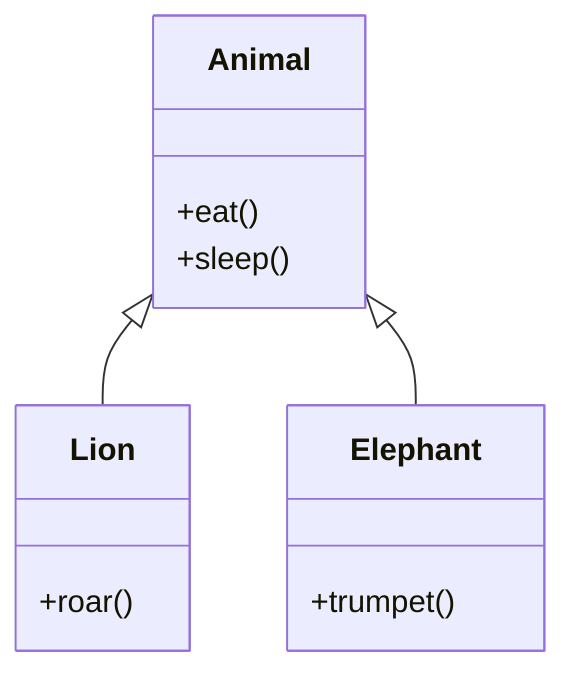
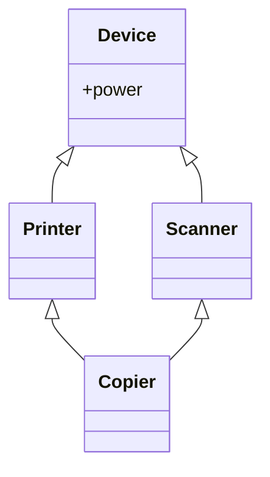

# 🧱 OOP من الصفر (Q1 → نهاية الملف)

> [!info] 📖 إزاي تذاكر الملف ده؟
> الملف ده بياخدك في رحلة متصلة بتغطي الأربع أعمدة الأساسية للـ OOP (Encapsulation, Inheritance, Polymorphism, Abstraction) وصولاً لمفاهيم متقدمة زي الـ Composition والـ Diamond Problem. كل سؤال هنا بيبني على اللي قبله، فامشي بالترتيب عشان تبني فهم متماسك من غير فجوات.

## Q1 — إيه الـ Object-Oriented Programming أصلاً وإيه المشكلة اللي بيحلها مقارنة بالبرمجة الإجرائية (Procedural)؟

### أصل الحكاية
تخيل إنك بتدير مطعم. في البرمجة الإجرائية (Procedural Programming زي لغة C)، إنت بتتعامل مع المطعم ده كأنه لستة أوامر ورا بعض: "اطبخ الأكل"، "قدم الأكل"، "حاسب الزبون". الداتا (زي الفلوس، المكونات) مرمية في حتة، والـ Functions (الأوامر) مرمية في حتة تانية، وأي Function ممكن تلعب في أي داتا. ده شغال حلو في المشاريع الصغيرة، بس لما المطعم يكبر ويبقى سلسلة، هتلاقي الـ Functions دخلت في بعضها والداتا باظت (مثلاً function الطبخ خصمت من فلوس الخزنة بالغلط!).
هنا بيجي دور الـ Object-Oriented Programming (OOP). الـ OOP بيفكر في المطعم كأنه **كيانات (Objects)** بتتواصل مع بعض: "طباخ"، "جرسون"، "كاشير". كل كيان معاه الداتا بتاعته (الـ State) ومحدش يقدر يغيرها غيره عن طريق أفعاله (الـ Behavior). الـ OOP بيحل مشكلة الـ "Spaghetti Code" وبيخلي الكود مترتب، سهل يتعدل، وسهل تعيد استخدامه، لأنه بيجمع الداتا والـ Functions اللي بتشتغل عليها في كبسولة واحدة.

عشان نفهم الفكرة، خلينا نشوف إزاي بنعبر عن "موظف" ككيان مستقل بدل ما يكون مجرد شوية متغيرات متطورة.

#### مثال 1: البرمجة الإجرائية (Procedural)
في الـ Procedural، الداتا والـ Functions مفصولين عن بعض، وأي حد ممكن يبوظ الداتا.
```java
// Procedural Approach
public class Main {
    public static void main(String[] args) {
        // Data is separate
        String employeeName = "Ahmed";
        double employeeSalary = 5000;
        
        // Anyone can modify the data directly
        employeeSalary = -1000; // Oops! Invalid state
        
        // Passing data to standalone functions
        printEmployee(employeeName, employeeSalary);
    }
    
    static void printEmployee(String name, double salary) {
        System.out.println(name + " makes " + salary);
    }
}
```

#### مثال 2: الحل السحري بالـ OOP
في الـ OOP، الموظف بيبقى Object جواه الداتا بتاعته والـ Functions اللي بتتحكم فيها.
```java
// OOP Approach
class Employee {
    // Data is hidden and bundled
    private String name;
    private double salary;
    
    public Employee(String name, double salary) {
        this.name = name;
        setSalary(salary); // Validation happens here
    }
    
    public void setSalary(double salary) {
        if (salary >= 0) {
            this.salary = salary;
        }
    }
    
    // Behavior is bundled with data
    public void printInfo() {
        System.out.println(this.name + " makes " + this.salary);
    }
}

public class Main {
    public static void main(String[] args) {
        Employee emp = new Employee("Ahmed", 5000);
        emp.setSalary(-1000); // Ignored, state remains safe
        emp.printInfo();
    }
}
```

### الفايدة الانترفيوية
**Question:** "What is Object-Oriented Programming, and what main problems does it solve compared to Procedural Programming?"

**الإجابة المثالية:**
الـ Object-Oriented Programming (OOP) هو paradigm (نمط تفكير) بيعتمد على تجميع الـ data (الـ state) والـ methods (الـ behavior اللي بيعدل على الداتا دي) جوه وحدة واحدة اسمها الـ Object. ده بيحل مشكلتين أساسيتين في الـ Procedural Programming: أولاً، بيحل مشكلة الـ global data اللي أي function ممكن تعدل فيها بشكل عشوائي، عن طريق الـ Encapsulation. ثانياً، بيحل مشكلة الـ code duplication والـ maintenance nightmare في المشاريع الكبيرة عن طريق إنه بيقسم النظام لـ objects مستقلة (modular) بتتواصل مع بعض من خلال interfaces واضحة، وده بيسهل الـ scalability وإعادة استخدام الكود (Reusability).

> [!tip] Checkpoint
> لو الداتا مفصولة عن الدوال اللي بتشغلها = Procedural.
> لو الداتا والدوال متجمعين في كيان واحد بيحمي نفسه = OOP.

---

## Q2 — إيه الفرق بين الـ Class والـ Object؟ (الـ blueprint مقابل الـ instance)

### أصل الحكاية
زي ما شفنا في Q1 إننا بنبني النظام على شكل "كيانات"، محتاجين طريقة نوصف بيها الكيانات دي. تخيل إنك مهندس معماري وعايز تبني مجمع سكني. إنت بترسم **رسمة هندسية (Blueprint)** للفيلا: فيها كام أوضة، لونها إيه، ومساحتها كام. الرسمة دي على الورق، متعرفش تسكن فيها. دي هي الـ **Class**.
أما لما تجيب مقاول ويبني الفيلا دي على أرض الواقع، ويسلمك المفتاح، الفيلا الحقيقية دي هي الـ **Object** (أو بنسميه Instance). ممكن تبني من نفس الرسمة (الـ Class) ميت فيلا (Objects)، كل فيلا ليها عنوان مختلف ولون مختلف (State)، بس كلهم ليهم نفس التصميم الأساسي.
ببساطة، الـ Class هو مجرد "فكرة" أو "وصف" موجود في الكود (Compile-Time)، لكن الـ Object هو "نسخة حقيقية" متخزنة في الميموري وبتاخد مساحة وبتشتغل (Runtime).

خلينا نشوف إزاي بنترجم الرسمة دي لكود.

#### مثال 1: تعريف الـ Class (الرسمة)
هنا إحنا بنوصف العربية شكلها إيه وبتعمل إيه، بس مفيش عربية حقيقية اتخلقت لسه. مفيش ميموري اتسحبت للبيانات دي.
```java
// The Blueprint (Class)
class Car {
    // Attributes (State)
    String color;
    int maxSpeed;
    
    // Behavior
    void drive() {
        System.out.println("Driving at max speed: " + maxSpeed);
    }
}
```

#### مثال 2: خلق الـ Objects (الفيلات الحقيقية)
لما بنستخدم كلمة `new`، إحنا بنقول للـ JVM "ابنيلي نسخة حقيقية من الرسمة دي في الميموري".
```java
public class Main {
    public static void main(String[] args) {
        // Creating Instance 1
        Car myCar = new Car();
        myCar.color = "Red";
        myCar.maxSpeed = 200;
        
        // Creating Instance 2 from the same Class
        Car policeCar = new Car();
        policeCar.color = "Black";
        policeCar.maxSpeed = 250;
        
        myCar.drive();      // Output: Driving at max speed: 200
        policeCar.drive();  // Output: Driving at max speed: 250
    }
}
```

### الفايدة الانترفيوية
**Question:** "What is the difference between a Class and an Object?"

**الإجابة المثالية:**
الـ Class هو blueprint أو template منطقي بيوصف الـ state (الـ attributes) والـ behavior (الـ methods) اللي هتكون موجودة في الكيانات اللي من النوع ده، وهو مابياخدش أي مساحة من الـ memory (باستثناء الـ metadata بتاعته). أما الـ Object فهو physical reality أو instance من الـ Class ده، بيتم خلقه وقت الـ runtime، بياخد مساحة فعلية في الـ heap memory، وكل Object بيكون ليه الـ unique state الخاصة بيه المستقلة عن الـ Objects التانية اللي مبنية من نفس الـ Class.

> [!warning]
> كتير من المبتدئين بيتلخبطوا ويقولوا إن الـ Class بيخزن داتا. الـ Class (إلا لو فيه static variables) مبيخزنش داتا فعلية، ده مجرد "قالب" بيحدد الداتا اللي هتتخزن لما تعمل Object.

---

## Q3 — إزاي تعرّف Class في Java وC++ وتعمل منه Object؟ 

### أصل الحكاية
بعد ما عرفنا في Q2 الفرق بين الـ Class والـ Object، تعال نشوف إزاي بنكتب ده كودياً. اللغات الـ Strongly Typed زي Java وC++ ليهم طرق مختلفة شوية في خلق الـ Objects والتعامل مع الميموري. 
في Java، الميموري متديرة بشكل كامل (Managed Memory) عن طريق الـ Garbage Collector. فأي Object بتخلقه لازم يكون باستخدام كلمة `new` وبيترمي دايماً في منطقة في الميموري اسمها الـ **Heap**.
لكن في C++، اللغة بتديك الحرية الكاملة (ومعاها المسئولية). إنت ممكن تخلق الـ Object على الـ **Stack** (وهنا بيتدمر تلقائياً أول ما الـ scope يخلص)، أو تخلقه على الـ **Heap** باستخدام كلمة `new` (وهنا إنت اللي لازم تدمره بإيدك باستخدام `delete` عشان ميحصلش Memory Leak). 

الكمبايلر في C++ بيفكر: "إنت اللي سايق، قولي عايز الـ Object فين بالظبط". أما في Java بيقولك: "ريح دماغك، أنا هحطه في الـ Heap وهنضف وراك".

خلينا نشوف الفرق الجوهري في الكود.

#### مثال 1: خلق الـ Object في Java (الطريقة الوحيدة)
في Java، الـ Variable نفسه بيكون مجرد "Reference" (زي الريموت كنترول) بيشاور على الـ Object اللي عايش في الـ Heap.
```java
// Java
class User {
    String name;
    
    void login() {
        System.out.println(name + " logged in");
    }
}

public class Main {
    public static void main(String[] args) {
        // 'user1' is a reference, the actual object is created on the Heap
        User user1 = new User();
        user1.name = "Ali";
        user1.login();
        // Object will be automatically garbage-collected when no longer referenced
    }
}
```

#### مثال 2: خلق الـ Object في C++ (Stack vs Heap)
في C++، عندك طريقتين. لو معملتش `new`، الـ Object بيتخلق محلياً زي أي متغير عادي. لو عملت `new`، بيرجعلك Pointer.
```cpp
// C++
#include <iostream>
#include <string>

class User {
public: // Access modifiers work differently here
    std::string name;
    
    void login() {
        std::cout << name << " logged in\n";
    }
};

int main() {
    // 1. Stack Allocation (Automatic)
    // Fast, auto-destroyed when 'main' ends
    User stackUser; 
    stackUser.name = "Omar";
    stackUser.login(); // Access using dot (.)
    
    // 2. Heap Allocation (Dynamic)
    // Slower, survives scope end, must be manually deleted
    User* heapUser = new User();
    heapUser->name = "Sara"; // Access using arrow (->) because it's a pointer
    heapUser->login();
    
    // If we don't delete it, we get a memory leak!
    delete heapUser; 
    
    return 0;
}
```

| وجه المقارنة | Java | C++ |
| :--- | :--- | :--- |
| **مكان التخزين الافتراضي للـ Objects** | Heap دايماً (باستثناء الـ primitives) | Stack أو Heap (حسب اختيارك) |
| **استخدام كلمة `new`** | إجباري لخلق Object | اختياري (فقط لو عايز تخصيص في الـ Heap) |
| **الوصول لأعضاء الـ Object** | نقطة `.` دايماً | `.` للـ Stack، وسهم `->` للـ Pointers |
| **تنظيف الميموري** | أوتوماتيك (Garbage Collector) | يدوي للـ Heap (عن طريق `delete`) |

### الفايدة الانترفيوية
**Question:** "How does Object allocation differ between Java and C++?"

**الإجابة المثالية:**
في Java، كل الـ Objects (ما عدا الـ primitive types) بيتم تخصيصها حصرياً على الـ Heap باستخدام الكلمة المحجوزة `new`، والـ variables بتكون مجرد references بتشاور عليها. والـ Memory management بيتم بشكل أوتوماتيكي عن طريق الـ Garbage Collector. 
على العكس، في C++ المبرمج عنده التحكم الكامل؛ يقدر يخصص الـ Object على الـ Stack (كـ local variable) وده بيتمسح أوتوماتيك بمجرد خروجه من الـ scope، أو يقدر يخصصه ديناميكياً على الـ Heap باستخدام `new`، وده بيرجع pointer، وبيفرض على المبرمج إنه يحرر الميموري دي يدوياً باستخدام `delete` لتجنب الـ Memory Leaks.

> [!danger]
> لو كتبت `User user1;` في Java (جوا method)، ده مش معناه إنك خلقت Object على الـ Stack زي C++! ده معناه إنك عملت Reference فاضي (بيشاور على null) ومفيش أي Object اتخلق أصلاً.

---

## Q4 — إيه الـ Constructor وإيه دوره؟ وإيه الـ Default Constructor والـ Parameterized Constructor؟

### أصل الحكاية
تخيل إنك بتفتح حساب في البنك. الموظف مش بيديك حساب "فاضي" ملوش صاحب أو ملوش رقم، لازم وإنت بتفتح الحساب تديله اسمك ورقم بطاقتك عشان "يهيأ" الحساب ويبقى جاهز للاستخدام. 
الـ Constructor هو "الموظف" ده. أول ما بتستخدم كلمة `new` عشان تخلق Object جديد، الـ Constructor بينط فوراً يشتغل. وظيفته الأساسية هي الـ **Initialization** (تهيئة الـ Object)، يعني بيدي الـ attributes بتاعتك قيم ابتدائية عشان الـ Object ميتولدش بمعلومات بايظة أو ناقصة.
الكمبايلر بيفكر: "عشان أعتمد إن الـ Object ده سليم وقابل للاستخدام، لازم أعديه على دالة خاصة اسمها على نفس اسم الـ Class بالظبط وملهاش return type".

لو إنت مكتبتش Constructor خالص، الكمبايلر بيعمل واحد من وراك اسمه الـ **Default Constructor** (بيكون فاضي وبيدي قيم افتراضية زي 0 للأرقام وnull للـ references). بس لو إنت كتبت أي Constructor بنفسك (زي Parameterized Constructor بياخد داتا)، الكمبايلر بيسحب الهدية بتاعته ومبيعملش الـ Default، ولازم إنت تكتبه لو محتاجه.

#### مثال 1: الـ Default Constructor الخفي
لو مكتبناش حاجة، الكمبايلر بيظبط الدنيا.
```java
class BankAccount {
    double balance; // Defaulted to 0.0 by Java
    
    // The compiler silently adds this if you write NO constructors:
    // public BankAccount() { }
}

public class Main {
    public static void main(String[] args) {
        BankAccount acc = new BankAccount(); // Calls default constructor
        System.out.println(acc.balance); // Output: 0.0
    }
}
```

#### مثال 2: الـ Parameterized Constructor وفخ الهدية المسحوبة
لو حددنا إن الحساب لازم يتفتح برقم معين، مش هينفع نستخدم الـ Default اللي من غير parameters، إلا لو كتبناه بإيدنا.
```java
class BankAccount {
    String ownerName;
    double balance;
    
    // Parameterized Constructor
    public BankAccount(String name, double initialDeposit) {
        this.ownerName = name;
        this.balance = initialDeposit;
    }
}

public class Main {
    public static void main(String[] args) {
        // BankAccount acc1 = new BankAccount(); // ERROR! Default constructor no longer exists
        BankAccount acc2 = new BankAccount("Ali", 1000); // Correct
    }
}
```

### الفايدة الانترفيوية
**Question:** "What is a constructor, and what happens if you don't define one?"

**الإجابة المثالية:**
الـ Constructor هو special method ليه نفس اسم الـ Class ومفيش ليه return type، بيُستدعى أوتوماتيكياً وقت خلق الـ object عن طريق الـ `new` keyword. الغرض الأساسي منه هو تهيئة (Initialize) الـ state بتاعة الـ Object. لو المبرمج مكتبش أي Constructor في الـ Class، الـ Compiler بيوفر Default Constructor (no-arg constructor) بيعمل initialization للـ fields بقيمها الافتراضية. لكن لو المبرمج عرف أي Parameterized Constructor، الـ Compiler مابيوفرش الـ Default، ولازم المبرمج يكتبه بنفسه لو كان الكود محتاجه.

> [!warning]
> إياك تحط return type للـ Constructor (حتى `void`). لو عملت كده، الكمبايلر هيعتبره Method عادية جداً ليها نفس اسم الكلاس ومش هيشغله وقت خلق الـ Object!

---

## Q5 — إيه الـ Constructor Overloading وإزاي بيشتغل بمنطق الـ Compile-Time Polymorphism؟

### أصل الحكاية
نرجع لمثال البنك. ممكن زبون يجي يفتح حساب ويقول "أنا عايز أفتح حساب وأحط فيه 1000 جنيه"، وزبون تاني ييجي يقول "أنا هفتح حساب بس مش هحط فلوس دلوقتي، خليه بـ 0".
إنت كبنك لازم توفر "طريقتين" لفتح الحساب. في الـ OOP، بنعمل ده عن طريق الـ **Constructor Overloading**. يعني نكتب أكتر من Constructor في نفس الكلاس، كلهم ليهم نفس الاسم (اسم الكلاس)، بس بيختلفوا في "التوقيع" (Signature)، يعني بيختلفوا في عدد الـ Parameters أو أنواعها.

الكمبايلر وقت الـ Compilation بيبص على السطر اللي إنت بتعمل فيه `new`. لو باعت `String` و`double`، يربطه بالـ Constructor اللي بياخد `String` و`double`. لو مش باعت حاجة، يربطه بالـ Constructor الفاضي. عشان الربط ده بيحصل وإنت بتكتب الكود قبل التشغيل، ده بيعتبر مثال صريح على الـ **Compile-Time Polymorphism** (تعدد الأشكال في وقت الترجمة).

#### مثال: طرق مختلفة لفتح الحساب
```java
class BankAccount {
    String ownerName;
    double balance;
    
    // Constructor 1: Account with name and initial deposit
    public BankAccount(String name, double deposit) {
        this.ownerName = name;
        this.balance = deposit;
    }
    
    // Constructor 2: Account with just a name (balance defaults to 0)
    public BankAccount(String name) {
        this.ownerName = name;
        this.balance = 0.0;
    }
    
    // Constructor 3: Anonymous account
    public BankAccount() {
        this.ownerName = "Unknown";
        this.balance = 0.0;
    }
}

public class Main {
    public static void main(String[] args) {
        // Compiler dynamically binds the call to the matching signature
        BankAccount acc1 = new BankAccount("Sara", 500); // Calls Constructor 1
        BankAccount acc2 = new BankAccount("Omar");      // Calls Constructor 2
        BankAccount acc3 = new BankAccount();            // Calls Constructor 3
    }
}
```

### الفايدة الانترفيوية
**Question:** "What is Constructor Overloading and how is it related to Polymorphism?"

**الإجابة المثالية:**
الـ Constructor Overloading هو إننا نعرّف أكتر من Constructor في نفس الـ Class، بحيث يكون ليهم نفس الاسم بس بيختلفوا في الـ Parameter list (سواء العدد، أو النوع، أو الترتيب). ده بيوفر مرونة في خلق الـ Objects بطرق مختلفة حسب الداتا المتاحة. المفهوم ده مرتبط بالـ Polymorphism وتحديداً الـ Compile-Time Polymorphism (أو الـ Static Binding)، لأن الـ Compiler هو اللي بيحدد أنهي Constructor هيتم استدعاؤه وقت الـ Compilation بناءً على الـ arguments المبعوتة في الكود، مش وقت الـ Runtime.

> [!tip] Checkpoint
> الـ Overloading بشكل عام (سواء دالة عادية أو Constructor) دايماً بيتحل عن طريق الكمبايلر (Compile-Time).

---

## Q6 — إيه الـ Copy Constructor في C++ وليه Java معندهاش مفهوم مطابق ليه بنفس الشكل؟

### أصل الحكاية
تخيل إنك اشتريت عربية بمواصفات معينة (لون، ماتور، كماليات)، وعجبت صاحبك جداً، فراح لشركة العربيات وقالهم: "اعملولي نسخة طبق الأصل من عربية صاحبي دي". 
في C++، الـ Objects بتتنقل كتير كـ "قيمة" (Pass by Value)، يعني لو باصيت Object لـ Function، C++ بتعمل "نسخة" كاملة منه. عشان كده C++ وفرت حاجة اسمها **Copy Constructor**. ده Constructor مخصوص بياخد Object من نفس النوع كـ parameter، ووظيفته إنه ينسخ محتويات الـ Object القديم للـ Object الجديد اللي بيتخلق.

طب ليه Java معندهاش Copy Constructor بيشتغل أوتوماتيك؟ لأن في Java، الـ Variables هي مجرد References (زي ما شفنا في Q3). لما تباصي Object لـ Function في Java، إنت مابتنسخش الـ Object نفسه، إنت بتنسخ الـ Reference (الريموت) بس، فالاتنين بيشاوروا على نفس الـ Object في الميموري! لو حبيت تنسخ الـ Object في Java، لازم تعمل دالة زي `clone()` أو تكتب Copy Constructor وتندهله بإيدك `new Car(oldCar)`، لكنه مش جزء من الـ core mechanics زي في C++.

#### مثال 1: الـ Copy Constructor في C++ (بيشتغل ورا الكواليس)
C++ بتعمل Default Copy Constructor لوحدها، بس إنت ممكن تكتبه بإيدك لو محتاج Deep Copy.
```cpp
#include <iostream>
#include <string>

class Car {
public:
    std::string color;
    
    // Normal Constructor
    Car(std::string c) {
        color = c;
    }
    
    // Copy Constructor: takes a reference to another Car
    // The 'const' ensures we don't modify the original car
    Car(const Car& oldCar) {
        std::cout << "Copying car...\n";
        this->color = oldCar.color; // Copy the state
    }
};

void inspectCar(Car c) { // Pass by value triggers the Copy Constructor!
    std::cout << "Inspecting " << c.color << " car\n";
}

int main() {
    Car myCar("Red");
    
    // Copy Constructor called automatically here!
    Car friendsCar = myCar; 
    
    // Copy Constructor called automatically AGAIN here!
    inspectCar(myCar); 
    
    return 0;
}
```

#### مثال 2: التقليد اليدوي في Java
في Java، الـ assignment `=` مابينسخش الـ Object، ده بينسخ الـ Reference.
```java
class Car {
    String color;
    
    public Car(String color) {
        this.color = color;
    }
    
    // Java developers can manually write a Copy Constructor
    public Car(Car oldCar) {
        this.color = oldCar.color;
    }
}

public class Main {
    public static void main(String[] args) {
        Car myCar = new Car("Red");
        
        // This DOES NOT copy the object! Just a new remote to the same car.
        Car refCar = myCar; 
        
        // This ACTUALLY copies the object using our manual Copy Constructor
        Car newCar = new Car(myCar); 
    }
}
```

### الفايدة الانترفيوية
**Question:** "Explain the Copy Constructor in C++ and why it is essential, and contrast it with Java."

**الإجابة المثالية:**
الـ Copy Constructor في C++ هو Constructor بيُستدعى أوتوماتيكياً لما نيجي نعمل initialize لـ Object جديد باستخدام Object تاني من نفس النوع، وده بيحصل أساساً لأن C++ بتدعم الـ pass-by-value للـ Objects. لو الـ Object جواه Pointers بتشاور على dynamic memory، لازم المبرمج يكتب Custom Copy Constructor عشان يعمل Deep Copy بدل الـ Shallow Copy الافتراضي ويمنع الـ memory corruption.
في Java، مفيش pass-by-value للـ Objects (بنباصي الـ References بس by value)، فبالتالي مفيش احتياج لـ implicit Copy Constructor بيشتغل في الخلفية. لو احتجنا ننسخ Object في Java، بنلجأ لكتابة copy constructor يدوياً ونستدعيه صراحة بـ `new`، أو بنستخدم الـ `Cloneable` interface ودالة `clone()`.

> [!danger]
> في C++، لو نسيت تاخد الـ parameter بتاع الـ Copy Constructor كـ Reference `Car(Car oldCar)`، هيحصل Infinite Loop! لأن عشان يباصي `oldCar` by value، هيحتاج ينده الـ Copy Constructor تاني، واللي هينده نفسه تالت... وهكذا لحد ما الـ Stack يضرب! عشان كده لازم يتكتب `Car(const Car& oldCar)`.

---

## Q7 — إيه الـ Instance Variables (Fields) والـ Class Variables (`static` fields)؟ وإيه الفرق بينهم في الميموري؟

### أصل الحكاية
تخيل إنك في مدرسة، وكل طالب ليه "كراسة" بتاعته بيكتب فيها اسمه ودرجاته. الكراسة دي هي الـ **Instance Variable**. كل ما نعمل Object (طالب) جديد، بياخد كراسته الخاصة بيه في الميموري، ولو طالب غير درجاته، محدش غيره بيتأثر.
لكن تخيل إن فيه "سبورة" متعلقة في الفصل، كل الطلبة باصين عليها، ولو حد مسح اللي عليها وكتب حاجة جديدة، كل الفصل هيشوف التعديل ده. السبورة دي هي الـ **Class Variable** (أو الـ `static` field). 

الكمبايلر بيحجز مساحة للـ `static` variables مرة واحدة بس في الميموري (في منطقة الـ Method Area أو الـ Metaspace في Java) أول ما الـ Class يتعمله load، ومش محتاج تعمل أي Object عشان تستخدمها.

#### مثال: الكراسة مقابل السبورة
```java
class Student {
    // Instance Variable (Each object has its own copy in the Heap)
    String name; 
    
    // Class Variable (Static) (Only ONE copy exists for the whole class)
    static String schoolName = "Al-Nour High School";
    
    public Student(String name) {
        this.name = name;
    }
}

public class Main {
    public static void main(String[] args) {
        Student s1 = new Student("Ahmed");
        Student s2 = new Student("Sara");
        
        System.out.println(s1.name); // Ahmed
        System.out.println(s2.name); // Sara
        
        // They share the same school name
        System.out.println(Student.schoolName); // Al-Nour High School
        
        // If we change the static variable...
        Student.schoolName = "Future High School";
        
        // ... EVERYONE sees the change
        System.out.println(s1.schoolName); // Future High School (Bad practice to call static via instance, but valid)
        System.out.println(Student.schoolName); // Future High School (Correct way)
    }
}
```

### الفايدة الانترفيوية
**Question:** "What is the difference between Instance Variables and Static Variables in terms of memory and sharing?"

**الإجابة المثالية:**
الـ Instance variables هي خصائص مرتبطة بالـ Object (الـ instance) نفسه. كل Object بيتم خلقه بياخد نسخة مستقلة خاصة بيه في الـ Heap memory، وتعديل قيمة variable في Object مبيأثرش على الباقيين. 
أما الـ Static variables (Class variables) فهي مرتبطة بالـ Class ككل. بيتم حجز مكان واحد ليها في الميموري وقت الـ Class Loading، وكل الـ objects اللي من النوع ده بتشير (share) نفس المكان في الميموري. بنقدر نوصل للـ static variables عن طريق اسم الـ Class مباشرة من غير ما نحتاج نخلق أي Object.

> [!warning]
> الوصول للـ `static` field عن طريق اسم الـ object زي `s1.schoolName` بيشتغل في Java بس بيطلع Warning، لأنه بيخفي حقيقة إن المتغير ده ملوش علاقة بـ `s1` شخصياً. دايماً استخدم اسم الكلاس `Student.schoolName`.

---

## Q8 — إيه الـ `this` pointer/reference وليه محتاجينه جوا الـ Methods غير الـ Static؟

### أصل الحكاية
تخيل إنك واقف في وسط مجموعة من صحابك، وواحد قال "أنا عطشان". كلمة "أنا" دي بتشير للشخص اللي بيتكلم في اللحظة دي. 
في الـ OOP، لما تعمل 10 عربيات، كلهم بيستخدموا نفس الكود بتاع دالة `drive()` اللي موجود في الكلاس. لما دالة `drive()` تقول "زود السرعة بتاعتي"، الكمبايلر هيسألها: "سرعة مين بالظبط؟ العربية الأولى ولا التانية؟"
عشان كده، أي دالة عادية (Instance Method) بيتبعتلها باراميتر خفي ورا الكواليس اسمه `this`. الـ `this` ده بيشاور على الـ Object اللي نده الدالة في اللحظة دي ("أنا"). 
بنستخدمه صراحة لما نكون محتاجين نفرق بين Instance Variable و Parameter ليهم نفس الاسم (Variable Shadowing)، أو لو عايزين نباصي الـ Object الحالي لدالة تانية.

في Java اسمه `this` reference وبنستخدمه بـ `.` (`this.name`)، وفي C++ هو Pointer وبنستخدمه بـ `->` (`this->name`).

#### مثال: استخدام `this` لفك الاشتباك (Shadowing)
```java
class Employee {
    String name;
    
    public Employee(String name) {
        // Without 'this', the compiler thinks you're assigning the parameter to itself
        // name = name; // Bug!
        
        // 'this.name' means the object's variable. 'name' means the parameter.
        this.name = name; 
    }
    
    public void printInfo() {
        // Compiler implicitly adds 'this.' here
        System.out.println("My name is " + name); 
    }
}
```

#### مثال 2: C++ `this` pointer
```cpp
class Employee {
public:
    std::string name;
    
    Employee(std::string name) {
        // In C++, 'this' is a pointer, so we use the arrow operator
        this->name = name;
    }
};
```

### الفايدة الانترفيوية
**Question:** "What is the 'this' keyword, and what are its common use cases?"

**الإجابة المثالية:**
الـ `this` keyword هو implicit reference (أو pointer في C++) بيتم تمريره أوتوماتيكياً لأي instance method، وبيشير للـ current object اللي استدعى الـ method دي. الـ use cases الأساسية ليه هي:
1. حل مشكلة الـ Variable Shadowing: لما يكون الـ method parameter ليه نفس اسم الـ instance variable.
2. استدعاء constructor تاني في نفس الـ class (باستخدام `this()` في Java).
3. تمرير الـ current object كـ argument لـ method في كلاس تاني (`someMethod(this)`).
4. إرجاع الـ current object من الـ method (`return this;`) لتحقيق الـ Method Chaining.

> [!danger]
> مستحيل تستخدم `this` جوا `static` method! لأن الـ `static` method بتنتمي للكلاس وممكن تشتغل من غير ما يكون فيه أي Object أساساً، فـ "أنا" ساعتها ملهاش معنى.


# 📌 الموضوع 2: Encapsulation

## Q13 — إيه الـ Encapsulation وإيه المشكلة اللي بيحلها؟

### أصل الحكاية
تخيل إنك بتستخدم ماكينة ATM. الماكينة دي جواها فلوس (State)، وإنت كعميل بتتعامل معاها. هل ينفع البنك يسيب درج الفلوس مفتوح ويقولك "مد إيدك خد الـ 1000 جنيه بتوعك واخصمهم من رصيدك في الدفتر"؟ مستحيل! أي حد ممكن يسرق أو يغلط. البنك بيقفل على الفلوس بحديد (Data Hiding)، وبيديك "شاشة وزراير" (Public Interface) تتعامل معاهم. الشاشة دي بتأكد إن معاك باسورد، وإن رصيدك يسمح، وبعدين هي اللي بتفتح الدرج تديك الفلوس وتخصم من الرصيد.

الـ **Encapsulation** (الكبسلة) هو نفس الفكرة في الـ OOP. المشكلة اللي بيحلها هي الـ "عك" اللي بيحصل لما أي جزء في الكود يقدر يعدل على الـ State بتاعة Object بشكل مباشر (زي ما شوفنا في Q1). الكبسلة بتعمل حاجتين:
1. بتجمع الداتا والـ Functions اللي بتشغلها في كبسولة واحدة (الـ Class).
2. بتخفي الداتا الحساسة (تخليها `private`) وتجبر العالم الخارجي إنه يتعامل معاها من خلال قنوات شرعية (Methods `public` زي الـ Getters والـ Setters).

#### مثال: بنك بدون كبسلة (كارثة)
```java
class BankAccount {
    // PUBLIC state! Anyone can touch it!
    public double balance; 
}

public class Main {
    public static void main(String[] args) {
        BankAccount acc = new BankAccount();
        acc.balance = 5000;
        
        // A hacker or a buggy piece of code can do this:
        acc.balance = 1000000; // Unlimited money!
    }
}
```

#### مثال 2: بنك بالكبسلة (محمي)
```java
class BankAccount {
    // PRIVATE state! Locked inside the object
    private double balance; 
    
    public BankAccount(double initialBalance) {
        if (initialBalance >= 0) {
            this.balance = initialBalance;
        }
    }
    
    // PUBLIC interface: The only way to interact with the money
    public void deposit(double amount) {
        if (amount > 0) { // Validation logic
            this.balance += amount;
        }
    }
    
    public void withdraw(double amount) {
        if (amount > 0 && this.balance >= amount) { // Validation logic
            this.balance -= amount;
        }
    }
    
    public double getBalance() {
        return this.balance;
    }
}
```

### الفايدة الانترفيوية
**Question:** "What is Encapsulation and why is it important?"

**الإجابة المثالية:**
الـ Encapsulation هو واحد من الأعمدة الأربعة للـ OOP، معناه تجميع الـ data (fields) والـ methods اللي بتشتغل على الداتا دي في وحدة واحدة (Class)، مع إخفاء التفاصيل الداخلية للـ object عن العالم الخارجي (Data Hiding). أهميته بتكمن في حماية الـ object state من التعديل العشوائي أو الغير صالح (Invalid state)، وبيقدم public API واضحة ومُتحكم فيها للتعامل مع الـ object، وده بيسهل صيانة الكود وتغيير الـ implementation الداخلي مستقبلاً بدون ما نأثر على الأكواد التانية اللي بتستخدم الكلاس ده.

> [!tip] Checkpoint
> الكبسلة = تجميع (Bundling) + إخفاء (Hiding) + تحكم (Control).

---

## Q14 — إيه مستويات الوصول `public`، `protected`، `private` في Java وC++؟ وإيه الفرق الدقيق في معنى `protected` بين اللغتين؟

### أصل الحكاية
عشان نطبق الكبسلة اللي شرحناها في Q13، اللغات بتوفرلنا "أقفال" بنركبها على الداتا والـ Functions بتاعتنا. الأقفال دي اسمها Access Modifiers.
- `private`: "محدش هيشوف الحاجة دي غيري أنا بس (جوا الكلاس ده فقط)".
- `public`: "الحاجة دي مشاع، أي كلاس في أي مكان يقدر يشوفها ويستخدمها".

طيب وإيه الـ `protected`؟ هنا بقى في فرق دقيق بين اللغتين بيوقع ناس كتير في الإنترفيو:
في **C++**، `protected` معناها: "الحاجة دي متشافة جوا الكلاس ده بس، وجوا الكلاسات اللي **بتورث** منه بس (الأبناء)". يعني لو كلاس غريب ملوش علاقة وراثة، مش هيقدر يشوفها.
في **Java**، `protected` أوسع شوية، معناها: "الحاجة دي متشافة جوا الكلاس ده، وجوا الكلاسات اللي بتورث منه، **وكمان جوا أي كلاس قاعد معايا في نفس الـ Package (الفولدر)** حتى لو مش بيورث مني!"

#### مثال: الفرق في الـ protected
```java
// Java
package banking;

public class Account {
    protected double balance; // Accessible to subclasses AND anything in 'banking' package
}

class Teller {
    void doWork(Account acc) {
        // Works in Java because Teller is in the same package!
        // In C++, this would be a compilation error unless Teller inherits from Account or is a 'friend'.
        acc.balance = 500; 
    }
}
```

### الفايدة الانترفيوية
**Question:** "What is the difference between private, protected, and public modifiers, especially regarding 'protected' in Java vs C++?"

**الإجابة المثالية:**
الـ `private` بيحصر الوصول داخل الـ Class نفسه فقط، والـ `public` بيسمح بالوصول من أي مكان. الـ `protected` هو حل وسط، في C++ بيسمح بالوصول داخل الـ Class وفي الـ Subclasses (الكلاسات الوارثة) فقط، بغض النظر عن مكانهم. لكن في Java، الـ `protected` بيضيف مستوى إضافي من الوصول، فهو بيسمح بالوصول داخل الـ Class، وفي الـ Subclasses (حتى لو في packages مختلفة)، بالإضافة لأي class تاني موجود في نفس الـ Package (حتى لو مش subclass).

> [!warning]
> كتير بيفتكروا إن `protected` في Java معناه للـ subclasses بس. ده غلط شائع! لو عايز حاجة للـ subclasses بس في Java ومش عايز الكلاسات اللي في نفس الـ package تشوفها... للأسف Java مفهاش Modifier بيعمل كده بالظبط!

---

## Q15 — إيه الـ Package-Private (Default Access) في Java وليه معندوش مكافئ مباشر في C++؟

### أصل الحكاية
زي ما قلنا، Java منظمة في شكل Packages (مجلدات). ساعات بتبني نظام كامل (زي نظام بنكي) مكون من 5 كلاسات كلهم في نفس الفولدر. إنت عايز الكلاسات دي تتكلم مع بعضها بحرية وتشوف داتا بعض، بس في نفس الوقت مش عايز أي كود بره الفولدر ده يشوف الداتا دي.
عشان كده Java عملت الـ **Default Access** (أو Package-Private). ده اللي بيحصل لما **ماتكتبش** أي access modifier (لا public ولا private ولا protected). 
معناه: "الحاجة دي متشافة جوا الـ Package بتاعتي بس. أي حد برا الفولدر ده ميشوفهاش، حتى لو ورث مني!"

C++ معندهاش مفهوم الـ Packages بنفس الشكل، الكود بيتجمع كـ Translation Units عن طريق الـ `#include`. عشان كده C++ معندهاش modifier اسمه "مسموح في نفس الفولدر بس". لو عايز كلاسات معينة تشوف داتا خاصة في C++، بتستخدم الـ `friend` keyword.

#### مثال: الـ Package-Private في Java
```java
package banking;

class Vault {
    // No modifier = Package-Private
    int secretCode = 1234; 
}

class Manager {
    void checkVault() {
        Vault v = new Vault();
        // Allowed because Manager and Vault are in the same package
        System.out.println(v.secretCode); 
    }
}
```
لو كلاس في package تانية زي `package marketing;` حاول يوصل لـ `secretCode`، الكمبايلر هيضربه.

### الفايدة الانترفيوية
**Question:** "What is the default access modifier in Java and how does it restrict visibility?"

**الإجابة المثالية:**
في Java، لو المبرمج محددش Access Modifier صريح، الـ member بياخد الـ Default access (أو اللي بيتسمى Package-Private). المستوى ده بيسمح للـ class members إنها تتشاف وتُستخدم بحرية بواسطة أي class تاني موجود داخل نفس الـ Package، لكنها بتكون مخفية تماماً (غير مرئية) لأي class خارج الـ Package، حتى لو الـ class الخارجي ده بيورث (extends) من الكلاس بتاعنا. الميزة دي بتساعد في بناء APIs نظيفة بحيث نخفي التفاصيل الداخلية للـ subsystem عن بقية البرنامج.

> [!tip] Checkpoint
> ترتيب الحماية في Java من الأقوى للأضعف:
> `private` ⬅️ Default (Package) ⬅️ `protected` ⬅️ `public`.

---

## Q16 — إيه الفرق بين طريقة كتابة الـ Access Modifiers في Java وC++؟

### أصل الحكاية
طريقة التفكير في شكل الكود مختلفة بين اللغتين. 
في **Java**، الأمان هو الأساس. المبدأ هو: "كل متغير أو دالة لازم يتكتب جنبها صراحة هي نوعها إيه، وإلا هتاخد الـ Default". ده بيخلي الكود مقروء جداً سطر بسطر.
في **C++**، الفلسفة هي "السرعة في الكتابة والتنظيم كبلوكات". بتفتح "قسم" (Section) وتقول: "كل اللي جاي ده public"، وتفضل تكتب، لحد ما تفتح قسم تاني وتقول: "كل اللي جاي ده private".

#### مثال 1: Java (Modifier per member)
```java
public class User {
    private String name;
    private int age;
    
    public void login() { }
    public void logout() { }
}
```

#### مثال 2: C++ (Modifier as sections)
```cpp
class User {
private: // Section starts
    std::string name;
    int age;
    // Everything here is private

public: // Section starts
    void login() { }
    void logout() { }
    // Everything here is public
}; // Notice the semicolon at the end of class in C++!
```

### الفايدة الانترفيوية
**Question:** "How does the syntax of access modifiers differ between Java and C++?"

**الإجابة المثالية:**
في Java، الـ Access modifiers (زي `private`, `public`) بتُطبق على مستوى الـ member الفردي (per-member basis)، يعني كل field أو method لازم يسبقها الـ modifier بتاعها صراحة، وإلا هتاخد الـ default. أما في C++، الـ Access modifiers بتُستخدم كـ Labels (متبوعة بـ `:`) عشان تقسم الـ Class لـ Sections، وكل الـ members اللي بتتعرف تحت Label معين بتاخد الـ access level ده لحد ما يظهر Label تاني يغيره.

> [!danger]
> في C++، لو مكتبتش أي حاجة خالص في أول الكلاس، الـ Default بيكون `private`! (عكس `struct` اللي الـ Default فيه بيكون `public`).

---

## Q17 — إيه الـ Getters والـ Setters وليه بنستخدمهم بدل الوصول المباشر للـ Fields؟

### أصل الحكاية
لو عندنا `private int age;`، محدش هيقدر يقرا سن الموظف ولا يعدله من بره. الكبسلة قفلت الباب تماماً. بس إحنا محتاجين العالم الخارجي يتفاعل مع الموظف!
الحل هو إننا نعمل "شباك تذاكر" محكوم. الـ **Getter** هو دالة `public` بترجع قيمة المتغير بس، عشان الناس تقرا من غير ما تبوظ. والـ **Setter** هو دالة `public` بتاخد قيمة جديدة، بس **بتفلترها** الأول (Validation) قبل ما تسجلها.
ليه منخليش المتغير `public` ونوفر السطرين دول؟ 
1. **Validation**: الـ Setter بيمنع القيم الغلط (زي سن بالسالب).
2. **Read-Only**: ممكن تعمل Getter وماتعملش Setter، فكده المتغير بقى للقراءة فقط من بره.
3. **Future Changes**: لو غيرت اسم المتغير جوا الكلاس أو طريقة حسابه، مش هتحتاج تعدل كل الكود اللي بره، لأنهم بيندهوا الدالة اللي اسمها ثابت.

#### مثال: القوة الحقيقية للـ Getters / Setters
```java
class Employee {
    private int age; // Hidden state
    
    // Getter: Allows read access
    public int getAge() {
        return this.age;
    }
    
    // Setter: Allows controlled write access
    public void setAge(int age) {
        // Validation logic! You can't do this with a public field.
        if (age >= 18 && age <= 60) {
            this.age = age;
        } else {
            System.out.println("Invalid age for employment!");
        }
    }
}
```

### الفايدة الانترفيوية
**Question:** "Why use getters and setters instead of making fields public?"

**الإجابة المثالية:**
استخدام الـ Getters والـ Setters بيحقق مبدأ الـ Encapsulation. أولاً، بيسمحوا باضافة Validation logic قبل تعديل الـ state (عن طريق الـ setters) عشان نضمن إن الـ object دايماً في valid state. ثانياً، بيسمحوا بإننا نخلي الـ field للقراءة فقط (read-only) بإننا نوفر getter بس. ثالثاً، بيحافظوا على الـ API contract مع العالم الخارجي؛ فلو قررنا نغير طريقة تخزين أو حساب الـ field داخلياً مستقبلاً، هنغير الـ implementation جوا الكلاس من غير ما نكسر الـ code بتاع أي client بيستخدم الكلاس ده.

> [!warning]
> لو عملت private fields وبعدين عملت Generate لـ Getters و Setters لكل حاجة من غير أي Validation أو قيود، إنت كده معملتش كبسلة حقيقية! إنت بس طولت الكود على الفاضي (Anemic Domain Model).

---

## Q18 — إيه فايدة الـ Encapsulation في تقليل الـ Coupling بين أجزاء النظام؟

### أصل الحكاية
الـ **Coupling** (الارتباط) هو مدى اعتماد كلاس (أ) على تفاصيل كلاس (ب). لو كلاس (أ) عارف كل صغيرة وكبيرة جوا (ب) (بيقرا المتغيرات بتاعته مباشرة)، بنسمي ده **Tight Coupling** (ارتباط وثيق). المشكلة إنك لو جيت تصلح حاجة في (ب)، كلاس (أ) هيضرب وتضطر تعدله هو كمان! عامل زي الترسين المعشقين في بعض بشدة، لو غيرت سنة في ترس لازم تغير الترس التاني.

الـ Encapsulation بيحل ده وإنه بيعمل **Loose Coupling**. كلاس (ب) بيخفي تفاصيله جوه (`private`) وبيقول لـ (أ): "عايز مني حاجة؟ اطلبها من الدالة دي (`public method`) ومالكش دعوة أنا بنفذها إزاي". 
بالتالي، (أ) معتمد على "اسم الدالة" بس، مش على "المتغيرات الداخلية". لو (ب) غير المتغيرات دي من جوه، (أ) مش هيحس بحاجة خالص.

#### مثال: Tight vs Loose Coupling
```java
// TIGHT COUPLING (Bad)
class Order {
    public double price;
    public double taxRate;
}

class InvoicePrinter {
    void print(Order o) {
        // The printer does the math itself. It knows too much about Order's internals!
        double total = o.price + (o.price * o.taxRate); 
        System.out.println("Total: " + total);
    }
}

// LOOSE COUPLING (Good via Encapsulation)
class EncapsulatedOrder {
    private double price;
    private double taxRate;
    
    // The Order handles its own math. The details are hidden.
    public double calculateTotal() {
        return price + (price * taxRate);
    }
}

class SmartInvoicePrinter {
    void print(EncapsulatedOrder o) {
        // Printer just asks for the total. If tax logic changes, Printer code won't change!
        System.out.println("Total: " + o.calculateTotal());
    }
}
```

### الفايدة الانترفيوية
**Question:** "How does Encapsulation help in reducing Coupling?"

**الإجابة المثالية:**
الـ Encapsulation بيخفي الـ internal implementation details للـ Class (الـ data structures والـ algorithms الداخلية) عن بقية النظام (Data Hiding). ده بيخلي الـ interacting classes تعتمد فقط على الـ public methods (الـ API) المتاحة، مش على الـ internal state المباشرة. الاعتماد على الـ interface بدل الـ implementation بيؤدي لـ Loose Coupling، وده معناه إننا نقدر نعدل، نحسن، أو نصلح أخطاء داخل الـ Class بحرية تامة من غير ما نكسر الـ code بتاع الكلاسات التانية اللي بتعتمد عليه.

---

## Q19 — إيه الفرق بين Data Hiding والـ Abstraction؟ (سؤال بيتلخبط فيه ناس كتير)

### أصل الحكاية
الكلمتين دول بيستخدموا أحياناً كأنهم نفس الحاجة، بس هما مختلفين في الزاوية اللي بتبص منها:
**Data Hiding (المرتبط بالـ Encapsulation):** هو اللي بيجاوب على سؤال **"إزاي أمنعك تبوظ الحاجة دي؟"** (عن طريق الـ `private`). هو بيركز على حماية الداتا والأمان الداخلي للسيستم.
**Abstraction (التجريد):** هو اللي بيجاوب على سؤال **"إزاي أسهل عليك استخدام الحاجة دي؟"** (عن طريق إخفاء التعقيد). هو بيركز على تقديم "واجهة بسيطة" للمستخدم وإخفاء تفاصيل "إزاي بتشتغل من جوه".

تخيل التكييف:
- إنك تقفل على الأسلاك والماتور والكارته بغطاء بلاستيك عشان محدش يتكهرب أو يبوظهم ⬅️ ده **Data Hiding**.
- إنك تدي للمستخدم ريموت فيه زرار واحد مكتوب عليه "تبريد" بدل ما تخليه يضبط سرعة المروحة وقوة الكباس يدوياً ⬅️ ده **Abstraction**.

### الفايدة الانترفيوية
**Question:** "What is the distinction between Data Hiding (Encapsulation) and Abstraction?"

**الإجابة المثالية:**
الـ Data Hiding (كجزء من الـ Encapsulation) بيركز على **الحماية (Security and State Integrity)** عن طريق إخفاء الـ internal state باستخدام الـ access modifiers زي `private` عشان يمنع التعديل المباشر والغير مصرح بيه. 
أما الـ Abstraction فبيركز على **التبسيط (Simplification and Design)** عن طريق إخفاء التعقيد الداخلي للـ implementation وتقديم interface بسيطة وواضحة للي بيستخدم الكلاس، بحيث يركز على الـ *What it does* (بتعمل إيه) مش الـ *How it does it* (بتعملها إزاي). باختصار: الكبسلة بتخفي الداتا للحماية، والتجريد بيخفي التعقيد للتبسيط.

---

## Q20 — إيه الـ Friend Functions/Classes في C++ وإزاي بتكسر الـ Encapsulation عمداً لغرض معين؟ وليه Java مالهاش مفهوم مشابه؟

### أصل الحكاية
ساعات في C++، بتكون كاتب كلاس وعامله `private` بالكامل ومتقفل عليه. بس بيظهر كلاس تاني (أو Function) محتاج يدخل جوا الكلاس ده عشان يعمل عملية معينة بسرعة وكفاءة من غير ما يعدي على الـ Getters والـ Setters (أو عشان عملية زي الـ Operator Overloading). 
هنا C++ بتديك رخصة استثنائية اسمها **`friend`**. الكلاس (أ) بيعلن صراحة إن الكلاس (ب) أو الدالة الفلانية هما "أصدقاء"، وبالتالي يقدروا يفتحوا الباب ويشوفوا ويعدلوا في الـ `private` variables بتاعته!

ده **كسر صريح للـ Encapsulation**، بس C++ بتعتبره "كسر محكوم" لأن الكلاس صاحب الداتا هو اللي بيدي التصريح بنفسه من جواه، مش الكلاس التاني هو اللي بيقتحمه.
في Java، المطورين شافوا إن الـ `friend` بيعمل مشاكل في التصميم (Spaghetti dependencies) وبيشوه مبدأ الكبسلة، فمنعوه تماماً. البديل في Java هو استخدام الـ Package-Private (اللي شرحناه في Q15)، بحيث لو كلاسين صحاب نحطهم في نفس المجلد.

#### مثال: الصداقة في C++
```cpp
#include <iostream>

class BankVault {
private:
    int secretCode = 1234;

    // Declaring an external function as a friend
    friend void externalAuditor(BankVault& v);
};

// This function is NOT part of the class!
void externalAuditor(BankVault& v) {
    // It can access private data because it's a friend!
    std::cout << "Auditor found secret code: " << v.secretCode << "\n";
}

int main() {
    BankVault vault;
    externalAuditor(vault); // Works!
    return 0;
}
```

### الفايدة الانترفيوية
**Question:** "What is the 'friend' keyword in C++, and why does it seemingly violate Encapsulation? How does Java handle such scenarios?"

**الإجابة المثالية:**
الـ `friend` keyword في C++ بتُستخدم عشان تدي لـ external function أو class تاني صلاحية الوصول للـ `private` والـ `protected` members بتاعت الـ class اللي بيمنح الصداقة دي. ده بيبان كأنه كسر للـ Encapsulation، لكنه في الواقع "controlled bypass" لأن الكلاس نفسه هو اللي لازم يعلن الصداقة دي من جواه (الصداقة مش بتتاخد غصب). بتُستخدم غالباً لزيادة الأداء أو للـ Operator Overloading اللي بيحتاج يوصل لداتا من أكتر من كلاس. 
Java معندهاش `friend` لأن تصمميها بيعتبره violation قوي للـ object-oriented principles. البديل في Java لتوفير وصول استثنائي بين كلاسات مترابطة بشدة هو حطهم في نفس الـ Package واستخدام الـ Default (package-private) access modifier.

> [!warning]
> قاعدة في C++: الصداقة مبتتورثش (Friendship is not inherited)، والصداقة مش تبادلية أوتوماتيك (لو أنا صاحبك، مش شرط إنت تكون صاحبي إلا لو أعلنت ده بنفسك).

---

# 📌 الموضوع 3: Inheritance

## Q21 — إيه الـ Inheritance وإيه المشكلة اللي بيحلها؟ (إعادة استخدام الكود)

### أصل الحكاية
تخيل إنك بتعمل برنامج لإدارة حديقة حيوان. عملت كلاس `Lion` فيه `eat()` و `sleep()` و `roar()`. وبعدين جيت تعمل كلاس `Elephant` فكتبت فيه `eat()` و `sleep()` و `trumpet()`. لاحظت حاجة؟ إنت بتكرر نفس الكود بتاع الأكل والنوم في كل كلاس! ده معناه إنك لو حبيت تغير طريقة كتابة دالة الأكل، هتلف على 50 حيوان تعدلها فيهم كلهم.
هنا بييجي الـ **Inheritance** (الوراثة). فكرته إنك تستخرج الصفات والـ Methods المشتركة وتحطها في كلاس أب (Parent / Superclass) اسمه `Animal` مثلاً. وبعدين تخلي باقي الكلاسات (Child / Subclasses) "تورث" منه.
المشكلة الأساسية اللي بيحلها هي الـ **Code Duplication**، وبكده بيحقق مبدأ مهم جداً اسمه **DRY** (Don't Repeat Yourself). كمان بيعملنا Hierarchy (تسلسل هرمي) بيساعدنا نفهم النظام ويسهل تطبيق الـ Polymorphism بعدين.

لو حبينا نرسم العلاقة دي بـ UML:


#### مثال: الوراثة بتوفر الكود
```java
// Parent Class (Superclass)
class Animal {
    public void eat() {
        System.out.println("Eating food...");
    }
    public void sleep() {
        System.out.println("Sleeping...");
    }
}

// Child Class (Subclass) inherits all public/protected members of Animal
class Lion extends Animal {
    public void roar() {
        System.out.println("Roar!");
    }
}

public class Main {
    public static void main(String[] args) {
        Lion simba = new Lion();
        simba.eat();  // Inherited from Animal
        simba.sleep(); // Inherited from Animal
        simba.roar();  // Specific to Lion
    }
}
```

### الفايدة الانترفيوية
**Question:** "What is Inheritance in OOP and what primary problem does it solve?"

**الإجابة المثالية:**
الـ Inheritance هو mechanism بيسمح لـ class جديد (subclass) إنه يكتسب الـ properties والـ behaviors (fields and methods) بتاعة class موجود بالفعل (superclass). المشكلة الأساسية اللي بيحلها هي تكرار الكود (Code Duplication)، فبدل ما نكتب نفس اللوجيك في كلاسات كتير، بنجمعه في كلاس أب وبنحقق مبدأ Code Reusability. بالإضافة لإن الوراثة بتبني "is-a" relationship بين الكلاسات، واللي هي شرط أساسي عشان نقدر نحقق الـ Runtime Polymorphism.

---

## Q22 — إزاي تعمل Class يورث من Class تاني في Java وفي C++؟ وإيه أنواع الوراثة الثلاثة في C++؟

### أصل الحكاية
عشان نترجم فكرة الوراثة لكود، بنستخدم كلمات محجوزة.
في **Java**، الكلمة هي `extends` (يمتد). Java اختارت تبسط الدنيا: الوراثة دايماً `public`، يعني كل حاجة `public` في الأب بتفضل `public` في الابن.
في **C++**، بنستخدم النقطتين الرأسيتين `:` بس لازم نحدد **نوع الوراثة**. C++ بتديك 3 أنواع:
1. `public` inheritance: أشهر نوع، وهو المطابق لـ Java. اللي `public` في الأب بيفضل `public` في الابن. ده بيعبر عن علاقة "is-a".
2. `protected` inheritance: كل حاجة `public` ومسموحة في الأب، بتستخبى في الابن وتبقى `protected` (محدش من بره يقدر يندهها).
3. `private` inheritance: كل حاجة من الأب بتتحول لـ `private` في الابن. ده مابيعبرش عن "is-a" خالص، ده بيعبر عن "implemented in terms of" (زي الـ Composition تقريباً).

عشان كده Java منعت التعقيد ده واكتفت بالـ public inheritance بس عن طريق `extends`.

#### مثال 1: Java (بسيطة ومباشرة)
```java
class Vehicle {
    public void start() { }
}

// Automatically public inheritance
class Car extends Vehicle { 
    public void drift() { }
}
```

#### مثال 2: C++ (بتديك اختيارات)
```cpp
class Vehicle {
public:
    void start() { }
};

// 1. Public Inheritance (Like Java)
class Car : public Vehicle { 
    // start() remains public
};

// 2. Private Inheritance (Rarely used)
class Tank : private Vehicle {
    // start() becomes private! Outside code CANNOT call myTank.start()
};
```

### الفايدة الانترفيوية
**Question:** "How does inheritance syntax and meaning differ between Java and C++, specifically regarding access specifiers?"

**الإجابة المثالية:**
في Java بنستخدم كلمة `extends` لعمل الوراثة، والوراثة في Java دائماً بتكونเทียบ لـ Public Inheritance في C++. يعني الـ `public` members في الأب بتفضل `public` في الابن. 
أما في C++، بنستخدم `:` ولازم نحدد الـ inheritance access specifier (`public`, `protected`, `private`). الـ `public` inheritance بيحافظ على مستويات الوصول زي ما هي (وده اللي بيمثل Is-A relationship). أما الـ `protected` والـ `private` inheritance فبيقللوا مستوى الوصول للأعضاء الموروثة جوا الـ subclass، وبيُستخدموا في حالات نادرة لما نكون عايزين نورث الـ implementation بس مش الـ interface (ودول Java استغنت عنهم لصالح استخدام الـ Composition كبديل أنضف).

---

## Q23 — إيه الـ Single Inheritance والـ Multiple Inheritance؟ وليه Java بتمنع الـ Multiple Inheritance بين الـ Classes؟

### أصل الحكاية
الـ **Single Inheritance**: كلاس بيورث من أب واحد بس. (زي `Dog` بيورث من `Animal`).
الـ **Multiple Inheritance**: كلاس بيورث من أكتر من أب في نفس الوقت! (زي كلاس `Bat` (خفاش) بيورث من كلاس `Mammal` وكلاس `Bird` مع بعض).

الموضوع يبان منطقي، بس C++ اللي بتسمح بالـ Multiple Inheritance بتعاني من كوابيس بسببه. أهم كابوس هو تعارض الأسماء. تخيل لو `Mammal` عنده دالة اسمها `eat()` و `Bird` عنده دالة اسمها `eat()`. الخفاش `Bat` ورث الاتنين. لو عملت `myBat.eat()`، الكمبايلر هيقف محتار: "يا ترى قصده طريقة أكل الثدييات ولا طريقة أكل الطيور؟" (Ambiguity).

عشان كده، صناع Java لما جم يصمموها بصوا على وجع الدماغ بتاع C++ وقالوا: **ممنوع الـ Multiple Inheritance بين الـ Classes تماماً!** أي كلاس في Java مسموحله يكتب `extends` لكلاس واحد بس. لو عايز تورث تصرفات من كذا جهة في Java، الحل هو الـ Interfaces مش الـ Classes.

#### مثال: C++ بتسمح بالـ Multiple Inheritance بس بتعاني
```cpp
#include <iostream>

class Printer {
public:
    void doWork() { std::cout << "Printing...\n"; }
};

class Scanner {
public:
    void doWork() { std::cout << "Scanning...\n"; }
};

// Multiple Inheritance! Comma separated.
class MultiFunctionMachine : public Printer, public Scanner {
};

int main() {
    MultiFunctionMachine mfm;
    // mfm.doWork(); // ERROR! Ambiguous. Which doWork?
    
    // You have to explicitly resolve the ambiguity
    mfm.Printer::doWork(); 
    return 0;
}
```

في Java، لو حاولت تعمل `class MFM extends Printer, Scanner` الكمبايلر هيضرب في وشك فوراً ومش هيقبلها.

### الفايدة الانترفيوية
**Question:** "Why does Java not support multiple inheritance of classes?"

**الإجابة المثالية:**
Java منعت الـ Multiple Inheritance بين الـ classes عشان تتجنب التعقيد والـ ambiguity issues اللي موجودة في لغات زي C++. أشهر مشكلة هي تعارض الأسماء (Name Collision) لو كلاس ورث من كلاسين عندهم method بنفس الـ signature، والمشكلة الأكبر هي الـ Diamond Problem. صناع Java فضلوا يخلوا اللغة بسيطة وآمنة (Simple and Robust)، ووفروا الـ Interfaces كبديل آمن لتحقيق فكرة إن الـ class يتبنى أكتر من behavior من غير ما نورث الـ state أو الـ implementation اللي بيعمل التعارضات دي.

---

## Q24 — إيه الـ Diamond Problem بالتفصيل الكامل؟ وإزاي C++ بتحله بـ Virtual Inheritance؟

### أصل الحكاية
الـ **Diamond Problem** (مشكلة الماسة) هي أشهر فخ إنترفيو في الوراثة. وهي النسخة الأكثر رعباً من مشكلة الـ Multiple Inheritance اللي اتكلمنا عنها في Q23.
تخيل الهيكل ده (اللي شكله زي الماسة 💎):
1. عندنا كلاس جد كبير اسمه `Device` فيه متغير اسمه `power`.
2. عندنا كلاس `Printer` بيورث من `Device`.
3. وعندنا كلاس `Scanner` بيورث من `Device` برضه.
4. جينا عملنا كلاس `Copier` بيورث من `Printer` و `Scanner` مع بعض!

اللي حصل في C++ إن الـ `Printer` أخد **نسخة كاملة** من الـ `Device` (بمتغير `power` بتاعها)، والـ `Scanner` أخد **نسخة تانية كاملة** من `Device`.
الـ `Copier` لما ورث الاتنين، بقى جواه **نسختين** من الـ `Device`! لو جيت في `Copier` قولت `this->power = 10;` الكمبايلر هيعيط: "أنهي `power`؟ بتاع سلالة الـ Printer ولا بتاع سلالة الـ Scanner؟"

عشان C++ تحل الكارثة دي، اخترعوا حاجة اسمها **Virtual Inheritance**. بتيجي وإنت بتخلي `Printer` يورث من `Device` وتكتب كلمة `virtual`. ده بيقول للكمبايلر: "لو حد جه ورث مني ومن أخويا في المستقبل، ماتعملش نسختين من الجد `Device`، ادمجهم وخليهم **نسخة واحدة مشتركة** للكل".



#### مثال: حل الماسة في C++ بـ `virtual`
```cpp
class Device {
public:
    int power;
};

// Virtual Inheritance guarantees only ONE shared instance of Device
class Printer : virtual public Device { };
class Scanner : virtual public Device { };

// Now Copier only has ONE 'power' variable
class Copier : public Printer, public Scanner {
public:
    void turnOn() {
        power = 1; // Works perfectly! No ambiguity.
    }
};
```

### الفايدة الانترفيوية
**Question:** "What is the Diamond Problem, and how do C++ and Java solve it?"

**الإجابة المثالية:**
الـ Diamond Problem بتحصل في الـ Multiple Inheritance لما يكون عندنا كلاس Base، واتنين Derived classes بيورثوا منه، وكلاس رابع بيورث من التو Derived classes دول. ده بيخلق شكل ماسة، والمشكلة إن الكلاس الأخير بيبقى جواه نسختين من الـ Base class، فبيحصل Ambiguity ومش بنبقى عارفين إحنا بنتعامل مع أعضاء أنهي نسخة.
في C++، الحل هو استخدام الـ `virtual` inheritance وإحنا بنورث من الـ Base class، وده بيخلي الـ compiler يضمن إن في runtime نسخة واحدة بس shared من الـ base class هتتخلق.
أما في Java، اللغة حلت المشكلة من الجذور بإنها منعت الـ Multiple class inheritance تماماً.

> [!danger]
> لو نسيت كلمة `virtual` في كلاس **واحد بس** من الـ Printer أو الـ Scanner في C++، الـ Diamond Problem هتحصل والكمبايلر هيرفض يـ compile الـ `Copier`!

---

## Q25 — إزاي Java بتسمح بالـ Multiple Inheritance للـ Interfaces؟ وماذا لو حصل تعارض (Default Methods)؟

### أصل الحكاية
قلنا في Q23 و Q24 إن Java منعت الـ Multiple Inheritance للـ Classes عشان التعارض. بس Java بتسمح لكلاس إنه يـ `implement` مليون Interface في نفس الوقت!
ليه؟ لأن الـ Interface بطبيعتها (قبل Java 8) كانت مجرد "ورقة شروط" مفهاش أي كود يتنفذ (مفيش Implementation). فلو كلاس ورث دالة `print()` من انترفيس A، ودالة `print()` من انترفيس B، مفيش أي تعارض! الاتنين هما نفس الورقة الفاضية، والكلاس كده كده هيضطر يكتب الكود بتاع `print()` مرة واحدة بس جواه.

**بس المشكلة رجعت في Java 8!** لما ضافوا الـ `default methods` جوا الـ Interfaces (دوال ليها body).
لو كلاس `C` عمل `implements A, B` والاتنين فيهم `default void doWork() { ... }`، الكمبايلر هيلاقي نسختين من الكود، وهيقف محتار (Diamond Problem رجعت تاني!).
Java حلتها بإنها قالت للكمبايلر: "لو لقيت تعارض بين اتنين default methods، اضرب Error فوراً وماتمشيش الكود، إلا لو المبرمج عمل **Override صريح** للدالة دي جوا الكلاس `C` وحدد هو عايز مين فيهم (أو يكتب كود جديد)".

#### مثال: حل التعارض في Java 8+ Interfaces
```java
interface Printer {
    default void doWork() { System.out.println("Printing"); }
}

interface Scanner {
    default void doWork() { System.out.println("Scanning"); }
}

// Error! Class inherits unrelated defaults for doWork() from types Printer and Scanner
class MultiFunctionMachine implements Printer, Scanner {
    
    // We MUST override the conflicting method to resolve the ambiguity
    @Override
    public void doWork() {
        // We can write new code, OR explicitly call one of the parents:
        Printer.super.doWork(); // Calls Printer's version
    }
}
```

### الفايدة الانترفيوية
**Question:** "Since Java allows implementing multiple interfaces, how does it handle the Diamond Problem if two interfaces have the same default method?"

**الإجابة المثالية:**
قبل Java 8 مكنش في مشكلة لأن الـ interfaces كانت abstract فقط فمفيش implementation conflict. من Java 8، بعد إضافة الـ `default` methods، وارد يحصل conflict لو الكلاس بيـ implement تو interfaces فيهم نفس الـ default method signature. Java بتحل الـ Diamond Problem دي بطريقة صارمة: الـ Compiler بيرفض يعمل compile للكلاس ده وبيجبر المبرمج إنه يحل التعارض يدوياً عن طريق عمل Override صريح للـ method المتعارضة داخل الكلاس. ومن جوا الـ overridden method، المبرمج ممكن يكتب لوجيك جديد، أو يستدعي نسخة interface معين باستخدام الـ syntax: `InterfaceName.super.methodName()`.

---

## Q26 — إيه الـ `super` في Java (لنداء الـ Constructor أو الـ Method بتاع الأب) مقابل C++؟

### أصل الحكاية
لما كلاس بيورث من أب، ساعات بيحتاج يكلم الأب ده شخصياً. 
مثلاً: الأب `Animal` عنده Constructor بياخد `name`. الابن `Dog` لازم لما يتخلق، يبعت الـ `name` ده لـ Constructor الأب الأول عشان يجهزه. 
أو مثلاً: الابن عمل Override لدالة `eat()` بس عايز ينفذ كود الأب الأول وبعدين يزود عليه.

في Java، عندنا كلمة سحرية اسمها **`super`**:
1. `super()`: بتنده الـ Constructor بتاع الأب. (ولازم تكون أول سطر في الـ Constructor بتاع الابن).
2. `super.methodName()`: بتنده دالة معينة من كلاس الأب مباشرة (حتى لو إنت عاملها Override).

في C++، معندناش كلمة `super`. عشان تنده حاجة في الأب، بتناديه باسمه شخصياً! بتكتب `BaseClassName::methodName()`. وعشان تنده Constructor الأب، بتستخدم الـ Initialization List.

#### مثال 1: استخدام `super` في Java
```java
class Animal {
    String name;
    public Animal(String name) { this.name = name; }
    
    public void eat() { System.out.println("Animal is eating"); }
}

class Dog extends Animal {
    public Dog(String name) {
        super(name); // 1. Calling parent constructor (MUST be first line)
    }
    
    @Override
    public void eat() {
        super.eat(); // 2. Calling parent method explicitly
        System.out.println("Dog is eating bones");
    }
}
```

#### مثال 2: البديل في C++ (النداء بالاسم)
```cpp
class Animal {
public:
    std::string name;
    Animal(std::string n) : name(n) {} // Parent constructor
    
    virtual void eat() { std::cout << "Animal is eating\n"; }
};

class Dog : public Animal {
public:
    // 1. Calling parent constructor via Initialization List
    Dog(std::string n) : Animal(n) { } 
    
    void eat() override {
        // 2. No 'super'. We use the parent's actual Class Name and Scope Resolution Operator (::)
        Animal::eat(); 
        std::cout << "Dog is eating bones\n";
    }
};
```

### الفايدة الانترفيوية
**Question:** "What is the 'super' keyword used for in Java, and why must a call to super() be the first statement in a constructor?"

**الإجابة المثالية:**
الـ `super` keyword في Java ليها استخدامين رئيسيين: استدعاء member (method أو field) من الـ Parent class (بـ `super.method()`)، أو استدعاء الـ Constructor بتاع الـ Parent (بـ `super()`). 
استدعاء `super()` في الـ constructor لازم يكون أول statement (أول سطر)، لأن الـ object creation بيحصل top-down. لازم الـ state بتاع الـ Parent class يحصلها initialization بالكامل وتبقى جاهزة الأول، قبل ما الـ Child class يبتدي يعمل initialization للـ state الخاصة بيه أو يستخدم أي خصائص موروثة من الأب.

> [!warning]
> لو مكتبتش `super()` خالص في أول سطر للكونستراكتور بتاع الابن، الكمبايلر بتاع Java هيحط `super();` (اللي هو الـ Default constructor الفاضي) من نفسه. لو الأب معندوش Constructor فاضي، الكود هيضرب Error!

---

# 📌 الموضوع 4: Polymorphism (تعدد الأشكال)

## Q27 — إيه هو الـ Runtime Polymorphism (Method Overriding) وإزاي بيشتغل في Java مقابل C++ (`virtual` keyword)؟

### أصل الحكاية
الـ Polymorphism معناه إن الحاجة الواحدة يكون ليها أكتر من شكل أو تصرف. شوفنا في Q5 الـ Compile-Time Polymorphism (الـ Overloading) اللي بيعتمد على اختلاف الـ parameters.
النوع الأقوى والأهم هو الـ **Runtime Polymorphism** أو **Method Overriding**. 

تخيل إن عندنا كلاس `Animal` جواه دالة `makeSound()` بتطبع "صوت حيوان". وعندنا كلاس `Dog` بيورث من `Animal`، بس الكلب مش بيقول "صوت حيوان"، الكلب بيقول "هوهو". فهنا `Dog` بيقرر يكتب دالة `makeSound()` الخاصة بيه عشان يغطي (Override) على دالة الأب.

الروعة هنا بتظهر لما نجيب "ريموت" (Reference/Pointer) من نوع الأب `Animal`، بس نخليه يشاور على Object من نوع الابن `Dog`.
ولما ندوس على زرار `makeSound()` في الريموت، البرنامج بيقرر **وقت التشغيل (Runtime)** إنه ينفذ دالة الكلب مش دالة الحيوان! ده اسمه **Dynamic Method Dispatch**.

**الفرق الجوهري بين Java و C++:**
في **Java**، أي دالة (غير الـ `static` والـ `private` والـ `final`) بتكون جاهزة للـ Overriding أوتوماتيك (يعني Virtual by default). فالموضوع بيشتغل من غير ما تكتب أي كلمة سحرية. بنكتب بس `@Override` كنوع من التأكيد للكمبايلر عشان يراجع ورانا.
في **C++**، الكفاءة هي الأساس. الـ Dynamic Dispatch بياخد وقت بسيط جداً في الـ Runtime (عن طريق حاجة اسمها vTable). فـ C++ قالت: "أنا مش هعمل كده غير لو إنت طلبت صراحة". عشان تخلي الدالة تقبل الـ Overriding في C++، لازم تكتب قبلها كلمة **`virtual`** في كلاس الأب. لو مكتبتش `virtual`، الكود هينفذ دالة الأب حتى لو الـ Object بتاع الابن!

#### مثال 1: السحر الأوتوماتيكي في Java
```java
class Animal {
    public void makeSound() {
        System.out.println("Generic Animal Sound");
    }
}

class Dog extends Animal {
    @Override // Optional but highly recommended
    public void makeSound() {
        System.out.println("Woof!");
    }
}

public class Main {
    public static void main(String[] args) {
        // Upcasting: Parent reference pointing to Child object
        Animal myAnimal = new Dog(); 
        
        // Runtime Polymorphism: Java looks at the ACTUAL OBJECT (Dog), not the reference type.
        myAnimal.makeSound(); // Output: Woof!
    }
}
```

#### مثال 2: السيطرة اليدوية في C++ بـ `virtual`
```cpp
#include <iostream>

class Animal {
public:
    // Without 'virtual', C++ looks at the POINTER TYPE, not the object!
    // Adding 'virtual' tells C++ to look at the ACTUAL OBJECT at runtime.
    virtual void makeSound() {
        std::cout << "Generic Animal Sound\n";
    }
};

class Dog : public Animal {
public:
    void makeSound() override { // 'override' is optional but good practice (C++11)
        std::cout << "Woof!\n";
    }
};

int main() {
    // Parent pointer pointing to Child object
    Animal* myAnimal = new Dog();
    
    // With 'virtual' in Parent, this outputs: Woof!
    // Without 'virtual', this outputs: Generic Animal Sound!
    myAnimal->makeSound(); 
    
    delete myAnimal;
    return 0;
}
```

### الفايدة الانترفيوية
**Question:** "Explain Runtime Polymorphism (Dynamic Method Dispatch) and the difference in how Java and C++ achieve it."

**الإجابة المثالية:**
الـ Runtime Polymorphism (أو Late Binding) بيحصل لما الـ Child class يعمل Overriding لـ method موجودة في الـ Parent class. ولما بننده الـ method دي باستخدام Parent reference بيشاور على Child object، البرنامج بيقرر في الـ runtime أنهي implementation ينفذه بناءً على الـ actual object type مش الـ reference type. 
في Java، كل الـ instance methods (الغير private/final) بتكون `virtual` by default، فالـ Polymorphism بيشتغل أوتوماتيك. أما في C++، الـ default هو الـ Static Binding للـ methods كنوع من الـ performance optimization. عشان نفعل الـ Dynamic Binding، لازم نعرف الـ method كـ `virtual` في الـ Parent class صراحةً عشان نخلي C++ تنشئ الـ vTable (Virtual Table) اللي بتنظم استدعاء الـ methods وقت التشغيل.

> [!warning]
> الـ Static methods لا يمكن عمل Override ليها (فقط Hiding)، لأنها مرتبطة بالكلاس مش بالـ Object. الـ Polymorphism بيشتغل مع الـ Instance methods بس!

---

## Q28 — إيه الـ Upcasting والـ Downcasting؟ وإزاي نعمله بأمان؟

### أصل الحكاية
**الـ Upcasting** هو إنك تمسك Object من نوع الابن، وتحطه في ريفرنس من نوع الأب.
ده آمن 100% وبيحصل أوتوماتيك. ليه؟ لأن أي `Dog` هو بالضرورة `Animal`. (قاعدة Is-A).
فوايد الـ Upcasting إنك تقدر تعمل Array واحدة من نوع `Animal` وتحط فيها كلبة وقطة وأسد وتلف عليهم تنده `makeSound()` وكل واحد يتصرف بطبيعته.

**الـ Downcasting** هو العكس! إنك تكون ماسك ريفرنس من نوع الأب، وعايز تحطه في ريفرنس من نوع الابن.
ده مش آمن أوتوماتيك! ليه؟ لأن مش كل `Animal` هو `Dog` (ممكن يكون القطة!). الكمبايلر هيرفض إلا لو إنت أجبرته بـ `(Dog)`. بس لو طلع مش كلب وقت التشغيل، البرنامج هيضرب بـ Exception!
عشان كده قبل ما نعمل Downcast، لازم نتأكد الأول إن الحيوان ده فعلاً كلب.

#### مثال: Java (استخدام `instanceof`)
```java
class Animal { void sleep() {} }
class Dog extends Animal { void bark() {} }
class Cat extends Animal { void meow() {} }

public class Main {
    public static void main(String[] args) {
        // 1. Upcasting (Automatic, Safe)
        Animal a1 = new Dog(); 
        
        // a1.bark(); // ERROR! The 'Animal' remote doesn't have a 'bark' button.
        
        // 2. Downcasting (Manual, potentially unsafe)
        // Dog d1 = (Dog) a1; // Works, but dangerous if we aren't sure.
        
        // 3. Safe Downcasting using instanceof
        if (a1 instanceof Dog) {
            Dog d = (Dog) a1;
            d.bark(); // Now we can use Dog-specific methods safely
        }
    }
}
```

في C++، بنستخدم `dynamic_cast<Dog*>(a1)` واللي بترجع `nullptr` لو الحيوان مطلعش كلب، فبنقدر نتشيك عليها بدل `instanceof`.

### الفايدة الانترفيوية
**Question:** "What are Upcasting and Downcasting? How do you ensure Downcasting is safe?"

**الإجابة المثالية:**
الـ Upcasting هو تخزين Child object في Parent reference، وده بيحصل بشكل ضمني (implicit) وبيكون type-safe لأن الـ Child بيورث كل خصائص الأب. بنستخدمه عشان نكتب generic code يقبل أي subclass للـ Parent.
الـ Downcasting هو تحويل الـ Parent reference لـ Child reference عشان نوصل لـ specific methods موجودة في الـ Child بس. ده لازم يتم صراحة (explicit casting) وممكن يرمي `ClassCastException` في الـ runtime لو الـ object مكنش من النوع المطلوب. عشان نعمله بأمان في Java بنستخدم الـ `instanceof` operator لعمل type-checking قبل الـ cast، وفي C++ بنستخدم `dynamic_cast`.

---

# 📌 الموضوع 5: Abstraction & Interfaces (التجريد)

## Q29 — إيه هو الـ Abstraction (التجريد) وإيه الفرق بين Abstract Classes والـ Interfaces في Java؟ وإيه المكافئ ليهم في C++؟

### أصل الحكاية
الـ **Abstraction** معناه إنك تعرض بس "إيه اللي المفروض يحصل" (What) وتخفي "هيحصل إزاي" (How).
تخيل إنك بتعمل لعبة، وعندك كلاس `Shape` (شكل هندسي). إنت عارف إن أي شكل ليه مساحة (Area)، بس إزاي تحسب مساحة "شكل" مبهم؟ متعرفش! لازم يكون مربع أو دايرة عشان تعرف تحسبها.
فهنا بنقول إن كلاس `Shape` هو **Abstract Class**، ودالة `calculateArea()` هي **Abstract Method** (دالة ملهاش Body). الكلاس ده وظيفته بس إنه يفرض قوانين على ولاده (أي شكل هندسي هيورث مني لازم يكتب كود لحساب المساحة).

في **Java**، إحنا عندنا أداتين لتحقيق التجريد:
1. **Abstract Class**: كلاس بتكتب فيه كلمة `abstract`. ممكن يكون فيه دوال فاضية (Abstract) وممكن يكون فيه دوال مليانة بكود حقيقي ومتغيرات عادية. (يعني تجريد جزئي).
2. **Interface**: هي عقد (Contract) 100% تجريد (قبل Java 8). كل الدوال اللي فيها فاضية. أي كلاس بيعملها `implements` لازم يكتب كود لكل الدوال دي.

في **C++**، معندناش كلمة `interface` أو `abstract`. الكلاس بيتحول لـ Abstract Class لو حطيت جواه **Pure Virtual Function** (دالة بتكتب في آخرها `= 0`). ولو الكلاس كله مفيش فيه غير Pure Virtual Functions، المبرمجين بيعتبروه هو ده الـ Interface في C++.

**القاعدة الذهبية**: الكلاس الـ Abstract أو الـ Interface **مستحيل** تعمل منهم Object بـ `new` مباشرة. دول مجرد تصميمات غير مكتملة!

#### مثال 1: Abstract Class & Interface في Java
```java
// Interface (100% Abstract Contract)
interface Drawable {
    void draw(); // Implicitly public abstract
}

// Abstract Class (Partial implementation possible)
abstract class Shape implements Drawable {
    String color; // State is allowed
    
    public Shape(String color) { this.color = color; }
    
    // Concrete method
    public String getColor() { return color; }
    
    // Abstract method (No body)
    public abstract double calculateArea();
}

// Concrete Class (Must implement ALL abstract methods)
class Circle extends Shape {
    double radius;
    
    public Circle(String color, double radius) {
        super(color);
        this.radius = radius;
    }
    
    @Override
    public double calculateArea() { return Math.PI * radius * radius; }
    
    @Override
    public void draw() { System.out.println("Drawing a circle"); }
}
```

#### مثال 2: الـ Pure Virtual Functions في C++
```cpp
#include <iostream>

// This acts as an Interface in C++ (All methods are pure virtual)
class Drawable {
public:
    virtual void draw() = 0; // Pure virtual function
};

// Abstract Class (Has state and at least one pure virtual function)
class Shape : public Drawable {
protected:
    std::string color;
public:
    Shape(std::string c) : color(c) {}
    
    virtual double calculateArea() = 0; // Pure virtual function
    
    std::string getColor() { return color; }
};

// Concrete Class
class Circle : public Shape {
private:
    double radius;
public:
    Circle(std::string c, double r) : Shape(c), radius(r) {}
    
    double calculateArea() override { return 3.14 * radius * radius; }
    void draw() override { std::cout << "Drawing a circle\n"; }
};
```

### الفايدة الانترفيوية
**Question:** "What is the difference between an Abstract Class and an Interface? How are they implemented in C++?"

**الإجابة المثالية:**
بنستخدم الـ **Abstract Class** عشان نمثل كلاس مش كامل، ممكن يحتوي على (state, constructors, concrete methods) بجانب الـ abstract methods، وبنستخدمه عشان نوفر كود مشترك للـ subclasses (Is-A relationship قوية). 
أما الـ **Interface** فهي Contract أو اتفاق بيحدد إيه اللي الكلاس يقدر يعمله (Capabilities) من غير ما يحدد إزاي بيتعمل. الـ class بيقدر يـ implement أكتر من interface في نفس الوقت (عكس الـ classes).
في C++ مفيش syntax مخصص للـ Interface، بنحقق الـ Abstract class عن طريق تعريف على الأقل Pure Virtual Function واحدة (`= 0`)، ولما يكون الكلاس كله مكون من Pure Virtual Functions بدون أي state، بنعتبره هو المكافئ للـ Interface.

> [!tip] Checkpoint
> لو عايز تشارك كود وتورث متغيرات ⬅️ Abstract Class.
> لو عايز تفرض سلوك معين على كلاسات ملهاش علاقة ببعض (زي `Printable` أو `Movable`) ⬅️ Interface.

---

# 📌 الموضوع 6: مراجعة معمارية وتصميم

## Q30 — ليه بنقول دايماً "Program to an Interface, not an Implementation"؟

### أصل الحكاية
تخيل إنك بتكتب كود بيعمل Report وبيسيفه في Database. لو إنت كتبت في الكود بتاعك `MySQLDatabase db = new MySQLDatabase();` إنت كده ربطت الكود بتاعك حرفياً بـ MySQL. لو الشركة بعد سنة قررت تنقل لـ MongoDB، هتحتاج تعدل كود الـ Report كله وتهده من الأول! (Tight Coupling).

الصح إنك تعمل **Interface** اسمها `Database` فيها دالة `save()`. وتخلي كود الـ Report يستخدم الانترفيس دي. 
`Database db = new MySQLDatabase();`
كده كود الـ Report ميعرفش إيه اللي بينفذ ورا الكواليس (Abstraction). لو نقلت لـ Mongo، هتغير بس السطر اللي بيعمل `new`، وباقي الكود كله هيفضل شغال زي الفل لأن كلهم بيحترموا العقد بتاع `Database`.

### الفايدة الانترفيوية
**الإجابة المثالية:**
مبدأ "Program to an Interface" هو أساس الـ Loose Coupling والـ Design Patterns. معناه إن الكود بتاع الـ Client لازم يعتمد على Abstractions (Interfaces أو Abstract classes) بدل ما يعتمد على Concrete classes. ده بيسمح لنا نغير الـ implementation أو نضيف implementations جديدة في المستقبل (زي إضافة Database driver جديد) من غير ما نغير أي حاجة في الكود اللي بيستهلك الـ objects دي. ده بيحقق الـ Open/Closed Principle من مبادئ SOLID.

---

## Q31 — إيه الفرق بين الـ Inheritance (Is-A) والـ Composition (Has-A)؟ وليه بنقول دايماً "Favor Composition over Inheritance"؟

### أصل الحكاية
دي واحدة من أهم نصايح هندسة السوفتوير.
- **Inheritance (الوراثة)**: بتمثل علاقة **"Is-A"** (الكلب "هو" حيوان). الوراثة بتربط الكلاسين ببعض للأساس، لو الأب باظ، الابن هيبوظ.
- **Composition (التركيب)**: بتمثل علاقة **"Has-A"** (العربية "عندها" ماتور). بدل ما الكلاس يورث من كلاس تاني، هو بياخد Object منه كـ متغير جواه وبيستخدمه.

**ليه الـ Composition أحسن؟**
تخيل إنك بتعمل لعبة، وعملت كلاس `Bird` بيطير. وعملت `Eagle` ورث منه. 
بعد شوية طلبوا منك `RubberDuck` (بطة بلاستيك). لو ورثتها من `Bird` هتاخد قدرة الطيران! (مشكلة وراثة داتا إنت مش عايزها).
عشان تحل ده، الأفضل تخلي الطيران "قطعة بتركب" (Composition). تعمل كلاس/انترفيس اسمه `FlyBehavior`. 
النسر نديله قطعة الطيران في الـ Constructor، والبطة البلاستيك منديهاش، أو نديها قطعة بتقول "مبعرفش أطير". كده إنت بتركب الكائنات زي الليجو بدل ما تعقدهم في شجرة وراثة طويلة وصعبة التعديل.

#### مثال: Composition
```java
// The "Part"
class Engine {
    public void start() { System.out.println("Engine starting..."); }
}

// The "Whole"
class Car {
    // Has-A Relationship (Composition)
    private Engine engine; 
    
    public Car() {
        this.engine = new Engine(); // Car creates its own engine
    }
    
    public void drive() {
        engine.start(); // Delegating the work
        System.out.println("Car is moving");
    }
}
```

### الفايدة الانترفيوية
**Question:** "Explain 'Composition over Inheritance' and why it is a recommended design principle."

**الإجابة المثالية:**
الـ Inheritance بيبني علاقة "Is-A" وبيخلق Tight Coupling بين الأب والابن، وبيخلي الابن يورث state و behaviors ممكن ميكونش محتاجها، وبيكسر مبدأ الـ Encapsulation لأن الابن بيشوف الـ protected members بتاعة الأب.
أما الـ Composition فبتبني علاقة "Has-A"، عن طريق إن كلاس بيحتوي على reference لـ class تاني بيـ delegate ليه الشغل. بنفضل الـ Composition لأنها بتوفر Loose Coupling، ومرونة أكبر (نقدر نغير الـ composed objects وقت الـ runtime)، وبتمنع مشاكل شجرة الوراثة العميقة (Deep Inheritance Trees) اللي بتصعب الـ Maintenance.

---

> [!info] 🎯 نهاية الملف
> مبروك! إنت كده غطيت كل أساسيات الـ OOP والـ C++ vs Java Mechanics اللي ممكن تتسأل فيها في أي Technical Interview للـ Backend أو الـ Software Engineering.
