# دليل مرجعي شامل: قواعد البيانات العلائقية واللاعلائقية (SQL & NoSQL)

---

## 📑 فهرس المحتويات والموديولات (Table of Contents)

| الموديول / المحور الرئيسي | نطاق الأسئلة | أبرز الموضوعات والمحاور التخصصية |
| :--- | :---: | :--- |
| **الموديول الأول: أسس قواعد البيانات العلائقية (Relational Fundamentals)** | **Q1 – Q8** | هيكلة الـ Tables/Rows/Columns، المفاتيح الأساسية والخارجية، مستويات التطبيع (1NF-3NF)، والتلخيص العمدي (Denormalization). |
| **الموديول الثاني: لغة الاستعلام (SQL Query Language)** | **Q9 – Q16** | أنواع الـ JOINs، الـ Subqueries vs JOINs، الفرق بين WHERE و HAVING، الـ Window Functions، والـ CTEs. |
| **الموديول الثالث: المعاملات ومبادئ ACID (Transactions & ACID)** | **Q17 – Q23** | Atomicity, Consistency, Isolation, Durability، مستويات العزل (Isolation Levels)، ومشاكل الـ Concurrency والـ Locking. |
| **الموديول الرابع: الأداء والفهارس (Performance & Indexes)** | **Q24 – Q30** | تشريح B-Tree Index، الـ Composite Indexes، الـ Covering Index، تحليل خطط التنفيذ (EXPLAIN ANALYZE)، ومشكلة N+1. |
| **الموديول الخامس: التوسع في قواعد البيانات العلائقية (Scaling Relational DBs)** | **Q31 – Q36** | الـ Read Replicas، الـ Replication Lag، التوسع الرأسي والأفقي، الـ Sharding، ومقايضات الـ Consistency الموزعة. |
| **الموديول السادس: عالم قواعد البيانات اللاعلائقية (NoSQL Landscape)** | **Q37 – Q42** | أسباب ظهور NoSQL، الأنواع الأربعة (Document, Key-Value, Column-Family, Graph)، ونظرية CAP Theorem. |
| **الموديول السابع: قواعد البيانات المستندية (Document Store - MongoDB)** | **Q43 – Q48** | تصميم الـ Schema (Embedding vs Referencing)، الفهارس في MongoDB، الـ Aggregation Pipeline، والأنماط الشائعة. |
| **الموديول الثامن: اتخاذ قرار SQL vs NoSQL (Decision Making)** | **Q49 – Q52** | معايير الاختيار الحقيقية، نمط الوصول للبيانات، ومفهوم الـ Polyglot Persistence في الأنظمة الحديثة. |
| **الموديول التاسع: المراجعة الشاملة والحالة الدراسية (Master Case Study)** | **Q53** | تصميم طبقة البيانات المزدوجة (SQL + NoSQL Hybrid Engine) لنظام إلكتروني متكامل قابل للتوسع. |

---

### 📖 قبل ما نبدأ: ليه أصلاً محتاجين قواعد بيانات علائقية؟

قبل ظهور قواعد البيانات العلائقية (Relational Database Management Systems - RDBMS) في سبعينيات القرن الماضي على يد عالم الرياضيات **Edgar F. Codd**، كانت التطبيقات بتخزن بياناتها في ملفات نصية بسيطة (Flat Files) أو قواعد بيانات شجرية/شبكية معقدة (Hierarchical Databases). 

#### المشكلة التصميمية قبل RDBMS:
في البرامج القديمة، لو عندك نظام مبيعات، كنت بتخزن بيانات العميل وبيانات كل طلب في نفس الملف. البيانات كانت مكررة في كل مكان، وماكانش فيه أي وسيلة آلية تضمن إن اسم العميل أو عنوانه متطابق في كل الملفات. لو العميل غير عنوانه، كان اللازم تلف على كل السجلات في الملفات وتعدلها يدوياً.

#### إيه اللي كان بيحصل لما نحلها بالطريقة العادية (من غير RDBMS)؟
تخيل معايا تطبيق بيخزن طلبات عملاء في ملف JSON أو CSV بسيط بدون قاعدة بيانات علائقية:

```json
// Application Storage File: orders.json
[
  {
    "order_id": 101,
    "customer_name": "Mohamed Khaled",
    "customer_email": "mkhaled@example.com",
    "item": "Laptop",
    "price": 1200.00
  },
  {
    "order_id": 102,
    "customer_name": "Mohamed Khaled",
    "customer_email": "mkhaled_new@example.com", // Email updated in order 102, but order 101 still has old email!
    "item": "Mouse",
    "price": 25.00
  }
]
```

في الأسلوب ده:
1. **تضارب البيانات (Data Inconsistency)**: تغيير ايميل العميل في الطلب الثاني ساب الطلب الأول بالايميل القديم. النظام بقى في حالة تضارب ومفيش مرجع واحد للحقائق (Single Source of Truth).
2. **غياب الأمان والتحكم في الوصول (No Concurrency Control)**: لو مستخدمين فتحوا الملف في نفس اللحظة وكتبوا فيه، الملف هيبوظ (File Corruption) أو تغييرات واحد فيهم هتمسح تغييرات الثاني (Lost Update).
3. **صعوبة البحث والفلترة**: عشان تطلع كل الطلبات اللي قيمتها أكبر من 1000 دولار، لازم التطبيق يقرا الملف كله من أوله لآخره في الـ RAM ويعمل Loop على كل السجلات (Full File Scan).

#### إمتى بالظبط تحس إنك محتاج RDBMS؟ (الإشارات والـ Symptoms)
* لما تكون البيانات عندك ليها **علاقات واضحة ومتبادلة** (مثلاً: العميل له عدة طلبات، والطلب يحتوي عدة منتجات).
* لما تكون **سلامة البيانات ودقتها (Data Integrity & ACID Consistency)** خط أحمر مافيهوش تهريج (زي الأنظمة المالية، البنوك، الحجوزات، وإدارة المخزون).
* لما تحتاج تعمل queries معقدة بتجمع بين أكتر من نوع بيانات في نفس اللحظة باستخدام الـ JOINs.

#### إمتى ماتستخدمش RDBMS (أو تستخدم أسلوب تاني)؟
* **البيانات غير المهيكلة بالكامل (Unstructured Big Data)**: لو بتخزن لوجات سريعة جداً (Logs/Telemetry) بمعدل مئات آلاف الكتيبات في الثانية بدون روابط بينها.
* **البيانات فائقة السرعة المعتمدة على المفتاح والقيمة (High-Throughput Key-Value Caching)**: لو كل اللي محتاجه هو قراءة سريعة جداً بكود المفتاح زي الـ Sessions، الـ Redis هيبقى أفضل بكتير.

---

## Q1 — ما الفرق الفعلي بين الـ Table والـ Row والـ Column في ذاكرة وقرص قواعد البيانات؟

### أصل الحكاية

عشان تفهم قاعدة البيانات العلائقية صح، ابعد عن خيال جدول Excel وشوف الداتابيز من منظوم تخزين الذاكرة والقرص الصلب (Disk & RAM Engine).

من الناحية المفهومية:
- الـ **Table**: هو الـ Entity أو الـ Schema التجريدية اللي بتجمع نوع معين من البيانات (زي `users` أو `products`).
- الـ **Column**: بيحدد نوع البيان (Data Type) والحجم المسموح به والقيود (Constraints) المطبقة عليه.
- الـ **Row (Tuple)**: هو السجل الفعلي الحقيقي اللي بيمثل حالة واحدة اكتمالاً (Instance).

أما من الناحية الفنية والتخزينية في قواعد البيانات العلائقية الحديثة (مثل PostgreSQL أو MySQL InnoDB):
قاعدة البيانات مش بتخزن الجدول كملف واحد متصل على الديسك بالشكل السطحي اللي بنشوفه! البيانات بتتخزن في وحدات تسمى **Pages (أو Blocks)** حجم الصفحة عادة 8KB (في Postgres) أو 16KB (في MySQL). الصفوف (Rows) بتترتب داخل الصفحات دي، والـ Columns هي الإزاحات البايتية (Byte Offsets) داخل كل صف.

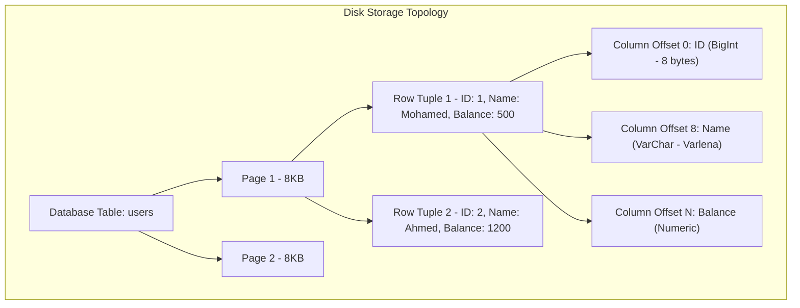

#### مثال 1: تطبيق عملي (انعكاس تخزين البيانات على الأداء)
عند إنشاء جدول المستخدمين في PostgreSQL، المحرك بيحسب الـ Layout بتاع الصفوف على القرص:

```sql
-- Create a normalized PostgreSQL table
CREATE TABLE users (
    user_id BIGINT GENERATED ALWAYS AS IDENTITY PRIMARY KEY, -- 8 bytes fixed length
    email VARCHAR(255) NOT NULL UNIQUE,                      -- Variable length with length header
    created_at TIMESTAMPTZ NOT NULL DEFAULT CURRENT_TIMESTAMP -- 8 bytes fixed length
);

-- Inspect physical disk tuple location using PostgreSQL system columns
SELECT ctid, user_id, email 
FROM users;
-- ctid (0,1) means: Page 0, Tuple Index 1 on disk!
```

#### مثال 2: فخ شائع (The NULL Alignment & Wide Rows Pitfall)
ترتيب الأعمدة داخل الجدول بياخد مساحات إضافية بسبب الـ Byte Alignment padding. الأعمدة ذات الأحجام الثابتة والكبيرة (زي `BIGINT` أو `TIMESTAMP`) يفضل وضعها في أول الجدول لتوفير البايتات المفقودة في محاذاة الذاكرة.

```sql
-- BAD PRACTICE: Poor column alignment causes implicit padding waste across millions of rows
CREATE TABLE inefficient_table (
    flag1 BOOLEAN,       -- 1 byte
    user_id BIGINT,      -- 8 bytes (JVM/CPU forces 7 bytes padding before this!)
    flag2 BOOLEAN,       -- 1 byte
    amount NUMERIC       -- variable
);

-- GOOD PRACTICE: Align by size descending
CREATE TABLE efficient_table (
    user_id BIGINT,      -- 8 bytes
    amount NUMERIC,      -- variable
    flag1 BOOLEAN,       -- 1 byte
    flag2 BOOLEAN        -- 1 byte (packed together!)
);
```

#### مثال 3: حالة إنتاج حقيقية (Row-Oriented vs Columnar Engines)
في قواعد البيانات التشغيلية (OLTP - PostgreSQL/MySQL)، البيانات بتتخزن **Row-by-Row** داخل الـ Page، وده ممتاز جداً لما تعمل `SELECT` لصف كامل أو `INSERT` لصف جديد. لكن في قواعد بيانات التحليلات (OLAP - ClickHouse/Snowflake)، البيانات بتتخزن **Column-by-Column** لأن الاستعلام التحليلي بيبقى محتاج يحسب متوسط عمود واحد فقط على مليار صف من غير ما يقرا باقي أعمدة الصفوف!

> [!example] 🎯 مستوى التعمق أساسي

---

## Q2 — ما الفرق بين الـ Primary Key والـ Natural Key والـ Surrogate Key، وكيف تختارهما؟

### أصل الحكاية

كل صف في قاعدة البيانات العلائقية لازم يمتلك هُوية فريدة ومطلقة (Uniquely Identifiable Record). لو الصفوف ملهاش هوية فريدة، الداتابيز مش هتقدر تميز صف عن صف تاني، والتعديل أو الحذف هيبقى مغامرة كوارثية!

الهوية الفريدة دي بنسميها الـ **Primary Key (PK)**. لكن السؤال الهندسي الأهم: منين بنجيب قيمة الـ Primary Key ده؟ هنا بنقف قدام مدرسة المفاتيح الطبيعية (Natural Keys) ومدرسة المفاتيح البديلة (Surrogate Keys).

- **Natural Key**: هو مفتاح نابع من طبيعة بيانات العالم الحقيقي للمجال (Domain Data). مثال: الرقم القومي (SSN)، رقم الشاسي للسيارة (VIN)، أو الـ ISBN للكتاب.
- **Surrogate Key**: هو مفتاح صناعي تم توليده بواسطة محرك قاعدة البيانات أو التطبيق فقط بغرض التميز الهيكلي، ومالوش أي معنى في العالم الحقيقي. مثال: `Auto-Increment Integer`, `BIGINT Identity`, أو `UUID/ULID`.

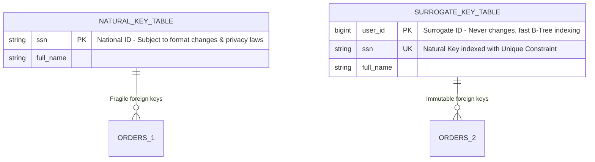

#### مثال 1: تطبيق عملي (استخدام Surrogate Key مع Unique Natural Constraint)
الممارسة الموصى بها هيبكلياً هي استخدام `Surrogate Key` كـ Primary Key، مع وضع `UNIQUE Constraint` على الـ Natural Key:

```sql
-- Standard Production Schema Design Pattern
CREATE TABLE citizens (
    citizen_id BIGINT GENERATED ALWAYS AS IDENTITY PRIMARY KEY, -- Surrogate Key (Internal ID)
    national_id VARCHAR(14) NOT NULL UNIQUE,                    -- Natural Key (Business Constraint)
    full_name VARCHAR(100) NOT NULL,
    date_of_birth DATE NOT NULL
);

-- Foreign keys in related tables reference the stable Surrogate Key
CREATE TABLE passport_applications (
    application_id BIGINT GENERATED ALWAYS AS IDENTITY PRIMARY KEY,
    citizen_id BIGINT NOT NULL REFERENCES citizens(citizen_id), -- Stable Reference!
    application_date TIMESTAMPTZ NOT NULL DEFAULT CURRENT_TIMESTAMP
);
```

#### مثال 2: فخ شائع (Natural Key Change Disaster)
تخيل استخدام `Email` أو `SSN` كـ Primary Key في قاعدة بيانات تحتوي 50 جدول مرتيط. 
إذا قررت الحكومة تغيير تنسيق الرقم القومي (إضافة حروف أو زيادت أرقام)، أو أراد المستخدم تغيير البريد الإلكتروني، سيتوجب عليك تحديث ملايين الصفوف المترابطة عبر كافة الجداول ومفاتيحها الخارجية!

```sql
-- PITFALL: Using Natural Key directly as Foreign Key Target
-- Changing the national_id forces expensive cascading updates everywhere!
ALTER TABLE citizens UPDATE national_id = 'EGY-12345678' WHERE national_id = '12345678';
```

#### مثال 3: حالة إنتاج حقيقية (UUID v4 vs UUID v7 for Distributed Surrogate Keys)
في الأنظمة الموزعة (Microservices)، توليد `Auto-increment` بيتطلب قفل (Lock) مركز على قاعدة البيانات، وده بيبطّئ الـ Ingestion. الحل كان `UUID v4` لكنه عشوائي بالكامل وده بيبصم الـ B-Tree Index بالتشظي (Index Fragmentation).
في الأنظمة الحديثة يتم استخدام **UUID v7** (أو ULID) لأنه يجمع بين وجود Timestamp في أول البايتات ليكون مرتباً زمنياً (Monotonically Increasing) وبين العشوائية لمنع التضارب!

```sql
-- UUID v7 format in PostgreSQL (time-ordered primary keys)
-- Provides distributed creation WITHOUT B-tree fragmentation!
CREATE TABLE audit_events (
    event_id UUID PRIMARY KEY DEFAULT gen_random_uuid(), -- Assuming PG 17+ / UUID v7 extension
    event_type VARCHAR(50) NOT NULL,
    payload JSONB NOT NULL
);
```

> [!example] 🎯 مستوى التعمق متوسط

---

## Q3 — ما هو الـ Foreign Key وكيف يضمن الـ Referential Integrity، وما أثر Cascading Actions؟

### أصل الحكاية

البيانات في النظام العلائقي مش معزولة. جدول الطلبات (`orders`) لازم يكون مربوط بجدول العملاء (`customers`). لكن إيه اللي يمنع إن مستخدم يضيف طلب باسم عميل مش موجود أصلاً في الداتابيز؟ أو يمسح عميل ويسيب طلباته يتيمة (Orphaned Records)؟

الـ **Foreign Key (FK)** هو القيد المعماري (Constraint) اللي بيمسك طرف الرمز في جدول (Child Table) ويربطه بالـ Primary Key في جدول تاني (Parent Table). 

محرك قواعد البيانات بيضمن الـ **Referential Integrity** بعنف:
1. **عند الـ INSERT/UPDATE في الجدول الابن**: المحرك بيتأكد إن القيمة المضافة موجودة بالفعل في الجدول الأب.
2. **عند الـ DELETE/UPDATE في الجدول الأب**: المحرك بيمنع العملية أو بيطبق إجراءات الـ Cascading المحددة مسبقاً.

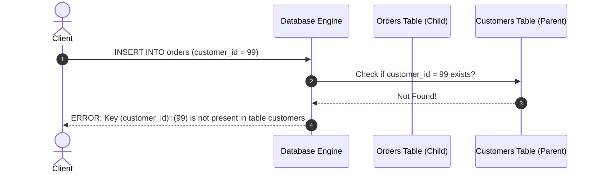

#### مثال 1: تطبيق عملي (تحديد خيارات Cascading بوضوح)
هناك 4 خيارات رئيسية عند حذف السجل الأب: `RESTRICT / NO ACTION` (الافتراضي والمفضل للأمان)، `CASCADE` (حذف الأبناء تلقائياً)، `SET NULL` (تصفير المفتاح في الأبناء)، و `SET DEFAULT`.

```sql
-- Parent Table
CREATE TABLE courses (
    course_id BIGINT GENERATED ALWAYS AS IDENTITY PRIMARY KEY,
    title VARCHAR(150) NOT NULL
);

-- Child Table with Explicit Cascade Rules
CREATE TABLE enrollments (
    enrollment_id BIGINT GENERATED ALWAYS AS IDENTITY PRIMARY KEY,
    course_id BIGINT NOT NULL,
    student_name VARCHAR(100) NOT NULL,
    
    -- Foreign Key Constraint
    CONSTRAINT fk_enrollments_course 
        FOREIGN KEY (course_id) 
        REFERENCES courses(course_id) 
        ON DELETE CASCADE -- If course deleted, auto-delete enrollments!
        ON UPDATE RESTRICT -- Block course_id modifications if referenced
);
```

#### مثال 2: فخ شائع (Accidental Mass Deletion via ON DELETE CASCADE)
استخدام `ON DELETE CASCADE` بحسن نية في علاقة بين جدول العملاء وجدول الفواتير الموردة. لو أدمن مسح حساب عميل بطريق الخطأ، قاعدة البيانات هتمسح آلاف الفواتير المالية والسجلات المحاسبية المسجلة على حسابه فوراً وبدون أي تحذير!

```sql
-- DANGEROUS PITFALL: In financial domain, NEVER use ON DELETE CASCADE!
-- Soft Delete (is_deleted flag) or RESTRICT must be used instead!
CREATE TABLE invoices (
    invoice_id BIGINT PRIMARY KEY,
    customer_id BIGINT REFERENCES customers(customer_id) ON DELETE CASCADE -- DANGER!
);
```

#### مثال 3: حالة إنتاج حقيقية (Soft Delete & Foreign Keys Challenge)
في الأنظمة الحديثة، السجلات النادرة ما بتمسح بـ `DELETE FROM` حقيقي، بل بيتم عمل **Soft Delete** باستخدام عمود `deleted_at IS NOT NULL`.
الـ Foreign Keys العادية بتظل شايفه السجل الممسوح سلبياً (لأنه مازال موجوداً في الجدول). للتعامل مع هذا، يتم كتابة استعلامات الربط بشرط تصفية السجلات الحية فقط أو استخدام Partial Unique Indexes.

```sql
-- Production Pattern: Soft Delete with Active Filter
CREATE TABLE products (
    product_id BIGINT GENERATED ALWAYS AS IDENTITY PRIMARY KEY,
    name VARCHAR(100) NOT NULL,
    deleted_at TIMESTAMPTZ DEFAULT NULL -- Null means active
);

-- Child table references active product
SELECT p.name, o.order_date 
FROM orders o
JOIN products p ON o.product_id = p.product_id
WHERE p.deleted_at IS NULL; -- Enforce logical active constraint
```

> [!example] 🎯 مستوى التعمق أساسي

---

## Q4 — ما هي الصورة الطبيعية الأولى (1NF) وكيف تتخلص من البيانات المكررة والمتعددة القيمة؟

### أصل الحكاية

عملية **الـ Normalization (التطبيع)** هي منهجية رياضية لتنظيم الجداول وتقليل التكرار (Redundancy) لمنع التضارب وحماية سلامة البيانات.

الصورة الطبيعية الأولى (**First Normal Form - 1NF**) هي البوابة الأساسية لقواعد البيانات العلائقية. عشان الجدول نقول عليه إنه في الـ 1NF، لازم يحقق 3 شروط صريحة:
1. **Atomic Values (قيم ذرية غير قابلة للتقسيم)**: الخلايا داخل العمود لا تحتوي على قوائم مفصولة بفواصل (Comma-separated values) أو الكائنات المركبة.
2. **No Repeating Groups (عدم تكرار الأعمدة)**: ممنوع تعمل أعمدة زي `phone1`, `phone2`, `phone3` في نفس الجدول.
3. **Unique Rows & Primary Key**: كل صف يمتلك هوية فريدة ويميزه Primary Key.

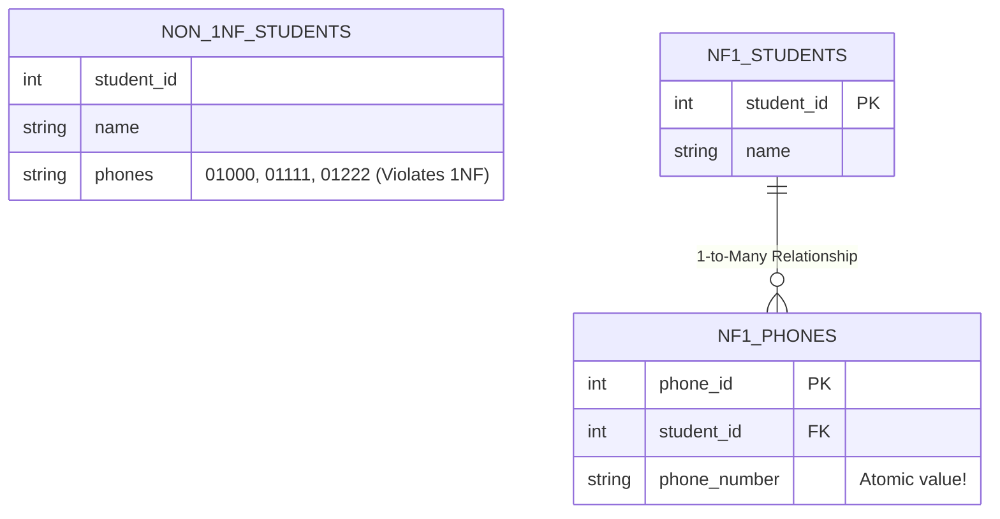

#### مثال 1: تطبيق عملي (تحويل جدول يخالف 1NF إلى 1NF صحية)

الكود غير المطابق لـ 1NF:
```sql
-- VIOLATES 1NF: Multi-valued phone_numbers column!
CREATE TABLE bad_students (
    student_id INT PRIMARY KEY,
    student_name VARCHAR(100),
    phone_numbers VARCHAR(255) -- Stores: '0101234567, 0119876543'
);
```

التصحيح بتفكيك القيمة المتعددة إلى جدول مستقل بنسبة 1-to-Many:
```sql
-- CORRECT 1NF SCHEMA
CREATE TABLE students (
    student_id INT PRIMARY KEY,
    student_name VARCHAR(100) NOT NULL
);

CREATE TABLE student_phones (
    phone_id BIGINT GENERATED ALWAYS AS IDENTITY PRIMARY KEY,
    student_id INT NOT NULL REFERENCES students(student_id),
    phone_number VARCHAR(20) NOT NULL,
    CONSTRAINT uk_student_phone UNIQUE(student_id, phone_number)
);
```

#### مثال 2: فخ شائع (The Repeating Column Anti-Pattern)
إضافة أعمدة مكررة لتفادي إنشاء جدول جديد:

```sql
-- PITFALL: What if a customer has 4 addresses? You have to alter schema!
CREATE TABLE customer_addresses_bad (
    customer_id INT PRIMARY KEY,
    home_address TEXT,
    work_address TEXT,
    billing_address TEXT
);
```

#### مثال 3: حالة إنتاج حقيقية (JSONB in Postgres vs 1NF Violations)
في قواعد البيانات الحديثة مثل PostgreSQL، يدعم المحرك تخزين `JSONB`. قد يظن البعض أن تخزين قوائم داخل JSONB يخرق 1NF.
الفرق الجوهري: لو البيانات دي عبارة عن Attributes مرنة ومتغيرة ولا يتم عمل `JOIN` أو فلترة كثيفة عليها بشكل منفصل، فتخزينها كـ Document مرخص ومقبول (Hybrid Approach). أما لو كانت كينات جوهرية في النظام، فيجب فصلها في جدول علائقي مطابق لـ 1NF لضمان الفهارس والـ Foreign Keys.

> [!example] 🎯 مستوى التعمق أساسي

---

## Q5 — ما هي الصورة الطبيعية الثانية (2NF) وكيف تلغي التبعية الجزئية (Partial Dependency)؟

### أصل الحكاية

بعد تحقيق الـ 1NF، قد يقع الجدول في فخ جديد يتسبب في تكرار البيانات الهائل: **التبعية الجزئية (Partial Dependency)**.

الصورة الطبيعية الثانية (**2NF**) تبني على الـ 1NF وتفرض شرطاً إضافياً:
> **"كل عمود غير مفتاحي (Non-Key Attribute) يجب أن يكون معتمداً بالكامل على المفتاح الرئيسي بالكامل، وليس على جزء منه فقط."**

هذه المشكلة تظهر فقط في الجداول التي تمتلك **Composite Primary Key** (مفتاح رئيسي مركب من أكثر من عمود). لو العمود غير المفتاحي يعتمد على جزء واحد من المفتاح المركب، فهذا خرّق مباشر لـ 2NF!

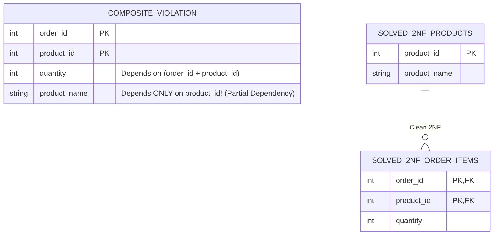

#### مثال 1: تطبيق عملي (إصلاح جدول تفاصيل الطلبات 2NF)

الجدول المخالف لـ 2NF:
```sql
-- VIOLATES 2NF: Composite Key (order_id, product_id)
-- product_name & product_price depend ONLY on product_id!
CREATE TABLE bad_order_items (
    order_id INT NOT NULL,
    product_id INT NOT NULL,
    quantity INT NOT NULL,
    product_name VARCHAR(100),  -- Partial Dependency!
    product_price NUMERIC(10,2),-- Partial Dependency!
    PRIMARY KEY (order_id, product_id)
);
```

التصحيح إلى 2NF بفصل كينونة المنتجات عن تفاصيل العناصر:
```sql
-- 1. Products Entity (2NF Compliant)
CREATE TABLE products (
    product_id INT PRIMARY KEY,
    product_name VARCHAR(100) NOT NULL,
    unit_price NUMERIC(10,2) NOT NULL
);

-- 2. Order Items Junction Entity (2NF Compliant - Only full dependency metrics)
CREATE TABLE order_items (
    order_id INT NOT NULL REFERENCES orders(order_id),
    product_id INT NOT NULL REFERENCES products(product_id),
    quantity INT NOT NULL,
    agreed_price NUMERIC(10,2) NOT NULL, -- Historical price snapshot (Depends on THIS order + product!)
    PRIMARY KEY (order_id, product_id)
);
```

#### مثال 2: فخ شائع (Misunderstanding Historical Snapshot vs Partial Dependency)
في المثال أعلاه، قد يسأل البعض: لماذا أبقينا على `agreed_price` داخل `order_items`؟
لأن سعر بيع المنتج وقت الطلب يعتمد على **الطلب والمطبوع معاً في تلك اللحظة التاريخية** (قد يتغير سعر المنتج في جدول المنتجات لاحقاً لكن سعر الطلب القديم ثابت). بالتالي `agreed_price` ليس جزئياً بل يعتمد على الثنائي معاً!

#### مثال 3: حالة إنتاج حقيقية (Multi-Tenant Composite Keys & 2NF)
في تطبيقات الساس (SaaS Multi-tenant)، يتم أحياناً استخدام `tenant_id` كجزء من كل المفاتيح المركبة (`tenant_id`, `user_id`).
للحفاظ على 2NF، يتم التأكد من أن جميع الأعمدة في جدول المستخدمين تعتمد على المستأجر والمستخدم معاً، وأي بيانات عامة للمستأجر نفسه تُفصل في جدول `tenants` منفصل.

> [!example] 🎯 مستوى التعمق متوسط

---

## Q6 — ما هي الصورة الطبيعية الثالثة (3NF) وكيف تلغي التبعية التعدية (Transitive Dependency)؟

### أصل الحكاية

الوصول لـ 2NF يضمن أن الأعمدة تعتمد على المفتاح بالكامل. لكن تظل هناك ثغرة تصميمية أخيرة تسبب تكرار البيانات: **التبعية التعدية (Transitive Dependency)**.

الصورة الطبيعية الثالثة (**3NF**) تنص على:
> **"الجدول يجب أن يكون في 2NF، ويجب أن تكون جميع الأعمدة غير المفتاحية متعتمدة فقط ومباشرة على المفتاح الرئيسي، ولا تعتمد على أي عمود آخر غير مفتاحي."**

بصياغة كلاسيكية مشهورة في قواعد البيانات: 
> *"Every non-key attribute must provide a fact about **The Key**, **The Whole Key**, and **Nothing But The Key** (so help me Codd)."*

التبعية التعدية تعني: A -> B و B -> C. وبالتالي C تعتمد على A عبر B!

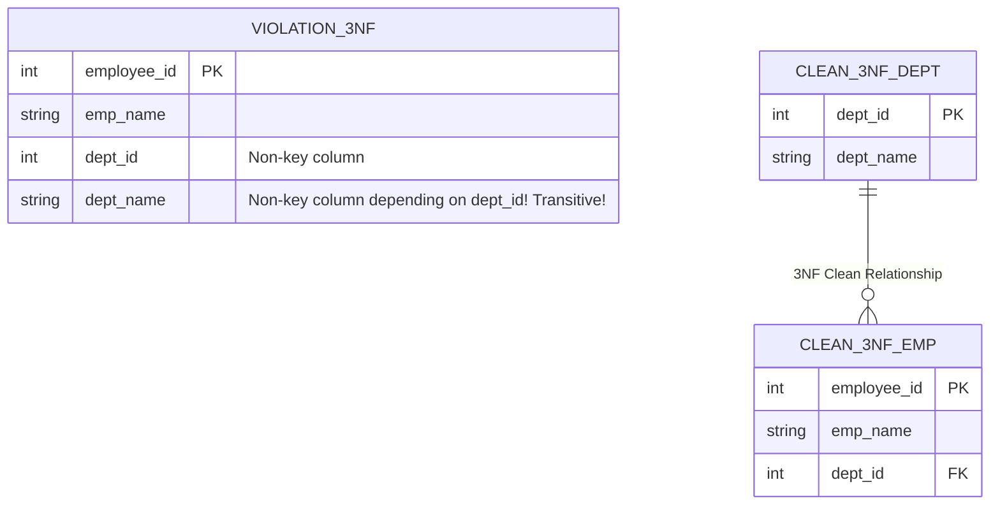

#### مثال 1: تطبيق عملي (تفكيك جدول الموظفين والأقسام إلى 3NF)

الجدول المخالف لـ 3NF:
```sql
-- VIOLATES 3NF: dept_name & dept_location depend on dept_id (a non-key attribute)!
CREATE TABLE bad_employees (
    employee_id INT PRIMARY KEY,
    employee_name VARCHAR(100) NOT NULL,
    department_id INT NOT NULL,
    department_name VARCHAR(100),   -- Transitive Dependency!
    department_location VARCHAR(100)-- Transitive Dependency!
);
```

إصلاح التبعية التعدية بفصل جدول القسم:
```sql
-- 1. Department Table (Holds department facts)
CREATE TABLE departments (
    department_id INT PRIMARY KEY,
    department_name VARCHAR(100) NOT NULL,
    location VARCHAR(100) NOT NULL
);

-- 2. Employee Table (Holds employee facts only + FK to Department)
CREATE TABLE employees (
    employee_id INT PRIMARY KEY,
    employee_name VARCHAR(100) NOT NULL,
    department_id INT NOT NULL REFERENCES departments(department_id)
);
```

#### مثال 2: فخ شائع (Calculated Derived Columns as 3NF Violations)
إضافة أعمدة محسوبة يمكن استنتاجها دائماً من أعمدة أخرى:

```sql
-- PITFALL: total_amount is derived (quantity * unit_price). 
-- Storing it directly can lead to inconsistencies if quantity changes without updating total!
CREATE TABLE invoice_lines_bad (
    line_id INT PRIMARY KEY,
    quantity INT NOT NULL,
    unit_price NUMERIC(10,2) NOT NULL,
    total_amount NUMERIC(10,2) -- Violates 3NF unless enforced via GENERATED ALWAYS!
);

-- CORRECT IN POSTGRESQL: Use Generated Columns
CREATE TABLE invoice_lines_good (
    line_id INT PRIMARY KEY,
    quantity INT NOT NULL,
    unit_price NUMERIC(10,2) NOT NULL,
    total_amount NUMERIC(10,2) GENERATED ALWAYS AS (quantity * unit_price) STORED
);
```

#### مثال 3: حالة إنتاج حقيقية (Zip Code & City Transitive Dependency Exception)
في العناوين العالمية، رمز المنطقة `zip_code` يحدد المدينة `city` والولاية `state`. نظرياً، وضع المدينة والرمز في جدول العميل يخرق 3NF لأن المدينة تعتمد على الرمز البريدي.
لكن في التطبيق الميداني الحقيقي، يتم التجاوز عن هذا التطبيع المفرط (Over-normalization) إذا كانت قواعد بيانات الرموز البريدية متغيرة أو لا تتطلب تعقيد جدول إضافي للـ Zip Codes، ما لم يطلب النظام تدقيقاً جغرافياً صارماً.

> [!example] 🎯 مستوى التعمق متوسط

---

## Q7 — كيف تطبق عملية التطبيع (Normalization) خطوة بخطوة على كائن معقد تحوله إلى جداول متزنة؟

### أصل الحكاية

التحول من ورقة متطلبات خاوية أو سند مبيعات عشوائي إلى هيكل علائقي نقي ومطابق للمواصفات المعيارية (1NF -> 2NF -> 3NF) بيتطلب منهجية خطوة بخطوة.

في هذا السؤال سنأخذ نموذج **سند شحن مستندات وطلبات (Logistics Delivery Receipt)** غير منظم إطلاقاً ونمر به عبر محطات التطبيع حتى نصل للتصميم الهندسي المتزن.

السند الخام البدائي:
- رقم السند: `REC-9988`
- تاريخ الشحن: `2026-07-24`
- بيانات العميل: `محمد خالد (ايميل: m@ex.com, هاتف: 01000, 01111)`
- عنوان التوصيل: `القاهرة، مصر`
- العناصر المرفقة: `[لاب توب - كمية 1 - سعر 1500]`, `[ماوس - كمية 2 - سعر 30]`
- اسم مندوب التوصيل والفرع: `أحمد علي (فرع مدينة نصر)`

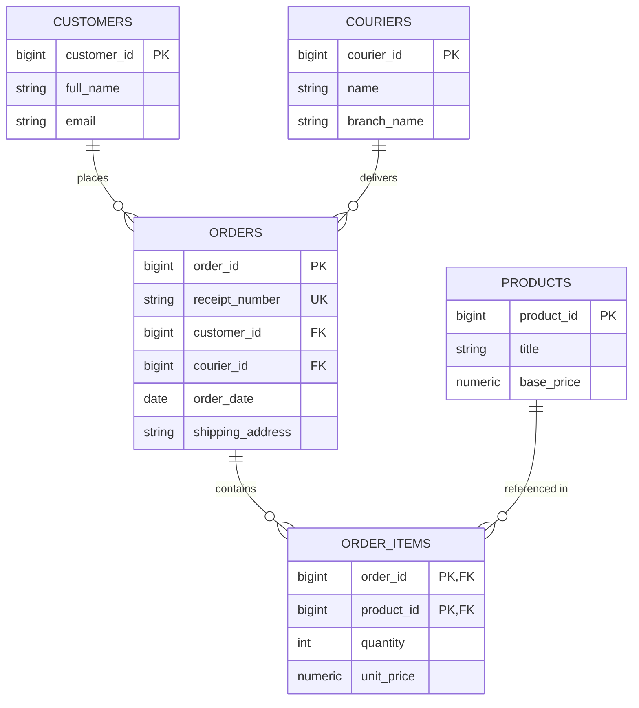

#### مثال 1: تطبيق عملي (خطوات التحويل البرمجي في PostgreSQL)

**الخطوة 1: الوصول لـ 1NF** (فصل هواتف العميل وعناصر السند إلى صفوف مستقلة وتحديد المفاتيح):
```sql
-- 1. Customers Table (Atomic attributes)
CREATE TABLE customers (
    customer_id BIGINT GENERATED ALWAYS AS IDENTITY PRIMARY KEY,
    full_name VARCHAR(100) NOT NULL,
    email VARCHAR(150) NOT NULL UNIQUE
);

-- 1NF Phone numbers separation
CREATE TABLE customer_phones (
    phone_id BIGINT GENERATED ALWAYS AS IDENTITY PRIMARY KEY,
    customer_id BIGINT NOT NULL REFERENCES customers(customer_id),
    phone VARCHAR(20) NOT NULL
);
```

**الخطوة 2: الوصول لـ 2NF** (فصل بيانات المنتج ومندوب التوصيل لمنع التبعية الجزئية):
```sql
CREATE TABLE products (
    product_id BIGINT GENERATED ALWAYS AS IDENTITY PRIMARY KEY,
    title VARCHAR(150) NOT NULL,
    base_price NUMERIC(10,2) NOT NULL
);

CREATE TABLE couriers (
    courier_id BIGINT GENERATED ALWAYS AS IDENTITY PRIMARY KEY,
    courier_name VARCHAR(100) NOT NULL,
    branch_name VARCHAR(100) NOT NULL
);
```

**الخطوة 3: الوصول لـ 3NF** (تجميع كينونة الطلب وتفاصيل العناصر بدون تبعيات تعدية):
```sql
-- Clean Master Order Table (3NF)
CREATE TABLE orders (
    order_id BIGINT GENERATED ALWAYS AS IDENTITY PRIMARY KEY,
    receipt_number VARCHAR(50) NOT NULL UNIQUE,
    customer_id BIGINT NOT NULL REFERENCES customers(customer_id),
    courier_id BIGINT NOT NULL REFERENCES couriers(courier_id),
    order_date DATE NOT NULL DEFAULT CURRENT_DATE,
    shipping_address TEXT NOT NULL
);

-- Junction Order Items (3NF)
CREATE TABLE order_items (
    order_id BIGINT NOT NULL REFERENCES orders(order_id) ON DELETE CASCADE,
    product_id BIGINT NOT NULL REFERENCES products(product_id),
    quantity INT NOT NULL CHECK (quantity > 0),
    unit_price NUMERIC(10,2) NOT NULL, -- Historical snapshot price
    PRIMARY KEY (order_id, product_id)
);
```

#### مثال 2: فخ شائع (Premature Normalization Hell)
تقسيم الجدول بشكل مفرط لدرجة فصل اسم العميل الأول والأخير واللقب والدولة والمدينة والشارع في 10 جداول منفصلة بدون حاجة حقيقية، مما يجبر كل استعلام استرجاع على تنفيذ 10 `JOINs` متتالية يدمّر أداء النظام.

#### مثال 3: حالة إنتاج حقيقية (Domain Driven Design Aggregate Root Alignment)
في تصميم النظم المعقدة، يتطابق هيكل الجداول المطبعة في 3NF مع مفهوم الـ **Aggregate Root** في الـ DDD. جدول `orders` هو الـ Aggregate Root، وجدول `order_items` يتبعه دورة حياتياً وتُنفذ عليهما المعاملات المالية ككتلة واحدة (Atomic Aggregate).

> [!example] 🎯 مستوى التعمق متقدم

---

## Q8 — متى نلجأ إلى الـ Denormalization عمدًا وما هي المقايضات (Trade-offs) المصاحبة؟

### أصل الحكاية

بعد كل التعب في الوصول لـ 3NF لضمان عدم تكرار البيانات، بتيجي لحظة في الأنظمة الضخمة ذات الزيارات المليونية (High-Read Traffic Applications) تكتشف فيها إن الـ 3NF النقي بقى هو عائق الأداء الأول!

عملية الـ **Denormalization (إلغاء التطبيع العمدي)** هي التخلي الواعي عن بعض شروط التطبيع وإدخال تكرار محدد للبيانات أو تخزين قيم محسوبة سبق استنتاجها، وذلك بهدف:
1. تقليل عدد عمليات الـ `JOIN` المكلفة جداً على الديسك والـ CPU.
2. تسريع استعلامات القراءة (Read Performance Optimization).

لكن الـ Denormalization مش مجانية! السعر اللي بتدفعه هو: **صعوبة الـ Write/Update** وضرورة كتابة كود يعتني بتحديث البيانات المكررة في كل مكان لمنع الـ Stale Data.

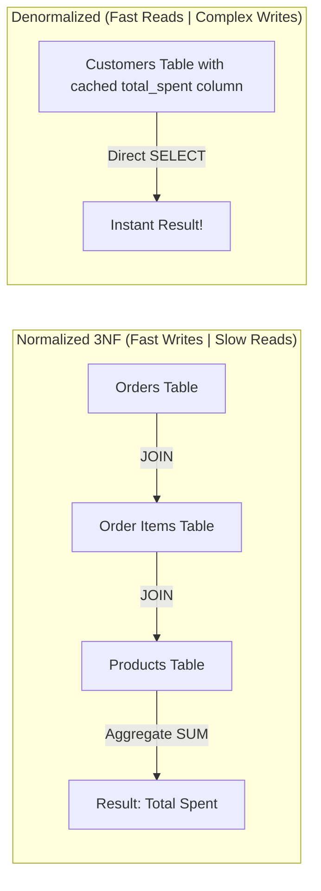

#### مثال 1: تطبيق عملي (إضافة Cached Counters / Summaries)

تخزين إجمالي مبيعات العميل أو عدد التعليقات مباشرة داخل جدول الكينونة الرئيسية:

```sql
-- Denormalized Table with Cached Metrics
CREATE TABLE customers (
    customer_id BIGINT PRIMARY KEY,
    name VARCHAR(100) NOT NULL,
    total_orders_count INT NOT NULL DEFAULT 0, -- Denormalized Counter!
    total_spent_amount NUMERIC(12,2) NOT NULL DEFAULT 0.00 -- Denormalized Aggregate!
);

-- Trigger Function to maintain Denormalized Invariants automatically
CREATE OR REPLACE FUNCTION update_customer_stats() 
RETURNS TRIGGER AS $$
BEGIN
    UPDATE customers 
    SET total_orders_count = total_orders_count + 1,
        total_spent_amount = total_spent_amount + NEW.agreed_price * NEW.quantity
    WHERE customer_id = (SELECT customer_id FROM orders WHERE order_id = NEW.order_id);
    RETURN NEW;
END;
$$ LANGUAGE plpgsql;
```

#### مثال 2: فخ شائع (Uncontrolled Denormalization Drift)
عمل Denormalization بدون وجود وسيلة آلية (Triggers أو Domain Events) لتحديث البيانات المكررة. مع الوقت، يصبح الكاونتر المسجل في جدول العميل `total_spent = 500` بينما مجموع الفواتير الفعلي في جدول الفواتير هو `1200`!

#### مثال 3: حالة إنتاج حقيقية (Read Heavy E-Commerce Search Tables)
في متجر مثل Amazon، صفحة البحث عن المنتجات تتطلب عرض اسم الماركة، متوسط التقييمات، وعدد المراجعات.
لو تم حساب التقييمات عبر `AVG(rating)` بـ `JOIN` على 100 مليون مراجعة مع كل زيارة صفحة، فالسيرفر سيسقط فوراً.
الحل الإنتاجي: جدول المنتجات يحتوي أعمدة denormalized جاهزة: `average_rating` و `review_count` يتم تحديثها خلف الكواليس عبر Asynchronous Event Workers (مثل Kafka + Redis/DB Updater).

> [!example] 🎯 مستوى التعمق متقدم

---

> [!tip] Checkpoint موديول أسس قواعد البيانات العلائقية
> **تم بحمد الله إكمال الموديول الأول (أسس قواعد البيانات العلائقية - Q1 إلى Q8)!**
> 
> تم تغطية: التخزين الفيزيائي للصفوف والأعمدة والصفحات في الذاكرة، استراتيجيات اختيار Primary vs Natural vs Surrogate Keys، ضمان الـ Referential Integrity والـ Cascading Actions في الـ Foreign Keys، والرحلة الكاملة لمستويات التطبيع 1NF و 2NF و 3NF حتى الوصول لقواعد الـ Denormalization العمدية ومقايضاتها.
> 
> الموديول القادم: **لغة الاستعلام (SQL Query Language)** لربط الهياكل بالعمق البرمجي المتقدم.

---

### 📖 قبل ما نبدأ: ليه SQL كلغة استعلام بالشكل ده بالذات؟

لغة **SQL (Structured Query Language)** تم تصميمها بناءً على المنطق الرياضي المعنون بـ **Relational Algebra**. على عكس لغات البرمجة الإجرائية زي Java أو C++ أو Python اللي بتخبر فيها الكمبيوتر **"كيف يفعل الخطوات بالتفصيل (How to do it)"**، لغة SQL هي لغة إعلانية (**Declarative Language**) بتخبر فيها محرك قاعدة البيانات **"ما هي البيانات التي تريد الحصول عليها (What data you want)"**، وتترك لمحرك الاستعلام (Query Optimizer) حرية اختيار أفضل وأسرع مسار تنفيذي للوصول للتلك البيانات.

#### المشكلة التصميمية قبل SQL:
في قواعد البيانات الشبكية القديمة (زي IMS)، كان المبرمج محتاج يكتب Loops و Pointers يدوياً ويمشي على السجلات سجل سجل في الذاكرة عشان يربط بين بيانات عميل وطلباته. لو شكل الهيكل على الديسك تغير، الكود البرمجي كله كان بيتكسر فوراً!

#### إيه اللي كان بيحصل لما نحلها بالطريقة العادية (من غير SQL Declarative Engine)؟
تخيل لو بتكتب كود إجرائي بيدك عشان تعمل JOIN وتصفية بين مصفوفتين بيانات في الذاكرة:

```javascript
// Procedural approach: Manual Nested Loop Join (O(N * M) Complexity!)
let customerOrders = [];
for (let i = 0; i < customers.length; i++) {
    if (customers[i].status === 'ACTIVE') {
        for (let j = 0; j < orders.length; j++) {
            if (orders[j].customerId === customers[i].id && orders[j].amount > 500) {
                customerOrders.push({
                    customerName: customers[i].name,
                    orderAmount: orders[j].amount
                });
            }
        }
    }
}
```

في الأسلوب ده:
1. الكود بيعمل **Nested Loop** بطيء جداً تعقيده الزمني $O(N \times M)$.
2. لو حبيت تضيف Index عشان تسرع البحث، لازم تعيد كتابة الكود بنفسك وتغير طريقة الـ Loop!

بينما بلغة SQL، بتبعت طلبك في سطرين محددين:
```sql
SELECT c.name, o.amount
FROM customers c
JOIN orders o ON c.id = o.customer_id
WHERE c.status = 'ACTIVE' AND o.amount > 500;
```
محرك الـ Query Optimizer بياخد الاستعلام ده، ويختار تلقائياً هل يطبق Hash Join أم Merge Join أم Index Scan بناءً على حجم البيانات وإحصائيات الأعمدة!

#### إمتى بالظبط تحس إنك محتاج SQL متقدم؟ (الإشارات والـ Symptoms)
* لما تلاقي التطبيق بتاعك بياخد مئات آلاف الصفوف من الداتابيز عشان يعمل عليها فلترة أو حسابات في الـ Memory بتاعة السيرفر بدلاً من ترك الحسابات محلياً داخل محرك الداتابيز السريع.
* لما الاستعلامات البسيطة تبدأ تبطّئ النظام مع زيادة حجم البيانات وتكون محتاج تقنيات زي الـ Window Functions والـ CTEs للحد من التكرار.

---

## Q9 — ما الفرق الجوهري والعملي بين أنواع الـ JOINs (Inner, Left, Right, Full, Cross)؟

### أصل الحكاية

الـ **JOIN** هو المحرك الأساسي لإعادة تجميع البيانات المطبعة والموزعة على جداول متعددة وإرجاعها في النتيجة كصف متكامل.

الفرق بين أنواع الـ JOINs يعتمد كلياً على **كيفية التعامل مع الصفوف التي لا تمتلك مطابقة (Unmatched Rows)** بين الجدول الأيسر (Left Table) والجدول الأيمن (Right Table):

1. **INNER JOIN**: يرجع فقط الصفوف التي تمتلك مطابقة تامة في كلا الجدولين.
2. **LEFT JOIN (OUTER)**: يرجع جميع صفوف الجدول الأيسر، مضافاً إليها البيانات المطابقة من الجدول الأيمن (وإذا لم توجد مطابقة، توضع قيم `NULL`).
3. **RIGHT JOIN (OUTER)**: يرجع جميع صفوف الجدول الأيمن، مضافاً إليها البيانات المطابقة من الجدول الأيسر.
4. **FULL OUTER JOIN**: يرجع جميع الصفوف من الكلا الجدولين سواء توفرت مطابقة أم لا.
5. **CROSS JOIN**: ينتج عنه المضروب الديكارتي (Cartesian Product) بدمج كل صف من الأول مع كل صف في الثاني ($N \times M$).

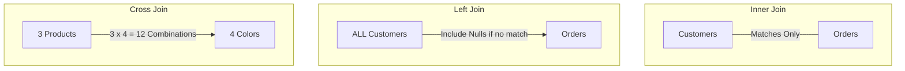

#### مثال 1: تطبيق عملي (مقارنة الاستعلامات والنتائج)

```sql
-- Setup Test Tables
-- Customers: [1: Mohamed], [2: Ahmed], [3: Sarah (No Orders)]
-- Orders: [Ord#1: Cust 1], [Ord#2: Cust 2], [Ord#3: Cust 99 (Orphan/No Cust)]

-- 1. INNER JOIN: Returns ONLY Mohamed and Ahmed (Sarah and Cust 99 excluded!)
SELECT c.name, o.order_id
FROM customers c
INNER JOIN orders o ON c.customer_id = o.customer_id;

-- 2. LEFT JOIN: Returns Mohamed, Ahmed, AND Sarah (with NULL order_id for Sarah!)
SELECT c.name, o.order_id
FROM customers c
LEFT JOIN orders o ON c.customer_id = o.customer_id;

-- 3. Find Customers with ZERO orders (Anti-Join Pattern using LEFT JOIN)
SELECT c.name 
FROM customers c
LEFT JOIN orders o ON c.customer_id = o.customer_id
WHERE o.order_id IS NULL; -- Filters out matching rows!
```

#### مثال 2: فخ شائع (Accidental INNER JOIN via WHERE Clause on LEFT JOIN)
وضع شرط على جدول الـ LEFT JOIN داخل قسم `WHERE` يؤدي لتحويل الاستعلام تلقائياً وبشكل خفي إلى `INNER JOIN` لأن قيم الـ `NULL` التي أنتجها الـ Left Join سيتم إلغاؤها بالشرط!

```sql
-- PITFALL: The WHERE condition converts LEFT JOIN to INNER JOIN unintentionally!
SELECT c.name, o.order_date
FROM customers c
LEFT JOIN orders o ON c.customer_id = o.customer_id
WHERE o.order_date > '2026-01-01'; -- Sarah (NULL date) is removed!

-- CORRECT: Move the condition to the ON clause of the LEFT JOIN
SELECT c.name, o.order_date
FROM customers c
LEFT JOIN orders o ON c.customer_id = o.customer_id AND o.order_date > '2026-01-01';
```

#### مثال 3: حالة إنتاج حقيقية (Generating Matrix Combinations via CROSS JOIN)
في نظام تتبع المخزون، نحتاج بانتظام لإنشاء جدول تقرير يومي يحتوي على جميع المنتجات مدمجة مع كافة فروع الشركة حتى لو لم تكن هناك مبيعات للمنتج في الفرع اليوم. يتم استخدام **CROSS JOIN** لبناء الشبكة الأساسية، ثم `LEFT JOIN` على جدول المبيعات الفعلي!

```sql
-- Generate daily stock matrix for all products across all branches
SELECT b.branch_name, p.product_title, COALESCE(s.quantity_sold, 0) AS sold
FROM branches b
CROSS JOIN products p
LEFT JOIN daily_sales s ON s.branch_id = b.branch_id 
                        AND s.product_id = p.product_id 
                        AND s.sale_date = CURRENT_DATE;
```

> [!example] 🎯 مستوى التعمق أساسي

---

## Q10 — متى نستخدم Subqueries ومتى نفضل الـ JOINs وما هو أثر ذلك على الأداء؟

### أصل الحكاية

عند كتابة استعلام يحتاج لبيانات من عدة جداول أو حساب نتائج وسيطة، يقف المبرمج أمام خيارين: كتابة **Subquery (استعلام فرعي مدمج)** أو استخدام **JOIN**.

من الناحية الوظيفية:
- الـ **Subquery**: ممتاز في حالة **تأكيد الوجود أو الفلترة (Filtering & Existence checks)** باستخدام `IN`, `EXISTS`, `NOT EXISTS` أو عند حساب قيمة مقياس واحد لاستخدامه في الشرط.
- الـ **JOIN**: هو الاختيار المطلق عندما تكون بحاجة لـ **استرجاع وعرض أعمدة ناتجة من الجدولين معاُ** في النتيجة النهائية.

من ناحية الأداء في المحركات الحديثة (Query Optimizer):
في الماضي كانت الـ Subqueries غير المترابطة بطيئة جداً. لكن اليوم، محركات مثل PostgreSQL تقوم بعمل **Subquery Unnesting / Flattening** وتحويل معظم الـ Subqueries تلقائياً إلى JOINs أو Semi-Joins خلف الكواليس.
لكن الثغرة تظل في الـ **Correlated Subqueries** (الاستعلام الفرعي المرتبط بالصف الخارجي) والذي قد ينفذ مرة لكل صف في الجدول الخارجي إذا لم يستطع المحرك تحسينه!

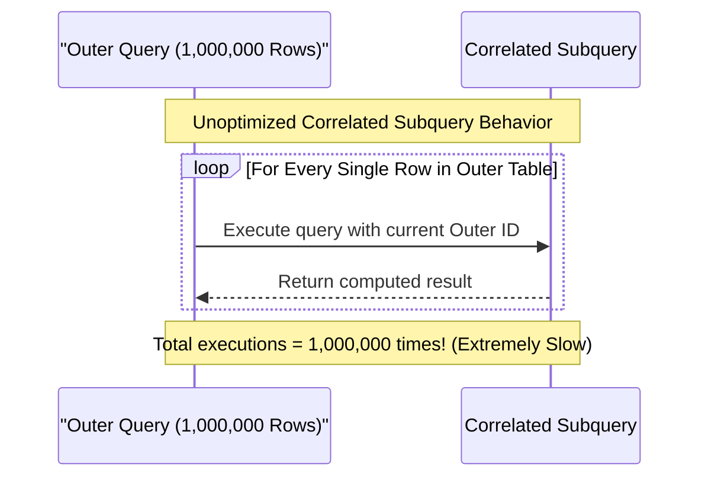

#### مثال 1: تطبيق عملي (IN Subquery vs EXISTS vs JOIN)

```sql
-- Task: Find all customers who have placed at least one order above $1000

-- APPROACH 1: Using EXISTS (Best for existence checks - stops at first match!)
SELECT c.customer_id, c.full_name
FROM customers c
WHERE EXISTS (
    SELECT 1 FROM orders o 
    WHERE o.customer_id = c.customer_id AND o.total_amount > 1000
);

-- APPROACH 2: Using JOIN with DISTINCT (Returns columns from both, but needs DISTINCT to prevent duplicate customer rows!)
SELECT DISTINCT c.customer_id, c.full_name
FROM customers c
JOIN orders o ON c.customer_id = o.customer_id
WHERE o.total_amount > 1000;
```

#### مثال 2: فخ شائع (The NULL Trap with NOT IN Subqueries)
إذا احتوى الاستعلام الفرعي داخل `NOT IN` على قيمة `NULL` واحدة، فسيقوم الاستعلام بإرجاع **صفر صفوف (Empty Result)** دائماً بسبب منطق الثلاث قيم (Three-Valued Logic) في SQL!

```sql
-- DANGER PITFALL: If any category_id in inactive_categories is NULL, this query returns NOTHING!
SELECT * FROM products 
WHERE category_id NOT IN (
    SELECT category_id FROM inactive_categories -- Contains a NULL value!
);

-- SAFE PRODUCTION ALTERNATIVE: Always use NOT EXISTS!
SELECT * FROM products p
WHERE NOT EXISTS (
    SELECT 1 FROM inactive_categories ic 
    WHERE ic.category_id = p.category_id
);
```

#### مثال 3: حالة إنتاج حقيقية (Correlated Subquery Refactoring to Window Function / JOIN)
حساب آخر طلب لكل عميل في نظام متجر. 
الـ Correlated Subquery يستغرق ثوانٍ طويلة، بينما إعادة الهيكلة باستخدام `Window Function` أو `JOIN` مسبق التجميع ينفذ في ميلي ثانية.

```sql
-- FAST PRODUCTION PATTERN: Join with Pre-Aggregated CTE or Window Function
WITH LatestOrders AS (
    SELECT order_id, customer_id, order_date, total_amount,
           ROW_NUMBER() OVER(PARTITION BY customer_id ORDER BY order_date DESC) as rn
    FROM orders
)
SELECT customer_id, order_id, order_date, total_amount
FROM LatestOrders
WHERE rn = 1; -- Gets latest order per customer instantly!
```

> [!example] 🎯 مستوى التعمق متوسط

---

## Q11 — كيف تفرق بين WHERE و HAVING وليه تجميع البيانات (GROUP BY) بيمنع قراءة الأعمدة المباشرة؟

### أصل الحكاية

الفرق بين `WHERE` و `HAVING` بيسبب لغبطة للمبتدئين، لكن الفهم بيصبح بديهي جداً لما تعرف **ترتيب التنفيذ المنطقي للاستعلام (Logical Query Processing Phase Order)** داخل محرك الـ SQL!

ترتيب تنفيذ الاستعلام داخل الداتابيز بيمشي كالتالي:
1. `FROM` & `JOIN`: تحديد ورصف جداول المصدر.
2. **`WHERE`**: تصفية الصفوف الفردية **قبل** إجراء أي تجميع (Filter Individual Rows).
3. **`GROUP BY`**: ضغط وتجميع الصفوف المتبقية إلى مجموعات (Bucket Aggregation).
4. **`HAVING`**: تصفية المجموعات الناتجة **بعد** التجميع بناءً على نتائج الدوال الإحصائية (Filter Aggregated Groups).
5. `SELECT`: اختيار الأعمدة وحساب الـ Expressions.
6. `ORDER BY` & `LIMIT`: الترتيب والتقليم النهائي.

ليه `GROUP BY` بيمنع قراءة الأعمدة المباشرة؟
لأنك لما بتنفذ `GROUP BY country` مثلاً، الداتابيز بتضغط 100 صف من مصر في "صف تجميعي واحد". لو طلبت `SELECT first_name` في نفس الاستعلام، المحرك بيقف عاجز: أنهي اسم من الـ 100 اسم بتوع مصر أطلعهولك؟ بالتالي، أي عمود في الـ `SELECT` لازم يكون يا إما موجود جوه الـ `GROUP BY` أو معالج داخل دالة تجميعية زي (`SUM`, `AVG`, `COUNT`, `MAX`).

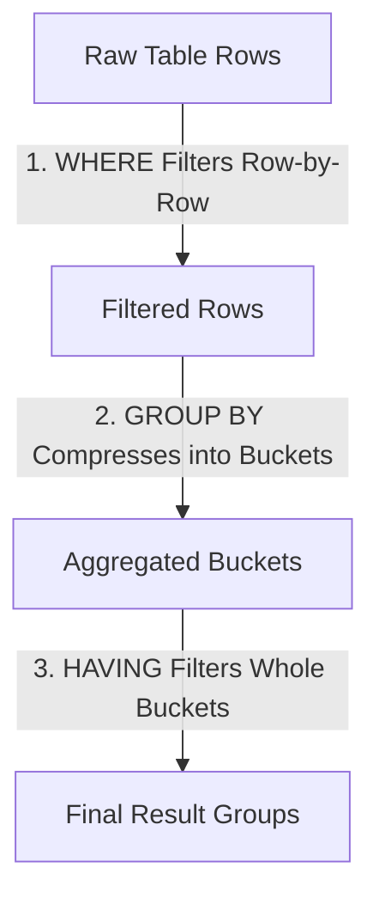

#### مثال 1: تطبيق عملي (مقارنة WHERE و HAVING في استعلام مبيعات)

```sql
-- Target: Find countries with total sales > $50,000, considering ONLY COMPLETED orders!

SELECT 
    country, 
    COUNT(order_id) AS total_orders, 
    SUM(total_amount) AS total_revenue
FROM orders
WHERE status = 'COMPLETED'          -- 1. WHERE: Filters out pending/canceled rows FIRST!
GROUP BY country                    -- 2. GROUP BY: Groups remaining completed orders by country
HAVING SUM(total_amount) > 50000    -- 3. HAVING: Filters out countries whose SUM is <= 50,000
ORDER BY total_revenue DESC;
```

#### مثال 2: فخ شائع (Putting Aggregates in WHERE Clause)
محاولة وضع دالة إحصائية داخل الـ `WHERE` يؤدي لخطأ سنتاكس مباشر لأن التجميع لم يحدث بعد في هذه المرحلة!

```sql
-- SYNTAX ERROR IN SQL!
SELECT country, SUM(total_amount)
FROM orders
WHERE SUM(total_amount) > 50000 -- ERROR: aggregate functions are not allowed in WHERE!
GROUP BY country;
```

#### مثال 3: حالة إنتاج حقيقية (Filtering Before vs After Grouping Performance Gap)
إذا كان بإمكانك تصفية البيانات في الـ `WHERE` بدلاً من الـ `HAVING` قم بذلك فوراً!
تصفية التاريخ في الـ `WHERE` تقلل عدد الصفوف التي تدخل عملية الـ Sorting والـ Grouping في الـ Memory من 10 مليون صف إلى 10 آلاف صف فقط، مما يسرع الاستعلام 100 ضعف.

```sql
-- EFFICIENT PRODUCTION QUERY: Filter dates early in WHERE!
SELECT seller_id, COUNT(*) as monthly_sales
FROM sales
WHERE sale_date >= '2026-07-01' AND sale_date < '2026-08-01' -- Filter early!
GROUP BY seller_id
HAVING COUNT(*) > 100;
```

> [!example] 🎯 مستوى التعمق أساسي

---

## Q12 — ما هي الـ Window Functions (ROW_NUMBER, RANK, DENSE_RANK) وكيف تختلف عن GROUP BY؟

### أصل الحكاية

الـ **Window Functions (دوال النافذة)** هي واحدة من أقوى الميزات المتقدمة في SQL الحديثة (SQL:1999 وما بعدها). 

الفرق الجوهري بينها وبين `GROUP BY`:
- **`GROUP BY`**: يضغط ويقلص الصفوف (Collapses Rows). لو دخلت 100 صف، وجمعتهم حسب البلد (5 دول)، النتائج هتطلع **5 صفوف فقط**. التفاصيل الفردية لكل صف بتختفي!
- **`Window Functions`**: تحسب القيم الإحصائية والتراكمية عبر "نافذة" من الصفوف، ولكنها **تحتفظ بجميع الصفوف الفردية كما هي بدون ضغط!** (Retains individual row identity).

أشهر دوال النافذة الخاصة بالترتيب (Ranking Window Functions):
1. **`ROW_NUMBER()`**: يعطي رقماً تسلسلياً فريداً ومستظرفاً لكل صف داخل النافذة (1, 2, 3, 4) بدون تكرار حتى لو تساوت القيم.
2. **`RANK()`**: يعطي نفس الرقم للقيم المتساوية، ولكنه **يقفز** في الترقيم بعد التكرار (1, 2, 2, 4).
3. **`DENSE_RANK()`**: يعطي نفس الرقم للقيم المتساوية، ولكن **بدون قفز** في الترقيم (1, 2, 2, 3).

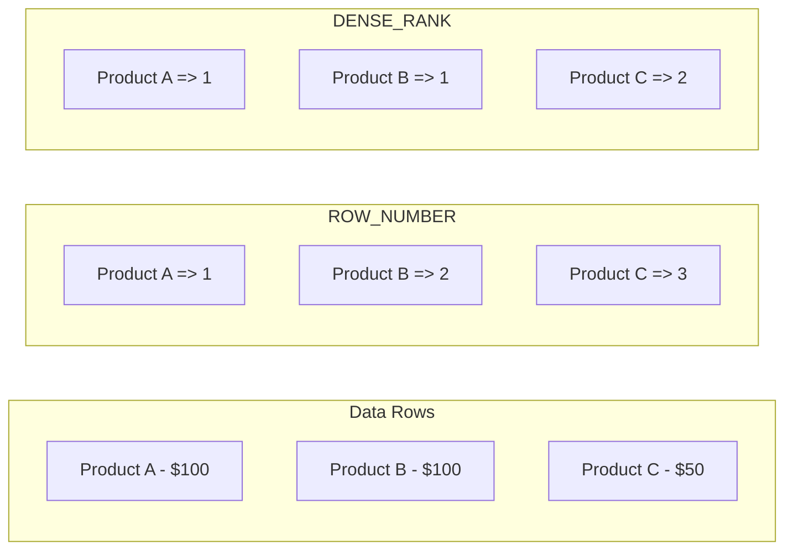

#### مثال 1: تطبيق عملي (ترتيب الموظفين حسب الراتب داخل كل قسم)

```sql
SELECT 
    employee_name,
    department_id,
    salary,
    -- 1. Sequential Unique Row Number
    ROW_NUMBER() OVER(PARTITION BY department_id ORDER BY salary DESC) as row_num,
    -- 2. Rank with Gaps
    RANK()       OVER(PARTITION BY department_id ORDER BY salary DESC) as rank_with_gaps,
    -- 3. Rank without Gaps
    DENSE_RANK() OVER(PARTITION BY department_id ORDER BY salary DESC) as dense_rank_no_gaps
FROM employees;
```

#### مثال 2: فخ شائع (Using Window Functions in WHERE Clause Directly)
محاولة تصفية نتائج دالة النافذة مباشرة داخل الـ `WHERE` لنفس الاستعلام يؤدي لخطأ لأن الـ Window Functions تنفذ في مرحلة متأخرة بعد الـ `WHERE` والـ `GROUP BY`!

```sql
-- SYNTAX ERROR!
SELECT employee_name, salary,
       ROW_NUMBER() OVER(ORDER BY salary DESC) as rn
FROM employees
WHERE ROW_NUMBER() OVER(ORDER BY salary DESC) <= 3; -- ERROR: window functions not allowed in WHERE!

-- CORRECT PATTERN: Wrap in Subquery or CTE
WITH RankedEmployees AS (
    SELECT employee_name, salary,
           ROW_NUMBER() OVER(ORDER BY salary DESC) as rn
    FROM employees
)
SELECT employee_name, salary 
FROM RankedEmployees 
WHERE rn <= 3;
```

#### مثال 3: حالة إنتاج حقيقية (Running Totals & Moving Averages for Financial Analytics)
حساب **المجموع التراكمي (Running Total)** لأرباح الشركة يوم بيوم عبر استخدام `SUM() OVER()` مع تحديد إطار النافذة الزمنية:

```sql
-- Calculate Running Total Revenue and 7-day Moving Average
SELECT 
    sale_date,
    daily_revenue,
    -- Cumulative Running Total from day 1 to current day
    SUM(daily_revenue) OVER (ORDER BY sale_date ROWS BETWEEN UNBOUNDED PRECEDING AND CURRENT ROW) as running_total,
    -- 7-Day Moving Average
    AVG(daily_revenue) OVER (ORDER BY sale_date ROWS BETWEEN 6 PRECEDING AND CURRENT ROW) as moving_avg_7days
FROM daily_revenue_stats
ORDER BY sale_date;
```

> [!example] 🎯 مستوى التعمق متقدم

---

## Q13 — كيف تعمل الـ Common Table Expressions (CTEs) وما الفرق بين الـ Non-Recursive والـ Recursive CTE؟

### أصل الحكاية

الـ **Common Table Expression (CTE)** هو جدول مؤقت مسّمى (Named Temporary Result Set) بيتم تعريفه باستخدام الكلمة المفتاحية `WITH` في بداية الاستعلام.

فوائد الـ CTE الجوهرية:
1. **Readable & Maintainable Code**: بدلاً من كتابة Subqueries ممتدة ومتداخلة يصعب قراءتها وتتبعها، تقوم بتقسيم الاستعلام لخطوات منطقية واضحة.
2. **Reusability**: يمكنك الإشارة للـ CTE عدة مرات داخل الاستعلام الرئيسي.

أنواع الـ CTE:
- **Non-Recursive CTE**: استعلام عادي يحسب نتيجة مؤقتة لاستخدامها في الاستعلام الرئيسي.
- **Recursive CTE**: استعلام مذهل بيحيل ويستدعي نفسه بشكل متكرر! وهو الحل القياسي المعتمد في SQL لمعالجة **الهياكل الشجرية والشبكية الممتدة (Hierarchical Data & Graphs)** مثل الهيكل التنظيمي للموظفين، فئات المنتجات المتشعبة، وشبكات التواصل الاجتماعية.

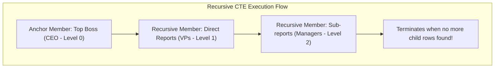

#### مثال 1: تطبيق عملي (Non-Recursive CTE لتقسيم التقرير)

```sql
WITH RegionalSales AS (
    -- Step 1: Calculate total sales per region
    SELECT region_id, SUM(amount) AS total_sales
    FROM sales
    GROUP BY region_id
),
TopRegions AS (
    -- Step 2: Filter regions exceeding threshold
    SELECT region_id FROM RegionalSales WHERE total_sales > 100000
)
-- Step 3: Main query joining results clean and clear!
SELECT s.sale_id, s.amount, r.region_id
FROM sales s
JOIN TopRegions r ON s.region_id = r.region_id;
```

#### مثال 2: فخ شائع (Infinite Loops in Recursive CTE)
نسيان وضع **Termination Condition (شرط الإيقاف)** أو وجود دورة دائرية في البيانات (Circular Dependency) داخل الـ Recursive CTE يسبب دخول الاستعلام في دورت نهائية واستعراض السيرفر حتى الانهيار!

```sql
-- PITFALL: Always set a MAXRECURSION limit or safety depth check!
WITH RECURSIVE CategoryHierarchy AS (
    -- Anchor
    SELECT category_id, name, parent_id, 1 as depth
    FROM categories WHERE parent_id IS NULL
    
    UNION ALL
    
    -- Recursive Join
    SELECT c.category_id, c.name, c.parent_id, ch.depth + 1
    FROM categories c
    JOIN CategoryHierarchy ch ON c.parent_id = ch.category_id
    WHERE ch.depth < 10 -- SAFETY DEPTH GUARD to prevent infinite loops!
)
SELECT * FROM CategoryHierarchy;
```

#### مثال 3: حالة إنتاج حقيقية (Traversing Employee Management Hierarchy via Recursive CTE)
عرض الهيكل الوظيفي لشركة من رئيس مجلس الإدارة وحتى أحدث موظف مع حساب المستوى الوظيفي (Level) وشجرة التبعية:

```sql
WITH RECURSIVE OrgChart AS (
    -- Anchor Member: Find top-level manager (CEO)
    SELECT employee_id, name, manager_id, 1 AS org_level, CAST(name AS VARCHAR(500)) AS path
    FROM employees
    WHERE manager_id IS NULL

    UNION ALL

    -- Recursive Member: Join employees with their managers
    SELECT e.employee_id, e.name, e.manager_id, o.org_level + 1, CAST(o.path || ' -> ' || e.name AS VARCHAR(500))
    FROM employees e
    INNER JOIN OrgChart o ON e.manager_id = o.employee_id
)
SELECT employee_id, name, org_level, path
FROM OrgChart
ORDER BY org_level, employee_id;
```

> [!example] 🎯 مستوى التعمق متقدم

---

## Q14 — كيف تدير الـ Null Values في SQL وما هي مخاطر الـ Three-Valued Logic؟

### أصل الحكاية

الـ **`NULL`** في عالم قواعد البيانات العلائقية ليس خاوياً (Not Empty String `""`) وليس صفراً (`0`). الـ `NULL` معناه الفعلي هو: **"قيمة مجهولة أو غائبة (Unknown / Missing Value)"**.

بسبب مفهوم المجهول، لغة SQL لا تتبع المنطق الثنائي العادي (True / False)، بل تتبع **المنطق ثلاثي القيم (Three-Valued Logic - 3VL)**:
- `TRUE`
- `FALSE`
- `UNKNOWN`

أي عملية مقارنة حسابية أو منطقية مع `NULL` تتولد عنها قيمة `UNKNOWN`.
على سبيل المثال:
- `5 = NULL` -> `UNKNOWN`
- `NULL = NULL` -> `UNKNOWN` (حتى الـ NULL لا يساوي NULL لأن المجهول الأول قد يختلف عن المجهول الثاني!).
- `IS NULL` / `IS NOT NULL`: هي الوسيلة الوحيدة الصحيحة لاختبار التصفية في SQL!

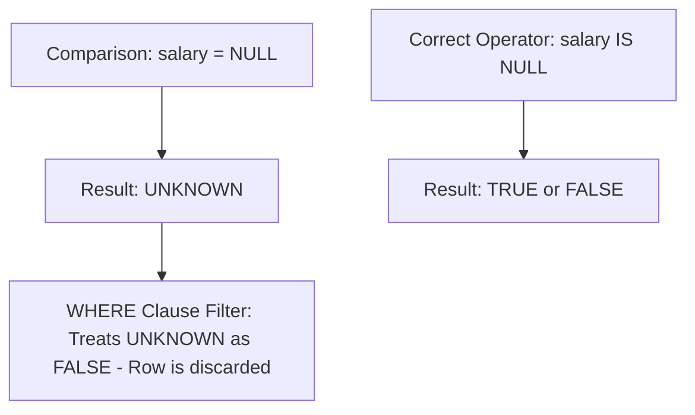

#### مثال 1: تطبيق عملي (استخدام COALESCE و NULLIF)

- **`COALESCE(val1, val2, ...)`**: ترجع أول قيمة غير `NULL` في القائمة.
- **`NULLIF(val1, val2)`**: ترجع `NULL` إذا كانت `val1 = val2` (ممتازة جداً لمنع خطأ القسمة على صفر `Division by Zero`).

```sql
-- 1. Safe Default values using COALESCE
SELECT 
    full_name,
    COALESCE(phone_number, mobile_number, 'No Phone Provided') as contact_info
FROM users;

-- 2. Prevent Division by Zero Error using NULLIF
SELECT 
    total_revenue,
    total_orders,
    -- If total_orders is 0, NULLIF turns it to NULL. Division by NULL returns NULL instead of crashing!
    total_revenue / NULLIF(total_orders, 0) AS avg_order_value
FROM monthly_reports;
```

#### مثال 2: فخ شائع (Accidental Data Exclusion via WHERE NOT Condition)
تخيل جدول عملاء يحتوي أعمدة `middle_name` بعضها `NULL`.

```sql
-- PITFALL: Expecting this query to return everyone except 'Khaled'.
-- ACTUAL RESULT: It also EXCLUDES all rows where middle_name IS NULL!
SELECT * FROM users 
WHERE middle_name <> 'Khaled'; -- Rows with NULL are UNKNOWN, so WHERE drops them!

-- CORRECT WRITING:
SELECT * FROM users 
WHERE middle_name <> 'Khaled' OR middle_name IS NULL;
```

#### مثال 3: حالة إنتاج حقيقية (Aggregation Functions & NULL Behavior)
الدوال الإحصائية مثل `SUM()`, `AVG()`, `COUNT(column)` **تتجاهل قيم الـ NULL تماماً** ولا تحسبها في المتوسط!
- `COUNT(*)`: تحسب جميع الصفوف بما فيها الـ NULLs.
- `COUNT(commission)`: تحسب فقط الصفوف التي تمتلك قيمة غير NULL.

```sql
-- Understand the difference in financial reporting:
-- Given 3 rows: [Salary: 1000], [Salary: 2000], [Salary: NULL]
SELECT 
    COUNT(*) as total_rows,         -- Returns 3
    COUNT(salary) as filled_salaries, -- Returns 2
    AVG(salary) as avg_salary       -- Returns 1500 (3000 / 2), NOT 1000 (3000 / 3)!
FROM employees;
```

> [!example] 🎯 مستوى التعمق متوسط

---

## Q15 — ما الفرق بين UNION و UNION ALL وكيف تؤثر إزالة التكرار على أداء الـ Query؟

### أصل الحكاية

الـ **`UNION`** والـ **`UNION ALL`** يُستخدمان لدمج مخرجات استعلامين أو أكثر في نتيجة واصلة واحدة عمودياً (Vertical Combination).

الفرق الجوهري المحوري بينهما:
- **`UNION`**: يقوم بدمج النتائج ثم ينفذ عملية **إزالة التكرار (Duplicate Elimination)** تلقائياً من الصفحة الناتجة.
- **`UNION ALL`**: يقوم بدمج النتائج ورصفها فوراً **دون إزالة التكرار** (إرجاع كافة الصفوف بما فيها المتكرر).

أثر الأداء (Performance Impact):
علية `UNION` تجبر محرك قاعدة البيانات على إجراء عملية **Unique Sort أو Hash Aggregate** على كافة البيانات الناتجة في الـ RAM / Disk للتأكد من عدم وجود صف مكرر.
في الجداول الضخمة، عملية الـ Unique Sort تكون مكلفة جداً وتستغرق 80% من وقت الاستعلام. إذا كنت متأكداً أن البيانات غير متكررة أو لا يهمك وجود التكرار، فإن **`UNION ALL` أسرع بفارق شاسع!**

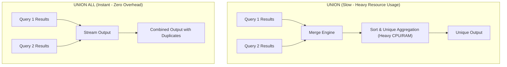

#### مثال 1: تطبيق عملي (مقارنة الأداء والنتائج)

```sql
-- Combine Active Customers and Archival Customers

-- 1. UNION ALL (Fastest - Streaming execution)
SELECT customer_id, email, 'ACTIVE' as source FROM active_customers
UNION ALL
SELECT customer_id, email, 'ARCHIVED' as source FROM archived_customers;

-- 2. UNION (Slower - Requires sorting and deduplication)
SELECT email FROM active_customers
UNION
SELECT email FROM leads_marketing;
```

#### مثال 2: فخ شائع (Mismatched Column Types in UNION)
تجميع استعلامين في UNION بدون تطابق تام في عدد الأعمدة وترتيب أنواع البيانات (Data Types):

```sql
-- SYNTAX ERROR IN SQL!
SELECT user_id, email FROM users -- Types: BIGINT, VARCHAR
UNION ALL
SELECT email, user_id FROM admins; -- Types: VARCHAR, BIGINT (Mismatched Order!)
```

#### مثال 3: حالة إنتاج حقيقية (Optimizing Search Bar Autocomplete via UNION ALL)
في محرك بحث متجر، نريد اقتراح ناتج البحث من 3 جداول مختلفة (المنتجات، الفئات، الماركات).
استخدام `UNION ALL` مع `LIMIT` في كل قسم يضمن استجابة فائقة السرعة للمستخدم في ميلي ثانية:

```sql
-- Fast Multi-Entity Search Suggestion
(SELECT title AS label, 'PRODUCT' AS type FROM products WHERE title ILIKE 'Laptop%' LIMIT 5)
UNION ALL
(SELECT name AS label, 'CATEGORY' AS type FROM categories WHERE name ILIKE 'Laptop%' LIMIT 3)
UNION ALL
(SELECT brand_name AS label, 'BRAND' AS type FROM brands WHERE brand_name ILIKE 'Laptop%' LIMIT 2);
```

> [!example] 🎯 مستوى التعمق أساسي

---

## Q16 — كيف تتعامل مع التعديلات الكثيفة (UPSERT / MERGE) بأمان وبطريقة إشعارات دقيقة؟

### أصل الحكاية

في الأنظمة الحقيقية، بتواجه بانتظام سيناريو **"إدخال البيانات إذا لم تكن موجودة، أو تحديثها إذا كانت موجودة بالفعل" (Insert or Update)**. هذا السيناريو معروف مصطلحياً باسم **`UPSERT`**.

المشكلة في الحل التقليدي (Check then Insert/Update):
لو كتبت كود بالتطبيقي بيعمل `SELECT` يتأكد هل الصف موجود ولا لأ، وبعدين يعمل `INSERT` أو `UPDATE` بناءً على النتيجة... في الأنظمة الموزعة والتطبيقية الكثيفة، هيحصل **Race Condition (حالة سباق)**!
خيطين برمجية (Two Threads) ممكن يعملوا SELECT في نفس اللحظة ويلاقوا الصف مش موجود، فالاتنين يحاولوا يعملوا `INSERT` في نفس اللحظة، وتضرب الداتابيز بخطأ `Unique Constraint Violation`!

الحل الهندسي الصحيح: **الـ UPSERT الذري (Atomic UPSERT)** المدمج داخل محرك قواعد البيانات باستخدام `ON CONFLICT` في PostgreSQL أو `INSERT ... ON DUPLICATE KEY UPDATE` في MySQL أو `MERGE` المعياري في ANSI SQL.

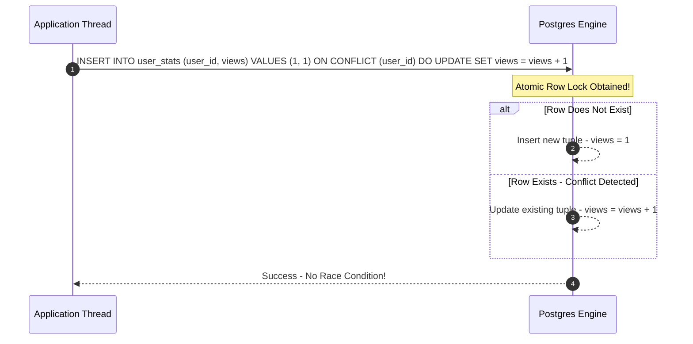

#### مثال 1: تطبيق عملي (Atomic UPSERT in PostgreSQL)

```sql
-- Table with Unique Index
CREATE TABLE daily_page_views (
    page_id BIGINT NOT NULL,
    view_date DATE NOT NULL,
    view_count BIGINT NOT NULL DEFAULT 1,
    PRIMARY KEY (page_id, view_date)
);

-- ATOMIC UPSERT: Increment view_count if row exists for today, else insert new row!
INSERT INTO daily_page_views (page_id, view_date, view_count)
VALUES (101, CURRENT_DATE, 1)
ON CONFLICT (page_id, view_date) 
DO UPDATE SET 
    view_count = daily_page_views.view_count + EXCLUDED.view_count;
-- EXCLUDED references the proposed new values!
```

#### مثال 2: فخ شائع (UPSERT Without Unique Constraint Target)
محاولة تنفيذ `ON CONFLICT` على أعمدة لا تمتلك `PRIMARY KEY` أو `UNIQUE Index` حقيقي. محرك PostgreSQL سيلغي العملية فوراً ويرمي خطأ سنتاكس!

```sql
-- ERROR: ON CONFLICT target must match a unique index constraint!
INSERT INTO users (email, name) VALUES ('m@example.com', 'Mohamed')
ON CONFLICT (name) -- ERROR if 'name' is not defined as UNIQUE!
DO UPDATE SET email = EXCLUDED.email;
```

#### مثال 3: حالة إنتاج حقيقية (Syncing External Integration Streams via MERGE / UPSERT)
في تطبيق مزامنة مخزون متجر إلكتروني مع نظام ERP خارجي يصل منه آلاف التحديثات كل دقيقة.
يتم استخدام `UPSERT` مع إتقان دقيق لمعرفة هل تم التعديل أم الإدخال لاستدعاء إشعارات النظام المالي:

```sql
-- Advanced Postgres UPSERT Returning Execution Action Status
WITH upserted AS (
    INSERT INTO inventory (product_id, stock_quantity, last_synced_at)
    VALUES (5001, 150, NOW())
    ON CONFLICT (product_id) 
    DO UPDATE SET 
        stock_quantity = EXCLUDED.stock_quantity,
        last_synced_at = EXCLUDED.last_synced_at
    RETURNING product_id, (xmin = 0) AS is_inserted -- xmin check detects insert vs update
)
SELECT product_id, 
       CASE WHEN is_inserted THEN 'NEW_ITEM_CREATED' ELSE 'STOCK_UPDATED' END as sync_status
FROM upserted;
```

> [!example] 🎯 مستوى التعمق متقدم

---

> [!tip] Checkpoint موديول لغة الاستعلام SQL
> **تم بحمد الله إكمال الموديول الثاني (لغة الاستعلام SQL - Q9 إلى Q16)!**
> 
> تم تغطية: التقييم التكتيكي والتنفيذي لأنواع الـ JOINs، الـ Subqueries vs JOINs ومتى تختار كل منهما، الفرق بين WHERE و HAVING وترتيب التنفيذ المنطقي للاستعلامات، الـ Window Functions (ROW_NUMBER, RANK, DENSE_RANK)، الـ CTEs التكرارية والعادية (Recursive & Non-Recursive)، المنطق ثلاثي القيم 3VL وتحديات الـ NULLs، المقايضات بين UNION و UNION ALL، والـ UPSERT الذري لمنع race conditions.
> 
> الموديول القادم: **المعاملات ومبادئ ACID (Transactions & ACID)** لدراسة إدارة العزل والقفل في بيئات التزامن الكثيفة.

---

<!-- PROGRESS: last completed = Q16 | next = 📖 قبل ما نبدأ: المعاملات ومبادئ ACID | module = Transactions & ACID -->

### 📖 قبل ما نبدأ: ليه محتاجين Transactions أصلاً؟

في عالم البرمجة اليومية، العمليات النادرة ما بتكون عبارة عن خطوة واحدة منفردة. تخيل عملية تحويل مالي بين حسابين: لازم تخصم مبلغ من الحساب الأول، وبعدين تضيف نفس المبلغ للحساب الثاني. 

لو السيرفر فصل كهرباء أو الداتابيز وقعت بين الخطوتين دول... المبلغ اتخصم من الأولاني وماوصلش للثاني! الفلوس اختفت في الهواء!

هنا تظهر الحاجة للـ **Transaction (المعاملة)**. المعاملة هي وحدة عمل منطقية (**Logical Unit of Work**) تجمع مجموعة استعلامات وتنفذهم كأنهم خطوة واحدة ناعمة: **إما أن تنفذ جميع الخطوات بنجاح تام، أو تُلغى جميع الخطوات وكأن شيئاً لم يكن (All or Nothing)!**

#### المشكلة التصميمية قبل Transactions:
بدون الـ Transactions، كان المبرمج بيضطر يكتب كود تعويضي يدوياً (Manual Rollback Logic) بيحاول يتراجع فيه عن التغييرات السابقة لو حصل خطأ في النص. ومع بيئات التزامن الكثيفة (High Concurrency)، الكود التعويضي ده بيستحيل ضبطه وبيسبب فساد دائم في البيانات (Data Corruption).

#### إيه اللي كان بيحصل لما نحلها بالطريقة العادية (من غير Transactions)؟

```javascript
// DANGER PROCEDURAL CODE: Unsafe money transfer without DB Transaction
async function transferMoney(fromAccountId, toAccountId, amount) {
    // Step 1: Deduct money from sender
    await db.query("UPDATE accounts SET balance = balance - $1 WHERE id = $2", [amount, fromAccountId]);
    
    // SERVER CRASHES OR NETWORK FAILS RIGHT HERE!
    // Result: Money lost forever, database state corrupted!
    
    // Step 2: Add money to receiver
    await db.query("UPDATE accounts SET balance = balance + $1 WHERE id = $2", [amount, toAccountId]);
}
```

الحل المعماري بـ SQL Transactions:
```sql
BEGIN TRANSACTION;

UPDATE accounts SET balance = balance - 500 WHERE id = 101;
UPDATE accounts SET balance = balance + 500 WHERE id = 202;

-- If anything goes wrong, ROLLBACK restores state completely!
COMMIT;
```

#### إمتى بالظبط تحس إنك محتاج Transactions؟ (الإشارات والـ Symptoms)
* لما العملية التجارية بتاعتك بتتكون من **أكثر من خطوة تعديل متتابعة** (Multiple Writes/Updates) وتعتمد على بعضها البعض.
* لما تكون شغال في دومين مالي، حجوزات، أو إدارة مخزون حرج (Financial, Booking, Inventory).

#### إمتى **ماتستخدمش** Transactions ممتدة طويلة؟
* المعاملات طويلة الأجل (**Long-Running Transactions**): تجنب ترك المعاملة مفتوحة أثناء إرسال إيميل أو استدعاء API خارجي بطيء (HTTP Request). القفل الممتد على الصفوف سيتسبب في خنق السيرفر وإيقاف الاستعلامات الأخرى!

---

## Q17 — ما هي مبادئ ACID الأربعة (Atomicity, Consistency, Isolation, Durability) وما هي السيناريوهات الكوارثية عند غياب كل عنصر؟

### أصل الحكاية

اختصار **ACID** هو العقد الهندسي الأقدس لقواعد البيانات العلائقية لتوفير ضمانات السلامة المطلقة في المعاملات:

1. **`Atomicity` (الذرية - الكل أو لا شيء)**: المعاملة كائن لا يقبل التجربة. إما أن تنجح جميع العمليات داخل المعاملة ويتم تثبيتها (`COMMIT`)، أو تُرفض جميعها وتتم التراجع عنها (`ROLLBACK`).
2. **`Consistency` (الاتساق والسلامة)**: المعاملة تنقل قاعدة البيانات من حالة صحيحة مائة بالمائة إلى حالة صحيحة أخرى مائة بالمائة بدون كسر أي قيود (`Constraints`, `Foreign Keys`, `Check Constraints`).
3. **`Isolation` (العزل)**: المعاملات المتزامنة لا تتداخل بشكل يخلق قراءات خاطئة. تنفيذ 10 معاملات في نفس اللحظة يبدو و كأن كل معاملة تنفذ بمفردها على السيرفر (Serializability illusion).
4. **`Durability` (الاستدامة والحفظ)**: بمجرد صدور رد النجاح للمستخدم (`COMMIT SUCCESS`), البيانات محفوظة بشكل دائم على القرص الصلب وتصمد أمام انقطاع الكهرباء الفجائي أو انهيار السيرفر (Crash Recovery guarantees).

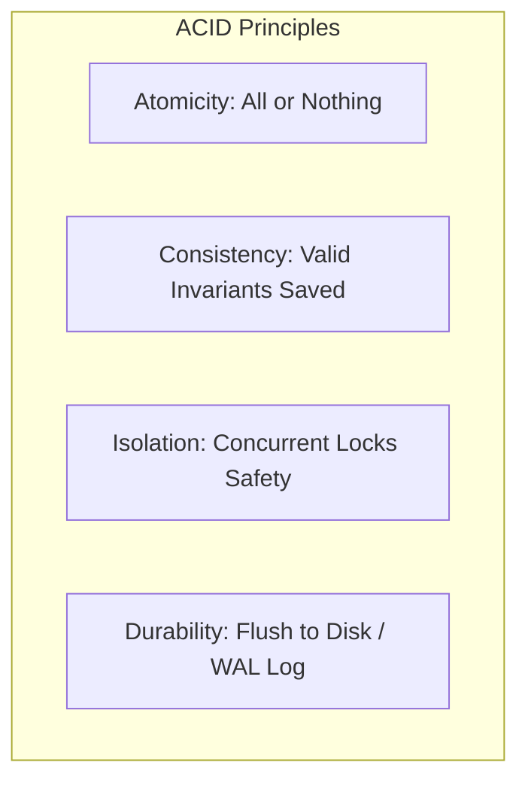

#### مثال 1: تطبيق عملي (تطبيق المعاملات المعزولة والآمنة في PostgreSQL)

```sql
-- Production Safe Money Transfer with ACID guarantees
BEGIN;

-- Enforce Consistency via Check Constraints (balance >= 0)
UPDATE accounts 
SET balance = balance - 1000.00 
WHERE account_id = 101 AND balance >= 1000.00;

-- Ensure exact row was updated (Atomicity check)
-- If update failed, rollback!
UPDATE accounts 
SET balance = balance + 1000.00 
WHERE account_id = 202;

-- Write-Ahead Log (WAL) ensures Durability upon COMMIT!
COMMIT;
```

#### مثال 2: فخ شائع (The Non-Atomic External API Pitfall)
دمج استدعاء بوابة دفع خارجية (Stripe HTTP Call) داخل معاملة الداتابيز. إذا تأخرت بوابة الدفع 10 ثوانٍ، فستظل المعاملة ممسكة بالقفل (Row Locks) على الحسابات، مما يعطل مئات المستخدمين الآخرين!

#### مثال 3: حالة إنتاج حقيقية (Crash Recovery via Write-Ahead Logging - WAL)
كيف تضمن قاعدة البيانات الـ **Durability** حتى لو انقطعت الكهرباء بعد الـ `COMMIT` بملي ثانية؟
المحرك لا يكتب الصفوف مباشرة في ملف البيانات الرئيسي على الديسك (لأنه بطيء)! بل يكتب التغيير فوراً في تسلسلي سريع على القرص يسمى **Write-Ahead Log (WAL)**. عند إعادة تشغيل السيرفر بعد الانهيار، يقرأ المحرك الـ WAL ويتعافى ذاتياً (Redo / Undo Recovery Process).

> [!example] 🎯 مستوى التعمق متقدم

---

## Q18 — ما هي مستويات العزل الأربعة (Read Uncommitted, Read Committed, Repeatable Read, Serializable) وما المشاكل التي تحلها؟

### أصل الحكاية

تحقيق العزل التام (**Isolation**) بنسبة 100% بين جميع المعاملات المتزامنة يتطلب قفل قاعدة البيانات بالكامل، وده بيدمر أداء النظام (Zero Concurrency).
لذلك، قامت مواصفات SQL بتعريف **4 مستويات عزل تدرجية (Isolation Levels)** لتسمح للمهندس باختيار التوازن الدقيق بين **الأداء السريع** وبين **سلامة البيانات**:

1. **`Read Uncommitted`**: أدنى مستوى. يتيح للمعاملة قراءة التعديلات التي كتبتها المعاملات الأخرى حتى لو لم يتم تثبيتها بعد (`DIRTY READ`).
2. **`Read Committed`**: (الافتراضي في PostgreSQL و SQL Server). يمنع القراءة الخاطئة؛ المعاملة تشاهد فقط التغييرات التي تم تثبيتها (`COMMITTED`). ولكن قد تواجه `Non-Repeatable Read`.
3. **`Repeatable Read`**: (الافتراضي في MySQL InnoDB). يضمن أن المعاملة إذا قرأت صفاً مرتين داخل نفس المعاملة، فستحصل على نفس القيمة تماماً بدون تغيير.
4. **`Serializable`**: أعلى مستوى عزل مطلق. يضمن أن النتيجة النهائية للمعاملات المتزامنة تتطابق 100% مع تنفيذها واحدة تلو الأخرى بالتسلسل (Strict Order execution).

| Isolation Level | Dirty Read | Non-Repeatable Read | Phantom Read | Concurrency Performance |
| :--- | :---: | :---: | :---: | :---: |
| **Read Uncommitted** | ❌ YES (Unsafe) | ❌ YES | ❌ YES | ⚡ Maximum |
| **Read Committed** | ✅ Prevented | ❌ YES | ❌ YES | 🚀 High (Default PG) |
| **Repeatable Read** | ✅ Prevented | ✅ Prevented | ❌/✅ Engine Dep. | ⚖️ Balanced (Default MySQL) |
| **Serializable** | ✅ Prevented | ✅ Prevented | ✅ Prevented | 🐢 Lowest (Strictest)

#### مثال 1: تطبيق عملي (ضبط مستوى العزل في PostgreSQL)

```sql
-- Set Isolation level for current transaction
BEGIN TRANSACTION ISOLATION LEVEL REPEATABLE READ;

SELECT balance FROM accounts WHERE account_id = 101; -- Balance = $500

-- Even if another transaction updates account 101 to $900 and COMMITS right now,
-- subsequent queries in THIS transaction will STILL see $500!

SELECT balance FROM accounts WHERE account_id = 101; -- Still Balance = $500!

COMMIT;
```

#### مثال 2: فخ شائع (Assuming Read Committed Prevents Race Conditions)
اعتقاد أن مستوى العزل الافتراضي `Read Committed` يمنع تضارب التعديلات المتزامنة. 
إذا قامت معاملتان بقراءة الرصيد `$100` ثم الخصم بناءً عليه، ستسحب المعاملتان معاً وتسبب رصيداً بالسالب ما لم يتم استخدام `FOR UPDATE` أو مستوى عزل أعلى!

#### مثال 3: حالة إنتاج حقيقية (Financial Ledger Engine on Serializable Level)
في محركات البنوك والقيود المحاسبية الدقيقة التي تحسب إجمالي ميزانية البنك، يتم تنفيذ المعاملات على مستوى **Serializable Isolation**. في حالة وجود تضارب بين معاملتين، يقوم المحرك برفض المعاملة الثانية تلقائياً وتوليد خطأ `Serialization Failure (SQLSTATE 40001)` وعلى التطبيق إعادة محاولتها (Retry Logic).

> [!example] 🎯 مستوى التعمق متقدم

---

## Q19 — ما الفرق بين الـ Dirty Read والـ Non-Repeatable Read والـ Phantom Read بالخطوات الزمنية؟

### أصل الحكاية

لفهم مستويات العزل بدقة، يجب استيعاب الـ **3 الظواهر الشاذة للقراءة (Read Phenomena Anomalies)** التي قد تحدث عند تزامن المعاملات:

1. **`Dirty Read` (القراءة الملوثة)**: المعاملة A تقرأ تعديلاً أحدثته المعاملة B. المعاملة B تقرر التراجع (`ROLLBACK`). المعاملة A تصبح ممسكة ببيانات وهمية لم توجد قط في قاعدة البيانات!
2. **`Non-Repeatable Read` (القراءة غير التكرارية)**: المعاملة A تقرأ صفاً (الرصيد = 100). المعاملة B تعدل نفس الصف (الرصيد = 200) وتثبته (`COMMIT`). المعاملة A تعيد قراءة **نفس الصف** فتفاجأ بأن القيمة تغيرت إلى 200!
3. **`Phantom Read` (قراءة الأطياف/الصفوف الخفية)**: المعاملة A تقرأ مجموعة صفوف بشرط معين (`COUNT = 5`). المعاملة B تقوم بإدراج **صف جديد يطابق الشرط** وتثبته. المعاملة A تعيد تنفيذ نفس الاستعلام فتجد العدد أصبح (`COUNT = 6`)! (الصف الجديد ظهر كأنه طيف).

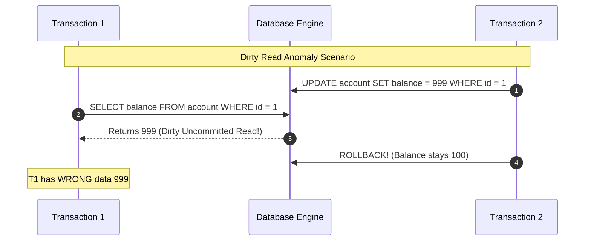

#### مثال 1: تطبيق عملي (محاكاة زمنية للـ Non-Repeatable Read)

```sql
-- Transaction 1 (Read Committed Level)
BEGIN;
SELECT status FROM orders WHERE order_id = 55; -- Returns 'PENDING'

-- [At this exact second, Transaction 2 runs: UPDATE orders SET status = 'SHIPPED' WHERE order_id = 55; COMMIT;]

-- Transaction 1 re-reads:
SELECT status FROM orders WHERE order_id = 55; -- Returns 'SHIPPED' (Non-Repeatable Read occurred!)
COMMIT;
```

#### مثال 2: فخ شائع (Confusing Non-Repeatable Read with Phantom Read)
- **Non-Repeatable Read**: يتعامل مع **تعديل/حذف صف موجود بالفعل** (UPDATE/DELETE on existing row).
- **Phantom Read**: يتعامل مع **إدراج صفوف جديدة لم تكن موجودة** (INSERT of new matching rows).

#### مثال 3: حالة إنتاج حقيقية (Preventing Phantom Reads in Seat Reservation Engines)
في تطبيق حجز تذاكر المسرح، المعاملة A تفحص المقاعد الفارغة في الصف الأول (تجد 2 مقعد). في نفس اللحظة المعاملة B تحجز المقعدين.
لمنع الـ Phantom Read وحجز نفس المقاعد، يتم استخدام **Pessimistic Locking (`SELECT ... FOR UPDATE`)** أو مستوى عزل `Repeatable Read / Serializable` لإقفال نطاق الصفوف المحددة.

> [!example] 🎯 مستوى التعمق متقدم

---

## Q20 — ما هو الـ Multi-Version Concurrency Control (MVCC) وكيف يتيح القراءة بدون قفل (Readers don't block Writers)?

### أصل الحكاية

في قواعد البيانات القديمة، عندما كان مبرمج يجري استعلام قراءة ممتد (`SELECT`), كان يقفل الصفوف، مما يمنع أي استعلام تعديل (`UPDATE/INSERT`) من العمل حتى تنتهي القراءة. 

تقنية **MVCC (Multi-Version Concurrency Control)** جاءت لتقضي على هذه المشكلة تماماً وحققت القاعدة الذهبية الحديثة:
> **"Readers NEVER block Writers, and Writers NEVER block Readers!"**
> (استعلامات القراءة لا تعطل التعديل، واستعلامات التعديل لا تعطل القراءة!)

كيف تعمل تقنية MVCC؟
عند تعديل صف في PostgreSQL أو MySQL InnoDB، المحرك **لا يمسح الصف القديم على القرص فوراً!** بدلاً من ذلك، يقوم المحرك بإنشاء **نسخة جديدة (Tuple Version)** من الصف ويحتفظ بالنسخة القديمة مرفقة برقم المعاملة (`xmin` / `xmax`).
عندما يقرأ مستخدم البيانات، يرى النسخة المطابقة للـ **Snapshot (اللقطة الزمنية)** الخاصة بمعاملته، بينما يكتب المستخدم الآخر على النسخة الجديدة بحرية!

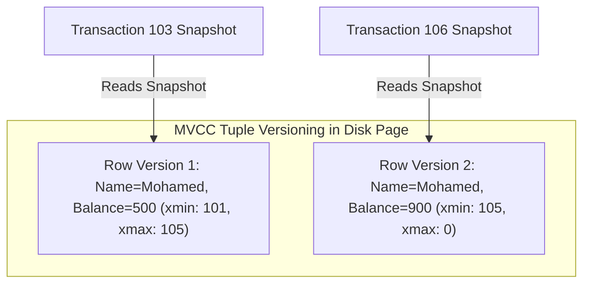

#### مثال 1: تطبيق عملي (معاينة الـ Internal Tuple Version Columns in Postgres)

```sql
-- PostgreSQL includes hidden system columns for MVCC tuple tracking
SELECT xmin, xmax, ctid, user_id, email 
FROM users;
-- xmin: The Transaction ID that INSERTED this tuple version
-- xmax: The Transaction ID that DELETED or UPDATED this tuple version (0 if active)
```

#### مثال 2: فخ شائع (PostgreSQL Table Bloat due to MVCC & Un-vacuumed Dead Tuples)
لأن MVCC تحتفظ بالنسخ القديمة للصفوف عند التعديل والمسح، فإن هذه الصفوف الميتة (**Dead Tuples**) تتراكم وتزيد حجم الجدول على الديسك (Table Bloat).
في PostgreSQL، توجد عملية خلفية اختيارية تسمى **`VACUUM`** تقوم بتنظيف الـ Dead Tuples وإعادة تحرير المساحة!

#### مثال 3: حالة إنتاج حقيقية (Long Running Analytical Reports without Blocking Live Writes)
استخراج تقرير مالي يستغرق 30 دقيقة على قاعدة بيانات تشغيلية حية.
بفضل MVCC، يعمل التقرير على Snapshot ثابتة من لحظة بدء الاستعلام، بينما يستمر مئات آلاف العملاء في الشراء والتعديل على الجدول دون أن يختنق التقرير أو يتعطل العملاء!

> [!example] 🎯 مستوى التعمق متقدم

---

## Q21 — ما الفرق الجوهري بين الـ Optimistic Locking والـ Pessimistic Locking ومتى تختار كلاً منهما؟

### أصل الحكاية

عند تصميم تطبيق يتفاعل فيه عدة مستخدمين مع نفس البيانات في نفس اللحظة، نحتاج لمعالجة التضارب (Concurrency Control). تبرز هنا استراتيجيتان معماريتان:

1. **`Pessimistic Locking` (الإقفال التشائمي)**:
   - **الفلسفة**: "التضارب سيحدث حتماً! سأقفل الصف فوراً وأمنع أي شخص من لمسه حتى أنتهي."
   - **الآلية**: استخدام `SELECT ... FOR UPDATE` لإقفال الصف على مستوى الداتابيز.
   - **متى تختاره؟**: في البيئات ذات التضارب العالي جداً (High Contention)، والعمليات الحساسة التي يتكلف التراجع عنها مجهوداً ضخماً.

2. **`Optimistic Locking` (الإقفال التفاؤلي)**:
   - **الفلسفة**: "التضارب نادر الحدوث. سأترك الجميع يقرأ ويجهز التعديل بحرية، وعند الحفظ سأتأكد أنه لم يقم أحد بتعديل الصف قبلي."
   - **الآلية**: إضافة عمود ترقيم `version` في الجدول. عند التعديل نتحقق: `WHERE id = 1 AND version = current_version`.
   - **متى تختاره؟**: في بيئات الـ Web الحديثة ذات القراءة الكثيفة والتضارب المنخفض (Low Contention), حيث يمنع معالجة القفل على مستوى قواعد البيانات.

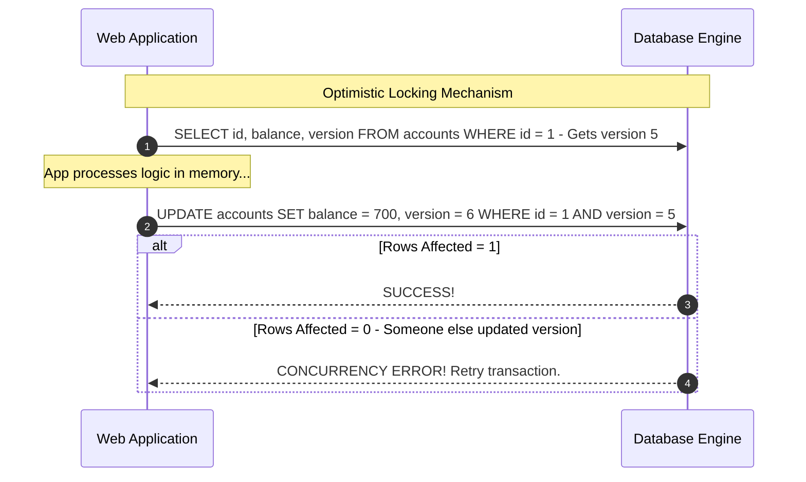

#### مثال 1: تطبيق عملي (تطبيق الـ Optimistic vs Pessimistic Locking)

**تطبيق Optimistic Locking (مع عمود version):**
```sql
-- Schema with Version Column
CREATE TABLE products (
    product_id BIGINT PRIMARY KEY,
    title VARCHAR(100),
    stock_quantity INT,
    version INT NOT NULL DEFAULT 1 -- Version Tracking Counter
);

-- Atomic Optimistic Update
UPDATE products 
SET stock_quantity = stock_quantity - 1,
    version = version + 1
WHERE product_id = 101 AND version = 3; -- If version changed, update fails cleanly!
```

**تطبيق Pessimistic Locking (مع FOR UPDATE):**
```sql
BEGIN;
-- Locks row 101 exclusively until COMMIT/ROLLBACK
SELECT stock_quantity 
FROM products 
WHERE product_id = 101 
FOR UPDATE;

UPDATE products SET stock_quantity = stock_quantity - 1 WHERE product_id = 101;
COMMIT;
```

#### مثال 2: فخ شائع (Pessimistic Locks across User Thinking Time)
إبقاء الـ Pessimistic Lock مفتوحاً أثناء انتظار إدخال المستخدم لبياناته في الشاشة. إذا ترك المستخدم الشاشة وذهب لتناول القهوة، يظل الصف مقفلاً في الداتابيز ويتعطل باقي الموظفين!
**قاعدة**: لا تضع Pessimistic Lock إلا داخل معاملة برمجية سريعة جداً تنفذ في ملي ثانية.

#### مثال 3: حالة إنتاج حقيقية (Flash Sale Inventory Allocation Strategy)
في تخفيضات الجمعة البيضاء على متجر الكتروني (آلاف العشاق يحاولون شراء 100 جهاز أيفون في نفس الثانية):
الـ Optimistic Locking سيفشل لدرجة أن 99% من المحاولات ستصطدم بـ Version Error وإعادة المحاولة ستخنق السيرفر.
الأسلوب الإنتاجي الأسرع: استخدام `UPDATE products SET stock = stock - 1 WHERE id = 101 AND stock > 0` الذري كـ Atomic Counter أو استخدام Redis Distributed Lock.

> [!example] 🎯 مستوى التعمق متقدم

---

## Q22 — كيف تحدث الـ Deadlocks في قواعد البيانات وكيف تصمم استعلاماتك لتفاديها؟

### أصل الحكاية

الـ **Deadlock (الانغلاق التام / المأزق)** هو حالة شلل تعبر عن دائرة مفرغة بين معاملتين متزاعمتين:
- المعاملة A ممسكة بالقفل على الصف (1) وتنتظر القفل على الصف (2).
- المعاملة B ممسكة بالقفل على الصف (2) وتنتظر القفل على الصف (1).

لا يمكن لأي منهما التقدم، وسينتظران للأبد ما لم يتدخل محرك قواعد البيانات!

محركات قواعد البيانات الحديثة تمتلك **Deadlock Detector Engine** يعمل خلف الكواليس. عندما يكتشف الدائرة المفرغة، يقوم فوراً بإنهاء وتضحية إحدى المعاملتين (**Deadlock Victim**) وإلغائها بـ `ROLLBACK` وتصدير خطأ `Deadlock Detected (SQLSTATE 40001)`, ليتيح للمعاملة الأخرى المرور.

```mermaid
graph LR
    T1[\"Transaction 1\"] -->|Holds Lock| R1[\"Row 1: Customer A\"]
    T1 -->|Waiting for Lock| R2[\"Row 2: Customer B\"]
    T2[\"Transaction 2\"] -->|Holds Lock| R2
    T2 -->|Waiting for Lock| R1
```

#### مثال 1: تطبيق عملي (سيناريو حدوث Deadlock وكيفية التغلب عليه)

السيناريو المسبب لـ Deadlock (ترتيب غير موحد للأقفال):

```sql
-- Transaction 1
BEGIN;
UPDATE accounts SET balance = balance - 100 WHERE account_id = 101; -- Locks 101
UPDATE accounts SET balance = balance + 100 WHERE account_id = 202; -- Waiting for 202...

-- Transaction 2 (Runs simultaneously with inverse order!)
BEGIN;
UPDATE accounts SET balance = balance - 50 WHERE account_id = 202;  -- Locks 202
UPDATE accounts SET balance = balance + 50 WHERE account_id = 101;  -- DEADLOCK DETECTED!
```

**الحل المعماري الذهبي للوقاية من Deadlocks:**
> **"دائماً اطلب الأقفال بنفس الترتيب الموحد الصارم في جميع أجزاء التطبيق!" (Deterministic Lock Ordering)**

```sql
-- ALWAYS order table keys before updating in any transaction!
-- Sort IDs: min(101, 202) = 101 FIRST, max = 202 SECOND!
BEGIN;
UPDATE accounts SET balance = balance - 100 WHERE account_id = 101; -- Always 101 first!
UPDATE accounts SET balance = balance + 100 WHERE account_id = 202; -- Always 202 second!
COMMIT;
```

#### مثال 2: فخ شائع (Unindexed Foreign Keys causing Table-level Deadlocks)
نسيان وضع Index على عمود الـ Foreign Key في الجدول الابن. 
عند حذف أو تعديل الأب، يضطر المحرك لإجراء Full Table Scan وقفل الجدول الابن بالكامل، مما يسبب Deadlocks مع استعلامات أخرى بريئة!

#### مثال 3: حالة إنتاج حقيقية (Deadlock Retry Handler in Application Layer)
مهما بلغت جودة التخطيط، قد تحدث Deadlocks بنسبة ضئيلة في الأنظمة الضخمة.
الممارسة الإنتاجية المعتمدة هي إضافة **Automatic Retry Logic** في كود التطبيق لالتقاط الاستثناء وإعادة المحاولة 3 مرات بـ Exponential Backoff.

> [!example] 🎯 مستوى التعمق متقدم

---

## Q23 — ما هي الـ Savepoints وكيف تدير الـ Partial Rollback داخل المعاملات الطويلة؟

### أصل الحكاية

في المعاملات المعقدة التي تحتوي على خطوات متعددة، لو حدث خطأ فرعي غير حرج في الخطوة رقم 4 من أصل 5 خطوات... التراجع بـ `ROLLBACK` عادي يمسح المعاملة بالكامل من الخطوة الأولى!

الـ **`SAVEPOINT` (نقطة الحفظ الفرعية)** تتيح لك وضع علامة داخل المعاملة الممتدة، بحيث إذا فشلت خطوة فرعية، يمكنك التراجع فقط إلى هذه النقطة المحدد (**Partial Rollback**) واستكمال باقي خطوات المعاملة بنجاح دون خسارة العمل السابق!

```mermaid
graph TD
    A[BEGIN TRANSACTION] --> B["Step 1: Create Order"]
    B --> C["SAVEPOINT after_order_created"]
    C --> D["Step 2: Try Send Non-Critical SMS Notification"]
    D -->|SMS Service Error!| E["ROLLBACK TO SAVEPOINT after_order_created"]
    E --> F["Step 3: Continue & Process Payment"]
    F --> G[COMMIT TRANSACTION]
```

#### مثال 1: تطبيق عملي (استخدام SAVEPOINT و ROLLBACK TO SAVEPOINT)

```sql
BEGIN;

-- Step 1: Insert Master Order
INSERT INTO orders (order_id, customer_id, total_amount) 
VALUES (9001, 101, 250.00);

-- Create a checkpoint
SAVEPOINT sp_inventory_allocated;

-- Step 2: Try updating external promotion points
INSERT INTO customer_rewards (customer_id, points) 
VALUES (101, 50);

-- If rewards failed due to constraint, rollback ONLY to savepoint
ROLLBACK TO SAVEPOINT sp_inventory_allocated;

-- Step 3: Order insertion is STILL SAFE! Commit the core order.
COMMIT;
```

#### مثال 2: فخ شائع (Expecting SAVEPOINT to Releases Locks)
اعتقاد أن التراجع لنقطة `ROLLBACK TO SAVEPOINT` يحرر الأقفال التي تم حجزها بعد هذه النقطة. الأقفال تظل ممسوكة في الذاكرة حتى صدور `COMMIT` أو `ROLLBACK` النهائي للمعاملة كلها!

#### مثال 3: حالة إنتاج حقيقية (Batch Processing Error Isolation)
عند معالجة ملف يحتوي 10,000 قيد حسابي دفعة واحدة داخل معاملة واحدة لضمان السرعة.
يتم وضع `SAVEPOINT` قبل كل سجل. إذا كان السجل رقم 500 فاسداً، يتم عمل `ROLLBACK TO SAVEPOINT` للسجل 500 فقط وتسجيل خطأ في لوج الأخطاء، واستكمال السجلات الـ 9,999 المتبقية حتى التثبيت النهائي!

> [!example] 🎯 مستوى التعمق متوسط

---

> [!tip] Checkpoint موديول المعاملات ومبادئ ACID
> **تم بحمد الله إكمال الموديول الثالث (المعاملات ومبادئ ACID - Q17 إلى Q23)!**
> 
> تم تغطية: الضمانات الجوهرية لمبادئ ACID، مستويات العزل الأربعة وتفاصيل ظواهر Dirty Read و Non-Repeatable Read و Phantom Read، آلية عمل الـ MVCC للقراءة بدون قفل، المقارنة بين Optimistic و Pessimistic Locking، الهندسة الوقائية لمنع الـ Deadlocks، وإدارة التراجع الجزئي عبر الـ Savepoints.
> 
> الموديول القادم: **الأداء والفهارس (Performance & Indexes)** للغوص في أعماق محركات البحث وتحليل الاستعلامات.

---

### 📖 قبل ما نبدأ: ليه الأداء بيبقى مشكلة مع الوقت؟

عند إنشاء أي قاعدة بيانات جديدة، الكود والاستعلامات بتشتغل بسرعة البرق (1 ملي ثانية)، والتطبيق بيبدو مثالي. لكن بعد سنة أو سنتين، لما جداول البيانات تنمو من 1,000 صف إلى 50 مليون صف، تفاجأ بأن الصفحات بدأت تأخذ 15 ثانية للتحميل والسيرفر يسقط تحت الضغط!

سبب المشكلة الرئيسي: **غياب الفهارس المناسبة (Missing Indexes)**.

#### المشكلة التصميمية قبل الفهارس:
بدون الفهارس، لما تطلب من الداتابيز: `SELECT * FROM users WHERE email = 'm@ex.com'`, المحرك بيضطر يعمل **Full Table Scan (Sequential Scan)** — يعني يقرا كل صف من الـ 50 مليون صف على القرص الصلب صفاً صفاً ليجد الصف المطلوب!

#### إيه اللي كان بيحصل لما نحلها بالطريقة العادية (من غير B-Tree Indexes)؟
المحرك بيقرا كل الـ Pages من الديسك للـ RAM:
- عدد الصفوف: 50,000,000
- الوقت المستغرق في Full Scan: **~12 ثانية**
- استهلاك الـ Disk I/O: **100% High Load**

بينما عند بناء **B-Tree Index** على عمود الـ `email`:
المحرك يبحث داخل هيكل الشجرة المتزنة بتعقيد زمني $O(\log N)$:
- عدد الخطوات للوصول للهدف: **~4 خطوات فقط!**
- الوقت المستغرق: **0.2 ملي ثانية (Instant Result!)**

#### إمتى بالظبط تحس إنك محتاج Index؟ (الإشارات والـ Symptoms)
* عمود يظهر بكثرة في شروط التصفية `WHERE` أو شروط الربط `JOIN` أو الترتيب `ORDER BY`.
* ظهور `Seq Scan` بزمن مرتفع عند قراءة خطة الاستعلام بـ `EXPLAIN ANALYZE`.

#### إمتى **ماتستخدمش** Index؟ (فخ الفهارس المفرطة)
* **الجداول الصغيرة جداً** (أقل من 1000 صف): الـ Full Scan أسرع من قراءة الفهرس ثم الذهاب للجدول!
* **الأعمدة كثيرة التعديل والتحديث (`INSERT/UPDATE` Heavy)**: كل Index جديد يتبطئ عمليات الكتابة لأن المحرك يضطر لتحديث الشجرة مع كل تغيير!

---

## Q24 — كيف يعمل الـ B-Tree Index فعلياً في ذاكرة وقرص قاعدة البيانات؟

### أصل الحكاية

هيكل **B-Tree (Balanced Tree)** هو الهيكل الافتراضي والأكثر انتشاراً للفهارس في جميع قواعد البيانات العلائقية (PostgreSQL, MySQL, Oracle, SQL Server).

كيف يترتب الـ B-Tree على القرص؟
الـ B-Tree ينظم قيم العمود في شجرة متوازنة ذات مستويات متعددة:
1. **Root Node**: العقدة الجذرية الأعلى.
2. **Internal Nodes**: العقد الوسطية للملاحة والتقسيم.
3. **Leaf Nodes (الأوراق السفلية)**: تحوي القيم المرتبة مضافاً إليها مؤشرات البايتات التابعة للسجل على القرص (**Tuple Pointer / Item Pointer `ctid`**).

ميزة الشجرة المتوازنة أن أطول مسار للوصول لأي ورقة يعادل أقصر مسار، مما يضمن أن البحث عن أي قيمة في مليار صف يتم في عدد قليل جداً من قراءات الصفحات ($O(\log N)$).

```mermaid
graph TD
    Root["Root Node: K=50"] --> LeftLeaf["Internal Node: K=20 | K=35"]
    Root --> RightLeaf["Internal Node: K=70 | K=90"]
    
    LeftLeaf --> L1["Leaf: Key 10 => Pointer ctid_1"]
    LeftLeaf --> L2["Leaf: Key 20 => Pointer ctid_2"]
    RightLeaf --> L3["Leaf: Key 70 => Pointer ctid_3"]
    RightLeaf --> L4["Leaf: Key 90 => Pointer ctid_4"]
```

#### مثال 1: تطبيق عملي (إنشاء واختبار B-Tree Index في PostgreSQL)

```sql
-- Create Standard B-Tree Index (Default Index Type)
CREATE INDEX idx_users_email ON users USING btree (email);

-- Index accelerates Range Queries and Exact Match Queries
SELECT user_id, full_name 
FROM users 
WHERE email = 'mkhaled@example.com';
```

#### مثال 2: فخ شائع (Functions on Indexed Columns Breaking Index Usage)
استخدام دالة على العمود المفهرس داخل قسم `WHERE` يمنع محرك الاستعلام من استخدام الـ B-Tree Index ويجبره على العودة للـ Full Table Scan!

```sql
-- BAD PITFALL: LOWER() function breaks the B-Tree index lookup!
SELECT * FROM users WHERE LOWER(email) = 'mkhaled@example.com'; -- Uses Full Scan!

-- EFFICIENT ALTERNATIVE: Use Expression Index OR case-insensitive type (CITEXT)
CREATE INDEX idx_users_lower_email ON users (LOWER(email)); -- Expression Index!
```

#### مثال 3: حالة إنتاج حقيقية (Index Fragmentation & B-Tree Page Splits)
عند إدراج قيم عشوائية غير مرتبة (مثل `UUID v4`) كـ Primary Key مفهرس بـ B-Tree:
تحدث عملية تسمى **Page Split**. الشجرة تضطر لكسر صفحات الذاكرة في المنتصف لإعادة الاتزان، مما يسبب تشظي الفهرس (Index Fragmentation) وبطء الكتابة.
الحل الإنتاجي: استخدام مفاتيح مرتبة زمنياً مثل **UUID v7 / Sequential Identity** لتتم الإضافة دائماً في أقصى يمين الشجرة بدون Page Splits.

> [!example] 🎯 مستوى التعمق متقدم

---

## Q25 — ما هي الـ Composite Indexes وما هي قاعدة العمود الأكثر تصفية (Leftmost Prefix Rule)؟

### أصل الحكاية

عندما يحتوي استعلام على عدة شروط تصفية (مثل `WHERE tenant_id = 5 AND status = 'ACTIVE'`), فإن الفهرس الفردي على عمود واحد لا يعطي الأداء الأقصى. 

الـ **Composite Index (الفهرس المركب)** هو فهرس يجمع عدة أعمدة معاُ في شجرة واحدة `(col1, col2, col3)`.

قاعدة البادئة اليسرى (**Leftmost Prefix Rule**):
ترتيب الأعمدة داخل الفهرس المركب حاسم ومحوري! محرك قاعدة البيانات يستطيع استخدام الفهرس **فقط إذا كان الاستعلام يحتوي على البادئة اليسرى للأعمدة بترتيبها!**

فهرس على `(tenant_id, status, created_at)` يستطيع تسريع:
- `WHERE tenant_id = X` (يستخدم الفهرس)
- `WHERE tenant_id = X AND status = Y` (يستخدم الفهرس)
- `WHERE tenant_id = X AND status = Y AND created_at = Z` (يستخدم الفهرس)

ولكنه **لا يستطيع** تسريع:
- `WHERE status = Y` (يلغي الفهرس ويفعل Full Scan لأن tenant_id غائب!)
- `WHERE created_at = Z` (يلغي الفهرس!)

```mermaid
graph TD
    subgraph "Composite Index: (country, city)"
        A["Egypt, Cairo"] --> B["Egypt, Giza"]
        B --> C["Saudi, Riyadh"]
    end
    NoteNode["Sorted FIRST by Country, SECOND by City!<br/>Searching by City ALONE cannot use this tree!"]
```

#### مثال 1: تطبيق عملي (إنشاء واستغلال Composite Index)

```sql
-- High selectivity column FIRST, lower selectivity SECOND
CREATE INDEX idx_orders_customer_status ON orders (customer_id, status);

-- Fast Index Scan Query (Uses Leftmost Rule)
SELECT * FROM orders 
WHERE customer_id = 101 AND status = 'PENDING';
```

#### مثال 2: فخ شائع (Wrong Column Ordering in Composite Index)
وضع العمود المنخفض التحديدية (Low Selectivity Column مثل `gender` أو `boolean_flag`) في أول الفهرس المركب `(gender, user_id)`.
التصميم الصحيح: ضع العمود الأكثر تحديداً وفلترة (**High Selectivity Column**) في يسار الفهرس أولاً.

#### مثال 3: حالة إنتاج حقيقية (Optimizing Multi-Column E-Commerce Range Queries)
في استعلام بحث المنتجات: `WHERE category_id = 10 AND price BETWEEN 100 AND 500 ORDER BY created_at DESC`.
القاعدة الذهبية لصياغة الفهرس المركب المثالي لهذا الاستعلام هي **قاعدة ESR (Equality, Sort, Range)**:
1. ضع أعمدة المساواة أولاً (`category_id`).
2. ضع أعمدة الترتيب ثانياً (`created_at`).
3. ضع أعمدة النطاق ثالثاً (`price`).
`CREATE INDEX idx_perfect ON products (category_id, created_at DESC, price);`

> [!example] 🎯 مستوى التعمق متقدم

---

## Q26 — ما هو الـ Covering Index وكيف يتيح تنفيذ الاستعلام بدون قراءة الـ Heap Table (Index-Only Scan)؟

### أصل الحكاية

في البحث العادي بـ Index Scan:
المحرك يقرأ شجرة الـ Index ليجد قيمة المفتاح، ثم يأخذ المؤشر (`ctid`) ويذهب للقرص لقراءة باقي أعمدة الصف من جدول الـ Heap الأصلي (**Heap Fetch**).

الـ **Covering Index (الفهرس المغطي)** هو فهرس مصمم بحيث يحتوي على **جميع الأعمدة التي يطلبها الاستعلام** (سواء في الـ `SELECT` أو الـ `WHERE`).

عندما يجد المحرك كل الأعمدة المطلوبة متوفرة داخل شجرة الفهرس نفسها، فإنه ينفذ أسرع نمط قراءة في قواعد البيانات على الإطلاق: **`Index-Only Scan`** — القفز التام عن قراءة جدول الـ Heap على القرص والتصفح السريع من الـ Index مباشرة!

في PostgreSQL الحديثة، يمكن استخدام الكلمة المفتاحية **`INCLUDE`** لإضافة أعمدة للعرض فقط في أوراق الفهرس دون إقحامها في ترتيب شجرة البداية!

```mermaid
graph LR
    subgraph "Traditional Index Scan (Two Reads)"
        A[B-Tree Index Scan] -->|Get Pointer ctid| B[Heap Table Read on Disk]
    end

    subgraph "Index-Only Scan via Covering Index (One Read)"
        C[B-Tree Index Scan contains ALL required columns!] --> D[Instant Output!]
    end
```

#### مثال 1: تطبيق عملي (إنشاء Covering Index باستخدام INCLUDE)

```sql
-- Fast Covering Index: Index key is email, but full_name is INCLUDED in leaf nodes
CREATE INDEX idx_users_email_covering ON users (email) INCLUDE (full_name);

-- EXPLAIN ANALYZE will show: Index Only Scan! (Zero Heap Fetches!)
SELECT email, full_name 
FROM users 
WHERE email = 'mkhaled@example.com';
```

#### مثال 2: فخ شائع (Bloating Index with SELECT * in Covering Index)
محاولة محاكاة Covering Index بإضافة كل أعمدة الجدول داخل الفهرس. هذا يضخم حجم الفهرس ليعادل حجم الجدول نفسه ويدمر أداء الكتابة!
**الغطاء يوضع فقط للاستعلامات ذات الحرارة العالية (Hot Queries) التي تكرر استرجاع أعمدة محددة بكثرة.**

#### مثال 3: حالة إنتاج حقيقية (High-Throughput User Authentication Query Optimization)
في نظام يسجل دخول 50,000 مستخدم في الثانية. الاستعلام يطلب: `SELECT user_id, password_hash, status FROM users WHERE email = ?`.
بناء Covering Index: `CREATE INDEX idx_auth ON users (email) INCLUDE (user_id, password_hash, status);` يحول استعلام تسجيل الدخول إلى Index-Only Scan ينفذ في أقل من 0.05 ملي ثانية.

> [!example] 🎯 مستوى التعمق متقدم

---

## Q27 — ما الفرق بين الـ Clustered Index والـ Non-Clustered Index في تخزين البيانات التابعة؟

### أصل الحكاية

الفرق بين الـ Clustered والـ Non-Clustered Index يكمن في **كيفية الترتيب الفيزيائي للصفوف على القرص الصلب**:

1. **`Clustered Index` (الفهرس العنقودي / الرئيسي)**:
   - ينظم ويرتب صفوف الجدول البيانات **فيزياءً وحقيقةً على الديسك** بنفس ترتيب الفهرس!
   - الجدول لا يستطيع امتلاك إلا **Clustered Index واحد فقط** (لأن الصفوف الفيزيائية لا يمكن ترتيبها على القرص في مكانين في نفس الوقت).
   - في MySQL InnoDB، الـ Primary Key هو دائماً الـ Clustered Index المدمج (Index-Organized Table).

2. **`Non-Clustered Index` (الفهرس غير العنقودي / الثانوي)**:
   - هيكل مجاور مستقل عن الجدول. يحتوي فقط على العمود المفهرس مضافاً إليه مؤشر يشار به إلى مكان الصف في الـ Clustered Index أو الـ Heap Page.
   - الجدول يستطيع امتلاك **عشرات الـ Non-Clustered Indexes**.

```mermaid
graph TD
    subgraph "Clustered Index (Physical Data is the Leaf Nodes)"
        A["Primary Key B-Tree"] --> B["Leaf Page: Contains FULL Row Data"]
    end

    subgraph "Non-Clustered Index (Secondary Lookup)"
        C["Secondary B-Tree Index"] --> D["Leaf Page: Contains Secondary Key + Primary Key Pointer"]
        D -->|Secondary Lookup| A
    end
```

#### مثال 1: تطبيق عملي (الفرق التنفيذي في MySQL InnoDB)

في MySQL InnoDB:
- البند الأول: الـ Primary Key هو الـ Clustered Index. أوراق الشجرة تحوي الصف كاملاً.
- البند الثاني: الفهرس الثانوي على `email` يحوي `email` + الـ `Primary Key`. عند البحث بـ email، يقرأ محرك MySQL الشجرة الثانوية ليجد الـ Primary Key، ثم يجري **Double Lookup** في الشجرة الرئيسية للوصول لباقي الأعمدة!

```sql
-- MySQL InnoDB Execution Engine Model
CREATE TABLE accounts (
    account_id BIGINT PRIMARY KEY, -- Clustered Index (Physical Row Location)
    email VARCHAR(100) UNIQUE,     -- Non-Clustered Secondary Index
    balance NUMERIC(12,2)
);
```

#### مثال 2: فخ شائع (PostgreSQL CLUSTER Command Misconception)
في PostgreSQL، جميع الفهارس هي Non-Clustered بافتراضياً (والبيانات تتخزن في Heap). أمر `CLUSTER table_name USING index_name` يعيد ترتيب الصفوف على الديسك مرة واحدة كعملية صيانة، ولكنه لا يحافظ على الترتيب مستقبلاً عند إدراج صفوف جديدة!

#### مثال 3: حالة إنتاج حقيقية (Sequential Range Scans on Clustered Index)
لماذا استعلامات النطاق `WHERE created_at BETWEEN Date1 AND Date2` تكون فائقة السرعة عندما يكون العمود هو الـ Clustered Index؟
لأن الصفوف مخزنة فيزياءً متجاورة في نفس الـ Disk Pages، فالمحرك يقرأ الصفحات متسلسلة بتكلفة I/O لا تذكر (Sequential Read).

> [!example] 🎯 مستوى التعمق متقدم

---

## Q28 — كيف تقرأ وتحلل خطط تنفيذ الاستعلامات (EXPLAIN ANALYZE) وتكتشف نقاط الاختناق؟

### أصل الحكاية

عندما تبطؤ استعلامات الداتابيز، التخمين لا يفيد! الأدوات المعيارية لتشخيص الأداء هي قراءة **خطة تنفيذ الاستعلام (Query Execution Plan)** باستخدام `EXPLAIN ANALYZE`.

الفرق بين الأمرين:
- **`EXPLAIN query`**: يعرض التقدير النظري المتوقع من محرك الـ Optimizer دون تنفيذ الاستعلام فعلياً.
- **`EXPLAIN ANALYZE query`**: **ينفذ الاستعلام حقيقةً على الداتابيز** ويقيس الوقت الفعلي المخصص لكل خطوة بالملي ثانية وميزانية الـ RAM المحدثة!

مصطلحات كشف الاختناق الرئيسية في PostgreSQL Execution Plans:
- **`Seq Scan` (Sequential Scan)**: الرمز الأحمر لأي بطء! معناه قراءة الجدول كاملاً بدون Index.
- **`Index Scan`**: استخدام الفهرس للوصول للصفوف المطلوب قراءتها من الـ Heap.
- **`Index Only Scan`**: أسرع مسار (قراءة من الفهرس فقط).
- **`Nested Loop`**: مناسب لربط الجداول الصغيرة.
- **`Hash Join / Merge Join`**: مناسب لربط الجداول الكبيرة.

```mermaid
graph TD
    A["EXPLAIN ANALYZE Output"] --> B{"Node Type?"}
    B -->|Seq Scan| C["WARNING: Missing Index on WHERE/JOIN columns!"]
    B -->|Index Scan| D["OK: Index is used"]
    B -->|Hash Aggregate| E["Check Memory Work_Mem allocation!"]
```

#### مثال 1: تطبيق عملي (تحليل مخرجات EXPLAIN ANALYZE في PostgreSQL)

```sql
-- Analyze Query Execution Plan
EXPLAIN (ANALYZE, BUFFERS, VERBOSE)
SELECT c.full_name, COUNT(o.order_id)
FROM customers c
JOIN orders o ON c.customer_id = o.customer_id
WHERE c.email LIKE 'a%'
GROUP BY c.full_name;
```

نموذج المخرجات والتحليل:
```text
HashAggregate  (cost=150.00..152.00 rows=200 width=40) (actual time=12.4..13.1 rows=180 loops=1)
  ->  Hash Join  (cost=40.00..130.00 rows=500 width=36) (actual time=2.1..8.5 rows=450 loops=1)
        Hash Cond: (o.customer_id = c.customer_id)
        ->  Seq Scan on orders o  (cost=0.00..75.00 rows=2000 width=16) (actual time=0.01..3.2 rows=2000 loops=1)
        ->  Hash  (cost=35.00..35.00 rows=400 width=28) (actual time=1.8..1.8 rows=400 loops=1)
              ->  Index Scan using idx_customers_email on customers c  ...
```
**تحليل الاختناق**: لاحظ وجود `Seq Scan on orders`؛ إضافة Index على `orders(customer_id)` سيحول الـ Hash Join إلى Index Scan ملحوظ السرعة!

#### مثال 2: فخ شائع (Ignoring Stale Table Statistics)
اعتماد الـ Query Optimizer على إحصائيات قديمة (Stale Statistics). إذا تم تغيير 5 ملايين صف دون تنفيذ `ANALYZE table_name`, قد يختار المحرك مسار تنفيذ كارثياً بناءً على إحصائيات قديمة خاطئة!

#### مثال 3: حالة إنتاج حقيقية (Work_Mem Spills to Disk during Heavy Sorts)
عند وجود `ORDER BY` أو `GROUP BY` ممتد، إذا كانت الذاكرة المخصصة للعمليات في Postgres (`work_mem`) غير كافية (مثل 4MB), يقوم المحرك بعمل **Spill to Disk (External Sort)** وكتابة النتائج على السواب الفردي على الديسك، مما يتبطئ الاستعلام 50 ضعفاً.
الحل: زيادة `work_mem` لهذا الجلسة التقريرية: `SET work_mem = '64MB';`.

> [!example] 🎯 مستوى التعمق متقدم

---

## Q29 — ما هي مشكلة N+1 في استعلامات قواعد البيانات وكيف تحلها على مستوى SQL؟

### أصل الحكاية

مشكلة الـ **N+1 Query Problem** هي واحدة من أكثر الثغرات القاتلة لأداء التطبيقات، وتحدث عادة عند استخدام أطر رسم الخرائط الكائنية (ORMs مثل Hibernate, Entity Framework, Prisma, TypeORM).

توصيف المشكلة:
بدلاً من جلب البيانات باستعلام واحد دقيق، يطلب التطبيق:
- **استعلام 1 أساسي**: لجلب قائمة تضم N عنصر (مثل 100 عمارة سكنية).
- **N استعلامات فرعية**: داخل Loop في كود التطبيق، يجري التطبيق استعلاماً منفصلاً لقراءة شقق كل عمارة على حدة!
إجمالي الاستعلامات المنفذة = $1 + 100 = 101$ استعلام على قاعدة البيانات بدلاً من استعلام واحد متكامل!

```mermaid
sequenceDiagram
    autonumber
    participant App as Application Code
    participant DB as Database Engine

    Note over App,DB: N+1 Query Disaster Loop
    App->>DB: 1. SELECT * FROM authors LIMIT 100; (Gets 100 Authors)
    loop For EACH of the 100 Authors
        App->>DB: 2. SELECT * FROM books WHERE author_id = current_author_id;
    end
    Note over App,DB: 101 Separate Network Round-Trips to Database!
```

#### مثال 1: تطبيق عملي (إصلاح N+1 على مستوى SQL و ORM)

**الكود المسبب للمشكلة (N+1 Queries):**
```sql
-- Query 1 (Main Query):
SELECT * FROM authors LIMIT 10;

-- Queries 2 to 11 (Executed 10 times in loop):
SELECT * FROM books WHERE author_id = 1;
SELECT * FROM books WHERE author_id = 2;
...
SELECT * FROM books WHERE author_id = 10;
```

**الحل المعماري على مستوى SQL (Single JOIN Query):**
```sql
-- Eager Loading Solution: Fetch everything in ONE Single Network Round-Trip!
SELECT 
    a.author_id, a.name, 
    b.book_id, b.title, b.price
FROM authors a
LEFT JOIN books b ON a.author_id = b.author_id
WHERE a.author_id IN (SELECT author_id FROM authors LIMIT 10);
```

#### مثال 2: فخ شائع (Cartesian Product Explosion with Multiple Joins)
حل N+1 بـ `JOIN` مفرط عبر عدة علاقات 1-to-Many متعدّدة في استعلام واحد (مثل Authors -> Books و Authors -> Articles). ينتج عن هذا مضروب ديكارتي يضخم الحجم ويرجع ملايين الصفوف المكررة في الـ RAM!
الحل في هذه الحالة: استخدام استعلامين اثنين فقط بـ `IN (id1, id2, ...)` بدلاً من JOIN ضخم.

#### مثال 3: حالة إنتاج حقيقية (JSON Aggregation in Postgres to Solve N+1 cleanly)
في PostgreSQL الحديثة، يمكنك تجميع الأبناء في كائن `JSONB` مدمج داخل نفس الاستعلام، ليحصل التطبيق على الداتا مهيكلة وجاهزة في استعلام واحد دون أي تفكيك:

```sql
-- Clean N+1 Prevention returning JSON Nested Objects directly from DB
SELECT 
    a.author_id, 
    a.name,
    COALESCE(
        jsonb_agg(
            jsonb_build_object('book_id', b.book_id, 'title', b.title)
        ) FILTER (WHERE b.book_id IS NOT NULL), '[]'::jsonb
    ) AS books
FROM authors a
LEFT JOIN books b ON a.author_id = b.author_id
GROUP BY a.author_id, a.name;
```

> [!example] 🎯 مستوى التعمق متقدم

---

## Q30 — ما هي الـ Partial Indexes والـ Expression Indexes ومتى تستخدمهما لتوفير المساحة والتسريع؟

### أصل الحكاية

الفهارس التقليدية تفهرس كل صف في الجدول بلا استثناء، مما يستهلك حجم تخزين ضخم على الديسك والذاكرة.

الفهارس المتخصصة توفر حلاً استثنائياً:

1. **`Partial Index` (الفهرس الجزئي)**:
   - يفهرس فقط **مجموعة جزئية من الصفوف** التي تطابق شرط `WHERE` معين.
   - ممتازه جداً عندما تكون المهتم بقراءته هو نسبة ضئيلة من بيانات الجدول (مثل الصفوف النشطة فقط `deleted_at IS NULL` أو المعاملات المعلقة `status = 'PENDING'`).

2. **`Expression Index` (فهرس التعبيرات والدوال)**:
   - يفهرس ناتج دالة أو معادلة حسابية على العمود (مثل `LOWER(email)` أو `DATE(created_at)`).
   - يسمح للمحرك باستخدام الفهرس حتى عند وجود دوال داخل الاستعلام!

```mermaid
graph TD
    subgraph "Full Table (10 Million Rows)"
        A["Completed Orders - 9.9M Rows - NOT INDEXED"]
        B["Pending Orders - 100K Rows - INDEXED"]
    end
    IndexNote["Partial Index Size is 99% Smaller than Full Index!"]
```

#### مثال 1: تطبيق عملي (إنشاء واستغلال Partial Index)

```sql
-- Partial Index: Indexes ONLY rows where status is 'PENDING'
CREATE INDEX idx_pending_orders ON orders (created_at) 
WHERE status = 'PENDING';

-- Query MUST match the partial index WHERE clause to be used!
SELECT order_id, customer_id 
FROM orders 
WHERE status = 'PENDING' AND created_at >= '2026-07-01';
```

#### مثال 2: فخ شائع (Partial Index Mis-matching Condition)
كتابة استعلام لا يحتوي على شرط الفهرس الجزئي في قسم الـ `WHERE`. 
إذا كان الفهرس مبيناً على `WHERE is_active = true`, واستدعي الاستعلام بدون `WHERE is_active = true`, فلن يستخدم المحرك الفهرس إطلاقاً!

#### مثال 3: حالة إنتاج حقيقية (Enforcing Partial Unique Constraints for Soft Delete)
في تطبيق يحتوي على خيار الحذف اللطيف (`deleted_at`), نريد ضمان أن البريد الإلكتروني فريد **فقط بين المستخدمين الأحيائيين (غير الممسوحين)**.
استخدام Unique Partial Index يحل هذا التحدي بأناقة:

```sql
-- Enforce Unique Email ONLY for active users
CREATE UNIQUE INDEX uk_active_user_email 
ON users (email) 
WHERE deleted_at IS NULL;

-- Allows re-registering with same email IF previous account was soft-deleted!
```

> [!example] 🎯 مستوى التعمق متقدم

---

> [!tip] Checkpoint موديول الأداء والفهارس
> **تم بحمد الله إكمال الموديول الرابع (الأداء والفهارس - Q24 إلى Q30)!**
> 
> تم تغطية: التجميع التخزيني والبحثي لهيكل B-Tree Index، قاعدة البادئة اليسرى Leftmost Prefix Rule في الـ Composite Indexes، الـ Covering Index لقفز قراءة الـ Heap، الترتيب الفيزيائي في الـ Clustered vs Non-Clustered Indexes، أساليب تحليل الخطط التنفيذية عبر EXPLAIN ANALYZE، معالجة مشكلة N+1 على مستوى SQL، واستغلال الـ Partial والـ Expression Indexes لتوفير مساحات القرص وتسريع الاستعلامات.
> 
> الموديول القادم: **التوسع في قواعد البيانات العلائقية (Scaling Relational DBs)** للانتقال من السيرفر الفردي إلى بنية الأنظمة الموزعة.

---

<!-- PROGRESS: last completed = Q30 | next = 📖 قبل ما نبدأ: التوسع في قواعد البيانات العلائقية | module = Scaling Relational DBs -->

### 📖 قبل ما نبدأ: ليه سيرفر داتابيز واحد مش هيكفّي مع النمو؟

عند بداية إطلاق التطبيق، سيرفر قاعدة بيانات واحد (Single Primary Database Server) بيحمل كل البيانات وبيعالج كل استعلامات القراءة والكتابة بدون مشاكل. 

لكن لما التطبيق ينمو من 10,000 مستخدم إلى 20 مليون مستخدم نشط يومياً، السيرفر الفردي بيصطدم بالحدود الفيزيائية للعتاد (CPU, RAM, Disk I/O Limits). السيرفر مش قادر يستوعب حجم الـ Traffic، والـ CPU يوصل 100%، وتظهر أخطاء `Too many connections`!

هنا يظهر التحدي الهندسي: **كيف نتوسع في قواعد البيانات (Database Scaling)؟**

أمامنا اتجاهين معماريين:
1. **الـ Vertical Scaling (التوسع الرأسي / Scale-Up)**: زيادة عتاد السيرفر نفسه (ترقية الـ RAM من 32GB إلى 512GB، وزيادة النوى من 8 إلى 64 Cores).
   - *المشكلة*: له سقف فيزيائي لا يمكن تجاوزه، وتكلفته المالاوية تتضاعف بشكل أسي (Exponential Cost Curve).
2. **الـ Horizontal Scaling (التوسع الأفقي / Scale-Out)**: توزيع الحمل على شبكة من السيرفرات المتعددة التي تعمل بالتوازي.
   - *الأسلوب الأول*: فصل القراءة عن الكتابة عبر الـ **Read Replicas**.
   - *الأسلوب الثاني*: تقييم البيانات وتوزيع الصفوف على عدة سيرفرات عبر الـ **Database Sharding**.

#### إمتى بالظبط تحس إنك محتاج Scaling؟ (الإشارات والـ Symptoms)
* ارتفاع نسبة استهلاك الـ CPU والـ Disk Read I/O على سيرفر الداتابيز الرئيسي بشكل دائم رغم وجود فهارس ممتازة.
* نسبة استعلامات القراءة تزيد عن 80% من إجمالي العمليات (Read-heavy Workload).

#### إمتى **ماتستخدمش** Sharding / Scaling معقد؟
* **الـ Premature Scaling (التوسع المبكر)**: تجنب إدخال Sharding أو Distributed DBs إذا كان سيرفر عادي ذو عتاد جيد يفي بالحاجة. الـ Sharding يزيد التعقيد المعماري 10 أضعاف ويحرمك من الـ ACID Transactions البسيطة والـ JOINs المباشرة!

---

## Q31 — ما هي الـ Read Replicas وكيف تحل مشكلة القراءات العالية (Read-heavy Workload) وما هو الـ Replication Lag؟

### أصل الحكاية

في معظم تطبيقات الـ Web والـ Mobile (مثل الصحف الإخبارية، التواصل الاجتماعي، المتجر الإلكتروني)، نمط استخدام البيانات يكون **Read-Heavy** بنسبة 90% قراءة مقابل 10% كتابة.

معمارية **Read Replicas (نسخ القراءة المكررة)** تعتمد على فصل السلطات:
- **`Primary (Master) Node`**: سيرفر رئيسي واحد فقط يستقبل **جميع عمليات الكتابة والتعديل (`INSERT`, `UPDATE`, `DELETE`)**.
- **`Read Replicas (Replica Nodes)`**: مجموعة سيرفرات فرعية ثانوية تستقبل التعديلات من السيرفر الرئيسي عبر الـ **Replication Stream** وتتولى خدمة **استعلامات القراءة فقط (`SELECT`)**.

التحدي الجوهري: **`Replication Lag` (فجوة التزامن الزمنية)**.
لأن التغيير يكتب أولاً في الـ Primary ثم ينتقل عبر الشبكة إلى الـ Replicas، قد تكون هناك فجوة زمنية (مثلاً 50 ملي ثانية). لو العميل عدل بروفايله ثم عمل Refresh فوراً وقرأ من Replica متأخرة، سيرى بياناته القديمة!

```mermaid
graph TD
    ClientWrites["Application Write Traffic"] -->|Primary Writes| Master["Primary DB Master"]
    Master -->|WAL Replication Stream| R1["Read Replica 1"]
    Master -->|WAL Replication Stream| R2["Read Replica 2"]
    
    ClientReads["Application Read Traffic"] -->|Load Balanced SELECTs| R1
    ClientReads -->|Load Balanced SELECTs| R2
```

#### مثال 1: تطبيق عملي (توجيه الاستعلامات في التطبيق - Read/Write Split)

في كود التطبيق، يتم تعريف كائنين اتصال (Two Connection Pools):

```javascript
// Production Pattern: Read/Write Connection Splitting
const writePool = new Pool({ host: 'primary-db.internal', port: 5432 });
const readPool  = new Pool({ host: 'replica-db-cluster.internal', port: 5432 });

async function updateUserBio(userId, newBio) {
    // Writes MUST go to Primary
    await writePool.query("UPDATE users SET bio = $1 WHERE id = $2", [newBio, userId]);
}

async function getUserProfile(userId) {
    // Reads can safely go to Replica cluster!
    return await readPool.query("SELECT * FROM users WHERE id = $1", [userId]);
}
```

#### مثال 2: فخ شائع (Read-Your-Own-Writes Consistency Pitfall)
مستخدم غير كلمته السرية في صفحة الإعدادات (تمت الكتابة على Primary). فوراً تم توجيه اعادة التوجيه لصفحة البروفايل، فقرأت الشاشة من Replica تعاني من 200ms Replication Lag، مما ظهر للمستخدم أن التعديل لم يحفظ!
**الحل**: الاستعلامات الحساسة التي تلي عمليات الكتابة مباشرة يجب أن تقرأ من الـ Primary حصراً (**Read-Your-Own-Writes Stickiness**).

#### مثال 3: حالة إنتاج حقيقية (Multi-Region Read Replicas for Global Low Latency)
في تطبيق عالمي يخدم مستخدمين في طوكيو ونيويورك ولندن.
السيرفر الرئيسي يقع في نيويورك (Primary). يتم نشر **Read Replicas في طوكيو ولندن**.
المستخدم في طوكيو يستعلم عن البيانات من Replica محلية في طوكيو (زمن استجابة 5ms بدلاً من 200ms عبر المحيطات!)، بينما تُرسل عمليات الكتابة فقط عبر الشبكة لنيويورك.

> [!example] 🎯 مستوى التعمق متقدم

---

## Q32 — ما الفرق الجوهري بين الـ Vertical Scaling والـ Horizontal Scaling في قواعد البيانات العلائقية؟

### أصل الحكاية

الجدول التقييمي لقرار التوسع المعماري بين خياري الـ Vertical والـ Horizontal Scaling:

- **Vertical Scaling (Scale-Up)**: زيادة إمكانيات السيرفر الحالي.
- **Horizontal Scaling (Scale-Out)**: إضافة سيرفرات جديدة للشبكة.

| المعيار / المقارنة | Vertical Scaling (Scale-Up) | Horizontal Scaling (Scale-Out) |
| :--- | :--- | :--- |
| **الآلية المعمارية** | زيادة RAM / CPU / NVMe SSD لنفس السيرفر | إضافة سيرفرات قواعد بيانات جديدة للشبكة |
| **تعقيد الكود والتطبيق** | 🟢 صفر تعقيد (الكود لا يتغير إطلاقاً) | 🔴 تعقيد مرتفع (توجيه الاستعلامات وإدارة التجزئة) |
| **دعم ACID Transactions** | 🟢 100% ACID مدمج دون أي مشاكل | 🟡 يتطلب Distributed Transactions (2PC / Saga) |
| **حدود التوسع (Limits)** | 🔴 له سقف فيزيائي لا يمكن تجاوزه | 🟢 غير محدود نظرياً (يمكن إضافة مئات السيرفرات) |
| **التكلفة المالية (Cost)** | 🔴 تزداد أسياً مع العتاد الفائق (Enterprise Specs) | 🟢 مرنة ومعتمدة على عتاد قياسي (Commodity Hardware) |
| **إمكانية التوقف (Downtime)** | 🔴 تتطلب عادة إعادة تشغيل السيرفر للترقية | 🟢 High Availability بدون أي توقف (Zero Downtime) |

#### مثال 1: تطبيق عملي (مراحل التوسع التدرجي الصحيحة)
1. **المرحلة الأولى**: تحسين الفهارس واستعلامات SQL وتفعيل Connection Pooling.
2. **المرحلة الثانية**: ترقية السيرفر رأسياً (Scale-Up من 8GB RAM إلى 64GB RAM).
3. **المرحلة الثالثة**: إضافة Read Replicas لتوزيع القراءات.
4. **المرحلة الرابعة**: اللجوء للـ Sharding عند تخطي التخزين حواجز الـ Terabytes والكتابة الفائقة.

#### مثال 2: فخ شائع (Jumping to Horizontal Sharding Prematurely)
تطبيق ناشئ يملك 50,000 صف يقرر المهندس بناء Sharded Database Architecture "استعداداً للمستقبل".
النتيجة: استنزاف وقت الفريق في حل مشاكل الـ Cross-shard queries وتوقف الميزات الجديدة، في حين أن السيرفر الصغير كان يستطيع خدمة التطبيق سنوات بسهولة!

#### مثال 3: حالة إنتاج حقيقية (Hybrid Scaling Strategy in AWS Aurora)
في الخدمات السحابية الحديثة مثل AWS Aurora / Google AlloyDB، يتم فصل طبقة التخزين (Storage Layer) الموزعة أفقياً على 6 نسخ عن طبقة المعالجة (Compute Layer) التي يتم توسيعها رأسياً عند الحاجة، مما يعطي مزيجاً ممتازاُ بين بساطة SQL والتوسع السحابي.

> [!example] 🎯 مستوى التعمق متوسط

---

## Q33 — ما هو الـ Database Sharding وما هي استراتيجيات التقسيم (Range, Hash, Directory-based Sharding)؟

### أصل الحكاية

عندما ينمو حجم جدول البيانات (مثل جدول الرسائل أو التحركات المالية) ليتجاوز عدة ترابايت، يقتنع الجميع أن سيرفر الكتابة الرئيسي الوحيد لم يعد يتسع لضغط الـ Writes والديسك.

عملية **Database Sharding (التجزئة الأفقية)** تعني: **تقسيم صفوف الجدول الواحد وتوزيعها على عدة سيرفرات قواعد بيانات مستقلة تماماً (تسمى Shards)**. كل Shard يحوي نفس هيكل الجدول ولكنه يحوي عينة جزئية فقط من الصفوف!

كيف تعرف الداتابيز على أي Shard تضع الصف؟ عبر مفتاح التجزئة **`Shard Key`**.

أشهر 3 استراتيجيات لتوزيع البيانات (Sharding Strategies):
1. **`Range-Based Sharding`**: تقسيم الصفوف حسب نطاق القيم (مثل المستخدمين من ID 1-1M في Shard 1، ومن 1M-2M في Shard 2).
   - *العيوب*: يسبب Hotspots (جميع الإدراجات الجديدة تضغط على الشارد الأخير فقط!).
2. **`Hash-Based Sharding`**: تطبيق دالة التجزئة `Hash(Shard_Key) % Total_Shards` لتوزيع الصفوف بعشوائية متزنة تماماً.
   - *المميزات*: توزيع متساوي للضغط والبيانات.
3. **`Directory-Based Sharding`**: جدول خدمات مجاور يحتفظ بخريطة تدل كل `tenant_id` يقع في أي Shard بالضبط.

```mermaid
graph TD
    ClientRequest["INSERT user_id = 105"] --> Router[Sharding Router / Proxy]
    Router -->|"Hash: 105 mod 3 = Shard 0"| S0[("Shard Node 0: Users 0-3M")]
    Router -->|"Hash: 106 mod 3 = Shard 1"| S1[("Shard Node 1: Users 3M-6M")]
    Router -->|"Hash: 107 mod 3 = Shard 2"| S2[("Shard Node 2: Users 6M-9M")]
```

#### مثال 1: تطبيق عملي (تطبيق Hash-Based Sharding Routing في كود التطبيق)

```javascript
// Application Level Hash Sharding Router Pattern
const crypto = require('crypto');

const SHARD_NODES = [
    new Pool({ host: 'db-shard-0.internal' }),
    new Pool({ host: 'db-shard-1.internal' }),
    new Pool({ host: 'db-shard-2.internal' })
];

function getShardNode(tenantId) {
    // Hash tenantId to ensure uniform distribution
    const hash = crypto.createHash('md5').update(tenantId.toString()).digest('hex');
    const shardIndex = parseInt(hash.substring(0, 8), 16) % SHARD_NODES.length;
    return SHARD_NODES[shardIndex];
}

async function insertOrder(tenantId, orderData) {
    const targetDb = getShardNode(tenantId);
    // Writes DIRECTLY to the designated shard node!
    await targetDb.query("INSERT INTO orders (tenant_id, amount) VALUES ($1, $2)", [tenantId, orderData.amount]);
}
```

#### مثال 2: فخ شائع (Choosing a Bad Shard Key)
اختيار `Shard Key` منخفض التحديدية مثل `country`. لو 80% من عملاء التطبيق من مصر، فسيصبح Shard مصر مضغوطاً بـ 80% من البيانات والـ Hotspots، بينما بقية الشاردز خاوية!
**قاعدة**: اختر Shard Key مرتفع التحديدية والموزع بانتظام مثل `user_id` أو `tenant_id`.

#### مثال 3: حالة إنتاج حقيقية (Multi-Tenant SaaS Sharding Strategy)
في منصات مثل Shopify، يمثل `store_id` (المتجر) الـ Shard Key الطبيعي. جميع بيانات متجر معين (المنتجات، الطلبات، العملاء) تعيش معاً في نفس السيرفر (Same Shard)، مما يتيح تنفيذ الـ JOINs والمعاملات داخل متجر المستخدم محلياً بسرعة فائقة!

> [!example] 🎯 مستوى التعمق متقدم

---

## Q34 — ما هي التحديات المعمارية الكبرى للـ Sharding (Distributed Joins, Cross-shard Transactions, Resharding)؟

### أصل الحكاية

الـ Sharding يحل مشكلة السعة والكتابة، ولكنه يلقي بظلال كوارثية على التعقيد الهندسي للتطبيق! بمجرد تقسيم قواعد البيانات إلى Shards، تفقد المميزات التقليدية لقواعد البيانات العلائقية:

أبرز 3 تحديات هندسية مرعبة للـ Sharding:

1. **`Cross-Shard JOINs` (مستحيل تنفيذ الـ JOIN عبر السيرفرات)**:
   إذا كان جدول العملاء على Shard 1، وجدول الطلبات على Shard 2، لن تتمكن من كتابة `JOIN` بسيط! ستضطر لقراءة البيانات في التطبيق وتجميعها يدوياً في الـ RAM.
2. **`Distributed Transactions` (غياب المعاملات الذرية البسيطة)**:
   تثبيت معاملة تجمع بين صفين في سيرفرين مختلفين يتطلب بروتوكولات معقدة مثل **Two-Phase Commit (2PC)** أو **Saga Pattern**، وهي بطيئة وعرضة للفشل الشبكي.
3. **`Resharding & Data Rebalancing` (معضلة إضافة سيرفر جديد)**:
   إذا كان لديك 4 Shards بـ Hash `% 4` وقررت إضافة Shard خامس... الدالة أصبحت `% 5`! هذا يعني أن **80% من بيانات الجداول يجب نقلها عبر الشبكة لسيرفرات جديدة** بينما التطبيق يعمل (Live Data Migration)!

```mermaid
graph TD
    subgraph "Cross-Shard Distributed Transaction Complexity"
        Coordinator[Transaction Coordinator] -->|1. Prepare| S1[Shard A]
        Coordinator -->|1. Prepare| S2[Shard B]
        S1 -->>|2. Prepared OK| Coordinator
        S2 -->>|2. Prepared OK| Coordinator
        Coordinator -->|3. Commit All| S1
        Coordinator -->|3. Commit All| S2
    end
    Note over Coordinator,S2: Two-Phase Commit (2PC) creates heavy network latency!
```

#### مثال 1: تطبيق عملي (استخدام Consistent Hashing لمنع إعادة نقل البيانات عند Resharding)

لتفادي نقل 80% من البيانات عند إضافة Shard جديد، تستخدم الأنظمة الموزعة تقنية **Consistent Hashing (حلقة الهاش)** بدلاً من الـ Modulo العادي.
عند إضافة سيرفر جديد، يتم نقل 1/N فقط من البيانات من السيرفر الملاجر دون مساس بقية السيرفرات!

#### مثال 2: فخ شائع (Global Unique Auto-Increment Key Collisions across Shards)
استخدام `Auto-Increment Integer` في الجداول المشردة. Shard 1 سينتج `id = 1` و Shard 2 سينتج `id = 1` أيضاً، مما يسبب تضارب المفاتيح عند تجميع التقارير!
**الحل**: استخدام **UUID v7** أو **Snowflake IDs** لتوليد مفاتيح فريدة وموزعة مركزياً.

#### مثال 3: حالة إنتاج حقيقية (Global Distributed SQL Engines - CockroachDB / YugabyteDB)
لتفادي معانات تطوير كود Sharding يدوياً في التطبيق، قامت الجيل الجديد من قواعد البيانات مثل **CockroachDB** و **Google Spanner** بتقديم **Distributed SQL**.
تظهر للمطور كأنها داتابيز Postgres واحدة تدعم الـ JOINs والـ ACID الكامل، ولكن المحرك نفسه يتولى الـ Auto-Sharding والـ 2PC خلف الكواليس باستخدام بروتوكولات الاتفاق الجماعي مثل **Raft / Paxos**.

> [!example] 🎯 مستوى التعمق متقدم

---

## Q35 — ما الفرق بين الـ Synchronous Replication والـ Asynchronous Replication وما أثر كل منهما على الـ Consistency والـ Performance؟

### أصل الحكاية

عند تكرار البيانات بين السيرفر الرئيسي (Primary) والنسخ الثانوية (Replicas)، يجب اختيار بروتوكول النقل الشبكي:

1. **`Asynchronous Replication` (التكرار غير المتزامن - الأسرع والأشهر)**:
   - **الآلية**: السيرفر الرئيسي يكتب التعديل على الديسك فوراً ويرجع نجاح للعميل (`COMMIT SUCCESS`). ثم يرسل التغيير للـ Replicas في الخلفية.
   - **الأداء**: ممتاز وفائق السرعة (Zero Latency Overhead).
   - **الخطورة**: لو السيرفر الرئيسي ضرب واكتوى قبل أن تصل التغييرات للـ Replica، ستحدث **خسارة حتمية للبيانات (Data Loss / RPO > 0)**!

2. **`Synchronous Replication` (التكرار المتزامن - الأضمن مطلقاً)**:
   - **الآلية**: السيرفر الرئيسي يكتب التعديل، ويرسله عبر الشبكة للـ Replica، وينتظر تأكيد الاستلام والـ Flush على ديسك الـ Replica **قبل أن يرجع نجاح للعميل!**
   - **الضمان**: صفر خسارة بيانات (Zero Data Loss Guarantee).
   - **الثمن**: كل عملية `INSERT/UPDATE` تصبح محبوسة بسرع الشبكة والـ Latency بين السيرفرات!

```mermaid
sequenceDiagram
    autonumber
    participant App as Web Application
    participant Primary as Primary DB
    participant Replica as Read Replica

    Note over App,Replica: Synchronous Replication Flow
    App->>Primary: INSERT INTO account...
    Primary->>Replica: Send WAL Logs via Network
    Replica-->>Primary: ACK: Written to Disk!
    Primary-->>App: COMMIT SUCCESS! - Slow but 100% Safe
```

#### مثال 1: تطبيق عملي (تطبيق Semi-Synchronous Replication في PostgreSQL)

لتفادي بطء الـ Synchronous التام والخطر التام للـ Asynchronous، تستخدم الأنظمة المتقدمة **Semi-Synchronous Replication**:
نطلب أن يتأكد التعديل على **سيرفر ثانوني واحد فقط على الأقل** متزامناً، بينما بقية النسخ تتلقى البيانات غير متزامنة!

```sql
-- postgresql.conf Settings
synchronous_commit = on
synchronous_standby_names = 'FIRST 1 (replica_node_1, replica_node_2)'
-- Guarantees AT LEAST ONE replica confirmed before returning success to app!
```

#### مثال 2: فخ شائع (Network Flapping hanging Synchronous Primary DB)
في التكرار المتزامن الكامل، إذا انقطع كابل الشبكة عن الـ Replica، فسيقف السيرفر الرئيسي (Primary) عن استقبال أي كتابة جديدة من العملاء ويتعطل التطبيق بالكامل لأن النسخة لا ترد!

#### مثال 3: حالة إنتاج حقيقية (RPO & RTO Decisions in Disaster Recovery)
في التخطيط للكوارث (Disaster Recovery):
- **`RPO` (Recovery Point Objective)**: كمية البيانات المسموح بفقدانها عند الكارثة. (مع Async RPO > 0, مع Sync RPO = 0).
- **`RTO` (Recovery Time Objective)**: الوقت المستغرق لإعادة تشغيل النظام بعد الكارثة.
الأنظمة المالية تشترط `Sync Replication` لمنع ضياع سنت واحد (RPO = 0)، بينما المنصات الاستهلاكية تقبل بـ Async لتوفير أقصى سرعة استجابة.

> [!example] 🎯 مستوى التعمق متقدم

---

## Q36 — كيف تدير الـ Database Connection Pooling (PgBouncer) وليه بدونها التطبيق بيسقط تحت الـ Traffic الضخم؟

### أصل الحكاية

في قواعد البيانات مثل PostgreSQL، عملية فتح اتصال شبكي جديد (**Creating a DB Connection**) عملية مكلفة جداً على الـ CPU والذاكرة!
كل اتصال جديد في Postgres يفتح عملية مستقلة في الـ OS (**Forking a Heavy OS Process**) وتستهلك حوالي 5MB إلى 10MB من الـ RAM لمجرد فتح الاتصال فقط!

لو أتى 2,000 طلب متزامن على التطبيق حاولوا فتح 2,000 DB Connection في نفس اللحظة:
- استهلاك الذاكرة: $2000 \times 10MB = 20GB$ RAM مفقودة فقط في حجز اتصالات خاوية!
- الـ CPU سيتوقف بسبب الـ Context Switching بين آلاف العمليات المتصارعة، ويسقط السيرفر بـ `FATAL: sorry, too many clients already`.

الحل المعماري: **`Connection Pooling` (مجمع ومجاري الاتصالات)**.
المجمع يحتفظ بعدد ثابت ومحدود من الاتصالات الحية المفتوحة مسبقاً (مثلاً 50 اتصال فقط). عندما يأتي طلب، يستعير اتصالاُ جاهزاً، ينفذ استعلامه في 2ms، ويعيده للمجمع فوراً لخدمة الطلب التالي!

```mermaid
graph TD
    ClientApps["10,000 Concurrent Web Clients"] -->|Short HTTP Requests| Proxy["Connection Pooler: PgBouncer"]
    Proxy -->|Reuses 50 Persistent Connections| DB[("PostgreSQL Database Server")]
    NoteNode["Keeps DB Engine running at optimal CPU efficiency without crashing!"]
```

#### مثال 1: تطبيق عملي (إعداد وإدارة PgBouncer أمام PostgreSQL)

أنماط الـ Pooling في PgBouncer:
1. **`Session Pooling`**: يخصص الاتصال للمستخدم طوال فترة الجلسة (الافتراضي).
2. **`Transaction Pooling`**: (الأكثر كفاءة وقوة!) يخصص الاتصال للطلب **فقط طوال مدة المعاملة**، وفور صدور `COMMIT` يعاد الاتصال فوراً للمجمع لخدمة عميل آخر!

```ini
; pgbouncer.ini Production Configuration
[databases]
app_db = host=127.0.0.1 port=5432 dbname=app_db

[pgbouncer]
listen_port = 6432
listen_addr = *
auth_type = md5
auth_file = /etc/pgbouncer/userlist.txt

; Pool Configuration
pool_mode = transaction ; Transaction Pooling for Maximum Throughput!
max_client_conn = 10000 ; Can handle 10k web clients!
default_pool_size = 50  ; Maps to ONLY 50 real connections on Postgres!
```

#### مثال 2: فخ شائع (Prepared Statements & Transaction Pooling Incompatibility)
استخدام `Transaction Pooling` مع الـ `Prepared Statements` القديمة بـ PostgreSQL.
لأن الـ Prepared Statement تخزن في ذاكرة الجلسة، والـ Transaction Pooling يغير الاتصال الفيزيائي بين كل معاملة وأخرى، ستضرب الاستعلامات بخطأ `Prepared statement does not exist`!
**الحل**: تفعيل `pgbouncer` بـ Prepared Statement Support الحديثة أو ضبط الـ ORM لاستخدام الاتصالات المباشرة.

#### مثال 3: حالة إنتاج حقيقية (Serverless Database Connections with Supabase / AWS RDS Proxy)
في معماريات الـ Serverless (AWS Lambda / Vercel Edge Functions)، يتم تشغيل آلاف الـ Functions القصيرة وإغلاقها كل ثانية.
بدون وجود **RDS Proxy / PgBouncer** أمام الداتابيز، ستسقط قاعدة البيانات في أول دقيقة بسبب غرق السيرفر في فتح وإغلاق الاتصالات المتلاحقة!

> [!example] 🎯 مستوى التعمق متقدم

---

> [!tip] Checkpoint موديول التوسع في قواعد البيانات العلائقية
> **تم بحمد الله إكمال الموديول الخامس (التوسع في قواعد البيانات العلائقية - Q31 إلى Q36)!**
> 
> تم تغطية: هندسة الـ Read Replicas ومعالجة الـ Replication Lag، المقارنة المعمارية بين Vertical و Horizontal Scaling، استراتيجيات الـ Database Sharding (Range, Hash, Directory)، التحديات الموزعة الكبرى (Cross-shard joins, 2PC, Resharding)، المقايضات بين Synchronous و Asynchronous Replication، وحماية السيرفر بإنشئ الـ Connection Pooling عبر PgBouncer.
> 
> الموديول القادم: **عالم قواعد البيانات اللاعلائقية (NoSQL Landscape)** للانتقال إلى نماذج تخزين البيانات غير العلائقية.

---

### 📖 قبل ما نبدأ: طالما عندي SQL، ليه أصلاً محتاج NoSQL؟

عطيلة عقود طويلة، كانت قواعد البيانات العلائقية (SQL) هي الخيار الأوحد والمهيمن لكل المشاريع. ولكن مع انفجار عصر الويب 2.0 وظهور منصات مثل Google و Facebook و Amazon في أوائل الألفينات، اصطدمت قواعد البيانات العلائقية بجدارين مسدودين:

1. **صلابة الـ Schema (Rigid Schema Flexibility)**:
   في قواعد بيانات SQL، إضافة عمود جديد لجدول يحتوي على 500 مليون صف يتطلب تنفيذ `ALTER TABLE` يقفل الجدول لعدة ساعات، ويمنع التطبيق من العمل! ومع البيانات غير المنتظمة (Unstructured / Semi-Structured Data) التي تتغير مواصفاتها لكل منتج، أصبحت الـ SQL Schema عائقاً شاقاً.
2. **صعوبة التوسع الأفقي لبيانات الترابايت (Scale-Out Limits)**:
   الـ SQL يعتمد على الـ JOINs والمعاملات المعقدة المترابطة. توزيع هذه البيانات على 100 سيرفر يقتل الأداء بسبب الـ Cross-shard network latencies.

من هنا ولدت حركة **`NoSQL` (Not Only SQL)**!

#### المشكلة التصميمية قبل NoSQL:
محاولة تخزين كتالوج منتجات متجر يحتوي على مليون منتج متفرع (ملابس بأحجام وألوان، إلكترونيات بمواصفات وشاشات، كتب بصفحات ومؤلفين).
في SQL، هذا يتطلب إنشاء 50 جدولاً مترابطاً وتخصيص EAV Pattern (Entity-Attribute-Value) بطيء جداً ومربك في القراءة!

#### إيه اللي كان بيحصل لما نحلها بالطريقة العادية (في NoSQL Document Model)؟
في قواعد بيانات NoSQL المستندية (زي MongoDB)، يتم تخزين كل منتج كـ **JSON Document** مستقل يحمل كافة خصائصه ذاتياً دون الحاجة لـ Schema مسبقة أو JOINs مع جداول أخرى:

```json
// Flexible NoSQL Document Storage
{
  "_id": "prod_101",
  "title": "Smart Watch",
  "specs": {
    "screen": "AMOLED",
    "water_resistant": true,
    "sensors": ["HeartRate", "GPS"]
  }
}
```

#### إمتى بالظبط تحس إنك محتاج NoSQL؟ (الإشارات والـ Symptoms)
* لما تكون طبيعة البيانات **متغيرة وغير ثابتة الهيكل** (Dynamic Attributes / Unstructured Payload).
* لما تكون بحاجة لـ **توسع أفقي ضخم جداً (High Throughput Write/Read Scale-Out)** على عشرات السيرفرات بتكلفة بسيطة.
* لما تكون طبيعة الوصول للبيانات معتمدة على المفتاح مباشرة (Key-Value) مثل الـ Caching والـ Sessions.

#### إمتى **ماتستخدمش** NoSQL؟
* **البيانات عالية الترابط والمعاملات المالية الصارمة**: لو بياناتك عبارة عن شبكة علائقية معقدة تتطلب ACID Transactions صارمة على عدة كيانات، الـ Relational SQL هو الخيار الأصح بلا منازع!

---

## Q37 — ما هي الأنواع الأربعة الرئيسية لقواعد البيانات اللاعلائقية (Document, Key-Value, Column-Family, Graph) ومتى تختار كلاً منها؟

### أصل الحكاية

كلمة NoSQL ليست تقنية واحدة، بل هي مظلة تجمع 4 عائلات من قواعد البيانات ذات نماذج تخزينية مختلفة تماماً:

1. **`Document Databases` (المستندية - مثل MongoDB, Couchbase)**:
   - **النموذج**: تخزن البيانات في وثائق JSON/BSON ذاتية التوصيل.
   - **أبرز الاستخدامات**: كتالوجات المنتجات، إدارة المحتوى (CMS)، والملفات الشخصية.
2. **`Key-Value Stores` (المفتاح والقيمة - مثل Redis, Memcached)**:
   - **النموذج**: قاموس بسيط جداً ربط مفتاح فريد بقيمة (Data Hash Table).
   - **أبرز الاستخدامات**: الـ Caching، إدارة الجلسات (Sessions)، وقوائم المتصدرين (Leaderboards).
3. **`Wide-Column / Column-Family` (الأعمدة الممتدة - مثل Cassandra, HBase)**:
   - **النموذج**: تخزن البيانات في عائلات أعمدة مقسمة حسب المفتاح على آلاف السيرفرات الموزعة.
   - **أبرز الاستخدامات**: سجلات التتبع (IoT Telemetry, Time-Series Data, Logs Ingestion).
4. **`Graph Databases` (الرسم البياني - مثل Neo4j, Amazon Neptune)**:
   - **النموذج**: تخزن البيانات كـ Nodes (عقد) و Edges (علاقات ملموسة).
   - **أبرز الاستخدامات**: شبكات التواصل الاجتماعي، أنظمة التوصيات، واكتشاف الاحتيال المالي.

```mermaid
graph TD
    subgraph "NoSQL Four Families"
        A["Document Stores: Nested JSON - MongoDB"]
        B["Key-Value Stores: Fast RAM Hash - Redis"]
        C["Column-Family: Heavy Write Logs - Cassandra"]
        D["Graph Databases: Nodes & Edges - Neo4j"]
    end
```

#### مثال 1: تطبيق عملي (اختيار قاعدة البيانات حسب طبيعة الموديل)

```javascript
// 1. Redis (Key-Value): Save User Session in RAM for 15 mins
await redis.set(`session:${sessionId}`, JSON.stringify(userData), 'EX', 900);

// 2. MongoDB (Document): Save Catalog Product with Dynamic Specs
await db.collection('products').insertOne({
    name: "Running Shoes",
    attributes: { size: 42, color: "Red", brand: "Nike" }
});

// 3. Neo4j (Graph): Find Mutual Friends
// MATCH (u:User {id: 1})-[:FRIEND]-(f)-[:FRIEND]-(m:User {id: 2}) RETURN f
```

#### مثال 2: فخ شائع (Using Key-Value Store as a Full Primary Relational DB)
استخدام Redis كقاعدة بيانات رئيسية وحيدة لتطبيق إيكومرس كامل، وتطوير كود معقد في التطبيق لإحاكاة الـ JOINs والتصفية. سينتهي الأمر باستنزاف الـ RAM وانهيار البيانات عند إعادة التشغيل!

#### مثال 3: حالة إنتاج حقيقية (Polyglot Storage Architecture in Netflix)
في نيتفليكس لا يتم استخدام قاعدة بيانات واحدة!
- **MySQL**: لتخزين الحسابات والاشتراكات المالية (ACID Required).
- **Cassandra**: لتخزين تاريخ مشاهدات آلاف الملايين من المستخدمين (Write-heavy scale).
- **Redis**: لـ Caching ملصقات وتفاصيل الأفلام للسرعة الفائقة.
- **Elasticsearch**: لمحرك البحث والتصفية السريعة.

> [!example] 🎯 مستوى التعمق متوسط

---

## Q38 — ما هي نظرية CAP Theorem (Consistency, Availability, Partition Tolerance) وكيف تعيد تشكيل قرارك المعماري؟

### أصل الحكاية

تمت صياغة نظرية **CAP Theorem** بواسطة عالم الكمبيوتر **Eric Brewer** عام 2000، وأصبحت القاعدة الحاكمة لتصميم جميع الأنظمة وقواعد البيانات الموزعة.

النظرية تنص على أنه في أي نظام بيانات موزع على عدة سيرفرات عبر الشبكة، **من المستحيل رياضياً تحقيق الميزات الثلاث التالية معاً في نفس اللحظة**:

1. **`Consistency` (الاتساق التام - C)**: كل قراءة على أي سيرفر ترجع أحدث كتابة تم تثبيتها في النظام، أو ترجع خطأ. (الجميع يرى نفس البيانات في نفس اللحظة).
2. **`Availability` (التوفر الدائم - A)**: كل طلب يصل لأي سيرفر يعمل يرجع إجابة ناجحة (غير خافقة) بدون ضمان أنها أحدث نسخة.
3. **`Partition Tolerance` (تحمل انقطاع الشبكة - P)**: النظام يستمر في العمل حتى لو انقطع كابل الاتصال الشبكي وتجزأت السيرفرات عن بعضها!

القاعدة الحاسمة في الأنظمة الموزعة:
**الـ Network Partition (P) حتمي وسيحدث حتماً في الواقع!**
بالتالي القرار المعماري الحقيقي في NoSQL ينحصر في الاختيار بين **`CP Systems`** أو **`AP Systems`** عند حدوث انقطاع شبكي!

```mermaid
graph TD
    subgraph "CAP Theorem Trade-off"
        P["Network Partition Occurs - Required!"] --> Choice{Which side to trade off?}
        Choice -->|"Choose CP: Consistency"| CP["CP System: Block Writes/Reads to prevent stale data (MongoDB/HBase)"]
        Choice -->|"Choose AP: Availability"| AP["AP System: Accept Writes/Reads even if stale (Cassandra/Couchbase)"]
    end
```

#### مثال 1: تطبيق عملي (سلوك نظام CP vs AP عند انقطاع كابل الشبكة)

تخيل سيرفرين داتابيز (Node A في القاهرة, Node B in دبي) وانقطع كابل النت بينهما:
- **في نظام CP (مثل MongoDB Master)**: Node B يرفض استقبال التعديلات ويرجع Error لحين عودة الشبكة، لضمان عدم حدوث تضارب في البيانات (**Consistency First**).
- **في نظام AP (مثل Cassandra)**: Node B يستقبل التعديل ويحفظه محلياً، ويزامن مع Node A لاحقاً عند عودة الشبكة، متقبلاً حدوث تضارب مؤقت (**Availability First**).

#### مثال 2: فخ شائع (Misunderstanding "Availability" in CAP Theorem)
اعتقاد أن "Availability" تعني أن السيرفر لا يسقط (Up time 99.99%).
في مفهوم CAP Theorem، معنى Availability الدقيق هو: **أن السيرفر الشغال لا يرجع Error أو Block عند استقبال الطلب حتى لو كانت بياناته متأخرة.**

#### مثال 3: حالة إنتاج حقيقية (Banking vs Social Media CAP Choices)
- **أنظمة البنوك (ATM Balance)**: تختار تصميم **CP**. لو انقطع الاتصال بين الفرع والسيرفر المركزي، يفضل الجهاز الرفض وإيقاف السحب بدلاً من إعطاء نقود مكررة!
- **أنظمة التواصل الاجتماعي (Facebook Likes / Tweets)**: تختار تصميم **AP**. لو نُشرت اللايكات في سيرفر متأخر ثوانٍ، لا مشكلة إطلاقاً، المهم أن تعمل الصفحة فوراً!

> [!example] 🎯 مستوى التعمق متقدم

---

## Q39 — ما هي نظرية PACELC Theorem وكيف توسع CAP Theorem لتشمل الأداء في الحالات الطبيعية (Latency vs Consistency)؟

### أصل الحكاية

قام العالم **Daniel Abadi** عام 2012 بتطوير نظرية **PACELC Theorem** لأن نظرية CAP Theorem كانت تركز فقط على حالة حدوث الكارثة الشبكية (Network Partition)، والتي تحدث 1% فقط من الوقت!

تساءل Abadi: **ماذا يحدث في الـ 99% من الوقت عندما تكون الشبكة سليمة وطبيعية (Normal Operation)؟**

صياغة نظرية PACELC:
> **If there is a Partition (P), trade off Availability (A) or Consistency (C);**
> **Else (E), trade off Latency (L) or Consistency (C).**

التقسيم المعماري للنظرية:
- الجزء الأول: **`PA/EL`** (في الكارثة يختار Availability، وفي الوضع الطبيعي يختار Latency / Speed). مثل **DynamoDB / Cassandra**.
- الجزء الثاني: **`PC/EC`** (في الكارثة يختار Consistency، وفي الوضع الطبيعي يختار Consistency). مثل **MongoDB / HBase**.

```mermaid
graph TD
    Start[PACELC Theorem] --> IsPartition{Is Partition Present?}
    IsPartition -->|YES: Partition| P_Trade[Choose Availability OR Consistency]
    IsPartition -->|NO: Else| E_Trade[Choose Latency OR Consistency]
    
    P_Trade --> PA["PA: Available in Failure"]
    P_Trade --> PC["PC: Consistent in Failure"]
    
    E_Trade --> EL["EL: Low Latency in Normal"]
    E_Trade --> EC["EC: High Consistency in Normal"]
```

#### مثال 1: تطبيق عملي (مقارنة سلوك MongoDB vs Cassandra في PACELC)

- **MongoDB** تُصنف كـ **`PC/EC`**:
  - في الانقطاع (P): تضحي بالـ Availability لضمان الاتساق (PC).
  - في الوضع الطبيعي (E): تنتظر تأكيد السيرفرات الثانوية قبل الرد لتضمن الاتساق التام على حساب زيادة الـ Latency (EC).

- **Cassandra** تُصنف كـ **`PA/EL`**:
  - في الانقطاع (P): تظل متاحة للقراءة والكتابة (PA).
  - في الوضع الطبيعي (E): ترجع رد النجاح فوراً من أول سيرفر متاح لتوفر أدنى Latency على حساب الاتساق الفوري (EL).

#### مثال 2: فخ شائع (Assuming NoSQL is Always Faster Than SQL)
الاعتقاد الأعمى أن NoSQL أسرع دائماً. إذا قمت بضبط قاعدة بيانات NoSQL على مستوى اتساق عالي جداً (`Strong Consistency / Sync Replication - PC/EC`), فقد تصبح أبطأ من سيرفر PostgreSQL ممتاز!

#### مثال 3: حالة إنتاج حقيقية (Configurable Consistency Levels in Amazon DynamoDB)
في AWS DynamoDB، يتيح لك النظام ضبط استعلام القراءة:
- **`Eventually Consistent Read` (PA/EL)**: يستهلك نصف التكلفة المالي ونصف الـ Latency (مناسب لعرض مراجعات المنتجات).
- **`Strongly Consistent Read` (PC/EC)**: يستهلك ضعف التكلفة لتأكيد الاتساق اللحظي (مناسب لرصيد المحفظة).

> [!example] 🎯 مستوى التعمق متقدم

---

## Q40 — ما هو مفهوم الـ Eventual Consistency وكيف يختلف عن الـ Strong Consistency في قواعد البيانات الموزعة؟

### أصل الحكاية

في الأنظمة الموزعة، تبرز معضلة مزامنة البيانات بين السيرفرات عبر القارات:

1. **`Strong Consistency` (الاتساق القوي اللحظي)**:
   - بمجرد اكتمال عملية الكتابة، أي قراءة لاحقة من **أي سيرفر في العالم** سشاهد التحديث فوراً في نفس الملي ثانية.
   - يتطلب قفل المحركات والتزامن المتأخر.

2. **`Eventual Consistency` (الاتساق اللاحق المتأخر)**:
   - بعد اكتمال عملية الكتابة، لا يضمن النظام أن يرى الجميع التحديث فوراً.
   - ولكن، **إذا لم تطرأ تحديثات جديدة، فإن جميع النسخ والسيرفرات ستتقارب حتماً وتصل لنفس القيمة المطابقة في النهاية (Eventually)!**

كيف يتم حل التضارب في الـ Eventual Consistency؟
تستخدم المحركات تقنيات رياضية لتحديد من الفائز عند تضارب التعديلات المتزامنة:
- **`Last-Write-Wins (LWW)`**: السيرفر الذي يحمل أحدث Timestamp يمسح التعديل القديم.
- **`Vector Clocks / CRDTs`**: هياكل بيانات دمجمية تقوم بدمج التعديلات المتزاحمة آلياً.

```mermaid
sequenceDiagram
    autonumber
    participant ClientA as User A (Cairo)
    participant Node1 as Node Egypt
    participant Node2 as Node USA
    participant ClientB as User B (NY)

    ClientA->>Node1: UPDATE profile name = 'Khaled'
    Node1-->>ClientA: SUCCESS! - Written locally
    ClientB->>Node2: SELECT profile name
    Node2-->>ClientB: Returns Mohamed - Stale Eventual Lag
    Note over Node1,Node2: Asynchronous Sync Progresses...
    Node1->>Node2: Background Replication Stream
    ClientB->>Node2: SELECT profile name (500ms later)
    Node2-->>ClientB: Returns Khaled - Eventually Consistent
```

#### مثال 1: تطبيق عملي (تحديد مستوى الاتساق في استعلامات MongoDB)

في MongoDB، يمكنك التحكم في مستوى الاتساق عبر `Read Concern` و `Write Concern`:

```javascript
// Strong Consistency Mode: Wait for Majority Nodes to Acknowledge
const session = client.startSession();
await collection.insertOne(
    { order_id: 101, status: "PAID" },
    { writeConcern: { w: "majority", wtimeout: 5000 } } // Waits for majority of replicas!
);

// Eventually Consistent Mode: Quick Write to Local Node Only
await collection.insertOne(
    { log_id: 500, message: "User clicked button" },
    { writeConcern: { w: 1 } } // Instant & Fast!
);
```

#### مثال 2: فخ شائع (LWW Clock Skew Data Loss Disaster)
الاعتماد على `Last-Write-Wins (LWW)` عندما تكون السيرفرات تعاني من اختلاف التوقيت (**Clock Skew**).
إذا كان سيرفر مصر متأخراً دقيقة في ساعة النظام عن سيرفر أمريكا، التعديل القادم من سيرفر مصر سيتم رفضه ومسحه دائماً لأنه يظهر كأنه قديم!
**الحل**: استخدام بروتوكول NTP لمزامنة السيرفرات دقيقاً أو استخدام Logical Clocks.

#### مثال 3: حالة إنتاج حقيقية (Amazon Shopping Cart Eventual Consistency Engine)
في تصميم سلة المبيعات الشهير لـ Amazon (DynamoDB Paper):
السلة تستخدم Eventual Consistency لتضمن أن أزرار "أضف للسلة" لا تفشل أبداً حتى لو سقطت الشبكة.
إذا أضاف العميل عنصراً في سيرفر، وعنصراً آخر في سيرفر متأخر، يتم استخدام **CRDT Set Union** لدمج العناصر في السلة بدلاً من أن يمسح أحدهما الآخر!

> [!example] 🎯 مستوى التعمق متقدم

---

## Q41 — ما هي قواعد البيانات المفتاحية (Key-Value Stores - Redis/Memcached) وما هي أنماط الاستخدام المثالية (Caching, Session, PubSub)؟

### أصل الحكاية

قواعد البيانات المفتاحية (**Key-Value Stores**) هي أبسط وأسرع أنظمة قواعد البيانات على الإطلاق. 

طريقة العمل:
تتخيلها كأنها **In-Memory Hash Table ضخمة جداً** تعيش بالكامل داخل الـ RAM (الذاكرة العشوائية).
البحث يتم بـ Key مباشر بتعقيد زمني ثابت $O(1)$ ينفذ في **ميكروثانية (Microsecond Speed)**!

الفرق بين **Redis** و **Memcached**:
- **`Memcached`**: مخصص للـ Volatile Caching البسيط جداً (String keys/values). خفيف ومتعدد الخيوط (Multi-threaded).
- **`Redis`**: محرك متكامل يدعم هياكل بيانات غنية (Strings, Hashes, Lists, Sets, Sorted Sets, Bitmaps, Geospatial), ودعم الحفظ على الديسك (Persistence), والـ Pub/Sub, والـ Transactions المحدودة!

```mermaid
graph TD
    subgraph "Redis Rich In-Memory Data Structures"
        K1["Key: user:101:session"] --> V1["String: 'token_xyz123'"]
        K2["Key: leaderboard:gaming"] --> V2["Sorted Set: (PlayerA 9500, PlayerB 8200)"]
        K3["Key: active_users"] --> V3["Set: (usr_1, usr_2, usr_3)"]
    end
```

#### مثال 1: تطبيق عملي (استخدام Redis للـ Caching والـ Rate Limiting في Node.js)

```javascript
const redis = require('redis');
const client = redis.createClient({ url: 'redis://localhost:6379' });

// 1. Cache-Aside Pattern Implementation
async function getProductDetails(productId) {
    const cacheKey = `product:${productId}`;
    
    // Check Redis RAM first (Instant 0.5ms lookup!)
    const cachedData = await client.get(cacheKey);
    if (cachedData) {
        return JSON.parse(cachedData); // Cache Hit!
    }
    
    // Cache Miss: Read from Slow SQL DB
    const product = await db.query("SELECT * FROM products WHERE id = $1", [productId]);
    
    // Save to Redis with 1-Hour Expiration (TTL)
    await client.setEx(cacheKey, 3600, JSON.stringify(product));
    return product;
}

// 2. Atomic Rate Limiter (Max 10 requests per minute per IP)
async function isRateLimited(userIp) {
    const key = `ratelimit:${userIp}`;
    const requests = await client.incr(key); // Atomic Increment!
    if (requests === 1) {
        await client.expire(key, 60); // Set 60s TTL on first request
    }
    return requests > 10;
}
```

#### مثال 2: فخ شائع (Using Redis Without TTL & OOM Crash)
تخزين الكاش أو الجلسات في Redis بدون وضع وقت انتهاء صلاحية (**TTL - Time To Live**).
مع الوقت، سينقضي كامل الـ RAM المخصص على السيرفر ويسقط Redis بـ **Out Of Memory (OOM) Error**!
**الحل**: احرص دائماً على وضع TTL واستخدام سياسة مسح `maxmemory-policy allkeys-lru`.

#### مثال 3: حالة إنتاج حقيقية (Real-time Gaming Leaderboard via Sorted Sets)
في لعبة أونلاين يشارك فيها 10 ملايين لاعب. يطلب الترتيب اللحظي لأفضل 10 لاعبين.
في SQL، استعلام `ORDER BY score DESC LIMIT 10` سيسحق الداتابيز.
في Redis، بـ **Sorted Sets (`ZADD` / `ZREVRANGE`)**، يتم ترتيب اللاعبين تلقائياً في الـ RAM أثناء الإدخال، وتُسترجع قائمة التوب 10 في **0.1 ملي ثانية**!

> [!example] 🎯 مستوى التعمق متوسط

---

## Q42 — ما هي قواعد البيانات الرسمية (Graph Databases - Neo4j) وكيف تحل مشكلة العلاقات المتشعبة فائقة التعقيد؟

### أصل الحكاية

عندما تصبح البيانات عبارة عن شبكة علاقات متشعبة ومعقدة متعددة المستويات (Many-to-Many Relationships at N-Degrees of Separation)، تفشل قواعد البيانات العلائقية واللاعلائقية الأخرى!

تخيل سؤالاً مثل:
> *"اوجد جميع الأصدقاء المشتركين بين محمد وأحمد، والذين اشتروا نفس المنتج الذي ينصح به شخص يعيش في نفس المدينة!"*

في SQL، كتابة هذا الاستعلام تتطلب **15 `JOIN` متتالياً**، وحجم المصفوفة الوسيطة سيتضخم ويستغرق الاستعلام دقائق!

قواعد البيانات الرسمية (**Graph Databases - مثل Neo4j**) صُممت خصيصاً لهذه المعضلة:
- **`Nodes` (العقد)**: تمثل الكيانات (مثل: شخص، منتج، مدينة).
- **`Edges` (الحواف/العلاقات)**: تمثل الروابط المباشرة بين العقد (مثل: أصدقاء، اشترى، يعيش في).
- **`Properties`**: خصائص على العقد والعلاقات.

ميزة الأداء الفائقة: **`Index-Free Adjacency` (التجاور بدون فهارس)**.
كل عقدة تحتفظ بمؤشرات بايتية مباشرة على الديسك تشير لجميع جيرانها المباشرين. البحث لا يحتاج لفلترة جداول، بل يكتفي بالمرور المباشر عبر المؤشرات (**Graph Traversal**) بتعقيد يتناسب فقط مع حجم شجرة العلاقات المطلوبة، وليس حجم الداتابيز الكلي!

```mermaid
graph LR
    UserA((Mohamed)) -->|FRIEND_WITH| UserB((Ahmed))
    UserA -->|LIVES_IN| City1((Cairo))
    UserB -->|LIVES_IN| City1
    UserA -->|BOUGHT| Prod1((MacBook Pro))
    UserB -->|RECOMMENDS| Prod1
```

#### مثال 1: تطبيق عملي (استعلام بلغة Cypher في Neo4j)

```cypher
// Find Mutual Friends between Mohamed and Ahmed in Neo4j (Cypher Query Language)
MATCH (m:User {name: 'Mohamed'})-[:FRIEND]-(mutual:User)-[:FRIEND]-(a:User {name: 'Ahmed'})
RETURN mutual.name AS MutualFriendName;

// Fraud Detection: Find accounts sharing same Credit Card & IP Address
MATCH (u1:User)-[:USED_IP]->(ip:IPAddress)<-[:USED_IP]-(u2:User)
WHERE u1 <> u2 AND (u1)-[:USED_CARD]->(:Card)<-[:USED_CARD]-(u2)
RETURN u1.name, u2.name, ip.address;
```

#### مثال 2: فخ شائع (Using Graph DB for Simple Tabular Aggregations)
استخدام Neo4j لتخزين فواتير مالية أو إجراء حسابات إحصائية تجميعية مثل `SUM(salary)` لجميع الموظفين.
قواعد بيانات Graph ليست مخصصة للحسابات التجميعية على الجداول الكاملة، وستكون أبطأ بكثير من SQL العادية!

#### مثال 3: حالة إنتاج حقيقية (Financial Fraud Detection in Credit Card Networks)
في البنوك العالمية، تستخدم Neo4j لاكتشاف **حلقات الاحتيال المنظم (Fraud Rings)** في لحظة تنفيذ المعاملة.
إذا حاول محتال فتح حسابات جديدة بأسماء مختلفة ولكنها تشترك في رقم الهاتف والعنوان والبطاقة عبر 5 درجات من التباعد، يكتشف Graph Engine الشبكة المشبوهة في **2 ملي ثانية** ويوقف المعاملة قبل تمامها!

> [!example] 🎯 مستوى التعمق متقدم

---

> [!tip] Checkpoint موديول عالم قواعد البيانات اللاعلائقية
> **تم بحمد الله إكمال الموديول السادس (عالم قواعد البيانات اللاعلائقية - Q37 إلى Q42)!**
> 
> تم تغطية: أسباب ظهور NoSQL، العائلات الأربعة (Document, Key-Value, Column-Family, Graph)، المقايضات المثلثية لنظرية CAP Theorem، امتدادات PACELC Theorem في الظروف الطبيعية، مفهوم الـ Eventual Consistency والـ LWW، الاستخدامات فائقة السرعة لـ Redis في Caching و Rates Limiting، وقدرات قواعد البيانات الرسمية Neo4j في اختراق شبكات العلاقات المعقدة.
> 
> الموديول القادم: **قواعد البيانات المستندية (Document Store - MongoDB)** للتعمق في تصميم الـ Schemas والاستعلامات المتقدمة.

---

<!-- PROGRESS: last completed = Q42 | next = 📖 قبل ما نبدأ: Document Databases تحديدًا | module = Document Store Deep Dive -->

### 📖 قبل ما نبدأ: Document Databases تحديدًا (MongoDB كممثل)

قواعد البيانات المستندية (**Document Databases - مثل MongoDB**) تبني فلسفتها على مبدأ:
> **"Data that is accessed together, should be stored together!"**
> (البيانات التي تُقرأ وتسترجع معاً، يجب أن تُخزن معاً في نفس المستند!)

على عكس قواعد البيانات العلائقية التي تقسم البيانات وتطبعها عبر عشرات الجداول المستقلة، تمكنك قواعد البيانات المستندية من تجميع الهياكل الشجرية والبيانات المترابطة داخل مستند **JSON / BSON** واحد غني وذاتي التوصيل.

#### المشكلة التصميمية قبل قواعد البيانات المستندية:
في تطبيق مدونة أو متجر، مع كل زيارة لصفحة المقال، كنت تضطر لتسديد 4 استعلامات `JOIN` متتالية لقراءة بيانات المقال، اسم الكاتب، قائمة الأوساق (Tags)، وقائمة التعليقات (Comments).

#### إيه اللي كان بيحصل لما نحلها بالطريقة العادية (في MongoDB Embedded Document)؟
يتم تخزين المقال والكاتب والأوسام وأول 10 تعليقات داخل مستند BSON موحد:

```json
{
  "_id": ObjectId("66a0123456789"),
  "title": "Deep Dive into Database Engines",
  "author": { "name": "Mohamed Khaled", "email": "m@example.com" },
  "tags": ["database", "sql", "nosql"],
  "comments": [
    { "user": "Ahmed", "body": "Great article!", "created_at": ISODate("2026-07-24") }
  ]
}
```
استعلام استرجاع هذا المقال يقرأ مستنداً واحداً فقط بحركة شبكية واحدة (Single Disk Read) بدون أي `JOINs`!

#### إمتى بالظبط تحس إنك محتاج Document Store؟ (الإشارات والـ Symptoms)
* لما تكون طبيعة النماذج الكائنية بالتطبيق تحوي هياكل متداخلة غنية (Nested Documents / Sub-arrays).
* لما تكون شغال بأسلوب الـ Domain Driven Design (DDD) وتريد مطابقة الـ **Aggregate Root** مباشرة في التخزين.

#### إمتى **ماتستخدمش** Document Store (أو تستخدم Referencing)؟
* **علاقات Many-to-Many المفتوحة الكثيفة**: لو البيانات مرتيطة بعلاقات متشعبة متعددة لعدة اتجاهات، التدميج (Embedding) سيكرر البيانات بشكل ضخم ويسبب صيانة معقدة.

---

## Q43 — ما هي استراتيجيات تصميم الـ Schema في MongoDB (Embedding vs Referencing) ومتى تختار كلاً منهما؟

### أصل الحكاية

القرار المعماري الأول والأهم في قواعد بيانات MongoDB ينحصر في الاختيار بين استراتيجيتين:

1. **`Embedding` (التضمين / Denormalization)**:
   - وضع البيانات الفرعية داخل نفس المستند الأب كـ Sub-document أو Array.
   - **المميزات**: استرجاع أسرع استجابة (Single Read), الأمان الذري على المستند (Single Document Atomicity).
   - **متى تختارها؟**:
     - علاقات `1-to-1` (مثلاً: User و Address).
     - علاقات `1-to-Few` التي لها حد أقصى معروف (مثلاً: Order و OrderItems, أو Product و 5 Images).

2. **`Referencing` (الإشارة / Normalization - Normalized References)**:
   - وضع البيانات الفرعية في Collection منفصل، وتخزين الـ `ObjectId` الخاص بها فقط في المستند الأب (يشبه Foreign Key).
   - **المميزات**: تمنع تكرار البيانات، تمنع تخطي حجم المستند الأقصى (16MB Limit).
   - **متى تختارها؟**:
     - علاقات `1-to-Many` المفتوحة الكبيرة (مثلاً: Publisher و 500,000 Books).
     - علاقات `Many-to-Many` المتشعبة.

```mermaid
graph TD
    subgraph "Embedding Strategy (Single Document)"
        ParentDoc["Order Document: id=101, customer=Mohamed, items=(prod A, prod B)"]
    end

    subgraph "Referencing Strategy (Normalized Collections)"
        DocA["User Collection: id=usr_1, name=Mohamed"] -->|Referenced via ID| DocB["Orders Collection: id=ord_101, user_id=usr_1"]
    end
```

#### مثال 1: تطبيق عملي (كود MongoDB Schema Design)

```javascript
// 1. EMBEDDING PATTERN (1-to-Few: Order with Items embedded)
db.orders.insertOne({
    _id: ObjectId("66a099999999"),
    order_date: new Date(),
    customer_id: ObjectId("66a011111111"), // Referencing customer
    shipping_address: { // Embedded Sub-document
        street: "123 Main St",
        city: "Cairo",
        country: "Egypt"
    },
    items: [ // Embedded Array
        { product_id: ObjectId("66a022222222"), name: "Laptop", price: 1200, qty: 1 }
    ]
});

// 2. REFERENCING PATTERN (1-to-Squillions: Author with millions of Log Events)
db.system_logs.insertOne({
    _id: ObjectId("66a033333333"),
    author_id: ObjectId("66a011111111"), // Reference to Author!
    action: "LOGIN_SUCCESS",
    timestamp: new Date()
});
```

#### مثال 2: فخ شائع (Embedding Unbounded Arrays Pitfall)
تضمين قائمة التعليقات داخل مستند المنشور في موقع يحتوي على منشورات قد تتلقى 2,000,000 تعليق.
المستند سيتجاوز الحد الأقصى لحجم المستند في MongoDB (**16MB BSON Document Limit**) ويسقط النظام بـ `Document max size exceeded Error`!

#### مثال 3: حالة إنتاج حقيقية (Hybrid Schema Design in E-Commerce Catalogs)
في كتالوج متجر إلكتروني:
تفاصيل المنتج الأساسية والمواصفات والصور تُضمّن داخلياً (**Embedded**).
بينما فئة المنتج والماركة والمراجعات يتم الربط بينها عبر الـ IDs (**Referenced**)، لتحقيق التوازن بين السرعة ومرونة التحديث!

> [!example] 🎯 مستوى التعمق متقدم

---

## Q44 — كيف تعمل الـ Indexing في MongoDB (Single Field, Compound, Multikey Index for Arrays) وما هي قيودها؟

### أصل الحكاية

كما في قواعد البيانات العلائقية، تستخدم MongoDB هيكل الـ **B-Tree** لبناء الفهارس وإسراع الاستعلامات.

أنواع الفهارس الرئيسية في MongoDB:

1. **`Single Field Index`**: فهرس عادي على حقل واحد (مثل `{ email: 1 }`).
2. **`Compound Index`**: فهرس مركب على عدة حقول (مثل `{ status: 1, created_at: -1 }`). ويخضع أيضاً لقاعدة الـ Leftmost Prefix Rule.
3. **`Multikey Index` (فهرس القوائف)**:
   - ميزة استثنائية في MongoDB! إذا أنشأت فهرساً على حقل مصفوفة (Array - مثل `{ tags: 1 }`), تقوم MongoDB تلقائياً بإنشاء مفتاح B-Tree مستقل **لكل عنصر داخل المصفوفة!**

```mermaid
graph TD
    subgraph "Multikey Index Mechanics"
        Doc["Document: id=1, tags=(tech, db, sql)"]
        Doc --> IndexEntry1["Index Key: tech => Doc 1"]
        Doc --> IndexEntry2["Index Key: db => Doc 1"]
        Doc --> IndexEntry3["Index Key: sql => Doc 1"]
    end
```

#### مثال 1: تطبيق عملي (إنشاء الفهارس في MongoDB Driver / Shell)

```javascript
// 1. Create Compound Index for Order Queries
db.orders.createIndex({ customer_id: 1, order_date: -1 });

// 2. Create Multikey Index on Array Field
db.products.createIndex({ tags: 1 });

// Fast Search inside Array using Multikey Index!
db.products.find({ tags: "electronics" });
```

#### مثال 2: فخ شائع (Multikey Compound Index Restriction)
في MongoDB، **لا يمكنك إنشاء Compound Multikey Index يغطي مصفوفين في نفس الوقت!**
(مثل فهرس على `{ tags: 1, categories: 1 }` إذا كان كلاهما Array). هذا يسبب تضخماً هندسياً في شجرة البايتات ويرفضه محرك MongoDB!

#### مثال 3: حالة إنتاج حقيقية (Partial & TTL Indexes in MongoDB)
- **`TTL Index` (فهرس الانتهاء التلقائي)**: مسح المستندات تلقائياً من قاعدة البيانات بعد مرور زمن معين (مثل مسح الـ Sessions بعد 30 دقيقة).
- **`Partial Index`**: فهرسة المستندات المطابقة لشرط معين فقط لتوفير حجم الـ RAM.

```javascript
// Auto-delete log documents after 7 days (604800 seconds)
db.system_logs.createIndex(
    { timestamp: 1 }, 
    { expireAfterSeconds: 604800 }
);
```

> [!example] 🎯 مستوى التعمق متقدم

---

## Q45 — ما هي الـ Aggregation Pipeline في MongoDB وكيف تكافئ استعلامات SQL المتقدمة (GROUP BY, JOINs via $lookup)؟

### أصل الحكاية

في قواعد البيانات المستندية، لا نستخدم لغة SQL المعيارية. البديل المتقدم والمعادل لجميع استعلامات SQL المتقدمة في MongoDB هو **`Aggregation Pipeline` (أنبوب التجميع)**.

مفهوم الـ Pipeline:
تتخيل البيانات كأنها تمر في خط تجميع مصنع (Assembly Line) يتكون من عدة مراحل متتابعة (**Stages**). مخرجات كل مرحلة تسلم كمُدخل للمرحلة التي تليها!

أشهر مراحل الـ Aggregation Pipeline ومكافئتها في SQL:
- **`$match`**: تكافئ `WHERE` (تصفية المستندات).
- **`$project`**: تكافئ `SELECT` (اختيار وتشكيل الحقول).
- **`$group`**: تكافئ `GROUP BY` + Aggregations (تجميع وحساب المجموع).
- **`$sort`**: تكافئ `ORDER BY`.
- **`$limit` / `$skip`**: تكافئ `LIMIT / OFFSET` (الصفحات).
- **`$lookup`**: تكافئ `LEFT OUTER JOIN` (ربط مجموعتين).

```mermaid
graph LR
    Input[Raw Collection Documents] --> Stage1["$match: Filter active orders"]
    Stage1 --> Stage2["$group: Group by customer & SUM(amount)"]
    Stage2 --> Stage3["$sort: Sort total_spent DESC"]
    Stage3 --> Stage4["$limit: Top 5 VIP Customers"]
    Stage4 --> Output[Final Report Output]
```

#### مثال 1: تطبيق عملي (Aggregation Pipeline متكامل بـ JavaScript)

```javascript
// Target: Find Top 3 Categories by Total Sales Volume in 2026

db.orders.aggregate([
    // Stage 1: Filter Completed Orders in 2026 ($match = WHERE)
    { 
        $match: { 
            status: "COMPLETED", 
            order_date: { $gte: ISODate("2026-01-01") } 
        } 
    },
    
    // Stage 2: Deconstruct items array ($unwind)
    { $unwind: "$items" },
    
    // Stage 3: Group by Category and SUM total revenue ($group = GROUP BY)
    { 
        $group: { 
            _id: "$items.category_name", 
            total_revenue: { $sum: { $multiply: ["$items.price", "$items.qty"] } },
            total_quantity_sold: { $sum: "$items.qty" }
        } 
    },
    
    // Stage 4: Sort by revenue descending ($sort = ORDER BY)
    { $sort: { total_revenue: -1 } },
    
    // Stage 5: Limit to Top 3 ($limit = LIMIT)
    { $limit: 3 }
]);
```

#### مثال 2: فخ شائع (Placing $match Stage After $group or $unwind)
وضع مرحلة التصفية `$match` في نهاية الأنبوب بعد الـ `$unwind` أو الـ `$group`.
هذا يجبر المحرك على تفكيك وتجميع ملايين المستندات في الـ RAM قبل تصفيتها!
**القاعدة الذهبية**: ضع مرحلة الـ `$match` في أول الأنبوب دائماً للاستفادة من الفهارس وتصفية الصفوف مبكراً.

#### مثال 3: حالة إنتاج حقيقية (Dashboard Analytics with $facet Stage)
استخدام مرحلة **`$facet`** لتنفيذ عدة تحليلات إحصائية مستقلة في نفس الوقت داخل استعلام واحد (مثل حساب إجمالي المبيعات، ومتوسط السعر، وتوزيع الفئات في زيارة واحدة لقاعدة البيانات).

> [!example] 🎯 مستوى التعمق متقدم

---

## Q46 — ما هي مشكلة نمو القوائم المفتوحة (Unbounded Array Growth) وكيف تعالجها بأسلوب الـ Bucket Pattern؟

### أصل الحكاية

عند تصميم مستند في MongoDB يحتوي على قائمة (`Array`), تواجه خطر **`Unbounded Array Growth` (نمو القائمة غير المحذورة)**.

التحدي:
تخيل مستند لمستشعر ذكي (IoT Sensor) يقيس درجات الحرارة كل ثانية، ويضيف القياسات في مصفوفة داخل مستند الجهاز: `{ sensor_id: 1, readings: [...] }`.
بعد شهر، ستمر على المصفوفة 2.5 مليون قراءة!
- المستند سيتجاوز حد الـ 16MB المسموح به في BSON.
- أداء الـ Memory سيتراجع كوارثياً لأن تعديل عنصر واحد يجبر المحرك على إعادة نقل وقراءة المستند الضخم بالكامل على القرص!

الحل الهندسي المعتمد: **`The Bucket Pattern` (نمط السلات المحدودة)**.
بدلاً من وضع كل القياسات في مستند واحد أزلي، أو وضع كل قياس في مستند مستقل منفصل... نقسم القياسات إلى **سلات (Buckets)** بحجم محدد (مثلاً: مستند واحد لكل جهاز لكل يوم يحوي قياسات هذا اليوم فقط!).

```mermaid
graph TD
    subgraph "Anti-Pattern: Unbounded Single Document"
        UnboundedDoc["Sensor #1 Doc (Contains 2.5M readings - EXCEEDS 16MB!)"]
    end

    subgraph "Best Practice: Bucket Pattern (Boundaries)"
        B1["Bucket Doc #1: Sensor 1 - Day 2026-07-24 (Max 86,400 readings)"]
        B2["Bucket Doc #2: Sensor 1 - Day 2026-07-25 (Max 86,400 readings)"]
    end
```

#### مثال 1: تطبيق عملي (تطبيق الـ Bucket Pattern في MongoDB)

```javascript
// Bucket Pattern: Group readings by Sensor and Hour with pre-allocated metrics
db.sensor_readings.updateOne(
    { 
        sensor_id: 101, 
        day: "2026-07-24", 
        count: { $lt: 100 } // Bucket Capacity Limit (Max 100 readings per bucket!)
    },
    { 
        $push: { readings: { temp: 36.5, timestamp: new Date() } },
        $inc: { count: 1, sum_temp: 36.5 }
    },
    { upsert: true } // Auto-creates a NEW Bucket Document when previous bucket hits 100!
);
```

#### مثال 2: فخ شائع (Using $push Without Array Trimming via $slice)
إضافة عناصر جديدة لقائمة الإشعارات بـ `$push` دون استخدام **`$slice`** لتحديد الحد الأقصى (مثل الحفاظ على أحدث 50 إشعاراً فقط ومسح القديم تلقائياً).

```javascript
// Keep ONLY the latest 50 notifications in array automatically!
db.users.updateOne(
    { _id: userId },
    { 
        $push: { 
            notifications: { 
                $each: [ newNotification ], 
                $sort: { created_at: -1 }, 
                $slice: 50 // Array Trimming! Automatically drops older items!
            } 
        } 
    }
);
```

#### مثال 3: حالة إنتاج حقيقية (Financial Stock Ticker Data Storage)
في منصة تداول أسهم ترصد أسعار أسهم الشركات كل ثانية.
استخدام الـ Bucket Pattern لتجميع أسعار كل دقيقة في Bucket مستندي يتيح حساب الـ Open, High, Low, Close (OHLC) محلياً داخل السلة بسرعة فائقة!

> [!example] 🎯 مستوى التعمق متقدم

---

## Q47 — كيف تضمن الـ Atomic Transactions في MongoDB على مستند واحد وعلى عدة مستندات (ACID in Mongo)؟

### أصل الحكاية

ساد الاعتقاد القديم أن قواعد بيانات NoSQL لا تدعم الـ ACID Transactions. في قواعد بيانات MongoDB الحديثة (الإصدار 4.0 وما بعده)، تم دعم الـ **Multi-Document ACID Transactions** بالكامل!

مستويات الذرية في MongoDB:

1. **`Single-Document Atomicity` (الذرية على مستند واحد - الطبيعية والأسرع)**:
   - أي تعديل يجرى على مستند واحد (حتى لو كان يحتوي على 10 Sub-documents و Arrays) يعتبر **ذرياً 100% (Atomic Action)** دون الحاجة لبدء معاملة رسمية!
2. **`Multi-Document Transactions` (المعاملات متعددة المستندات)**:
   - تُستخدم عند الحاجة لتعديل أكثر من مستند في Collections مختلفة معاً بنفس ضمانات ACID (باستخدام `startSession` و `withTransaction`).
   - تتطلب وجود **Replica Set** لتطبيق بروتوكولات القفل والتزامن.

```mermaid
sequenceDiagram
    autonumber
    participant App as Node.js Client
    participant Session as Mongo Client Session
    participant DB as MongoDB Replica Set

    App->>Session: startSession()
    Session->>DB: startTransaction()
    App->>DB: Update Account A Balance (in Session)
    App->>DB: Update Account B Balance (in Session)
    alt Success
        App->>DB: commitTransaction()
        DB-->>App: ACID Changes Persisted!
    else Error
        App->>DB: abortTransaction()
        DB-->>App: All Changes Rolled Back!
    end
```

#### مثال 1: تطبيق عملي (Multi-Document ACID Transaction في MongoDB Node.js Driver)

```javascript
const session = client.startSession();

try {
    session.startTransaction({
        readConcern: { level: 'snapshot' },
        writeConcern: { w: 'majority' }
    });

    // Operation 1: Deduct inventory
    await db.collection('products').updateOne(
        { _id: productId, stock: { $gte: 1 } },
        { $inc: { stock: -1 } },
        { session }
    );

    // Operation 2: Create order
    await db.collection('orders').insertOne(
        { customer_id: customerId, product_id: productId, status: "PAID" },
        { session }
    );

    // Commit Transaction
    await session.commitTransaction();
    console.log("Transaction Committed Successfully!");
} catch (error) {
    await session.abortTransaction();
    console.error("Transaction Aborted due to error:", error);
} finally {
    session.endSession();
}
```

#### مثال 2: فخ شائع (Overusing Multi-Document Transactions in MongoDB)
استخدام المعاملات متعددة المستندات في كل استعلام في MongoDB كأنك تضمن كود SQL قديم!
هذا يقتل الأداء ويعطل التوسع. في MongoDB، التصميم الصحيح للهيكلة بـ **Embedding** يجعل 95% من التعديلات ذرية طبيعياً على مستند واحد دون الحاجة لبدء Transactions معقدة!

#### مثال 3: حالة إنتاج حقيقية (Distributed Saga Pattern vs DB Transactions)
في معمارية الـ Microservices الموزعة عبر قواعد بيانات متعددة (مثل MongoDB للمشتريات و PostgreSQL للحسابات)، لا يمكن استخدام DB Transaction محلي. يتم تطبيق **Saga Pattern** عبر إرسال الأحداث (Events) ومعالجة التراجعات عبر Compensating Actions.

> [!example] 🎯 مستوى التعمق متقدم

---

## Q48 — ما هو الفرق بين $lookup في MongoDB وبين الـ JOINs التقليدية في SQL وما هو أثرها على الأداء؟

### أصل الحكاية

المرحلة **`$lookup`** في MongoDB تتيح لك الربط بين سنتين أو مجموعتين (Two Collections) لجلب البيانات المترابطة، وهي المعادل لمفهوم `LEFT OUTER JOIN` في قواعد البيانات العلائقية.

الفرق الجوهري المحوري بينهما:

- **`SQL JOINs`**: محرك قواعد البيانات العلائقية **مبني ومصمم خصيصاً على مستوى التخزين والـ Memory** لتنفيذ الـ JOINs بكفاءة فائقة بتوجيه من الـ Query Optimizer عبر Hash Joins و Merge Joins.
- **`MongoDB $lookup`**: عملية تجميعية تنفذ على مستوى الـ Application Pipeline. المحرك يقوم بقراءة المجموعة الأولى، ثم يجري **Iterative Index Lookup لكل مستند** على المجموعة الثانية!

الأثر على الأداء:
الـ `$lookup` أبطأ بكثير مقارنة بـ SQL JOIN الأصلي، ويستهلك ميزانية ذاكرة مرتفعة في MongoDB.
لذلك، القاعدة الذهبية في MongoDB هي: **استخدم التضمين (Embedding) لتفادي الحاجة لـ `$lookup` من الأساس!**

```mermaid
graph TD
    subgraph "SQL JOIN (Engine Optimized)"
        A[Orders Table] -->|Engine Hash Join| B[Customers Table]
    end

    subgraph "MongoDB $lookup (Pipeline Iteration)"
        C[Orders Collection] -->|For Each Document| D["$lookup Pipeline Operator: Fetch Matching Customer Doc"]
    end
```

#### مثال 1: تطبيق عملي (استخدام $lookup في MongoDB)

```javascript
// Join Orders Collection with Customers Collection
db.orders.aggregate([
    { $match: { status: "PAID" } },
    {
        $lookup: {
            from: "customers",            // Target Collection to join
            localField: "customer_id",    // Foreign Key in Orders
            foreignField: "_id",          // Primary Key in Customers
            as: "customer_details"        // Output Array Field Name
        }
    },
    // Convert array output to single object if 1-to-1
    { $unwind: "$customer_details" }
]);
```

#### مثال 2: فخ شائع (Un-indexed $lookup Foreign Field)
نسيان وضع Index على حقل الـ `foreignField` في المجموعة المستهدفة بـ `$lookup`.
هذا يجبر MongoDB على تنفيذ Full Collection Scan للمجموعة الثانية مع كل مستند قادم من المجموعة الأولى، مما يجمد السيرفر بالكامل!

#### مثال 3: حالة إنتاج حقيقية (Refactoring $lookup to Embedded Snapshot for Read Performance)
في تطبيق شات، جدول الرسائل يربط بجدول المستخدمين لجلب اسم ورابط صورة المرسل عبر `$lookup`. مع وجود ملايين الرسائل، تراجع الأداء.
إعادة الهيكلة الإنتاجية: تضمين اسم وصورة المرسل مباشرة داخل مستند الرسالة عند إنشائها (`sender_name`, `sender_avatar`). تم الاستغناء التام عن الـ `$lookup` وتسريعت القراءة 40 ضعفاً!

> [!example] 🎯 مستوى التعمق متقدم

---

> [!tip] Checkpoint موديول قواعد البيانات المستندية MongoDB
> **تم بحمد الله إكمال الموديول السابع (قواعد البيانات المستندية MongoDB - Q43 إلى Q48)!**
> 
> تم تغطية: استراتيجيات التشييد الهندسي للـ Schema بين Embedding و Referencing، تفاصيل الفهارس المركبة والقوائمية Multikey Indexes، تشغيل الـ Aggregation Pipeline ومراحلها، حل مشكلة Unbounded Array Growth بأسلوب الـ Bucket Pattern، تطبيق الـ Multi-Document ACID Transactions، والمقارنة التنفيذية بين $lookup في MongoDB و الـ JOINs في SQL.
> 
> الموديول القادم: **اتخاذ قرار SQL vs NoSQL (Decision Making)** لحسم المعايير المعمارية بين العوالم التخزينية.

---

### 📖 قبل ما نبدأ: SQL ولا NoSQL — إزاي تاخد القرار فعليًا؟

في بداية أي مشروع بررمجي جديد، يدور النقاش المعماري الأشهر بين فريق التطوير:
> *"هل نستخدم PostgreSQL أم MongoDB؟ SQL أم NoSQL؟"*

غالباً ما يتأثر القرار بتفضيلات المطورين الشخصية أو الانحياز للتقنيات الحديثة (Hype). ولكن القرار الهندسي الرشيد لا يعتمد على الموضة، بل يعتمد على **طبيعة نمط الوصول للبيانات (Access Patterns)، وحرص النظام على الاتساق اللحظي (Consistency Guarantees)، والتكلفة التشغيلية والتوسع.**

#### المشكلة التصميمية عند الاختيار الخاطئ:
- اختيار **NoSQL** لنظام محاسبة بنكي معقد يحتوي على ملايين العلاقات والميزانيات المترابطة... ينتهي المطاف بالمطورين بكتابة مئات السطور المعقدة محاكاةً للـ JOINs والـ Transactions، وتحول التطبيق لغابة من الباجز وتضارب البيانات!
- اختيار **SQL** لنظام تتبع مكاني (IoT Tracking) يكتب 500,000 إشعار عشوائي في الثانية... ينتهي المطاف بإنهاك سيرفر SQL وامتلاء الديسك وشل حركة التطبيق!

#### الهيكل المعماري الحديث: **Polyglot Persistence**
في الأنظمة الحديثة، لم يعد هناك خيار "قاعدة بيانات واحدة لكل شيء". الأنظمة الاحترافية تدمج عدة قواعد بيانات معاً، حيث تُخصص كل قاعدة بيانات للمهمة التي برعت فيها!

---

## Q49 — ما هي المصفوفة المعمارية الشاملة للمقارنة واتخاذ القرار بين SQL و NoSQL بجميع أنواعها؟

### أصل الحكاية

المصفوفة التقييمية الحاسمة لحسم قرار الاختيار بين عوالم قواعد البيانات:

| المعيار / الخاصية | Relational SQL (PostgreSQL/MySQL) | Document NoSQL (MongoDB) | Key-Value NoSQL (Redis) | Wide-Column (Cassandra) | Graph NoSQL (Neo4j) |
| :--- | :--- | :--- | :--- | :--- | :--- |
| **طبيعة الهيكل (Schema)** | 🔴 صلبة ومحددة مسبقاً (Strict) | 🟢 مرنة بديناميكية (Dynamic BSON) | 🟢 مفتاح وقيمة (Schema-less) | 🟡 عائلات مرنة (Column Families) | 🟢 عقد وحواف (Nodes & Edges) |
| **الترابط والـ JOINs** | 🟢 دعم فائق وفعال للـ JOINs | 🟡 محدود بـ $lookup | ❌ لا يوجد JOINs | ❌ لا يوجد JOINs | 🟢 ممتاز للشبكات (Traversals) |
| **ضمانات ACID** | 🟢 100% Strict ACID | 🟡 دعم محلي / متعدد المستندات | ❌ محدود جداً | ❌ Eventual Consistency | 🟢 دعم كامل للروابط |
| **نمط التوسع (Scaling)** | 🟡 Vertical Scale-Up المفضل | 🟢 Horizontal Auto-Sharding | 🟢 In-Memory Sharding | 🟢 Scale-Out ممتاز | 🟡 محدود بالشبكة |
| **أفضل حالة استخدام** | المالية، الحجوزات، ERP, Core CRM | الكتالوجات، CMS, E-Commerce | Caching, Sessions, Rates | IoT Data, Telemetry, Logs | الشبكات، التوصيات، والاحتيال |

#### مثال 1: تطبيق عملي (شجرة القرار المعماري - Decision Tree Algorithm)

```text
                                 [بدء المشروع]
                                       |
                   هل البيانات عالية الترابط وبها معاملات مالية صارمة؟
                                 /          \
                              (نعم)        (لا)
                              /              \
                     [اختر Relational SQL]    هل البيانات عبارة عن JSON مرن وتتغير مواصفاتها؟
                     (PostgreSQL/MySQL)               /                \
                                                   (نعم)              (لا)
                                                   /                    \
                                       [اختر Document NoSQL]     هل تحتاج كتابة لوجات ضخمة جداً؟
                                            (MongoDB)                  /             \
                                                                    (نعم)           (لا)
                                                                    /                 \
                                                          [اختر Wide-Column]     [اختر Key-Value]
                                                             (Cassandra)            (Redis)
```

#### مثال 2: فخ شائع (The "One Size Fits All" Fallacy)
حشر كل كيانات النظام (المالية، اللوجات، الكاش، البحث، البروفايل) داخل قاعدة بيانات واحدة بغرض البساطة. هذا يسبب اختناق المحرك مع النمو!

#### مثال 3: حالة إنتاج حقيقية (Multi-Database Decision Matrix in Uber)
في أوبر:
- **PostgreSQL**: لإدارة بيانات الرحلات وحساب التكلفة الحسابية المعقدة (ACID Required).
- **Schemaless (MySQL Sharded)**: لتخزين مئات ملايين سجلات إحداثيات موقع السائقين لحظة بلحظة.
- **Redis**: لحفظ الـ Driver Availability status في الـ RAM فورياً.

> [!example] 🎯 مستوى التعمق متقدم

---

## Q50 — ما هو مفهوم الـ Polyglot Persistence وكيف تدمج بين SQL و NoSQL في نفس النظام دون زيادة التعقيد؟

### أصل الحكاية

مفهوم **Polyglot Persistence (تعددية طبقات التخزين)** يعبر عن المبدأ الهندسي القائل:
> **"لا تستخدم تقنية تخزين واحدة لجميع الاحتياجات! استخدم قاعدة البيانات المناسبة للمهمة المناسبة (Right Tool for the Right Job)."**

كيف تدمج بين قواعد بيانات مختلفة في نفس النظام دون غرق الكود في التعقيد؟
عبر تطبيق معمارية **Decoupled Service Boundary / Bounded Contexts**:
لا تدع تطبيق الـ Monolith يتصل بـ 5 قواعد بيانات مباشرة في نفس الكود!
يقسم النظام إلى خدمات (Services) أو وحدات مجزأة:
- خدمة المشتريات والمالية تشغل **PostgreSQL**.
- خدمة البحث والفلترة تشغل **Elasticsearch**.
- خدمة السلة والجلسات تشغل **Redis**.
- خدمة كتالوج المنتجات تشغل **MongoDB**.

```mermaid
graph TD
    ClientApp["Client Web/Mobile App"] --> API[API Gateway]
    API --> FinancialService[Financial Service]
    API --> CatalogService[Catalog Service]
    API --> SearchService[Search Service]

    FinancialService --> PrimaryDB[("PostgreSQL: ACID Ledger")]
    CatalogService --> DocDB[("MongoDB: Dynamic Catalog")]
    SearchService --> SearchEngine[("Elasticsearch: Full-Text Search")]
```

#### مثال 1: تطبيق عملي (كود خدمة دمج Caching & SQL in Node.js)

```javascript
// Clean Polyglot Persistence Layer Pattern
class UserRepository {
    constructor(pgPool, redisClient) {
        this.pg = pgPool;
        this.redis = redisClient;
    }

    async getUserById(userId) {
        const cacheKey = `user:${userId}`;
        
        // 1. Read from Redis Fast Layer
        const cached = await this.redis.get(cacheKey);
        if (cached) return JSON.parse(cached);

        // 2. Fallback to Primary PostgreSQL Relational Layer
        const res = await this.pg.query("SELECT * FROM users WHERE id = $1", [userId]);
        if (res.rows.length === 0) return null;

        const user = res.rows[0];

        // 3. Write-Through to Redis Cache (TTL 10 Mins)
        await this.redis.setEx(cacheKey, 600, JSON.stringify(user));
        return user;
    }
}
```

#### مثال 2: فخ شائع (Shared Database Anti-Pattern in Microservices)
جعل خدمتين مختلفين تتصلان مباشرة بنفس جدول قاعدة البيانات التابع للخدمة الأخرى. هذا يكسر الـ Service Boundaries ويعيد إنتاج الـ Monolithic Coupling بطريقة أسوأ!

#### مثال 3: حالة إنتاج حقيقية (E-Commerce Order Engine & Search Engine Integration)
عند إتمام طلب في PostgreSQL، يتم نشر الحدث عبر **Kafka**، وتقوم خدمة الفهرسة باستلام الحدث وتحديث **Elasticsearch Index** في الخلفية، لتتاح تصفية الطلب في محرك البحث دون إرهاق داتابيز SQL.

> [!example] 🎯 مستوى التعمق متقدم

---

## Q51 — كيف تدير التزامن والمزامنة بين قاعدة البيانات العلائقية (Primary DB) وقاعدة البيانات اللاعلائقية (Cache/Search Index)؟

### أصل الحكاية

عند تطبيق معمارية Polyglot Persistence (مثل وجود PostgreSQL كـ Primary DB وجانبه Redis كـ Cache أو Elasticsearch كـ Search Engine)، تبرز المعضلة المعمارية الكبرى:
> **كيف نضمن مزامنة التغييرات التي تحصل في الداتابيز الرئيسية إلى الـ Cache والـ Search Engine بدون فقدان أو تضارب؟**

أبرز 3 أنماط للمزامنة والتزامن:

1. **`Dual-Write in Application` (الكتابة المزدوجة في التطبيق - سيئة وغير آمنة)**:
   - الكود يكتب في Postgres ثم يكتب في Redis.
   - *الخطورة*: لو السيرفر وقع بين الكتابتين، الـ Cache سيتعطل ويبقى غير متزامن للأبد!
2. **`Cache-Aside / Write-Through` (إدارة الكاش مع التايم أوت - مقبولة)**:
   - مسح مفتاح الكاش عند التعديل، والاعتماد على الـ TTL لإنعاش البيانات.
3. **`Change Data Capture - CDC` (نمط اقتفاء التغييرات الأحادي - الحل الاحترافي الذهبي)**:
   - أداة خلفية (مثل **Debezium**) تقرأ الـ WAL Logs الخاصة بـ PostgreSQL مباشرة وتصُدر التغييرات كـ Events على Kafka، لتستلمها قواعد البيانات الثانوية وتتحدث تلقائياً!

```mermaid
graph TD
    App[Application] -->|1. Primary Write| DB[("PostgreSQL Primary DB")]
    DB -->|2. Write-Ahead Log WAL| Debezium[Debezium CDC Engine]
    Debezium -->|3. Publish Change Event| Kafka[Apache Kafka Event Bus]
    Kafka -->|4. Consume & Sync| Redis[("Redis Cache")]
    Kafka -->|5. Consume & Index| ES[("Elasticsearch Engine")]
```

#### مثال 1: تطبيق عملي (نمط Cache Invalidations Pattern)

```javascript
// Production Pattern: Delete Cache Key on Mutation (Cache Invalidation)
async function updateUserEmail(userId, newEmail) {
    // 1. Mutate Primary Database (Source of Truth)
    await pgPool.query("UPDATE users SET email = $1 WHERE id = $2", [newEmail, userId]);
    
    // 2. Invalidate/Delete Redis Cache Key (Forces fresh fetch on next read!)
    await redisClient.del(`user:${userId}`);
}
```

#### مثال 2: فخ شائع (Updating Cache Instead of Deleting It)
تعديل قيمة الـ Cache بدلاً من مسحها عند التعديل (`set` بدلاً من `del`).
مع وجود Race Conditions، قد تقوم المعاملة القديمة بتعديل الكاش بقيمة قادمة متأخرة، وتستقر البيانات الفاسدة في الكاش حتى ينتهي الـ TTL!

#### مثال 3: حالة إنتاج حقيقية (CDC Pipeline via Debezium & Kafka for Search Sync)
في منصة شحن ضخمة، أي تعديل على حالة الطرد في PostgreSQL يتم التقاطه عبر **Debezium CDC** من الـ WAL Logs دون أي تعديل في كود التطبيق، وينقل فوراً لتحديث محرك البحث **Elasticsearch** في أقل من 10 ملي ثانية!

> [!example] 🎯 مستوى التعمق متقدم

---

## Q52 — ما هي الأخطاء المعمارية القاتلة عند الانتقال (Migration) من SQL إلى NoSQL أو العكس؟

### أصل الحكاية

قرار ترحيل البيانات (**Database Migration**) بين SQL و NoSQL هو أحد أخطر القرارات المعمارية في مسيرة أي شركة. التسرع أو نقل البيانات بفكر التقنية القديمة ينتهي بكارثة تشغيلية!

أبرز 4 أخطاء قاتلة عند الترحيل:

1. **`Relational-to-Document Lift & Shift` (نقل جداول SQL بنفس شكلها لـ MongoDB)**:
   - إنشاء Collection في MongoDB لكل جدول في SQL، واستخدام `$lookup` بكل مكان!
   - *النتيجة*: حصلت على أبطأ ما في التقنيتين معاً!
2. **`Document-to-Relational Flattening Failure` (نقل المستندات المتداخلة لـ SQL كـ JSON strings)**:
   - وضع المستندات المتداخلة كاملة داخل عمود `VARCHAR` أو `TEXT` في SQL دون إعادة تطبيعها.
3. **`Lack of Migration Validation Tools` (عدم وجود أداة تحقق مزدوج)**:
   - ترحيل البيانات دون وجود سكربت يفحص المجموع وعدد الصفوف والـ Hashes بين النظامين القديم والجديد.
4. **`Big-Bang Cutover` (التحول الفجائي اللحظي)**:
   - إطفاء النظام القديم وتشغيل الجديد فجأة! لو ظهر الباج الأول، سيتوقف المشروع بالكامل ولا يمكن التراجع.

```mermaid
graph TD
    subgraph "Zero-Downtime Migration Pattern (Phased Cutover)"
        DualWrite["Application Dual-Write / CDC Sync"] --> OldDB[("Old SQL Database")]
        DualWrite --> NewDB[("New NoSQL Database")]
        Reconciliation[Reconciliation Script Checks Parity] --> OldDB
        Reconciliation --> NewDB
        FeatureFlag["Feature Flag: Read Switch 0% to 100%"] --> NewDB
    end
```

#### مثال 1: تطبيق عملي (خطوات الترحيل الآمن بدون توقف - Zero Downtime Migration)

1. **الخطوة 1**: تشغيل الداتابيز الجديدة وبناء الـ Schemas والفهارس.
2. **الخطوة 2 (Dual-Write)**: ضبط الكود ليكتب في الداتابيز القديمة والجديدة معاً.
3. **الخطوة 3 (Backfill)**: تشغيل سكربت خلفي لنقل البيانات التاريخية القديمة.
4. **الخطوة 4 (Reconciliation)**: مطابقة البيانات والتأكد من مطابقة الـ Counts.
5. **الخطوة 5 (Read Switch via Feature Flag)**: تحويل 10% من القراءات للداتابيز الجديدة ثم 100%.
6. **الخطوة 6**: إيقاف الكتابة على الداتابيز القديمة وأرشفتها.

#### مثال 2: فخ شائع (Ignoring Secondary Index Recreation Before Migration)
بدء نقل ملايين المستندات لقاعدة بيانات NoSQL جديدة دون بناء الفهارس مسبقاً، أو العكس: بناء الفهارس قبل نقل البيانات العنيفة مما يتبطئ نقل البيانات 10 أضعاف!
**الصحيح**: انقل البيانات الخام أولاً، ثم ابني الفهارس دفعة واحدة.

#### مثال 3: حالة إنتاج حقيقية (Stripe Database Migration Strategy)
عندما قامت شركة Stripe بترحيل مليارات المعاملات المالية، استخدمت أسلوب **Shadow Reads & Writes**. كانت الداتابيز الجديدة تقرأ وتنفذ الاستعلامات في الخلفية وتقارن النتائج بالداتابيز القديمة لعدة أسابيع دون أن يراها المستخدم، للتأكد من عدم وجود فرق 0.0001% في الأداء أو النتائج!

> [!example] 🎯 مستوى التعمق متقدم

---

> [!tip] Checkpoint موديول اتخاذ القرار
> **تم بحمد الله إكمال الموديول الثامن (اتخاذ القرار SQL vs NoSQL - Q49 إلى Q52)!**
> 
> تم تغطية: المصفوفة المعمارية التقييمية لجميع عوالم قواعد البيانات، معمارية Polyglot Persistence واستغلال الخدمية الموزعة، استراتيجيات التزامن والمزامنة عبر CDC و Debezium و Kafka، وتفادي الأخطاء الكارثية عند ترحيل البيانات بين التقنيات مع خطوات الـ Zero Downtime Cutover.
> 
> الموديول القادم: **الحالة الدراسية النهائية الشاملة (Master Case Study)** لتجميع كافة المفاهيم في نظام موحد متكامل!

---

### Q53 — حالة دراسية متكاملة: تصميم طبقة البيانات المزدوجة (Hybrid SQL + NoSQL Data Engine) لمنصة متجر إلكتروني موزعة

#### أصل الحكاية والهدف المعماري
في هذه حالة الدراسية النهائية الشاملة، سنقوم بتصاميم وبناء طبقة البيانات المتكاملة لمنصة متجر إلكتروني فائق التوسع (**Enterprise E-Commerce Engine**).

النظام يتكون من 4 محاور بيانات تتطلب عوالم قواعد بيانات مختلفة:
1. **محور المشتريات والمالية (Order & Ledger Engine)**: يتطلب ACID Transactions صارمة وشديدة الاتساق -> **PostgreSQL**.
2. **محور كتالوج المنتجات الديناميكي (Dynamic Product Catalog)**: يتطلب BSON Documents مرنة لتخزين مواصفات المنتجات المتنوعة -> **MongoDB**.
3. **محور الكاش والسرعة (Session & Speed Layer)**: يتطلب In-Memory Hash Table لسريع الاستجابة والـ Rate Limiting -> **Redis**.
4. **محور التتبع واللوجات (Analytics & Audit Trail)**: يتطلب كتابة سريعة جداً للوجات -> **Time-Series / Columnar Engine**.

```mermaid
graph TD
    subgraph "Master Architecture Schema Integration"
        App[Master E-Commerce Engine] --> RedisDB[("Redis: Session & Leaderboard")]
        App --> MongoCatalog[("MongoDB: Product Catalog")]
        App --> PostgresDB[("PostgreSQL: Core Orders & Payments")]
        
        PostgresDB -->|CDC WAL Logs| Debezium[Debezium Engine]
        Debezium -->|Sync Event| SearchDB[("Elasticsearch Engine")]
    end
```

#### مثال 1: تطبيق عملي (الكود التكاملي الشامل بلغة SQL و MongoDB و Redis)

**1. طبقة المعاملات المالية الحساسة (PostgreSQL Core Schema):**
```sql
-- PostgreSQL Core Finance & Order Management
CREATE TABLE customers (
    customer_id BIGINT GENERATED ALWAYS AS IDENTITY PRIMARY KEY,
    email VARCHAR(150) NOT NULL UNIQUE,
    created_at TIMESTAMPTZ DEFAULT CURRENT_TIMESTAMP
);

CREATE TABLE orders (
    order_id BIGINT GENERATED ALWAYS AS IDENTITY PRIMARY KEY,
    customer_id BIGINT NOT NULL REFERENCES customers(customer_id),
    total_amount NUMERIC(12,2) NOT NULL CHECK (total_amount >= 0),
    status VARCHAR(30) NOT NULL DEFAULT 'PENDING',
    created_at TIMESTAMPTZ DEFAULT CURRENT_TIMESTAMP
);

CREATE TABLE order_items (
    order_id BIGINT NOT NULL REFERENCES orders(order_id) ON DELETE CASCADE,
    product_id VARCHAR(50) NOT NULL, -- References Mongo Product ID!
    quantity INT NOT NULL CHECK (quantity > 0),
    unit_price NUMERIC(10,2) NOT NULL,
    PRIMARY KEY (order_id, product_id)
);

-- Fast Covering Index for Customer Order History
CREATE INDEX idx_customer_orders ON orders (customer_id, status) INCLUDE (total_amount);
```

**2. طبقة الكتالوج الديناميكي (MongoDB Product Document Schema):**
```javascript
// MongoDB Products Collection
db.products.insertOne({
    _id: "PROD_IPHONE_15",
    title: "iPhone 15 Pro",
    category: "Electronics",
    base_price: 999.00,
    attributes: { // Dynamic Unstructured Specifications
        color: "Natural Titanium",
        storage: "256GB",
        camera_megapixels: 48,
        is_5g: true
    },
    inventory: {
        warehouse_id: "WH_CAIRO_01",
        stock_count: 150
    },
    tags: ["apple", "smartphone", "flagship"]
});

// Multikey Index on Tags & Compound Index on Category + Price
db.products.createIndex({ category: 1, base_price: 1 });
db.products.createIndex({ tags: 1 });
```

**3. طبقة الكاش والتزامن (Redis Application Integration):**
```javascript
// Master Orchestrator Code combining Redis + Mongo + Postgres
async function processOrderCheckout(userId, cartItems) {
    // Step 1: Check Rate Limit in Redis (Max 5 Checkouts/min)
    const rateKey = `checkout_limit:${userId}`;
    const attempts = await redis.incr(rateKey);
    if (attempts === 1) await redis.expire(rateKey, 60);
    if (attempts > 5) throw new Error("Too Many Requests! Slow Down.");

    // Step 2: Read Catalog Prices from Redis Cache / Mongo
    let totalAmount = 0;
    for (const item of cartItems) {
        const product = await getProductWithCache(item.productId);
        totalAmount += product.base_price * item.quantity;
    }

    // Step 3: Execute Atomic ACID Transaction in PostgreSQL
    const client = await pgPool.connect();
    try {
        await client.query('BEGIN');

        // Create Order Master Record
        const orderRes = await client.query(
            "INSERT INTO orders (customer_id, total_amount, status) VALUES ($1, $2, 'COMPLETED') RETURNING order_id",
            [userId, totalAmount]
        );
        const orderId = orderRes.rows[0].order_id;

        // Insert Order Items
        for (const item of cartItems) {
            await client.query(
                "INSERT INTO order_items (order_id, product_id, quantity, unit_price) VALUES ($1, $2, $3, $4)",
                [orderId, item.productId, item.quantity, item.price]
            );
        }

        await client.query('COMMIT');

        // Step 4: Clear User Cart in Redis
        await redis.del(`cart:${userId}`);
        
        console.log(`[MASTER ENGINE SUCCESS] Order #${orderId} Processed across Hybrid Engine!`);
        return orderId;
    } catch (err) {
        await client.query('ROLLBACK');
        throw err;
    } finally {
        client.release();
    }
}
```

#### مثال 2: فخ شائع في التصميم المزدوج (Tight Coupling across DB Drivers)
استدعاء قاعدة بيانات NoSQL داخل المعاملة المالية البنكية (`BEGIN` ... Mongo Update ... `COMMIT`).
لو تعطلت شبكة Mongo، فستظل معاملة Postgres مفتوحة وتكتوي بالأقفال!
**التصحيح**: فصل المعاملات الحساسة واجعل المزامنة مع قواعد البيانات الثانوية تتم غير متزامنة بـ CDC أو بـ Asynchronous Events بعد الـ `COMMIT` البنكي.

#### مثال 3: حالة إنتاج حقيقية (Handling Black Friday Peak Traffic via Hybrid Architecture)
في موسم التخفيضات الكبرى:
- **Redis** يستقبل 95% من زيارات التصفح والاستعلام عن الأسعار والمخزون في الـ RAM (حماية التصفح).
- **MongoDB** تخدم صفحات تفاصيل المنتجات دون الحاجة لـ JOINs.
- **PostgreSQL** تستقبل فقط الـ 5% النهائية الخاصة بإتمام عمليات الدفع الحقيقية مدمجة بـ PgBouncer Connection Pooling.
بهذا التصميم المزدوج، استطاعت المنصة خدمة **100,000 طلب في الثانية** دون أن يسقط سيرفر واحد!

> [!example] 🎯 مستوى التعمق متقدم

---

> [!tip] Checkpoint الختامي النهائي الشامل
> **تم بحمد الله وفضله وتوفيقه إكمال وتشييد المرجع الهندسي التأسيسي الشامل بالكامل (53 سؤالاً متكاملاً + جميع المقدمات التمهيدية المطولة)!**
> 
> تم تغطية وبناء كافة أركان وموديولات هندسة وتصميم قواعد البيانات الشاملة:
> 
> 1. **الموديول الأول — أسس قواعد البيانات العلائقية (Relational Fundamentals)**:
>    - التخزين الفيزيائي للصفوف والأعمدة والصفحات، اختيار المفاتيح Primary/Natural/Surrogate، سلامة البيانات Foreign Keys & Cascading، مستويات التطبيع (1NF, 2NF, 3NF)، وقواعد الـ Denormalization العمدية (Q1–Q8).
> 
> 2. **الموديول الثاني — لغة الاستعلام (SQL Query Language)**:
>    - التقييم التنفيذي لـ JOINs، الـ Subqueries vs JOINs، الفرق بين WHERE و HAVING وترتيب التنفيذ المنطقي، دوال النافذة Window Functions، الـ CTEs التكرارية، المنطق ثلاثي القيم 3VL و NULLs، مقايضات UNION vs UNION ALL، والـ UPSERT الذري (Q9–Q16).
> 
> 3. **الموديول الثالث — المعاملات ومبادئ ACID (Transactions & ACID)**:
>    - ضمانات مبادئ ACID الأربعة، مستويات العزل الأربعة وتفاصيل ظواهر Dirty/Non-Repeatable/Phantom Reads، آلية عمل الـ MVCC، المقارنة بين Optimistic و Pessimistic Locking، الوقاية من الـ Deadlocks، وإدارة التراجع الجزئي بـ Savepoints (Q17–Q23).
> 
> 4. **الموديول الرابع — الأداء والفهارس (Performance & Indexes)**:
>    - تشريح B-Tree Index، الـ Composite Indexes وقاعدة Leftmost Prefix، الـ Covering Index و Index-Only Scan، الـ Clustered vs Non-Clustered Indexes، تحليل الخطط بـ EXPLAIN ANALYZE، علاج مشكلة N+1، والـ Partial/Expression Indexes (Q24–Q30).
> 
> 5. **الموديول الخامس — التوسع في قواعد البيانات العلائقية (Scaling Relational DBs)**:
>    - هندسة Read Replicas و Replication Lag، التوسع الرأسي والأفقي Vertical vs Horizontal Scaling، استراتيجيات الـ Database Sharding (Range, Hash, Directory)، التحديات الموزعة 2PC/Cross-shard، Synchronous vs Asynchronous Replication، والـ Connection Pooling بـ PgBouncer (Q31–Q36).
> 
> 6. **الموديول السادس — عالم قواعد البيانات اللاعلائقية (NoSQL Landscape)**:
>    - أسباب ظهور NoSQL، العائلات الأربعة (Document, Key-Value, Column-Family, Graph)، مقايضات CAP Theorem، امتدادات PACELC Theorem، مفهوم Eventual Consistency، أنماط Redis الفائقة، وقدرات Neo4j في اختراق الشبكات (Q37–Q42).
> 
> 7. **الموديول السابع — قواعد البيانات المستندية (Document Store - MongoDB)**:
>    - تصميم الـ Schema (Embedding vs Referencing)، الفهارس المركبة والقوائمية Multikey Indexes، تشغيل الـ Aggregation Pipeline، حل مشكلة Unbounded Array Growth بـ Bucket Pattern، الـ Multi-Document ACID Transactions، والمقارنة بين $lookup و SQL JOINs (Q43–Q48).
> 
> 8. **الموديول الثامن — اتخاذ قرار SQL vs NoSQL (Decision Making)**:
>    - المصفوفة المعمارية التقييمية لجميع الأنواع، معمارية Polyglot Persistence، استراتيجيات التزامن والمزامنة عبر CDC و Debezium و Kafka، وتفادي أخطاء ترحيل البيانات بين التقنيات بدون توقف (Q49–Q52).
> 
> 9. **الموديول التاسع — الحالة الدراسية النهائية الشاملة (Master Case Study)**:
>    - بناء طبقة البيانات الهجينة المزدوجة (Hybrid SQL + NoSQL Data Engine) لمنصة متجر إلكتروني موزعة فائقة التوسع تدمج PostgreSQL و MongoDB و Redis و Debezium بأسلوب نقي واحترافي (Q53).
> 
> هذا الملف يعد المرجع الأكثر عمقاً وشمولية في هندسة وتصميم وإدارة قواعد البيانات المتقدمة.

<!-- PROGRESS: ALL COMPLETED -->


