# دليل مرجعي شامل: قواعد البيانات العلائقية واللاعلائقية (SQL & NoSQL)

## مقدمة الملف — ليه أصلاً محتاجين قواعد بيانات علائقية؟

طيب يا صاحبي، قبل ما ندخل في أي تفصيلة تقنية، خلينا نتكلم بصراحة عن المشكلة الأساسية اللي قواعد البيانات جت أصلاً عشان تحلها.

تخيل معايا إنك بتبني تطبيق بسيط، ومحتاج تحفظ بيانات المستخدمين. أول حاجة هتيجي في دماغك، إنك تعمل ملف نصي أو ملف Excel وتسجل فيه الأسماء والإيميلات. تمام، ده هيشتغل لو عندك 10 مستخدمين. بس تخيل معايا نفس الملف ده وأنت عندك مليون مستخدم، وعندك 50 موظف بيحاولوا يكتبوا في نفس الملف في نفس اللحظة. هتحصل كارثة: بيانات هتتضرب في بعضها، حد هيكتب فوق تعديل حد تاني، ومفيش أي ضمان إن البيانات دي متسقة أو حتى محفوظة صح.

المشكلة دي بالظبط هي اللي خلت ناس زي E.F. Codd في شركة IBM سنة 1970 يفكر في نموذج رياضي اسمه "Relational Model". الفكرة كانت بسيطة وعبقرية في نفس الوقت: بدل ما تفكر في البيانات كملف عشوائي، فكر فيها كـ جداول (Tables) منظمة، كل جدول بيمثل "كيان" واحد (زي المستخدمين، أو الطلبات، أو المنتجات)، وكل جدول ده مبني من صفوف (Rows) وأعمدة (Columns) بشكل منظم ومتسق.

ليه النموذج ده كان نقلة نوعية؟ لأنه جاب معاه 3 حاجات أساسية مكنتش موجودة قبل كده:

1. **الاتساق (Consistency)**: قاعدة البيانات نفسها بتضمنلك إن البيانات متطابقة مع قواعد معينة حددتها إنت، زي إن كل مستخدم لازم يكون ليه إيميل، ومفيش إيميلين متطابقين.
2. **العلاقات (Relationships)**: تقدر تربط جدول المستخدمين بجدول الطلبات، وتقول "الطلب ده بتاع المستخدم ده"، من غير ما تكرر بيانات المستخدم في كل طلب.
3. **لغة استعلام موحدة (SQL)**: بدل ما كل حد يكتب كود مخصص عشان يدور في البيانات، بقى فيه لغة واحدة (SQL) تقدر تسأل بيها أي سؤال عن البيانات دي.

في المقابل، مع مرور الزمن وظهور تطبيقات الويب الضخمة (زي Facebook و Amazon)، ظهرت احتياجات تانية خلت النموذج العلائقي مش كفاية لوحده في كل الحالات — ده اللي هيوصلنا لاحقاً في الملف ده لعالم NoSQL. بس الأول، لازم نبني الأساس صح، ونفهم النموذج العلائقي من جذوره.

في الملف ده، هنمشي مع بعض من الأساسيات (Tables, Keys, Normalization)، مروراً بـ SQL نفسها، وACID، والأداء والفهارس، والتوسع، ولحد ما نوصل لعالم NoSQL وMongoDB، وننتهي بقرار عملي: أنا أختار SQL ولا NoSQL في المشروع بتاعي؟

خلينا نبدأ بالموديول الأول.

---

# الموديول 1: أسس قواعد البيانات العلائقية (Q1–Q8)

## Q1 — إيه هي Tables و Rows و Columns، ولية النموذج ده بالذات؟

### أصل الحكاية

قبل ما نتكلم عن Table، تعالى نتخيل المشكلة من غير أي قاعدة بيانات خالص. عندك شركة توصيل، ومحتاج تحفظ بيانات السواقين. أول حل ساذج: ملف نصي، كل سطر فيه سائق، وكل بيانة مفصولة بفاصلة:

```
Ahmed,25,Cairo,01012345678
Sara,30,Giza,01098765432
```

المشكلة هنا إن الملف ده مفيهوش "هيكل" واضح متفق عليه. لو حد كتب سطر ناقص بيانة، أو غيّر ترتيب الأعمدة، كل حاجة هتتفرقع. كمان مفيش أي طريقة سريعة إنك تدور على "كل السواقين اللي في القاهرة" من غير ما تقرا الملف كله سطر سطر.

هنا جت فكرة الـ **Table**: هيكل صارم ليه اسم أعمدة ثابت (Schema)، كل عمود (Column) ليه نوع بيانات محدد (Data Type) زي `INTEGER` أو `VARCHAR`، وكل صف (Row) بيمثل "سجل" واحد بيتبع نفس الهيكل ده بالظبط. الفايدة إن قاعدة البيانات دلوقتي "عارفة" شكل بياناتك مقدماً، فتقدر تبني فهارس (Indexes) سريعة، وتتأكد إن محدش يحط رقم مكان نص، وتقدر تدور بسرعة جامدة.

الفرق الجوهري: **Column بيمثل صفة (Attribute)** بتتكرر في كل صف (زي "العمر")، بينما **Row بيمثل كيان واحد كامل** (سائق واحد بكل صفاته). التقاطع بين Row وColumn هو "الخلية" أو الـ Value، وده اللي بيتخزن فعلياً على الديسك.

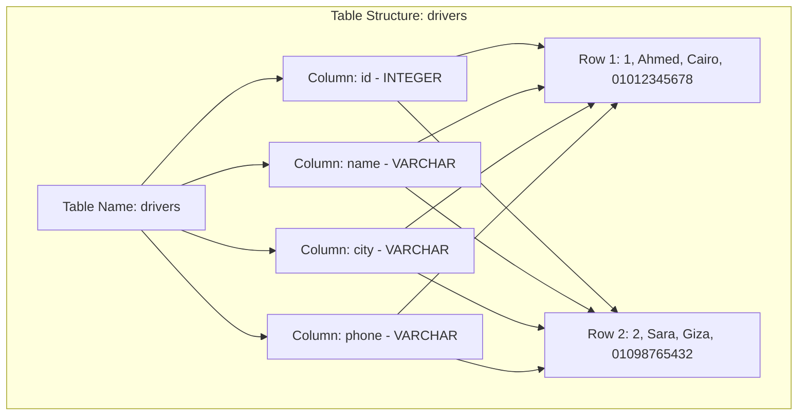

#### مثال 1: تطبيق عملي

```sql
-- Creating a well-structured table with explicit column types
CREATE TABLE drivers (
    id SERIAL PRIMARY KEY,
    name VARCHAR(100) NOT NULL,
    city VARCHAR(50) NOT NULL,
    phone VARCHAR(15) NOT NULL
);

-- Inserting a single row that follows the schema exactly
INSERT INTO drivers (name, city, phone)
VALUES ('Ahmed', 'Cairo', '01012345678');
```

#### مثال 2: فخ شائع

كتير من المبتدئين بيحطوا كل بيانات المستخدم في عمود واحد نصي، زي إنه يحط "Ahmed, Cairo, 01012345678" كله في عمود اسمه `info`. المشكلة إنك كده رجعت لمشكلة الملف النصي الأصلية، وقاعدة البيانات مبقتش عارفة تفرق بين الاسم والمدينة، فمينفعش تعمل فلترة أو فهرسة صح.

```sql
-- WRONG: cramming everything into one text column
CREATE TABLE drivers_bad (
    id SERIAL PRIMARY KEY,
    info TEXT -- e.g. "Ahmed, Cairo, 01012345678"
);

-- CORRECT: separate columns for each attribute
CREATE TABLE drivers_good (
    id SERIAL PRIMARY KEY,
    name VARCHAR(100),
    city VARCHAR(50),
    phone VARCHAR(15)
);
```

#### مثال 3: حالة إنتاج حقيقية

في شركة توصيل حقيقية عندها 2 مليون سائق مسجل، لو البيانات محفوظة بالشكل الغلط (عمود واحد نصي)، البحث عن "كل السواقين في مدينة معينة" هياخد ثواني طويلة (Full Table Scan على نص كامل)، لكن لو البيانات في عمود `city` منفصل ومفهرس، نفس البحث بياخد أجزاء من الميلي ثانية. الفرق ده مش تفصيلة صغيرة، ده فرق بين نظام شغال ونظام واقف.

**مستوى التعمق: أساسي**

---

## Q2 — إيه الفرق الحقيقي بين نوع البيانات (Data Type) وقيود الأعمدة (Constraints)؟

### أصل الحكاية

بعد ما اتفقنا إن كل عمود ليه نوع بيانات، السؤال اللي بيتفوت على كتير من المبتدئين: نوع البيانات لوحده مش كفاية. تخيل عندك عمود `age` من نوع `INTEGER`. تمام، كده قاعدة البيانات هتمنعك تكتب فيه نص زي "عشرين". بس هل هتمنعك تكتب فيه رقم سالب زي -5؟ لأ، لأن -5 برضو INTEGER صحيح! هنا بيجي دور الـ **Constraints**: قواعد إضافية بتتفرض على العمود فوق نوع البيانات نفسه.

الفرق الجوهري: **Data Type** بيحدد "الشكل العام" للقيمة (رقم، نص، تاريخ...)، أما **Constraint** بيحدد "القواعد التجارية" (Business Rules) اللي القيمة لازم تلتزم بيها، زي `NOT NULL` (العمود لازم يتملى)، `UNIQUE` (القيمة لازم تكون فريدة)، `CHECK` (شرط منطقي زي العمر لازم يكون أكبر من صفر)، و`DEFAULT` (قيمة افتراضية لو محدش حط حاجة).

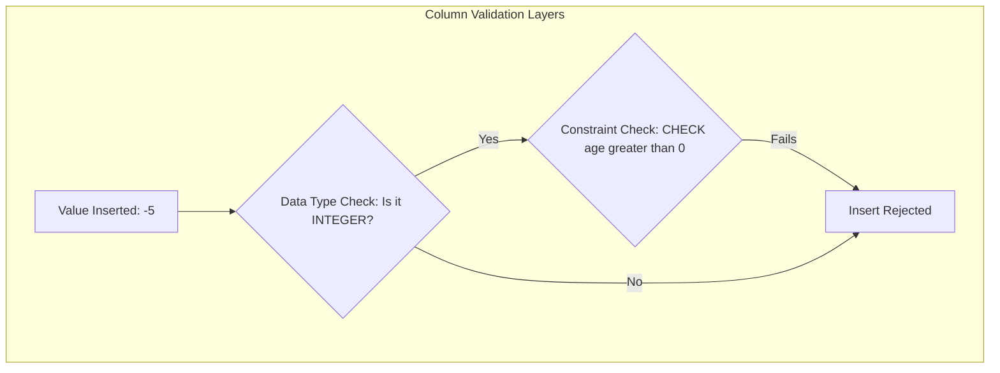

#### مثال 1: تطبيق عملي

```sql
-- Combining data type with meaningful constraints
CREATE TABLE drivers (
    id SERIAL PRIMARY KEY,
    name VARCHAR(100) NOT NULL,
    age INTEGER CHECK (age > 0 AND age < 100),
    phone VARCHAR(15) UNIQUE NOT NULL,
    status VARCHAR(20) DEFAULT 'active'
);
```

#### مثال 2: فخ شائع

ناس كتير بتحط `CHECK` أو `UNIQUE` على مستوى الـ Application code بس (يعني في الـ Backend)، وبتفتكر ده كفاية، وبتسيب قاعدة البيانات من غيرهم. المشكلة إن أي حد يوصل للداتابيز مباشرة (Script، Migration، أو حتى Bug في الكود) هيقدر يدخل بيانات غلط، لأن الحماية مكانتش في القاعدة نفسها.

```sql
-- WRONG: relying only on application-level validation
-- Backend code checks age > 0, but the database column itself has no CHECK

-- CORRECT: enforce the rule at the database level too
ALTER TABLE drivers ADD CONSTRAINT age_positive CHECK (age > 0);
```

#### مثال 3: حالة إنتاج حقيقية

في منصة تجارة إلكترونية شهيرة، حصل Bug في الـ Backend خلى الكود يقدر يدخل طلبات بسعر سالب (-100 جنيه) بسبب خطأ في حساب الخصومات. لو كان فيه `CHECK (price >= 0)` على مستوى قاعدة البيانات، الطلبات دي كانت هترفض تلقائياً بدل ما توصل لمرحلة الدفع وتسبب خسارة مالية فعلية.

**مستوى التعمق: أساسي**

---

## Q3 — إيه هو Primary Key وليه لازم كل جدول يكون ليه واحد؟

### أصل الحكاية

تخيل عندك جدول فيه سائقين، وفيه سائقين كتير اسمهم "Ahmed". لو حد سألك "عايز بيانات Ahmed"، مين فيهم بالظبط؟ المشكلة دي بتوضح إن البيانات "الطبيعية" زي الاسم مش كفاية عشان تحدد صف بعينه بشكل مضمون 100%. محتاجين حاجة تانية: قيمة فريدة، مالهاش نظير في الجدول كله، وبتمثل "هوية" الصف ده بشكل قاطع.

ده بالظبط الـ **Primary Key (PK)**: عمود (أو مجموعة أعمدة) بيحدد كل صف بشكل فريد وقاطع، مينفعش يتكرر، ومينفعش يكون فاضي (NULL). غالباً بنستخدم رقم تلقائي التزايد (Auto-increment / Serial) زي `id`، لكن ممكن كمان يكون قيمة طبيعية فريدة أصلاً زي الرقم القومي.

فايدة الـ PK مش بس منطقية، لأ كمان تقنية: قاعدة البيانات بتعمل تلقائياً **Index** على الـ Primary Key، يعني البحث عن صف معين بالـ id بيبقى سريع جداً، وكمان الـ PK هو اللي بيسمحلك تربط جداول ببعض عن طريق الـ Foreign Key اللي هنشرحه بعدين.

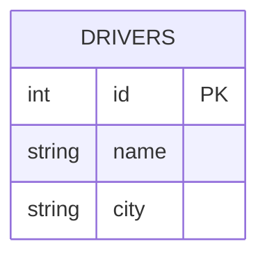

#### مثال 1: تطبيق عملي

```sql
-- id is auto-generated and guaranteed unique by the database engine
CREATE TABLE drivers (
    id SERIAL PRIMARY KEY,
    name VARCHAR(100) NOT NULL,
    city VARCHAR(50)
);

-- Fetching a specific row is fast and unambiguous
SELECT * FROM drivers WHERE id = 5;
```

#### مثال 2: فخ شائع

غلطة شائعة جداً إن المبرمج يستخدم عمود "طبيعي" زي `email` أو `phone` كـ Primary Key من غير ما يفكر كويس. المشكلة إن البيانات دي ممكن تتغير (المستخدم يغير إيميله)، وتغيير الـ Primary Key ده بيسبب مشاكل ضخمة لو فيه جداول تانية بترجع له (Foreign Keys)، لأن كل الإشارات دي هتحتاج تتحدث معاه.

```sql
-- RISKY: using a mutable value as the primary key
CREATE TABLE users_bad (
    email VARCHAR(100) PRIMARY KEY, -- emails can change!
    name VARCHAR(100)
);

-- SAFER: use an immutable surrogate key, keep email as UNIQUE only
CREATE TABLE users_good (
    id SERIAL PRIMARY KEY,
    email VARCHAR(100) UNIQUE NOT NULL,
    name VARCHAR(100)
);
```

#### مثال 3: حالة إنتاج حقيقية

في نظام حجز فنادق شغال، كان فيه جدول `bookings` بيستخدم `booking_reference` (نص) كـ Primary Key. لما الشركة قررت تغير صيغة الـ reference codes، اضطروا يعملوا Migration ضخمة على ملايين الصفوف، وكل الجداول اللي بترجع للـ bookings اتأثرت. لو كانوا مستخدمين `id` رقمي بسيط كـ Primary Key، والـ reference كان مجرد عمود عادي، المشكلة دي مكانتش هتحصل خالص.

**مستوى التعمق: أساسي**

---

## Q4 — إيه هو Foreign Key وإزاي بيحافظ على تكامل البيانات (Referential Integrity)؟

### أصل الحكاية

دلوقتي عندك جدول `drivers` وجدول تاني `trips` (رحلات). كل رحلة لازم تكون مرتبطة بسائق معين. لو خزنت اسم السائق كنص في جدول الرحلات، هتقع في مشكلتين: الأولى إنك بتكرر بيانات السائق في كل رحلة (تكرار غير ضروري)، والتانية الأخطر: إيه اللي يمنع حد يكتب اسم سائق مش موجود أصلاً في جدول السواقين؟ ولا حتى يمسح سائق من جدول السواقين وهو ليه رحلات مربوطة بيه، فتفضل الرحلات دي "يتيمة" ومرتبطة بحاجة مش موجودة؟

هنا بيجي الـ **Foreign Key (FK)**: عمود في جدول (زي `driver_id` في جدول `trips`) بيشاور على الـ Primary Key بتاع جدول تاني (`id` في جدول `drivers`). قاعدة البيانات بتفرض قاعدة اسمها **Referential Integrity**: مينفعش تحط قيمة في الـ FK غير موجودة أصلاً كـ PK في الجدول التاني، ومينفعش (افتراضياً) تمسح صف في الجدول الأصلي لو لسه فيه صفوف تانية بترجع له.

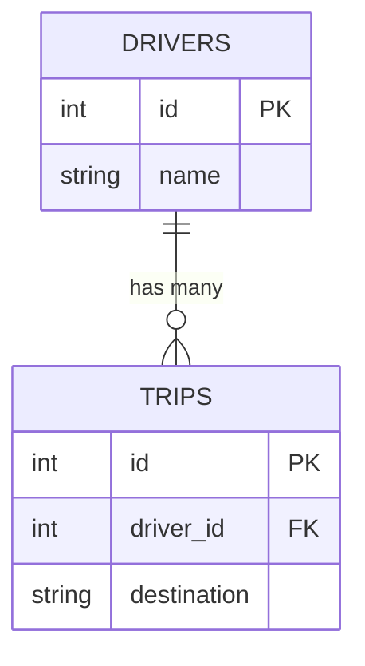

#### مثال 1: تطبيق عملي

```sql
CREATE TABLE trips (
    id SERIAL PRIMARY KEY,
    driver_id INTEGER NOT NULL,
    destination VARCHAR(100),
    -- Foreign key ensures driver_id always points to a real driver
    CONSTRAINT fk_driver FOREIGN KEY (driver_id) REFERENCES drivers(id)
        ON DELETE RESTRICT
);

-- This fails if driver_id 999 does not exist in drivers table
INSERT INTO trips (driver_id, destination) VALUES (999, 'Alexandria');
```

#### مثال 2: فخ شائع

كتير من المبرمجين بيحطوا `ON DELETE CASCADE` من غير ما يفكروا في العواقب. ده معناه لو اتمسح السائق، **كل رحلاته هتتمسح تلقائياً معاه**! ده ممكن يكون مقصود في بعض الحالات، لكن في حالات تانية (زي بيانات مالية أو تاريخية) ده كارثة، لأنك بتفقد سجل تاريخي كامل من غير قصد.

```sql
-- DANGEROUS if trips represent financial/historical records
FOREIGN KEY (driver_id) REFERENCES drivers(id) ON DELETE CASCADE;

-- SAFER for historical data: prevent deletion, or soft-delete instead
FOREIGN KEY (driver_id) REFERENCES drivers(id) ON DELETE RESTRICT;
```

#### مثال 3: حالة إنتاج حقيقية

في نظام محاسبي لشركة توصيل، حصل إن حد مسح حساب سائق من الأدمن بانل من غير ما يعرف إن فيه `ON DELETE CASCADE` على جدول المدفوعات. النتيجة: اختفت سجلات مالية بقيمة آلاف الجنيهات من غير رجعة، وده سبب مشكلة قانونية ومحاسبية ضخمة. الدرس المستفاد: مع البيانات الحساسة، استخدم `RESTRICT` أو `SET NULL` بدل `CASCADE`، أو اعمل Soft Delete (عمود `is_deleted`) بدل المسح الفعلي.

**مستوى التعمق: متوسط**

---

## Q5 — إيه هو الـ First Normal Form (1NF) وليه بيتفرض؟

### أصل الحكاية

تخيل عندك جدول بيانات سائقين، وكل سائق ممكن يكون ليه أكتر من رقم تليفون. الحل الساذج اللي هييجي في بال حد مبتدئ: يحط الأرقام كلها في عمود واحد مفصولة بفاصلة، زي `"01012345678,01098765432"`. المشكلة إن العمود ده بقى "مركب" (يحتوي على أكتر من قيمة واحدة)، وده بيكسر أول قاعدة أساسية في التصميم السليم.

**1NF** بتقول ببساطة: كل خلية (تقاطع Row مع Column) لازم تحتوي على **قيمة واحدة ذرية (Atomic)** بس، مش قايمة أو مجموعة قيم. لو عندك بيانات متكررة زي أرقام التليفون، الحل السليم إنك تعمل جدول منفصل لها، وتربطه بجدول السواقين عن طريق Foreign Key.

ليه القاعدة دي مهمة؟ لأن لو العمود فيه أكتر من قيمة، مينفعش تعمل `WHERE phone = '01098765432'` وتضمن نتيجة صحيحة، ومينفعش تفهرس العمود ده كويس، ومينفعش تعمل عمليات زي COUNT أو JOIN عليه بشكل منطقي.

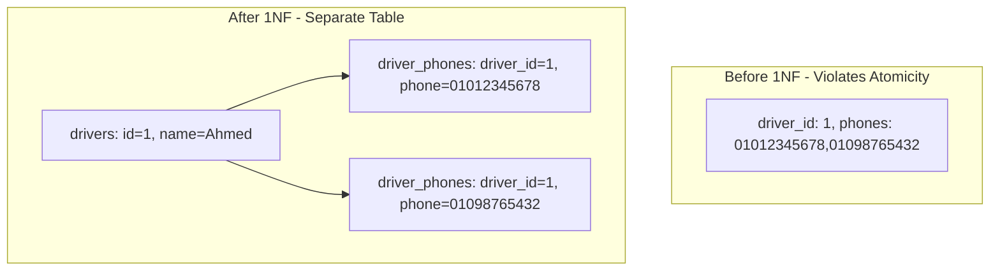

#### مثال 1: تطبيق عملي

```sql
-- WRONG: violates 1NF, phones column holds multiple values
-- drivers(id, name, phones) with phones = '01012345678,01098765432'

-- CORRECT: separate table, one phone per row
CREATE TABLE drivers (
    id SERIAL PRIMARY KEY,
    name VARCHAR(100)
);

CREATE TABLE driver_phones (
    id SERIAL PRIMARY KEY,
    driver_id INTEGER REFERENCES drivers(id),
    phone VARCHAR(15)
);
```

#### مثال 2: فخ شائع

بعض المبرمجين بيحاولوا "يحلوا" مشكلة القيم المتعددة عن طريق إنهم يعملوا أعمدة زي `phone1`, `phone2`, `phone3`. ده برضو بيخالف روح 1NF بشكل غير مباشر، لأنك بتفترض عدد ثابت من القيم، وأول ما حد يحتاج `phone4` هتضطر تعدل هيكل الجدول (Schema Migration) بدل ما تضيف صف جديد بس.

```sql
-- STILL PROBLEMATIC: fixed number of repeating columns
CREATE TABLE drivers_bad (
    id SERIAL PRIMARY KEY,
    phone1 VARCHAR(15),
    phone2 VARCHAR(15),
    phone3 VARCHAR(15)
);
```

#### مثال 3: حالة إنتاج حقيقية

في نظام CRM قديم كان مصمم بعمود `tags` نصي فيه كل الـ tags مفصولة بفاصلة (زي "VIP,Frequent,Corporate"). لما الشركة حبت تعمل تقرير "كام عميل عنده تاج VIP"، اضطروا يستخدموا `LIKE '%VIP%'` وده كان بطيء جداً ومش دقيق (لو فيه تاج اسمه "VIPGold" هيتحسب غلط). بعد ما عملوا Migration لجدول `customer_tags` منفصل بيتبع 1NF، السؤال ده بقى استعلام بسيط وسريع بـ `COUNT` عادي.

**مستوى التعمق: متوسط**

---

## Q6 — إيه هو الـ Second Normal Form (2NF) وإزاي بيتعامل مع الاعتمادية الجزئية؟

### أصل الحكاية

خلينا نفترض إنك عندك جدول بيمثل "تفاصيل الطلبات" (order_items)، وفيه Composite Primary Key مكون من `order_id` و`product_id` مع بعض. لو حطيت في نفس الجدول ده عمود زي `product_name`، هتلاقي إن `product_name` بيعتمد بس على `product_id`، مش على المفتاح الأساسي كله (`order_id` + `product_id`). ده معناه إن اسم المنتج هيتكرر في كل صف فيه نفس المنتج، وده تكرار غير ضروري وممكن يسبب تضارب (لو غيرت اسم منتج، هتحتاج تعدله في مئات الصفوف).

**2NF** بتقول: الجدول لازم يكون أصلاً في 1NF، وكمان **كل عمود مش جزء من الـ Primary Key لازم يعتمد على الـ Primary Key كله**، مش على جزء منه بس. القاعدة دي بتظهر أهميتها بس لما يكون عندك Composite Primary Key (مفتاح مركب من أكتر من عمود). لو الـ Primary Key عمود واحد بسيط، الجدول غالباً بيكون في 2NF تلقائياً.

الحل: تشيل العمود اللي بيعتمد جزئياً (`product_name`) وتحطه في جدول منفصل (`products`) مربوط بـ `product_id`.

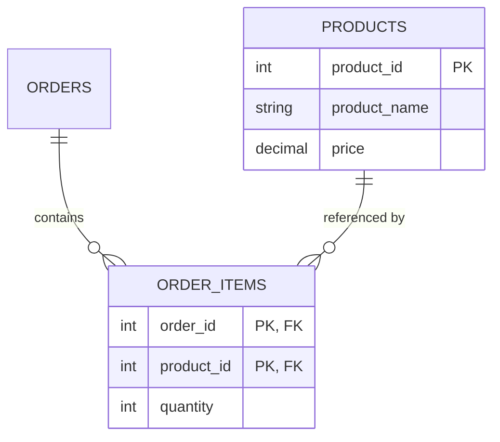

#### مثال 1: تطبيق عملي

```sql
-- WRONG: product_name depends only on product_id, not on the full composite key
CREATE TABLE order_items_bad (
    order_id INTEGER,
    product_id INTEGER,
    product_name VARCHAR(100), -- partial dependency violation
    quantity INTEGER,
    PRIMARY KEY (order_id, product_id)
);

-- CORRECT: move product_name to its own table
CREATE TABLE products (
    product_id SERIAL PRIMARY KEY,
    product_name VARCHAR(100)
);

CREATE TABLE order_items (
    order_id INTEGER,
    product_id INTEGER REFERENCES products(product_id),
    quantity INTEGER,
    PRIMARY KEY (order_id, product_id)
);
```

#### مثال 2: فخ شائع

كتير من المبرمجين بيفهموا 2NF غلط ويفتكروا إنها بتتطبق حتى لو الـ Primary Key عمود واحد بسيط. الحقيقة إن 2NF بتبقى ذات معنى بس في حالة الـ Composite Keys. لو عندك `id` بسيط كـ Primary Key، مفيش "اعتمادية جزئية" أصلاً لأن مفيش "أجزاء" في المفتاح.

```sql
-- This table is automatically in 2NF because the PK is a single column
CREATE TABLE drivers (
    id SERIAL PRIMARY KEY,
    name VARCHAR(100),
    city VARCHAR(50)
);
```

#### مثال 3: حالة إنتاج حقيقية

في نظام مبيعات لمتجر إلكتروني، لقوا إن تعديل سعر منتج واحد كان بياخد وقت طويل ومعرض للأخطاء، لأن `product_name` و`unit_price` كانوا متكررين في آلاف الصفوف في جدول `order_items`. بعد إعادة الهيكلة عشان يتبع 2NF (فصل بيانات المنتج في جدول منفصل)، تعديل سعر منتج بقى تحديث صف واحد بس، وده قلل وقت التحديث من دقايق لأجزاء من الثانية.

**مستوى التعمق: متوسط**

---

## Q7 — إيه هو الـ Third Normal Form (3NF) وإزاي بيتخلص من الاعتمادية الانتقالية (Transitive Dependency)؟

### أصل الحكاية

خلينا نفترض عندك جدول `employees` فيه `employee_id`, `name`, `department_id`, و`department_name`. هنا `department_name` بيعتمد على `department_id`، و`department_id` بيعتمد على `employee_id` (المفتاح الأساسي). يعني `department_name` بيعتمد على المفتاح الأساسي بشكل **غير مباشر** (عن طريق عمود تاني)، مش بشكل مباشر. ده اسمه **Transitive Dependency**.

**3NF** بتقول: الجدول لازم يكون في 2NF أصلاً، وكمان **مفيش أي عمود بيعتمد على عمود تاني مش هو المفتاح الأساسي**. كل الأعمدة لازم تعتمد على المفتاح الأساسي **مباشرة وبس**. الحل زي العادة: تعمل جدول منفصل للأقسام (`departments`)، وتسيب في جدول الموظفين بس `department_id` كـ Foreign Key.

الفايدة: لو اسم القسم اتغير، بتعدله في مكان واحد بس (صف واحد في جدول departments)، بدل ما تدور على كل الموظفين اللي في القسم ده وتعدلهم واحد واحد.

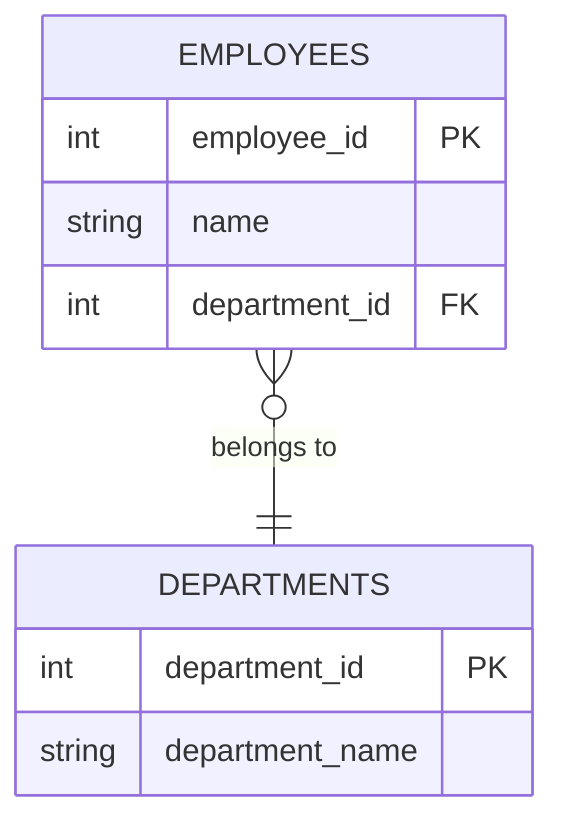

#### مثال 1: تطبيق عملي

```sql
-- WRONG: department_name depends transitively through department_id
CREATE TABLE employees_bad (
    employee_id SERIAL PRIMARY KEY,
    name VARCHAR(100),
    department_id INTEGER,
    department_name VARCHAR(100) -- transitive dependency violation
);

-- CORRECT: department_name lives only in its own table
CREATE TABLE departments (
    department_id SERIAL PRIMARY KEY,
    department_name VARCHAR(100)
);

CREATE TABLE employees (
    employee_id SERIAL PRIMARY KEY,
    name VARCHAR(100),
    department_id INTEGER REFERENCES departments(department_id)
);
```

#### مثال 2: فخ شائع

غلطة شائعة إن المبرمج يفتكر إن تخزين بيانات "مشتقة" أو "محسوبة" زي `total_price = quantity * unit_price` هي كمان مخالفة لـ 3NF، فيمتنع عن تخزينها خالص حتى لو محتاج الأداء ده. الحقيقة إن 3NF بتتكلم عن اعتمادية بين أعمدة "مستقلة" عن بعض، مش عن قيم محسوبة من نفس الصف؛ وفي الحالات دي أحياناً بنكسر القاعدة عمداً لأسباب أداء (وده اللي هنشرحه في Denormalization بعد شوية).

#### مثال 3: حالة إنتاج حقيقية

في شركة كانت بتحتفظ باسم القسم واسم المدير جوه جدول الموظفين مباشرة (بدون تطبيع)، ولما حصل إعادة هيكلة إدارية وتغيرت أسماء أقسام كتير، اضطروا يعملوا UPDATE على عشرات الآلاف من صفوف الموظفين. بعد ما طبقوا 3NF وفصلوا بيانات الأقسام في جدول مستقل، أي تغيير مستقبلي في اسم قسم بقى تعديل صف واحد بس في جدول departments.

**مستوى التعمق: متقدم**

---

## Q8 — إيه هو الـ Denormalization ومتى تقرر تكسر قواعد التطبيع عمداً؟

### أصل الحكاية

بعد ما اتعلمنا 1NF و2NF و3NF، ممكن تفتكر إن "التطبيع الكامل" هو الهدف اللي لازم توصله دايماً. لكن الحقيقة إن التطبيع بيجيب معاه تكلفة: كل ما تفصل بياناتك في جداول أكتر، كل ما احتجت **JOINs** أكتر عشان ترجع البيانات المرتبطة ببعض. والـ JOINs، خصوصاً على جداول ضخمة، بتاخد وقت ومعالجة.

تخيل عندك تطبيق فيه Dashboard بيتعرض ملايين المرات في الثانية، وعشان تجيب "اسم المنتج مع كل تفاصيل الطلب"، محتاج تعمل JOIN بين 4 أو 5 جداول في كل مرة. في الحالة دي، ممكن تقرر عمداً إنك **تكرر** بعض البيانات (زي `product_name`) جوه جدول `order_items` نفسه، حتى لو ده بيخالف 3NF، عشان تجنب الـ JOIN وتسرّع القراءة.

ده اسمه **Denormalization**: قرار هندسي واعي (مش غلطة تصميم) بإنك تقبل تكرار بعض البيانات وتتحمل تكلفة "الاتساق" (لازم تحدّث النسخ المكررة كلها لما البيانات الأصلية تتغير) عشان تكسب في سرعة القراءة. القاعدة الذهبية: **طبّع أولاً، وبعدين افك التطبيع بس لما يكون عندك مشكلة أداء فعلية ومُقاسة بالأرقام**، مش تخمين.

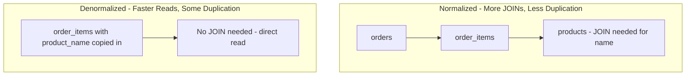

#### مثال 1: تطبيق عملي

```sql
-- Denormalized: product_name is duplicated here on purpose for read speed
CREATE TABLE order_items (
    order_id INTEGER,
    product_id INTEGER,
    product_name VARCHAR(100), -- denormalized copy, avoids a JOIN on read
    unit_price NUMERIC(10,2),
    quantity INTEGER,
    PRIMARY KEY (order_id, product_id)
);

-- Reading order details is now a single-table query, no JOIN needed
SELECT product_name, unit_price, quantity FROM order_items WHERE order_id = 42;
```

#### مثال 2: فخ شائع

أخطر غلطة في الـ Denormalization إنك تكرر البيانات وتنسى تحدّث كل النسخ لما الأصل يتغير. لو غيّرت اسم منتج في جدول `products`، ولسه فيه نسخ قديمة من الاسم في `order_items`، هتلاقي نفس المنتج ظاهر بأسماء مختلفة في أماكن مختلفة من النظام، وده بيسبب تضارب في البيانات (Data Inconsistency).

```sql
-- WRONG: updating the source but forgetting the denormalized copies
UPDATE products SET product_name = 'Premium Coffee' WHERE product_id = 10;
-- order_items.product_name for old orders still says 'Coffee' - inconsistency!

-- CORRECT: either update both, or use a trigger / background job to sync them
UPDATE order_items SET product_name = 'Premium Coffee' WHERE product_id = 10;
```

#### مثال 3: حالة إنتاج حقيقية

منصة تجارة إلكترونية كبيرة كانت بتعاني من بطء في صفحة "سجل الطلبات" بسبب JOIN بين 5 جداول لكل طلب، والصفحة كانت بتاخد أكتر من ثانيتين تفتح مع مليون مستخدم متزامن. بعد ما عملوا Denormalization مدروس (خزّنوا snapshot من بيانات المنتج والسعر وقت الطلب جوه جدول `order_items` نفسه)، وقت تحميل الصفحة نزل لأقل من 100 ميلي ثانية. الميزة الإضافية: السعر المحفوظ وقت الطلب فعلاً **لازم** يفضل ثابت حتى لو السعر الحالي للمنتج اتغير بعدين — يعني هنا الـ Denormalization كان الحل الصح منطقياً كمان مش بس للأداء.

**مستوى التعمق: متقدم**

---

## Checkpoint: ملخص الموديول الأول

طيب خلينا نلم شمل اللي اتكلمنا عليه في الموديول ده كله:

- **Tables/Rows/Columns**: الجدول هيكل منظم ليه Schema ثابت، الـ Column بيمثل صفة، والـ Row بيمثل كيان كامل. Data Types بتحدد شكل القيمة، وConstraints (زي NOT NULL وCHECK وUNIQUE) بتفرض قواعد تجارية فوق كده.
- **Primary Key**: عمود فريد بيحدد كل صف بشكل قاطع، وبيكون أساس أي علاقة بين الجداول، ومفروض يكون ثابت (Immutable) قدر الإمكان.
- **Foreign Key**: بيربط جدول بجدول تاني عن طريق الإشارة للـ Primary Key بتاعه، وبيفرض Referential Integrity، بس لازم تكون حذر جداً مع خيارات زي `ON DELETE CASCADE`.
- **1NF**: كل خلية لازم تحتوي على قيمة واحدة ذرية بس، مفيش قوايم أو قيم متعددة جوه عمود واحد.
- **2NF**: كل عمود لازم يعتمد على المفتاح الأساسي **كله**، مش على جزء منه (مهم بس لما يكون عندك Composite Key).
- **3NF**: مفيش عمود يعتمد على عمود تاني مش هو المفتاح الأساسي (Transitive Dependency)، كل حاجة تعتمد على المفتاح مباشرة.
- **Denormalization**: قرار هندسي واعي بتكسر فيه قواعد التطبيع عمداً عشان تكسب سرعة قراءة، بس المفروض يكون بناءً على قياس فعلي للأداء، مش تخمين، ومع خطة واضحة إزاي هتحافظ على اتساق البيانات المكررة.

---

# الموديول 2: لغة الاستعلام SQL (Q9–Q16)

## Q9 — إيه هو INNER JOIN وليه محتاجينه أصلاً؟

### أصل الحكاية

بعد ما اتعلمنا في الموديول اللي فات إننا نفصل البيانات في جداول منفصلة (زي `drivers` و`trips`)، ظهرت مشكلة عملية: أنا عايز "اسم السائق مع تفاصيل رحلته" في استعلام واحد. البيانات دلوقتي متفرقة في جدولين مختلفين، وربطهم ببعض عن طريق `driver_id` (الـ Foreign Key) هو بالظبط اللي محتاجينه.

**INNER JOIN** بيرجعلك بس الصفوف اللي عندها **تطابق فعلي** في الجدولين. يعني لو عندك سائق مالوش أي رحلة، الاستعلام مش هيرجعه خالص، لأن مفيش تطابق ليه في جدول `trips`. الفكرة الأساسية: قاعدة البيانات بتاخد كل صف من الجدول الأول، وتدور على أي صف في الجدول التاني بيحقق شرط الربط (`ON`)، ولو لقت تطابق بترجعهم مع بعض كصف واحد.

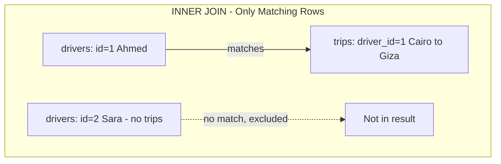

#### مثال 1: تطبيق عملي

```sql
-- Returns only drivers who actually have at least one trip
SELECT drivers.name, trips.destination
FROM drivers
INNER JOIN trips ON drivers.id = trips.driver_id;
```

#### مثال 2: فخ شائع

غلطة شائعة جداً إن حد ينسى شرط الـ `ON` أو يكتبه غلط، فيحصل **Cartesian Product** (كل صف في الجدول الأول بيتربط مع كل صف في الجدول التاني)، وده بيرجع عدد صفوف ضخم وغلط تماماً.

```sql
-- WRONG: missing ON condition causes a cartesian product (huge wrong result)
SELECT drivers.name, trips.destination FROM drivers, trips;

-- CORRECT: always specify the join condition explicitly
SELECT drivers.name, trips.destination
FROM drivers INNER JOIN trips ON drivers.id = trips.driver_id;
```

#### مثال 3: حالة إنتاج حقيقية

في نظام تقارير لشركة توصيل، حد نسي شرط الـ `ON` في استعلام بين جدول فيه 10,000 سائق وجدول فيه 50,000 رحلة، فالاستعلام رجّع 500 مليون صف (10,000 × 50,000) بدل النتيجة الصح، وعلق السيرفر تماماً لدقايق لحد ما اضطروا يوقفوا الاستعلام يدوياً.

**مستوى التعمق: أساسي**

---

## Q10 — إيه الفرق بين LEFT JOIN وRIGHT JOIN، ومتى تستخدم كل واحد؟

### أصل الحكاية

INNER JOIN كويس، بس فيه حالات محتاج فيها تعرف "كل السواقين، حتى اللي مالهمش رحلات أصلاً"، عشان مثلاً تعمل تقرير إداري يقولك "مين السواقين الخاملين اللي مسجلوش أي رحلة". INNER JOIN مش هيساعدك هنا لأنه هيشيل السواقين دول تماماً.

هنا بيجي **LEFT JOIN (LEFT OUTER JOIN)**: بيرجعلك **كل** صفوف الجدول الشمال (اللي في الـ FROM)، وبيحاول يلاقي تطابق في الجدول اليمين، ولو مفيش تطابق بيحط `NULL` مكان أعمدة الجدول اليمين. **RIGHT JOIN** هو نفس الفكرة بالظبط بس بالعكس: بيرجع كل صفوف الجدول اليمين، حتى لو مفيهاش تطابق في الشمال. عملياً، RIGHT JOIN نادراً ما بيتستخدم لأن أي RIGHT JOIN ممكن تكتبه كـ LEFT JOIN بس بتبديل ترتيب الجدولين.

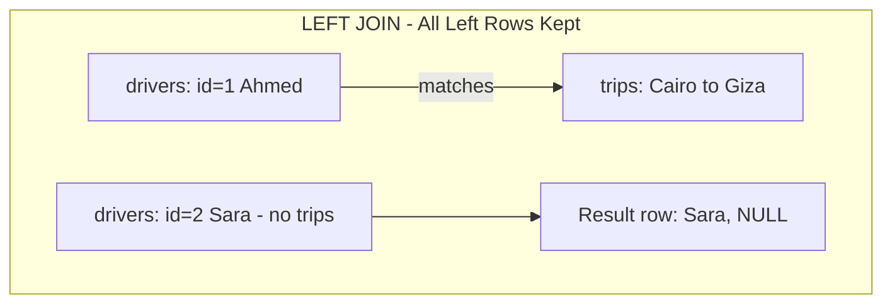

#### مثال 1: تطبيق عملي

```sql
-- Returns ALL drivers, even those with zero trips (destination will be NULL)
SELECT drivers.name, trips.destination
FROM drivers
LEFT JOIN trips ON drivers.id = trips.driver_id;

-- Finding drivers with no trips at all (a very common real-world need)
SELECT drivers.name
FROM drivers
LEFT JOIN trips ON drivers.id = trips.driver_id
WHERE trips.id IS NULL;
```

#### مثال 2: فخ شائع

غلطة شائعة جداً إن حد يحط شرط فلترة على عمود من الجدول اليمين في الـ `WHERE` بدل الـ `ON`، فده بيحوّل الـ LEFT JOIN فعلياً لـ INNER JOIN من غير ما يقصد، لأن `WHERE` بيتنفذ بعد الـ JOIN وبيشيل الصفوف اللي فيها NULL.

```sql
-- WRONG: this silently turns LEFT JOIN into an INNER JOIN
SELECT drivers.name, trips.destination
FROM drivers
LEFT JOIN trips ON drivers.id = trips.driver_id
WHERE trips.destination = 'Cairo'; -- kills all NULL rows, breaks the LEFT JOIN

-- CORRECT: put the filter condition inside the ON clause
SELECT drivers.name, trips.destination
FROM drivers
LEFT JOIN trips ON drivers.id = trips.driver_id AND trips.destination = 'Cairo';
```

#### مثال 3: حالة إنتاج حقيقية

في تقرير شهري لشركة لوجستيات، فريق التحليل كان عايز يعرف "كل السواقين، وإيه أعلى رحلة سعرها لكل واحد لو عنده رحلات"، لكن حطوا شرط `WHERE trips.price > 100` بدل ما يحطوه في `ON`. النتيجة إن كل السواقين اللي رحلاتهم كلها أقل من 100 جنيه اختفوا تماماً من التقرير، وده خلى الإدارة تاخد قرار غلط بناءً على بيانات ناقصة.

**مستوى التعمق: متوسط**

---

## Q11 — إيه هو FULL OUTER JOIN، وإيه هو SELF JOIN؟

### أصل الحكاية

فيه حالة تالتة محتاجينها أحياناً: عايز **كل** البيانات من الجدولين، سواء فيه تطابق أو لأ. يعني عايز كل السواقين (حتى اللي مالهمش رحلات) وكمان كل الرحلات (حتى لو فيه رحلة – نظرياً – مربوطة بسائق اتمسح). هنا بيجي **FULL OUTER JOIN**: عملياً هو دمج بين LEFT JOIN وRIGHT JOIN مع بعض، بيرجع كل الصفوف من الجدولين، وبيحط NULL في أي جانب مفيهوش تطابق.

حاجة تانية مختلفة تماماً بس بتلخبط المبتدئين: **SELF JOIN**. ده مش نوع جديد من الـ JOIN، ده استخدام لنفس الجدول مرتين في نفس الاستعلام (بأسماء مستعارة مختلفة/Aliases)، عشان تقارن صفوف الجدول ببعضها. مثال كلاسيكي: جدول موظفين فيه عمود `manager_id` بيشاور على `id` بتاع موظف تاني في **نفس** الجدول. عشان تجيب "اسم الموظف مع اسم المدير بتاعه"، لازم تعمل JOIN للجدول مع نفسه.

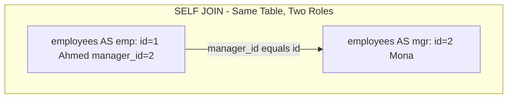

#### مثال 1: تطبيق عملي

```sql
-- FULL OUTER JOIN: every driver AND every trip, matched where possible
SELECT drivers.name, trips.destination
FROM drivers
FULL OUTER JOIN trips ON drivers.id = trips.driver_id;

-- SELF JOIN: employee name alongside their manager's name
SELECT emp.name AS employee_name, mgr.name AS manager_name
FROM employees emp
LEFT JOIN employees mgr ON emp.manager_id = mgr.id;
```

#### مثال 2: فخ شائع

في SELF JOIN، غلطة شائعة إن حد ينسى يستخدم Aliases مختلفة للجدول، فقاعدة البيانات مش هتعرف تفرق بين الجدول "كموظف" والجدول "كمدير"، وهترمي Error.

```sql
-- WRONG: no aliases, database can't tell which "employees" you mean
SELECT name, name FROM employees
JOIN employees ON employees.manager_id = employees.id;

-- CORRECT: distinct aliases for each role of the same table
SELECT emp.name, mgr.name
FROM employees emp
JOIN employees mgr ON emp.manager_id = mgr.id;
```

#### مثال 3: حالة إنتاج حقيقية

في نظام HR لشركة كبيرة، الهيكل التنظيمي كله (Org Chart) كان متبني على SELF JOIN متكرر (أو Recursive CTE هنشرحه بعدين) على جدول `employees` واحد بعمود `manager_id`. الفايدة إنهم مش محتاجين جدول منفصل لكل مستوى إداري، جدول واحد بس يقدر يمثل هيكل تنظيمي بعمق أي عدد من المستويات.

**مستوى التعمق: متوسط**

---

## Q12 — إمتى تستخدم Subquery وإمتى تستخدم JOIN، وهل فيه فرق في الأداء؟

### أصل الحكاية

فيه أكتر من طريقة تحل بيها نفس المشكلة في SQL. مثلاً عايز "كل السواقين اللي عندهم رحلة لمدينة القاهرة". تقدر تحلها بـ JOIN زي ما اتعلمنا، أو تقدر تحلها بـ **Subquery**: استعلام جوه استعلام. الـ Subquery ممكن يكون في الـ `WHERE` (زي `IN` أو `EXISTS`)، أو في الـ `FROM` (كأنه جدول مؤقت)، أو حتى في الـ `SELECT` نفسه.

الفرق الجوهري مش بس في الشكل، لأ في الأداء والوضوح كمان. الـ JOIN غالباً بيكون أسرع لأن الـ Query Optimizer بتاع قاعدة البيانات بيقدر يخطط له بكفاءة أعلى (خصوصاً مع الفهارس)، وبيقدر يرجعلك أعمدة من الجدولين مع بعض. الـ Subquery (خصوصاً مع `EXISTS`) بيبقى أوضح منطقياً لما السؤال نفسه هو "هل موجود ولا لأ" مش "هاتلي البيانات المرتبطة"، وأحياناً بيبقى أسرع من JOIN في حالات معينة لأنه بيوقف البحث أول ما يلاقي تطابق واحد (Short-circuit).

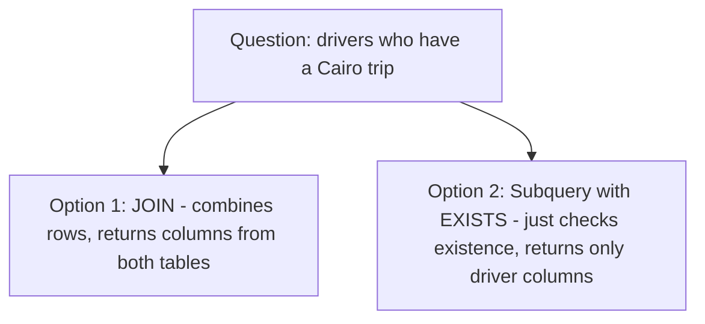

#### مثال 1: تطبيق عملي

```sql
-- Using JOIN: gives you access to columns from both tables
SELECT DISTINCT drivers.name
FROM drivers
JOIN trips ON drivers.id = trips.driver_id
WHERE trips.destination = 'Cairo';

-- Using a Subquery with EXISTS: clearer when you only care about drivers table
SELECT drivers.name
FROM drivers
WHERE EXISTS (
    SELECT 1 FROM trips
    WHERE trips.driver_id = drivers.id AND trips.destination = 'Cairo'
);
```

#### مثال 2: فخ شائع

غلطة شائعة جداً إن حد يستخدم `IN` مع Subquery بيرجع عدد صفوف ضخم، وده بيبقى أبطأ بكتير من `EXISTS` أو الـ JOIN، لأن `IN` بيحتاج يبني القايمة كلها الأول قبل ما يقارن.

```sql
-- SLOWER on large tables: IN materializes the full subquery list first
SELECT name FROM drivers
WHERE id IN (SELECT driver_id FROM trips WHERE destination = 'Cairo');

-- FASTER: EXISTS can stop as soon as it finds one match per driver
SELECT name FROM drivers d
WHERE EXISTS (SELECT 1 FROM trips t WHERE t.driver_id = d.id AND t.destination = 'Cairo');
```

#### مثال 3: حالة إنتاج حقيقية

في نظام تحليلات لمنصة توصيل، استعلام بيستخدم `IN` مع Subquery على جدول فيه 20 مليون صف كان بياخد أكتر من 15 ثانية. لما استبدلوه بـ `EXISTS` مع فهرسة صح على `driver_id`، الوقت نزل لأقل من نص ثانية، لأن الـ Query Optimizer قدر يستخدم استراتيجية "Semi Join" أكفأ بكتير.

**مستوى التعمق: متوسط**

---

## Q13 — إيه الفرق الجوهري بين WHERE وHAVING؟

### أصل الحكاية

كتير من المبرمجين الجداد بيلخبطوا بين `WHERE` و`HAVING`، وبيفتكروا إنهم نفس الحاجة بس في مكان مختلف. الحقيقة إن الفرق ده مبني على **ترتيب تنفيذ SQL الفعلي جوه المحرك**، مش بس على شكل الكتابة. لما تكتب استعلام SQL، الترتيب اللي بتكتب بيه (`SELECT ... FROM ... WHERE ... GROUP BY ... HAVING ...`) **مش** هو نفسه ترتيب التنفيذ الفعلي.

الترتيب الحقيقي للتنفيذ: أولاً `FROM` (تحديد الجداول)، بعدين `WHERE` (فلترة **الصفوف الفردية** قبل أي تجميع)، بعدين `GROUP BY` (تجميع الصفوف)، بعدين `HAVING` (فلترة **المجموعات** بعد ما اتعملت)، وأخيراً `SELECT`. يعني `WHERE` بيشتغل على صفوف خام لسه ماتجمعتش، بينما `HAVING` بيشتغل على نتيجة الـ `GROUP BY` بعد ما اتحسبت (زي `COUNT` أو `SUM`).

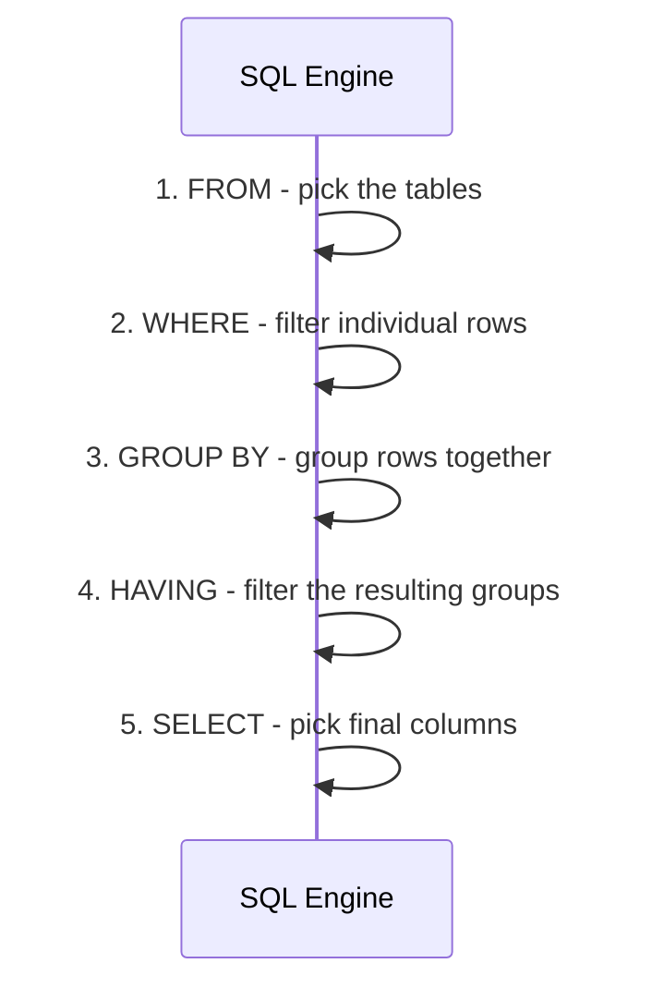

#### مثال 1: تطبيق عملي

```sql
-- WHERE filters individual trips BEFORE grouping (only Cairo trips count)
-- HAVING filters the resulting groups AFTER counting
SELECT driver_id, COUNT(*) AS trip_count
FROM trips
WHERE destination = 'Cairo'
GROUP BY driver_id
HAVING COUNT(*) > 5;
```

#### مثال 2: فخ شائع

غلطة شائعة جداً إن حد يحاول يستخدم Aggregate Function زي `COUNT(*)` جوه `WHERE`، وده هيرمي Error، لأن `WHERE` بيتنفذ **قبل** ما التجميع (`GROUP BY`) يحصل أصلاً.

```sql
-- WRONG: aggregate functions cannot be used in WHERE
SELECT driver_id, COUNT(*)
FROM trips
WHERE COUNT(*) > 5
GROUP BY driver_id;

-- CORRECT: use HAVING for conditions on aggregated results
SELECT driver_id, COUNT(*)
FROM trips
GROUP BY driver_id
HAVING COUNT(*) > 5;
```

#### مثال 3: حالة إنتاج حقيقية

في تقرير مبيعات، فريق كان عايز "العملاء اللي اشتروا أكتر من 10 مرات في الشهر الحالي بس". غلطوا وحطوا شرط الشهر جوه `HAVING` بدل `WHERE`، فالنظام كان بيجمّع كل تاريخ المشتريات الأول (بطء غير ضروري بسبب معالجة بيانات مش لازمة)، وبعدين يفلتر الشهر. لما نقلوا شرط الشهر لـ `WHERE`، الفلترة حصلت الأول على الصفوف الخام، وقلل حجم البيانات اللي هتتجمع بشكل كبير، وسرّع الاستعلام بشكل ملحوظ.

**مستوى التعمق: متوسط**

---

## Q14 — إزاي تستخدم GROUP BY مع Aggregate Functions بشكل صح؟

### أصل الحكاية

لما تيجي تسأل سؤال زي "كام رحلة عمل كل سائق؟"، إنت مش محتاج تفاصيل كل رحلة لوحدها، إنت محتاج **تجميع** (Aggregation) الرحلات حسب السائق، وبعدين تطبق دالة تجميعية زي `COUNT` أو `SUM` أو `AVG` على كل مجموعة. ده بالظبط اللي `GROUP BY` بيعمله: بياخد الصفوف اللي عندها نفس القيمة في عمود معين (أو مجموعة أعمدة) ويحطهم في "مجموعة" واحدة، وبعدين الـ Aggregate Function بتتطبق على كل مجموعة على حدة.

القاعدة الذهبية اللي لازم تحفظها: **أي عمود في الـ `SELECT` مش جوه Aggregate Function، لازم يكون موجود في الـ `GROUP BY`**. لو خالفت القاعدة دي، إما هتاخد Error (في قواعد بيانات زي PostgreSQL)، أو هتاخد نتيجة غير محددة السلوك (في قواعد بيانات تانية زي MySQL القديم).

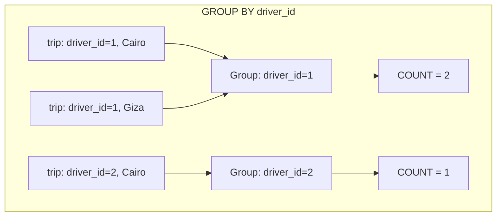

#### مثال 1: تطبيق عملي

```sql
-- Count trips per driver, and average trip price per driver
SELECT driver_id, COUNT(*) AS trip_count, AVG(price) AS avg_price
FROM trips
GROUP BY driver_id;
```

#### مثال 2: فخ شائع

غلطة شائعة جداً إن حد يحط عمود إضافي في الـ `SELECT` مش موجود في الـ `GROUP BY` ومش جوه Aggregate Function، زي `destination` هنا. النتيجة غير منطقية لأن مفيش قيمة واحدة محددة لـ `destination` جوه كل مجموعة.

```sql
-- WRONG: destination is not in GROUP BY and not aggregated - ambiguous
SELECT driver_id, destination, COUNT(*)
FROM trips
GROUP BY driver_id;

-- CORRECT: either add destination to GROUP BY, or aggregate it (e.g. array_agg)
SELECT driver_id, destination, COUNT(*)
FROM trips
GROUP BY driver_id, destination;
```

#### مثال 3: حالة إنتاج حقيقية

في تقرير مالي لشركة توصيل، استعلام قديم على MySQL كان شغال من غير Error برغم إنه فيه عمود مش في GROUP BY، لأن MySQL في وضع معين (`ONLY_FULL_GROUP_BY` معطل) بيسمح بالسلوك ده ويختار قيمة عشوائية من المجموعة. النتيجة إن التقرير كان بيعرض بيانات غلط وغير متسقة كل مرة يترن فيها، وده اكتشفوه بس لما حاولوا ينقلوا نفس الاستعلام لـ PostgreSQL ورمى Error واضح.

**مستوى التعمق: متوسط**

---

## Q15 — إيه هي Window Functions وإزاي مختلفة عن GROUP BY؟

### أصل الحكاية

مشكلة GROUP BY إنها بـ"تدمج" الصفوف في مجموعة واحدة، يعني بتفقد تفاصيل الصف الفردي. لو عايز تعرف "ترتيب كل رحلة من حيث السعر **جوه** كل سائق، بس من غير ما تفقد باقي تفاصيل الرحلة"، GROUP BY مش هيعمل ده، لأنه هيرجعلك صف واحد لكل مجموعة بس.

هنا جت فكرة **Window Functions**: دي بتدّيك القدرة إنك "تحسب" حاجة تجميعية (زي ترتيب، أو مجموع تراكمي، أو متوسط) لكل صف، **من غير** ما تدمج الصفوف في بعض. كل صف بيفضل موجود لوحده، بس معاه عمود إضافي فيه نتيجة الحساب ده "بالنسبة لمجموعة معينة" (Partition) بتحددها إنت بـ `PARTITION BY`. أشهر الدوال دي: `ROW_NUMBER()`, `RANK()`, `DENSE_RANK()`, و`SUM() OVER (...)`.

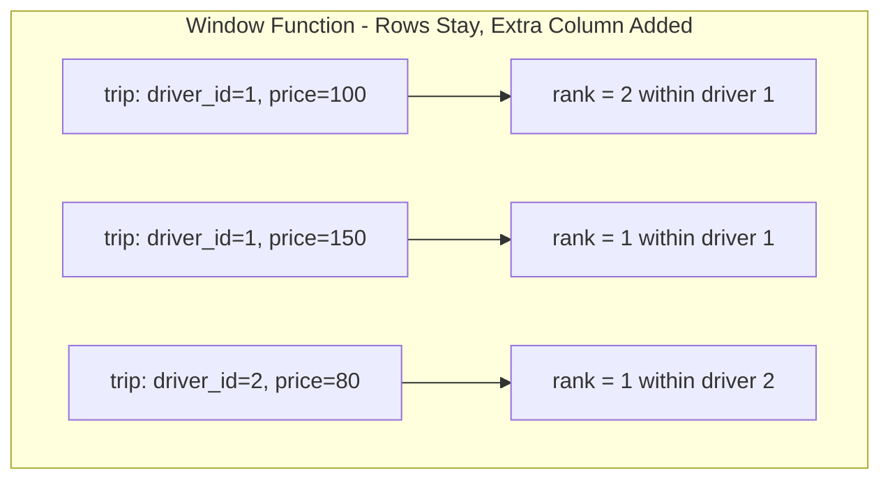

#### مثال 1: تطبيق عملي

```sql
-- Rank each trip by price WITHIN its own driver's trips, keeping every row
SELECT
    driver_id,
    destination,
    price,
    RANK() OVER (PARTITION BY driver_id ORDER BY price DESC) AS price_rank
FROM trips;
```

#### مثال 2: فخ شائع

غلطة شائعة إن حد يحط Window Function جوه `WHERE`، وده غير مسموح، لأن `WHERE` بيتنفذ قبل ما الـ Window Functions تتحسب أصلاً (نفس فكرة ترتيب التنفيذ اللي شرحناها في WHERE vs HAVING).

```sql
-- WRONG: window functions cannot be used directly in WHERE
SELECT driver_id, price, RANK() OVER (PARTITION BY driver_id ORDER BY price DESC) AS r
FROM trips
WHERE r = 1;

-- CORRECT: wrap it in a subquery or CTE, then filter the outer query
SELECT * FROM (
    SELECT driver_id, price, RANK() OVER (PARTITION BY driver_id ORDER BY price DESC) AS r
    FROM trips
) ranked
WHERE r = 1;
```

#### مثال 3: حالة إنتاج حقيقية

في منصة تحليلات لشركة توصيل، فريق البيانات كان عايز "أغلى 3 رحلات لكل سائق" في تقرير واحد من غير ما يعمل استعلام منفصل لكل سائق. باستخدام `RANK() OVER (PARTITION BY driver_id ORDER BY price DESC)` جوه Subquery وفلترة `r <= 3`، قدروا يجيبوا النتيجة دي في استعلام واحد بس، بدل ما يكتبوا كود Application معقد يعمل Loop على كل سائق لوحده ويطلق استعلام منفصل لكل واحد (وده كان هيسبب مشكلة N+1 هنشرحها بعدين في موديول الأداء).

**مستوى التعمق: متقدم**

---

## Q16 — إيه هي CTEs (Common Table Expressions)، وإمتى تحتاج Recursive CTE؟

### أصل الحكاية

لما استعلامك يكبر ويبقى فيه Subqueries متداخلة كتير جوه بعض، الاستعلام بيبقى صعب القراءة وصعب الصيانة، خصوصاً لو نفس الـ Subquery متكرر أكتر من مرة. **CTE** (بتتكتب بـ `WITH name AS (...)`) بتديك القدرة إنك تعرّف "نتيجة مؤقتة" باسم واضح، وتستخدمها بعد كده في الاستعلام الرئيسي زي ما تستخدم جدول عادي، وده بيخلي الاستعلامات المعقدة أسهل بكتير للقراءة والفهم.

فيه نوع خاص وقوي جداً اسمه **Recursive CTE**: بيسمحلك تعمل استعلام "بيكرر نفسه" عشان يمشي في بيانات هرمية (Hierarchical) زي شجرة تنظيمية (موظف تحت مدير تحت مدير أعلى)، أو بيانات فيها علاقة "أب لابن" متكررة. الـ Recursive CTE بيتكون من جزئين: **Base Case** (نقطة البداية، زي أعلى مدير في الهرم)، و**Recursive Case** (بيرجع يضم صفوف جديدة بناءً على نتيجة الخطوة اللي فاتت، وبيكرر لحد ما محدش يرجع صفوف جديدة).

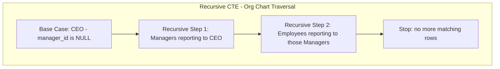

#### مثال 1: تطبيق عملي

```sql
-- Regular CTE: makes a complex query readable
WITH driver_trip_counts AS (
    SELECT driver_id, COUNT(*) AS trip_count
    FROM trips
    GROUP BY driver_id
)
SELECT drivers.name, driver_trip_counts.trip_count
FROM drivers
JOIN driver_trip_counts ON drivers.id = driver_trip_counts.driver_id
WHERE driver_trip_counts.trip_count > 10;

-- Recursive CTE: walk the entire management chain from the top down
WITH RECURSIVE org_chart AS (
    -- Base case: top-level employees with no manager
    SELECT id, name, manager_id, 1 AS level
    FROM employees
    WHERE manager_id IS NULL

    UNION ALL

    -- Recursive case: employees reporting to someone already in org_chart
    SELECT e.id, e.name, e.manager_id, org_chart.level + 1
    FROM employees e
    JOIN org_chart ON e.manager_id = org_chart.id
)
SELECT * FROM org_chart;
```

#### مثال 2: فخ شائع

غلطة خطيرة جداً في Recursive CTE إنك تنسى شرط توقف واضح (Base Case صحيح)، فالاستعلام يدخل في **Infinite Loop** ويستهلك موارد السيرفر لحد ما يقع.

```sql
-- DANGEROUS: if there's a circular reference (A manages B, B manages A),
-- this recursive CTE could loop forever without a proper termination condition
WITH RECURSIVE org_chart AS (
    SELECT id, name, manager_id FROM employees WHERE manager_id IS NULL
    UNION ALL
    SELECT e.id, e.name, e.manager_id
    FROM employees e JOIN org_chart ON e.manager_id = org_chart.id
)
SELECT * FROM org_chart;

-- SAFER: most databases let you add a hard depth limit as a safety net
WITH RECURSIVE org_chart AS (
    SELECT id, name, manager_id, 1 AS depth FROM employees WHERE manager_id IS NULL
    UNION ALL
    SELECT e.id, e.name, e.manager_id, org_chart.depth + 1
    FROM employees e JOIN org_chart ON e.manager_id = org_chart.id
    WHERE org_chart.depth < 20 -- safety net against accidental infinite recursion
)
SELECT * FROM org_chart;
```

#### مثال 3: حالة إنتاج حقيقية

في نظام إدارة موارد بشرية لشركة كبيرة فيها آلاف الموظفين على مستويات إدارية كتير، كانوا بيجيبوا الهيكل التنظيمي كامل عن طريق كود Application بيعمل استعلام منفصل لكل مستوى إداري (استعلام لكل مدير، وبعدين استعلام تاني لموظفينه، وهكذا)، وده كان بياخد ثواني كتير مع الهيكل التنظيمي الكبير. لما حولوا الحل لـ Recursive CTE واحدة، قاعدة البيانات نفسها قدرت تمشي في الهرم كله في استعلام واحد بس، ووقت التحميل نزل من ثواني لأجزاء من الثانية.

**مستوى التعمق: متقدم**

---

## Checkpoint: ملخص الموديول التاني

خلينا نلخص اللي اتغطى في الموديول ده:

- **INNER JOIN**: بيرجع بس الصفوف اللي عندها تطابق فعلي في الجدولين، لازم تحدد شرط `ON` واضح عشان تتجنب Cartesian Product.
- **LEFT JOIN / RIGHT JOIN**: LEFT JOIN بيرجع كل صفوف الجدول الشمال حتى من غير تطابق (بـ NULL للجانب التاني)، وشرط الفلترة الإضافي لازم يكون جوه `ON` مش `WHERE` عشان متكسرش المنطق.
- **FULL OUTER JOIN**: بيرجع كل الصفوف من الجدولين مع بعض، سواء فيه تطابق أو لأ.
- **SELF JOIN**: مش نوع JOIN جديد، لأ استخدام نفس الجدول مرتين بـ Aliases مختلفة عشان تقارن صفوفه ببعض (زي جدول موظفين ومديرين).
- **Subqueries vs JOINs**: JOIN غالباً أسرع وبيديك أعمدة من الجدولين، بينما `EXISTS` بيكون أوضح وأسرع لما السؤال هو "هل موجود ولا لأ" بس.
- **WHERE vs HAVING**: `WHERE` بيفلتر الصفوف الفردية **قبل** التجميع، `HAVING` بيفلتر المجموعات **بعد** التجميع. الترتيب الفعلي للتنفيذ: FROM → WHERE → GROUP BY → HAVING → SELECT.
- **GROUP BY**: أي عمود في `SELECT` مش جوه Aggregate Function لازم يكون في `GROUP BY`.
- **Window Functions**: بتحسب قيمة تجميعية لكل صف (زي RANK أو SUM) من غير ما تدمج الصفوف في مجموعة واحدة زي GROUP BY، باستخدام `PARTITION BY` و`OVER`.
- **CTEs**: بتخلي الاستعلامات المعقدة أوضح باستخدام `WITH name AS (...)`، والـ Recursive CTE بيسمحلك تمشي في بيانات هرمية زي الهياكل التنظيمية، بس لازم شرط توقف واضح عشان تتجنب Infinite Loop.

الموديول الجاي هيكون عن المعاملات ومبادئ ACID: Atomicity وConsistency وIsolation وDurability، ومستويات الـ Isolation، والـ Locking. استنى تعليماتك عشان نكمل.

---

# الموديول 3: المعاملات ومبادئ ACID (Q17–Q23)

## Q17 — إيه هي الـ Transaction أصلاً، وليه محتاجينها؟

### أصل الحكاية

تخيل معايا سيناريو تحويل فلوس بين حسابين بنكيين: عايز تحول 100 جنيه من حساب أحمد لحساب سارة. العملية دي منطقياً خطوتين: تنقص 100 جنيه من رصيد أحمد، وتزود 100 جنيه في رصيد سارة. تخيل دلوقتي إن السيرفر وقع (Crash) أو حصل انقطاع كهرباء **بالظبط** بعد ما الخطوة الأولى خلصت وقبل ما الخطوة التانية تبدأ. النتيجة: أحمد فقد 100 جنيه، وسارة مستلمتش حاجة. الفلوس دي "اختفت" من النظام كله!

المشكلة دي هي بالظبط اللي خلت مصممي قواعد البيانات يخترعوا مفهوم **Transaction**: مجموعة من العمليات (Queries) بتتعامل معاها قاعدة البيانات كـ **وحدة واحدة غير قابلة للتجزئة**. يعني إما كل العمليات دي بتتنفذ بنجاح وتتثبت (Commit)، أو لو أي حاجة غلطت في النص، **كل** العمليات دي بترجع لورا (Rollback) وكأن حاجة ماحصلتش أصلاً. مفيش حالة وسط ممكن تحصل فيها "نص العملية اتنفذت".

الـ Transaction بتتحدد عادة بأمرين: `BEGIN` (أو `START TRANSACTION`) في البداية، و`COMMIT` (لو كل حاجة تمام) أو `ROLLBACK` (لو حصل خطأ) في النهاية.

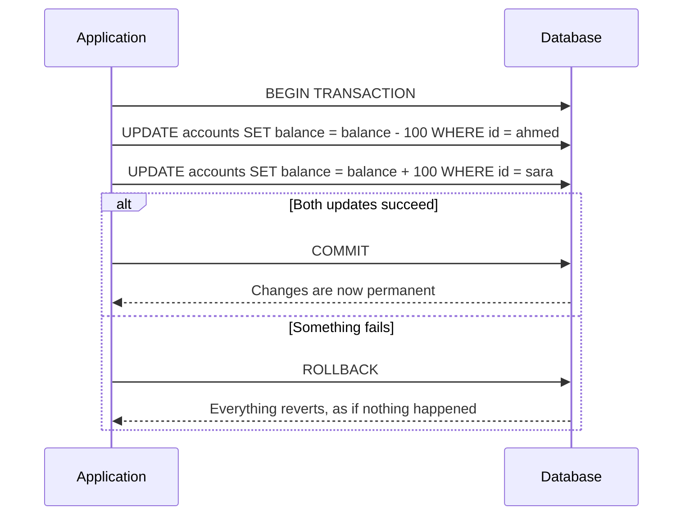

#### مثال 1: تطبيق عملي

```sql
BEGIN;

-- Deduct from Ahmed's account
UPDATE accounts SET balance = balance - 100 WHERE owner = 'Ahmed';

-- Add to Sara's account
UPDATE accounts SET balance = balance + 100 WHERE owner = 'Sara';

-- Only if both statements succeeded do we make the changes permanent
COMMIT;
```

#### مثال 2: فخ شائع

غلطة شائعة جداً إن حد ينفذ كل `UPDATE` كاستعلام منفصل (Auto-commit) من غير ما يحط `BEGIN` و`COMMIT` صريحين، فلو الخطوة التانية فشلت، الخطوة الأولى تكون خلاص اتثبتت في قاعدة البيانات ومفيش رجعة فيها.

```sql
-- WRONG: no explicit transaction, each statement commits independently
UPDATE accounts SET balance = balance - 100 WHERE owner = 'Ahmed'; -- commits immediately
UPDATE accounts SET balance = balance + 100 WHERE owner = 'Sara'; -- if this fails, Ahmed's money is just gone

-- CORRECT: wrap both statements in one explicit transaction
BEGIN;
UPDATE accounts SET balance = balance - 100 WHERE owner = 'Ahmed';
UPDATE accounts SET balance = balance + 100 WHERE owner = 'Sara';
COMMIT;
```

#### مثال 3: حالة إنتاج حقيقية

في نظام دفع إلكتروني حقيقي، حصلت مشكلة إن التطبيق كان بينفذ خطوة "خصم من رصيد العميل" وخطوة "إضافة الطلب في جدول الطلبات" كاستعلامين منفصلين من غير Transaction واحدة. لما السيرفر وقع بين الخطوتين بسبب مشكلة شبكة، آلاف العملاء اتخصم منهم فلوس من غير ما تتسجل طلباتهم، وده سبب أزمة خدمة عملاء ضخمة واضطروا يرجعوا الفلوس يدوياً لكل العملاء المتأثرين.

**مستوى التعمق: أساسي**

---

## Q18 — إيه هو الـ Atomicity (حرف A في ACID)؟

### أصل الحكاية

بعد ما فهمنا فكرة الـ Transaction بشكل عام، خلينا نتعمق في أول حرف من ACID. **Atomicity** معناها الحرفي "عدم القابلية للتجزئة"، زي الذرة (Atom) في الفيزياء القديمة اللي كان مفروض تبقى أصغر وحدة مينفعش تتقسم. في قواعد البيانات، Atomicity بتضمنلك إن الـ Transaction بالكامل بتتنفذ **كوحدة واحدة**: إما كل عملياتها بتنجح وتتثبت، أو لو حاجة واحدة فيها فشلت، كل حاجة بترجع لورا بالكامل، **حتى لو الخطوات التانية نجحت فعلياً**.

الفرق المهم عن باقي حروف ACID: Atomicity بتتكلم تحديداً عن "هل العملية اكتملت كلها ولا لأ"، من غير ما تتكلم عن صحة البيانات منطقياً (ده دور Consistency) أو التعامل مع Transactions تانية شغالة في نفس الوقت (ده دور Isolation). فكر في Atomicity كـ "خيار الكل أو ولا حاجة" (All or Nothing).

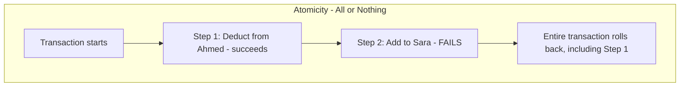

#### مثال 1: تطبيق عملي

```sql
BEGIN;

UPDATE inventory SET quantity = quantity - 1 WHERE product_id = 10;
-- If this next statement fails (e.g. constraint violation), the above
-- UPDATE is rolled back too, because they are one atomic unit
INSERT INTO orders (product_id, customer_id) VALUES (10, 5);

COMMIT;
```

#### مثال 2: فخ شائع

غلطة شائعة إن المبرمج يمسك الأخطاء (Exceptions) في كود التطبيق ويكمل عادي من غير ما يعمل `ROLLBACK` صريح، فقاعدة البيانات تفضل مفتوحة على Transaction معلقة (Hanging Transaction) لفترة طويلة، وده بيسبب مشاكل في الأداء وإمساك موارد (Locks) من غير داعي.

```sql
-- WRONG: an error occurs but no explicit ROLLBACK is issued
BEGIN;
UPDATE accounts SET balance = balance - 100 WHERE owner = 'Ahmed';
-- error happens here, but the transaction is left open/hanging

-- CORRECT: application code must catch the error and issue ROLLBACK
BEGIN;
UPDATE accounts SET balance = balance - 100 WHERE owner = 'Ahmed';
-- on error in application code:
ROLLBACK;
```

#### مثال 3: حالة إنتاج حقيقية

في نظام حجز طيران، حصل خطأ برمجي خلى الـ Backend يمسك Exception بعد فشل خطوة "تأكيد الحجز" لكن من غير ما يعمل Rollback للخطوة اللي قبلها ("حجز المقعد مؤقتاً"). النتيجة: مقاعد كتير فضلت "محجوزة" في النظام بشكل دائم من غير حجز فعلي مكتمل، وده قلل عدد المقاعد المتاحة للبيع فعلياً لحد ما اكتشفوا المشكلة وعملوا سكريبت تنظيف يدوي.

**مستوى التعمق: أساسي**

---

## Q19 — إيه هو الـ Consistency (حرف C في ACID)؟

### أصل الحكاية

تخيل عندك قاعدة بيانات فيها قاعدة (Constraint) واضحة: رصيد الحساب مينفعش يكون سالب أبداً (`CHECK (balance >= 0)`). دلوقتي لو حاولت تعمل Transaction بتخصم 200 جنيه من حساب فيه بس 100 جنيه، إيه اللي المفروض يحصل؟ الإجابة: الـ Transaction دي **مينفعش تتثبت خالص**، لأنها هتخلي قاعدة البيانات في حالة "غير متسقة" (Inconsistent) بتخالف القواعد اللي إنت حاطها.

**Consistency** معناها إن أي Transaction بتاخد قاعدة البيانات من حالة صحيحة (Valid State) لحالة صحيحة تانية، وبتحترم كل القواعد المفروضة (Constraints، Triggers، Foreign Keys...) طول الوقت. لو الـ Transaction هتخالف أي قاعدة من دول، قاعدة البيانات نفسها بترفضها وترجعها بالكامل. الفرق عن Atomicity: Atomicity بتتكلم عن "الاكتمال"، بينما Consistency بتتكلم عن "الصحة المنطقية" للنتيجة النهائية.

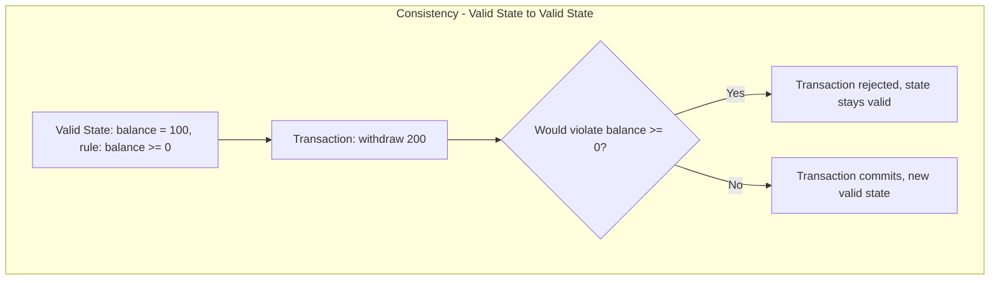

#### مثال 1: تطبيق عملي

```sql
-- The CHECK constraint enforces the business rule at the database level
CREATE TABLE accounts (
    id SERIAL PRIMARY KEY,
    owner VARCHAR(100),
    balance NUMERIC(10,2) CHECK (balance >= 0)
);

BEGIN;
-- This will fail and roll back automatically if it would make balance negative
UPDATE accounts SET balance = balance - 200 WHERE owner = 'Ahmed';
COMMIT;
```

#### مثال 2: فخ شائع

غلطة شائعة إن الفريق يفتكر إن فرض القواعد دي على مستوى الـ Application code بس كفاية، وينسى يحطها كـ Constraint فعلي في قاعدة البيانات. زي ما شرحنا في الموديول الأول، لو حد وصل لقاعدة البيانات مباشرة (Script أو Migration)، القاعدة دي ممكن تتخالف من غير ما حد يلاحظ.

```sql
-- WEAKER: only application code checks balance >= 0
-- Any direct database access (script, migration, admin tool) can bypass this

-- STRONGER: enforce it at the database level as a real safety net
ALTER TABLE accounts ADD CONSTRAINT balance_non_negative CHECK (balance >= 0);
```

#### مثال 3: حالة إنتاج حقيقية

في منصة تحويل أموال، فريق التطوير كان معتمد بالكامل على فحص الرصيد في كود الـ Backend بس، من غير أي `CHECK` Constraint في قاعدة البيانات. حصل Race Condition (هنشرحه في سؤال Isolation بعد شوية) خلى حسابين يوصلوا لرصيد سالب في نفس الوقت بسبب عمليتين متزامنتين. بعد الحادثة، أضافوا `CHECK (balance >= 0)` مباشرة كطبقة حماية أخيرة، وده منع تكرار المشكلة حتى لو حصل Bug تاني في منطق التطبيق.

**مستوى التعمق: متوسط**

---

## Q20 — إيه هو الـ Isolation (حرف I في ACID)، وإيه مشاكل التزامن (Concurrency) اللي بيحلها؟

### أصل الحكاية

لحد دلوقتي كنا بنتكلم عن Transaction واحدة لوحدها. لكن في الواقع، عندك مئات أو آلاف المستخدمين بيعملوا Transactions **في نفس اللحظة بالظبط** على نفس قاعدة البيانات. السؤال: هل الـ Transactions دي ممكن "تشوف" بعضها وهي لسه شغالة؟ وهل ده ممكن يسبب مشاكل؟

**Isolation** بيحدد "لأي درجة" الـ Transactions المتزامنة بتتأثر ببعض. لو مفيش Isolation كفاية، بتظهر مشاكل معروفة:

- **Dirty Read**: Transaction بتقرا بيانات من Transaction تانية **لسه ماتثبتتش (Uncommitted)**. لو الـ Transaction التانية دي عملت Rollback بعد كده، يبقى إنت قريت بيانات "مش حقيقية" أصلاً.
- **Non-Repeatable Read**: نفس الـ Transaction بتقرا نفس الصف مرتين، وبتلاقي قيمته اتغيرت في النص، لأن Transaction تانية عدلته وثبتته بين القراءتين.
- **Phantom Read**: Transaction بتنفذ نفس الاستعلام مرتين، وفي المرة التانية بتلاقي صفوف جديدة ظهرت (Phantom) كانت مش موجودة في المرة الأولى، بسبب Transaction تانية أضافت صفوف جديدة وثبتتها في النص.

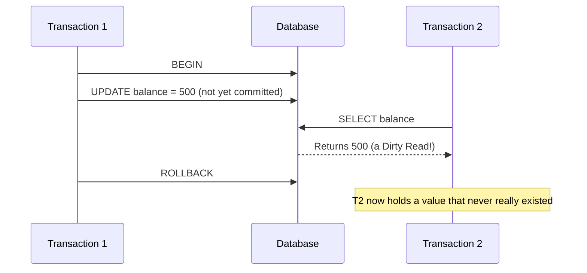

#### مثال 1: تطبيق عملي

```sql
-- Transaction 1: updates but hasn't committed yet
BEGIN;
UPDATE accounts SET balance = 500 WHERE id = 1;
-- (not committed yet)

-- Transaction 2 (running concurrently), depending on isolation level,
-- might or might not see the uncommitted 500 value
BEGIN;
SELECT balance FROM accounts WHERE id = 1;
COMMIT;
```

#### مثال 2: فخ شائع

غلطة شائعة إن المبرمجين يفترضوا إن قاعدة البيانات "تلقائياً" بتحمي من كل مشاكل التزامن دي بدون ما يفكروا في مستوى الـ Isolation المناسب، فيتفاجؤوا بنتايج غريبة زي إن نفس الاستعلام رجع نتيجتين مختلفتين في نفس الـ Transaction.

```sql
-- WRONG assumption: "the database will just handle concurrency automatically"
-- Reality: default isolation levels vary between databases and can allow
-- Non-Repeatable Reads or Phantom Reads unless explicitly configured

-- Explicitly choose the isolation level that matches your consistency needs
SET TRANSACTION ISOLATION LEVEL REPEATABLE READ;
```

#### مثال 3: حالة إنتاج حقيقية

في نظام حجز تذاكر لحدث كبير، اتحصل Race Condition بين عمليتين متزامنتين بيحاولوا يحجزوا **نفس المقعد الأخير** في نفس اللحظة. بسبب Isolation Level ضعيف، الاتنين قروا "المقعد متاح" في نفس الوقت (قبل ما أي حد يثبت التغيير)، وباعوا نفس المقعد لشخصين مختلفين. المشكلة دي اتحلت بعدين باستخدام Isolation Level أقوى مع Locking صريح، هنشرحه في الأسئلة الجاية.

**مستوى التعمق: متقدم**

---

## Q21 — إيه هي مستويات الـ Isolation الأربعة (Isolation Levels) وإيه الفرق بينهم؟

### أصل الحكاية

بعد ما فهمنا المشاكل اللي ممكن تحصل من غير Isolation كافي، لازم نفهم إن قاعدة البيانات مش بتشتغل بمستوى Isolation واحد ثابت، لأ بتديك اختيار بين 4 مستويات، وكل مستوى بيحل مشاكل أكتر بس بتكلفة أداء أعلى (لأنه بيحتاج قفل (Locking) أو فحص أكتر). المعيار الرسمي (SQL Standard) بيعرّف المستويات دي:

1. **Read Uncommitted**: أضعف مستوى، بيسمح بكل المشاكل التلاتة (Dirty Read, Non-Repeatable Read, Phantom Read). نادراً ما بيتستخدم عملياً.
2. **Read Committed**: بيمنع الـ Dirty Read بس (متقدرش تقرا بيانات لسه ماتثبتتش)، لكن لسه ممكن يحصل Non-Repeatable Read وPhantom Read. ده المستوى الافتراضي في PostgreSQL وOracle.
3. **Repeatable Read**: بيمنع Dirty Read وNon-Repeatable Read، يعني لو قريت نفس الصف مرتين في نفس الـ Transaction، هتاخد نفس القيمة أكيد. لسه ممكن يحصل Phantom Read في بعض الأنظمة (برغم إن MySQL بيمنعه فعلياً في المستوى ده). ده المستوى الافتراضي في MySQL.
4. **Serializable**: أقوى مستوى، بيمنع كل المشاكل التلاتة تماماً، وكأن كل الـ Transactions اتنفذت واحدة ورا التانية (Sequentially) حتى لو فعلياً اتنفذوا في نفس الوقت. أعلى أمان، لكن أبطأ أداء وأكتر عرضة لفشل الـ Transaction بسبب تعارضات (Conflicts) لازم تتعاد من الأول.

```mermaid
graph TD
    A["Read Uncommitted - weakest, fastest"] --> B["Read Committed - blocks Dirty Read"]
    B --> C["Repeatable Read - blocks Dirty and Non-Repeatable Read"]
    C --> D["Serializable - blocks all three, strongest, slowest"]
```

#### مثال 1: تطبيق عملي

```sql
-- Setting isolation level explicitly for a critical financial transaction
BEGIN;
SET TRANSACTION ISOLATION LEVEL SERIALIZABLE;

SELECT balance FROM accounts WHERE id = 1;
UPDATE accounts SET balance = balance - 100 WHERE id = 1;

COMMIT;
```

#### مثال 2: فخ شائع

غلطة شائعة إن حد يستخدم `SERIALIZABLE` في كل مكان "عشان يبقى آمن قد ما يمكن" من غير ما يفكر في تكلفة الأداء، فيلاقي نظامه بطيء جداً تحت ضغط عالي، ومليان بـ Transactions بتفشل وتحتاج إعادة محاولة (Retry) بسبب تعارضات مش حقيقية فعلياً.

```sql
-- OVERKILL: using SERIALIZABLE for a simple read of non-critical data
SET TRANSACTION ISOLATION LEVEL SERIALIZABLE;
SELECT COUNT(*) FROM page_views; -- doesn't need this level of protection

-- APPROPRIATE: Read Committed is enough for most everyday reads
SET TRANSACTION ISOLATION LEVEL READ COMMITTED;
SELECT COUNT(*) FROM page_views;
```

#### مثال 3: حالة إنتاج حقيقية

في نظام بنكي فعلي، عمليات تحويل الأموال بتستخدم `SERIALIZABLE` أو Locking صريح عشان تضمن مفيش تعارضات في الأرصدة، حتى لو ده بيبطئ العملية شوية. لكن نفس النظام بيستخدم `Read Committed` للاستعلامات العادية زي "عرض كشف الحساب"، لأن السرعة هنا أهم من ضمان صرامة كاملة، والمخاطرة أقل بكتير من عمليات التحويل الفعلية.

**مستوى التعمق: متقدم**

---

## Q22 — إيه هو الـ Durability (حرف D في ACID)؟

### أصل الحكاية

تخيل إن Transaction اتنفذت بنجاح، واستلمت رسالة "Commit successful" من قاعدة البيانات. بعد ثانية واحدة بالظبط، السيرفر وقع فجأة (Power Failure). السؤال المهم: هل التغييرات اللي اتعملت في الـ Transaction دي **لسه موجودة** بعد ما السيرفر يرجع يشتغل تاني؟

**Durability** بتضمنلك الإجابة: أيوه، أكيد. لما الـ Transaction تتثبت (Commit)، قاعدة البيانات بتضمن إن التغييرات دي **بتتحفظ بشكل دائم** على تخزين غير متطاير (Non-volatile storage زي الديسك)، حتى لو حصل Crash أو انقطاع كهرباء فوراً بعد الـ Commit. الطريقة التقنية اللي بتحقق ده غالباً اسمها **Write-Ahead Logging (WAL)**: قاعدة البيانات بتكتب سجل (Log) لكل تغيير على الديسك **قبل** ما تأكد الـ Commit للمستخدم، فحتى لو حصل Crash، لما السيرفر يرجع يشتغل، بيقدر "يعيد تشغيل" (Replay) السجل ده ويرجع لنفس الحالة اللي كانت قبل الانقطاع.

```mermaid
sequenceDiagram
    participant App as Application
    participant WAL as Write-Ahead Log
    participant Disk as Data Files
    App->>WAL: Write change to log first
    WAL-->>App: Log confirmed on disk
    App->>App: COMMIT confirmed to user
    Note over Disk: Data files updated later, but WAL guarantees recovery on crash
```

#### مثال 1: تطبيق عملي

```sql
BEGIN;
UPDATE accounts SET balance = balance - 100 WHERE owner = 'Ahmed';
UPDATE accounts SET balance = balance + 100 WHERE owner = 'Sara';
COMMIT;
-- Once COMMIT returns successfully, the database guarantees this change
-- survives even an immediate crash, thanks to the write-ahead log
```

#### مثال 2: فخ شائع

غلطة شائعة (وخطيرة) إن بعض الفرق بتعطل خاصية الـ Write-Ahead Logging أو تستخدم إعدادات "Async" غير آمنة عشان "تكسب سرعة"، من غير ما يفهموا إنهم بكده بيضحوا بضمان الـ Durability نفسه.

```sql
-- RISKY: some databases allow disabling synchronous commit for speed
-- e.g. PostgreSQL's synchronous_commit = off
-- This trades durability guarantees for write speed - a committed
-- transaction could still be lost on a crash

-- SAFER for critical data: keep synchronous commit enabled (the default)
-- Accept the small performance cost for the durability guarantee
```

#### مثال 3: حالة إنتاج حقيقية

شركة ناشئة عطلت إعداد الـ Durability الكامل في قاعدة بياناتها (استخدمت وضع كتابة غير متزامن) عشان تحسّن سرعة الكتابة في مرحلة إطلاق المنتج. بعدها بأسبوع حصل انقطاع كهرباء مفاجئ في مركز البيانات، وفقدوا آخر كام ثانية من المعاملات المالية اللي المستخدمين كانوا شايفينها "متأكدة ومحفوظة" على الشاشة. الدرس المستفاد: تحسين الأداء على حساب Durability مقبول بس في بيانات مش حرجة (زي Logs تحليلية)، مش في بيانات مالية أو حرجة.

**مستوى التعمق: متقدم**

---

## Q23 — إيه الفرق بين Optimistic Locking وPessimistic Locking، وإيه هو الـ Deadlock؟

### أصل الحكاية

فهمنا إن Isolation Levels بتحدد "قد إيه الـ Transactions بتتأثر ببعض"، لكن السؤال العملي: إزاي قاعدة البيانات فعلياً **بتمنع** تعارض التزامن ده؟ الإجابة: عن طريق **Locking**. لما Transaction تيجي تعدل صف معين، قاعدة البيانات ممكن "تقفل" الصف ده عشان محدش تاني يعدله في نفس الوقت.

فيه فلسفتين مختلفتين للـ Locking:

**Pessimistic Locking**: الفلسفة هنا "افترض إن التعارض هيحصل أكيد"، فتقفل الصف **فوراً** أول ما تبدأ تقراه بنية التعديل (زي `SELECT ... FOR UPDATE`)، وأي Transaction تانية عايزة تعدل نفس الصف لازم **تستنى** لحد ما إنت تخلص. ده مناسب في الحالات اللي فيها احتمال تعارض عالي جداً (زي حجز آخر مقعد في حفلة).

**Optimistic Locking**: الفلسفة العكسية "افترض إن التعارض نادر"، فمتقفلش حاجة، وبس تحتفظ بـ "رقم نسخة" (Version Number) للصف. لما تيجي تعدل، بتتأكد إن رقم النسخة لسه زي ما كان من وقت ما قريته، ولو اتغير (يبقى حد تاني عدل الصف قبلك)، بترفض التعديل وتخلي التطبيق يعيد المحاولة. ده مناسب لما التعارض نادر الحدوث فعلياً، وبيدّي أداء أعلى لأنه مش بيقفل حاجة أصلاً.

أما **Deadlock**: بيحصل لما Transaction A بتستنى قفل ماسكه Transaction B، وفي نفس الوقت Transaction B بتستنى قفل ماسكه Transaction A. الاتنين واقفين يستنوا بعض للأبد. قاعدة البيانات بتكتشف الموقف ده تلقائياً، وبتختار **تلغي واحدة من الـ Transactions** (بترجعها Rollback) عشان تفك الجمود.

```mermaid
sequenceDiagram
    participant T1 as Transaction A
    participant T2 as Transaction B
    T1->>T1: Locks Row 1
    T2->>T2: Locks Row 2
    T1->>T2: Waits for Row 2 (held by B)
    T2->>T1: Waits for Row 1 (held by A)
    Note over T1,T2: Deadlock detected - database rolls back one transaction
```

#### مثال 1: تطبيق عملي

```sql
-- Pessimistic Locking: lock the row immediately, others must wait
BEGIN;
SELECT * FROM tickets WHERE id = 1 FOR UPDATE;
UPDATE tickets SET status = 'sold' WHERE id = 1;
COMMIT;

-- Optimistic Locking: check a version number, no locking involved
BEGIN;
SELECT id, version, status FROM tickets WHERE id = 1;
-- Application checks version = 3 before this update
UPDATE tickets SET status = 'sold', version = version + 1
WHERE id = 1 AND version = 3; -- fails silently if someone else already updated it
COMMIT;
```

#### مثال 2: فخ شائع

غلطة شائعة تسبب Deadlocks: إن أجزاء مختلفة من التطبيق بتقفل جداول أو صفوف بترتيب مختلف. مثلاً كود مكان بيقفل جدول `accounts` الأول وبعدين `orders`، وكود تاني بيقفل `orders` الأول وبعدين `accounts`. الترتيب المختلف ده هو اللي بيسبب Deadlock فعلياً.

```sql
-- WRONG: Transaction A locks accounts then orders
BEGIN;
UPDATE accounts SET balance = balance - 100 WHERE id = 1;
UPDATE orders SET status = 'paid' WHERE id = 5;
COMMIT;

-- Meanwhile Transaction B locks orders then accounts (reverse order) - deadlock risk!
BEGIN;
UPDATE orders SET status = 'cancelled' WHERE id = 5;
UPDATE accounts SET balance = balance + 100 WHERE id = 1;
COMMIT;

-- CORRECT: always lock resources in the same consistent order across the whole app
-- e.g. always accounts before orders, everywhere in the codebase
```

#### مثال 3: حالة إنتاج حقيقية

في نظام حجوزات كبير لحدث فيه إقبال ضخم في نفس اللحظة (زي بيع تذاكر مباراة نهائي)، استخدموا **Pessimistic Locking** مع `SELECT FOR UPDATE` على صفوف المقاعد عشان يضمنوا مفيش بيع مزدوج لنفس المقعد، وقبلوا إن بعض المستخدمين هيستنوا كام ميلي ثانية إضافية. في المقابل، على نظام تعديل بروفايل المستخدم العادي (احتمال تعارض ضعيف جداً)، استخدموا **Optimistic Locking** بدل Pessimistic عشان يوفروا أداء أعلى، لأن التعارض هناك نادر جداً في الأساس.

**مستوى التعمق: متقدم**

---

## Checkpoint: ملخص الموديول التالت

خلينا نلخص مبادئ ACID الأربعة ومفاهيم التزامن:

- **Transaction**: مجموعة عمليات بتتعامل معاها قاعدة البيانات كوحدة واحدة، إما تتثبت كلها (Commit) أو ترجع كلها لورا (Rollback).
- **Atomicity**: كل خطوات الـ Transaction بتتنفذ كلها أو محدش منهم، مفيش حالة وسط.
- **Consistency**: أي Transaction بتاخد قاعدة البيانات من حالة صحيحة لحالة صحيحة تانية، وبتحترم كل القواعد والـ Constraints المفروضة.
- **Isolation**: بيحدد قد إيه الـ Transactions المتزامنة بتتأثر ببعض، وبيحمي من مشاكل زي Dirty Read وNon-Repeatable Read وPhantom Read.
- **Isolation Levels**: 4 مستويات بترتيب متصاعد من القوة والتكلفة: Read Uncommitted، Read Committed (الافتراضي في PostgreSQL/Oracle)، Repeatable Read (الافتراضي في MySQL)، وSerializable (الأقوى والأبطأ).
- **Durability**: أي Transaction اتثبتت (Commit) بتفضل محفوظة بشكل دائم حتى لو حصل Crash فوراً بعدها، بفضل تقنيات زي Write-Ahead Logging.
- **Pessimistic Locking**: تقفل الصف فوراً وقت القراءة، مناسب لما احتمال التعارض عالي.
- **Optimistic Locking**: متقفلش حاجة، وتتحقق من رقم نسخة وقت التعديل، مناسب لما التعارض نادر.
- **Deadlock**: بيحصل لما Transactions بتستنى بعضها للأبد، وقاعدة البيانات بتكتشفه وتلغي واحدة منهم تلقائياً؛ الحل الوقائي إنك تقفل الموارد بترتيب ثابت في كل الكود.

الموديول الجاي هيكون عن الأداء والفهارس: B-Tree Index، Composite Indexes، Covering Index، EXPLAIN ANALYZE، ومشكلة N+1. استنى تعليماتك عشان نكمل.

---

# الموديول 4: الأداء والفهارس (Q24–Q30)

## Q24 — إيه هو الـ Index أصلاً، وليه استعلام بسيط ممكن يبقى بطيء جداً من غيره؟

### أصل الحكاية

تخيل معايا جدول `orders` فيه 5 مليون صف، وعايز تجيب كل الطلبات بتاعة عميل معين برقم `customer_id = 4821`. من غير أي فهرسة، قاعدة البيانات هتعمل حاجة اسمها **Full Table Scan**: تفتح الجدول من أول صف، وتقرا كل صف صف، وتقارن قيمة `customer_id` بتاعته بـ 4821، لحد ما تخلص الجدول كله. لو الجدول فيه 5 مليون صف، يبقى في أسوأ الحالات لازم تعدي على 5 مليون صف عشان تلاقي بس كام صف مطلوبين.

ده بالظبط زي إنك تدور على اسم شخص معين في تليفون مطبوع (دليل التليفونات القديم) بس مفيش ترتيب أبجدي، وعايز تلاقي "محمد" فمضطر تقرا كل صفحة من الأول للآخر. الحل الطبيعي في الدليل: ترتيب الأسماء أبجدياً، فتقدر تفتح على الحرف "م" وتلاقي المطلوب في ثواني.

**Index** هو بالظبط نفس الفكرة: هيكل بيانات إضافي، منفصل عن الجدول الأصلي، بيحتفظ بنسخة مرتبة من عمود معين (أو أكتر) مع مؤشر (Pointer) بيقول "القيمة دي موجودة في الصف رقم كذا في الجدول الأصلي". لما تعمل فهرس على عمود `customer_id`، قاعدة البيانات بتقدر تلاقي كل صفوف العميل 4821 من غير ما تلمس باقي الـ 5 مليون صف خالص.

الفرق في الأداء مش بسيط: بحث في جدول غير مفهرس تكلفته O(n) — كل ما الجدول يكبر، البحث بياخد وقت أطول بشكل خطي. بحث في جدول مفهرس (بفهرس زي B-Tree) تكلفته تقريباً O(log n) — حتى لو الجدول اتضاعف 10 مرات، الوقت بيزيد بشكل طفيف جداً مش خطي.

```mermaid
graph TD
    subgraph "Without Index: Full Table Scan"
        A["Query: WHERE customer_id = 4821"] --> B["Read row 1, compare"]
        B --> C["Read row 2, compare"]
        C --> D["... read every row ..."]
        D --> E["Read row 5,000,000, compare"]
    end
    subgraph "With Index: Direct Lookup"
        F["Query: WHERE customer_id = 4821"] --> G["Look up 4821 in index structure"]
        G --> H["Index points directly to matching rows"]
    end
```

#### مثال 1: تطبيق عملي

```sql
-- Without an index, this scans the whole table
SELECT * FROM orders WHERE customer_id = 4821;

-- Creating an index makes the same query dramatically faster
CREATE INDEX idx_orders_customer_id ON orders (customer_id);

-- Now the database can jump straight to matching rows
SELECT * FROM orders WHERE customer_id = 4821;
```

#### مثال 2: فخ شائع

كتير من المبتدئين بيفتكروا إن الفهرسة "مجانية"، وبيحطوا فهرس على كل عمود موجود في الجدول من غير تفكير. المشكلة إن كل فهرس بياخد مساحة تخزين إضافية على الديسك، وكل عملية `INSERT` أو `UPDATE` أو `DELETE` لازم تحدّث كل فهرس مرتبط بالجدول، مش الجدول بس. يعني فهرسة زيادة عن اللزوم بتبطّئ عمليات الكتابة بشكل ملحوظ.

```sql
-- WRONG: indexing every single column "just in case"
CREATE INDEX idx1 ON orders (customer_id);
CREATE INDEX idx2 ON orders (order_date);
CREATE INDEX idx3 ON orders (status);
CREATE INDEX idx4 ON orders (notes); -- rarely searched, low selectivity, waste of space

-- BETTER: index only the columns actually used in WHERE, JOIN, or ORDER BY
CREATE INDEX idx_orders_customer_id ON orders (customer_id);
CREATE INDEX idx_orders_status ON orders (status);
```

#### مثال 3: حالة إنتاج حقيقية

منصة توصيل طعام كان عندها جدول `orders` بـ 8 مليون صف، وصفحة "طلباتي" في التطبيق كانت بتاخد أكتر من 4 ثواني تفتح لكل مستخدم، لأن الاستعلام كان بيعمل Full Table Scan على كل استدعاء. بعد ما ضافوا فهرس واحد بس على عمود `customer_id`، وقت الاستجابة نزل لأقل من 20 ميلي ثانية. فهرس واحد صح غيّر تجربة المستخدم بالكامل.

**مستوى التعمق: أساسي**

---

## Q25 — إزاي B-Tree Index بيشتغل من جوه فعلياً؟

### أصل الحكاية

طيب فهمنا إن الفهرس بيسرّع البحث، بس إزاي بالظبط بيلاقي القيمة بالسرعة دي؟ أغلب قواعد البيانات العلائقية (PostgreSQL، MySQL، Oracle) بتستخدم هيكل بيانات اسمه **B-Tree** (Balanced Tree) كنوع الفهرس الافتراضي.

فكر في B-Tree زي شجرة قرارات مرتبة: في القمة فيه "عقدة جذر" (Root Node) بتحتوي على كام قيمة مرجعية، وكل قيمة بتوجهك لفرع تاني. مثلاً لو عندك عمود أرقام، العقدة الجذر ممكن تقول "لو القيمة أقل من 500 روح شمال، لو أكبر روح يمين"، وكل فرع بيتفرع تاني لحد ما توصل لـ **Leaf Node** (عقدة ورقية) فيها القيمة الفعلية اللي بتدور عليها ومؤشر للصف في الجدول.

الحاجة المهمة في الاسم "Balanced": الشجرة دي بتحافظ على نفسها متوازنة تلقائياً، يعني المسافة من الجذر لأي Leaf Node ثابتة تقريباً، مهما كان حجم البيانات. ده اللي بيدّي الأداء اللوغاريتمي (O(log n)) اللي اتكلمنا عليه في السؤال اللي فات — حتى لو الجدول فيه بليون صف، عمق الشجرة مش هيتعدى كام مستوى بسيط.

B-Tree كمان بيتميز إنه بيدعم مش بس البحث عن قيمة محددة (`=`)، لكن كمان البحث في مدى (Range) زي `>`، `<`، `BETWEEN`، وده لأن الـ Leaf Nodes مرتبطة ببعضها بترتيب متسلسل، فلو لاقيت نقطة البداية تقدر "تمشي" على الشجرة لحد ما توصل للنهاية بسهولة.

```mermaid
graph TD
    subgraph "B-Tree Index Structure"
        Root["Root Node: keys 500, 1500"]
        Root --> N1["Branch: values less than 500"]
        Root --> N2["Branch: values 500 to 1500"]
        Root --> N3["Branch: values greater than 1500"]
        N1 --> L1["Leaf: 100, 250, 480 -> row pointers"]
        N2 --> L2["Leaf: 600, 900, 1200 -> row pointers"]
        N3 --> L3["Leaf: 1800, 2100 -> row pointers"]
        L1 -.->|linked| L2
        L2 -.->|linked| L3
    end
```

#### مثال 1: تطبيق عملي

```sql
-- B-Tree indexes are the default type, no need to specify explicitly
CREATE INDEX idx_orders_amount ON orders (amount);

-- B-Tree handles equality lookups efficiently
SELECT * FROM orders WHERE amount = 250;

-- B-Tree also handles range queries efficiently, thanks to linked leaf nodes
SELECT * FROM orders WHERE amount BETWEEN 100 AND 500;
SELECT * FROM orders WHERE amount > 1000 ORDER BY amount;
```

#### مثال 2: فخ شائع

غلطة شائعة إن حد يحط دالة (Function) على العمود المفهرس جوه الـ `WHERE`، زي `LOWER(email)` أو `YEAR(created_at)`. الفهرس العادي متخزنش نتيجة الدالة دي، فقاعدة البيانات مضطرة تتجاهل الفهرس وتعمل Full Table Scan تاني، حتى لو العمود نفسه مفهرس أصلاً.

```sql
-- WRONG: applying a function on the indexed column disables the index
SELECT * FROM users WHERE LOWER(email) = 'ahmed@example.com';

-- CORRECT: keep the column bare, normalize the input before the query instead
SELECT * FROM users WHERE email = 'ahmed@example.com';

-- If you truly need function-based lookups, create a functional/expression index
CREATE INDEX idx_users_lower_email ON users (LOWER(email));
```

#### مثال 3: حالة إنتاج حقيقية

في نظام تحليلات كان بيستخدم `WHERE YEAR(created_at) = 2025` على جدول فيه 40 مليون صف، والاستعلام كان بياخد 12 ثانية رغم إن عمود `created_at` مفهرس أصلاً. لما غيّروا الاستعلام لـ `WHERE created_at >= '2025-01-01' AND created_at < '2026-01-01'` (بدون دالة على العمود)، الفهرس اشتغل تاني والاستعلام رجع لأقل من 100 ميلي ثانية.

**مستوى التعمق: متوسط**

---

## Q26 — إيه هو Composite Index، وليه ترتيب الأعمدة فيه بيفرق جداً؟

### أصل الحكاية

لحد دلوقتي كنا بنتكلم عن فهرس على عمود واحد. بس إيه لو استعلامك بيفلتر على أكتر من عمود مع بعض في نفس الوقت؟ مثلاً "هات كل الطلبات بتاعة العميل 4821 اللي حالتها Delivered". لو عندك فهرس منفصل على `customer_id` وفهرس منفصل على `status`، قاعدة البيانات هتضطر تستخدم واحد منهم بس (أو تدمج نتايجهم بتكلفة إضافية)، وده مش أفضل حل ممكن.

هنا بييجي دور **Composite Index** (فهرس مركب): فهرس واحد بيتبني على أكتر من عمود مع بعض، بنفس فلسفة B-Tree بس بترتيب هرمي. تخيله زي دليل تليفونات مرتب أول حاجة بالاسم الأول، وجوه كل اسم أول مرتب بالاسم التاني. يعني لو عندك فهرس مركب على `(customer_id, status)`، البيانات بتترتب الأول حسب `customer_id`، وجوه كل `customer_id` بتترتب حسب `status`.

النقطة الحرجة هنا اسمها **Leftmost Prefix Rule**: الفهرس المركب بيقدر يساعدك في استعلامات بتستخدم العمود الأول لوحده، أو العمود الأول والتاني مع بعض، لكن **مش** هيساعدك لو دورت بالعمود التاني لوحده من غير الأول. زي دليل التليفونات: لو عندك الاسم الأول، تقدر تلاقي أي حد بسرعة، لكن لو عندك الاسم التاني بس ("كل اللي اسمهم التاني أحمد")، الترتيب ده مش هيفيدك، لازم تقلب الدليل كله.

```mermaid
graph TD
    subgraph "Composite Index on (customer_id, status)"
        A["customer_id = 100"] --> B["status: delivered"]
        A --> C["status: pending"]
        D["customer_id = 200"] --> E["status: delivered"]
        D --> F["status: cancelled"]
    end
    subgraph "Query Patterns"
        G["WHERE customer_id = 100 - uses index"]
        H["WHERE customer_id = 100 AND status = 'delivered' - uses index fully"]
        I["WHERE status = 'delivered' only - index not useful, wrong prefix"]
    end
```

#### مثال 1: تطبيق عملي

```sql
-- Composite index: order matters, customer_id first because it's the
-- more selective / more commonly filtered column
CREATE INDEX idx_orders_customer_status ON orders (customer_id, status);

-- Uses the index fully: filters on both columns, in the right order
SELECT * FROM orders WHERE customer_id = 4821 AND status = 'delivered';

-- Still uses the index: leftmost column alone is a valid prefix
SELECT * FROM orders WHERE customer_id = 4821;

-- Does NOT use this index efficiently: status alone skips the leftmost column
SELECT * FROM orders WHERE status = 'delivered';
```

#### مثال 2: فخ شائع

غلطة شائعة جداً إن حد يعمل فهرس مركب بترتيب أعمدة غلط، بحيث العمود اللي بيتفلتر عليه لوحده كتير يبقى في الآخر مش الأول. النتيجة إن الفهرس بيتعمل، بياخد مساحة، بس مش بيتستخدم فعلياً في كتير من الاستعلامات.

```sql
-- WRONG order: status is rarely queried alone, but it's rarely filtered
-- without customer_id anyway, so putting it first wastes the prefix advantage
CREATE INDEX idx_bad ON orders (status, customer_id);

-- This common query pattern won't use idx_bad efficiently
SELECT * FROM orders WHERE customer_id = 4821;

-- CORRECT: put the column most often used alone, or most selective, first
CREATE INDEX idx_good ON orders (customer_id, status);
```

#### مثال 3: حالة إنتاج حقيقية

في نظام إدارة مخزون لشركة لوجستيات، الفريق عمل فهرس مركب على `(warehouse_id, product_id, quantity)` عشان يخدم استعلام تقرير الجرد اليومي. بعد فترة لاحظوا استعلام تاني شائع بيفلتر بـ `product_id` لوحده (بدون `warehouse_id`) بطيء جداً رغم وجود الفهرس، لأن `product_id` مش أول عمود في الفهرس المركب. الحل كان إضافة فهرس تاني منفصل على `product_id` لوحده، بدل ما يحاولوا "يظلطوا" فهرس واحد يخدم أنماط استعلام مختلفة تماماً.

**مستوى التعمق: متوسط**

---

## Q27 — إيه هو Covering Index، وإيه الفرق بينه وبين Index-Only Scan؟

### أصل الحكاية

خد بالك من حاجة مهمة: حتى لو الفهرس لقى الصفوف المطلوبة بسرعة، قاعدة البيانات لسه محتاجة خطوة إضافية اسمها **Table Lookup** (أو Heap Fetch): ترجع للجدول الأصلي على الديسك عشان تجيب باقي الأعمدة اللي طلبتها في الـ `SELECT` ومش موجودة في الفهرس نفسه. الخطوة دي بتكلف قراءة إضافية من الديسك لكل صف، وده ممكن يبقى مكلف لو عدد الصفوف كبير.

**Covering Index** هو فهرس مصمم عشان "يغطي" الاستعلام بالكامل: يعني يحتوي على كل الأعمدة اللي الاستعلام محتاجها — سواء في الـ `WHERE` أو في الـ `SELECT` نفسه — بحيث قاعدة البيانات متحتاجش ترجع للجدول الأصلي خالص. لما ده يحصل، قاعدة البيانات بتعمل حاجة اسمها **Index-Only Scan**: بتجيب كل البيانات مباشرة من الفهرس نفسه، من غير ما تلمس الجدول الأصلي أبداً.

الفرق في الأداء واضح جداً في الجداول الكبيرة: Index Scan عادي بيدور على الصفوف في الفهرس، وبعدين لكل صف يرجع يقرا من الجدول (كأنك بتلف مرتين). Index-Only Scan بيكتفي بمرة واحدة بس، لأن كل حاجة محتاجها موجودة قدامك في الفهرس نفسه.

```mermaid
graph TD
    subgraph "Regular Index Scan: two trips"
        A["Find matching rows in index"] --> B["Go back to table on disk for each row"]
        B --> C["Return full row data"]
    end
    subgraph "Covering Index: Index-Only Scan"
        D["Find matching rows in index"] --> E["All requested columns already inside the index"]
        E --> F["Return data directly, table never touched"]
    end
```

#### مثال 1: تطبيق عملي

```sql
-- This query only needs customer_id, status, and total_amount
SELECT customer_id, status, total_amount
FROM orders
WHERE customer_id = 4821 AND status = 'delivered';

-- A covering index includes every column the query touches
CREATE INDEX idx_orders_covering
ON orders (customer_id, status, total_amount);

-- Now the database never needs to visit the orders table itself
-- because everything requested lives inside the index
```

#### مثال 2: فخ شائع

غلطة شائعة إن حد يعمل `SELECT *` وبعدين يستغرب ليه الـ Covering Index مش شغال. `SELECT *` بيجيب كل أعمدة الجدول، وأغلب الوقت مستحيل تحط كل عمود في الجدول جوه الفهرس (هيبقى نسخة كاملة من الجدول)، فالفهرس مبيقدرش "يغطي" الاستعلام، ومضطر يرجع للجدول الأصلي.

```sql
-- WRONG: SELECT * forces a table lookup even with a good index,
-- because the index can't reasonably contain every single column
SELECT * FROM orders WHERE customer_id = 4821 AND status = 'delivered';

-- CORRECT: select only the columns actually needed by the application
SELECT customer_id, status, total_amount
FROM orders WHERE customer_id = 4821 AND status = 'delivered';
```

#### مثال 3: حالة إنتاج حقيقية

في تطبيق تقارير مالية بيعرض ملخص شهري لملايين المعاملات، الاستعلام الأساسي كان بيجيب `transaction_id`، `amount`، و`status` بس، لكن كان بيستخدم `SELECT *` من عادة الكود القديمة. بعد ما الفريق حدد الأعمدة المطلوبة فعلياً وعملوا Covering Index يغطيها بالظبط، وقت تحميل التقرير نزل من 6 ثواني لأقل من نص ثانية، لأن قاعدة البيانات بقت بتعمل Index-Only Scan بدل ما ترجع لملايين الصفوف على الديسك.

**مستوى التعمق: متوسط**

---

## Q28 — إزاي تقرا نتيجة EXPLAIN ANALYZE عشان تفهم فين المشكلة فعلياً؟

### أصل الحكاية

لحد دلوقتي كنا بنتكلم عن الفهرسة نظرياً، بس السؤال العملي: إزاي تعرف فعلياً إن استعلام معين بيستخدم فهرس ولا لأ؟ وإزاي تعرف الاستعلام بياخد وقت طويل فين بالظبط؟ الإجابة: أمر `EXPLAIN`.

`EXPLAIN` بيوريك **خطة التنفيذ** (Execution Plan) اللي قاعدة البيانات ناوية تستخدمها للاستعلام، من غير ما تنفذه فعلياً. بيوريك حاجات زي: هل هيستخدم Index Scan ولا Sequential Scan (Full Table Scan)؟ هل هيعمل Sort إضافي؟ هل هيستخدم Nested Loop ولا Hash Join في ربط جدولين؟

المشكلة إن `EXPLAIN` لوحده بيدّيك **تقدير** بس (Estimated Cost)، مبني على إحصائيات قديمة عن البيانات، ومش بالضرورة الواقع الفعلي. هنا بييجي دور `EXPLAIN ANALYZE`: الأمر ده فعلياً **بينفذ** الاستعلام (خد بالك: لو الاستعلام `DELETE` أو `UPDATE`، هينفذه فعلاً على الحقيقة)، وبيقارن بين التكلفة المتوقعة (Estimated) والتكلفة الفعلية (Actual)، ويوريك الوقت الحقيقي اللي كل خطوة أخدته بالميلي ثانية.

أهم حاجة تدور عليها في نتيجة `EXPLAIN ANALYZE`: كلمة **"Seq Scan"** (يعني Full Table Scan) على جدول كبير — دي علامة حمرا غالباً. وكمان قارن بين "rows estimated" و"rows actual": لو الفرق كبير جداً، معناه إحصائيات قاعدة البيانات عن الجدول قديمة أو غلط، وده ممكن يخلي القاعدة تختار خطة تنفيذ سيئة.

```mermaid
sequenceDiagram
    participant Dev as Developer
    participant DB as Database Planner
    participant Disk as Data on Disk
    Dev->>DB: EXPLAIN ANALYZE SELECT ...
    DB->>DB: Build execution plan, estimate cost
    DB->>Disk: Actually run the query
    Disk-->>DB: Real rows, real timing per step
    DB-->>Dev: Plan with estimated vs actual cost and time
```

#### مثال 1: تطبيق عملي

```sql
-- Check the plan without executing (safe for any query)
EXPLAIN SELECT * FROM orders WHERE customer_id = 4821;

-- Actually execute and compare estimated vs actual timing
EXPLAIN ANALYZE SELECT * FROM orders WHERE customer_id = 4821;

-- A healthy result on an indexed column looks roughly like:
-- Index Scan using idx_orders_customer_id on orders
--   (cost=0.42..8.60 rows=12 width=64)
--   (actual time=0.021..0.035 rows=11 loops=1)
-- A problematic result on a huge table without an index looks like:
-- Seq Scan on orders (cost=0.00..185000.00 rows=12 width=64)
--   (actual time=1450.220..3820.114 rows=11 loops=1)
```

#### مثال 2: فخ شائع

غلطة شائعة (وخطيرة) إن حد يشغّل `EXPLAIN ANALYZE` على استعلام `DELETE` أو `UPDATE` على بيئة إنتاج حقيقية، ناسي إن الأمر بينفذ الاستعلام فعلياً على الحقيقة، مش بس بيقرا خطته.

```sql
-- DANGEROUS on production: this actually deletes the rows!
EXPLAIN ANALYZE DELETE FROM orders WHERE status = 'test';

-- SAFER: wrap it in a transaction you can roll back after inspecting the plan
BEGIN;
EXPLAIN ANALYZE DELETE FROM orders WHERE status = 'test';
ROLLBACK; -- undo the actual delete, you only wanted to see the plan
```

#### مثال 3: حالة إنتاج حقيقية

فريق باكيند كان مستغرب ليه استعلام تقرير معين بياخد 8 ثواني رغم وجود فهرس على العمود المستخدم. لما شغلوا `EXPLAIN ANALYZE`، لقوا إن قاعدة البيانات مختارة تعمل `Seq Scan` بدل الفهرس، رغم وجوده، لأن إحصائيات الجدول (Statistics) مكنتش محدّثة من فترة طويلة بعد عملية استيراد بيانات ضخمة. بعد ما شغلوا أمر تحديث الإحصائيات (`ANALYZE` في PostgreSQL)، قاعدة البيانات رجعت تختار الفهرس صح، ووقت الاستعلام نزل لأجزاء من الثانية.

**مستوى التعمق: متقدم**

---

## Q29 — إيه هي مشكلة N+1، وليه بتظهر غالباً في تطبيقات مبنية بـ ORM؟

### أصل الحكاية

تخيل شاشة "قائمة الطلبات" في تطبيق، وكل طلب لازم تعرض معاه اسم العميل بتاعه. الكود بسيط منطقياً: هات كل الطلبات الأول، وبعدين لكل طلب هات اسم عميله. المشكلة إن التنفيذ الساذج لده بيبقى شكله كده:

```
SELECT * FROM orders;               -- query رقم 1: هات 50 طلب
SELECT * FROM customers WHERE id=1; -- query رقم 2: عميل الطلب الأول
SELECT * FROM customers WHERE id=5; -- query رقم 3: عميل الطلب التاني
...                                 -- وهكذا لكل طلب لوحده
SELECT * FROM customers WHERE id=9; -- query رقم 51
```

لو عندك 50 طلب، النتيجة استعلام واحد لجيب الطلبات، زائد 50 استعلام منفصل، واحد لكل عميل. المجموع 51 استعلام بدل ما يبقوا استعلامين بس. المشكلة دي اسمها **N+1 Query Problem**: استعلام واحد أساسي (الـ 1) بيرجع N نتيجة، وبعدين لكل نتيجة من الـ N دول بتعمل استعلام إضافي منفصل. كل ما N تكبر (يعني كل ما عدد الصفوف يزيد)، عدد الاستعلامات بيكبر معاها بشكل خطي، وده بيدمّر الأداء بسرعة رهيبة.

المشكلة دي بتظهر كتير في تطبيقات مبنية بـ ORM (زي Django ORM، SQLAlchemy، Sequelize، Eloquent) لأن الـ ORM بيخلي كتابة الكود سهلة جداً (`order.customer.name`) لدرجة إن المبرمج ممكن مياخدش باله إنه في كل مرة بيكتب السطر ده جوه Loop، هو فعلياً بيطلق استعلام SQL منفصل بالكامل ورا الكواليس.

```mermaid
sequenceDiagram
    participant App as Application Code
    participant DB as Database
    App->>DB: SELECT * FROM orders (1 query, returns 50 rows)
    loop for each of the 50 orders
        App->>DB: SELECT * FROM customers WHERE id = ?
        DB-->>App: one customer row
    end
    Note over App,DB: Total: 51 separate round trips instead of 2
```

#### مثال 1: تطبيق عملي

```python
# WRONG: this triggers the N+1 pattern
orders = Order.objects.all()  # 1 query
for order in orders:
    print(order.customer.name)  # 1 extra query PER order (N queries)
```

```sql
-- Behind the scenes, this actually runs as:
SELECT * FROM orders;
SELECT * FROM customers WHERE id = 1;
SELECT * FROM customers WHERE id = 5;
-- ... one separate query per order, repeated N times
```

#### مثال 2: فخ شائع

الغلطة الشائعة إن مبرمج يختبر الكود على بيئة تطوير محلية، فيها 5 طلبات بس في قاعدة البيانات، فمش هيلاحظ أي مشكلة (5 استعلامات إضافية مش هتفرق حسّياً). المشكلة بتظهر فجأة في الإنتاج لما عدد الطلبات يوصل لآلاف، وكل استعلام إضافي بيضيف زمن استجابة شبكة (Network Round Trip) حتى لو كل استعلام سريع جداً لوحده.

```python
# Looks perfectly fine locally with 5 test orders in the database
orders = Order.objects.all()
for order in orders:
    send_email(order.customer.email)  # innocent-looking line, hides a real query

# In production with 20,000 orders, this becomes 20,001 database round trips
# even if each individual query takes only 2 milliseconds
```

#### مثال 3: حالة إنتاج حقيقية

منصة تعليم إلكتروني كان عندها صفحة "طلابي" للمعلم، وكل استدعاء للصفحة كان بيطلق حوالي 300 استعلام منفصل (استعلام واحد لجيب الطلاب، وبعدين استعلام لكل طالب عشان يجيب اسم الكورس بتاعه ودرجته). الصفحة كانت بتاخد أكتر من 3 ثواني تفتح، وكانت بتحمّل السيرفر بشكل غير منطقي وقت الضغط العالي. اكتشاف المشكلة دي كان بسيط جداً باستخدام أدوات مراقبة الاستعلامات (Query Logging)، اللي وريت 300 استعلام لصفحة واحدة بس.

**مستوى التعمق: متوسط**

---

## Q30 — إزاي تحل مشكلة N+1 عملياً، وإيه الفرق بين JOIN وEager Loading؟

### أصل الحكاية

بعد ما فهمنا مصدر المشكلة، الحل الجوهري واحد بسيط: بدل ما تعمل استعلام منفصل لكل صف، اجمع كل البيانات المطلوبة في استعلام واحد أو استعلامات معدودة بس، مهما كان عدد الصفوف.

فيه طريقتين رئيسيتين للحل:

**الطريقة الأولى: JOIN مباشر في SQL**. بدل ما تجيب الطلبات وتلف على كل واحد تجيب عميله لوحده، اعمل استعلام واحد بـ `JOIN` بين جدول `orders` وجدول `customers` مرة واحدة، وقاعدة البيانات هتجيبلك كل البيانات المطلوبة في رحلة واحدة للديسك.

**الطريقة التانية: Eager Loading جوه الـ ORM نفسه**. أغلب الـ ORMs بتدّيك طريقة تقول بيها "لما تجيب الطلبات، هات معاها العملاء المرتبطين مقدماً" (زي `select_related` في Django، أو `.includes` في Rails، أو `with()` في Laravel). ورا الكواليس، الـ ORM بيحول الطلب ده إما لـ `JOIN` واحد، أو لاستعلامين بس: واحد لجيب كل الطلبات، وواحد تاني بـ `WHERE id IN (...)` بيجيب كل العملاء المرتبطين مرة واحدة (تقنية اسمها **Batch Loading**). بكده بتحول 51 استعلام لاستعلامين بس، بغض النظر عن عدد الطلبات.

الفرق العملي بين الطريقتين: JOIN بيرجعلك نتيجة واحدة مسطحة (فيها تكرار لبيانات العميل في كل صف طلب بتاعه)، بينما Batch Loading بيرجعلك مجموعتين منفصلتين وبيربطهم في الذاكرة بعدين. لو عدد الأعمدة المرتبطة كبير أو فيه علاقات متداخلة كتير، Batch Loading أحياناً بيكون أنضف وأسرع من JOIN ضخم فيه تكرار بيانات كبير.

```mermaid
sequenceDiagram
    participant App as Application Code
    participant DB as Database
    App->>DB: SELECT orders.*, customers.name FROM orders JOIN customers ON ...
    DB-->>App: one result set with everything needed
    Note over App,DB: Total: 1 query instead of 51
```

#### مثال 1: تطبيق عملي

```sql
-- SOLUTION 1: a single JOIN instead of one query per order
SELECT orders.id, orders.total_amount, customers.name
FROM orders
JOIN customers ON customers.id = orders.customer_id;
```

```python
# SOLUTION 2: eager loading with batch loading behind the scenes
orders = Order.objects.select_related('customer').all()
for order in orders:
    print(order.customer.name)  # no extra query, already loaded
```

```sql
-- What select_related actually produces on the wire: one query
SELECT orders.*, customers.*
FROM orders
INNER JOIN customers ON customers.id = orders.customer_id;
```

#### مثال 2: فخ شائع

غلطة شائعة إن مبرمج يستخدم Eager Loading (`select_related` أو ما يعادله) بس على العلاقة الغلط، أو ينسى يستخدمه في مسار كود جديد أضافه بعدين، فيرجع لمشكلة N+1 من غير ما يلاحظ، لأن الكود بيشتغل صح، بس بطيء.

```python
# WRONG: forgot select_related on a new field added later
orders = Order.objects.select_related('customer').all()
for order in orders:
    print(order.customer.name)       # fine, eagerly loaded
    print(order.shipping_address.city)  # NEW N+1! this relation wasn't eager-loaded

# CORRECT: eager-load every relation actually accessed in the loop
orders = Order.objects.select_related('customer', 'shipping_address').all()
```

#### مثال 3: حالة إنتاج حقيقية

نفس منصة التعليم الإلكتروني اللي اتكلمنا عنها في السؤال اللي فات، لما حولوا الكود لاستخدام Eager Loading بدل ما يلفوا على كل طالب لوحده، عدد الاستعلامات نزل من 300 استعلام لاستعلامين بس، ووقت تحميل صفحة "طلابي" نزل من 3 ثواني لأقل من 150 ميلي ثانية. الدرس المهم هنا: مشكلة N+1 مش حاجة نظرية بعيدة، دي واحدة من أكتر أسباب بطء التطبيقات الحقيقية شيوعاً، وأسهلها حل لما تعرف تدور عليها صح.

**مستوى التعمق: متوسط**

---

## Checkpoint: ملخص الموديول الرابع

خلينا نلخص أهم مفاهيم الأداء والفهرسة:

- **Index**: هيكل بيانات إضافي بيسرّع البحث عن قيمة معينة، بدل ما قاعدة البيانات تعمل Full Table Scan (قراءة كل صف في الجدول).
- **B-Tree Index**: النوع الافتراضي في أغلب قواعد البيانات، شجرة متوازنة بتدّي بحث لوغاريتمي O(log n)، وبتدعم البحث بالمساواة (`=`) وبالمدى (`>`, `<`, `BETWEEN`).
- **دالة على عمود مفهرس** (زي `LOWER(column)`) بتعطّل استخدام الفهرس العادي، إلا لو عملت فهرس تعبيري (Expression Index) مخصوص ليها.
- **Composite Index**: فهرس على أكتر من عمود مع بعض، بيتبني بترتيب هرمي، وبيتبع قاعدة **Leftmost Prefix**: بيفيد الاستعلامات اللي بتستخدم العمود الأول لوحده أو بالترتيب من الشمال، مش أي عمود لوحده من نص الفهرس.
- **Covering Index**: فهرس بيحتوي على كل الأعمدة اللي الاستعلام محتاجها، وده بيخلي قاعدة البيانات تعمل **Index-Only Scan** من غير ما ترجع للجدول الأصلي على الديسك.
- **EXPLAIN**: بيوريك خطة التنفيذ المتوقعة من غير تنفيذ فعلي. **EXPLAIN ANALYZE**: بينفذ الاستعلام فعلياً ويقارن التكلفة المتوقعة بالفعلية، وأهم علامة حمرا فيه هي `Seq Scan` على جدول كبير.
- **مشكلة N+1**: استعلام واحد بيرجع N نتيجة، وبعدين استعلام منفصل لكل نتيجة من الـ N دول، بدل استعلامين أو استعلام واحد بس. بتظهر كتير في تطبيقات الـ ORM.
- **الحل**: إما `JOIN` مباشر في SQL، أو Eager Loading جوه الـ ORM (زي `select_related` أو `.includes`)، اللي بيحول العملية لاستعلامين بس بتقنية Batch Loading.

الموديول الجاي هيكون عن التوسع في قواعد البيانات العلائقية: Read Replicas، Replication Lag، Vertical/Horizontal Scaling، وSharding. استنى تعليماتك عشان نكمل.

---

# الموديول 5: التوسع في قواعد البيانات العلائقية (Q31–Q37)

## Q31 — لما قاعدة بياناتي تبقى تحت ضغط، إيه أول حل بييجي في بالي، وإيه حدوده؟

### أصل الحكاية

تخيل معايا تطبيقك نجح فجأة، وعدد المستخدمين قفز من 1000 لـ 100 ألف في شهرين. السيرفر اللي شغال عليه قاعدة البيانات بدأ يعاني: الاستعلامات بقت بطيئة، والـ CPU ماسك 90% طول الوقت، والذاكرة (RAM) بقت مش كفاية عشان تكاش كل البيانات النشطة. أول حل هيخطر في بال أي مهندس: **زوّد قوة السيرفر نفسه**. رامات أكبر، معالج أسرع، ديسك SSD بدل الديسك العادي، أو حتى انتقال لسيرفر بمواصفات أعلى بالكامل.

الحل ده اسمه **Vertical Scaling** (التوسع الرأسي): بتخلي نفس الآلة أقوى، من غير ما تغيّر معمارية النظام خالص. مميزاته واضحة: سهل التنفيذ، مش محتاج تغيير في الكود، وقاعدة البيانات لسه "واحدة" فمفيش تعقيد إضافي في التزامن أو الاتساق بين نسخ متعددة.

المشكلة إن الحل ده ليه سقف. أولاً، السقف الفيزيائي: مفيش سيرفر برامات لا نهائية أو معالج بسرعة لا نهائية، وفي مرحلة معينة بتوصل لأقوى سيرفر متاح في السوق ومحتاج أكتر. ثانياً، السقف المالي: التكلفة مش بتزيد بشكل خطي مع القوة، غالباً بتزيد بشكل أسي — سيرفر بضعف القوة ممكن يكلف 5 أو 10 أضعاف السعر، مش ضعف بس. ثالثاً، وده الأخطر: السيرفر ده نقطة فشل واحدة (Single Point of Failure) — لو وقع، التطبيق كله واقف، مهما كان قوي.

```mermaid
graph TD
    subgraph "Vertical Scaling: same machine, more power"
        A["Small Server: 4 CPU, 8GB RAM"] --> B["Bigger Server: 16 CPU, 64GB RAM"]
        B --> C["Even Bigger: 64 CPU, 512GB RAM"]
        C --> D["Physical and financial ceiling reached"]
    end
```

#### مثال 1: تطبيق عملي

```
-- Vertical scaling is an infrastructure decision, not a SQL command,
-- but here's the practical shape of it on a cloud provider:

Before: db.medium  -> 2 vCPU, 8 GB RAM,  $70/month
After:  db.xlarge  -> 8 vCPU, 32 GB RAM, $560/month
-- Same single database instance, just provisioned with more resources
```

#### مثال 2: فخ شائع

غلطة شائعة إن فريق يفضل يكبّر السيرفر تلقائياً كل ما يواجه بطء، من غير ما يسأل السؤال الأهم الأول: هل المشكلة أصلاً في نقص الموارد، ولا في استعلامات سيئة أو فهرسة ناقصة؟ تكبير السيرفر بيخفي مشاكل الأداء الحقيقية مؤقتاً، بس بيكلف فلوس زيادة، وبيرجع نفس المشكلة تظهر تاني بعد فترة.

```
-- WRONG mindset: "queries are slow, let's just upgrade the server"
-- without checking EXPLAIN ANALYZE first

-- BETTER mindset: check for missing indexes, N+1 queries,
-- or unoptimized queries first - scaling up should be the last resort,
-- not the first reaction
```

#### مثال 3: حالة إنتاج حقيقية

شركة ناشئة كانت بتكبّر سيرفر قاعدة البيانات بتاعها كل شهرين تقريباً بسبب بطء ملحوظ، ومصاريف الاستضافة قفزت من 200 دولار شهرياً لـ 4000 دولار في أقل من سنة. لما جابوا مهندس أداء يراجع الوضع، اكتشف إن السبب الحقيقي كان استعلامات بدون فهرسة صح ومشكلة N+1 منتشرة في الكود، مش نقص موارد فعلي. بعد إصلاح الاستعلامات، رجعوا لسيرفر أصغر بكتير وبنفس الأداء، ووفروا معظم الفلوس اللي كانوا بيصرفوها.

**مستوى التعمق: أساسي**

---

## Q32 — إيه هو Read Replica، وإزاي بيحل مشكلة الضغط على القراءة؟

### أصل الحكاية

في أغلب التطبيقات الحقيقية، عدد عمليات **القراءة** (SELECT) بيكون أكبر بكتير من عدد عمليات **الكتابة** (INSERT/UPDATE/DELETE) — تخيل منصة تواصل اجتماعي، كل مستخدم بيقرا فيدّه وبيتصفح بروفايلات كتير، بس بيكتب بوست أو تعليق أقل بكتير من مرات القراءة. لو كل القراءات والكتابات بتحصل على نفس السيرفر، القراءات الكتير دي بتزاحم الكتابات وبتستهلك موارد كان ممكن تتوجه للعمليات الحرجة.

هنا بييجي دور **Read Replicas**: بتعمل نسخة أو أكتر (Replica) من قاعدة البيانات الأساسية (Primary أو Master)، وكل تغيير بيحصل على الـ Primary بينتشر تلقائياً للـ Replicas دي (عملية اسمها Replication). بعد كده، بتوجّه كل عمليات **الكتابة** للـ Primary بس، وتوزّع عمليات **القراءة** على الـ Replicas المتعددة. النتيجة: حمل القراءة اتوزع على أكتر من سيرفر، والـ Primary بقى فاضي أكتر لعمليات الكتابة الحرجة.

الفايدة التانية المهمة: لو عندك أكتر من Replica، وواحد منهم وقع، تقدر توجّه القراءة للباقيين، وده بيدّي مرونة أعلى (High Availability) مقارنة بسيرفر واحد بس زي حالة الـ Vertical Scaling.

```mermaid
graph TD
    subgraph "Read Replica Architecture"
        App["Application"] -->|writes| Primary["Primary Database"]
        App -->|reads| R1["Read Replica 1"]
        App -->|reads| R2["Read Replica 2"]
        Primary -->|replication stream| R1
        Primary -->|replication stream| R2
    end
```

#### مثال 1: تطبيق عملي

```sql
-- Application connects to different endpoints based on operation type

-- Writes always go to the primary
-- connection: primary.db.internal
INSERT INTO posts (user_id, content) VALUES (42, 'Hello world');

-- Reads are distributed across replicas
-- connection: replica-1.db.internal or replica-2.db.internal
SELECT * FROM posts WHERE user_id = 42 ORDER BY created_at DESC;
```

#### مثال 2: فخ شائع

غلطة شائعة جداً إن مبرمج يوجّه استعلام قراءة لـ Replica مباشرة بعد عملية كتابة على الـ Primary، جوه نفس الطلب (Request)، وبعدين يستغرب إن البيانات اللي كتبها لسه مش ظاهرة. المشكلة إن الـ Replication بياخد وقت (حتى لو قصير جداً)، فممكن الـ Replica متكونش استلمت التغيير لسه.

```sql
-- WRONG: write then immediately read from a replica in the same request
INSERT INTO posts (user_id, content) VALUES (42, 'Hello world'); -- goes to primary
SELECT * FROM posts WHERE user_id = 42 ORDER BY created_at DESC LIMIT 1;
-- goes to a replica, might not show the row just inserted yet

-- CORRECT: read your own recent write from the primary, or from the
-- application's returned result directly, not from a replica
```

#### مثال 3: حالة إنتاج حقيقية

منصة أخبار عندها فيدّ رئيسي بيتقرا ملايين المرات في الساعة، بس عمليات الكتابة (نشر مقال جديد) قليلة نسبياً (كام مقال في الساعة). قسّموا البنية التحتية بحيث القراءة موزعة على 5 Read Replicas، والكتابة بس على الـ Primary. النتيجة: الـ Primary بقى مرتاح تماماً، وقدروا يستحملوا زيادة مفاجئة في عدد القراء وقت الأحداث الكبيرة من غير ما يأثر على سرعة نشر المقالات الجديدة.

**مستوى التعمق: متوسط**

---

## Q33 — إيه هو Replication Lag، وإيه المشاكل العملية اللي بيسببها؟

### أصل الحكاية

في السؤال اللي فات اتكلمنا إن الـ Primary بيبعت التغييرات للـ Replicas، بس العملية دي مش لحظية 100%. فيه وقت — حتى لو أجزاء من الثانية عادةً — بين لحظة ما التغيير يحصل على الـ Primary، ولحظة ما نفس التغيير يوصل ويتطبق فعلياً على كل Replica. الفرق الزمني ده اسمه **Replication Lag**.

الـ Lag ده عادةً بيكون صغير جداً (ميلي ثواني) في ظروف طبيعية، لكن ممكن يكبر بشكل ملحوظ في حالات معينة: لو الـ Replica بعيد جغرافياً عن الـ Primary (زي سيرفر في منطقة تانية من العالم)، لو فيه ضغط كتابة ضخم مفاجئ على الـ Primary وقدرة الـ Replica على المعالجة أبطأ من معدل وصول التغييرات، أو لو فيه مشكلة شبكة مؤقتة بين السيرفرين.

النتيجة العملية لده: قاعدة بياناتك بتتحول من نموذج **Strong Consistency** (كل قراءة بترجع أحدث نسخة من البيانات مضمون) لنموذج **Eventual Consistency** (البيانات هتوصل لكل النسخ في النهاية، بس مش فوراً). ده معناه إن مستخدم يقدر يشوف بياناته القديمة لفترة قصيرة بعد ما يعمل تعديل، لو الطلب اللي بعده اتوجّه لـ Replica لسه محدّثش. المشكلة دي بتظهر بوضوح في سيناريوهات زي: مستخدم يعدّل بروفايله، يفتح صفحته تاني على طول، ويشوف البيانات القديمة لثانية أو اتنين.

```mermaid
sequenceDiagram
    participant App as Application
    participant P as Primary
    participant R as Read Replica
    App->>P: UPDATE users SET name='Sara' WHERE id=1
    P-->>App: Write confirmed
    Note over P,R: Replication takes a short moment to propagate
    App->>R: SELECT name FROM users WHERE id=1
    R-->>App: still returns old name, lag not caught up yet
    Note over P,R: Milliseconds later, replica catches up with the new value
```

#### مثال 1: تطبيق عملي

```sql
-- Monitoring replication lag in PostgreSQL, from the primary's perspective
SELECT client_addr, state,
       pg_wal_lsn_diff(pg_current_wal_lsn(), replay_lsn) AS lag_bytes
FROM pg_stat_replication;

-- A growing lag_bytes value over time signals a replica falling behind,
-- which needs investigation before it affects read consistency
```

#### مثال 2: فخ شائع

غلطة شائعة إن فريق يفترض إن الـ Lag "دايماً هيفضل صغير جداً" وميحسبش حسابه في التصميم، وبعدين يتفاجئ بشكاوى مستخدمين إن "التعديل اللي عملته مش ظاهر" وقت ضغط عالي، لما الـ Lag يكبر فجأة لثواني بدل ميلي ثواني.

```sql
-- WRONG: assuming lag is always negligible, sending every read to a replica
-- even for data the user just modified themselves

-- BETTER: for critical "read your own write" scenarios, route the read
-- to the primary explicitly right after a write, instead of a replica
UPDATE users SET name = 'Sara' WHERE id = 1; -- write on primary
SELECT name FROM users WHERE id = 1; -- also read from primary, not a replica
```

#### مثال 3: حالة إنتاج حقيقية

في تطبيق تجارة إلكترونية، مستخدم كان بيعدّل عنوان الشحن بتاعه وقت إتمام الطلب مباشرة، وبعدين النظام بيقرا العنوان ده على طول من Read Replica عشان يطبعه على إيصال الطلب. وقت موسم ضغط عالي (زي الجمعة البيضاء)، الـ Replication Lag زاد لثانية أو اتنين بسبب حجم الكتابة الضخم، وبعض الإيصالات طبعت بالعنوان القديم بدل الجديد. الحل كان توجيه القراءات الحرجة دي (زي بيانات إتمام الطلب فوراً بعد تعديلها) للـ Primary مباشرة، مش للـ Replicas.

**مستوى التعمق: متقدم**

---

## Q34 — لو القراءة والكتابة اتوزعوا، إزاي التطبيق بيقرر يوجّه كل استعلام فين؟

### أصل الحكاية

فهمنا فكرة توزيع القراءة على الـ Replicas، بس السؤال العملي: مين اللي بيقرر فعلياً إن الاستعلام ده يروح للـ Primary ولا لـ Replica معينة؟ القرار ده بيحصل بطريقتين أساسيتين.

**الطريقة الأولى: التوجيه على مستوى التطبيق (Application-Level Routing)**. الكود نفسه بيبقى عارف: أي استعلام كتابة يتوجّه لاتصال الـ Primary، وأي استعلام قراءة يتوجّه لمجموعة اتصالات الـ Replicas (غالباً بتوزيع دوري Round-Robin بينهم). أغلب الـ ORMs الحديثة بتدّي دعم مباشر لده، بحيث تحدد "اتصال القراءة" و"اتصال الكتابة" بشكل منفصل في إعدادات الاتصال.

**الطريقة التانية: Proxy وسيط (زي PgBouncer مع إضافات، أو ProxySQL، أو أدوات مخصصة زي Vitess)**. التطبيق بيتكلم مع Proxy واحد بس، والـ Proxy ده هو اللي بيفهم نوع كل استعلام (قراءة ولا كتابة) ويوجهه للسيرفر المناسب تلقائياً، من غير ما الكود نفسه يعرف تفاصيل البنية التحتية خالص. الميزة هنا إن التطبيق بيبقى أبسط، وتقدر تضيف أو تشيل Replicas من غير ما تلمس كود التطبيق أصلاً.

في الحالتين، فيه تحدي مشترك: لازم فيه آلية لمراقبة صحة كل Replica (Health Check)، عشان لو Replica معينة وقعت أو الـ Lag بتاعها كبر جداً، التوجيه يتجنبها مؤقتاً لحد ما ترجع تعمل Catch-up.

```mermaid
graph TD
    subgraph "Application-Level Routing"
        A1["App code"] -->|write query| P1["Primary"]
        A1 -->|read query| L1["Load balancer / round-robin"]
        L1 --> R1a["Replica 1"]
        L1 --> R1b["Replica 2"]
    end
    subgraph "Proxy-Based Routing"
        A2["App code"] --> Proxy["Query Proxy (e.g. ProxySQL)"]
        Proxy -->|detects write| P2["Primary"]
        Proxy -->|detects read| R2a["Replica 1"]
        Proxy -->|detects read| R2b["Replica 2"]
    end
```

#### مثال 1: تطبيق عملي

```python
# Application-level routing example (Django-style settings)
DATABASES = {
    'default': {'HOST': 'primary.db.internal'},
    'replica1': {'HOST': 'replica-1.db.internal'},
    'replica2': {'HOST': 'replica-2.db.internal'},
}

# A custom router decides where each query goes
class ReadWriteRouter:
    def db_for_read(self, model, **hints):
        return random.choice(['replica1', 'replica2'])

    def db_for_write(self, model, **hints):
        return 'default'  # always the primary
```

#### مثال 2: فخ شائع

غلطة شائعة إن فريق يعمل التوجيه بناءً بس على نوع أمر SQL (`SELECT` = قراءة، أي حاجة تانية = كتابة) من غير ما يفكر في استعلامات معقدة زي `SELECT ... FOR UPDATE` اللي شكلها قراءة بس فعلياً بتحجز قفل للكتابة، ولازم تروح للـ Primary مش لـ Replica.

```sql
-- WRONG: naive routing sends this to a read replica because it starts with SELECT
SELECT * FROM tickets WHERE id = 1 FOR UPDATE; -- this needs a write lock!

-- CORRECT: routing logic must recognize locking reads and force them to primary
-- most proxies and ORMs have explicit rules for SELECT ... FOR UPDATE
```

#### مثال 3: حالة إنتاج حقيقية

شركة SaaS متوسطة الحجم استخدمت ProxySQL كطبقة وسيطة بين التطبيق و3 Replicas زائد Primary واحد. الفايدة الأكبر اللي شافوها مش بس توزيع الحمل، لكن كمان إن أي Replica جديدة يضيفوها أو أي Replica يشيلوها من الخدمة للصيانة، محتاجين يعدلوا إعدادات الـ Proxy بس، من غير ما يعملوا أي Deploy جديد لكود التطبيق نفسه.

**مستوى التعمق: متوسط**

---

## Q35 — إيه هو Horizontal Scaling، وليه بيبقى ضروري لما الكتابة نفسها تبقى المشكلة؟

### أصل الحكاية

كل الحلول اللي اتكلمنا عنها لحد دلوقتي (Vertical Scaling، Read Replicas) بتفترض حاجة واحدة: **الكتابة كلها لسه بتحصل على سيرفر واحد (Primary)**. ده كويس طالما حجم الكتابة في حدود ما سيرفر واحد قادر يستحمله. بس إيه لو التطبيق كبر لدرجة إن حتى عمليات الكتابة نفسها بقت أكبر من طاقة أي سيرفر واحد، مهما كبّرته رأسياً؟ زي منصة عندها مليارات السجلات، وآلاف عمليات الكتابة في الثانية.

هنا الحل الوحيد المنطقي: **Horizontal Scaling** (التوسع الأفقي) — بدل ما تكبّر سيرفر واحد، وزّع البيانات نفسها على **عدة سيرفرات** بحيث كل سيرفر يحمل جزء بس من البيانات الكلية، مش نسخة كاملة زي حالة الـ Replicas. الفكرة الجوهرية هنا مختلفة تماماً عن Read Replicas: في الـ Replicas، كل سيرفر عنده **نفس البيانات بالكامل** (نسخة مكررة). في الـ Horizontal Scaling، كل سيرفر عنده **جزء مختلف** من البيانات (تقسيم مش تكرار).

الفايدة الجوهرية: مفيش سقف نظري لحجم البيانات أو عدد عمليات الكتابة، لأنك ببساطة تقدر تضيف سيرفرات جديدة كل ما احتجت، وكل سيرفر بياخد جزء أصغر من الحمل الكلي. المقابل: التعقيد بيزيد بشكل كبير — التطبيق دلوقتي لازم "يعرف" مين السيرفر اللي عنده البيانات المطلوبة قبل ما يبعتله الاستعلام، وده بيوصلنا لمفهوم اسمه **Sharding**.

```mermaid
graph TD
    subgraph "Vertical/Read-Replica: one dataset, replicated"
        V1["Full Dataset"] --> V2["Copy on Server A"]
        V1 --> V3["Copy on Server B"]
    end
    subgraph "Horizontal Scaling: dataset split, not copied"
        H1["Full Dataset"] --> H2["Portion 1 on Server A"]
        H1 --> H3["Portion 2 on Server B"]
        H1 --> H4["Portion 3 on Server C"]
    end
```

#### مثال 1: تطبيق عملي

```
-- Conceptual illustration of horizontal split by user ID range,
-- not an actual runnable SQL script

Server A: holds users with id 1 - 1,000,000
Server B: holds users with id 1,000,001 - 2,000,000
Server C: holds users with id 2,000,001 - 3,000,000

-- Each server holds a different slice, together they form the full dataset
```

#### مثال 2: فخ شائع

غلطة شائعة إن فريق يقفز مباشرة لـ Horizontal Scaling قبل ما يستنفد حلول أبسط بكتير (تحسين الاستعلامات، فهرسة صح، Read Replicas، Caching). التوسع الأفقي بيجيب معاه تعقيد تشغيلي ضخم — استعلامات عبر أكتر من سيرفر، صعوبة في الـ Transactions اللي بتلمس بيانات في سيرفرات مختلفة، وصعوبة إعادة توزيع البيانات لو حجمها اتغير. الحل ده بيتلجأ له لما فعلاً محتاجينه، مش قبل كده.

```
-- WRONG: jumping to horizontal scaling for a database that's slow
-- because of missing indexes, not because of actual data volume limits

-- BETTER order of solutions to try first, cheapest and simplest first:
-- 1. Fix slow queries and add proper indexes
-- 2. Add caching for frequently read data
-- 3. Add read replicas if reads are the bottleneck
-- 4. Only then consider horizontal scaling / sharding, if writes
--    or total data volume genuinely exceed a single server's capacity
```

#### مثال 3: حالة إنتاج حقيقية

منصة رسائل فورية عالمية وصلت لمرحلة عندها فيها مليارات الرسائل يومياً، وحجم الكتابة نفسه بقى أكبر بكتير من طاقة أقوى سيرفر متاح في السوق، حتى لو كبّروه رأسياً للأقصى. الحل الوحيد المنطقي كان توزيع البيانات أفقياً على مئات السيرفرات، كل واحد بيحمل جزء من المحادثات بناءً على معرف المستخدم أو المحادثة. القرار ده معقد جداً تقنياً، لكنه كان الحل الوحيد اللي يسمح بالنمو ده أصلاً.

**مستوى التعمق: متقدم**

---

## Q36 — إيه هو الـ Sharding عملياً، وإزاي بتختار مفتاح التقسيم (Shard Key) صح؟

### أصل الحكاية

**Sharding** هو التطبيق العملي لفكرة الـ Horizontal Scaling: تقسيم بيانات جدول كبير لأجزاء (Shards)، وكل جزء بيتخزن على سيرفر منفصل (Shard منفصل). السؤال الأهم اللي بيحدد نجاح الفكرة دي من فشلها: إزاي تقرر **أي صف يروح لأي Shard**؟ القرار ده بيتحدد بحاجة اسمها **Shard Key** (أو Partition Key) — عمود أو مجموعة أعمدة بتستخدم في معادلة أو قاعدة بتحدد الـ Shard المناسب لكل صف.

فيه استراتيجيتين شائعتين لاختيار توزيع الـ Shard Key:

**Range-Based Sharding**: بتقسم البيانات حسب مدى قيم (زي مثال الـ user_id اللي اتكلمنا عنه في السؤال اللي فات: 1 لمليون في Shard واحد، مليون لمليونين في Shard تاني). سهل الفهم، لكن مشكلته إن لو فيه نمط استخدام معين بيركّز على مدى معين (زي كل المستخدمين الجدد بيسجلوا بأرقام متقاربة)، Shard واحد ممكن ياخد حمل أكبر بكتير من الباقيين، مشكلة اسمها **Hot Shard**.

**Hash-Based Sharding**: بدل التوزيع بالمدى، بتاخد قيمة الـ Shard Key وتعمّلها Hash Function، والناتج هو اللي بيحدد الـ Shard. الميزة إن التوزيع بيبقى عشوائي ومتوازن أكتر بكتير، وبيقلل احتمال الـ Hot Shard. المشكلة إن استعلامات المدى (زي "هات كل المستخدمين اللي سجلوا الأسبوع ده") بتبقى أصعب، لأن الصفوف المتقاربة زمنياً ممكن تتوزع على Shards مختلفة تماماً.

اختيار Shard Key الغلط قرار صعب التراجع عنه لاحقاً، لأنه بيعني إعادة توزيع (Re-sharding) كل البيانات الموجودة فعلاً، وده عملية مكلفة ومعقدة جداً على نظام شغال بالفعل.

```mermaid
graph TD
    subgraph "Range-Based Sharding"
        A["user_id 1-1M"] --> S1["Shard 1"]
        B["user_id 1M-2M"] --> S2["Shard 2"]
        C["Risk: new signups cluster near the top range = Hot Shard"]
    end
    subgraph "Hash-Based Sharding"
        D["hash(user_id) mod 3 = 0"] --> T1["Shard A"]
        E["hash(user_id) mod 3 = 1"] --> T2["Shard B"]
        F["hash(user_id) mod 3 = 2"] --> T3["Shard C"]
        G["Balanced distribution, but range queries get harder"]
    end
```

#### مثال 1: تطبيق عملي

```
-- Conceptual hash-based shard routing logic, done at the application
-- or middleware layer before the query even reaches a database

def get_shard_for_user(user_id, total_shards=4):
    # A simple hash-based distribution across available shards
    shard_index = hash(user_id) % total_shards
    return f"shard_{shard_index}"

-- The application looks up the target shard first, then sends
-- the actual SQL query only to that one server
```

#### مثال 2: فخ شائع

غلطة شائعة إن فريق يختار Shard Key بناءً على عمود مالوش علاقة فعلية بنمط الاستعلامات الأكتر شيوعاً في النظام. مثلاً اختيار `created_at` كـ Shard Key في نظام بيستعلم غالباً بـ `customer_id`، ده بيخلي كل استعلام عادي محتاج يدور على **كل** الـ Shards بدل Shard واحد بس، وده بيلغي الفايدة الأساسية من الـ Sharding من الأصل.

```
-- WRONG: sharding by created_at, but 95% of queries filter by customer_id
-- every "get orders for this customer" query now has to hit every shard

-- CORRECT: shard by the column that dominates your actual query patterns
-- here, customer_id ensures each customer's data lives on one shard,
-- so their queries hit exactly one server, not all of them
```

#### مثال 3: حالة إنتاج حقيقية

منصة ألعاب أونلاين عالمية قسّمت بيانات اللاعبين حسب `region_id` (المنطقة الجغرافية) بدل ما تستخدم Hash عشوائي بالكامل. القرار ده جاب فايدتين: توزيع متوازن نسبياً لأن عدد اللاعبين متقارب بين المناطق، وكمان تحسين في زمن الاستجابة لأن بيانات كل منطقة اتخزنت على سيرفرات قريبة جغرافياً من اللاعبين نفسهم. الدرس المهم: اختيار Shard Key مش قرار تقني بحت، لازم يراعي طبيعة الاستخدام الفعلي والمتطلبات غير الوظيفية زي زمن الاستجابة الجغرافي.

**مستوى التعمق: متقدم**

---

## Q37 — بعد ما البيانات اتقسمت على Shards، إزاي أعمل JOIN أو استعلام بيلمس أكتر من Shard؟

### أصل الحكاية

المشكلة العملية الأكبر بعد تطبيق الـ Sharding: إيه اللي بيحصل لو الاستعلام محتاج بيانات موجودة في **أكتر من Shard** في نفس الوقت؟ زي استعلام تحليلي بسيط "هات إجمالي المبيعات في كل الفروع الشهر ده"، لو الفروع موزعة على 10 Shards مختلفة.

الجواب المباشر: الـ JOIN العادي زي ما اتعودنا عليه في قاعدة بيانات واحدة **مش متاح** بشكل مباشر عبر Shards مختلفة، لأن كل Shard فعلياً سيرفر منفصل تماماً، مالوش رؤية مباشرة على بيانات Shard تاني. عشان تتعامل مع الموقف ده، بتلجأ لواحدة من الاستراتيجيات دي:

**Scatter-Gather**: التطبيق (أو طبقة وسيطة زي Vitess) بيبعت نفس الاستعلام لكل الـ Shards في نفس الوقت (Scatter)، وبعدين بيجمع (Gather) النتايج من كلهم ويدمجهم في الذاكرة قبل ما يرجعهم للمستخدم. ده بيشتغل كويس لعمليات تجميع بسيطة (زي SUM أو COUNT)، بس تكلفته بتزيد مع عدد الـ Shards، وبيحتاج تنسيق دقيق.

**Denormalization استراتيجي**: بدل ما تعتمد على JOIN وقت التشغيل، بتخزن نسخة من البيانات المرتبطة مقدماً جوه نفس الـ Shard، حتى لو ده معناه تكرار بعض البيانات. ده بيقلل الحاجة لضرب أكتر من Shard في الاستعلامات الشائعة، على حساب مساحة تخزين إضافية وتعقيد في تحديث النسخ المكررة دي.

**تجنب الـ Cross-Shard Queries من الأساس**: أفضل تصميم عملياً هو إنك تختار Shard Key بحيث البيانات المرتبطة ببعض (زي كل بيانات عميل معين) تعيش في نفس الـ Shard دايماً، فتقلل الحاجة لعمليات عبر أكتر من Shard قد الإمكان من الأصل، بدل ما تحاول تحلها بعد ما تحصل.

```mermaid
sequenceDiagram
    participant App as Application
    participant S1 as Shard 1
    participant S2 as Shard 2
    participant S3 as Shard 3
    App->>S1: SELECT SUM(sales) FROM orders (scatter)
    App->>S2: SELECT SUM(sales) FROM orders (scatter)
    App->>S3: SELECT SUM(sales) FROM orders (scatter)
    S1-->>App: partial sum 1
    S2-->>App: partial sum 2
    S3-->>App: partial sum 3
    Note over App: App combines all partial sums into one final total (gather)
```

#### مثال 1: تطبيق عملي

```python
# Scatter-gather pattern implemented at the application layer
shards = ['shard_1', 'shard_2', 'shard_3']
total_sales = 0

for shard in shards:
    connection = get_connection(shard)
    result = connection.execute("SELECT SUM(sales) FROM orders")
    total_sales += result.scalar()  # gather partial results into one total

print(total_sales)  # final combined answer across all shards
```

#### مثال 2: فخ شائع

غلطة شائعة إن فريق يحاول يعمل JOIN عادي بين جدولين موزعين على Shards مختلفة، وكأن قاعدة البيانات لسه واحدة، وبيتفاجأ بأخطاء أو نتايج ناقصة، لأن السيرفر الواحد مبيشوفش غير بياناته هو بس.

```sql
-- WRONG: this JOIN only works if both tables live on the SAME shard
SELECT orders.id, customers.name
FROM orders
JOIN customers ON customers.id = orders.customer_id;
-- if orders and customers for this customer_id live on different shards,
-- this either fails outright or silently returns incomplete results

-- CORRECT approach: shard both tables by the same key (e.g. customer_id)
-- so a given customer's orders and profile always live on the same shard,
-- keeping the JOIN local and valid
```

#### مثال 3: حالة إنتاج حقيقية

منصة تجارة إلكترونية كبيرة قسّمت جدولي `orders` و`customers` بنفس الـ Shard Key بالظبط (`customer_id`)، عشان تضمن إن بيانات أي عميل ومعاها كل طلباته تعيش دايماً على نفس الـ Shard. ده خلى أغلب استعلامات التطبيق اليومية (زي "هات طلبات العميل ده") تبقى محلية على Shard واحد بس، وسريعة جداً. في المقابل، احتفظوا بتقارير الملخص الشامل (زي إجمالي المبيعات على مستوى الشركة كلها) كعمليات Scatter-Gather بطيئة نسبياً، بس نادرة الاستخدام، وبيشغّلوها في خلفية النظام (Background Job) مش وقت التصفح المباشر للمستخدم.

**مستوى التعمق: متقدم**

---

## Checkpoint: ملخص الموديول الخامس

خلينا نلخص مفاهيم التوسع اللي اتغطت في الموديول ده:

- **Vertical Scaling**: تكبير قوة نفس السيرفر (رامات، معالج أقوى)، سهل التنفيذ بس ليه سقف فيزيائي ومالي، وبيفضل السيرفر نقطة فشل واحدة.
- **Read Replicas**: نسخ كاملة من قاعدة البيانات، الكتابة بتروح للـ Primary بس، والقراءة بتتوزع على الـ Replicas، وده بيخفف الحمل عن الـ Primary ويحسّن التوافر.
- **Replication Lag**: الفرق الزمني بين لحظة الكتابة على الـ Primary ولحظة وصول نفس التغيير للـ Replica، وده بيحول النظام لـ Eventual Consistency بدل Strong Consistency، وممكن يسبب "قراءة بيانات قديمة" في حالات حرجة.
- **التوجيه بين Primary والـ Replicas**: إما على مستوى كود التطبيق نفسه، أو عن طريق Proxy وسيط زي ProxySQL، ولازم ياخد باله من حالات خاصة زي `SELECT ... FOR UPDATE`.
- **Horizontal Scaling**: توزيع البيانات نفسها (تقسيم مش تكرار) على عدة سيرفرات، الحل الوحيد لما حجم الكتابة أو حجم البيانات يتخطى طاقة أي سيرفر واحد.
- **Sharding**: التطبيق العملي للتوسع الأفقي، عن طريق اختيار Shard Key بيحدد أي صف يروح لأي سيرفر، إما بمدى قيم (Range-Based) أو بدالة Hash (Hash-Based).
- **Cross-Shard Queries**: التحدي الأكبر بعد الـ Sharding، بيتحل بـ Scatter-Gather أو Denormalization استراتيجي، لكن أفضل حل هو اختيار Shard Key من الأول بحيث البيانات المرتبطة تعيش على نفس الـ Shard.

الموديول الجاي هيكون عن عالم NoSQL: ليه ظهر أصلاً، الفرق الجوهري بينه وبين النموذج العلائقي، وMongoDB كمثال عملي. استنى تعليماتك عشان نكمل.

---

# الموديول 6: عالم NoSQL وMongoDB (Q38–Q44)

## Q38 — ليه NoSQL ظهر أصلاً، وإيه المشكلة اللي النموذج العلائقي مقدرش يحلها كويس؟

### أصل الحكاية

قضينا موديولات كاملة بنبني على فكرة إن الـ Schema الصارم (أعمدة ثابتة، أنواع بيانات محددة، علاقات واضحة) هو ميزة، مش عيب. بس تخيل معايا شركة زي Facebook في منتصف الألفينات: عدد المستخدمين بيتضاعف كل كام شهر، وشكل البيانات نفسه بيتغير بسرعة رهيبة — النهاردة بروفايل المستخدم فيه اسم وإيميل، الأسبوع الجاي المنتج بيحتاج يضيف "الاهتمامات"، وبعدها بأسبوعين محتاج يضيف "روابط اجتماعية" بشكل مختلف تماماً لكل مستخدم.

مع النموذج العلائقي، أي تغيير في شكل البيانات بيعني `ALTER TABLE` على جدول فيه مليارات الصفوف، وده بطيء جداً وممكن يقفل الجدول عن الاستخدام لفترة وقت التنفيذ. زائد على كده، فيه مشكلة تانية أعمق: النموذج العلائقي مبني على افتراض إن قاعدة البيانات هتفضل في حدود سيرفر واحد أو Cluster صغير قابل للتوسع الرأسي، لكن شركات زي Amazon وGoogle وصلت لحجم بيانات وحمل مستخدمين محتاج توسع أفقي ضخم من الأول، مش كحل أخير.

من هنا ظهر مصطلح **NoSQL** ("Not Only SQL" أكتر من "No SQL" فعلياً)، مش كبديل كامل للنموذج العلائقي، لكن كفلسفة تصميم مختلفة بتضحي عمداً بحاجات معينة (زي الـ Schema الصارم، أو أحياناً Strong Consistency الفورية) عشان تكسب حاجات تانية أهم في سياقات معينة: مرونة في شكل البيانات، وقدرة توسع أفقي مبنية في صميم التصميم من البداية، مش مضافة لاحقاً.

المهم هنا: NoSQL مش "أحدث" أو "أفضل" من SQL بشكل مطلق، ده اختيار هندسي بيحل مشاكل محددة، وبيجيب معاه تنازلات (Trade-offs) لازم تفهمها قبل ما تختاره.

```mermaid
graph TD
    subgraph "The Problem NoSQL Was Designed For"
        A["Data shape changes constantly across users"] --> B["Rigid schema means costly ALTER TABLE on billions of rows"]
        C["Massive horizontal scale needed from day one"] --> D["Relational model assumes mostly single-server scaling"]
        B --> E["NoSQL: flexible schema, built-in horizontal scaling"]
        D --> E
    end
```

#### مثال 1: تطبيق عملي

```sql
-- Relational approach: adding a new attribute requires a schema migration
ALTER TABLE users ADD COLUMN interests TEXT;
-- On a table with billions of rows, this can be slow and disruptive
```

```javascript
// NoSQL (MongoDB) approach: just insert documents with different shapes,
// no migration step required at all
db.users.insertOne({ name: "Ahmed", email: "ahmed@example.com" });
db.users.insertOne({
  name: "Sara",
  email: "sara@example.com",
  interests: ["reading", "hiking"] // new field, no schema change needed
});
```

#### مثال 2: فخ شائع

غلطة شائعة إن فريق يفهم NoSQL على إنه "بديل أسرع" للـ SQL بشكل عام، ويهجر النموذج العلائقي لمشروع بياناته منظمة أصلاً وعلاقاتها واضحة وثابتة (زي نظام محاسبي)، من غير ما يحتاج فعلياً لمرونة الـ Schema أو التوسع الأفقي الضخم. النتيجة إنهم بيفقدوا ضمانات مهمة (زي Strong Consistency وForeign Keys) من غير ما يكسبوا أي فايدة حقيقية مقابل كده.

```javascript
// WRONG mindset: "NoSQL is faster/newer, let's use it for everything"
// Even for highly structured, relationship-heavy financial data,
// where foreign key integrity and ACID transactions matter a lot

// BETTER mindset: choose NoSQL when the problem is actually about
// schema flexibility or massive horizontal scale, not by default
```

#### مثال 3: حالة إنتاج حقيقية

منصة تدوين محتوى وصلت لمرحلة كل مستخدم فيها بيحتاج حقول بيانات مختلفة تماماً حسب نوع حسابه (كاتب فردي، شركة، مؤسسة إعلامية)، وكل نوع بيضيف حقول جديدة كل فترة قصيرة. بعد ما جربوا يديروا الوضع ده بجداول علائقية فيها عشرات الأعمدة الاختيارية الفاضية (NULL) لكل نوع حساب، قرروا ينقلوا بيانات البروفايلات دي لـ MongoDB، حيث كل نوع حساب بيتخزن بشكله الطبيعي من غير أعمدة فاضية أو تعقيد في الـ Schema.

**مستوى التعمق: أساسي**

---

## Q39 — إيه هي الأنواع الأساسية لقواعد بيانات NoSQL، وإمتى تختار كل نوع؟

### أصل الحكاية

مصطلح NoSQL نفسه مظلة واسعة بتضم أنواع مختلفة تماماً من قواعد البيانات، كل نوع مصمم لمشكلة مختلفة. مهم تفرق بينهم عشان تختار الأداة الصح للمشكلة الصح، بدل ما تفتكر إن "NoSQL" حاجة واحدة.

**Document Stores** (زي MongoDB، Couchbase): بتخزن البيانات كمستندات (Documents) شبه JSON، كل مستند مستقل وممكن يكون ليه شكل مختلف عن باقي المستندات في نفس المجموعة. مناسب لبيانات فيها هيكل داخلي معقد ومتداخل، وشكلها بيتغير بمرور الوقت، زي بروفايلات المستخدمين أو محتوى المقالات.

**Key-Value Stores** (زي Redis، DynamoDB): أبسط الأنواع، مجرد مفتاح فريد وقيمة مرتبطة بيه، من غير أي هيكل داخلي معروف لقاعدة البيانات نفسها. سريع جداً جداً في القراءة والكتابة، ومناسب لحالات زي Caching، أو تخزين جلسات المستخدمين (Sessions)، أو عدادات سريعة.

**Column-Family Stores** (زي Cassandra، HBase): بتخزن البيانات في أعمدة مجمعة مع بعضها بدل صفوف، وده بيخليها سريعة جداً في عمليات الكتابة الضخمة والقراءة اللي بتلمس عمود أو مجموعة أعمدة معينة عبر ملايين الصفوف، مناسب لبيانات زي سجلات الأحداث الضخمة (Event Logs) أو بيانات الاستشعار (Sensor Data) اللي بتتراكم بسرعة رهيبة.

**Graph Databases** (زي Neo4j): مصممة خصيصاً للبيانات اللي جوهرها العلاقات المعقدة والمتشابكة بين الكيانات، زي شبكات التواصل الاجتماعي أو أنظمة التوصيات، حيث الاستعلام النموذجي بيكون "هات كل أصدقاء أصدقائي اللي بيحبوا نفس الحاجة اللي بحبها".

```mermaid
graph TD
    subgraph "NoSQL Family"
        A["NoSQL"] --> B["Document Stores<br/>MongoDB - flexible nested JSON-like data"]
        A --> C["Key-Value Stores<br/>Redis - simple, extremely fast lookups"]
        A --> D["Column-Family Stores<br/>Cassandra - massive write throughput"]
        A --> E["Graph Databases<br/>Neo4j - relationship-heavy queries"]
    end
```

#### مثال 1: تطبيق عملي

```javascript
// Document store: a nested, self-describing document
db.articles.insertOne({
  title: "Intro to Databases",
  author: { name: "Ahmed", followers: 1200 },
  tags: ["database", "sql", "nosql"]
});
```

```
# Key-value store (Redis): simple lookups, no internal structure
SET session:abc123 "{ user_id: 42, expires: 1723459200 }"
GET session:abc123
```

#### مثال 2: فخ شائع

غلطة شائعة إن فريق يستخدم Key-Value Store (زي Redis) كقاعدة بيانات أساسية دائمة لبيانات معقدة العلاقات، وبعدين يكتشف إنه محتاج يعمل استعلامات فيها فلترة وترتيب معقد، وده مش الاستخدام اللي النوع ده مصمم له أصلاً. Key-Value مناسب للوصول المباشر بالمفتاح، مش للاستعلامات المعقدة.

```
-- WRONG: using Redis as the primary store for data that needs
-- complex filtering, sorting, and relationships
-- e.g. "find all orders over $100 placed this week, sorted by amount"
-- Redis has no native way to query by value like this efficiently

-- BETTER: use Redis for what it's built for - caching, sessions,
-- rate limiting, simple counters - and a document or relational
-- store for data that needs rich querying
```

#### مثال 3: حالة إنتاج حقيقية

منصة توصيل طلبات استخدمت 3 أنواع قواعد بيانات مختلفة في نفس النظام، كل واحدة لمهمتها: PostgreSQL (علائقي) لبيانات الطلبات والمدفوعات اللي محتاجة Transactions قوية، MongoDB لبروفايلات المطاعم بقوائم طعامها المتغيرة الشكل باستمرار، وRedis لتخزين مواقع السواقين اللحظية اللي بتتحدث كل كام ثانية وتحتاج قراءة فائقة السرعة. الدرس هنا: النظام الحقيقي غالباً بيستخدم أكتر من نوع قاعدة بيانات مع بعض، مش نوع واحد بس لكل حاجة.

**مستوى التعمق: أساسي**

---

## Q40 — إزاي MongoDB بتخزن البيانات فعلياً؟ إيه هو Document وCollection؟

### أصل الحكاية

بعد ما فهمنا فكرة Document Stores بشكل عام، خلينا نركز على MongoDB كمثال عملي، لأنه الأكتر انتشاراً من النوع ده. الوحدة الأساسية في MongoDB اسمها **Document**: كتلة بيانات بصيغة اسمها **BSON** (نسخة ثنائية محسّنة من JSON)، بتحتوي على أزواج مفتاح-قيمة، والقيم ممكن تكون بسيطة (نص، رقم) أو معقدة ومتداخلة (مصفوفة، أو Document تاني جواها).

مجموعة الـ Documents اللي بتتخزن مع بعضها اسمها **Collection**، وده المكافئ التقريبي لـ Table في النموذج العلائقي. الفرق الجوهري: جدول SQL بيفرض إن كل صف يتبع نفس الأعمدة بالظبط، لكن Collection في MongoDB **مش** بتفرض إن كل الـ Documents ليها نفس الشكل. Document واحد ممكن يكون فيه 5 حقول، وDocument تاني في نفس الـ Collection فيه 8 حقول مختلفة تماماً، وده اللي بيدّي المرونة اللي اتكلمنا عليها.

كل Document ليه معرّف فريد تلقائي اسمه `_id`، بيشتغل تقريباً زي Primary Key، وMongoDB بتنشئه تلقائياً لو ماحددتش واحد بنفسك.

```mermaid
graph TD
    subgraph "MongoDB Structure"
        DB["Database: ecommerce"] --> C1["Collection: products"]
        DB --> C2["Collection: customers"]
        C1 --> D1["Document: {_id: 1, name: 'Laptop', price: 15000}"]
        C1 --> D2["Document: {_id: 2, name: 'Mouse', price: 150, colors: ['black','white']}"]
        Note["Documents in the same collection can have different fields"]
    end
```

#### مثال 1: تطبيق عملي

```javascript
// Creating documents with different shapes in the same collection
db.products.insertOne({
  name: "Laptop",
  price: 15000,
  specs: { ram: "16GB", storage: "512GB SSD" }
});

db.products.insertOne({
  name: "Mouse",
  price: 150,
  colors: ["black", "white"] // this field doesn't exist on the laptop document
});

// Querying works naturally despite the differing shapes
db.products.find({ price: { $lt: 1000 } });
```

#### مثال 2: فخ شائع

غلطة شائعة إن فريق يستخدم المرونة دي كذريعة إنه ميفكرش في هيكل البيانات خالص، فيخلي كل Document شكله عشوائي تماماً بدون أي اتساق منطقي، وبعدين يلاقي كود التطبيق بقى معقد جداً لأنه لازم يتعامل مع كل الاحتمالات الممكنة لشكل البيانات في نفس الـ Collection.

```javascript
// WRONG: inconsistent shapes with no logical reason, just carelessness
db.products.insertOne({ name: "Laptop", price: 15000 });
db.products.insertOne({ productName: "Mouse", cost: 150 }); // different field names entirely!

// BETTER: schema flexibility doesn't mean no discipline -
// keep field names and types consistent across documents unless
// there's a real reason for the difference (like optional fields)
db.products.insertOne({ name: "Mouse", price: 150 });
```

#### مثال 3: حالة إنتاج حقيقية

منصة تعليم إلكتروني خزّنت بيانات الكورسات في MongoDB، وكل كورس Document فيه بياناته الأساسية زائد مصفوفة الدروس جواه مباشرة، وكل درس ممكن يكون فيديو أو ملف PDF أو اختبار قصير بحقول مختلفة حسب النوع. الشكل المرن ده ناسب طبيعة المحتوى المتنوع بشكل طبيعي، من غير ما يحتاجوا يعملوا جداول منفصلة معقدة لكل نوع محتوى زي ما كان هيحصل في نموذج علائقي صارم.

**مستوى التعمق: أساسي**

---

## Q41 — إمتى أستخدم Embedding (تضمين البيانات) وإمتى أستخدم Referencing (ربط بمعرف) في MongoDB؟

### أصل الحكاية

في النموذج العلائقي، لو عندك عميل وطلباته، بتفصلهم في جدولين منفصلين وتربطهم بـ Foreign Key، وده معروف باسم Normalization. في MongoDB، عندك خيار تاني إضافي: تقدر "تضمّن" (Embed) البيانات المرتبطة جوه نفس الـ Document بدل ما تفصلها في Collection منفصلة.

**Embedding**: بتحط البيانات المرتبطة كمصفوفة أو Document متداخل جوه الـ Document الأساسي. الميزة الكبيرة: تقدر تجيب كل البيانات المرتبطة باستعلام واحد بس، من غير أي JOIN (اللي أصلاً MongoDB مش مصمم عليه بنفس كفاءة النموذج العلائقي). ده مناسب لما البيانات المرتبطة بتتقرا دايماً مع بعض، وحجمها محدود ومش بينمو بلا حدود، وبتتغير مع بعض تقريباً بنفس المعدل.

**Referencing**: بتحتفظ بمعرف (زي `_id`) في Document واحد بيشير لـ Document تاني في Collection منفصلة، شبه فكرة الـ Foreign Key. ده مناسب لما البيانات المرتبطة بتتغير بمعدل مختلف جداً عن بعضها، أو بتتقرا لوحدها من غير الطرف التاني كتير، أو حجمها ممكن يكبر بلا حدود (زي تعليقات على بوست ممكن توصل لآلاف).

القاعدة العملية المشهورة: "Data that is accessed together should be stored together". لو دايماً بتقرا العميل مع آخر 3 طلبات بتاعته، الـ Embedding منطقي. لو عندك عميل عنده آلاف الطلبات على مدار سنين، الـ Embedding هيخلي الـ Document يكبر بشكل غير منطقي، والـ Referencing أنسب.

```mermaid
graph TD
    subgraph "Embedding: nested inside one document"
        A["Document: order"] --> B["shipping_address: embedded object"]
        A --> C["items: embedded array"]
    end
    subgraph "Referencing: separate documents linked by id"
        D["Document: order, customer_id: 42"] -.->|reference| E["Document: customer, _id: 42, in a separate collection"]
    end
```

#### مثال 1: تطبيق عملي

```javascript
// EMBEDDING: shipping address is small, read together with the order,
// and doesn't need to exist independently - a perfect embedding case
db.orders.insertOne({
  customer_id: 42,
  items: [{ product: "Laptop", qty: 1 }],
  shipping_address: { city: "Cairo", street: "Tahrir St." }
});

// REFERENCING: customer profile is large, changes independently,
// and gets read on its own often - reference it instead
db.orders.insertOne({
  customer_id: 42, // reference to the customers collection
  items: [{ product: "Laptop", qty: 1 }]
});
db.customers.findOne({ _id: 42 }); // fetched separately when needed
```

#### مثال 2: فخ شائع

غلطة شائعة جداً إن حد يعمل Embedding لبيانات بتنمو بلا حدود، زي تعليقات مستخدمين على بوست شهير. الـ Document في MongoDB ليه حد أقصى لحجمه (16 ميجابايت)، وحتى قبل ما توصل للحد ده، Document ضخم بيبطّئ كل قراءة وكل تحديث للـ Document كله، حتى لو محتاج بس تضيف تعليق واحد جديد.

```javascript
// WRONG: embedding unbounded, ever-growing data
db.posts.insertOne({
  title: "Viral Post",
  comments: [ /* could grow to tens of thousands of embedded comments */ ]
});
// Every single new comment requires rewriting a massive document

// CORRECT: reference comments in their own collection instead
db.comments.insertOne({ post_id: 501, text: "Great post!", author: "Sara" });
db.comments.find({ post_id: 501 }); // queried independently, paginated easily
```

#### مثال 3: حالة إنتاج حقيقية

منصة تجارة إلكترونية استخدمت Embedding لعنوان الشحن وعناصر الطلب جوه Document الطلب نفسه (لأن العدد محدود دايماً، وبيتقرا دايماً مع بعض وقت عرض تفاصيل الطلب)، لكن استخدمت Referencing لبيانات العميل الكاملة (لأن نفس العميل بيتقرا في سياقات كتير غير الطلب، وبياناته بتتغير بمعدل مختلف تماماً عن معدل تغيّر الطلبات). القرار المختلط ده وازن بين سرعة القراءة وسهولة الصيانة.

**مستوى التعمق: متوسط**

---

## Q42 — إيه هي نظرية CAP، وليه مهم تفهمها قبل ما تختار قاعدة بيانات موزعة؟

### أصل الحكاية

لما قاعدة بياناتك بتتوزع على أكتر من سيرفر (سواء Replicas أو Shards، سواء SQL أو NoSQL)، بتقابل حاجة أساسية اسمها **نظرية CAP** (اقترحها Eric Brewer سنة 2000)، وبتقول إن أي نظام قاعدة بيانات موزع مقدرش يحقق أكتر من اتنين من الضمانات التلاتة دي في نفس الوقت، وقت حدوث مشكلة في الشبكة بين السيرفرات:

**Consistency (الاتساق)**: كل قراءة من أي سيرفر بترجعلك أحدث نسخة مكتوبة من البيانات، بالظبط، مفيش استثناء.

**Availability (التوافر)**: كل طلب بيستلم رد (Response) دايماً، حتى لو مش أحدث نسخة من البيانات، ومفيش رفض للطلب.

**Partition Tolerance (تحمّل انقسام الشبكة)**: النظام يفضل شغال حتى لو انقطع الاتصال بين بعض السيرفرات وبعض (Network Partition).

النقطة الحرجة: انقسام الشبكة (Partition) في نظام موزع حقيقي **هيحصل حتماً** في وقت من الأوقات — كابل شبكة يتقطع، سيرفر يفقد الاتصال بمركز بيانات تاني. يعني عملياً، أي نظام موزع لازم يدعم Partition Tolerance، والاختيار الحقيقي بيبقى بين **CP** (اختار الاتساق، ارفض الطلبات وقت الانقسام لحد ما تتأكد من صحة البيانات) أو **AP** (اختار التوافر، رد على كل الطلبات حتى لو البيانات مش أحدث نسخة مضمونة 100%).

MongoDB في إعداداتها الافتراضية بتميل لـ CP (بتفضّل ترفض كتابة على إنها تكتب بيانات متضاربة)، بينما أنظمة زي Cassandra بتميل أكتر لـ AP (بتفضل ترد على المستخدم حتى لو بمعلومات ممكن تكون قديمة شوية). مفيش اختيار "صح مطلق"، القرار بيعتمد على طبيعة التطبيق: نظام بنكي غالباً محتاج CP، بينما عداد "لايكات" على بوست غالباً يقبل AP براحة.

```mermaid
graph TD
    subgraph "CAP Theorem Trade-off During a Network Partition"
        A["Network partition happens between servers"] --> B{"Choose one priority"}
        B -->|Prioritize Consistency| C["CP: reject some requests until data is verified consistent"]
        B -->|Prioritize Availability| D["AP: respond to every request, data might be slightly stale"]
    end
```

#### مثال 1: تطبيق عملي

```javascript
// MongoDB write concern controls the consistency/availability trade-off directly
db.orders.insertOne(
  { customer_id: 42, total: 500 },
  { writeConcern: { w: "majority" } }
  // waits for a majority of replica set members to confirm the write,
  // favoring consistency over speed and availability during a partition
);

db.orders.insertOne(
  { customer_id: 42, total: 500 },
  { writeConcern: { w: 1 } }
  // only waits for the primary to confirm, favoring availability and speed
);
```

#### مثال 2: فخ شائع

غلطة شائعة إن فريق يفتكر إن نظرية CAP معناها "استغنيت عن الاتساق خالص لو اخترت AP"، وده مش صحيح. النظرية بتتكلم عن اللحظة اللي فيها انقسام شبكة فعلي بس، مش عن السلوك العادي للنظام في باقي الوقت. أغلب الأنظمة الموزعة بتشتغل بـ Strong Consistency في الظروف الطبيعية، والفرق بيظهر بس وقت حدوث المشكلة.

```
-- WRONG understanding: "AP means the database is always inconsistent"
-- This confuses CAP trade-offs during a network partition
-- with the database's everyday, normal-operation behavior

-- CORRECT understanding: CAP trade-offs only kick in specifically
-- during a network partition; in normal conditions, most systems
-- (SQL or NoSQL) provide strong consistency regardless
```

#### مثال 3: حالة إنتاج حقيقية

نظام بنكي رفض عمليات سحب من حساب معين في اللحظات القليلة اللي حصل فيها انقسام مؤقت في الشبكة بين مراكز البيانات، بدل ما يسمح بعملية سحب مبنية على رصيد ممكن يكون غير محدّث فعلياً، وده اختيار CP واضح: التوافر اتضحّى بيه مؤقتاً عشان الاتساق المالي أهم بكتير. في المقابل، منصة تواصل اجتماعي قبلت إن عداد "المشاهدات" على فيديو يفضل يظهر رقم قديم شوية لبعض المستخدمين لثواني معدودة وقت مشكلة شبكة، عشان الموقع يفضل شغال ومتاح لكل الناس بدل ما يوقف الخدمة كلها.

**مستوى التعمق: متقدم**

---

## Q43 — إزاي الفهرسة والاستعلامات المجمّعة (Aggregation) بتشتغل في MongoDB؟

### أصل الحكاية

كل اللي اتكلمنا عنه عن الفهرسة في الموديول اللي فات (B-Tree، Composite Index، Covering Index) مش حكر على SQL خالص — MongoDB بتستخدم نفس المبدأ الجوهري، فهارس B-Tree بتسرّع البحث بدل الـ Collection Scan (المكافئ لـ Full Table Scan)، وبتدعم فهارس مركبة (Compound Indexes) بنفس فكرة Leftmost Prefix.

الفرق الحقيقي بيظهر في طريقة عمل الاستعلامات المعقدة. بدل الـ SQL بجملة `SELECT ... GROUP BY ... JOIN`، MongoDB عندها حاجة اسمها **Aggregation Pipeline**: سلسلة من المراحل (Stages)، كل مرحلة بتاخد نتيجة المرحلة اللي قبلها وتطبق عليها عملية معينة (فلترة، تجميع، ترتيب، إعادة تشكيل)، زي خط إنتاج في مصنع كل محطة فيه بتضيف أو تعدّل حاجة في المنتج قبل ما يعدي للمحطة اللي بعدها.

المراحل الشائعة: `$match` (زي `WHERE`، بيفلتر الـ Documents)، `$group` (زي `GROUP BY`، بيجمع القيم)، `$sort` (زي `ORDER BY`)، و`$lookup` (المكافئ التقريبي لـ JOIN، بيربط Collection بـ Collection تانية، لكن أداءه أبطأ من JOIN في نظام علائقي مُحسّن، ولده الأفضل تتجنبه لو قدرت باستخدام Embedding بدل منه).

```mermaid
graph TD
    subgraph "MongoDB Aggregation Pipeline"
        A["Collection: orders"] --> B["$match: status = 'delivered'"]
        B --> C["$group: sum total per customer_id"]
        C --> D["$sort: highest total first"]
        D --> E["Final result set"]
    end
```

#### مثال 1: تطبيق عملي

```javascript
// Create a compound index, same B-Tree principle as SQL
db.orders.createIndex({ customer_id: 1, status: 1 });

// Aggregation pipeline: total delivered sales per customer, highest first
db.orders.aggregate([
  { $match: { status: "delivered" } },
  { $group: { _id: "$customer_id", total: { $sum: "$amount" } } },
  { $sort: { total: -1 } }
]);
```

#### مثال 2: فخ شائع

غلطة شائعة إن حد يستخدم `$lookup` بشكل مبالغ فيه وكأنه JOIN عادي في نظام علائقي، ويستخدمه في استعلامات كتير ومتكررة على Collections كبيرة، وده بيبطّئ الأداء بشكل ملحوظ، لأن `$lookup` مش محسّن بنفس كفاءة JOIN في محرك SQL ناضج.

```javascript
// RISKY: heavy, frequent $lookup joins across large collections
db.orders.aggregate([
  { $lookup: {
      from: "customers", localField: "customer_id",
      foreignField: "_id", as: "customer_info"
  }}
]);
// works, but gets slow at scale and defeats the purpose of using MongoDB

// BETTER: if this join happens on nearly every query, consider
// embedding the needed customer fields directly in the order document
```

#### مثال 3: حالة إنتاج حقيقية

منصة تحليلات بيانات استخدمت Aggregation Pipeline معقد فيه أكتر من 6 مراحل عشان تحسب ملخص يومي لأداء المبيعات لكل منتج. الأداء كان بطيء في البداية لحد ما ضافوا فهرس مركب مناسب على أول مرحلة `$match` في الـ Pipeline (بنفس مبدأ إن الفهرس بيفيد لما يكون في أول الفلترة، مش في نص العملية)، ووقت التنفيذ نزل من ثواني لأجزاء من الثانية.

**مستوى التعمق: متوسط**

---

## Q44 — إيه أهم الفروق العملية اللي لازم أحطها في اعتباري بين SQL وMongoDB؟

### أصل الحكاية

بعد كل اللي اتغطى، خلينا نلخص الفروق الجوهرية اللي فعلياً بتأثر على قرارات التصميم اليومية، مش بس المفاهيم النظرية.

**الـ Schema**: SQL بتفرض هيكل صارم مقدماً (Schema-on-Write)، أي صف لازم يلتزم بيه وقت الكتابة. MongoDB بتسمح بمرونة كاملة، والتحقق من شكل البيانات (لو حابب أصلاً) بيحصل غالباً على مستوى التطبيق، أو باستخدام أداة اختيارية اسمها Schema Validation.

**العلاقات**: SQL مبني جوهرياً على فكرة تقسيم البيانات لجداول مترابطة بـ Foreign Keys وJOINs محسّنة جداً. MongoDB بتفضّل تجميع البيانات المرتبطة مع بعضها في Document واحد (Embedding) قد ما أمكن، وتتجنب الاعتماد على `$lookup` بكثرة.

**الـ Transactions**: SQL بيدّي دعم كامل وناضج لـ ACID Transactions عبر جداول متعددة من زمان طويل. MongoDB بدأت تدعم Multi-Document Transactions من إصدارات حديثة نسبياً، وهي متاحة ومضمونة، لكن الاستخدام الأمثل لـ MongoDB لسه بيميل لتصميم يقلل الحاجة ليها من الأساس، عن طريق تجميع البيانات المرتبطة في Document واحد.

**التوسع**: MongoDB مصممة من الأساس بدعم Sharding مدمج وسهل نسبياً في الإعداد. قواعد SQL التقليدية غالباً محتاجة أدوات أو طبقات إضافية (زي Vitess أو Citus) عشان تحقق نفس مستوى التوسع الأفقي.

القرار العملي مش "SQL ولا NoSQL" بشكل مطلق دايماً — كتير من الأنظمة الحقيقية بتستخدم الاتنين مع بعض، كل واحد في المكان اللي بيناسبه، زي ما شفنا في مثال منصة التوصيل قبل كده.

```mermaid
graph TD
    subgraph "SQL vs MongoDB: key practical differences"
        A["Schema"] --> A1["SQL: strict, enforced on write"]
        A --> A2["MongoDB: flexible, per document"]
        B["Relationships"] --> B1["SQL: normalized tables, JOINs"]
        B --> B2["MongoDB: embedding preferred over lookups"]
        C["Scaling"] --> C1["SQL: vertical first, horizontal needs extra tools"]
        C --> C2["MongoDB: horizontal sharding built in"]
    end
```

#### مثال 1: تطبيق عملي

```sql
-- SQL: strict schema, relational integrity enforced by the database
CREATE TABLE orders (
    id SERIAL PRIMARY KEY,
    customer_id INTEGER REFERENCES customers(id),
    total NUMERIC NOT NULL
);
```

```javascript
// MongoDB: flexible schema, related data embedded for fast single reads
db.orders.insertOne({
  customer_id: 42,
  total: 500,
  items: [{ product: "Laptop", qty: 1 }]
});
```

#### مثال 2: فخ شائع

غلطة شائعة إن فريق يصمم بيانات MongoDB بنفس عقلية SQL بالظبط — يفصل كل حاجة في Collections منفصلة ويعتمد على `$lookup` في كل استعلام، وكأنه بيحاول "يجبر" MongoDB تتصرف زي قاعدة بيانات علائقية. النتيجة إنه بياخد عيوب النوعين مع بعض: مفيش الأداء القوي للـ JOINs المحسّنة في SQL، ومفيش فايدة المرونة والقراءة السريعة في MongoDB.

```javascript
// WRONG: over-normalizing in MongoDB, forcing SQL habits onto it
// customers, orders, and order_items each in separate collections,
// with $lookup chained across all three on every single query

// CORRECT: design around how the data is actually read together -
// embed what's read together, reference what changes or scales independently
```

#### مثال 3: حالة إنتاج حقيقية

شركة ناشئة بنت المنتج بالكامل على MongoDB من البداية، بما فيه بيانات مالية حساسة محتاجة Transactions قوية عبر جداول متعددة. بعد ما كبروا، اضطروا يعيدوا هندسة جزء المدفوعات والمحاسبة بالكامل وينقلوه لقاعدة بيانات علائقية، لأن طبيعة البيانات دي (علاقات صارمة، تكامل مرجعي، Transactions معقدة) كانت أصلاً أنسب لـ SQL من البداية. باقي النظام (بروفايلات المستخدمين، المحتوى) فضل على MongoDB بدون مشاكل. الدرس: اختيار قاعدة البيانات قرار لكل جزء من النظام حسب طبيعته، مش قرار واحد للمشروع كله.

**مستوى التعمق: متوسط**

---

## Checkpoint: ملخص الموديول السادس

خلينا نلخص أهم مفاهيم NoSQL وMongoDB:

- **NoSQL** ظهرت كحل لمشكلتين أساسيتين: الحاجة لمرونة في شكل البيانات المتغير باستمرار، والحاجة لتوسع أفقي مبني من الأساس، مش كبديل مطلق للنموذج العلائقي.
- **أنواع NoSQL الرئيسية**: Document Stores (MongoDB، بيانات متداخلة مرنة)، Key-Value Stores (Redis، سرعة قصوى وبساطة)، Column-Family Stores (Cassandra، كتابة ضخمة)، وGraph Databases (Neo4j، علاقات معقدة).
- **Document وCollection**: الوحدة الأساسية في MongoDB مستند BSON مرن، وCollection ممكن تحتوي مستندات بأشكال مختلفة تماماً.
- **Embedding vs Referencing**: تضمّن البيانات المرتبطة جوه نفس المستند لو صغيرة وبتتقرا مع بعض دايماً، وتربطها بمعرف منفصل لو بتنمو بلا حدود أو بتتغير بمعدل مختلف.
- **نظرية CAP**: أي نظام موزع، وقت انقسام الشبكة، لازم يختار بين Consistency وAvailability، مع Partition Tolerance كضرورة حتمية في الأنظمة الموزعة الحقيقية.
- **الفهرسة والـ Aggregation Pipeline**: نفس مبدأ B-Tree في الفهرسة، لكن الاستعلامات المعقدة بتتبني كسلسلة مراحل (`$match`، `$group`، `$sort`، `$lookup`)، مع الحذر من الإفراط في استخدام `$lookup`.
- **الفروق العملية**: Schema صارم مقابل مرن، JOINs محسّنة مقابل Embedding مفضّل، ودعم توسع أفقي مدمج في MongoDB مقابل أدوات إضافية غالباً مطلوبة في SQL التقليدي.

الموديول الجاي والأخير هيكون القرار العملي: أنا أختار SQL ولا NoSQL في المشروع بتاعي فعلياً؟ استنى تعليماتك عشان نكمل.

---

# الموديول 7: القرار العملي — أختار SQL ولا NoSQL؟ (Q45–Q48)

## Q45 — إيه الأسئلة العملية اللي لازم أسألها لنفسي قبل ما أقرر SQL ولا NoSQL؟

### أصل الحكاية

بعد رحلة طويلة في الملف ده، وصلنا للسؤال اللي كل مهندس بيقابله فعلياً وقت بدء مشروع جديد: "أبني الجزء ده بـ SQL ولا NoSQL؟". المشكلة إن كتير من الناس بتاخد القرار ده بناءً على "الموضة" (زي إن NoSQL كانت شائعة جداً فترة معينة) أو بناءً على خبرتهم الشخصية السابقة بس، مش بناءً على طبيعة المشكلة الفعلية قدامهم.

بدل كده، فيه 4 أسئلة عملية لو جاوبت عليهم بصدق، هتوجهك للاختيار الصح غالباً:

**السؤال الأول: شكل البيانات مستقر ولا بيتغير باستمرار؟** لو عندك كيانات واضحة المعالم وشكلها مش هيتغير كتير (زي حساب بنكي، فاتورة، طلب شراء)، الـ Schema الصارم في SQL ميزة، مش عيب. لو شكل البيانات بيتغير باستمرار حسب نوع المستخدم أو المنتج (زي بروفايلات مرنة، محتوى متنوع الشكل)، مرونة NoSQL هتوفرلك وقت تطوير كبير.

**السؤال الثاني: العلاقات بين البيانات معقدة ومتشابكة، ولا بسيطة ومحدودة؟** لو نظامك مليان علاقات متعددة الاتجاهات (زي نظام محاسبي فيه عملاء وفواتير ومدفوعات ومنتجات كلهم مترابطين ومحتاجين استعلامات معقدة عبرهم)، الـ JOINs المحسّنة في SQL هتفيدك جداً. لو البيانات المرتبطة غالباً بتتقرا مع بعض في وحدة واحدة (زي بروفايل ومنشوراته)، الـ Embedding في NoSQL هيبسّط التصميم.

**السؤال الثالث: محتاج ضمانات Transaction قوية عبر كيانات متعددة؟** لو عندك عمليات لازم تنجح كلها أو تفشل كلها مع بعض (زي تحويل فلوس بين حسابين)، SQL بيدّيك ده من صميم تصميمه من عشرات السنين، بضمانات ناضجة ومختبرة. NoSQL بقت تدعم ده كمان، لكن مش الاستخدام المثالي اللي صُمم له من الأساس.

**السؤال الرابع: الحجم أو الحمل المتوقع فعلاً محتاج توسع أفقي ضخم من اليوم الأول؟** لو الإجابة "لأ، عندي آلاف أو حتى ملايين المستخدمين بس"، غالباً SQL مع Read Replicas وفهرسة صح هيكفيك لسنين طويلة قبل ما تحتاج التفكير في Sharding خالص. لو الإجابة "أيوه، متوقع بيانات بمليارات السجلات من البداية"، NoSQL مصمم على ده من الأساس.

```mermaid
graph TD
    A["4 practical questions"] --> Q1{"Is data shape stable?"}
    Q1 -->|Yes, stable entities| SQL1["Leans toward SQL"]
    Q1 -->|No, changes constantly| NoSQL1["Leans toward NoSQL"]
    A --> Q2{"Are relationships complex?"}
    Q2 -->|Yes, many interlinked entities| SQL2["Leans toward SQL"]
    Q2 -->|No, mostly read together as a unit| NoSQL2["Leans toward NoSQL"]
    A --> Q3{"Need strong multi-entity transactions?"}
    Q3 -->|Yes, critical| SQL3["Leans toward SQL"]
    A --> Q4{"Massive horizontal scale from day one?"}
    Q4 -->|Yes| NoSQL4["Leans toward NoSQL"]
```

#### مثال 1: تطبيق عملي

```
-- Decision walkthrough for a hypothetical "online banking" feature:
-- Q1: data shape stable? YES (account, transaction are fixed entities)
-- Q2: relationships complex? YES (accounts, transactions, users linked)
-- Q3: need strong transactions? YES (money transfers must be atomic)
-- Q4: massive scale from day one? NO (starting with thousands of users)
-- Result: SQL is the clear choice here, on nearly every dimension
```

```
-- Decision walkthrough for a hypothetical "user activity feed" feature:
-- Q1: data shape stable? NO (different post types, changing fields)
-- Q2: relationships complex? NO (feed items mostly read as self-contained units)
-- Q3: need strong transactions? NO (a missed like isn't critical)
-- Q4: massive scale from day one? YES (millions of feed writes per day)
-- Result: NoSQL (document store) is the clear choice here
```

#### مثال 2: فخ شائع

غلطة شائعة إن فريق ياخد القرار ده مرة واحدة بس لكل المشروع بالكامل، وكأنه قرار "كل حاجة SQL" أو "كل حاجة NoSQL"، من غير ما يفكر إن أجزاء مختلفة من نفس النظام ممكن تكون ليها إجابات مختلفة تماماً على الأسئلة الأربعة دي.

```
-- WRONG: "our whole company decided NoSQL is the future,
-- so every single feature uses MongoDB, including payments"

-- BETTER: answer the 4 questions PER FEATURE or PER DOMAIN,
-- not once for the entire system - payments might need SQL
-- while the activity feed might benefit from a document store
```

#### مثال 3: حالة إنتاج حقيقية

فريق هندسة في منصة حجز رحلات طبّق الأسئلة الأربعة دي بشكل منفصل على كل جزء من النظام: نظام الحجوزات والدفع (علاقات معقدة، Transactions حرجة) روح لـ PostgreSQL، ونظام البحث عن الرحلات المتاحة (بيانات بتتغير باستمرار، حمل قراءة ضخم) روح لـ Elasticsearch (نوع تاني من NoSQL متخصص في البحث)، وبيانات الجلسات المؤقتة (بسيطة، سريعة الوصول) روحت لـ Redis. القرار مبنيّ على طبيعة كل جزء لوحده، مش قرار واحد شامل.

**مستوى التعمق: متوسط**

---

## Q46 — إيه هي Polyglot Persistence، وليه الأنظمة الحقيقية الكبيرة بتستخدمها؟

### أصل الحكاية

من الأمثلة اللي شفناها في السؤال اللي فات، لاحظت حاجة مهمة: الأنظمة الحقيقية الكبيرة نادراً ما بتستخدم قاعدة بيانات واحدة بس لكل حاجة. الفكرة دي ليها اسم رسمي: **Polyglot Persistence** — استخدام أنواع مختلفة من قواعد البيانات جوه نفس النظام، كل واحدة في المكان اللي بتتفوق فيه، بدل ما تحاول تجبر أداة واحدة تخدم كل الاحتياجات.

المنطق وراء الفكرة دي بسيط: مفيش قاعدة بيانات واحدة "الأفضل في كل حاجة"، كل نوع بيعمل مقايضات (Trade-offs) مختلفة. PostgreSQL ممتاز في العلاقات المعقدة والـ Transactions، لكن مش أفضل خيار للبحث النصي الحر (Full-Text Search) المتقدم أو البحث الجغرافي المعقد. Redis سريع جداً كـ Cache، لكن مش مصمم يكون مصدر البيانات الأساسي الدائم. Elasticsearch ممتاز في البحث والفلترة النصية، لكن مش الخيار الأمثل لضمانات Transaction قوية.

التحدي العملي في Polyglot Persistence مش اختيار الأدوات، ده سهل نسبياً، التحدي الحقيقي هو **مزامنة البيانات بين الأنظمة المختلفة**. لو عندك نفس البيانات (أو جزء منها) موجودة في PostgreSQL وElasticsearch مع بعض، لازم يكون عندك آلية واضحة تضمن إن أي تحديث في مصدر واحد بينتشر للتاني (زي Event-Driven Architecture، أو Change Data Capture، أو مزامنة دورية مجدولة)، وإلا هتلاقي نفسك مع بيانات متضاربة بين الأنظمة المختلفة.

```mermaid
graph TD
    subgraph "Polyglot Persistence in a Travel Booking System"
        App["Application"] --> PG["PostgreSQL: bookings, payments, transactions"]
        App --> ES["Elasticsearch: flight search, filtering"]
        App --> R["Redis: session data, rate limiting"]
        PG -->|change events| Sync["Sync mechanism"]
        Sync --> ES
    end
```

#### مثال 1: تطبيق عملي

```
-- Conceptual flow: keeping PostgreSQL as source of truth,
-- syncing relevant fields to Elasticsearch for fast search

1. A flight's price changes -> UPDATE in PostgreSQL (source of truth)
2. This triggers a change event (via a message queue or CDC tool)
3. A background worker picks up the event
4. The worker updates the corresponding document in Elasticsearch
5. Search queries now reflect the new price within moments
```

#### مثال 2: فخ شائع

غلطة شائعة إن فريق يضيف قاعدة بيانات جديدة لكل مشكلة صغيرة تظهر، من غير ما يفكر في التكلفة التشغيلية الحقيقية: كل قاعدة بيانات إضافية معناها فريق محتاج يفهمها ويصونها ويراقبها، وآلية مزامنة إضافية ممكن تتعطل، وتعقيد إضافي في تتبع الأخطاء لما البيانات تتضارب بين الأنظمة.

```
-- WRONG: adding a new specialized database for every minor use case
-- "we need geo queries, let's add MongoDB"
-- "we need full-text search, let's add Elasticsearch too"
-- "we need graph queries, let's add Neo4j as well"
-- now the team maintains 4 different database systems for one product

-- BETTER: add a new database type only when the need is significant
-- and sustained, and the existing databases genuinely can't serve it well
-- (e.g. PostgreSQL's full-text search might be good enough at your scale)
```

#### مثال 3: حالة إنتاج حقيقية

شركة تجارة إلكترونية متوسطة الحجم بدأت بقاعدة بيانات PostgreSQL واحدة بس لكل شيء، بما فيه البحث عن المنتجات. لما عدد المنتجات كبر لأكتر من مليون منتج، البحث النصي البسيط في PostgreSQL بقى بطيء وغير دقيق (مفيش دعم جيد لتصحيح الأخطاء الإملائية أو الترتيب حسب الصلة). أضافوا Elasticsearch مخصص للبحث بس، مع مزامنة كل ساعة بين الاتنين، وسابوا كل باقي النظام (الطلبات، المستخدمين، المدفوعات) على PostgreSQL زي ما هو. الإضافة دي كانت مبررة لأن المشكلة كانت حقيقية ومستمرة، مش مجرد رغبة في تجربة أداة جديدة.

**مستوى التعمق: متقدم**

---

## Q47 — إيه العلامات اللي بتقولي إني اخترت قاعدة البيانات الغلط، وإزاي أتعامل مع الموقف ده؟

### أصل الحكاية

حتى بعد كل التحليل والأسئلة العملية، أحياناً بيتضح لاحقاً إن الاختيار الأولي مكنش مناسب — إما لأن متطلبات المشروع اتغيرت، أو لأن الفهم الأولي للمشكلة مكنش دقيق كفاية. مهم تعرف تتعرف على العلامات دي بدري، قبل ما تكبر المشكلة وتبقى تكلفة الإصلاح ضخمة جداً.

**علامة على SQL غلط للمشكلة**: لو بتلاقي نفسك بتعمل Migration لتغيير الـ Schema كل أسبوعين تقريباً بسبب تنوع شكل البيانات المستمر، أو لو معظم أعمدة جداولك فاضية (NULL) لمعظم الصفوف لأنها بتخص حالات استخدام مختلفة، دي علامة قوية إن مرونة NoSQL كانت هتناسب المشكلة دي أكتر.

**علامة على NoSQL غلط للمشكلة**: لو بتلاقي نفسك بتكتب كود تطبيق معقد جداً عشان تحافظ على تكامل البيانات (Data Integrity) بنفسك يدوياً (زي التأكد إن مفيش طلب مرتبط بعميل مش موجود)، أو لو بتحتاج Transactions عبر مستندات متعددة بشكل متكرر جداً، دي علامة إن الضمانات القوية في SQL كانت أنسب من الأصل.

**الخطوة الأهم لو اكتشفت الاختيار الغلط**: مش لازم تعمل هجرة كاملة فورية لكل النظام دفعة واحدة، ده مخاطرة عالية جداً. البديل الأذكى: هجرة جزئية وتدريجية، تبدأ بأكتر جزء متضرر من الاختيار الحالي (زي جزء المدفوعات لو كان على NoSQL ومحتاج Transactions قوية)، وتسيب باقي النظام زي ما هو لو شغال كويس، وتستخدم مبدأ Polyglot Persistence اللي اتكلمنا عليه بدل هجرة كاملة قسرية.

```mermaid
sequenceDiagram
    participant Team as Engineering Team
    participant Sys as Current System
    participant New as New Database
    Team->>Sys: Identify the specific pain point, e.g. payments module
    Team->>Team: Confirm the pain is structural, not just a tuning issue
    Team->>New: Migrate only the affected module, incrementally
    Note over Sys,New: Rest of the system stays untouched if it's working fine
    Team->>Sys: Run both in parallel briefly, verify correctness
    Team->>New: Complete the cutover for that module only
```

#### مثال 1: تطبيق عملي

```
-- A practical incremental migration checklist for one module:
1. Identify the exact pain point (e.g. "orders table has 40 nullable columns")
2. Pick the target store based on the 4 questions from Q45
3. Build the new module against the new database, in parallel
4. Write to BOTH systems temporarily (dual write) while validating
5. Switch reads to the new system once data matches consistently
6. Remove the old write path only after full confidence
```

#### مثال 2: فخ شائع

غلطة شائعة إن فريق يقرر يهاجر النظام كله دفعة واحدة (Big Bang Migration) عشان "يخلص بسرعة"، من غير مرحلة تشغيل متوازي (Dual Write / Dual Read) كافية للتأكد من صحة البيانات. لو حصل أي خطأ غير متوقع وسط الهجرة، بيبقى صعب جداً ترجع لورا، وممكن تفقد بيانات حقيقية.

```
-- WRONG: flipping the entire system to a new database overnight,
-- with no parallel run, no validation period, no rollback plan

-- BETTER: migrate one module at a time, run both systems in parallel
-- briefly, compare results, and only cut over once confidence is high
```

#### مثال 3: حالة إنتاج حقيقية

شركة ناشئة بنت نظام إدارة مخزون بالكامل على MongoDB من البداية، وبعد سنة اكتشفوا إن تتبع كميات المخزون بدقة (منع بيع منتج نفد من المخزون فعلياً بسبب سباق تزامن بين عمليتي بيع متزامنتين) محتاج ضمانات Transaction قوية جداً كانوا بيحاولوا يبنوها يدوياً في كود التطبيق بتعقيد كبير. هاجروا جزء "حركة المخزون" بس لـ PostgreSQL بشكل تدريجي على مدار شهرين، مع تشغيل النظامين مع بعض فترة انتقالية، وسابوا باقي النظام (كتالوج المنتجات، بروفايلات الموردين) على MongoDB زي ما هو لأنه كان شغال كويس.

**مستوى التعمق: متقدم**

---

## Q48 — لو عايز خلاصة عملية واحدة أرجعلها بسرعة وقت اتخاذ القرار، هتبقى إيه؟

### أصل الحكاية

بعد كل الرحلة دي من أول الجداول والـ Keys، مروراً بالـ SQL وACID، والفهرسة والتوسع، ولحد NoSQL وMongoDB، خلينا نختم بخلاصة عملية واحدة مختصرة تقدر ترجعلها بسرعة وقت ما تواجه قرار حقيقي.

**ابدأ دايماً بـ SQL كخيار افتراضي**، إلا لو عندك سبب واضح ومحدد يخليك تختار NoSQL بدل منه. السبب في النصيحة دي إن SQL بيدّيك ضمانات قوية (Schema، Constraints، ACID Transactions، JOINs محسّنة) من أول يوم، وأغلب المشاريع فعلياً محتاجة الضمانات دي، حتى لو مش واضح ده من البداية. غالبية المشاكل اللي المطورين بيفتكروا إنها محتاجة NoSQL، فعلياً بتكون مشكلة فهرسة أو تصميم استعلامات، مش مشكلة نوع قاعدة البيانات نفسها.

**فكر في NoSQL بشكل محدد** لما يكون عندك واحد أو أكتر من الأسباب الواضحة دي: شكل بيانات متغير باستمرار وغير متوقع، حجم بيانات أو حمل كتابة متوقع يتخطى بوضوح طاقة السيرفر الواحد من البداية، أو بيانات مرتبطة دايماً بتتقرا مع بعض كوحدة واحدة وميستفيدش من التقسيم لجداول منفصلة.

**اقبل فكرة Polyglot Persistence بدري**، بدل ما تحاول تجبر نظامك كله على أداة واحدة. الأنظمة الناضجة والكبيرة بتستخدم عادةً أكتر من نوع قاعدة بيانات، كل واحدة في مكانها الطبيعي، والتحدي الحقيقي هو التنسيق بينهم صح، مش رفض الفكرة من الأساس.

**واخيراً، القرار مش نهائي للأبد**. اختيارك دلوقتي بناءً على المعلومات المتاحة النهاردة، ومقبول تماماً إنك ترجع فيه لاحقاً لو المتطلبات اتغيرت أو الفهم اتوضح أكتر — المهم إنك تعرف تتعرف على العلامات اللي بتقولك إن مراجعة القرار مطلوبة، وتتعامل معاها بهجرة تدريجية ومدروسة بدل تجاهلها أو الذعر منها.

```mermaid
graph TD
    A["New feature or project"] --> B{"Any clear NoSQL-specific reason?"}
    B -->|No clear reason| C["Default to SQL: schema, constraints, ACID, JOINs"]
    B -->|Yes: volatile shape, massive scale, or unit-read data| D["Consider NoSQL for that specific part"]
    C --> E["Different modules can land on different answers"]
    D --> E
    E --> F["Embrace polyglot persistence, coordinate the sync carefully"]
    F --> G["Revisit the decision later if signals of a wrong fit appear"]
```

#### مثال 1: تطبيق عملي

```
-- A quick practical checklist to run through for any new module:

[ ] Is the data shape stable and well-understood? -> lean SQL
[ ] Do I need strong multi-entity transactions? -> lean SQL
[ ] Is the data mostly read together as a self-contained unit? -> lean NoSQL
[ ] Do I genuinely expect data/write volume beyond one server soon? -> lean NoSQL
[ ] Default: if none of the NoSQL-specific reasons clearly apply, use SQL
```

#### مثال 2: فخ شائع

غلطة شائعة إن مبرمج يشوف الخلاصة دي على إنها قاعدة صارمة "SQL دايماً أفضل"، وده مش المقصود خالص. المقصود إن SQL هو الخيار الافتراضي الآمن لما مفيش سبب واضح يوجهك لغير كده، مش إنه الاختيار الصحيح المطلق في كل موقف بلا استثناء.

```
-- WRONG takeaway: "always use SQL, NoSQL is never worth it"

-- CORRECT takeaway: "default to SQL when unsure, but recognize
-- the specific signals (Q45) that genuinely call for NoSQL,
-- and don't be afraid to use both together (Q46) when it fits"
```

#### مثال 3: حالة إنتاج حقيقية

فريق منتج جديد كان قدامه قرار بدء مشروع من الصفر، وبدل ما يدخلوا في نقاش طويل عن "SQL ولا NoSQL" بشكل عام، طبقوا الأسئلة الأربعة من Q45 على كل جزء من المنتج المخطط له، ووصلوا لقرار مختلط واضح خلال ساعة: PostgreSQL للحسابات والمعاملات المالية، وMongoDB لبروفايلات المحتوى المتنوعة الشكل. القرار السريع والواضح ده وفرلهم أسابيع من النقاش غير المثمر، وبنى على أساس عملي مش نظري.

**مستوى التعمق: متوسط**

---

## Checkpoint: ملخص الموديول السابع والأخير

خلينا نلخص القرار العملي:

- **4 أسئلة توجيهية**: استقرار شكل البيانات، تعقيد العلاقات، الحاجة لـ Transactions قوية عبر كيانات متعددة، وحجم التوسع الأفقي المتوقع فعلياً من اليوم الأول.
- **القرار بيتاخد لكل جزء من النظام لوحده**، مش قرار واحد شامل لكل المشروع.
- **Polyglot Persistence**: الأنظمة الحقيقية الكبيرة بتستخدم أكتر من نوع قاعدة بيانات مع بعض، كل واحدة في مكانها الطبيعي، والتحدي الحقيقي هو مزامنة البيانات بينهم صح.
- **علامات الاختيار الغلط**: Migrations متكررة وأعمدة فاضية كتير بتقول SQL مكانش مناسب، بينما كود تكامل بيانات معقد يدوي واحتياج Transactions متكررة بيقول NoSQL مكانش مناسب.
- **الحل لو الاختيار غلط**: هجرة جزئية وتدريجية للجزء المتضرر بس، مع فترة تشغيل متوازي للتأكد، مش هجرة كاملة قسرية دفعة واحدة.
- **الخلاصة العملية**: ابدأ بـ SQL كخيار افتراضي آمن، وانتقل لـ NoSQL بس لما يكون فيه سبب واضح ومحدد، واقبل فكرة استخدام أكتر من أداة مع بعض من الأول.

---

بكده وصلنا لختام الدليل المرجعي الشامل لقواعد البيانات العلائقية واللاعلائقية. من أساسيات الجداول والمفاتيح، مروراً بـ SQL وACID والتزامن، والأداء والفهرسة، والتوسع بكل أشكاله، ولحد عالم NoSQL وMongoDB، وانتهاءً بإطار قرار عملي تقدر تستخدمه في أي مشروع حقيقي. أي سؤال إضافي أو تعميق في أي نقطة من النقط دي، جاهز أكمل معاك.
