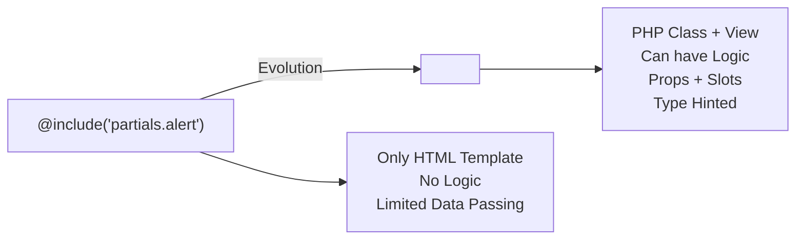
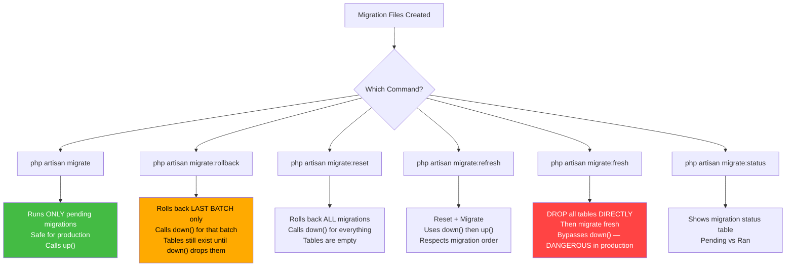
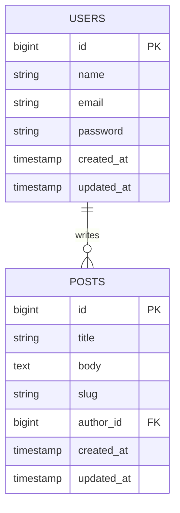
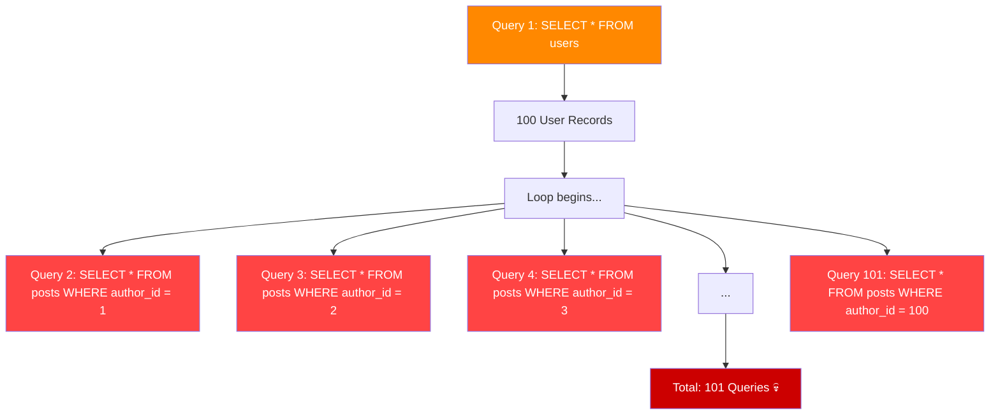
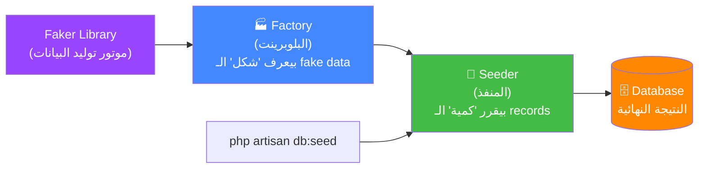
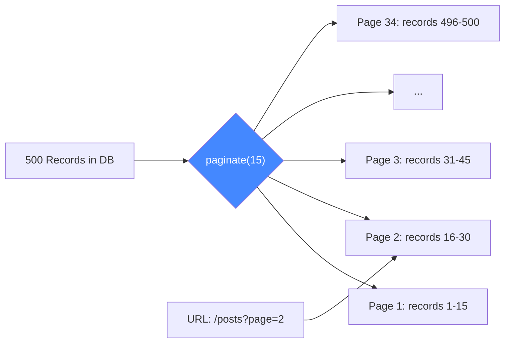
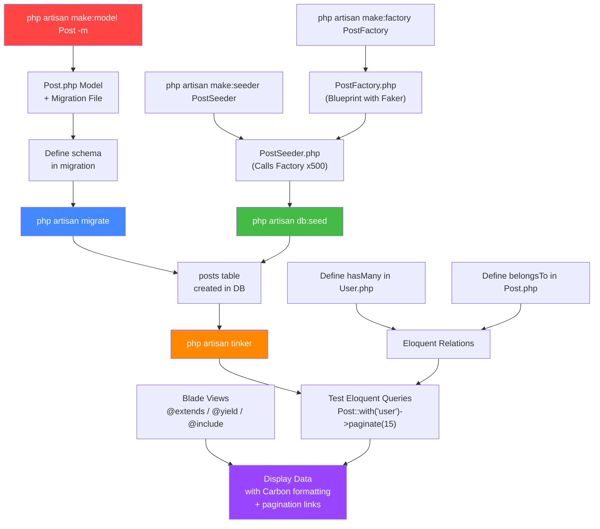

# 🔴 Laravel Day 2 — الدليل المرجعي النهائي
### DB Facade · Eloquent ORM · Migrations · Factories · Seeders · Tinker · Blade · Carbon · Pagination

> **المؤلف:** Senior Backend Architect @ ITI Open Source Track  
> **المستوى:** Beginner → Advanced  
> **الهدف:** نفهم مش بس إزاي، لكن **ليه** — الفلسفة قبل الكود

---

## 📋 فهرس المحتويات

- [[#Chapter 1 — Blade Templating Philosophy]]
- [[#Chapter 2 — Database Migrations]]
- [[#Chapter 3 — DB Facade vs Eloquent ORM]]
- [[#Chapter 4 — Eloquent Relationships (1-to-Many)]]
- [[#Chapter 5 — The N+1 Problem & Eager Loading]]
- [[#Chapter 6 — Factories & Seeders]]
- [[#Chapter 7 — Artisan Tinker]]
- [[#Chapter 8 — Carbon & Pagination]]
- [[#Chapter 9 — زتونة الإنترفيو 🫒]]

---

# Chapter 1 — Blade Templating Philosophy

## 🧠 الفلسفة الكبيرة — ليه في حاجة اسمها Blade أصلًا؟

تخيل إنك بتبني 10 صفحات HTML في موقع. كل صفحة فيها نفس الـ `<nav>` ونفس الـ `<footer>` ونفس الـ CSS includes. لو حصل تغيير في الـ navbar — إضافة link جديد مثلاً — هتفتح 10 ملفات وتعدل 10 مرات. ده اسمه **DRY Violation** (Don't Repeat Yourself).

الـ PHP العادية حلت ده بـ `include('navbar.php')`، لكن ده مش كفاية. إيه لو الـ navbar نفسه محتاج يعرف إيه الـ "active page"؟ إيه لو محتاج تـinject scripts في الـ `<head>` من داخل الـ content؟ محتاج شيء أقوى.

**Blade** هو الـ **Templating Engine** بتاع Laravel. مش مجرد `include` بس — ده نظام كامل بيتيح لك:
1. **Template Inheritance** — parent layout + child pages
2. **Slots & Sections** — حجز أماكن في الـ parent يملّيها الـ child
3. **Components** — UI pieces قابلة للإعادة الاستخدام زي React/Vue
4. **Directives** — PHP logic (`if`, `foreach`, `auth`) بـ syntax نظيفة
5. **XSS Protection** — escape تلقائي للـ output

Blade بيتحوّل لـ PHP عادي وبيتخزّن كـ compiled view في `storage/framework/views/`. الـ compilation بتحصل مرة واحدة فقط ومش بتحصل تاني غير لو الملف اتغير — يعني **zero performance overhead**.

> [!info] The Big Picture — The Template Inheritance Workflow
> ```
> resources/views/
> ├── layouts/
> │   └── app.blade.php       <-- الـ "هيكل العظمي" (Parent Layout)
> │       ├── @yield('title')     <-- فراغ للـ title
> │       ├── @yield('styles')    <-- فراغ للـ CSS extra
> │       ├── @yield('content')   <-- فراغ للـ main content
> │       └── @yield('scripts')   <-- فراغ للـ JS extra
> │
> ├── posts/
> │   ├── index.blade.php     <-- Child: @extends('layouts.app')
> │   ├── show.blade.php      <-- Child: @extends('layouts.app')
> │   └── create.blade.php    <-- Child: @extends('layouts.app')
> │
> └── partials/
>     ├── navbar.blade.php    <-- @include target
>     └── alert.blade.php     <-- @include target
> ```

---

## 1.1 — `@extends` & `@yield` & `@section` — نظام الـ Inheritance

### الـ Parent Layout — الهيكل الكامل

```php
{{-- resources/views/layouts/app.blade.php --}}

<!DOCTYPE html>
<html lang="ar" dir="rtl">
<head>
    <meta charset="UTF-8">
    <meta name="viewport" content="width=device-width, initial-scale=1.0">

    {{-- @yield with a default value --}}
    <title>@yield('title', 'My Laravel App')</title>

    {{-- Shared CSS always loaded --}}
    <link rel="stylesheet" href="https://cdn.tailwindcss.com">

    {{-- Section for page-specific CSS — empty by default --}}
    @yield('styles')
</head>
<body class="bg-gray-50">

    {{-- Reusable Navbar partial --}}
    @include('partials.navbar')

    {{-- Flash Messages partial --}}
    @include('partials.flash-messages')

    {{-- Main content area — child pages fill this --}}
    <main class="container mx-auto py-8 px-4">
        @yield('content')
    </main>

    {{-- Footer partial --}}
    @include('partials.footer')

    {{-- Shared JS always loaded --}}
    <script src="/js/app.js"></script>

    {{-- Section for page-specific JS — empty by default --}}
    @yield('scripts')
</body>
</html>
```

### `@extends('layouts.app')`

| الخاصية | التفاصيل |
|---|---|
| **الغرض** | بتقول للـ child view "إنت وارث الـ layout ده وهتملّي فراغاته" |
| **الـ Input** | اسم الـ view file بـ dot notation (بدون `.blade.php`) |
| **الـ Output** | مش بترجع حاجة — بس بتربط الـ child بالـ parent |
| **الموقع** | لازم تكون **السطر الأول** في الـ child view بدون أي whitespace قبلها |
| **الـ Paths** | `'layouts.app'` = `resources/views/layouts/app.blade.php` |

### `@yield('sectionName', 'default')`

| الخاصية | التفاصيل |
|---|---|
| **الغرض** | بيحجز "فراغ" في الـ parent layout عشان الـ child يملّيه |
| **Parameter 1** | اسم الـ section (string) — لازم يتطابق مع اسم الـ `@section` في الـ child |
| **Parameter 2** | (Optional) Default value لو الـ child ما ملاش الـ section دي |
| **الـ Output** | بيطبع الـ content اللي الـ child حطه في الـ section ده |

### `@section` / `@endsection`

```php
{{-- resources/views/posts/index.blade.php --}}

@extends('layouts.app')   {{-- Inherit from parent layout --}}

{{-- Fill the 'title' slot --}}
@section('title', 'All Posts')  {{-- Short form: inline value, no @endsection needed --}}

{{-- Fill the 'styles' slot with page-specific CSS --}}
@section('styles')
    <link rel="stylesheet" href="/css/posts.css">
    <style>
        .post-card { border-radius: 8px; }
    </style>
@endsection

{{-- Fill the 'content' slot — the main page content --}}
@section('content')
    <div class="posts-grid">
        @foreach($posts as $post)
            <div class="post-card">
                <h2>{{ $post->title }}</h2>
                <p>{{ $post->created_at->diffForHumans() }}</p>
            </div>
        @endforeach
    </div>

    {{ $posts->links() }}
@endsection

{{-- Fill the 'scripts' slot with page-specific JS --}}
@section('scripts')
    <script>
        // Only runs on the posts index page
        console.log('Posts page loaded');
    </script>
@endsection
```

> [!warning] ⚠️ فرق مهم — Short Form vs Long Form لـ @section
> - **Short form**: `@section('title', 'All Posts')` — بس لو القيمة نص بسيط في سطر واحد
> - **Long form**: `@section('content') ... @endsection` — لو محتاج تكتب HTML متعدد الأسطر
>
> الـ short form مش بيحتاج `@endsection`.

### `@parent` — الـ Inheritance الحقيقي

في بعض الأحيان مش عايز تـ**replace** محتوى الـ parent، عايز تـ**extend** عليه:

```php
{{-- Parent layout has this section --}}
@section('scripts')
    <script src="/js/base.js"></script>
@endsection

{{-- Child view EXTENDS the parent's section (doesn't replace it) --}}
@section('scripts')
    @parent  {{-- Include parent's content first --}}
    <script src="/js/posts-specific.js"></script>
@endsection

{{-- Final output will have BOTH scripts --}}
```

---

## 1.2 — `@include` — الـ Partials

`@include` مختلفة تماماً عن `@extends`. ده مش inheritance — ده composition. بتجيب ملف صغير مستقل وتحطه في أي مكان في أي view.

| الخاصية | التفاصيل |
|---|---|
| **الغرض** | تضمين محتوى ملف blade آخر كأنه جزء من الـ current view |
| **الفرق عن @extends** | `@extends` = parent/child hierarchy. `@include` = plug-in a reusable piece anywhere |
| **الـ Scope** | الـ included file بيرث **كل المتغيرات** من الـ parent view تلقائياً |
| **الـ Input** | اسم الـ view + (optional) array of extra variables |
| **الـ Output** | بيطبع الـ rendered HTML من الملف المضمّن inline |

```php
{{-- Basic include — inherits all variables from current view --}}
@include('partials.navbar')

{{-- Include with extra variables passed --}}
@include('partials.alert', [
    'message' => 'Post created successfully!',
    'type'    => 'success'   // 'success', 'danger', 'warning', 'info'
])

{{-- includeIf — only includes if the file EXISTS (no error if missing) --}}
@includeIf('partials.sidebar')

{{-- includeWhen — conditional include based on a boolean --}}
@includeWhen($user->isAdmin(), 'partials.admin-panel')

{{-- includeUnless — include UNLESS condition is true --}}
@includeUnless($user->isBanned(), 'partials.post-form')

{{-- includeFirst — tries files in order, includes the first that exists --}}
@includeFirst(['custom.navbar', 'partials.navbar'])
```

```php
{{-- resources/views/partials/alert.blade.php --}}

@if(session('success') || isset($message))
    @php
        $alertMessage = session('success') ?? $message;
        $alertType    = session('alert-type') ?? ($type ?? 'info');
    @endphp

    <div class="alert alert-{{ $alertType }} alert-dismissible fade show" role="alert">
        <strong>{{ ucfirst($alertType) }}!</strong>
        {{ $alertMessage }}
        <button type="button" class="btn-close" data-bs-dismiss="alert"></button>
    </div>
@endif
```

```php
{{-- resources/views/partials/flash-messages.blade.php --}}

@foreach(['success', 'danger', 'warning', 'info'] as $type)
    @if(session($type))
        <div class="alert alert-{{ $type }}">
            {{ session($type) }}
        </div>
    @endif
@endforeach
```

---

## 1.3 — Blade Directives — PHP Logic بـ Syntax أنيقة

Blade بتحول الـ directives دي لـ PHP عادي وقت الـ compilation. مش في أي overhead.

### الـ Conditionals

```php
{{-- @if / @elseif / @else / @endif --}}
@if($post->status === 'published')
    <span class="badge bg-success">Published</span>
@elseif($post->status === 'draft')
    <span class="badge bg-warning">Draft</span>
@else
    <span class="badge bg-secondary">Unknown</span>
@endif

{{-- @unless — opposite of @if (runs when condition is FALSE) --}}
@unless($user->isAdmin())
    <p>You don't have admin access.</p>
@endunless

{{-- @isset — checks if variable is defined and not null --}}
@isset($post->description)
    <p>{{ $post->description }}</p>
@endisset

{{-- @empty — checks if variable is empty (null, '', [], 0) --}}
@empty($posts)
    <p>No posts found.</p>
@endempty

{{-- @auth / @guest — check authentication state --}}
@auth
    <a href="/dashboard">My Dashboard</a>
@endauth

@guest
    <a href="/login">Login</a>
@endguest

{{-- @auth with guard --}}
@auth('admin')
    <a href="/admin">Admin Panel</a>
@endauth

{{-- @can / @cannot — check user abilities (Gates/Policies) --}}
@can('edit', $post)
    <a href="/posts/{{ $post->id }}/edit">Edit Post</a>
@endcan

@cannot('delete', $post)
    <span class="text-muted">You cannot delete this post</span>
@endcannot
```

### الـ Loops

```php
{{-- @foreach / @endforeach --}}
@foreach($posts as $post)
    <div class="post">
        <h2>{{ $post->title }}</h2>
        <p>By: {{ $post->user->name }}</p>
    </div>
@endforeach

{{-- @forelse — foreach with an empty fallback --}}
@forelse($posts as $post)
    <div class="post">{{ $post->title }}</div>
@empty
    <div class="alert alert-info">No posts found. Be the first to write one!</div>
@endforelse

{{-- @for --}}
@for($i = 0; $i < 5; $i++)
    <p>Item {{ $i }}</p>
@endfor

{{-- @while --}}
@while($condition)
    <p>Looping...</p>
@endwhile

{{-- Loop control --}}
@foreach($posts as $post)
    @if($post->status === 'hidden')
        @continue   {{-- Skip this iteration --}}
    @endif

    <div>{{ $post->title }}</div>

    @if($loop->iteration >= 10)
        @break      {{-- Exit the loop entirely --}}
    @endif
@endforeach
```

### الـ `$loop` Variable — الـ Magic Object

داخل أي `@foreach`، Blade بيوفرلك متغير خاص اسمه `$loop` مليان بمعلومات مفيدة:

```php
@foreach($posts as $post)
    <tr class="{{ $loop->even ? 'bg-gray-50' : '' }}">
        <td>{{ $loop->iteration }}</td>   {{-- Current iteration (1-based) --}}
        <td>{{ $loop->index }}</td>        {{-- Current index (0-based) --}}
        <td>{{ $post->title }}</td>

        @if($loop->first)
            <td><span class="badge">Newest</span></td>
        @elseif($loop->last)
            <td><span class="badge">Oldest</span></td>
        @else
            <td></td>
        @endif
    </tr>
@endforeach
```

| الخاصية | النوع | المعنى |
|---|---|---|
| `$loop->index` | int | Index الـ current item (0-based) |
| `$loop->iteration` | int | رقم التكرار الحالي (1-based) |
| `$loop->remaining` | int | كام item فاضل |
| `$loop->count` | int | إجمالي عدد الـ items |
| `$loop->first` | bool | هل ده أول عنصر؟ |
| `$loop->last` | bool | هل ده آخر عنصر؟ |
| `$loop->even` | bool | هل الـ iteration رقم زوجي؟ |
| `$loop->odd` | bool | هل الـ iteration رقم فردي؟ |
| `$loop->depth` | int | مستوى الـ nesting (للـ nested loops) |
| `$loop->parent` | object | الـ `$loop` بتاع الـ parent loop |

---

## 1.4 — `{{ }}` vs `{!! !!}` — XSS Protection

> [!warning] ⚠️ أمان — الفرق بين `{{ }}` و `{!! !!}`

```php
{{-- {{ }} — SAFE: Escapes HTML special characters (prevents XSS) --}}
{{-- Always use this by default --}}
{{ $post->title }}
{{-- If $post->title = '<script>alert("XSS")</script>'  --}}
{{-- Output: &lt;script&gt;alert(&quot;XSS&quot;)&lt;/script&gt; --}}
{{-- Browser renders it as TEXT, not code --}}

{{-- {!! !!} — UNSAFE: Renders raw HTML as-is --}}
{{-- ONLY use when you TRUST the content (like your own stored HTML) --}}
{!! $post->html_content !!}
{{-- If content is from USER INPUT — NEVER use this without sanitization! --}}

{{-- PHP echo inside Blade (same as {{ }}) --}}
<?php echo e($post->title); ?>  {{-- e() is Laravel's escape helper --}}
```

**متى تستخدم `{!! !!}`؟** — بس لما الـ HTML content جاي من مكان موثوق زي:
- Markdown محوّل لـ HTML بـ library موثوقة
- Content محفوظ من Admin اتعمله sanitize
- Helper functions زي `nl2br()` اللي بترجع HTML

---

## 1.5 — `@stack` و `@push` — الحل الأنيق للـ Scripts

واحدة من أقوى features في Blade ومش ناس كتير عارفاها. بتحل مشكلة "عايز أضيف script في الـ `<head>` من داخل الـ child view".

```php
{{-- In parent layout: app.blade.php --}}
<head>
    <title>@yield('title')</title>
    {{-- Stack placeholder — child views can PUSH into this --}}
    @stack('styles')
</head>
<body>
    @yield('content')

    {{-- Stack for scripts at the bottom --}}
    @stack('scripts')
</body>
```

```php
{{-- In child view: posts/show.blade.php --}}
@extends('layouts.app')

{{-- Push to the 'styles' stack in the parent head --}}
@push('styles')
    <link rel="stylesheet" href="/css/syntax-highlight.css">
@endpush

@section('content')
    <article>{{ $post->title }}</article>
@endsection

{{-- Push to the 'scripts' stack --}}
@push('scripts')
    <script src="/js/prism.js"></script>
    <script>
        Prism.highlightAll();
    </script>
@endpush
```

> [!tip] `@push` vs `@yield` للـ Scripts
> - `@yield('scripts')` → بيـ**replace** — كل child بيدي script واحد
> - `@stack('scripts')` → بيـ**accumulate** — ممكن يتعمل `@push` منه من أكتر من component في نفس الصفحة. مثالي لما عندك components متعددة كل واحد محتاج script.

### `@prepend` — إضافة في الأول بدل الآخر

```php
{{-- Adds to the BEGINNING of the stack instead of the end --}}
@prepend('scripts')
    <script>console.log('I run first!')</script>
@endprepend
```

---

## 1.6 — Blade Components — الجيل الجديد (Laravel 7+)

الـ Blade Components دي الـ **evolution** من `@include`. الفرق الجوهري إن الـ Component ليه **PHP Class** بيحمل logic، مش بس HTML template.



### إنشاء Component

```bash
# Class-based component (has PHP class + view)
php artisan make:component Alert
# Creates:
#   app/View/Components/Alert.php
#   resources/views/components/alert.blade.php

# Anonymous component (view only — no PHP class, simpler)
php artisan make:component forms.input --view
# Creates: resources/views/components/forms/input.blade.php
```

### الـ Component Class

```php
// app/View/Components/Alert.php

namespace App\View\Components;

use Illuminate\View\Component;
use Illuminate\View\View;

class Alert extends Component
{
    /**
     * Component constructor — props are defined here as constructor parameters.
     * Laravel automatically maps component attributes to these parameters.
     *
     * @param string $type    Alert type: 'success', 'danger', 'warning', 'info'
     * @param string $message The alert message text
     */
    public function __construct(
        public string $type = 'info',
        public string $message = '',
    ) {}

    /**
     * Get the view that represents the component.
     * Returns: View — the blade template for this component
     */
    public function render(): View
    {
        return view('components.alert');
    }

    /**
     * Computed property — available in the component view as $colorClass
     * Returns: string — Tailwind CSS classes based on type
     */
    public function colorClass(): string
    {
        return match($this->type) {
            'success' => 'bg-green-100 border-green-400 text-green-800',
            'danger'  => 'bg-red-100 border-red-400 text-red-800',
            'warning' => 'bg-yellow-100 border-yellow-400 text-yellow-800',
            default   => 'bg-blue-100 border-blue-400 text-blue-800',
        };
    }
}
```

### الـ Component View

```php
{{-- resources/views/components/alert.blade.php --}}
{{-- $type, $message, $colorClass() are all available here --}}

<div class="border px-4 py-3 rounded {{ $colorClass() }}" role="alert">
    <strong class="font-bold">{{ ucfirst($type) }}!</strong>
    <span class="block sm:inline">{{ $message }}</span>

    {{-- $slot — the DEFAULT slot (content between the component tags) --}}
    @if($slot->isNotEmpty())
        <div class="mt-2">{{ $slot }}</div>
    @endif
</div>
```

### استخدام الـ Component

```php
{{-- In any blade view --}}

{{-- Self-closing (no slot content) --}}
<x-alert type="success" message="Post created successfully!" />

{{-- With dynamic PHP variable — prefix with : --}}
<x-alert type="danger" :message="$errorMessage" />

{{-- With slot content (content between tags goes to $slot) --}}
<x-alert type="warning">
    <strong>Attention!</strong> Your session will expire in 5 minutes.
    <a href="/refresh">Click here to refresh.</a>
</x-alert>
```

### Named Slots — أكتر من "فراغ" في Component

```php
{{-- resources/views/components/card.blade.php --}}
<div class="card shadow">
    <div class="card-header">
        {{ $header }}   {{-- Named slot --}}
    </div>
    <div class="card-body">
        {{ $slot }}     {{-- Default slot --}}
    </div>
    <div class="card-footer">
        {{ $footer ?? '' }}  {{-- Optional named slot --}}
    </div>
</div>
```

```php
{{-- Using named slots --}}
<x-card>
    {{-- Fill the named 'header' slot --}}
    <x-slot:header>
        <h5 class="card-title">Post #{{ $post->id }}</h5>
    </x-slot:header>

    {{-- Default slot — goes to {{ $slot }} --}}
    <p>{{ $post->body }}</p>

    {{-- Fill the named 'footer' slot --}}
    <x-slot:footer>
        <small>Created {{ $post->created_at->diffForHumans() }}</small>
    </x-slot:footer>
</x-card>
```

---

## 1.7 — Blade Directives المتقدمة

```php
{{-- @php — write raw PHP inside blade --}}
@php
    $total = $price * $quantity;
    $discount = $total > 100 ? 0.1 : 0;
    $finalPrice = $total * (1 - $discount);
@endphp
<p>Total: ${{ number_format($finalPrice, 2) }}</p>

{{-- @verbatim — don't process Blade syntax (useful for Vue/React templates) --}}
@verbatim
    <div id="vue-app">
        <p>{{ message }}</p>  {{-- This is Vue.js syntax, not Blade --}}
        <input v-model="name" />
    </div>
@endverbatim

{{-- @once — renders only once even if component is used multiple times --}}
@once
    <script src="/js/chart.js"></script>
@endonce

{{-- @error — display validation error for a field --}}
<input type="text" name="title" class="@error('title') border-red-500 @enderror">
@error('title')
    <span class="text-red-600 text-sm">{{ $message }}</span>
@enderror

{{-- @class — conditional CSS classes --}}
<div @class([
    'font-bold',                              // Always applied
    'text-green-600' => $post->isPublished(), // Only if condition is true
    'text-gray-400'  => !$post->isPublished(),
])>
    {{ $post->title }}
</div>

{{-- @checked, @selected, @disabled, @readonly (Laravel 9+) --}}
<input type="checkbox" name="active" @checked($post->isActive())>
<select name="status">
    <option value="published" @selected($post->status === 'published')>Published</option>
    <option value="draft"     @selected($post->status === 'draft')>Draft</option>
</select>
<button @disabled($post->votes < 10)>Feature Post</button>
```

---

## 1.8 — الـ Blade Output — `{{ }}` و `{-- --}` والـ Comments

```php
{{-- This is a Blade comment — NOT included in the final HTML output --}}
<!-- This is an HTML comment — IS included in the HTML, visible in browser dev tools -->

{{-- Blade variables --}}
{{ $post->title }}           {{-- Escaped output (safe) --}}
{!! $post->html_body !!}     {{-- Raw HTML output (unsafe unless trusted) --}}

{{-- Blade ternary --}}
{{ $post->status ?? 'Unknown' }}           {{-- Null coalescing --}}
{{ $post->isPublished() ? 'Yes' : 'No' }} {{-- Ternary operator --}}

{{-- JSON encoding for JS --}}
<script>
    const post = @json($post);           {{-- Encodes model to JSON safely --}}
    const config = @json(['key' => 'value'], JSON_PRETTY_PRINT);
</script>
```

> [!tip] متى تستخدم إيه؟
> | الأداة | الاستخدام |
> |---|---|
> | `@extends` + `@yield` | Page layouts (هيكل الصفحة الكاملة) |
> | `@include` | Simple partials: navbar, footer, alert — pieces بدون logic |
> | `@push` / `@stack` | Scripts/Styles per-page بدون `@yield` تعارض |
> | `Blade Components` | Reusable UI pieces مع logic: Button, Card, Modal, Form Input |
> | `@php` | Computation بسيطة لازم تعملها في الـ view (يُفضل تتجنبها وتحطها في الـ Controller) |

---

# Chapter 2 — Database Migrations

## 🧠 الفلسفة — ليه أصلًا في حاجة اسمها Migration؟

تخيل إن عندك team بتشتغل على نفس المشروع. كل واحد شغال على اللاب توب بتاعه. لو حد عمل تغيير في الداتابيز بالـ GUI (زي phpMyAdmin أو TablePlus)، التاني مش هيعرف عنه. الداتابيز "out of sync".

**Migration هي Version Control لقاعدة بياناتك.** زي git للكود، الـ Migration هي git للـ schema.

> [!info] The Core Logic — Migration as Version Control
> ```
> Git Commit   ←→   Migration File
> git push     ←→   php artisan migrate
> git pull     ←→   php artisan migrate (on another machine)
> git revert   ←→   php artisan migrate:rollback
> ```

لما بتعمل `php artisan migrate`، Laravel بيشوف إيه الـ migrations اللي لسه ما اتشغلتش (عن طريق جدول `migrations` في الداتابيز) وبيشغلهم بالترتيب.

---

## 2.1 — إزاي تعمل Migration

```bash
# Create a standalone migration
php artisan make:migration create_posts_table

# Create a Model WITH its migration in one command (-m flag)
php artisan make:model Post -m

# Create migration for ADDING columns to an existing table
php artisan make:migration add_status_to_posts_table

# Model + Migration + Controller + Factory + Seeder (everything at once)
php artisan make:model Post -a
```

> [!tip] Convention المهم جداً — Laravel بيقرأ الأسماء
> | اسم الـ Migration | الـ Schema الـ Laravel هيولده |
> |---|---|
> | `create_posts_table` | `Schema::create('posts', ...)` |
> | `add_status_to_posts_table` | `Schema::table('posts', ...)` |
> | `drop_comments_table` | `Schema::dropIfExists('comments')` |
>
> الاسم بيخبر Laravel بالضبط إيه اللي هيعمله.

```php
// database/migrations/2024_01_01_000000_create_posts_table.php

use Illuminate\Database\Migrations\Migration;
use Illuminate\Database\Schema\Blueprint;
use Illuminate\Support\Facades\Schema;

return new class extends Migration
{
    /**
     * Run the migrations — called by `php artisan migrate`
     * This is the FORWARD direction — CREATE the table
     */
    public function up(): void
    {
        Schema::create('posts', function (Blueprint $table) {

            // --- Primary Key ---
            $table->id();                                    // BIGINT UNSIGNED AUTO_INCREMENT PK

            // --- String Columns ---
            $table->string('title');                         // VARCHAR(255) NOT NULL
            $table->string('title_short', 100);              // VARCHAR(100) NOT NULL custom length
            $table->char('lang_code', 2);                    // CHAR(2) fixed length

            // --- Text Columns ---
            $table->text('body');                            // TEXT (up to 65,535 chars)
            $table->mediumText('description');               // MEDIUMTEXT (up to 16MB)
            $table->longText('content');                     // LONGTEXT (up to 4GB)

            // --- Numeric Columns ---
            $table->integer('views')->default(0);            // INT default 0
            $table->unsignedInteger('vote_count');           // INT UNSIGNED (no negatives, for FKs)
            $table->bigInteger('big_number');                // BIGINT
            $table->tinyInteger('rating');                   // TINYINT (-128 to 127)
            $table->decimal('price', 10, 2);                 // DECIMAL(10,2) — use for MONEY not float!
            $table->boolean('is_published')->default(false); // TINYINT(1) — 0 or 1

            // --- Date/Time Columns ---
            $table->date('published_on')->nullable();        // DATE
            $table->timestamp('confirmed_at')->nullable();   // TIMESTAMP
            $table->timestamps();                            // created_at + updated_at (both nullable)
            $table->softDeletes();                           // deleted_at TIMESTAMP NULLABLE

            // --- Other Types ---
            $table->json('settings')->nullable();            // JSON column
            $table->enum('status', ['draft', 'published', 'archived'])->default('draft');

            // --- slug with UNIQUE constraint ---
            $table->string('slug')->unique();

            // --- Foreign Key (Modern Syntax — Laravel 7+) ---
            $table->foreignId('author_id')                  // BIGINT UNSIGNED
                  ->constrained('users')                    // FK -> users.id
                  ->onUpdate('cascade')
                  ->onDelete('cascade');

            // --- Indexes ---
            $table->index('status');                        // Regular index for query performance
            $table->index(['author_id', 'status']);         // Composite index
        });
    }

    /**
     * Reverse the migrations — called by rollback commands
     * Must be the EXACT INVERSE of up()
     */
    public function down(): void
    {
        Schema::dropIfExists('posts');
    }
};
```

---

## 2.2 — Column Modifiers — تخصيص الـ Columns

```php
Schema::create('posts', function (Blueprint $table) {
    $table->id();

    // nullable() — allows NULL values (field is optional)
    $table->string('subtitle')->nullable();

    // default() — sets a default value
    $table->string('status')->default('draft');
    $table->integer('views')->default(0);
    $table->boolean('is_featured')->default(false);

    // nullable + default together
    $table->string('thumbnail')->nullable()->default(null);

    // after() — place column AFTER another (MySQL only)
    $table->string('excerpt')->nullable()->after('body');

    // comment() — adds a DB-level column comment
    $table->string('slug')->unique()->comment('URL-friendly version of title');

    // useCurrent() — default to CURRENT_TIMESTAMP
    $table->timestamp('last_login')->nullable()->useCurrent();
});
```

---

## 2.3 — Modifying Existing Tables

```php
// database/migrations/2024_02_01_000000_add_status_to_posts_table.php

return new class extends Migration
{
    public function up(): void
    {
        Schema::table('posts', function (Blueprint $table) {
            $table->string('status')->default('draft')->after('body');
            $table->string('thumbnail')->nullable()->after('title');
            $table->unsignedInteger('views_count')->default(0);

            // Add a new index on the new column
            $table->index('status');

            // Add a nullable foreign key
            $table->foreignId('category_id')
                  ->nullable()
                  ->after('author_id')
                  ->constrained()
                  ->nullOnDelete();
        });
    }

    public function down(): void
    {
        Schema::table('posts', function (Blueprint $table) {
            // Drop FK constraint BEFORE dropping the column — ORDER MATTERS
            $table->dropForeign(['category_id']);
            $table->dropIndex(['status']);
            $table->dropColumn(['status', 'thumbnail', 'views_count', 'category_id']);
        });
    }
};
```

> [!warning] ⚠️ قاعدة ذهبية — لا تعدل migration موجودة أبداً بعد git push
> لو migration اتـrun على الداتابيز بتاع حد في الـ team، **لازم تعمل migration جديدة** للتعديل. لو عدّلت القديمة، هيحصل conflicts لأن الـ migrations tracking table عنده record بإنها اتنفذت.
>
> **الاستثناء الوحيد:** أول لحظات الـ development على الـ local machine فقط — تقدر تعمل `migrate:fresh` وتعدل. لكن بعد أي `git push` — **migration جديدة دايماً**.

---

## 2.4 — الـ `migrations` Table — إزاي Laravel بيتتبع الـ State

```sql
-- The migrations tracking table structure (auto-created by Laravel)
-- id | migration                                     | batch
-- 1  | 2014_10_12_000000_create_users_table          | 1
-- 2  | 2024_01_01_000000_create_posts_table          | 1
-- 3  | 2024_02_01_000000_add_status_to_posts_table   | 2  <-- ran later
```

`batch` هو رقم "الدفعة". لما بتعمل `migrate:rollback`، بيـrollback الـ batch الأعلى رقماً فقط (مش كل حاجة).

```bash
php artisan migrate:status
# Migration name                                    | Batch / Status
# 2014_10_12_000000_create_users_table              | [1] Ran
# 2024_01_01_000000_create_posts_table              | [1] Ran
# 2024_02_01_000000_add_status_to_posts_table       | Pending
```

---

## 2.2 — Migration Commands — التشريح الكامل



### الفرق الحرج بين `fresh` و `refresh`

> [!warning] ⚠️ fresh vs refresh — فرق مش هتنساه
> | الأمر | الآلية | الخطورة |
> |---|---|---|
> | `migrate:fresh` | بيعمل `DROP TABLE` مباشرة لكل الجداول، مش بيكلم الـ migrations | **خطير جداً في Production** — هيمسح الداتا كلها |
> | `migrate:refresh` | بيشغل `down()` على كل migration بالعكس، تم `up()` | أأمن نسبياً لأنه بيعتمد على الـ migration logic |
>
> **القاعدة:** في الـ development، `fresh` أسرع وأسهل. في الـ production، لا الاثنين — استخدم `migrate` فقط.

### جدول المقارنة الكاملة

| الأمر | بيشغل `up()`؟ | بيشغل `down()`؟ | بيـ DROP مباشرة؟ | الداتا اتمسحت؟ |
|---|---|---|---|---|
| `migrate` | ✅ (pending فقط) | ❌ | ❌ | ❌ |
| `migrate:rollback` | ❌ | ✅ (last batch) | ❌ | ✅ (last batch) |
| `migrate:reset` | ❌ | ✅ (all) | ❌ | ✅ (all) |
| `migrate:refresh` | ✅ (all) | ✅ (all) | ❌ | ✅ (all) |
| `migrate:fresh` | ✅ (all) | ❌ | ✅ | ✅ (all) |

---

# Chapter 3 — DB Facade vs Eloquent ORM

## 🧠 الفلسفة — ليه في ORM أصلًا؟

في الأول كانت في طريقة واحدة تكلم الداتابيز: **Raw SQL**.

```sql
SELECT * FROM posts WHERE author_id = 5 AND votes > 10 ORDER BY created_at DESC LIMIT 20;
```

ده SQL صح، بس له مشاكل:
1. **SQL Injection** — لو حد inject code في الـ input
2. **Vendor Lock-in** — syntax MySQL مختلف عن PostgreSQL مختلف عن SQLite
3. **No Objects** — ببترجع arrays ومش بيتعامل مع الـ data كـ PHP objects
4. **No Relations** — لازم تكتب الـ JOINs يدوياً كل مرة
5. **No Events** — مفيش hooks زي "before save" أو "after delete"

Laravel حل ده بطريقتين:

| | DB Facade (Query Builder) | Eloquent ORM |
|---|---|---|
| **الـ Abstraction Level** | Medium — بيبني SQL بـ PHP syntax | High — بتتعامل مع Objects |
| **الـ Output** | `stdClass` objects | Eloquent Model instances |
| **الـ Relations** | يدوي — بتكتب الـ JOINs | أوتوماتيك بـ method calls |
| **Events & Hooks** | ❌ | ✅ (creating, updating, deleting...) |
| **الـ Performance** | أسرع قليلاً (أقل overhead) | أبطأ قليلاً لكن ممتاز للـ features |
| **متى تستخدمه؟** | Complex queries، Reports، Bulk ops | Standard CRUD، Relations، Events |

---

## 3.1 — DB Facade — القاموس الكامل

الـ DB Facade هو الـ **Query Builder**. بتبني query بـ method chaining وهو بيحولها لـ SQL آمن (parameterized queries تلقائياً — no SQL injection).

```php
use Illuminate\Support\Facades\DB;
```

### عمليات القراءة — SELECT

```php
// --- find($id) ---
// Fetch a single row by primary key
// Returns: stdClass | null
$post = DB::table('posts')->find(20);

// --- get() ---
// Fetch ALL rows matching the query
// Returns: Illuminate\Support\Collection of stdClass objects
$posts = DB::table('posts')->get();

// --- first() ---
// Fetch the FIRST row only (adds LIMIT 1 to SQL)
// Returns: stdClass | null
$firstPost = DB::table('posts')->first();

// --- where() chains ---
// Returns: Builder (chainable until you call get/first/etc)
$posts = DB::table('posts')
            ->where('status', 'published')          // WHERE status = 'published'
            ->where('votes', '>', 100)               // AND votes > 100
            ->where('author_id', '!=', 5)            // AND author_id != 5
            ->orWhere('is_featured', true)           // OR is_featured = 1
            ->orderBy('created_at', 'desc')          // ORDER BY created_at DESC
            ->limit(10)                              // LIMIT 10
            ->offset(20)                             // OFFSET 20 (skip first 20)
            ->get();

// --- whereBetween ---
$posts = DB::table('posts')
            ->whereBetween('votes', [10, 100])       // WHERE votes BETWEEN 10 AND 100
            ->get();

// --- whereIn / whereNotIn ---
$posts = DB::table('posts')
            ->whereIn('status', ['published', 'featured']) // WHERE status IN (...)
            ->get();

$posts = DB::table('posts')
            ->whereNotIn('author_id', [1, 2, 5])           // WHERE author_id NOT IN (...)
            ->get();

// --- whereNull / whereNotNull ---
$posts = DB::table('posts')
            ->whereNull('deleted_at')                      // WHERE deleted_at IS NULL
            ->get();

// --- whereDate, whereMonth, whereYear, whereDay ---
$posts = DB::table('posts')
            ->whereDate('created_at', '2024-01-15')        // WHERE DATE(created_at) = '2024-01-15'
            ->get();

$posts = DB::table('posts')
            ->whereYear('created_at', 2024)                // WHERE YEAR(created_at) = 2024
            ->whereMonth('created_at', 1)                  // AND MONTH(created_at) = 1
            ->get();

// --- whereColumn — compare two columns ---
$posts = DB::table('posts')
            ->whereColumn('updated_at', '>', 'created_at') // WHERE updated_at > created_at
            ->get();

// --- select specific columns (instead of SELECT *) ---
$posts = DB::table('posts')
            ->select('id', 'title', 'author_id', 'created_at')
            ->where('status', 'published')
            ->get();

// --- select with alias ---
$posts = DB::table('posts')
            ->select('title as post_title', 'created_at as date')
            ->get();

// --- addSelect — add to existing select ---
$query = DB::table('posts')->select('title');
$posts = $query->addSelect('body')->get();
```

### Aggregates — الإحصائيات

```php
// count() — Returns: int
$total = DB::table('posts')->count();
$published = DB::table('posts')->where('status', 'published')->count();

// max() / min() — Returns: mixed (the value itself)
$maxVotes   = DB::table('posts')->max('votes');
$minVotes   = DB::table('posts')->min('votes');

// avg() — Returns: float
$avgVotes   = DB::table('posts')->avg('votes');

// sum() — Returns: int|float
$totalViews = DB::table('posts')->sum('views');

// exists() / doesntExist() — Returns: bool
$hasPost = DB::table('posts')->where('slug', 'my-post')->exists();
$noPost  = DB::table('posts')->where('slug', 'fake-post')->doesntExist();
```

### عمليات الكتابة — INSERT / UPDATE / DELETE

```php
// --- insert() — single row ---
// Returns: bool
DB::table('posts')->insert([
    'title'      => 'My First Post',
    'body'       => 'Lorem ipsum...',
    'slug'       => 'my-first-post',
    'author_id'  => 1,
    'status'     => 'draft',
    'created_at' => now(),
    'updated_at' => now(),
]);

// --- insert() — multiple rows at once ---
// Returns: bool
DB::table('posts')->insert([
    ['title' => 'Post One', 'body' => '...', 'author_id' => 1, 'slug' => 'post-one'],
    ['title' => 'Post Two', 'body' => '...', 'author_id' => 2, 'slug' => 'post-two'],
    ['title' => 'Post Three', 'body' => '...', 'author_id' => 1, 'slug' => 'post-three'],
]);

// --- insertGetId() — insert and return the new auto-increment id ---
// Returns: int (the new record's ID)
$newId = DB::table('posts')->insertGetId([
    'title'     => 'My Post',
    'body'      => '...',
    'author_id' => 1,
    'slug'      => 'my-post',
]);

// --- update() ---
// Returns: int (number of affected rows)
$affected = DB::table('posts')
              ->where('id', 1)
              ->update(['title' => 'Updated Title', 'updated_at' => now()]);

// Increment / Decrement columns (atomic — no race condition)
DB::table('posts')->where('id', 1)->increment('views');        // views = views + 1
DB::table('posts')->where('id', 1)->increment('votes', 5);     // votes = votes + 5
DB::table('posts')->where('id', 1)->decrement('votes', 2);     // votes = votes - 2

// Increment and update other columns at the same time
DB::table('posts')->where('id', 1)->increment('views', 1, [
    'last_viewed_at' => now()
]);

// --- upsert() — insert or update on duplicate (Laravel 8+) ---
// First array: data to insert/update
// Second array: columns that determine uniqueness
// Third array: columns to update if duplicate exists
DB::table('posts')->upsert(
    [['slug' => 'my-post', 'title' => 'My Post', 'views' => 0]],
    ['slug'],         // Unique key(s)
    ['title', 'views'] // Columns to update on conflict
);

// --- delete() ---
// Returns: int (number of deleted rows)
$deleted = DB::table('posts')->where('id', 1)->delete();
$deleted = DB::table('posts')->where('votes', '<', 0)->delete();

// truncate() — delete ALL rows and reset auto-increment
// BE CAREFUL — no WHERE clause possible
DB::table('posts')->truncate();
```

---

## 3.2 — JOINs — ربط الجداول بـ Query Builder

```php
// --- INNER JOIN — only rows that match in BOTH tables ---
$posts = DB::table('posts')
            ->join('users', 'posts.author_id', '=', 'users.id')
            ->select('posts.id', 'posts.title', 'users.name as author_name', 'users.email')
            ->where('posts.status', 'published')
            ->get();
// SQL: SELECT posts.id, posts.title, users.name as author_name, users.email
//      FROM posts
//      INNER JOIN users ON posts.author_id = users.id
//      WHERE posts.status = 'published'

// --- LEFT JOIN — all rows from LEFT table, matching from right (or NULL) ---
$posts = DB::table('posts')
            ->leftJoin('comments', 'posts.id', '=', 'comments.post_id')
            ->select('posts.title', DB::raw('COUNT(comments.id) as comment_count'))
            ->groupBy('posts.id', 'posts.title')
            ->get();

// --- RIGHT JOIN ---
$posts = DB::table('posts')
            ->rightJoin('users', 'posts.author_id', '=', 'users.id')
            ->get();

// --- Multiple JOINs ---
$data = DB::table('posts')
           ->join('users', 'posts.author_id', '=', 'users.id')
           ->join('categories', 'posts.category_id', '=', 'categories.id')
           ->leftJoin('comments', 'posts.id', '=', 'comments.post_id')
           ->select(
               'posts.id',
               'posts.title',
               'users.name as author',
               'categories.name as category',
               DB::raw('COUNT(comments.id) as comments_count')
           )
           ->groupBy('posts.id', 'posts.title', 'users.name', 'categories.name')
           ->orderBy('comments_count', 'desc')
           ->get();
```

---

## 3.3 — Raw Expressions — لما الـ Query Builder مش كفاية

```php
// DB::raw() — inject raw SQL into any part of the query
// IMPORTANT: Never pass user input directly to raw() — SQL injection risk!
$posts = DB::table('posts')
            ->select(DB::raw('COUNT(*) as total, status'))
            ->groupBy('status')
            ->get();

// selectRaw() — raw SELECT expression
$posts = DB::table('posts')
            ->selectRaw('title, YEAR(created_at) as year, MONTH(created_at) as month')
            ->get();

$stats = DB::table('posts')
            ->selectRaw('COUNT(*) as count, AVG(votes) as avg_votes, MAX(views) as max_views')
            ->where('status', 'published')
            ->first();

// whereRaw() — raw WHERE expression
$posts = DB::table('posts')
            ->whereRaw('votes > ? AND YEAR(created_at) = ?', [100, 2024])
            ->get();

// orderByRaw() — raw ORDER BY
$posts = DB::table('posts')
            ->orderByRaw('FIELD(status, "featured", "published", "draft")')
            ->get();

// groupByRaw() — raw GROUP BY
$posts = DB::table('posts')
            ->selectRaw('YEAR(created_at) as year, COUNT(*) as count')
            ->groupByRaw('YEAR(created_at)')
            ->get();

// havingRaw() — raw HAVING (filter after grouping)
$posts = DB::table('posts')
            ->selectRaw('author_id, COUNT(*) as post_count')
            ->groupBy('author_id')
            ->havingRaw('COUNT(*) > ?', [5])  // Only authors with more than 5 posts
            ->get();
```

---

## 3.4 — Transactions — الأمان في العمليات المتعددة

**Transaction** هي مجموعة عمليات لازم تنجح كلها مع بعض أو تفشل كلها مع بعض. مثال: تحويل فلوس بين account — لازم الـ debit والـ credit يحصلوا مع بعض.

```php
// Method 1: Automatic transaction with closure (RECOMMENDED)
// If any exception is thrown inside, Laravel automatically ROLLS BACK
// If everything succeeds, Laravel automatically COMMITS
DB::transaction(function () {
    DB::table('users')->where('id', 1)->decrement('balance', 100);
    DB::table('users')->where('id', 2)->increment('balance', 100);
    DB::table('transfers')->insert([
        'from_user_id' => 1,
        'to_user_id'   => 2,
        'amount'       => 100,
        'created_at'   => now(),
    ]);
});

// Method 2: Manual transaction (when you need more control)
DB::beginTransaction();
try {
    DB::table('posts')->where('id', 1)->update(['status' => 'published']);
    DB::table('notifications')->insert([
        'user_id' => auth()->id(),
        'message' => 'Your post was published!',
    ]);
    DB::commit(); // Save all changes permanently
} catch (\Exception $e) {
    DB::rollBack(); // Undo all changes since beginTransaction()
    throw $e; // Re-throw the exception
}

// Retry on deadlock — automatically retries the transaction N times
DB::transaction(function () {
    // ... operations that might deadlock
}, 3); // Retry up to 3 times on deadlock
```

---

## 3.5 — Chunking — التعامل مع ملايين الـ Records

لو عندك 1 مليون record وعايز تعمل عليهم processing، مش هتعمل `get()` وتجيبهم كلهم في الـ memory (ده هيعمل Out of Memory error). الحل هو **Chunking**.

```php
// chunk() — Process records in batches of N
// Runs one SELECT query per chunk, keeps memory usage constant
DB::table('posts')
    ->orderBy('id')
    ->chunk(500, function ($posts) {
        foreach ($posts as $post) {
            // Process each post
            // e.g., send email, generate thumbnail, etc.
        }
        // After this chunk is processed, Laravel frees memory and loads next chunk
    });
// SQL per chunk: SELECT * FROM posts ORDER BY id LIMIT 500 OFFSET 0
//                SELECT * FROM posts ORDER BY id LIMIT 500 OFFSET 500
//                ...

// chunkById() — More efficient — uses WHERE id > last_id instead of OFFSET
// Better for large datasets as OFFSET gets slower as it grows
DB::table('posts')
    ->chunkById(500, function ($posts) {
        foreach ($posts as $post) {
            DB::table('posts')
               ->where('id', $post->id)
               ->update(['processed' => true]);
        }
    });

// lazy() — Returns a LazyCollection — pull one record at a time using PHP generators
// Most memory-efficient of all
DB::table('posts')
    ->orderBy('id')
    ->lazy()
    ->each(function ($post) {
        // Process one post at a time — no chunk batching
        echo $post->title . "\n";
    });
```

---

## 3.6 — Debugging Queries — شوف الـ SQL بتاعك

```php
// toSql() — Get the raw SQL without executing it
// Returns: string
$sql = DB::table('posts')
          ->where('status', 'published')
          ->orderBy('created_at', 'desc')
          ->toSql();
// Returns: "select * from `posts` where `status` = ? order by `created_at` desc"
// Note: ? are placeholders — bindings are separate for security

// dd() — Dump and Die — show query and stop execution
DB::table('posts')->where('status', 'published')->dd();

// dump() — Show query but continue execution
DB::table('posts')->where('status', 'published')->dump();

// DB::listen() — Log all queries (useful in development)
DB::listen(function ($query) {
    \Log::info('Query: ' . $query->sql);
    \Log::info('Bindings: ' . implode(', ', $query->bindings));
    \Log::info('Time: ' . $query->time . 'ms');
});
```

---

## 3.2 — Eloquent ORM — الـ Magic Layer

Eloquent بيحول كل **row** في الداتابيز لـ **PHP Object** (instance من الـ Model class).

> [!info] The Core Convention — اتفق وارتاح
> Eloquent بيشتغل على **الـ Convention over Configuration** مبدأ. لو اتبعت الـ conventions، مش محتاج تكتب config.
> - Model `Post` → بيدور أوتوماتيك على table `posts` (plural lowercase)
> - Model `UserProfile` → بيدور على `user_profiles`
> - الـ Primary Key = `id` (بالاسم ده)
> - الـ Timestamps = `created_at` و `updated_at`

### إنشاء الـ Model

```bash
php artisan make:model Post          # Model only
php artisan make:model Post -m       # Model + Migration
php artisan make:model Post -mc      # Model + Migration + Controller
php artisan make:model Post -a       # Model + Migration + Controller + Factory + Seeder + Policy (ALL)
```

```php
// app/Models/Post.php

namespace App\Models;

use Illuminate\Database\Eloquent\Model;
use Illuminate\Database\Eloquent\Factories\HasFactory;

class Post extends Model
{
    use HasFactory;

    // Override convention if table name is different
    // protected $table = 'blog_posts';

    // Mass Assignment Protection — fields that CAN be filled via create() or fill()
    protected $fillable = ['title', 'body', 'slug', 'author_id'];

    // Alternatively, use $guarded to specify fields that CANNOT be mass assigned
    // protected $guarded = ['id'];
}
```

> [!warning] ⚠️ MassAssignmentException — فهمها كويس
> لو كتبت `Post::create(['title' => '...'])` من غير ما تحدد `$fillable`، Laravel هيطلع **MassAssignmentException**.
>
> **ليه ده موجود؟** حماية أمنية. تخيل إن في field اسمها `is_admin` في الـ users table. لو مفيش حماية وجاء request فيه `is_admin=1`، ممكن حد يعمل نفسه admin! الـ `$fillable` بيقول "بس الحقول دي هي اللي أقبل ملتها من الـ request".

### Eloquent CRUD Operations

```php
use App\Models\Post;

// --- CREATE ---
// Method 1: new + save()
$post = new Post();
$post->title = 'My Post';
$post->body = 'Content here';
$post->author_id = 1;
$post->save(); // Returns: bool

// Method 2: create() — requires $fillable to be set
// Returns: Post model instance (the newly created record)
$post = Post::create([
    'title'     => 'My Post',
    'body'      => 'Content here',
    'author_id' => 1,
]);

// --- READ ---
// all() — Get all records
// Returns: Illuminate\Database\Eloquent\Collection
$posts = Post::all();

// find($id) — Get single record by primary key
// Returns: Post model instance | null
$post = Post::find(25);

// findOrFail($id) — Same as find() but throws ModelNotFoundException if not found
// Returns: Post model instance | throws ModelNotFoundException
$post = Post::findOrFail(25);

// where()->get() — Query builder on Eloquent
// Returns: Collection of Post instances
$posts = Post::where('author_id', 5)
             ->where('votes', '>', 10)
             ->orderBy('created_at', 'desc')
             ->get();

// first() — Get the first matching record
// Returns: Post instance | null
$post = Post::where('slug', 'my-post')->first();

// firstOrFail() — Throws if not found (great for controllers)
$post = Post::where('slug', 'my-post')->firstOrFail();

// --- UPDATE ---
// Method 1: find + update array
// Returns: bool
Post::find(25)->update(['title' => 'Updated Title']);

// Method 2: find + set property + save
$post = Post::find(25);
$post->title = 'New Title';
$post->save();

// --- DELETE ---
// Returns: bool
Post::find(25)->delete();

// Delete by condition (bulk delete)
// Returns: int (rows deleted)
Post::where('votes', 23)->delete();
```

---

# Chapter 4 — Eloquent Relationships (1-to-Many)

## 🧠 الفلسفة — الـ Relationship في الداتابيز

في أي نظام فيه بيانات مترابطة. User عنده Posts. Post عنده Comments. Order عنده Items.

في الداتابيز، العلاقات بتتعمل بـ **Foreign Key**: الجدول الـ "many" side بيحتفظ بـ id من الـ "one" side.



في المثال ده:
- **1 User** ممكن يكتب **many Posts**
- **كل Post** ينتمي لـ **1 User**

الـ Foreign Key `author_id` موجودة في جدول `posts` لأنه هو الـ "many" side.

---

## 4.1 — تعريف الـ Relationship في الـ Models

### في الـ Post Model — `belongsTo`

```php
// app/Models/Post.php

public function user(): BelongsTo
{
    // Method: belongsTo(RelatedModel, foreignKey, ownerKey)
    // Purpose: Define that this Post BELONGS TO a User
    // Returns: BelongsTo relationship instance (used internally by Eloquent)
    
    return $this->belongsTo(
        User::class,    // The related model class
        'author_id',    // The FK column in THIS (posts) table
        'id'            // The PK column in the RELATED (users) table (default: 'id')
    );
}
```

> [!info] ليه بنحدد `author_id` يدوياً؟
> Convention Laravel بيتوقع إن الـ FK اسمها `user_id` (اسم الـ model بـ lowercase + `_id`). لأننا استخدمنا `author_id` بدل `user_id`، لازم نخبره يدوياً. لو كانت اسمها `user_id`، كنا نكتب ببساطة:
> ```php
> return $this->belongsTo(User::class); // Convention satisfied
> ```

### في الـ User Model — `hasMany`

```php
// app/Models/User.php

public function posts(): HasMany
{
    // Method: hasMany(RelatedModel, foreignKey, localKey)
    // Purpose: Define that this User HAS MANY Posts
    // Returns: HasMany relationship instance
    
    return $this->hasMany(
        Post::class,    // The related model class
        'author_id',    // The FK column in the RELATED (posts) table
        'id'            // The PK column in THIS (users) table (default: 'id')
    );
}
```

---

## 4.2 — استخدام الـ Relationship

```php
// In a Controller

// Get a specific user
$user = User::find(5);

// Access user's posts (as a Collection)
// Eloquent automatically runs: SELECT * FROM posts WHERE author_id = 5
$posts = $user->posts; // Property access — returns Collection

// Access the author of a post
$post = Post::find(10);
$author = $post->user; // Returns the User model instance

// Method vs Property access
$user->posts;       // PROPERTY — executes query & returns Collection (lazy loading)
$user->posts();     // METHOD — returns the HasMany query builder (for chaining)
$user->posts()->where('votes', '>', 10)->get(); // Can chain further queries
```

---

# Chapter 5 — The N+1 Problem & Eager Loading

## 🧠 الفلسفة — أخطر Bug في الـ ORM World

ده بالظبط اللي الـ notes بتاعة اليوم اشارتله:

```
100 user -> 1 query
loop($users as $user) -> 100 queries
    select * from posts where user_id = $user->id
```



> [!warning] N+1 Problem — كارثة الـ Performance
> الـ N+1 Problem بتحصل لما بتعمل query للـ parent records (1 query)، تم بتعمل loop وبتجيب الـ related records لكل واحد منهم (N queries إضافية). عندك 100 user = **101 queries** بدل قري واحدة!

### الحل — Eager Loading بـ `with()`

```php
// WRONG — N+1 Problem (101 queries for 100 users)
$users = User::all();
foreach ($users as $user) {
    echo $user->posts->count(); // Each access fires a new query!
}

// CORRECT — Eager Loading (2 queries TOTAL)
// Query 1: SELECT * FROM users
// Query 2: SELECT * FROM posts WHERE author_id IN (1, 2, 3, ..., 100)
$users = User::with('posts')->get();

foreach ($users as $user) {
    echo $user->posts->count(); // No new query! Data is already loaded in memory.
}

// Multiple eager loads
$users = User::with(['posts', 'profile', 'comments'])->get();

// Nested eager loading (posts with their comments)
$users = User::with('posts.comments')->get();
```

> [!tip] Interview Question 🫒
> **Q:** ما هو الـ N+1 Problem وإزاي بتحله في Laravel؟
>
> **A:** الـ N+1 Problem بتحصل لما بنـaccess الـ related models داخل loop بدون Eager Loading، فبيتعمل query لكل record على حدة. الحل هو استخدام `with()` (Eager Loading) اللي بيجيب كل الـ related data في query واحدة عن طريق `WHERE IN` clause بدل loop من queries.

---

# Chapter 6 — Factories & Seeders

## 🧠 الفلسفة — ليه محتاجين بيانات وهمية؟

في بداية المشروع، الداتابيز بتاعتك فاضية. لو عايز تختبر الـ pagination (مثلاً 500 record)، مش هتدخلهم يدوياً. الـ **Factory** و **Seeder** هما الحل اللي بيخليك تولد آلاف الـ records في ثواني.



---

## 6.1 — Faker Library — المحرك الحقيقي

قبل الـ Factory، لازم نعرف إن Laravel بيستخدم مكتبة اسمها **Faker** (مدمجة في الـ dev dependencies) اللي بتولد بيانات واقعية وهمية.

```php
// Faker can generate realistic data for almost anything:
$faker->name()           // "John Doe"
$faker->email()          // "john.doe@example.com"
$faker->sentence()       // "Lorem ipsum dolor sit amet."
$faker->paragraph()      // Multiple sentences
$faker->url()            // "https://www.example.com"
$faker->dateTimeBetween('-1 year', 'now') // Random date
$faker->numberBetween(1, 100)             // Random number
$faker->randomElement(['draft', 'published', 'archived']) // Random choice
```

---

## 6.2 — Factory — البلوبرينت

```bash
php artisan make:factory PostFactory
# Creates: database/factories/PostFactory.php
```

```php
// database/factories/PostFactory.php

namespace Database\Factories;

use App\Models\User;
use Illuminate\Database\Eloquent\Factories\Factory;
use Illuminate\Support\Str;

class PostFactory extends Factory
{
    /**
     * Define the model's default state.
     * This method defines the "blueprint" for a fake Post.
     *
     * @return array<string, mixed>
     */
    public function definition(): array
    {
        $title = fake()->sentence(6); // Generate a 6-word sentence as title

        return [
            'title'     => $title,
            'body'      => fake()->paragraphs(3, true), // 3 paragraphs as string
            'slug'      => Str::slug($title),           // Convert title to URL-safe slug
            'author_id' => User::factory(),             // Automatically creates a User if none exists
                          // OR: User::inRandomOrder()->first()->id  (use existing users)
        ];
    }

    /**
     * A "state" — a variation of the factory for specific scenarios.
     * Usage: Post::factory()->published()->create()
     */
    public function published(): static
    {
        return $this->state(fn (array $attributes) => [
            'status' => 'published',
        ]);
    }
}
```

---

## 6.3 — Seeder — المنفذ

```bash
php artisan make:seeder PostSeeder
# Creates: database/seeders/PostSeeder.php
```

```php
// database/seeders/PostSeeder.php

namespace Database\Seeders;

use App\Models\Post;
use App\Models\User;
use Illuminate\Database\Seeder;

class PostSeeder extends Seeder
{
    /**
     * Run the database seeds.
     * This is the EXECUTOR — it calls the Factory and specifies quantity.
     */
    public function run(): void
    {
        // First, ensure we have some users to assign posts to
        $users = User::factory(10)->create(); // Create 10 fake users

        // Create 500 posts, each assigned to a random existing user
        Post::factory(500)->create([
            'author_id' => fn() => $users->random()->id,
        ]);
    }
}
```

```php
// database/seeders/DatabaseSeeder.php
// This is the MASTER SEEDER — it orchestrates all other seeders

namespace Database\Seeders;

use Illuminate\Database\Seeder;

class DatabaseSeeder extends Seeder
{
    public function run(): void
    {
        // Call individual seeders in the correct dependency order
        $this->call([
            UserSeeder::class,  // Users first (FK dependency)
            PostSeeder::class,  // Then Posts (they need users)
        ]);
    }
}
```

### أوامر تشغيل الـ Seeds

```bash
# Run the DatabaseSeeder (calls all registered seeders)
php artisan db:seed

# Run a SPECIFIC seeder class
php artisan db:seed --class=PostSeeder
php artisan db:seed --class=UserSeeder

# Fresh migration + seed in one command (most common in development)
php artisan migrate:fresh --seed
```

---

## 6.4 — Using Factory Directly in Tinker

```php
// Create 1 post (saves to DB)
Post::factory()->create()

// Create 500 posts (saves to DB)
Post::factory(500)->create()

// Make (creates instance but does NOT save to DB — for testing)
Post::factory()->make()

// Create with specific attributes
Post::factory()->create(['title' => 'My Custom Title', 'author_id' => 1])

// Create with a state
Post::factory()->published()->create()
```

---

# Chapter 7 — Artisan Tinker

## 🧠 الفلسفة — REPL للـ Laravel

Tinker هو **REPL** (Read-Eval-Print Loop) بيخليك تشغل أي كود PHP + Laravel في الـ terminal مباشرة، من غير ما تفتح browser أو تكتب controller.

فكر فيه كـ "browser console" بس لـ backend. بتجرب queries، بتختبر models، بتنشئ records — كل ده في ثواني.

> [!info] Tinker = Laravel Playground في الـ Terminal

```bash
php artisan tinker
```

### استخدامات Tinker الشائعة

```php
// --- After running `php artisan tinker` ---

// Test Eloquent queries
>>> Post::count()
=> 500

>>> Post::find(1)
=> App\Models\Post {#3456
     id: 1,
     title: "Aut quia dolorem enim.",
     ...
   }

>>> User::with('posts')->find(1)->posts->count()
=> 47

// Create test records on the fly
>>> Post::factory()->create(['title' => 'Test Post'])
=> App\Models\Post {#3789 ...}

// Test relationships
>>> $user = User::find(1)
>>> $user->posts
=> Illuminate\Database\Eloquent\Collection {
     all: [ ... ],
   }

// Test Carbon formatting
>>> Post::first()->created_at->format('d M Y')
=> "15 Jan 2024"

// Test queries and check the generated SQL
>>> Post::where('author_id', 1)->toSql()
=> "select * from `posts` where `author_id` = ?"

// Exit Tinker
>>> exit
```

> [!tip] Tinker في الـ Interview
> لو سألوك "إزاي بتتأكد إن الـ relation بتاعتك شغالة؟" الإجابة المثالية هي: "بفتح `php artisan tinker` وبجرب الـ relation مباشرة على الداتابيز الـ development قبل ما أكتب أي controller."

---

# Chapter 8 — Carbon & Pagination

## 8.1 — Carbon — الوقت بالأسلوب الحضاري

**Carbon** هي PHP library مبنية على `DateTime` بتخلي التعامل مع التواريخ والوقت سهل ومقروء. Laravel بيستخدمها أوتوماتيك في كل timestamp field.

```php
// Carbon is automatically cast on Eloquent timestamp columns
$post = Post::find(1);

// $post->created_at is automatically a Carbon instance, not a string!
$post->created_at; // Carbon object

// Formatting
$post->created_at->format('d/m/Y');           // "15/01/2024"
$post->created_at->format('d F Y, h:i A');    // "15 January 2024, 03:30 PM"
$post->created_at->format('Y-m-d H:i:s');     // "2024-01-15 15:30:00"

// Human-readable diff (great for social media style)
$post->created_at->diffForHumans();            // "3 days ago" / "2 hours ago"

// Carbon comparisons
$post->created_at->isToday();      // bool
$post->created_at->isPast();       // bool
$post->created_at->isFuture();     // bool

// Static constructors
Carbon::now();                     // Current datetime
Carbon::today();                   // Today at midnight
Carbon::parse('2024-01-15');       // Parse from string
Carbon::now()->addDays(7);         // One week from now
Carbon::now()->subMonths(1);       // One month ago
```

### في الـ Blade View

```php
{{-- In your blade view --}}
<td>{{ $post->created_at->format('d M Y') }}</td>
<td>{{ $post->created_at->diffForHumans() }}</td>
```

### تخصيص الـ Date Casting في الـ Model

```php
// app/Models/Post.php

protected $casts = [
    'created_at' => 'datetime',
    'updated_at' => 'datetime',
    'published_at' => 'datetime:d/m/Y', // Custom format in cast
];
```

---

## 8.2 — Pagination — تقسيم النتائج

### الفلسفة

لو عندك 500 post وعرضتهم كلهم في صفحة واحدة، الـ browser هيموت. الـ Pagination بتقسم النتائج لـ "صفحات" صغيرة (مثلاً 15 record per page).



### الكود في الـ Controller

```php
// PostController.php

public function index()
{
    // paginate($perPage) — replaces get()
    // Returns: LengthAwarePaginator (NOT a Collection!)
    // Automatically reads the ?page= query parameter from the URL
    $posts = Post::orderBy('created_at', 'desc')->paginate(15);

    // The generated SQL (for page 1):
    // SELECT * FROM posts ORDER BY created_at DESC LIMIT 15 OFFSET 0
    // For page 2: LIMIT 15 OFFSET 15
    // For page 3: LIMIT 15 OFFSET 30

    return view('posts.index', compact('posts'));
}
```

### في الـ Blade View

```php
{{-- resources/views/posts/index.blade.php --}}

@foreach ($posts as $post)
    <div class="post-card">
        <h2>{{ $post->title }}</h2>
        <p>{{ $post->created_at->diffForHumans() }}</p>
    </div>
@endforeach

{{-- Render the pagination links (Previous / 1 2 3 ... / Next) --}}
{{ $posts->links() }}

{{-- With Tailwind CSS styling --}}
{{ $posts->links('pagination::tailwind') }}
```

### `paginate()` vs `simplePaginate()`

| | `paginate($n)` | `simplePaginate($n)` |
|---|---|---|
| **الـ Counter** | بيحسب الـ total count → يعرض "Page 1 of 34" | مش بيحسب الـ total → أسرع |
| **الـ Links** | 1, 2, 3, 4, ... | Previous / Next فقط |
| **متى تستخدمه؟** | لما تحتاج "Page X of Y" | Large datasets, performance-critical |
| **الـ SQL** | بيعمل `SELECT COUNT(*)` إضافية | مش بيعمل COUNT |

---

# Chapter 9 — زتونة الإنترفيو 🫒

> [!tip] أهم أسئلة الإنترفيو من Day 2

---

### Q1: ما الفرق بين `migrate:fresh` و `migrate:refresh`؟

**A:** كلاهما بيمسحوا الداتابيز ويعيدوا تشغيل الـ migrations، لكن الفرق في **الآلية**:
- `migrate:fresh` → بيعمل `DROP TABLE` على كل الجداول مباشرة **متجاوزاً** الـ `down()` methods. أسرع لكن أخطر.
- `migrate:refresh` → بيشغل `down()` على كل migration بالترتيب العكسي (rollback كامل) ثم `up()` من جديد. الآلية أنظف وأكثر أماناً.

---

### Q2: ما هو الـ Eloquent ORM ولماذا نستخدمه بدلاً من Raw SQL؟

**A:** Eloquent هو الـ ORM (Object-Relational Mapper) الخاص بـ Laravel. بيحوّل كل **row** في الداتابيز لـ **PHP Object**، مما يتيح:
1. **Type Safety** — بتتعامل مع objects مش arrays
2. **Relations** — تعريف العلاقات بشكل declarative بدل JOINs يدوية
3. **Events** — `creating`, `created`, `updating`, `deleting` hooks
4. **Mass Assignment Protection** — الـ `$fillable` array
5. **Cross-database compatibility** — نفس الكود يشتغل مع MySQL, PostgreSQL, SQLite

---

### Q3: ما هو الـ N+1 Problem وكيف تحله؟

**A:** بيحصل لما بتـaccess علاقة داخل loop بدون Eager Loading. مثال: عندك 100 user وبتعمل loop لتجيب posts لكل واحد = 101 query. الحل هو `with()`:
```php
// N+1 (BAD): 101 queries
$users = User::all();
foreach ($users as $user) { echo $user->posts->count(); }

// Eager Loading (GOOD): 2 queries
$users = User::with('posts')->get();
```

---

### Q4: ما الفرق بين Factory و Seeder؟

**A:**
- **Factory** هو الـ **Blueprint** — بيعرف "شكل" الـ fake record الواحد وما هي قيم كل column
- **Seeder** هو الـ **Executor** — بيستخدم الـ Factory ويحدد الـ quantity والـ execution order

---

### Q5: ما الفرق بين `belongsTo` و `hasMany` وفين بنحطهم؟

**A:**
- `hasMany` → في الـ "one" side (الـ User model) — "عندي كتير"
- `belongsTo` → في الـ "many" side (الـ Post model) — "أنا تابع لـ واحد"

الـ FK column موجود في جدول الـ model اللي عنده `belongsTo`.

---

### Q6: ما هو `$fillable` وليه ضروري؟

**A:** `$fillable` هو array في الـ Model بيحدد الـ columns اللي يُسمح بـ mass assignment عليها (عن طريق `create()` أو `update()`). بدونه Laravel بيطلع `MassAssignmentException` كحماية من هجمات الـ mass assignment حيث ممكن يتم حقن columns زي `is_admin` بشكل غير مقصود من الـ request.

---

### Q7: ما الفرق بين `Post::all()` و `Post::get()`؟

**A:** عملياً، `all()` مكافئة لـ `get()` لما بتطلب كل الـ records. الفرق:
- `Post::all()` → Static method، بتجيب كل الـ records مباشرة. ما ينفعش تعمل chaining قبلها.
- `Post::where(...)->get()` → بتبني query builder chain ثم تنفذها

```php
Post::all();                    // SELECT * FROM posts
Post::orderBy('id')->get();     // SELECT * FROM posts ORDER BY id
// Post::orderBy('id')->all();  // ERROR — can't chain before all()
```

---

### Q8: ما الفرق بين `paginate()` و `simplePaginate()`؟

**A:** كلاهما بيقسم النتائج، لكن `paginate()` بيعمل `COUNT(*)` query إضافية عشان يعرض "Page X of Y"، بينما `simplePaginate()` مش بيعملها وبيكتفي بـ Previous/Next links، مما يجعله أسرع للـ large datasets.

---

## 🗺️ الـ Big Picture — Everything Connected



---

## 📚 References & Documentation

| الموضوع | الرابط |
|---|---|
| Eloquent ORM | https://laravel.com/docs/master/eloquent |
| Collections Methods | https://laravel.com/docs/master/collections#available-methods |
| DB Facade / Query Builder | https://laravel.com/docs/12.x/queries |
| Database Factories | https://laravel.com/docs/master/database-testing |
| Database Seeding | https://laravel.com/docs/master/seeding |
| Carbon Documentation | https://carbon.nesbot.com/docs/ |
| Pagination | https://laravel.com/docs/master/pagination |
| Polymorphic Relations | https://laravel.com/docs/master/eloquent-relationships#polymorphic-relationships |
| Soft Deleting | https://laravel.com/docs/master/eloquent#soft-deleting |
| Artisan Tinker | https://laravel.com/docs/master/artisan#usage |

---

> [!info] 💡 نصيحة الـ Senior
> الفرق بين Junior وSenior مش في عدد الـ functions اللي بيعرفها، لكن في إنه بيفهم **ليه** كل حاجة موجودة. لما بتفهم إن Eloquent اتعمل عشان يحل مشكلة الـ SQL Injection والـ Vendor Lock-in والـ Object Mapping، تقدر تقرر **متى** تستخدمه ومتى تتجاوزه لـ DB Facade أو Raw SQL. ده الفكر الهندسي الحقيقي.

---

*آخر تحديث: Laravel Day 2 — ITI Open Source Applications Development Track*
