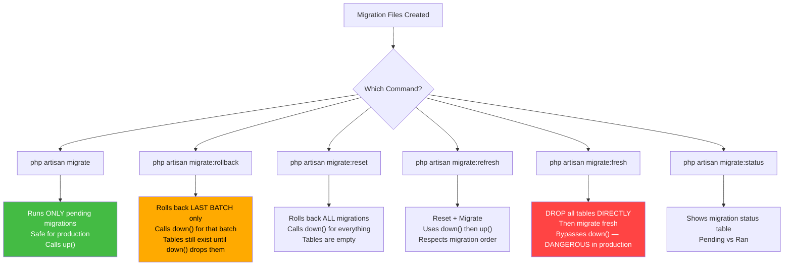
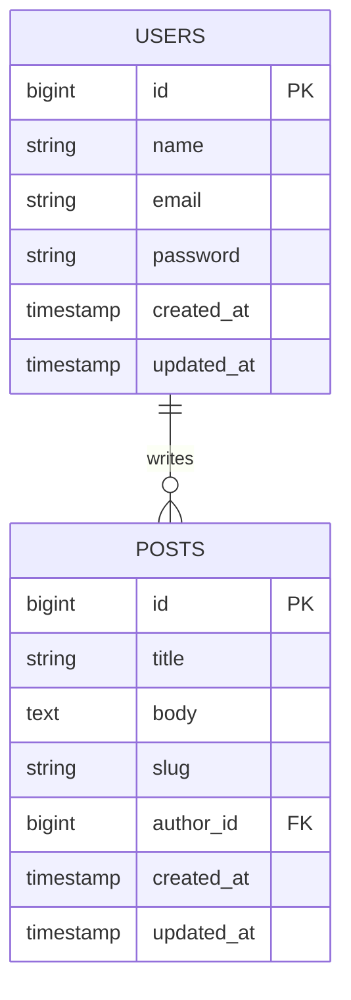
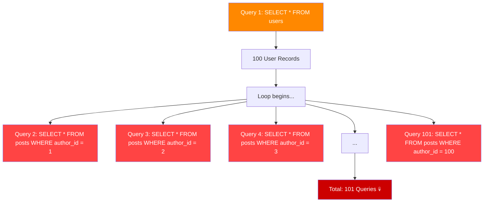
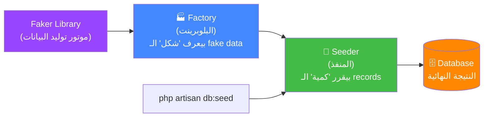
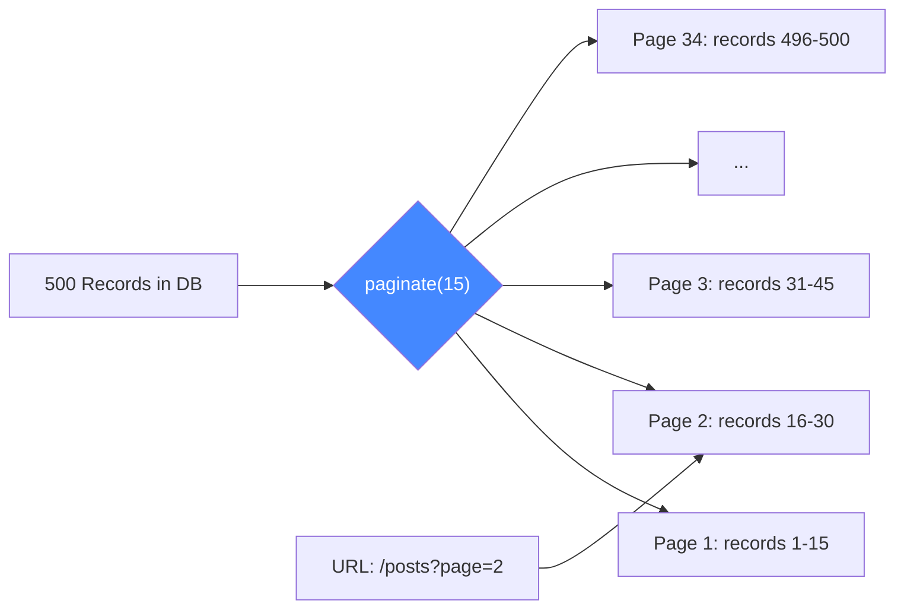
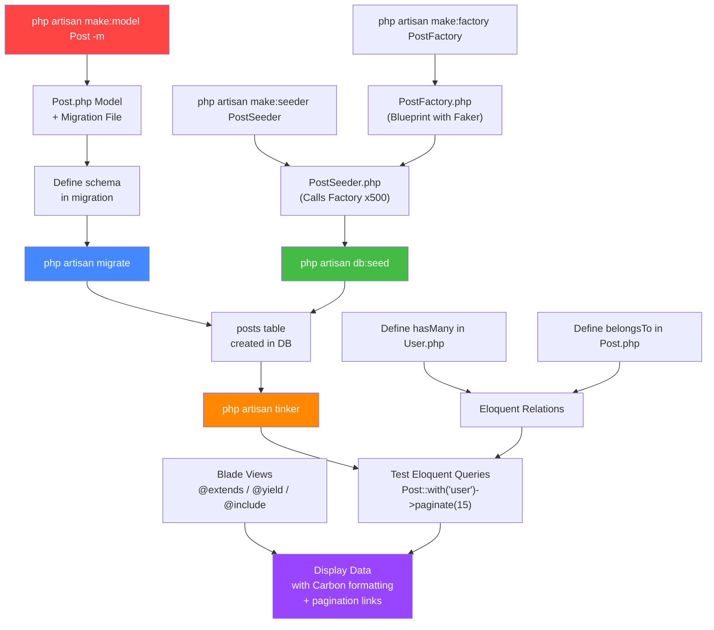

# 🔴 Laravel Day 2 — الدليل المرجعي النهائي
### DB Facade · Eloquent ORM · Migrations · Factories · Seeders · Tinker · Blade · Carbon · Pagination

> **المؤلف:** Senior Backend Architect @ ITI Open Source Track  
> **المستوى:** Beginner → Advanced  
> **الهدف:** نفهم مش بس إزاي، لكن **ليه** — الفلسفة قبل الكود

---

## 📋 فهرس المحتويات

- [[#Chapter 1 — Blade Templating Philosophy]]
- [[#Chapter 2 — Database Migrations]]
- [[#Chapter 3 — DB Facade vs Eloquent ORM]]
- [[#Chapter 4 — Eloquent Relationships (1-to-Many)]]
- [[#Chapter 5 — The N+1 Problem & Eager Loading]]
- [[#Chapter 6 — Factories & Seeders]]
- [[#Chapter 7 — Artisan Tinker]]
- [[#Chapter 8 — Carbon & Pagination]]
- [[#Chapter 9 — زتونة الإنترفيو 🫒]]

---

# Chapter 1 — Blade Templating Philosophy

## 🧠 الفلسفة الكبيرة — ليه في حاجة اسمها Blade أصلًا؟

تخيل إنك بتبني 10 صفحات HTML في موقع. كل صفحة فيها نفس الـ `<nav>` ونفس الـ `<footer>`. لو حصل تغيير في الـ nav، هتفتح 10 ملفات وتعدل 10 مرات. ده اسمه **DRY Violation** (Don't Repeat Yourself).

Blade جه عشان يحل مشكلة الـ **Layout Reuse** — تعمل skeleton واحد للصفحة وكل صفحة تان بس تـ"يحقن" الـ content الخاصة بيها فيه.

> [!info] The Big Picture — The Template Inheritance Workflow
> ```
> layouts/app.blade.php   <-- الـ "هيكل العظمي" (Skeleton)
>         │
>         │  @yield('content')  <-- "مكان فاضي" بنحجزه للـ child
>         │
>         ▼
> posts/index.blade.php   <-- الـ "Child" اللي بتملّي الفراغ
>         │
>         └─ @extends('layouts.app')
>         └─ @section('content') ... @endsection
> ```

---

## 1.1 — `@extends` & `@yield` — نظام الـ Inheritance

### `@extends('layouts.app')`

| الخاصية | التفاصيل |
|---|---|
| **الغرض** | بتقول للـ child "إنت وارث الـ layout ده" |
| **الـ Input** | اسم الـ view file (بدون `.blade.php`) بـ dot notation |
| **الـ Output** | مش بترجع حاجة — بس بتربط الـ child بالـ parent |
| **الموقع** | لازم تكون **أول سطر** في الـ child view |

```php
{{-- resources/views/posts/index.blade.php --}}

@extends('layouts.app')  {{-- "I inherit from app layout" --}}

@section('content')
    <h1>All Posts</h1>
    {{-- This block will be injected into @yield('content') --}}
@endsection
```

### `@yield('content')`

| الخاصية | التفاصيل |
|---|---|
| **الغرض** | بيحجز "فراغ" في الـ parent layout عشان الـ child يملّيه |
| **الـ Input** | اسم الـ section (string) |
| **الـ Output** | بيطبع الـ content اللي الـ child حطه في الـ section ده |
| **الـ Default** | ممكن تديه default value: `@yield('title', 'My App')` |

```php
{{-- resources/views/layouts/app.blade.php --}}

<!DOCTYPE html>
<html>
<head>
    <title>@yield('title', 'My Laravel App')</title>
</head>
<body>
    <nav>...</nav>

    <main>
        @yield('content')  {{-- Placeholder — child fills this --}}
    </main>

    <footer>...</footer>
</body>
</html>
```

---

## 1.2 — `@include` — الـ Partial Components

`@include` مختلفة عن `@extends`. ده مش inheritance — ده زي الـ "copy-paste الذكي". بتجيب ملف صغير وتحطه في أي مكان.

| الخاصية | التفاصيل |
|---|---|
| **الغرض** | بيـ"embeds" ملف blade تاني في الـ current view |
| **الفرق عن @extends** | `@extends` = inheritance (parent/child). `@include` = composition (plug-in a partial) |
| **الـ Input** | اسم الـ view + (optional) array of variables to pass |
| **الـ Output** | بيطبع الـ HTML من الملف المضمّن مباشرة |

```php
{{-- Usage in any view --}}
@include('partials.navbar')
@include('partials.alert', ['message' => 'Post saved!', 'type' => 'success'])
```

```php
{{-- resources/views/partials/alert.blade.php --}}
<div class="alert alert-{{ $type }}">
    {{ $message }}
</div>
```

---

## 1.3 — Blade Components — الجيل الجديد

الـ Blade Components دي الـ evolution من `@include`. بتعمل component بـ class + view، زي React components بس في PHP.

> [!tip] متى تستخدم إيه؟
> - `@extends` + `@yield` → للـ **Page Layouts** (هيكل الصفحة الكاملة)
> - `@include` → للـ **Simple Partials** (navbar, footer, alert)
> - **Blade Components** → للـ **Reusable UI Pieces** اللي محتاج ليها logic (buttons, cards, modals)

```bash
# Create a Blade component
php artisan make:component Alert
# Creates: app/View/Components/Alert.php + resources/views/components/alert.blade.php
```

```php
{{-- Using a component in a view --}}
<x-alert type="success" :message="$successMessage" />
```

---

# Chapter 2 — Database Migrations

## 🧠 الفلسفة — ليه أصلًا في حاجة اسمها Migration؟

تخيل إن عندك team بتشتغل على نفس المشروع. كل واحد شغال على اللاب توب بتاعه. لو حد عمل تغيير في الداتابيز بالـ GUI (زي phpMyAdmin أو TablePlus)، التاني مش هيعرف عنه. الداتابيز "out of sync".

**Migration هي Version Control لقاعدة بياناتك.** زي git للكود، الـ Migration هي git للـ schema.

> [!info] The Core Logic — Migration as Version Control
> ```
> Git Commit   ←→   Migration File
> git push     ←→   php artisan migrate
> git pull     ←→   php artisan migrate (on another machine)
> git revert   ←→   php artisan migrate:rollback
> ```

لما بتعمل `php artisan migrate`، Laravel بيشوف إيه الـ migrations اللي لسه ما اتشغلتش (عن طريق جدول `migrations` في الداتابيز) وبيشغلهم بالترتيب.

---

## 2.1 — إزاي تعمل Migration

```bash
# Create a standalone migration
php artisan make:migration create_posts_table

# Create a Model WITH its migration in one command (-m flag)
php artisan make:model Post -m
```

> [!tip] Convention المهم جداً
> Laravel بيـ"يقرأ" اسم الـ migration. لو بدأت بـ `create_XXX_table`، هو هيعرف إنك بتعمل table جديدة وهيجيب الـ `Schema::create()` skeleton جاهز ليك أوتوماتيك.

```php
// database/migrations/2024_01_01_000000_create_posts_table.php

use Illuminate\Database\Migrations\Migration;
use Illuminate\Database\Schema\Blueprint;
use Illuminate\Support\Facades\Schema;

return new class extends Migration
{
    /**
     * Run the migrations — called by `php artisan migrate`
     */
    public function up(): void
    {
        Schema::create('posts', function (Blueprint $table) {
            $table->id();                        // Auto-increment primary key
            $table->string('title');             // VARCHAR(255)
            $table->text('body');                // TEXT
            $table->string('slug')->unique();    // VARCHAR(255) + unique index
            $table->unsignedBigInteger('author_id'); // FK column — unsigned to match id type
            $table->timestamps();                // created_at & updated_at

            // Define the foreign key constraint at DB level
            $table->foreign('author_id')
                  ->references('id')
                  ->on('users')
                  ->onDelete('cascade');
        });
    }

    /**
     * Reverse the migrations — called by rollback commands
     */
    public function down(): void
    {
        Schema::dropIfExists('posts');
    }
};
```

---

## 2.2 — Migration Commands — التشريح الكامل



### الفرق الحرج بين `fresh` و `refresh`

> [!warning] ⚠️ fresh vs refresh — فرق مش هتنساه
> | الأمر | الآلية | الخطورة |
> |---|---|---|
> | `migrate:fresh` | بيعمل `DROP TABLE` مباشرة لكل الجداول، مش بيكلم الـ migrations | **خطير جداً في Production** — هيمسح الداتا كلها |
> | `migrate:refresh` | بيشغل `down()` على كل migration بالعكس، تم `up()` | أأمن نسبياً لأنه بيعتمد على الـ migration logic |
>
> **القاعدة:** في الـ development، `fresh` أسرع وأسهل. في الـ production، لا الاثنين — استخدم `migrate` فقط.

### جدول المقارنة الكاملة

| الأمر | بيشغل `up()`؟ | بيشغل `down()`؟ | بيـ DROP مباشرة؟ | الداتا اتمسحت؟ |
|---|---|---|---|---|
| `migrate` | ✅ (pending فقط) | ❌ | ❌ | ❌ |
| `migrate:rollback` | ❌ | ✅ (last batch) | ❌ | ✅ (last batch) |
| `migrate:reset` | ❌ | ✅ (all) | ❌ | ✅ (all) |
| `migrate:refresh` | ✅ (all) | ✅ (all) | ❌ | ✅ (all) |
| `migrate:fresh` | ✅ (all) | ❌ | ✅ | ✅ (all) |

---

# Chapter 3 — DB Facade vs Eloquent ORM

## 🧠 الفلسفة — ليه في ORM أصلًا؟

في الأول كانت في طريقة واحدة تكلم الداتابيز: **Raw SQL**.

```sql
SELECT * FROM posts WHERE author_id = 5 AND votes > 10 ORDER BY created_at DESC LIMIT 20;
```

ده SQL صح، بس له مشاكل:
1. **SQL Injection** — لو حد inject code في الـ input
2. **Vendor Lock-in** — syntax MySQL مختلف عن PostgreSQL مختلف عن SQLite
3. **No Objects** — ببترجع arrays ومش بيتعامل مع الـ data كـ PHP objects
4. **No Relations** — لازم تكتب الـ JOINs يدوياً كل مرة

Laravel حل ده بطريقتين:

| | DB Facade (Query Builder) | Eloquent ORM |
|---|---|---|
| **الـ Abstraction Level** | Medium — بيبني SQL بـ PHP syntax | High — بتتعامل مع Objects |
| **الـ Output** | `stdClass` objects أو arrays | Eloquent Model instances |
| **الـ Relations** | يدوي — بتكتب الـ JOINs | أوتوماتيك بـ method calls |
| **الـ Performance** | أسرع قليلاً (أقل overhead) | أبطأ قليلاً لكن ممتاز للـ features |
| **متى تستخدمه؟** | Complex queries، Reports، Raw performance | Standard CRUD، Relations، Events |

---

## 3.1 — DB Facade — القاموس الكامل

الـ DB Facade هو الـ **Query Builder**. بتبني query بـ method chaining وهو بيحولها لـ SQL آمن (parameterized queries).

```php
use Illuminate\Support\Facades\DB;
```

### عمليات القراءة (SELECT)

```php
// find(id) — Fetch a single row by primary key
// Returns: stdClass object | null
$post = DB::table('posts')->find(20);

// get() — Fetch ALL rows from the table
// Returns: Illuminate\Support\Collection of stdClass objects
$posts = DB::table('posts')->get();

// first() — Fetch the FIRST row matching the query
// Returns: stdClass object | null
$firstPost = DB::table('posts')->first();

// where()->first() — Fetch first row matching a condition
// Returns: stdClass object | null
$singlePost = DB::table('posts')
                ->where('slug', 'first-post')
                ->first();

// where() with operators — more complex conditions
$popularPosts = DB::table('posts')
                ->where('votes', '>', 100)
                ->where('status', '=', 'published') // AND condition
                ->orWhere('featured', true)          // OR condition
                ->orderBy('created_at', 'desc')
                ->limit(10)
                ->get();
```

### عمليات الكتابة (INSERT / UPDATE / DELETE)

```php
// insert() — Insert a single row
// Returns: bool (true on success)
DB::table('posts')->insert([
    'title'     => 'My First Post',
    'body'      => 'Lorem ipsum...',
    'author_id' => 1,
    'created_at' => now(),
    'updated_at' => now(),
]);

// update() — Update rows matching a condition
// Returns: int (number of affected rows)
DB::table('posts')
    ->where('id', 1)
    ->update(['title' => 'Updated Title']);

// delete() — Delete rows matching a condition
// Returns: int (number of deleted rows)
DB::table('posts')
    ->where('id', 1)
    ->delete();
```

> [!tip] متى تستخدم DB Facade بدل Eloquent؟
> - **Complex JOINs** عبر أكتر من 3 جداول
> - **Bulk Operations** زي حذف أو تحديث مئات الآلاف من الـ records (Eloquent بيـload كل record في الـ memory)
> - **Raw Aggregations**: `DB::table('posts')->count()`, `->sum('votes')`, `->avg('rating')`

---

## 3.2 — Eloquent ORM — الـ Magic Layer

Eloquent بيحول كل **row** في الداتابيز لـ **PHP Object** (instance من الـ Model class).

> [!info] The Core Convention — اتفق وارتاح
> Eloquent بيشتغل على **الـ Convention over Configuration** مبدأ. لو اتبعت الـ conventions، مش محتاج تكتب config.
> - Model `Post` → بيدور أوتوماتيك على table `posts` (plural lowercase)
> - Model `UserProfile` → بيدور على `user_profiles`
> - الـ Primary Key = `id` (بالاسم ده)
> - الـ Timestamps = `created_at` و `updated_at`

### إنشاء الـ Model

```bash
php artisan make:model Post          # Model only
php artisan make:model Post -m       # Model + Migration
php artisan make:model Post -mc      # Model + Migration + Controller
php artisan make:model Post -a       # Model + Migration + Controller + Factory + Seeder + Policy (ALL)
```

```php
// app/Models/Post.php

namespace App\Models;

use Illuminate\Database\Eloquent\Model;
use Illuminate\Database\Eloquent\Factories\HasFactory;

class Post extends Model
{
    use HasFactory;

    // Override convention if table name is different
    // protected $table = 'blog_posts';

    // Mass Assignment Protection — fields that CAN be filled via create() or fill()
    protected $fillable = ['title', 'body', 'slug', 'author_id'];

    // Alternatively, use $guarded to specify fields that CANNOT be mass assigned
    // protected $guarded = ['id'];
}
```

> [!warning] ⚠️ MassAssignmentException — فهمها كويس
> لو كتبت `Post::create(['title' => '...'])` من غير ما تحدد `$fillable`، Laravel هيطلع **MassAssignmentException**.
>
> **ليه ده موجود؟** حماية أمنية. تخيل إن في field اسمها `is_admin` في الـ users table. لو مفيش حماية وجاء request فيه `is_admin=1`، ممكن حد يعمل نفسه admin! الـ `$fillable` بيقول "بس الحقول دي هي اللي أقبل ملتها من الـ request".

### Eloquent CRUD Operations

```php
use App\Models\Post;

// --- CREATE ---
// Method 1: new + save()
$post = new Post();
$post->title = 'My Post';
$post->body = 'Content here';
$post->author_id = 1;
$post->save(); // Returns: bool

// Method 2: create() — requires $fillable to be set
// Returns: Post model instance (the newly created record)
$post = Post::create([
    'title'     => 'My Post',
    'body'      => 'Content here',
    'author_id' => 1,
]);

// --- READ ---
// all() — Get all records
// Returns: Illuminate\Database\Eloquent\Collection
$posts = Post::all();

// find($id) — Get single record by primary key
// Returns: Post model instance | null
$post = Post::find(25);

// findOrFail($id) — Same as find() but throws ModelNotFoundException if not found
// Returns: Post model instance | throws ModelNotFoundException
$post = Post::findOrFail(25);

// where()->get() — Query builder on Eloquent
// Returns: Collection of Post instances
$posts = Post::where('author_id', 5)
             ->where('votes', '>', 10)
             ->orderBy('created_at', 'desc')
             ->get();

// first() — Get the first matching record
// Returns: Post instance | null
$post = Post::where('slug', 'my-post')->first();

// firstOrFail() — Throws if not found (great for controllers)
$post = Post::where('slug', 'my-post')->firstOrFail();

// --- UPDATE ---
// Method 1: find + update array
// Returns: bool
Post::find(25)->update(['title' => 'Updated Title']);

// Method 2: find + set property + save
$post = Post::find(25);
$post->title = 'New Title';
$post->save();

// --- DELETE ---
// Returns: bool
Post::find(25)->delete();

// Delete by condition (bulk delete)
// Returns: int (rows deleted)
Post::where('votes', 23)->delete();
```

---

# Chapter 4 — Eloquent Relationships (1-to-Many)

## 🧠 الفلسفة — الـ Relationship في الداتابيز

في أي نظام فيه بيانات مترابطة. User عنده Posts. Post عنده Comments. Order عنده Items.

في الداتابيز، العلاقات بتتعمل بـ **Foreign Key**: الجدول الـ "many" side بيحتفظ بـ id من الـ "one" side.



في المثال ده:
- **1 User** ممكن يكتب **many Posts**
- **كل Post** ينتمي لـ **1 User**

الـ Foreign Key `author_id` موجودة في جدول `posts` لأنه هو الـ "many" side.

---

## 4.1 — تعريف الـ Relationship في الـ Models

### في الـ Post Model — `belongsTo`

```php
// app/Models/Post.php

public function user(): BelongsTo
{
    // Method: belongsTo(RelatedModel, foreignKey, ownerKey)
    // Purpose: Define that this Post BELONGS TO a User
    // Returns: BelongsTo relationship instance (used internally by Eloquent)
    
    return $this->belongsTo(
        User::class,    // The related model class
        'author_id',    // The FK column in THIS (posts) table
        'id'            // The PK column in the RELATED (users) table (default: 'id')
    );
}
```

> [!info] ليه بنحدد `author_id` يدوياً؟
> Convention Laravel بيتوقع إن الـ FK اسمها `user_id` (اسم الـ model بـ lowercase + `_id`). لأننا استخدمنا `author_id` بدل `user_id`، لازم نخبره يدوياً. لو كانت اسمها `user_id`، كنا نكتب ببساطة:
> ```php
> return $this->belongsTo(User::class); // Convention satisfied
> ```

### في الـ User Model — `hasMany`

```php
// app/Models/User.php

public function posts(): HasMany
{
    // Method: hasMany(RelatedModel, foreignKey, localKey)
    // Purpose: Define that this User HAS MANY Posts
    // Returns: HasMany relationship instance
    
    return $this->hasMany(
        Post::class,    // The related model class
        'author_id',    // The FK column in the RELATED (posts) table
        'id'            // The PK column in THIS (users) table (default: 'id')
    );
}
```

---

## 4.2 — استخدام الـ Relationship

```php
// In a Controller

// Get a specific user
$user = User::find(5);

// Access user's posts (as a Collection)
// Eloquent automatically runs: SELECT * FROM posts WHERE author_id = 5
$posts = $user->posts; // Property access — returns Collection

// Access the author of a post
$post = Post::find(10);
$author = $post->user; // Returns the User model instance

// Method vs Property access
$user->posts;       // PROPERTY — executes query & returns Collection (lazy loading)
$user->posts();     // METHOD — returns the HasMany query builder (for chaining)
$user->posts()->where('votes', '>', 10)->get(); // Can chain further queries
```

---

# Chapter 5 — The N+1 Problem & Eager Loading

## 🧠 الفلسفة — أخطر Bug في الـ ORM World

ده بالظبط اللي الـ notes بتاعة اليوم اشارتله:

```
100 user -> 1 query
loop($users as $user) -> 100 queries
    select * from posts where user_id = $user->id
```



> [!warning] N+1 Problem — كارثة الـ Performance
> الـ N+1 Problem بتحصل لما بتعمل query للـ parent records (1 query)، تم بتعمل loop وبتجيب الـ related records لكل واحد منهم (N queries إضافية). عندك 100 user = **101 queries** بدل قري واحدة!

### الحل — Eager Loading بـ `with()`

```php
// WRONG — N+1 Problem (101 queries for 100 users)
$users = User::all();
foreach ($users as $user) {
    echo $user->posts->count(); // Each access fires a new query!
}

// CORRECT — Eager Loading (2 queries TOTAL)
// Query 1: SELECT * FROM users
// Query 2: SELECT * FROM posts WHERE author_id IN (1, 2, 3, ..., 100)
$users = User::with('posts')->get();

foreach ($users as $user) {
    echo $user->posts->count(); // No new query! Data is already loaded in memory.
}

// Multiple eager loads
$users = User::with(['posts', 'profile', 'comments'])->get();

// Nested eager loading (posts with their comments)
$users = User::with('posts.comments')->get();
```

> [!tip] Interview Question 🫒
> **Q:** ما هو الـ N+1 Problem وإزاي بتحله في Laravel؟
>
> **A:** الـ N+1 Problem بتحصل لما بنـaccess الـ related models داخل loop بدون Eager Loading، فبيتعمل query لكل record على حدة. الحل هو استخدام `with()` (Eager Loading) اللي بيجيب كل الـ related data في query واحدة عن طريق `WHERE IN` clause بدل loop من queries.

---

# Chapter 6 — Factories & Seeders

## 🧠 الفلسفة — ليه محتاجين بيانات وهمية؟

في بداية المشروع، الداتابيز بتاعتك فاضية. لو عايز تختبر الـ pagination (مثلاً 500 record)، مش هتدخلهم يدوياً. الـ **Factory** و **Seeder** هما الحل اللي بيخليك تولد آلاف الـ records في ثواني.



---

## 6.1 — Faker Library — المحرك الحقيقي

قبل الـ Factory، لازم نعرف إن Laravel بيستخدم مكتبة اسمها **Faker** (مدمجة في الـ dev dependencies) اللي بتولد بيانات واقعية وهمية.

```php
// Faker can generate realistic data for almost anything:
$faker->name()           // "John Doe"
$faker->email()          // "john.doe@example.com"
$faker->sentence()       // "Lorem ipsum dolor sit amet."
$faker->paragraph()      // Multiple sentences
$faker->url()            // "https://www.example.com"
$faker->dateTimeBetween('-1 year', 'now') // Random date
$faker->numberBetween(1, 100)             // Random number
$faker->randomElement(['draft', 'published', 'archived']) // Random choice
```

---

## 6.2 — Factory — البلوبرينت

```bash
php artisan make:factory PostFactory
# Creates: database/factories/PostFactory.php
```

```php
// database/factories/PostFactory.php

namespace Database\Factories;

use App\Models\User;
use Illuminate\Database\Eloquent\Factories\Factory;
use Illuminate\Support\Str;

class PostFactory extends Factory
{
    /**
     * Define the model's default state.
     * This method defines the "blueprint" for a fake Post.
     *
     * @return array<string, mixed>
     */
    public function definition(): array
    {
        $title = fake()->sentence(6); // Generate a 6-word sentence as title

        return [
            'title'     => $title,
            'body'      => fake()->paragraphs(3, true), // 3 paragraphs as string
            'slug'      => Str::slug($title),           // Convert title to URL-safe slug
            'author_id' => User::factory(),             // Automatically creates a User if none exists
                          // OR: User::inRandomOrder()->first()->id  (use existing users)
        ];
    }

    /**
     * A "state" — a variation of the factory for specific scenarios.
     * Usage: Post::factory()->published()->create()
     */
    public function published(): static
    {
        return $this->state(fn (array $attributes) => [
            'status' => 'published',
        ]);
    }
}
```

---

## 6.3 — Seeder — المنفذ

```bash
php artisan make:seeder PostSeeder
# Creates: database/seeders/PostSeeder.php
```

```php
// database/seeders/PostSeeder.php

namespace Database\Seeders;

use App\Models\Post;
use App\Models\User;
use Illuminate\Database\Seeder;

class PostSeeder extends Seeder
{
    /**
     * Run the database seeds.
     * This is the EXECUTOR — it calls the Factory and specifies quantity.
     */
    public function run(): void
    {
        // First, ensure we have some users to assign posts to
        $users = User::factory(10)->create(); // Create 10 fake users

        // Create 500 posts, each assigned to a random existing user
        Post::factory(500)->create([
            'author_id' => fn() => $users->random()->id,
        ]);
    }
}
```

```php
// database/seeders/DatabaseSeeder.php
// This is the MASTER SEEDER — it orchestrates all other seeders

namespace Database\Seeders;

use Illuminate\Database\Seeder;

class DatabaseSeeder extends Seeder
{
    public function run(): void
    {
        // Call individual seeders in the correct dependency order
        $this->call([
            UserSeeder::class,  // Users first (FK dependency)
            PostSeeder::class,  // Then Posts (they need users)
        ]);
    }
}
```

### أوامر تشغيل الـ Seeds

```bash
# Run the DatabaseSeeder (calls all registered seeders)
php artisan db:seed

# Run a SPECIFIC seeder class
php artisan db:seed --class=PostSeeder
php artisan db:seed --class=UserSeeder

# Fresh migration + seed in one command (most common in development)
php artisan migrate:fresh --seed
```

---

## 6.4 — Using Factory Directly in Tinker

```php
// Create 1 post (saves to DB)
Post::factory()->create()

// Create 500 posts (saves to DB)
Post::factory(500)->create()

// Make (creates instance but does NOT save to DB — for testing)
Post::factory()->make()

// Create with specific attributes
Post::factory()->create(['title' => 'My Custom Title', 'author_id' => 1])

// Create with a state
Post::factory()->published()->create()
```

---

# Chapter 7 — Artisan Tinker

## 🧠 الفلسفة — REPL للـ Laravel

Tinker هو **REPL** (Read-Eval-Print Loop) بيخليك تشغل أي كود PHP + Laravel في الـ terminal مباشرة، من غير ما تفتح browser أو تكتب controller.

فكر فيه كـ "browser console" بس لـ backend. بتجرب queries، بتختبر models، بتنشئ records — كل ده في ثواني.

> [!info] Tinker = Laravel Playground في الـ Terminal

```bash
php artisan tinker
```

### استخدامات Tinker الشائعة

```php
// --- After running `php artisan tinker` ---

// Test Eloquent queries
>>> Post::count()
=> 500

>>> Post::find(1)
=> App\Models\Post {#3456
     id: 1,
     title: "Aut quia dolorem enim.",
     ...
   }

>>> User::with('posts')->find(1)->posts->count()
=> 47

// Create test records on the fly
>>> Post::factory()->create(['title' => 'Test Post'])
=> App\Models\Post {#3789 ...}

// Test relationships
>>> $user = User::find(1)
>>> $user->posts
=> Illuminate\Database\Eloquent\Collection {
     all: [ ... ],
   }

// Test Carbon formatting
>>> Post::first()->created_at->format('d M Y')
=> "15 Jan 2024"

// Test queries and check the generated SQL
>>> Post::where('author_id', 1)->toSql()
=> "select * from `posts` where `author_id` = ?"

// Exit Tinker
>>> exit
```

> [!tip] Tinker في الـ Interview
> لو سألوك "إزاي بتتأكد إن الـ relation بتاعتك شغالة؟" الإجابة المثالية هي: "بفتح `php artisan tinker` وبجرب الـ relation مباشرة على الداتابيز الـ development قبل ما أكتب أي controller."

---

# Chapter 8 — Carbon & Pagination

## 8.1 — Carbon — الوقت بالأسلوب الحضاري

**Carbon** هي PHP library مبنية على `DateTime` بتخلي التعامل مع التواريخ والوقت سهل ومقروء. Laravel بيستخدمها أوتوماتيك في كل timestamp field.

```php
// Carbon is automatically cast on Eloquent timestamp columns
$post = Post::find(1);

// $post->created_at is automatically a Carbon instance, not a string!
$post->created_at; // Carbon object

// Formatting
$post->created_at->format('d/m/Y');           // "15/01/2024"
$post->created_at->format('d F Y, h:i A');    // "15 January 2024, 03:30 PM"
$post->created_at->format('Y-m-d H:i:s');     // "2024-01-15 15:30:00"

// Human-readable diff (great for social media style)
$post->created_at->diffForHumans();            // "3 days ago" / "2 hours ago"

// Carbon comparisons
$post->created_at->isToday();      // bool
$post->created_at->isPast();       // bool
$post->created_at->isFuture();     // bool

// Static constructors
Carbon::now();                     // Current datetime
Carbon::today();                   // Today at midnight
Carbon::parse('2024-01-15');       // Parse from string
Carbon::now()->addDays(7);         // One week from now
Carbon::now()->subMonths(1);       // One month ago
```

### في الـ Blade View

```php
{{-- In your blade view --}}
<td>{{ $post->created_at->format('d M Y') }}</td>
<td>{{ $post->created_at->diffForHumans() }}</td>
```

### تخصيص الـ Date Casting في الـ Model

```php
// app/Models/Post.php

protected $casts = [
    'created_at' => 'datetime',
    'updated_at' => 'datetime',
    'published_at' => 'datetime:d/m/Y', // Custom format in cast
];
```

---

## 8.2 — Pagination — تقسيم النتائج

### الفلسفة

لو عندك 500 post وعرضتهم كلهم في صفحة واحدة، الـ browser هيموت. الـ Pagination بتقسم النتائج لـ "صفحات" صغيرة (مثلاً 15 record per page).



### الكود في الـ Controller

```php
// PostController.php

public function index()
{
    // paginate($perPage) — replaces get()
    // Returns: LengthAwarePaginator (NOT a Collection!)
    // Automatically reads the ?page= query parameter from the URL
    $posts = Post::orderBy('created_at', 'desc')->paginate(15);

    // The generated SQL (for page 1):
    // SELECT * FROM posts ORDER BY created_at DESC LIMIT 15 OFFSET 0
    // For page 2: LIMIT 15 OFFSET 15
    // For page 3: LIMIT 15 OFFSET 30

    return view('posts.index', compact('posts'));
}
```

### في الـ Blade View

```php
{{-- resources/views/posts/index.blade.php --}}

@foreach ($posts as $post)
    <div class="post-card">
        <h2>{{ $post->title }}</h2>
        <p>{{ $post->created_at->diffForHumans() }}</p>
    </div>
@endforeach

{{-- Render the pagination links (Previous / 1 2 3 ... / Next) --}}
{{ $posts->links() }}

{{-- With Tailwind CSS styling --}}
{{ $posts->links('pagination::tailwind') }}
```

### `paginate()` vs `simplePaginate()`

| | `paginate($n)` | `simplePaginate($n)` |
|---|---|---|
| **الـ Counter** | بيحسب الـ total count → يعرض "Page 1 of 34" | مش بيحسب الـ total → أسرع |
| **الـ Links** | 1, 2, 3, 4, ... | Previous / Next فقط |
| **متى تستخدمه؟** | لما تحتاج "Page X of Y" | Large datasets, performance-critical |
| **الـ SQL** | بيعمل `SELECT COUNT(*)` إضافية | مش بيعمل COUNT |

---

# Chapter 9 — زتونة الإنترفيو 🫒

> [!tip] أهم أسئلة الإنترفيو من Day 2

---

### Q1: ما الفرق بين `migrate:fresh` و `migrate:refresh`؟

**A:** كلاهما بيمسحوا الداتابيز ويعيدوا تشغيل الـ migrations، لكن الفرق في **الآلية**:
- `migrate:fresh` → بيعمل `DROP TABLE` على كل الجداول مباشرة **متجاوزاً** الـ `down()` methods. أسرع لكن أخطر.
- `migrate:refresh` → بيشغل `down()` على كل migration بالترتيب العكسي (rollback كامل) ثم `up()` من جديد. الآلية أنظف وأكثر أماناً.

---

### Q2: ما هو الـ Eloquent ORM ولماذا نستخدمه بدلاً من Raw SQL؟

**A:** Eloquent هو الـ ORM (Object-Relational Mapper) الخاص بـ Laravel. بيحوّل كل **row** في الداتابيز لـ **PHP Object**، مما يتيح:
1. **Type Safety** — بتتعامل مع objects مش arrays
2. **Relations** — تعريف العلاقات بشكل declarative بدل JOINs يدوية
3. **Events** — `creating`, `created`, `updating`, `deleting` hooks
4. **Mass Assignment Protection** — الـ `$fillable` array
5. **Cross-database compatibility** — نفس الكود يشتغل مع MySQL, PostgreSQL, SQLite

---

### Q3: ما هو الـ N+1 Problem وكيف تحله؟

**A:** بيحصل لما بتـaccess علاقة داخل loop بدون Eager Loading. مثال: عندك 100 user وبتعمل loop لتجيب posts لكل واحد = 101 query. الحل هو `with()`:
```php
// N+1 (BAD): 101 queries
$users = User::all();
foreach ($users as $user) { echo $user->posts->count(); }

// Eager Loading (GOOD): 2 queries
$users = User::with('posts')->get();
```

---

### Q4: ما الفرق بين Factory و Seeder؟

**A:**
- **Factory** هو الـ **Blueprint** — بيعرف "شكل" الـ fake record الواحد وما هي قيم كل column
- **Seeder** هو الـ **Executor** — بيستخدم الـ Factory ويحدد الـ quantity والـ execution order

---

### Q5: ما الفرق بين `belongsTo` و `hasMany` وفين بنحطهم؟

**A:**
- `hasMany` → في الـ "one" side (الـ User model) — "عندي كتير"
- `belongsTo` → في الـ "many" side (الـ Post model) — "أنا تابع لـ واحد"

الـ FK column موجود في جدول الـ model اللي عنده `belongsTo`.

---

### Q6: ما هو `$fillable` وليه ضروري؟

**A:** `$fillable` هو array في الـ Model بيحدد الـ columns اللي يُسمح بـ mass assignment عليها (عن طريق `create()` أو `update()`). بدونه Laravel بيطلع `MassAssignmentException` كحماية من هجمات الـ mass assignment حيث ممكن يتم حقن columns زي `is_admin` بشكل غير مقصود من الـ request.

---

### Q7: ما الفرق بين `Post::all()` و `Post::get()`؟

**A:** عملياً، `all()` مكافئة لـ `get()` لما بتطلب كل الـ records. الفرق:
- `Post::all()` → Static method، بتجيب كل الـ records مباشرة. ما ينفعش تعمل chaining قبلها.
- `Post::where(...)->get()` → بتبني query builder chain ثم تنفذها

```php
Post::all();                    // SELECT * FROM posts
Post::orderBy('id')->get();     // SELECT * FROM posts ORDER BY id
// Post::orderBy('id')->all();  // ERROR — can't chain before all()
```

---

### Q8: ما الفرق بين `paginate()` و `simplePaginate()`؟

**A:** كلاهما بيقسم النتائج، لكن `paginate()` بيعمل `COUNT(*)` query إضافية عشان يعرض "Page X of Y"، بينما `simplePaginate()` مش بيعملها وبيكتفي بـ Previous/Next links، مما يجعله أسرع للـ large datasets.

---

## 🗺️ الـ Big Picture — Everything Connected



---

## 📚 References & Documentation

| الموضوع | الرابط |
|---|---|
| Eloquent ORM | https://laravel.com/docs/master/eloquent |
| Collections Methods | https://laravel.com/docs/master/collections#available-methods |
| DB Facade / Query Builder | https://laravel.com/docs/12.x/queries |
| Database Factories | https://laravel.com/docs/master/database-testing |
| Database Seeding | https://laravel.com/docs/master/seeding |
| Carbon Documentation | https://carbon.nesbot.com/docs/ |
| Pagination | https://laravel.com/docs/master/pagination |
| Polymorphic Relations | https://laravel.com/docs/master/eloquent-relationships#polymorphic-relationships |
| Soft Deleting | https://laravel.com/docs/master/eloquent#soft-deleting |
| Artisan Tinker | https://laravel.com/docs/master/artisan#usage |

---

> [!info] 💡 نصيحة الـ Senior
> الفرق بين Junior وSenior مش في عدد الـ functions اللي بيعرفها، لكن في إنه بيفهم **ليه** كل حاجة موجودة. لما بتفهم إن Eloquent اتعمل عشان يحل مشكلة الـ SQL Injection والـ Vendor Lock-in والـ Object Mapping، تقدر تقرر **متى** تستخدمه ومتى تتجاوزه لـ DB Facade أو Raw SQL. ده الفكر الهندسي الحقيقي.

---

*آخر تحديث: Laravel Day 2 — ITI Open Source Applications Development Track*
