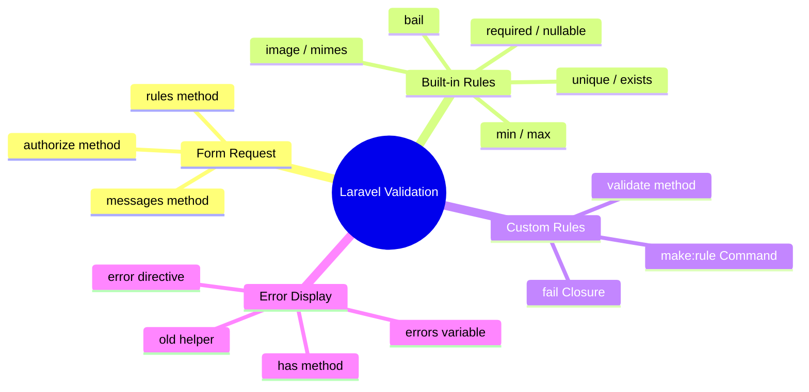
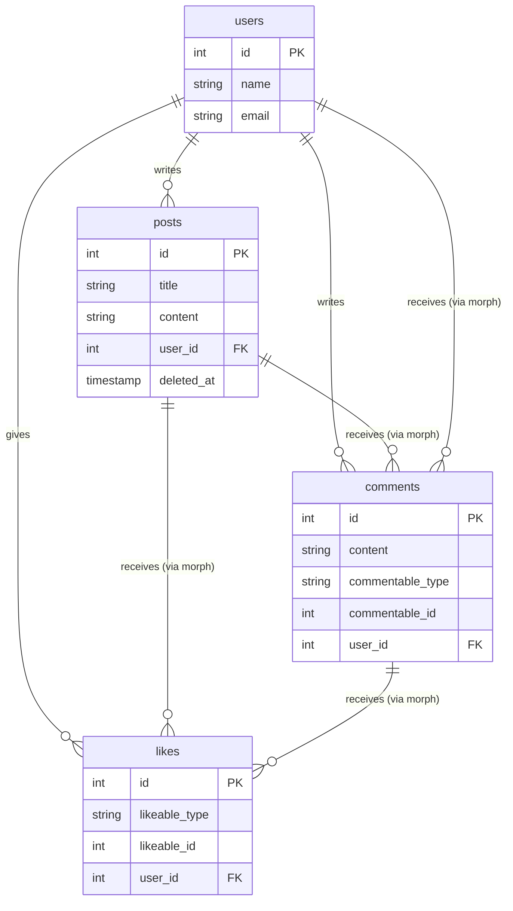
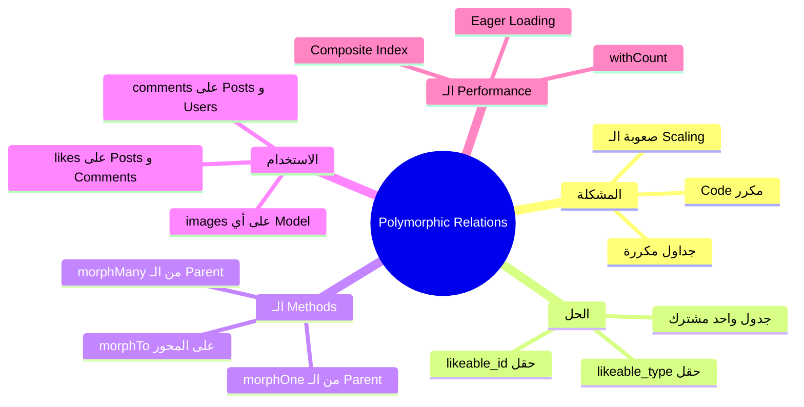
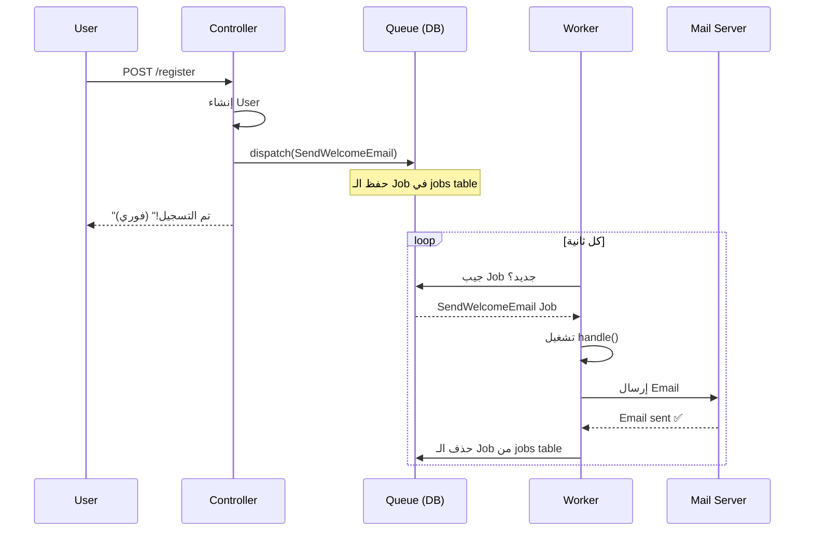
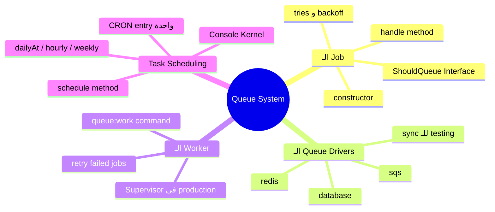
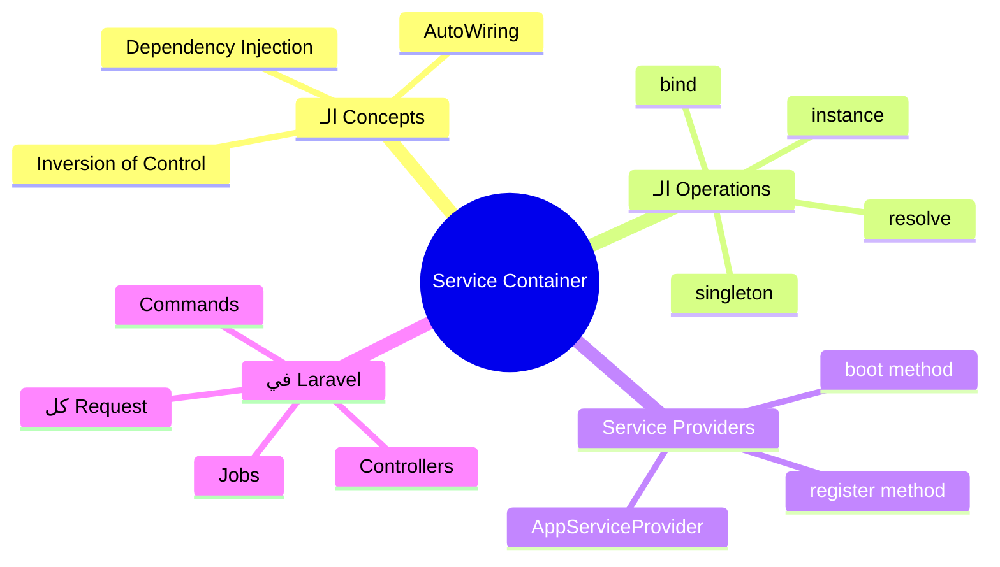
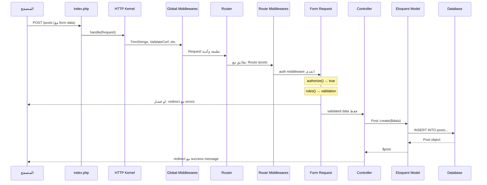

# 🚀 Laravel OSAD — الدليل الشامل: من الـ Request لحد الـ Queue

> **المتطلبات:** فهم أساسيات Laravel (Routes, Controllers, Eloquent, Blade) — ده الـ manual بتاع Day 3 & Day 4، اللي فيه أخطر الـ concepts اللي بتتسأل عنها في أي إنترفيو Backend.

---

## 📑 جدول المحتويات

1. [[#الـ Request Lifecycle — رحلة الـ Request من الباب للـ Controller]]
2. [[#Middleware — حارس البوابة]]
3. [[#Form Requests & Validation — الـ Bodyguard بتاع الـ Data]]
4. [[#Soft Deletes — الحذف اللي مش بيحذف]]
5. [[#Image Uploading — رفع الصور بطريقة صح]]
6. [[#Polymorphic Relations — التحفة المعمارية]]
7. [[#Mutators Accessors & Carbon — تنسيق الـ Data]]
8. [[#Queues Jobs & Task Scheduling — الشغل في الخلفية]]

---

# الـ Request Lifecycle — رحلة الـ Request من الباب للـ Controller

## البداية — إيه اللي بيحصل فعلاً لما المستخدم يضغط "Submit"؟

تخيّل معايا إنك بتبعت جواب رسمي لـ مصلحة حكومية. الجواب ده مش بيوصل للمدير مباشرة. بيعدي على:
1. **السكرتارية** — بتتأكد إن الجواب موجود وعليه الأوراق المطلوبة
2. **الأمن** — بيتأكد إنك مسموح لك تدخل الأوراق دي
3. **مكتب الاستقبال** — بيوجهك للإدارة الصح
4. **المدير** — يعمل الـ action المطلوب ويرد عليك

في Laravel، **بالظبط نفس الكلام** بيحصل مع كل request.

---

## الـ Big Picture — الصورة الكاملة قبل أي تفصيل

```
HTTP Request (من المتصفح)
         ↓
   public/index.php
   (الباب الوحيد للتطبيق)
         ↓
   Composer Autoloader
   (بيحمّل كل الـ classes)
         ↓
   Bootstrap Application Container
   (بيبني الـ Laravel App وبيسجل الـ Service Providers)
         ↓
   HTTP Kernel
   (القلب — بيمرر الـ Request على الـ Middlewares)
         ↓
   Global Middlewares Stack
   (بتشتغل على كل request)
         ↓
   Router
   (بيطابق الـ Request مع الـ Route المناسب)
         ↓
   Route Middlewares
   (بتشتغل على routes معينة بس — زي auth)
         ↓
   Form Request / Validation
   (لو موجودة)
         ↓
   Controller Method
   (الشغل الفعلي)
         ↓
   Response
   (الرد للمتصفح)
```

> [!info] الـ Core Concept
> في Laravel، **كل حاجة** بتعدي على نفس الطريق. مفيش shortcut. ده مش عيب — ده **قوة**. معناه إنك تقدر تعترض أي request في أي نقطة وتعمل فيه اللي انت عايزه.

---

## `public/index.php` — الباب الوحيد للتطبيق

```php
<?php

// ← ده أول ملف بيتشغّل في أي request
// ← كل الـ requests بتيجي هنا (شوف config الـ web server)

use Illuminate\Http\Request;

// ← بيعرّف الـ maintenance mode
define('LARAVEL_START', microtime(true));

if (file_exists($maintenance = __DIR__.'/../storage/framework/maintenance.php')) {
    require $maintenance;
}

// ← خطوة 1: تحميل كل الـ classes عن طريق Composer
require __DIR__.'/../vendor/autoload.php';

// ← خطوة 2: إنشاء الـ Application Container
// هنا بيتبنى الـ "صندوق" اللي فيه كل حاجة في Laravel
$app = require_once __DIR__.'/../bootstrap/app.php';

// ← خطوة 3: إنشاء الـ HTTP Kernel وبيمرر الـ Request عليه
$kernel = $app->make(Illuminate\Contracts\Http\Kernel::class);

$response = $kernel->handle(
    $request = Request::capture() // ← بيلتقط الـ HTTP Request الجاي
)->send();

$kernel->terminate($request, $response);
```

> [!tip] Interview Question 🎯
> **س: إيه الفرق بين `public/index.php` و `app/Http/Kernel.php`؟**
> 
> الـ `index.php` ده "الباب الأمامي" — بيستقبل الـ request وبيشغّل الـ framework.
> الـ `Kernel.php` ده "مدير الأمن" — بيعرّف الـ middlewares وبيديرها.

---

## `bootstrap/app.php` — ولادة الـ Application Container

```php
<?php

// ← ده اللي بيبني الـ Application Container (Application Object)
$app = new Illuminate\Foundation\Application(
    $_ENV['APP_BASE_PATH'] ?? dirname(__DIR__)
);

// ← بيربط الـ Contracts بالـ Implementations
// يعني لما حاجة تطلب Kernel, يديها HttpKernel
$app->singleton(
    Illuminate\Contracts\Http\Kernel::class,
    App\Http\Kernel::class  // ← ده الـ Kernel بتاعنا اللي بنعدّل فيه
);

// ← نفس الكلام للـ Console والـ Exception Handler
$app->singleton(
    Illuminate\Contracts\Console\Kernel::class,
    App\Console\Kernel::class
);

$app->singleton(
    Illuminate\Contracts\Debug\ExceptionHandler::class,
    App\Exceptions\Handler::class
);

return $app;
```

---

# Middleware — حارس البوابة

## البداية — المشكلة اللي Middleware حلّها

تخيّل إنك بتبني API وعندك 50 route مختلف. كل route محتاج يتأكد إن المستخدم مسجّل دخول. من غير Middleware، هتكتب نفس الكود في كل controller:

```php
// ❌ الطريقة القديمة — المشكلة واضحة
public function store(Request $request)
{
    // ← كل controller method بيكرر نفس الكود
    if (!auth()->check()) {
        return redirect('/login');
    }

    if (!$request->hasValidSignature()) {
        abort(403);
    }

    // ... باقي الكود
}
```

لو الـ logic دي اتغيّرت، هتروح تعدّل في 50 مكان. **ده كابوس.**

> بدل ما تكرر نفس الكود في كل controller — خليه يشتغل **مرة واحدة** على الـ request قبل ما يوصل للـ controller خالص.

---

## إيه هو الـ Middleware بالظبط؟

**بالظبط زي طبقات البصل.** كل layer بتفحص الـ request وبتقرر: هل بنكمّل ولا بنرجع?

```
Request جاية
      ↓
┌─────────────────────────────┐
│   Middleware: TrimStrings   │  ← بيشيل الـ spaces من الـ input
├─────────────────────────────┤
│   Middleware: ValidateCsrf  │  ← بيتأكد من الـ CSRF token
├─────────────────────────────┤
│   Middleware: Authenticate  │  ← بيتأكد إن المستخدم logged in
├─────────────────────────────┤
│         Controller          │  ← وصلنا! نعمل الشغل الحقيقي
└─────────────────────────────┘
      ↓
Response راجعة (بتعدي على نفس الطبقات بالعكس)
```

---

## `app/Http/Kernel.php` — الـ Command Center

```php
<?php

namespace App\Http;

use Illuminate\Foundation\Http\Kernel as HttpKernel;

class Kernel extends HttpKernel
{
    /**
     * الـ Global Middlewares — بتشتغل على كل request بدون استثناء
     */
    protected $middleware = [
        \App\Http\Middleware\TrustProxies::class,
        \Illuminate\Http\Middleware\HandleCors::class,          // ← CORS
        \App\Http\Middleware\PreventRequestsDuringMaintenance::class,
        \Illuminate\Foundation\Http\Middleware\ValidatePostSize::class,
        \App\Http\Middleware\TrimStrings::class,                // ← بيشيل spaces
        \Illuminate\Foundation\Http\Middleware\ConvertEmptyStringsToNull::class, // ← "" → null
    ];

    /**
     * الـ Route Middleware Groups — مجموعات بنطبّقها على groups من routes
     */
    protected $middlewareGroups = [
        'web' => [
            \App\Http\Middleware\EncryptCookies::class,    // ← بيشفّر الـ Cookies
            \Illuminate\Cookie\Middleware\AddQueuedCookiesToResponse::class,
            \Illuminate\Session\Middleware\StartSession::class,  // ← بيشغّل الـ Session
            \Illuminate\View\Middleware\ShareErrorsFromSession::class, // ← بيشيل الـ Errors للـ View
            \App\Http\Middleware\VerifyCsrfToken::class,   // ← CSRF Protection
            \Illuminate\Routing\Middleware\SubstituteBindings::class,
        ],
        'api' => [
            \Laravel\Sanctum\Http\Middleware\EnsureFrontendRequestsAreStateful::class,
            \Illuminate\Routing\Middleware\ThrottleRequests::class.':api', // ← Rate Limiting
            \Illuminate\Routing\Middleware\SubstituteBindings::class,
        ],
    ];

    /**
     * الـ Route Middlewares — aliases بنستخدمها على routes فردية
     */
    protected $middlewareAliases = [
        'auth'         => \App\Http\Middleware\Authenticate::class,  // ← للـ authentication
        'auth.basic'   => \Illuminate\Auth\Middleware\AuthenticateWithBasicAuth::class,
        'can'          => \Illuminate\Auth\Middleware\Authorize::class, // ← للـ authorization
        'guest'        => \App\Http\Middleware\RedirectIfAuthenticated::class,
        'throttle'     => \Illuminate\Routing\Middleware\ThrottleRequests::class,
        'verified'     => \Illuminate\Auth\Middleware\EnsureEmailIsVerified::class,
    ];
}
```

---

## إزاي تعمل Middleware من الصفر؟

### الخطوة 1 — توليد الـ Middleware

```bash
php artisan make:middleware CheckIsAdmin
```

### الخطوة 2 — كتابة الـ Logic

```php
<?php

namespace App\Http\Middleware;

use Closure;
use Illuminate\Http\Request;
use Symfony\Component\HttpFoundation\Response;

class CheckIsAdmin
{
    /**
     * @param Request $request  ← الـ Request الجاي من المتصفح
     * @param Closure $next     ← الـ function اللي بتنقله للـ middleware الجاي
     * @return Response         ← الـ Response اللي هترجع للمتصفح
     */
    public function handle(Request $request, Closure $next): Response
    {
        // ← لو المستخدم مش admin، ارفض الـ request
        if (!auth()->check() || auth()->user()->role !== 'admin') {
            abort(403, 'ممنوع الدخول — محتاج صلاحيات Admin');
        }

        // ← لو الـ check اتعدى، كمّل للـ middleware الجاي أو الـ controller
        return $next($request);
    }
}
```

> [!info] الـ `$next($request)` ده إيه بالظبط؟
> ده **الـ Closure** اللي بيمثّل "باقي السلسلة". لما بتقول `$next($request)`، انت بتقول للـ Laravel: "خلاص، أنا خلصت شغلتي، كمّل بالـ request ده للطبقة الجاية."
> لو **مش** بتقول `$next($request)`، الـ request بتتوقف هنا ومش بتوصل للـ controller.

### الخطوة 3 — تسجيل الـ Middleware

```php
// في app/Http/Kernel.php:
protected $middlewareAliases = [
    // ...
    'admin' => \App\Http\Middleware\CheckIsAdmin::class, // ← بنديه اسم مختصر
];
```

### الخطوة 4 — الاستخدام على الـ Route

```php
// في routes/web.php:

// على route واحد:
Route::get('/admin/dashboard', [AdminController::class, 'index'])
    ->middleware('admin'); // ← بيطبّق الـ Middleware ده

// على group من routes:
Route::middleware(['auth', 'admin'])->group(function () {
    Route::get('/admin/users', [AdminController::class, 'users']);
    Route::get('/admin/posts', [AdminController::class, 'posts']);
    // ← كل الـ routes دي هتعدي على auth و admin middlewares
});
```

---

## الـ Before vs After Middleware — نقطة مهمة جداً

```php
class SomeMiddleware
{
    public function handle(Request $request, Closure $next): Response
    {
        // ← كل كود هنا بيشتغل قبل الـ Request يوصل للـ Controller
        // مثال: تسجيل وقت بداية الـ Request
        $startTime = microtime(true);

        // ← ده بيشغّل باقي السلسلة ويجيب الـ Response
        $response = $next($request);

        // ← كل كود هنا بيشتغل بعد الـ Controller خلّص شغله
        // مثال: إضافة Header على الـ Response
        $endTime = microtime(true);
        $response->headers->set('X-Request-Time', $endTime - $startTime);

        return $response;
    }
}
```

> [!tip] Interview Question 🎯
> **س: إيه الفرق بين Global Middleware وRoute Middleware؟**
> 
> **Global Middleware** بتشتغل على كل request بدون استثناء — زي التنظيف والـ CSRF.
> **Route Middleware** بتشتغل على routes معينة بس — زي الـ `auth` اللي مش كل route محتاجه.

---

# Form Requests & Validation — الـ Bodyguard بتاع الـ Data

## البداية — المشكلة اللي Form Requests حلّتها

تخيّل إنك عندك PostController وفيه method `store()`:

```php
// ❌ الطريقة الكارثية — كل الـ validation في الـ controller
public function store(Request $request)
{
    // ← الـ controller بقى تقيل جداً وصعب يتصان
    $request->validate([
        'title'       => 'required|min:3|unique:posts',
        'description' => 'required|min:10',
        'image'       => 'required|image|mimes:jpg,png',
        'user_id'     => 'required|exists:users,id',
    ]);

    // ... باقي منطق الـ store
    // ← لو فيه update method كمان، هتكرر نفس الـ validation؟!
}
```

لو الـ validation logic معقدة، الـ controller بيبقى ضخم جداً. وكمان لو في `update()` method، هتكرر نفس الكود. **ده مش الـ Laravel Way.**

> بدل ما تحط الـ validation في الـ controller — خليها في **ملف منفصل** مختص بالـ validation بس.

---

## إيه هو الـ Form Request بالظبط؟

الـ Form Request ده **class بيورث من `FormRequest`** وبيعمل حاجتين:
1. **بيتحقق من الصلاحيات** (`authorize` method)
2. **بيعمل الـ validation** (`rules` method)

وبعدين بيتعمل **Inject** في الـ controller method تلقائياً عن طريق الـ Service Container.

```
HTTP Request
      ↓
   Router
      ↓
Form Request (authorize → rules → validated)
      ↓  (لو فشل: بيرجع تلقائياً مع الـ errors)
Controller Method
      ↓
Database
```

---

## إزاي تعمل Form Request؟

### الخطوة 1 — توليد الـ Form Request

```bash
php artisan make:request StorePostRequest
# ← بيولّد ملف في: app/Http/Requests/StorePostRequest.php

php artisan make:request UpdatePostRequest
# ← نعمل واحد منفصل للـ update
```

### الخطوة 2 — تعبئة الـ Form Request

```php
<?php

namespace App\Http\Requests;

use Illuminate\Foundation\Http\FormRequest;
use Illuminate\Validation\Rule;

class StorePostRequest extends FormRequest
{
    /**
     * هل المستخدم مسموح له يعمل الـ action ده؟
     *
     * @return bool
     * ← لو رجعت false، Laravel هيرفض الـ request بـ 403 Forbidden
     * ← لو رجعت true، يكمّل للـ rules method
     */
    public function authorize(): bool
    {
        // ← هنا ممكن تتحقق من أي شرط:
        // return auth()->check(); // ← المستخدم logged in؟
        // return auth()->user()->can('create-post'); // ← عنده permission؟
        return true; // ← للـ lab: بنسمح لأي حد
    }

    /**
     * قواعد الـ Validation للـ fields
     *
     * @return array<string, \Illuminate\Contracts\Validation\ValidationRule|array|string>
     * ← الـ return: array فيه كل قاعدة لكل field
     */
    public function rules(): array
    {
        return [
            // ← required: لازم يكون موجود
            // ← min:3: على الأقل 3 حروف
            // ← unique:posts: مش متكرر في جدول posts
            'title'       => 'required|min:3|unique:posts,title',

            // ← ممكن تكتب الـ rules كـ array بدل string
            'description' => ['required', 'min:10'],

            // ← image: لازم يكون صورة
            // ← mimes: بيحدد الـ extensions المسموح بيها
            'image'       => 'nullable|image|mimes:jpg,png|max:2048',

            // ← exists:users,id: المستخدم ده لازم يكون موجود في الـ DB
            'user_id'     => 'required|exists:users,id',
        ];
    }

    /**
     * رسائل الـ Error المخصصة (اختياري)
     *
     * @return array ← array من الرسائل المخصصة
     */
    public function messages(): array
    {
        return [
            // ← الصيغة: 'field.rule' => 'الرسالة'
            'title.required'     => 'عنوان البوست مطلوب!',
            'title.min'          => 'العنوان لازم يكون على الأقل 3 حروف.',
            'title.unique'       => 'العنوان ده موجود بالفعل، جرب عنوان تاني.',
            'description.min'    => 'الوصف لازم يكون على الأقل 10 حروف.',
            'user_id.exists'     => 'المستخدم ده مش موجود في الـ database!',
        ];
    }
}
```

### الخطوة 3 — استخدام الـ Form Request في الـ Controller

```php
<?php

namespace App\Http\Controllers;

use App\Http\Requests\StorePostRequest;
use App\Http\Requests\UpdatePostRequest;
use App\Models\Post;

class PostController extends Controller
{
    /**
     * @param StorePostRequest $request  ← هنا بدل Request عادي، بنستخدم الـ Form Request
     *                                     ← Laravel بيولّد الـ object ده تلقائياً ويعمل الـ validation
     *                                     ← لو الـ validation فشل، مش بيوصل هنا خالص
     */
    public function store(StorePostRequest $request): \Illuminate\Http\RedirectResponse
    {
        // ← لو وصلنا هنا، يبقى الـ validation نجح 100%
        // $request->validated() بيرجع الـ fields المصرّح بيها في rules() بس
        // ← ده أهم من $request->all() عشان بيمنع Mass Assignment
        $validatedData = $request->validated();

        Post::create($validatedData);

        return redirect()->route('posts.index')->with('success', 'تم إنشاء البوست!');
    }

    /**
     * نفس الفكرة للـ update، بس بالـ UpdatePostRequest
     */
    public function update(UpdatePostRequest $request, Post $post): \Illuminate\Http\RedirectResponse
    {
        $post->update($request->validated());
        return redirect()->route('posts.index');
    }
}
```

---

## تحدي الـ Update — مشكلة الـ Unique Rule

لو كتبت `'title' => 'required|unique:posts'` في الـ UpdatePostRequest، هيحصل مشكلة: لما المستخدم بيحفظ البوست من غير ما يغيّر العنوان، السيستم هيقوله "العنوان ده موجود بالفعل!" — وهو محق لأنه موجود، بس ده بوسته هو!

```php
// في UpdatePostRequest:
public function rules(): array
{
    // ← $this->post بيجيب الـ Post object من الـ Route Model Binding
    // ← نقول لـ unique: "ابعد عن الـ record بتاعت الـ id ده"
    $postId = $this->route('post')->id;
    // أو: $postId = $this->post->id;

    return [
        // ← Rule::unique('posts')->ignore($postId) بتقول:
        // "تأكد إن العنوان unique في جدول posts، بس اتجاهل الـ record اللي id بتاعه $postId"
        'title'       => ['required', 'min:3', Rule::unique('posts')->ignore($postId)],
        'description' => ['required', 'min:10'],
        'image'       => 'nullable|image|mimes:jpg,png|max:2048',
    ];
}
```

---

## عرض الـ Validation Errors في الـ Blade View

```blade
{{-- في الـ Blade View --}}
<form action="{{ route('posts.store') }}" method="POST" enctype="multipart/form-data">
    @csrf

    <div>
        <label>عنوان البوست</label>
        {{-- old() بتجيب القيمة القديمة لما الـ form بيتعمل submit ويفشل --}}
        <input type="text" name="title" value="{{ old('title') }}"
               class="{{ $errors->has('title') ? 'is-invalid' : '' }}">

        {{-- طريقة 1: عرض الـ error الأول للـ field ده --}}
        @error('title')
            <div class="error">{{ $message }}</div>
        @enderror
    </div>

    {{-- طريقة 2: عرض كل الـ errors --}}
    @if ($errors->any())
        <div class="alert alert-danger">
            <ul>
                @foreach ($errors->all() as $error)
                    <li>{{ $error }}</li>
                @endforeach
            </ul>
        </div>
    @endif

    <button type="submit">حفظ</button>
</form>
```

> [!info] إزاي الـ Errors بتوصل للـ View تلقائياً؟
> ده بيحصل عن طريق الـ `ShareErrorsFromSession` Middleware اللي في الـ `web` group. 
> لما الـ validation بيفشل، Laravel بيحط الـ errors في الـ Session، وهذا الـ Middleware بيجيبها ويعمل `$errors` variable متاح في كل الـ views تلقائياً.

---

## الـ `bail` Rule — وقف عند أول غلطة

```php
public function rules(): array
{
    return [
        // ← bail بتقول: "لو الـ required فشل، وقّف ولا تكمّل باقي الـ rules"
        // ← مفيد لو الـ rules الجاية بتعتمد على وجود القيمة أصلاً
        'email' => 'bail|required|email|unique:users',
    ];
}
```

---

## الـ Custom Validation Rule — لو الـ built-in rules مش كفاية

من الـ Lab 4: "المستخدم مسموحله بالكثير 3 posts فقط."

```bash
php artisan make:rule MaxPostsRule
```

```php
<?php

namespace App\Rules;

use Closure;
use App\Models\Post;
use Illuminate\Contracts\Validation\ValidationRule;

class MaxPostsRule implements ValidationRule
{
    /**
     * @param string  $attribute  ← اسم الـ field اللي بيتتحقق منه
     * @param mixed   $value      ← قيمة الـ field
     * @param Closure $fail       ← Closure بتستدعيها لو الـ validation فشل
     * @return void
     */
    public function validate(string $attribute, mixed $value, Closure $fail): void
    {
        // ← بنعدّ posts المستخدم الحالي
        $postsCount = Post::where('user_id', auth()->id())->count();

        if ($postsCount >= 3) {
            // ← بنستدعي $fail مع رسالة الـ error
            $fail('وصلت للحد الأقصى من البوستات (3 بوستات فقط).');
        }
    }
}
```

```php
// الاستخدام في الـ Form Request:
public function rules(): array
{
    return [
        'title'   => ['required', 'min:3', new MaxPostsRule()], // ← بنضيف الـ Rule
        'content' => 'required',
    ];
}
```

---

## 🗺️ خريطة الـ Validation كاملة



---

## ✅ Checkpoint — أسئلة إنترفيو Validation

**س: إيه الفرق بين `$request->all()` و`$request->validated()`؟**
> `$request->all()` بيرجع كل الـ fields اللي جت في الـ request، حتى اللي مش معرّفة في الـ `rules()`. ده خطير لأنه ممكن يسمح بـ Mass Assignment لـ fields إنت مش عايزها.
> `$request->validated()` بيرجع بس الـ fields اللي عرّفتها في `rules()` فعلاً وعدت الـ validation. دايماً استخدم الثانية.

**س: إزاي تتجنب مشكلة الـ unique rule لما بتعمل update؟**
> بتستخدم `Rule::unique('table')->ignore($id)` جوه الـ `UpdateRequest`. ده بيقول لـ Laravel: تأكد إن القيمة unique، بس اتجاهل الـ record بتاع الـ id ده (اللي إحنا بنعدّله دلوقتي).

**س: إيه الفرق بين `authorize()` بتترجع false و`abort(403)`؟**
> لو `authorize()` رجعت false، Laravel بيرمي `AuthorizationException` وبيعرض صفحة الـ 403 تلقائياً.
> لو استخدمت `abort(403)` في الـ controller، بتعمل نفس الحاجة. الفرق إن وضع الـ authorization check في الـ `authorize()` بيفصل الـ Concerns بشكل أنضف معمارياً.

---

# Soft Deletes — الحذف اللي مش بيحذف

## البداية — ليه نحتاج Soft Delete؟

تخيّل إنك بتشتغل على سيستم تجاري وحذفت Invoice بالغلط. كالعادة، الحذف من الـ Database ده عملية مش reversible. **المشكلة مش في الـ code، المشكلة في مفهوم "الحذف" نفسه.**

في أغلب التطبيقات الحقيقية، "الحذف" ما معناش "امحي من الـ DB". معناه "اخبّيه من المستخدم." عشان:
- تقدر ترجعه لو حصل غلطة
- تحافظ على الـ audit trail
- تحافظ على الـ foreign keys (لو post اتحذف والـ comments مرتبطة بيه)

---

## إزاي بيشتغل Soft Delete تحت الغطاء؟

الفكرة بسيطة: بدل ما تحذف الـ record من الـ DB، بتحط **timestamp** في column اسمه `deleted_at`. لو الـ column ده فيه قيمة، يبقى الـ record "محذوف". لو `null`، يبقى موجود.

وبعدين Eloquent **تلقائياً** بيضيف `WHERE deleted_at IS NULL` على كل query.

```
┌─────────────────────────────────────────────┐
│              جدول posts                      │
├──────┬─────────┬──────────────────────────── │
│  id  │  title  │  deleted_at                 │
├──────┼─────────┼──────────────────────────── │
│  1   │  Post A │  NULL          ← موجود ✅   │
│  2   │  Post B │  2024-01-15... ← محذوف ❌   │
│  3   │  Post C │  NULL          ← موجود ✅   │
└──────┴─────────┴─────────────────────────────┘

Post::all() → بيجيب Post A و Post C بس (where deleted_at is null)
```

---

## الخطوات العملية

### الخطوة 1 — إضافة `deleted_at` للـ Migration

```php
<?php

use Illuminate\Database\Migrations\Migration;
use Illuminate\Database\Schema\Blueprint;
use Illuminate\Support\Facades\Schema;

return new class extends Migration
{
    public function up(): void
    {
        Schema::table('posts', function (Blueprint $table) {
            // ← softDeletes() بيضيف column اسمه deleted_at نوعه TIMESTAMP, nullable
            $table->softDeletes();

            // ← ده مكافئ لـ:
            // $table->timestamp('deleted_at')->nullable();
        });
    }

    public function down(): void
    {
        Schema::table('posts', function (Blueprint $table) {
            // ← dropSoftDeletes() بيشيل الـ column
            $table->dropSoftDeletes();
        });
    }
};
```

### الخطوة 2 — إضافة `SoftDeletes` trait للـ Model

```php
<?php

namespace App\Models;

use Illuminate\Database\Eloquent\Model;
use Illuminate\Database\Eloquent\SoftDeletes; // ← الـ import ده مهم

class Post extends Model
{
    use SoftDeletes; // ← كل السحر بيتبدأ من هنا

    // ← بعد ما ضفنا الـ Trait:
    // Post::all() → WHERE deleted_at IS NULL
    // $post->delete() → UPDATE posts SET deleted_at = NOW() WHERE id = ?
    // (مش DELETE FROM posts WHERE id = ?)
}
```

---

## الـ Methods الجديدة بعد الـ Soft Delete

```php
// ← الحذف الناعم (بيحط deleted_at)
$post->delete();

// ← استعادة البوست المحذوف (بيخلي deleted_at = null)
$post->restore();

// ← الحذف الحقيقي والنهائي (DELETE FROM DB)
$post->forceDelete();

// ← جيب كل البوستات بما فيها المحذوفة
Post::withTrashed()->get();

// ← جيب المحذوفة بس
Post::onlyTrashed()->get();

// ← تحقق: هل البوست ده محذوف؟
$post->trashed(); // ← returns bool
```

> [!warning] انتبه! Security Note
> لما بتستخدم `withTrashed()` في الـ API، تأكد إنك بتتحقق من الـ Authorization. مش كل مستخدم المفروض يشوف المحذوفات!

---

# Image Uploading — رفع الصور بطريقة صح

## البداية — مشكلة الصور في الـ Web

المشكلة الكلاسيكية: المستخدم بيرفع صورة، إنت بتحطها في مكان ما على الـ server، وبعدين بتحاول توصّلها للمتصفح. بس المتصفح مش قادر يوصل لأي ملف على الـ server خارج الـ `public/` folder.

```
📁 laravel-app/
├── 📁 public/          ← المتصفح يقدر يوصل هنا فقط ✅
│   └── index.php
├── 📁 storage/         ← المتصفح مش قادر يوصل هنا ❌
│   └── 📁 app/
│       └── 📁 public/  ← هنا بنحط الـ uploads
└── ...
```

**الحل:** نعمل **Symbolic Link (رابط رمزي)** بين `public/storage` و`storage/app/public`.

---

## `php artisan storage:link` — كيف يعمل؟

```bash
php artisan storage:link
```

الأمر ده بيعمل حاجة واحدة بس: بيعمل **Symlink** على سيستم الملفات:

```
public/storage  →→→  storage/app/public
(رابط رمزي)          (الملفات الحقيقية)
```

يعني لما المتصفح يطلب `https://myapp.com/storage/images/photo.jpg`:
```
المتصفح → public/storage/images/photo.jpg
             ↓ (Symlink)
         storage/app/public/images/photo.jpg
             ↓
         الصورة الحقيقية ✅
```

> [!info] إيه معنى Symbolic Link؟
> بالظبط زي "الـ shortcut" في Windows أو "الـ Alias" في Mac. مجرد pointer بيشاور على المكان الحقيقي. مش copy للملفات.

---

## رفع الصورة في الـ Controller

```php
<?php

namespace App\Http\Controllers;

use App\Models\Post;
use Illuminate\Http\Request;
use Illuminate\Support\Facades\Storage;

class PostController extends Controller
{
    public function store(StorePostRequest $request): \Illuminate\Http\RedirectResponse
    {
        $data = $request->validated();

        // ← Step 1: تحقق من وجود الـ image في الـ request
        if ($request->hasFile('image')) {
            // ← Step 2: store() بيحفظ الملف وبيرجع الـ PATH
            // 'images' ← اسم الـ subfolder جوه storage/app/public/
            // 'public' ← اسم الـ disk (معرّف في config/filesystems.php)
            $imagePath = $request->file('image')->store('images', 'public');
            // ← imagePath هيكون زي: "images/randomname123.jpg"
            // ← مش بنحفظ الـ full URL، بنحفظ الـ relative path بس

            $data['image'] = $imagePath;
        }

        Post::create($data);
        return redirect()->route('posts.index');
    }

    public function update(UpdatePostRequest $request, Post $post): \Illuminate\Http\RedirectResponse
    {
        $data = $request->validated();

        if ($request->hasFile('image')) {
            // ← حذف الصورة القديمة الأول
            if ($post->image) {
                // ← Storage::delete بيشيل الملف من الـ disk
                Storage::disk('public')->delete($post->image);
            }

            // ← رفع الصورة الجديدة
            $data['image'] = $request->file('image')->store('images', 'public');
        }

        $post->update($data);
        return redirect()->route('posts.index');
    }

    public function destroy(Post $post): \Illuminate\Http\RedirectResponse
    {
        // ← حذف الصورة من الـ Storage قبل حذف الـ record
        if ($post->image) {
            Storage::disk('public')->delete($post->image);
        }

        $post->delete();
        return redirect()->route('posts.index');
    }
}
```

---

## عرض الصورة في الـ View

```php
// في أي مكان في الكود:

// ← Storage::url() بيحوّل الـ path الـ relative لـ URL كامل
// 'images/photo.jpg' → 'http://myapp.com/storage/images/photo.jpg'
$url = Storage::url($post->image);
```

```blade
{{-- في الـ Blade View --}}
@if($post->image)
    {{-- Storage::url() بتحوّل الـ path لـ URL قابل للعرض --}}
    image) }}" alt="صورة البوست">
@else
    
@endif
```

---

## `config/filesystems.php` — فهم الـ Disks

```php
return [
    'default' => env('FILESYSTEM_DISK', 'local'), // ← الـ disk الافتراضي

    'disks' => [
        // ← الـ local disk: للملفات الخاصة (مش accessible من المتصفح)
        'local' => [
            'driver' => 'local',
            'root'   => storage_path('app'),     // ← storage/app/
            'throw'  => false,
        ],

        // ← الـ public disk: للملفات اللي المتصفح يوصلها
        'public' => [
            'driver'     => 'local',
            'root'       => storage_path('app/public'), // ← storage/app/public/
            'url'        => env('APP_URL').'/storage',  // ← URL الـ base
            'visibility' => 'public',
            'throw'      => false,
        ],

        // ← s3 disk: للـ AWS S3 (production)
        's3' => [
            'driver'   => 's3',
            'key'      => env('AWS_ACCESS_KEY_ID'),
            'secret'   => env('AWS_SECRET_ACCESS_KEY'),
            'region'   => env('AWS_DEFAULT_REGION'),
            'bucket'   => env('AWS_BUCKET'),
            'url'      => env('AWS_URL'),
            'endpoint' => env('AWS_ENDPOINT'),
        ],
    ],
];
```

> [!tip] نصيحة الخبراء 💡
> في الـ local development، استخدم `public` disk. في الـ production، استخدم `s3` أو أي Cloud Storage. الجميل في Laravel إن الكود بتاعك مش بيتغيّر — بس بتغير الـ disk في الـ `.env` فقط.

---

# Polymorphic Relations — التحفة المعمارية

## البداية — المشكلة الكبيرة اللي Polymorphic حلّتها

تخيّل إنك بتبني سيستم Likes. المستخدمين يقدروا يعملوا Like على:
- **Posts**
- **Comments**
- **Videos**
- **Photos**

### الطريقة القديمة (بدون Morph) — الكابوس

```sql
-- هتعمل جدول لكل نوع!
CREATE TABLE post_likes (
    id         INT,
    post_id    INT,   -- FK → posts
    user_id    INT,   -- FK → users
);

CREATE TABLE comment_likes (
    id          INT,
    comment_id  INT,  -- FK → comments
    user_id     INT,  -- FK → users
);

CREATE TABLE video_likes (
    id       INT,
    video_id INT,    -- FK → videos
    user_id  INT,    -- FK → users
);

-- لو ضفت نوع جديد؟ جدول جديد!
```

**المشكلة؟**
- كل ما تضيف نوع جديد، جدول جديد
- الـ code بيكرر نفسه في كل Model
- لو عايز تعمل "أكثر الـ liked content"، هتعمل 3 queries مختلفة وتجمعهم

---

### الطريقة الصح — Polymorphic Relations

```sql
-- جدول واحد بس!
CREATE TABLE likes (
    id              INT,
    user_id         INT,        -- FK → users
    likeable_type   VARCHAR,    -- اسم الـ Model class
    likeable_id     INT         -- الـ id بتاع الـ record
);
```

```
┌───────────────────────────────────────────────────────┐
│                    جدول likes                          │
├────┬─────────┬────────────────────────┬────────────── │
│ id │ user_id │ likeable_type          │ likeable_id   │
├────┼─────────┼────────────────────────┼───────────────│
│  1 │    5    │ App\Models\Post        │      4        │
│  2 │    5    │ App\Models\Comment     │      6        │
│  3 │    7    │ App\Models\Post        │      4        │
│  4 │    3    │ App\Models\Video       │      2        │
└────┴─────────┴────────────────────────┴───────────────┘
```

يعني لما بتعمل Like على Post رقم 4:
- `likeable_type` = `"App\Models\Post"`
- `likeable_id` = `4`

و Laravel بيعرف يعمل JOIN الصح تلقائياً!

---

## الـ ERD Diagram — العلاقات كاملة



---

## كيف يعمل تحت الغطاء — الـ Deep Dive

لما بتكتب `$post->likes`, Laravel بيعمل الآتي:

```sql
SELECT * FROM likes
WHERE likeable_type = 'App\Models\Post'   -- ← اسم الـ class كاملاً
  AND likeable_id   = {$post->id}          -- ← الـ id بتاع الـ post
```

و بعدين ممكن يعمل **Eager Load** لو استخدمت `with()`:
```sql
SELECT * FROM posts WHERE id IN (...)
-- ثم:
SELECT * FROM likes
WHERE likeable_type = 'App\Models\Post'
  AND likeable_id   IN (1, 2, 3, 4, ...)
```

---

## التطبيق العملي — مثال الـ Likes على Post وComment

### الخطوة 1 — Migration

```bash
php artisan make:migration create_likes_table
```

```php
// في الـ migration:
public function up(): void
{
    Schema::create('likes', function (Blueprint $table) {
        $table->id();
        $table->unsignedBigInteger('user_id');
        $table->foreign('user_id')->references('id')->on('users')->onDelete('cascade');

        // ← morphs() بيعمل الـ columns الاتنين مع بعض:
        // - likeable_type: STRING
        // - likeable_id: UNSIGNED BIG INTEGER
        // وبيعمل composite index عليهم
        $table->morphs('likeable');

        $table->timestamps();
    });
}
```

### الخطوة 2 — Like Model

```php
<?php

namespace App\Models;

use Illuminate\Database\Eloquent\Model;
use Illuminate\Database\Eloquent\Relations\BelongsTo;
use Illuminate\Database\Eloquent\Relations\MorphTo;

class Like extends Model
{
    protected $fillable = ['user_id', 'likeable_type', 'likeable_id'];

    /**
     * العلاقة المحورية — "اللي بيتعمل عليه الـ Like"
     *
     * @return MorphTo ← بيرجع Post أو Comment أو أي model تاني
     *
     * ← morphTo() بتقول: "انظر في likeable_type وlikeable_id
     *    وجيب الـ model المناسب"
     */
    public function likeable(): MorphTo
    {
        return $this->morphTo();
    }

    /**
     * المستخدم اللي عمل الـ Like
     */
    public function user(): BelongsTo
    {
        return $this->belongsTo(User::class);
    }
}
```

### الخطوة 3 — Post Model (و Comment)

```php
<?php

namespace App\Models;

use Illuminate\Database\Eloquent\Model;
use Illuminate\Database\Eloquent\Relations\MorphMany;
use Illuminate\Database\Eloquent\SoftDeletes;

class Post extends Model
{
    use SoftDeletes;

    protected $fillable = ['title', 'description', 'image', 'user_id'];

    /**
     * كل الـ Likes اللي على البوست ده
     *
     * @return MorphMany ← Collection من الـ Like objects
     *
     * ← morphMany() بتقول:
     *   "ابحث في جدول likes عن records اللي
     *    likeable_type = 'App\Models\Post'
     *    و likeable_id = $this->id"
     */
    public function likes(): MorphMany
    {
        return $this->morphMany(Like::class, 'likeable');
        // ← 'likeable' ده اسم الـ morph (مش اسم الـ table!)
        // ← Laravel بيشتق منه: likeable_type و likeable_id
    }

    /**
     * كل الـ Comments على البوست ده
     */
    public function comments(): MorphMany
    {
        return $this->morphMany(Comment::class, 'commentable');
    }
}
```

```php
// نفس الكلام بالظبط في Comment Model:
class Comment extends Model
{
    protected $fillable = ['content', 'commentable_type', 'commentable_id', 'user_id'];

    /**
     * ← كل الـ Likes على الـ Comment ده
     */
    public function likes(): MorphMany
    {
        return $this->morphMany(Like::class, 'likeable');
        // ← هنا likeable_type هيكون = 'App\Models\Comment'
    }

    /**
     * العلاقة المحورية — على إيه الـ Comment ده؟
     * ← ممكن يكون على Post أو على User
     */
    public function commentable(): MorphTo
    {
        return $this->morphTo();
    }

    /**
     * المستخدم اللي كتب الـ Comment
     */
    public function user(): BelongsTo
    {
        return $this->belongsTo(User::class);
    }
}
```

---

## مثال من الـ Notes — الـ Comment على Post وUser

من الـ Day 4 notes، في مثال تاني ممكن يكون محيّر:

```
Comment table:
commentable_type    commentable_id    user_id (the commenter)
Post                    5               2       ← Hadeer علّقت على Post 5
User                    6               2       ← Hadeer علّقت على Profile بتاع User 6
```

يعني الـ Comment ممكن يكون على **Post** أو على **User Profile**. ده exactly نفس فكرة الـ Polymorphism.

```php
// User Model:
class User extends Model
{
    /**
     * كل التعليقات اللي على البروفايل بتاع المستخدم ده
     * ← commentable_type = 'App\Models\User', commentable_id = $this->id
     */
    public function profileComments(): MorphMany
    {
        return $this->morphMany(Comment::class, 'commentable');
    }

    /**
     * كل التعليقات اللي كتبها المستخدم ده (مش عليه)
     * ← ده belongsTo عادي بالـ user_id
     */
    public function writtenComments(): HasMany
    {
        return $this->hasMany(Comment::class, 'user_id');
    }
}
```

---

## الاستخدام العملي

```php
// --- Eager Loading (للأداء الصح) ---
$posts = Post::with(['likes', 'comments.user'])->get();

foreach ($posts as $post) {
    // ← عدد الـ likes بدون query إضافية
    $likesCount = $post->likes()->count();

    // ← أو لو عملت withCount():
    // $post->likes_count
}

// --- إضافة Like ---
$post->likes()->create([
    'user_id' => auth()->id(),
]);

// ← أو بشكل أبسط:
Like::create([
    'user_id'       => auth()->id(),
    'likeable_type' => Post::class,  // ← Laravel بيحفظ اسم الـ class كاملاً
    'likeable_id'   => $post->id,
]);

// --- التحقق إن المستخدم الحالي عمل Like ---
$isLiked = $post->likes()->where('user_id', auth()->id())->exists();

// --- إزالة Like ---
$post->likes()->where('user_id', auth()->id())->delete();
```

---

## 🗺️ خريطة الـ Polymorphic كاملة



---

## ✅ Checkpoint — أسئلة إنترفيو Polymorphic

**س: إيه الفرق بين `morphMany` و`morphTo`؟**
> `morphMany` بتستخدمها على الـ Parent (مثلاً الـ Post Model) عشان تجيب كل الـ Likes بتاعته. بتقول: "جيب كل records من جدول likes اللي likeable_type = Post و likeable_id = id بتاعي."
> `morphTo` بتستخدمها على الـ Pivot Model نفسه (مثلاً الـ Like Model) عشان تعرف "الـ Like ده على إيه بالظبط؟" — بيبص على الـ `likeable_type` ويشيل الـ Model المناسب.

**س: إزاي Laravel بيعرف الـ class المناسب من الـ `likeable_type`؟**
> بيحفظ اسم الـ class كاملاً زي `App\Models\Post`. لما بيعمل resolve، بيعمل `new $likeable_type` أو بيستخدم Eloquent Relations لجلب الـ record من الـ table المناسب. لو غيّرت اسم الـ namespace أو الـ Model، هتتكسّر الـ relations القديمة في الـ DB!

**س: إيه هي الـ `morphs()` في الـ Migration؟**
> `$table->morphs('likeable')` بتعمل columnين:
> - `likeable_type` (VARCHAR)
> - `likeable_id` (UNSIGNED BIGINT)
> وبتعمل composite index على الاتنين مع بعض للأداء. يعني بدل ما تكتب 3 أسطر، بتكتب واحد بس.

---

# Mutators Accessors & Carbon — تنسيق الـ Data

## البداية — المشكلة

تخيّل إنك بتحفظ اسم المستخدم في الـ DB. عايز دايماً يتحفظ بـ Uppercase. أو عايز الـ `created_at` يتعرض للمستخدم بالعربي. من غير Mutators/Accessors، هتكتب نفس الـ transformation في كل مكان بتعرض أو بتحفظ فيه.

---

## Accessor — التنسيق وقت القراءة

الـ Accessor بيعترض الـ data **لما بتقراها من الـ Model**.

```php
<?php

namespace App\Models;

use Illuminate\Database\Eloquent\Model;
use Illuminate\Database\Eloquent\Casts\Attribute;

class Post extends Model
{
    /**
     * الـ Accessor الجديد (Laravel 9+) — بيشتغل لما بتقرأ $post->title
     *
     * ← اسم الـ method بيكون camelCase بتاع اسم الـ attribute
     * ← title → title()
     * ← created_at → createdAt() (بس ده موجود أصلاً)
     * ← full_name → fullName()
     *
     * @return Attribute ← بيرجع Attribute object
     */
    protected function title(): Attribute
    {
        return Attribute::make(
            // ← get: بيشتغل لما بتقرأ الـ attribute
            // $value هو القيمة الحقيقية من الـ DB
            get: fn (string $value) => strtoupper($value),
        );
    }

    /**
     * Accessor للـ image — بيرجع الـ full URL بدل الـ relative path
     */
    protected function image(): Attribute
    {
        return Attribute::make(
            get: fn (?string $value) => $value
                ? \Illuminate\Support\Facades\Storage::url($value) // ← لو موجود، حوّله لـ URL
                : null,
        );
    }
}
```

```php
// الاستخدام:
$post = Post::find(1);
echo $post->title; // ← بيطبع "MY POST TITLE" مش "My Post Title"
echo $post->image; // ← بيطبع "http://app.com/storage/images/photo.jpg"
```

---

## Mutator — التنسيق وقت الكتابة

الـ Mutator بيعترض الـ data **لما بتحفظها في الـ Model**.

```php
protected function title(): Attribute
{
    return Attribute::make(
        // ← get: عند القراءة
        get: fn (string $value) => ucwords(strtolower($value)),

        // ← set: عند الكتابة (الـ Mutator)
        // $value هو القيمة اللي انت بتحاول تحفظها
        set: fn (string $value) => strtolower(trim($value)),
        // ← قبل ما تتحفظ في الـ DB: اشيل الـ spaces وحوّلها لـ lowercase
    );
}
```

```php
// الاستخدام:
$post = new Post();
$post->title = '  Hello World  '; // ← الـ Mutator بيشتغل هنا
// المحفوظ في الـ DB: "hello world" (بعد trim و lowercase)

echo $post->title; // ← الـ Accessor بيشتغل هنا
// المعروض: "Hello World" (بعد ucwords)
```

---

## Carbon — إدارة الـ Dates بطريقة احترافية

Laravel استخدم **Carbon** library لكل الـ dates. الـ `created_at` و `updated_at` مش مجرد strings — هم **Carbon instances**.

```php
$post = Post::find(1);

// ← $post->created_at ده Carbon object مش string
$createdAt = $post->created_at; // Carbon instance

// ← تنسيق الـ Date
echo $createdAt->format('Y-m-d H:i:s');  // 2024-01-15 14:30:00
echo $createdAt->format('d/m/Y');          // 15/01/2024
echo $createdAt->diffForHumans();          // "منذ 3 أيام" (relative!)

// ← Carbon operations
$nextWeek = $createdAt->addWeek();
$isOld    = $createdAt->lessThan(now()->subYears(2)); // ← أقدم من سنتين؟

// ← الاستخدام في الـ PruneOldPostsJob (من الـ Lab):
Post::where('created_at', '<', now()->subYears(2))->delete();
// ← الـ subYears(2) بترجع Carbon instance قبل 2 سنة من دلوقتي
```

---

## الـ Casts — تحويل الـ Types تلقائياً

```php
class Post extends Model
{
    /**
     * ← الـ $casts array بيحوّل الـ columns لـ types معينة تلقائياً
     */
    protected $casts = [
        'is_published' => 'boolean',  // ← 0/1 في الـ DB → true/false في PHP
        'published_at' => 'datetime', // ← string في الـ DB → Carbon في PHP
        'metadata'     => 'array',    // ← JSON string في الـ DB → PHP array
        'price'        => 'decimal:2',// ← رقم دقيق لـ decimal places
    ];
}
```

> [!tip] Interview Question 🎯
> **س: إيه الفرق بين Accessor وCast؟**
> الـ **Cast** بيعمل type conversion بسيط (string → boolean، JSON → array).
> الـ **Accessor** بيعمل logic مخصص أكتر (بيضيف calculations، بيغير format، إلخ).
> استخدم Cast لو بس عايز تغيير type. استخدم Accessor لو عايز logic.

---

# Queues Jobs & Task Scheduling — الشغل في الخلفية

## البداية — المشكلة الحقيقية

تخيّل إنك بتبني موقع وأي user بيسجّل، بيتبعتله email. إرسال الـ email ممكن ياخد 3-5 ثواني. خلال الـ 3-5 ثواني دي، المستخدم واقف على شاشة بيستنى. ده **تجربة مستخدم سيئة جداً**.

**السؤال:** ليه لازم المستخدم يستنى؟

```
المستخدم يسجّل
      ↓
Server يرسل Email (3-5 ثواني) ← المستخدم واقف يستنى 😤
      ↓
صفحة النجاح
```

**المطلوب:**

```
المستخدم يسجّل
      ↓
Server يقول: "خلاص سجّلت!" (0.1 ثانية) ✅
      ↓  ← في الـ background:
      Job بيتبعت Email بعدين
```

---

## الـ Big Picture — إيه هو الـ Queue System؟

**بالظبط زي طابور أودية الأوامر في المطعم.**

```
طلب 1 ─────┐
طلب 2 ─────┤→ Queue (الطابور) → Worker (الشيف) → تنفيذ الشغل
طلب 3 ─────┘
```

في Laravel:
- **Job** = وحدة الشغل (زي وصفة الـ order)
- **Queue** = الطابور (زي الـ list بتاع الـ orders)
- **Worker** = الـ process اللي بينفذ الـ jobs (زي الشيف)
- **Queue Driver** = الوسيلة اللي بتخزن فيها الـ Queue (Database / Redis / SQS)

---

## الخطوة 1 — إعداد الـ Queue Driver

```bash
# في الـ .env:
QUEUE_CONNECTION=database  # ← هنحفظ الـ jobs في الـ DB
# بدائل: redis, sqs, sync (للـ testing)
```

```bash
# إنشاء جدول الـ jobs في الـ DB:
php artisan queue:table
php artisan migrate
# ← بيعمل جدول jobs فيه: id, queue, payload, attempts, etc.
```

---

## الخطوة 2 — إنشاء الـ Job

```bash
php artisan make:job SendWelcomeEmail
# ← بيولّد: app/Jobs/SendWelcomeEmail.php
```

```php
<?php

namespace App\Jobs;

use App\Models\User;
use Illuminate\Bus\Queueable;
use Illuminate\Contracts\Queue\ShouldQueue;
use Illuminate\Foundation\Bus\Dispatchable;
use Illuminate\Queue\InteractsWithQueue;
use Illuminate\Queue\SerializesModels;
use Illuminate\Support\Facades\Mail;

// ← ShouldQueue هو الـ Interface اللي بيقول للـ Laravel: "الـ Job ده يتنفذ في الخلفية"
// ← لو شيلته، الـ Job هيتنفذ على الفور (synchronously)
class SendWelcomeEmail implements ShouldQueue
{
    use Dispatchable,    // ← بيضيف dispatch() method
        InteractsWithQueue, // ← بيضيف methods زي release() وfail()
        Queueable,       // ← بيضيف onQueue() وonConnection()
        SerializesModels; // ← بيضمن إن الـ Eloquent Models اتعمل لها serialize صح

    /**
     * @param User $user ← الـ User اللي هنبعتله الـ Email
     *
     * ← المعلومات دي بتتحفظ مع الـ Job في الـ Queue
     * ← SerializesModels بتتعامل مع الـ Models بشكل خاص:
     *    مش بتحفظ الـ object كاملاً، بتحفظ الـ id بس
     *    وبتعمل re-fetch لما الـ Job بيتنفذ
     */
    public function __construct(
        public readonly User $user
    ) {}

    /**
     * الشغل الحقيقي اللي الـ Job بيعمله
     *
     * @return void ← مش بيرجع حاجة
     * ← بيتشغّل بواسطة الـ Worker في الـ background
     */
    public function handle(): void
    {
        // ← هنا بنبعت الـ email (أو أي شغل تاني)
        Mail::to($this->user->email)
            ->send(new \App\Mail\WelcomeEmail($this->user));

        // ← أو أي logic تاني:
        // $this->user->notify(new WelcomeNotification());
    }

    /**
     * عدد مرات الـ Retry لو الـ Job فشل
     * @var int
     */
    public int $tries = 3;

    /**
     * الوقت (بالثواني) بين كل retry
     * @return array
     */
    public function backoff(): array
    {
        return [1, 5, 10]; // ← استنى 1 ثانية، ثم 5، ثم 10
    }
}
```

---

## الخطوة 3 — إرسال الـ Job للـ Queue

```php
// في أي Controller أو Service:

use App\Jobs\SendWelcomeEmail;

class AuthController extends Controller
{
    public function register(Request $request)
    {
        $user = User::create($request->validated());

        // ← dispatch() بيحط الـ Job في الـ Queue
        // المستخدم مش هيستنى - البريد هيتبعت في الـ background
        SendWelcomeEmail::dispatch($user);

        // ← أو بعد تأخير:
        SendWelcomeEmail::dispatch($user)->delay(now()->addMinutes(5));

        // ← أو على queue معينة:
        SendWelcomeEmail::dispatch($user)->onQueue('emails');

        return redirect()->route('home')->with('success', 'تم التسجيل!');
    }
}
```

---

## الخطوة 4 — تشغيل الـ Worker

```bash
# ← الـ Worker بيراقب الـ Queue وبينفذ الـ Jobs
php artisan queue:work

# ← مع تحديد الـ connection والـ queue:
php artisan queue:work database --queue=emails,default

# ← للـ Production: استخدم Supervisor عشان يشيل الـ Worker دايماً شغّال
```

---

## إيه اللي بيحصل في الـ Database Queue؟

```
┌──────────────────────────────────────────────────────────┐
│                    جدول jobs                              │
├─────┬──────────┬──────────────────────────────────────── │
│ id  │  queue   │  payload (JSON)                         │
├─────┼──────────┼─────────────────────────────────────────│
│  1  │ default  │ {"displayName":"SendWelcomeEmail",      │
│     │          │  "job":"Illuminate\\Queue\\...",         │
│     │          │  "data":{"command":"...(serialized)..."}}│
└─────┴──────────┴─────────────────────────────────────────┘

الـ Worker:
1. SELECT * FROM jobs WHERE queue = 'default' LIMIT 1 FOR UPDATE
2. يشيل الـ record (atomic operation)
3. يفكّ الـ serialize للـ Job
4. يشغّل الـ handle() method
5. لو نجح: يحذف الـ record من jobs
6. لو فشل: يزود attempts وبيعمل retry لاحقاً
```

---

## Task Scheduling — الشغل في أوقات محددة

**بالظبط زي الـ Alarm** — بتقوله "اتشغّل كل يوم الساعة 12 الليل."

بدل ما تتعامل مع الـ Linux CRON مباشرة (اللي syntax بتاعه صعب)، Laravel بيديك API جميلة.

### إضافة entry واحدة بس للـ CRON

```bash
# في الـ server CRON (crontab -e):
* * * * * cd /path-to-your-project && php artisan schedule:run >> /dev/null 2>&1
```

ده معناه: كل دقيقة، شغّل `schedule:run`. الأمر ده هو اللي بيقرر إيه اللي المفروض يشتغل.

### تعريف الـ Schedule في `app/Console/Kernel.php`

```php
<?php

namespace App\Console;

use App\Jobs\PruneOldPostsJob;
use Illuminate\Console\Scheduling\Schedule;
use Illuminate\Foundation\Console\Kernel as ConsoleKernel;

class Kernel extends ConsoleKernel
{
    /**
     * تعريف الـ Scheduled Tasks
     *
     * @param Schedule $schedule ← الـ Schedule object بيديك methods للـ timing
     */
    protected function schedule(Schedule $schedule): void
    {
        // ← dispatch الـ job ده كل يوم الساعة 12 الليل
        $schedule->job(new PruneOldPostsJob())->dailyAt('00:00');

        // ← أمثلة تانية:
        $schedule->command('inspire')->hourly();           // كل ساعة
        $schedule->command('backup:run')->daily();          // كل يوم
        $schedule->command('report:generate')->weekly();    // كل أسبوع
        $schedule->command('cleanup')->cron('0 0 * * *');  // raw CRON expression

        // ← مع conditions:
        $schedule->job(new SomeJob())
            ->daily()
            ->withoutOverlapping()  // ← لو الـ job السابق لسه شغّال، إوعى تشغّل تاني
            ->onOneServer();        // ← لو عندك multiple servers، شغّل مرة واحدة بس
    }

    protected function commands(): void
    {
        $this->load(__DIR__.'/Commands');
        require base_path('routes/console.php');
    }
}
```

---

## الـ `PruneOldPostsJob` — من الـ Lab

```php
<?php

namespace App\Jobs;

use App\Models\Post;
use Illuminate\Bus\Queueable;
use Illuminate\Contracts\Queue\ShouldQueue;
use Illuminate\Foundation\Bus\Dispatchable;
use Illuminate\Queue\InteractsWithQueue;
use Illuminate\Queue\SerializesModels;

class PruneOldPostsJob implements ShouldQueue
{
    use Dispatchable, InteractsWithQueue, Queueable, SerializesModels;

    public function __construct() {}

    /**
     * حذف البوستات القديمة (أقدم من 2 سنة)
     *
     * @return void
     */
    public function handle(): void
    {
        // ← now()->subYears(2) بيرجع Carbon instance قبل 2 سنة من دلوقتي
        // ← where بيفلتر البوستات القديمة
        // ← delete() بيحذف (أو softDelete لو ضفنا SoftDeletes)
        $deletedCount = Post::where('created_at', '<', now()->subYears(2))
            ->delete();

        // ← ممكن تعمل log:
        \Log::info("تم حذف {$deletedCount} بوست قديم.");
    }
}
```

---

## الـ Queue Lifecycle — الصورة الكاملة



---

## 🗺️ خريطة الـ Queues كاملة



---

## ✅ Checkpoint — أسئلة إنترفيو Queues

**س: إيه الفرق بين `sync` و `database` queue driver؟**
> الـ `sync` بينفذ الـ Job **على الفور** في نفس الـ request (مش asynchronous). مفيد للـ testing بس.
> الـ `database` بيحفظ الـ Job في جدول في الـ DB ويتنفذ بواسطة Worker منفصل. ده اللي بنستخدمه للـ production.

**س: إيه اللي بيحصل لو الـ Job فشل؟**
> بيتنقل لـ `failed_jobs` table (بعد ما خلّص كل الـ retries). تقدر تشوف الـ failed jobs بـ `php artisan queue:failed` وتعمل retry بـ `php artisan queue:retry {id}`.

**س: إيه الـ `SerializesModels` trait وليه مهم؟**
> لما بتبعت Job فيه Eloquent Model، بدل ما يحفظ الـ Model كاملاً (اللي ممكن يكون stale لما الـ Job يتنفذ)، بيحفظ بس الـ id والـ class name. لما الـ Job بيتنفذ، بيعمل fresh query للـ DB لجيب البيانات الأحدث.

**س: ليه بنحتاج Task Scheduling بدل ما نكتب CRON entries كتير؟**
> لو كتبنا CRON entries كتير، الـ logic مشتتة بين الـ codebase والـ server. Task Scheduling بيجمع كل الـ schedule في مكان واحد في الكود (version controlled)، وبيديك API أبسط بكتير من CRON syntax.

---

## 🫒 زتونة الإنترفيو

> **"في Laravel، كل request بتعدي على Pipeline من الـ Middlewares قبل ما توصل للـ Controller. أنا دايماً بفرّق بين Global Middlewares اللي بتشتغل على كل request زي الـ CSRF والـ Session، والـ Route Middlewares زي الـ auth اللي بتطبّقها على routes محددة. لما الـ request توصل للـ Controller، الـ Form Request بيتكفّل بالـ validation والـ authorization قبل ما أي كود يشتغل. الـ Soft Deletes بتخليني أعمل 'حذف منطقي' عن طريق `deleted_at` بدل ما أمسح الداتا من الـ DB. الـ Polymorphic Relations هي الحل الأنيق لما entity تبقى shared بين models مختلفة زي الـ Likes على Posts و Comments في جدول واحد بعمودين likeable_type و likeable_id. والـ Queues بتخليني أعمل defer للشغل الثقيل زي الـ Emails والـ Reports للـ background عشان الـ user experience يكون سريع، والـ Task Scheduling بتديني control كامل على الـ Cron jobs من جوه الكود.**"

---

*التالي → Laravel API, Sanctum Auth, و Advanced Eloquent Techniques — بناء RESTful APIs احترافية مع Authentication*

---

## 🛠️ Practical Exercises

### Task 1 — تطبيق الـ Middleware

```bash
php artisan make:middleware EnsureEmailIsVerified
```

اكتب Middleware بيتأكد إن الـ user عمل verify لـ email بتاعه. لو لأ، redirect له لصفحة التحقق.

### Task 2 — Polymorphic Comments System

ابني نظام Comments شامل:
- User يقدر يعلّق على Post
- User يقدر يعلّق على Comment (nested comments)

| الملف | السؤال |
|---|---|
| `Comment.php` | إيه الـ `commentable_type` لما تعلّق على Post مقابل Comment؟ |
| `PostController.php` | إزاي بتشيل الـ Comments مع الـ Post في query واحدة؟ |
| `comments migration` | إيه الفرق بين `$table->morphs()` و`$table->nullableMorphs()`؟ |

### Task 3 — Queue System كامل

1. ابعت email لما user يسجّل (SendWelcomeEmail Job)
2. Schedule PruneOldPostsJob يشتغل كل يوم الساعة 2 الصبح
3. ابعت weekly report بعدد الـ posts (WeeklyReportJob)

```bash
# اختبر الـ scheduler محلياً:
php artisan schedule:run

# اختبر الـ queue محلياً:
php artisan queue:work --once
```

---

# الـ Service Container — قلب Laravel النابض

## البداية — المشكلة اللي Service Container حلّها

تخيّل إنك بتبني Controller وهو محتاج يستخدم `PostRepository`. والـ `PostRepository` محتاج `DatabaseConnection`. والـ `DatabaseConnection` محتاجة `Config`.

```php
// ❌ الطريقة المؤلمة — بدون Service Container
class PostController
{
    public function index()
    {
        // ← لازم تعمل كل object بإيدك
        $config     = new Config();
        $db         = new DatabaseConnection($config);
        $repo       = new PostRepository($db);
        $posts      = $repo->getAll();
        // ← مشكلة: الـ Controller عارف كل حاجة عن الـ dependencies
        // ← مشكلة: صعب تعمل Testing (مش قادر تعمل Mock)
        // ← مشكلة: لو غيّرت الـ PostRepository constructor، هتعدّل هنا كمان
    }
}
```

**الحل:** واحد مسؤول عن إنشاء كل الـ objects ده وإدارة الـ dependencies بينهم. ده هو الـ **Service Container**.

---

## تخيّل معايا — تشبيه المطبخ

```
┌────────────────────────────────────────────────────────┐
│              Service Container = مطبخ المطعم            │
│                                                         │
│  Binding = قائمة الوصفات (خزّنا إزاي نعمل كل حاجة)    │
│  Resolving = طلب طبق معيّن                              │
│  AutoWiring = الشيف بيحط المكونات تلقائياً              │
└────────────────────────────────────────────────────────┘
```

---

## الـ Dependency Injection (DI) — الأساس

```php
// ✅ الطريقة الصح — مع Dependency Injection
class PostController
{
    // ← الـ Controller مش بيعمل الـ dependencies، بيستقبلها من برّا
    public function __construct(
        private readonly PostRepository $repository
    ) {}

    public function index()
    {
        // ← الـ Container هو اللي جاب الـ PostRepository وحطه هنا
        $posts = $this->repository->getAll();
        return view('posts.index', compact('posts'));
    }
}
```

```php
// Laravel بيعمل الـ AutoWiring تلقائياً:
// 1. بيشوف إن PostController محتاج PostRepository
// 2. بيشوف إن PostRepository محتاج DatabaseConnection (type hint)
// 3. بيشوف إن DatabaseConnection محتاج Config
// 4. بيبني كل ده بالترتيب الصح ويدي الـ Controller اللي هو محتاجه
```

---

## الـ Binding والـ Resolving

```php
// في أي Service Provider — عادةً AppServiceProvider:

// ← Binding: "لما حد يطلب Car::class، ديه LamboCar"
app()->bind(Car::class, function ($app) {
    return new LamboCar();
});

// ← Singleton Binding: "نفس الـ instance في كل مكان"
// (مش بيعمل new كل مرة)
app()->singleton(DatabaseConnection::class, function ($app) {
    return new DatabaseConnection(config('database'));
});

// ← Resolving: طلب الـ instance
$car = app(Car::class);  // → LamboCar instance
// OR:
$car = resolve(Car::class);
```

---

## Service Providers — مكان الـ Binding

```php
<?php

namespace App\Providers;

use Illuminate\Support\ServiceProvider;
use App\Repositories\PostRepository;
use App\Repositories\EloquentPostRepository;

class AppServiceProvider extends ServiceProvider
{
    /**
     * بيشتغل أول ما الـ App يتبدأ
     * ← هنا بنعمل الـ Bindings
     */
    public function register(): void
    {
        // ← بدل ما نحفظ Implementation في الكود،
        // بنربط Interface بـ Implementation
        $this->app->bind(
            \App\Repositories\Contracts\PostRepositoryInterface::class,
            \App\Repositories\EloquentPostRepository::class
        );
    }

    /**
     * بيشتغل بعد ما كل الـ Providers عملوا register()
     * ← هنا بنسجّل Events، Routes، وأي behavior
     */
    public function boot(): void
    {
        // ← ممكن تعمل View Composer:
        \Illuminate\Support\Facades\View::composer('*', function ($view) {
            $view->with('appName', config('app.name'));
        });
    }
}
```

> [!info] ليه Interface + Implementation?
> لو بكرة قررت تغيّر من Eloquent لـ MongoDB أو أي ORM تاني، بس بتغير سطر واحد في الـ `register()`. كل باقي الكود مش عارف (ومش محتاج يعرف) الـ implementation details.

---

## الـ AutoWiring — السحر الحقيقي

```php
// ← مش محتاج تعمل bind لكل class!
// Laravel بيعمل AutoWiring تلقائياً لأي class بـ type hints

class PostController extends Controller
{
    // ← Laravel بيشوف إن Controller ده محتاج PostService
    // بيعمل new PostService() تلقائياً ويحطه هنا
    public function __construct(
        private PostService $postService
    ) {}
}

class PostService
{
    // ← وهو كمان عنده dependency، Laravel بيحلها تلقائياً
    public function __construct(
        private PostRepository $repository,
        private CacheService   $cache
    ) {}
}
```

```php
// ← مثال حي من الـ Slides:
// لما بتكتب ده في أي Controller method:
public function index(Request $request)
{
    dd($request); // ← $request ده فين جه؟؟
}

// ← الـ Service Container بيشوف إن الـ method دي محتاجة Request
// بيعمل resolve للـ Request object الـ current تلقائياً
// وبيحطه في الـ parameter من غير ما انت تعمل حاجة!
// ده هو AutoWiring
```

---

## 🗺️ خريطة الـ Service Container



---

# الـ CSRF Protection — حماية الـ Forms

## إيه هو CSRF؟

CSRF = Cross-Site Request Forgery. الهجوم ده بيحصل لما:

1. المستخدم logged in على موقعك
2. دخل على موقع خبيث تاني
3. الموقع الخبيث بيعمل request لـ موقعك بدون علم المستخدم

الـ CSRF token بيتأكد إن الـ form request جاية من موقعك انت بالظبط.

```blade
{{-- في كل form في Laravel: --}}
<form method="POST" action="/posts">
    @csrf  {{-- ← بيولّد hidden input فيه token --}}
    {{-- المعادل: <input type="hidden" name="_token" value="{{ csrf_token() }}"> --}}
    ...
</form>
```

```php
// الـ VerifyCsrfToken Middleware بيتحقق من الـ token في كل POST/PUT/DELETE request
// لو الـ token مش موجود أو غلط → 419 Page Expired
```

> [!warning] مهم جداً
> في الـ API routes (اللي في `routes/api.php`)، الـ CSRF protection مش موجودة تلقائياً لأن الـ API بتستخدم Token-based authentication (Sanctum/Passport).

---

# إعداد الـ Storage للـ Production

## `.env` Settings

```bash
# الـ Development:
FILESYSTEM_DISK=public
APP_URL=http://localhost

# الـ Production مع AWS S3:
FILESYSTEM_DISK=s3
AWS_ACCESS_KEY_ID=your-key
AWS_SECRET_ACCESS_KEY=your-secret
AWS_DEFAULT_REGION=us-east-1
AWS_BUCKET=your-bucket-name
AWS_URL=https://your-cdn.cloudfront.net
```

## إزاي تعمل الـ Storage Link في الـ Production؟

```bash
# مرة واحدة بس على الـ server:
php artisan storage:link

# لو الـ symbolic link موجود ومحتاج تعمل force:
php artisan storage:link --force
```

---

# مراجعة شاملة — الـ Request Flow كاملاً



---

# ملخص الـ Artisan Commands المهمة

```bash
# ── Validation ──────────────────────────────────
php artisan make:request StorePostRequest    # Form Request
php artisan make:rule MaxPostsRule           # Custom Rule

# ── Storage ─────────────────────────────────────
php artisan storage:link                     # إنشاء Symlink

# ── Queue & Jobs ─────────────────────────────────
php artisan make:job SendWelcomeEmail        # إنشاء Job
php artisan queue:table                      # Migration للـ Queue
php artisan migrate                          # تطبيق الـ Migration
php artisan queue:work                       # تشغيل الـ Worker
php artisan queue:work --once                # تنفيذ Job واحد (للـ testing)
php artisan queue:failed                     # عرض الـ Failed Jobs
php artisan queue:retry all                  # إعادة محاولة كل الـ failed jobs

# ── Scheduling ───────────────────────────────────
php artisan schedule:run                     # تشغيل الـ Schedule يدوياً
php artisan schedule:list                    # عرض كل الـ Scheduled Tasks
php artisan schedule:work                    # للـ local testing (بديل CRON)

# ── Migrations ───────────────────────────────────
php artisan migrate                          # تطبيق الـ migrations الجديدة
php artisan migrate:refresh                  # Drop كل الـ tables وأعد بناءها
php artisan migrate:refresh --seed           # مع إضافة الـ Seeders
php artisan migrate:status                   # حالة كل migration

# ── Models & Controllers ─────────────────────────
php artisan make:model Post -mcr             # Model + Migration + Controller (resource)
php artisan make:middleware CheckAdmin       # Middleware
php artisan make:provider MyServiceProvider  # Service Provider

# ── Debugging ────────────────────────────────────
php artisan route:list                       # كل الـ routes
php artisan tinker                           # REPL تفاعلي مع الـ App
```

---

# نصائح إنترفيو مجمّعة 🎯

> [!tip] السؤال الأكثر شيوعاً
> **"اشرح لي الـ Request Lifecycle في Laravel."**
> 
> الإجابة المثالية: "الـ request بتيجي على `public/index.php` اللي بيبدأ الـ Composer autoloader وبيولّد الـ Application Container. بعدين بتتمرر على الـ HTTP Kernel اللي بيمررها على سلسلة من الـ Middlewares (global أول، ثم route-specific). بعد ما تعدي الـ Middlewares، الـ Router بيطابقها مع الـ Route المناسب. لو فيه Form Request، الـ Container بينشئها ويشغّل authorize() وrules(). لو كل حاجة تمام، الـ Controller Method بتتشغّل، وبعدين الـ Response بترجع بالعكس على نفس طبقات الـ Middlewares."

> [!tip] سؤال الـ Polymorphic
> **"امتى تستخدم Polymorphic وامتى مش محتاج؟"**
> 
> "بستخدم Polymorphic لما entity محتاج يكون associated بـ multiple model types مختلفة. مثلاً: Likes على Posts وComments وVideos — كلها في جدول واحد. بستخدمه لما الـ'قابل للـ Like' أو 'قابل للتعليق' هو concept عام مش مرتبط بـ model معين. لو الـ relationship بين models محدودة ومعروفة، العلاقة العادية أبسط وأوضح."

> [!tip] سؤال الـ Queue
> **"ليه نستخدم Queue بدل ما نشغّل الكود مباشرة؟"**
> 
> "الـ Queue بيفصل الشغل الثقيل (زي الـ Emails والـ Reports والـ Image Processing) عن الـ HTTP Request cycle. الـ User مش محتاج يستنى 5 ثواني عشان email يتبعت. كمان بيديك retry mechanism تلقائي لو الـ Job فشل، وبيديك visibility على الـ background tasks من خلال الـ monitoring tools."

---

## المراجع والـ Resources المذكورة في الـ Course

| المورد | الرابط |
|--------|--------|
| Laravel Validation Rules | https://laravel.com/docs/master/validation#available-validation-rules |
| Custom Validation Rules | https://laravel.com/docs/master/validation#custom-validation-rules |
| Laravel Breeze | https://laravel.com/docs/11.x/starter-kits |
| Eloquent Sluggable Package | https://github.com/cviebrock/eloquent-sluggable |
| Laravel Tags Package | https://github.com/spatie/laravel-tags |
| Laravel Medialibrary | https://spatie.be/docs/laravel-medialibrary |
| Laravel Debugbar | https://github.com/barryvdh/laravel-debugbar |
| File Uploads Docs | https://laravel.com/docs/master/filesystem#file-uploads |
| PHP Reflection | http://php.net/manual/en/book.reflection.php |
| Taylor Otwell Laracon 2017 | اتكلم عنه في الـ Slides لـ Request Lifecycle |
| Mohamed Said Video (Queues) | مذكور في الـ Lab 3 Slides |

