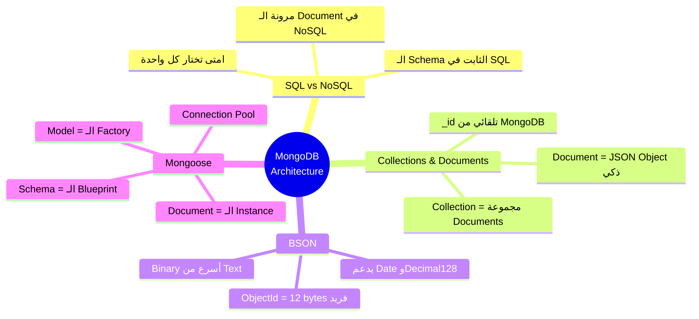
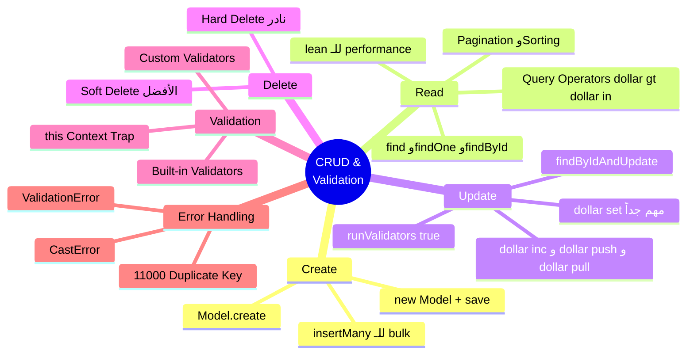

# 🍃 MongoDB & Mongoose — Crash Course & Interview Vault

> **المشروع اللي هنبني عليه الأمثلة:** منصة تجارة إلكترونية — `ShopFlow` — فيها Users، Products، Orders، وReviews. ده مش مشروع خيالي — ده بالظبط اللي هتلاقيه في أي شغل حقيقي.

---

# الفصل 1 — Core & Architecture: ليه MongoDB مش بس "database تانية"؟

> **المتطلبات:** أساسيات JavaScript/Node.js — محتاج تعرف إيه هو الـ Object وإيه هو الـ JSON.

---

## البداية — المشكلة اللي خلّت MongoDB تتعمل

تخيّل معايا إنك سنة 2008 بتبني موقع تجارة إلكترونية. عندك جدول `products` في MySQL. كل product ليه `name`, `price`, `description`. تمام.

بعد شهر، الـ Product Manager بييجيلك ويقولك: "احنا عايزين كل product يكون ليه attributes مختلفة — اللاب توب ليه RAM وCPU، الجاكيت ليه SIZE وCOLOR، الكتاب ليه AUTHOR وISBN." 

في الـ SQL، اللي هيحصل ده:

```sql
-- ❌ الطريقة القديمة — كابوس حقيقي
ALTER TABLE products ADD COLUMN ram VARCHAR(50);      -- ← بس للاب توب
ALTER TABLE products ADD COLUMN cpu VARCHAR(50);      -- ← بس للاب توب
ALTER TABLE products ADD COLUMN size VARCHAR(50);     -- ← بس للملابس
ALTER TABLE products ADD COLUMN author VARCHAR(100);  -- ← بس للكتب
-- النتيجة: جدول فيه 80% null values 😭
```

> بدل ما تكون data structure ثابتة ومؤلمة — إيه لو كل document يحدد شكله هو؟

---

## SQL vs NoSQL — الفلسفة المختلفة من الأساس

> [!abstract] 🧠 المفهوم المعماري
> الـ SQL والـ NoSQL مش بس "طريقتين مختلفتين لتخزين البيانات." ده اختلاف في **فلسفة** التعامل مع البيانات. الـ SQL بيقولك "عرّف شكل الـ data الأول وبعدين اكتب." الـ MongoDB بيقولك "اكتب أي حاجة — هنا الـ schema بتاعك هي الـ application code نفسه."

| | SQL (MySQL/PostgreSQL) | MongoDB (NoSQL) |
|---|---|---|
| هيكل البيانات | جداول وصفوف (Tables & Rows) | Collections وDocuments |
| الـ Schema | ثابت (Rigid) — بتعرّفه في الـ DB | مرن (Flexible) — بتعرّفه في الكود |
| العلاقات | JOIN بين الجداول | Embedding أو References |
| الـ Query Language | SQL — لغة موحدة | MongoDB Query Language (MQL) |
| الـ ACID | Full ACID transactions | Eventually consistent (مع دعم Transactions من v4+) |
| مناسب لـ | بيانات منظمة ومترابطة جداً | بيانات متغيرة الشكل، high write throughput |

> ⚠️ **انتبه:** مفيش "أحسن" بشكل مطلق. الـ interviewer هيحكم عليك من إجابتك على "امتى تختار كل واحدة" — مش "إيهم أحسن."

---

## Collections & Documents — الـ Database بعيون MongoDB

تخيّل الـ MongoDB زي **مخزن كبير فيه أرفف (Collections)**. كل رف مخصص لنوع معين من البيانات — رف للـ Users، رف للـ Products، رف للـ Orders.

على كل رف، فيه **كراتين (Documents)** — وكل كرتون ممكن يكون شكله مختلف عن التاني.

```
┌─────────────────────────────────────────────────────┐
│                  ShopFlow Database                   │
│                                                      │
│  ┌─────────────┐  ┌─────────────┐  ┌─────────────┐  │
│  │   users     │  │  products   │  │   orders    │  │
│  │ Collection  │  │ Collection  │  │ Collection  │  │
│  │ ──────────  │  │ ──────────  │  │ ──────────  │  │
│  │ Document 1  │  │ Document 1  │  │ Document 1  │  │
│  │ Document 2  │  │ Document 2  │  │ Document 2  │  │
│  │ Document 3  │  │ Document 3  │  └─────────────┘  │
│  └─────────────┘  └─────────────┘                   │
└─────────────────────────────────────────────────────┘
```

كل Document ده essentially JavaScript Object — بس متخزن في الـ Database. وده بيخلي الـ MongoDB محبوبة جداً في الـ MERN stack لأن فيه zero مسافة بين الـ data في الكود والـ data في الـ database.

```javascript
// شكل الـ Document في MongoDB — بالظبط زي JavaScript Object
{
  _id: ObjectId("64f8a2b3c1d2e3f4a5b6c7d8"),  // ← MongoDB بتعمله تلقائياً
  name: "Ahmed Hassan",
  email: "ahmed@shopflow.com",
  addresses: [                                   // ← Array! في SQL كان محتاج جدول تاني
    { city: "Cairo", street: "Tahrir Square" },
    { city: "Alex", street: "Corniche" }
  ],
  createdAt: ISODate("2024-01-15T10:30:00Z")
}
```

> [!question] 🎯 سؤال انترفيو مشهور
> **"إيه الفرق بين Collection وTable؟"**
> 
> الـ Table في SQL بيتطلب إن كل row يبقى ليه نفس الـ columns وبنفس الـ data types. لو عايز تضيف column، بتعمل `ALTER TABLE` وده ممكن يبقى خطير على production. الـ Collection في MongoDB مفيهاش قيود زي دي — كل Document جوّاها ممكن يكون ليه structure مختلف تماماً. الـ consistency بتاعتك انت كـ developer مسؤول عنها من خلال الـ application code (أو Mongoose Schema).

---

## BSON vs JSON — اللي بيحصل تحت الـ Hood

ده واحد من أهم الأسئلة اللي الـ Seniors بيسألوها وكتير بيغلط فيها.

> [!abstract] 🧠 المفهوم المعماري
> لما بتتعامل مع MongoDB في الكود، بتشوف **JSON** (JavaScript Object Notation) — حاجة بتقراها وتكتبها بسهولة. بس لما الـ MongoDB بتخزن على الـ disk أو بتبعت على الـ network، بتحوّل الـ JSON لـ **BSON** (Binary JSON).
> 
> ليه؟ عشان BSON:
> - **أسرع في الـ parsing** — الكمبيوتر بيتعامل مع binary أسرع من text
> - **بيدعم data types مش موجودة في JSON** — زي `Date`, `ObjectId`, `Binary`, `Decimal128`
> - **بتعرف size كل field** بسرعة من غير ما تقرأ كل الـ string

```
JSON (الـ Text اللي بتشوفه إنت)          BSON (اللي MongoDB بتخزنه)
─────────────────────────────          ────────────────────────────────
{                                      \x16\x00\x00\x00            ← حجم الـ document
  "name": "Ahmed",         →→→        \x02name\x00\x06\x00\x00\x00Ahmed\x00
  "age": 25                           \x10age\x00\x19\x00\x00\x00
}                                      \x00
                                      (binary — الكمبيوتر بيقراه بسرعة 🚀)
```

**الـ Data Types اللي BSON بيدعمها وJSON لأ:**

| BSON Type | مثال | ليه مهم؟ |
|---|---|---|
| `ObjectId` | `ObjectId("64f8...")` | الـ `_id` الافتراضي — 12 byte فريد عالمياً |
| `Date` | `ISODate("2024-01-15")` | مش string — فعلاً قيمة تاريخ بيعرف يقارن |
| `Int32` / `Int64` | `25` / `2500000000` | JSON مفيهوش فرق بين integers |
| `Decimal128` | `Decimal128("99.99")` | للأسعار — بيتجنب floating point errors |
| `Binary` | `BinData(0, "...")` | للصور أو الملفات |

> [!question] 🎯 سؤال انترفيو مشهور
> **"إيه هو BSON وليه MongoDB بتستخدمه بدل JSON؟"**
> 
> BSON هو Binary JSON — MongoDB بتستخدمه عشان أسرع في الـ parsing والـ storage لأن الكمبيوتر بيتعامل مع binary data أكفأ من text. كمان BSON بيدعم data types مش موجودة في JSON العادي زي `ObjectId`، `Date` كـ real date value مش string، و`Decimal128` للأرقام الدقيقة. الـ Developer بيكتب JSON عادي في كوده، والـ MongoDB driver بيعمل الـ conversion تلقائياً.

> [!question] 🎯 سؤال انترفيو مشهور
> **"إيه هو ObjectId وإزاي MongoDB بتضمن إنه unique؟"**
> 
> الـ `ObjectId` ده 12 bytes مركّب من: **4 bytes timestamp** (ثواني من 1970) + **5 bytes random value** (خاص بالـ machine والـ process) + **3 bytes incrementing counter**. الـ composition ده بيضمن إنه practically impossible يتكرر — حتى لو عندك distributed system على 1000 server. فايدة تانية: لأن الأول 4 bytes هو الـ timestamp، تقدر تعرف الوقت اللي اتعمل فيه الـ document من الـ `_id` نفسه من غير ما يبقى عندك `createdAt` field!

---

## Mongoose Basics — Schema وModel: البوابة بين Node.js والـ MongoDB

الـ MongoDB نفسها schemaless — يعني ممكن تحط أي حاجة في أي collection. بس في production، ده بيبقى كارثة. تخيّل إن developer بعت `price: "خمسين جنيه"` بدل `price: 50` — الـ MongoDB هتقبلها وتخزنها بدون مشكلة 😱

**Mongoose** بييجي يحل المشكلة دي — ده ODM (Object Document Mapper) بيخليك تعرّف الـ schema في الـ JavaScript code، ويتحقق منها قبل ما أي حاجة توصل للـ database.

> [!abstract] 🧠 المفهوم المعماري
> في Mongoose، فيه ثلاث مفاهيم أساسية لازم تفرق بينهم:
> - **Schema**: الـ Blueprint — بيقول "الـ document المفروض يبقى شكله إيه"
> - **Model**: الـ Class — بيقول "الـ Collection دي اسمها إيه وبيتعامل معاها إزاي"
> - **Document**: الـ Instance — الـ object الحقيقي اللي بيمثل record واحد

```javascript
const mongoose = require('mongoose');

// ──────────────────────────────────────────────
// 1️⃣ الـ SCHEMA — بنرسم شكل الـ document
// ──────────────────────────────────────────────
const productSchema = new mongoose.Schema(
  {
    name: {
      type: String,
      required: [true, 'اسم المنتج مطلوب'],  // ← custom error message
      trim: true,                              // ← بيشيل المسافات الزيادة
      maxlength: [100, 'الاسم كبير أوي'],
    },
    price: {
      type: Number,
      required: true,
      min: [0, 'السعر مينفعش يبقى سالب'],
    },
    category: {
      type: String,
      enum: ['electronics', 'clothing', 'books'],  // ← بس القيم دي مسموحة
    },
    attributes: {
      type: Map,          // ← ده اللي بيحل مشكلة الـ SQL اللي اتكلمنا عنها
      of: mongoose.Schema.Types.Mixed,
    },
    inStock: {
      type: Boolean,
      default: true,     // ← لو ماجاش في الـ request، هيبقى true تلقائياً
    },
  },
  {
    timestamps: true,    // ← Mongoose هتضيف createdAt وupdatedAt أوتوماتيك
  }
);

// ──────────────────────────────────────────────
// 2️⃣ الـ MODEL — بنربط الـ schema بالـ Collection
// ──────────────────────────────────────────────
const Product = mongoose.model('Product', productSchema);
// ↑ MongoDB هتعمل collection اسمها 'products' (جمع وlowercase تلقائياً)

// ──────────────────────────────────────────────
// 3️⃣ الـ DOCUMENT — instance حقيقي
// ──────────────────────────────────────────────
const newProduct = new Product({
  name: 'iPhone 15 Pro',
  price: 45000,
  category: 'electronics',
  attributes: new Map([['storage', '256GB'], ['color', 'Titanium']]),
});
// ↑ ده لسه مش اتخزن في الـ DB — بس object في الـ memory
```

> [!example] 🏗️ سيناريو من بيئة العمل (Production Scenario)
> في ShopFlow، لازم كل product يكون ليه اسم ومش ينفع يكون فاضي. الـ `required: [true, 'اسم المنتج مطلوب']` ده بيضمن إنك لو بعتّ request من غير اسم، هيجيك Validation Error **قبل ما تتكلم مع الـ database خالص** — ده بيوفر database round-trip وبيحسّن الـ performance.

---

## الـ Connection — إزاي Mongoose بتتكلم مع MongoDB

```javascript
// config/database.js
const mongoose = require('mongoose');

const connectDB = async () => {
  try {
    const conn = await mongoose.connect(process.env.MONGO_URI, {
      // الـ options دي بقت default من Mongoose v6 لكن خليها explicit
    });
    
    console.log(`✅ MongoDB Connected: ${conn.connection.host}`);
    
    // ── الـ Connection Events ──
    mongoose.connection.on('error', (err) => {
      console.error('❌ MongoDB connection error:', err);
      process.exit(1);  // ← لو الـ DB وقعت، الـ app مش المفروض تفضل شغالة
    });

    mongoose.connection.on('disconnected', () => {
      console.warn('⚠️ MongoDB disconnected — retrying...');
    });

  } catch (error) {
    console.error('❌ Connection failed:', error.message);
    process.exit(1);
  }
};

module.exports = connectDB;
```

> [!abstract] 🧠 المفهوم المعماري — الـ Connection Pool
> لما Mongoose بتعمل connect، مش بتفتح connection واحدة — بتفتح **connection pool** (الـ default هو 5 connections). يعني لو جالك 5 requests في نفس الوقت، كل واحدة هتاخد connection منفصلة وهتشتغل بالـ parallel. لو جه request 6، هينتظر أي connection تخلص. ده بيتحكم فيه بـ `maxPoolSize` option:
> ```javascript
> mongoose.connect(uri, { maxPoolSize: 10 }); // ← زوّد للـ high traffic apps
> ```

> [!question] 🎯 سؤال انترفيو مشهور
> **"إيه الفرق بين Schema وModel في Mongoose؟"**
> 
> الـ Schema هو الـ blueprint — بيعرّف شكل الـ documents (الـ fields، الـ types، الـ validation rules) لكنه مش بيتعامل مع الـ database مباشرة. الـ Model هو الكلاس اللي بيربط الـ schema بـ collection معينة في الـ database — ومنه بتعمل كل الـ operations زي `find()` و`create()` و`updateOne()`. بمعنى آخر، الـ Schema هو الـ blueprint والـ Model هو الـ factory اللي بيستخدم الـ blueprint ده.

---

## 🗺️ خريطة Module 1 كاملة



---

## ✅ Checkpoint — أسئلة إنترفيو Module 1

**س: امتى تختار MongoDB وامتى تختار PostgreSQL؟**
> MongoDB مناسبة لما الـ data structure بتتغير كتير (زي product attributes مختلفة)، أو لما محتاج high write throughput، أو لما الـ data طبيعتها hierarchical (زي nested comments). PostgreSQL مناسبة لما عندك علاقات معقدة بين الـ tables وبتعتمد على JOINs كتير، أو لما محتاج full ACID transactions بشكل strict، أو لما data بتاعتك structured ومش بتتغير. في production كتير بيستخدموا الاتنين مع بعض.

**س: إيه هو ObjectId وإزاي بيضمن uniqueness في distributed system؟**
> الـ ObjectId هو 12 bytes مركّب من: 4 bytes للـ timestamp + 5 bytes للـ machine identifier + 3 bytes لـ incrementing counter. الـ combination ده بيخلي إنشاء نفس الـ ObjectId من مكانين مختلفين practically impossible. ميزة تانية إن ممكن تعرف وقت إنشاء الـ document من الـ `_id` نفسه.

**س: إيه الفرق بين BSON وJSON؟**
> JSON هو text format بيقراه الإنسان بسهولة. BSON هو binary representation أسرع في الـ parsing والـ storage. الأهم من كده إن BSON بيدعم data types مش موجودة في JSON زي `Date` كـ actual date value، `ObjectId`، و`Decimal128`. الـ MongoDB driver بيعمل الـ conversion بينهم تلقائياً.

**س: ليه بنعمل `process.exit(1)` لما الـ DB connection بتفشل؟**
> لأن الـ application مش منطقي تفضل شغالة من غير database connection. لو تركناها تشتغل، هتستقبل requests وتـ crash عليهم بـ unhandled errors أسوأ بكتير. الـ `process.exit(1)` بيقول للـ process manager (زي PM2 أو Docker) إن الـ app انتهت بـ error، فيعيد تشغيلها — وفي المرة دي ربما الـ DB بقت متاحة.

---

## 🫒 زتونة الإنترفيو — Module 1

> **"لما بتسألني عن MongoDB، أنا بفكر فيها كـ paradigm shift مش بس database. الـ SQL بيقولك 'عرّف شكل الـ data الأول، وبعدين اكتب' — وده منطقي لما الـ data منظمة وثابتة زي النظام المحاسبي. MongoDB بتقلب المعادلة — الـ schema موجود في الـ application code عن طريق Mongoose. الـ data بتتخزن كـ BSON بدل JSON عشان الـ binary أسرع وبيدعم types زي ObjectId وDate الحقيقية. الـ ObjectId مش مجرد random number — هو timestamp + machine identifier + counter بيضمن uniqueness في أي distributed system. واللي بيربط كل ده ببعض هو Mongoose اللي بيعمل ODM layer — بيمنع أي data مش متوافقة مع الـ schema من إنها توصل الـ database أصلاً."**

---
---

# الفصل 2 — CRUD & Validation Mastery: بقى تعرف تتكلم مع الـ DB صح

> **المتطلبات:** [[الفصل 1]] — محتاج تبقى عارف Schema وModel عشان الـ CRUD هيبقى ببساطة "تطبيق عليهم."

---

## البداية — فيه أكتر من طريقة لكل عملية

كل developer بيبدأ يتعلم `save()`, `find()`, `findById()` — وبيفضل يستخدمهم في كل حاجة. وبعدين يوم من الأيام بيلاقي إن الـ app بطيئة، الـ queries مش كفؤة، والـ validation errors بتوصل للـ database.

دايماً المشكلة مش في "مش عارف يعمل CRUD" — المشكلة في إنه مش عارف **الفرق بين الـ methods المختلفة** وامتى يستخدم كل واحدة.

---

## Create — الفرق بين `save()` و`create()` و`insertMany()`

**الطريقة الأولى: `new Model() + save()`**

```javascript
// 🏗️ ShopFlow: إنشاء Product جديد
const createProduct = async (productData) => {
  // ← بنعمل instance الأول
  const product = new Product({
    name: productData.name,
    price: productData.price,
    category: productData.category,
  });

  // ← هنا الـ Mongoose Middleware بيشتغل (pre-save hooks)
  // ← وبعدين الـ validation
  // ← وبعدين الـ save للـ DB
  const savedProduct = await product.save();
  return savedProduct;
};
```

**الطريقة التانية: `Model.create()`**

```javascript
// ← نفس النتيجة، كود أقل
const product = await Product.create({
  name: 'MacBook Pro',
  price: 85000,
  category: 'electronics',
});
// ⚠️ انتبه: create() بيشغّل الـ pre-save middleware كمان
```

**الطريقة التالتة: `Model.insertMany()`**

```javascript
// ← للـ bulk insert — أسرع بكتير من create() لكل document على حدة
const products = await Product.insertMany([
  { name: 'iPhone 15', price: 42000, category: 'electronics' },
  { name: 'Samsung S24', price: 38000, category: 'electronics' },
  { name: 'iPad Pro', price: 55000, category: 'electronics' },
], { ordered: false }); // ← ordered: false يعني لو document واحد فشل، الباقي بيكملوا
```

> [!abstract] 🧠 المفهوم المعماري
> الفرق الجوهري: `save()` بيشغّل **كل الـ Mongoose Middleware** (pre-save, post-save, etc.) وكل الـ Validations. `insertMany()` بيـ**bypass الـ Mongoose Middleware** وبيكون أسرع بكتير للـ bulk operations، لكن انتبه إن الـ validation بيشتغل بس إنت مش محتاج الـ middleware.

---

## Read — الفرق بين الـ methods واللي بيرجعه كل واحدة

```javascript
// ── 1. find() — بيرجع Array دايماً ──
const allProducts = await Product.find(); // ← كل الـ documents
const electronics = await Product.find({ category: 'electronics' }); // ← filtered

// ── 2. findOne() — بيرجع Document واحد أو null ──
const product = await Product.findOne({ name: 'iPhone 15 Pro' });

// ── 3. findById() — shorthand لـ findOne({ _id: id }) ──
const product = await Product.findById('64f8a2b3c1d2e3f4a5b6c7d8');

// ── 4. Query Operators — الـ Power الحقيقية ──
const expensiveProducts = await Product.find({
  price: { $gt: 10000, $lt: 100000 },   // ← greater than 10k, less than 100k
  category: { $in: ['electronics', 'books'] },  // ← في الـ list دي
  inStock: true,
});

// ── 5. Projection — اختار الـ fields اللي تجيبها بس ──
const productNames = await Product.find(
  { category: 'electronics' },
  { name: 1, price: 1, _id: 0 }  // ← 1 = اجيب، 0 = ماتجيبش
);

// ── 6. Chaining — القوة الحقيقية ──
const result = await Product
  .find({ inStock: true })
  .select('name price category')   // ← projection بـ chaining
  .sort({ price: -1 })             // ← ترتيب تنازلي
  .skip(20)                        // ← pagination: تخطى أول 20
  .limit(10)                       // ← جيب 10 بس
  .lean();                         // ← 🔥 بيرجع plain object بدل Mongoose Document
```

> [!abstract] 🧠 المفهوم المعماري — `.lean()` السر اللي كتير مش بيعرفوه
> لما بتعمل `find()` عادي، الـ Mongoose بيرجعلك **Mongoose Documents** — objects كبيرة فيها كل الـ methods زي `.save()` و`.toObject()` والـ prototype chain الطويل. ده بياكل memory وبيكون أبطأ.
>
> لما تضيف `.lean()`، بيرجعلك **plain JavaScript objects** — أخف بكتير (ممكن 5-10x أسرع في القراءة). الـ tradeoff إنك مش تقدر تعمل `.save()` على النتيجة دي. **استخدمه دايماً في الـ GET requests اللي مش هتعدّل بعدها.**

> [!example] 🏗️ سيناريو من بيئة العمل (Production Scenario)
> في ShopFlow، عندنا endpoint `/api/products` بتجيب قائمة المنتجات. الـ users بيفتحوا الـ page دي مئات المرات في الدقيقة. الفرق بين `find()` عادي و`find().lean()` هنا ممكن يكون بين 200ms و30ms response time. في production ده الفرق بين موقع سريع وموقع بيخسر customers.

---

## Update — فهم الفرق بين الـ Methods وتجنب الـ Traps

> ⚠️ **انتبه:** ده أكتر جزء بيغلط فيه الـ Juniors!

```javascript
// ──────────────────────────────────────────────
// ❌ الغلط الشائع رقم 1: استخدام findById ثم save
// ──────────────────────────────────────────────
const product = await Product.findById(id);
product.price = 50000;
await product.save(); // ← بيعمل READ ثم WRITE — رحلتان للـ DB!

// ──────────────────────────────────────────────
// ✅ الصح: استخدام findByIdAndUpdate لعملية واحدة
// ──────────────────────────────────────────────
const updatedProduct = await Product.findByIdAndUpdate(
  id,
  { $set: { price: 50000, inStock: true } },  // ← بنستخدم $set مش بنبعت الـ object كله
  {
    new: true,      // ← بيرجع الـ document بعد التعديل مش قبله
    runValidators: true,  // ← 🔥 مهم جداً — بيشغّل الـ Schema validation على الـ update
  }
);
```

> [!abstract] 🧠 المفهوم المعماري — `$set` vs بدونه
> لو عملت `updateOne(filter, { price: 50000 })` بدون `$set`، MongoDB هتـ**replace الـ document كله** بـ `{ price: 50000 }` وتمسح كل الـ fields التانية! 😱
> 
> `$set` بيقول "عدّل الـ fields دي بس وسيب الباقي." دايماً استخدم `$set` في الـ updates إلا لو قصدك تبدّل الـ document كله.

**Update Operators المهمة:**

```javascript
// $inc — زيادة قيمة رقمية
await Product.findByIdAndUpdate(id, {
  $inc: { viewCount: 1, stock: -1 }  // ← زوّد viewCount بـ 1، ونقّص stock بـ 1
});

// $push — إضافة element لـ array
await User.findByIdAndUpdate(userId, {
  $push: { wishlist: productId }  // ← أضف productId لـ wishlist array
});

// $pull — حذف element من array
await User.findByIdAndUpdate(userId, {
  $pull: { wishlist: productId }  // ← شيل productId من الـ wishlist
});

// $addToSet — إضافة بس لو مش موجود (بيتجنب duplicates)
await User.findByIdAndUpdate(userId, {
  $addToSet: { favorites: productId }  // ← مش هيتضاف لو موجود خالص
});
```

---

## Delete — إيه اللي بيحصل للـ related data؟

```javascript
// ── soft delete vs hard delete ──

// Hard Delete — بيمسح من الـ DB فعلاً ❌ (في production نادراً بنعمله)
await Product.findByIdAndDelete(id);

// Soft Delete ✅ — الـ best practice في production
// بنضيف isDeleted field ونحدّثه بدل ما نمسح
await Product.findByIdAndUpdate(id, {
  $set: { 
    isDeleted: true, 
    deletedAt: new Date() 
  }
});

// وبعدين في كل query بنحط condition
const products = await Product.find({ isDeleted: { $ne: true } });
```

> [!example] 🏗️ سيناريو من بيئة العمل (Production Scenario)
> في ShopFlow، لو user عمل order على product، ومسحنا الـ product من الـ DB، الـ order هتبقى reference لـ document مش موجود — ده data corruption. الـ soft delete بيحل المشكلة دي: الـ product "محذوف" من ناحية الـ user، لكن موجود في الـ DB والـ old orders لسه تقدر تشوفه.

---

## Validation Mastery — الـ Mongoose بيحمي الـ DB قبلك

> [!abstract] 🧠 المفهوم المعماري
> الـ Mongoose Validation بيشتغل في **layer منفصلة** قبل ما الـ query توصل للـ MongoDB. ده معناه إن الـ invalid data بتتوقف في الـ application layer — بدون network round-trip للـ DB. أسرع وأأمن.

```javascript
const userSchema = new mongoose.Schema({
  name: {
    type: String,
    required: [true, 'الاسم مطلوب'],
    minlength: [2, 'الاسم لازم يبقى حرفين على الأقل'],
    maxlength: [50, 'الاسم كبير أوي'],
    trim: true,
  },
  email: {
    type: String,
    required: [true, 'الإيميل مطلوب'],
    unique: true,                               // ← بيعمل index في الـ DB
    lowercase: true,                            // ← بيحوّل تلقائياً للـ lowercase
    validate: {
      validator: function(v) {
        return /^[^\s@]+@[^\s@]+\.[^\s@]+$/.test(v);  // ← custom regex
      },
      message: 'الإيميل مش صحيح',
    },
  },
  age: {
    type: Number,
    min: [18, 'لازم تبقى فوق 18 سنة'],
    max: [120, 'السن مش منطقي 😄'],
  },
  role: {
    type: String,
    enum: {
      values: ['user', 'admin', 'seller'],
      message: '{VALUE} مش role صحيح',  // ← {VALUE} بيتحط فيها القيمة الغلط
    },
    default: 'user',
  },
});
```

### Custom Validators للـ Business Logic المعقدة

```javascript
// مثال: التحقق إن start date قبل end date
const promoSchema = new mongoose.Schema({
  startDate: Date,
  endDate: {
    type: Date,
    validate: {
      validator: function(v) {
        return v > this.startDate;  // ← this هنا هو الـ document نفسه
      },
      message: 'تاريخ الانتهاء لازم يكون بعد تاريخ البداية',
    },
  },
});
```

> ⚠️ **انتبه:** الـ `this` في الـ custom validator بيشاور على الـ document بس في حالة الـ `save()` الأول. في الـ `update operations` الـ `this` بيشاور على الـ Query مش الـ document — ده trap شايل كتير!

---

## Handling Errors — الـ Error Codes اللي لازم تحفظها

الـ MongoDB بتـ throw errors بـ codes مخصصة. لو مش بتتعامل معاها صح، هيوصل للـ client error 500 generic مش مفيد.

```javascript
// middleware/errorHandler.js
const handleMongoErrors = (err) => {
  // ── Error 11000: Duplicate Key ──
  if (err.code === 11000) {
    const field = Object.keys(err.keyValue)[0];
    const value = err.keyValue[field];
    return {
      statusCode: 409,
      message: `الـ ${field} "${value}" موجود بالفعل`,
    };
  }

  // ── Validation Error ──
  if (err.name === 'ValidationError') {
    const messages = Object.values(err.errors).map(e => e.message);
    return {
      statusCode: 400,
      message: messages.join(', '),
    };
  }

  // ── CastError: ID مش صحيح ──
  if (err.name === 'CastError') {
    return {
      statusCode: 400,
      message: `الـ ID "${err.value}" مش صحيح`,
    };
  }

  // ── Default ──
  return {
    statusCode: 500,
    message: 'حدث خطأ في الخادم',
  };
};

// في الـ Express error middleware
app.use((err, req, res, next) => {
  const { statusCode, message } = handleMongoErrors(err);
  res.status(statusCode).json({ success: false, message });
});
```

> [!example] 🏗️ سيناريو من بيئة العمل (Production Scenario)
> في ShopFlow، لما user بيحاول يسجّل بإيميل موجود بالفعل، الـ MongoDB بتـ throw error code `11000`. لو مش بنعالجوه، هيوصل للـ user كـ "Internal Server Error" وده unprofessional وبيكشف details عن الـ DB. الكود فوق بيحوّله لـ "الإيميل موجود بالفعل" - رسالة واضحة للـ user ومش بتكشف معلومات حساسة.

> [!question] 🎯 سؤال انترفيو مشهور
> **"إيه هو الـ Error Code 11000 في MongoDB وإزاي بتتعامل معاه؟"**
> 
> الـ 11000 هو `DuplicateKeyError` — بيحصل لما بتحاول تخزن document بقيمة في field معمول عليه `unique: true` وهي موجودة بالفعل. الـ Mongoose بيـ throw الـ error ده من الـ MongoDB وبيتضمن فيه `keyValue` object بيبين الـ field والـ value اللي تكررت. بتتعامل معاه في الـ error middleware عن طريق check على `err.code === 11000` وبعدين ترد برسالة مفهومة بدل الـ 500 error.

> [!question] 🎯 سؤال انترفيو مشهور
> **"إيه الفرق بين `findByIdAndUpdate` مع وبدون `runValidators: true`؟"**
> 
> بدون `runValidators: true`، الـ Mongoose بيبعت الـ update للـ MongoDB مباشرة من غير ما يشغّل الـ schema validation. ده معناه ممكن تـ update الـ price بـ `-1000` حتى لو عندك `min: 0` في الـ schema. لما تضيف `runValidators: true`، الـ Mongoose بيشغّل الـ validators الأول وبيـ block الـ update لو فيه مشكلة. الـ default هو `false` للأسف، وده تصميم decision جدلي في Mongoose — لازم تضيفه يدوياً.

---

## Advanced Queries — الـ Query Builder Pattern

```javascript
// 🏗️ ShopFlow: بناء search endpoint مرن
const getProducts = async (queryParams) => {
  const { 
    keyword, 
    category, 
    minPrice, 
    maxPrice, 
    sortBy = 'createdAt',
    order = 'desc',
    page = 1, 
    limit = 12 
  } = queryParams;

  // بنبني الـ filter object تدريجياً
  const filter = { isDeleted: { $ne: true } };

  // لو في keyword، بنستخدم Regex للـ search (في production نستخدم Atlas Search)
  if (keyword) {
    filter.$or = [
      { name: { $regex: keyword, $options: 'i' } },      // ← i = case insensitive
      { description: { $regex: keyword, $options: 'i' } },
    ];
  }

  if (category) filter.category = category;
  
  if (minPrice || maxPrice) {
    filter.price = {};
    if (minPrice) filter.price.$gte = Number(minPrice);
    if (maxPrice) filter.price.$lte = Number(maxPrice);
  }

  // الـ Pagination
  const skip = (Number(page) - 1) * Number(limit);
  const sortOrder = order === 'asc' ? 1 : -1;

  // بنعمل الـ queries بالـ parallel عشان أسرع
  const [products, total] = await Promise.all([
    Product.find(filter)
      .select('name price category images inStock')
      .sort({ [sortBy]: sortOrder })
      .skip(skip)
      .limit(Number(limit))
      .lean(),  // ← دايماً في الـ GET requests
    Product.countDocuments(filter),  // ← للـ pagination metadata
  ]);

  return {
    products,
    pagination: {
      total,
      page: Number(page),
      pages: Math.ceil(total / Number(limit)),
      limit: Number(limit),
    },
  };
};
```

> **نصيحة الخبراء:** استخدام `Promise.all` لعمل الـ query والـ count في نفس الوقت بدل `await` لكل واحدة على حدة بيقلل الـ response time بشكل ملحوظ — الاتنين بيشتغلوا بالـ parallel.

---

## 🗺️ خريطة Module 2 كاملة



---

## ✅ Checkpoint — أسئلة إنترفيو Module 2

**س: إيه الفرق بين `save()` و`findByIdAndUpdate()`؟**
> `save()` بيعمل READ للـ document الأول من الـ DB ثم بيعمل WRITE — رحلتان. بيشغّل كل الـ middleware (pre-save, post-save) وكل الـ validators تلقائياً. `findByIdAndUpdate()` بيعمل الـ update في رحلة واحدة — أسرع. لكن بـ default مش بيشغّل الـ validators، ومحتاج تضيف `runValidators: true` يدوياً.

**س: إيه `.lean()` وامتى بتستخدمه؟**
> `.lean()` بيخلي Mongoose يرجع plain JavaScript objects بدل Mongoose Document instances. الـ Mongoose Documents كبيرة في الـ memory لأنها بتتضمن كل الـ methods والـ prototype chain. الـ plain objects أخف وأسرع. بستخدم `.lean()` في كل قراءة مش محتاج بعدها أعمل `.save()` على النتيجة — يعني عملياً في كل GET request.

**س: إيه هو الفرق بين `$set` وبدونه في الـ update؟**
> من غير `$set`، لو بعتّ `updateOne(filter, { price: 50 })`، MongoDB هتـ replace الـ document كله بـ `{ price: 50 }` وتمسح كل الـ fields الأخرى. مع `$set`، بتقول "عدّل الـ fields دي بس وسيب الباقي." دايماً استخدم `$set` إلا لو قصدك تبدّل كل الـ document.

**س: إزاي بتعمل pagination في MongoDB؟**
> بستخدم `.skip()` و`.limit()`. الـ `skip` بيتحسب من `(page - 1) * limit`. بعمل `Promise.all` مع `countDocuments()` في نفس الوقت عشان أجيب الـ total count للـ pagination metadata. في datasets كبيرة جداً، الـ `skip()` بيبقى بطيء وبنلجأ لـ cursor-based pagination.

**س: إيه أكبر غلطة الـ Juniors في الـ Validation؟**
> أكبر غلطة هي الـ اعتقاد إن الـ Schema validation بتشتغل تلقائياً في الـ update operations. هي بتشتغل في `save()` بس. في `findByIdAndUpdate()` لازم تضيف `runValidators: true` يدوياً وإلا ممكن يتخزن data مخالف للـ schema. غلطة تانية شائعة هي عدم معالجة error code `11000` وتركه يوصل للـ client كـ 500 error.

---

## 🛠️ Practical Exercise — بناء Product Service كامل

### Task 1 — Setup

```bash
npm init -y
npm install mongoose express dotenv
```

ابدأ بكتابة `productSchema` فيه: `name`, `price`, `category`, `inStock`, `viewCount`.

---

### Task 2 — الـ CRUD Functions

اكتب الـ functions دي:
1. `createProduct(data)` — بتشغّل الـ validation وترجع الـ document الجديد
2. `getProducts({ page, limit, category })` — مع pagination وlean()
3. `updateProductPrice(id, newPrice)` — مع `runValidators: true`
4. `softDeleteProduct(id)` — بتحط `isDeleted: true`

---

### Task 3 — الـ Error Handler

اكتب `errorHandler middleware` بيتعامل مع:
- `11000 DuplicateKey` → 409 مع رسالة واضحة
- `ValidationError` → 400 مع كل الـ messages
- `CastError` → 400 "ID مش صحيح"

| الملف | السؤال اللي يفكر فيه |
|---|---|
| `productService.js` | ليه `Promise.all` أسرع من `await` لكل query؟ |
| `errorHandler.js` | إيه اللي هيحصل لو ما عملتش الـ `CastError` handling؟ |

---

## 🫒 زتونة الإنترفيو — Module 2

> **"لما بتسألني عن CRUD في Mongoose، أول حاجة بتيجي في بالي هي إن مش كل الـ methods بتشتغل نفس الطريقة. `save()` بيعمل رحلتين للـ DB وبيشغّل كل الـ middleware والـ validators — مناسب لما محتاج الـ hooks. `findByIdAndUpdate()` بيعمل رحلة واحدة أسرع، لكن لازم تضيف `runValidators: true` بنفسك وإلا الـ schema validation مش هتشتغل. في الـ reads، `.lean()` بيقلل الـ memory وبيزود الـ speed لأنه بيرجع plain objects بدل Mongoose Documents. والـ Error Handling لازم يتعامل مع `11000` للـ duplicates، `ValidationError` للـ invalid data، و`CastError` للـ invalid IDs — وده بيفرق بين app professional وapp بترمي 500 على كل حاجة."**

---
---

*الجزء ده دسم، انسخ اللي فات في أوبسيديان وقولي "كمل" عشان أصبلك موديول 3 و 4 بأقصى عمق* 🚀
