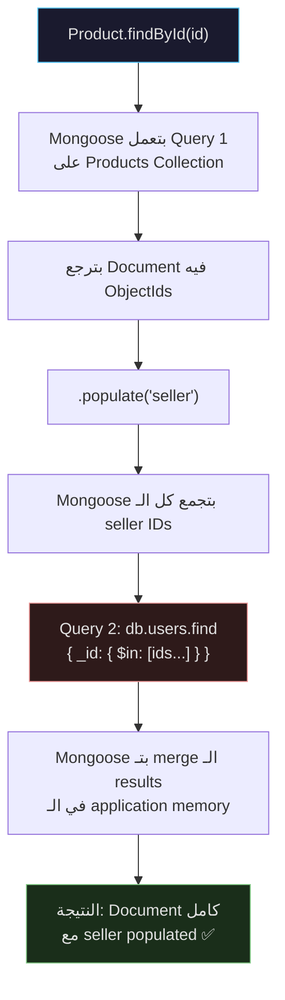
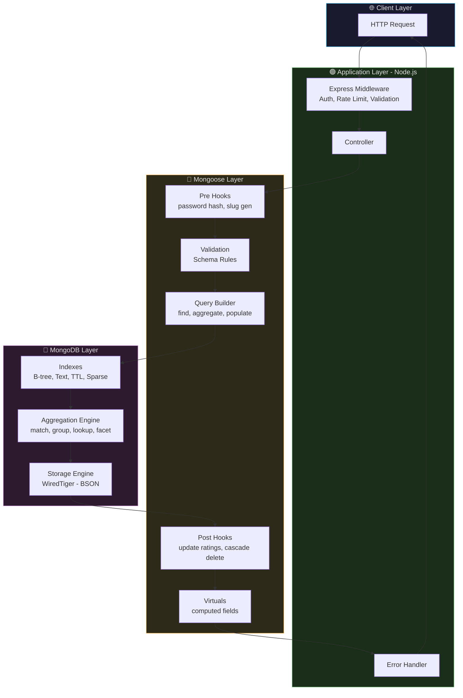
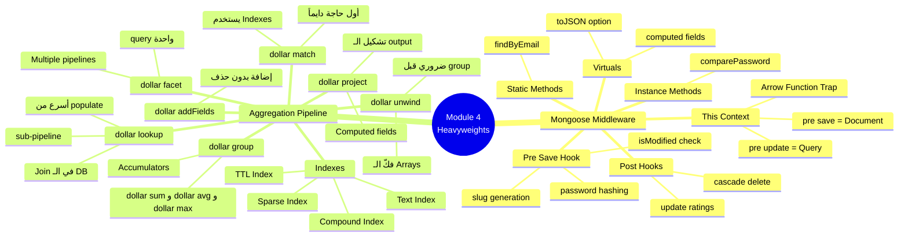
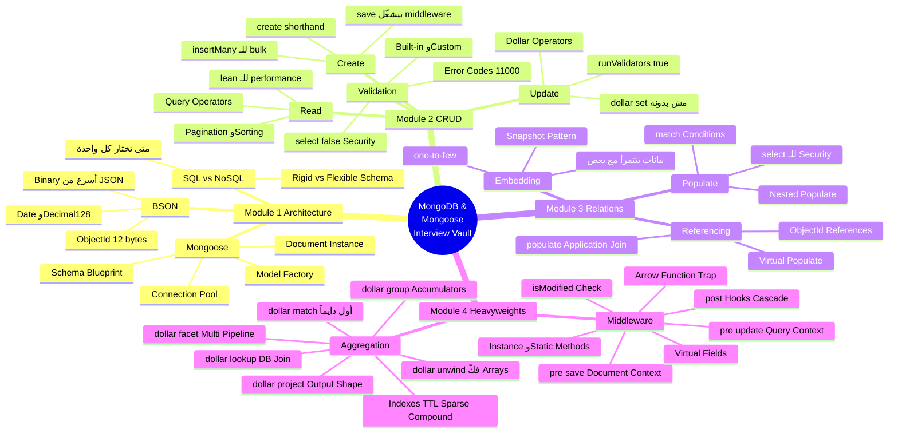

# 🍃 MongoDB & Mongoose — Crash Course & Interview Vault
# الجزء التاني — Module 3 & 4: الثقال الحقيقيين

> **المشروع:** ShopFlow — منصة تجارة إلكترونية — Users، Products، Orders، Reviews، Categories.
> ده الجزء اللي بيفرق بين Junior بيكتب queries وSenior بيفهم ازاي الـ database بتفكر.

---

# الفصل 3 — Relational NoSQL: ازاي تربط الـ Documents ببعض من غير ما تتجنن

> **المتطلبات:** [[الفصل 2]] — لازم تبقى فاهم الـ CRUD وValidation كويس، لأن الـ populate هيبقى في الأساس قراءة + join في الـ application layer.

---

## البداية — المشكلة اللي خلّت كل حاجة تتعقد

تخيّل معايا إنك بتبني ShopFlow والـ Product Schema بتاعك شكله كده:

```javascript
// ❌ الطريقة السذاجة — Embedded كل حاجة جوا بعض
{
  _id: "prod_001",
  name: "iPhone 15 Pro",
  price: 45000,
  seller: {
    name: "Ahmed Hassan",
    email: "ahmed@shopflow.com",
    phone: "01012345678",
    // ... 20 field تاني
  },
  reviews: [
    {
      user: { name: "Mohamed Ali", email: "..." },
      rating: 5,
      comment: "ممتاز",
    },
    // ... ممكن يكون فيه 500 review!
  ]
}
```

المشكلة مش واحدة — دي كارثة كاملة:

- لو Ahmed غيّر إيميله، هتعدّل إيميله في كل product باعه — ممكن يكون 1000 product
- لو product عنده 10,000 review، كل مرة بتجيب الـ product بتجيب الـ 10,000 review معاه حتى لو مش محتاجهم
- الـ document ممكن يتعدى الـ 16MB limit بتاعة MongoDB

> بدل ما نـ duplicate البيانات — نـ reference بيها، وبعدين نـ populate لما نحتاجها بالظبط.

---

## المفهوم الأساسي — Embedding vs Referencing

> [!abstract] 🧠 المفهوم المعماري
> في MongoDB، عندك قرارين لما بيبقى عندك related data:
> 
> **Embedding (التضمين):** بتحط الـ data جوا الـ document نفسه — زي عنوان الـ user جوا الـ User document.
> 
> **Referencing (الـ Reference):** بتحط الـ `_id` بس وبتـ fetch الـ data الكاملة لما تحتاجها — زي الـ SQL foreign key بالظبط.
> 
> القرار ده مش تقني بحت — ده **data modeling decision** بيعتمد على access patterns.

```
┌─────────────────────────────────────────────────────────────────┐
│                    متى تستخدم إيه؟                               │
│                                                                  │
│  EMBEDDING ✅ لما:                  REFERENCING ✅ لما:          │
│  • البيانات بتتقرأ مع بعض دايماً  • البيانات ليها existence     │
│  • علاقة one-to-few (1 to <10)     مستقلة                       │
│  • البيانات مش بتتغير كتير         • علاقة one-to-many          │
│  • مثال: عناوين الـ User           • many-to-many               │
│    (max 5-10 addresses)            • البيانات بتتحدث كتير        │
│                                    • محتاج query البيانات        │
│                                    بشكل مستقل                    │
│                                    • مثال: Reviews للـ Product   │
└─────────────────────────────────────────────────────────────────┘
```

---

## الـ Schemas الكاملة لـ ShopFlow — عشان نبني فوقيها

```javascript
// models/Category.js
const categorySchema = new mongoose.Schema({
  name: { type: String, required: true, unique: true, trim: true },
  slug: { type: String, required: true, unique: true, lowercase: true },
  description: String,
  image: String,
  parent: {
    type: mongoose.Schema.Types.ObjectId,
    ref: 'Category',          // ← self-referencing! فئة جوا فئة
    default: null,
  },
}, { timestamps: true });

// models/User.js
const userSchema = new mongoose.Schema({
  name: { type: String, required: true },
  email: { type: String, required: true, unique: true, lowercase: true },
  password: { type: String, required: true, select: false }, // ← مش بتيجي في الـ queries تلقائياً
  role: { type: String, enum: ['user', 'seller', 'admin'], default: 'user' },
  avatar: String,
  addresses: [                        // ← Embedded! عشان بتتقرأ مع الـ user دايماً
    {
      label: String,                  // 'البيت', 'الشغل'
      street: String,
      city: String,
      isDefault: { type: Boolean, default: false },
    }
  ],
  wishlist: [{
    type: mongoose.Schema.Types.ObjectId,
    ref: 'Product',                   // ← Referenced! عشان ممكن تبقى كبيرة
  }],
}, { timestamps: true });

// models/Product.js
const productSchema = new mongoose.Schema({
  name: { type: String, required: true, trim: true },
  slug: { type: String, unique: true },
  description: String,
  price: { type: Number, required: true, min: 0 },
  comparePrice: Number,               // ← السعر الأصلي قبل الخصم
  images: [String],
  category: {
    type: mongoose.Schema.Types.ObjectId,
    ref: 'Category',                  // ← Reference
    required: true,
  },
  seller: {
    type: mongoose.Schema.Types.ObjectId,
    ref: 'User',                      // ← Reference
    required: true,
  },
  ratings: {
    average: { type: Number, default: 0, min: 0, max: 5 },
    count: { type: Number, default: 0 },
  },
  stock: { type: Number, default: 0 },
  attributes: { type: Map, of: mongoose.Schema.Types.Mixed },
  isActive: { type: Boolean, default: true },
}, { timestamps: true });

// models/Review.js
const reviewSchema = new mongoose.Schema({
  product: {
    type: mongoose.Schema.Types.ObjectId,
    ref: 'Product',
    required: true,
  },
  user: {
    type: mongoose.Schema.Types.ObjectId,
    ref: 'User',
    required: true,
  },
  rating: { type: Number, required: true, min: 1, max: 5 },
  title: String,
  comment: { type: String, required: true },
  isVerifiedPurchase: { type: Boolean, default: false },
}, { timestamps: true });

// models/Order.js
const orderItemSchema = new mongoose.Schema({
  product: {
    type: mongoose.Schema.Types.ObjectId,
    ref: 'Product',
    required: true,
  },
  name: String,       // ← snapshot! بنحفظ اسم المنتج وقت الشراء
  price: Number,      // ← snapshot! بنحفظ السعر وقت الشراء
  quantity: { type: Number, required: true, min: 1 },
  image: String,
});

const orderSchema = new mongoose.Schema({
  user: {
    type: mongoose.Schema.Types.ObjectId,
    ref: 'User',
    required: true,
  },
  items: [orderItemSchema],            // ← Embedded order items
  shippingAddress: {                   // ← Embedded snapshot من عنوان الـ user
    street: String,
    city: String,
  },
  totalPrice: { type: Number, required: true },
  status: {
    type: String,
    enum: ['pending', 'processing', 'shipped', 'delivered', 'cancelled'],
    default: 'pending',
  },
  paymentResult: {
    id: String,
    status: String,
    updateTime: String,
  },
}, { timestamps: true });
```

> [!abstract] 🧠 المفهوم المعماري — الـ Snapshot Pattern
> لاحظ في الـ Order إن بنحفظ `name` و`price` جوا الـ order item بجانب الـ reference. ده اسمه **Snapshot Pattern** — وهو من أهم الـ patterns في الـ e-commerce. السبب: لو غيّرت سعر الـ iPhone بكره، الـ orders القديمة المفروض تفضل بالسعر القديم اللي اشترى بيه الـ customer فعلاً. لو كنت بس شايل reference، كل مرة تعمل populate هتجيب السعر الجديد وده خطأ مالي وقانوني.

---

## `.populate()` — الـ Join بتاع MongoDB

> [!abstract] 🧠 المفهوم المعماري — ده أهم حاجة في الفصل ده
> الـ SQL بيعمل JOIN في الـ database نفسها — operation واحدة بتيجي بالـ data المتجمعة.
> 
> الـ Mongoose `.populate()` بيشتغل **بشكل مختلف تماماً من تحت:**
> 1. بيعمل Query الأول ويجيب الـ documents مع الـ ObjectIds
> 2. بيجمع كل الـ unique ObjectIds 
> 3. بيعمل Query **تانية منفصلة** (`$in` query) على الـ collection التانية
> 4. بيـ merge الـ results في الـ application memory
> 
> ده معناه populate = **2 queries (أو أكتر)** — مش query واحدة!

```javascript
// ── Basic Populate ──
const product = await Product
  .findById(productId)
  .populate('seller')     // ← بيجيب كل fields الـ seller
  .populate('category');  // ← بيجيب كل fields الـ category

/*
النتيجة:
{
  _id: "prod_001",
  name: "iPhone 15 Pro",
  seller: {               ← مش ObjectId تاني — ده الـ User document كامل
    _id: "user_001",
    name: "Ahmed Hassan",
    email: "ahmed@shopflow.com",
    password: "...",       ← مشكلة! الـ password بييجي!
    role: "seller",
    ...
  },
  category: { ... }
}
*/
```

### Populate مع Select — بس الـ Fields اللي محتاجها

```javascript
// ✅ الصح — بنحدد بالظبط إيه اللي محتاجه
const product = await Product
  .findById(productId)
  .populate({
    path: 'seller',
    select: 'name email avatar',    // ← اختار الـ fields
  })
  .populate({
    path: 'category',
    select: 'name slug',
  });

/*
النتيجة:
{
  seller: {
    _id: "user_001",
    name: "Ahmed Hassan",           // ← بس الـ fields اللي طلبناها
    email: "ahmed@shopflow.com",
    avatar: "url..."
    // password مش موجود ✅
  }
}
*/
```

> [!example] 🏗️ سيناريو من بيئة العمل (Production Scenario)
> في ShopFlow، لما بنجيب product details للـ product page، الـ frontend محتاج:
> - اسم وصورة الـ seller (مش الـ password وcreatedAt والـ addresses)
> - اسم وـ slug الـ category (مش الـ description والـ parent)
> 
> من غير `select`، هنبعت بيانات زيادة على الـ network بتبطّى الـ response وممكن تكشف sensitive data. الـ projection هنا مش اختياري — ده security requirement.

---

## Nested Populate — الموضوع بيتعقد

تخيّل عايز تجيب الـ reviews لـ product وفي كل review تجيب اسم الـ user اللي كتبها:

```javascript
// المشكلة: review فيه reference لـ user — محتاج populate جوا populate
const reviews = await Review
  .find({ product: productId })
  .populate({
    path: 'user',
    select: 'name avatar',
  })
  .sort({ createdAt: -1 })
  .limit(10)
  .lean();

/*
النتيجة:
[
  {
    _id: "rev_001",
    rating: 5,
    comment: "منتج ممتاز",
    user: {                   // ← populated!
      _id: "user_001",
      name: "Mohamed Ali",
      avatar: "url..."
    }
  }
]
*/
```

**الـ Nested Populate الحقيقي — populate داخل populate:**

```javascript
// مثال: جيب الـ Orders مع Products ومع Categories للـ Products دي
const orders = await Order
  .find({ user: userId })
  .populate({
    path: 'items.product',        // ← populate الـ product جوا الـ items array
    select: 'name images price category',
    populate: {                   // ← nested populate: جيب category الـ product
      path: 'category',
      select: 'name slug',
    },
  })
  .populate({
    path: 'user',
    select: 'name email',
  })
  .lean();
```

> ⚠️ **انتبه — الـ Nested Populate Trap:**
> كل مستوى من الـ nested populate بيضيف query جديدة. لو عندك:
> - Query 1: جيب الـ orders
> - Query 2: جيب الـ products (populate)
> - Query 3: جيب الـ categories (nested populate)
> 
> ده 3 database round-trips للـ request الواحد. لو عندك traffic عالي، ده ممكن يبقى bottleneck. البديل في الحالات دي: **Aggregation Pipeline** (هنشوفه في Module 4).

---

## الـ Virtual Populate — من غير ما تخزن reference في الـ Document

> [!abstract] 🧠 المفهوم المعماري — ده من أذكى الـ patterns في Mongoose
> في الـ Referencing العادي، الـ parent بيشيل reference للـ children. مثلاً الـ Product بيشيل `seller: ObjectId`.
> 
> لكن تخيّل إنك عايز تجيب "كل الـ reviews الخاصة بـ Product" — الـ Review هو اللي شايل `product: ObjectId` مش العكس. يعني مفيش field في الـ Product بيقولك "الـ reviews بتاعتي هي دي."
> 
> الـ Virtual Populate بيحل ده — بيضيف virtual field على الـ parent بيعمل reverse lookup من غير ما تخزن أي حاجة زيادة في الـ document.

```javascript
// في productSchema — بعد تعريف الـ schema وقبل الـ model
productSchema.virtual('reviews', {
  ref: 'Review',              // ← الـ model اللي هنجيب منه
  localField: '_id',          // ← الـ field في الـ Product
  foreignField: 'product',   // ← الـ field في الـ Review اللي بيشاور على الـ Product
  justOne: false,             // ← false = Array، true = object واحد
  // count: true,             // ← لو عايز بس count مش الـ documents نفسها
});

// لازم تضيف الـ option دي عشان الـ virtuals تيجي في الـ toJSON
productSchema.set('toJSON', { virtuals: true });
productSchema.set('toObject', { virtuals: true });

// ── الاستخدام ──
const product = await Product
  .findById(productId)
  .populate({
    path: 'reviews',          // ← virtual field — مش موجود في الـ DB!
    select: 'rating comment user createdAt',
    populate: {
      path: 'user',
      select: 'name avatar',
    },
    options: {
      sort: { createdAt: -1 },
      limit: 5,               // ← جيب آخر 5 reviews بس
    },
  });

// الـ reviews هتيجي في الـ result كأنها field حقيقية ✅
```

> [!question] 🎯 سؤال انترفيو مشهور
> **"إيه الفرق بين الـ Regular Populate والـ Virtual Populate؟"**
> 
> في الـ Regular Populate، الـ parent document بيشيل الـ `ObjectId` كـ field حقيقية في الـ DB، وMongoose بيجيب الـ referenced document. في الـ Virtual Populate، مفيش حاجة زيادة في الـ parent document في الـ DB — Mongoose بيعمل reverse lookup بيدور على documents في collection تانية عندها `foreignField` بقيمة `localField` بتاعة الـ parent. الـ virtual populate أنظف من ناحية data modeling لأن الـ "ownership" موجود في الـ child (اللي منطقي أكتر) لكنه أبطأ قليلاً لأنه محتاج additional query.

---

## الـ `select: false` — إخفاء Fields من الـ Queries

```javascript
// في الـ Schema
const userSchema = new mongoose.Schema({
  password: {
    type: String,
    required: true,
    select: false,    // ← مش هييجي في أي query عادية
  },
  resetPasswordToken: {
    type: String,
    select: false,    // ← sensitive data
  },
});

// في أي query عادية — مش هييجي
const user = await User.findById(id); // password مش موجود ✅

// لما تحتاجه بالـ explicit — زي في الـ login
const userWithPassword = await User
  .findOne({ email })
  .select('+password');  // ← + قبل الاسم معناه "جيبه حتى لو مخفي"
```

> [!example] 🏗️ سيناريو من بيئة العمل (Production Scenario)
> في أي نظام authentication، أكبر security mistake هو إن الـ password hash يوصل للـ client — حتى لو كان hashed. الـ `select: false` بيضمن إن حتى لو developer نسي يعمل `exclude` في الـ query، الـ password مش هييجي. الـ security مش محتاج يتذكرها — مبنية في الـ schema نفسه.

---

## الـ Query Conditions في الـ Populate — اختار مين هتجيب

```javascript
// مثال متقدم: جيب products لـ category معينة مع sellers verified بس
const products = await Product
  .find({ category: categoryId, isActive: true })
  .populate({
    path: 'seller',
    select: 'name avatar rating',
    match: { role: 'seller', isVerified: true },  // ← condition على الـ populated docs
  })
  .lean();

// ⚠️ انتبه: لو الـ seller مش verified، الـ seller field هيبقى null
// مش هيتشال الـ product من النتائج!
// محتاج تعمل filter بعد الـ populate:
const verifiedProducts = products.filter(p => p.seller !== null);
```

---

## الـ `populate` مع `select` من ناحية الـ Parent — الطريقة الأسرع

```javascript
// بدل ما تجيب كل الـ product وبعدين populate
// ممكن تحط الـ projection في الـ find نفسه
const products = await Product
  .find({ isActive: true })
  .select('name price images ratings seller category')  // ← من الـ product نفسه
  .populate('seller', 'name avatar')                    // ← shorthand للـ select
  .populate('category', 'name slug')
  .lean();

// الـ shorthand: populate(path, select)
// بدل ما تكتب populate({ path: 'seller', select: 'name avatar' })
```

---

## 🗺️ خريطة Populate كاملة — من الأبسط للأعقد



---

> [!question] 🎯 سؤال انترفيو مشهور
> **"إزاي الـ `.populate()` بيشتغل من تحت؟ وإيه الـ Performance implications؟"**
> 
> الـ `.populate()` مش بيعمل SQL JOIN واحدة. بيعمل query أولى تجيب الـ documents الأصلية مع الـ ObjectIds، بعدين بيجمع الـ unique IDs ويعمل `$in` query على الـ collection التانية، وبعدين بيعمل الـ merge في الـ application memory. كل مستوى من الـ nested populate بيضيف query جديدة. الـ Performance implication: في datasets كبيرة، ده ممكن يبقى بطيء. البدائل: استخدام Aggregation Pipeline لعمل الـ join في الـ DB نفسه (أسرع)، أو de-normalization (snapshot pattern).

> [!question] 🎯 سؤال انترفيو مشهور
> **"امتى تستخدم Embedding وامتى تستخدم Referencing؟"**
> 
> Embedding مناسب لما البيانات دايماً بتتقرأ مع بعض (زي عناوين الـ user)، العلاقة one-to-few (أقل من 10)، والبيانات مش بتتحدث كتير بشكل مستقل. Referencing مناسب لما البيانات ليها وجود مستقل (زي User وProduct)، العلاقة one-to-many أو many-to-many، أو لما البيانات ممكن تتقرأ بشكل مستقل. في الـ e-commerce، بيانات الـ Order Items بتتـ embed لأنها snapshot تاريخي، لكن الـ Products والـ Users بيبقوا references.

---

## ✅ Checkpoint — أسئلة إنترفيو Module 3

**س: إيه هو الـ Virtual Populate وامتى بتستخدمه؟**
> Virtual Populate بيخليك تعمل reverse lookup من parent لـ children من غير ما تخزن reference في الـ parent. بستخدمه لما الـ ownership relationship موجود في الـ child document (زي Review بيشيل product reference) وأنا عايز أجيب "reviews الـ product ده" من ناحية الـ product. الفايدة: مفيش بيانات زيادة في الـ parent، الـ DB stays normalized.

**س: إيه الفرق بين `select: false` في الـ Schema وـ `.select('-password')` في الـ Query؟**
> `select: false` في الـ schema بيخلي الـ field ده excluded by default من أي query — حتى لو developer نسي. ده أأمن وأضمن. `.select('-password')` في الـ query بيـ exclude الـ field من request معينة بس — ولو developer نسيها في query تانية، الـ password هييجي. لما بتيجي تحتاج الـ field المخفي (زي في الـ login)، بتستخدم `.select('+password')`.

**س: إيه الـ Snapshot Pattern وليه بنستخدمه في الـ Orders؟**
> الـ Snapshot Pattern هو حفظ نسخة من البيانات المهمة وقت عملية معينة بدل الاعتماد على الـ reference. في الـ Orders، بنحفظ السعر والاسم وقت الشراء جوا الـ order item، مش بس الـ reference للـ product. السبب: لو السعر اتغير بعدين، الـ historical orders لازم تفضل بالسعر القديم. ده مهم قانونياً ومالياً.

---

## 🫒 زتونة الإنترفيو — Module 3

> **"لما بسألني عن relationships في MongoDB، بوضّح إن MongoDB مش بترفض العلاقات — بس بتفكر فيها بطريقة مختلفة. القرار الأول هو Embedding vs Referencing، وده بيتحدد بناءً على access patterns مش على هيكل البيانات. الـ `.populate()` في Mongoose بيعمل الـ join في الـ application layer بـ multiple queries — مش SQL join واحدة — وده بيأثر على الـ performance في الـ high-traffic scenarios. الـ Virtual Populate بيخلي الـ parent يشوف الـ children من غير ما يخزن reference. والـ Snapshot Pattern في الـ Orders بيضمن إن الـ historical data مش بتتأثر بالتغييرات المستقبلية. كل decision هنا trade-off بين performance وflexibility وdata consistency."**

---
---

# الفصل 4 — The Heavyweights: Middleware والـ Aggregation Pipeline

> **المتطلبات:** [[الفصل 3]] — لازم تبقى فاهم الـ populate والـ schemas عشان الـ middleware هيبقى منطقي في سياقه، والـ aggregation هيبني فوق الـ CRUD بتاع Module 2.

---

## البداية — اللحظة اللي بتحتاج فيها أكتر من مجرد Query

تخيّل معايا سيناريوين حقيقيين:

**السيناريو الأول:** User بيسجّل في ShopFlow. الـ password بييجي plain text. قبل ما تخزنه، محتاج تعمله hash. هتحط الـ hashing منين؟ في الـ controller؟ يعني لو عندك 5 أماكن بيسمحوا بتسجيل user (signup, admin panel, import from Excel, OAuth callback, etc)، هتكتب نفس الكود 5 مرات؟

**السيناريو الثاني:** محتاج تعرف "إيه الـ total revenue لكل category في الشهر الماضي مقسّم على أعمار الـ users؟" — ده مش query عادية. الـ `find()` مش هيعملها.

الحل في الحالتين: **Mongoose Middleware** للأولى، **Aggregation Pipeline** للتانية.

---

## Part A: Mongoose Middleware — الـ Hooks اللي بتشتغل في الخفا

> [!abstract] 🧠 المفهوم المعماري
> الـ Mongoose Middleware (أو Hooks) هو كود بتعرّفه على الـ Schema وبيتشغّل **تلقائياً** قبل أو بعد events معينة زي: `save`, `validate`, `remove`, `updateOne`, `findOneAndUpdate`.
>
> ده بيخلي الـ business logic "مربوطة" بالـ Model مش بالـ Controller. يعني أي كود بيستخدم الـ Model ده هيتطبق عليه الـ logic تلقائياً — حتى لو developer نسيه.

```
الـ Flow من غير Middleware:           الـ Flow مع Middleware:
──────────────────────────           ──────────────────────────
Request                              Request
   ↓                                    ↓
Controller                           Controller
   ↓                                    ↓
Model.save()                         Model.save()
   ↓                                    ↓
MongoDB                           ← pre-save Hook يشتغل أوتوماتيك
   ↓                                    ↓ (hashing, validation, etc.)
Response                             MongoDB
                                        ↓
                                     post-save Hook (notifications, logs)
                                        ↓
                                     Response
```

---

## Pre-save Middleware — الـ Password Hashing بـ bcrypt

```javascript
const bcrypt = require('bcryptjs');

// ──────────────────────────────────────────────────────
// الـ Middleware بيتعرّف على الـ Schema قبل الـ model
// ──────────────────────────────────────────────────────
userSchema.pre('save', async function(next) {
  // ──────────────────────────────────────────────────
  // 🔥 الـ THIS Context Trap — أهم حاجة في الـ Middleware
  // ──────────────────────────────────────────────────
  // هنا 'this' بيشاور على الـ Document نفسه (الـ User اللي بيتخزن)
  // ده بيشتغل بس مع arrow function = كارثة (this هيبقى undefined)
  // دايماً استخدم function عادية مش arrow function!

  // لو الـ password مش اتغير، مش محتاج نعمل hash تاني
  // (مثلاً لو user غيّر اسمه بس)
  if (!this.isModified('password')) {
    return next();  // ← خلّي الـ save يكمل بدون hashing
  }

  // الـ salt rounds: كل round بيزوّد الـ security لكن بيزود الـ CPU time
  // 12 هو الـ sweet spot في production (مش أقل من 10)
  const saltRounds = 12;
  this.password = await bcrypt.hash(this.password, saltRounds);
  
  // لو الـ user بيغيّر الـ password، بنمسح الـ reset token
  this.resetPasswordToken = undefined;
  this.resetPasswordExpire = undefined;

  next(); // ← مهم! لازم تكلم next() عشان الـ save يكمل
});
```

> ⚠️ **انتبه — الـ Arrow Function Trap:**

```javascript
// ──────────────────────────────────────────────
// ❌ الغلط الشائع — Arrow Function
// ──────────────────────────────────────────────
userSchema.pre('save', async (next) => {
  console.log(this); // ← undefined! أو الـ global object
  // Arrow functions مش بيكون ليها this context خاص بيها
  // بتـ inherit الـ this من الـ scope الخارجي
});

// ──────────────────────────────────────────────
// ✅ الصح — Regular Function
// ──────────────────────────────────────────────
userSchema.pre('save', async function(next) {
  console.log(this); // ← الـ User document ✅
  console.log(this.name); // ← اسم الـ user
  console.log(this.isModified('password')); // ← true/false
});
```

> [!abstract] 🧠 المفهوم المعماري — `isModified()`
> الـ Mongoose بيتتبع كل تغيير في الـ Document في حاجة اسمها **dirty tracking**. كل field بتعدله، Mongoose بيضيفه لـ list من الـ "modified fields." الـ `isModified('password')` بيرجع `true` بس لو الـ password اتغير في الـ request الحالية. لو user عدّل اسمه بس، الـ password مش modified وبالتالي مش هنعمله hash تاني — وده تحسين مهم جداً في الـ performance.

---

## الـ Password Comparison Method — بنضيفه على الـ Schema

```javascript
// Instance Method — بيتضاف لكل document
userSchema.methods.comparePassword = async function(candidatePassword) {
  // this هنا = الـ user document
  // لكن الـ password مخفي بـ select: false
  // فمحتاج نجيبه explicitly قبل ما نستخدم الـ method دي
  return await bcrypt.compare(candidatePassword, this.password);
};

// Static Method — بيتضاف على الـ Model نفسه
userSchema.statics.findByEmail = async function(email) {
  // this هنا = الـ Model (User)
  return this.findOne({ email }).select('+password');
};

// الاستخدام في الـ Controller
const loginUser = async (req, res) => {
  const { email, password } = req.body;
  
  // استخدام الـ Static Method
  const user = await User.findByEmail(email);
  if (!user) throw new Error('الإيميل مش موجود');
  
  // استخدام الـ Instance Method
  const isMatch = await user.comparePassword(password);
  if (!isMatch) throw new Error('كلمة السر غلط');
  
  // باقي الـ login logic...
};
```

---

## Pre Middleware للـ Update Operations

```javascript
// ⚠️ مشكلة: الـ pre('save') مش بيشتغل مع findByIdAndUpdate!
// لو user غيّر الـ password من profile settings باستخدام update:
await User.findByIdAndUpdate(id, { password: 'newPassword123' });
// الـ password هيتخزن plain text! 😱

// الحل: pre hook على الـ update operations
userSchema.pre('findOneAndUpdate', async function(next) {
  const update = this.getUpdate(); // ← this هنا = الـ Query مش الـ Document!
  
  if (update.$set?.password || update.password) {
    const newPassword = update.$set?.password || update.password;
    const hashed = await bcrypt.hash(newPassword, 12);
    
    if (update.$set) {
      update.$set.password = hashed;
    } else {
      update.password = hashed;
    }
  }
  
  next();
});

// ── ملاحظة مهمة: pre('updateOne') لـ updateOne() ──
// pre('findOneAndUpdate') لـ findOneAndUpdate() وfindByIdAndUpdate()
// مش نفس الـ hook!
```

> [!question] 🎯 سؤال انترفيو مشهور
> **"ليه الـ `this` context بيختلف بين الـ pre-save وpre-findOneAndUpdate؟"**
> 
> في `pre('save')`، الـ middleware بيشتغل على الـ Document — فالـ `this` بيشاور على الـ document instance نفسه وتقدر تعمل `this.name` وـ `this.isModified()`. في `pre('findOneAndUpdate')`، الـ middleware بيشتغل على الـ Query object — فالـ `this` بيشاور على الـ query نفسه، ومحتاج تستخدم `this.getUpdate()` عشان تجيب الـ update data، و`this.getFilter()` عشان تجيب الـ filter. الـ document مش اتحمّل في الـ memory في الحالة دي.

---

## Post Middleware — بعد ما الـ Event يحصل

```javascript
// بعد حذف product، احذف reviews بتاعتها تلقائياً
productSchema.post('findOneAndDelete', async function(doc) {
  // doc = الـ document اللي اتحذف
  if (doc) {
    await Review.deleteMany({ product: doc._id });
    console.log(`🗑️ Deleted all reviews for product: ${doc._id}`);
  }
});

// بعد save الـ review، حدّث متوسط ratings الـ product
reviewSchema.post('save', async function(doc) {
  // doc = الـ review الجديد اللي اتخزن
  await updateProductRating(doc.product);
});

reviewSchema.post('findOneAndDelete', async function(doc) {
  if (doc) await updateProductRating(doc.product);
});

// الـ Function اللي بتحسب الـ average
const updateProductRating = async (productId) => {
  const stats = await Review.aggregate([
    { $match: { product: productId } },
    {
      $group: {
        _id: '$product',
        averageRating: { $avg: '$rating' },
        reviewCount: { $sum: 1 },
      },
    },
  ]);

  await Product.findByIdAndUpdate(productId, {
    'ratings.average': stats.length > 0 ? stats[0].averageRating.toFixed(1) : 0,
    'ratings.count': stats.length > 0 ? stats[0].reviewCount : 0,
  });
};
```

> [!example] 🏗️ سيناريو من بيئة العمل (Production Scenario)
> في ShopFlow، لما user يعمل review جديد أو يحذف review قديم، محتاج نحدّث الـ `ratings.average` على الـ Product. لو حطينا الـ logic دي في الـ controller، هنحتاج نكررها في كل مكان ممكن يتضاف فيه review. الـ `post('save')` و`post('findOneAndDelete')` على الـ Review بيضمنوا إن الـ Product rating دايماً محدّث — من غير ما أي controller يعرف بالـ logic دي.

---

## Virtual Fields — Fields محسوبة مش مخزونة

```javascript
// بدل ما تخزن fullName في الـ DB
userSchema.virtual('fullName').get(function() {
  return `${this.firstName} ${this.lastName}`;
});

// discount percentage محسوبة من السعرين
productSchema.virtual('discountPercentage').get(function() {
  if (!this.comparePrice || this.comparePrice <= this.price) return 0;
  return Math.round(((this.comparePrice - this.price) / this.comparePrice) * 100);
});

// الاستخدام
const product = await Product.findById(id);
console.log(product.discountPercentage); // ← 20 (لو السعر كان 40000 والمقارنة 50000)
// لكن في الـ DB مفيش field اسمه discountPercentage — بيتحسب on the fly
```

---

## Part B: Aggregation Pipeline — الـ Data Processing Engine

> [!abstract] 🧠 المفهوم المعماري — الفهم الجوهري
> الـ Aggregation Pipeline هو **data processing engine** جوا الـ MongoDB نفسها. بدل ما تجيب الـ data وتعمل processing في الـ Node.js، بتعمل الـ processing في الـ database نفسها.
>
> تخيّله زي **assembly line في مصنع**: الـ raw data بتدخل من الأول، وبتعدي على stations (stages) مختلفة، وكل station بتعمل عليها حاجة (فلترة، تجميع، ترتيب، إضافة fields)، والنتيجة النهائية بتيجي من الـ pipeline.
>
> اللي بيخليه أقوى من `find()`:
> - بيشتغل في الـ DB (مش في الـ Node.js memory)
> - بيتعامل مع بيانات أكبر بكتير
> - بيعمل joins, grouping, calculations في query واحدة
> - بيستخدم الـ Indexes بكفاءة

```
Raw Documents
     ↓
  $match        ← فلترة (زي WHERE في SQL)
     ↓
  $group        ← تجميع وحسابات (زي GROUP BY)
     ↓
  $sort         ← ترتيب
     ↓
  $project      ← اختيار وتشكيل الـ output
     ↓
  $limit        ← حدود
     ↓
Result Documents
```

---

## `$match` — الـ Stage الأهم والأول

```javascript
// $match: بيفلتر الـ documents — دايماً حطّه أول حاجة في الـ pipeline!
// السبب: بيقلل الـ documents اللي بتعدي على الـ stages التانية = أسرع

const pipeline = await Order.aggregate([
  {
    $match: {
      status: 'delivered',                           // ← orders متسلّمة بس
      createdAt: {
        $gte: new Date('2024-01-01'),               // ← من أول يناير
        $lte: new Date('2024-12-31'),              // ← لآخر ديسمبر
      },
    },
  },
  // ... باقي الـ stages
]);
```

> ⚠️ **انتبه:** `$match` بيستخدم الـ Indexes. لو حطيته بعد `$group` أو `$project`، الـ Index مش هيشتغل وهيبقى full collection scan. **دايماً `$match` أول حاجة.**

---

## `$group` — جوهر الـ Aggregation

```javascript
// مثال كامل: إيه الـ revenue لكل category في 2024؟
const revenueByCategory = await Order.aggregate([
  // Stage 1: فلتر الـ orders المتسلّمة في 2024
  {
    $match: {
      status: 'delivered',
      createdAt: { $gte: new Date('2024-01-01'), $lt: new Date('2025-01-01') },
    },
  },
  
  // Stage 2: فكّ الـ items array عشان نتعامل مع كل item على حدة
  { $unwind: '$items' },
  // بعد $unwind، بدل document واحد بـ 3 items، هيبقى 3 documents كل واحد بـ item واحد
  
  // Stage 3: تجميع على الـ category (اللي موجودة في الـ item)
  {
    $group: {
      _id: '$items.product',          // ← group by product ID
      totalRevenue: { $sum: { $multiply: ['$items.price', '$items.quantity'] } },
      totalOrders: { $sum: 1 },       // ← count
      avgOrderValue: { $avg: { $multiply: ['$items.price', '$items.quantity'] } },
      maxSale: { $max: '$items.price' },
    },
  },
  
  // Stage 4: ترتيب تنازلي حسب الـ revenue
  { $sort: { totalRevenue: -1 } },
  
  // Stage 5: خد أعلى 10 products
  { $limit: 10 },
]);

/*
النتيجة:
[
  { _id: ObjectId("prod_001"), totalRevenue: 500000, totalOrders: 15, avgOrderValue: 33333 },
  { _id: ObjectId("prod_002"), totalRevenue: 380000, totalOrders: 20, avgOrderValue: 19000 },
  ...
]
*/
```

**الـ Accumulator Operators المهمة في `$group`:**

| Operator | وظيفته | مثال |
|---|---|---|
| `$sum` | جمع القيم | `$sum: '$price'` أو `$sum: 1` للـ count |
| `$avg` | متوسط | `$avg: '$rating'` |
| `$min` / `$max` | أقل / أكبر قيمة | `$max: '$price'` |
| `$push` | جمع القيم في array | `$push: '$productName'` |
| `$addToSet` | جمع القيم الفريدة في array | `$addToSet: '$userId'` |
| `$first` / `$last` | أول / آخر قيمة | `$first: '$createdAt'` |
| `$count` | عد الـ documents | `$count: {}` |

---

## `$lookup` — الـ JOIN بتاع MongoDB

> [!abstract] 🧠 المفهوم المعماري
> `$lookup` هو الطريقة الصح لعمل joins في الـ Aggregation Pipeline. بخلاف الـ `.populate()` اللي بيعمل queries منفصلة في الـ application layer، الـ `$lookup` بيعمل الـ join **في الـ database نفسها** في query واحدة — أسرع وأكفأ خصوصاً في large datasets.

```javascript
// مثال: جيب كل product مع seller info ومع reviews
const productsWithDetails = await Product.aggregate([
  // Stage 1: بس الـ products الـ active
  { $match: { isActive: true } },
  
  // Stage 2: اربط مع الـ users collection (الـ sellers)
  {
    $lookup: {
      from: 'users',            // ← اسم الـ collection في الـ DB (مش الـ Model)
      localField: 'seller',     // ← الـ field في الـ product (ObjectId)
      foreignField: '_id',      // ← الـ field في الـ users collection
      as: 'sellerInfo',         // ← اسم الـ array الجديد في النتيجة
      pipeline: [               // ← sub-pipeline لتحديد الـ fields (من MongoDB 5+)
        { $project: { name: 1, avatar: 1, email: 1 } },
      ],
    },
  },
  
  // Stage 3: $lookup بيرجع array، نحوّله لـ object
  {
    $unwind: {
      path: '$sellerInfo',
      preserveNullAndEmptyArrays: true,  // ← لو مفيش seller، ماتشيلش الـ product
    },
  },
  
  // Stage 4: اربط مع الـ reviews collection
  {
    $lookup: {
      from: 'reviews',
      localField: '_id',
      foreignField: 'product',
      as: 'reviews',
      pipeline: [
        { $sort: { createdAt: -1 } },   // ← آخر reviews
        { $limit: 3 },                   // ← 3 بس
        {
          $project: {
            rating: 1,
            comment: 1,
            user: 1,
          },
        },
      ],
    },
  },
  
  // Stage 5: شكّل الـ output النهائي
  {
    $project: {
      name: 1,
      price: 1,
      images: { $arrayElemAt: ['$images', 0] },  // ← أول صورة بس
      sellerName: '$sellerInfo.name',
      sellerAvatar: '$sellerInfo.avatar',
      avgRating: '$ratings.average',
      reviewCount: '$ratings.count',
      latestReviews: '$reviews',
    },
  },
]);
```

---

## `$project` — تشكيل الـ Output

```javascript
// $project: زي الـ SELECT في SQL — بس أقوى بكتير
const result = await Product.aggregate([
  { $match: { isActive: true } },
  {
    $project: {
      // include/exclude بسيط
      name: 1,
      price: 1,
      _id: 0,               // ← اخفي الـ _id

      // computed fields
      priceInDollars: { $divide: ['$price', 30] },    // ← تحويل للدولار
      discountPct: {
        $multiply: [
          { $divide: [{ $subtract: ['$comparePrice', '$price'] }, '$comparePrice'] },
          100,
        ],
      },

      // conditional fields
      priceLabel: {
        $cond: {
          if: { $gt: ['$price', 50000] },
          then: 'Premium',
          else: {
            $cond: {
              if: { $gt: ['$price', 20000] },
              then: 'Mid-range',
              else: 'Budget',
            },
          },
        },
      },

      // Array operations
      firstImage: { $arrayElemAt: ['$images', 0] },
      imageCount: { $size: '$images' },
    },
  },
]);
```

---

## `$addFields` — إضافة Fields من غير ما تـ exclude التانيين

```javascript
// الفرق بين $project و$addFields:
// $project: بتحدد بالظبط إيه اللي يطلع (الباقي بيتشال)
// $addFields: بتضيف fields جديدة والقديمة بتفضل

const result = await Product.aggregate([
  {
    $addFields: {
      // نفس الـ computed fields زي $project
      // لكن كل الـ fields الأصلية بتفضل
      discountPct: {
        $multiply: [
          { $divide: [{ $subtract: ['$comparePrice', '$price'] }, '$comparePrice'] },
          100,
        ],
      },
      isOnSale: { $gt: ['$comparePrice', '$price'] },
    },
  },
]);
```

---

## مثال Aggregation متكامل — Dashboard Analytics

> [!example] 🏗️ سيناريو من بيئة العمل (Production Scenario)
> **الطلب:** Admin Dashboard في ShopFlow محتاج يعرض:
> - Total revenue للـ 12 شهر الماضية مقسّمة شهرياً
> - عدد الـ orders لكل status
> - أعلى 5 products مبيعاً

```javascript
// 1. Monthly Revenue للسنة الماضية
const monthlyRevenue = await Order.aggregate([
  {
    $match: {
      status: 'delivered',
      createdAt: { $gte: new Date(new Date().setFullYear(new Date().getFullYear() - 1)) },
    },
  },
  {
    $group: {
      _id: {
        year: { $year: '$createdAt' },    // ← Date operators!
        month: { $month: '$createdAt' },
      },
      revenue: { $sum: '$totalPrice' },
      orders: { $sum: 1 },
    },
  },
  { $sort: { '_id.year': 1, '_id.month': 1 } },
  {
    $project: {
      _id: 0,
      period: {
        $concat: [
          { $toString: '$_id.year' },
          '-',
          {
            $cond: {
              if: { $lt: ['$_id.month', 10] },
              then: { $concat: ['0', { $toString: '$_id.month' }] },
              else: { $toString: '$_id.month' },
            },
          },
        ],
      },
      revenue: 1,
      orders: 1,
    },
  },
]);

// 2. Orders بالـ Status Count
const orderStats = await Order.aggregate([
  {
    $group: {
      _id: '$status',
      count: { $sum: 1 },
      totalValue: { $sum: '$totalPrice' },
    },
  },
  {
    $project: {
      status: '$_id',
      _id: 0,
      count: 1,
      totalValue: 1,
    },
  },
]);

// 3. أعلى 5 Products مبيعاً
const topProducts = await Order.aggregate([
  { $match: { status: { $in: ['delivered', 'shipped'] } } },
  { $unwind: '$items' },
  {
    $group: {
      _id: '$items.product',
      productName: { $first: '$items.name' },
      totalSold: { $sum: '$items.quantity' },
      totalRevenue: { $sum: { $multiply: ['$items.price', '$items.quantity'] } },
    },
  },
  { $sort: { totalSold: -1 } },
  { $limit: 5 },
  {
    $lookup: {
      from: 'products',
      localField: '_id',
      foreignField: '_id',
      as: 'productDetails',
      pipeline: [{ $project: { images: { $arrayElemAt: ['$images', 0] } } }],
    },
  },
  { $unwind: { path: '$productDetails', preserveNullAndEmptyArrays: true } },
  {
    $project: {
      _id: 1,
      productName: 1,
      totalSold: 1,
      totalRevenue: 1,
      image: '$productDetails.images',
    },
  },
]);

// في الـ Controller — بنعملهم بالـ parallel
const [revenue, stats, top5] = await Promise.all([
  monthlyRevenue,
  orderStats,
  topProducts,
]);
```

---

## `$facet` — عمل Multiple Aggregations في Query واحدة

> [!abstract] 🧠 المفهوم المعماري
> `$facet` بيخليك تعمل multiple aggregation pipelines في نفس الـ query في نفس الوقت. ده بيقلل عدد الـ database round-trips من 3 queries لـ query واحدة!

```javascript
// بدل 3 queries منفصلة للـ dashboard، query واحدة!
const dashboardData = await Order.aggregate([
  // الـ $match المشترك
  {
    $match: {
      createdAt: { $gte: new Date(new Date().setMonth(new Date().getMonth() - 1)) },
    },
  },
  
  // كل الـ sub-pipelines بتشتغل على نفس الـ matched documents
  {
    $facet: {
      // Pipeline 1: Total summary
      summary: [
        {
          $group: {
            _id: null,
            totalOrders: { $sum: 1 },
            totalRevenue: { $sum: '$totalPrice' },
            avgOrderValue: { $avg: '$totalPrice' },
          },
        },
      ],
      
      // Pipeline 2: Orders بالـ status
      byStatus: [
        { $group: { _id: '$status', count: { $sum: 1 } } },
        { $sort: { count: -1 } },
      ],
      
      // Pipeline 3: Revenue بالأيام
      dailyRevenue: [
        {
          $group: {
            _id: { $dateToString: { format: '%Y-%m-%d', date: '$createdAt' } },
            revenue: { $sum: '$totalPrice' },
            count: { $sum: 1 },
          },
        },
        { $sort: { _id: 1 } },
      ],
    },
  },
]);

/*
النتيجة — كل حاجة في object واحد:
[{
  summary: [{ totalOrders: 150, totalRevenue: 500000, avgOrderValue: 3333 }],
  byStatus: [
    { _id: 'delivered', count: 89 },
    { _id: 'pending', count: 35 },
    ...
  ],
  dailyRevenue: [
    { _id: '2024-01-01', revenue: 25000, count: 8 },
    ...
  ]
}]
*/
```

---

## Aggregation مع الـ Indexes — Performance Secrets

> [!abstract] 🧠 المفهوم المعماري — ده اللي بيفرق Senior عن Junior
> الـ Aggregation Pipeline تقدر تستخدم الـ Indexes — **لكن بشروط:**
>
> - `$match` في **أول الـ pipeline** يستفيد من الـ indexes
> - `$sort` في **أول الـ pipeline** (قبل أي `$group` أو `$unwind`) يستفيد من الـ indexes
> - بعد `$group` أو `$unwind`، الـ indexes بيبطلوا يشتغلوا

```javascript
// إنشاء Indexes للـ queries المتكررة
// ── Compound Index ──
orderSchema.index({ user: 1, status: 1 });          // ← queries على الـ user + status
orderSchema.index({ createdAt: -1 });                // ← sorting بالتاريخ
productSchema.index({ category: 1, price: 1 });     // ← filtering بالـ category + sorting بالسعر
productSchema.index({ name: 'text', description: 'text' }); // ← text search

// ── Sparse Index: للـ fields اللي مش موجودة في كل document ──
userSchema.index({ resetPasswordToken: 1 }, { sparse: true });
// sparse: بيبني index بس للـ documents اللي فيها الـ field ده

// ── TTL Index: للـ documents اللي لازم تـ expire تلقائياً ──
const sessionSchema = new mongoose.Schema({
  userId: mongoose.Schema.Types.ObjectId,
  token: String,
  createdAt: { type: Date, expires: '7d' }, // ← بيتحذف تلقائي بعد 7 أيام!
});
```

```javascript
// عشان تشوف هل الـ query بتستخدم Index أو لأ
const explanation = await Order.aggregate([
  { $match: { user: userId, status: 'delivered' } },
  { $group: { _id: null, total: { $sum: '$totalPrice' } } },
]).explain('executionStats');

// لو شفت "IXSCAN" في الـ output = استخدم Index ✅
// لو شفت "COLLSCAN" = full collection scan = بطيء ❌
```

> [!question] 🎯 سؤال انترفيو مشهور
> **"إيه الفرق بين `.populate()` والـ `$lookup` في الـ Aggregation Pipeline؟ وامتى تستخدم كل واحد؟"**
>
> الـ `.populate()` بيعمل multiple queries في الـ application layer — query أولى تجيب الـ documents، وquery تانية `$in` تجيب الـ referenced documents، ثم merge في الـ Node.js memory. الـ `$lookup` بيعمل الـ join في الـ MongoDB نفسها في query واحدة. في حالة datasets كبيرة أو joins معقدة، الـ `$lookup` أسرع وأكفأ لأن الـ MongoDB بتستغل الـ indexes وما بتبعتش كميات كبيرة من data للـ application. بستخدم `.populate()` في الـ simple CRUD operations لأن الكود أبسط. بستخدم `$lookup` في الـ Aggregation لما محتاج حسابات أو joins معقدة أو analytics.

> [!question] 🎯 سؤال انترفيو مشهور
> **"إيه الـ `$unwind` وليه بيبقى ضروري قبل `$group`؟"**
>
> `$unwind` بياخد document فيه array وبيعمل منه documents منفصلة — واحد لكل element في الـ array. مثلاً لو order فيها 3 items، بعد `$unwind` على `$items` هيبقى فيه 3 documents. ده ضروري قبل `$group` لأنك بتعمل group على الـ items نفسها مش على الـ orders. بدونه، كل order هتتعامل معاها كـ document واحد حتى لو فيها items كتير.

---

## الـ Full Production Pattern — Search مع Aggregation

```javascript
// 🏗️ ShopFlow: Advanced Product Search مع Facets للـ Filter UI
const searchProducts = async ({ keyword, filters, sort, page = 1, limit = 12 }) => {
  const { category, minPrice, maxPrice, minRating, inStock } = filters || {};
  
  // Base match
  const matchStage = { isActive: true };
  
  if (keyword) {
    matchStage.$text = { $search: keyword };  // ← بيستخدم الـ text index
  }
  
  if (category) matchStage.category = new mongoose.Types.ObjectId(category);
  if (minPrice || maxPrice) {
    matchStage.price = {};
    if (minPrice) matchStage.price.$gte = Number(minPrice);
    if (maxPrice) matchStage.price.$lte = Number(maxPrice);
  }
  if (minRating) matchStage['ratings.average'] = { $gte: Number(minRating) };
  if (inStock === 'true') matchStage.stock = { $gt: 0 };

  // Sort
  const sortOptions = {
    newest: { createdAt: -1 },
    'price-asc': { price: 1 },
    'price-desc': { price: -1 },
    rating: { 'ratings.average': -1 },
    relevance: { score: { $meta: 'textScore' } },  // ← للـ text search
  };
  const sortStage = sortOptions[sort] || sortOptions.newest;

  const pipeline = await Product.aggregate([
    { $match: matchStage },
    
    // Text score projection لو في keyword
    ...(keyword ? [{ $addFields: { score: { $meta: 'textScore' } } }] : []),
    
    {
      $facet: {
        // الـ products نفسها مع pagination
        products: [
          { $sort: sortStage },
          { $skip: (page - 1) * limit },
          { $limit: limit },
          {
            $lookup: {
              from: 'users',
              localField: 'seller',
              foreignField: '_id',
              as: 'seller',
              pipeline: [{ $project: { name: 1, avatar: 1 } }],
            },
          },
          { $unwind: { path: '$seller', preserveNullAndEmptyArrays: true } },
          {
            $project: {
              name: 1, price: 1, comparePrice: 1,
              image: { $arrayElemAt: ['$images', 0] },
              ratings: 1, 'seller.name': 1, 'seller.avatar': 1,
              inStock: { $gt: ['$stock', 0] },
            },
          },
        ],
        
        // Total count للـ pagination
        total: [{ $count: 'count' }],
        
        // Price ranges للـ filter UI
        priceRange: [
          {
            $group: {
              _id: null,
              min: { $min: '$price' },
              max: { $max: '$price' },
            },
          },
        ],
        
        // Rating distribution
        ratingDist: [
          {
            $group: {
              _id: { $floor: '$ratings.average' },
              count: { $sum: 1 },
            },
          },
          { $sort: { _id: -1 } },
        ],
      },
    },
  ]);

  const result = pipeline[0];
  const total = result.total[0]?.count || 0;

  return {
    products: result.products,
    pagination: { total, page, pages: Math.ceil(total / limit), limit },
    priceRange: result.priceRange[0] || { min: 0, max: 0 },
    ratingDistribution: result.ratingDist,
  };
};
```

---

## 🗺️ الـ Full Architecture Map — كل حاجة مع بعض



---

## 🗺️ خريطة Module 4 كاملة



---

## ✅ Checkpoint — أسئلة إنترفيو Module 4

**س: ليه بنستخدم `function` عادية في الـ Mongoose Middleware مش arrow function؟**
> في الـ Mongoose Middleware، محتاجين نوصل للـ `this` context اللي Mongoose بتحطّه - في `pre('save')` ده بيبقى الـ Document نفسه، وفي `pre('findOneAndUpdate')` ده بيبقى الـ Query. الـ Arrow functions مش بتكون ليها `this` context خاص بيها - بتـ inherit الـ `this` من الـ scope الخارجي (اللي بيبقى `undefined` في strict mode أو الـ global object). الـ Regular function بياخد `this` من الـ context اللي اتستدعى منه - وده بالظبط اللي Mongoose بتحطّه.

**س: إيه الفرق بين `pre('save')` و`pre('findOneAndUpdate')`؟**
> `pre('save')` بيشتغل لما بتعمل `new Model()` ثم `.save()`، أو `Model.create()`. الـ `this` فيه = الـ Document instance. `pre('findOneAndUpdate')` بيشتغل لما بتعمل `findByIdAndUpdate()` أو `findOneAndUpdate()`. الـ `this` فيه = الـ Query object، ومحتاج تستخدم `this.getUpdate()` عشان تجيب البيانات اللي اتبعتت. لو عندك business logic زي hashing، محتاج تعملها في الاتنين - أو تـ enforce إن كل password changes بتمر بـ `save()` بس.

**س: إيه الـ `$facet` وامتى بتستخدمه؟**
> `$facet` بيخليك تشغّل multiple aggregation pipelines على نفس الـ documents في query واحدة. بستخدمه لما محتاج results متعددة من نفس الـ data - زي في الـ search endpoint اللي محتاج يرجع: الـ products نفسها، الـ total count للـ pagination، و price range للـ filter UI. بدل 3 queries منفصلة، query واحدة بتعمل كل ده - أسرع وأكفأ.

**س: إيه الـ TTL Index وامتى بتستخدمه؟**
> TTL (Time To Live) Index بيخلي MongoDB تحذف documents تلقائياً بعد وقت معين. بيتعرّف على field من نوع `Date` وبتحدد الوقت. بستخدمه للـ sessions، الـ OTP codes، الـ password reset tokens، والـ temporary data أي حاجة محتاج تـ expire بعد وقت. البديل كان بيبقى cron job بيشتغل كل شوية يمسح الـ expired records - الـ TTL Index أبسط وأكفأ بكتير.

**س: إزاي بتضمن إن الـ Aggregation Pipeline بتستخدم الـ Indexes؟**
> بحط `$match` دايماً أول stage في الـ pipeline عشان MongoDB تستخدم الـ index على الـ filtered field. لو في `$sort` قبل أي `$group` أو `$unwind`، بيستخدم الـ index كمان. بعد `$group` أو `$unwind`، الـ indexes بيبطلوا يشتغلوا على الـ stages التالية. بستخدم `.explain('executionStats')` عشان أتأكد إن الـ query بتستخدم `IXSCAN` مش `COLLSCAN`.

**س: ازاي بتعمل cascade delete في Mongoose؟ (لما تحذف Product، تحذف reviews بتاعتها)**
> بستخدم `post('findOneAndDelete')` hook على الـ Product Schema. في الـ hook، الـ parameter الأول هو الـ document اللي اتحذف، وبعدين بعمل `Review.deleteMany({ product: doc._id })`. الـ important note إني بستخدم `findByIdAndDelete()` مش `deleteOne()` في الـ controller عشان الـ hook يشتغل - `deleteOne()` بيشغّل hook تاني.

---

## 🛠️ Practical Exercises — Module 4

### Task 1 — Password Hashing Middleware

اعمل `User` model فيه:
1. `pre('save')` hook بيعمل hash للـ password بـ bcrypt مع `isModified` check
2. `methods.comparePassword` instance method
3. `statics.findByCredentials` static method بيجيب user بالـ email وبيشيل `+password`

```javascript
// Hint: الاستخدام المتوقع
const user = await User.findByCredentials('ahmed@shopflow.com');
const isValid = await user.comparePassword('myPassword123');
```

---

### Task 2 — Auto-update Ratings

اعمل `post('save')` و`post('findOneAndDelete')` على الـ Review model بيـ:
1. يحسب `$avg` للـ ratings لكل reviews الـ product
2. يحدث `ratings.average` و`ratings.count` في الـ Product document

```javascript
// Hint: استخدم aggregate مع $match و$group
const stats = await Review.aggregate([...]);
await Product.findByIdAndUpdate(productId, { 'ratings.average': ..., 'ratings.count': ... });
```

---

### Task 3 — Analytics Endpoint

اعمل function `getAdminDashboard()` بتستخدم `$facet` وترجع في query واحدة:
1. Total orders، total revenue، average order value للشهر الحالي
2. أعلى 5 categories في المبيعات
3. Daily order count لآخر 7 أيام

| الجزء | السؤال اللي يفكر فيه |
|---|---|
| الـ `$facet` | ليه query واحدة أفضل من 3 promises.all؟ |
| الـ `$unwind` | إيه اللي بيحصل لو نسيت `preserveNullAndEmptyArrays`؟ |
| الـ `$match` | ليه بنحطه أول حاجة حتى في الـ facet sub-pipelines؟ |

---

## 🫒 زتونة الإنترفيو — Module 4

> **"لما بتسألني عن Mongoose Middleware والـ Aggregation Pipeline، أنا بشوفهم كـ power tools بتفرق بين app هش وapp production-ready. الـ Middleware بيخلي الـ business logic مربوطة بالـ Model نفسه مش بالـ Controllers - يعني حتى لو developer كتب code جديد، الـ logic بتشتغل تلقائياً. الـ `this` context هو أخطر نقطة هنا: في `pre('save')` هو الـ Document، في `pre('findOneAndUpdate')` هو الـ Query - ودي بتاخد junior كامل وتخليه يكتب password hashing مش بيشتغل مع updates. الـ Aggregation Pipeline هو الـ real power - بيعمل processing في الـ database مش في الـ Node.js memory، بيستخدم الـ Indexes لما `$match` يبقى أول stage، و`$facet` بيخليك تعمل كذا analytics query في واحدة. الفرق بين `$lookup` والـ `.populate()` مش بس syntax - ده فرق في architecture: populate بيعمل n+1 queries في الـ application، lookup بيعمل join واحدة في الـ database."**

---

## 🗺️ الـ Full Course Mind Map — كل الـ 4 Modules



---

## الـ Interview Cheat Sheet النهائي — احفظ ده 🔥

```
┌─────────────────────────────────────────────────────────────────┐
│                    الأسئلة الـ 10 الأكتر مجيئاً                 │
├─────────────────────────────────────────────────────────────────┤
│  1. BSON vs JSON → Binary, ObjectId, Date types                 │
│  2. Embedding vs Referencing → Access patterns decide           │
│  3. populate() internals → 2 queries, app-layer merge           │
│  4. $lookup vs populate → DB-side vs app-side join              │
│  5. pre('save') this context → Document instance                │
│  6. pre('findOneAndUpdate') → Query object, getUpdate()         │
│  7. runValidators: true → مش default في updates                 │
│  8. .lean() → plain object, 5-10x faster reads                  │
│  9. 11000 error → DuplicateKey, keyValue object                 │
│  10. $match first → Index usage, performance                    │
└─────────────────────────────────────────────────────────────────┘
```

---

*تهانينا! 🎉 وصلت لآخر الـ Crash Course. انسخ الجزئين في أوبسيديان وراجعهم قبل أي إنترفيو. لو عايز، قولي "تمرين" وهعملك mock interview كامل على كل الـ modules.*
