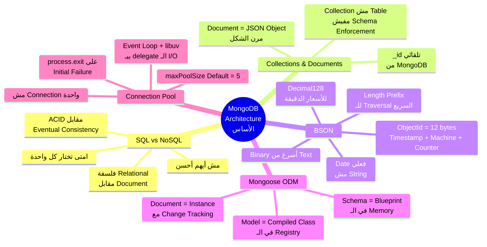
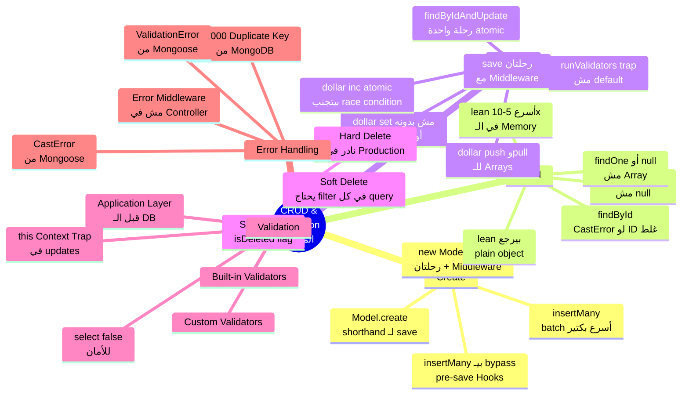

# 🍃 MongoDB & Mongoose — Crash Course & Interview Vault
# الجزء الأول — Module 1 & 2: الأساس اللي كل حاجة بتبنى عليه

> **المشروع:** ShopFlow — منصة تجارة إلكترونية — Users، Products، Orders، Reviews، Categories.
> ده مش مشروع خيالي — ده بالظبط اللي هتلاقيه في أي شغل real.
> ده الجزء اللي بيفرق بين حد بيحفظ syntax وحد بيفهم إيه اللي بيحصل فعلاً تحت الكود.

---

# الفصل 1 — Core & Architecture: فلسفة مختلفة من الأساس

> **المتطلبات:** أساسيات JavaScript/Node.js — محتاج تعرف إيه هو الـ Object، الـ Async/Await، وكيف الـ Event Loop بيشتغل — لأن الـ Connection Pool هيعتمد عليهم.

---

## البداية — المشكلة اللي خلّت كل حاجة تتغير

تخيّل معايا إنك سنة 2008 بتبني موقع تجارة إلكترونية على MySQL. الدنيا تمام. عندك جدول `products` ليه: `name`, `price`, `description`. تمام جداً.

بعد شهر، الـ Product Manager بييجيلك وبيقولك: *"احنا عايزين كل منتج يكون ليه specifications مختلفة — اللاب توب ليه RAM وCPU وStorage، الجاكيت ليه SIZE وCOLOR وMATERIAL، الكتاب ليه AUTHOR وISBN وPAGES."*

في الـ SQL، الكارثة بتبدأ:

```sql
-- ❌ الطريقة القديمة — كابوس حقيقي في production
ALTER TABLE products ADD COLUMN ram VARCHAR(50);       -- ← بس للاب توب
ALTER TABLE products ADD COLUMN cpu VARCHAR(50);       -- ← بس للاب توب
ALTER TABLE products ADD COLUMN storage VARCHAR(50);   -- ← بس للاب توب
ALTER TABLE products ADD COLUMN size VARCHAR(20);      -- ← بس للملابس
ALTER TABLE products ADD COLUMN color VARCHAR(30);     -- ← بس للملابس
ALTER TABLE products ADD COLUMN material VARCHAR(50);  -- ← بس للملابس
ALTER TABLE products ADD COLUMN author VARCHAR(100);   -- ← بس للكتب
ALTER TABLE products ADD COLUMN isbn VARCHAR(20);      -- ← بس للكتب

-- النتيجة بعد 6 أشهر:
-- جدول فيه 50 column، و80% من الـ rows فيها NULL في معظم الـ columns
-- كل ALTER TABLE على production بيعمل table lock وبيوقف الـ service لدقايق 😭
```

ده اللي الناس بتسميه **"Impedance Mismatch"** — الـ data في الواقع ليها شكل hierarchical ومرن، بس الـ relational database بتجبرك تحوّلها لـ tables وrows.

> بدل ما تكون data structure ثابتة وبتتعذب مع كل تغيير — إيه لو كل document يحدد شكله هو؟

---

## SQL vs NoSQL — الفلسفة المختلفة من الأساس

> [!abstract] 🧠 المفهوم المعماري (Under the Hood)
> الـ SQL والـ NoSQL مش بس "طريقتين مختلفتين لتخزين البيانات." ده اختلاف جذري في **فلسفة** التعامل مع البيانات — وده بيتعدى مجرد syntax.
>
> الـ SQL بيبني على نظرية **Relational Model** من 1970 — بتاعة Edgar Codd. الفرضية الأساسية: كل البيانات ممكن تتحوّل لـ relations (جداول) وتتربط ببعض بـ foreign keys. المقابل إنك بتكسب **ACID Guarantees** كاملة: Atomicity, Consistency, Isolation, Durability.
>
> الـ MongoDB بتبني على نظرية مختلفة — **Document Model**. الفرضية: البيانات في الواقع ليها شكل hierarchical وmutable structure — زي الكود نفسه. المقابل إنك بتكسب مرونة وperformance في الـ write-heavy scenarios، لكن الـ consistency model اتغيرت — الـ MongoDB بتوفر **Eventual Consistency** بـ default (مع دعم Transactions من v4.0+).
>
> الاختيار بينهم مش عن "أيهم أحسن" — ده **architectural decision** بيعتمد على طبيعة الـ data وpatterns القراءة والكتابة.

```
┌─────────────────────────────────────────────────────────────────────┐
│           SQL Model — Edgar Codd, 1970                             │
│                                                                     │
│   products table          product_attributes table                  │
│   ─────────────           ───────────────────────                  │
│   id  name    price       id  product_id  key       value          │
│   1   iPhone  45000       1   1           RAM       8GB            │
│   2   Jacket  1500        2   1           CPU       A17 Pro        │
│   3   Book    200         3   2           Size      XL             │
│                           4   3           Author    يوسف زيدان     │
│                                                                     │
│   ↑ Data normalized، علاقات واضحة، لكن محتاج JOIN لكل query      │
└─────────────────────────────────────────────────────────────────────┘

┌─────────────────────────────────────────────────────────────────────┐
│           MongoDB Model — Document Store                           │
│                                                                     │
│   products collection                                               │
│   ──────────────────                                               │
│   { _id, name: "iPhone", price: 45000,                            │
│     attributes: { ram: "8GB", cpu: "A17 Pro" } }                  │
│                                                                     │
│   { _id, name: "Jacket", price: 1500,                             │
│     attributes: { size: "XL", color: "Black" } }                  │
│                                                                     │
│   { _id, name: "Book", price: 200,                                │
│     attributes: { author: "يوسف زيدان", pages: 450 } }           │
│                                                                     │
│   ↑ كل document بيحمل data بتاعته — query واحدة بدون JOIN        │
└─────────────────────────────────────────────────────────────────────┘
```

| الجانب             | SQL (MySQL/PostgreSQL)               | MongoDB (NoSQL)                                       |
| ------------------ | ------------------------------------ | ----------------------------------------------------- |
| هيكل البيانات      | جداول وصفوف (Tables & Rows)          | Collections وDocuments                                |
| الـ Schema         | ثابت (Rigid) — بتعرّفه في الـ DB     | مرن (Flexible) — في الكود                             |
| العلاقات           | JOIN بين الجداول في الـ DB           | Embedding أو References في الـ app                    |
| الـ Query Language | SQL — لغة موحدة ومعيارية             | MongoDB Query Language (MQL)                          |
| الـ Consistency    | Full ACID transactions               | Tunable: Eventual → Strong                            |
| الـ Scaling        | Vertical mainly (أصعب)               | Horizontal Sharding (أسهل)                            |
| مناسب لـ           | بيانات منظمة، JOINs معقدة، Financial | بيانات مرنة، high write throughput، Hierarchical data |

> ⚠️ **انتبه:** مفيش "أحسن" بشكل مطلق. الـ interviewer هيحكم عليك من إجابتك على "امتى تختار كل واحدة" مش "إيهم أحسن." — الجواب الغلط هو "MongoDB أحسن دايماً."

---

## Collections & Documents — الـ Database بعيون MongoDB

تخيّل الـ MongoDB زي **مخزن ضخم متنظم فيه أرفف (Collections)**. كل رف مخصص لنوع معين من البيانات — رف للـ Users، رف للـ Products، رف للـ Orders.

على كل رف، فيه **كراتين (Documents)** — وكل كرتون ممكن يكون شكله مختلف عن التاني.

```
┌─────────────────────────────────────────────────────────────┐
│                     ShopFlow Database                       │
│                                                             │
│  ┌─────────────┐  ┌──────────────┐  ┌──────────────────┐  │
│  │    users    │  │   products   │  │      orders      │  │
│  │ Collection  │  │  Collection  │  │   Collection     │  │
│  │ ──────────  │  │ ──────────── │  │ ──────────────── │  │
│  │ { name,     │  │ { name,      │  │ { user: ref,     │  │
│  │   email,    │  │   price,     │  │   items: [...],  │  │
│  │   role }    │  │   category,  │  │   total,         │  │
│  │             │  │   attributes:│  │   status }       │  │
│  │ { name,     │  │   { ram,cpu}}│  │                  │  │
│  │   email,    │  │              │  │ { user: ref,     │  │
│  │   role,     │  │ { name,      │  │   items: [...],  │  │
│  │   avatar }  │  │   price,     │  │   total,         │  │
│  │             │  │   attributes:│  │   status }       │  │
│  └─────────────┘  │   { size }}  │  └──────────────────┘  │
│                   └──────────────┘                         │
└─────────────────────────────────────────────────────────────┘
```

لاحظ إن الـ products documents ليها attributes مختلفة — وده طبيعي تماماً في MongoDB. الـ Collection مش بتفرض نفس الـ structure على كل document فيها.

```javascript
// شكل الـ Document في MongoDB — بالظبط زي JavaScript Object
{
  _id: ObjectId("64f8a2b3c1d2e3f4a5b6c7d8"),  // ← MongoDB بتعمله تلقائياً — هو مش integer عادي
  name: "Ahmed Hassan",
  email: "ahmed@shopflow.com",
  addresses: [                                   // ← Array كامل جوا Document واحد!
    { city: "القاهرة", street: "ميدان التحرير", isDefault: true },
    { city: "الإسكندرية", street: "الكورنيش", isDefault: false }
  ],
  // لو كان SQL، كنا محتاجين جدول user_addresses منفصل وJOIN في كل query
  createdAt: ISODate("2024-01-15T10:30:00.000Z")
}
```

> [!question] 🎯 سؤال انترفيو مشهور
> **"إيه الفرق بين Collection وTable في SQL؟ وإيه المشاكل اللي ممكن تحصل من المرونة دي؟"**
>
> الـ Table في SQL بيتطلب إن كل row يبقى ليه نفس الـ columns وبنفس الـ data types. لو عايز تضيف column، بتعمل `ALTER TABLE` — وده على production ممكن يعمل table lock وbig downtime. الـ Collection في MongoDB مفيهاش قيود زي دي — كل Document جوّاها ممكن يبقى ليه structure مختلف تماماً.
>
> بس المرونة دي سلاح ذو حدين: المشكلة إن لو مش بتفرض structure من الـ application، ممكن تلاقي document عنده `price: "خمسين جنيه"` وتاني عنده `price: 50` وتالت عنده `Price: 50` (capital P). ده **Data Inconsistency** — وده بالظبط ليه Mongoose موجود. الـ Mongoose بيحوّل الـ MongoDB من "مخزن بدون قواعد" لـ "مخزن بقواعد موجودة في كودك مش في الـ DB."

> [!example] 🏗️ سيناريو من بيئة العمل (ShopFlow Project)
> في ShopFlow، عندنا منتجات مختلفة جداً — electronics وملابس وكتب. لو كنا بنستخدم SQL، كنا محتاجين إما جدول واحد ضخم بـ nullable columns لكل attribute ممكنة، أو نظام EAV (Entity-Attribute-Value) معقد. مع MongoDB، كل product بيحمل attributes بتاعته الخاصة في Map field — والكود بيبقى واضح وبسيط.

---

## BSON vs JSON — اللي بيحصل تحت الـ Hood فعلاً

ده واحد من أهم الأسئلة اللي الـ Seniors بيسألوها وكتير مش بيعرف يجاوب عليها بعمق.

> [!abstract] 🧠 المفهوم المعماري (Under the Hood)
> لما بتكتب كودك، بتشوف **JSON** — text عادي بتقدر تقراه. بس لما الـ MongoDB بتخزن على الـ disk أو بتبعت على الـ network، بتحوّل الـ JSON لـ **BSON** (Binary JSON). الـ MongoDB driver (اللي Mongoose بيستخدمه) بيعمل الـ conversion دي تلقائياً.
>
> الـ BSON فيه ثلاث مميزات جوهرية:
>
> **أولاً — Speed of Parsing:** الكمبيوتر بيشتغل مع binary data بشكل أسرع بكتير من text. في JSON، عشان تعرف القيمة بتاعة field معين، لازم تـ scan الـ text من الأول لآخره. في BSON، كل field بيبدأ بـ length prefix — يعني الـ engine بيقدر يـ skip الـ fields اللي مش محتاجها بسرعة.
>
> **ثانياً — Rich Type System:** JSON بيدعم بس: string, number, boolean, null, array, object. BSON بيدعم: `Date` كـ actual 64-bit integer (مش string)، `ObjectId` كـ 12 bytes، `Int32` vs `Int64`، `Decimal128` للأسعار الدقيقة، و`Binary` للملفات.
>
> **ثالثاً — Traversable:** BSON بيخزّن حجم كل element في الأول — ده بيخلي الـ MongoDB تـ skip أجزاء من الـ document بسرعة من غير ما تحوّله كله.

```
JSON (الـ Text اللي بتشوفه)             BSON (اللي MongoDB بتخزنه)
──────────────────────────             ─────────────────────────────────────
                                        
{                                       16 00 00 00          ← حجم الـ document كله (16 bytes)
  "name": "Ahmed",          →→→         02                   ← type: string
  "age": 25                            6e 61 6d 65 00        ← "name" + null terminator
}                                       06 00 00 00          ← حجم الـ string (6 bytes)
                                        41 68 6d 65 64 00    ← "Ahmed" + null terminator
                                        10                   ← type: int32
                                        61 67 65 00          ← "age" + null terminator
                                        19 00 00 00          ← 25 كـ int32 little-endian
                                        00                   ← نهاية الـ document
```

**الـ Data Types اللي BSON بيدعمها وJSON لأ:**

| BSON Type | مثال في الكود | اللي بيتخزن فعلاً | ليه مهم؟ |
|---|---|---|---|
| `ObjectId` | `ObjectId("64f8...")` | 12 bytes binary | الـ `_id` الافتراضي — unique عالمياً |
| `Date` | `new Date()` | 64-bit integer (milliseconds) | مش string! بتقدر تعمل `$gt`, `$lt` عليه |
| `Int32` | `25` | 4 bytes | JSON مفيهوش فرق بين int وfloat |
| `Int64` | `NumberLong(2500000000)` | 8 bytes | للأرقام الكبيرة جداً |
| `Decimal128` | `Decimal128("99.99")` | 16 bytes | للأسعار — بيتجنب floating point errors |
| `Binary` | `BinData(0, "...")` | binary + subtype | للصور أو الـ hashed passwords |

> [!question] 🎯 سؤال انترفيو مشهور
> **"إيه هو BSON وليه MongoDB بتستخدمه بدل JSON؟ وإيه الـ data types الإضافية اللي بيوفرها؟"**
>
> BSON هو Binary JSON — تنسيق binary بيستخدمه MongoDB للتخزين والنقل على الـ network. في الـ development، بتتعامل مع JSON عادي، والـ MongoDB driver بيعمل الـ conversion تلقائياً. ليه binary؟ لأن الكمبيوتر بيـ parse الـ binary أسرع من text — خصوصاً إن BSON بيخزن حجم كل element في الأول بدل ما يـ scan حرف بحرف. المزية الكبيرة التانية هي الـ Type System: BSON بيدعم `Date` كـ 64-bit integer فعلي (ده بيخليك تعمل date comparisons وdate range queries صح)، `ObjectId` كـ 12 bytes فريد، و`Decimal128` للأسعار اللي محتاج فيها precision عالية بدون floating-point errors. الـ developer بيكتب JavaScript objects عادية، والـ driver بيعمل كل حاجة.

> [!question] 🎯 سؤال انترفيو مشهور
> **"إيه هو ObjectId وإزاي MongoDB بتضمن إنه unique في distributed system؟"**
>
> الـ ObjectId ده 12 bytes مركّب من ثلات أجزاء:
>
> ```
> ┌─────────────────────────────────────────────────────────────┐
> │                  ObjectId — 12 bytes                        │
> ├──────────────┬─────────────────────┬───────────────────────┤
> │  4 bytes     │  5 bytes            │  3 bytes              │
> │  Timestamp   │  Machine + Process  │  Incrementing Counter │
> │  (seconds    │  Identifier         │  (per process)        │
> │  from epoch) │  (random on start)  │                       │
> └──────────────┴─────────────────────┴───────────────────────┘
> ```
>
> الـ Timestamp بيبقى ثواني من 1970 — ده بيضمن إن الـ IDs بتتوليد بترتيب زمني تقريباً. الـ 5 bytes المتوسطة هي combination فريد لكل machine وprocess — حتى لو عندك 1000 server بيكتبوا في نفس الوقت، كل واحد ليه identifier مختلف. الـ 3 bytes الأخيرة هي counter بيبدأ من random value ويتزوّد مع كل ObjectId جديد. الـ combination الثلاثي ده بيضمن إن practical impossibility للتكرار حتى في distributed systems. الفايدة التانية: لأن أول 4 bytes هو timestamp، تقدر تعمل `objectId.getTimestamp()` وتعرف وقت إنشاء الـ document من الـ `_id` نفسه — من غير ما يكون عندك `createdAt` field منفصلة!

---

## Mongoose — الطبقة اللي بتحمي الـ DB منك

الـ MongoDB نفسها **schemaless** — يعني ممكن تحط أي حاجة في أي collection. بس في production، ده بيبقى كارثة. تخيّل:

```javascript
// ❌ بدون Mongoose — الـ MongoDB هتقبل كل ده بدون مشكلة!
db.products.insertMany([
  { name: "iPhone", price: 45000 },      // ← تمام
  { name: "Jacket", price: "ألفين" },    // ← price كـ string؟ MongoDB مش هتشتكي!
  { Name: "Book", Price: 200 },          // ← capital letters؟ MongoDB مش هتشتكي!
  { product_name: "iPad", cost: 8000 },  // ← keys مختلفة خالص؟ برضو تمام!
]);
// النتيجة: collection فوضى كاملة — والـ bugs هتظهر بعد أيام لما تحاول تعمل query
```

**Mongoose** بييجي يحل المشكلة دي — ده **ODM (Object Document Mapper)** بيخليك تعرّف الـ schema في الـ JavaScript code، ويتحقق منها قبل ما أي حاجة توصل للـ database.

> [!abstract] 🧠 المفهوم المعماري (Under the Hood) — Schema، Model، Document في الـ Memory
> في Mongoose، فيه ثلاث مفاهيم أساسية لازم تفهمهم على مستوى الـ memory:
>
> **Schema** هو الـ Blueprint — بيتعمل مرة واحدة لما الـ app بتبدأ. بيتخزن في الـ memory كـ JavaScript object بيوصف شكل كل field والـ validation rules والـ defaults بتاعته. الـ Schema مفيهوش connection بالـ database — هو مجرد definition.
>
> **Model** هو الـ Compiled Schema — لما بتعمل `mongoose.model('Product', productSchema)`، الـ Mongoose بيعمل JavaScript Class جديدة بترث من `mongoose.Model`. الـ Class دي بتحمل بداخلها:
> - ليست الـ fields وتعريفاتها (من الـ Schema)
> - اسم الـ Collection في الـ DB (بيتحسب من اسم الـ Model بالجمع والـ lowercase)
> - كل الـ static methods زي `find()`, `create()`, `findById()`
> - الـ connection المفروض تستخدمها
>
> الـ Mongoose بيخزّن كل الـ Models في registry داخلية — عشان لو حاولت تعمل `mongoose.model('Product', schema)` مرتين، بترميلك error بدل ما يعمل Model جديد.
>
> **Document** هو الـ Instance — لما بتعمل `new Product({...})` أو بتجيب result من `find()`، بترجعلك **Mongoose Document** — object ورثت من المـ Model class وبتحمل:
> - الـ data الفعلية (الـ fields وقيمها)
> - الـ original data قبل أي تعديل (للـ change tracking)
> - كل الـ instance methods زي `.save()`, `.toObject()`, `.toJSON()`
> - الـ `__v` (versionKey) للـ optimistic concurrency

```javascript
// ──────────────────────────────────────────────────────────
// 1️⃣ الـ SCHEMA — بيتعمل في الـ memory لما الـ module يتـ load
//    ده blueprint بحت — مفيهوش connection بالـ DB
// ──────────────────────────────────────────────────────────
const productSchema = new mongoose.Schema(
  {
    name: {
      type: String,
      required: [true, 'اسم المنتج مطلوب'],  // ← custom error message بدل الـ generic
      trim: true,                               // ← بيشيل المسافات الزيادة قبل الحفظ
      maxlength: [100, 'الاسم مش المفروض يعدى 100 حرف'],
    },
    slug: {
      type: String,
      unique: true,   // ← بيعمل Unique Index في الـ MongoDB تلقائياً
      lowercase: true,
    },
    price: {
      type: Number,
      required: [true, 'السعر مطلوب'],
      min: [0, 'السعر مينفعش يبقى سالب — منطقياً كمان 😅'],
    },
    comparePrice: {
      type: Number,   // ← السعر الأصلي قبل الخصم
      default: null,
    },
    category: {
      type: String,
      enum: {
        values: ['electronics', 'clothing', 'books', 'home'],
        message: '"{VALUE}" مش category صحيحة',  // ← {VALUE} بيتحط فيها القيمة الغلط
      },
      required: true,
    },
    attributes: {
      type: Map,          // ← ده اللي بيحل مشكلة الـ SQL اللي اتكلمنا عنها
      of: mongoose.Schema.Types.Mixed,  // ← values ممكن تبقى أي type
    },
    inStock: {
      type: Boolean,
      default: true,      // ← لو ماجاش في الـ request، هيبقى true تلقائياً
    },
    seller: {
      type: mongoose.Schema.Types.ObjectId,
      ref: 'User',        // ← Reference للـ User model — هنشرحه في Module 3
      required: true,
    },
    isDeleted: {
      type: Boolean,
      default: false,     // ← الـ Soft Delete flag — هنشرحه في Module 2
    },
  },
  {
    timestamps: true,     // ← Mongoose هتضيف createdAt وupdatedAt تلقائياً
  }
);

// ──────────────────────────────────────────────────────────
// 2️⃣ الـ MODEL — بيتعمل مرة واحدة، بيتخزن في Mongoose Registry
//    اسم الـ Collection هيبقى: 'products' (جمع + lowercase تلقائياً)
// ──────────────────────────────────────────────────────────
const Product = mongoose.model('Product', productSchema);
//                            ↑              ↑
//                        اسم الـ Model   الـ Schema اللي هيبني عليها

// ──────────────────────────────────────────────────────────
// 3️⃣ الـ DOCUMENT — instance في الـ memory، لسه مش في الـ DB
// ──────────────────────────────────────────────────────────
const newProduct = new Product({
  name: 'iPhone 15 Pro',
  price: 45000,
  category: 'electronics',
  seller: '64f8a2b3c1d2e3f4a5b6c7d8', // ← ObjectId بتاع الـ seller
  attributes: new Map([
    ['storage', '256GB'],
    ['color', 'Titanium'],
    ['ram', '8GB'],
  ]),
});
// ↑ ده لسه مش اتخزن في الـ DB خالص — بس Mongoose Document في الـ memory
// لو عملت console.log(newProduct._id) هتلاقيه موجود رغم إن ما اتحفظش!
// ← Mongoose بيولّد الـ ObjectId في الـ memory فوراً
```

> [!example] 🏗️ سيناريو من بيئة العمل (ShopFlow Project)
> في ShopFlow، الـ `productSchema` بيتعمل مرة واحدة لما الـ server بيبدأ. كل request بعد كده بيستخدم نفس الـ Schema اللي موجود في الـ memory. الـ `Product` model بيتخزن في `mongoose.models.Product` — لو حاولت تعمله تاني (مثلاً في testing)، الـ Mongoose هيديك الـ model الموجود خالص من الـ registry. ده بيمنع memory leaks في بيئات زي الـ Next.js اللي بتعمل hot-reloading.

---

## الـ Connection — إزاي Mongoose بتتكلم مع MongoDB وده مش بسيط زي ما فاكر

```javascript
// config/database.js — الـ Production-Grade Connection Setup
const mongoose = require('mongoose');

const connectDB = async () => {
  try {
    const conn = await mongoose.connect(process.env.MONGO_URI, {
      maxPoolSize: 10,     // ← الـ Connection Pool size — هنشرحه بعد شوية
      serverSelectionTimeoutMS: 5000,  // ← لو ما لاقاش server في 5 ثواني، فشل
      socketTimeoutMS: 45000,          // ← لو الـ query فضلت أكتر من 45 ثانية، قطع
    });

    console.log(`✅ MongoDB Connected: ${conn.connection.host}`);

    // ── Connection Lifecycle Events ── 
    mongoose.connection.on('error', (err) => {
      // ده بيحصل بعد الـ initial connection — مش أثناء الـ connect()
      console.error('❌ MongoDB runtime error:', err);
    });

    mongoose.connection.on('disconnected', () => {
      // الـ Mongoose بيحاول يـ reconnect تلقائياً بـ exponential backoff
      console.warn('⚠️ MongoDB disconnected — Mongoose is retrying...');
    });

    mongoose.connection.on('reconnected', () => {
      console.info('✅ MongoDB reconnected successfully');
    });

  } catch (error) {
    // ده بيحصل لو الـ initial connection فشلت
    console.error('❌ Initial connection failed:', error.message);
    process.exit(1); // ← الـ app مش المفروض تشتغل من غير DB
  }
};

module.exports = connectDB;
```

> [!abstract] 🧠 المفهوم المعماري (Under the Hood) — الـ Connection Pool والـ Event Loop
>
> ده الجزء اللي معظم الـ juniors مش بيعرفوه — وبيفرق في الـ senior interviews.
>
> لما بتعمل `mongoose.connect(uri)` واحدة، الـ Mongoose مش بتفتح **connection واحدة** — بتفتح **Connection Pool** (الـ default هو 5 connections، أنا حطّيت 10 في الكود). تخيّل الـ Connection Pool زي **شباك حجز في بنك** — مش شباك واحد، فيه 10 شبابيك مفتوحة في نفس الوقت.
>
> ```
> ┌─────────────────────────────────────────────────────────────────┐
> │              Connection Pool — maxPoolSize: 10                  │
> │                                                                 │
> │  Conn #1  ──── [BUSY: getProduct query] ────▶ MongoDB           │
> │  Conn #2  ──── [BUSY: createOrder query] ───▶ MongoDB           │
> │  Conn #3  ──── [BUSY: updateUser query] ────▶ MongoDB           │
> │  Conn #4  ──── [IDLE: waiting]                                  │
> │  Conn #5  ──── [IDLE: waiting]                                  │
> │  ...                                                            │
> │  Conn #10 ──── [IDLE: waiting]                                  │
> │                                                                 │
> │  Request #11 → يدخل queue وينتظر أي connection تخلص           │
> └─────────────────────────────────────────────────────────────────┘
> ```
>
> الـ Node.js single-threaded — بس ده مش معناه إن بيعمل database query واحدة في نفس الوقت! الـ Event Loop بيـ delegate الـ I/O operations (زي الـ DB queries) لـ **libuv thread pool** — وده بيرجع النتيجة عن طريق callback/promise لما بتخلص. الـ Connection Pool بيضمن إن الـ libuv تلاقي connection جاهزة تستخدمها من غير ما تفضل تعمل TCP handshake جديد مع كل request.
>
> ليه `process.exit(1)` لو الـ initial connection فشلت؟ لأن الـ application مش منطقي تفضل شغالة من غير database. لو تركناها، هتستقبل HTTP requests وكل منها هيـ fail بـ unhandled error أسوأ بكتير. الـ `process.exit(1)` بيقول للـ process manager (PM2/Docker/Kubernetes) إن الـ app انتهت بـ error، فيعيد تشغيلها — وفي المرة دي ربما الـ DB بقت متاحة.

```javascript
// في server.js — الـ Startup Sequence الصح
const connectDB = require('./config/database');
const app = require('./app');

const startServer = async () => {
  // أول حاجة: اتصل بالـ DB
  await connectDB();
  
  // تاني حاجة: بعدها فتح الـ HTTP server
  // ← لو عكست الترتيب، ممكن request تيجي قبل ما الـ DB تبقى جاهزة
  app.listen(process.env.PORT || 3000, () => {
    console.log(`🚀 ShopFlow Server running on port ${process.env.PORT}`);
  });
};

startServer();
```

> [!question] 🎯 سؤال انترفيو مشهور
> **"إيه الفرق بين Schema وModel في Mongoose وإيه اللي بيحصل في الـ memory لما بتعملهم؟"**
>
> الـ **Schema** هو الـ blueprint — object بسيط في الـ memory بيوصف شكل الـ documents: الـ fields، الـ types، الـ validators، الـ defaults. مفيهوش أي connection بالـ database — هو مجرد definition.
>
> الـ **Model** هو الـ compiled schema — لما بتعمل `mongoose.model('Product', schema)`، الـ Mongoose بيـ compile الـ Schema ويعمل JavaScript Class جديدة. الـ Class دي:
> 1. بتحمل اسم الـ Collection (`products` — جمع + lowercase)
> 2. بيخزّنها في `mongoose.models` registry — ده بيمنع re-compilation
> 3. بتوفر كل الـ static methods: `find`, `create`, `findById`, etc.
>
> الـ **Document** هو الـ instance من الـ Model. لما بتعمل `new Product({...})` أو بتجيب نتيجة من query، بترجعلك Mongoose Document — object فيه الـ data + كل الـ instance methods (`.save()`, `.toObject()`) + الـ change tracking system اللي بيعرف إيه اللي اتغيّر من الـ last save.

> [!question] 🎯 سؤال انترفيو مشهور
> **"ليه بنستخدم Connection Pool بدل فتح connection جديدة مع كل request؟"**
>
> فتح TCP connection مع MongoDB بياخد وقت — فيه TCP handshake، authentication، وprotocol negotiation. ده ممكن يبقى 10-50ms لكل connection جديدة. لو عندك 100 request في الثانية، وكل واحدة بتفتح connection جديدة، هتضيف 1-5 ثواني overhead على كل request. الـ Connection Pool بيحل المشكلة دي: بيفتح عدد محدود من الـ connections في الأول لما الـ app تبدأ، وبيـ reuse نفس الـ connections مع كل الـ requests. الـ `maxPoolSize` لازم تحددها على حسب الـ database server capacity — لو فتحت connections أكتر من اللي الـ MongoDB server بتتحمله، هيرفضهم.

---

## 🗺️ خريطة Module 1 كاملة



---

## ✅ Checkpoint — أسئلة إنترفيو Module 1

**س: امتى تختار MongoDB وامتى تختار PostgreSQL في الـ ShopFlow؟**
> MongoDB مناسبة للـ products (لأن كل product ليه attributes مختلفة)، الـ user sessions، وكل حاجة ليها flexible schema أو high write throughput. PostgreSQL مناسبة للـ financial transactions (payments) اللي محتاجة ACID guarantees كاملة، أو لو عندك complex relationships وبتعمل JOINs كتير. في production الكبير، كتير بيستخدموا الاتنين مع بعض — PostgreSQL للـ financial data، MongoDB للـ catalog وuser activity.

**س: إيه الفرق بين BSON وJSON وليه MongoDB اختارت BSON؟**
> JSON هو text format — readable للإنسان بس بطيء في الـ parsing. BSON هو binary representation — أسرع لأن كل element بيبدأ بـ length prefix بدل ما الـ parser يـ scan حرف بحرف. الأهم من السرعة هو الـ Type System: BSON بيدعم `Date` كـ 64-bit integer فعلي (مش string)، `ObjectId` كـ 12 bytes، و`Decimal128` للأسعار. الـ developer بيتعامل مع JSON في كوده — الـ driver بيعمل الـ conversion تلقائياً.

**س: إيه هو ObjectId وليه مش بنستخدم integer autoincrement زي SQL؟**
> الـ ObjectId هو 12 bytes: 4 bytes timestamp + 5 bytes machine/process identifier + 3 bytes incrementing counter. ده بيضمن uniqueness في distributed system من غير ما نحتاج central authority توزع الـ IDs. لو استخدمنا autoincrement integer زي SQL، كل الـ servers لازم تتكلم مع central counter — ده bottleneck خطير في distributed systems. الفايدة التانية: ممكن تعرف وقت إنشاء الـ document من الـ `_id` نفسه بـ `objectId.getTimestamp()`.

**س: إيه الفرق بين Schema وModel وDocument في Mongoose؟**
> الـ Schema هو الـ blueprint — plain JavaScript object بيوصف شكل الـ documents في الـ memory. الـ Model هو compiled class منه — بيتعمل بـ `mongoose.model()` وبيتخزن في internal registry، وبيوفر الـ static methods زي `find()` و`create()`. الـ Document هو instance من الـ Model — بيحمل الـ data الفعلية + change tracking + instance methods زي `.save()`.

**س: ليه بنحط `process.exit(1)` لما الـ DB connection بتفشل؟ وليه مش بنسيب الـ app تشتغل؟**
> لأن app بدون DB connection هي app بدون قيمة — كل request هتـ fail بـ unhandled errors أسوأ من error واضح. `process.exit(1)` بيبعت signal للـ process manager (PM2/Docker/Kubernetes) إن الـ app انتهت بـ error، فيعمل automatic restart. في production، ده بيكون مع retry logic — لو الـ DB وقعت مؤقتاً، الـ app هتـ restart وتحاول تاني. لو سبنا الـ app تشتغل من غير DB، المستخدمين هيلاقوا 500 errors غريبة من غير ما نعرف السبب.

---

## 🛠️ Practical Exercise — إعداد الـ ShopFlow Database Foundation

### Task 1 — إعداد البيئة

```bash
mkdir shopflow-api && cd shopflow-api
npm init -y
npm install mongoose dotenv
```

أنشئ ملف `.env`:

```
MONGO_URI=mongodb://localhost:27017/shopflow
PORT=3000
```

---

### Task 2 — كتابة الـ Schemas

اكتب `productSchema` فيه:
- `name` (required, trim, maxlength 100)
- `slug` (unique, lowercase)
- `price` (required, min 0)
- `category` (enum: electronics, clothing, books, home)
- `attributes` (Map of Mixed)
- `inStock` (default: true)
- `isDeleted` (default: false)
- timestamps

```javascript
// Hint: لو الـ slug بيتولّد من الـ name، فكّر في إزاي هتعمل ده — Module 4 هيشرح الـ Middleware
```

---

### Task 3 — الـ Connection Setup

اكتب `connectDB` function مع:
1. الـ proper error handling
2. الـ connection events (error, disconnected, reconnected)
3. الـ `maxPoolSize` option
4. `process.exit(1)` للـ initial failure

| الملف | السؤال اللي يفكر فيه |
|---|---|
| `models/Product.js` | ليه الـ Mongoose بيحول اسم الـ Model `Product` لـ collection اسمها `products`؟ |
| `config/database.js` | إيه اللي بيحصل لو عملت `mongoose.connect()` مرتين في نفس الـ app؟ |

---

## 🫒 زتونة الإنترفيو — Module 1

> **"لما بتسألني عن MongoDB، أنا بفكر فيها كـ paradigm shift مش بس database. الـ SQL بيقولك 'عرّف شكل الـ data الأول في الـ database، وبعدين اكتب' — ده منطقي لما البيانات منظمة ومترابطة زي الأنظمة المحاسبية. MongoDB بتقلب المعادلة — الـ schema موجود في الـ application code عن طريق Mongoose، ده بيخلي التغيير في البيانات أسهل بكتير. تحت الكواليس، الـ data بتتخزن كـ BSON مش JSON عشان الـ binary أسرع في الـ parsing والـ traversal — وعشان BSON بيدعم types مهمة زي ObjectId كـ 12 bytes فريد في أي distributed system، وDate كـ 64-bit integer حقيقي مش string. لما بتعمل connect في Mongoose، مش بتفتح connection واحدة — بتفتح Connection Pool اللي بيسمح للـ Node.js Event Loop إنه يـ delegate كذا database query في نفس الوقت لـ libuv thread pool من غير ما يـ block. والـ Schema في Mongoose مش مجرد validation — هو الـ contract الموجود في الـ memory بين الـ code والـ database."**

---

*Next → [[الفصل 2]] — CRUD & Validation Mastery: هتعرف إزاي تتكلم مع الـ DB صح — وهتفهم ليه مش كل الـ methods بتشتغل نفس الطريقة*

---
---

# الفصل 2 — CRUD & Validation Mastery: التفاصيل اللي بتفرق بين Junior وSenior

> **المتطلبات:** [[الفصل 1]] — لازم تبقى فاهم Schema وModel وConnection Pool، لأن كل الـ CRUD operations هي تفاعل بين الـ Mongoose Documents والـ MongoDB عن طريق الـ Connection Pool ده.

---

## البداية — مش كل الـ Methods بتشتغل نفس الطريقة

كل developer بيبدأ يتعلم `save()`, `find()`, `findById()` — وبيفضل يستخدمهم في كل حاجة. وبعدين يوم من الأيام بيلاقي الـ app بطيئة، الـ queries مش بتشيل الـ load، والـ validation rules مش بتشتغل في الـ updates.

المشكلة مش في "مش عارف يعمل CRUD" — المشكلة في إنه مش عارف **الفرق المعماري بين الـ methods** وامتى يستخدم كل واحدة.

تخيّل الفرق بين الطريقتين دول:

```javascript
// ❌ الطريقة الساذجة — رحلتان للـ DB في عملية واحدة
const product = await Product.findById(id);  // ← READ من الـ DB
product.price = 50000;
await product.save();                         // ← WRITE للـ DB
// المجموع: 2 database round-trips، وxxx ms أبطأ من اللازم

// ✅ الطريقة الصح للـ simple updates — رحلة واحدة
await Product.findByIdAndUpdate(id, { $set: { price: 50000 } }, { new: true });
// المجموع: 1 database round-trip
```

بس انتبه — "الأسرع" مش دايماً الصح. فيه scenarios محتاج فيها الطريقة الأولى رغم بطئها. هنشرح الفرق بالتفصيل.

---

## Create — الثلاث طرق وامتى تستخدم كل واحدة

### الطريقة الأولى: `new Model() + save()`

```javascript
// 🏗️ ShopFlow: إنشاء Product جديد — الطريقة الأكتر تحكماً
const createProduct = async (productData) => {
  const product = new Product({          // ← بيعمل Document في الـ memory بس
    name: productData.name,
    price: productData.price,
    category: productData.category,
    seller: productData.sellerId,
    attributes: productData.attributes,
  });

  // لو عايز تعمل أي حاجة على الـ product قبل الحفظ، هنا مكانها:
  product.slug = productData.name.toLowerCase().replace(/ /g, '-');

  // هنا بيحصل كل حاجة بالترتيب ده:
  // 1. الـ pre-save Middleware بيشتغل (هنشرحه في Module 4)
  // 2. الـ Schema Validation بتشتغل
  // 3. الـ BSON Conversion
  // 4. الـ MongoDB Write Operation
  // 5. الـ post-save Middleware بيشتغل
  const savedProduct = await product.save();
  return savedProduct;
};
```

### الطريقة التانية: `Model.create()`

```javascript
// ← Shorthand لـ new + save() — بس كلهم بيمروا بنفس الـ Middleware
const product = await Product.create({
  name: 'MacBook Pro M3',
  price: 85000,
  category: 'electronics',
  seller: sellerId,
});
// ⚠️ انتبه: create() برضو بيشغّل الـ pre-save middleware
// مش shortcut للـ validation — هو shortcut للـ syntax بس
```

### الطريقة التالتة: `Model.insertMany()`

```javascript
// ← للـ bulk insert — بياكل وقت أقل بكتير من create() لكل document على حدة
const products = await Product.insertMany(
  [
    { name: 'iPhone 15', price: 42000, category: 'electronics', seller: id1 },
    { name: 'Samsung S24', price: 38000, category: 'electronics', seller: id1 },
    { name: 'iPad Pro', price: 55000, category: 'electronics', seller: id2 },
  ],
  {
    ordered: false,  // ← لو document واحد فشل، الباقي بيكملوا
    //                   بدون ordered: false، أول error بيوقف الكل
  }
);
```

> [!abstract] 🧠 المفهوم المعماري (Under the Hood) — ليه `insertMany` أسرع؟
> الـ `create()` على كل document بيعمل:
> 1. عمل Mongoose Document instance في الـ memory
> 2. تشغيل الـ pre-save hooks
> 3. تشغيل الـ validation
> 4. إرسال write operation للـ MongoDB
>
> لو عملت `create()` على 100 document، ده 100 round-trip منفصلة للـ DB. الـ `insertMany()` بيجمع كل الـ documents في **single batch write** ويبعتها مرة واحدة. التوفير في الـ network latency بيبقى ضخم — خصوصاً لو الـ DB مش على نفس الـ machine.
>
> الـ tradeoff: `insertMany()` بـ default بيـ **bypass الـ Mongoose Middleware** (الـ pre/post hooks) — الـ validation بتشتغل، لكن الـ custom logic في الـ hooks لأ. لو عندك business logic في الـ pre-save hooks (زي hashing أو slug generation)، مش تستخدم `insertMany()`.

> [!example] 🏗️ سيناريو من بيئة العمل (ShopFlow Project)
> في ShopFlow، عندنا feature بنـ seed الـ database بـ 1000 product sample data لما بتعمل setup للـ development environment. لو استخدمنا `Product.create()` في loop، هياخد ~30 ثانية. مع `insertMany()`، نفس الـ 1000 product بتتحفظ في ~2 ثانية. ده ليش script بتاع الـ seed data دايماً بيستخدم `insertMany()` مش `create()`.

---

## Read — الفرق بين `.find()` و`.findOne()` والـ `.lean()` اللي بيغير كل حاجة

### الـ Basic Methods

```javascript
// ── 1. find() — دايماً بيرجع Array ──
const allProducts = await Product.find();
// ← لو مفيش results، بيرجع [] (empty array) مش null
// ← ⚠️ على production مش تعمل find() من غير filter أبداً!

// ── 2. findOne() — بيرجع Document واحد أو null ──
const product = await Product.findOne({ slug: 'iphone-15-pro' });
// ← لو مفيش نتيجة، بيرجع null مش []

// ── 3. findById() — shorthand لـ findOne({ _id: id }) ──
const product = await Product.findById('64f8a2b3c1d2e3f4a5b6c7d8');
// ← لو الـ id مش ObjectId صحيح، بيـ throw CastError

// ── 4. Query Operators ──
const products = await Product.find({
  price: { $gt: 10000, $lte: 100000 },       // ← between 10k and 100k
  category: { $in: ['electronics', 'books'] }, // ← في الـ list دي
  inStock: true,
  isDeleted: { $ne: true },                    // ← مش محذوف
});
```

### الـ Query Chaining — الـ Power الحقيقية

```javascript
// ← بتبني الـ query تدريجياً — ما بتتنفذش لحد ما تعمل await
const result = await Product
  .find({ isDeleted: { $ne: true } })
  .select('name price category images inStock')  // ← اجيب الـ fields دي بس
  .sort({ createdAt: -1 })                        // ← من الأحدث للأقدم
  .skip(20)                                       // ← تخطى أول 20 (pagination)
  .limit(10)                                      // ← جيب 10 بس
  .lean();                                        // ← 🔥 الـ Secret Weapon
```

### `.lean()` — السلاح السري في الـ Performance

> [!abstract] 🧠 المفهوم المعماري (Under the Hood) — إيه اللي بيحصل في الـ Memory
>
> لما بتعمل `Product.find()` بدون `.lean()`، الـ Mongoose بتاخد كل document جه من MongoDB وبتـ **wrap** كل واحد في Mongoose Document instance. الـ wrapping ده معناه:
>
> ```javascript
> // الـ Mongoose Document اللي بيرجع بدون .lean():
> MongooseDocument {
>   // الـ actual data:
>   _doc: { _id: ..., name: 'iPhone', price: 45000, ... },
>   
>   // الـ prototype methods — بتتخزن في الـ memory مع كل document!
>   save: [Function],
>   remove: [Function],
>   validate: [Function],
>   toObject: [Function],
>   toJSON: [Function],
>   get: [Function],
>   set: [Function],
>   // ... +30 method تاني
>   
>   // الـ change tracking system:
>   $__: {
>     activePaths: { paths: { ... }, states: { ... } }, // ← بيتتبع كل تغيير
>     strictMode: true,
>     selected: { ... },
>     // ...
>   },
>   $isNew: false,
>   __v: 0,
> }
> ```
>
> لما تضيف `.lean()`، الـ Mongoose بيرجعلك plain JavaScript object بس:
>
> ```javascript
> // الـ Object اللي بيرجع مع .lean():
> {
>   _id: ObjectId('64f8a2b3c1d2e3f4a5b6c7d8'),
>   name: 'iPhone 15 Pro',
>   price: 45000,
>   // الـ data بس — مفيش methods، مفيش change tracking، مفيش overhead
> }
> ```
>
> الفرق في الـ memory usage ممكن يبقى **5 إلى 10 أضعاف**. لو بتجيب 100 product في request واحدة، ده 100 Mongoose Document instance بدل 100 plain object. في الـ high-traffic scenarios، ده فرق ملموس.

```javascript
// ❌ الغلط الشائع — بتجيب Mongoose Documents بس مش هتعمل .save() عليهم
const products = await Product
  .find({ category: 'electronics' })
  .select('name price')
  .sort({ price: -1 });
// ← كل document فيه +30 method بتاكل memory وانت مش محتاجها

// ✅ الصح — بتجيب plain objects أخف بـ 5-10x
const products = await Product
  .find({ category: 'electronics' })
  .select('name price')
  .sort({ price: -1 })
  .lean(); // ← بيقول لـ Mongoose: مش محتاج الـ wrapping

// ❌ لا تستخدم .lean() لو هتعمل .save() بعدين
const product = await Product.findById(id).lean();
product.price = 50000;
await product.save(); // ← خطأ! product ده plain object مش ليه .save() method
```

| | بدون `.lean()` | مع `.lean()` |
|---|---|---|
| النوع | Mongoose Document | Plain JS Object |
| الـ Memory | أكبر (5-10x) | أصغر بكتير |
| الـ Speed | أبطأ | أسرع بكتير |
| `.save()` | ✅ تقدر | ❌ مينفعش |
| الـ Middleware | ✅ محفوظة | ❌ مش موجودة |
| متى تستخدم | لما هتعدّل وتحفظ | في كل GET requests |

> [!question] 🎯 سؤال انترفيو مشهور
> **"إيه `.lean()` وإيه الفرق الجوهري في الـ memory بين استخدامه وعدم استخدامه؟"**
>
> `.lean()` بيقول لـ Mongoose: "ارجعلي plain JavaScript object بدل Mongoose Document instance." الـ Mongoose Document بياخد memory أكبر بكتير لأنه بيحمل الـ actual data + كل الـ prototype methods (`.save()`, `.validate()`, `.toObject()`, etc.) + نظام الـ change tracking اللي بيتتبع كل field اتغير. الـ plain object بيحمل الـ data بس. الفرق في الـ performance ممكن يوصل لـ 5-10x أسرع في الـ read-heavy scenarios. القاعدة الذهبية: استخدم `.lean()` في كل GET requests اللي مش هتعمل `.save()` بعدها — يعني عملياً في معظم الـ read operations.

> [!example] 🏗️ سيناريو من بيئة العمل (ShopFlow Project)
> في ShopFlow، عندنا endpoint `/api/products` بتجيب قائمة المنتجات. في الـ load testing، لاقينا إن الـ response time كانت 280ms. بعد ما ضفنا `.lean()`، نزلت لـ 45ms على نفس الـ data. الفرق مش في قوة الـ server — الفرق في إن الـ Node.js بقى بيشغّل وقت أقل في الـ memory allocation والـ prototype chain setup لكل document.

---

## Update — الفرق المعماري بين `save()` و`findByIdAndUpdate()`

ده أكتر سؤال بيجي في الـ interviews وأكتر حاجة بيغلط فيها الـ juniors.

> [!abstract] 🧠 المفهوم المعماري (Under the Hood) — رحلتان مقابل رحلة واحدة
>
> الـ `save()` على document موجود بيعمل:
> ```
> الـ Node.js App              MongoDB
>     │                          │
>     │── READ: findById ────────▶│  ← الرحلة الأولى للـ DB
>     │◀── يرجع الـ document ────│
>     │  (بنعدّل في الـ memory)  │
>     │── WRITE: save ───────────▶│  ← الرحلة التانية للـ DB
>     │◀── confirm ──────────────│
> ```
>
> الـ `findByIdAndUpdate()` بيعمل:
> ```
> الـ Node.js App              MongoDB
>     │                          │
>     │── UPDATE: findAndModify ─▶│  ← رحلة واحدة بس
>     │◀── يرجع الـ document ────│
> ```
>
> بس الفرق مش بس في الـ speed — الاتنين بيشتغلوا بطريقة مختلفة تماماً من ناحية الـ Middleware والـ Validation.

```javascript
// ──────────────────────────────────────────────────────
// الطريقة الأولى: findById + save()
// متى تستخدمها: لو محتاج الـ pre-save Middleware تشتغل
// ──────────────────────────────────────────────────────
const updateProductWithMiddleware = async (id, newPrice) => {
  // الرحلة الأولى: جيب الـ document
  const product = await Product.findById(id);
  
  if (!product) throw new Error('Product not found');
  
  // عدّل في الـ memory
  product.price = newPrice;
  product.updatedBy = currentUserId; // ← تقدر تضيف أي حاجة
  
  // الرحلة التانية: احفظ مع كل الـ middleware والـ validation
  // ← الـ pre('save') hooks هتشتغل هنا
  // ← الـ full validation هتشتغل هنا
  return await product.save();
};

// ──────────────────────────────────────────────────────
// الطريقة التانية: findByIdAndUpdate()
// متى تستخدمها: لما محتاج speed وما محتاجش الـ middleware
// ──────────────────────────────────────────────────────
const updateProductFast = async (id, newPrice) => {
  return await Product.findByIdAndUpdate(
    id,                                // ← الـ filter
    { $set: { price: newPrice } },     // ← الـ update — لازم $set!
    {
      new: true,            // ← ارجعلي الـ document بعد التعديل مش قبله
      runValidators: true,  // ← 🔥 الـ trap الشهيرة — هنشرحها دلوقتي
    }
  );
};
```

### الـ `runValidators: true` Trap — أهم حاجة في الـ Update

> [!abstract] 🧠 المفهوم المعماري (Under the Hood) — ليه `runValidators` مش default؟
>
> ده من أكتر الـ design decisions جدلاً في Mongoose. بـ default، الـ `findByIdAndUpdate()` بيبعت الـ update operation للـ MongoDB مباشرة من غير ما يشغّل الـ Schema Validators. السبب التاريخي: لما الـ feature دي اتضافت في Mongoose، الـ validation في الـ update كانت buggy — بالذات الـ validators اللي بتستخدم `this` (لأن الـ `this` في الـ update context مش الـ document).
>
> النتيجة العملية: تقدر تحفظ `price: -1000` حتى لو عندك `min: 0` في الـ schema. تقدر تحفظ `category: 'invalid-value'` حتى لو عندك enum. الـ Schema validation ببساطة مش بتشتغل.

```javascript
// ❌ الغلط الشائع — الـ validation مش بتشتغل في الـ update!
const product = await Product.findByIdAndUpdate(
  id,
  { $set: { price: -5000, category: 'invalid-category' } }
  // مفيش runValidators — الـ MongoDB هتحفظ الـ garbage ده بدون مشكلة 😱
);

// ✅ الصح — بتشغّل الـ validation يدوياً
const product = await Product.findByIdAndUpdate(
  id,
  { $set: { price: -5000, category: 'invalid-category' } },
  { 
    new: true,
    runValidators: true,  // ← دلوقتي هيـ throw ValidationError لأن price < 0
  }
);
```

**مقارنة شاملة بين الـ Update Methods:**

| الجانب | `findById() + save()` | `findByIdAndUpdate()` |
|---|---|---|
| DB Round-trips | 2 (READ ثم WRITE) | 1 (atomic) |
| السرعة | أبطأ | أسرع |
| الـ pre-save Hooks | ✅ بتشتغل | ❌ مش بتشتغل |
| الـ Validation | ✅ تلقائياً | ❌ لازم `runValidators: true` |
| الـ `this` في Validators | ✅ الـ Document | ⚠️ الـ Query object |
| متى تستخدم | لو عندك pre-save hooks | للـ simple updates |

### الـ Update Operators المهمة في ShopFlow

```javascript
// $inc — زيادة/نقصان قيمة رقمية (atomic)
await Product.findByIdAndUpdate(productId, {
  $inc: { 
    viewCount: 1,   // ← زوّد بـ 1 — atomic operation مش race condition
    stock: -1,      // ← نقّص بـ 1 بعد كل purchase
  }
});
// ← $inc أآمن من findById + save() هنا لأنه atomic
// لو اتنين requests جم في نفس الوقت وكل واحد عمل:
// read (stock=10) → decrement → write (stock=9)
// هيبقى stock=9 بدل 8! $inc بيحل المشكلة دي

// $push — إضافة element لـ array
await User.findByIdAndUpdate(userId, {
  $push: { 
    wishlist: productId,
    recentlyViewed: { 
      $each: [productId],    // ← $each بيخليك تضيف أكتر من element
      $slice: -10,           // ← احتفظ بآخر 10 بس (sliding window)
    }
  }
});

// $pull — حذف elements من array بـ condition
await User.findByIdAndUpdate(userId, {
  $pull: { wishlist: productId }  // ← بيشيل الـ productId من الـ wishlist
});

// $addToSet — إضافة بس لو مش موجود (بيتجنب duplicates)
await User.findByIdAndUpdate(userId, {
  $addToSet: { favorites: productId }  // ← مش هيتضاف تاني لو موجود
});
```

> [!question] 🎯 سؤال انترفيو مشهور
> **"إيه الفرق بين `save()` و`findByIdAndUpdate()`؟ ومتى تختار كل واحدة؟"**
>
> `save()` على document موجود بيعمل رحلتين للـ DB: READ الأول ثم WRITE. بيشغّل كل الـ Mongoose Middleware (pre/post save hooks) وكل الـ validators تلقائياً. مناسب لما عندك business logic في الـ pre-save hooks زي password hashing أو slug generation.
>
> `findByIdAndUpdate()` بيعمل الـ update في رحلة واحدة atomic — أسرع بكتير. لكن بـ default مش بيشغّل الـ validators ولا الـ middleware. لازم تضيف `runValidators: true` يدوياً للـ validation، وبالنسبة للـ middleware — مش هتشتغل أصلاً.
>
> القاعدة العملية: لو عندك pre-save logic (hashing, slug, timestamps custom) → استخدم `save()`. لو بتعمل simple field update من غير logic → `findByIdAndUpdate()` مع `runValidators: true`.

---

## Delete — Soft Delete هو الـ Production Standard

```javascript
// ── Hard Delete — بيمسح من الـ DB فعلاً ──
// ← ده في production نادراً جداً، ومحتاج authorization خاص
await Product.findByIdAndDelete(id);
// الـ problem: مفيش رجعة، والـ old orders الـ reference دي هتبقى orphaned

// ── Soft Delete ✅ — الـ Best Practice ──
// بدل ما تمسح، بتحط flag وبتسيب الـ data موجودة
await Product.findByIdAndUpdate(
  id,
  {
    $set: {
      isDeleted: true,
      deletedAt: new Date(),
      deletedBy: currentUserId, // ← audit trail
    }
  },
  { new: true }
);

// وبعدين في كل query بتحط condition تلقائياً
const products = await Product
  .find({ isDeleted: { $ne: true } }) // ← أو isDeleted: false
  .lean();
```

> ⚠️ **انتبه:** الـ Soft Delete بيحتاج إنك تضيف `isDeleted: { $ne: true }` في **كل** query في الـ app. لو نسيت واحدة، المنتجات المحذوفة هتظهر للـ users. الحل الأنيق هو Mongoose **Query Middleware** (`pre('find')`) اللي بتضيف الـ condition دي تلقائياً — هنشوفها في Module 4.

> [!example] 🏗️ سيناريو من بيئة العمل (ShopFlow Project)
> في ShopFlow، لو user عمل order على product وبعدين Seller مسح الـ product. لو استخدمنا Hard Delete، الـ order بتاع الـ user هيبقى reference لـ document مش موجود — ده data corruption حقيقي. مع Soft Delete، الـ product "محذوف" من ناحية العرض للـ users، لكن موجود في الـ DB والـ old orders لسه بتقدر تشوف تفاصيله. ده كمان مهم للـ audit وللـ analytics.

---

## Validation Mastery — الطبقة الأولى من الحماية

> [!abstract] 🧠 المفهوم المعماري (Under the Hood)
> الـ Mongoose Validation بتشتغل في **application layer** — قبل ما أي query تتبعت للـ MongoDB. ده معناه الـ invalid data بتتوقف في الـ Node.js process نفسه. مفيش network round-trip للـ DB، مفيش DB processing للـ invalid data. بس انتبه: الـ MongoDB كمان بيها validators (زي الـ unique index)، والـ Mongoose validators مش بديل عنهم — هم إضافة.
>
> الـ Validation flow في `save()`:
> ```
> new Product({...})
>      ↓
> pre-save Middleware (Module 4)
>      ↓
> Mongoose Schema Validation  ← هنا بيتوقف لو فيه validation error
>      ↓
> BSON Conversion
>      ↓
> MongoDB Write
>      ↓
> MongoDB Constraints (unique index, etc.) ← لو فيه 11000 error بيجي من هنا
>      ↓
> post-save Middleware (Module 4)
> ```

```javascript
// models/User.js — الـ Full Validation Example لـ ShopFlow
const userSchema = new mongoose.Schema({
  name: {
    type: String,
    required: [true, 'الاسم مطلوب'],
    minlength: [2, 'الاسم لازم يبقى حرفين على الأقل'],
    maxlength: [50, 'الاسم مش المفروض يعدى 50 حرف'],
    trim: true,                          // ← بيشيل leading/trailing spaces
  },
  email: {
    type: String,
    required: [true, 'الإيميل مطلوب'],
    unique: true,              // ← بيعمل Unique Index في الـ MongoDB تلقائياً
    lowercase: true,           // ← بيحوّل للـ lowercase قبل الحفظ
    validate: {
      validator: function(v) {
        // Regex بسيطة للـ email validation
        return /^[^\s@]+@[^\s@]+\.[^\s@]+$/.test(v);
      },
      message: props => `"${props.value}" مش إيميل صحيح`,
      // ← ممكن تبقى function بتاخد props.value
    },
  },
  password: {
    type: String,
    required: [true, 'الباسورد مطلوب'],
    minlength: [8, 'الباسورد لازم يبقى 8 حروف على الأقل'],
    select: false,  // ← 🔥 مش هييجي في أي query تلقائياً — حماية مهمة جداً
  },
  age: {
    type: Number,
    min: [16, 'لازم تبقى فوق 16 سنة'],
    max: [120, 'السن مش منطقي 😄'],
  },
  role: {
    type: String,
    enum: {
      values: ['user', 'seller', 'admin'],
      message: '"{VALUE}" مش role صحيح — القيم المسموحة: user, seller, admin',
    },
    default: 'user',
  },
});
```

### Custom Validators — للـ Business Logic المعقدة

```javascript
// مثال 1: التحقق إن comparePrice > price (السعر القديم أكبر من الجديد)
const productSchema = new mongoose.Schema({
  price: { type: Number, required: true, min: 0 },
  comparePrice: {
    type: Number,
    validate: {
      validator: function(v) {
        // this هنا هو الـ Document — بس بس في حالة save() الأول!
        // في findByIdAndUpdate مع runValidators: true،
        // الـ this بيبقى الـ Query object وده بيعمل مشكلة
        return v === null || v === undefined || v > this.price;
      },
      message: 'السعر الأصلي لازم يكون أكبر من سعر البيع',
    },
  },
});

// مثال 2: async validator — بيتحقق من الـ DB
const reviewSchema = new mongoose.Schema({
  product: {
    type: mongoose.Schema.Types.ObjectId,
    ref: 'Product',
    required: true,
    validate: {
      validator: async function(v) {
        // التحقق إن الـ product موجود فعلاً
        const Product = mongoose.model('Product');
        const product = await Product.findById(v);
        return product !== null && product.isActive;
      },
      message: 'المنتج مش موجود أو مش متاح حالياً',
    },
  },
  rating: {
    type: Number,
    required: true,
    min: [1, 'أدنى تقييم هو 1'],
    max: [5, 'أقصى تقييم هو 5'],
  },
  comment: {
    type: String,
    required: [true, 'التعليق مطلوب'],
    minlength: [10, 'التعليق لازم يبقى 10 حروف على الأقل'],
  },
});
```

> [!question] 🎯 سؤال انترفيو مشهور
> **"إيه الـ `this` context في الـ Custom Validator وامتى بيتغير؟"**
>
> الـ `this` في الـ custom validator بيشاور على الـ Document فقط في حالة الـ `save()` الجديد. في حالة الـ `findByIdAndUpdate()` مع `runValidators: true`، الـ `this` بيشاور على الـ **Query object** مش الـ Document — وده بيعني إنك مش تقدر تعمل `this.price` في الـ validator بتاع `comparePrice`. الحل عندك خيارين: إما تعمل الـ validation في الـ Controller قبل الـ update، أو تستخدم `save()` بدل `findByIdAndUpdate()` في الحالة دي. الـ best practice في production هي إنك تعمل check يدوي في حالة الـ update operations اللي فيها cross-field validation.

---

## Error Handling Professional — الـ Error Codes اللي لازم تحفظها

الـ MongoDB بتـ throw errors بـ codes مخصصة. لو مش بتتعامل معاها صح، هيوصل للـ client error 500 generic — وده unprofessional وبيكشف معلومات عن الـ server.

> [!abstract] 🧠 المفهوم المعماري (Under the Hood) — أنواع الـ Errors وفين بييجوا
>
> فيه فرق مهم: بعض الـ errors بتيجي من **Mongoose** (قبل ما أي حاجة توصل للـ DB)، وبعضها بتيجي من **MongoDB** (بعد ما الـ data وصلت):
>
> ```
> Mongoose Errors (Application Layer):
> - ValidationError ← بيجي من الـ Schema Validators
> - CastError ← بيجي لو الـ ID مش ObjectId صحيح
>
> MongoDB Errors (Database Layer):
> - MongoServerError code 11000 ← Duplicate Key (من الـ unique index)
> - MongoNetworkError ← مشكلة في الـ connection
> ```

```javascript
// middleware/errorHandler.js — الـ Professional Error Handler
const handleMongoErrors = (err) => {
  
  // ── Error 11000: Duplicate Key ──────────────────────────────────
  // بيجي من MongoDB لما بتحاول تحفظ value موجودة في unique index
  if (err.code === 11000) {
    // err.keyValue = { email: 'ahmed@shopflow.com' } مثلاً
    const field = Object.keys(err.keyValue)[0];
    const value = err.keyValue[field];
    
    // بنترجم اسم الـ field لرسالة عربية
    const fieldNames = {
      email: 'الإيميل',
      slug: 'الـ slug',
      phone: 'رقم الهاتف',
    };
    const readableField = fieldNames[field] || field;
    
    return {
      statusCode: 409, // Conflict
      message: `${readableField} "${value}" موجود بالفعل — استخدم قيمة مختلفة`,
    };
  }

  // ── ValidationError ──────────────────────────────────────────────
  // بيجي من Mongoose Validators قبل ما يوصل للـ DB
  if (err.name === 'ValidationError') {
    // err.errors = { name: {...}, price: {...} } — object لكل field فشل
    const messages = Object.values(err.errors).map((e) => e.message);
    return {
      statusCode: 400, // Bad Request
      message: messages.join(' | '), // ← بنجمع كل الـ validation errors
    };
  }

  // ── CastError ──────────────────────────────────────────────────────
  // بيجي لما بتبعت ID مش بالـ ObjectId format الصح
  // مثلاً: /api/products/not-valid-id → MongoDB مش تقدر تحوّله لـ ObjectId
  if (err.name === 'CastError') {
    return {
      statusCode: 400, // Bad Request
      message: `الـ ID المرسل "${err.value}" مش صحيح`,
      // ← مش بنقول للـ client أي details عن format الـ ID عشان الأمان
    };
  }

  // ── Default: Unknown Error ────────────────────────────────────────
  return {
    statusCode: 500,
    message: 'حدث خطأ في الخادم — حاول تاني بعد شوية',
  };
};

// ── الـ Express Error Middleware ───────────────────────────────────
// لازم يتحط بعد كل الـ routes في server.js
// لازم يبقى ليه 4 parameters عشان Express يعرفه كـ error handler
const errorMiddleware = (err, req, res, next) => {
  console.error(`[${new Date().toISOString()}] Error:`, {
    message: err.message,
    stack: process.env.NODE_ENV === 'development' ? err.stack : undefined,
    // ← في production مش بنبعت الـ stack trace للـ client
  });

  const { statusCode, message } = handleMongoErrors(err);
  
  res.status(statusCode).json({
    success: false,
    message,
    // في development بس بنضيف details
    ...(process.env.NODE_ENV === 'development' && { 
      error: err.message,
      stack: err.stack 
    }),
  });
};

module.exports = { handleMongoErrors, errorMiddleware };
```

```javascript
// في productController.js — إزاي بنستخدم الـ Error Middleware
const createProduct = async (req, res, next) => {
  try {
    const product = await Product.create(req.body);
    res.status(201).json({ success: true, data: product });
  } catch (err) {
    // بنبعت الـ error للـ middleware بدل ما نعالجه هنا
    // ← الـ next(err) بتبعت الـ error للـ error handling middleware
    next(err);
  }
};
```

> [!question] 🎯 سؤال انترفيو مشهور
> **"إيه هو Error Code 11000 وإزاي بتتعامل معاه بشكل professional؟"**
>
> الـ `11000` هو `MongoServerError: Duplicate Key Error` — بيحصل لما بتحاول تخزن document بقيمة في field معمول عليه `unique: true` في الـ schema (ده بيعمل unique index في MongoDB). الـ error object اللي Mongoose بيرجعه بيحتوي على `err.code === 11000` و`err.keyValue` — وده object بيبين الـ field والـ value اللي اتكررت. تتعامل معاه في الـ error middleware بـ check على `err.code`، وبعدين بتستخرج الـ field من `Object.keys(err.keyValue)[0]`، وبترجع 409 Conflict بدل 500 مع رسالة واضحة للـ user. الفرق بين 409 و400: 409 بيقول "الـ data صحيحة بس مكررة"، 400 بيقول "الـ data خاطئة."

> [!question] 🎯 سؤال انترفيو مشهور
> **"إيه الـ CastError وامتى بيحصل وإزاي تتجنب إنه يوصل للـ client كـ 500؟"**
>
> الـ `CastError` بيحصل لما الـ Mongoose بيحاول يحوّل قيمة لـ ObjectId وهي مش بالـ format الصح. مثال: لو عندك route `/api/products/:id` والـ user بعت `/api/products/not-a-valid-id`، الـ Mongoose هيحاول يعمل `new ObjectId('not-a-valid-id')` وهيـ throw CastError. ده بيحصل في `findById()` و`findOne({ _id: ... })`. بتتعامل معاه في الـ error middleware بـ check على `err.name === 'CastError'` وبترجع 400 Bad Request مع رسالة واضحة. ممكن كمان تضيف middleware قبل الـ routes بيـ validate إن الـ id parameter هو ObjectId صحيح عشان تمسك الـ error بدري.

> [!example] 🏗️ سيناريو من بيئة العمل (ShopFlow Project)
> في ShopFlow، لما user بيحاول يسجّل بإيميل موجود، الـ MongoDB بتـ throw `11000`. لو مش بنعالجه، هيوصل للـ client كـ "Internal Server Error" — وده unprofessional وبيكشف إن الـ system تعبان بدون سبب واضح. الكود فوق بيحوّله لـ `409: "الإيميل موجود بالفعل"` — رسالة واضحة ومفيدة للـ user ومش بتكشف أي details عن الـ database architecture. لما client بيبعت request بـ id غلط زي `/api/orders/abc123`, الـ CastError handler بيرجع `400: "الـ ID المرسل مش صحيح"` بدل crash.

---

## Advanced Query Builder — الـ Production Pattern الكامل

```javascript
// services/productService.js — Search & Filter مرن لـ ShopFlow
const getProducts = async (queryParams) => {
  const {
    keyword,            // بحث في الـ name والـ description
    category,           // filter بالـ category
    minPrice,           // سعر أدنى
    maxPrice,           // سعر أقصى
    inStock,            // متوفر بس؟
    sortBy = 'createdAt',
    order = 'desc',
    page = 1,
    limit = 12,
  } = queryParams;

  // ── بناء الـ filter object تدريجياً ────────────────────────────
  const filter = {
    isDeleted: { $ne: true },  // ← دايماً: اعمل exclude للـ soft deleted
  };

  // لو في keyword: ابحث في الـ name والـ description
  // ← في production نستخدم MongoDB Atlas Search لكن Regex كافية للـ MVP
  if (keyword) {
    filter.$or = [
      { name: { $regex: keyword, $options: 'i' } },        // ← i = case insensitive
      { description: { $regex: keyword, $options: 'i' } },
    ];
  }

  if (category) filter.category = category;
  if (inStock === 'true') filter.inStock = true;

  // Price range — بنضيف الـ condition بس لو اتبعتت
  if (minPrice || maxPrice) {
    filter.price = {};
    if (minPrice) filter.price.$gte = Number(minPrice);
    if (maxPrice) filter.price.$lte = Number(maxPrice);
  }

  // ── حساب الـ Pagination ─────────────────────────────────────────
  const pageNum = Math.max(1, Number(page));       // مش ينفع يبقى 0 أو سالب
  const limitNum = Math.min(50, Number(limit));    // ← حماية: max 50 product per page
  const skip = (pageNum - 1) * limitNum;
  const sortOrder = order === 'asc' ? 1 : -1;

  // ── تشغيل الـ queries بالـ Parallel ─────────────────────────────
  // بدل await لكل query على حدة (sequential: بطيء)،
  // بنشغّلهم مع بعض بالـ Promise.all
  const [products, total] = await Promise.all([
    Product
      .find(filter)
      .select('name slug price comparePrice images category inStock ratings')
      .sort({ [sortBy]: sortOrder })
      .skip(skip)
      .limit(limitNum)
      .lean(),                              // ← دايماً في GET requests

    Product.countDocuments(filter),         // ← للـ pagination metadata
  ]);

  return {
    products,
    pagination: {
      total,
      page: pageNum,
      pages: Math.ceil(total / limitNum),
      limit: limitNum,
      hasNextPage: pageNum < Math.ceil(total / limitNum),
      hasPrevPage: pageNum > 1,
    },
  };
};

module.exports = { getProducts };
```

> **نصيحة الخبراء:** `Promise.all` بدل sequential `await` بتقلل الـ response time بشكل ملحوظ. الـ `find` والـ `countDocuments` بيشتغلوا في parallel على مستوى الـ Connection Pool — كل واحد بياخد connection منفصلة ويشتغل في نفس الوقت. لو شغّلتهم sequential، هيبقوا 2 × latency بدل 1 × latency.

---

## 🗺️ خريطة Module 2 كاملة



---

## ✅ Checkpoint — أسئلة إنترفيو Module 2

**س: إيه الفرق بين `save()` و`findByIdAndUpdate()` وامتى تختار كل واحدة؟**
> `save()` بيعمل رحلتين للـ DB لما يكون على document موجود: READ الأول ثم WRITE. بيشغّل كل الـ Mongoose Middleware (pre-save, post-save) وكل الـ Schema validators تلقائياً. `findByIdAndUpdate()` بيعمل الـ update في رحلة واحدة atomic — أسرع بكتير. بس بـ default مش بيشغّل الـ validators ولا الـ middleware. القاعدة: لو عندك pre-save hooks (hashing, slug generation) → `save()`. لو simple field update → `findByIdAndUpdate()` مع `runValidators: true`.

**س: إيه `.lean()` وإيه الفرق في الـ memory؟**
> `.lean()` بيقول لـ Mongoose: ارجعلي plain JavaScript object بدل Mongoose Document instance. الـ Mongoose Document بياخد memory أكبر بـ 5-10x لأنه بيحمل الـ data + كل الـ prototype methods (`.save()`, `.validate()`, etc.) + نظام الـ change tracking. الـ `.lean()` بيرجع الـ data بس — أخف وأسرع. استخدمه في كل GET requests اللي مش هتعمل `.save()` بعدها.

**س: ليه `runValidators: true` مش default في الـ Mongoose؟**
> لأسباب تاريخية: لما الـ feature دي اتضافت، الـ validation في الـ update context كانت بها مشاكل — خصوصاً الـ validators اللي بتستخدم `this` لأن الـ `this` في update context بيبقى الـ Query object مش الـ Document. قرروا يسيبوها optional عشان ما يكسروش backward compatibility. الـ default هو `false` — لازم تضيفها يدوياً في كل update operation.

**س: إيه الفرق بين `$set` وبدونه في الـ update؟**
> بدون `$set`، لو بعتّ `{ price: 50000 }` في الـ update، MongoDB هتـ replace الـ document كله بـ `{ price: 50000 }` وتمسح كل الـ fields التانية — وده كارثة. مع `$set`، بتقول "عدّل الـ fields دي بس وسيب الباقي." دايماً استخدم `$set` في الـ updates. الاستثناء الوحيد: لو قصدك فعلاً تستبدل الـ document كله — وده نادر جداً.

**س: إيه الفرق بين Error 11000 وValidationError وامتى بييجي كل واحد؟**
> `ValidationError` بيجي من **Mongoose** في الـ application layer — لما field بيفشل في الـ Schema validators (required, min, max, enum). بييجي قبل ما أي حاجة توصل للـ DB. `11000 MongoServerError` بيجي من **MongoDB** نفسها — لما value بتتكرر في field عليه unique index. بييجي بعد ما الـ data وصلت للـ DB وهي حاولت تكتب. المعالجة مختلفة: ValidationError → 400 مع الـ field messages. 11000 → 409 Conflict مع اسم الـ field المكرر.

**س: إيه أكبر غلطتين بيعملهم الـ Juniors في الـ Mongoose CRUD؟**
> الغلطة الأولى: نسيان `runValidators: true` في الـ `findByIdAndUpdate()`. ده بيخلي الـ Schema validation مش بتشتغل في الـ updates، ومتيجيش بالك إلا لما data فاسدة بتتخزن في الـ production. الغلطة التانية: استخدام `find()` من غير `.lean()` في الـ read endpoints. بتجيب Mongoose Documents غالية في الـ memory وانت مش محتاجها. الغلطتين دول ممكن يبقوا invisible في development بس يظهروا جرياً في production تحت الـ load.

---

## 🛠️ Practical Exercise — بناء Product Service كامل لـ ShopFlow

### Task 1 — Setup

```bash
npm init -y
npm install mongoose express dotenv
```

ابدأ بكتابة `productSchema` فيه:
- `name`, `slug`, `price`, `comparePrice`, `category`, `inStock`, `viewCount`, `isDeleted`
- Custom validator: `comparePrice` لازم يكون أكبر من `price`
- timestamps

---

### Task 2 — الـ CRUD Functions

اكتب الـ functions دي:

```javascript
// productService.js
// 1. createProduct(data) — بتشغّل الـ validation وترجع الـ document
// 2. getProducts({ page, limit, category, keyword }) — مع pagination وlean()
// 3. updateProductPrice(id, newPrice) — مع runValidators: true
// 4. incrementViewCount(id) — استخدم $inc
// 5. softDeleteProduct(id) — بتحط isDeleted: true وdeletedAt
```

---

### Task 3 — الـ Error Handler الكامل

اكتب `errorMiddleware` بيتعامل مع:
- `11000 DuplicateKey` → 409 مع اسم الـ field
- `ValidationError` → 400 مع كل الـ messages
- `CastError` → 400 "ID مش صحيح"
- Default → 500 مع رسالة generic

```javascript
// Hint: الـ test cases
// createProduct({ name: "test" }) // ← بدون price — ValidationError
// createProduct({ email: "existing@email.com" }) // ← 11000
// getProducts({ id: "abc123" }) // ← CastError
```

| الملف | السؤال اللي يفكر فيه |
|---|---|
| `productService.js` | ليه `Promise.all` أسرع من sequential `await` في الـ `getProducts`؟ |
| `productService.js` | إيه الـ race condition اللي `$inc` بيحلها في `incrementViewCount`؟ |
| `errorHandler.js` | إيه الفرق بين error بيجي من Mongoose وerror بيجي من MongoDB؟ |
| `productSchema.js` | إيه اللي هيحصل لو عملت custom validator بـ `this.price` في update operation؟ |

---

## 🫒 زتونة الإنترفيو — Module 2

> **"لما بتسألني عن CRUD في Mongoose، أنا مش بفكر فيه كـ 'بكتب find وسave.' أنا بفكر في الـ architectural differences بين الـ methods. `save()` بيعمل رحلتين للـ DB وبيشغّل الـ Middleware والـ Validators — مناسب لما عندي business logic مربوطة بالـ save. `findByIdAndUpdate()` رحلة واحدة atomic وأسرع — بس لازم أضيف `runValidators: true` بنفسي لأن الـ default هو false لأسباب تاريخية. في الـ reads، `.lean()` بيغيّر حياتي كلها — بدل Mongoose Documents بتحمل 30+ method وchange tracking overhead، بيرجعلي plain objects أخف بـ 5-10x. ده مش optional في production — ده ضروري في كل GET endpoint. والـ Error Handling مش بتحصل في كل controller — بتحصل في middleware واحد بيعرف يفرق بين `11000 DuplicateKey` من MongoDB (بيرجع 409) و`ValidationError` من Mongoose (بيرجع 400) و`CastError` من الـ invalid ObjectId (400). الفرق ده بيفرق بين API professional وAPI بترمي 500 على كل حاجة."**

---

*Next → [[الفصل 3]] — Relational NoSQL: هتتعلم إزاي تربط الـ Documents ببعض بـ `.populate()` — وهتفهم ليه هي application-layer JOIN مش database JOIN زي SQL*
