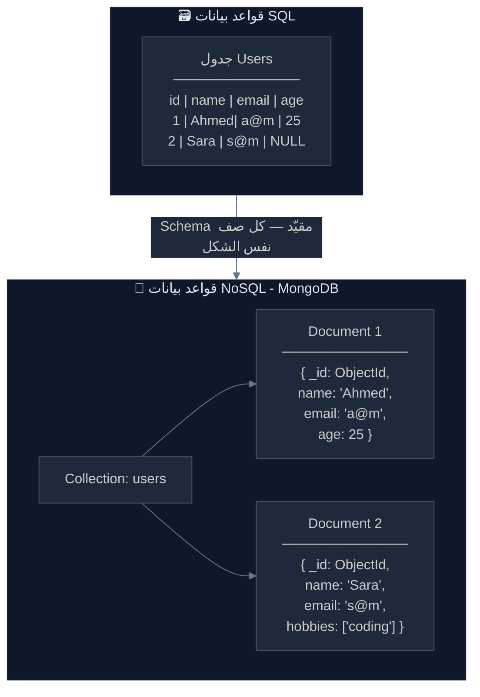
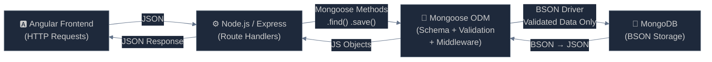
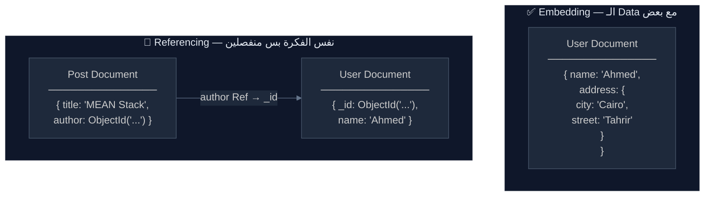

# 🗄️ MongoDB & Mongoose — Crash Course & Interview Vault
> **المهمة:** من الصفر لـ Hero في ليلة واحدة — دفاع المشروع بكره والـ Vault ده سلاحك.
> **اللغة:** عامية مصرية تقنية 🇪🇬 + English Technical Terms
> **المستوى:** Junior → Mid-Level

---

## 🗺️ الـ Roadmap

```
Module 1 → NoSQL & MongoDB Core (الأساس الجوهري)
Module 2 → Mongoose Basics (Schema, Model, Connection)
Module 3 → CRUD Operations (الـ 4 عمليات الأساسية)
Module 4 → Refs & Populate (العلاقات في NoSQL)
Module 5 → Ultimate Defense Questions (أسئلة الدكاترة الكبيرة)
```

---

# 🏛️ Module 1: The Core — NoSQL, Collections, Documents, BSON

## 🤔 إيه الفرق بين SQL و NoSQL؟ — القصة الكاملة

تخيل إنك بتحفظ بيانات الـ Users في مشروعك.

في **SQL (زي MySQL):** عندك **Table** ثابتة الشكل — كل صف فيها لازم يحتوي على نفس الـ Columns بالظبط. لو user مش عنده profile picture؟ هتحط `NULL`. الـ Structure صارم زي الجيش.

في **NoSQL (MongoDB):** عندك **Collection** — وكل عنصر فيها (اتسمى **Document**) ممكن يبقى شكله مختلف عن التاني تماماً. User1 عنده `profilePicture`، User2 مش عنده — وده طبيعي 100%.



---

> [!abstract] 🧠 المفهوم المعماري (The Concept)
> **SQL vs NoSQL — تحت الكبوت:**
>
> | المعيار | SQL (Relational) | NoSQL (MongoDB) |
> |---|---|---|
> | **الوحدة الأساسية** | Table → Row | Collection → Document |
> | **الـ Schema** | Rigid (ثابت) | Flexible (مرن) |
> | **العلاقات** | Foreign Keys + JOINs | Embedding أو References |
> | **الـ Scaling** | Vertical (أقوى سيرفر) | Horizontal (سيرفرات أكتر) |
> | **الـ Query Language** | SQL | MongoDB Query Language (MQL) |
> | **الـ Data Format** | Rows & Columns | BSON Documents |
>
> **امتى تختار MongoDB؟** لما الـ Data مش ثابتة الشكل، لما محتاج تخزن Nested Objects، أو لما الـ Scale هيبقى كبير جداً.

---

> [!question] 🎯 سؤال انترفيو مشهور — SQL vs NoSQL
>
> **Q1 (Junior): إيه الفرق بين SQL و NoSQL؟**
> **A:** SQL بتخزن البيانات في Tables بـ Schema ثابت وبتستخدم JOINs للعلاقات. NoSQL زي MongoDB بتخزن بيانات كـ Documents مرنة في Collections من غير Schema صارم، وبتعتمد على Embedding أو References بدل JOINs.
>
> **Q2 (Junior): امتى تختار MongoDB على MySQL؟**
> **A:** لو الـ Data غير منتظمة الشكل (مثلاً Products بخصائص مختلفة)، لو محتاج Horizontal Scaling، أو لو بتبني تطبيقات Real-time محتاجة سرعة.
>
> **Q3 (Mid): إيه هي مشكلة الـ Joins في SQL عند الـ Scale الكبير؟**
> **A:** الـ JOINs بتعمل Load كبير على قاعدة البيانات لأنها بتجمع بيانات من Tables متعددة في الـ Memory. لما الـ Data تبقى بالملايين، الأداء بيتراجع بشكل ملحوظ. MongoDB بتحل ده بـ Embedding الـ related data مع بعضها في نفس الـ Document.
>
> **Q4 (Mid): هل MongoDB بتدعم Transactions؟**
> **A:** آه! من الـ Version 4.0 بيدعم Multi-Document ACID Transactions. قبل كده كان بيدعم بس Single-Document atomicity.

---

## 📄 Document & Collection — الـ Building Blocks

**الـ Document** هو قلب MongoDB. هو **JSON Object** بس بيتخزن على الـ Disk كـ **BSON** (Binary JSON).

```json
{
  "_id": "507f1f77bcf86cd799439011",
  "name": "Ahmed Mostafa",
  "email": "ahmed@example.com",
  "age": 25,
  "address": {
    "city": "Cairo",
    "country": "Egypt"
  },
  "skills": ["Node.js", "Angular", "MongoDB"]
}
```

> [!abstract] 🧠 المفهوم المعماري — BSON vs JSON
>
> **JSON** هو اللي إنت بتشوفه وبتكتبه. **BSON** هو اللي MongoDB بتخزنه فعلاً على الـ Disk.
>
> **ليه BSON؟** لأنه:
> 1. **أسرع في الـ Parsing** — Binary format أسرع من Text parsing
> 2. **بيدعم Types أكتر** — زي `ObjectId`, `Date`, `Int32`, `Int64`, `Decimal128`
> 3. **JSON مش بيدعم Dates** — هتخزنها كـ String وهيبقى مجهود زيادة
>
> **الـ `_id`:** كل Document بيتولد ليه `_id` تلقائياً من MongoDB. ده الـ **ObjectId** — 12 bytes بتعبر عن:
> - 4 bytes: Timestamp (امتى اتعمل)
> - 5 bytes: Machine ID + Process ID
> - 3 bytes: Random Counter
>
> يعني الـ `_id` نفسه بيقولك **امتى** الـ Document اتعمل!

---

> [!question] 🎯 سؤال انترفيو مشهور — Document & ObjectId
>
> **Q1 (Junior): إيه هو الـ ObjectId في MongoDB؟**
> **A:** هو الـ Primary Key التلقائي لكل Document. بيبقى 12 bytes وبيتولد بطريقة ضامنة إنه Unique حتى على سيرفرات مختلفة.
>
> **Q2 (Junior): إيه الفرق بين JSON و BSON؟**
> **A:** JSON هو Text format بتكتبه وبتقرأه، BSON هو Binary format بتخزنه MongoDB. BSON أسرع وبيدعم أنواع بيانات أكتر زي الـ Date والـ ObjectId.
>
> **Q3 (Mid): ممكن تغير الـ `_id` بتاع Document؟**
> **A:** لأ! الـ `_id` Immutable — ما بيتغيرش بعد ما الـ Document يتعمل. لو محتاج تغيره، لازم تحذف الـ Document وتعمل واحد جديد.

---

> [!example] 🏗️ سؤال في مناقشة المشروع
>
> **الدكتور:** "إيه هي الـ Collections اللي في مشروعكم وإيه هو الـ Document Schema بتاع كل واحدة؟"
>
> **الإجابة المثالية:** "عندنا مثلاً Collection اسمها `users` وفيها Documents بتمثل كل User. عندنا كمان Collection `products` أو `books` أو حسب المشروع. كل Document بياخد `_id` تلقائياً من MongoDB كـ ObjectId وده بيضمن الـ Uniqueness. اخترنا MongoDB لأن الـ Data بتاعتنا [اذكر سبب حقيقي من مشروعك — مثلاً: Products بخصائص مختلفة أو Users بـ Nested Profiles]."

---

# 🐍 Module 2: Mongoose Basics — ليه محتاجينه؟

## الحكاية: MongoDB Driver vs Mongoose

تخيل إنك بتكلم قاعدة البيانات بالـ **Raw MongoDB Driver** — هتبعت Documents من غير أي ضمان على الشكل. مش هتعرف لو Field ناقصة أو Type غلط غير لما تيجي تقرأ البيانات وتلاقيها خربانة.

**Mongoose** هو الـ **ODM (Object Data Modeling)** library — هو الـ "حارس" اللي بيقف بين Node.js وبين MongoDB. بيديك:

1. **Schema:** "عقد" بيحدد شكل الـ Document قبل ما يتحفظ
2. **Validation:** بيتحقق من الـ Data قبل ما تدخل قاعدة البيانات
3. **Middleware (Hooks):** بينفذ كود تلقائياً قبل أو بعد Operations معينة
4. **Helper Methods:** `.find()`, `.save()`, `.populate()` وغيرها



---

## 🏗️ الـ Schema — العقد

الـ **Schema** هو "Blueprint" الـ Document. هو بيقول لـ Mongoose: "الـ Document بتاعتي شكله كده بالظبط."

```js
const mongoose = require('mongoose');

// تعريف الـ Schema
const userSchema = new mongoose.Schema(
  {
    name: {
      type: String,
      required: [true, 'الاسم مطلوب'],
      trim: true,
      minlength: 2,
      maxlength: 50
    },
    email: {
      type: String,
      required: true,
      unique: true,
      lowercase: true
    },
    age: {
      type: Number,
      min: 0,
      max: 120
    },
    role: {
      type: String,
      enum: ['user', 'admin', 'moderator'],
      default: 'user'
    },
    isActive: {
      type: Boolean,
      default: true
    },
    createdAt: {
      type: Date,
      default: Date.now
    }
  },
  {
    timestamps: true   // بيضيف createdAt و updatedAt تلقائياً
  }
);
```

---

## 🏭 الـ Model — المصنع

الـ **Model** هو "المصنع" اللي بتاخده من الـ Schema وبتستخدمه في الكود عشان تعمل CRUD. جملة واحدة بتحول الـ Schema لـ Model:

```js
const User = mongoose.model('User', userSchema);
// 'User' → اسم الـ Model (Mongoose هيعمل Collection اسمها 'users' تلقائياً — بالـ Plural والـ Lowercase)

module.exports = User;
```

> [!abstract] 🧠 المفهوم المعماري — Schema vs Model
>
> | | Schema | Model |
> |---|---|---|
> | **هو إيه؟** | Blueprint / تعريف الشكل | المصنع / الـ Interface للـ DB |
> | **بيعمل إيه؟** | بيحدد الـ Fields والـ Types والـ Validation | بيتيح عمل CRUD على الـ Collection |
> | **Analogy** | "فرم الطوب" | "المصنع اللي بيعمل الطوب" |
> | **Class Analogy** | الـ Class Definition | الـ Class نفسها جاهزة للـ Instantiation |
>
> **الـ Connection:** بتوصل Mongoose بـ MongoDB مرة واحدة في بداية الـ App:
>
> ```js
> mongoose.connect('mongodb://localhost:27017/myapp')
>   .then(() => console.log('✅ MongoDB Connected'))
>   .catch(err => console.error('❌ Connection Error:', err));
> ```

---

> [!question] 🎯 سؤال انترفيو مشهور — Mongoose Basics
>
> **Q1 (Junior): إيه الفرق بين Schema و Model في Mongoose؟**
> **A:** الـ Schema هو التعريف — بيحدد شكل الـ Document والـ Fields والـ Validation. الـ Model بياخد الـ Schema ويحوله لـ Interface نقدر نعمل بيه CRUD Operations على الـ MongoDB Collection.
>
> **Q2 (Junior): إيه هو ODM وإيه الفرق بينه وبين ORM؟**
> **A:** الـ ORM (Object Relational Mapping) بيشتغل مع Relational DBs زي MySQL. الـ ODM (Object Document Mapping) بيشتغل مع Document Databases زي MongoDB. Mongoose هو الـ ODM الأشهر لـ Node.js.
>
> **Q3 (Mid): إيه هو الـ `timestamps: true` في الـ Schema Options وليه بنستخدمه؟**
> **A:** بيخلي Mongoose يضيف تلقائياً `createdAt` و `updatedAt` لكل Document. `createdAt` بيتضبط لما الـ Document يتعمل ومش بيتغير. `updatedAt` بيتحدث تلقائياً مع كل عملية Update. ده أحسن من إنك تعملهم يدوياً.
>
> **Q4 (Mid): إيه هو الفرق بين `required: true` و `unique: true` في الـ Schema؟**
> **A:** `required: true` بيمنع حفظ الـ Document لو الـ Field مش موجودة — ده Mongoose-level Validation. `unique: true` بيعمل MongoDB Index بيضمن إن مفيش Documents تانية بنفس القيمة — ده Database-level Constraint. الفرق إن `unique` Index بياخد وقت شوية لما الـ Collection تكبر.

---

> [!example] 🏗️ سؤال في مناقشة المشروع
>
> **الدكتور:** "ليه استخدمتوا Mongoose وما استخدمتوش الـ MongoDB Driver مباشرةً؟"
>
> **الإجابة:** "Mongoose بيوفرلنا 3 حاجات مكنتش هنعملهم بيدنا:
> 1. **الـ Schema Validation** — بيضمن إن الـ Data الغلط ما تدخلش قاعدة البيانات خالص
> 2. **الـ Middleware (Hooks)** — استخدمناه مثلاً في **Hash الـ Password** قبل الحفظ بـ `pre('save')`
> 3. **الـ Populate** — عشان نـ Resolve الـ References بين الـ Collections بسهولة
>
> لو استخدمنا الـ Driver الخام كنا هنكتب Validation Code يدوي في كل Route وده Error-prone."

---

# ⚡ Module 3: CRUD Operations — الطريقة الصح

## الحكاية: إزاي بتتكلم مع Mongoose

الـ CRUD Operations في Mongoose بترجع **Promises** — يعني لازم `async/await` أو `.then()/.catch()`.

---

## 📥 CREATE — إنشاء Documents

**طريقتين:**

```js
// طريقة 1: new + save()
const createUser = async (userData) => {
  const user = new User(userData);   // بيعمل Instance من الـ Model
  await user.save();                 // بيحفظه في MongoDB
  return user;
};

// طريقة 2: Model.create() — أسرع وأقل كود
const createUser = async (userData) => {
  const user = await User.create(userData);
  return user;
};

// Create Multiple Documents دفعة واحدة
const users = await User.insertMany([
  { name: 'Ahmed', email: 'ahmed@test.com' },
  { name: 'Sara',  email: 'sara@test.com'  }
]);
```

> [!abstract] 🧠 المفهوم المعماري — new+save vs create
>
> **`new User() + save()`:** بيعمل Instance في الـ Memory الأول. ده بيتيح لك تعمل حاجات على الـ Object قبل ما تحفظه، وكمان بيشغّل الـ `pre('save')` Middleware.
>
> **`User.create()`:** Shorthand أسرع في الكتابة وبيشغّل الـ Middleware كمان. مناسب لما مش محتاج تعمل حاجة على الـ Object قبل الحفظ.

---

## 🔍 READ — قراءة Documents

```js
// جيب كل الـ Users
const getAllUsers = async () => {
  return await User.find({});
};

// جيب Users بشرط معين
const getActiveUsers = async () => {
  return await User.find({ isActive: true, role: 'user' });
};

// جيب User واحد بالـ ID
const getUserById = async (id) => {
  return await User.findById(id);
  // نفس:  User.findOne({ _id: id })
};

// جيب User واحد بشرط
const getUserByEmail = async (email) => {
  return await User.findOne({ email });
};

// Query Operators — المقارنات
const advancedQuery = async () => {
  return await User.find({
    age: { $gte: 18, $lte: 60 },    // بين 18 و 60
    role: { $in: ['admin', 'user'] } // من الليستة دي
  });
};

// Chaining Methods — تحكم في النتيجة
const pagedUsers = await User
  .find({ isActive: true })
  .select('name email -_id')  // جيب بس الـ Fields دي (اشل الـ _id)
  .sort({ name: 1 })          // رتّب تصاعدي
  .limit(10)                  // أول 10 فقط
  .skip(20);                  // ابدأ من الـ 21
```

> [!abstract] 🧠 المفهوم المعماري — Query Operators
>
> MongoDB ليها "لغة استعلام" خاصة بيها بتستخدم الـ `$` prefix:
>
> | Operator | المعنى | مثال |
> |---|---|---|
> | `$gt` / `$gte` | أكبر من / أكبر أو يساوي | `{ age: { $gte: 18 } }` |
> | `$lt` / `$lte` | أصغر من / أصغر أو يساوي | `{ price: { $lt: 100 } }` |
> | `$in` | في الليستة | `{ role: { $in: ['admin'] } }` |
> | `$ne` | مش يساوي | `{ status: { $ne: 'banned' } }` |
> | `$exists` | الـ Field موجودة أصلاً؟ | `{ phone: { $exists: true } }` |
> | `$regex` | نص بيتطابق مع Pattern | `{ name: { $regex: /ahmed/i } }` |

---

## ✏️ UPDATE — تحديث Documents

```js
// حدّث Document واحد — بيرجع الـ Document القديم افتراضياً
const updateUser = async (id, updateData) => {
  return await User.findByIdAndUpdate(
    id,
    { $set: updateData },      // ← ⚠️ مهم جداً: استخدم $set دايماً!
    { new: true, runValidators: true }
  );
};

// حدّث أول Document بشرط
await User.findOneAndUpdate(
  { email: 'ahmed@test.com' },
  { $set: { isActive: false } },
  { new: true }
);

// حدّث عدة Documents
await User.updateMany(
  { role: 'user' },
  { $set: { isActive: true } }
);

// Update Operators شائعة
await User.findByIdAndUpdate(id, {
  $set:   { name: 'New Name' },     // بيضبط قيمة Field
  $inc:   { age: 1 },               // بيزوّد بالرقم ده
  $push:  { skills: 'Docker' },     // بيضيف لـ Array
  $pull:  { skills: 'PHP' },        // بيشيل من Array
  $unset: { temporaryField: '' }    // بيحذف الـ Field نفسها
});
```

> [!abstract] 🧠 المفهوم المعماري — ⚠️ لماذا `$set` ضروري؟
>
> **الخطر الكبير:** لو عملت Update من غير `$set`:
>
> ```js
> // ❌ خطأ قاتل — هيمسح كل الـ Document ويحط بس الاسم!
> await User.findByIdAndUpdate(id, { name: 'Ahmed' });
>
> // ✅ صح — بيغير بس الـ name ويسيب باقي الـ Fields
> await User.findByIdAndUpdate(id, { $set: { name: 'Ahmed' } });
> ```
>
> من غير `$set`، MongoDB بتعمل **Replace** للـ Document كله، مش **Merge**!
>
> **`{ new: true }`:** بيخلي الـ Method ترجع الـ Document **بعد** التعديل مش قبله.
> **`{ runValidators: true }`:** بيشغّل الـ Schema Validation حتى في الـ Update.

---

## 🗑️ DELETE — حذف Documents

```js
// احذف Document واحد بالـ ID
const deleteUser = async (id) => {
  return await User.findByIdAndDelete(id);
};

// احذف Document واحد بشرط
await User.findOneAndDelete({ email: 'spam@test.com' });

// احذف عدة Documents
const result = await User.deleteMany({ isActive: false });
console.log(result.deletedCount); // عدد اللي اتحذفوا
```

---

> [!question] 🎯 سؤال انترفيو مشهور — CRUD
>
> **Q1 (Junior): إيه الفرق بين `find()` و `findOne()`؟**
> **A:** `find()` بيرجع Array من كل الـ Documents المطابقة (ممكن تبقى فاضية). `findOne()` بيرجع أول Document واحد مطابق أو `null`. في الغالب لما تدور على Document بـ ID أو Email بتستخدم `findOne()` أو `findById()`.
>
> **Q2 (Junior): إيه الفرق بين `findByIdAndUpdate` و `updateMany`؟**
> **A:** `findByIdAndUpdate` بيحدث Document واحد بالـ ID وبيرجعه. `updateMany` بيحدث كل الـ Documents المطابقة للشرط ومش بيرجع الـ Documents — بيرجع بس Object فيه `matchedCount` و `modifiedCount`.
>
> **Q3 (Mid): ليه لازم نستخدم `$set` في الـ Update؟**
> **A:** لأن من غير `$set`، MongoDB بتعمل Replace للـ Document بالكامل بالـ Object اللي بعتيه. `$set` بيقول لـ MongoDB "غيّر بس الـ Fields دي وسيّب الباقي."
>
> **Q4 (Mid): إيه هو الفرق بين `deleteOne` و `findOneAndDelete`؟**
> **A:** `deleteOne` بيحذف بس ومش بيرجع الـ Document المحذوف. `findOneAndDelete` بيحذف ويرجع الـ Document قبل ما يتحذف — مفيد لو محتاج تعمل حاجة بالـ Data بعد الحذف.

---

> [!example] 🏗️ سؤال في مناقشة المشروع
>
> **الدكتور:** "إزاي بتعملوا الـ Update في مشروعكم وإيه الـ Validation اللي بتعملوه؟"
>
> **الإجابة:** "بنستخدم `findByIdAndUpdate` مع `$set` عشان نضمن إننا بنعدل بس الـ Fields المطلوبة ومش بنعمل Replace للـ Document كله. بنحط `{ new: true, runValidators: true }` عشان نرجع النسخة الجديدة وعشان Mongoose يشغّل الـ Schema Validation على الـ Update نفسه. الـ ID بنجيبه من الـ `req.params` والـ Data من الـ `req.body`."

---

# 🔗 Module 4: Refs & Populate — العلاقات في NoSQL

## الحكاية: إزاي بتعمل "Relations" في MongoDB؟

في SQL، العلاقات بتتعمل بـ **Foreign Keys** و **JOINs**. في MongoDB، عندك خيارين:

**خيار 1: Embedding (التضمين)** — بتحط الـ Data الـ Related جوا نفس الـ Document.
**خيار 2: Referencing (الإسناد)** — بتحط بس الـ `_id` وبتـ Resolve العلاقة لما تحتاجها.



---

## 📌 الـ Schema مع Refs

```js
// User Model
const userSchema = new mongoose.Schema({
  name:  { type: String, required: true },
  email: { type: String, required: true }
});
const User = mongoose.model('User', userSchema);

// Post Model — فيه Reference للـ User
const postSchema = new mongoose.Schema({
  title: { type: String, required: true },
  body:  { type: String, required: true },
  author: {
    type: mongoose.Schema.Types.ObjectId,  // ← بنقول إنه ObjectId
    ref: 'User',                           // ← وبيـ Reference مين
    required: true
  },
  tags: [String]
}, { timestamps: true });

const Post = mongoose.model('Post', postSchema);
```

---

## 🪄 الـ Populate — السحر الحقيقي

```js
// بدون Populate — هتلاقي بس ObjectId
const post = await Post.findById(postId);
// post.author → "507f1f77bcf86cd799439011"  (ObjectId فقط — مش مفيد)

// ✅ مع Populate — Mongoose بيعمل Query تانية ويجيب الـ User
const post = await Post.findById(postId).populate('author');
// post.author → { _id: "...", name: "Ahmed", email: "ahmed@..." }

// Populate حقل معين بس (مش كل الـ User)
const post = await Post.findById(postId)
  .populate('author', 'name email -_id');  // جيب بس name و email

// Populate متعدد — لو عندك References أكتر من واحد
const post = await Post.findById(postId)
  .populate('author', 'name')
  .populate('category', 'title');

// Populate في find() العادي
const posts = await Post.find({ isPublished: true })
  .populate('author', 'name')
  .sort({ createdAt: -1 });
```

> [!abstract] 🧠 المفهوم المعماري — Populate تحت الكبوت
>
> **Populate مش JOIN!** هو بيعمل **Query تانية** منفصلة على الـ Referenced Collection.
>
> يعني لما بتعمل `Post.find().populate('author')`:
> 1. Mongoose بيعمل `db.posts.find()` → بيجيب كل الـ Posts
> 2. بيجمع كل الـ `author` IDs
> 3. بيعمل `db.users.find({ _id: { $in: [id1, id2, ...] } })` → جيب الـ Users دول
> 4. بيـ Map كل User على الـ Post بتاعه
>
> **الفرق المهم:** SQL JOIN بيتعمل في الـ DB. Populate بيتعمل في الـ Application Level.
>
> **امتى Embedding أحسن من Referencing؟**
>
> | Embedding ✅ | Referencing ✅ |
> |---|---|
> | البيانات دايماً بتتقرأ مع بعض | البيانات بتتقرأ منفصلة أحياناً |
> | الـ Sub-document ما بيتشاركش | الـ Document بيتشارك بين أكتر من Parent |
> | البيانات مش كبيرة | البيانات ممكن تكبر بلا حدود |
> | مثال: User + Address | مثال: Post + Author (User) |

---

## 🔒 Middleware (Hooks) — السحر الخفي

```js
// قبل الحفظ — hash الـ password تلقائياً
userSchema.pre('save', async function(next) {
  // this → الـ Document اللي هيتحفظ
  if (!this.isModified('password')) return next(); // لو الـ password ماتغيرش، تجاوز
  
  const bcrypt = require('bcrypt');
  this.password = await bcrypt.hash(this.password, 10);
  next();
});

// بعد الحفظ — مثلاً log أو إرسال Welcome Email
userSchema.post('save', function(doc, next) {
  console.log(`✅ User ${doc.name} saved successfully`);
  next();
});

// قبل أي find — مثلاً exclude المحذوفين تلقائياً
userSchema.pre(/^find/, function(next) {
  this.find({ isDeleted: { $ne: true } });
  next();
});
```

> [!abstract] 🧠 المفهوم المعماري — pre vs post Middleware
>
> | | `pre` Hook | `post` Hook |
> |---|---|---|
> | **بيتشغل امتى؟** | قبل العملية | بعد العملية |
> | **الـ `this`** | الـ Document أو الـ Query | الـ Document الناتج |
> | **استخدامات شائعة** | Hash Password, Set defaults, Validate | Logging, Send Email, Cleanup |
> | **مهم:** | لازم تنادي `next()` | لازم تنادي `next()` |

---

> [!question] 🎯 سؤال انترفيو مشهور — Populate & Middleware
>
> **Q1 (Junior): إيه هو الـ Populate في Mongoose وإزاي بيشتغل؟**
> **A:** الـ Populate بيحل محل الـ ObjectId Reference بالـ Document الحقيقي. Mongoose بيعمل Query تانية على الـ Referenced Collection ويجيب الـ Data ويحوطها في الـ Object. هو Application-level operation مش Database JOIN.
>
> **Q2 (Junior): إيه الفرق بين Embedding و Referencing في MongoDB؟**
> **A:** Embedding بتحط الـ Related Data جوا نفس الـ Document — أسرع في القراءة بس ممكن تتكرر. Referencing بتحط بس الـ ObjectId — أنظف وبتتجنب التكرار بس بتحتاج Populate.
>
> **Q3 (Mid): إيه هو الـ Mongoose Middleware وامتى تستخدمه؟**
> **A:** الـ Middleware بيتيح تنفيذ كود تلقائياً قبل أو بعد Operations زي save, find, delete. أشهر استخداماته: Hash الـ Password في `pre('save')`، Logging في `post('save')`، وـ Filter البيانات المحذوفة تلقائياً في `pre('find')`.
>
> **Q4 (Mid): في الـ `pre('save')` Middleware، ليه بنعمل `if (!this.isModified('password')) return next()`؟**
> **A:** لأن الـ `pre('save')` بيتشغل في أي Update للـ Document، مش بس لما يتعمل. لو User غيّر اسمه بس، من غير الـ Check ده كنا هنعمل Hash للـ Password مرة تانية — وده كارثي لأن الـ Hashed Password ستتـ Hash مرة تانية وما هيقدرش يـ Login بعدين!

---

> [!example] 🏗️ سؤال في مناقشة المشروع
>
> **الدكتور:** "كيف طبقتوا العلاقات بين الـ Collections في مشروعكم؟"
>
> **الإجابة:** "استخدمنا الـ Referencing. مثلاً في الـ `Post` Schema، الـ `author` Field نوعه `mongoose.Schema.Types.ObjectId` وعنده `ref: 'User'`. لما بنجيب الـ Posts بنعمل `.populate('author')` عشان Mongoose يجيب بيانات الـ User الكاملة. اخترنا Referencing لأن الـ User ممكن يبقى Author لـ Posts كتير، فلو حطينا بياناته Embedded في كل Post كنا هنكرر بيانات ضخمة ولو User غير اسمه كنا هنحدث Records بالمئات."

---

# 🏆 Module 5: The Ultimate Defense Questions

## أسئلة الدكاترة الكبيرة — اللي بتيجي دايماً في الـ MEAN Defenses

---

### ❓ السؤال الأول: "وصف لي الـ Architecture بتاع مشروعكم من الأول للآخر"

> [!question] 🎯 الإجابة المثالية
>
> "مشروعنا MEAN Stack:
>
> **M — MongoDB:** قاعدة البيانات. بتخزن الـ Data كـ BSON Documents في Collections. عندنا Collections زي [اذكر الخاصة بمشروعك].
>
> **E — Express.js:** الـ Web Framework فوق Node.js. بيتعامل مع الـ HTTP Requests ويـ Route كل Request للـ Controller المناسب.
>
> **A — Angular:** الـ Frontend SPA. بيتكلم مع الـ Backend عن طريق الـ HttpClient. كل Component بيعمل Subscribe على Observable من الـ Service.
>
> **N — Node.js:** الـ Runtime البيشغّل Express. بيستخدم Event Loop بدل Threads — عشان كده مناسب للـ I/O الكتير.
>
> **الـ Flow:** Angular → HTTP Request → Express Router → Middleware (Auth) → Controller → Mongoose Model → MongoDB → Response يرجع بنفس الطريق."

---

### ❓ السؤال الثاني: "كيف عملتوا الـ Authentication في المشروع؟"

> [!question] 🎯 الإجابة المثالية
>
> "استخدمنا **JWT (JSON Web Token)**:
>
> 1. **Login:** User بيبعت Email + Password → Express بيجيب الـ User من MongoDB → بيـ Compare الـ Password المبعوتة مع الـ Hashed Password باستخدام `bcrypt.compare()` → لو صح بنعمل `jwt.sign()` بـ Payload فيها الـ User ID والـ Role وبنبعت الـ Token.
>
> 2. **الـ Hashing:** الـ Password اتعملت Hash بـ `bcrypt` في الـ Mongoose `pre('save')` Middleware — ده معناه إن الـ Plain Password ما وصلتش قاعدة البيانات خالص.
>
> 3. **الـ Protected Routes:** عملنا Auth Middleware بيمسك الـ Token من الـ `Authorization: Bearer <token>` Header → يعمل `jwt.verify()` → لو صح بيحط الـ User على `req.user` → الـ Controller بياخد الـ User منه.
>
> 4. **Angular Side:** بنحفظ الـ Token في `localStorage` وعندنا HTTP Interceptor بيضيفه تلقائياً على كل Request."

---

### ❓ السؤال الثالث: "إيه هو الـ Error Handling في مشروعكم؟"

> [!question] 🎯 الإجابة المثالية
>
> "عملنا **Centralized Error Handling** في Express:
>
> ```js
> // Global Error Handler Middleware — آخر حاجة في الـ app.js
> app.use((err, req, res, next) => {
>   const statusCode = err.statusCode || 500;
>   res.status(statusCode).json({
>     status: 'error',
>     message: err.message || 'Internal Server Error'
>   });
> });
> ```
>
> أي Route بتعمل `next(error)` أو بترمي Error في async function بيوصل للـ Handler ده. ده أحسن من إننا نتعامل مع الـ Errors في كل Route لوحدها."

---

### ❓ السؤال الرابع: "هل MongoDB بتدعم الـ Transactions؟ وهل استخدمتوها؟"

> [!question] 🎯 الإجابة المثالية
>
> "آه، MongoDB بيدعم **Multi-Document ACID Transactions** من الـ Version 4.0.
>
> في مشروعنا [لو استخدمتوها]: استخدمناها في [اذكر الحالة — مثلاً: عند إنشاء Order بنعمل Update على الـ Product Inventory وبنضيف Order Document في نفس الوقت. لو حاجة فشلت هنعمل Rollback للاتنين مع بعض].
>
> ```js
> const session = await mongoose.startSession();
> session.startTransaction();
> try {
>   await Order.create([orderData], { session });
>   await Product.findByIdAndUpdate(productId, { $inc: { stock: -1 } }, { session });
>   await session.commitTransaction();
> } catch (err) {
>   await session.abortTransaction();
>   throw err;
> } finally {
>   session.endSession();
> }
> ```
>
> [لو ما استخدمتوهاش]: مشروعنا ما احتاجناش multi-document transactions لأن كل عملياتنا على Document واحد في نفس الوقت. MongoDB دايماً Atomic على مستوى الـ Single Document."

---

### ❓ السؤال الخامس: "ليه MongoDB وما اخترتوش MySQL أو PostgreSQL؟"

> [!question] 🎯 الإجابة المثالية
>
> "اخترنا MongoDB لـ 3 أسباب رئيسية:
>
> 1. **المرونة:** الـ Data بتاعتنا [اذكر مثال — مثلاً: Products بخصائص مختلفة جداً من نوع لنوع] — Schema ثابت في SQL كان هيحتاج جداول كتير وـ JOINs معقدة. MongoDB بيخلينا نحط الـ Nested Data طبيعي في Document.
>
> 2. **الـ MEAN Stack Compatibility:** MongoDB بيرجع JSON تلقائياً، Angular وNode.js بيتعاملوا مع JSON — يعني الـ Data بتتدفق بشكل طبيعي في الـ Stack كله من غير Transformation.
>
> 3. **الـ Developer Experience:** مع Mongoose عندنا Schema Validation + Middleware + Populate بيسهّل علينا الشغل كتير.
>
> **الـ Trade-off اللي عارفينه:** MongoDB مش ideal لو البيانات highly relational جداً زي ERP Systems — دول أحسن مع PostgreSQL."

---

# 🚨 زتونة الإنترفيو — أسرع مراجعة قبل النوم

```
✅ Document    = الـ Row في MongoDB (JSON/BSON Object)
✅ Collection  = الـ Table في MongoDB
✅ _id         = Primary Key تلقائي (ObjectId)
✅ Schema      = Blueprint الـ Document (Mongoose)
✅ Model       = المصنع اللي بيعمل CRUD (Mongoose)
✅ $set        = لازم في Update عشان متمسحش الـ Document
✅ populate()  = بيحل الـ Reference لـ Document حقيقي
✅ pre('save') = Middleware بيشتغل قبل الحفظ (مثلاً Hash Password)
✅ { new: true } = يرجع الـ Document بعد التعديل مش قبله
✅ BSON        = Binary JSON (أسرع + يدعم Types أكتر)
✅ Embedding   = حط الـ Data جوا الـ Document (للـ Data اللي دايماً مع بعض)
✅ Referencing = حط ObjectId وـ Populate لما تحتاجه (للـ Data المشتركة)
```

---

# ⚡ Quick Reference — أسرع cheatsheet

## أهم الـ Schema Types

```js
String, Number, Boolean, Date, Buffer,
mongoose.Schema.Types.ObjectId,
mongoose.Schema.Types.Mixed,   // أي حاجة
[String],                      // Array of Strings
[{ type: ObjectId, ref: 'Model' }]  // Array of References
```

## أهم الـ Validators

```js
required: true / [true, 'Error message']
unique: true
default: value / function
min: / max:            // للـ Number
minlength: / maxlength:  // للـ String
enum: ['val1', 'val2']
match: /regex/
validate: { validator: fn, message: '' }
```

## أهم الـ Query Methods

```js
Model.find(filter)
Model.findOne(filter)
Model.findById(id)
Model.findByIdAndUpdate(id, update, options)
Model.findByIdAndDelete(id)
Model.create(data)
Model.insertMany([data])
Model.updateMany(filter, update)
Model.deleteMany(filter)
Model.countDocuments(filter)
Model.distinct('field')
```

## أهم الـ Chain Methods

```js
.select('field1 field2 -field3')
.sort({ field: 1 / -1 })
.limit(n)
.skip(n)
.populate('field', 'select')
.lean()   // يرجع Plain JS Object بدل Mongoose Document (أسرع)
```

---

> [!abstract] 🧠 نصيحة أخيرة قبل الدفاع
>
> **الـ 3 جمل اللي هتنقذك لو نسيت حاجة:**
>
> 1. "استخدمنا MongoDB لأن Data بتاعتنا Document-oriented ومحتاجين Flexibility في الـ Schema."
> 2. "Mongoose بيديّنا Schema Validation وـ Middleware زي pre-save اللي استخدمناه في Hash الـ Password."
> 3. "العلاقات بين الـ Collections بنعملها بـ Referencing وبنجيب الـ Data الكاملة بـ Populate."
>
> **ربنا يوفقكم** 🤲 — إنتوا عارفين أكتر مما بتفتكروا. الـ Vault ده هيفضل معاكم. 💪

---

*🏁 نهاية الـ Vault — MongoDB & Mongoose Crash Course*
*Last Updated: ليلة الدفاع 🌙*
