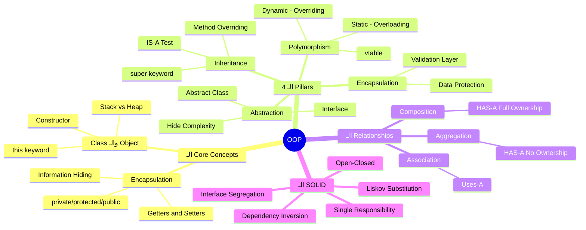

# 🏛️ الـ OOP Ultimate Interview Vault
### من الأساسيات لعقلية الـ Architect — في ملف واحد

> **المتطلبات:** معرفة أي لغة بيها Classes (Java أو C++) — مش محتاج تبقى expert، بس لازم تكون شفت syntax عدل.

---

## البداية — المشكلة الحقيقية اللي OOP اتعمل عشانها

تخيّل معايا إنك بتبني نظام بنك. الكود كله procedural — functions بتاخد arrays وبتشتغل عليها. كل function بتعدّل الـ data من بره. فجأة حد من الفريق عدّل balance الـ account من غير ما يمر بالـ validation. الكارثة حصلت.

```java
// ❌ الطريقة القديمة — double[] accounts — أي حاجة تلمس أي حاجة
double[] accounts = new double[100];

// أي function ممكن تعمل ده من غير أي حماية
accounts[5] = -99999; // ← ياسطا، ده مش مفروض يحصل خالص!
deductFees(accounts, 5, 50.0);
applyInterest(accounts, 5);
```

المشكلة مش في الـ functions. المشكلة إن الـ data والـ behavior مش متربطين ببعض. أي جزء في البرنامج يقدر يلمس أي data.

> بدل ما الـ data تبقى مكشوفة للعالم كله — OOP بيقولك: "اجمع الـ data مع السلوك اللي بيتعامل معاها في كيان واحد، وحمي الـ data دي."

---

# القسم الأول — الفلسفة الأساسية: Objects, Classes, والـ Memory

---

## Class vs Object — القالب والمنتج

الـ **Class** هي القالب. الـ **Object** هو المنتج اللي اتعمل من القالب ده.

بالظبط زي العفاريت 🍪 — عندك cookie cutter (الـ Class) وبتعمل منها كتير من الكعك (الـ Objects). كل كعكة عندها نفس الشكل بس ممكن يكون فيها حشو مختلف.

```java
// ✅ تعريف الـ Class — ده القالب بس، مش موجود في الـ memory لسه
class BankAccount {
    String owner;      // ← الـ fields: الـ data اللي بيميز كل object
    double balance;

    void deposit(double amount) {   // ← الـ method: السلوك
        balance += amount;
    }
}

// ✅ إنشاء الـ Objects — دلوقتي الـ memory اتحجزت
BankAccount ahmedAccount = new BankAccount(); // ← Object #1
BankAccount marwaAccount = new BankAccount(); // ← Object #2
// كل واحد فيهم عنده نسخته الخاصة من الـ owner والـ balance
```

---

## 🧠 تحت الغطا — الـ Stack vs Heap (اللي الناس بتنساه في الإنترفيو)

ده من أهم الأسئلة اللي بتتقالك فيها "اشرحلي إيه اللي بيحصل في الـ memory."

```
Stack Memory                    Heap Memory
┌─────────────────┐            ┌─────────────────────────────────┐
│  main() Frame   │            │                                 │
│ ┌─────────────┐ │            │  ┌──────────────────────────┐  │
│ │ ahmedAccount│─┼────────────▶  │  BankAccount Object #1   │  │
│ │ (reference) │ │            │  │  owner: "Ahmed"          │  │
│ └─────────────┘ │            │  │  balance: 5000.0         │  │
│ ┌─────────────┐ │            │  └──────────────────────────┘  │
│ │ marwaAccount│─┼────────────▶  ┌──────────────────────────┐  │
│ │ (reference) │ │            │  │  BankAccount Object #2   │  │
│ └─────────────┘ │            │  │  owner: "Marwa"          │  │
│                 │            │  │  balance: 12000.0        │  │
│  (متحذف لما     │            │  └──────────────────────────┘  │
│  الـ method     │            │                                 │
│  تخلص)         │            │  (بيفضل لحد ما الـ GC ياخده)   │
└─────────────────┘            └─────────────────────────────────┘
```

**اللي بيحصل هنا:**
- الـ **Stack** بيخزن الـ **references** (عناوين) — وبيتحذف تلقائياً لما الـ method تخلص.
- الـ **Heap** بيخزن الـ **Objects الحقيقيين** — الـ Garbage Collector هو المسؤول عن تنظيفهم.
- لما بتعمل `BankAccount b2 = ahmedAccount` — مش بتعمل نسخة! بتديه نفس العنوان. لو عدّلت على `b2`، `ahmedAccount` هيتأثر!

```java
BankAccount b1 = new BankAccount();
b1.balance = 5000;

BankAccount b2 = b1; // ← ❌ مش نسخة — نفس الـ object في الـ Heap!
b2.balance = 9999;

System.out.println(b1.balance); // 9999 — مش 5000!
// ده اللي بيسموه Aliasing Problem
```

> ⚠️ **انتبه:** النوع الـ primitive (int, double, boolean) بيتخزن في الـ Stack بقيمته مباشرة. بس الـ Objects بتتخزن في الـ Heap وبيبقى في الـ Stack reference ليهم بس.

---

## Constructor — البداية الرسمية لأي Object

```java
class BankAccount {
    String owner;
    double balance;

    // ← Constructor: بيتنادى تلقائياً لما بتعمل new
    BankAccount(String owner, double initialBalance) {
        this.owner = owner;           // ← this = الـ object الحالي اللي اتعمل
        this.balance = initialBalance;
        System.out.println("✅ Account created for: " + owner);
    }

    // Constructor Overloading — نفس الاسم، parameters مختلفة
    BankAccount(String owner) {
        this(owner, 0.0); // ← بيستدعي الـ constructor التاني
    }
}
```

---

> [!example] 🏗️ تطبيق واقعي — Banking System
>
> ```java
> // إنشاء البنك كامل بطريقة OOP
> BankAccount savings = new BankAccount("Ahmed Hassan", 10000.0);
> BankAccount current = new BankAccount("Ahmed Hassan"); // balance = 0 تلقائياً
>
> savings.deposit(5000);
> System.out.println(savings.balance); // 15000.0
> ```

---

# القسم الثاني — الـ 4 Pillars (الأعمدة الأربعة)

---

## العمود الأول — Encapsulation: اللي مش شغلتك متبقاش عارفه

تخيّل معايا ATM. إنت بتدخل الكارت، بتحط الـ PIN، بتاخد الفلوس. ما بتعرفش إيه اللي بيحصل جوا — مش شغلتك. الـ Encapsulation هو نفس الفكرة.

**المبدأ:** اخبّي الـ data الداخلية (private) واخلّي الوصول ليها بس من خلال methods محددة (public getters/setters).

```java
class BankAccount {
    private String owner;     // ← private: محدش يوصلها من بره الـ class
    private double balance;   // ← private: حماية كاملة
    private String pin;       // ← أكيد private!

    // ✅ Getter — بس مشاهدة
    public double getBalance() {
        return balance;
    }

    // ✅ Setter مع Validation — مش مجرد setter ساذج
    public void deposit(double amount) {
        if (amount <= 0) {
            throw new IllegalArgumentException("المبلغ لازم يكون أكبر من صفر");
            // ← لو الـ balance كان public، كان ممكن حد يحط -99999
        }
        this.balance += amount;
    }

    public boolean withdraw(double amount) {
        if (amount > balance) {
            System.out.println("❌ رصيد غير كافٍ");
            return false;
        }
        balance -= amount;
        return true;
    }
}
```

```java
// الـ Main
BankAccount acc = new BankAccount("Sara", 1000);
// acc.balance = -5000; // ← ❌ Compile Error — محمي!
acc.deposit(500);        // ✅ بس من خلال الـ method الرسمية
System.out.println(acc.getBalance()); // 1500.0
```

**ليه ده مهم؟** لأن لو غيّرت الـ internal implementation (مثلاً خليت الـ balance يتخزن بـ cents بدل dollars)، الكود الخارجي مش هيأثر عليه خالص.

---

### ✅ Checkpoint — Encapsulation

**س: إيه الفرق بين الـ private والـ protected والـ public؟**
> الـ `private` بيكون مرئي جوا الـ class بس. الـ `protected` بيكون مرئي جوا الـ class وأي subclass بتـ inherit منه، حتى لو في package تاني. الـ `public` مرئي للكل. في الـ encapsulation، القاعدة: "ابدأ بأكثر تقييداً — private — وافتح بس لما تحتاج."

**س: الـ getter والـ setter ده مش بيكسر الـ encapsulation؟**
> لو عملت setter بيقبل أي value من غير validation، أيوه ده بيكسر الـ encapsulation. الـ setter الصح هو اللي بيحوّل الـ field من مجرد variable لـ "بوابة مراقبة". الـ encapsulation مش في الـ syntax (private/public) بس — في الـ design.

**س: إيه هو الـ Information Hiding وإيه علاقته بالـ Encapsulation؟**
> الـ Encapsulation هو الـ mechanism (خبّي الـ data مع الـ methods في class). الـ Information Hiding هو الـ goal (المستخدم التاني ما يحتاجش يعرف التفاصيل الداخلية). الـ encapsulation هو الأداة، الـ information hiding هو الهدف.

---

## العمود الثاني — Abstraction: اظهر الـ "إيه" واخبّي الـ "إزاي"

الفرق بين الـ Encapsulation والـ Abstraction بيغلط فيه 90% من الناس في الإنترفيو.

- **Encapsulation** = تقدر توصل للـ data بس من خلال methods (hiding data)
- **Abstraction** = المستخدم بيعرف الـ interface بس، مش الـ implementation (hiding complexity)

تخيّل معايا ريموت التليفزيون. بتضغط زرار وصوت بيعلى. ما بتعرفش الـ infrared signals ولا الـ microcontroller جوا. ده هو الـ abstraction.

```java
// ✅ Abstraction بـ Abstract Class
abstract class PaymentProcessor {
    // هنا بنعرّف الـ "إيه" (Contract) — إزاي ده بيحصل مش مهم
    public abstract boolean processPayment(double amount);
    public abstract void refund(double amount);

    // Concrete method — مشترك بين كل processors
    public void printReceipt(double amount) {
        System.out.println("Receipt: Processed $" + amount);
    }
}

// كل Payment Method بتكمّل الـ "إزاي"
class CreditCardProcessor extends PaymentProcessor {
    @Override
    public boolean processPayment(double amount) {
        System.out.println("💳 Processing via Credit Card: $" + amount);
        // هنا بيحصل تواصل مع بنك، encryption، كل حاجة — مخبيين
        return true;
    }

    @Override
    public void refund(double amount) {
        System.out.println("💳 Refunding to Credit Card: $" + amount);
    }
}

class CryptoProcessor extends PaymentProcessor {
    @Override
    public boolean processPayment(double amount) {
        System.out.println("🪙 Processing via Crypto Wallet: $" + amount);
        return true;
    }

    @Override
    public void refund(double amount) {
        System.out.println("🪙 Returning Crypto: $" + amount);
    }
}
```

```java
// الـ main بيتعامل مع الـ abstraction بس
PaymentProcessor processor = new CreditCardProcessor();
processor.processPayment(500.0); // ← ما محتاجش يعرف إزاي
processor.printReceipt(500.0);
```

---

### Interface vs Abstract Class — السؤال الأكثر تكراراً في الإنترفيوز

| | Abstract Class | Interface |
|---|---|---|
| **الـ Inheritance** | Single (class واحدة بس) | Multiple (تقدر تـ implement أكتر من واحدة) |
| **الـ Fields** | مسموح بـ instance variables | بس constants (public static final) |
| **الـ Constructor** | موجود | مش موجود |
| **الـ Methods** | Abstract وConcrete | Abstract بالـ default (Java 8+: default methods) |
| **متى تستخدم** | لما يكون في shared behavior أو state | لما تريد تعرّف contract بدون implementation |

```java
// Interface — مجرد Contract
interface Printable {
    void print(); // ← implicitly public abstract
}

interface Saveable {
    void save();
}

// Class تقدر تـ implement أكتر من Interface
class Document implements Printable, Saveable {
    @Override
    public void print() { System.out.println("Printing doc..."); }

    @Override
    public void save() { System.out.println("Saving doc..."); }
}
```

> **نصيحة الخبراء:** في Java الحديثة (8+)، الـ Interface اكتسب Default Methods. لكن لو محتاج state (fields) أو constructor logic — يبقى Abstract Class. الـ Interface للـ "capability" (يعني الكيان ده يعرف يعمل إيه)، والـ Abstract Class للـ "identity" (ده نوعه إيه).

---

> [!example] 💡 مثال عام — Abstraction
>
> ```java
> // Interface للـ Shape — بيحدد الـ contract
> interface Shape {
>     double area();
>     double perimeter();
>     default void describe() {
>         System.out.println("Area: " + area() + ", Perimeter: " + perimeter());
>     }
> }
>
> class Circle implements Shape {
>     double radius;
>     Circle(double r) { this.radius = r; }
>
>     @Override
>     public double area() { return Math.PI * radius * radius; }
>
>     @Override
>     public double perimeter() { return 2 * Math.PI * radius; }
> }
> ```

---

> [!example] 🏗️ تطبيق واقعي — E-Commerce Payment Gateway
>
> ```java
> // الـ E-Commerce System بيتعامل مع الـ abstraction بس
> interface PaymentGateway {
>     boolean charge(String customerId, double amount);
>     void refund(String transactionId);
>     String getGatewayName();
> }
>
> class StripeGateway implements PaymentGateway {
>     @Override
>     public boolean charge(String customerId, double amount) {
>         // Stripe API calls, encryption, webhooks — كلها مخبية هنا
>         System.out.println("Stripe: Charging $" + amount + " for customer " + customerId);
>         return true;
>     }
>
>     @Override
>     public void refund(String transactionId) {
>         System.out.println("Stripe: Refunding transaction " + transactionId);
>     }
>
>     @Override
>     public String getGatewayName() { return "Stripe"; }
> }
>
> class PaymobGateway implements PaymentGateway {
>     @Override
>     public boolean charge(String customerId, double amount) {
>         System.out.println("Paymob: Charging $" + amount);
>         return true;
>     }
>
>     @Override
>     public void refund(String transactionId) {
>         System.out.println("Paymob: Refunding " + transactionId);
>     }
>
>     @Override
>     public String getGatewayName() { return "Paymob"; }
> }
>
> // الـ Checkout Service مبيعرفش (ومش محتاج يعرف) الـ gateway المستخدم
> class CheckoutService {
>     private PaymentGateway gateway; // ← بيتعامل مع الـ interface بس
>
>     CheckoutService(PaymentGateway gateway) {
>         this.gateway = gateway;
>     }
>
>     void processOrder(String customerId, double totalAmount) {
>         System.out.println("Processing order via " + gateway.getGatewayName());
>         boolean success = gateway.charge(customerId, totalAmount);
>         if (success) System.out.println("✅ Order confirmed!");
>     }
> }
> ```

---

## العمود الثالث — Inheritance: الوراثة وفنّ "الـ IS-A"

الـ Inheritance بيخليك تعمل class جديدة بتورث كل الـ fields والـ methods من class تانية، وتضيف عليها أو تعدّل فيها.

القاعدة الذهبية: **"IS-A Test"** — قبل ما تورّث، سأل نفسك: "الـ Subclass ده هو نوع من الـ Superclass؟"
- ✅ `SavingsAccount` IS-A `BankAccount` → وراثة منطقية
- ✅ `Dog` IS-A `Animal` → وراثة منطقية
- ❌ `Engine` IS-A `Car` → غلط! الـ Engine جزء من الـ Car (Composition)

```java
// Superclass (Parent)
class BankAccount {
    protected String owner;    // ← protected: الـ subclasses تقدر توصله
    protected double balance;

    BankAccount(String owner, double balance) {
        this.owner = owner;
        this.balance = balance;
    }

    public void deposit(double amount) {
        if (amount > 0) balance += amount;
    }

    public boolean withdraw(double amount) {
        if (amount > balance) return false;
        balance -= amount;
        return true;
    }

    public void displayInfo() {
        System.out.println("Owner: " + owner + " | Balance: " + balance);
    }
}

// Subclass — بيورث كل حاجة ويضيف عليها
class SavingsAccount extends BankAccount {
    private double interestRate;

    SavingsAccount(String owner, double balance, double interestRate) {
        super(owner, balance); // ← لازم أول سطر — بيستدعي Constructor الـ Parent
        this.interestRate = interestRate;
    }

    // Method جديدة مش موجودة في الـ Parent
    public void applyInterest() {
        double interest = balance * interestRate;
        deposit(interest); // ← استخدام method موروثة
        System.out.println("✅ Interest applied: +" + interest);
    }
}

class LoanAccount extends BankAccount {
    private double creditLimit;

    LoanAccount(String owner, double creditLimit) {
        super(owner, 0.0);
        this.creditLimit = creditLimit;
    }

    // Override الـ withdraw — سلوك مختلف
    @Override
    public boolean withdraw(double amount) {
        if (amount > (balance + creditLimit)) return false; // ← ممكن يسحب فوق الصفر
        balance -= amount;
        return true;
    }
}
```

---

### Inheritance في الـ Memory

```
┌─────────────────────────────────────────┐
│        SavingsAccount Object            │
│  ┌──────────────────────────────────┐   │
│  │  Inherited from BankAccount:     │   │
│  │  - owner: "Ahmed"                │   │
│  │  - balance: 5000.0               │   │
│  │  - deposit()                     │   │
│  │  - withdraw()                    │   │
│  │  - displayInfo()                 │   │
│  └──────────────────────────────────┘   │
│  Own additions:                         │
│  - interestRate: 0.05                   │
│  - applyInterest()                      │
└─────────────────────────────────────────┘
```

الـ Object في الـ Heap بيحتوي على الـ parent fields والـ child fields مع بعض. مفيش نسختين — object واحد كامل.

---

> [!example] 💡 مثال عام — Inheritance
>
> ```java
> class Animal {
>     String name;
>     int age;
>
>     Animal(String name, int age) {
>         this.name = name;
>         this.age = age;
>     }
>
>     void eat() {
>         System.out.println(name + " is eating");
>     }
>
>     void sleep() {
>         System.out.println(name + " is sleeping");
>     }
> }
>
> class Dog extends Animal {
>     String breed;
>
>     Dog(String name, int age, String breed) {
>         super(name, age); // ← constructor الـ parent
>         this.breed = breed;
>     }
>
>     void bark() { // method جديدة
>         System.out.println(name + " says: Woof!");
>     }
> }
>
> // Dog بيورث eat() وsleep() من Animal
> Dog d = new Dog("Rex", 3, "Labrador");
> d.eat();   // ← موروثة
> d.bark();  // ← خاصة بالـ Dog
> ```

---

> [!example] 🏗️ تطبيق واقعي — Banking Hierarchy
>
> ```java
> // Hierarchy متكاملة لـ Banking System
> class BankAccount { /* ... كما فوق */ }
>
>     class SavingsAccount extends BankAccount {
>         double interestRate;
>         // + applyInterest()
>     }
>
>         class ChildSavingsAccount extends SavingsAccount {
>             // حساب للأطفال — حد أقصى للسحب اليومي
>             double dailyWithdrawLimit = 500;
>         }
>
>     class LoanAccount extends BankAccount {
>         double creditLimit;
>         // + requestLoan()
>     }
>
>     class CurrentAccount extends BankAccount {
>         // + overdraftProtection
>     }
> ```

```
مخطط الـ Hierarchy:
BankAccount (Parent)
├── SavingsAccount
│   └── ChildSavingsAccount
├── LoanAccount
└── CurrentAccount
```

---

## العمود الرابع — Polymorphism: نفس الرسالة، ردود مختلفة

ده أقوى عمود في الـ OOP. كلمة "Polymorphism" يعني "أشكال كتيرة". نفس الـ method call بتتصرف بشكل مختلف حسب الـ object اللي بيستجيب.

### Static Polymorphism — Method Overloading (Compile Time)

بيتقرر في وقت الـ compilation — الـ Compiler بيشوف الـ parameters ويقرر أنهي method تتنادى.

```java
class Calculator {
    // نفس اسم الـ method — parameters مختلفة
    int add(int a, int b) {
        return a + b;
    }

    double add(double a, double b) { // ← parameter type مختلف
        return a + b;
    }

    int add(int a, int b, int c) { // ← عدد parameters مختلف
        return a + b + c;
    }
}

// الـ Compiler بيختار في وقت الـ Compilation
Calculator calc = new Calculator();
calc.add(1, 2);       // ← بيستدعي version الـ int
calc.add(1.5, 2.5);   // ← بيستدعي version الـ double
calc.add(1, 2, 3);    // ← بيستدعي version الـ 3 params
```

---

### Dynamic Polymorphism — Method Overriding (Runtime)

**ده النوع الحقيقي المهم.** بيتقرر في وقت الـ runtime — الـ JVM بيشوف الـ object الفعلي ويستدعي الـ method بتاعته.

```java
class BankAccount {
    public void calculateFees() {
        System.out.println("💰 Standard Fee: $5/month");
    }
}

class SavingsAccount extends BankAccount {
    @Override
    public void calculateFees() {
        System.out.println("💚 Savings Fee: $0/month (Free!)"); // ← مختلف
    }
}

class PremiumAccount extends BankAccount {
    @Override
    public void calculateFees() {
        System.out.println("💎 Premium Fee: $20/month (Waived if balance > $10k)");
    }
}

// Dynamic Dispatch — هنا الـ Magic!
BankAccount acc1 = new BankAccount();
BankAccount acc2 = new SavingsAccount(); // ← reference نوعه BankAccount بس Object نوعه SavingsAccount
BankAccount acc3 = new PremiumAccount();

// الـ JVM بيشوف الـ Object الحقيقي في الـ Heap، مش نوع الـ reference
acc1.calculateFees(); // Standard Fee: $5/month
acc2.calculateFees(); // Savings Fee: $0/month ← الـ SavingsAccount version!
acc3.calculateFees(); // Premium Fee: $20/month
```

```
Runtime Decision (Dynamic Dispatch):
acc2.calculateFees() ?

JVM بيسأل: "إيه الـ Object الحقيقي اللي acc2 بيشاور عليه؟"
   ↓
بيشوف في الـ Heap: SavingsAccount Object
   ↓
بيستدعي calculateFees() من SavingsAccount
   ↓
Output: "Savings Fee: $0/month" ✅
```

---

### ليه Polymorphism ده مهم جداً؟ (Open/Closed Principle)

```java
// ✅ بدل ما تعمل if-else لكل type
class FeeCalculatorService {
    // بيشتغل مع أي BankAccount من غير ما يعرف نوعه
    public void printAllFees(BankAccount[] accounts) {
        for (BankAccount account : accounts) {
            account.calculateFees(); // ← كل واحد بيرد بطريقته
        }
    }
}

// لو ضفت AccountType جديد في المستقبل
// بتعمل class جديدة بس، مش بتعدل على الـ Service
class StudentAccount extends BankAccount {
    @Override
    public void calculateFees() {
        System.out.println("🎓 Student Account: Free!");
    }
}
```

```java
// بتضيف StudentAccount من غير ما تعدل الـ FeeCalculatorService
BankAccount[] accounts = {
    new BankAccount(),
    new SavingsAccount(),
    new PremiumAccount(),
    new StudentAccount() // ← ضافته من غير ما تعدل في الـ Service
};
new FeeCalculatorService().printAllFees(accounts);
```

> **نصيحة الخبراء:** الـ Polymorphism هو اللي بيخلي الـ code قابل للتوسع (Open for Extension) من غير ما تلمس الكود الموجود (Closed for Modification). ده هو جوهر الـ "O" في SOLID.

---

### ✅ Checkpoint — Polymorphism

**س: إيه الفرق بين Overloading وOverriding؟**
> الـ Overloading بيبقى في نفس الـ class، بيختلف في الـ parameter signature، وبيتقرر في وقت الـ Compilation (Static). الـ Overriding بيكون بين Parent وChild class، نفس الـ signature تماماً، وبيتقرر في وقت الـ Runtime (Dynamic). في الـ Overriding، الـ @Override annotation مش إلزامية بس بتحمي من bugs.

**س: ما هو الـ vtable وإزاي Java بتعمل Dynamic Dispatch؟**
> كل class عندها في الـ JVM virtual method table (vtable) — ده جدول بيربط كل method بالـ implementation الصحيحة. لما بتعمل `acc2.calculateFees()`، الـ JVM مش بتشوف نوع الـ reference، بتشوف الـ Object الحقيقي في الـ Heap، بتجيب الـ vtable بتاعته، وبتستدعي الـ method الصحيحة.

**س: ممكن تعمل Polymorphism من غير Inheritance؟**
> أيوه! عن طريق الـ Interfaces. لو عندك interface `Drawable` وعندك `Circle` و`Rectangle` بيـ implement الـ interface ده، تقدر تعمل `Drawable d = new Circle()` وتستفيد من الـ Dynamic Dispatch من غير ما يكون فيه علاقة وراثة بين `Circle` و`Rectangle`.

---

# القسم الثالث — الـ Relationships بين الـ Classes

---

## Association, Aggregation, Composition — الفرق اللي محدش بيشرحه صح

### 1. Association — علاقة "يستخدم"

الأضعف. كل class مستقلة، وممكن تيجي الـ association من خلال method parameter.

```java
class Printer {
    public void print(Document doc) { // ← يستخدم Document بس مش بيملكها
        System.out.println("Printing: " + doc.content);
    }
}

class Document {
    String content;
    Document(String content) { this.content = content; }
}

// الـ Printer والـ Document مستقلين تماماً
Document myDoc = new Document("My Report");
Printer p = new Printer();
p.print(myDoc); // ← Association — استخدام مؤقت
```

---

### 2. Aggregation — علاقة "HAS-A" بدون Ownership

الـ Child ممكن يعيش من غير الـ Parent. لو الـ Parent اتحذف، الـ Child لسه موجود.

```java
class Department {
    String name;
    List<Employee> employees; // ← HAS employees، بس مش بيملكهم

    Department(String name) {
        this.name = name;
        this.employees = new ArrayList<>();
    }

    void addEmployee(Employee emp) {
        employees.add(emp);
    }
}

class Employee {
    String name;
    Employee(String name) { this.name = name; }
}

// لو الـ Department اتحذف، الـ Employee لسه موجود
Employee ahmed = new Employee("Ahmed");
Department dept = new Department("Engineering");
dept.addEmployee(ahmed);

dept = null; // ← Department اتحذفت
// ahmed لسه موجود! ← ده Aggregation
```

---

### 3. Composition — علاقة "HAS-A" مع Full Ownership

الأقوى. الـ Child مش موجود من غير الـ Parent. الـ Parent هو اللي بيعمل الـ Child وبيدمّره.

```java
class House {
    // الـ Room مش موجود من غير الـ House
    private Room livingRoom;   // ← Composition: الـ House بيملكهم
    private Room bedroom;

    House() {
        // الـ House بيعمل الـ Rooms جواه
        this.livingRoom = new Room("Living Room");
        this.bedroom = new Room("Bedroom");
    }
    // لو الـ House اتحذفت، الـ Rooms بتتحذف معاها
}

class Room {
    String name;
    Room(String name) { this.name = name; }
}

// مفيش طريقة تعمل Room من برا الـ House
// ده هو الـ Composition
```

---

### Composition vs Inheritance — متى تستخدم أنهي؟

الـ rule الذهبية: **"Favor Composition over Inheritance"**

```java
// ❌ Inheritance غلط — الـ Engine مش نوع من Car
// class Engine extends Car { ... } // هذا خطأ!

// ✅ Composition صح — الـ Car عندها Engine
class Engine {
    int horsepower;
    String fuelType;

    Engine(int horsepower, String fuelType) {
        this.horsepower = horsepower;
        this.fuelType = fuelType;
    }

    void start() { System.out.println("Engine started! " + horsepower + "HP"); }
    void stop() { System.out.println("Engine stopped."); }
}

class Car {
    private Engine engine;          // ← Composition
    private String model;
    private String color;

    Car(String model, String color, int horsepower) {
        this.model = model;
        this.color = color;
        this.engine = new Engine(horsepower, "Petrol"); // ← الـ Car بتعمل الـ Engine
    }

    void drive() {
        engine.start(); // ← بيفوّض للـ Engine
        System.out.println(model + " is driving!");
    }
}
```

```
Composition vs Inheritance — متى تستخدم إيه:

IS-A relationship؟              HAS-A relationship؟
(Dog IS-A Animal)               (Car HAS-A Engine)
        ↓                               ↓
   Inheritance                    Composition
   
Shared behavior/state؟          Need flexibility to swap?
        ↓                               ↓
Abstract Class               Composition + Interface
```

| | Inheritance | Composition |
|---|---|---|
| **العلاقة** | IS-A | HAS-A |
| **الـ Coupling** | Tight (مرتبطين جداً) | Loose (سهل التغيير) |
| **الـ Flexibility** | أقل | أكتر |
| **الـ Code Reuse** | بيورث كل حاجة | بتختار إيه تضيف |
| **مناسب لـ** | علاقة نوع حقيقية | تجميع سلوكيات مختلفة |

> ⚠️ **انتبه:** الـ Inheritance بيخلك ترفض الـ Liskov Substitution Principle لو مش بتطبّقه صح. لو الـ Subclass محتاج يعمل override لـ method من الـ Parent وبيغير سلوكها بالكامل أو بيثمن exception — دي علامة إن ده مش وراثة صحيحة.

---

> [!example] 🏗️ تطبيق واقعي — E-Commerce Order System
>
> ```java
> // Order لازم تشحن — الـ Shipping مش نوع من Order (مش IS-A)
> // بس كل Order عندها Shipping Info (HAS-A)
>
> class ShippingAddress {
>     String street, city, country;
>     ShippingAddress(String street, String city, String country) {
>         this.street = street;
>         this.city = city;
>         this.country = country;
>     }
> }
>
> class OrderItem {
>     String productName;
>     int quantity;
>     double price;
>     // لو Order اتحذفت، OrderItem معاها — Composition
> }
>
> class Order {
>     private String orderId;
>     private List<OrderItem> items;    // ← Composition: الـ items بتتحذف مع الـ Order
>     private ShippingAddress address;  // ← Aggregation: الـ address ممكن تتشارك
>     private PaymentGateway gateway;   // ← Association: بتستخدمها مؤقتاً
>
>     Order(String orderId, ShippingAddress address) {
>         this.orderId = orderId;
>         this.address = address;
>         this.items = new ArrayList<>(); // ← الـ Order بتعمل الـ items list جواها
>     }
>
>     void addItem(String product, int qty, double price) {
>         OrderItem item = new OrderItem();
>         item.productName = product;
>         item.quantity = qty;
>         item.price = price;
>         items.add(item);
>     }
>
>     double getTotalAmount() {
>         return items.stream()
>             .mapToDouble(i -> i.price * i.quantity)
>             .sum();
>     }
>
>     boolean checkout(PaymentGateway gateway) {
>         return gateway.charge(orderId, getTotalAmount()); // ← Association
>     }
> }
> ```

---

# القسم الرابع — SOLID Principles: مدخل عقلية الـ Architect

---

## الـ SOLID في جملة واحدة لكل مبدأ

### S — Single Responsibility Principle

**"كل class ليها سبب واحد بس للتغيير"**

```java
// ❌ غلط — الـ BankAccount بتعمل كل حاجة!
class BankAccount {
    void deposit(double amount) { /* ... */ }
    void withdraw(double amount) { /* ... */ }
    void saveToDatabase() { /* SQL هنا! */ }  // ← مش مسؤوليتها
    void sendEmailNotification() { /* Email هنا! */ } // ← مش مسؤوليتها
    void generateReport() { /* PDF هنا! */ } // ← مش مسؤوليتها
}

// ✅ صح — كل class ليها مسؤولية واحدة
class BankAccount {
    void deposit(double amount) { /* ... */ }
    void withdraw(double amount) { /* ... */ }
}

class AccountRepository {
    void save(BankAccount account) { /* Database logic */ }
    BankAccount findById(String id) { /* ... */ }
}

class NotificationService {
    void sendTransactionAlert(BankAccount account, double amount) { /* Email/SMS */ }
}
```

---

### O — Open/Closed Principle

**"مفتوح للتوسع، مغلق للتعديل"**

```java
// ✅ بنضيف discount types جديدة من غير ما نعدّل الـ existing code
interface DiscountStrategy {
    double apply(double price);
}

class NoDiscount implements DiscountStrategy {
    public double apply(double price) { return price; }
}

class SeasonalDiscount implements DiscountStrategy {
    public double apply(double price) { return price * 0.9; } // 10% off
}

class LoyaltyDiscount implements DiscountStrategy {
    public double apply(double price) { return price * 0.8; } // 20% off
}

class PriceCalculator {
    // ← الـ class دي مش هتتغير لو ضفنا discount type جديد
    double calculate(double price, DiscountStrategy discount) {
        return discount.apply(price);
    }
}
```

---

### L — Liskov Substitution Principle

**"الـ Subclass لازم تتعوّض عن الـ Parent من غير ما تكسر الـ behavior"**

```java
// ❌ Violation — Square "IS-A" Rectangle؟ مش دايماً!
class Rectangle {
    int width, height;
    void setWidth(int w) { this.width = w; }
    void setHeight(int h) { this.height = h; }
    int area() { return width * height; }
}

class Square extends Rectangle {
    @Override
    void setWidth(int w) {
        this.width = w;
        this.height = w; // ← بيكسر behavior الـ Rectangle!
    }
}

// لو حد كتب: (Rectangle r = new Square();) وعمل setWidth ثم setHeight
// النتيجة هتبقى غير متوقعة! ← Violation
```

---

### I — Interface Segregation Principle

**"متخليش الـ class تـ implement interface فيها methods مش محتاجاها"**

```java
// ❌ Fat Interface
interface BankOperations {
    void deposit();
    void withdraw();
    void applyForLoan();    // ← Savings Account مش بتعمل ده
    void tradeCrypto();     // ← معظم الـ accounts مش بتعمل ده
}

// ✅ Segregated Interfaces
interface BasicBanking {
    void deposit();
    void withdraw();
}

interface LoanService {
    void applyForLoan();
    double getLoanAmount();
}

interface CryptoTrading {
    void buyCrypto(String symbol, double amount);
    void sellCrypto(String symbol, double amount);
}

class SavingsAccount implements BasicBanking { /* ... */ }
class InvestmentAccount implements BasicBanking, CryptoTrading { /* ... */ }
```

---

### D — Dependency Inversion Principle

**"الـ High-level modules متعتمدوش على الـ Low-level — كلاهم يعتمدوا على Abstractions"**

```java
// ❌ Tight Coupling — الـ OrderService مربوط بـ MySQLDatabase مباشرة
class OrderService {
    private MySQLDatabase db = new MySQLDatabase(); // ← Dependency Hardcoded!
    
    void saveOrder(Order order) {
        db.save(order); // لو عايز تغيّر لـ MongoDB؟ هتعدل الـ OrderService كله!
    }
}

// ✅ Dependency Inversion — عن طريق Interface
interface OrderRepository {
    void save(Order order);
    Order findById(String id);
}

class MySQLOrderRepository implements OrderRepository {
    public void save(Order order) { /* MySQL implementation */ }
    public Order findById(String id) { /* ... */ }
}

class MongoOrderRepository implements OrderRepository {
    public void save(Order order) { /* MongoDB implementation */ }
    public Order findById(String id) { /* ... */ }
}

// الـ OrderService بيعتمد على الـ Abstraction (Interface)
class OrderService {
    private OrderRepository repository; // ← Interface، مش implementation

    // Constructor Injection — بنديه الـ dependency من برا
    OrderService(OrderRepository repository) {
        this.repository = repository;
    }

    void saveOrder(Order order) {
        repository.save(order); // ← مش فارق MySQL ولا MongoDB
    }
}

// في الـ Main — بتختار التطبيق اللي تحتاجه
OrderService service = new OrderService(new MySQLOrderRepository());
// أو:
OrderService service2 = new OrderService(new MongoOrderRepository());
```

---

# القسم الخامس — الـ Interview Cheat Sheet: أصعب 10 أسئلة

---

## 🗺️ خريطة OOP كاملة



---

## ✅ Interview Checkpoint — أصعب 10 أسئلة OOP

---

**س١: إيه الفرق بين Abstraction وEncapsulation؟ (من أكثر الأسئلة شياعاً)**

> الـ Encapsulation هو الـ mechanism — بيجمع الـ data والـ methods في class ويحمي الـ data بالـ access modifiers (private). الـ Abstraction هو الـ goal — بيخبّي التعقيد ويعرض interface مبسّط للمستخدم. بمعنى آخر: الـ Encapsulation بيحمي "إزاي" بتشتغل، والـ Abstraction بيقول "إيه" اللي بتعمله. حساب البنك: الـ balance محمي (Encapsulation) والمستخدم بيستدعي `deposit()` من غير ما يعرف الـ SQL ورا (Abstraction).

---

**س٢: ليه Java مش بتدعم Multiple Inheritance في الـ Classes؟**

> بسبب مشكلة الـ Diamond Problem. لو عندك class C بتورث من A وB، وكلاهم عندهم method بنفس الاسم — الـ JVM مش هيعرف أنهي نسخة يستدعي. Java حلت ده بأنها تخلي الـ Classes ترث من class واحدة بس، بس تقدر تـ implement أكتر من Interface. الـ Interfaces فيها هذه المشكلة بشكل أقل لأن طبيعتهم مجرد contract من غير state.

---

**س٣: امتى تستخدم Abstract Class وامتى تستخدم Interface؟**

> الـ Abstract Class لما يكون في shared state (fields) أو shared behavior (methods) بين الـ subclasses، ولما العلاقة هي IS-A حقيقية. الـ Interface لما تريد تعرّف capability أو contract بدون implementation، ولما تريد تدعم multiple inheritance. المثال: `Shape` ممكن تبقى Abstract Class لو كل الـ shapes عندها color وborder. لكن `Serializable` أو `Comparable` هتبقى Interfaces لأنها capabilities مش identities.

---

**س٤: اشرحلي الـ Liskov Substitution Principle بمثال عملي**

> المبدأ بيقول: لو عندك function بتشتغل مع `Animal`، لازم تشتغل بنفس الشكل لو استبدلت `Animal` بـ `Dog` أو `Cat` من غير surprises. مثال خرافي: `Penguin extends Bird` وفي `Bird` method اسمها `fly()`. الـ Penguin مش بتطير — لو عملت `fly()` برمي exception في الـ Penguin، ده Violation للـ LSP. الحل: الـ `fly()` متبقاش في الـ `Bird` base class — تبقى في interface منفصلة `Flyable` يـ implement اللي يطير بس.

---

**س٥: إيه الفرق بين الـ Composition والـ Aggregation في الـ Code؟**

> الفرق الجوهري هو الـ Ownership والـ Lifecycle. في الـ Composition، الـ Child بيتعمل جوا الـ Parent ومستحيل يعيش من غيره — لو الـ Parent اتحذف الـ Child اتحذف. في الـ Aggregation، الـ Child موجود بشكل مستقل والـ Parent بس بيمسك reference ليه. في الـ Code: الـ Composition بيبان لأن الـ Child بيتعمل في الـ Constructor بـ `new` جوا الـ Parent. الـ Aggregation بيبان لأن الـ Child بيتبعت كـ parameter من برا.

---

**س٦: إيه هو الـ vtable وإيه علاقته بالـ Dynamic Dispatch؟**

> الـ Virtual Method Table (vtable) هو جدول بيحتفظ بيه الـ JVM/CLR لكل class، بيربط كل virtual method بعنوانها الصحيح في الـ memory. لما بتعمل `Animal a = new Dog(); a.makeSound()` — الـ JVM مش بيشوف نوع الـ reference `Animal`، بيشوف الـ Object الحقيقي في الـ Heap وبيروح لـ vtable الخاصة بـ `Dog` ويستدعي الـ method منها. ده اللي بيعمل الـ Dynamic Dispatch شغال، وده السبب في إن الـ virtual method calls بتكون أبطأ قليلاً من الـ static calls.

---

**س٧: "Favor Composition over Inheritance" — ليه؟**

> لأن الـ Inheritance بيعمل tight coupling بين الـ Parent والـ Child — أي تغيير في الـ Parent ممكن يكسر الـ Child. الـ Composition بيعطيك flexibility أكتر: تقدر تغير الـ behavior في الـ runtime، وتقدر تجمع أكتر من behavior في نفس الـ class، والـ testing بيبقى أسهل لأن كل component ممكن تـ test لوحدها. مثال: بدل `ElectricCar extends Car`، تعمل `Car` مع `Engine` field اللي ممكن يبقى `ElectricEngine` أو `PetrolEngine` — أسهل في التغيير والتوسع.

---

**س٨: إيه الـ Covariant Return Type في الـ Overriding؟**

> في Java، لما بتعمل Override لـ method، الـ return type في الـ Subclass ممكن يبقى subtype من الـ return type في الـ Superclass. مثال: لو الـ Parent method بترجع `Animal`، الـ Child method تقدر ترجع `Dog` (اللي هو subclass من Animal). ده Covariant Return Type. بيخلي الـ code أوضح لأن المستدعي مش محتاج يعمل cast.

---

**س٩: إيه الفرق بين method hiding وmethod overriding؟**

> الـ Method Overriding بيحصل مع الـ instance methods (non-static) — الـ JVM بيختار الـ method في الـ runtime حسب الـ Object الحقيقي (Dynamic Dispatch). الـ Method Hiding بيحصل مع الـ static methods — الـ Compiler بيختار في الـ Compile time حسب نوع الـ reference (Static Dispatch). مثال: لو `Parent` و`Child` عندهم static method اسمها `greet()` وعملت `Parent p = new Child()` وعملت `p.greet()` — هتستدعي method الـ Parent مش الـ Child! ده من أكتر الـ tricky questions في Java.

---

**س١٠: صمّملي Banking System يطبق كل مبادئ SOLID بشكل مختصر**

```java
// S — كل class ليها مسؤولية واحدة
class BankAccount { /* Banking logic only */ }
class AccountRepository { /* Database only */ }
class NotificationService { /* Alerts only */ }

// O — مفتوح للتوسع، مغلق للتعديل
interface FeeStrategy { double calculate(double balance); }
class StandardFee implements FeeStrategy { /* ... */ }
class PremiumFee implements FeeStrategy { /* ... */ }

// L — كل Subclass تعمل نفس وظيفة الـ Parent
class SavingsAccount extends BankAccount { /* لا تكسر behavior الـ BankAccount */ }

// I — Interfaces صغيرة ومحددة
interface Depositable { void deposit(double amount); }
interface Withdrawable { boolean withdraw(double amount); }
interface Loanable { void applyForLoan(double amount); }

// D — بنعتمد على Abstractions
class TransactionService {
    private final AccountRepository repo;         // ← Interface
    private final NotificationService notifier;   // ← Interface

    TransactionService(AccountRepository repo, NotificationService notifier) {
        this.repo = repo;
        this.notifier = notifier;
    }
}
```

---

## 🛠️ Quick Practice Exercises

### Task 1 — اعمل Vehicle Hierarchy
ابني class hierarchy لـ `Vehicle` (parent) بيـ extends منها `Car`، `Motorcycle`، و`Truck`. كل واحدة عندها `fuelCost()` method بترجع نتيجة مختلفة. استخدم Polymorphism تعمل `printFleetCosts(Vehicle[] fleet)`.

### Task 2 — اعمل E-Commerce Notification System
استخدم Interface `NotificationChannel` مع implementations: `EmailNotification`، `SMSNotification`، `WhatsAppNotification`. اعمل `OrderService` بيتعامل مع أي channel من غير ما يعرف النوع.

### Task 3 — Design Challenge (Senior Level)
صمّم نظام للـ Library System بيحتوي على: `Book`، `Member`، `Library`، `Loan`. حدّد نوع كل علاقة (Association, Aggregation, أو Composition) وفسّر قرارك.

| الـ Relationship | النوع | السبب |
|---|---|---|
| Library HAS Books | ؟ | ؟ |
| Loan HAS Book | ؟ | ؟ |
| Member HAS Loans | ؟ | ؟ |
| Library USES Member | ؟ | ؟ |

---

## 🫒 زتونة الإنترفيو

> **"الـ OOP مش مجرد syntax. ده طريقة تفكير بتخليك تحوّل المشاكل الحقيقية لـ objects بتتعامل مع بعض. الـ Encapsulation بيحمي الـ data من التعديل العشوائي. الـ Abstraction بيخليني أتعامل مع interface بسيط من غير ما أغرق في التفاصيل. الـ Inheritance بيخليني أعيد استخدام الكود لما تكون في علاقة IS-A حقيقية. والـ Polymorphism — ده السحر الحقيقي — بيخلي نفس الـ method call يتصرف بشكل مختلف حسب الـ object، وده هو اللي بيخلي الـ code قابل للتوسع من غير ما تعدّل في اللي موجود. أهم قرار في الـ Design هو: IS-A ولا HAS-A؟ وجواب السؤال ده بيحدد إذا كنت هتستخدم Inheritance ولا Composition — وفي أغلب الأوقات، الـ Composition هي الاختيار الأذكى."**

---

*Next → SOLID Principles Deep Dive — نغوص في كل مبدأ بأمثلة Architecture-level ونشوف إزاي بيتطبق في مشاريع Production حقيقية*
