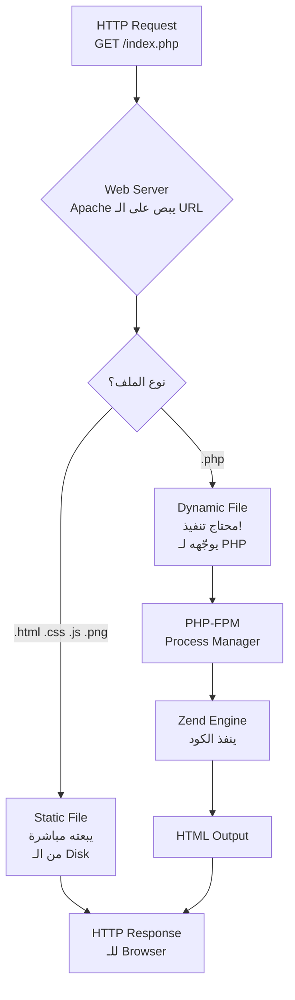
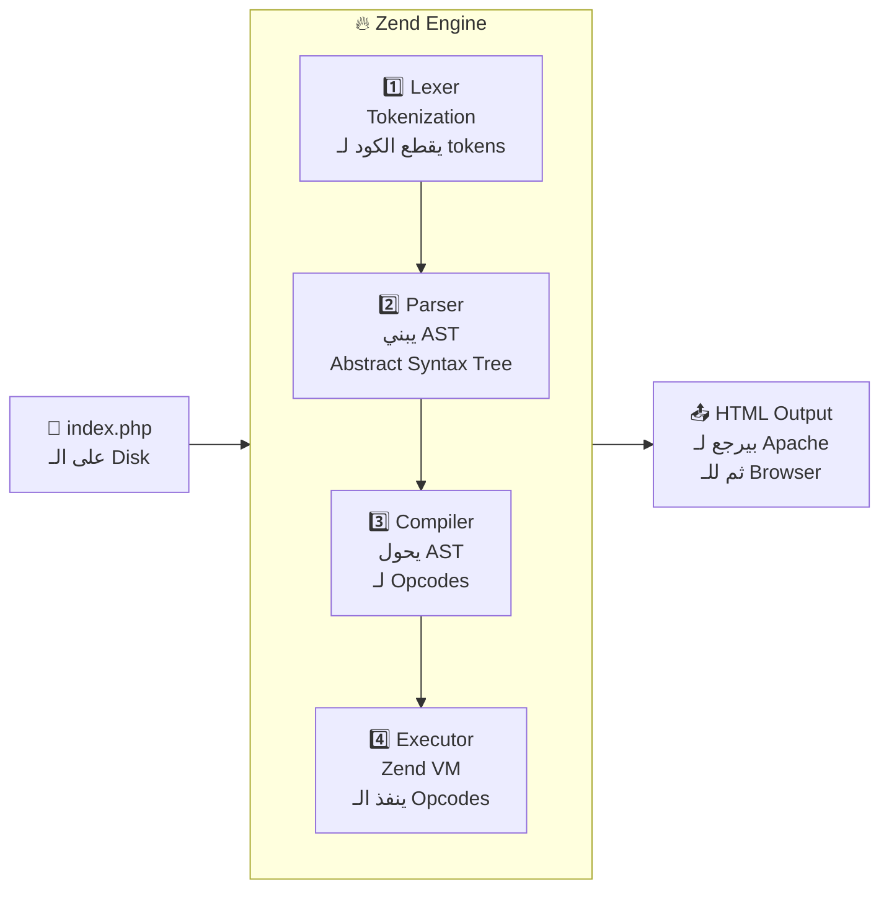
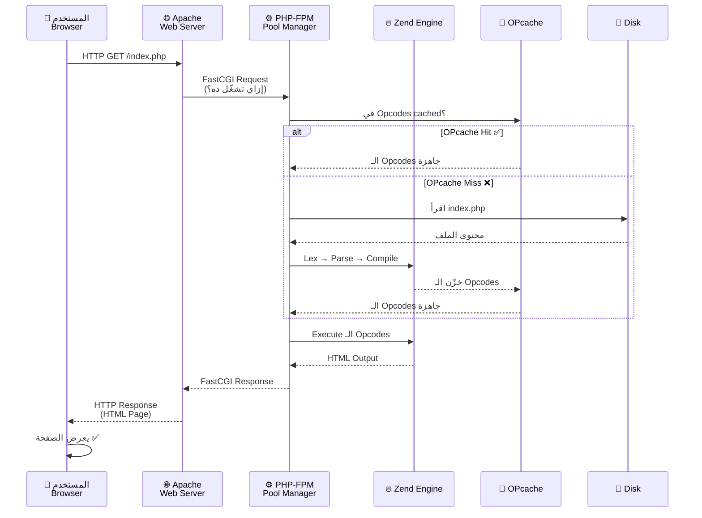
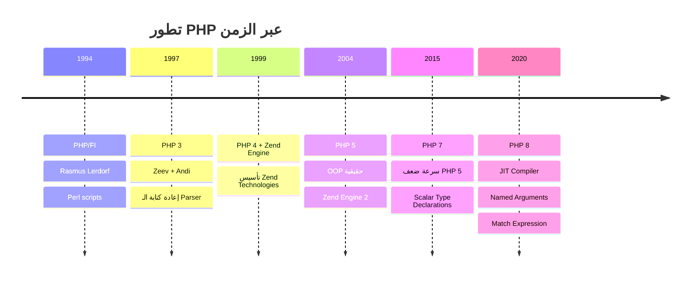
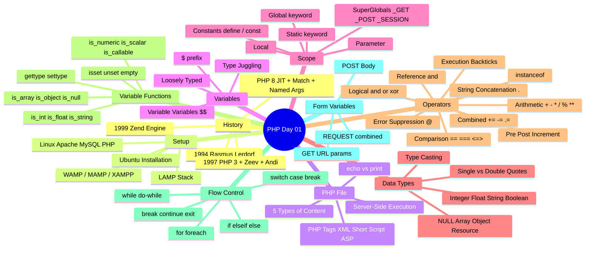

# 📖 PHP — اليوم الأول: البداية من الصفر
### رحلة المعلم الحكواتي من ITI — الأساس اللي كل حاجة بتبنى عليه

> *"كل مبرمج PHP شايل في ذاكرته لحظة أول `echo` شاف فيها الكلام يتطبع على الشاشة — وهي اللحظة دي بالظبط اللي أنت فيها دلوقتي"*

---

## 🗺️ فهرس الرحلة

1. [رحلة الفايل: من الكيبورد لحد شاشة العميل](#رحلة-الفايل)
2. [الفصل الأول: حكاية PHP — من صفحة شخصية لـ Engine يشغّل نص الإنترنت](#تاريخ-php)
3. [الفصل التاني: ليه PHP؟ — المنافع الحقيقية](#ليه-php)
4. [الفصل التالت: LAMP Stack — المطبخ الكامل](#lamp-stack)
5. [الفصل الرابع: ملف الـ PHP — إيه اللي جوّاه؟](#ملف-php)
6. [الفصل الخامس: PHP Tags — أشكال فتح الكود](#php-tags)
7. [الفصل السادس: المتغيرات — صناديق الذاكرة](#المتغيرات)
8. [الفصل السابع: Variable Scope — مين يشوف مين؟](#variable-scope)
9. [الفصل التامن: Data Types — أنواع البيانات](#data-types)
10. [الفصل التاسع: Operators — عمليات القلب](#operators)
11. [الفصل العاشر: Variable Functions — أدوات الاستكشاف](#variable-functions)
12. [الفصل الحادي عشر: Flow Control — التحكم في المسار](#flow-control)
13. [الفصل التاني عشر: Form Variables — كيف تتكلم مع الـ Browser](#form-variables)
14. [🛠️ حل اللاب عملي على أوبونتو](#حل-اللاب)

---

<a name="رحلة-الفايل"></a>
## 🚀 رحلة الفايل: من الكيبورد لحد شاشة العميل

### تعالى أحكيلك الحكاية من الأول — ده أهم حاجة في المحاضرة دي

قبل ما تكتب سطر PHP واحد، لازم تفهم الصورة الكاملة. إيه اللي بيحصل فعلاً لما مستخدم يفتح المتصفح ويكتب `http://mysite.com/index.php`؟

الجواب مش بسيط زي ما إنت فاكر. في رحلة كاملة، بتمر على طبقات وطبقات من التقنية قبل ما تشوف حرف واحد على الشاشة.

---

### المرحلة صفر: إيه اللي على السيرفر أصلاً؟

على سيرفر Ubuntu، في ملفات موجودة على الـ Hard Disk. مش بس `index.php` — في نظام كامل شغال:

```
Ubuntu Server
├── /var/www/html/           ← مجلد الموقع (Web Root)
│   ├── index.php            ← الملف بتاعنا
│   └── about.php
├── /etc/apache2/            ← إعدادات الـ Web Server
│   └── apache2.conf
├── /etc/php/8.1/            ← إعدادات PHP
│   └── php.ini
└── processes running:
    ├── apache2 (pid: 1234)  ← Web Server شغال ومستني
    └── php-fpm (pid: 5678)  ← PHP Process Manager شغال
```

---

### المرحلة الأولى: الـ Browser يبعت HTTP Request

لما إنت كتبت الـ URL وضربت Enter، المتصفح بناء الرسالة دي وبعتها:

```
GET /index.php HTTP/1.1
Host: mysite.com
User-Agent: Mozilla/5.0 ...
Accept: text/html,application/xhtml+xml,...
Accept-Language: ar,en;q=0.9
Connection: keep-alive
```

الرسالة دي مشيت على الـ Internet، عدّت على الـ DNS Servers اللي ترجمت `mysite.com` لـ IP زي `45.33.22.11`، وبعدين وصلت للسيرفر.

---

### المرحلة التانية: Apache يستقبل الطلب ويفكر

Apache (أو Nginx) شغّال على الـ port 80. لما الـ request وصل، Apache بص على الـ URL وفكّر:



---

### المرحلة التالتة: PHP-FPM — مدير العمال

الـ **PHP-FPM** (FastCGI Process Manager) ده بيشتغل زي مدير مصنع. عنده pool من الـ Workers (processes) جاهزين يستقبلوا الـ PHP requests.

لما Apache يبعتله الطلب، PHP-FPM بيديه لأي worker فاضي. الـ Worker ده بيبقى عبارة عن process PHP شغالة في الـ RAM.

```
PHP-FPM Pool:
┌────────────────────────────────────────┐
│              php-fpm master            │
│                                        │
│  Worker 1 [BUSY - processing request]  │
│  Worker 2 [IDLE - waiting]             │
│  Worker 3 [IDLE - waiting]             │
│  Worker 4 [IDLE - waiting]             │
│  ...                                   │
└────────────────────────────────────────┘
```

---

### المرحلة الرابعة: الـ Zend Engine — قلب PHP النابض

هنا بقى بيتدخل الـ Zend Engine عشان ينقذ الموقف!

الـ Zend Engine هو الـ runtime بتاع PHP. هو اللي بيقرأ الكود بتاعك ويشغّله. وبيمر بـ 4 مراحل بالترتيب:



---

#### الخطوة 1: الـ Lexer — قاطع الكلام

تخيل إنت بتقرأ جملة عربية: "أحمد بيكتب كود PHP". الدماغ بتاعك بتقسّمها لكلمات تلقائياً. الـ Lexer بيعمل نفس الحاجة — بياخد ملف الـ PHP كـ نص خام وبيقطعه لـ **Tokens** (وحدات صغيرة).

```php
<?php
$name = "Ahmed";
echo $name;
```

الـ Lexer بيشوف ده كده:

```
T_OPEN_TAG      → "<?php"
T_WHITESPACE    → "\n"
T_VARIABLE      → "$name"
T_WHITESPACE    → " "
T_EQUAL         → "="
T_WHITESPACE    → " "
T_CONSTANT_ENCAPSED_STRING → '"Ahmed"'
T_SEMICOLON     → ";"
T_WHITESPACE    → "\n"
T_ECHO          → "echo"
T_WHITESPACE    → " "
T_VARIABLE      → "$name"
T_SEMICOLON     → ";"
```

الـ Lexer مش فاهم معنى — هو بس بيصنّف.

---

#### الخطوة 2: الـ Parser — الفهم العميق

الـ Parser بياخد الـ Tokens ويبني منها **AST (Abstract Syntax Tree)**. الشجرة دي بتمثل البنية المنطقية للكود:

```
Program
├── Statement: Assignment
│   ├── Variable: $name
│   └── Value: "Ahmed" (string)
└── Statement: Echo
    └── Variable: $name
```

لو في خطأ في الـ syntax (زي نسيت `;`) — الـ Parser هو اللي بيلاقيه ويقولك "Parse error: syntax error".

---

#### الخطوة 3: الـ Compiler — من الفكرة لـ تعليمات

الـ Compiler بيحوّل الـ AST لـ **Opcodes** — تعليمات بسيطة جداً بيفهمها الـ Zend VM:

```
INIT_FCALL          "echo"
ASSIGN              $name, "Ahmed"
ECHO                $name
RETURN              1
```

الـ Opcodes دي بتتخزن في حاجة اسمها **OPcache** — Cache في الـ RAM. في المرة الجاية اللي حد يطلب نفس الملف، الـ Zend Engine مش محتاج يعمل Lexing وParsing وCompilation من أول. بياخد الـ Opcodes جاهزة من الـ Cache. ده بيخلي PHP أسرع بكتير!

```bash
# إزاي تتأكد إن OPcache شغال على سيرفرك
php -r "var_dump(opcache_get_status()['opcache_enabled']);"
# bool(true) → OPcache شغال ✅
```

---

#### الخطوة 4: الـ Executor / Zend VM — التنفيذ الفعلي

الـ Zend VM (Virtual Machine) بياخد الـ Opcodes ويشغّلها واحدة واحدة. في الخطوة دي:
- بيخصص **memory** في الـ RAM للمتغيرات
- بينفذ العمليات الحسابية والمنطقية
- بيستدعي الـ functions
- بيكتب الـ output في **Output Buffer**

لما الـ execution يخلص، الـ Output Buffer اللي فيه الـ HTML المولود بيتبعت لـ Apache، وApache يبعته للـ Browser، والـ Browser يـ render الـ HTML.

---

### الصورة الكاملة



---

> ⚠️ **انتبه:** كل ده بيحصل في أجزاء من الثانية. الـ web servers الحديثة بتتعامل مع آلاف الـ requests في الثانية — لأن الـ OPcache بيلغي معظم التعب.

---

<a name="تاريخ-php"></a>
## الفصل الأول: حكاية PHP — من صفحة شخصية لـ Engine يشغّل نص الإنترنت

### البداية — 1994: رجل واحد وفكرة بسيطة

تخيل معايا إنك سنة 1994 — الإنترنت لسه في بدايته، Google مش موجودة، Facebook مش موجودة. مبرمج دنماركي اسمه **Rasmus Lerdorf** عايز يعمل لنفسه صفحة شخصية على الإنترنت وعايز يتتبع مين بيزور صفحته.

فكتب مجموعة Perl scripts بسيطة وسمّاها **"Personal Home Page Tools"** — اختصار: **PHP**.

مش كانت لغة برمجة — كانت مجرد أدوات بسيطة. بس الفكرة انتشرت وناس كتير بدأت تستخدمها.

```
1994 → PHP/FI (Personal Home Page / Forms Interpreter)
         Rasmus Lerdorf — Perl scripts بسيطة
```

---

### 1997: اتنين إسرائيليين يغيّروا كل حاجة

سنة 1997، اتنين طلاب في معهد Technion الإسرائيلي — **Zeev Suraski** و**Andi Gutmans** — قرروا يعيدوا كتابة الـ parser بتاع PHP من الصفر.

النتيجة؟ **PHP 3** — وغيّروا الاسم لـ **"PHP: Hypertext Preprocessor"** (اسم recursive مضحوك). ده فتح الباب لـ PHP تبقى لغة برمجة حقيقية مش مجرد أدوات.

```
1997 → PHP 3
         Zeev Suraski + Andi Gutmans
         أول مرة تبقى "لغة" حقيقية
```

---

### 1999: ميلاد الـ Zend Engine

نفس الاتنين، Zeev وAndi، قرروا يعيدوا كتابة الـ core بتاع PHP مرة تانية — بس الأكثر جذرية. النتيجة كانت **Zend Engine** — الـ runtime اللي PHP شغالة عليه لحد دلوقتي.

وأسسوا شركة **Zend Technologies** — اللي فضلت راعية PHP لسنين.

```
1999 → Zend Engine + PHP 4
         Zeev Suraski + Andi Gutmans
         أسسوا Zend Technologies
```

---

### PHP 8 — عصر الحداثة

PHP 8 جابت حاجات مهمة جداً:
- **JIT (Just-In-Time Compiler)** — بيـ compile الـ Opcodes لـ machine code في الـ runtime لأول مرة
- **Named Arguments** — بتقدر تبعت الـ arguments بالاسم مش بالترتيب
- **Match Expression** — بديل أنيق لـ switch
- **Null Safe Operator (?->)** — بيتعامل مع الـ null بأمان
- تحسينات في الـ Type System والـ Error Handling



---

<a name="ليه-php"></a>
## الفصل التاني: ليه PHP؟ — المنافع الحقيقية

### إيه اللي خلّى PHP تفضل موجودة وقوية؟

```
┌────────────────────────────────────────────────────────┐
│                   ليه PHP؟                              │
│                                                        │
│  1. سهلة التعلم           → Syntax بسيط ومنطقي        │
│  2. مجانية تماماً         → Open Source — php.net      │
│  3. Cross-Platform        → Linux, Windows, Mac        │
│  4. بتشتغل مع كل Server  → Apache, Nginx, IIS         │
│  5. بتدعم كل DB           → MySQL, PostgreSQL, SQLite  │
│  6. OOP Support           → Classes, Interfaces, Traits│
│  7. Community ضخمة       → توثيق ودعم هائل            │
│  8. تشغّل أكبر المواقع    → WordPress, Facebook (زمان)│
└────────────────────────────────────────────────────────┘
```

> **نصيحة الخبراء:** WordPress — اللي بيشغّل أكتر من 43% من مواقع الإنترنت — مكتوب بـ PHP. كل ما تتقن PHP، كل ما فتحت على نفسك باب ضخم جداً.

---

<a name="lamp-stack"></a>
## الفصل التالت: LAMP Stack — المطبخ الكامل

### تخيل معايا إنك فاتح مطعم

المطعم محتاج:
- **مكان** (Building) = **Linux** → نظام التشغيل
- **نادل** (Waiter) = **Apache** → بيستقبل الطلبات
- **مطبخ** (Kitchen) = **PHP** → بيطبخ الـ content
- **مخزن** (Storage) = **MySQL** → بيحفظ البيانات

```
LAMP Stack:
┌─────────────────────────────────────────────┐
│  L = Linux      → نظام التشغيل              │
│  A = Apache     → Web Server                │
│  M = MySQL      → Database                  │
│  P = PHP        → Server-Side Language       │
└─────────────────────────────────────────────┘

WAMP = Windows + Apache + MySQL + PHP
MAMP = Mac + Apache + MySQL + PHP
XAMPP = Cross-Platform + Apache + MySQL + PHP + Perl
```

### التثبيت على Ubuntu

```bash
# تحديث الـ packages
sudo apt update

# تثبيت Apache
sudo apt install apache2 -y

# تثبيت MySQL
sudo apt install mysql-server -y

# تثبيت PHP وـ extensions المهمة
sudo apt install php libapache2-mod-php php-mysql php-cli -y

# تأكيد التثبيت
php --version
# PHP 8.1.x (cli) ...

apache2 -v
# Server version: Apache/2.4.x

mysql --version
# mysql  Ver 8.0.x ...

# اختبار الـ Web Server
# افتح http://localhost في المتصفح
# المفروض تشوف "Apache2 Ubuntu Default Page"
```

### إنشاء أول ملف PHP

```bash
# مجلد الـ web root على Ubuntu
cd /var/www/html

# أنشئ ملف test
sudo nano index.php
```

---

<a name="ملف-php"></a>
## الفصل الرابع: ملف الـ PHP — إيه اللي جوّاه؟

### الحقيقة المهمة: PHP بتشتغل على السيرفر فقط

ده الفرق الجوهري. الـ JavaScript بتشتغل في الـ Browser (Client-Side). الـ PHP بتشتغل على السيرفر (Server-Side).

```
Client Side (Browser):              Server Side (Server):
┌──────────────────┐                ┌──────────────────┐
│  HTML            │                │  PHP Code        │
│  CSS             │     ←──────    │  بيتنفذ هنا      │
│  JavaScript      │   HTML only    │  والـ Browser     │
│  (هنا بيتنفذوا) │                │  بيشوف HTML فقط  │
└──────────────────┘                └──────────────────┘
```

ملف الـ PHP ممكن يحتوي على 5 أنواع من المحتوى:

```php
<?php
/* 1. PHP Comment — تعليق متعدد الأسطر */
// 2. PHP Comment — تعليق سطر واحد
# 3. PHP Comment — كمان سطر واحد (Bash style)
?>

<!-- 4. HTML — عادي زي أي ملف HTML -->
<!DOCTYPE html>
<html>
<body>

<?php
// 5. PHP Code — بيتنفذ على السيرفر
echo "<h1>مرحباً بالعالم!</h1>";
echo date('H:i , jS F Y');
?>

</body>
</html>
```

**إيه اللي بيقدر PHP تعمله؟**

```
✅ PHP can generate dynamic page content
✅ PHP can create, open, read, write, delete files
✅ PHP can collect form data ($_POST, $_GET)
✅ PHP can send and receive cookies
✅ PHP can add, delete, modify data in databases
✅ PHP can restrict access to pages
✅ PHP can encrypt data
```

---

<a name="php-tags"></a>
## الفصل الخامس: PHP Tags — أشكال فتح الكود

### أربع طرق لفتح الـ PHP — وواحدة بس المستخدمة

```php
// 1. XML Style ← المعيار الموصى بيه دايماً
<?php echo "Hello!"; ?>

// 2. Short Style ← محتاج تشغيل short_open_tag في php.ini
<? echo "Hello!"; ?>

// 3. Script Style ← طويل وقديم — مش بيستخدم خالص
<script language="php"> echo "Hello!"; </script>

// 4. ASP Style ← محتاج asp_tags في php.ini — منسوخ خالص
<% echo "Hello!"; %>
```

**ليه XML Style هي المعيار؟**
- متاحة دايماً بدون إعدادات إضافية
- Portable على كل الأنظمة
- لا تتعارض مع أي XML أو HTML
- المحررات والـ IDEs كلها بتتعرف عليها

> ⚠️ **انتبه:** في PHP 7.4+، الـ ASP Style والـ Script Style اتشالوا خالص. الـ Short Style لسه موجودة بس محتاجة إعداد. الـ XML Style هي الوحيدة المضمونة دايماً.

### مهم: الـ Closing Tag اختياري!

لو الملف فيه PHP فقط (من غير HTML)، ممكن تشيل الـ closing tag `?>` في الآخر. بل ده الـ best practice:

```php
<?php
// ملف PHP فقط — من غير HTML
define('DB_HOST', 'localhost');
$name = "Ahmed";
// لا يوجد ?> في الآخر ← صح! عشان يمنع accidental whitespace
```

---

### Echo vs Print

```php
// echo — بتطبع حاجة أو أكتر، مفيش return value
echo "Hello, World!<br>";
echo "This", " has", " multiple", " params."; // ← echo بس اللي بتقبل كذا param

// print — بتطبع حاجة واحدة بس، بترجع 1 دايماً
$result = print("Hello!");  // $result = 1
print "<p>PHP is fun!</p>";

// الفرق العملي: echo أسرع قليلاً لأنها مش بترجع value
// في الـ production، الاتنين بيستخدموا بس echo الأشيع
```

---

<a name="المتغيرات"></a>
## الفصل السادس: المتغيرات — صناديق الذاكرة

### البداية — إيه هو المتغير؟

تخيل معايا إن الـ RAM (ذاكرة الكمبيوتر) هي مدينة فيها بيوت. كل بيت ليه عنوان في الذاكرة. المتغير ده بيديك **اسم مفهوم** لعنوان في الذاكرة.

بدل ما تتعامل مع عنوان `0x7fff5fbff8a0` — تتعامل مع `$name`.

```php
// إنشاء متغير — PHP مش محتاجة declaration
$txt = "Hello world!";  // ← string
$x   = 5;               // ← integer
$y   = 3.14;            // ← float
$z   = true;            // ← boolean
```

اللحظة دي في الـ RAM:

```
RAM:
┌──────────┬─────────────────┬──────────┐
│ Variable │   Value         │   Type   │
├──────────┼─────────────────┼──────────┤
│  $txt    │  "Hello world!" │  string  │
│  $x      │  5              │  integer │
│  $y      │  3.14           │  float   │
│  $z      │  true           │  bool    │
└──────────┴─────────────────┴──────────┘
```

### قواعد تسمية المتغيرات — الـ Rules

```php
// ✅ صح
$name           = "Ahmed";
$_name          = "Noha";
$firstName      = "Omar";  // camelCase
$first_name     = "Ali";   // snake_case
$name1          = "Test";

// ❌ غلط
// $1name       = "Error"; // ← لا يبدأ برقم
// $my name     = "Error"; // ← لا مسافات
// $my-name     = "Error"; // ← لا هايفن

// ← case-sensitive!
$name = "Ahmed";
$Name = "Noha";   // متغير مختلف تماماً
$NAME = "Omar";   // متغير تالت

var_dump($name);  // "Ahmed"
var_dump($Name);  // "Noha"
var_dump($NAME);  // "Omar"
```

### PHP Loosely Typed — مرونة التنوع

في لغات تانية، لازم تحدد النوع قبل الاستخدام. PHP مش محتاجة ده:

```php
$var = 42;           // integer
$var = "Hello";      // دلوقتي string — نفس المتغير!
$var = 3.14;         // دلوقتي float
$var = true;         // دلوقتي boolean
$var = null;         // دلوقتي null

// PHP بتعمل Type Juggling تلقائياً
echo "5" + 3;    // 8 ← PHP حولت "5" لـ integer
echo "5px" + 3;  // 8 ← حولت "5px" لـ 5
echo "px5" + 3;  // 3 ← "px5" اتحولت لـ 0
```

> ⚠️ **انتبه:** الـ Type Juggling ده سلاح ذو حدين. مريح جداً لكن ممكن يعمل bugs غير متوقعة. في PHP 8، الـ Type System اتحسن بشكل ضخم وتقدر تحدد الـ types صراحةً.

### Variable Variables — متغير اسمه متغير!

```php
$varname = "color";     // ← $varname بيحتوي على string "color"
$$varname = "red";      // ← ده بيعمل متغير اسمه $color قيمته "red"

// ده بالظبط زي:
// $color = "red";

echo $color;    // red
echo $$varname; // red — نفس الشيء

// مثال عملي
$fields = ["name", "email", "age"];
$name   = "Ahmed";
$email  = "ahmed@example.com";
$age    = 25;

foreach ($fields as $field) {
    echo "$field: " . $$field . "<br>";
}
// name: Ahmed
// email: ahmed@example.com
// age: 25
```

---

<a name="variable-scope"></a>
## الفصل السابع: Variable Scope — مين يشوف مين؟

### البداية — المشكلة

ليه كل المتغيرات مش متاحة في كل مكان؟ ليه المتغير اللي بنيته برّا الـ function مش بتشوفه جوّاه؟ الجواب هو **Scope**.

تخيل كل function زي شقة. المتغيرات اللي جوّا الشقة هي ملكك أنت. برّا الشقة في الشارع العام.

```
PHP Variable Scope:
┌─────────────────────────────────────────┐
│            الـ Script (الشارع العام)     │
│                                         │
│  $x = 5;  ← Global Scope               │
│                                         │
│  ┌───────────────────────────────────┐  │
│  │         function myFunc()         │  │
│  │   ← Local Scope                  │  │
│  │   $y = 10;  ← Local Variable     │  │
│  │   $x مش موجودة هنا بدون global!  │  │
│  └───────────────────────────────────┘  │
└─────────────────────────────────────────┘
```

### 1. Local Scope

```php
$x = 5; // ← Global

function myTest() {
    $y = 5;    // ← Local
    echo $y;   // ✅ 5

    // echo $x; // ❌ Undefined! $x مش موجودة هنا
}

myTest();
// echo $y; // ❌ Undefined! $y ماتت لما الـ function خلصت
```

### 2. Global Scope — استخدام الـ global keyword

```php
$x = 5; // Global

function myTest() {
    global $x;  // ← إعلان إن إنت عايز تستخدم الـ global $x
    $x = 15;    // ← عدّلت الـ global variable
    var_dump($x); // 15
}

myTest();
var_dump($x); // 15 ← الـ global اتعدل!
```

> ⚠️ **انتبه:** استخدام `global` كتير بيعتبر bad practice في الكود الحديث. أحسن حل هو إنك تـ pass المتغير كـ parameter للـ function.

### 3. Static Scope — متغير بيفكرك

```php
function testStaticFunction() {
    static $m; // ← بتُنشأ مرة واحدة بس
    $m++;
    var_dump($m);
}

testStaticFunction(); // 1 ← $m = 0, ثم ++
testStaticFunction(); // 2 ← $m لسه 1 من المرة السابقة، ثم ++
testStaticFunction(); // 3 ← $m لسه 2، ثم ++
```

الـ `static` variables مش بتتمسح لما الـ function تخلص. بتفضل في الذاكرة وبتتذكر قيمتها للاستدعاء الجاي.

**أشهر استخدامها؟** Counters، Memoization، Singleton pattern.

### 4. Constants — الثوابت

```php
// define() — الطريقة الكلاسيكية
define("CONSTANT", "Hello world from PHP");

// const — الطريقة الحديثة (بس في class-level أو top-level فقط)
const TEST = "Welcome";

echo CONSTANT; // Hello world from PHP ← بدون $
echo TEST;     // Welcome

// Constants بتكون visible في كل مكان — حتى داخل functions
function anyFunction() {
    echo CONSTANT; // ✅ يشتغل! Constants هي super global
}
```

**الفرق بين Constants والمتغيرات:**
- Constants مش ليها `$` في الاسم
- Constants مش ممكن تتغير بعد التعريف
- Constants مش ليها scope — هي global في كل مكان

### 5. SuperGlobals — المتغيرات اللي في كل مكان

```php
// SuperGlobals متاحة في كل مكان — برّا وجوّا أي function
$_GET     // ← قيم الـ URL parameters
$_POST    // ← قيم الـ form (POST method)
$_REQUEST // ← الاتنين مع بعض + cookies
$_COOKIE  // ← الـ cookies
$_FILES   // ← الملفات المرفوعة
$_SESSION // ← بيانات الجلسة

// مثال
function getUsername() {
    // مش محتاج global! $_POST هي super global
    return $_POST['username'] ?? 'Guest';
}
```

### ملخص الـ Scope في PHP

```
جدول الـ Scope:
┌──────────────────┬───────────────────┬─────────────────┐
│  النوع           │  داخل Function   │  خارج Function  │
├──────────────────┼───────────────────┼─────────────────┤
│  Local Variable  │  ✅ Visible       │  ❌ Not visible  │
│  Global Variable │  ❌ (بدون global) │  ✅ Visible      │
│  Static Variable │  ✅ Visible       │  ❌ Not visible  │
│  Constant        │  ✅ Visible       │  ✅ Visible      │
│  SuperGlobal     │  ✅ Visible       │  ✅ Visible      │
└──────────────────┴───────────────────┴─────────────────┘
```

---

<a name="data-types"></a>
## الفصل التامن: Data Types — أنواع البيانات

### أنواع البيانات في PHP

```php
// 1. Integer — أعداد صحيحة
$age = 25;
$negative = -10;
$big = 2_147_483_647; // ← underscore separator للقراءة (PHP 7.4+)

// 2. Float (Double) — أعداد كسرية
$price = 99.99;
$pi    = 3.14159;
$sci   = 1.5e3;  // = 1500

// 3. String — نصوص
$singleQ = 'Hello $name';    // ← $name مش بيتفسر — literal
$doubleQ = "Hello $name";    // ← $name بيتفسر ويتحل
$heredoc = <<<EOT
    نص متعدد الأسطر
    بيتفسر زي الـ double quotes
EOT;

// 4. Boolean
$isTrue  = true;
$isFalse = false;

// 5. NULL — غياب القيمة
$nothing = null;

// 6. Array
$colors = ["red", "green", "blue"];

// 7. Object
class Car {}
$myCar = new Car();

// 8. Resource
$file = fopen("test.txt", "r");
// Resource ده pointer لـ external resource (ملف، DB connection, إلخ)
```

### Single Quote vs Double Quote — فرق مهم!

```php
$name = "Ahmed";

// Single Quote ← literal — مش بتفسر
echo 'Hello $name';    // Hello $name ← بالحرف

// Double Quote ← interpolation — بتفسر
echo "Hello $name";    // Hello Ahmed ← بعد التفسير
echo "Hello {$name}!"; // Hello Ahmed! ← curly braces للوضوح

// Double Quote بتفسر كمان Escape Sequences
echo "Line 1\nLine 2"; // ← \n = newline
echo "Tab\there";      // ← \t = tab
echo "Quote: \"yes\""; // ← \" = double quote داخل double quote
```

### Type Casting — تحويل مؤقت

```php
$var1 = 0;

// Cast مؤقت — مش بيغير الـ type الأصلي
$var2 = (float)$var1;   // 0.0
$var3 = (string)$var1;  // "0"
$var4 = (bool)$var1;    // false (0 = false)
$var5 = (array)$var1;   // [0]

// بعد الـ cast، $var1 لسه integer 0
var_dump($var1); // int(0)
```

---

<a name="operators"></a>
## الفصل التاسع: Operators — عمليات القلب

### Arithmetic Operators — العمليات الحسابية

```php
$x = 10;
$y = 3;

echo $x + $y;   // 13  ← Addition
echo $x - $y;   // 7   ← Subtraction
echo $x * $y;   // 30  ← Multiplication
echo $x / $y;   // 3.333... ← Division
echo $x % $y;   // 1   ← Modulus (باقي القسمة)
echo $x ** $y;  // 1000 ← Exponentiation (10 أس 3)

// String Concatenation
$a      = "Hello, ";
$b      = "World!";
$result = $a . $b;     // "Hello, World!"
$result = $a . $b . " How are you?";
```

### Comparison Operators — المقارنة الدقيقة

```php
$x = 5;
$y = "5";

// == (Equal) ← بيقارن القيمة فقط — بعمل Type Juggling
var_dump($x == $y);   // true ← 5 == "5" ✅

// === (Identical) ← بيقارن القيمة والـ type
var_dump($x === $y);  // false ← int != string ❌

// != (Not Equal)
var_dump($x != $y);   // false

// !== (Not Identical)
var_dump($x !== $y);  // true ← الـ type مختلف

// <=> (Spaceship Operator) — PHP 7+
// بيرجع -1, 0, أو 1
echo (5 <=> 10);  // -1 (5 أصغر)
echo (5 <=> 5);   //  0 (متساويين)
echo (10 <=> 5);  //  1 (10 أكبر)
// مفيد جداً في الـ usort()!
```

> ⚠️ **انتبه من الـ Type Juggling في الـ ==:**
> ```php
> var_dump(0 == "a");   // true  ← PHP 7 (خطر!)
> var_dump(0 == "a");   // false ← PHP 8 (تحسن!)
> var_dump(0 == "0");   // true
> var_dump("" == null); // true
> // الحل: استخدم === دايماً!
> ```

### Combined Assignment Operators — الاختصارات

```php
$x = 10;

$x += 5;   // $x = $x + 5  → 15
$x -= 3;   // $x = $x - 3  → 12
$x *= 2;   // $x = $x * 2  → 24
$x /= 4;   // $x = $x / 4  → 6
$x %= 4;   // $x = $x % 4  → 2

$str  = "Hello";
$str .= " World";  // $str = $str . " World" → "Hello World"
```

### Pre/Post Increment & Decrement

```php
$a = 4;
echo ++$a; // 5 ← Pre-increment: زوّد الأول، واطبع بعدين
           // دلوقتي $a = 5

$a = 4;
echo $a++; // 4 ← Post-increment: اطبع الأول، وزوّد بعدين
           // دلوقتي $a = 5

// نفس الفكرة لـ --
$a = 4;
echo --$a; // 3 ← Pre-decrement
$a = 4;
echo $a--; // 4 ← Post-decrement (دلوقتي $a = 3)
```

**تذكر القاعدة:**
- الـ operator قبل المتغير (`++$a`) → شغّل الأول، واطبع
- الـ operator بعد المتغير (`$a++`) → اطبع الأول، وشغّل

### Reference Operator — العنوان الواحد

```php
$a = 5;
$b = $a;   // ← نسخة جديدة من القيمة
$a = 7;

echo $b;   // 5 ← $b لسه 5، مش تأثرت

// ---

$a = 5;
$b = &$a;  // ← $b بقى alias لـ $a (نفس الـ memory location)
$a = 7;

echo $b;   // 7 ← $b اتأثرت لأنها والـ $a بيشاوروا على نفس المكان في الـ RAM

// unset بيكسر الـ reference
unset($b);  // بس بيمسح $b — مش $a
echo $a;    // 7 ← $a لسه موجودة
```

```
Before &:                After &:
┌────┐   ┌────┐         ┌────┐
│ $a │   │ $b │         │ $a │
│ 5  │   │ 5  │         │ 7  │ ← كلهم بيشاوروا
└────┘   └────┘         └────┘   على نفس الـ memory
(2 مكانين منفصلين)        ↑
                          │
                        ┌────┐
                        │ $b │
                        └────┘
```

### Logical Operators

```php
$a = true;
$b = false;

// AND — الاتنين لازم يكونوا true
var_dump($a && $b);  // false
var_dump($a and $b); // false ← نفس الشيء (بس أولوية أقل)

// OR — واحد منهم على الأقل true
var_dump($a || $b);  // true
var_dump($a or $b);  // true

// XOR — واحد بس يكون true (مش الاتنين)
var_dump($a xor $b); // true

// NOT — عكس
var_dump(!$a); // false
```

**الفرق بين && و and (ومنه || و or):**

```php
// ← && له أولوية أعلى من and
$result = true && false;   // false — $result = (true && false)
$result = true and false;  // true  — ($result = true) and false
// ده bug شائع! الحل: استخدم && دايماً
```

### Instanceof Operator

```php
class SampleClass {}
class AnotherClass {}

$myObject = new SampleClass();

if ($myObject instanceof SampleClass) {
    echo "نعم، هو instance من SampleClass"; // ✅
}

if ($myObject instanceof AnotherClass) {
    echo "ده مش هيتطبع"; // ❌
}
```

### Error Suppression Operator (@)

```php
$a = @(25 / 0);  // ← @ بتسكت الـ Warning
var_dump($a);    // float(INF)

$b = 44 / 0;     // ← من غير @ → Warning: Division by zero
var_dump($b);    // float(INF) مع warning
```

### Execution Operator (Backticks ``)

```php
// بتنفذ Shell command وبترجع الـ output كـ string
$output = `ls -la`;
echo "<pre>$output</pre>";
// بيعرض محتوى المجلد الحالي

$phpVersion = `php --version`;
echo $phpVersion;
```

> ⚠️ **انتبه:** الـ Execution Operator خطير جداً في الـ production! لو سمحت لـ user input يدخل في الـ backtick command، هيقدر ينفذ أي command على السيرفر. ده اللي بيتسمى **Command Injection**.

---

<a name="variable-functions"></a>
## الفصل العاشر: Variable Functions — أدوات الاستكشاف

### gettype() وsettype() — القاموس والتحويل

```php
$num = "10";
echo gettype($num); // string

// settype بيغير الـ type فعلياً (permanent)
settype($num, "int");
echo gettype($num); // integer
echo $num;          // 10
```

### دوال الـ Type Checking

```php
$values = [42, 3.14, "Hello", true, null, [1,2,3], new stdClass()];

foreach ($values as $val) {
    echo "Value: ";
    var_dump($val);
    echo "is_int:    " . var_export(is_int($val), true)    . "\n";
    echo "is_float:  " . var_export(is_float($val), true)  . "\n";
    echo "is_string: " . var_export(is_string($val), true) . "\n";
    echo "is_bool:   " . var_export(is_bool($val), true)   . "\n";
    echo "is_null:   " . var_export(is_null($val), true)   . "\n";
    echo "is_array:  " . var_export(is_array($val), true)  . "\n";
    echo "is_object: " . var_export(is_object($val), true) . "\n";
    echo "---\n";
}

// is_numeric() ← بيتحقق إن القيمة رقم أو string يمثل رقم
var_dump(is_numeric(42));      // true
var_dump(is_numeric("42"));    // true  ← string رقمي
var_dump(is_numeric("42px"));  // false ← مش رقم خالص
var_dump(is_numeric("0x1A"));  // false ← PHP 7+ مش بتعتبرها numeric

// is_scalar() ← integer, float, string, أو bool
var_dump(is_scalar(42));      // true
var_dump(is_scalar("text"));  // true
var_dump(is_scalar([1,2]));   // false ← array مش scalar
```

### isset() وunset() وempty()

```php
// isset() — هل المتغير موجود ومش null؟
$x = 5;
var_dump(isset($x));    // true
var_dump(isset($y));    // false ← $y مش موجود

$z = null;
var_dump(isset($z));    // false ← null = مش set

// يقبل قائمة من المتغيرات
var_dump(isset($x, $y));  // false ← واحد منهم مش set

// unset() — بيمسح المتغير من الـ memory
unset($x);
var_dump(isset($x));    // false ← اتمسح

// empty() — هل القيمة "فاضية"؟
var_dump(empty(""));       // true  ← string فاضي
var_dump(empty(0));        // true  ← صفر
var_dump(empty("0"));      // true  ← string "0"
var_dump(empty(null));     // true  ← null
var_dump(empty([]));       // true  ← array فاضي
var_dump(empty(false));    // true  ← false

var_dump(empty("Hello")); // false ← فيها قيمة
var_dump(empty(1));        // false ← رقم موجب
var_dump(empty([1,2,3])); // false ← array فيها حاجة

// is_callable() — هل المتغير اسم function موجودة؟
function myFunc() {}
var_dump(is_callable("myFunc"));   // true
var_dump(is_callable("noFunc"));   // false
```

---

<a name="flow-control"></a>
## الفصل الحادي عشر: Flow Control — التحكم في المسار

### 1. if / elseif / else

```php
$score = 75;

if ($score >= 90) {
    echo "ممتاز 🌟";
} elseif ($score >= 75) {
    echo "جيد جداً ✅";
} elseif ($score >= 60) {
    echo "جيد 👍";
} else {
    echo "راسب ❌";
}
// Output: جيد جداً ✅
```

### 2. Switch / Case

```php
$day = "Monday";

switch ($day) {
    case "Saturday":
    case "Sunday":
        echo "عطلة! 😎";
        break;
    case "Monday":
        echo "أول يوم شغل 😤";
        break;
    case "Friday":
        echo "قبل العطلة بيوم!";
        break;
    default:
        echo "يوم عادي";
}
// Output: أول يوم شغل 😤
```

> ⚠️ **انتبه:** لو نسيت الـ `break` — الـ execution هيكمل للـ case اللي بعده (Fall-through). ده ممكن يكون متعمد زي مثال السبت والأحد فوق، أو ممكن يكون bug.

### 3. for Loop

```php
// for(initializer; condition; increment)
for ($i = 0; $i < 10; $i++) {
    echo "We need the break! ";
    if ($i == 4) break;  // ← خروج من الـ loop عند 4
}
// Output: We need the break! (5 مرات: 0,1,2,3,4)

// continue ← تخطي الـ iteration الحالية
for ($i = 0; $i < 10; $i++) {
    if ($i == 4) continue;  // ← تخطي الرقم 4
    echo $i . " ";
}
// Output: 0 1 2 3 5 6 7 8 9  ← 4 اتخطت
```

### 4. foreach

```php
// على indexed array
$fruits = ["apple", "banana", "kiwi"];
foreach ($fruits as $fruit) {
    echo $fruit . "<br>";
}

// على associative array
$person = ["name" => "Ahmed", "age" => 25, "city" => "Cairo"];
foreach ($person as $key => $value) {
    echo "$key: $value <br>";
}
```

### 5. while Loop

```php
$i = 0;
while ($i < 5) {
    echo $i . " ";
    $i++;
}
// Output: 0 1 2 3 4
```

### 6. do-while — مرة على الأقل

```php
$x = 1000;
do {
    // هينفذ مرة واحدة على الأقل — حتى لو الـ condition false
    print("welcome to do while looping");
} while ($x < 10);
// بيطبع مرة واحدة رغم إن 1000 مش < 10
```

```
while vs do-while:
┌──────────────────────────────────────────┐
│  while:                                  │
│  CHECK condition → إذا true → EXECUTE   │
│  (ممكن مش ينفذ خالص لو condition false) │
│                                          │
│  do-while:                              │
│  EXECUTE → CHECK condition              │
│  (بينفذ مرة واحدة على الأقل)           │
└──────────────────────────────────────────┘
```

### 7. Break, Continue, Exit

```php
// break — خروج من الـ loop كلها
for ($i = 0; $i < 10; $i++) {
    if ($i == 5) break;
    echo $i . " "; // 0 1 2 3 4
}

// break(n) — خروج من n مستويات من الـ loops
for ($i = 0; $i < 3; $i++) {
    for ($j = 0; $j < 3; $j++) {
        if ($j == 1) break 2; // خروج من الـ loops الاتنين
        echo "$i,$j ";
    }
}

// continue — تخطي وكمّل
for ($i = 0; $i < 5; $i++) {
    if ($i == 2) continue;
    echo $i . " "; // 0 1 3 4
}

// exit (أو die) — إيقاف الـ script كله
if (!file_exists("config.php")) {
    exit("ملف الـ Config مش موجود!"); // ← بيطبع الرسالة وبيوقف
}
// الكود ده مش هينفذ لو exit اتنفذ
```

---

<a name="form-variables"></a>
## الفصل التاني عشر: Form Variables — كيف تتكلم مع الـ Browser

### البداية — كيف Form تبعت بيانات؟

```html
<!-- form.html -->
<form action="process.php" method="GET">
    <input type="text"     name="name">
    <input type="password" name="password">
    <input type="submit">
</form>
```

لما المستخدم يملأ الـ form ويضغط Submit:
- `GET` → البيانات بتتبعت في الـ URL: `process.php?name=Ahmed&password=123`
- `POST` → البيانات بتتبعت في الـ HTTP Request Body (مش في الـ URL)

```php
// process.php

// $_GET — قراءة البيانات المبعوتة بـ GET
var_dump($_GET);
// array(2) { ["name"]=> "Ahmed" ["password"]=> "123" }

echo $_GET['name'];     // Ahmed
echo $_GET['password']; // 123

// $_POST — لو كانت method="POST"
echo $_POST['name'];

// $_REQUEST — بيشيل $_GET + $_POST + $_COOKIE مع بعض
echo $_REQUEST['name'];
```

**متى بتستخدم GET ومتى POST؟**

| | GET | POST |
|---|---|---|
| البيانات فين؟ | في الـ URL | في الـ Body |
| مناسب لـ | بحث، فلترة | تسجيل دخول، إرسال بيانات حساسة |
| Bookmarkable؟ | ✅ | ❌ |
| حجم البيانات | محدود (~2000 char) | كبير (ملفات كمان) |
| أمان | ❌ بيظهر في الـ URL | أأمن نسبياً (بس مش encryption) |

---

## 🗺️ Mindmap — اليوم الأول كامل



---

## ✅ Interview Checkpoint

**س: إيه الفرق بين == و=== في PHP؟**
> `==` بيقارن القيمة فقط مع Type Juggling تلقائي — يعني `5 == "5"` بترجع `true`. `===` بيقارن القيمة والـ type في نفس الوقت — فـ `5 === "5"` بترجع `false` لأن int != string. دايماً استخدم `===` إلا لو عندك سبب محدد.

**س: إيه الفرق بين Single Quotes وDouble Quotes في PHP؟**
> Single quotes بتعامل كل حاجة جواها كـ literal — المتغيرات والـ escape sequences مش بتتفسر (إلا `\'` و`\\`). Double quotes بتفسر المتغيرات (`"Hello $name"`) والـ escape sequences (`\n`, `\t`). Single quotes أسرع قليلاً لأن PHP مش بتعمل parsing لمحتواها.

**س: إيه الفرق بين Global Scope وLocal Scope في PHP؟**
> المتغيرات المعرّفة برّا أي function ليها Global scope — متاحة في كل الـ script بس مش داخل الـ functions. المتغيرات جوّا function ليها Local scope — بتموت لما الـ function تخلص. عشان تستخدم global variable داخل function، لازم تعلن عنها بـ `global $varname`. الـ SuperGlobals (`$_GET`, `$_POST`, `$_SESSION`, إلخ) هي الاستثناء — متاحة في كل مكان بدون `global`.

**س: إيه الـ Static Variable ومتى بتستخدمها؟**
> الـ static variable بتتخلق مرة واحدة جوّا الـ function وبتحتفظ بقيمتها بين الاستدعاءات المختلفة — مش بتتمسح زي الـ local variables العادية. بستخدمها في counters، memoization، أو لما بتحتاج تتذكر حالة بين calls متعددة.

**س: إيه الفرق بين isset() وempty()؟**
> `isset()` بيرجع true لو المتغير موجود ومش null. `empty()` بيرجع true لو المتغير غير موجود أو قيمته "فاضية" — يعني: `""`, `"0"`, `0`, `0.0`, `false`, `null`, `[]`. كل قيمة يعتبرها PHP فاضية. `isset()` مش بتـ trigger Undefined Variable error لو المتغير مش موجود، بس `empty()` كمان كده.

**س: إيه الـ Spaceship Operator <=> وامتى بتستخدمه؟**
> الـ Spaceship Operator بيرجع -1 لو الجانب الأيسر أصغر، 0 لو متساويين، 1 لو الأيسر أكبر. أشهر استخدامه في `usort()` لما بتعمل custom sorting — بدل ما تكتب if/else كتير، بتكتب: `return $a['age'] <=> $b['age'];`.

---

<a name="حل-اللاب"></a>
## 🛠️ حل اللاب الأول عملي على أوبونتو

### المطلوب:
1. بناء الـ form في HTML مع الـ fields المطلوبة
2. إرسال البيانات للـ PHP server
3. طباعة البيانات بشكل منسق

---

### أولاً: إعداد البيئة

```bash
# التأكد من تشغيل Apache
sudo systemctl start apache2
sudo systemctl status apache2

# إنشاء مجلد المشروع
sudo mkdir -p /var/www/html/lab01
cd /var/www/html/lab01

# الـ ownership للـ www-data
sudo chown -R www-data:www-data /var/www/html/lab01
sudo chmod -R 755 /var/www/html/lab01
```

---

### form.html — صفحة الـ Form

```html
<!DOCTYPE html>
<html lang="ar" dir="rtl">
<head>
    <meta charset="UTF-8">
    <title>Lab 01 — Registration Form</title>
    <style>
        * { box-sizing: border-box; }
        body {
            font-family: Arial, sans-serif;
            background: #f0f2f5;
            display: flex;
            justify-content: center;
            align-items: center;
            min-height: 100vh;
            margin: 0;
        }
        .card {
            background: white;
            padding: 30px;
            border-radius: 10px;
            box-shadow: 0 4px 20px rgba(0,0,0,.1);
            width: 400px;
        }
        h2 { color: #2c3e50; margin-bottom: 20px; text-align: center; }
        .form-group { margin-bottom: 15px; }
        label { display: block; margin-bottom: 5px; font-weight: bold; color: #555; }
        input[type="text"],
        input[type="email"],
        input[type="number"],
        select {
            width: 100%;
            padding: 10px 12px;
            border: 1px solid #ddd;
            border-radius: 6px;
            font-size: 14px;
            transition: border-color .2s;
        }
        input:focus, select:focus {
            border-color: #3498db;
            outline: none;
            box-shadow: 0 0 0 3px rgba(52,152,219,.1);
        }
        .radio-group { display: flex; gap: 20px; margin-top: 5px; }
        .radio-group label {
            display: flex; align-items: center; gap: 5px;
            font-weight: normal; cursor: pointer;
        }
        .btn {
            width: 100%;
            padding: 12px;
            background: #3498db;
            color: white;
            border: none;
            border-radius: 6px;
            font-size: 16px;
            cursor: pointer;
            margin-top: 10px;
        }
        .btn:hover { background: #2980b9; }
    </style>
</head>
<body>
<div class="card">
    <h2>📝 Registration Form</h2>
    <!--
        action="process.php" ← بعت البيانات لـ process.php
        method="POST"        ← POST method للأمان
    -->
    <form action="process.php" method="POST">

        <div class="form-group">
            <label for="firstname">First Name:</label>
            <input type="text" id="firstname" name="firstname"
                   placeholder="Enter your first name" required>
        </div>

        <div class="form-group">
            <label for="lastname">Last Name:</label>
            <input type="text" id="lastname" name="lastname"
                   placeholder="Enter your last name" required>
        </div>

        <div class="form-group">
            <label for="email">Email:</label>
            <input type="email" id="email" name="email"
                   placeholder="example@example.com" required>
        </div>

        <div class="form-group">
            <label for="phone">Phone:</label>
            <input type="text" id="phone" name="phone"
                   placeholder="01XXXXXXXXX">
        </div>

        <div class="form-group">
            <label for="age">Age:</label>
            <input type="number" id="age" name="age"
                   min="16" max="100" placeholder="25">
        </div>

        <div class="form-group">
            <label for="track">Track:</label>
            <select id="track" name="track">
                <option value="">-- Select Track --</option>
                <option value="Application">Application</option>
                <option value="Cloud">Cloud</option>
                <option value="IOT">IOT</option>
                <option value="AI">AI</option>
                <option value="Cybersecurity">Cybersecurity</option>
            </select>
        </div>

        <div class="form-group">
            <label>Gender:</label>
            <div class="radio-group">
                <label>
                    <input type="radio" name="gender" value="Male"> Male
                </label>
                <label>
                    <input type="radio" name="gender" value="Female"> Female
                </label>
            </div>
        </div>

        <button type="submit" class="btn">Submit →</button>
    </form>
</div>
</body>
</html>
```

---

### process.php — معالجة البيانات وعرضها

```php
<?php
// الخطوة 1: التحقق إن البيانات جت بـ POST
if ($_SERVER['REQUEST_METHOD'] !== 'POST') {
    // لو حد حاول يفتح الصفحة مباشرة بدون form
    header('Location: form.html');
    exit();
}

// الخطوة 2: استقبال وتنظيف البيانات
// htmlspecialchars ← بتحول HTML special chars لـ entities (حماية من XSS)
// trim() ← بتشيل المسافات من الأول والآخر
// ?? '' ← لو الـ key مش موجود، استخدم string فاضي (Null Coalescing)
$firstname = htmlspecialchars(trim($_POST['firstname'] ?? ''));
$lastname  = htmlspecialchars(trim($_POST['lastname']  ?? ''));
$email     = htmlspecialchars(trim($_POST['email']     ?? ''));
$phone     = htmlspecialchars(trim($_POST['phone']     ?? ''));
$age       = (int) ($_POST['age'] ?? 0);            // ← cast لـ integer
$track     = htmlspecialchars(trim($_POST['track']    ?? ''));
$gender    = htmlspecialchars(trim($_POST['gender']   ?? ''));

// الخطوة 3: Validation بسيط
$errors = [];
if (empty($firstname)) $errors[] = "First name is required.";
if (empty($lastname))  $errors[] = "Last name is required.";
if (!filter_var($email, FILTER_VALIDATE_EMAIL)) $errors[] = "Invalid email format.";
if ($age < 16 || $age > 100) $errors[] = "Age must be between 16 and 100.";

// الخطوة 4: لو في errors → ارجع للـ form
if (!empty($errors)) {
    foreach ($errors as $error) {
        echo "<p style='color:red'>$error</p>";
    }
    echo '<a href="form.html">← Back to Form</a>';
    exit();
}

// الخطوة 5: عرض البيانات
?>
<!DOCTYPE html>
<html lang="en" dir="ltr">
<head>
    <meta charset="UTF-8">
    <title>Registration Complete</title>
    <style>
        * { box-sizing: border-box; }
        body {
            font-family: Arial, sans-serif;
            background: #f0f2f5;
            display: flex;
            justify-content: center;
            align-items: center;
            min-height: 100vh;
            margin: 0;
        }
        .card {
            background: white;
            padding: 35px;
            border-radius: 10px;
            box-shadow: 0 4px 20px rgba(0,0,0,.1);
            width: 450px;
        }
        .header {
            text-align: center;
            margin-bottom: 25px;
        }
        .header .avatar {
            font-size: 60px;
        }
        .header h2 { color: #2c3e50; margin: 10px 0 5px; }
        .header p  { color: #7f8c8d; margin: 0; }
        .info-table { width: 100%; border-collapse: collapse; }
        .info-table tr { border-bottom: 1px solid #eee; }
        .info-table tr:last-child { border-bottom: none; }
        .info-table td { padding: 12px 8px; }
        .info-table td:first-child {
            font-weight: bold;
            color: #7f8c8d;
            width: 40%;
        }
        .info-table td:last-child { color: #2c3e50; }
        .badge {
            background: #3498db;
            color: white;
            padding: 3px 10px;
            border-radius: 12px;
            font-size: 13px;
        }
        .btn-back {
            display: block;
            text-align: center;
            margin-top: 20px;
            padding: 10px;
            background: #ecf0f1;
            color: #2c3e50;
            text-decoration: none;
            border-radius: 6px;
        }
        .btn-back:hover { background: #ddd; }
        .success-banner {
            background: #2ecc71;
            color: white;
            text-align: center;
            padding: 10px;
            border-radius: 6px;
            margin-bottom: 20px;
            font-weight: bold;
        }
    </style>
</head>
<body>
<div class="card">
    <div class="success-banner">✅ Registration Successful!</div>

    <div class="header">
        <div class="avatar">
            <?= $gender === 'Male' ? '👨‍💻' : '👩‍💻' ?>
        </div>
        <h2><?= $firstname . ' ' . $lastname ?></h2>
        <p><?= $email ?></p>
    </div>

    <table class="info-table">
        <tr>
            <td>📛 Full Name:</td>
            <td><?= $firstname . ' ' . $lastname ?></td>
        </tr>
        <tr>
            <td>📧 Email:</td>
            <td><?= $email ?></td>
        </tr>
        <tr>
            <td>📱 Phone:</td>
            <td><?= !empty($phone) ? $phone : 'Not provided' ?></td>
        </tr>
        <tr>
            <td>🎂 Age:</td>
            <td><?= $age ?> years old</td>
        </tr>
        <tr>
            <td>🎯 Track:</td>
            <td>
                <span class="badge">
                    <?= !empty($track) ? $track : 'Not selected' ?>
                </span>
            </td>
        </tr>
        <tr>
            <td>🚻 Gender:</td>
            <td><?= !empty($gender) ? $gender : 'Not specified' ?></td>
        </tr>
        <tr>
            <td>📅 Registered At:</td>
            <td><?= date('d/m/Y H:i:s') ?></td>
        </tr>
    </table>

    <a href="form.html" class="btn-back">← Submit Another Registration</a>
</div>
</body>
</html>
```

---

### اختبار المشروع

```bash
# افتح في المتصفح:
# http://localhost/lab01/form.html

# لو في مشكلة في الـ permissions:
sudo chown www-data:www-data /var/www/html/lab01/process.php
sudo chmod 644 /var/www/html/lab01/process.php

# عرض الـ Apache error log لو في مشاكل:
sudo tail -f /var/log/apache2/error.log

# تأكد إن PHP شغال صح
php -l /var/www/html/lab01/process.php
# No syntax errors detected ← المفروض يقول كده
```

---

## 🫒 زتونة الإنترفيو

اليوم الأول في PHP مش مجرد "اتعلمت syntax" — أنت اتعلمت فلسفة كاملة. PHP هي Server-Side language بتتنفذ على السيرفر عن طريق الـ Zend Engine اللي بيمر بمراحل Lexing وParsing وCompilation وExecution قبل ما يبعت HTML للـ Browser. المتغيرات في PHP بتبدأ بـ `$`، مش محتاجة type declaration (Loosely Typed)، وليها Scope rules دقيقة — Local داخل الـ functions، Global برّاها، Static بتتذكر قيمتها بين الاستدعاءات. الفرق بين `==` و`===` مش تفصيلة — هو أساس سلامة الكود بتاعك، لأن الـ Type Juggling ممكن يعمل bugs مش متوقعة. الـ SuperGlobals زي `$_GET` و`$_POST` هي الجسر بين الـ Browser والـ Server — بتجيب البيانات من الـ forms وبتديها للـ PHP عشان تعالجها وترد بـ HTML ديناميكي.

---

> **Next →** اليوم الثاني — Files & Arrays: إزاي تحفظ بيانات على السيرفر وتتعامل مع المصفوفات بكل أشكالها 🚀
