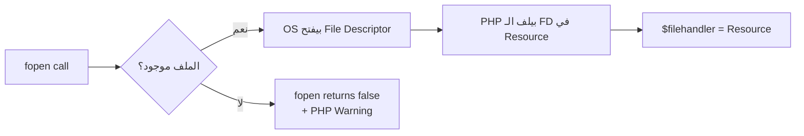
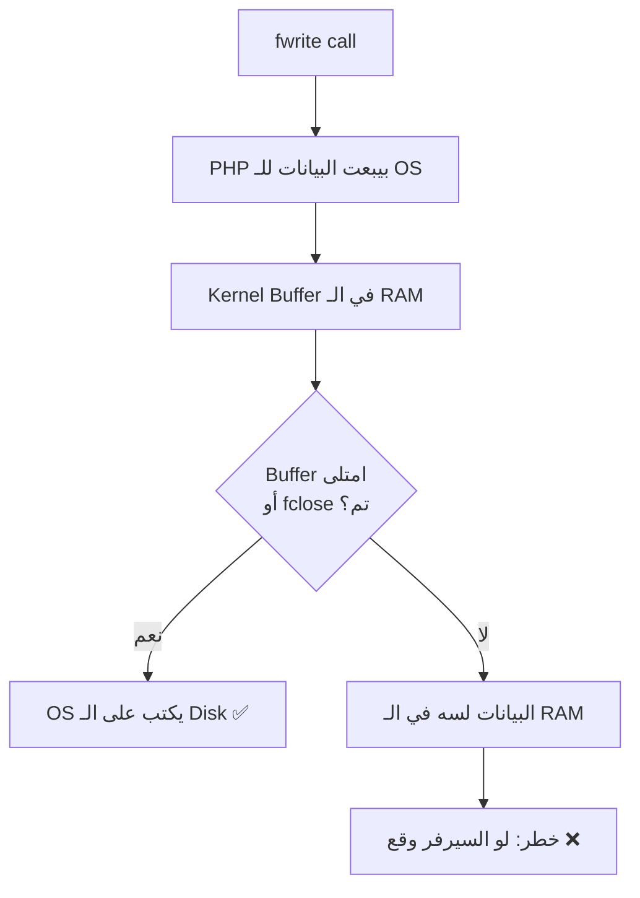
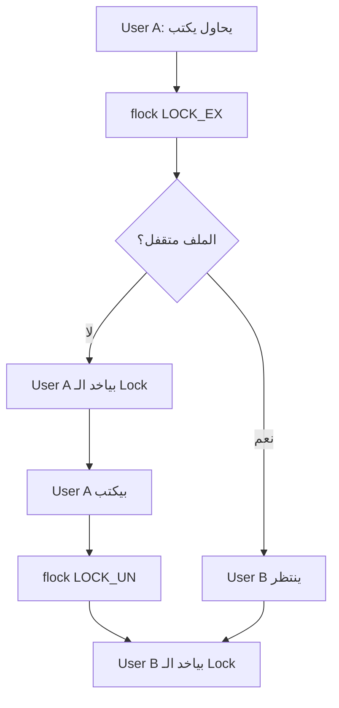
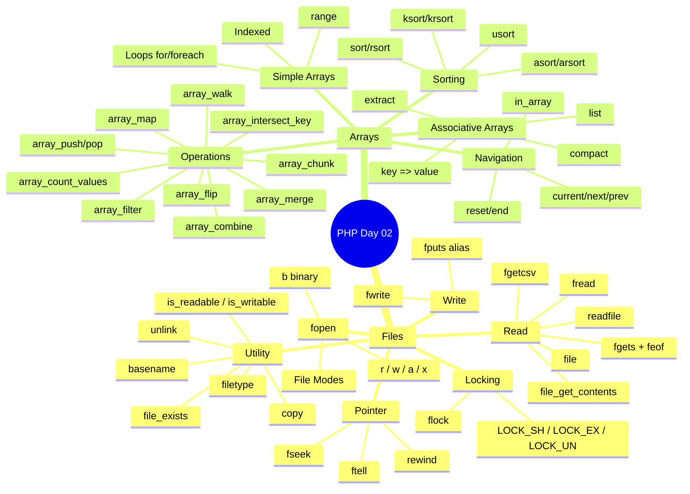

# 📖 PHP — اليوم التاني: Files & Arrays

---
## الفصل الأول: ليه بنحتاج نتعامل مع الـ Files أصلاً؟

### البداية — المشكلة

تخيل معايا السيناريو المرعب ده...

إنت عامل نظام لشركة صغيرة بيستقبل تسجيل بيانات العملاء. كل ما عميل يسجل، بياناته بتتحفظ **في الـ memory** فقط — في متغيرات PHP. طيب إيه اللي بيحصل لما الـ request يخلص؟

**الـ memory بتتمسح!** كل حاجة اشتغلت فيها راحت.

الـ PHP by design هي **stateless language** — كل request بيبدأ من الأول. مفيش ذاكرة بين الـ requests. فبكده لو عايز تحفظ بيانات، عندك خيارين أساسيين:

```
┌─────────────────────────────────────────────────┐
│              تخزين البيانات في PHP              │
│                                                 │
│   ┌─────────────────┐    ┌──────────────────┐   │
│   │   Flat Files    │    │    Database      │   │
│   │  (نصوص عادية)   │    │  (MySQL, etc.)   │   │
│   │                 │    │                  │   │
│   │  ✅ بسيط           │    ✅ سريع للبحث   │   │
│   │  ✅ لا حاجة      │    │  ✅ Access Control│  │
│   │     لـ DB       │    │  ✅ Concurrent    │   │
│   │  ❌ بطيء         │    │     ❌ أعقد         │   │
│   │     للبحث       │    │   في الإعداد   │   │
│   └─────────────────┘    └──────────────────┘   │
└─────────────────────────────────────────────────┘
```

اليوم بنتعلم الـ **Flat Files** — زي الـ `.txt` والـ `.csv`. وده مهم جداً لأسباب:

1. في حالات بسيطة ومش محتاج database كاملة
2. Log files — كل السيرفرات بتكتب في ملفات نصية
3. Configuration files — ملفات الـ config بتتقرأ من الـ disk
4. Data exchange — CSV files بتتشارك بين الأنظمة

---

<a name="الفصل-التاني"></a>

## الفصل التاني: فتح الباب — fopen() والـ File Modes

### الحكاية والمشكلة

تخيل معايا إنك بدك تبعت طرد (Package) لحد. أول حاجة بتعملها إيه؟ بتروح مكتب البريد وبتقوله: "عايز أبعت طرد". هو بيسألك: "رح تبعت ولا هتجيب؟". بعدين بيديك النموذج المناسب.

الـ `fopen()` ده هو مكتب البريد. إنت بتقوله: "افتحلي القناة مع الملف ده" — وبتحدد **بدك تقرأ ولا تكتب ولا الاتنين**.

### رحلة التنفيذ

لما بتكتب:

```php
$filehandler = fopen("welcome.txt", "r");
```

الـ Zend Engine بيعمل الآتي:

1. بيطلب من الـ OS (Linux) يفتحله الملف
2. الـ OS بيدور على الملف في الـ filesystem
3. لو لاقيه، بيرجع **file descriptor** — رقم بيمثل القناة المفتوحة
4. الـ PHP بيلف الـ file descriptor ده في **Resource object**
5. الـ Resource ده هو اللي بيتخزن في `$filehandler`



### الـ File Modes — كل mode بحكايته

ده من أهم الجداول اللي هتحفظها:

|Mode|الاسم|الحكاية|
|---|---|---|
|`r`|Read|بتفتح الملف لقراءة فقط. لو الملف مش موجود → false|
|`r+`|Read+Write|بتفتح للقراءة والكتابة. الـ pointer في الأول|
|`w`|Write|بتفتح للكتابة. **بتمسح المحتوى القديم**. لو مش موجود بيبنيه|
|`w+`|Write+Read|زي `w` بس بتقدر تقرأ كمان. المحتوى القديم بيتمسح|
|`x`|Cautious Write|بتفتح للكتابة — بس لو الملف موجود → false + warning|
|`x+`|Cautious Write+Read|زي `x` بس بتقدر تقرأ|
|`a`|Append|بتضيف في آخر الملف. مش بتمسح القديم|
|`a+`|Append+Read|بتضيف وبتقرأ|
|`b`|Binary|بيتضاف مع mode تاني: `rb`, `wb` — للملفات الـ binary|
|`t`|Text|خاص بـ Windows (مش مهم على Linux)|

> ⚠️ **انتبه:** الفرق بين `w` و `a` ده مهم جداً!
> 
> - `w` = مسح كل حاجة وابدأ من أول
> - `a` = زود على آخر اللي موجود لو عندك log file وفتحته بـ `w` بالغلط — راح كل الـ logs التاريخية!

### الـ Error Suppressor — الـ @ المثيرة للجدل

```php
// ❌ لو welcome.txt مش موجود هيطلع Warning بشكل صريح على الشاشة
$file = fopen("welcome.txt", "r");

// ✅ بنسكت الـ Warning ونعمل error handling بشكل أنيق
@$file = fopen("welcome.txt", "r");
if ($file) {
    echo "الملف اتفتح تمام ✅";
} else {
    echo "الملف مش موجود ❌";
}
```

اللي بيحصل هنا إن الـ `@` بيقول للـ PHP: "سكت على أي error أو warning من الـ expression اللي جاي". بس انتبه — ده مش معناه إن المشكلة اتحلت. المشكلة لسه موجودة — بس إنت بتـ handle بشكل صريح.

> ⚠️ **انتبه:** الـ `@` operator مش recommended في الـ production code الحديثة. الأفضل تستخدم `file_exists()` قبل الـ fopen أو تستخدم `try-catch` مع exceptions.

---

<a name="الفصل-التالت"></a>

## الفصل التالت: الكتابة — fwrite() والأقلام الرقمية

### البداية — المشكلة

عايز تكتب بيانات في ملف. تخيل إن الـ file pointer ده زي قلم بيوقف في مكان معين في الملف. لما تكتب، الكلام بيتكتب من مكان الـ pointer.

### رحلة التنفيذ

```php
// الخطوة 1: افتح الباب
$filehandler = fopen("welcome.txt", "w");  // ← w = امسح القديم وابدأ جديد

// الخطوة 2: اكتب
fwrite($filehandler, "مرحبا بالعالم من PHP!");

// الخطوة 3: أقفل الباب
fclose($filehandler);
```

**بروتوتايب الـ fwrite:**

```php
int fwrite(resource $handle, string $string [, int $length])
```

- `$handle` — الـ Resource اللي رجعه fopen
- `$string` — النص اللي هتكتبه
- `$length` — اختياري: أقصى عدد bytes هتكتبها (مفيد للـ truncation)

الـ `fputs()` هي مجرد alias لـ `fwrite()` — نفس البنية، نفس السلوك.

### الـ fwrite تحت الكبوت

لما بتكتب `fwrite($filehandler, "Hello")`:

1. الـ PHP بيطلب من الـ OS يكتب الـ string في الـ file descriptor المفتوح
2. الـ OS بياخد البيانات ويحطها في الـ **kernel buffer** أولاً
3. بعدين الـ OS بيعمل `flush` للـ buffer على الـ disk لما الـ buffer يمتلي أو لما تعمل `fclose()`
4. الـ fclose() بتعمل flush للـ buffers وبتقفل الـ file descriptor

ده بيعني إن لو السيرفر وقع قبل الـ fclose، ممكن البيانات اللي في الـ buffer تترمي!



---

<a name="الفصل-الرابع"></a>

## الفصل الرابع: القراءة — الـ File Pointer وعائلته

### تخيل معايا...

الـ File Pointer ده بالظبط زي إصبعك لما بتقرأ كتاب. إصبعك بيبدأ من أول كلمة، وكل ما تقرأ كلمة، إصبعك بيتحرك لقدام. الـ fread() بتحرك الـ pointer بمقدار الـ bytes اللي قرأتها.

### 1. fread() — قراءة n bytes

```php
// القراءة الكلاسيكية
$filehandler = fopen("welcome.txt", "r");
$filesize    = filesize("welcome.txt");  // ← لازم نعرف حجم الملف
$data        = fread($filehandler, $filesize);  // ← اقرأ كل الملف دفعة واحدة
var_dump($data);
fclose($filehandler);
```

**ليه محتاجين filesize؟** لأن `fread()` بتسألك: "تقرأ كام byte؟". لو مش عارف حجم الملف، مش هتعرف تقوله تقرأ قد إيه. فـ `filesize()` بترجعلك حجم الملف بالـ bytes.

### 2. feof() + fgets() — قراءة سطر بسطر

```php
$filehandler = fopen("welcome.txt", "r");

// feof = File End Of File
// بترجع true لما الـ pointer يوصل لـ نهاية الملف
while (!feof($filehandler)) {
    echo fgets($filehandler) . "<br>";  // اقرأ سطر واحد
}

fclose($filehandler);
```

**بروتوتايب fgets:**

```php
string fgets(resource $handle [, int $length])
```

- لو حددت `$length`، بيقرأ `length - 1` حروف (الـ -1 عشان الـ null terminator)
- لو مش محدد، بيقرأ لحد ما يلاقي `\n` أو `\r\n`

### 3. fgetcsv() — القراءة من CSV Files

```php
// ملف customer.csv جوّاه:
// Ahmed,25,Cairo
// Noha,30,Giza

$filehandler = fopen("customer.csv", "r");
while (!feof($filehandler)) {
    $row = fgetcsv($filehandler, 100, ",");  // ← فصّل على الـ comma
    if ($row) {
        var_dump($row);
        // بيرجع array: ['Ahmed', '25', 'Cairo']
    }
}
fclose($filehandler);
```

**بروتوتايب fgetcsv:**

```php
array fgetcsv(resource $handle, int $length, string $delimiter, string $enclosure, string $escape)
```

- `$length` — أقصى طول للسطر
- `$delimiter` — الفاصل (افتراضي: `,`)
- `$enclosure` — الـ enclosure character (افتراضي: `"`)

### 4. الطريق السريع — قراءة في خطوة واحدة

وده بقى الـ shortcut اللي بيحب الناس:

```php
// readfile() — بتطبع مباشرة على الشاشة
readfile("welcome.txt");  // ← مش محتاج fopen أو fclose

// file() — بتقرأ الملف وترجعه كـ array (كل سطر = element)
$data = file("welcome.txt");
var_dump($data);  // array(3) { [0]=> "السطر الأول\n" [1]=> "السطر التاني\n" ... }

// file_get_contents() — بتقرأ وترجع string (الأشهر والأسرع)
$data = file_get_contents("welcome.txt");
var_dump($data);
```

**مقارنة الطرق:**

|الطريقة|بترجع|مناسبة لـ|
|---|---|---|
|`fread()`|string|لما تحتاج تتحكم في كمية القراءة|
|`fgets()`|string|قراءة سطر بسطر مع processing|
|`fgetcsv()`|array|CSV files|
|`readfile()`|void (بتطبع)|عرض ملف مباشرة|
|`file()`|array|لما تحتاج تتعامل مع كل سطر كـ element|
|`file_get_contents()`|string|الأغلبية — الأبسط والأسرع|

---

<a name="الفصل-الخامس"></a>

## الفصل الخامس: دوال الـ File المفيدة — العدة الكاملة

### الـ File Pointer — السلاح السري

الـ File Pointer ده مش بس للقراءة التسلسلية. عندك 3 دوال بتتحكم فيه:

```php
$fh = fopen("welcome.txt", "r+");

// ftell() — إنت فين دلوقتي؟
echo ftell($fh);  // 0 — في الأول

fread($fh, 10);   // اقرأ 10 bytes

echo ftell($fh);  // 10 — الـ pointer اتحرك

// fseek() — روح لمكان محدد
fseek($fh, 5);    // اتحرك لـ byte رقم 5
echo ftell($fh);  // 5

// rewind() — ارجع للأول
rewind($fh);
echo ftell($fh);  // 0 — رجعنا للبداية

fclose($fh);
```

تخيل معايا إن الـ File Pointer ده زي الـ cursor في الـ Word. إنت ممكن تحركه للأمام والخلف وتقرأ من أي مكان.

### دوال الـ File System

```php
// file_exists() — هل الملف موجود؟
if (file_exists("welcome.txt")) {
    echo "موجود ✅";
} else {
    echo "مش موجود ❌";
}

// filetype() — النوع: 'file' أو 'dir'
echo filetype("welcome.txt");    // file
echo filetype("/var/www/html");  // dir

// unlink() — حذف الملف
unlink("old_file.txt");  // ← زي rm في Linux

// copy() — نسخ الملف
copy("source.txt", "destination.txt");

// basename() — اسم الملف من المسار الكامل
$path = "/var/www/html/project/index.php";
echo basename($path);  // index.php
```

### دوال الـ Permissions

```php
$file = "/var/www/html/welcome.txt";

var_dump(is_file($file));        // هل ده ملف (مش folder)؟
var_dump(is_dir($file));         // هل ده directory؟
var_dump(is_readable($file));    // هل ممكن يتقرأ؟
var_dump(is_writable($file));    // هل ممكن يتكتب فيه؟
var_dump(is_executable($file));  // هل ممكن يتنفذ؟
var_dump(is_link($file));        // هل ده symbolic link؟
```

الدوال دي مهمة جداً على اللينكس. في Ubuntu، الـ Web Server بيشتغل كـ `www-data` user — وإنت ممكن تلاقي permissions مشكلة. هنتكلم عن ده في اللاب.

---

<a name="الفصل-السادس"></a>

## الفصل السادس: File Locking — لما الكل يحاول يكتب في نفس الوقت

### تخيل معايا السيناريو المرعب ده!

عندك موقع تجاري فيه 500 مستخدم شغالين في نفس الوقت. كل مستخدم لما يعمل order، بتكتب في `orders.txt`. طيب إيه اللي بيحصل لو 50 مستخدم ضغطوا على "تأكيد الطلب" في نفس اللحظة؟

```
User A: بيفتح orders.txt ويقرأ المحتوى → "Order1\nOrder2\n"
User B: بيفتح orders.txt ويقرأ المحتوى → "Order1\nOrder2\n"
User A: بيكتب "Order3\n" → "Order1\nOrder2\nOrder3\n"
User B: بيكتب "Order4\n" → "Order1\nOrder2\nOrder4\n"  ← WAIT! Order3 اتمسح!
```

ده اللي بيسموه **Race Condition** — ومن أكتر المشاكل اللي بتضيع البيانات.

### الحل: flock() — قفل الملف



```php
$file = fopen("orders.txt", "a");  // ← append mode

// حاول تاخد Exclusive Lock للكتابة
if (flock($file, LOCK_EX)) {
    
    // محدش غيرك بيقدر يكتب دلوقتي
    fwrite($file, "New order data\n");
    
    // خلي باله من الـ flush قبل الـ unlock
    fflush($file);
    
    // أطلق الـ Lock عشان الناس التانية تكتب
    flock($file, LOCK_UN);
    
} else {
    echo "مقدرناش نلاقي lock — جرب بعدين";
}

fclose($file);
```

**أنواع الـ Locks:**

|الثابت|النوع|المعنى|
|---|---|---|
|`LOCK_SH`|Shared (Read)|ممكن أكتر من حد يقرأ في نفس الوقت|
|`LOCK_EX`|Exclusive (Write)|حد واحد بس يكتب، والكل ينتظر|
|`LOCK_UN`|Unlock|أطلق الـ Lock|

> ⚠️ **انتبه:** الـ flock() ما هياش حل سحري. في PHP على Linux هو **Advisory Lock** — يعني الـ processes التانية اللي مش بتستخدم flock ممكن تكتب في الملف رغم الـ lock. لازم كل الكود اللي بيتعامل مع الملف يستخدم flock.

---

<a name="الفصل-السابع"></a>

## الفصل السابع: مشاكل الـ Flat Files — ليه الـ Database موجودة أصلاً

### اللي بيحصل في الواقع

الـ Flat Files بسيطة ومفيدة في حالات محددة، بس إزاي المشاكل بتظهر لما المشروع يكبر:

**1. السرعة مع الحجم الكبير:** لو عندك ملف `customers.txt` فيه مليون عميل وعايز تدور على عميل اسمه "Ahmed" — الكود هيقرأ كل الملف سطر بسطر لحد ما يلاقيه. ده Sequential Search — O(n). مع Database وـ Index، ده بيبقى O(log n) أو O(1).

**2. البحث والتصفية:**

```php
// عايز العملاء اللي Track بتاعهم "Application" وسنهم > 25
// في Flat File → محتاج تقرأ كل السطور وتـ filter يدوياً
// في Database → SELECT * FROM customers WHERE track='Application' AND age > 25
```

**3. الصلاحيات:** في الـ Database عندك `GRANT` و`REVOKE` للـ users. في الملفات، الصلاحيات بتاعت الـ OS فقط.

**4. Concurrent Access:** الـ flock() بيحل المشكلة بس بـ bottleneck — طالما واحد شايل الـ lock، الكل ينتظر.

---

<a name="الفصل-التامن"></a>

## الفصل التامن: Arrays — التشكيلة المتكاملة في PHP

### البداية — المشكلة قبل الـ Arrays

تخيل محتاج تتعامل مع 50 اسم طالب:

```php
// ❌ بدون Arrays — nightmare
$student1 = "Ahmed";
$student2 = "Noha";
$student3 = "Mostafa";
// ... لحد $student50
```

ده horror! إزاي تعمل loop عليهم؟ إزاي تحوّلهم لـ function؟

الـ Array هو الحل. تخيله زي الحافلة المدرسية — بدل ما يجيب سيارة لكل طالب، بيجمعهم في وعاء واحد ومنظم.

### إنشاء الـ Arrays

```php
// الطريقة الكلاسيكية
$students = array("Ahmed", "Noha", "Mostafa", "Omar");

// الطريقة الحديثة (PHP 5.4+) — الأشيع دلوقتي
$students = ["Ahmed", "Noha", "Mostafa", "Omar"];

// array بـ indices صريحة
$arr = [0 => "Zero", 1 => "One", 2 => "Two"];
```

### الـ Indexes في الـ RAM

لما PHP بتنشئ array، الـ Zend Engine بيخصص ليها memory في شكل **Hash Table**. كل element ليه:

- **Key** (مفتاح): رقم أو نص
- **Value** (قيمة): أي type

```
RAM Memory:
┌─────┬──────────┐
│ Key │  Value   │
├─────┼──────────┤
│  0  │ "Ahmed"  │
│  1  │ "Noha"   │
│  2  │ "Mostafa"│
│  3  │ "Omar"   │
└─────┴──────────┘
```

### Loop على الـ Array

```php
$students = ["Ahmed", "Noha", "Mostafa", "Omar"];

// الطريقة 1: for loop بـ index
for ($i = 0; $i < count($students); $i++) {
    echo $students[$i] . " ";
}

// الطريقة 2: foreach — الأنيق والمفضل
foreach ($students as $student) {
    echo $student . " ";
}

// الطريقة 3: foreach مع الـ index
foreach ($students as $index => $student) {
    echo "$index: $student <br>";
}
```

### range() — أنشئ تسلسل تلقائي

```php
// أرقام
$numbers = range(1, 10);       // [1, 2, 3, ..., 10]
$evens   = range(2, 20, 2);    // [2, 4, 6, ..., 20]  ← step = 2

// حروف
$letters    = range("A", "Z");           // [A, B, C, ..., Z]
$alphRange  = range("A", "Z", 4);        // [A, E, I, M, Q, U, Y]
foreach ($alphRange as $char) {
    echo $char . " , ";
}
```

---

<a name="الفصل-التاسع"></a>

## الفصل التاسع: Associative Arrays — المصفوفة اللي بتفهم

### البداية — المشكلة

تخيل بتحفظ بيانات موظف. بـ indexed array:

```php
$employee = ["Ahmed", 30, "Cairo", "Backend"];
// إيه $employee[2]؟ Cairo؟ مش واضح خالص!
```

مش readable خالص. الـ Associative Array بيحل ده — بيديك Keys بأسماء واضحة.

### تعريف وصياغة

```php
// الصياغة: key => value
$info = [
    "Name"  => "Noha",
    "Email" => "nshehab@iti.gov.eg",
    "Track" => "Application"
];

// وصول بالـ key
echo $info["Name"];   // Noha
echo $info["Email"];  // nshehab@iti.gov.eg

// إضافة element جديد
$info["Intake"] = 35;

// Loop مع الـ key والـ value
foreach ($info as $key => $value) {
    echo "$key : $value <br>";
}
```

### compact() — من متغيرات لـ Array

```php
$name  = "Ahmed";
$email = "ahmed@example.com";
$track = "Cloud";

// compact بيشيل المتغيرات ويحطهم في Associative Array
$person = compact("name", "email", "track");
// نفس:
// $person = ["name" => "Ahmed", "email" => "ahmed@example.com", "track" => "Cloud"]

var_dump($person);
```

### extract() — من Array لمتغيرات

```php
$info = ["username" => "Noha", "email" => "nshehab@iti.gov.eg", "track" => "Application"];

// extract بيفك الـ Array لمتغيرات
extract($info);

// دلوقتي عندك:
echo $username;  // Noha
echo $email;     // nshehab@iti.gov.eg
echo $track;     // Application
```

### list() — Destructuring الـ Indexed Arrays

```php
$info = ['coffee', 'brown', 'caffeine'];

// list() بتوزع الـ array على متغيرات
list($drink, $color, $power) = $info;
// أو الطريقة الحديثة:
[$drink, $color, $power] = $info;

echo "$drink is $color and $power makes it special.";
// coffee is brown and caffeine makes it special.
```

---

### Array Operators — العمليات المميزة

```php
$num   = [2, 4, 6, 8, 10];
$alpha = ["a", "b", "c", "d"];

// Union (+) — اتحاد
$union = $num + $alpha;
// بياخد كل حاجة من $num وبيضيف من $alpha اللي مالهاش نفس الـ key
// النتيجة: [2, 4, 6, 8, 10] ← لأن $num عنده keys 0-4 وكمان $alpha
// الـ keys اللي موجودة في $num بتطغى على $alpha
var_dump($union);  // [2, 4, 6, 8, 10] ← $alpha اتجاهل خالص!

// Equality (==) — نفس الـ keys والـ values
$a = [1 => "a", 2 => "b"];
$b = [2 => "b", 1 => "a"];
var_dump($a == $b);   // true ← نفس الـ pairs بغض النظر عن الترتيب

// Identity (===) — نفس الـ pairs وبنفس الترتيب
var_dump($a === $b);  // false ← الترتيب مختلف
```

---

### Multi-dimensional Arrays — أبعاد جوه أبعاد

```php
$students = array(
    1 => array("Ali",    "IOT"),
    2 => array("Mostafa","Cloud"),
    3 => ["Noha",        "Application"]
);

// وصول: [row][column]
echo $students[1][0];  // Ali
echo $students[2][1];  // Cloud
echo $students[3][0];  // Noha

// Loop nested
foreach ($students as $id => $student) {
    echo "ID: $id | Name: {$student[0]} | Track: {$student[1]} <br>";
}
```

---

## الفصل العاشر: عمليات الـ Arrays المتقدمة

<a name="الفصل-العاشر"></a>

### 1. Sorting — الترتيب

```php
$names = ['noha', "Fatma", "Dina", "Andrew", "Shimaa", "suliman"];

// sort() — تصاعدي
// مهم: Case Sensitive! أحرف كبيرة قبل صغيرة (A < Z < a)
sort($names);
var_dump($names);
// ["Andrew", "Dina", "Fatma", "Shimaa", "noha", "suliman"]

// rsort() — تنازلي
rsort($names);

// sort مع flags
sort($names, SORT_STRING | SORT_FLAG_CASE);  // case-insensitive
```

```php
// للـ Associative Arrays
$prices = ["meat" => 100, "sugar" => 10, "tea" => 8];

// asort() — رتب بالـ values (مع الحفاظ على الـ keys)
asort($prices);
// ["tea" => 8, "sugar" => 10, "meat" => 100]

// ksort() — رتب بالـ keys
$info = ["Name" => "Noha", "Email" => "...", "Track" => "Application"];
ksort($info);
// ["Email" => ..., "Name" => "Noha", "Track" => "Application"]

// arsort() — تنازلي بالـ values
arsort($prices);

// krsort() — تنازلي بالـ keys
krsort($info);
```

### 2. usort() — User-Defined Sort

```php
// بتكتب custom comparison function
function cmp($a, $b)
{
    if ($a == $b) {
        return 0;   // ← متساويان
    }
    return ($a < $b) ? -1 : 1;  // ← -1 = a قبل b ، 1 = b قبل a
}

$numbers = [3, 2, 5, 6, 1];
usort($numbers, "cmp");

foreach ($numbers as $key => $value) {
    echo "$key: $value <br>";
}
// 0: 1
// 1: 2
// 2: 3
// 3: 5
// 4: 6
```

الـ comparison function بتشتغل زي أي sorting algorithm — بتعمل مقارنة بين كل pair من العناصر وبترجع:

- **-1** → `$a` يجي قبل `$b`
- **0** → متساويين
- **1** → `$b` يجي قبل `$a`

### 3. Reordering Functions

```php
$fruits = ['banana', 'apple', 'kiwi', 'orange'];

// shuffle() — خلط عشوائي
shuffle($fruits);
var_dump($fruits);  // ترتيب عشوائي كل مرة

// array_reverse() — عكس الترتيب (بيعمل نسخة جديدة)
$reversed = array_reverse($fruits);
var_dump($reversed);

// array_push() — أضف في الآخر
array_push($fruits, "mango", "strawberry");
// أو الاختصار:
$fruits[] = "mango";

// array_pop() — اشيل من الآخر وارجعه
$last = array_pop($fruits);
echo $last;  // strawberry
```

### 4. array_flip() — اقلب الـ Keys والـ Values

```php
$colors = [
    'one'   => 'red',
    'two'   => 'blue',
    'three' => 'yellow'
];

$flipped = array_flip($colors);
var_dump($flipped);
// ['red' => 'one', 'blue' => 'two', 'yellow' => 'three']
```

ده بيتستخدم كثير مع `array_intersect_key()` — هنشوفه بعد شوية.

### 5. Array Navigation — الـ Internal Pointer

كل array في PHP عندها **internal pointer** بيشاور على الـ current element. دي حاجة مهمة جداً:

```php
$fruits = ['banana', 'apple', 'kiwi', 'orange'];

// current() — العنصر الحالي
var_dump(current($fruits));  // banana ← pointer في الأول دايماً

// next() — تحرك للأمام وارجع الجديد
var_dump(next($fruits));     // apple
var_dump(next($fruits));     // kiwi

// current() بعد next
var_dump(current($fruits));  // kiwi ← الـ pointer اتحرك

// reset() — ارجع للأول
var_dump(reset($fruits));    // banana

// end() — روح لـ آخر عنصر
var_dump(end($fruits));      // orange

// prev() — ارجع خطوة
var_dump(prev($fruits));     // kiwi
```

```
Internal Pointer:
[banana] → [apple] → [kiwi] → [orange]
                       ↑
                    current
```

### 6. in_array() — هل الـ value موجود؟

```php
$fruits = ['banana', 'apple'];

$found = in_array('banana', $fruits);  // true
$found = in_array('mango', $fruits);   // false

// Strict mode — بيتحقق من الـ type كمان
$numbers = [1, 2, 3];
in_array("1", $numbers);        // true  ← loose comparison
in_array("1", $numbers, true);  // false ← strict: "1" != 1
```

### 7. array_walk() — تطبيق function على كل element

```php
function print_fruits($value, $key) {
    echo "$key => $value <br/>";
}

$fruits = ['banana', 'apple', 'kiwi', 'orange'];
array_walk($fruits, "print_fruits");

// أو بـ arrow function (PHP 7.4+)
array_walk($fruits, fn($value, $key) => print("$key: $value <br>"));
```

### 8. array_merge() — اندماج الـ Arrays

```php
// تحويل associative لـ indexed (إعادة ترقيم)
$a = [5 => "banana", 22 => "kiwi"];
$merged = array_merge($a);
var_dump($merged);
// [0 => "banana", 1 => "kiwi"]  ← الـ keys اتغيرت

// دمج arrays
$arr1 = ["Ahmed", "Noha"];
$arr2 = ["Mostafa", "Omar"];
$all  = array_merge($arr1, $arr2);
// ["Ahmed", "Noha", "Mostafa", "Omar"]
```

### 9. array_chunk() — تقسيم لـ chunks

```php
$input = ['a', 'b', 'c', 'd', 'e'];

// قسّمه لـ chunks بحجم 2
$chunks = array_chunk($input, 2);
var_dump($chunks);
// [[a, b], [c, d], [e]]  ← الأخير ممكن يبقى أصغر

// مع preserve_keys
$chunks = array_chunk($input, 2, true);  // يحافظ على الـ keys الأصلية
```

### 10. array_map() — خريطة دالة على Arrays

```php
$instructors = ["Eng. Shery", "Noha", "Andrew"];
$courses      = ['Admin', 'PHP', 'Node'];

// بيطبق الـ function على elements متوازية من كلا الـ arrays
$result = array_map(function($instructor, $course) {
    return "$instructor teaches $course <br>";
}, $instructors, $courses);

var_dump($result);
// ["Eng. Shery teaches Admin <br>", "Noha teaches PHP <br>", "Andrew teaches Node <br>"]
```

### 11. array_combine() — ادمج اتنين في key-value

```php
$instructors = ["Eng. Shery", "Noha", "Andrew"];
$courses      = ['Admin', 'PHP', 'Node'];

$combined = array_combine($instructors, $courses);
// ["Eng. Shery" => "Admin", "Noha" => "PHP", "Andrew" => "Node"]

var_dump($combined);
```

### 12. array_filter() — فلترة الـ Array

```php
$my_array = [1, 90, 2, null, 3, '', 55, [], 5, 6, 7, 8, ""];

// بدون callback — بيشيل كل القيم الـ falsy
$non_empties = array_filter($my_array);
var_dump($non_empties);
// [1, 90, 2, 3, 55, 5, 6, 7, 8]  ← null, '', [] اتشالوا

// مع callback
$big = array_filter($my_array, fn($val) => is_int($val) && $val > 10);
// [90, 55]
```

### 13. array_intersect_key() — تقاطع بالـ Keys

```php
$array1 = ['blue' => 1, 'red' => 2, 'green' => 3, 'purple' => 4];
$array2 = ['green' => 5, 'blue' => 6, 'yellow' => 7, 'cyan' => 8];

// بيرجع الـ elements من $array1 اللي ليها keys موجودة في $array2
$intersection = array_intersect_key($array1, $array2);
var_dump($intersection);
// ['blue' => 1, 'green' => 3]  ← الـ values من $array1 مش $array2

// الاستخدام المميز: Whitelist للـ keys
$arr     = ['a' => 123, 'b' => 213, 'c' => 321];
$allowed = ['b', 'c'];

// array_flip يحوّل ['b', 'c'] لـ ['b' => 0, 'c' => 1]
// array_intersect_key بيفلتر على الـ keys دي فقط
$filtered = array_intersect_key($arr, array_flip($allowed));
// ['b' => 213, 'c' => 321]
```

ده pattern مشهور جداً في الـ web development لما بتيجي POST data وعايز تسمح بـ keys معينة فقط.

### 14. Count Functions

```php
$students = ["Ali", "Ahmed", "Mostafa", "Omar", "Ahmed"];

// count() — عد العناصر
var_dump(count($students));   // 5

// sizeof() — alias لـ count()
var_dump(sizeof($students));  // 5

// array_count_values() — كم مرة اتكرر كل value؟
var_dump(array_count_values($students));
// ["Ali" => 1, "Ahmed" => 2, "Mostafa" => 1, "Omar" => 1]
```

### 15. file() + explode() — تحميل CSV في Array

```php
// csvfile.csv:
// Ahmed,IOT,Samsung
// Noha,Application,ITI
// Mostafa,Cloud,AWS

$staff = file("csvfile.csv");  // كل سطر يبقى array element

echo "<table border='2'>";
echo "<tr><th>Name</th><th>Track</th><th>Company</th></tr>";

foreach ($staff as $record) {
    $data = explode(",", trim($record));  // ← trim() لإزالة \n
    echo "<tr>";
    foreach ($data as $val) {
        echo "<td>" . htmlspecialchars($val) . "</td>";
    }
    echo "</tr>";
}

echo "</table>";
```

---

## 🗺️ Mindmap — يوم 2 كامل



---

## ✅ Interview Checkpoint

**أسئلة شايفها كتير في الـ Interviews:**

**1. إيه الفرق بين `w` و `a` في fopen؟**

> `w` بيمسح محتوى الملف الموجود ويبدأ من الأول. `a` بيضيف على آخر المحتوى الموجود. لو فتحت log file بـ `w` بالغلط — راحت كل الـ logs!

**2. إيه الفرق بين `==` و `===` في الـ Arrays؟**

> `==` بيتحقق إن نفس الـ key-value pairs موجودة بغض النظر عن الترتيب أو الـ type. `===` بيتحقق من نفس الـ pairs بنفس الترتيب وبنفس الـ types.

**3. إيه الـ Race Condition في الـ Files وإزاي تحلها؟**

> لما أكتر من process بتحاول تقرأ/تكتب في نفس الملف في نفس الوقت، ممكن البيانات تتلف. الحل هو `flock()` مع `LOCK_EX` قبل الكتابة و`LOCK_UN` بعدها.

**4. إيه الفرق بين `file_get_contents()` و `readfile()`؟**

> `file_get_contents()` بترجع المحتوى كـ string. `readfile()` بتطبع المحتوى مباشرة على الـ browser وبترجع عدد الـ bytes. لو عايز تعمل processing على المحتوى، اسخدم `file_get_contents()`.

**5. `array_map()` vs `array_walk()` — إيه الفرق؟**

> `array_map()` بترجع array جديدة. `array_walk()` بتعدّل الـ array الأصلية in-place وبترجع bool. لو عايز array جديدة من غير ما تمس الأصلية — `array_map()`. لو عايز تعدّل الأصلية — `array_walk()`.

**6. إيه الـ Internal Pointer في الـ Array؟**

> كل array في PHP عندها cursor داخلي بيشاور على الـ current element. `current()` بيجيب قيمة الـ element الحالية. `next()` بيحرك الـ pointer للأمام. `reset()` بيرجعه للأول. `end()` بيروح لآخر عنصر.

---

<a name="حل-اللاب"></a>

## 🛠️ حل اللاب عملي على أوبونتو

### المطلوب:

1. Form فيه server-side validation لـ (firstname, lastname, email, gender)
2. لما تبعت الـ form، تحفظ البيانات في `customer.txt`
3. تعرض كل الـ records في جدول
4. **Bonus:** زرار Delete يمسح الـ record من الجدول والملف

---

### أولاً: إعداد البيئة على Ubuntu

```bash
# إنشاء المجلد
sudo mkdir -p /var/www/html/lab02
cd /var/www/html/lab02

# إنشاء ملف البيانات وإديه الـ permissions الصح
touch customer.txt
sudo chown www-data:www-data customer.txt  # ← السيرفر بيشتغل كـ www-data
sudo chmod 664 customer.txt               # ← rw-rw-r--

# أو لو بتطور locally وعايز تكتب بدون www-data
sudo chmod 666 customer.txt
```

> ⚠️ **انتبه للـ Permissions:** Apache و Nginx بيشتغلوا كـ `www-data` على Ubuntu. لو الـ PHP code بتاعك مش قادر يكتب في الملف، السبب على الأغلب إن `www-data` مالهوش write permission على الملف أو الـ folder.

```bash
# لو الملف محتاج يتعمل في /tmp (أأمن للـ temp files)
ls -la /tmp
# /tmp بيبقى writable للكل على الأغلب: drwxrwxrwt
```

---

### الكود الكامل — index.php

```php
<?php
// ← مسار الملف في الـ server
define('DATA_FILE', __DIR__ . '/customer.txt');
define('DELIMITER', '|');  // ← بنستخدم | مش comma عشان ممكن يكون في emails

// ===== وظائف المساعدة =====

/**
 * قراءة كل الـ records من الملف
 * @return array
 */
function readAllRecords(): array
{
    if (!file_exists(DATA_FILE)) {
        return [];
    }

    $lines   = file(DATA_FILE, FILE_IGNORE_NEW_LINES | FILE_SKIP_EMPTY_LINES);
    $records = [];

    foreach ($lines as $line) {
        $data = explode(DELIMITER, $line);
        if (count($data) === 5) {  // ← id|firstname|lastname|email|gender
            $records[] = [
                'id'        => $data[0],
                'firstname' => $data[1],
                'lastname'  => $data[2],
                'email'     => $data[3],
                'gender'    => $data[4],
            ];
        }
    }

    return $records;
}

/**
 * حفظ record جديد في الملف
 */
function saveRecord(array $record): bool
{
    $id   = uniqid();  // ← unique ID لكل record
    $line = implode(DELIMITER, [
        $id,
        $record['firstname'],
        $record['lastname'],
        $record['email'],
        $record['gender'],
    ]);

    $file = fopen(DATA_FILE, 'a');  // ← append mode
    if (!$file) {
        return false;
    }

    // ← Lock قبل الكتابة عشان نتجنب Race Conditions
    if (flock($file, LOCK_EX)) {
        fwrite($file, $line . PHP_EOL);
        fflush($file);
        flock($file, LOCK_UN);
    }

    fclose($file);
    return true;
}

/**
 * حذف record بالـ ID
 */
function deleteRecord(string $targetId): bool
{
    if (!file_exists(DATA_FILE)) {
        return false;
    }

    $records    = readAllRecords();
    $newRecords = array_filter($records, fn($r) => $r['id'] !== $targetId);

    // ← أعد كتابة الملف بدون الـ record المحذوف
    $file = fopen(DATA_FILE, 'w');  // ← w = امسح واكتب من أول
    if (!$file) {
        return false;
    }

    if (flock($file, LOCK_EX)) {
        foreach ($newRecords as $record) {
            $line = implode(DELIMITER, [
                $record['id'],
                $record['firstname'],
                $record['lastname'],
                $record['email'],
                $record['gender'],
            ]);
            fwrite($file, $line . PHP_EOL);
        }
        fflush($file);
        flock($file, LOCK_UN);
    }

    fclose($file);
    return true;
}

// ===== معالجة الـ Requests =====

$errors  = [];
$success = '';

// Handle Delete
if (isset($_GET['delete'])) {
    $id = htmlspecialchars(trim($_GET['delete']));
    if (deleteRecord($id)) {
        $success = "تم حذف الـ record بنجاح ✅";
    } else {
        $errors[] = "مقدرناش نحذف الـ record";
    }
}

// Handle Form Submission
if ($_SERVER['REQUEST_METHOD'] === 'POST') {

    // ← Sanitize الـ Input
    $firstname = htmlspecialchars(trim($_POST['firstname'] ?? ''));
    $lastname  = htmlspecialchars(trim($_POST['lastname']  ?? ''));
    $email     = htmlspecialchars(trim($_POST['email']     ?? ''));
    $gender    = htmlspecialchars(trim($_POST['gender']    ?? ''));

    // ===== Server-Side Validation =====

    // Firstname
    if (empty($firstname)) {
        $errors[] = "الاسم الأول مطلوب";
    } elseif (strlen($firstname) < 2) {
        $errors[] = "الاسم الأول لازم يكون أكتر من حرفين";
    } elseif (!preg_match('/^[a-zA-Zأ-ي\s]+$/', $firstname)) {
        $errors[] = "الاسم الأول يحتوي على حروف فقط";
    }

    // Lastname
    if (empty($lastname)) {
        $errors[] = "الاسم الأخير مطلوب";
    } elseif (strlen($lastname) < 2) {
        $errors[] = "الاسم الأخير لازم يكون أكتر من حرفين";
    }

    // Email
    if (empty($email)) {
        $errors[] = "الإيميل مطلوب";
    } elseif (!filter_var($email, FILTER_VALIDATE_EMAIL)) {
        $errors[] = "صيغة الإيميل غلط";
    }

    // Gender
    $allowedGenders = ['male', 'female'];
    if (empty($gender)) {
        $errors[] = "النوع مطلوب";
    } elseif (!in_array($gender, $allowedGenders)) {
        $errors[] = "قيمة النوع غير صالحة";
    }

    // ← لو مفيش errors، احفظ البيانات
    if (empty($errors)) {
        $saved = saveRecord([
            'firstname' => $firstname,
            'lastname'  => $lastname,
            'email'     => $email,
            'gender'    => $gender,
        ]);

        if ($saved) {
            $success = "تم حفظ البيانات بنجاح ✅";
        } else {
            $errors[] = "في مشكلة في حفظ البيانات. تحقق من permissions.";
        }
    }
}

// ← قرأ كل الـ records للعرض
$records = readAllRecords();
?>
<!DOCTYPE html>
<html lang="ar" dir="rtl">
<head>
    <meta charset="UTF-8">
    <title>Lab 02 — Customer Registration</title>
    <style>
        body { font-family: Arial, sans-serif; max-width: 900px; margin: 30px auto; padding: 0 20px; }
        h2   { color: #2c3e50; }
        .form-group { margin-bottom: 15px; }
        label { display: block; margin-bottom: 5px; font-weight: bold; }
        input, select { width: 100%; padding: 8px; border: 1px solid #ccc; border-radius: 4px; box-sizing: border-box; }
        button { background: #3498db; color: white; padding: 10px 20px; border: none; border-radius: 4px; cursor: pointer; }
        button:hover { background: #2980b9; }
        .error { background: #fee; border: 1px solid #f99; padding: 10px; border-radius: 4px; margin-bottom: 15px; color: #c00; }
        .success { background: #efe; border: 1px solid #9f9; padding: 10px; border-radius: 4px; margin-bottom: 15px; color: #060; }
        table { width: 100%; border-collapse: collapse; margin-top: 20px; }
        th, td { border: 1px solid #ddd; padding: 10px; text-align: right; }
        th { background: #2c3e50; color: white; }
        tr:nth-child(even) { background: #f9f9f9; }
        .delete-btn { background: #e74c3c; color: white; padding: 5px 10px; text-decoration: none; border-radius: 3px; font-size: 12px; }
        .delete-btn:hover { background: #c0392b; }
    </style>
</head>
<body>

<h2>📝 تسجيل العملاء</h2>

<?php if (!empty($errors)): ?>
<div class="error">
    <strong>في أخطاء:</strong>
    <ul>
        <?php foreach ($errors as $error): ?>
            <li><?= $error ?></li>
        <?php endforeach; ?>
    </ul>
</div>
<?php endif; ?>

<?php if ($success): ?>
<div class="success"><?= $success ?></div>
<?php endif; ?>

<form method="POST" action="">

    <div class="form-group">
        <label for="firstname">الاسم الأول *</label>
        <input type="text"
               id="firstname"
               name="firstname"
               value="<?= htmlspecialchars($_POST['firstname'] ?? '') ?>"
               placeholder="أدخل الاسم الأول">
    </div>

    <div class="form-group">
        <label for="lastname">الاسم الأخير *</label>
        <input type="text"
               id="lastname"
               name="lastname"
               value="<?= htmlspecialchars($_POST['lastname'] ?? '') ?>"
               placeholder="أدخل الاسم الأخير">
    </div>

    <div class="form-group">
        <label for="email">الإيميل *</label>
        <input type="email"
               id="email"
               name="email"
               value="<?= htmlspecialchars($_POST['email'] ?? '') ?>"
               placeholder="example@example.com">
    </div>

    <div class="form-group">
        <label for="gender">النوع *</label>
        <select id="gender" name="gender">
            <option value="">-- اختار --</option>
            <option value="male"   <?= (($_POST['gender'] ?? '') === 'male')   ? 'selected' : '' ?>>ذكر</option>
            <option value="female" <?= (($_POST['gender'] ?? '') === 'female') ? 'selected' : '' ?>>أنثى</option>
        </select>
    </div>

    <button type="submit">💾 حفظ البيانات</button>
</form>

<hr>
<h2>📋 سجلات العملاء (<?= count($records) ?> record)</h2>

<?php if (empty($records)): ?>
    <p>مفيش سجلات لحد دلوقتي.</p>
<?php else: ?>
<table>
    <tr>
        <th>#</th>
        <th>الاسم الأول</th>
        <th>الاسم الأخير</th>
        <th>الإيميل</th>
        <th>النوع</th>
        <th>إجراء</th>
    </tr>
    <?php foreach ($records as $i => $record): ?>
    <tr>
        <td><?= $i + 1 ?></td>
        <td><?= htmlspecialchars($record['firstname']) ?></td>
        <td><?= htmlspecialchars($record['lastname']) ?></td>
        <td><?= htmlspecialchars($record['email']) ?></td>
        <td><?= $record['gender'] === 'male' ? '👨 ذكر' : '👩 أنثى' ?></td>
        <td>
            <a href="?delete=<?= urlencode($record['id']) ?>"
               class="delete-btn"
               onclick="return confirm('متأكد إنك عايز تمسح الـ record ده؟')">
               🗑️ حذف
            </a>
        </td>
    </tr>
    <?php endforeach; ?>
</table>
<?php endif; ?>

</body>
</html>
```

---

### شرح الـ Security Points المهمة في الكود

**1. htmlspecialchars() — الحماية من XSS:**

```php
// ❌ خطر — لو المستخدم كتب: <script>alert('hacked!')</script>
echo $_POST['firstname'];

// ✅ آمن — بيحول الـ HTML characters لـ entities
echo htmlspecialchars($_POST['firstname']);
// <script> → &lt;script&gt;
```

**2. FILTER_VALIDATE_EMAIL:**

```php
// PHP built-in email validation
if (!filter_var($email, FILTER_VALIDATE_EMAIL)) {
    $errors[] = "صيغة الإيميل غلط";
}
```

**3. urlencode() في الـ Delete Link:**

```php
// الـ ID ممكن يحتوي على حروف خاصة
<a href="?delete=<?= urlencode($record['id']) ?>">
```

**4. FILE_IGNORE_NEW_LINES | FILE_SKIP_EMPTY_LINES في file():**

```php
$lines = file(DATA_FILE, FILE_IGNORE_NEW_LINES | FILE_SKIP_EMPTY_LINES);
// FILE_IGNORE_NEW_LINES ← بيشيل الـ \n من آخر كل سطر
// FILE_SKIP_EMPTY_LINES ← بيتجاهل السطور الفاضية
```

---

### إعداد الـ Production Permissions على Ubuntu

```bash
# الـ web directory
sudo chown -R www-data:www-data /var/www/html/lab02/

# الملف بنفسه
sudo chmod 664 customer.txt  # rw-rw-r--
# Owner: www-data (rw)
# Group: www-data (rw)
# Others: read only

# لو حابب تطور locally وإنت في group www-data
sudo usermod -aG www-data $USER
# بعدين logout وlogin تاني

# Check الـ permissions
ls -la /var/www/html/lab02/
```

---

## 🫒 زتونة الإنترفيو

الـ PHP وبيئتها على الـ Ubuntu server مش مجرد "بكتب كود وبيشتغل" — هناك رحلة كاملة من HTTP Request لـ Zend Engine لـ Opcodes لـ Executor ورجعت HTML. الـ Files في PHP هي أبسط طريقة للـ persistence بس محتاج تتعامل معها بـ caution: دايماً استخدم الـ mode الصح، دايماً استخدم `flock()` في الـ concurrent writes، ودايماً تحقق من الـ file permissions. الـ Arrays في PHP هي القلب النابض لكل data processing — من الـ `sort()` البسيطة لـ `array_map()` الـ functional programming وـ `array_filter()` وـ `array_intersect_key()` للـ whitelisting. الـ internal pointer مش بس detail أكاديمي — هو الـ mechanism اللي `foreach` نفسها بتعتمد عليه. اتقن دول وهتلاقيها بتتكرر في كل مشروع PHP هتشتغل عليه.

---

> **Next →** Day 03: Object-Oriented PHP — Classes, Objects, Inheritance, وكل حاجة بتخلي الكود بتاعك يبقى enterprise-grade 🚀