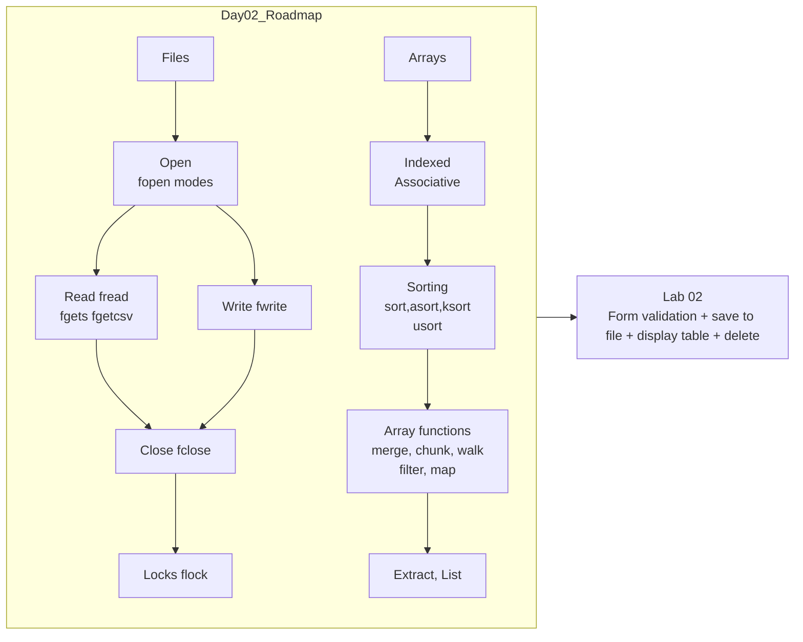
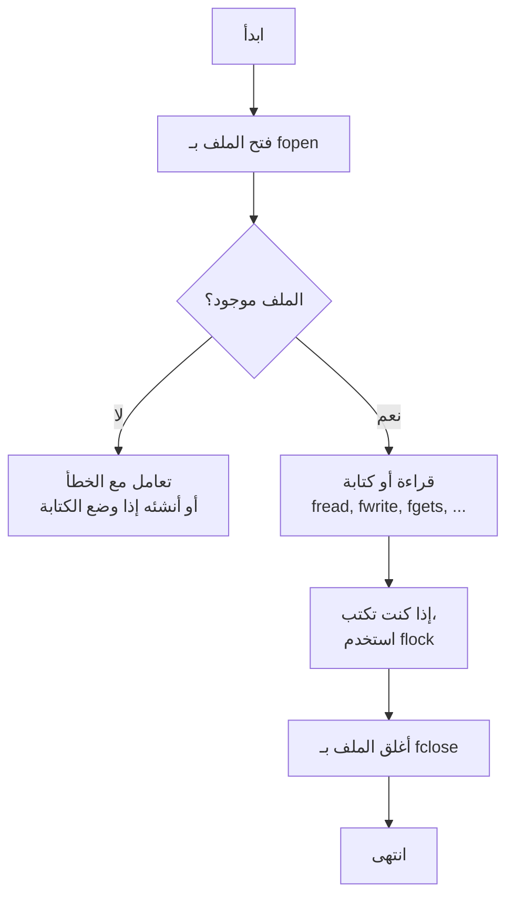

تخيل معايا السيناريو ده: عندك موقع بيجمع بيانات عملاء، عايز تخزنها عشان بعدين ترجع تعرضها، وتحذفها، تعدلها. أكيد متقدرش تخلي البيانات في الهوا (متغيرات السكربت) لأن السكربت لما يخلص، كل المتغيرات تموت. إذن إيه الحل؟ يا إما تخزن في **ملف flat file** (زي text file)، يا إما في **قاعدة بيانات**. النهاردة هنبدأ بالملفات – الطريق البسيط.

المصفوفات بقى .. دي حاجة سحرية في PHP. تقدر تخزن فيها أي حاجة: أرقام، نصوص، حتى مصفوفات تانية. هنشوف إزاي ننشئها، نلف عليها، نرتبها، ونستخدم دوال مذهلة تغني الكود بتاعك.

**يلا بسم الله..**

---



---

# 📂 **الفصل الأول: حكاية الملفات – مستودع البيانات النصي**

## 1. المقدمة: ليه نحتاج الملفات؟

لما المستخدم يبعتلك بيانات من فورم، إنت عايز تحفظها. ممكن تحفظها في **flat file**، وهو ببساطة ملف نصي (`.txt`، `.csv`، أو أي امتداد). Flat دي معناها "مسطح" – بدون تعقيد قواعد البيانات.

**مميزات الملفات البسيطة:**
- سهلة في الفتح والكتابة.
- ما تحتاجش تثبت خادم قاعدة بيانات.
- مناسبة للبيانات الصغيرة (زي إعدادات، سجلات صغيرة).

**عيوبها (والسلايدات ذكرتها بوضوح):**
- بطيئة جدًا لو الملف كبير (هتقرأه كله كل مرة).
- البحث عن سجل معين صعب – لازم تقرا سطر سطر وتقارن.
- التحكم في الصلاحيات محدود.
- الوصول المتزامن (concurrent access) من مستخدمين كتير بيسبب مشاكل، رغم إمكانية الـ locking لكنه يسبب زحمة.

لذلك، الفلات فايلز مناسبة للتطبيقات الصغيرة أو اللوقات. أما المشاريع الكبيرة فمحتاجة قاعدة بيانات.

## 2. فتح الملف: `fopen()` – البوابة السحرية

فتح الملف هو أول خطوة. شبه ما بتدخل البناية، لازم تستأذن البواب وتقولله عايز تعمل إيه: تقرأ بس؟ تكتب بس؟ تكتب في الآخر (append)؟

**الصيغة العامة:**
```php
fopen(string $filename, string $mode) // returns resource or false on failure
```

هي بترجع **resource** – نوع خاص في PHP، زي مقبض (handle) يشير إلى الملف المُفتح.

### وضعيات الفتح (Modes)

السلايدات وضحت الجدول، لكن دعني أحكيها كقصص:

- **`r` (read):** للقراءة فقط. المؤشر يبدأ من أول الملف. لو الملف مش موجود؟ `fopen` ترجع `false` وتطلع warning. عشان تتجنب الـ warning، استخدم `@` (مش أحسن حاجة) أو تحقق قبلها بـ `file_exists()`.

- **`r+` (read + write):** تقرأ وتكتب من البداية. لو كتبت، بتكتب فوق المحتوى الموجود من أول المؤشر.

- **`w` (write):** للكتابة فقط. بيفتح الملف، ولو موجود، يمسح كل محتواه (يقطع الرقبة). لو مش موجود، يحاول يخلقه. **خطر:** لو استخدمته بالغلط، تضيع بيانات.

- **`w+` (write + read):** زي `w` لكن تقدر تقرأ بعد الكتابة.

- **`x` (cautious write):** للكتابة لكن بحذر. لو الملف موجود، `fopen` ترجع `false` وتطلع warning. مفيد لو عايز تضمن إنك مش هتتلف ملف موجود.

- **`x+` (cautious write + read):** نفس الشيء مع قراءة.

- **`a` (append):** للكتابة في نهاية الملف. المؤشر في الآخر. لو مش موجود، يخلقه. مناسب للسجلات (logs).

- **`a+` (append + read):** زي `a` مع إمكانية القراءة.

- **`b` (binary):** تُضاف لوضع آخر، زي `"rb"`، `"wb"`. ضروري في أنظمة ويندوز عشان تفرق بين النص والباينري. في لينكس مش فارقة، لكن عشان البورتبلتي، استخدمها دايمًا: `"rb"`, `"wb"`.

- **`t` (text):** لويندوز بس، مش مستحسن.

**تحت الكبوت:** لما تنادي `fopen("file.txt", "r")`، PHP بتعمل syscall على مستوى OS زي `open()` في C. الـ OS ترجع file descriptor (رقم صحيح). PHP بتغلفه في resource. وبتخزن في جدول الموارد عشان تتعقبه.

### مثال توثيقي:

```php
$handle = fopen("data.txt", "r");
if ($handle === false) {
    die("فشل فتح الملف: إما مش موجود أو صلاحيات خاطئة");
}
// بقى الـ handle جاهز
fclose($handle);
```

## 3. القراءة من الملف: `fread()` و `fgets()` و `fgetcsv()`

### `fread()`: القراءة الكمية (حسب عدد البايتات)

```php
$handle = fopen("welcome.txt", "rb");
$size = filesize("welcome.txt");
$content = fread($handle, $size);
fclose($handle);
echo $content;
```

**ملاحظة:** `filesize()` بترجع حجم الملف بالبايت. لو الملف كبير جدًا (مئات الميجا)، متستخدمش `fread` بالحجم الكامل هتستهلك RAM. الأفضل تقرأ بالقطع.

### `fgets()`: قراءة سطر واحد في كل مرة

مفيد لو الملف فيه أسطر نصية. بيقرأ حتى يوصل لـ newline (`\n`) أو طول محدد.

```php
$handle = fopen("welcome.txt", "rb");
while (!feof($handle)) {
    $line = fgets($handle);
    echo $line . "<br>";
}
fclose($handle);
```

**ما هو `feof()`؟** بتفحص إذا وصلنا لنهاية الملف (end of file). لازم تستخدمها عشان ما تدخلش loop لا نهائية.

### `fgetcsv()`: قراءة ملف CSV (مفصول بفواصل أو أي محدد)

لما يكون عندك ملف بهيكل جدول: `name,email,track`. `fgetcsv` بتفك السطر إلى array حسب المحدد.

```php
$handle = fopen("users.csv", "rb");
while (($row = fgetcsv($handle, 1000, ",")) !== false) {
    echo "Name: " . $row[0] . ", Email: " . $row[1];
}
fclose($handle);
```

المعاملات: `fgetcsv(handle, length, delimiter, enclosure, escape)`

لو عايز تقرا ملف بعلامة تبويب كـ delimiter، استخدم `"\t"`.

## 4. الكتابة إلى الملف: `fwrite()` (و`fputs()` هو مرادف)

```php
$handle = fopen("output.txt", "wb");
$bytes = fwrite($handle, "Hello, PHP Files!");
if ($bytes === false) {
    echo "فشلت الكتابة";
}
fclose($handle);
```

تقدر تحدد طول الكتابة (معامل تالت اختياري):

```php
fwrite($handle, "Long text", 5); // يكتب أول 5 حروف "Long "
```

**تحت الكبوت:** `fwrite` بتستدعي `write()` system call. الـ OS بيكتب البيانات في buffer ثم يفرغها على القرص. لو عايز تفرغ فورًا، تستخدم `fflush()` لكن مش ضروري.

## 5. إغلاق الملف: `fclose()` – باب الخروج

دايمًا أقفل الملف بعد ما تخلص. لأن الموارد محدودة، والسيرفر ممكن يفشل في فتح ملفات جديدة لو وصل للحد الأقصى.

```php
fclose($handle);
```

## 6. دوال القراءة في خطوة واحدة (بدون `fopen` / `fclose`)

PHP بتقدم دوال بتقرأ الملف كله في خطوة:

### `readfile()`

بتقرأ الملف وتطبعه مباشرة على output buffer. بترجع عدد البايتات المقروءة.

```php
readfile("welcome.txt"); // بيطبع محتوى الملف
```

### `file()`

بتقرأ الملف كله وتعيده كمصفوفة (array)، كل سطر عنصر.

```php
$lines = file("data.txt");
foreach ($lines as $line) {
    echo $line;
}
```

### `file_get_contents()`

بتجيب المحتوى كـ string. مثالية لقراءة الملفات الصغيرة.

```php
$content = file_get_contents("config.json");
$config = json_decode($content, true);
```

**فرق الأداء:** `file_get_contents` أسرع من `fopen` + `fread` لأنها بتعمل كل حاجة في داخل النواة مع buffering محسّن.

## 7. دوال مفيدة على الملفات

- `rewind($handle)` – ترجع المؤشر لأول الملف (زي `reset` للـ pointer).
- `ftell($handle)` – تقولك إنت فين بالبايت (position).
- `fseek($handle, $offset)` – تتحرك لمكان معين.
- `file_exists($path)` – بتفحص إذا الملف موجود.
- `unlink($path)` – تحذف الملف (زي `rm`).
- `copy($source, $dest)` – تنسخ ملف.
- `is_file()`, `is_dir()`, `is_readable()`, `is_writable()` – دوال استفهام.
- `basename($path)` – تستخرج اسم الملف من المسار الكامل.

```php
$path = "/var/www/html/index.php";
echo basename($path); // index.php
```

## 8. قفل الملفات (Locking) – لمسألة التزامن

تخيل مستخدمين بيكتبوا في نفس الملف في نفس الوقت. هيحصل فساد بيانات. الحل: **القفل** باستخدام `flock()`.

أنواع الأقفال:
- `LOCK_SH` (قفل قراءة) – مشارك: أكتر من عملية تقدر تقرأ.
- `LOCK_EX` (قفل كتابة) – حصري: عملية واحدة بس تكتب.
- `LOCK_UN` – إطلاق القفل.

```php
$handle = fopen("data.txt", "ab");
if (flock($handle, LOCK_EX)) {
    fwrite($handle, "سطر جديد");
    flock($handle, LOCK_UN);
} else {
    echo "تعذر القفل";
}
fclose($handle);
```

**تنبيه:** `flock` بتعمل advisory lock (تنسيقي). لازم كل العمليات تلتزم به. وليست مضمونة على أنظمة الملفات الشبكية (NFS).

## 9. الملخص الرسومي لمعالجة الملفات



---

# 🧩 **الفصل الثاني: المصفوفات – صندوق الكنوز السحري**

المصفوفة في PHP هي **ordered map** (خريطة مرتبة). عبارة عن تجميعة من أزواج **key => value**. المفاتيح ممكن تكون أرقام (indexed) أو نصوص (associative).

## 1. أنواع المصفوفات:

### Indexed Arrays (رقمية)

المفاتيح أرقام تبدأ من 0 افتراضيًا.

طرق الإنشاء:
```php
$arr = [3, 5, "Application", true, "PHP"];
$arr2 = array("Noha", "Engineering", "ITI");
```

لو عايز تبدأ من رقم معين:
```php
$arr3 = [1 => "Ali", "Mostafa"]; // المفتاح 1 = Ali، والمفتاح 2 = Mostafa تلقائي.
```

### Associative Arrays

المفاتيح نصوص:
```php
$info = [
    "Name" => "Noha",
    "Email" => "nshehab@iti.gov.eg",
    "Track" => "Application"
];
```

## 2. التكرار على المصفوفات

### باستخدام `for`:
```php
for ($i = 0; $i < count($arr); $i++) {
    echo $arr[$i] . " ";
}
```

### `foreach` – الأكثر فصاحة:
```php
foreach ($info as $key => $value) {
    echo "$key : $value<br>";
}
```

## 3. `range()` – توليد تسلسل

```php
$numbers = range(1, 10);      // [1,2,3,...,10]
$letters = range('A', 'Z', 4); // ['A','E','I','M','Q','U','Y']
```

الخطوة التالتة اختيارية (step).

## 4. دوال إنشاء مصفوفات من متغيرات: `compact()`

عندك متغيرات منفصلة وعايز تحولها لمصفوفة associative بأسماء المتغيرات كمفاتيح وقيمها كقيم.

```php
$name = "Noha";
$city = "Cairo";
$data = compact("name", "city");
// ['name' => 'Noha', 'city' => 'Cairo']
```

مفيدة جدًا عند تمرير بيانات إلى view.

## 5. معاملات المصفوفات (Array Operators)

- `+` (الاتحاد): يدمج المصفوفتين، لكن المفاتيح الموجودة في اليسار لا تتغير.
```php
$a = [0 => 'a', 1 => 'b'];
$b = [1 => 'x', 2 => 'c'];
$result = $a + $b; // [0=>'a', 1=>'b', 2=>'c'] -> الـ x أُهمل لأن المفتاح 1 موجود في $a.
```

- `==` (مساواة): true لو نفس أزواج المفتاح/القيمة (بغض النظر عن الترتيب).
- `===` (تطابق): true لو نفس الأزواج ونفس الترتيب ونفس الأنواع.

لاحظ المثال من السلايدات:
```php
$num = [2,4,6,8,10];
$alphas = ["a","b","c","d"];
$arr3 = $num + $alphas; // [2,4,6,8,10] + ['a','b','c','d'] = [2,4,6,8,10] لأن المفاتيح 0-4 موجودة بالفعل في $num
```

## 6. المصفوفات متعددة الأبعاد (Multi-dimensional)

أي عنصر في المصفوفة ممكن يكون مصفوفة أخرى.

```php
$students = [
    1 => ["Ali", "IOT"],
    2 => ["Mostafa", "Cloud"],
    3 => ["Noha", "Application"]
];

echo $students[1][0]; // Ali
```

## 7. ترتيب المصفوفات (Sorting)

### للمصفوفات الرقمية:
- `sort($arr)` – ترتيب تصاعدي (يفقد المفاتيح الأصلية).
- `rsort($arr)` – تنازلي.

### للمصفوفات الترابطية:
- `asort($arr)` – ترتيب تصاعدي حسب **القيم** مع الاحتفاظ بالمفاتيح.
- `arsort($arr)` – تنازلي حسب القيم.
- `ksort($arr)` – ترتيب حسب **المفاتيح**.
- `krsort($arr)` – تنازلي حسب المفاتيح.

### ترتيب مخصص (User-defined) بـ `usort()`:
بتكتب دالة مقارنة (comparator) ترجع -1، 0، أو 1.

```php
function cmp($a, $b) {
    return $a <=> $b; // spaceship operator
}
usort($numbers, 'cmp');
```

## 8. إعادة ترتيب عشوائي وعكسي

- `shuffle($arr)` – يخلط العناصر عشوائيًا (مفيد للعبة أو إظهار عشوائي).
- `array_reverse($arr)` – يرجع مصفوفة جديدة بترتيب معكوس.

## 9. إضافة وحذف عناصر من النهايات

- `array_push($arr, $value)` – تضيف عنصر في الآخر (أو تستخدم `$arr[] = $value` مباشرة – أسرع).
- `array_pop($arr)` – تزيل آخر عنصر وترجع قيمته.
- `array_shift($arr)` – تزيل أول عنصر (باهظ الثمن لأنه يعيد فهرسة المصفوفة).
- `array_unshift($arr, $value)` – تضيف في البداية.

## 10. قلب المفاتيح والقيم: `array_flip()`

لو عندك مصفوفة key-value، تبدل الأدوار.

```php
$colors = ['one' => 'red', 'two' => 'blue'];
$flipped = array_flip($colors); // ['red' => 'one', 'blue' => 'two']
```

## 11. تحميل محتويات ملف في مصفوفة باستخدام `file()`

شوفناها في جزء الملفات – بترجع كل سطر كعنصر.

```php
$lines = file("csvfile.csv");
foreach ($lines as $record) {
    $data = explode(",", $record);
    // $data[0] => Name, $data[1] => Track...
}
```

السلايدات تعرض مثال لعرضها في جدول HTML.

## 12. التنقل في المصفوفة (Array Pointers)

كل مصفوفة لها مؤشر داخلي يشير للعنصر الحالي.

- `current($arr)` – العنصر الحالي.
- `next($arr)` – يقدم المؤشر ويرجع العنصر الجديد.
- `prev($arr)` – يرجعه للخلف.
- `reset($arr)` – يعيد المؤشر لأول عنصر.
- `end($arr)` – يذهب لآخر عنصر.

```php
$fruits = ['banana', 'apple', 'kiwi'];
echo current($fruits); // banana
next($fruits);
echo current($fruits); // apple
reset($fruits);
echo current($fruits); // banana
```

## 13. `array_walk()` – تطبيق دالة على كل عنصر

بتغير المصفوفة (إذا مررت reference) أو بتؤدي إجراء.

```php
function print_with_br($value, $key) {
    echo "$key => $value<br>";
}
array_walk($fruits, 'print_with_br');
```

## 14. دمج وتقطيع المصفوفات

- `array_merge($arr1, $arr2)` – يدمج المصفوفات. مع المفاتيح الرقمية يعيد الفهرسة. مع associative يدمج.

- `array_chunk($arr, $size)` – يقسم المصفوفة لمجموعات صغيرة.

```php
$chunks = array_chunk(['a','b','c','d','e'], 2);
// [['a','b'], ['c','d'], ['e']]
```

## 15. `array_map()` – تطبيق دالة على عناصر مصفوفات متعددة

مثال السلايدات رائع: يربط بين قائمتين.

```php
$instructors = ["Eng. Shery", "Noha", "Andrew"];
$courses = ['Admin', 'PHP', 'Node'];
$result = array_map(function($inst, $course) {
    return "$inst teaches $course";
}, $instructors, $courses);
```

## 16. `array_combine()` – يدمج مصفوفة مفاتيح ومصفوفة قيم

```php
$keys = ['name', 'age'];
$values = ['Ahmed', 25];
$combined = array_combine($keys, $values); // ['name'=>'Ahmed', 'age'=>25]
```

## 17. `array_filter()` – تصفية القيم

يزيل أي عنصر قيمته `false` في السياق المنطقي (null, 0, '', []).

```php
$input = [1, 0, 2, null, 3];
$filtered = array_filter($input); // [0=>1, 2=>2, 4=>3]
```

تقدر تمرر دالة رد (callback) لتصفية مخصصة.

## 18. التقاطعات: `array_intersect_key()`

ترجع العناصر الموجودة في المصفوفة الأولى التي تمتلك مفاتيح موجودة أيضًا في المصفوفة الثانية.

```php
$arr1 = ['blue' => 1, 'red' => 2, 'green' => 3];
$arr2 = ['green' => 5, 'blue' => 6];
$intersect = array_intersect_key($arr1, $arr2); // ['blue'=>1, 'green'=>3]
```

## 19. `array_count_values()` – عد تكرار القيم

```php
$arr = ["Ali", "Ahmed", "Ali"];
$counts = array_count_values($arr); // ['Ali'=>2, 'Ahmed'=>1]
```

## 20. تحويل مصفوفة إلى متغيرات مستقلة

### `extract()` (للمصفوفات الترابطية)

يحول كل مفتاح إلى متغير باسم المفتاح.

```php
$info = ["username" => "Noha", "email" => "n@iti.com"];
extract($info); // $username = 'Noha', $email = 'n@iti.com'
```

**تحذير:** `extract` قد يكون خطيرًا إذا كان المصفوفة مصدرها مستخدم (تسبب overwrite للمتغيرات الموجودة). استخدمها بحذر.

### `list()` (للمصفوفات الرقمية)

يفك عناصر المصفوفة إلى متغيرات.

```php
$data = ['coffee', 'brown', 'caffeine'];
list($drink, $color, $power) = $data; // $drink='coffee'...
```

من PHP 7.1، تقدر تستخدم `[$drink, $color, $power] = $data;`

منعًا للالتباس: `list` هي `language construct` وليست دالة.

---

# 🛠️ **حل اللاب العملي (Lab 02) بطريقة احترافية**

**المطلوب:**
1. إنشاء فورم HTML به حقول: firstname, lastname, email, gender.
2. Server-side validation لهذه الحقول (لا تترك فارغة، إيميل صحيح).
3. عند submit ناجح، يتم حفظ البيانات في ملف `customer.txt` (كل سطر يمثل سجل، مفصول بفواصل مثلاً).
4. صفحة أخرى أو نفس الصفحة تعرض كل السجلات في جدول HTML.
5. **Bonus:** زر Delete بجانب كل سجل، عند الضغط عليه يحذف السجل من الملف ويعيد عرض الجدول.

هنا هطبق الحل بطريقة آمنة ومنظمة، مع مراعاة استخدام المصفوفات والملفات.

## هيكل الملفات (على أوبونتو)
```
/var/www/html/lab02/
├── index.html (أو customer_form.php)
├── save_customer.php (لحفظ البيانات وعرض الجدول)
├── delete_customer.php (لحذف سجل)
└── customer.txt (يتم إنشاؤه تلقائيًا)
```

### 1. نموذج الإدخال `customer_form.php`
```php
<!DOCTYPE html>
<html>
<head><title>Customer Form</title></head>
<body>
    <h2>إضافة عميل جديد</h2>
    <form method="POST" action="save_customer.php">
        First Name: <input type="text" name="firstname" required><br>
        Last Name: <input type="text" name="lastname" required><br>
        Email: <input type="email" name="email" required><br>
        Gender: 
        <select name="gender" required>
            <option value="">اختر</option>
            <option>Male</option>
            <option>Female</option>
        </select><br>
        <input type="submit" value="Save">
    </form>
    <hr>
    <?php include 'display_customers.php'; ?>
</body>
</html>
```

### 2. معالج الحفظ والعرض `save_customer.php`
```php
<?php
session_start(); // optional for messages

// التحقق من أن الطريقة POST
if ($_SERVER['REQUEST_METHOD'] === 'POST') {
    $firstname = trim($_POST['firstname'] ?? '');
    $lastname  = trim($_POST['lastname'] ?? '');
    $email     = trim($_POST['email'] ?? '');
    $gender    = trim($_POST['gender'] ?? '');

    // Validation
    $errors = [];
    if ($firstname === '') $errors[] = 'First name required';
    if ($lastname === '') $errors[] = 'Last name required';
    if (!filter_var($email, FILTER_VALIDATE_EMAIL)) $errors[] = 'Invalid email';
    if (!in_array($gender, ['Male', 'Female'])) $errors[] = 'Invalid gender';

    if (!empty($errors)) {
        echo "<ul><li>" . implode("</li><li>", $errors) . "</li></ul>";
        echo '<a href="customer_form.php">Back</a>';
        exit;
    }

    // Save to file: each record as "firstname,lastname,email,gender" newline
    $record = $firstname . ',' . $lastname . ',' . $email . ',' . $gender . PHP_EOL;
    // use FILE_APPEND | LOCK_EX for atomic append
    file_put_contents('customer.txt', $record, FILE_APPEND | LOCK_EX);
    echo "<p style='color:green'>Customer saved successfully!</p>";
}
// بعد الحفظ أو إذا كان GET فقط، نعرض الجدول
include 'display_customers.php';
?>
```

### 3. عرض العملاء في جدول `display_customers.php`
```php
<h3>قائمة العملاء</h3>
<table border="1" cellpadding="8">
    <tr>
        <th>First Name</th><th>Last Name</th><th>Email</th><th>Gender</th><th>Action</th>
    </tr>
<?php
$filename = 'customer.txt';
if (file_exists($filename) && filesize($filename) > 0) {
    $lines = file($filename, FILE_IGNORE_NEW_LINES | FILE_SKIP_EMPTY_LINES);
    foreach ($lines as $index => $line) {
        $fields = explode(',', $line);
        // التأكد من عدد الحقول (قد يكون هناك أسطر تالفة)
        if (count($fields) == 4) {
            list($fname, $lname, $email, $gender) = $fields;
            echo "<tr>
                    <td>" . htmlspecialchars($fname) . "</td>
                    <td>" . htmlspecialchars($lname) . "</td>
                    <td>" . htmlspecialchars($email) . "</td>
                    <td>" . htmlspecialchars($gender) . "</td>
                    <td><a href='delete_customer.php?line=$index' onclick='return confirm(\"Are you sure?\")'>Delete</a></td>
                  </tr>";
        }
    }
} else {
    echo "<tr><td colspan='5'>No customers yet.</td></tr>";
}
?>
</table>
```

### 4. حذف سجل `delete_customer.php`
```php
<?php
$filename = 'customer.txt';
if (!file_exists($filename)) {
    header('Location: customer_form.php');
    exit;
}

// قراءة كل الأسطر
$lines = file($filename, FILE_IGNORE_NEW_LINES);
$lineToDelete = isset($_GET['line']) ? (int)$_GET['line'] : -1;

if ($lineToDelete >= 0 && $lineToDelete < count($lines)) {
    unset($lines[$lineToDelete]);   // إزالة السطر
    // إعادة كتابة الملف بدون السطر المحذوف
    $newContent = implode(PHP_EOL, $lines);
    // إضافة سطر جديد في النهاية إذا كان المحتوى غير فارغ
    file_put_contents($filename, $newContent . PHP_EOL, LOCK_EX);
}

// إعادة التوجيه إلى الصفحة الرئيسية لتحديث الجدول
header('Location: customer_form.php');
exit;
```

### ملاحظات إضافية على الحل:

- استخدمت `file_put_contents` مع `FILE_APPEND | LOCK_EX` عشان الكتابة الذرية. ده بيفتح الملف، يقفله، ويكتب.
- لعرض الجدول، استخدمت `file()` لتحميل كل السطور في مصفوفة، ثم `explode` لكل سطر. هذا مناسب لعدد سجلات صغير (لابات تعليمية). في الإنتاج لو الملف كبير، الأفضل تقرا باستخدام `fgets` لكن هنا بنفهم المصفوفات.
- زر الحذف يرسل رقم السطر (index). **ملاحظة أمنية**: أي مستخدم ممكن يعدل رقم السطر في الـ URL ويحذف أي سطر. في تطبيق حقيقي، لازم تستخدم معرف فريد (UUID) لكل عميل، أو تزود التحقق من الصلاحيات. لكن للاب، مقبول.
- استخدمت `htmlspecialchars` عند العرض لمنع XSS.
- كل العمليات بتستخدم `LOCK_EX` أثناء الكتابة لتجنب التلف في حالة concurrent requests (نادرة لكن جيدة).

---

## 🎯 **تجربة السيناريو على أوبونتو حقيقة:**

```bash
# إنشاء المجلد
sudo mkdir -p /var/www/html/lab02
sudo chown -R www-data:www-data /var/www/html/lab02
# إنشاء الملفات أعلاه باستخدام nano أو vim
sudo nano /var/www/html/lab02/customer_form.php
# ثم save_customer.php, display_customers.php, delete_customer.php
# ثم افتح المتصفح: http://localhost/lab02/customer_form.php
```

---

## 🧠 **تحت الكبوت: المصفوفات في PHP** (توسعة معرفية)

المصفوفة في PHP في الحقيقة هي **Hash Table** (جدول هاش) مع قائمة مرتبطة مزدوجة للحفاظ على الترتيب. كل عنصر هو `Bucket` يحتوي على المفتاح (key) وقيمته (value) ومؤشرين للعنصر التالي والسابق.

هذا الترتيب جعل PHP تستطيع أن تدعم المصفوفات الترابطية (أي مفتاح) مع الحفاظ على ترتيب الإدراج.

**لماذا `foreach` سريع جدًا؟** لأنه يمشي على القائمة المرتبطة الداخلية مباشرة، ولا يحتاج لحساب الهاش.

**تعقيد العمليات:**
- الوصول `$arr[$key]` – O(1) في المتوسط (بفضل الهاش).
- الإضافة `$arr[] = $value` – O(1).
- `array_shift` – O(n) لأنها تعيد فهرسة المفاتيح الرقمية.
- `in_array` – O(n) للتفتيش الخطي بينما `array_key_exists` O(1).

---

## ✨ **ختام اليوم الثاني**

النهاردة تعلمت:
- **فتح الملفات** بـ `fopen` وأنماطها.
- **القراءة** بـ `fread`, `fgets`, `fgetcsv` والقراءة بخطوة واحدة بـ `file_get_contents()`.
- **الكتابة** بـ `fwrite` و `file_put_contents`.
- **القفل** بـ `flock` للحماية من التزامن.
- **المصفوفات** الرقمية والترابطية، وكل دوالها السحرية: `sort`, `asort`, `array_map`, `array_filter`, `extract`, `list` وغيرها.
- **حل اللاب** بتطبيق عملي يجمع كل المفاهيم.

إنت دلوقتي قادر تخزن بيانات الفورم في ملف نصي، وتسترجعها وتعرضها في جدول، وتحذف سجلات. ده أساسي لأي مشروع صغير.

في **اليوم الثالث** هنبدأ نغوص في **الدوال** (Functions) و**النطاقات** بشكل أعمق، وهنلمس **المكتبات** (Require / Include) و**التعامل مع الأخطاء**.

جهز نفسك.. وعايز تقولي "أفتح الباب الثالث" لما تكون جاهز. وإلى ذلك الحين، جرب الكود، غيّر فيه، وكسره واصلحه. دي الطريقة الوحيدة إنك تبقى أسطورة PHP.

مع خالص تحياتي،  
**المهندس القصصي – تحت الكبوت**  
ومتنساش تشكر الأستاذة **Noha Shehab** على إعداد المحتوى الأصلي. 😎🐘

```php
// رمز اليوم: الاستمرارية
while ($you->isLearning()) {
    $you->practice()->files();
    $you->master()->arrays();
    $you->build()->lab02();
}
```