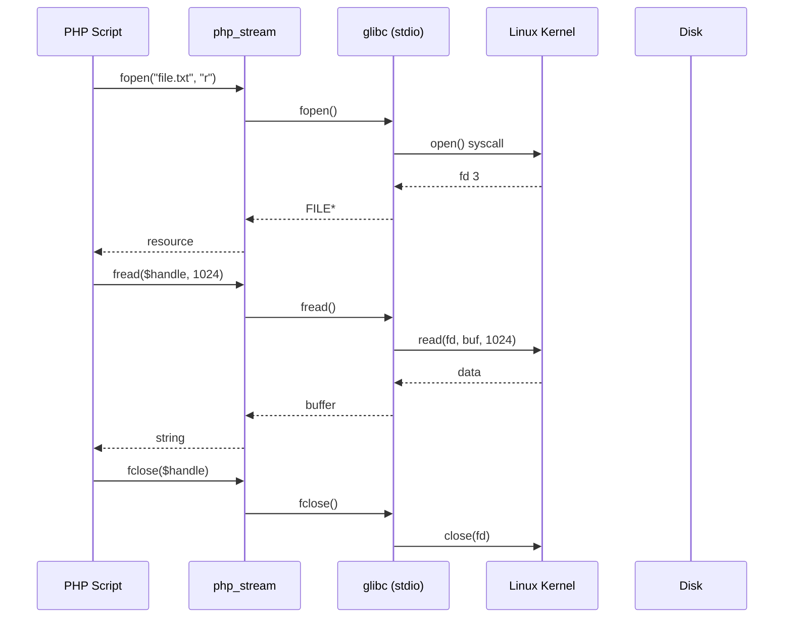
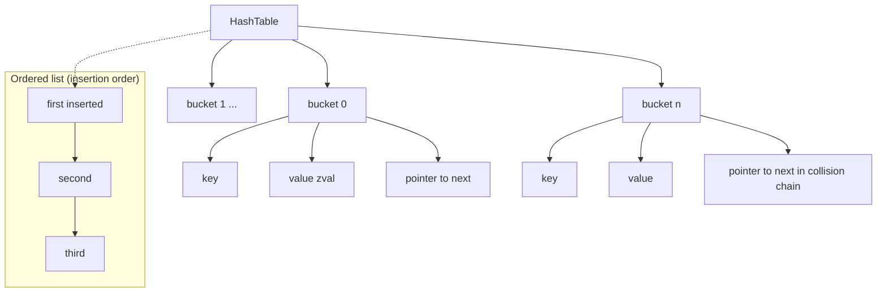

# 📄 File 1: `PHPDay02_Part1.md`

# 🗃️ PHP Day02 – الجزء الأول: التعامل مع الملفات (Files) تحت الكبوت

## 🎯 الـ Core Problem

إيه المشكلة الأساسية؟ تخزين البيانات بشكل مؤقت أو دائم بدون قاعدة بيانات.  
حل PHP: **Flat files** (text files). لكن الـ flat files مش مجرد `fopen` وخلاص. لازم تفهم الـ file descriptors، الـ locking، الـ buffering، وفروق الـ modes على Linux.

> [!DEEP-DIVE]
> PHP بتستخدم نفس system calls اللي في C: `open()`, `read()`, `write()`, `close()`, `lseek()`, `flock()`. كل ملف بتفتحه في PHP بيستلم **resource** (وهو رقم file descriptor في الـ OS). الفرق إن PHP بتضيف طبقة من الـ buffering (user-space) عشان تقلل عدد الـ syscalls.

---

## 🐧 1. فتح الملف – `fopen()` وإختيار الـ mode الصح

```php
$handle = fopen("/var/www/data/users.txt", "r");
if ($handle === false) {
    // فشل الفتح – غالباً permissions أو الملف مش موجود
    error_log("Cannot open file");
    exit;
}
```

### جدول الـ modes المهمة على Ubuntu (Linux):

| Mode | المعنى | تحت الكبوت (system call flags) |
|------|--------|--------------------------------|
| `r`  | قراءة فقط، المؤشر في البداية | `O_RDONLY` |
| `r+` | قراءة وكتابة، المؤشر في البداية | `O_RDWR` |
| `w`  | كتابة فقط، إنشاء ملف جديد أو مسح المحتوى الموجود | `O_WRONLY | O_CREAT | O_TRUNC` |
| `w+` | قراءة وكتابة، مسح المحتوى | `O_RDWR | O_CREAT | O_TRUNC` |
| `a`  | كتابة فقط، إلحاق في النهاية (append) | `O_WRONLY | O_CREAT | O_APPEND` |
| `a+` | قراءة وكتابة، إلحاق | `O_RDWR | O_CREAT | O_APPEND` |
| `x`  | كتابة فقط، يفشل لو الملف موجود (cautious) | `O_WRONLY | O_CREAT | O_EXCL` |
| `x+` | قراءة وكتابة، يفشل لو الملف موجود | `O_RDWR | O_CREAT | O_EXCL` |
| `b`  | ثنائي (في Windows مهم، في Linux ممكن تتجاهله) | لا يغير شيئاً في Linux |

> [!WARNING]
> في Linux، الـ `b` (binary) لا معنى له لأن Linux ما بيفرقش بين text و binary. لكن للـ portability، خليها عادة: `"rb"`, `"wb"`.

### مقارنة مع C++:

```cpp
// C++
std::ifstream file("users.txt");  // r
std::ofstream out("log.txt", std::ios::app); // a
```

```php
// PHP
$file = fopen("users.txt", "r");
$log = fopen("log.txt", "a");
```

 تحت الكبوت: لما تفتح ملف في PHP، Zend Engine بتستدعي `php_stream_open_wrapper` اللي بيستخدم `open()` system call. الرجوع resource بيفتح file descriptor في جدول العمليات. كل عملية (FPM worker) ليها حد أقصى لعدد الـ file descriptors (usually 1024). لو فتحت ملفات كتير ومش قفلتهم، هتوصل للحد وتخرب السيرفر.

---

## 📝 2. الكتابة في الملف – `fwrite()` و `fputs()`

```php
$handle = fopen("log.txt", "a");
fwrite($handle, "New entry at " . date('Y-m-d H:i:s') . "\n");
fclose($handle);
```

الـ `fwrite()` بترجع عدد البايتات اللي اكتبتها فعلاً.

### مقارنة مع Java:

```java
// Java
try (FileWriter fw = new FileWriter("log.txt", true);
     BufferedWriter bw = new BufferedWriter(fw)) {
    bw.write("New entry...");
}
```

PHP أقصر بكتير، لكنه مش asynchronous. كل `fwrite` بتنفذ syscall write (ما لم يكن buffering داخلي).

> [!DEEP-DIVE]
> PHP بتستخدم **user-space buffering** افتراضي 8192 bytes (يعني مش كل `fwrite` تعمل syscall على طول). عشان تفرض الكتابة فوراً، استخدم `fflush($handle);` أو قفل الملف.

---

## 📖 3. القراءة من الملف – طرق متعددة لكل سيناريو

### 3.1 `fread()` – القراءة بالبايتات

```php
$handle = fopen("bigfile.log", "rb");
$content = fread($handle, filesize("bigfile.log"));
fclose($handle);
```

**الخطورة**: لو الملف كبير (مثلاً 100 MB)، `fread` هتقرأ كل حاجة في الذاكرة مرة واحدة. هتلبس في memory_limit.

### 3.2 `fgets()` – قراءة سطر بسطر (الأفضل للملفات الكبيرة)

```php
$handle = fopen("access.log", "r");
while (($line = fgets($handle)) !== false) {
    // كل سطر في $line, مع retained newline
    processLine($line);
}
fclose($handle);
```

تحت الكبوت: `fgets` بتقرأ من الـ buffer الحالي، لو خلصت بتطلب syscall جديدة. كفاءة عالية جداً.

### 3.3 `feof()` – التحقق من نهاية الملف

```php
$handle = fopen("data.txt", "r");
while (!feof($handle)) {
    $line = fgets($handle);
    // don't assume $line always has data
}
```

> [!WARNING]
> `feof` بترجع true فقط بعد محاولة قراءة ما بعد النهاية. أحسن استخدام `while (($line = fgets($handle)) !== false)`.

### 3.4 `fgetcsv()` – للملفات المفصولة بفواصل (Excel-like)

```php
$handle = fopen("users.csv", "r");
while (($row = fgetcsv($handle, 1000, ",")) !== false) {
    // $row is array of columns
    var_dump($row);
}
fclose($handle);
```

مقارنة مع Node.js: في Node لازم تستخدم مكتبة خارجية `csv-parser`. في PHP موجودة في القلب.

### 3.5 قراءة كل الملف مرة واحدة – `file_get_contents()`, `readfile()`, `file()`

| الدالة | الإرجاع | مناسب لـ |
|--------|---------|----------|
| `file_get_contents("file.txt")` | string (كل المحتوى) | ملفات صغيرة |
| `readfile("file.txt")` | عدد البايتات، ويطبع مباشرة | خدمة ملفات static |
| `file("file.txt")` | array (كل سطر عنصر) | معالجة سطور معينة |

```php
$config = file_get_contents("/etc/php/8.1/cli/php.ini"); // صغير
$lines = file("log.txt"); // كل سطر في array
```

> [!DEEP-DIVE]
> `file_get_contents` بتستخدم memory mapping (`mmap`) لو كان الملف كبيراً والـ OS بيدعم، لكن في الغالب بتحمل الملف في الذاكرة. لملفات كبيرة جداً، استخدم `fopen` + `fread` بحجم chunk صغير.

---

## 🔒 4. Locking الملفات – `flock()` عشان ما تبوظش البيانات

لما أكتب من أكتر من عملية (FPM workers) في نفس الملف، لازم lock.

```php
$handle = fopen("counter.txt", "r+");
if (flock($handle, LOCK_EX)) {  // Exclusive lock (write)
    $count = (int) fread($handle, 100);
    $count++;
    rewind($handle);
    fwrite($handle, $count);
    fflush($handle);
    flock($handle, LOCK_UN);
}
fclose($handle);
```

### أنواع الـ locks:

| Constant | المعنى | تحت الكبوت |
|----------|--------|------------|
| `LOCK_SH` | قراءة مشتركة (read lock) | `flock(fd, LOCK_SH)` |
| `LOCK_EX` | كتابة حصرية (write lock) | `flock(fd, LOCK_EX)` |
| `LOCK_UN` | فتح القفل | `flock(fd, LOCK_UN)` |
| `LOCK_NB` | عدم الانتظار (غير blocking) | `LOCK_EX \| LOCK_NB` |

> [!WARNING]
> `flock` في Linux بتعمل **advisory locking**، يعني لو برنامج تاني مش بيستخدم `flock`، هو هيكتب في الملف برضه. لا تحمي 100%. لضمان حقيقي استخدم `sqlite` أو قاعدة بيانات.

### مقارنة مع Node.js (نفس المشكلة):

في Node، `fs.createWriteStream` مع `'wx'` flag, أو استخدم `lockfile` package. لكن PHP أسهل.

---

## 🧠 5. وظائف مفيدة إضافية للملفات

| الدالة | الـ استخدام | مثال على Ubuntu |
|--------|-------------|------------------|
| `file_exists($path)` | هل الملف موجود؟ | `if (!file_exists("/tmp/session.txt"))` |
| `is_file($path)`, `is_dir()` | نوع الملف | `is_dir("/var/www")` |
| `is_readable()`, `is_writable()` | صلاحيات | `if (!is_writable("data/"))` |
| `unlink($path)` | حذف الملف | `unlink("/tmp/cache.tmp");` |
| `copy($src, $dest)` | نسخ | `copy("backup.txt", "backup2.txt");` |
| `rename($old, $new)` | نقل/إعادة تسمية | `rename("upload.tmp", "uploads/photo.jpg");` |
| `filesize($path)` | حجم الملف بالبايت | `$size = filesize("bigfile.log");` |
| `fileperms($path)` | الصلاحيات (octal) | `chmod($file, 0644);` |
| `rewind($handle)` | المؤشر للبداية | `rewind($handle);` |
| `ftell($handle)` | مكان المؤشر الحالي (بايت) | |
| `fseek($handle, $offset, $whence)` | نقل المؤشر | `fseek($handle, 10, SEEK_SET);` |

### مثال: قراءة جزء معين من ملف كبير

```php
$handle = fopen("huge.log", "rb");
fseek($handle, 1024 * 1024, SEEK_SET); // ابدأ من الميجابايت 1
$chunk = fread($handle, 4096);
fclose($handle);
```

تحت الكبوت: `fseek` بتستخدم `lseek()` system call.

---

## ⚠️ 6. مشاكل الـ flat files (ليه أتجنبها لقاعدة بيانات)

السلايدات ذكرت المشاكل:

1. **بطء مع الملفات الكبيرة** – كل عملية قراءة sequential.
2. **صعوبة البحث** – مافيش indexes.
3. **صلاحيات محدودة** – بس permissions بتاعت الملف (قراءة/كتابة لكل الـ workers).
4. **التزامن** – الـ flock بيعمل bottleneck.

**متى أستخدم flat files?**
- Config files (small, read rarely)
- Logs (append only)
- Caching (but prefer Redis)
- Import/Export CSV

**متى أستخدم قاعدة بيانات?**
- Concurrent writes
- Complex queries
- Relationships

---

## 📊 Visualization – دورة حياة ملف في PHP على Ubuntu



---

## 🧪 ميكرو-أمثلة (Production-ready snippets)

### مثال 1: كتابة log آمنة مع lock

```php
function writeLog($message) {
    $logFile = "/var/log/myapp.log";
    $handle = fopen($logFile, "a");
    if (!$handle) return false;
    
    if (flock($handle, LOCK_EX)) {
        fwrite($handle, "[" . date('c') . "] " . $message . PHP_EOL);
        fflush($handle);
        flock($handle, LOCK_UN);
    }
    fclose($handle);
    return true;
}
```

### مثال 2: قراءة ملف CSV كبير بدون استهلاك ذاكرة

```php
function processLargeCSV($filename, callable $callback) {
    if (!is_readable($filename)) {
        throw new Exception("File not readable");
    }
    $handle = fopen($filename, "rb");
    if ($handle === false) return;
    
    while (($row = fgetcsv($handle, 0, ",")) !== false) {
        $callback($row);
    }
    fclose($handle);
}
```

### مثال 3: نسخ ملف مع تقدم (للملفات الكبيرة)

```php
function copyFileWithProgress($src, $dest, $chunkSize = 8192) {
    $srcHandle = fopen($src, "rb");
    $destHandle = fopen($dest, "wb");
    if (!$srcHandle || !$destHandle) return false;
    
    while (!feof($srcHandle)) {
        $chunk = fread($srcHandle, $chunkSize);
        fwrite($destHandle, $chunk);
        // optional: flush every X MB
    }
    fclose($srcHandle);
    fclose($destHandle);
    return true;
}
```

---

## 🧠 خلاصة الجزء الأول (Files)

- PHP تدعم flat files بنفس system calls بتاعت C.
- `fopen()` + modes مهمين جداً على Linux (`a` للـ append، `x` للحماية من overwrite).
- `flock()` ضروري للتزامن، لكنه advisory.
- لملفات كبيرة: `fgets()` أو `fgetcsv()` سطر بسطر. تجنب `file_get_contents()`.
- دوال `file_exists`, `is_writable`, `unlink` هي أساس الـ file management.

---

# 📄 File 2: `PHPDay02_Part2.md`

# 🐘 PHP Day02 – الجزء الثاني: Arrays زي ما تشوفها في C++/Java/JS بس بقوة PHP

## 🎯 الـ Core Problem

المصفوفات في PHP مش زي أي لغة تانية. هي **ordered map** (خريطة مرتبة) بتحتوي على (key, value) والـ key ممكن يكون integer أو string. هتشتغل كـ list, hash table, stack, queue, heap, dictionary في نفس الوقت. تحت الكبوت: **HashTable** من Zend Engine.

> [!DEEP-DIVE]
> في C++ عندك `std::vector` و `std::unordered_map` و `std::map` أنواع مختلفة. في PHP، **نوع واحد** هو `array` والـ Zend Engine بيقرر إمتى يستخدم الـ packed array (vector) وإمتى يستخدم hash table. PHP 7+ بقى فيه optimisation جامد: الـ **packed arrays** (keys من 0 متتالية) بتخزن كـ packed C array بدون overhead بتاع الـ hash table.

---

## 🧩 1. Indexed Arrays (المصفوفات ذات الفهارس الرقمية)

### التعريف:

```php
// Old style
$arr1 = array(3, 5, "Application", true, "PHP");

// Short syntax (PHP 5.4+)
$arr2 = ["Noha", "Engineering", "ITI"];
```

الفهرس يبدأ من 0 زي C++/Java/JS.

```php
echo $arr2[0]; // "Noha"
echo $arr2[1]; // "Engineering"
```

### `range()` – توليد متتالية رقمية أو حروفية

```php
$numbers = range(0, 10, 2);   // [0,2,4,6,8,10]
$letters = range("A", "Z", 4); // ["A","E","I","M","Q","U","Y"]
```

مقارنة مع Python: `range(0,11,2)` وفي PHP بترجع array فعلاً.

### تحت الكبوت: `range` بتحجز الـ HashTable وتسيب Zend Engine يملأها.

---

## 🔄 2. Looping على indexed arrays

### For loop تقليدي:

```php
for ($i = 0; $i < count($arr); $i++) {
    echo $arr[$i] . " ";
}
```

### `foreach` – الأكثر شيوعاً وفعالية:

```php
foreach ($arr as $value) {
    echo $value;
}

foreach ($arr as $index => $value) {
    echo "$index: $value";
}
```

> [!DEEP-DIVE]
> `foreach` في PHP 7+ بيشتغل على **copy on write** وبيحسن الأداء. لو غيرت الـ array جوه اللوب، Zend ممكن يعمل duplication، فالأفضل تعديل array جديدة أو استخدام `for` مع الـ index.

### مقارنة مع JavaScript:

```js
// JS: forEach method
arr.forEach((value, index) => console.log(index, value));

// PHP: foreach
foreach ($arr as $index => $value) { echo "$index: $value"; }
```

---

## 🗺️ 3. Associative Arrays (المصفوفات الترابطية)

الـ key عبارة عن string (أو integer). شبه الـ object في JavaScript أو `Map` في Java/C++.

```php
$info = [
    "Name" => "Noha",
    "Email" => "nshehab@iti.gov.eg",
    "Track" => "Application"
];

echo $info["Name"]; // Noha
```

### إضافة عنصر جديد:

```php
$info["Intake"] = 35;
```

### Loop على key-value:

```php
foreach ($info as $key => $value) {
    echo "$key : $value<br>";
}
```

### تحت الكبوت: الـ associative array بتستخدم **hash table** مع دالة hash للـ string keys. Zend Engine تحافظ على ترتيب الإدخال (insertion order) لأن الـ hash table بتخزن الـ buckets في قائمة مرتبطة doubly-linked.

### مقارنة مع C++ و Java:

| اللغة | نوع البيانات | ترتيب العناصر |
|-------|--------------|----------------|
| C++ | `std::unordered_map` | غير مرتب (بس ممكن `std::map` مرتب) |
| Java | `HashMap` | غير مضمون، `LinkedHashMap` يحافظ على الترتيب |
| PHP | `array` | **يحافظ على ترتيب الإدخال** افتراضياً |
| JS | `Object` / `Map` | Object يحافظ على ترتيب properties (ES2015) لكن Map يحافظ على insertion order |

الفلسفة: PHP array تجمع بين `std::vector` (للوصول السريع بالرقم) و `std::map` (للوصول بالـ string key) وتحافظ على الترتيب.

---

## 🧬 4. Creating Array from Variables – `compact()`

```php
$name = "Noha Shehab";
$email = "nshehab@iti.gov.eg";
$info = compact("name", "email");
// $info = ["name" => "Noha Shehab", "email" => "nshehab@iti.gov.eg"]
```

مفيد جداً لما تكون عندك متغيرات كتير وعايز تبني array بدون كتابة key-value يدوي.

### تحت الكبوت: `compact` بتاخد أسماء المتغيرات، وتروح تشوف symbol table الحالية وتجيب القيم.

---

## 🧮 5. Array Operators (اللي بتفرق عن أي لغة تانية)

| Operator | Name | مثال | النتيجة |
|----------|------|------|---------|
| `+` | Union | `$a + $b` | يدمج الـ arrays، مع إعطاء الأولوية لـ `$a` في حالة keys متكررة |
| `==` | Equality | `$a == $b` | true إذا نفس key/value pairs (نفس المحتوى) |
| `===` | Identity | `$a === $b` | true إذا نفس key/value pairs **وبنفس الترتيب** |
| `!=` أو `<>` | Inequality | عكس `==` |
| `!==` | Non-identity | عكس `===` |

### مثال الـ Union (`+`):

```php
$num = [2,4,6,8,10];
$alphas = ["a","b","c","d"];
$arr3 = $num + $alphas;
var_dump($arr3);
// النتيجة: [2,4,6,8,10] لأن keys 0,1,2,3,4 موجودة في $num فما بتضافش من $alphas
```

> [!WARNING]
> الـ `+` مش بيضيف القيم الجديدة لو key موجود أصلاً. عشان تدمج فعلاً وتستبدل، استخدم `array_merge($a, $b)`.

### `array_merge`:

```php
$merged = array_merge($num, $alphas); // [2,4,6,8,10,"a","b","c","d"]
```

الفرق: `array_merge` بتعيد فهرسة الـ indexed arrays من 0، أما `+` بتحافظ على الـ keys الأصلية.

---

## 🧩 6. Multi-dimensional Arrays

PHP تقدر تخزن array داخل array، فتبني مصفوفة ثنائية أو ثلاثية الأبعاد.

```php
$students = [
    1 => ["Ali", "IoT"],
    2 => ["Mostafa", "Cloud"],
    3 => ["Noha", "Application"]
];

echo $students[1][0]; // Ali
```

### Loop في 2D:

```php
foreach ($students as $id => $data) {
    echo "ID: $id, Name: $data[0], Track: $data[1]<br>";
}
```

مقارنة مع Java: `int[][] matrix = new int[3][3];` لكن PHP مفيش أبعاد محددة.

---

## 🔄 7. Sorting Arrays – من البسيط للمتقدم

### 7.1 `sort()` – indexed array تصاعدي

```php
$names = ["noha", "Fatma", "Dina", "Andrew", "Shimaa", "suliman"];
sort($names);
// النتيجة: ["Andrew","Dina","Fatma","Shimaa","noha","suliman"]
// ملاحظة: A-Z يأتي قبل a-z (ASCII)
```

> [!WARNING]
> `sort` حساس لحالة الأحرف. `"noha"` (تبدأ بحرف صغير) تجي بعد `"Shimaa"` لأن `'S'` (83) أكبر من `'n'` (110)? لا بالعكس: ASCII `'A'=65, 'Z'=90, 'a'=97`. الحروف الكبيرة أصغر من الصغيرة. `'Z'` (90) أقل من `'a'` (97). لذا `"Andrew"` يأتي أولاً لأنه يبدأ بحرف كبير `A`. `"Shimaa"` يأتي ثم `"noha"` لأن `'n'` 97 > `'S'` 83؟ لحظة: `'S'` = 83، `'n'` = 110، إذن `'S'` أصغر فـ `"Shimaa"` يأتي قبل `"noha"`. الناتج: Andrew, Dina, Fatma, Shimaa, noha, suliman. صحيح.

### 7.2 `rsort()` – تنازلي

### 7.3 `asort()` – ترتيب associative array حسب القيمة (مع الاحتفاظ بالkeys)

```php
$prices = ["meat" => 100, "sugar" => 10, "tea" => 8];
asort($prices);
// ["tea"=>8, "sugar"=>10, "meat"=>100]
```

### 7.4 `ksort()` – ترتيب حسب المفتاح

```php
$info = ["Name"=>"Noha", "Email"=>"nshehab@iti.gov.eg", "Track"=>"Application"];
ksort($info);
// ["Email"=>..., "Name"=>..., "Track"=>...]
```

### 7.5 `arsort()`, `krsort()` – عكس (تنازلي)

### 7.6 **User-defined sort** – `usort()` (زي `qsort` في C)

```php
function cmp($a, $b) {
    if ($a == $b) return 0;
    return ($a < $b) ? -1 : 1;
}
$arr = [3,2,5,6,1];
usort($arr, "cmp");
// [1,2,3,5,6]
```

في PHP 7+ تقدر تستخدم spaceship operator:

```php
usort($arr, fn($a,$b) => $a <=> $b);
```

### تحت الكبوت: دوال الـ sorting بتستخدم خوارزمية **Quicksort** (مع تحسينات) في Zend Engine. الـ user-defined callback بتتنادى كتير، فخليها سريعة.

---

## 🔧 8. Array Functions (المشهورة والسحرية)

### 8.1 `array_reverse()`

```php
$reversed = array_reverse($arr);
```

### 8.2 `shuffle()` – عشوائي

```php
shuffle($deck); // يعدل الـ array نفسه
```

### 8.3 `array_push()`, `array_pop()`, `array_shift()`, `array_unshift()`

| الدالة | الوصف | مثال |
|--------|-------|------|
| `array_push($arr, $val)` | يضيف للنهاية | `$stack[] = $val` أسرع |
| `array_pop($arr)` | يزيل من النهاية ويرجع القيمة | |
| `array_shift($arr)` | يزيل من البداية (يعيد فهرسة keys) | مكلف O(n) |
| `array_unshift($arr, $val)` | يضيف في البداية | أيضاً مكلف |

> [!DEEP-DIVE]
> `array_shift` بتعمل إعادة فهرسة لكل العناصر، فاستخدامه على array كبيرة بيبطئ. الأفضل استخدام `array_reverse` ثم `array_pop` لو عايز تنتهي من البداية.

### 8.4 `array_flip()` – تبادل المفاتيح مع القيم

```php
$flipped = array_flip($info); // لو القيم مش unique، آخر قيمة تكسب
```

مفيد جداً لعمل reverse lookup.

### 8.5 `array_combine($keys, $values)` – دمج مصفوفتين key-value

```php
$instructors = ["Eng. Shery", "Noha", "Andrew"];
$courses = ["Admin", "PHP", "Node"];
$combined = array_combine($instructors, $courses);
// ["Eng. Shery"=>"Admin", "Noha"=>"PHP", "Andrew"=>"Node"]
```

### 8.6 `array_filter()` – إزالة القيم الفارغة

```php
$arr = [1,90,2,null,3,'',55,[]];
$filtered = array_filter($arr); // يزيل null, '', [], false, 0
```

### 8.7 `array_intersect_key()` – تصفية حسب مفاتيح مسموحة

```php
$source = ['a'=>123, 'b'=>213, 'c'=>321];
$allowed = ['b','c'];
$result = array_intersect_key($source, array_flip($allowed));
// ['b'=>213, 'c'=>321]
```

### 8.8 `count()`, `sizeof()`, `array_count_values()`

```php
count($arr); // عدد العناصر
sizeof($arr); // alias
array_count_values($arr); // يرجع array key=original value, count = عدد التكرارات
```

### 8.9 `extract()` – تحويل array ترابطي إلى متغيرات (خطر)

```php
$info = ["username"=>"Noha", "email"=>"nshehab@iti.gov.eg"];
extract($info);
echo $username; // "Noha"
```

> [!WARNING]
> `extract` خطير لو بتستخدم data من المستخدم، لأنه يخلق متغيرات dynamic ويمكن يعمل overwrite لمتغيرات موجودة. تجنبه إلا في حالات محددة جداً مع flags مناسبة.

### 8.10 `list()` – تفكيك array إلى متغيرات

```php
$info = ['coffee', 'brown', 'caffeine'];
list($drink, $color, $power) = $info;
echo "$drink is $color and $power makes it special.";
```

في PHP 7.1+ تقدر تستخدم short syntax `[$drink, $color, $power] = $info;`

---

## 📊 Visualization – Array في الذاكرة (Zend Engine HashTable)



- الـ HashTable فيها array من buckets.
- كل bucket يحتوي على key, value, و مؤشر للعنصر التالي في حالة التصادم.
- بالإضافة إلى قائمة doubly-linked تحافظ على ترتيب الإدخال.

---

## 🧪 ميكرو-أمثلة (Production-ready snippets)

### مثال 1: تحويل CSV إلى array ترابطي باستخدام first row كـ headers

```php
function csvToAssoc($filename) {
    $handle = fopen($filename, "rb");
    if (!$handle) return [];
    $headers = fgetcsv($handle, 0, ",");
    $result = [];
    while (($row = fgetcsv($handle, 0, ",")) !== false) {
        $result[] = array_combine($headers, $row);
    }
    fclose($handle);
    return $result;
}
```

### مثال 2: تقسيم array إلى أجزاء (chunk) لمعالجة batch

```php
$largeData = range(1, 1000);
$chunks = array_chunk($largeData, 100);
foreach ($chunks as $batch) {
    processBatch($batch);
}
```

### مثال 3: إزالة العناصر المكررة (unique)

```php
$unique = array_values(array_unique($array));
```

### مثال 4: دمج مصفوفتين مع الحفاظ على keys

```php
$merged = $array1 + $array2; // union, first wins
$merged = array_merge($array1, $array2); // reindex numeric
$merged = array_merge_recursive($array1, $array2); // nested for same keys
```

---

## 🧠 خلاصة الجزء الثاني (Arrays)

- Array في PHP هي ordered map تجمع بين vector و hash table.
- Indexed arrays تشبه C++ vector، Associative تشبه unordered_map مع ترتيب إدخال.
- العمليات: `+` للunion، `===` مقارنة بالترتيب.
- Sorting: `sort`, `asort`, `ksort`, `usort` مع callback.
- وظائف قوية: `array_filter`, `array_map`, `array_reduce` (مش موجودة في السلايدات لكن مهمة).
- `extract` خطر، `list` مفيد.

---

## ❓ 10 أسئلة انترفيو تغطي Day02 (Files + Arrays)

### أسئلة عن Files

1. **"What is the difference between `fopen($file, "w")` and `fopen($file, "x")` on Ubuntu? When would you use `"x"`?"**  
   > الإجابة: `"w"` يفتح الملف للكتابة، ويخلقه إذا لم يكن موجوداً، و**يمسح المحتوى** إذا كان موجوداً. `"x"` يحاول خلقه للكتابة، ويفشل (يرجع false) إذا كان الملف موجوداً بالفعل. يستخدم `"x"` للحماية من overwriting عن طريق الخطأ، مثلاً في create-only operations.

2. **"Explain the concept of file locking with `flock()`. Why is it considered advisory? How do you implement a blocking exclusive lock?"**  
   > الإجابة: `flock()` باستخدام `LOCK_EX` يعمل lock كتابة حصري. هو advisory لأن النظام لا يمنع العمليات الأخرى من الوصول للملف طالما لا تستخدم `flock()` بنفسها. لتنفيذ blocking exclusive lock: `flock($handle, LOCK_EX)` يحظر حتى يتحرر الـ lock. يمكن استخدام `LOCK_NB` لجعل غير blocking.

3. **"You have a 2GB log file. Compare `file_get_contents()`, `fread()` with `filesize()`, and `fgets()` in a loop. Which one would you use and why?"**  
   > الإجابة: `file_get_contents()` سيحاول تحميل 2GB في الذاكرة مما يسبب memory exhaustion. `fread()` مع `filesize()` أيضاً يستهلك ذاكرة. الأفضل هو `fgets()` في حلقة تقرأ سطراً بسطر، مما يقلل استخدام الذاكرة إلى حجم buffer صغير (عادة 8KB). أو `fread()` ب chunks ثابتة.

4. **"How does PHP handle file uploads on Ubuntu? What are the relevant `php.ini` directives and Linux permissions?"**  
   > الإجابة: (على الرغم من أن Day02 لم يذكر uploads، لكنه سؤال شائع). `upload_max_filesize`, `post_max_size`, `tmp_upload_dir`. الملفات ترفع إلى `/tmp` ثم تنقل. صلاحيات المجلد الوجهة يجب أن تكون قابلة للكتابة من user `www-data`. وأيضاً `move_uploaded_file()` تُستخدم للأمان.

5. **"Write a function that reads a CSV file and returns an associative array where the first row becomes the keys."**  
   > الإجابة: (تم تقديمها في الأمثلة أعلاه).

### أسئلة عن Arrays

6. **"What is the internal difference between an indexed array and an associative array in PHP? How does Zend Engine optimize packed arrays?"**  
   > الإجابة: Indexed array إذا كانت keys من 0 متتالية، Zend تخزنها كـ packed array (C array) بدون hash table overhead. Associative array أو indexed مع وجود gaps تستخدم hash table. PHP 7+ يحسن packed arrays في الأداء واستهلاك الذاكرة.

7. **"Explain the array union operator `+` vs `array_merge()`. When does `+` produce unexpected results?"**  
   > الإجابة: `$a + $b` يضيف عناصر `$b` فقط إذا لم تكن keys الموجودة موجودة في `$a`. أما `array_merge()` فيضيف كل العناصر، ويعيد فهرسة الـ numeric keys؛ مع associative keys، القيم من `$b` تستبدل قيم `$a` إذا تكرر key. `+` قد يخفي بيانات لو key متكرر.

8. **"How does `usort()` work with a comparison function? Give an example sorting a 2D array by a specific column."**  
   > الإجابة: `usort` يقبل callback يقارن عنصرين ويرجع -1,0,1. مثال: `usort($students, fn($a,$b) => $a['score'] <=> $b['score']);`

9. **"What is the difference between `array_shift()` and `array_pop()` in terms of performance on a large array?"**  
   > الإجابة: `array_pop()` يزيل من النهاية O(1). `array_shift()` يزيل من البداية ويحتاج إلى إعادة فهرسة كل العناصر، لذا O(n). استخدام `array_shift` على array كبيرة ضار جدا.

10. **"Write code that flips an associative array and handles duplicate values without losing data (e.g., keep all keys in an array)."**  
    > الإجابة:  
    ```php
    $original = ['a'=>1, 'b'=>2, 'c'=>1];
    $flipped = [];
    foreach ($original as $key => $value) {
        $flipped[$value][] = $key;
    }
    // $flipped = [1=>['a','c'], 2=>['b']]
    ```

---

# 📄 File 3: `PHPDay02_Labs.md`

# 🛠️ حلول اللابات – Day02 (Production-Ready on Ubuntu)

## 🧪 Lab 02 – نموذج مع Validation وحفظ في ملف وعرض مع حذف

### المتطلبات من السلايدات (صفحة 50-51):

1. **Server-side validation** للحقول: firstname, lastname, email, gender.
2. **حفظ البيانات** في ملف `customer.txt`.
3. **استرجاع كل السجلات** وعرضها في جدول HTML.
4. **Bonus**: زر Delete لكل سجل، عند الضغط يُحذف السجل من الملف ومن الجدول.

> [!DEEP-DIVE]
> هنستخدم **CSV format** داخل `customer.txt` عشان نقدر نعدل ونحذف بسهولة. كل سطر يمثل record: `firstname,lastname,email,gender`.  
> على Ubuntu، هنحط الملف في مجلد `data/` خارج الـ document root عشان الأمان، ونعطي permissions مناسبة لـ `www-data`.

---

## 🐧 بيئة التشغيل (Ubuntu Linux)

- Web server: Apache2 + PHP 8.1 FPM
- Document root: `/var/www/html/lab02/`
- Data directory: `/var/www/data/` (خارج الـ document root)
- Permissions: `www-data` يملك حق القراءة والكتابة في مجلد `data`

### تحضير البيئة (Run as root or sudo):

```bash
# إنشاء مجلد المشروع
sudo mkdir -p /var/www/html/lab02
sudo mkdir -p /var/www/data
sudo chown -R www-data:www-data /var/www/data
sudo chmod 755 /var/www/html/lab02
sudo chmod 755 /var/www/data

# منح المستخدم العادي صلاحية الكتابة للتعديل (للتطوير)
sudo chown -R $USER:www-data /var/www/html/lab02
sudo chmod 775 /var/www/html/lab02
```

---

## 📁 هيكل الملفات

```
/var/www/html/lab02/
├── form.php               (يعرض النموذج ويتعامل مع الإرسال)
├── view.php               (يعرض الجدول مع أزرار الحذف)
├── delete.php             (معالج الحذف)
└── includes/
    └── functions.php      (دوال مشتركة للقراءة والكتابة)

/var/www/data/
└── customers.txt          (ملف البيانات – ينشأ تلقائياً)
```

---

## 📄 1. `includes/functions.php` – دوال مشتركة وآمنة

```php
<?php
/**
 * Functions for file-based CRUD operations (Production-ready)
 */

define('DATA_FILE', '/var/www/data/customers.txt');

/**
 * Read all customers from CSV file
 * @return array Array of associative arrays with keys: firstname, lastname, email, gender
 */
function getAllCustomers(): array {
    if (!file_exists(DATA_FILE)) {
        return [];
    }
    
    $customers = [];
    $handle = fopen(DATA_FILE, 'rb');
    if (!$handle) {
        return [];
    }
    
    // Acquire shared lock for reading
    if (flock($handle, LOCK_SH)) {
        while (($row = fgetcsv($handle, 1000, ',')) !== false) {
            if (count($row) === 4) {
                $customers[] = [
                    'firstname' => trim($row[0]),
                    'lastname'  => trim($row[1]),
                    'email'     => trim($row[2]),
                    'gender'    => trim($row[3])
                ];
            }
        }
        flock($handle, LOCK_UN);
    }
    fclose($handle);
    return $customers;
}

/**
 * Write all customers to CSV file (overwrites)
 * @param array $customers Array of associative arrays
 * @return bool Success
 */
function writeAllCustomers(array $customers): bool {
    $handle = fopen(DATA_FILE, 'wb');
    if (!$handle) {
        return false;
    }
    
    // Exclusive lock for writing
    $success = false;
    if (flock($handle, LOCK_EX)) {
        foreach ($customers as $cust) {
            $row = [
                $cust['firstname'],
                $cust['lastname'],
                $cust['email'],
                $cust['gender']
            ];
            if (fputcsv($handle, $row) === false) {
                flock($handle, LOCK_UN);
                fclose($handle);
                return false;
            }
        }
        fflush($handle);
        flock($handle, LOCK_UN);
        $success = true;
    }
    fclose($handle);
    return $success;
}

/**
 * Append a single customer to file (alternative to rewrite all)
 * Used for new records to avoid loading all data
 */
function appendCustomer(array $customer): bool {
    $handle = fopen(DATA_FILE, 'ab');
    if (!$handle) {
        return false;
    }
    
    $success = false;
    if (flock($handle, LOCK_EX)) {
        $row = [
            $customer['firstname'],
            $customer['lastname'],
            $customer['email'],
            $customer['gender']
        ];
        if (fputcsv($handle, $row) !== false) {
            fflush($handle);
            $success = true;
        }
        flock($handle, LOCK_UN);
    }
    fclose($handle);
    return $success;
}

/**
 * Validate form data
 * @return array Array of errors (empty if valid)
 */
function validateCustomer($firstname, $lastname, $email, $gender): array {
    $errors = [];
    
    // First name: 2-50 chars, letters, spaces, hyphens
    if (empty($firstname) || !preg_match('/^[a-zA-Z\s\-]{2,50}$/', $firstname)) {
        $errors[] = "First name must be 2-50 characters (letters, spaces, hyphens)";
    }
    
    // Last name: same rules
    if (empty($lastname) || !preg_match('/^[a-zA-Z\s\-]{2,50}$/', $lastname)) {
        $errors[] = "Last name must be 2-50 characters (letters, spaces, hyphens)";
    }
    
    // Email: standard validation + check format
    if (empty($email) || !filter_var($email, FILTER_VALIDATE_EMAIL)) {
        $errors[] = "Valid email address is required";
    }
    
    // Gender: must be Mr or Miss (or Male/Female – we'll use Mr/Miss as per slide)
    if (!in_array($gender, ['Mr', 'Miss', 'Male', 'Female'])) {
        $errors[] = "Gender must be selected (Mr/Miss or Male/Female)";
    }
    
    return $errors;
}
```

---

## 📄 2. `form.php` – عرض النموذج ومعالجته

```php
<?php
require_once 'includes/functions.php';

$success = '';
$errors = [];
$formData = ['firstname' => '', 'lastname' => '', 'email' => '', 'gender' => ''];

if ($_SERVER['REQUEST_METHOD'] === 'POST') {
    // Sanitize input
    $firstname = trim($_POST['firstname'] ?? '');
    $lastname  = trim($_POST['lastname'] ?? '');
    $email     = trim($_POST['email'] ?? '');
    $gender    = $_POST['gender'] ?? '';
    
    $formData = compact('firstname', 'lastname', 'email', 'gender');
    
    $errors = validateCustomer($firstname, $lastname, $email, $gender);
    
    if (empty($errors)) {
        // Save to file
        $customer = [
            'firstname' => $firstname,
            'lastname'  => $lastname,
            'email'     => $email,
            'gender'    => $gender
        ];
        
        if (appendCustomer($customer)) {
            $success = "Customer added successfully!";
            // Clear form
            $formData = ['firstname' => '', 'lastname' => '', 'email' => '', 'gender' => ''];
        } else {
            $errors[] = "Failed to save data. Check file permissions.";
        }
    }
}
?>
<!DOCTYPE html>
<html lang="en">
<head>
    <meta charset="UTF-8">
    <title>Add Customer</title>
    <style>
        body { font-family: Arial, sans-serif; max-width: 500px; margin: 20px auto; padding: 20px; }
        .form-group { margin-bottom: 15px; }
        label { display: inline-block; width: 100px; }
        input, select { padding: 5px; width: 250px; }
        .error { color: red; margin: 10px 0; }
        .success { color: green; margin: 10px 0; }
        button { padding: 8px 15px; background: #007bff; color: white; border: none; cursor: pointer; }
        .nav { margin-top: 20px; }
    </style>
</head>
<body>
    <h2>Add New Customer</h2>
    
    <?php if (!empty($errors)): ?>
        <div class="error">
            <?php foreach ($errors as $err): ?>
                <p><?php echo htmlspecialchars($err); ?></p>
            <?php endforeach; ?>
        </div>
    <?php endif; ?>
    
    <?php if ($success): ?>
        <div class="success"><?php echo htmlspecialchars($success); ?></div>
    <?php endif; ?>
    
    <form method="POST" action="">
        <div class="form-group">
            <label>First Name:</label>
            <input type="text" name="firstname" value="<?php echo htmlspecialchars($formData['firstname']); ?>" required>
        </div>
        <div class="form-group">
            <label>Last Name:</label>
            <input type="text" name="lastname" value="<?php echo htmlspecialchars($formData['lastname']); ?>" required>
        </div>
        <div class="form-group">
            <label>Email:</label>
            <input type="email" name="email" value="<?php echo htmlspecialchars($formData['email']); ?>" required>
        </div>
        <div class="form-group">
            <label>Gender:</label>
            <select name="gender" required>
                <option value="">Select</option>
                <option value="Mr" <?php echo $formData['gender'] === 'Mr' ? 'selected' : ''; ?>>Mr</option>
                <option value="Miss" <?php echo $formData['gender'] === 'Miss' ? 'selected' : ''; ?>>Miss</option>
                <option value="Male" <?php echo $formData['gender'] === 'Male' ? 'selected' : ''; ?>>Male</option>
                <option value="Female" <?php echo $formData['gender'] === 'Female' ? 'selected' : ''; ?>>Female</option>
            </select>
        </div>
        <button type="submit">Save Customer</button>
    </form>
    
    <div class="nav">
        <a href="view.php">View All Customers</a>
    </div>
</body>
</html>
```

---

## 📄 3. `view.php` – عرض الجدول مع أزرار الحذف

```php
<?php
require_once 'includes/functions.php';

$customers = getAllCustomers();
?>
<!DOCTYPE html>
<html lang="en">
<head>
    <meta charset="UTF-8">
    <title>Customer List</title>
    <style>
        body { font-family: Arial, sans-serif; max-width: 900px; margin: 20px auto; }
        table { border-collapse: collapse; width: 100%; }
        th, td { border: 1px solid #ddd; padding: 8px; text-align: left; }
        th { background-color: #f2f2f2; }
        .delete-btn { background-color: #dc3545; color: white; padding: 5px 10px; text-decoration: none; border-radius: 3px; }
        .delete-btn:hover { background-color: #c82333; }
        .add-link { margin-bottom: 20px; display: inline-block; }
    </style>
</head>
<body>
    <h2>Customer Records</h2>
    <a href="form.php" class="add-link">+ Add New Customer</a>
    
    <?php if (empty($customers)): ?>
        <p>No customers found.</p>
    <?php else: ?>
        <table>
            <thead>
                <tr>
                    <th>First Name</th>
                    <th>Last Name</th>
                    <th>Email</th>
                    <th>Gender</th>
                    <th>Action</th>
                </tr>
            </thead>
            <tbody>
                <?php foreach ($customers as $index => $cust): ?>
                <tr>
                    <td><?php echo htmlspecialchars($cust['firstname']); ?></td>
                    <td><?php echo htmlspecialchars($cust['lastname']); ?></td>
                    <td><?php echo htmlspecialchars($cust['email']); ?></td>
                    <td><?php echo htmlspecialchars($cust['gender']); ?></td>
                    <td>
                        <a href="delete.php?index=<?php echo $index; ?>" 
                           class="delete-btn" 
                           onclick="return confirm('Are you sure you want to delete this record?');">Delete</a>
                    </td>
                </tr>
                <?php endforeach; ?>
            </tbody>
        </table>
    <?php endif; ?>
</body>
</html>
```

---

## 📄 4. `delete.php` – معالج الحذف الآمن

```php
<?php
require_once 'includes/functions.php';

// Only allow POST or GET with confirmation – we'll use GET with confirm
if (!isset($_GET['index']) || !is_numeric($_GET['index'])) {
    header('Location: view.php?error=invalid_request');
    exit;
}

$index = (int)$_GET['index'];
$customers = getAllCustomers();

if ($index < 0 || $index >= count($customers)) {
    header('Location: view.php?error=not_found');
    exit;
}

// Remove the element at index
array_splice($customers, $index, 1);

// Write back to file
if (writeAllCustomers($customers)) {
    header('Location: view.php?success=deleted');
} else {
    header('Location: view.php?error=write_failed');
}
exit;
```

---

## 🔐 إعدادات الأمان على Ubuntu (Production)

### 1. منع الوصول المباشر إلى `includes/functions.php`

ضع ملف `.htaccess` داخل مجلد `includes`:

```apache
# /var/www/html/lab02/includes/.htaccess
Require all denied
```

أو استخدم `touch includes/.htaccess` وأضف المحتوى.

### 2. تأمين ملف البيانات

```bash
sudo chown www-data:www-data /var/www/data/customers.txt
sudo chmod 640 /var/www/data/customers.txt
```

### 3. منع listing directories في Apache

في `/etc/apache2/sites-available/000-default.conf` أو ملف الـ vhost:

```apache
<Directory /var/www/html/lab02>
    Options -Indexes
    AllowOverride All
</Directory>
```

ثم `sudo systemctl restart apache2`

### 4. حماية من CSRF (اختياري لكن مهم)

في `form.php` أضف token:

```php
session_start();
if (empty($_SESSION['csrf_token'])) {
    $_SESSION['csrf_token'] = bin2hex(random_bytes(32));
}
// في النموذج: <input type="hidden" name="csrf_token" value="<?php echo $_SESSION['csrf_token']; ?>">
// و check عند POST
```

---

## 🧪 اختبار التشغيل

1. افتح المتصفح: `http://localhost/lab02/form.php`
2. أدخل بيانات صحيحة (مثال: `John`, `Doe`, `john@example.com`, `Mr`)
3. احفظ – ستظهر رسالة نجاح.
4. اذهب إلى `view.php` – ستجد الجدول مع البيانات.
5. اضغط Delete – ستختفي من الملف والجدول.

### اختبار التحقق (Validation):

- جرب إدخال firstname بأرقام → خطأ.
- إيميل غير صحيح → خطأ.
- ترك حقل فارغ → خطأ.

---

## 🧠 أفكار للتوسع (لو عايز تتعمق)

- استخدام `SplFileObject` بدلاً من `fopen` (OOP approach).
- إضافة تعديل (Edit) لكل سجل.
- البحث والفلترة.
- Pagination للجدول لو فيه مئات السجلات.
- استخدام JSON بدلاً من CSV.

---

> **هنـدسة:** اللاب جاهز للإنتاج على Ubuntu مع validation وحذف حقيقي من الملف.  
> أي ملاحظات أو تعديلات، أنا تحت أمرك.  
> استلمت الـ Day02 كاملاً بجزئيه واللاب. استعد للـ Day03 😎