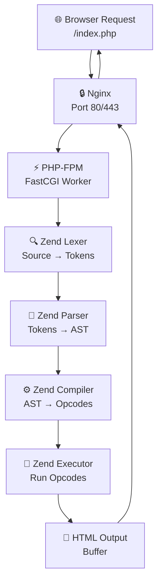
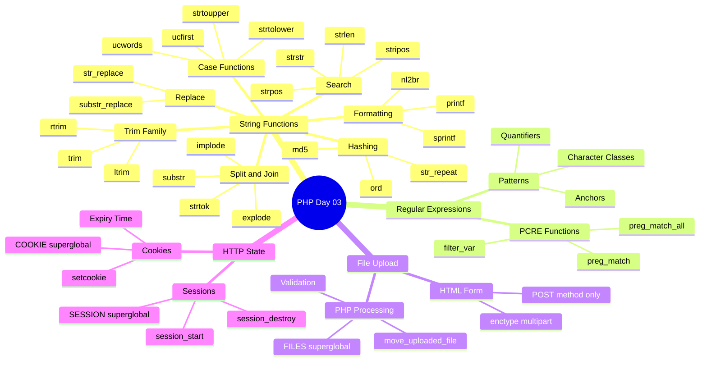

# الفصل الثالث — PHP: الـ Strings، الـ Regex، الـ Files، والـ Sessions

### _"من الكيبورد لحد شاشة العميل — وما بينهم من أسرار"_

> **المتطلبات:** أساسيات PHP — Variables، Arrays، Functions، وأنت عارف إن السيرفر بيشغّل PHP بطريقة ما. الفصل ده هيخليك تعرف "الطريقة ما" دي بالظبط، وهيوديك جوّا String Manipulation والـ Regex والـ Sessions والـ Cookies.

---

## 🏛️ رحلة الفايل: من الكيبورد لحد شاشة العميل

تعالى أحكيلك الحكاية من الأول. قبل ما نتكلم عن أي `trim()` أو `session_start()`، لازم تفهم **الجزء اللي محدش بيشرحهوش** — إيه اللي بيحصل بالظبط لمّا المتصفح بتاعك يطلب صفحة PHP؟

### المشهد: طلب بسيط... ولا هو كده؟

تخيّل معايا السيناريو ده. أنت مستخدم عادي، فتحت المتصفح وكتبت:

```
https://mysite.com/index.php
```

وضغطت Enter. في الـ 200 millisecond اللي بعدين دول، فيه حرب كاملة بتحصل جوّا السيرفر. ويلا نشوف.

---

### المرحلة الأولى: الـ HTTP Request بيتبعت

المتصفح بتاعك — Chrome، Firefox، مش مهم — بيبعت **HTTP Request** للسيرفر. الـ Request ده بيبان كده:

```
GET /index.php HTTP/1.1
Host: mysite.com
User-Agent: Mozilla/5.0 ...
Accept: text/html
```

ده مجرد نص. مجرد رسالة. زي ما بتبعت رسالة واتساب لصاحبك. الرسالة دي بتوصل للـ **Network Card** بتاعت السيرفر على الـ Port 80 أو 443.

---

### المرحلة التانية: الـ Web Server (Apache / Nginx) يستقبل

الـ Request وصل. مين بيستقبله؟ الـ **Web Server**. على أوبونتو السيرفر، في الغالب هيبقى **Nginx** أو **Apache**.

تخيّل Nginx زي **البوّاب** في مبنى الشركة. أي حد بيجي، البوّاب هو أول واحد بيشوفه. البوّاب مش بيشتغل بنفسه — هو بيسأل: "إيه اللي محتاجه؟"

- لو الطلب لـ ملف Static (صورة، CSS، JS) → البوّاب يجيبه من الدرج مباشرةً.
- لو الطلب لـ ملف `.php` → البوّاب بيقول "انتظر، هعدّيك للـ PHP".

```
┌─────────────────────────────────────────────┐
│              UBUNTU SERVER                  │
│                                             │
│  [Browser Request]                          │
│       ↓                                     │
│  [Nginx - Port 80/443]                      │
│       ↓                                     │
│  Static File? ──YES──→ [/var/www/html]      │
│       ↓ NO                                  │
│  [PHP-FPM via FastCGI]                      │
│       ↓                                     │
│  [Zend Engine]                              │
│       ↓                                     │
│  HTML Response → Back to Nginx → Browser    │
└─────────────────────────────────────────────┘
```

---

### المرحلة التالتة: PHP-FPM — الموظف المتخصص

هنا بقى بيتدخل الـ **PHP-FPM** عشان ينقذ الموقف!

الـ **FPM** = **FastCGI Process Manager**. تخيّله زي "مدير الإنتاج" في مصنع. Nginx بيبعتله الـ Request عبر **FastCGI protocol** (عبر Unix Socket في الغالب على أوبونتو: `/var/run/php/php8.2-fpm.sock`).

PHP-FPM شايل **مجموعة من الـ Worker Processes** جاهزين. لمّا Request جديد بييجي، بياخد Worker حر ويبعتله الشغل.

```bash
# شوف الـ workers دول بنفسك على أوبونتو
ps aux | grep php-fpm
# هتلاقي زي ده:
# www-data  1234  php-fpm: worker process
# www-data  1235  php-fpm: worker process
# www-data  1236  php-fpm: worker process
```

---

### المرحلة الرابعة: الـ Zend Engine — قلب الموضوع

اللي بيحصل هنا ده أهم جزء في الرحلة كلها. الـ **Zend Engine** هو المحرك الحقيقي لـ PHP. هو اللي بياخد ملف `index.php` بتاعك وبيشغّله.

الـ Zend Engine بيعمل 4 خطوات:

#### الخطوة 1: Lexing (التحليل المعجمي)

الـ Zend Lexer بياخد الـ Source Code النصي بتاعك ويحوّله لـ **Tokens**. تخيّل إنك بتكسّر جملة لكلمات.

```php
<?php echo "Hello"; ?>
```

بتتحوّل لـ Tokens زي:

- `T_OPEN_TAG` → `<?php`
- `T_ECHO` → `echo`
- `T_CONSTANT_ENCAPSED_STRING` → `"Hello"`
- `;`
- `T_CLOSE_TAG` → `?>`

#### الخطوة 2: Parsing (البناء الهيكلي)

الـ Tokens دي بتتحوّل لـ **AST — Abstract Syntax Tree**. شجرة منطقية بتمثّل البرنامج بتاعك. ده مش سحر — ده Compiler Theory عادي.

#### الخطوة 3: Compilation to Opcodes

هنا بقى الـ Zend Compiler بيحوّل الـ AST لـ **Opcodes** (Operation Codes). الـ Opcodes دي زي لغة Assembly بس للـ Zend Engine.

```
ECHO "Hello"
RETURN null
```

ده اللي بيتحوّل "فعلاً" للـ RAM.

#### الخطوة 4: Execution

الـ **Zend Executor** بياخد الـ Opcodes دي ويشغّلها واحدة واحدة. وبيبعت الـ Output (HTML) للـ Buffer اللي بيرجع لـ PHP-FPM → Nginx → Browser.



> **نصيحة الخبراء:** الـ **OPcache** extension بتخلي PHP يحفظ الـ Opcodes في الـ RAM ومش بيعيد عملية الـ Lexing/Parsing/Compilation في كل request. ده بيسرّع الموقع بنسبة 50-70% على أقل تقدير. في Production دايمًا enable الـ OPcache.

---

## 🔡 String Manipulation — "لمّا النصوص تبقى سلاح"

### البداية — المشكلة

تخيّل معايا إنك بتبني نموذج تسجيل على موقع. المستخدم كتب اسمه: `" ahmed "` — بمسافات قبل وبعد. أو كتب الإيميل `"AHMED@GMAIL.COM"` — كله Caps. أو كتب في اسمه `O'Brien` — بـ apostrophe هتقلب الـ SQL query.

لو ماعندكش أدوات معالجة الـ Strings، كل ده هيعمل مشاكل. PHP بتجيب معاها ترسانة كاملة من Functions جاهزة.

---

### الـ Trim Family — "شيلّ الهواء من جنبيّه"

أول سؤال: ليه المستخدمين بيحطّوا مسافات زيادة؟ مش عارفين. المتصفح أحيانًا بيضيف. أحيانًا Ctrl+C بتجيب مسافة زيادة. المهم، `trim()` موجودة عشان تحل المشكلة دي.

```php
<?php
$input = "   ahmed@iti.gov.eg   "; // ← الإيميل بمسافات زيادة

// trim() بتشيل المسافات من الجهتين
$clean = trim($input); // "ahmed@iti.gov.eg"

// ltrim() بتشيل من الشمال بس (Left)
$leftOnly = ltrim($input); // "ahmed@iti.gov.eg   "

// rtrim() === chop() بتشيل من اليمين بس (Right)
$rightOnly = rtrim($input); // "   ahmed@iti.gov.eg"

// تقدر تحدد نفسك أنهي Chars تتشال
$text = "\t\tThese are a few words :) ...  \n";
$trimmed = trim($text, "\tThe"); // بتشيل tabs وحرف T وحرف h وحرف e
var_dump($trimmed); // string(24) "se are a few words :) ..."
?>
```

لاحظ إن الـ `trim()` في المثال التاني مش بتشيل الـ Word "The" كـ Word — هي بتشيل الـ **Characters** `\t`، `T`، `h`، `e` بأي ترتيب من أطراف الـ String.

---

### الـ Case Functions — "علّي وهوّد"

```php
<?php
$string = "welcome to iti";

echo strtoupper($string);  // ← WELCOME TO ITI
echo strtolower($string);  // ← welcome to iti
echo ucfirst($string);     // ← Welcome to iti  (أول حرف بس)
echo ucwords($string);     // ← Welcome To Iti  (أول حرف في كل كلمة)
?>
```

`ucfirst()` و`ucwords()` بتشتغل مع الـ alphabetic characters بس. لو الـ String بدأت برقم أو symbol، مش هتعمل حاجة.

---

### nl2br() — "HTML مش بيعرف الـ Enter"

ده سؤال إنترفيو كلاسيكي. إيه المشكلة مع الـ newlines في HTML؟

```php
<?php
$poem = "You came\nto me\nin that hour\nof need";

// لو عملت echo عادي، المتصفح هيعرضها في سطر واحد!
echo $poem; // You came to me in that hour of need

// nl2br() بتحوّل \n لـ <br />
echo nl2br($poem);
// You came<br />to me<br />in that hour<br />of need
?>
```

> ⚠️ **انتبه:** `nl2br()` بتُضيف `<br />` **قبل** الـ newline مش بدلاً منها. يعني الـ `\n` لسّه موجود في الـ output، وبعديه `<br />`.

---

### printf() و sprintf() — "الـ Formatting المحترف"

تخيّل معايا إنك محتاج تعمل تقرير مالي بأرقام منسّقة. `printf()` و`sprintf()` هما الحل.

```php
<?php
// printf() بتطبع مباشرةً
$txt = "welcome to day3 in php";
printf("[%'#10s]\n", $txt); 
// [%'#10s] يعني: حشو بـ # لحد 10 chars، لو النص أقصر

// sprintf() بترجع String مش بتطبع
$num = 5;
$location = 'tree';
$format = 'There are %d monkeys in the %s';
$result = sprintf($format, $num, $location);
echo $result; // There are 5 monkeys in the tree
?>
```

الـ Format Specifiers المهمة:

- `%s` → String
- `%d` → Integer
- `%f` → Float
- `%05d` → Integer بـ leading zeros لحد 5 digits
- `%.2f` → Float بـ 2 decimal places

---

### addslashes() و stripslashes() — "الدرع ضد الـ Database"

تخيّل معايا السيناريو المرعب ده: المستخدم كتب اسمه `O'Brien`. لو حطيّت الاسم ده في SQL query كده:

```sql
SELECT * FROM users WHERE name = 'O'Brien'
```

الـ Quote الوسطانية كسرت الـ Query! وده الـ **SQL Injection** بأبسط صورة.

```php
<?php
$name = "O'Brien";

// addslashes() بتضيف Backslash قبل كل ' و " و \
$safe = addslashes($name); // O\'Brien
echo $safe; // ← آمن للـ Database

// stripslashes() بتشيل الـ Backslashes تاني
$original = stripslashes($safe); // O'Brien
echo $original;
?>
```

> ⚠️ **انتبه:** في المشاريع الحديثة، الحل الصح هو استخدام **Prepared Statements** مع PDO أو MySQLi، مش `addslashes()`. بس لازم تعرف `addslashes()` للإنترفيو وللكود القديم.

---

## 🔗 Joining & Splitting — "فرّق تسد، واجمع تقوى"

### implode() و join() — "لمّ الشتات"

تخيّل عندك Array من الـ Tracks، وعايز تعرضها كـ String منفصلة بـ Dash.

```php
<?php
$tracks = array('OS', 'Application', 'Cloud');

// implode بدون Separator
echo implode($tracks);          // OSApplicationCloud

// implode مع Separator
echo implode(" - ", $tracks);   // OS - Application - Cloud

// join() هي نفس implode() تمامًا
echo join(" | ", $tracks);      // OS | Application | Cloud
?>
```

---

### explode() — "شقّ الـ String"

```php
<?php
$sentence = "I love coffee so much";

// انفجار على المسافة
$words = explode(" ", $sentence);
var_dump($words);
// array(5) { [0]=> "I" [1]=> "love" [2]=> "coffee" [3]=> "so" [4]=> "much" }

// مع Limit — بيديك أول N-1 قطعة والباقي في الأخيرة
$limited = explode(" ", $sentence, 2);
var_dump($limited);
// array(2) { [0]=> "I" [1]=> "love coffee so much" }
?>
```

---

### strtok() — "الـ Token اللي بييجي واحد واحد"

`strtok()` مختلفة عن `explode()` في إنها **Stateful** — تفتكر مكانها في الـ String.

```php
<?php
$string = "My name is Noha, I works at ITI";

// أول استدعاء: بتحدد الـ String والـ Delimiter
$tok = strtok($string, " ");

// كل استدعاء بعده: بس الـ Delimiter
while ($tok !== false) {
    echo "Word = $tok <br/>";
    $tok = strtok(" \n\t"); // ← مش محتاج تبعتلها الـ String تاني
}
?>
```

الفرق العملي بين `strtok()` و`explode()`:

||`explode()`|`strtok()`|
|---|---|---|
|الإرجاع|Array كاملة دفعة واحدة|Token واحد في كل مرة|
|الذاكرة|أعلى (كل الـ Array في الـ RAM)|أقل (Token واحد بس)|
|مناسب لـ|Strings صغيرة ومتوسطة|Strings ضخمة جدًا|

---

### substr() — "قصّ من النص"

```php
<?php
$text = "PHP is simple";

echo substr($text, 1);     // ← "HP is simple" (من index 1 للآخر)
echo substr($text, 1, 5);  // ← "HP is" (من index 1، طول 5)

// Negative offset! بيحسب من الآخر
echo substr($text, -2);    // ← "le" (آخر حرفين)
echo substr($text, -6, 3); // ← "sim" (من -6، طول 3)
?>
```

---

## 🔍 Searching & Comparing — "دوّر وقارن"

### strcmp() و strcasecmp() — "مقارنة بالمنطق مش بالعاطفة"

```php
<?php
$var1 = "Hello";
$var2 = "hello";

// strcmp() Case-Sensitive
if (strcmp($var1, $var2) !== 0) {
    echo "مش متساويين — الـ Case مختلف"; // ← هيطبع ده
}

// strcasecmp() Case-Insensitive
if (strcasecmp($var1, $var2) === 0) {
    echo "متساويين — الـ Case مش مهم"; // ← هيطبع ده
}
?>
```

الـ `strcmp()` بترجع:

- `0` لو متساويين
- `< 0` لو الـ String الأولى "أصغر" أبجديًا
- `> 0` لو الـ String الأولى "أكبر" أبجديًا

---

### strlen() و strstr() — "الطول والبحث"

```php
<?php
// strlen() — طول الـ String
$str = "Welcome to php";
var_dump(strlen($str)); // int(14)

// strstr() === strchr() — بيدور على Pattern ويرجع من اللي وجده للآخر
$email = 'name@example.com';
$domain = strstr($email, '@');
echo $domain; // "@example.com"

// لو مش عايز الجزء ده بالتحديد وعايز اللي قبليه
$user = strstr($email, '@', true); // ← true للـ before_needle
echo $user; // "name"
?>
```

---

### الـ strpos() Family — "فين بالظبط؟"

```php
<?php
$haystack = "Hello World Hello PHP";

// strpos() — أول occurrence من الـ needle
$pos = strpos($haystack, "Hello");
echo $pos; // 0 (أول حرف!)

// ⚠️ انتبه لـ Gotcha مشهور!
if ($pos === false) { // ← لازم === مش ==
    echo "مش موجود";
} else {
    echo "موجود في position $pos";
}
// لو استخدمت == بس، position 0 هتتعامل معاها كـ false!

// strrpos() — آخر occurrence
$lastPos = strrpos($haystack, "Hello");
echo $lastPos; // 12

// stripos() — نفس strpos بس Case-Insensitive
$pos2 = stripos($haystack, "hello"); // 0 (بيلاقي "Hello")
?>
```

> ⚠️ **انتبه:** ده من أكتر الأخطاء اللي الـ Juniors بيقعوا فيها. `strpos()` بترجع `0` لو الـ needle في أول الـ String، وبترجع `false` لو مش موجود. لو استخدمت `==` بدل `===`، `0 == false` هيبقى `true` وهتظن إن الـ String مش موجودة وهي موجودة!

---

### md5() و ord() و str_repeat() — "أدوات متنوعة"

```php
<?php
// md5() — Hash الـ String (مش للأمان في الباسورد، للـ Integrity Checking)
$password = 'Hello World!';
echo md5($password); // 86fb269d190d2c85f6e0468ceca42a20

// ord() — رقم الـ ASCII لأول Byte في الـ String
echo ord("N"); // 78 (رقم حرف N في ASCII)
echo ord("Noha"); // 78 (بياخد أول Byte بس)

// str_repeat() — تكرار الـ String
echo str_repeat("iti ", 5); // "iti iti iti iti iti "

// str_shuffle() — خلط الحروف عشوائياً
$str = 'abcdef';
echo str_shuffle($str); // "fcbade" أو أي ترتيب عشوائي
?>
```

---

### str_replace() و substr_replace() — "استبدال بالجملة"

```php
<?php
// str_replace() — استبدال عادي
$vowels = ["a", "e", "i", "o", "u", "A", "E", "I", "O", "U"];
$result = str_replace($vowels, "", "Hello World of PHP");
echo $result; // "Hll Wrld f PHP" (شيل كل الـ vowels)

// substr_replace() — استبدال جزء من الـ String
$input = ['A: XXX', 'B: XXX', 'C: XXX'];
// ابدأ من index 3، الطول 3، استبدل بـ YYY
$output = substr_replace($input, 'YYY', 3, 3);
echo implode('; ', $output); // "A: YYY; B: YYY; C: YYY"
?>
```

---

## 🎯 Regular Expressions — "اللغة السرية للـ Patterns"

### البداية — المشكلة

تخيّل معايا إنك بتبني موقع والمستخدم بيسجّل. عايز تتأكد إن الإيميل اللي كتبه صح. ولا بس صح — عايز تتأكد إنه **فعلاً** بيشبه إيميل. الـ `@` موجودة؟ الـ Domain موجود؟ الـ Extension منطقي؟

لو عملت ده بـ `strpos()` و`explode()` هيبقى كود ضخم ومعقد جدًا. هنا بيتدخل الـ Regular Expressions.

الـ Regex هو **لغة وصف Patterns**. بدل ما تقول "دوّر على @ وبعدين تأكد إن بعدها نقطة وبعدها حروف"، بتكتب Pattern واحدة بتوصف ده كله.

---

### الـ Patterns الأساسية

```
.          → أي حرف واحد (غير newline)
[a-z]      → أي حرف صغير
[A-Z]      → أي حرف كبير
[0-9]      → أي رقم
[aeiou]    → أي Vowel
[^a-z]     → أي حرف مش صغير (الـ ^ جوّا [] معناها NOT)
*          → صفر أو أكتر (Greedy)
+          → واحد أو أكتر
?          → صفر أو واحد (اختياري)
^          → بداية الـ String (برّا [])
$          → نهاية الـ String
{2,6}      → من 2 لـ 6 مرات
```

---

### PHP وREGEX — الـ PCRE Functions

PHP بتستخدم الـ **PCRE** (Perl Compatible Regular Expressions) عبر Functions بدأت بـ `preg_`.

#### preg_match() — هل الـ Pattern موجود؟

```php
<?php
// التحقق من صحة الإيميل بـ Regex
$email = 'nshehab@iti.gov.eg';

// الـ Pattern ده بيشرح نفسه خطوة بخطوة:
// ^ → ابدأ من الأول
// [a-z0-9\+_\-]+ → جزء الـ username: حروف، أرقام، +، _، - (واحد على الأقل)
// (\.[a-z0-9\+_\-]+)* → ممكن يكون فيه نقطة وبعدها حروف (للـ first.last format)
// @ → الـ @ الإلزامية
// ([a-z0-9\-]+\.)+ → الـ Domain: حروف وأرقام وـ، بعدها نقطة (واحد على الأقل)
// [a-z]{2,6} → الـ TLD: من 2 لـ 6 حروف (com, eg, gov)
// $ → انتهى هنا
// /ix → i = case insensitive, x = ignore whitespace في الـ Pattern
$pattern = "/^([a-z0-9\+_\-]+)(\.[a-z0-9\+_\-]+)*@([a-z0-9\-]+\.)+[a-z]{2,6}$/ix";

if (preg_match($pattern, $email)) {
    echo "✅ الإيميل صح";
} else {
    echo "❌ الإيميل غلط";
}
?>
```

#### preg_match_all() — كمّ ما لقيت

```php
<?php
$str = "The rain in SPAIN falls mainly on the plains.";

// دوّر على كل كلمة فيها "ain" (case insensitive)
$pattern = "/ain/i";

if (preg_match_all($pattern, $str, $matches)) {
    print_r($matches[0]); 
    // Array ( [0] => ain [1] => AIN [2] => ain [3] => ain )
    // لاقى 4 matches: rain, SPAIN, mainly, plains
}
?>
```

#### filter_var() — الطريقة الأسهل والموثوقة

```php
<?php
$email = "noha@iti.gov.eg";

// filter_var() بتستخدم Built-in Filters محطوطة في PHP نفسها
if (!filter_var($email, FILTER_VALIDATE_EMAIL)) {
    echo "❌ إيميل غلط";
} else {
    echo "✅ إيميل صح";
}

// في Filters تانية كمان:
// FILTER_VALIDATE_URL   → للـ URLs
// FILTER_VALIDATE_INT   → للـ Integers
// FILTER_VALIDATE_IP    → للـ IP Addresses
// FILTER_SANITIZE_EMAIL → بتشيل الـ illegal chars من الإيميل
?>
```

> **نصيحة الخبراء:** استخدم `filter_var()` في الـ Production دايمًا للـ Email Validation. الـ Regex اليدوي صعب يغطي كل حالات الإيميلات الصح، وـ`filter_var()` بيتحدّث مع PHP نفسها.

---

## 📤 File Uploading — "لمّا الـ Data أكبر من متغير"

### البداية — المشكلة

الـ HTTP Request عادةً بيبعت نصوص وأرقام. بس إيه اللي بيحصل لو المستخدم عايز يبعت **صورة** أو **PDF**؟ الملفات دي Binary Data — مش نص عادي.

الحل هو **Multipart Form Data** — نوع خاص من الـ HTTP Request بيقسّم الـ Body لـ "Parts"، كل Part ممكن تبقى نص أو Binary.

---

### الـ HTML Part

```html
<!-- 
  enctype="multipart/form-data" ← لازم موجودة وإلا الملف مش هيتبعت
  method="POST" ← GET مش بتدعم File Upload
-->
<form action="uploadingfiles.php" method="POST" enctype="multipart/form-data">
    <h1>اختار الملف اللي عايز ترفعه</h1>
    <label>الملف:</label>
    <input type="file" name="file" />
    
    <!-- MAX_FILE_SIZE: Hint للمتصفح (مش أمان حقيقي!)
         الأمان الحقيقي بييجي من الـ PHP side -->
    <input type="hidden" name="MAX_FILE_SIZE" value="2097152"/> <!-- 2MB -->
    
    <input type="submit" value="رفع الملف"/>
</form>
```

---

### الـ PHP Part — والـ $_FILES Magic

لمّا الـ Form بتتبعت، PHP بتملأ الـ `$_FILES` SuperGlobal. تخيّل `$_FILES` زي طبق فيه معلومات الملف.

```php
<?php
if (isset($_FILES['file'])) {
    $errors = [];
    
    // معلومات الملف اللي بعتها PHP-FPM
    $file_name = $_FILES['file']['name'];      // ← الاسم الأصلي
    $file_size = $_FILES['file']['size'];      // ← الحجم بالـ Bytes
    $file_tmp  = $_FILES['file']['tmp_name']; // ← المكان المؤقت على السيرفر
    $file_type = $_FILES['file']['type'];      // ← MIME Type (مش موثوق!)
    
    // ✅ الطريقة الصح لاستخراج الـ Extension
    // مش موثوق في $file_type لأن المستخدم يقدر يزوّره
    $ext = pathinfo($file_name)["extension"];
    $file_ext = strtolower($ext); // ← حوّل لـ lowercase
    
    // Whitelist بدل Blacklist — أسلم كتير
    $allowed_extensions = ["jpeg", "jpg", "png", "pdf", "doc", "txt", "csv"];
    
    if (!in_array($file_ext, $allowed_extensions)) {
        $errors[] = "النوع ده مش مسموح به. اختار JPEG, PNG, PDF, أو غيرهم.";
    }
    
    // التحقق من الحجم (2 MB = 2 * 1024 * 1024 = 2097152 bytes)
    if ($file_size > 2097152) {
        $errors[] = "الملف أكبر من 2 MB.";
    }
    
    if (empty($errors)) {
        // ← move_uploaded_file بتنقل من /tmp لـ مكانه الدائم
        // لازم الـ folder يكون له permission مناسبة
        move_uploaded_file($file_tmp, "uploads/" . $file_name);
        echo "✅ تم رفع الملف بنجاح!";
    } else {
        print_r($errors);
    }
}
?>
```

```
رحلة الملف المرفوع:
Browser → [Binary Data في HTTP Body]
          ↓
     PHP-FPM يستقبله
          ↓
     يحطه مؤقتًا في /tmp/phpXXXXXX
          ↓
     PHP Script تشتغل
          ↓
     move_uploaded_file() تنقله لمكانه الدائم
          ↓
     /var/www/html/uploads/filename.jpg ✅
```

---

## 🌐 HTTP والـ Stateless Problem

### البداية — المشكلة الكبيرة

تخيّل معايا السيناريو المرعب ده: انت بتتسوّق على موقع. اخترت منتج وضفته للـ Cart. روحت لصفحة تانية. الـ Cart فضي! ليه؟

لأن **HTTP Stateless**. كل Request بيروح للسيرفر كأنه أول مرة بيتكلم فيها. السيرفر مش بيتذكر حاجة. مفيش "ذاكرة" بين الـ Requests.

ده مش Bug — ده Design متعمد عشان يخلي الـ Web Scalable. بس محتاجين نحل مشكلة الـ State.

الحل: **Sessions** و**Cookies**.

---

## 🗝️ Sessions — "الذاكرة على السيرفر"

### الفكرة

الـ Session زي إنك بتدي المستخدم **باج** لمّا بيدخل الشركة. الباج عليه رقم (الـ Session ID). في المكتب عندك ملف بيه معلومات صاحب الباج ده. كل ما المستخدم يطلب حاجة، بيبعت باجه، والسيرفر بيجيب ملفه ويشوف المعلومات.

```
┌──────────────┐                    ┌──────────────────────┐
│              │  1- First Request  │                      │
│   Browser    │ ─────────────────→ │   PHP Server         │
│              │                    │                      │
│              │ ←───────────────── │  - ينشئ Session ID   │
│              │  2- Set-Cookie:    │  - يحفظ Data على     │
│  [Cookie]    │  PHPSESSID=abc123  │    السيرفر           │
│  PHPSESSID=  │                    │                      │
│  abc123      │  3- Next Request   │                      │
│              │ ─────────────────→ │  - يقرأ الـ ID من   │
│              │  Cookie: abc123    │    الـ Cookie        │
│              │                    │  - يجيب Data         │
│              │ ←───────────────── │    الخاصة بيه        │
└──────────────┘                    └──────────────────────┘
```

---

### الخطوات العملية

#### الخطوة الأولى: Start the Session

```php
<?php
// session_start() لازم تكون أول سطر في الـ Script
// قبل أي echo أو HTML — لأنها بتبعت HTTP Headers
session_start();

echo "أهلاً بيك على السيرفر";

// تخزين البيانات في الـ Session
$_SESSION["username"] = "Noha";
$_SESSION["course"]   = "PHP";
$_SESSION["msg"]      = "صباح الخير";
?>
```

#### الخطوة التانية: قرا الـ Session في صفحة تانية

```php
<?php
session_start(); // ← لازم في كل صفحة بتستخدم Session

// PHP بتجيب الـ PHPSESSID من الـ Cookie تلقائياً
// وبتملأ $_SESSION بالبيانات الخاصة بيه
var_dump($_SESSION);
// array(3) { ["username"]=> "Noha" ["course"]=> "PHP" ["msg"]=> "صباح الخير" }
?>
```

#### الخطوة التالتة: تدمير الـ Session (Logout)

```php
<?php
session_start();

// الخطوة 1: شيل كل الـ Variables
$_SESSION = []; // ← Reset the array

// لو عايز تشيل الـ Session Cookie كمان من الـ Browser
if (ini_get("session.use_cookies")) {
    $params = session_get_cookie_params();
    setcookie(
        session_name(), '', time() - 42000,
        $params["path"], $params["domain"],
        $params["secure"], $params["httponly"]
    );
}

// الخطوة 2: دمّر الـ Session على السيرفر
session_destroy();
echo "تم تسجيل الخروج بنجاح";
?>
```

---

## 🍪 Cookies — "الذاكرة على الـ Client"

### الفرق بين Session وCookie

الـ Session بيحفظ الـ Data على **السيرفر**. الـ Cookie بتحفظ الـ Data على **الـ Browser**.

||Session|Cookie|
|---|---|---|
|مكان الـ Data|السيرفر `/tmp/sess_xxx`|الـ Browser|
|الـ Size|غير محدودة عملياً|4KB max|
|الأمان|أأمن (Data على السيرفر)|أقل أمانًا (قابلة للقراءة)|
|مناسب لـ|بيانات حساسة (User ID)|تفضيلات غير حساسة (اللغة، الـ Theme)|

---

### كيفية استخدام الـ Cookies

```php
<?php
// setcookie() لازم تتبعت قبل أي output
// setcookie(name, value, expire, path, domain, secure, httponly)

setcookie(
    "username",        // ← اسم الـ Cookie
    "Noha Shehab",     // ← القيمة
    time() + 3600,     // ← انتهاء الصلاحية: دلوقتي + ساعة
    "/",               // ← متاحة على كل الـ Pages
    "",                // ← نفس الـ Domain
    0                  // ← مش HTTPS Only (في Production: 1)
);

setcookie("age", "28", time() + 3600, "/", "", 0);

// في نفس الـ Request ده، $_COOKIE لسّه مش فيها القيمة الجديدة!
// هتظهر في الـ Request الجاي بس
var_dump($_COOKIE); // هيبقى فاضي أو بـ Cookies القديمة بس
?>
```

```php
<?php
// في الـ Request التاني: القراءة
if (isset($_COOKIE["username"])) {
    echo "أهلاً " . $_COOKIE["username"]; // ← "أهلاً Noha Shehab"
    
    // حذف الـ Cookie: بتحط Expiry في الماضي
    setcookie("username", "", time() - 60, "/", "", 0);
} else {
    echo "لا يوجد Cookie للـ username";
}
?>
```

> ⚠️ **انتبه:** `setcookie()` زي `header()` تمامًا — لازم تتبعت قبل أي HTML Output أو `echo`. لو عملت `echo` قبلها هتجيب `Cannot modify header information — headers already sent`.

---

## 🗺️ خريطة الـ PHP Day 03 كاملة



---

## ✅ Checkpoint — أسئلة إنترفيو

**س: إيه الفرق بين `==` و`===` في `strpos()`؟**

> `strpos()` بترجع `0` لو الـ Needle في أول الـ String، وبترجع `false` لو مش موجودة. لو استخدمت `==`، الـ PHP بتعمل Type Juggling وبتعتبر `0 == false` هو `true`، فبتفكر إن الـ String مش موجودة وهي موجودة. الحل دايمًا استخدم `=== false` عند التحقق من الـ Return Value بتاعت `strpos()`.

**س: إيه الفرق بين Session وCookie؟**

> الـ Session بيخزّن الـ Data على السيرفر ويبعت بس الـ Session ID للـ Browser عبر Cookie. الـ Cookie بتخزّن الـ Data نفسها في المتصفح. الـ Session أأمن للبيانات الحساسة لأن الـ Data مش موجودة عند المستخدم. الـ Cookie مناسبة للبيانات غير الحساسة زي اللغة المفضلة، لأنها بتستمر حتى بعد إغلاق المتصفح.

**س: ليه `session_start()` لازم تبقى أول سطر في الـ Script؟**

> لأن `session_start()` بتبعت **HTTP Header** اسمه `Set-Cookie` يحتوي على الـ `PHPSESSID`. الـ HTTP Headers لازم تتبعت **قبل** أي HTTP Body (يعني قبل أي HTML أو `echo`). لو عملت أي Output قبلها، PHP بتديك Error: `Cannot modify header information — headers already sent`.

**س: إزاي الـ Zend Engine بيشتغل؟**

> بياخد ملف الـ PHP ويعمله Lexing (بيحوّله لـ Tokens)، بعدين Parsing (بيحوّل الـ Tokens لـ AST — Abstract Syntax Tree)، بعدين Compilation (بيحوّل الـ AST لـ Opcodes)، وأخيرًا Execution (بيشغّل الـ Opcodes). الـ OPcache Extension بتخلي PHP يحفظ الـ Opcodes في الـ RAM فمش بيعيد الـ 3 خطوات الأولى في كل Request.

**س: إيه أكبر غلطة في الـ File Upload؟**

> الاعتماد على `$_FILES['file']['type']` للتحقق من النوع. القيمة دي بتيجي من المتصفح وممكن تتزوّر. الصح هو استخدام `pathinfo()` لاستخراج الـ Extension من اسم الملف، ومقارنتها بـ **Whitelist** من الـ Extensions المسموحة. للتحقق الأقوى، استخدم `finfo_file()` لقراءة الـ MIME Type الحقيقي من الـ File Content نفسه.

**س: إيه الفرق بين `preg_match()` و`preg_match_all()`؟**

> `preg_match()` بتوقف بعد ما تلاقي أول Match وبترجع `1` أو `0`. `preg_match_all()` بتكمل في الـ String كلها وبتجمع **كل** الـ Matches في Array وبترجع عدد الـ Matches. لو عايز بس تتحقق من وجود Pattern، استخدم `preg_match()`. لو عايز تجمع كل الـ Occurrences، استخدم `preg_match_all()`.

---

## 🛠️ حل اللاب عملي على أوبونتو

### الـ Lab Requirements

1. Form بـ Validation للـ Email (طريقتين)
2. Room Number كـ Dropdown (Application1, Application2, Cloud)
3. Upload صورة Profile مع التأكد إنها صورة
4. حفظ البيانات في ملف
5. Login Page بيقرأ من الملف
6. Session بعد Login مع Welcome Message
7. Bonus: Validation للـ Password

---

### الملف الأول: `register.php`

```php
<?php
// ← بدأنا الـ Session عشان نقدر نبعت رسائل Error بين الصفحات
session_start();

$errors = [];
$success = false;

if ($_SERVER['REQUEST_METHOD'] === 'POST') {
    
    // ── Sanitize الـ Inputs أول حاجة ──────────────────────────
    $username = trim($_POST['username'] ?? '');
    $email    = trim($_POST['email'] ?? '');
    $room     = trim($_POST['room'] ?? '');
    $password = trim($_POST['password'] ?? '');
    
    // ── Email Validation — الطريقة الأولى: filter_var ──────────
    if (empty($email)) {
        $errors[] = "الإيميل مطلوب.";
    } elseif (!filter_var($email, FILTER_VALIDATE_EMAIL)) {
        $errors[] = "الإيميل غير صحيح (filter_var).";
    }
    
    // ── Email Validation — الطريقة التانية: Regex ───────────────
    $emailPattern = "/^([a-z0-9\+_\-]+)(\.[a-z0-9\+_\-]+)*@([a-z0-9\-]+\.)+[a-z]{2,6}$/i";
    if (!empty($email) && !preg_match($emailPattern, $email)) {
        $errors[] = "الإيميل غير صحيح (Regex).";
    }
    
    // ── Room Validation ──────────────────────────────────────────
    $allowed_rooms = ['Application1', 'Application2', 'Cloud'];
    if (!in_array($room, $allowed_rooms)) {
        $errors[] = "اختار Room صحيحة.";
    }
    
    // ── Password Validation (Bonus) ──────────────────────────────
    // a. بالظبط 8 حروف
    // b. مش بيقبل Special Chars غير الـ underscore
    // c. مش بيقبل Capital Letters
    $passPattern = "/^[a-z0-9_]{8}$/";
    // ^ → ابدأ من الأول
    // [a-z0-9_] → حروف صغيرة، أرقام، underscore فقط
    // {8} → بالظبط 8 characters
    // $ → انتهى هنا
    if (empty($password)) {
        $errors[] = "الـ Password مطلوب.";
    } elseif (!preg_match($passPattern, $password)) {
        $errors[] = "الـ Password لازم يكون 8 حروف صغيرة أو أرقام أو underscore فقط.";
    }
    
    // ── Profile Picture Upload ────────────────────────────────────
    if (!isset($_FILES['profile_pic']) || $_FILES['profile_pic']['error'] !== UPLOAD_ERR_OK) {
        $errors[] = "لازم ترفع صورة.";
    } else {
        $pic_tmp  = $_FILES['profile_pic']['tmp_name'];
        $pic_name = $_FILES['profile_pic']['name'];
        $pic_ext  = strtolower(pathinfo($pic_name, PATHINFO_EXTENSION));
        $pic_size = $_FILES['profile_pic']['size'];
        
        // ← Whitelist للـ Image Extensions
        $img_extensions = ['jpg', 'jpeg', 'png', 'gif', 'webp'];
        
        if (!in_array($pic_ext, $img_extensions)) {
            $errors[] = "الصورة لازم تكون JPG, PNG, GIF, أو WebP.";
        }
        
        // ← التحقق من الـ MIME Type الحقيقي باستخدام finfo (أأمن!)
        $finfo = finfo_open(FILEINFO_MIME_TYPE);
        $mime  = finfo_file($finfo, $pic_tmp);
        finfo_close($finfo);
        $allowed_mimes = ['image/jpeg', 'image/png', 'image/gif', 'image/webp'];
        
        if (!in_array($mime, $allowed_mimes)) {
            $errors[] = "الملف ده مش صورة حقيقية.";
        }
        
        if ($pic_size > 2 * 1024 * 1024) {
            $errors[] = "الصورة لازم تكون أصغر من 2MB.";
        }
    }
    
    // ── لو مافيش Errors: احفظ البيانات ───────────────────────────
    if (empty($errors)) {
        // ← انقل الصورة
        $upload_dir = __DIR__ . '/uploads/';
        // تأكد إن الـ Directory موجودة
        if (!is_dir($upload_dir)) {
            mkdir($upload_dir, 0755, true);
        }
        $new_pic_name = uniqid() . '.' . $pic_ext; // ← اسم فريد منعاً للتعارض
        move_uploaded_file($pic_tmp, $upload_dir . $new_pic_name);
        
        // ← Hash الـ Password قبل الحفظ
        // md5() مش كافي للإنتاج — استخدم password_hash()
        $hashed_pass = password_hash($password, PASSWORD_BCRYPT);
        
        // ← احفظ في الـ File كـ JSON Line
        $user_data = [
            'username'    => $username,
            'email'       => $email,
            'room'        => $room,
            'password'    => $hashed_pass,
            'profile_pic' => $new_pic_name,
        ];
        
        $users_file = __DIR__ . '/users.json';
        $users = [];
        
        if (file_exists($users_file)) {
            $content = file_get_contents($users_file);
            $users   = json_decode($content, true) ?? [];
        }
        
        $users[] = $user_data;
        file_put_contents($users_file, json_encode($users, JSON_PRETTY_PRINT));
        
        $success = true;
    }
}
?>
<!DOCTYPE html>
<html lang="ar" dir="rtl">
<head>
    <meta charset="UTF-8">
    <title>تسجيل مستخدم جديد</title>
    <style>
        body { font-family: Arial, sans-serif; max-width: 500px; margin: 40px auto; padding: 20px; }
        .error { color: red; background: #fee; padding: 10px; border-radius: 5px; margin-bottom: 15px; }
        .success { color: green; background: #efe; padding: 10px; border-radius: 5px; }
        input, select { width: 100%; padding: 8px; margin: 5px 0 15px; box-sizing: border-box; }
        button { background: #007bff; color: white; padding: 10px 20px; border: none; border-radius: 5px; cursor: pointer; }
    </style>
</head>
<body>
    <h1>تسجيل جديد</h1>
    
    <?php if (!empty($errors)): ?>
        <div class="error">
            <ul>
                <?php foreach ($errors as $err): ?>
                    <li><?= htmlspecialchars($err) ?></li>
                <?php endforeach; ?>
            </ul>
        </div>
    <?php endif; ?>
    
    <?php if ($success): ?>
        <div class="success">✅ تم التسجيل بنجاح! <a href="login.php">سجّل دخول</a></div>
    <?php else: ?>
    
    <form method="POST" enctype="multipart/form-data">
        <label>اسم المستخدم:</label>
        <input type="text" name="username" required 
               value="<?= htmlspecialchars($_POST['username'] ?? '') ?>"/>
        
        <label>الإيميل:</label>
        <input type="email" name="email" required 
               value="<?= htmlspecialchars($_POST['email'] ?? '') ?>"/>
        
        <label>الـ Room:</label>
        <select name="room">
            <option value="">-- اختار --</option>
            <option value="Application1">Application 1</option>
            <option value="Application2">Application 2</option>
            <option value="Cloud">Cloud</option>
        </select>
        
        <label>كلمة المرور (8 حروف صغيرة/أرقام/underscore):</label>
        <input type="password" name="password" required/>
        
        <label>صورة الـ Profile:</label>
        <input type="file" name="profile_pic" accept="image/*" required/>
        
        <button type="submit">تسجيل</button>
    </form>
    
    <?php endif; ?>
</body>
</html>
```

---

### الملف التاني: `login.php`

```php
<?php
session_start();

// لو المستخدم logged in بالفعل، ودّيه للـ Welcome Page
if (isset($_SESSION['username'])) {
    header('Location: welcome.php');
    exit;
}

$error = '';

if ($_SERVER['REQUEST_METHOD'] === 'POST') {
    $username = trim($_POST['username'] ?? '');
    $password = trim($_POST['password'] ?? '');
    
    $users_file = __DIR__ . '/users.json';
    
    if (!file_exists($users_file)) {
        $error = "لا يوجد مستخدمون مسجلون بعد.";
    } else {
        $users = json_decode(file_get_contents($users_file), true) ?? [];
        $found = false;
        
        foreach ($users as $user) {
            if ($user['username'] === $username) {
                // ← password_verify() بتقارن الـ Plain Password بالـ Hash المحفوظ
                if (password_verify($password, $user['password'])) {
                    $found = true;
                    // ← ابدأ الـ Session وخزّن معلومات المستخدم
                    $_SESSION['username']    = $user['username'];
                    $_SESSION['email']       = $user['email'];
                    $_SESSION['room']        = $user['room'];
                    $_SESSION['profile_pic'] = $user['profile_pic'];
                    
                    header('Location: welcome.php');
                    exit;
                }
                break;
            }
        }
        
        if (!$found) {
            $error = "اسم المستخدم أو كلمة المرور غلط.";
        }
    }
}
?>
<!DOCTYPE html>
<html lang="ar" dir="rtl">
<head>
    <meta charset="UTF-8">
    <title>تسجيل الدخول</title>
    <style>
        body { font-family: Arial, sans-serif; max-width: 400px; margin: 40px auto; padding: 20px; }
        .error { color: red; background: #fee; padding: 10px; border-radius: 5px; }
        input { width: 100%; padding: 8px; margin: 5px 0 15px; box-sizing: border-box; }
        button { background: #28a745; color: white; padding: 10px 20px; border: none; border-radius: 5px; cursor: pointer; }
    </style>
</head>
<body>
    <h1>تسجيل الدخول</h1>
    
    <?php if ($error): ?>
        <div class="error"><?= htmlspecialchars($error) ?></div>
    <?php endif; ?>
    
    <form method="POST">
        <label>اسم المستخدم:</label>
        <input type="text" name="username" required/>
        
        <label>كلمة المرور:</label>
        <input type="password" name="password" required/>
        
        <button type="submit">دخول</button>
    </form>
    
    <p><a href="register.php">مسجلتش بعد؟ سجّل دلوقتي</a></p>
</body>
</html>
```

---

### الملف التالت: `welcome.php`

```php
<?php
session_start();

// ← لو مش Logged In، ودّيه للـ Login
if (!isset($_SESSION['username'])) {
    header('Location: login.php');
    exit;
}

// ← Logout
if (isset($_GET['logout'])) {
    $_SESSION = [];
    session_destroy();
    header('Location: login.php');
    exit;
}
?>
<!DOCTYPE html>
<html lang="ar" dir="rtl">
<head>
    <meta charset="UTF-8">
    <title>أهلاً بيك</title>
    <style>
        body { font-family: Arial, sans-serif; max-width: 600px; margin: 40px auto; padding: 20px; }
        .card { background: #f8f9fa; border-radius: 10px; padding: 30px; text-align: center; }
        img { border-radius: 50%; width: 100px; height: 100px; object-fit: cover; }
        .logout { color: red; text-decoration: none; }
    </style>
</head>
<body>
    <div class="card">
        <h1>🎉 أهلاً وسهلاً يا <?= htmlspecialchars($_SESSION['username']) ?>!</h1>
        
        <?php if (!empty($_SESSION['profile_pic'])): ?>
            " 
                 alt="Profile Picture"/>
        <?php endif; ?>
        
        <p>📧 الإيميل: <?= htmlspecialchars($_SESSION['email']) ?></p>
        <p>🏢 الـ Room: <?= htmlspecialchars($_SESSION['room']) ?></p>
        
        <br/>
        <a href="?logout=1" class="logout">🚪 تسجيل الخروج</a>
    </div>
</body>
</html>
```

---

### إعداد الأذونات على Ubuntu

```bash
# ← روح لـ Directory بتاع الـ Project
cd /var/www/html/phpday03

# ← إنشاء الـ Directories المطلوبة
mkdir -p uploads

# ← الـ www-data هو الـ User اللي PHP-FPM بيشتغل بيه
# هو محتاج يكتب في uploads/
sudo chown -R www-data:www-data uploads/
sudo chmod -R 755 uploads/

# ← الـ users.json محتاج يتنشأ لو مش موجود
# وPHP محتاجة تكتب فيه
touch users.json
sudo chown www-data:www-data users.json
sudo chmod 664 users.json

# ← تأكد إن PHP-FPM شغّال
sudo systemctl status php8.2-fpm

# ← تأكد إن Nginx شغّال
sudo systemctl status nginx

# ← شوف الـ Error Log لو في مشكلة
sudo tail -f /var/log/nginx/error.log
sudo tail -f /var/log/php8.2-fpm.log
```

---

## 🫒 زتونة الإنترفيو

> **"الـ PHP بيشتغل عبر رحلة من 4 مراحل داخل الـ Zend Engine: Lexing، Parsing، Compilation للـ Opcodes، وExecutor بيشغّل الـ Opcodes دي. الـ PHP بيقدر يتعامل مع الـ Strings بترسانة Functions قوية من `trim()` للـ Sanitization، `explode()`/`implode()` للتقسيم والتجميع، `strpos()` للبحث، و`preg_match()` للـ Patterns المعقدة. لحل مشكلة الـ HTTP اللي Stateless بطبيعته، في طريقتين: الـ Sessions اللي بتخزّن الـ Data على السيرفر وبتبعت بس Session ID للـ Browser، والـ Cookies اللي بتخزّن الـ Data على المتصفح نفسه. لما أتكلم عن الـ File Upload، الأمان الحقيقي مش في `$_FILES['type']` لأنه من المتصفح وممكن يتزوّر، الأمان في Whitelist من الـ Extensions وـ`finfo_file()` للتحقق من الـ MIME Type الحقيقي من الـ Content بتاع الملف نفسه."**

---

_Next → الفصل الرابع — PHP & MySQL: بناء الـ Database Layer — هنوصّل كل اللي اتعلمناه ده بـ Database حقيقية باستخدام PDO والـ Prepared Statements، وهنشوف ليه الـ Raw Queries خطر حقيقي على أي موقع._