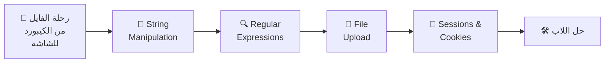
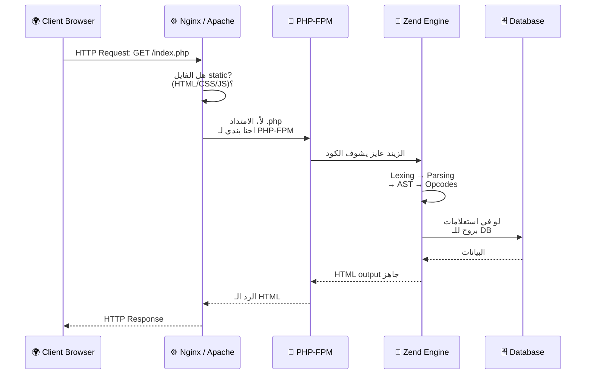
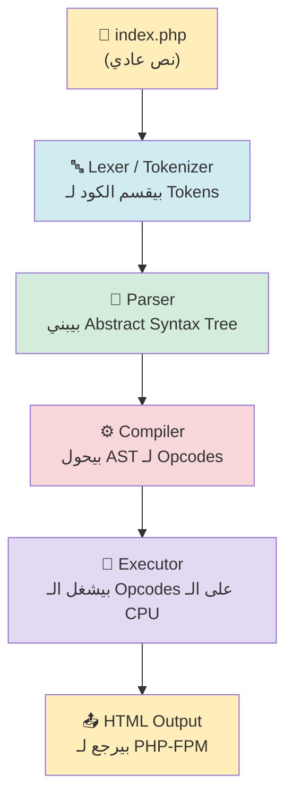
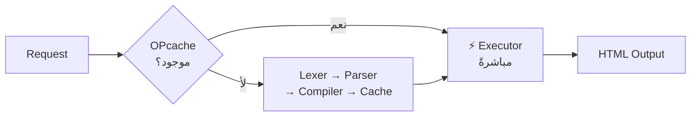
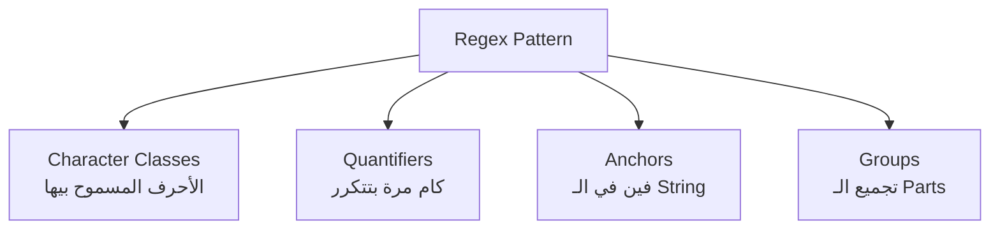
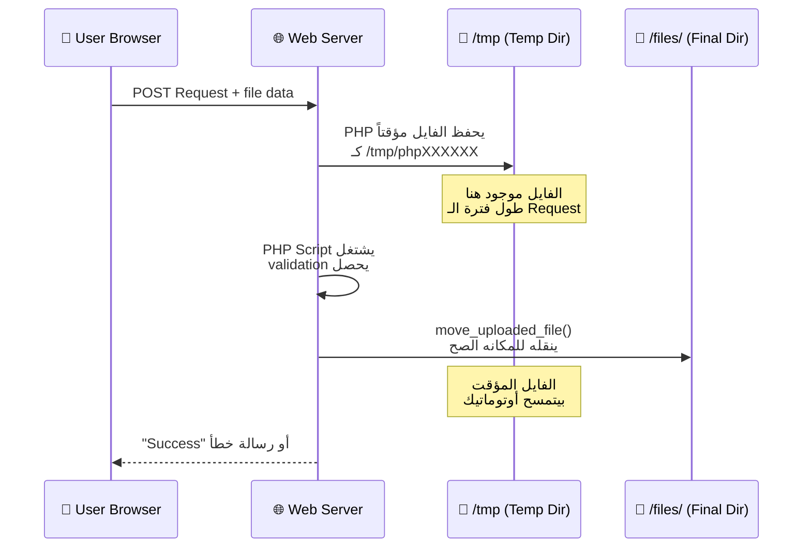
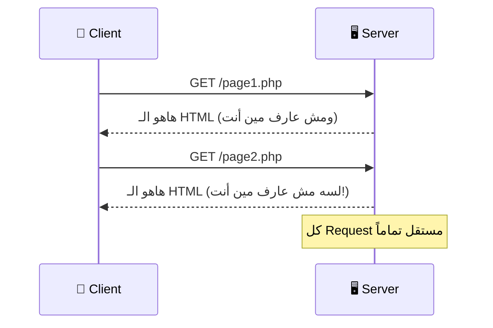
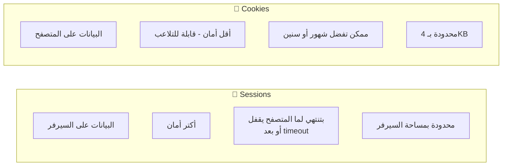
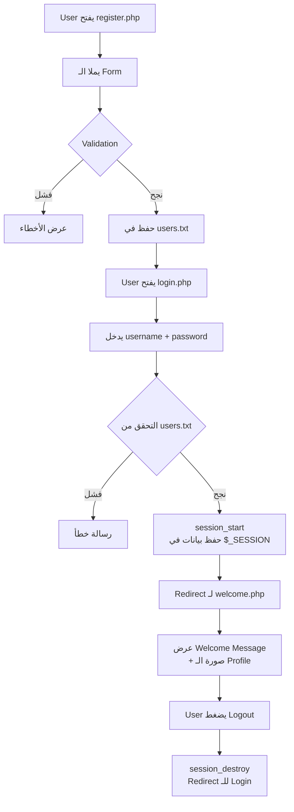

# 🐘 PHP Day 03 — الحكاية الكاملة

### _String Manipulation · Regex · File Upload · Sessions · Cookies_

> **بقلم:** Master PHP Storyteller & Principal Architect **المصدر:** ITI — Prepared by Eng. Noha Shehab

---

هات كوباية الشاي بتاعتك يا هندسة.. ويلا بينا نبدأ حكاية الـ PHP من تحت الكبوت!

---

## 🗺️ خريطة الرحلة



---

# 🚀 الفصل الأول: رحلة الفايل — من الكيبورد لحد شاشة العميل

## تعالى أحكيلك الحكاية من الأول

تخيل معايا السيناريو ده. أنت جالس في أوبونتو سيرفر، عندك فايل اسمه `index.php`. الفايل ده مش مجرد نص. هو وصية مكتوبة للمعالج، بس المعالج بيتكلم لغة واحدة بس: **Opcodes**. طيب، مين اللي يترجم؟ ومن فين بتبدأ الرحلة؟

الرحلة بتبدأ مش من السيرفر... بتبدأ من **المتصفح بتاع العميل**.

---

### المرحلة 1️⃣ — الـ HTTP Request بيولد

العميل بيكتب في المتصفح: `http://mysite.com/index.php`

في هذه اللحظة، المتصفح بيبني **HTTP GET Request** وبيبعته على الشبكة.

```
GET /index.php HTTP/1.1
Host: mysite.com
Accept: text/html
Connection: keep-alive
```

الباكيت ده بيسافر عبر TCP/IP، بيعدي الـ Router، بيوصل لـ **Ubuntu Server** على البورت **80** (HTTP) أو **443** (HTTPS).

---

### المرحلة 2️⃣ — الـ Web Server بيستقبل

على السيرفر، في حارس بيصحى ليل نهار. اسمه **Apache** أو **Nginx**. هو بيستمع على البورت 80 ومش بيصحى إلا لما يجي Request.



لما **Nginx** بيلاقي إن امتداد الفايل `.php`، بيعمل إيه؟ هو مش بيعرف يشغّل PHP بنفسه! بيبعته لحد تاني اسمه **PHP-FPM**.

---

### المرحلة 3️⃣ — PHP-FPM: الوسيط الذكي

**PHP-FPM** = PHP FastCGI Process Manager.

تخيله زي مدير مصنع. عنده **pool** من الـ Worker Processes جاهزين يشتغلوا. لما Nginx بيبعتله Request، هو بيختار Worker فاضي وبيديه الشغل.

```
# على السيرفر، بتلاقي العملية دي شغالة:
$ ps aux | grep php-fpm
www-data  1234  ... php-fpm: worker process
www-data  1235  ... php-fpm: worker process
root      1200  ... php-fpm: master process
```

الـ Master Process هو اللي بيدير الـ Workers. الـ `www-data` هو الـ user اللي بيشتغل بيه PHP على Ubuntu — ده مهم جداً لاحقاً في الـ File Upload.

---

### المرحلة 4️⃣ — الـ Zend Engine: قلب PHP النابض

هنا بقى بيتدخل الـ **Zend Engine** عشان ينقذ الموقف. الـ Zend Engine هو المحرك اللي PHP اتبنى عليه. هو اللي بياخد الكود الـ PHP اللي أنت كتبته ويحوله لحاجة المعالج يفهمها.

**الرحلة جوه الـ Zend Engine في 4 مراحل:**



#### **المرحلة الأولى: Lexing (التقطيع)**

الـ Lexer بياخد الفايل كـ Stream من الـ characters وبيقسمه لـ **Tokens** زي:

```php
<?php echo "Hello World"; ?>
```

يتحول لـ:

```
T_OPEN_TAG      →  <?php
T_ECHO          →  echo
T_WHITESPACE    →  " "
T_CONSTANT_ENCAPSED_STRING → "Hello World"
T_SEMICOLON     →  ;
T_CLOSE_TAG     →  ?>
```

#### **المرحلة التانية: Parsing (البناء)**

الـ Parser بياخد الـ Tokens دي ويبني منها **Abstract Syntax Tree (AST)**. تخيله زي شجرة نسب للكود.

```
Program
└── Echo Statement
    └── StringLiteral: "Hello World"
```

#### **المرحلة التالتة: Compilation (الترجمة)**

الـ Compiler بيحول الـ AST لـ **Opcodes** — التعليمات اللي الـ Executor بيفهمها:

```
ECHO "Hello World"
RETURN
```

#### **المرحلة الرابعة: Execution (التنفيذ)**

الـ Executor بيشغل الـ Opcodes واحدة واحدة. النتيجة؟ HTML بيتبعت لـ PHP-FPM، اللي بيبعته لـ Nginx، اللي بيبعته للعميل.

---

### 🔑 OPcache: الحيلة الذكية

كل مرة بيجي Request، الزيند بيعمل الـ 4 مراحل دول من الأول؟ ده بطيء! لكن PHP عندها حل اسمه **OPcache**.

**OPcache** بيحفظ الـ Opcodes في الـ RAM. المرة الجاية، بيـskip الـ Lexing والـ Parsing والـ Compilation ويروح على طول للـ Execution!



---

# 🧵 الفصل التاني: String Manipulation — فن التلاعب بالنصوص

## الحكاية والمشكلة

تخيل إنك بتبني نظام تسجيل على موقعك. المستخدم بعت اسمه: `" محمد "` — فيه spaces زيادة من الجنبين. لو حفظتها في الـ Database كده، هتكون مصيبة. الـ `strcmp` هتفشل، الـ Search هيتعب، والـ Profile هيبان غريب.

هنا بتيجي دالة `trim()` لتنقذ الموقف.

---

## 🔪 دوال التقليم — Trim Functions

```php
<?php
$text = "\t\tThese are a few words :) ...   \n";

// trim() — بتشيل المسافات والـ whitespace من الجنبين
$trimmed = trim($text);
var_dump($trimmed);
// string(24) "These are a few words :) ..."

// ltrim() — Left Trim — من الشمال بس
$ltrimmed = ltrim($text);

// rtrim() === chop() — Right Trim — من اليمين بس
$rtrimmed = rtrim($text);

// trim() مع custom characters
$trimmed2 = trim($text, "\tThe");
// بتشيل الـ \t والـ T والـ h والـ e من الجنبين
var_dump($trimmed2);
```

> 💡 **ملاحظة:** `rtrim()` و `chop()` نفس الدالة تماماً. `chop` اسم alias قديم.

---

## 🎨 التنسيق المتقدم — Sophisticated Formatting

### nl2br() — محوّل الـ Newlines

المشكلة: أنت كاتب paragraph في PHP فيه `\n` (newlines)، لكن الـ HTML مش بيعرف `\n`. بيشوفها كـ space عادي.

**الحل:** `nl2br()` بتحول كل `\n` لـ `<br />`.

```php
<?php
$str = "You came\nto me\nin that hour\nof need";

echo $str . "<br>";
// هيطبع كله في سطر واحد في الـ HTML

echo "<h2>After applying the function</h2>";
echo nl2br($str);
// هيطبع:
// You came<br />
// to me<br />
// in that hour<br />
// of need
```

### printf() و sprintf() — تنسيق الـ Output

**printf** = Print Formatted. زي `echo` بس بتحدد الـ format.

```php
<?php
$txt = "welcome to day3 in php";
printf("[%'#10s]\n", $txt);
// [%'#10s] معناها:
// % → بداية الـ format specifier
// ' → الـ padding character اللي جاي بعده
// # → الـ padding character (هنضيف # لو النص قصير)
// 10 → minimum width
// s → string

$num = 5;
$location = 'tree';
$format = 'There are %d monkeys in the %s';
echo sprintf($format, $num, $location);
// Output: "There are 5 monkeys in the tree"
// sprintf() بترجع String بدل ما تـprint
```

**الفرق بين printf و sprintf:**

- `printf()` → بتطبع مباشرة
- `sprintf()` → بترجع الـ String عشان تعمل بيها حاجة تانية

---

## 🔠 الحروف الكبيرة والصغيرة

```php
<?php
$string = "welcome to iti";

echo strtoupper($string) . "</br>";   // WELCOME TO ITI
echo strtolower($string) . "</br>";   // welcome to iti
echo ucfirst($string)    . "</br>";   // Welcome to iti
echo ucwords($string)    . "</br>";   // Welcome To Iti
```

---

## 🛡️ Escaping للـ Database — addslashes & stripslashes

**السيناريو المرعب:** مستخدم اسمه `O'Brien`. لو حطيت اسمه جوه SQL Query كده:

```sql
SELECT * FROM users WHERE name = 'O'Brien'
```

الـ Database هتـcrash! الـ Quote الجوانية كسرت الـ SQL.

```php
<?php
$str = "What's your name?";

// addslashes() — بتضيف backslash قبل الـ quotes
$newString = addslashes($str);
echo $newString . "<br>";
// Output: What\'s your name?

// stripslashes() — بتشيل الـ backslashes
echo stripslashes($newString) . "<br>";
// Output: What's your name?
```

> ⚠️ **ملاحظة مهمة:** في Production Code الحديث، استخدم **Prepared Statements** مع PDO بدل `addslashes()`. لكن لازم تعرف `addslashes()` لأنها موجودة في Legacy Code كتير.

---

## 🔗 ربط وتقطيع النصوص — Join & Split

### implode() / join() — الربط

```php
<?php
$InputArray = array('OS', 'Application', 'Track');

// بدون separator
print_r(implode($InputArray));
// OSApplicationTrack

// مع separator
print_r(implode("-", $InputArray));
// OS-Application-Track

// join() هو alias لـ implode()
print_r(join("_", $InputArray));
// OS_Application_Track
```

### explode() — التقطيع

```php
<?php
$str = "I love coffee so much";

// تقطيع بالـ space
$arrstr = explode(" ", $str);
var_dump($arrstr);
// array(4) { [0]=> "I" [1]=> "love" [2]=> "coffee" [3]=> "so" ... }

// مع limit — بتاخد أول 2 قطعة بس
$arrstr1 = explode(" ", $str, 2);
var_dump($arrstr1);
// array(2) { [0]=> "I" [1]=> "love coffee so much" }
```

### strtok() — التقطيع التدريجي

```php
<?php
$string = "My name is Noha, I works at ITI";

// أول استدعاء: بتديه الـ string والـ delimiter
$tok = strtok($string, " ");

while ($tok !== false) {
    echo "Word=$tok<br/>";
    // كل استدعاء بعده: بس الـ delimiter (الـ string اتحفظ internally)
    $tok = strtok(" \n\t");
}
```

### substr() — جزء من الـ String

```php
<?php
$phptxt = "PHP is simple";

echo substr($phptxt, 1);      // "HP is simple" — من index 1 للآخر
echo substr($phptxt, 1, 5);   // "HP is" — من index 1 بطول 5
echo substr($phptxt, -2);     // "le" — آخر حرفين (negative offset)
```

---

## ⚖️ المقارنة — Comparing Strings

```php
<?php
// strcmp() — Case Sensitive
$var1 = "Hello";
$var2 = "hello";

if (strcmp($var1, $var2) !== 0) {
    // بترجع 0 لو متساويين، positive أو negative لو مختلفين
    echo '$var1 is not equal to $var2 (case sensitive)';
}

// strcasecmp() — Case Insensitive
if (strcasecmp($var1, $var2) === 0) {
    echo '$var1 equals $var2 (case insensitive)';
}
```

---

## 🔎 البحث والاستبدال

### strstr() / strchr() — البحث عن Pattern

```php
<?php
$email = 'name@example.com';

// بترجع من أول الـ match للآخر
$domain = strstr($email, '@');
echo $domain . "<br>";
// Output: @example.com
```

### الـ Hashing و ord()

```php
<?php
// md5() — One-way hash function
$string = 'Hello World!';
$hash = md5($string);
echo $hash . "<br>";
// Output: ed076287532e86365e841e92bfc50d8c

// ord() — بتاخد أول byte من الـ string وترجعه كـ ASCII value
echo ord("Noha") . "<br>";
// N = 78 في ASCII
```

### str_repeat() و str_shuffle()

```php
<?php
echo str_repeat("iti ", 5) . "<br>";
// Output: iti iti iti iti iti

$str = 'abcdef';
echo str_shuffle($str) . "<br>";
// Output: مثلاً "cfbdea" (عشوائي)
```

### str_replace() و substr_replace()

```php
<?php
// str_replace() — استبدال ذكي
$vowels = array("a", "e", "i", "o", "u", "A", "E", "I", "O", "U");
$onlyconsonants = str_replace($vowels, "", "Hello World of PHP");
echo $onlyconsonants . "<br>";
// Output: "Hll Wrld f PHP"

// substr_replace() — استبدال في موقع محدد
$input = array('A: XXX', 'B: XXX', 'C: XXX');
$input = substr_replace($input, 'YYY', 3, 3);
// من index 3، بطول 3 حروف، استبدل بـ 'YYY'
var_dump($input);
echo implode('; ', $input);
// Output: "A: YYY; B: YYY; C: YYY"
```

---

## 📊 Checkpoint: String Functions

|الدالة|الوظيفة|مثال سريع|
|---|---|---|
|`trim()`|شيل whitespace|`trim(" hi ")` → `"hi"`|
|`nl2br()`|`\n` → `<br />`|للعرض في HTML|
|`sprintf()`|تنسيق String|`sprintf("%d items", 5)`|
|`explode()`|String → Array|`explode(",", "a,b,c")`|
|`implode()`|Array → String|`implode("-", ["a","b"])`|
|`str_replace()`|استبدال|احذف الـ vowels|
|`substr()`|جزء من الـ String|`substr("PHP", 1)` → `"HP"`|
|`strcmp()`|مقارنة case-sensitive|0 = متساويين|
|`md5()`|One-way hash|للـ passwords (مش موصى بيها لوحدها)|

> **🫒 زتونة الإنترفيو:** `implode()` و `join()` نفس الدالة. `rtrim()` و `chop()` نفس الدالة. `strstr()` و `strchr()` نفس الدالة. الـ PHP فيها aliases كتير من التاريخ.

---

# 🔍 الفصل التالت: Regular Expressions — لغة وسط اللغة

## الحكاية والمشكلة

تخيل إنك بتبني نموذج تسجيل. المستخدم بيكتب الإيميل. إزاي تتأكد إن الإيميل ده صح؟ تـcheck إن فيه `@`؟ ممكن. تـcheck إن فيه `.`؟ ممكن. لكن إزاي تتأكد من شكل الإيميل كله؟

هنا بيجي دور الـ **Regular Expressions** — لغة للـ Pattern Matching. زي إنك بتكتب "وصف" للشكل اللي عايزه، والـ Regex engine بيدور على أي حاجة تنطبق على الوصف ده.

---

## بناء الـ Regex — Building Blocks



### الـ Character Classes

```
.         →  أي حرف واحد (عدا newline)
[a-z]     →  أي حرف صغير من a لـ z
[A-Z]     →  أي حرف كبير
[0-9]     →  أي رقم
[aeiou]   →  أي vowel
[^a-z]    →  أي حرف مش صغير (^ = NOT)
```

### الـ Quantifiers

```
*   →  صفر أو أكتر مرة
+   →  مرة أو أكتر
?   →  صفر أو مرة واحدة (optional)
{n} →  بالظبط n مرة
{n,m} →  من n لـ m مرة
```

### الـ Anchors

```
^  →  بداية الـ String
$  →  نهاية الـ String
```

---

## preg_match() — الـ Pattern Matching الأساسي

```php
<?php
$email = 'nshehab@iti.gov.eg';

// الـ pattern محاط بـ / / (delimiters)
// الـ flags: i = case-insensitive, x = ignore whitespace
$pattern = "/^([a-z0-9\+_\-]+)(\.[a-z0-9\+_\-]+)*@([a-z0-9\-]+\.)+[a-z]{2,6}$/ix";

if (preg_match($pattern, $email)) {
    echo "<br>well formed";
} else {
    echo "<br>not well formed";
}
```

**تحليل الـ Pattern خطوة بخطوة:**

```
^                     →  ابدأ من أول الـ String
([a-z0-9\+_\-]+)     →  الـ username: حروف/أرقام/+/_/- (مرة أو أكتر)
(\.[a-z0-9\+_\-]+)*  →  ممكن يكون فيه .parts زي noha.shehab (صفر أو أكتر)
@                     →  الـ @ الإلزامية
([a-z0-9\-]+\.)+     →  الـ domain: كلمة.كلمة. (مرة أو أكتر — لـ subdomains)
[a-z]{2,6}           →  الـ TLD: من 2 لـ 6 حروف (eg, com, gov)
$                     →  نهاية الـ String
```

---

## preg_match_all() — البحث عن كل الـ Matches

```php
<?php
$str = "The rain in SPAIN falls mainly on the plains.";
$pattern = "/ain/i"; // i = case-insensitive

if (preg_match_all($pattern, $str, $matches)) {
    print_r($matches);
    // بيلاقي: rain, AIN, ain, ain
}
```

---

## filter_var() — الـ Built-in Validation

PHP عندها طريقة أسهل للـ Email validation:

```php
<?php
$email = "nohashehab.iti@gmail.com";

if (!filter_var($email, FILTER_VALIDATE_EMAIL)) {
    $emailErr = "Invalid email format";
} else {
    echo "<br>Checked by php functions and well formed";
}
```

**الـ Filters المتاحة:**

|الـ Filter|الاستخدام|
|---|---|
|`FILTER_VALIDATE_EMAIL`|التحقق من الإيميل|
|`FILTER_VALIDATE_URL`|التحقق من الـ URL|
|`FILTER_VALIDATE_INT`|التحقق من الرقم الصحيح|
|`FILTER_SANITIZE_STRING`|تنظيف الـ HTML tags|

> **🫒 زتونة الإنترفيو:** `filter_var()` أبطأ من `preg_match()` بس أوضح وأكتر readable للـ common cases. في Production، استخدم `filter_var()` للـ basic validation وـ`preg_match()` للـ complex patterns.

---

# 📁 الفصل الرابع: File Uploading — رفع الملفات على السيرفر

## السيناريو المرعب

تخيل معايا السيناريو المرعب ده. موقعك بيخلي المستخدمين يرفعوا صورة الـ Profile. مستخدم خبيث رفع فايل اسمه `evil.php` بدل صورة. لو السيرفر حفظه وشغّله، المستخدم ده هيقدر يـexecute كود PHP على السيرفر بتاعك!

ده اللي بيتسمى **Remote Code Execution (RCE)** — واحدة من أخطر الثغرات.

عشان كده، الـ File Upload لازم يكون محمي بشكل صح.

---

## المرحلة الأولى: الـ php.ini Settings

```ini
# في /etc/php/8.x/fpm/php.ini
file_uploads = On          ; السماح بالرفع
upload_max_filesize = 2M   ; أقصى حجم للفايل
max_file_uploads = 20      ; أقصى عدد فايلات في نفس الوقت
upload_tmp_dir = /tmp      ; المجلد المؤقت (www-data لازم يكون عنده write access)
```

---

## المرحلة التانية: الـ HTML Form

```html
<!-- enctype="multipart/form-data" — ضروري جداً للـ file upload -->
<form action="uploadingfiles.php" method="POST" enctype="multipart/form-data">
    <h1>Please choose your file</h1>
    <label>File</label>
    <input type="file" name="file" />
    <!-- MAX_FILE_SIZE: hint للمتصفح (مش security، بس UX) -->
    <input type="hidden" name="MAX_FILE_SIZE" value="1000000"/>
    <input type="text" name="opensource"/>
    <input type="submit"/>
</form>
```

> ⚠️ **مهم:** لو نسيت `enctype="multipart/form-data"`، الـ `$_FILES` هيكون فاضي. الـ PHP مش هتشوف الفايل خالص.

---

## المرحلة التالتة: الـ PHP Processing

```php
<?php
if (isset($_FILES['file'])) {
    $errors = array();

    // $_FILES['file'] بيحتوي على:
    // 'name'     → اسم الفايل على كمبيوتر المستخدم
    // 'type'     → MIME type (مش موثوق — ممكن يتزوّر)
    // 'tmp_name' → المسار المؤقت على السيرفر
    // 'size'     → الحجم بالـ bytes
    // 'error'    → كود الخطأ

    $file_name = $_FILES['file']['name'];
    $file_size = $_FILES['file']['size'];
    $file_tmp  = $_FILES['file']['tmp_name'];
    $file_type = $_FILES['file']['type'];

    // ✅ الطريقة الصح لجيب الـ extension
    $ext = explode('.', $_FILES['file']['name']);
    $file_ext = strtolower(end($ext));
    // أو بالطريقة الأنيقة:
    $file_ext = strtolower(pathinfo($file_name)["extension"]);

    // ✅ Whitelist — بس الامتدادات المسموح بيها
    $extensions = array("jpeg", "jpg", "png", "pdf", "doc", "txt", "csv");

    if (in_array($file_ext, $extensions) === false) {
        $errors[] = "extension not allowed, please choose a JPEG or PNG file.";
    }

    // ✅ Size check — 2MB maximum
    if ($file_size > 2097152) { // 2 * 1024 * 1024
        $errors[] = 'File size must be exactly 2 MB';
    }

    if (empty($errors) == true) {
        // move_uploaded_file() — الدالة الرسمية للنقل
        // بتتأكد إن الفايل ده فعلاً جه من PHP upload
        move_uploaded_file($file_tmp, "files/" . $file_name);
        echo "Success";
    } else {
        print_r($errors);
    }
}
```

---

## رحلة الفايل أثناء الـ Upload



> 🔒 **Security Note:** الـ `/tmp` على Ubuntu ملكه `root` لكن أي user يقدر يكتب فيه. الـ `www-data` (اللي بيشغل PHP-FPM) عنده write permission هناك. أما مجلد `files/` اللي بتحط فيه الـ uploads، لازم تعطيه permission بشكل صريح:
> 
> ```bash
> sudo chown www-data:www-data /var/www/html/files/
> sudo chmod 755 /var/www/html/files/
> ```

---

# 🍪 الفصل الخامس: Sessions & Cookies — هوية المستخدم على الإنترنت

## المشكلة الأصلية: HTTP Stateless Protocol

تخيل معايا السيناريو المرعب ده. أنت بتتسوق أونلاين. حطيت منتج في الـ Cart. انتقلت للصفحة التانية. **الـ Server نسيك!**

ليه؟ لأن **HTTP Stateless Protocol**. كل Request مستقل عن اللي قبله. السيرفر مش بيتذكر مين أنت.



الحل؟ نخلي السيرفر "يتذكر" المستخدم. وفي طريقتين:

1. **Sessions** → الذاكرة على السيرفر
2. **Cookies** → الذاكرة على المتصفح

---

## 🔐 Sessions — الذاكرة الآمنة على السيرفر

### إزاي الـ Sessions بتشتغل؟

```mermaid
flowchart TD
    A[User يفتح الموقع] --> B[session_start()]
    B --> C{هل في PHPSESSID<br/>في الـ Cookie؟}
    C -- لأ --> D[PHP بتولد<br/>Session ID جديد<br/>مثال: abc123xyz]
    C -- نعم --> E[PHP بتجيب البيانات<br/>من الـ Session File]
    D --> F[بتحفظ الـ ID في Cookie<br/>على المتصفح]
    D --> G[بتعمل File على السيرفر<br/>/var/lib/php/sessions/sess_abc123xyz]
    F --> H[$_SESSION المتاح<br/>في الـ Script]
    G --> H
    E --> H
```

### الـ Session في الكود

```php
<?php
// ⚠️ لازم تكون أول سطر قبل أي output
session_start();

echo "Welcome to the server";

// تخزين في الـ Session
$_SESSION["username"] = "Noha";
$_SESSION["course"]   = "PHP";
$_SESSION["msg"]      = "Goodmorning";
```

```php
<?php
// في صفحة تانية — نفس الـ session_start()
session_start();

var_dump($_SESSION);
// array(3) { ["username"]=> "Noha" ["course"]=> "PHP" ["msg"]=> "Goodmorning" }

// مسح متغير معين
unset($_SESSION["msg"]);

// مسح كل شيء وإنهاء الـ Session
$_SESSION = array(); // امسح البيانات الأول
session_destroy();   // امسح الـ Session File
```

### الـ Session File على السيرفر

```bash
# على Ubuntu، ملفات الـ Sessions موجودة هنا:
ls /var/lib/php/sessions/
# sess_abc123xyzdef456

# محتوى الفايل:
cat /var/lib/php/sessions/sess_abc123xyzdef456
# username|s:4:"Noha";course|s:3:"PHP";msg|s:10:"Goodmorning";
```

---

## 🍪 Cookies — الذاكرة على المتصفح

### إزاي الـ Cookies بتشتغل؟

```mermaid
sequenceDiagram
    participant C as 🌍 Client Browser
    participant S as 🖥️ PHP Server

    C->>S: GET /index.php (أول مرة — بدون cookies)
    S->>S: setcookie() بيتنفذ
    S-->>C: HTTP Response + Set-Cookie: name=Noha; expires=...
    Note over C: المتصفح بيحفظ الـ Cookie

    C->>S: GET /page2.php
    Note over C: المتصفح بيبعت الـ Cookie أوتوماتيك
    S-->>C: "Welcome Noha!"
```

### setcookie() — إزاي تعمل Cookie

```php
<?php
// setcookie(name, value, expires, path, domain, secure, httponly)
setcookie("name", "Noha Shehab", time() + 3600, "/", "", 0);
setcookie("age",  "28",          time() + 3600, "/", "", 0);

// time() + 3600 = الـ Cookie تنتهي بعد ساعة
// "/" = متاحة على كل الـ paths في الـ domain
```

### قراءة ومسح الـ Cookies

```php
<?php
// قراءة الـ Cookie
if (isset($_COOKIE["name"])) {
    echo "Welcome " . $_COOKIE["name"] . "<br />";

    // مسح الـ Cookie: اضبط الـ expires في الماضي
    setcookie("name", "", time() - 60, "/", "", 0);
} else {
    echo 'no name cookie here' . "<br />";
}

if (isset($_COOKIE["age"])) {
    echo "Your age is " . $_COOKIE["age"] . "<br />";
    setcookie("age", "", time() - 60, "/", "", 0);
} else {
    echo 'no age cookie here' . "<br />";
}
```

---

## Sessions vs Cookies — المقارنة النهائية



|المعيار|Session|Cookie|
|---|---|---|
|**مكان التخزين**|السيرفر|المتصفح|
|**الأمان**|عالي|منخفض (قابل للتلاعب)|
|**المدة**|محدودة (timeout)|ممكن تطول|
|**الحجم**|غير محدود عملياً|4KB فقط|
|**الاستخدام المثالي**|بيانات Login وأي بيانات حساسة|تفضيلات المستخدم، ذكر تسجيل الدخول|

> **🫒 زتونة الإنترفيو:** الـ Session ID بيتخزن في Cookie اسمه `PHPSESSID` على المتصفح. يعني الـ Sessions بتستخدم Cookies عشان تعمل! الفرق إن البيانات الحساسة على السيرفر، مش في الـ Cookie نفسها.

---

# 🛠️ حل اللاب عملي على أوبونتو

## المطلوب من اللاب

1. فورم PHP مع validation على الإيميل بطريقتين
2. Room Number كـ dropdown
3. Upload صورة Profile مع validation
4. حفظ بيانات المستخدم في فايل
5. صفحة Login تقرأ من الفايل
6. بعد الـ Login، ابدأ Session وعرض رسالة ترحيب
7. **Bonus:** Validation على الـ Password

---

## هيكل الملفات

```
lab03/
├── register.php       ← صفحة التسجيل
├── login.php          ← صفحة الـ Login
├── welcome.php        ← صفحة الترحيب (محمية بـ Session)
├── users.txt          ← ملف تخزين المستخدمين
└── uploads/           ← مجلد صور الـ Profile
```

---

## register.php — صفحة التسجيل

```php
<?php
session_start();

$errors = [];
$success = "";

// --- Password Regex (Bonus) ---
// Only lowercase + underscore, exactly 8 chars
$passwordPattern = '/^[a-z_]{8}$/';

if ($_SERVER['REQUEST_METHOD'] === 'POST') {

    // =============================
    // 1. Email Validation (طريقتين)
    // =============================
    $email = trim($_POST['email'] ?? '');

    // الطريقة الأولى: filter_var
    if (!filter_var($email, FILTER_VALIDATE_EMAIL)) {
        $errors[] = "Email not valid (filter_var method)";
    }

    // الطريقة التانية: preg_match
    $emailPattern = "/^([a-z0-9\+_\-]+)(\.[a-z0-9\+_\-]+)*@([a-z0-9\-]+\.)+[a-z]{2,6}$/ix";
    if (!preg_match($emailPattern, $email)) {
        $errors[] = "Email not valid (regex method)";
    }

    // =============================
    // 2. Username & Password
    // =============================
    $username = trim($_POST['username'] ?? '');
    $password = trim($_POST['password'] ?? '');

    if (empty($username)) {
        $errors[] = "Username is required";
    }

    // Bonus Password Validation
    if (strlen($password) !== 8) {
        $errors[] = "Password must be exactly 8 characters";
    }
    if (!preg_match($passwordPattern, $password)) {
        $errors[] = "Password: only lowercase letters and underscore allowed";
    }

    // =============================
    // 3. Room Number Dropdown
    // =============================
    $allowed_rooms = ['Application1', 'Application2', 'Cloud'];
    $room = $_POST['room'] ?? '';
    if (!in_array($room, $allowed_rooms)) {
        $errors[] = "Invalid room selection";
    }

    // =============================
    // 4. Profile Picture Upload
    // =============================
    $profile_pic = "";
    if (isset($_FILES['profile_pic']) && $_FILES['profile_pic']['error'] === UPLOAD_ERR_OK) {
        $pic_name     = $_FILES['profile_pic']['name'];
        $pic_tmp      = $_FILES['profile_pic']['tmp_name'];
        $pic_size     = $_FILES['profile_pic']['size'];
        $pic_ext      = strtolower(pathinfo($pic_name)["extension"]);

        // Whitelist: صور فقط
        $allowed_exts = ['jpg', 'jpeg', 'png', 'gif', 'webp'];

        if (!in_array($pic_ext, $allowed_exts)) {
            $errors[] = "Profile picture must be an image (jpg, jpeg, png, gif, webp)";
        }

        // Size check: max 2MB
        if ($pic_size > 2097152) {
            $errors[] = "Profile picture must be less than 2MB";
        }

        if (empty($errors)) {
            // Save with unique name to avoid overwrite
            $unique_name = uniqid("user_", true) . "." . $pic_ext;
            $upload_path = __DIR__ . "/uploads/" . $unique_name;
            if (move_uploaded_file($pic_tmp, $upload_path)) {
                $profile_pic = $unique_name;
            } else {
                $errors[] = "Failed to save profile picture. Check uploads/ permissions.";
            }
        }
    } else {
        $errors[] = "Profile picture is required";
    }

    // =============================
    // 5. Save to users.txt
    // =============================
    if (empty($errors)) {
        $users_file = __DIR__ . "/users.txt";

        // Check if username already exists
        if (file_exists($users_file)) {
            $lines = file($users_file, FILE_IGNORE_NEW_LINES | FILE_SKIP_EMPTY_LINES);
            foreach ($lines as $line) {
                $parts = explode("|", $line);
                if ($parts[0] === $username) {
                    $errors[] = "Username already taken";
                    break;
                }
            }
        }

        if (empty($errors)) {
            // Format: username|password_hash|email|room|profile_pic
            $line = implode("|", [
                $username,
                password_hash($password, PASSWORD_DEFAULT), // ✅ آمن
                $email,
                $room,
                $profile_pic
            ]) . PHP_EOL;

            file_put_contents($users_file, $line, FILE_APPEND | LOCK_EX);
            $success = "Registration successful! <a href='login.php'>Login here</a>";
        }
    }
}
?>
<!DOCTYPE html>
<html lang="en">
<head>
    <meta charset="UTF-8">
    <title>Register - Lab 03</title>
</head>
<body>
<h2>Register</h2>

<?php if (!empty($errors)): ?>
    <ul style="color:red;">
        <?php foreach ($errors as $e): ?>
            <li><?= htmlspecialchars($e) ?></li>
        <?php endforeach; ?>
    </ul>
<?php endif; ?>

<?php if ($success): ?>
    <p style="color:green;"><?= $success ?></p>
<?php endif; ?>

<form method="POST" enctype="multipart/form-data">
    <label>Username: <input type="text" name="username" required></label><br><br>

    <label>Email: <input type="email" name="email" required></label><br><br>

    <label>Password (8 chars, lowercase + underscore only):
        <input type="password" name="password" required>
    </label><br><br>

    <label>Room:
        <select name="room">
            <option value="">-- Select Room --</option>
            <option value="Application1">Application 1</option>
            <option value="Application2">Application 2</option>
            <option value="Cloud">Cloud</option>
        </select>
    </label><br><br>

    <label>Profile Picture:
        <input type="file" name="profile_pic" accept="image/*" required>
    </label><br><br>

    <input type="submit" value="Register">
</form>
</body>
</html>
```

---

## login.php — صفحة الـ Login

```php
<?php
session_start();

// لو user اتسجل دخول خلاص، روح على welcome
if (isset($_SESSION['username'])) {
    header("Location: welcome.php");
    exit;
}

$error = "";

if ($_SERVER['REQUEST_METHOD'] === 'POST') {
    $username = trim($_POST['username'] ?? '');
    $password = trim($_POST['password'] ?? '');

    $users_file = __DIR__ . "/users.txt";

    if (!file_exists($users_file)) {
        $error = "No users registered yet.";
    } else {
        $found = false;
        $lines = file($users_file, FILE_IGNORE_NEW_LINES | FILE_SKIP_EMPTY_LINES);

        foreach ($lines as $line) {
            $parts = explode("|", $line);
            // Format: username|password_hash|email|room|profile_pic
            if (count($parts) < 5) continue;

            list($stored_user, $stored_hash, $stored_email, $stored_room, $stored_pic) = $parts;

            if ($stored_user === $username && password_verify($password, $stored_hash)) {
                $found = true;
                // Start session and store user info
                $_SESSION['username']    = $stored_user;
                $_SESSION['email']       = $stored_email;
                $_SESSION['room']        = $stored_room;
                $_SESSION['profile_pic'] = $stored_pic;
                break;
            }
        }

        if ($found) {
            header("Location: welcome.php");
            exit;
        } else {
            $error = "Invalid username or password.";
        }
    }
}
?>
<!DOCTYPE html>
<html lang="en">
<head>
    <meta charset="UTF-8">
    <title>Login - Lab 03</title>
</head>
<body>
<h2>Login</h2>

<?php if ($error): ?>
    <p style="color:red;"><?= htmlspecialchars($error) ?></p>
<?php endif; ?>

<form method="POST">
    <label>Username: <input type="text" name="username" required></label><br><br>
    <label>Password: <input type="password" name="password" required></label><br><br>
    <input type="submit" value="Login">
</form>

<p>Don't have an account? <a href="register.php">Register</a></p>
</body>
</html>
```

---

## welcome.php — صفحة الترحيب (محمية بـ Session)

```php
<?php
session_start();

// حماية الصفحة — لو مش logged in، ارجع للـ Login
if (!isset($_SESSION['username'])) {
    header("Location: login.php");
    exit;
}

$username    = $_SESSION['username'];
$email       = $_SESSION['email'];
$room        = $_SESSION['room'];
$profile_pic = $_SESSION['profile_pic'];
?>
<!DOCTYPE html>
<html lang="en">
<head>
    <meta charset="UTF-8">
    <title>Welcome - Lab 03</title>
</head>
<body>
<h2>🎉 Welcome, <?= htmlspecialchars($username) ?>!</h2>
<p>Email: <?= htmlspecialchars($email) ?></p>
<p>Room: <?= htmlspecialchars($room) ?></p>

<?php if ($profile_pic): ?>
    " 
         alt="Profile Picture" 
         style="width:150px; height:150px; border-radius:50%; object-fit:cover;">
<?php endif; ?>

<br><br>
<form method="POST" action="logout.php">
    <button type="submit">Logout</button>
</form>
</body>
</html>
```

---

## Setup على Ubuntu (File Permissions)

```bash
# 1. إنشاء مجلد الـ uploads مع الـ permissions الصح
sudo mkdir -p /var/www/html/lab03/uploads
sudo chown www-data:www-data /var/www/html/lab03/uploads
sudo chmod 755 /var/www/html/lab03/uploads

# 2. الـ users.txt لازم يكون قابل للكتابة من www-data
sudo touch /var/www/html/lab03/users.txt
sudo chown www-data:www-data /var/www/html/lab03/users.txt
sudo chmod 644 /var/www/html/lab03/users.txt

# 3. تأكد إن PHP-FPM شغال
sudo systemctl status php8.x-fpm

# 4. تأكد إن الـ upload_tmp_dir في php.ini صح
grep "upload_tmp_dir" /etc/php/8.x/fpm/php.ini
# upload_tmp_dir = /tmp
```

---

## الـ Bonus: Password Regex — تفصيل

```php
<?php
function validatePassword(string $password): array {
    $errors = [];

    // a. Only 8 chars
    if (strlen($password) !== 8) {
        $errors[] = "Password must be exactly 8 characters";
    }

    // b. No special chars — only underscore allowed
    // c. No capital letters
    // Pattern: only [a-z] and [_], exactly 8 times
    if (!preg_match('/^[a-z_]{8}$/', $password)) {
        $errors[] = "Password: only lowercase letters and underscore allowed, no capitals";
    }

    return $errors;
}

// Test cases:
var_dump(validatePassword("hello_wo"));  // ✅ Valid
var_dump(validatePassword("Hello_wo"));  // ❌ Capital H
var_dump(validatePassword("hel@lo_w"));  // ❌ Special char @
var_dump(validatePassword("hi"));        // ❌ Too short
```

---

## 🗺️ Flow الـ Lab كله



---

## 🎯 الـ Checkpoint النهائي — Interview Questions

|السؤال|الإجابة|
|---|---|
|الفرق بين `Session` و `Cookie`؟|Session على السيرفر، Cookie على المتصفح|
|ليه `enctype="multipart/form-data"` مهم؟|بدونها `$_FILES` هيكون فاضي|
|الفرق بين `printf` و `sprintf`؟|printf بتطبع، sprintf بترجع String|
|ليه `password_hash()` أحسن من `md5()`؟|md5 سريع جداً وقابل للـ brute force، password_hash بطيء عمداً|
|إزاي بتمسح Cookie؟|`setcookie("name", "", time() - 60)` — expires في الماضي|
|الـ `$_FILES['file']['error']` بيرجع إيه لو كل حاجة تمام؟|`UPLOAD_ERR_OK` = 0|
|ليه `move_uploaded_file()` أحسن من `copy()`؟|بتتأكد إن الفايل جه فعلاً من PHP upload process|

---

> **🫒 زتونة الإنترفيو النهائية:** الـ PHP بتشتغل على Ubuntu كـ `www-data` user. أي فايل أو فولدر محتاج PHP تكتب فيه، لازم `www-data` يكون عنده write permission. أشهر مشكلة في الـ File Upload على Production = **Permissions Error**.

---

_"كل سطر كود PHP بتكتبه، الـ Zend Engine بيرفعله سلام قبل ما يشغله."_

**—** يا هندسة، الرحلة خلصت! كل الـ Day 03 موجود هنا من الـ String Manipulation للـ Regex للـ File Upload للـ Sessions والـ Cookies، والـ Lab محلول بـ Production-Ready Code. 🚀