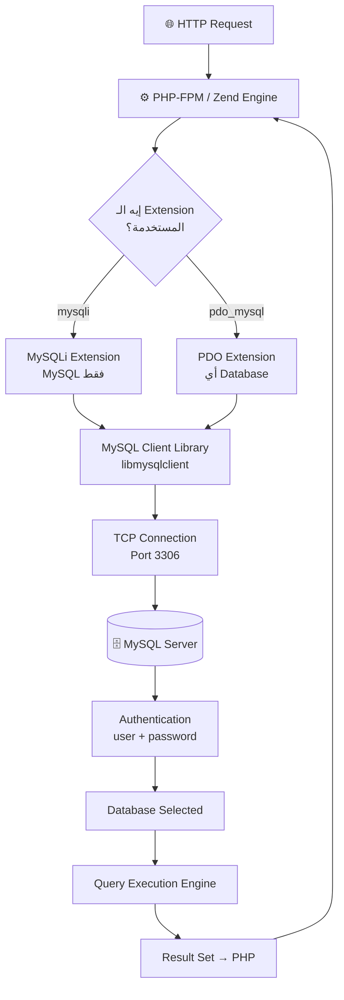
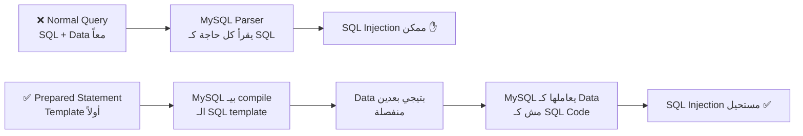
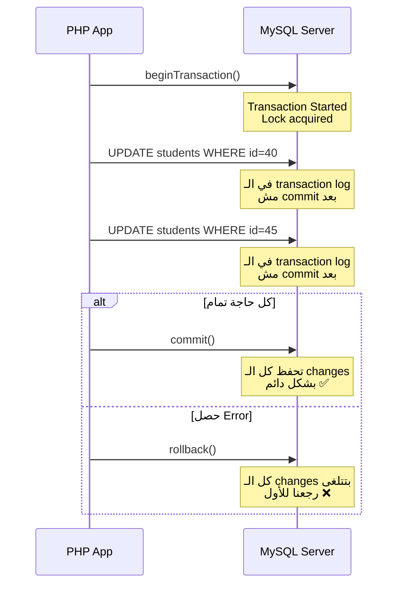
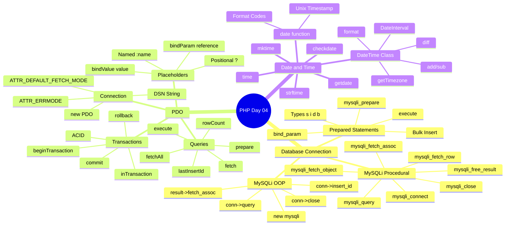

# 📖 PHP — اليوم الرابع: Databases & Dates
### رحلة المعلم الحكواتي من ITI — في قلب الـ MySQL وسر الـ Unix Timestamp

> *"البيانات مش بس أرقام وحروف.. دي قصص ناس حقيقيين على سيرفر حقيقي"*

---

## 🗺️ فهرس الرحلة

1. [الحكاية قبل الحكاية: ليه بنحتاج Database أصلاً؟](#ليه-database)
2. [الفصل الأول: معمارية الاتصال — الخريطة الكبيرة](#معمارية-الاتصال)
3. [الفصل التاني: MySQLi Procedural — الطريق الكلاسيكي](#mysqli-procedural)
4. [الفصل التالت: MySQLi OOP — نفس الرحلة بأسلوب راقي](#mysqli-oop)
5. [الفصل الرابع: Prepared Statements — درع الحماية ضد SQL Injection](#prepared-statements)
6. [الفصل الخامس: PDO — الجسر الذهبي فوق كل الـ Databases](#pdo)
7. [الفصل السادس: PDO Placeholders — Named vs Positional](#pdo-placeholders)
8. [الفصل السابع: PDO Transactions — إما الكل أو لا حاجة](#pdo-transactions)
9. [الفصل التامن: Date & Time — الـ Unix Timestamp وأسراره](#date-time)
10. [🛠️ حل اللاب عملي على أوبونتو](#حل-اللاب)

---

<a name="ليه-database"></a>
## الحكاية قبل الحكاية: ليه بنحتاج Database أصلاً؟

### تعالى أحكيلك الحكاية من الأول

في اليوم التاني اتكلمنا عن الـ Flat Files — كتبنا في `.txt` وقرأنا منه. ومشيت وأنت مبسوط. بس تخيل معايا السيناريو المرعب ده...

المشروع بتاعك نجح. بدل ما عندك 100 عميل، دلوقتي عندك 100,000 عميل. كل عميل عنده orders ومنتجات ومدفوعات. وحضرتك كمان محتاج تدور على "كل العملاء اللي اشتروا منتج معين وعندهم أكتر من 3 orders خلال آخر 30 يوم."

هل هتعمل ده في ملف نصي؟

```php
// ❌ كابوس الـ Flat File مع البيانات الكبيرة
$lines = file("customers.txt");  // بيقرأ 100,000 سطر في الـ RAM
foreach ($lines as $line) {
    $data = explode("|", $line);
    // filter يدوي.. وبعدين بدور في ملف تاني للـ orders
    // وملف تالت للـ payments
    // وكل ده sequential scan — O(n) بالنسبالـ كل ملف
}
// النتيجة: الـ server هيموت ✋
```

بالظبط. ده اللي خلى الـ Relational Databases تتخلق. هي مش luxury — هي ضرورة.

```
┌──────────────────────────────────────────────────────────────┐
│                  Flat Files vs Database                       │
│                                                              │
│  Flat Files:          Database (MySQL):                      │
│  Sequential scan      B-Tree Index → O(log n)                │
│  No relationships     JOINs بين الجداول                     │
│  No transactions      ACID transactions                      │
│  File locking فقط    Row-level locking                       │
│  مناسبة لـ: Logs,    مناسب لـ: كل تطبيق ويب حقيقي          │
│  Config files                                                │
└──────────────────────────────────────────────────────────────┘
```

---

<a name="معمارية-الاتصال"></a>
## الفصل الأول: معمارية الاتصال — الخريطة الكبيرة

### اللي بيحصل من تحت الكبوت

قبل ما نكتب سطر كود واحد، لازم تفهم إيه اللي بيحصل لما PHP "بتتصل" بـ MySQL.



الـ PHP مش بتتكلم مع MySQL مباشرة من الكود. هي بتستخدم **extension** — مكتبة C اسمها `libmysqlclient` أو `mysqlnd` (MySQL Native Driver). الـ extension دي بتفتح TCP connection على الـ port 3306 وبتبعت الـ queries وبتجيب الـ results.

**الاختيار بين MySQLi وPDO:**

| | MySQLi | PDO |
|---|---|---|
| Database Support | MySQL فقط | 12+ database driver |
| API Style | Procedural + OOP | OOP فقط |
| Prepared Statements | ✅ | ✅ |
| Named Placeholders | ❌ (؟ فقط) | ✅ (:name و ؟) |
| Performance | ✅ ممتاز | ✅ ممتاز |
| مناسب لـ | مشاريع MySQL-only | أي مشروع هيتغير الـ DB ممكن |

---

<a name="mysqli-procedural"></a>
## الفصل التاني: MySQLi Procedural — الطريق الكلاسيكي

### البداية — المشكلة

زمان كانت فيه extension اسمها `mysql_` (من غير i). دي اتشالت في PHP 7 خالص لأنها كانت بتعمل مشاكل أمنية وما كانتش بتدعم Prepared Statements. الـ `mysqli` جت كـ "MySQL Improved" — نفس الفكرة بس بكل الـ features الحديثة.

### الخطوة الأولى: تعريف الـ Constants والاتصال

```php
<?php
// ← Constants أفضل من values hardcoded
define("DB_HOST",     "localhost");
define("DB_USER",     "root");
define("DB_PASSWORD", "");
define("DB_DATABASE", "osgr2");
define("DB_PORT",     3308);       // ← لو السيرفر على port مختلف

try {
    // mysqli_connect(host, user, password, database, port)
    $conn = mysqli_connect(DB_HOST, DB_USER, DB_PASSWORD, DB_DATABASE, DB_PORT);

    // تحقق من الاتصال
    if (mysqli_connect_errno()) {
        // mysqli_connect_errno() بترجع error code
        // mysqli_connect_error() بترجع error message
        trigger_error(mysqli_connect_error());
        echo "Connection failed: " . mysqli_connect_error();
        exit();
    }

    echo "Connected successfully! ✅";

} catch (Exception $e) {
    echo "Exception: " . $e->getMessage();
}
```

> **نصيحة الخبراء:** دايماً ضع الـ DB credentials في ملف `.env` أو config خارج الـ web root. ما تحطهمش hardcoded في الكود!

```bash
# على Ubuntu — ملف الـ config بره الـ web root
/etc/php/myapp/db.config.php  # ← محدش يقدر يوصله من الـ browser
```

### SELECT — قراءة البيانات

```php
// الخطوة 1: نفذ الـ query
$result = mysqli_query($conn, "SELECT * FROM students");

// var_dump($result) → object(mysqli_result) — مش الـ data نفسها
// هو resource بيشاور على الـ result set في الـ MySQL memory

// الخطوة 2: اعرف عدد الـ rows
$rowCount = mysqli_num_rows($result);
echo "عدد الطلاب: $rowCount <br>";

// الخطوة 3: فتش الـ data
// الطريقة 1: Associative Array — الأشيع
while ($row = mysqli_fetch_assoc($result)) {
    // $row = ["Student_id" => 1, "Student_name" => "Ahmed", ...]
    echo $row["Student_id"] . " - " . $row["Student_name"] . "<br>";
}

// الطريقة 2: Object — أنيق
$result = mysqli_query($conn, "SELECT * FROM students");
while ($obj = mysqli_fetch_object($result)) {
    // $obj->Student_id, $obj->Student_name
    echo $obj->Student_id . " - " . $obj->Student_name . "<br>";
}

// الطريقة 3: Enumerated Array (by index)
$result = mysqli_query($conn, "SELECT * FROM students");
while ($row = mysqli_fetch_row($result)) {
    // $row[0], $row[1]... بالترتيب بتاع الـ SELECT
    var_dump($row);
}

// الخطوة 4: حرر الـ memory
mysqli_free_result($result);
```

**إيه الفرق بين الطرق التلاتة دي؟**

تخيل معايا إنك جبت بيانات موظف من ملف ورقي:
- `fetch_assoc()` → زي ما تجيب الورقة وتقراها بالعناوين: "الاسم: Ahmed"
- `fetch_object()` → زي ما تجيب object موظف وتقوله `$employee->name`
- `fetch_row()` → زي ما تجيب الورقة وتقراها بالأرقام: العمود الأول، التاني...

```
Result Set في MySQL Memory:
┌────────────┬──────────────────┬──────────┐
│ Student_id │   Student_name   │  Email   │
├────────────┼──────────────────┼──────────┤
│     1      │     Ahmed        │ a@a.com  │
│     2      │     Noha         │ n@n.com  │
│     3      │     Mostafa      │ m@m.com  │
└────────────┴──────────────────┴──────────┘
         ↑
   الـ Cursor بيتحرك
   مع كل fetch
```

### INSERT — إضافة بيانات

```php
$sql = "INSERT INTO students (student_name, email, student_add, phone)
        VALUES ('Ahmed', 'ahmed@iti.com', 'Cairo', '01012345678')";

if (mysqli_query($conn, $sql)) {
    echo "Record inserted ✅ <br>";

    // mysqli_insert_id() بترجع الـ AUTO_INCREMENT id اللي اتعمل
    $newId = mysqli_insert_id($conn);
    echo "New ID: $newId <br>";
} else {
    // mysqli_error() بتجيب الـ error message من MySQL
    echo "Error: " . mysqli_error($conn);
}
```

### UPDATE — تعديل البيانات

```php
$sql = "UPDATE students SET student_name='Mostafa' WHERE Student_id=28";

if (mysqli_query($conn, $sql)) {
    echo "Record updated ✅ <br>";
    // mysqli_affected_rows() بتقولك كام row اتعدلت
    echo "Affected rows: " . mysqli_affected_rows($conn);
} else {
    echo "Error: " . mysqli_error($conn);
}
```

### DELETE — حذف البيانات

```php
$sql = "DELETE FROM students WHERE Student_id=26";

if (mysqli_query($conn, $sql)) {
    echo "Query executed ✅ <br>";
    // انتبه: Query executed successfully مش معناها الـ record اتحذف!
    // لو الـ WHERE condition مش موجودة في الـ table → success بدون حذف
    echo "Affected rows: " . mysqli_affected_rows($conn);
} else {
    echo "Error: " . mysqli_error($conn);
}

// أقفل الاتصال لما تخلص
mysqli_close($conn);
```

> ⚠️ **انتبه:** `mysqli_query()` بترجع `true` لأي query نجحت في التنفيذ — حتى لو الـ `WHERE` clause ما لاقتش نتايج. دايماً استخدم `mysqli_affected_rows()` تتأكد فعلاً اتعمل حاجة.

---

<a name="mysqli-oop"></a>
## الفصل التالت: MySQLi OOP — نفس الرحلة بأسلوب راقي

### تخيل معايا...

نفس رحلة الاتصال بالظبط — بس بدل دوال، عندنا object من class `mysqli`. زي الفرق بين "روح الفرن واشتري عيش" (procedural) وبين "عندي طباخ متخصص" (OOP).

```php
try {
    // new mysqli() بتنشئ object وتعمل الـ connection في نفس الوقت
    $conn = new mysqli(DB_HOST, DB_USER, DB_PASSWORD, DB_DATABASE, DB_PORT);

    // لو في error
    if ($conn->connect_errno) {
        printf("Connect failed: %s\n", $conn->connect_error);
        exit();
    }

    // real_escape_string: بتعمل escape للـ special chars
    // مش للحماية من SQL Injection الحقيقية — للتوافق مع MySQL فقط
    $welcomeText = 'welcome to oop';
    $escaped = $conn->real_escape_string($welcomeText);

} catch (Exception $e) {
    echo "Connection failed: " . $e->getMessage();
}
```

### SELECT بـ OOP

```php
// Method chaining style
$result = $conn->query("SELECT * FROM students");
echo "Rows found: " . $result->num_rows . "<br>";

// fetch_assoc()
while ($row = $result->fetch_assoc()) {
    echo $row["Student_id"] . " - " . $row["Student_name"] . "<br>";
}

// fetch_object()
if ($result = $conn->query("SELECT * FROM students")) {
    while ($obj = $result->fetch_object()) {
        printf("%s (%s)\n", $obj->Student_id, $obj->Student_name);
    }
}

// fetch_row()
while ($row = $result->fetch_row()) {
    var_dump($row);
}

// تحرير الـ memory
$result->free_result();
```

### INSERT / UPDATE / DELETE بـ OOP

```php
// INSERT
$sql = "INSERT INTO students (student_name, email, student_add, phone)
        VALUES ('Noha', 'noha@iti.com', 'Mansoura', '01098765432')";

if ($conn->query($sql)) {
    echo "Inserted ✅ — New ID: " . $conn->insert_id . "<br>";
} else {
    echo "Error: " . $conn->error;
}

// UPDATE
$sql = "UPDATE students SET Student_name='Mostafa' WHERE Student_id=10";
if ($conn->query($sql)) {
    echo "Updated ✅ <br>";
} else {
    echo "Error: " . $conn->error;
}

// DELETE
$sql = "DELETE FROM students WHERE Student_id=12";
if ($conn->query($sql)) {
    echo "Deleted ✅ <br>";
} else {
    echo "Error: " . $conn->error;
}

// أقفل الاتصال
$conn->close();
```

**مقارنة سريعة: Procedural vs OOP**

| الأسلوب | Procedural | OOP |
|---------|-----------|-----|
| الاتصال | `mysqli_connect()` | `new mysqli()` |
| Query | `mysqli_query($conn, $sql)` | `$conn->query($sql)` |
| Fetch | `mysqli_fetch_assoc($result)` | `$result->fetch_assoc()` |
| Last ID | `mysqli_insert_id($conn)` | `$conn->insert_id` |
| إغلاق | `mysqli_close($conn)` | `$conn->close()` |
| مناسب لـ | كود قديم، مبتدئين | المعيار في المشاريع الحديثة |

---

<a name="prepared-statements"></a>
## الفصل الرابع: Prepared Statements — درع الحماية ضد SQL Injection

### تخيل معايا السيناريو المرعب ده!

المستخدم عنده form فيه input للـ username. إنت بتبني الـ query كده:

```php
// ❌ كارثة أمنية — SQL Injection
$username = $_POST['username'];  // المستخدم كتب: ' OR '1'='1
$sql = "SELECT * FROM users WHERE username = '$username'";
// الـ query بتبقى:
// SELECT * FROM users WHERE username = '' OR '1'='1'
// النتيجة: بيجيب كل الـ users!! ✋
```

ده اللي بيتسمى **SQL Injection** — أكتر ثغرة أمنية شايعة في الويب. المهاجم بيحقن SQL code في الـ input بتاعك ويغير الـ query بالكامل.

### الحل: Prepared Statements

الفكرة بسيطة جداً: بدل ما تبعت الـ query والـ data مع بعض، **بتبعتهم منفصلين**.



### Prepared Statements بـ MySQLi Procedural

```php
// الـ ? ده placeholder — هيتملي بالـ data بعدين
$sql = "INSERT INTO students (student_name, email) VALUES (?, ?)";

// الخطوة 1: prepare — بعت الـ template لـ MySQL
if ($stmt = mysqli_prepare($conn, $sql)) {

    $name  = "Ahmed";
    $email = "ahmed@iti.com";

    // الخطوة 2: bind_param — ربط المتغيرات بالـ placeholders
    // "ss" → النوع: s=string, i=integer, d=double, b=binary
    mysqli_stmt_bind_param($stmt, "ss", $name, $email);

    // الخطوة 3: execute
    $result = mysqli_stmt_execute($stmt);

    if ($result) {
        echo "Inserted ✅";
    }

    // الخطوة 4: أقفل الـ statement
    mysqli_stmt_close($stmt);
}
```

**جدول أنواع الـ Parameters:**

| Character | النوع | مثال |
|-----------|-------|------|
| `s` | String | `"Ahmed"` |
| `i` | Integer | `25` |
| `d` | Double/Float | `99.99` |
| `b` | Binary/Blob | محتوى صورة |

### Prepared Statements بـ MySQLi OOP

```php
$sql = "INSERT INTO students (student_name, email) VALUES (?, ?)";

if ($stmt = $conn->prepare($sql)) {
    $name  = "Noha";
    $email = "noha@iti.com";

    // نفس الفكرة — بس OOP style
    $stmt->bind_param("ss", $name, $email);
    $stmt->execute();
    $stmt->close();
}
```

### Bulk Insert — قوة الـ Prepared Statements الحقيقية

الـ Prepared Statement بتتـ compile مرة واحدة وبتتنفذ أوقات كتير. ده بيخليها أسرع بكثير في الـ bulk operations:

```php
$sql = "INSERT INTO students (student_name, email) VALUES (?, ?)";
$stmt = $conn->prepare($sql);

$students = [
    ["Ahmed",   "ahmed@iti.com"],
    ["Noha",    "noha@iti.com"],
    ["Mostafa", "mostafa@iti.com"],
    ["Omar",    "omar@iti.com"],
];

// MySQL بيـ compile الـ SQL مرة واحدة بس
foreach ($students as [$name, $email]) {
    $stmt->bind_param("ss", $name, $email);
    $stmt->execute();  // ← بس بينفذ أوقات كتير
}

$stmt->close();
echo "تم إدخال " . count($students) . " طالب ✅";
```

---

<a name="pdo"></a>
## الفصل الخامس: PDO — الجسر الذهبي فوق كل الـ Databases

### البداية — المشكلة التاريخية

تخيل معايا إنك بنيت مشروع كبير على MySQL. بعد سنتين، العميل قال "احنا اشترينا سيرفر PostgreSQL ومحتاجين نهاجر." لو كنت بتستخدم MySQLi... محتاج تغير كل سطر كود فيه `mysqli_` لحاجة تانية. الكارثة!

```
MySQLi:     mysql_connect() → mysql_query() → mysql_fetch() ...
PostgreSQL: pg_connect()    → pg_query()    → pg_fetch() ...
SQLite:     sqlite_open()   → sqlite_query() → ...
```

**PDO** (PHP Data Objects) حل ده. هو **Data Access Abstraction Layer** — طبقة فوق كل الـ databases.

```
┌─────────────────────────────────────────────────────┐
│                  PHP Application                     │
│                                                      │
│         ┌────────────────────────┐                  │
│         │      PDO Interface     │                  │
│         │  prepare() execute()  │                  │
│         │  fetch() bindParam()   │                  │
│         └───────────┬────────────┘                  │
│                     │                               │
│         ┌───────────▼────────────┐                  │
│         │      PDO Drivers       │                  │
│         │                        │                  │
│  pdo_mysql  pdo_pgsql  pdo_sqlite pdo_mssql ...    │
│         └───────────┬────────────┘                  │
│                     │                               │
└─────────────────────┼───────────────────────────────┘
                      │
         ┌────────────▼─────────────────────────┐
         │  MySQL / PostgreSQL / SQLite / MSSQL  │
         └──────────────────────────────────────┘
```

### الاتصال بـ PDO

```php
// الـ DSN = Data Source Name — بيحدد الـ database وكل المعلومات
// mysql: → الـ driver
// dbname= → اسم الـ Database
// host= → الـ host
// port= → الـ port (اختياري لو 3306 default)
$dsn      = 'mysql:dbname=osgr2;host=127.0.0.1;port=3308';
$user     = 'root';
$password = '';

try {
    $db = new PDO($dsn, $user, $password);

    // مهم جداً: اعمله يـ throw exceptions بدل ما يـ return false
    $db->setAttribute(PDO::ATTR_ERRMODE, PDO::ERRMODE_EXCEPTION);

    // الـ fetch mode الافتراضي → associative array
    $db->setAttribute(PDO::ATTR_DEFAULT_FETCH_MODE, PDO::FETCH_ASSOC);

    echo "PDO Connected ✅";

} catch (PDOException $e) {
    // PDO بيـ throw PDOException — مش Exception العادية
    echo "Connection failed: " . $e->getMessage();
}
```

### SELECT بـ PDO

```php
// PDO دايماً بتستخدم Prepared Statements — حتى في الـ SELECT
$query = "SELECT * FROM students WHERE student_id > 10";
$stmt  = $db->prepare($query);
$stmt->execute();

// fetchAll() — بترجع كل الـ results دفعة واحدة في array
$results = $stmt->fetchAll();
var_dump($results);

// لو في error في الـ statement
$errorInfo = $stmt->errorInfo();
// بترجع array: [SQLSTATE, DriverCode, DriverMessage]

// Fetch واحدة واحدة (أفضل للـ memory في الـ large datasets)
$stmt = $db->prepare("SELECT * FROM students");
$stmt->execute();
while ($row = $stmt->fetch()) {
    echo $row['student_name'] . "<br>";
}
```

---

<a name="pdo-placeholders"></a>
## الفصل السادس: PDO Placeholders — Named vs Positional

### PDO بيدعم نوعين من الـ Placeholders

**النوع الأول: Positional (؟)**

```php
$query = "INSERT INTO students (student_name, student_email) VALUES (?, ?)";
$stmt  = $db->prepare($query);

// execute() بياخد array بترتيب الـ placeholders
$stmt->execute(["Ahmed", "ahmed@iti.com"]);

// عدد الـ rows المتأثرة
$affectedRows = $stmt->rowCount();
echo "Affected: $affectedRows <br>";

// آخر ID اتعمل
$newId = $db->lastInsertId();
echo "New ID: $newId <br>";
```

**النوع التاني: Named Placeholders (:name)**

```php
$query = "INSERT INTO students (student_name, email) VALUES (:student_name, :student_email)";
$stmt  = $db->prepare($query);

$studentName = "Noha";

// bindParam: بيربط بالـ reference — لو المتغير اتغير قبل execute، القيمة الجديدة هتتبعت
$stmt->bindParam(":student_name",  $studentName, PDO::PARAM_STR);

// bindValue: بيربط بالـ value في اللحظة دي — مش بالـ reference
$stmt->bindValue(":student_email", "noha@iti.com", PDO::PARAM_STR);

$stmt->execute();
$affectedRows = $stmt->rowCount();
```

### الفرق بين bindParam وbindValue — مهم جداً!

```php
$name = "Ahmed";
$stmt->bindParam(":name", $name);  // ← ربط بـ reference
$name = "Noha";                    // ← غيرت القيمة
$stmt->execute();
// هتبعت: "Noha" — لأن bindParam بيبص على $name وقت الـ execute

// ---

$name = "Ahmed";
$stmt->bindValue(":name", $name);  // ← نسخ القيمة دلوقتي
$name = "Noha";                    // ← غيرت القيمة
$stmt->execute();
// هتبعت: "Ahmed" — لأن bindValue نسخ القيمة وقت الـ bind
```

**أنواع الـ PDO Parameters:**

| Constant | النوع |
|----------|-------|
| `PDO::PARAM_STR` | String |
| `PDO::PARAM_INT` | Integer |
| `PDO::PARAM_BOOL` | Boolean |
| `PDO::PARAM_NULL` | NULL |
| `PDO::PARAM_LOB` | Large Object (Binary) |

### Named Placeholders — ليه أحسن؟

تخيل query فيها 10 parameters بـ `?`. هتعد مين في أي مكان؟ بالـ named placeholders، الكود بتاعك بيتكلم:

```php
// ❌ Positional — بيحتاج تعد
$stmt->execute([$name, $email, $age, $city, $phone, $gender, $track, $intake, $company, $status]);

// ✅ Named — readable وself-documenting
$stmt->execute([
    ':name'    => $name,
    ':email'   => $email,
    ':age'     => $age,
    ':city'    => $city,
    ':phone'   => $phone,
    ':gender'  => $gender,
    ':track'   => $track,
    ':intake'  => $intake,
    ':company' => $company,
    ':status'  => $status,
]);
```

---

<a name="pdo-transactions"></a>
## الفصل السابع: PDO Transactions — إما الكل أو لا حاجة

### تخيل معايا السيناريو المرعب ده!

بتعمل تحويل بنكي. الخطوات:
1. خصم 1000 جنيه من Account A
2. أضف 1000 جنيه لـ Account B

إيه اللي بيحصل لو الخطوة 1 نجحت والخطوة 2 فشلت؟

```
Account A: -1000 ✅
Account B: لم يُضاف ❌
1000 جنيه اختفت من الوجود!! 😱
```

ده اللي الـ **Transactions** بتحله. في الـ Transactions، إما الكل بينجح أو الكل بيتلغى.

### مفهوم ACID

الـ Transactions في الـ Databases بتلتزم بـ 4 مبادئ:

```
┌─────────────────────────────────────────────────────┐
│                     ACID                             │
│                                                      │
│  A - Atomicity   → إما الكل أو لا حاجة              │
│  C - Consistency → الـ Database تفضل consistent      │
│  I - Isolation   → الـ transactions مش بتتأثر ببعض  │
│  D - Durability  → لما تتـ commit، بتفضل حتى لو     │
│                    السيرفر وقع                        │
└─────────────────────────────────────────────────────┘
```

### PDO Transaction — الكود الحقيقي

```php
try {
    // الخطوة 1: ابدأ الـ Transaction
    $db->beginTransaction();

    // من اللحظة دي، كل الـ queries بتتجمع — مش بتتنفذ على الـ DB فعلاً

    $statement = $db->prepare(
        "UPDATE students SET student_name = :student_name WHERE student_id = :student_id"
    );

    // التعديل الأول
    $statement->execute([
        "student_name" => 'OS',
        "student_id"   => '40'
    ]);

    // التعديل التاني
    $statement->execute([
        "student_name" => 'Application',
        "student_id"   => '45'
    ]);

    // لو الاتنين نجحوا → اعمل commit (حفظ دائم)
    $db->commit();
    echo "Transaction committed ✅";

} catch (PDOException $e) {
    // لو حصل أي error → rollback (ارجع لأول الحالة)
    if ($db->inTransaction()) {
        $db->rollback();
    }
    echo "Transaction rolled back ❌: " . $e->getMessage();

    // أعد رمي الـ exception عشان الـ caller يعرف
    throw $e;
}
```



> **نصيحة الخبراء:** الـ `inTransaction()` check قبل الـ `rollback()` مهمة. لو في nested try-catch وعملت rollback من غير ما تتحقق، ممكن تتلقى exception تانية.

---

<a name="date-time"></a>
## الفصل التامن: Date & Time — الـ Unix Timestamp وأسراره

### البداية — المشكلة

إزاي الكمبيوتر بيحفظ الوقت؟ هو مش بيحفظ "الثلاثاء 6 مايو 2025 الساعة 10:30 صباحاً". ده طويل جداً وبيختلف حسب الـ timezone والـ locale.

### الـ Unix Timestamp — العدد السحري

في 1 يناير 1970 الساعة 00:00:00 GMT، اتفق مهندسو Unix على حاجة ذكية: هنحسب الوقت بعدد الثواني من اللحظة دي لحد دلوقتي.

```
1 يناير 1970 → 0
2 يناير 1970 → 86,400 (= 24 * 60 * 60)
دلوقتي      → 1,746,500,000+ (تقريباً)
```

الرقم ده عالمي — ما بيتأثرش بالـ timezone أو الـ locale. تخيله زي المتر — المتر هو المتر في كل الدنيا.

```php
// time() → الـ Unix Timestamp الحالي
$time = time();
var_dump($time);  // int(1746523200) مثلاً

// نفس الشيء
var_dump(date('U'));  // U = Unix Timestamp كـ format code

// getdate() → بترجع array بكل التفاصيل
var_dump(getdate());
// array(11) {
//   ["seconds"] => 0
//   ["minutes"] => 30
//   ["hours"]   => 10
//   ["mday"]    => 6    ← يوم الشهر
//   ["wday"]    => 2    ← يوم الأسبوع (0=Sunday)
//   ["mon"]     => 5    ← الشهر
//   ["year"]    => 2025
//   ["yday"]    => 125  ← يوم السنة
//   ["weekday"] => "Tuesday"
//   ["month"]   => "May"
//   [0]         => 1746523200  ← الـ timestamp نفسه
// }
```

> ⚠️ **انتبه:** مشكلة الـ Year 2038! الـ Unix Timestamp بيتخزن في 32-bit integer. في 19 يناير 2038 الساعة 03:14:07 UTC، الـ 32-bit integer هيـ overflow. PHP 64-bit مش عندها المشكلة دي، بس لو كودك بيتعامل مع databases قديمة خدلك بالك.

### date() — تنسيق التاريخ

```php
// date(format, timestamp)
// لو مش محددتش timestamp → بياخد الوقت الحالي

var_dump(date('jS F Y'));
// "6th May 2025"
// j = يوم بدون صفر   S = suffix (st/nd/rd/th)
// F = اسم الشهر كامل  Y = السنة 4 أرقام

// أمثلة على الـ format codes
echo date('d/m/Y');          // 06/05/2025
echo date('D, d M Y');       // Tue, 06 May 2025
echo date('H:i:s');          // 10:30:00  (24-hour)
echo date('h:i:s A');        // 10:30:00 AM (12-hour)
echo date('l');              // Tuesday (اليوم كاملاً)
echo date('N');              // 2 (1=Monday ... 7=Sunday)
echo date('W');              // 19 (أسبوع السنة)
echo date('t');              // 31 (عدد أيام الشهر الحالي)
echo date('L');              // 0 أو 1 (leap year؟)
```

**أشهر الـ Format Codes:**

| Code | المعنى | مثال |
|------|--------|------|
| `Y` | سنة 4 أرقام | 2025 |
| `y` | سنة 2 أرقام | 25 |
| `m` | شهر بصفر | 05 |
| `n` | شهر بدون صفر | 5 |
| `F` | اسم الشهر | May |
| `M` | اسم مختصر | May |
| `d` | يوم بصفر | 06 |
| `j` | يوم بدون صفر | 6 |
| `D` | اسم اليوم مختصر | Tue |
| `l` | اسم اليوم كامل | Tuesday |
| `H` | ساعة 24h | 10 |
| `h` | ساعة 12h | 10 |
| `i` | دقايق | 30 |
| `s` | ثواني | 00 |
| `A` | AM/PM | AM |
| `U` | Unix Timestamp | 1746523200 |

### mktime() — من تاريخ لـ Timestamp

```php
// mktime(hour, minute, second, month, day, year)
// بترجع الـ Unix Timestamp لتاريخ محدد

$birthdayTimestamp = mktime(0, 0, 0, 9, 5, 2019);
// 5 سبتمبر 2019 الساعة 00:00:00
var_dump($birthdayTimestamp);

// استخدامه في حساب العمر
$nowTimestamp = time();
$ageInSeconds = $nowTimestamp - $birthdayTimestamp;
$ageInYears   = $ageInSeconds / (365.25 * 24 * 60 * 60);
// ← 365.25 عشان نحسب الـ leap years
var_dump($ageInYears);  // float(5.something)
```

### DateTime Class — الأنيق والحديث

```php
// DateTime object للوقت الحالي
$date = new DateTime();

// الـ Timezone
$timeZone = $date->getTimezone();
var_dump($timeZone);
echo $timeZone->getName() . "<br>";  // "Africa/Cairo" مثلاً

// تنسيق
echo $date->format('d/m/Y H:i:s') . "<br>";

// تاريخ محدد
$specificDate = new DateTime('2025-05-06');
echo $specificDate->format('l, F jS Y') . "<br>";
// Tuesday, May 6th 2025

// حساب الفرق بين تاريخين
$date1 = new DateTime('2025-01-01');
$date2 = new DateTime('2025-05-06');
$diff  = $date1->diff($date2);
echo "الفرق: " . $diff->days . " يوم<br>";
// الفرق: 125 يوم

// إضافة وطرح فترات زمنية
$date = new DateTime('2025-05-06');
$date->add(new DateInterval('P30D'));  // أضف 30 يوم
echo $date->format('d/m/Y') . "<br>";  // 05/06/2025

$date->sub(new DateInterval('P1M'));  // اطرح شهر
echo $date->format('d/m/Y') . "<br>";  // 05/05/2025
```

### checkdate() — التحقق من صحة التاريخ

```php
// checkdate(month, day, year)
var_dump(checkdate(2, 29, 2020));  // true  ← 2020 leap year
var_dump(checkdate(2, 29, 2021));  // false ← 2021 مش leap year
var_dump(checkdate(13, 1, 2025)); // false ← الشهر 13 مش موجود
var_dump(checkdate(4, 31, 2025)); // false ← أبريل عنده 30 يوم بس

// مفيد جداً لما تاخد date من الـ user وتتحقق منها
function validateDate(string $date): bool {
    $parts = explode('-', $date);
    if (count($parts) !== 3) return false;
    [$year, $month, $day] = $parts;
    return checkdate((int)$month, (int)$day, (int)$year);
}

var_dump(validateDate('2025-02-29'));  // false
var_dump(validateDate('2024-02-29'));  // true ← 2024 leap year
```

### strftime() — تنسيق حسب اللغة المحلية

```php
// strftime بتتأثر بـ locale السيرفر
// مفيدة لو محتاج اسم اليوم بالعربي مثلاً

setlocale(LC_TIME, 'ar_EG.utf8');  // اللغة العربية

echo strftime('%A') . "<br>";  // الثلاثاء (باللغة العربية لو الـ locale مضبوط)
echo strftime('%X') . "<br>";  // الوقت بصيغة الـ locale
echo strftime('%c') . "<br>";  // التاريخ والوقت الكاملين
echo strftime('%y') . "<br>";  // السنة 2 أرقام

// setlocale على Ubuntu
// sudo locale-gen ar_EG.UTF-8
// sudo update-locale
```

> ⚠️ **انتبه:** `strftime()` اتعلمت deprecated في PHP 8.1 وممكن تتشال في المستقبل. البديل الحديث هو `IntlDateFormatter` من الـ intl extension، أو `datefmt_format()`.

---

## 🗺️ Mindmap — اليوم الرابع كامل



---

## ✅ Interview Checkpoint

**س: إيه الفرق بين MySQLi وPDO؟**
> MySQLi بيدعم MySQL فقط وبيجي بـ API procedural + OOP. PDO هو abstraction layer بيدعم أكتر من 12 database driver بـ OOP فقط، وبيدعم named placeholders (`:name`) غير الـ positional (`?`). لو المشروع بتاعك MySQL-only وهيفضل كده، MySQLi كويسة. لو محتمل تغيير الـ database أو بتبني library، PDO.

**س: إيه الـ SQL Injection وإزاي Prepared Statements بتحمي منه؟**
> SQL Injection هي لما المهاجم بيحقن SQL code في الـ user input عشان يغير الـ query. الـ Prepared Statement بتبعت الـ SQL template للـ MySQL أولاً (بيتـ compile)، وبعدين بتبعت الـ data منفصلة. MySQL بيعامل الـ data كـ data بحتة، مش كـ SQL — فمحدش يقدر يحقن code.

**س: إيه الفرق بين `bindParam` و`bindValue` في PDO؟**
> `bindParam` بيربط الـ placeholder بـ reference للمتغير — يعني لو المتغير اتغير بين الـ bind والـ execute، القيمة الجديدة هتتبعت. `bindValue` بينسخ القيمة في لحظة الـ bind — مش بيتأثر بأي تغييرات بعدين. في الـ loops، `bindParam` أمثل لأنك بتغير المتغير وتـ execute.

**س: إيه الـ PDO Transaction وإمتى بنستخدمها؟**
> الـ Transaction هي مجموعة من الـ database operations لازم كلها تنجح مع بعض أو كلها تتلغى. بنستخدمها في أي عملية atomicity محتاجة — تحويل بنكي، order مع تخفيض الـ stock، أي حاجة فيها أكتر من query مترابطة. بتبدأ بـ `beginTransaction()`، ولو كل حاجة تمام → `commit()`، ولو في error → `rollback()`.

**س: إيه الـ Unix Timestamp وإيه مشكلة الـ Year 2038؟**
> الـ Unix Timestamp هو عدد الثواني من 1 يناير 1970 GMT. الـ servers بتستخدمه عشان هو standard عالمي مش بيتأثر بالـ timezone أو الـ locale. مشكلة 2038 بتحصل لأن الـ Timestamp كان بيتخزن في 32-bit signed integer — هيـ overflow في 19 يناير 2038. الـ PHP 64-bit حلت المشكلة دي، بس لو بتتعامل مع أنظمة قديمة أو 32-bit، خدلك بالك.

**س: إيه الفرق بين `date()` و`strftime()`؟**
> `date()` بتستخدم format codes خاصة بـ PHP وبترجع دايماً بالإنجليزي. `strftime()` بتتأثر بالـ locale بتاع السيرفر وممكن ترجع بلغات تانية (عربي، فرنسي...). بس `strftime()` deprecated في PHP 8.1 والبديل الحديث هو `IntlDateFormatter` من الـ intl extension.

---

<a name="حل-اللاب"></a>
## 🛠️ حل اللاب الرابع عملي على أوبونتو

### المطلوب:
1. **Form** لتسجيل users مع حفظ البيانات في الـ Database
2. عند الإرسال → Redirect لصفحة بتعرض كل الـ users
3. كل row فيها **Edit** و**Delete**

---

### أولاً: إعداد البيئة على Ubuntu

```bash
# تأكد إن MySQL شغال
sudo systemctl status mysql

# ادخل MySQL وأنشئ الـ Database والـ Table
mysql -u root -p

# داخل MySQL
CREATE DATABASE IF NOT EXISTS lab04_db CHARACTER SET utf8mb4 COLLATE utf8mb4_unicode_ci;
USE lab04_db;

CREATE TABLE IF NOT EXISTS users (
    id         INT AUTO_INCREMENT PRIMARY KEY,
    firstname  VARCHAR(100) NOT NULL,
    lastname   VARCHAR(100) NOT NULL,
    email      VARCHAR(255) NOT NULL UNIQUE,
    gender     ENUM('male', 'female') NOT NULL,
    created_at TIMESTAMP DEFAULT CURRENT_TIMESTAMP
) ENGINE=InnoDB;

EXIT;
```

```bash
# إنشاء مجلد المشروع
sudo mkdir -p /var/www/html/lab04
cd /var/www/html/lab04

# الـ web server بيشتغل كـ www-data
sudo chown -R www-data:www-data /var/www/html/lab04
```

---

### هيكل الملفات

```
/var/www/html/lab04/
├── config/
│   └── database.php     ← إعدادات الـ DB
├── index.php            ← الـ Form
├── users.php            ← عرض كل الـ Users
├── edit.php             ← تعديل User
└── delete.php           ← حذف User
```

---

### config/database.php

```php
<?php
// ← ملف الـ Config منفصل عن باقي الكود
define('DB_HOST',     '127.0.0.1');
define('DB_USER',     'root');
define('DB_PASSWORD', '');
define('DB_DATABASE', 'lab04_db');
define('DB_PORT',     3306);

/**
 * بترجع PDO connection مع الإعدادات الصحيحة
 */
function getDBConnection(): PDO
{
    $dsn = sprintf(
        'mysql:dbname=%s;host=%s;port=%d;charset=utf8mb4',
        DB_DATABASE, DB_HOST, DB_PORT
    );

    $options = [
        PDO::ATTR_ERRMODE            => PDO::ERRMODE_EXCEPTION,   // ← throw exceptions
        PDO::ATTR_DEFAULT_FETCH_MODE => PDO::FETCH_ASSOC,          // ← default: assoc array
        PDO::ATTR_EMULATE_PREPARES   => false,                     // ← real prepared statements
    ];

    try {
        return new PDO($dsn, DB_USER, DB_PASSWORD, $options);
    } catch (PDOException $e) {
        // في الـ production مش بنعرض الـ error details للـ user
        error_log("DB Connection Error: " . $e->getMessage());
        die("خطأ في الاتصال بقاعدة البيانات.");
    }
}
```

---

### index.php — الـ Form + حفظ البيانات

```php
<?php
require_once 'config/database.php';

$errors  = [];
$success = '';

if ($_SERVER['REQUEST_METHOD'] === 'POST') {

    // ===== Sanitize =====
    $firstname = htmlspecialchars(trim($_POST['firstname'] ?? ''));
    $lastname  = htmlspecialchars(trim($_POST['lastname']  ?? ''));
    $email     = htmlspecialchars(trim($_POST['email']     ?? ''));
    $gender    = htmlspecialchars(trim($_POST['gender']    ?? ''));

    // ===== Server-Side Validation =====
    if (empty($firstname) || strlen($firstname) < 2) {
        $errors[] = "الاسم الأول مطلوب ويجب أن يكون أكثر من حرفين.";
    }
    if (empty($lastname) || strlen($lastname) < 2) {
        $errors[] = "الاسم الأخير مطلوب ويجب أن يكون أكثر من حرفين.";
    }
    if (empty($email) || !filter_var($email, FILTER_VALIDATE_EMAIL)) {
        $errors[] = "بريد إلكتروني غير صالح.";
    }
    if (!in_array($gender, ['male', 'female'])) {
        $errors[] = "يرجى اختيار النوع.";
    }

    if (empty($errors)) {
        try {
            $db   = getDBConnection();
            $stmt = $db->prepare(
                "INSERT INTO users (firstname, lastname, email, gender)
                 VALUES (:firstname, :lastname, :email, :gender)"
            );

            $stmt->execute([
                ':firstname' => $firstname,
                ':lastname'  => $lastname,
                ':email'     => $email,
                ':gender'    => $gender,
            ]);

            // Redirect بعد النجاح
            header('Location: users.php?success=1');
            exit();

        } catch (PDOException $e) {
            // SQLSTATE 23000 = Integrity constraint violation (Duplicate email)
            if ($e->getCode() === '23000') {
                $errors[] = "الإيميل ده موجود بالفعل.";
            } else {
                $errors[] = "خطأ في حفظ البيانات.";
                error_log($e->getMessage());
            }
        }
    }
}
?>
<!DOCTYPE html>
<html lang="ar" dir="rtl">
<head>
    <meta charset="UTF-8">
    <title>Lab 04 — تسجيل المستخدمين</title>
    <style>
        * { box-sizing: border-box; }
        body { font-family: Arial, sans-serif; max-width: 600px; margin: 30px auto; padding: 0 20px; background: #f5f5f5; }
        h2   { color: #2c3e50; }
        .card { background: white; padding: 25px; border-radius: 8px; box-shadow: 0 2px 10px rgba(0,0,0,.1); }
        .form-group { margin-bottom: 15px; }
        label { display: block; margin-bottom: 5px; font-weight: bold; color: #555; }
        input, select { width: 100%; padding: 10px; border: 1px solid #ddd; border-radius: 5px; font-size: 14px; }
        input:focus, select:focus { border-color: #3498db; outline: none; }
        .btn-primary { background: #3498db; color: white; padding: 12px 30px; border: none; border-radius: 5px; cursor: pointer; font-size: 15px; width: 100%; }
        .btn-primary:hover { background: #2980b9; }
        .error   { background: #fee; border-right: 4px solid #e74c3c; padding: 12px; border-radius: 5px; margin-bottom: 15px; }
        .error li { color: #c0392b; margin: 5px 0; }
        .nav-link { display: inline-block; margin-bottom: 15px; color: #3498db; text-decoration: none; }
    </style>
</head>
<body>
<a href="users.php" class="nav-link">← عرض كل المستخدمين</a>
<div class="card">
    <h2>📝 تسجيل مستخدم جديد</h2>

    <?php if (!empty($errors)): ?>
    <div class="error">
        <ul>
            <?php foreach ($errors as $err): ?>
                <li><?= $err ?></li>
            <?php endforeach; ?>
        </ul>
    </div>
    <?php endif; ?>

    <form method="POST">
        <div class="form-group">
            <label>الاسم الأول *</label>
            <input type="text" name="firstname"
                   value="<?= htmlspecialchars($_POST['firstname'] ?? '') ?>"
                   placeholder="مثال: Ahmed">
        </div>
        <div class="form-group">
            <label>الاسم الأخير *</label>
            <input type="text" name="lastname"
                   value="<?= htmlspecialchars($_POST['lastname'] ?? '') ?>"
                   placeholder="مثال: Mohamed">
        </div>
        <div class="form-group">
            <label>البريد الإلكتروني *</label>
            <input type="email" name="email"
                   value="<?= htmlspecialchars($_POST['email'] ?? '') ?>"
                   placeholder="example@domain.com">
        </div>
        <div class="form-group">
            <label>النوع *</label>
            <select name="gender">
                <option value="">-- اختار --</option>
                <option value="male"   <?= (($_POST['gender'] ?? '') === 'male')   ? 'selected' : '' ?>>ذكر</option>
                <option value="female" <?= (($_POST['gender'] ?? '') === 'female') ? 'selected' : '' ?>>أنثى</option>
            </select>
        </div>
        <button type="submit" class="btn-primary">💾 حفظ المستخدم</button>
    </form>
</div>
</body>
</html>
```

---

### users.php — عرض الجدول

```php
<?php
require_once 'config/database.php';

$db    = getDBConnection();
$stmt  = $db->prepare("SELECT * FROM users ORDER BY created_at DESC");
$stmt->execute();
$users = $stmt->fetchAll();
?>
<!DOCTYPE html>
<html lang="ar" dir="rtl">
<head>
    <meta charset="UTF-8">
    <title>كل المستخدمين</title>
    <style>
        * { box-sizing: border-box; }
        body  { font-family: Arial, sans-serif; max-width: 900px; margin: 30px auto; padding: 0 20px; background: #f5f5f5; }
        h2    { color: #2c3e50; }
        .card { background: white; padding: 25px; border-radius: 8px; box-shadow: 0 2px 10px rgba(0,0,0,.1); }
        table { width: 100%; border-collapse: collapse; }
        th, td { padding: 12px; text-align: right; border-bottom: 1px solid #eee; }
        th { background: #2c3e50; color: white; }
        tr:hover { background: #f9f9f9; }
        .btn-add  { background: #27ae60; color: white; padding: 10px 20px; text-decoration: none; border-radius: 5px; display: inline-block; margin-bottom: 15px; }
        .btn-edit { background: #f39c12; color: white; padding: 5px 12px; text-decoration: none; border-radius: 3px; font-size: 12px; }
        .btn-del  { background: #e74c3c; color: white; padding: 5px 12px; text-decoration: none; border-radius: 3px; font-size: 12px; }
        .success  { background: #efe; border-right: 4px solid #27ae60; padding: 12px; border-radius: 5px; margin-bottom: 15px; color: #1e8449; }
        .badge-male   { background: #3498db; color: white; padding: 3px 8px; border-radius: 10px; font-size: 11px; }
        .badge-female { background: #e91e8c; color: white; padding: 3px 8px; border-radius: 10px; font-size: 11px; }
    </style>
</head>
<body>
<div class="card">
    <?php if (isset($_GET['success'])): ?>
    <div class="success">✅ تم حفظ المستخدم بنجاح!</div>
    <?php endif; ?>
    <?php if (isset($_GET['deleted'])): ?>
    <div class="success">🗑️ تم حذف المستخدم بنجاح!</div>
    <?php endif; ?>
    <?php if (isset($_GET['updated'])): ?>
    <div class="success">✏️ تم تعديل المستخدم بنجاح!</div>
    <?php endif; ?>

    <a href="index.php" class="btn-add">+ مستخدم جديد</a>

    <h2>👥 كل المستخدمين (<?= count($users) ?>)</h2>

    <?php if (empty($users)): ?>
        <p>لا يوجد مستخدمون حتى الآن.</p>
    <?php else: ?>
    <table>
        <tr>
            <th>#</th>
            <th>الاسم الأول</th>
            <th>الاسم الأخير</th>
            <th>الإيميل</th>
            <th>النوع</th>
            <th>تاريخ التسجيل</th>
            <th>إجراءات</th>
        </tr>
        <?php foreach ($users as $i => $user): ?>
        <tr>
            <td><?= $i + 1 ?></td>
            <td><?= htmlspecialchars($user['firstname']) ?></td>
            <td><?= htmlspecialchars($user['lastname']) ?></td>
            <td><?= htmlspecialchars($user['email']) ?></td>
            <td>
                <span class="badge-<?= $user['gender'] ?>">
                    <?= $user['gender'] === 'male' ? '👨 ذكر' : '👩 أنثى' ?>
                </span>
            </td>
            <td><?= date('d/m/Y H:i', strtotime($user['created_at'])) ?></td>
            <td>
                <a href="edit.php?id=<?= $user['id'] ?>" class="btn-edit">✏️ تعديل</a>
                <a href="delete.php?id=<?= $user['id'] ?>" class="btn-del"
                   onclick="return confirm('متأكد إنك عايز تحذف المستخدم ده؟')">🗑️ حذف</a>
            </td>
        </tr>
        <?php endforeach; ?>
    </table>
    <?php endif; ?>
</div>
</body>
</html>
```

---

### delete.php

```php
<?php
require_once 'config/database.php';

$id = filter_input(INPUT_GET, 'id', FILTER_VALIDATE_INT);
// filter_input مع FILTER_VALIDATE_INT بيتحقق إن الـ id رقم صحيح

if (!$id) {
    header('Location: users.php');
    exit();
}

try {
    $db   = getDBConnection();
    $stmt = $db->prepare("DELETE FROM users WHERE id = :id");
    $stmt->execute([':id' => $id]);

    header('Location: users.php?deleted=1');
    exit();

} catch (PDOException $e) {
    error_log("Delete error: " . $e->getMessage());
    header('Location: users.php');
    exit();
}
```

---

### edit.php — تعديل المستخدم

```php
<?php
require_once 'config/database.php';

$id = filter_input(INPUT_GET, 'id', FILTER_VALIDATE_INT)
   ?? filter_input(INPUT_POST, 'id', FILTER_VALIDATE_INT);

if (!$id) {
    header('Location: users.php');
    exit();
}

$db = getDBConnection();

// جلب بيانات المستخدم الحالية
$stmt = $db->prepare("SELECT * FROM users WHERE id = :id");
$stmt->execute([':id' => $id]);
$user = $stmt->fetch();

if (!$user) {
    header('Location: users.php');
    exit();
}

$errors = [];

if ($_SERVER['REQUEST_METHOD'] === 'POST') {
    $firstname = htmlspecialchars(trim($_POST['firstname'] ?? ''));
    $lastname  = htmlspecialchars(trim($_POST['lastname']  ?? ''));
    $email     = htmlspecialchars(trim($_POST['email']     ?? ''));
    $gender    = htmlspecialchars(trim($_POST['gender']    ?? ''));

    if (empty($firstname) || strlen($firstname) < 2) $errors[] = "الاسم الأول مطلوب.";
    if (empty($lastname)  || strlen($lastname)  < 2) $errors[] = "الاسم الأخير مطلوب.";
    if (!filter_var($email, FILTER_VALIDATE_EMAIL))  $errors[] = "إيميل غير صالح.";
    if (!in_array($gender, ['male', 'female']))      $errors[] = "يرجى اختيار النوع.";

    if (empty($errors)) {
        try {
            $stmt = $db->prepare(
                "UPDATE users
                 SET firstname = :firstname,
                     lastname  = :lastname,
                     email     = :email,
                     gender    = :gender
                 WHERE id = :id"
            );
            $stmt->execute([
                ':firstname' => $firstname,
                ':lastname'  => $lastname,
                ':email'     => $email,
                ':gender'    => $gender,
                ':id'        => $id,
            ]);

            header('Location: users.php?updated=1');
            exit();

        } catch (PDOException $e) {
            if ($e->getCode() === '23000') {
                $errors[] = "الإيميل ده موجود بالفعل لمستخدم آخر.";
            } else {
                $errors[] = "خطأ في التعديل.";
            }
        }
    }

    // لو في errors، حدّث الـ $user بالقيم الجديدة عشان تتعرض في الـ form
    $user = ['firstname' => $firstname, 'lastname' => $lastname, 'email' => $email, 'gender' => $gender];
}
?>
<!DOCTYPE html>
<html lang="ar" dir="rtl">
<head>
    <meta charset="UTF-8">
    <title>تعديل المستخدم</title>
    <style>
        * { box-sizing: border-box; }
        body { font-family: Arial, sans-serif; max-width: 600px; margin: 30px auto; padding: 0 20px; background: #f5f5f5; }
        .card { background: white; padding: 25px; border-radius: 8px; box-shadow: 0 2px 10px rgba(0,0,0,.1); }
        h2 { color: #2c3e50; }
        .form-group { margin-bottom: 15px; }
        label { display: block; margin-bottom: 5px; font-weight: bold; color: #555; }
        input, select { width: 100%; padding: 10px; border: 1px solid #ddd; border-radius: 5px; }
        .btn-update { background: #f39c12; color: white; padding: 12px 30px; border: none; border-radius: 5px; cursor: pointer; font-size: 15px; width: 100%; }
        .error { background: #fee; border-right: 4px solid #e74c3c; padding: 12px; border-radius: 5px; margin-bottom: 15px; }
        .error li { color: #c0392b; }
        .nav-link { display: inline-block; margin-bottom: 15px; color: #3498db; text-decoration: none; }
    </style>
</head>
<body>
<a href="users.php" class="nav-link">← العودة للقائمة</a>
<div class="card">
    <h2>✏️ تعديل المستخدم #<?= $id ?></h2>

    <?php if (!empty($errors)): ?>
    <div class="error">
        <ul><?php foreach ($errors as $e): ?><li><?= $e ?></li><?php endforeach; ?></ul>
    </div>
    <?php endif; ?>

    <form method="POST">
        <input type="hidden" name="id" value="<?= $id ?>">
        <div class="form-group">
            <label>الاسم الأول</label>
            <input type="text" name="firstname" value="<?= htmlspecialchars($user['firstname']) ?>">
        </div>
        <div class="form-group">
            <label>الاسم الأخير</label>
            <input type="text" name="lastname" value="<?= htmlspecialchars($user['lastname']) ?>">
        </div>
        <div class="form-group">
            <label>الإيميل</label>
            <input type="email" name="email" value="<?= htmlspecialchars($user['email']) ?>">
        </div>
        <div class="form-group">
            <label>النوع</label>
            <select name="gender">
                <option value="male"   <?= $user['gender'] === 'male'   ? 'selected' : '' ?>>ذكر</option>
                <option value="female" <?= $user['gender'] === 'female' ? 'selected' : '' ?>>أنثى</option>
            </select>
        </div>
        <button type="submit" class="btn-update">💾 حفظ التعديلات</button>
    </form>
</div>
</body>
</html>
```

---

### تشغيل المشروع على Ubuntu

```bash
# تحقق من permissions
ls -la /var/www/html/lab04/

# لو محتاج تغيير
sudo chown -R www-data:www-data /var/www/html/lab04/
sudo chmod -R 755 /var/www/html/lab04/

# تأكد إن PDO و PDO_MySQL مفعلين
php -m | grep pdo
# لازم تشوف: pdo_mysql

# لو مش موجود
sudo apt install php-mysql -y
sudo systemctl restart apache2  # أو nginx + php-fpm
```

---

## 🫒 زتونة الإنترفيو

التعامل مع الـ Database في PHP بيمشي على نفس الخط دايماً: اتصال، إعداد Query، تنفيذ، وجلب النتائج. الفرق الجوهري بين MySQLi وPDO هو إن MySQLi لـ MySQL فقط وبيدعم procedural + OOP، بينما PDO هو abstraction layer فوق أي database بـ OOP فقط وبيدعم named placeholders. الـ Prepared Statements مش مجرد best practice — هي **ضرورة أمنية** لأنها بتفصل الـ SQL code عن الـ Data فبيمنع SQL Injection بالكامل. الـ PDO Transactions بتضمن الـ Atomicity — إما كل العمليات تنجح أو كلها تتلغى، وده أساس أي نظام مالي أو تجاري. على صعيد الـ Dates، الـ Unix Timestamp هو اللغة المشتركة بين كل الأنظمة — رقم واحد بيعبر عن لحظة زمنية بشكل عالمي بدون أي التباس في الـ timezone، وبتحوله لأي format بـ `date()` وبتنشئه من تاريخ معين بـ `mktime()`.

---

> **Next →** PHP OOP كاملاً — Classes, Interfaces, Traits, Namespaces: بناء كود enterprise-grade محترم ومنظم 🚀
