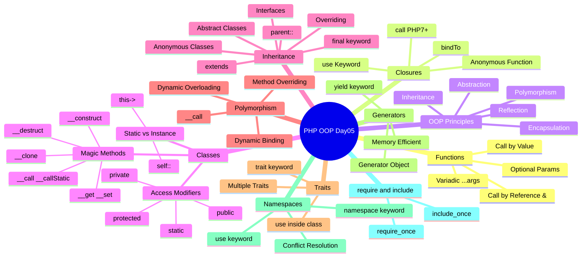

# الفصل الخامس — PHP OOP: من الـ Function لحد الـ Architecture
### *"لمّا الكود بيبقى له روح — الفصل اللي هيغيّر طريقة تفكيرك في البرمجة"*

> **المتطلبات:** الفصول السابقة — Variables، Arrays، Strings، وأنت شايف إزاي PHP بتشتغل على السيرفر. الفصل ده هيعلّيك من كاتب Scripts لـ مهندس بيصمّم Systems.

---

## البداية — المشكلة اللي خلت OOP ضرورة

تخيّل معايا السيناريو ده. سنة 2005، بتبني موقع لمتجر إلكتروني. عندك صفحة للمنتجات، صفحة للعملاء، صفحة للطلبات. كل صفحة فيها Functions منفصلة:

```php
// product_functions.php
function get_product_name($id) { ... }
function get_product_price($id) { ... }
function update_product_stock($id, $qty) { ... }

// customer_functions.php
function get_customer_name($id) { ... }
function get_customer_email($id) { ... }
function update_customer_address($id, $address) { ... }
```

بعد 6 شهور، الكود بقى 50 ملف وآلاف الـ Functions. حد في الفريق عمل Function اسمها `update()` في ملف وحد تاني عمل `update()` في ملف تاني. **Name Conflict**. أو أسوأ من كده — حد عدّل الـ Logic بتاع السعر في مكان ونسي يعدّله في الـ 3 أماكن التانية اللي بتحسب السعر.

> بدل ما تكتب نفس الـ Logic عشر مرات في عشر أماكن — **خلّيه في مكان واحد، بيتعامل مع نفسه**.

ده هو وعد الـ **Object-Oriented Programming**.

---

## ⚙️ Functions أولاً — الأساس اللي كل حاجة بتتبنى عليه

### تعريف الـ Functions في PHP

PHP فيها ميزة غريبة شوية — الـ Function Names **مش Case-Sensitive**!

```php
<?php
// PHP بتعرف الـ Function قبل ما توصلها — Hoisting جزئي
getSum(55, 55); // ← شغّالة حتى لو التعريف جاي بعد!

function getSum($x, $y) {
    $z = $x + $y;
    echo 'Sum is: ' . $z . "<br>";
}

// Case-Insensitive — كلاهما بيشتغل!
getsum(5, 10);   // ← شغّال
GETSUM(3, 3);    // ← شغّال كمان!
?>
```

> ⚠️ **انتبه:** رغم إن الـ Function Names مش Case-Sensitive، الـ Convention المتفق عليه إنك تستخدم `camelCase` للـ Functions وتفضل تكتبهم بنفس الطريقة دايمًا. الـ Methods جوّا الـ Classes حساسة لـ Best Practices.

---

### الـ Optional Parameters — "لو مجيتش هستخدم الـ Default"

```php
<?php
// $y=1 معناها لو ماعدّيتهاش هتبقى 1
function add($x, $y = 1) {
    echo 'Sum: ' . ($x + $y) . "<br>";
}

add(6);    // ← Sum: 7  (استخدم الـ Default)
add(6, 7); // ← Sum: 13 (Override الـ Default)
?>
```

قاعدة مهمة: الـ Optional Parameters لازم تيجي **بعد** الـ Required Parameters. مش منطقي تحط Optional قبل Required.

---

### الـ Variadic Functions — "عدد غير محدود من الـ Arguments"

PHP 5.6 جابت الـ `...` (Spread Operator) عشان تقبل عدد غير محدود من الـ Arguments.

```php
<?php
function variadic_func($nonVariadic, ...$args) {
    echo "الأول: " . $nonVariadic . "<br>";
    echo "الباقي: " . json_encode($args) . "<br>";
}

variadic_func("hello", 'rr', 20, 55, true);
// الأول: hello
// الباقي: ["rr",20,55,true]
?>
```

الـ `...$args` بيجمع كل الـ Arguments المتبقية في **Array** تلقائياً. تخيّل الفايدة: عملت Function `sum()` بتقبل أي عدد من الأرقام.

---

### Call by Value vs Call by Reference — "النسخة أو الأصل؟"

ده من أهم المفاهيم في أي لغة برمجة. تعالى نشوفه بالتفصيل.

```php
<?php
// ── Call by Value ────────────────────────────────────────────
// PHP بتعمل نسخة من الـ Variable وتبعتها للـ Function
// التغيير جوّا الـ Function مش بيأثر على الأصل

function incrementByValue($value, $amount = 1) {
    $value = $value + $amount; // ← بتعدّل النسخة، مش الأصل
}

$myNum = 10;
incrementByValue($myNum);
var_dump($myNum); // ← int(10) — الأصل ماتغيرش!

// ── Call by Reference ────────────────────────────────────────
// الـ & معناها "بعتلي الـ Variable نفسه مش نسخة منه"
// أي تغيير جوّا الـ Function بيأثر على الأصل

function incrementByRef(&$value, $amount = 1) {
    $value = $value + $amount; // ← بتعدّل الأصل مباشرةً
}

$myNum = 10;
incrementByRef($myNum);
var_dump($myNum); // ← int(11) — الأصل اتغيّر!
?>
```

```
Call by Value:
[myNum=10] → PHP تعمل نسخة → [copy=10] → Function تعدّل [copy=11]
[myNum=10] ← ماتغيرش ✅

Call by Reference:
[myNum=10] → PHP تبعت المؤشر للـ Address في الـ RAM
Function تعدّل المحتوى في الـ RAM مباشرةً
[myNum=11] ← اتغيّر! ✅
```

---

## 🎭 Closures — "الـ Function اللي مالهاش اسم"

### الفكرة

تخيّل معايا إنك محتاج تعمل Function صغيرة بسرعة وتبعتها كـ Argument لـ Function تانية، أو تخزّنها في Variable. مش محتاج تديها اسم — هي مؤقتة وبتتستخدم مرة واحدة.

اللي بيحصل هنا هو إن PHP بتعمل **Object من الـ `Closure` class** بدل ما تعمل Function عادية.

```php
<?php
// ← الـ Closure محفوظة في Variable — زي أي Object
$greet = function($name) {
    printf("Hello %s\r\n", $name);
}; // ← الـ Semicolon مهمة هنا! ده Statement مش Function Declaration

$greet('World');   // ← Hello World
$greet('Noha');    // ← Hello Noha

// تقدر تتحقق إنها Callable
var_dump(is_callable($greet)); // ← bool(true)
?>
```

---

### الـ `use` Keyword — "خلّيها تشوف العالم البرّاني"

المشكلة: الـ Closure عادةً مش بتقدر تشوف الـ Variables اللي برّاها. بتعيش في "فقاعة" منعزلة.

```php
<?php
$quantity = 1;

// ❌ بدون use — مش هتشوف $quantity
$calculator = function($number) {
    return $number + $quantity; // ← PHP Error: Undefined variable!
};

// ✅ مع use — بتجيب نسخة من $quantity
$calculator = function($number) use($quantity) {
    return $number + $quantity;
};

var_dump($calculator(7)); // ← int(8)

// ⚠️ مهم: use بياخد نسخة مش Reference
$quantity = 100; // عدّلنا الـ Value
var_dump($calculator(7)); // ← int(8) لسه! لأن الـ Closure شايلة النسخة القديمة

// لو عايز Reference: use(&$quantity)
$calcRef = function($number) use(&$quantity) {
    return $number + $quantity;
};
var_dump($calcRef(7)); // ← int(107) هتشوف التغيير
?>
```

---

### Closures والـ Classes — "الربط العميق"

#### bindTo() — "اربط الـ Closure بـ Object"

```php
<?php
class MyClass {
    public $publicProp  = "Public Value";
    private $privateProp = "Private Value";

    public function __construct($val) {
        $this->publicProp = $val;
    }
}

// ── الـ Closure دي مش جوّا أي Class ──────────────────────────
$myClosure = function() {
    echo $this->publicProp . "<br>"; // ← $this هيتحدد بعدين
};

$obj = new MyClass("Hello from Closure");

// ── bindTo: اربط الـ Closure بالـ Object ──────────────────────
$boundClosure = $myClosure->bindTo($obj);
$boundClosure(); // ← "Hello from Closure"

// ── للـ Private Properties: لازم تحدد الـ Scope ───────────────
$privateClosure = function() {
    echo $this->privateProp . "<br>"; // ← Private!
};

// الـ Argument التاني بيحدد الـ Scope (يعني "ادخل الـ Class")
$boundPrivate = $privateClosure->bindTo($obj, MyClass::class);
$boundPrivate(); // ← "Private Value" ✅

// ── call(): أسهل وأنظف من bindTo في PHP 7+ ────────────────────
$privateClosure->call($obj); // ← نفس النتيجة، كود أقل
?>
```

#### تعريف Closure جوّا Class

```php
<?php
class NewClass {
    private $prop;

    public function __construct($val) {
        $this->prop = $val;
    }

    // الـ Method بترجع Closure
    public function display() {
        // الـ Closure دي بتشوف $this تلقائياً لأنها جوّا الـ Class
        return function() {
            echo $this->prop . "<br>"; // ← Private Access ✅
        };
    }
}

$obj = new NewClass("Hello World");
$display = $obj->display(); // ← جاب الـ Closure
$display(); // ← "Hello World"
?>
```

---

## 🏛️ Object-Oriented Programming — "بناء العالم بالكائنات"

### الـ 5 مبادئ اللي PHP بتدعمها

```
┌─────────────────────────────────────────────────────────────┐
│                    OOP في PHP                               │
│                                                             │
│  1. Encapsulation   → تغليف البيانات والـ Methods           │
│  2. Inheritance     → الوراثة من Class لـ Class             │
│  3. Polymorphism    → نفس الاسم، سلوك مختلف                │
│  4. Abstraction     → إخفاء التفاصيل، إظهار الجوهر         │
│  5. Reflection      → الـ Class يعرف نفسه في الـ Runtime   │
└─────────────────────────────────────────────────────────────┘
```

---

### Classes — "المصنع اللي بيطلع الـ Objects"

تخيّل الـ Class زي **قالب الكيك**. القالب نفسه مش كيك — هو التصميم. الـ Object هو الكيك الفعلي اللي طلع من القالب. تقدر تعمل كيكات كتير من نفس القالب، كل واحدة مختلفة في التفاصيل.

```php
<?php
class Person {
    // ── الـ Properties (الصفات) ────────────────────────────────
    public $name;           // ← أي حد يقدر يشوفها ويعدّلها
    private $first_name;    // ← بس الـ Class نفسها
    protected $last_name;   // ← الـ Class والـ Subclasses

    // ── الـ Methods (الأفعال) ──────────────────────────────────
    public function sayHello() {
        // $this = المؤشر للـ Object الحالي
        echo "Hello " . $this->name;
    }

    private function secretMethod() {
        // مش ممكن تُستدعى من بره الـ Class
        echo "This is private";
    }
}

// إنشاء Object (Instance) من الـ Class
$p = new Person();
$p->name = "Noha"; // ← public property: تقدر تعدّلها
$p->sayHello();    // ← "Hello Noha"
?>
```

---

### Access Modifiers — "حارس البوّابة"

| Modifier | من جوّا الـ Class | من الـ Subclass | من بره الـ Class |
|---|---|---|---|
| `public` | ✅ | ✅ | ✅ |
| `protected` | ✅ | ✅ | ❌ |
| `private` | ✅ | ❌ | ❌ |
| `static` | بـ `self::` | بـ `parent::` | بـ `ClassName::` |

---

### Constructor والـ Destructor — "الميلاد والوفاة"

```php
<?php
class Person {
    private $first_name;
    private $last_name;

    // __construct بيتشغّل تلقائياً عند new Person(...)
    public function __construct($first, $last) {
        $this->first_name = $first; // ← تهيئة الـ Properties
        $this->last_name  = $last;
        echo "تم إنشاء الـ Person: $first $last <br>";
    }

    // __destruct بيتشغّل لمّا الـ Object بيتشال من الـ RAM
    public function __destruct() {
        echo "تم حذف الـ Person: {$this->first_name} <br>";
    }
}

$p = new Person("Noha", "Shehab"); // ← __construct بيشتغل
// ... بتستخدم الـ Object
unset($p); // ← __destruct بيشتغل هنا
// أو لمّا الـ Script خلصت، PHP بتحذف كل الـ Objects تلقائياً
?>
```

---

### Magic Methods __get() و __set() — "الـ Setters والـ Getters الديناميكية"

```php
<?php
class Person {
    private $data = []; // ← بنخزّن كل الـ Properties هنا

    // بيتشغّل لمّا حد يحاول يكتب Property غير موجودة
    public function __set($name, $value) {
        $this->data[$name] = $value;
    }

    // بيتشغّل لمّا حد يحاول يقرأ Property غير موجودة
    public function __get($name) {
        return $this->data[$name] ?? null;
    }
}

$p = new Person();
$p->track = "opensource"; // ← __set بيتشغّل
echo $p->track;           // ← __get بيشتغّل → "opensource"
?>
```

---

### Static Methods والـ Constants — "بتاع الـ Class مش بتاع الـ Object"

تخيّل الـ Static Member زي الـ **إعلانات على الحيطة** في الشركة. مش محتاج موظف معيّن عشان تقراها — الإعلانات للشركة كلها.

```php
<?php
class Math {
    // Constants: Static بطبيعتها، مش بتتغيّر
    const PI = 3.14159;

    // Static Property: بتاعة الـ Class مش الـ Object
    public static $mul = 1;

    // Static Method: مش محتاج new Math()
    public static function squared($input) {
        return $input * $input;
    }

    public function testSelf() {
        // جوّا الـ Class: self:: للـ Static، $this-> للـ Instance
        echo self::PI;       // ← للـ Constant
        echo self::$mul;     // ← للـ Static Property
    }
}

// من بره الـ Class: ClassName::
echo Math::PI;           // ← 3.14159
echo Math::squared(8);   // ← 64
echo Math::$mul;         // ← 1
?>
```

**القاعدة:**
- `$this->` → للـ Instance Members (Properties وMethods عادية)
- `self::` → للـ Static Members وConstants **من جوّا** الـ Class
- `ClassName::` → من **بره** الـ Class

---

## 🌳 Inheritance — "الوارث والمورّث"

### الفكرة

PHP بتدعم **Single Inheritance** بس — كل Class تقدر ترث من Class واحدة بس. زي إنك بترث من أبوك مباشرةً، مش ممكن يكون عندك أبوين.

```php
<?php
class Person {
    public $name;

    public function callingPerson() {
        echo "أنا إنسان — {$this->name} <br>";
    }
}

// Student بترث كل حاجة من Person
class Student extends Person {
    public $level;

    public function callingStudent() {
        echo "أنا طالب في Level {$this->level} <br>";
    }
}

$std = new Student();
$std->name  = "Omar";  // ← ورثها من Person
$std->level = 1;

$std->callingPerson();  // ← ورثها من Person ✅
$std->callingStudent(); // ← بتاعتها هي ✅
?>
```

---

### parent:: — "احترم الوالدين"

لمّا الـ Child Class عندها Constructor، لازم تستدعي Constructor الـ Parent يدوياً لو احتاجت.

```php
<?php
class Person {
    public $name;

    public function __construct($name) {
        $this->name = $name;
        echo "تم إنشاء Person: $name <br>";
    }
}

class Student extends Person {
    public $level;

    public function __construct($name, $level) {
        parent::__construct($name); // ← استدعاء Constructor الـ Parent أولاً
        $this->level = $level;
        echo "تم إنشاء Student: $name, Level $level <br>";
    }
}

$std = new Student("Omar", 1);
// تم إنشاء Person: Omar
// تم إنشاء Student: Omar, Level 1
?>
```

---

### Method Overriding — "اعمل اللي تشوفه صح"

```php
<?php
class Person {
    public function say_hello() {
        echo "Hello من Person <br>";
    }
}

class Student extends Person {
    // Override: نفس الاسم، implementation مختلفة
    public function say_hello() {
        echo "Hello من Student <br>";
        // لو عايز تستدعي الـ Parent's version كمان:
        // parent::say_hello();
    }
}

$p = new Person();
$p->say_hello(); // ← "Hello من Person"

$s = new Student();
$s->say_hello(); // ← "Hello من Student"
?>
```

---

### الـ `final` Keyword — "هنا بتوقف"

```php
<?php
class Machine {
    public function sayHello() {
        echo "أنا آلة <br>";
    }
}

class Transportation extends Machine {
    // final method: ما ينفعش تتـ Override في أي Subclass
    final public function canMove() {
        echo "أنا بتحرك <br>";
    }
}

// final class: ما ينفعش تتـ Extended خالص
final class Car extends Transportation {
    public $model;

    public function sayHello() {
        parent::sayHello(); // ← ممكن تستدعي الـ Parent
        echo "Called from Car <br>";
    }
}

// ❌ مينفعش! Car هي final
// class ElectricCar extends Car { }
?>
```

---

### Abstract Classes — "الـ Template اللي مكملتش"

الـ Abstract Class زي **مخطط معماري ناقص**. المخطط بيقولك "لازم يكون فيه باب وشبابيك" بس ما بيحددش شكلهم. الـ Class الوارثة هي اللي بتكمل التفاصيل.

```php
<?php
// مينفعش تعمل new Base() مباشرةً — هو Abstract
abstract class Base {
    public function __construct() {
        echo "<br><b>Abstract Class Constructor</b>";
    }

    // Abstract Method: لازم أي Class بترث منه تـ Implement هذا
    abstract public function printData();

    // ممكن تكون فيه Methods عادية كمان
    public function commonMethod() {
        echo "<br>This is a common method";
    }
}

class Derived extends Base {
    public function __construct() {
        echo "<br><b>Derived Class Constructor</b>";
        Base::__construct(); // ← استدعاء الـ Abstract Constructor
    }

    // إجبارية: لازم تـ Implement printData
    public function printData() {
        echo "<br><b>Derived Class printData</b>";
    }
}

$b1 = new Derived();
$b1->printData();
$b1->commonMethod();
?>
```

---

### Interfaces — "العقد الملزم"

الـ Interface أشد من الـ Abstract Class. هو **عقد** بيقول "أي Class بتـ Implement المنا لازم تتكلم هذه اللغة بالظبط".

```php
<?php
// Interface: كل الـ Methods Public وAbstract تلقائياً
interface Transportation {
    public function setModel($model);
    public function setYear($year);
    public function getDescription(): string;
}

// Class تقدر تـ Implement أكتر من Interface (حل مشكلة الـ Single Inheritance)
interface Electric {
    public function getRange(): int;
}

class Car implements Transportation, Electric {
    private $model;
    private $year;
    private $range;

    public function setModel($model) {
        $this->model = $model;
    }

    public function setYear($year) {
        $this->year = $year;
    }

    public function getDescription(): string {
        return "{$this->model} ({$this->year})";
    }

    public function getRange(): int {
        return $this->range ?? 0;
    }
}

$car = new Car();
$car->setModel("Tesla Model 3");
$car->setYear(2024);
echo $car->getDescription(); // ← "Tesla Model 3 (2024)"
?>
```

| | Abstract Class | Interface |
|---|---|---|
| الـ Methods | ممكن فيها Implementation | مفيش Implementation |
| الـ Properties | ممكن فيها Properties | ❌ مفيش Properties |
| Inheritance | واحدة بس | متعددة ✅ |
| مناسب لـ | Base Template مشترك | Contract إجباري |

---

### Anonymous Classes — "الـ Object اللي ما اتسماش"

PHP 7 جاب الـ Anonymous Classes عشان تعمل Object سريع بدون ما تعرّف Class كاملة.

```php
<?php
interface DisplayMsg {
    public function printMsg(string $msg);
}

class Application {
    private $displayer;

    public function getDisplayer(): DisplayMsg {
        return $this->displayer;
    }

    public function setPrinter(DisplayMsg $dismsg) {
        $this->displayer = $dismsg;
    }
}

$app = new Application();

// ← بدل ما نعمل Class منفصلة، بنعمل Anonymous Class هنا مباشرةً
$app->setPrinter(new class implements DisplayMsg {
    public function printMsg(string $msg) {
        echo $msg . "<br>";
    }
});

$app->getDisplayer()->printMsg("My first Log Message using Anonymous Class");
// ← "My first Log Message using Anonymous Class"
?>
```

---

## 🦜 Polymorphism — "نفس الرسالة، ردود مختلفة"

### Method Overriding (Dynamic Binding)

الـ Polymorphism معناه إنك تبعت نفس الـ "رسالة" لـ Objects مختلفة وكل Object يرد بطريقته.

```php
<?php
interface Animals {
    public function makeNoise();
}

class Cat implements Animals {
    public function makeNoise() {
        echo "<br>Meowww 🐱";
    }
}

class Dog implements Animals {
    public function makeNoise() {
        echo "<br>Bark! Bark! 🐶";
    }
}

class Person {
    const CAT = 'cat';
    const DOG = 'dog';

    private $petPreference;
    private $pet;

    public function isCatLover(): bool {
        return $this->petPreference === Person::CAT;
    }

    public function isDogLover(): bool {
        return $this->petPreference === self::DOG;
    }

    public function setPreference(string $pref) {
        $this->petPreference = $pref;
    }

    // Type Hinting: بس يقبل Objects بتـ Implement Animals
    public function setPet(Animals $pet) {
        $this->pet = $pet;
    }

    public function getPet(): Animals {
        return $this->pet;
    }
}

$person = new Person();
$person->setPreference(Person::DOG);

if ($person->isDogLover()) {
    $person->setPet(new Dog());
}

// نفس الـ Method الاسم — سلوك مختلف حسب الـ Object
$person->getPet()->makeNoise(); // ← "Bark! Bark! 🐶"
?>
```

---

### Dynamic Overloading — __call() و__callStatic()

```php
<?php
class phpClass {
    // بيتشغّل لمّا حد يستدعي Method غير موجودة على الـ Object
    public function __call($name, $arguments) {
        echo "Calling object method '$name' "
           . implode(', ', $arguments) . "<br>";
    }

    // بيتشغّل لمّا حد يستدعي Static Method غير موجودة
    public static function __callStatic($name, $arguments) {
        echo "Calling static method '$name' "
           . implode(', ', $arguments) . "<br>";
    }
}

$obj = new phpClass();

// الـ Methods دي مش موجودة — __call هيتشغّل
$obj->runTest('in object context');
// ← "Calling object method 'runTest' in object context"

phpClass::runTest('in static context');
// ← "Calling static method 'runTest' in static context"
?>
```

---

### Cloning — "نسخة... بس مش نفس الشيء"

```php
<?php
class Product {
    public $name;
    public $category;
}

$original = new Product();
$original->name     = "Apple";
$original->category = "Fruit";

// ← clone بيعمل Shallow Copy
$cloned = clone $original;
$cloned->name     = "Orange"; // ← بيعدّل النسخة بس
$cloned->category = "Citrus";

print_r($original); // Product Object ( [name] => Apple [category] => Fruit )
print_r($cloned);   // Product Object ( [name] => Orange [category] => Citrus )
?>
```

> ⚠️ **انتبه:** الـ `clone` بيعمل **Shallow Copy**. يعني لو عندك Property هي Object تانية، الـ Clone والـ Original هيشاركوا نفس الـ Object الداخلية. عشان تعمل **Deep Copy** حقيقية، لازم تـ Override الـ `__clone()` Method وتعمل Clone يدوي للـ Nested Objects.

---

## 🧩 Traits — "الـ Copy-Paste المنظّم"

### المشكلة

PHP بتدعم Single Inheritance. بس تخيّل معايا إنك عندك:
- `AdminUser` يحتاج `LoggingBehavior` و`AuthBehavior`
- `ApiClient` يحتاج `LoggingBehavior` و`HttpBehavior`

الـ Logging مشترك بينهم! بس مش ممكن يرثوا من نفس الـ Class لأن كل واحد عنده Parent تانية.

الحل: **Traits** — زي إنك بتـ "إلصق" كود جاهز في أي Class.

```php
<?php
trait Hello {
    public function sayHello() {
        echo '<br>Hello ';
    }
}

trait World {
    public function sayWorld() {
        echo 'World!';
    }
}

// ← استخدام أكتر من Trait في نفس الوقت
class MyHelloWorld {
    use Hello, World; // ← كأنك نسخت الـ Methods دي هنا

    public function sayExclamationMark() {
        echo '!';
    }
}

$o = new MyHelloWorld();
$o->sayHello();            // ← من الـ Hello Trait
$o->sayWorld();            // ← من الـ World Trait
$o->sayExclamationMark();  // ← بتاعتها هي
?>
```

---

### مثال عملي — Logging Trait

```php
<?php
trait Logging {
    private $logs = [];

    public function log(string $message) {
        $timestamp    = date('Y-m-d H:i:s');
        $this->logs[] = "[$timestamp] $message";
        echo "LOG: $message <br>";
    }

    public function getLogs(): array {
        return $this->logs;
    }
}

trait Validation {
    public function validateEmail(string $email): bool {
        return (bool) filter_var($email, FILTER_VALIDATE_EMAIL);
    }
}

// ← Class بترث من Parent وبتستخدم Traits في نفس الوقت
class UserService extends BaseService {
    use Logging, Validation; // ← أكتر من Trait

    public function createUser(string $name, string $email) {
        if (!$this->validateEmail($email)) {
            $this->log("Failed to create user — invalid email: $email");
            return false;
        }
        $this->log("User created: $name ($email)");
        return true;
    }
}
?>
```

---

## 🔄 Generators — "الـ Magic اللي بتوفر الـ Memory"

### المشكلة

تخيّل معايا السيناريو المرعب ده: محتاج تعالج **مليون رقم عشوائي**. الطريقة التقليدية:

```php
<?php
// ❌ الطريقة الغلط — بتحشو كل الـ RAM
function randomNumbers_OLD($length) {
    $array = [];
    for ($i = 0; $i < $length; $i++) {
        $array[] = mt_rand(1, 10); // ← بتضيف للـ Array في الـ RAM
    }
    return $array; // ← مليون عنصر في الـ RAM دفعة واحدة!
}

// randomNumbers_OLD(1000000) ← ~33 Megabyte في الـ RAM!
?>
```

```php
<?php
// ✅ الطريقة الصح — Generator
function randomNumbers($length) {
    for ($i = 0; $i < $length; $i++) {
        yield mt_rand(1, 100); // ← بدل return: بتوقف وبترجع قيمة
        // بعد ما foreach يطلب القيمة الجاية، بتكمل من هنا
    }
}
// الـ Function دي بترجع Generator Object — مش Array!
// الـ Generator Object بياخد ~1 Kilobyte بس!

$genObj = randomNumbers(10);
foreach ($genObj as $num) {
    echo $num . "<br>"; // ← بيولّد رقم واحد في كل مرة
}
?>
```

### كيف الـ `yield` بيشتغل؟

```
foreach يطلب القيمة الأولى
         ↓
Generator يبدأ التشغيل: i=0
         ↓
yield mt_rand() ← توقف وإرجاع القيمة
         ↓
foreach يستقبل القيمة ويعملها echo
         ↓
foreach يطلب القيمة التانية
         ↓
Generator بيكمل من بعد الـ yield: i=1
         ↓
وهكذا... ✅
```

الـ Generator زي **صنبور المياه** — بيفتح ويدي شوية ماء، يقفل، بعدين بيفتح تاني. مش زي **دلو** بتملاه كله الأول.

---

## 📦 Reflection — "الـ Class تتأمل في نفسها"

### الفكرة

الـ Reflection بيخلي الكود يفحص نفسه في الـ Runtime. يعني تقدر تسأل Class: "إيه الـ Methods اللي عندك؟ إيه الـ Properties؟"

```php
<?php
class OpenSource {
    private $instructor;
    protected $sub_tracks;
    public $list_of_courses;
    const PI = 3.1415;

    public function __construct() {
        $this->instructor    = "Noha";
        $this->sub_tracks    = "Application";
        $this->list_of_courses = ["Python", "PHP", "Laravel"];
    }

    public function getInstructor() { return $this->instructor; }
    public function setInstructor($i) { $this->instructor = $i; }
    private function getSubTracks() { return $this->sub_tracks; }
}

// ── الـ ReflectionClass ──────────────────────────────────────
$ref = new ReflectionClass("OpenSource");

// إيه الـ Methods الموجودة؟
echo "<h3>Methods:</h3>";
foreach ($ref->getMethods() as $method) {
    echo $method->getName() . " — " . 
         ($method->isPublic() ? "Public" : ($method->isPrivate() ? "Private" : "Protected")) 
         . "<br>";
}

// إيه الـ Properties؟
echo "<h3>Properties:</h3>";
foreach ($ref->getProperties() as $prop) {
    echo $prop->getName() . "<br>";
}

// إيه الـ Constants؟
echo "<h3>Constants:</h3>";
print_r($ref->getConstants());
?>
```

---

## 🗂️ Namespaces — "تجنّب التعارض في الأسماء"

### المشكلة

تخيّل إنك بتستخدم Library خارجية وهي عندها Class اسمها `Database`. وانت كمان عندك Class اسمها `Database`. **Name Conflict!**

الحل: **Namespaces** — زي الـ "اسم المنطقة" اللي بييجي قبل الاسم.

```php
<?php
// ── ملف: MyApp/Database.php ──────────────────────────────────
namespace MyApp;

class Database {
    public function connect() {
        echo "Connecting to MyApp Database <br>";
    }
}
```

```php
<?php
// ── ملف: ThirdParty/Database.php ─────────────────────────────
namespace ThirdParty;

class Database {
    public function connect() {
        echo "Connecting to ThirdParty Database <br>";
    }
}
```

```php
<?php
// ── ملف: index.php ───────────────────────────────────────────
require "MyApp/Database.php";
require "ThirdParty/Database.php";

// ← بدون Namespace، هيبقى Conflict
// مع Namespaces، الاسم الكامل (Fully Qualified Name)
$myDb      = new \MyApp\Database();
$thirdDb   = new \ThirdParty\Database();

$myDb->connect();    // ← "Connecting to MyApp Database"
$thirdDb->connect(); // ← "Connecting to ThirdParty Database"

// ── use keyword: عشان ما تكتبش الاسم الكامل كل مرة ──────────
use MyApp\Database as AppDB;
$db = new AppDB();
$db->connect();
?>
```

---

### require و include — "جزء من الحكاية"

```php
<?php
// include(): لو الملف مش موجود، Warning بس والكود بيكمل
include "helpers.php";

// require(): لو الملف مش موجود، Fatal Error والكود بيوقف
require "config.php"; // ← لو الـ Config مش موجود، مكملش!

// _once: بتتأكد إن الملف مش اتحمّل قبل كده
require_once "Database.php"; // ← بيتحمّل مرة واحدة بس
include_once "utils.php";
?>
```

---

## 🗺️ خريطة الـ PHP Day 05 كاملة



---

## ✅ Checkpoint — أسئلة إنترفيو OOP

**س: إيه الفرق بين Abstract Class وInterface في PHP؟**
> الـ Abstract Class ممكن فيها Methods عندها Implementation وممكن فيها Properties، والـ Class بترث منها بـ `extends`. الـ Interface مفيهاش أي Implementation وكل الـ Methods فيها Public وAbstract تلقائياً، والـ Class بتـ Implement بـ `implements`. الفرق العملي: Class تقدر تـ `extends` Abstract Class واحدة بس، بس تقدر تـ `implements` Interfaces متعددة — وده بيحل مشكلة الـ Single Inheritance في PHP.

**س: إيه الفرق بين `$this` و`self` في PHP؟**
> `$this` هو المؤشر للـ **Object الحالي** في الـ Runtime — بيُستخدم للـ Instance Properties والـ Methods. `self` هو المؤشر للـ **Class نفسها** وقت الـ Compilation — بيُستخدم للـ Static Properties والـ Constants. قاعدة: `$this->property` للـ Instance، `self::$property` للـ Static، `self::CONSTANT` للـ Constants.

**س: إيه الـ Closure وامتى تستخدمها؟**
> الـ Closure هي Anonymous Function — Object من الـ `Closure` class بتتخزّن في Variable أو بتتبعت كـ Argument. بتستخدمها لمّا تحتاج تعمل Function صغيرة مؤقتة (Callbacks في `array_map`, `usort`) أو لمّا تريد تـ Capture variables من الـ Scope الخارجي بـ `use`. هي أساس الـ Functional Programming في PHP.

**س: إيه الـ Generators ولماذا هم مهمون؟**
> الـ Generator هو Function فيها `yield` بدل `return`. بدل ما ترجع كل البيانات دفعة واحدة في Array (وتملأ الـ RAM)، الـ Generator بيولّد قيمة واحدة في كل مرة بيطلبوها. مفيد جداً لمّا بتتعامل مع ملفات ضخمة أو بيانات كتيرة — ممكن توفّر 90%+ من استهلاك الـ Memory.

**س: إيه الـ Traits وامتى تستخدمها؟**
> الـ Trait هو مجموعة Methods تقدر "تلصقها" في أي Class عبر `use`. بيحل مشكلة إنك عايز تشارك كود بين Classes مختلفة مش بترث من بعضها. مثال: `LoggingTrait` تقدر تستخدمه في `UserService` و`OrderService` و`PaymentService` من غير ما يرثوا من بعض. الـ Trait مينفعش يتـ Instantiate لوحده.

**س: إيه أكبر غلطة الـ Juniors بيعملوها في الـ OOP؟**
> الغلطة الأكبر هي عدم تطبيق مبدأ **Single Responsibility** — بيعملوا Class بتعمل كل حاجة. الـ Class المثالية المفروض تكون مسؤولة عن شيء واحد بس. الغلطة التانية هي الاعتماد على `public` للكل بدل استخدام `private`/`protected` صح — وده بيكسر الـ Encapsulation.

---

## 🛠️ حل اللاب عملي على أوبونتو

### المطلوب: Database Class بـ PDO

Lab 05 بيطلب Class اسمها `Database` بيها: `connect()`, `insert()`, `select()`, `update()`, `delete()`.

---

### الملف الأول: `Database.php`

```php
<?php
namespace App\Database;

/**
 * Database Class — Wrapper for PDO
 * بتوفّر CRUD Operations نظيفة وآمنة
 */
class Database {
    private \PDO $pdo;          // ← الـ PDO Connection Object
    private bool $connected = false;

    /**
     * connect() — بتعمل الاتصال بالـ Database
     */
    public function connect(
        string $host,
        string $dbname,
        string $username,
        string $password,
        string $charset = 'utf8mb4'
    ): bool {
        try {
            // DSN = Data Source Name
            $dsn = "mysql:host={$host};dbname={$dbname};charset={$charset}";

            $options = [
                \PDO::ATTR_ERRMODE            => \PDO::ERRMODE_EXCEPTION,   // ← ارمي Exception لو في Error
                \PDO::ATTR_DEFAULT_FETCH_MODE => \PDO::FETCH_ASSOC,         // ← ارجع Associative Array
                \PDO::ATTR_EMULATE_PREPARES   => false,                      // ← Prepared Statements حقيقية
            ];

            $this->pdo       = new \PDO($dsn, $username, $password, $options);
            $this->connected = true;

            echo "✅ تم الاتصال بالـ Database بنجاح <br>";
            return true;

        } catch (\PDOException $e) {
            // مش بنطبع الـ Error Message مباشرةً في Production (أمان)
            error_log("DB Connection Error: " . $e->getMessage());
            echo "❌ فشل الاتصال بالـ Database <br>";
            return false;
        }
    }

    /**
     * insert() — إدراج سجل جديد
     * @param string $table  اسم الـ Table
     * @param array  $data   ['column' => 'value']
     * @return int|false     الـ ID بتاع السجل الجديد أو false
     */
    public function insert(string $table, array $data): int|false {
        $this->ensureConnected();

        // بناء الـ SQL Query ديناميكياً
        $columns      = implode(', ', array_keys($data));                       // ← name, email, age
        $placeholders = implode(', ', array_fill(0, count($data), '?'));        // ← ?, ?, ?

        $sql  = "INSERT INTO `{$table}` ({$columns}) VALUES ({$placeholders})";
        $stmt = $this->pdo->prepare($sql); // ← Prepared Statement — آمن من SQL Injection

        if ($stmt->execute(array_values($data))) {
            $lastId = (int) $this->pdo->lastInsertId();
            echo "✅ تم الإدراج بنجاح — ID: {$lastId} <br>";
            return $lastId;
        }

        return false;
    }

    /**
     * select() — استرجاع البيانات
     * @param string $table   اسم الـ Table
     * @param array  $conditions شروط الـ WHERE ['column' => 'value'] (اختياري)
     * @param string $columns الأعمدة المطلوبة (الافتراضي: *)
     * @return array
     */
    public function select(
        string $table,
        array $conditions = [],
        string $columns = '*'
    ): array {
        $this->ensureConnected();

        $sql    = "SELECT {$columns} FROM `{$table}`";
        $params = [];

        if (!empty($conditions)) {
            $whereParts = [];
            foreach ($conditions as $col => $val) {
                $whereParts[] = "`{$col}` = ?";
                $params[]     = $val;
            }
            $sql .= " WHERE " . implode(' AND ', $whereParts);
        }

        $stmt = $this->pdo->prepare($sql);
        $stmt->execute($params);

        $results = $stmt->fetchAll();
        echo "✅ تم جلب " . count($results) . " سجل <br>";
        return $results;
    }

    /**
     * update() — تحديث سجل
     * @param string $table  اسم الـ Table
     * @param int    $id     الـ ID بتاع السجل
     * @param array  $data   ['column' => 'new_value']
     * @return bool
     */
    public function update(string $table, int $id, array $data): bool {
        $this->ensureConnected();

        $setParts = [];
        $params   = [];

        foreach ($data as $col => $val) {
            $setParts[] = "`{$col}` = ?";
            $params[]   = $val;
        }

        $params[] = $id; // ← الـ ID في الآخر للـ WHERE

        $sql  = "UPDATE `{$table}` SET " . implode(', ', $setParts) . " WHERE `id` = ?";
        $stmt = $this->pdo->prepare($sql);

        if ($stmt->execute($params)) {
            echo "✅ تم التحديث بنجاح — Rows Affected: " . $stmt->rowCount() . " <br>";
            return true;
        }

        return false;
    }

    /**
     * delete() — حذف سجل
     * @param string $table اسم الـ Table
     * @param int    $id    الـ ID بتاع السجل المراد حذفه
     * @return bool
     */
    public function delete(string $table, int $id): bool {
        $this->ensureConnected();

        $sql  = "DELETE FROM `{$table}` WHERE `id` = ?";
        $stmt = $this->pdo->prepare($sql);

        if ($stmt->execute([$id])) {
            echo "✅ تم الحذف بنجاح — Rows Affected: " . $stmt->rowCount() . " <br>";
            return true;
        }

        return false;
    }

    /**
     * ensureConnected() — متابعة إن الاتصال شغّال
     */
    private function ensureConnected(): void {
        if (!$this->connected) {
            throw new \RuntimeException("❌ الـ Database مش متصل! استدعي connect() الأول.");
        }
    }

    /**
     * getPdo() — لو احتجت الـ PDO Object مباشرةً لـ Raw Queries
     */
    public function getPdo(): \PDO {
        $this->ensureConnected();
        return $this->pdo;
    }
}
```

---

### الملف التاني: `test_database.php`

```php
<?php
require_once 'Database.php';

use App\Database\Database;

// ── إنشاء الـ Database Object ─────────────────────────────────
$db = new Database();

// ── الاتصال ──────────────────────────────────────────────────
$db->connect(
    host:     'localhost',
    dbname:   'iti_lab05',
    username: 'root',
    password: 'your_password'
);

// ── INSERT ────────────────────────────────────────────────────
$newId = $db->insert('students', [
    'name'  => 'Noha Shehab',
    'email' => 'nshehab@iti.gov.eg',
    'level' => 1,
]);
// ✅ تم الإدراج بنجاح — ID: 1

// ── SELECT (كل السجلات) ───────────────────────────────────────
$allStudents = $db->select('students');
print_r($allStudents);

// ── SELECT (بشرط) ─────────────────────────────────────────────
$levelOne = $db->select('students', ['level' => 1]);
print_r($levelOne);

// ── UPDATE ────────────────────────────────────────────────────
$db->update('students', $newId, [
    'name'  => 'Noha M. Shehab',
    'level' => 2,
]);
// ✅ تم التحديث بنجاح — Rows Affected: 1

// ── DELETE ────────────────────────────────────────────────────
$db->delete('students', $newId);
// ✅ تم الحذف بنجاح — Rows Affected: 1
?>
```

---

### إعداد الـ Database على Ubuntu

```bash
# ── تثبيت MySQL لو مش موجود ──────────────────────────────────
sudo apt update
sudo apt install mysql-server php8.2-mysql -y

# ── إنشاء الـ Database والـ Table ────────────────────────────
sudo mysql -u root -p << 'EOF'
CREATE DATABASE IF NOT EXISTS iti_lab05;
USE iti_lab05;

CREATE TABLE IF NOT EXISTS students (
    id    INT AUTO_INCREMENT PRIMARY KEY,
    name  VARCHAR(100) NOT NULL,
    email VARCHAR(150) UNIQUE NOT NULL,
    level TINYINT DEFAULT 1,
    created_at TIMESTAMP DEFAULT CURRENT_TIMESTAMP
);

-- إنشاء User آمن للـ Application (مش root!)
CREATE USER IF NOT EXISTS 'iti_user'@'localhost' IDENTIFIED BY 'SecurePass123!';
GRANT SELECT, INSERT, UPDATE, DELETE ON iti_lab05.* TO 'iti_user'@'localhost';
FLUSH PRIVILEGES;
EOF

# ── تأكد إن الـ PDO MySQL Extension شغّال ────────────────────
php -m | grep pdo
# لازم تلاقي: pdo_mysql

# ── لو مش موجود ───────────────────────────────────────────────
sudo apt install php8.2-mysql -y
sudo systemctl restart php8.2-fpm

# ── تشغيل الـ Test ────────────────────────────────────────────
cd /var/www/html/lab05
php test_database.php
```

---

## 🫒 زتونة الإنترفيو

> **"الـ PHP OOP بتدور حول 5 مبادئ: Encapsulation بتغلّف الـ Data والـ Logic، Inheritance بتخلّي الـ Classes ترث من بعض مع الأخذ في الاعتبار إن PHP Single Inheritance بس، Polymorphism بيخلّي نفس الـ Method يتصرف بشكل مختلف حسب الـ Object، Abstraction بتخفي التعقيد وتظهر الجوهر عبر Abstract Classes والـ Interfaces، والـ Reflection بيخلّي الكود يعرف نفسه في الـ Runtime. لحل مشكلة الـ Single Inheritance، PHP عندها Interfaces (بتتـ Implement أكتر من واحدة) وTraits (بتـ Reuse الـ Code من غير Inheritance). الـ Closures هي Anonymous Functions بيتخزّنوا في Variables وبيقدروا يـ Capture الـ External Variables بـ use، والـ Generators بيوفّروا الـ Memory بدل ما يولّدوا كل البيانات دفعة واحدة."**

---

*Next → الفصل السادس — PHP & MySQL مع PDO: الـ Prepared Statements والـ Transactions — هنبني فوق الـ Database Class اللي عملناها ونضيفلها Transactions وError Handling احترافي، ونشوف ليه الـ Raw Queries خطر أمني حقيقي على أي Production System.*
