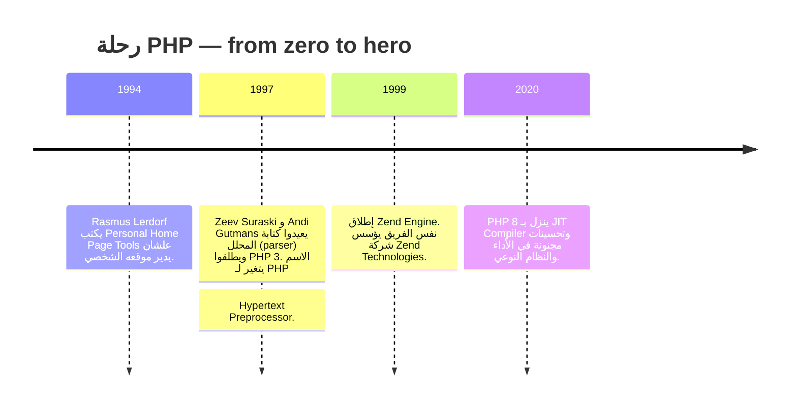

# الفصل الأول — PHP: إزاي تبدأ وتفهم اللعبة من الأوّل

> **المتطلبات:** صفر. معاك كمبيوتر وإنترنت وفضول.  
> الفصل ده هو بوابتك علشان تفهم يعني إيه ويب ديناميكي بجدّ.  
> مش هنتكلم عن framework ولا حاجة متقدمة — هنبدأ من تحت الصفر: إزاي السيرفر بيرد عليك، وإزاي تكتب أوّل سكريبت PHP يشوفه العالم.

---

## البداية — إزاي PHP أصلاً جت؟

تخيل معايا إنك في سنة 1994. الإنترنت كان لسه في الحضانة. المواقع كانت عبارة عن صفحات HTML ميتة — يعني حرفياً ميتة. تزور الموقع، تشوف نفس الصفحة. مش فيه "أهلاً يا فلان"، مش فيه سلة مشتريات، مش فيه أي حاجة بتتغير حسب اللي إنت عامله.

المشكلة مكانتش إن الـ HTML وحش. المشكلة كانت أعمق:  
**إزاي تخلي السيرفر يبني صفحة مخصوصة ليك إنت، بناءً على بياناتك، في نفس اللحظة؟**

الحل كان محتاج لغة تشتغل على السيرفر مش على المتصفح. هنا دخل **Rasmus Lerdorf** — مبرمج دنماركي عنده موقع شخصي وعايز يدير شوية حاجات بسيطة: زي ما يعرف مين زار صفحته، ويعرض شوية محتوى متغير. فعمل مجموعة نصوص صغيرة وسماها "Personal Home Page Tools".

الاسم ده اختصر بعد كده لـ **PHP**. وزي ما بيقولوا: الباقي تاريخ.



> [!INFO]
> **السر اللي محدش بيقولهولك:** PHP مش لغة معمولة في معامل بحثية ولا شركات ضخمة. هي طلعت من احتياج واحد بس. وده سر سهولتها — معمولة علشان تحل مشاكل حقيقية، مش علشان تتفلسف في التنظير.

---

## [[01-Why-PHP]] — طب أنا ليه أتعلم PHP أساساً؟

سؤال عادل. في 2026، ليه حد يتعلم PHP وReact وNode.js شغالين في كل حتة؟

1. **سهولة مش طبيعية:** أول ما تنصب XAMPP، تكتب `echo "أهلاً";`، تفتح المتصفح — خلاص. أنت شغال. مش محتاج Webpack ولا Babel ولا عشرين كونفجريشن. ملف `.php` واحد = صفحة ديناميكية.

2. **مولودة للويب:** PHP مش لغة عامة الغرض وتعالج بيها صور وفيديوهات. هي اتخلقت للويب. كل حاجة محتاجها — قراءة ملفات، إرسال إيميل، تعامل مع داتابيز، كوكيز، جلسات — كله موجود جوه اللغة نفسها بدون مكتبات خارجية.

3. **بتشتغل في كل حتة:** Windows, Linux, macOS, Apache, Nginx... مش هتتعب في الـ deployment.

4. **مجتمع ضخم:** WordPress (اللي شغال عليه 40% من الإنترنت كله!) مبني على PHP. Composer هو npm بتاع PHP. مش هتسأل سؤال وتلاقيه مش متجاوب عليه.

5. **حرّة ومجانية:** مش هتدفع ولا مليم. ولا هتحتاج رخصة معقدة.

> [!NOTE]
> **التشبيه:** PHP زي العجلة مش محتاج تفكر إزاي تمشيها — بتركب وتمشي. Node.js زي المكنة. React زي الطيارة. كل واحد ليه مكانه. لكن لو عايز حاجة تشتغل بسرعة وتبني تطبيق ويب النهاردة قبل بكرة — PHP اختيار مش غبي أبداً.

---

## [[02-LAMP-Stack]] — البيئة اللي بتخلي PHP تشتغل

PHP مش بتشتغل لوحدها. محتاجة فريق. الفريق ده اسمه **LAMP**. ده اختصار للحاجات اللي بتحضر أي سيرفر PHP:

| الحرف | المكون | بيعمل إيه |
|-------|--------|-----------|
| **L** | Linux | نظام التشغيل (زي Windows بس للسيرفرات) |
| **A** | Apache | خادم الويب — اللي بيستقبل الطلب من المتصفح ويبعت الرد |
| **M** | MySQL | قاعدة البيانات (أو MariaDB أو PostgreSQL) |
| **P** | PHP | اللغة نفسها اللي بتعالج الطلب |

ولإن مش كل الناس شغالة Linux، فيه توزيعات جاهزة لكل الأنظمة:

| التوزيعة | بتشتغل على |
|----------|------------|
| **XAMPP** | Windows, Linux, macOS — ده اللي هنستخدمه |
| **WAMP** | Windows بس |
| **MAMP** | macOS بس |

### إزاي الطلب بيمشي من المتصفح للسيرفر ويرجع؟

```
إنت بتكتب: localhost/index.php في المتصفح
         │
         ▼
┌──────────────────────┐
│      Apache          │  ← بيستقبل الطلب ويشوف إن الملف .php
│   (خادم الويب)        │     علشان يبقى عارف يبعت لمين
└────────┬─────────────┘
         │ بيمرر الملف لـ
         ▼
┌──────────────────────┐
│   PHP Interpreter    │  ← هنا الشغل الحقيقي
│                      │     بينفذ الكود، ممكن يكلم MySQL
│                      │     لو محتاج بيانات
└────────┬─────────────┘
         │ الناتج: HTML خالص
         ▼
┌──────────────────────┐
│      Apache          │  ← بيمرر الـ HTML للمتصفح
└────────┬─────────────┘
         │
         ▼
    المتصفح بيستلم HTML
    ويشوف صفحة جاهزة — مش شايف كود PHP ولا كلمة!
```

**الخلاصة:** المتصفح مش بيشوف كود PHP أبداً. ده اللي بنسميه **Server-Side Scripting**. السيرفر هو اللي بينفذ الكود ويرجع الناتج. المتصفح عمره ما يعرف إن في PHP من الأساس.

---

## [[03-Installation-and-First-Run]] — يلا بينا نجهز الشغل

هناخد ١٠ دقايق ونكون جاهزين:

1. حمّل XAMPP من [https://www.apachefriends.org](https://www.apachefriends.org) — خد النسخة اللي فيها PHP 8.
2. ثبّته في المسار الافتراضي. (مثلاً `C:\xampp` على Windows).
3. افتح **XAMPP Control Panel** واضغط **Start** قدام Apache.
4. افتح المتصفح واروح على `http://localhost/`. لو شفت صفحة ترحيب — مبروك، إنت جاهز.

ملفاتك هتتحط في مجلد `htdocs`:
```
C:\xampp\htdocs\
                └── my_project\
                                └── index.php
```

تفتح المتصفح وتكتب: `http://localhost/my_project/index.php`

> [!WARNING]
> **خد بالك:** Apache لازم يكون شغال. لو فتحت ملف `.php` من على القرص مباشرة (زي `file:///C:/...`) — مش هيشتغل. لازم تعدي على السيرفر علشان PHP interpreter يشتغل.

---

## [[04-First-PHP-File]] — أول لقاء

يلا نكتب أول ملف مع بعض:

```php
<!DOCTYPE html>
<html lang="ar">
<head>
    <meta charset="UTF-8">
    <title>يا أهلاً بـ PHP</title>
</head>
<body>
    <h1>
        <?php
            echo "أهلاً بيك في عالم PHP!";
        ?>
    </h1>
    <p>
        النهارده:
        <?php
            echo date('Y-m-d');
        ?>
    </p>
    <p>
        الساعة دلوقتي:
        <?php
            echo date('h:i A');
        ?>
    </p>
</body>
</html>
```

لما تفتح الصفحة في المتصفح، هتشوف التاريخ الحقيقي بتاع النهارده والساعة الفعلية. ده مش static HTML — ده السيرفر بنى الصفحة دي في نفس لحظة ما طلبتها.

> شايف السحر؟ المرة الجاية اللي تفتح فيها الصفحة، لو اليوم اتغير، هتلاقي التاريخ اتغير لوحده. من غير ما تلمس الملف.

---

## [[05-PHP-Tags]] — إزاي تقول للسيرفر "ده كود PHP"؟

السيرفر مش هيعالج أي حاجة غير لو كانت جوه الوسم الصح. فيه أكتر من طريقة، بس خليني أوضحلك اللي يهم:

### ١. الوسم القياسي — ده اللي هتستخدمه دايمًا

```php
<?php
    echo "الطريقة دي هي الصح";
?>
```

ده الوسم اللي مضمون يشتغل في أي سيرفر في الدنيا. أمان.

### ٢. الوسم القصير — بلاش منه

```php
<?
    echo "ده محتاج إعداد خاص في php.ini";
?>
```

ممكن يكون متعطل في بعض السيرفرات. لو شغّلت كودك على سيرفر تاني — ممكن يبوظ.

> [!IMPORTANT]
> **القاعدة:** استخدم `<?php ... ?>` وبس. متخترعش. ولو الملف PHP خالص (يعني مش محتاج تكتب HTML بعده)، متقفلش الوسم `?>` في نهاية الملف. ده بيمنع مشاكل المسافات البيضا اللي ممكن تكسر الكوكيز والجلسات.

---

## [[06-Echo-and-Print]] — إزاي PHP بيطلع كلام للمتصفح

عندك اتنين طرق أساسية: `echo` و `print`.

```php
<?php
echo "أهلاً بيك!";                    // يطبع: أهلاً بيك!
echo "<h2>عنوان</h2>";                // يطبع HTML والمتصفح يترجمه
echo 'وممكن تكتب كده برضه';            // علامات التنصيص المفردة شغالة

print "PHP لذيذة";
?>
```

### الفرق بينهم في إيه؟

| الحاجة | `echo` | `print` |
|--------|--------|---------|
| عدد القيم اللي تقبلها | أكتر من واحدة (بفواصل) | واحدة بس |
| هل بيرجع قيمة؟ | لأ (void) | بيرجع ١ دايماً |
| السرعة | أسرع شوية | أبطأ شوية |

```php
echo "أهلاً", " ", "بيك";    // صح — أهلاً بيك
// print "أهلاً", " ", "بيك"; // غلط — print مبتقبلش أكتر من قيمة
```

> [!TIP]
> في الشغل الحقيقي استخدم `echo`. الفرق في السرعة مش هتحس بيه، بس `echo` أكتر مرونة. لو محتاج ترجع قيمة (وده نادر)، استخدم `print`.

---

## [[07-Variables]] — المتغيرات: الصناديق اللي بتحوش القيم

المتغير في PHP هو زي علبة بتسميها وتخزن فيها حاجة علشان تستخدمها بعدين. إنت متقولش "العلبة دي للأرقام بس" — PHP بتفهم نوع العلبة من الحاجة اللي إنت حاططها فيها.

```php
<?php
$name = "نورة";      // علبة فيها نص
$age  = 25;         // علبة فيها رقم
$pi   = 3.14;       // علبة فيها رقم عشري
$is_admin = true;   // علبة فيها true أو false
?>
```

### قواعد التسمية

- المتغير لازم يبدأ بـ `$` وبعدها حرف أو شرطة سفلية `_`.
- ممنوع يبدأ برقم.
- حساس للحروف: `$name` غير `$Name` خالص.
- ممكن يحتوي حروف وأرقام وشرطات سفلية بعد أول حرف.

### PHP لغة ديناميكية النوع (Loosely Typed)

يعني إيه الكلام ده؟ في لغات زي Java، بتقول للمتغير: "إنت integer ومش هتغير نوعك". في PHP، المتغير بيتكيف مع القيمة اللي فيه:

```php
$x = "مرحباً";   // $x سلسلة نصية
$x = 42;         // ودلوقتي $x رقم — مفيش أي خطأ!
```

ده بيدي مرونة رهيبة، بس بيحتاج منك تبقى واعي وأنت بتكتب. لو عايز تتأكد من نوع حاجة، فيه دوال للفحص (هنشرحها بعدين).

---

## [[08-Variable-Scope]] — المتغير بتاعي بيتشاف فين؟

الـ Scope هو اللي بيحدد مين يقدر يشوف المتغير ويستخدمه. فيه ٤ أنواع:

### ١. النطاق المحلي (Local)

أي متغير جوه دالة — محدش بره الدالة يقدر يشوفه.

```php
function sayHello() {
    $message = "أهلاً";      // متغير محلي — مبيطلعش بره الدالة
    echo $message;
}
sayHello();                 // أهلاً
// echo $message;           // غلط — $message مش موجود
```

### ٢. النطاق العام (Global)

المتغيرات اللي بره أي دالة بتكون عامة. لكن الدوال مبتشوفهاش تلقائياً — لازم تقولها.

```php
$app_name = "تطبيقي";

function showAppName() {
    // echo $app_name;      // غلط — مش شايفها
    global $app_name;       // كده استوردتها
    echo $app_name;         // تطبيقي
}
showAppName();
```

**ليه كده؟** علشان المتغيرات اللي جوه الدالة متتلخبطش مع اللي بره. ده بيمنع bugs كتير.

### ٣. النطاق الثابت (Static)

طبيعي لما الدالة تخلص، متغيراتها بتموت. لكن لو عايز المتغير يفتكر قيمته بين كل ندية والتانية:

```php
function counter() {
    static $count = 0;    // بيتهيأ مرة واحدة بس — أول مرة
    $count++;
    echo $count;
}
counter(); // 1
counter(); // 2
counter(); // 3 — لسه فاكر!
```

### ٤. نطاق المُعامل (Parameter)

القيم اللي بتبعتها للدالة وهي بتستدعيها بتتحول لمتغيرات محلية جواها:

```php
function greet($name) {
    echo "أهلاً يا $name!";
}
greet("أحمد"); // أهلاً يا أحمد!
```

### المتغيرات فائقة النطاق (Superglobals)

دي متغيرات جاهزة من PHP، وشغالة في أي حتة — جوه الدوال وبره:

| المصفوفة | بتعمل إيه |
|----------|-----------|
| `$_GET` | بتمسك البيانات اللي جاية في الـ URL (زي `?name=Ahmed`) |
| `$_POST` | بتمسك البيانات اللي جاية من فورم (POST method) |
| `$_REQUEST` | بتمسك الاتنين: GET و POST و COOKIE |
| `$_SESSION` | بيانات الجلسة — علشان تفتكر المستخدم وهو بيتنقل بين الصفحات |
| `$_COOKIE` | الكوكيز — بيانات صغيرة بتتخزن عند المستخدم |
| `$_SERVER` | معلومات عن السيرفر ومسار الطلب |

هنستخدمهم عملي لما نجيب سيرة الفورمات.

---

## [[09-Data-Types]] — أنواع البيانات في PHP

رغم إنك مش بتصرح بالنوع، PHP جواها أنواع بيانات محددة:

| النوع | يعني إيه | مثال |
|-------|----------|------|
| **Integer** | رقم صحيح من غير فاصلة | `$x = 42;` |
| **Float / Double** | رقم بفاصلة عشرية | `$pi = 3.14;` |
| **String** | نص | `$name = "Ahmed";` |
| **Boolean** | يا true يا false | `$is_done = false;` |
| **Array** | مصفوفة (قايمة حاجات) | `$colors = ["red", "green"];` |
| **Object** | كائن من class (بنعمله بـ `new`) | `$obj = new Car();` |
| **NULL** | فاضي — مفيش قيمة | `$var = null;` |
| **Resource** | إشارة لحاجة بره PHP (ملف مفتوح، اتصال داتابيز) | `$file = fopen(...);` |

### دوال فحص النوع

PHP مدياك دوال تشوف نوع أي متغير في أي وقت:

```php
$val = 123;

var_dump(is_int($val));      // true
var_dump(is_string($val));   // false
var_dump(is_numeric("42"));  // true — رغم إنها string بس محتواها رقم
var_dump(is_array($val));    // false
var_dump(isset($val));       // true — المتغير ده موجود
```

### تحويل النوع (Casting)

تقدر تقول لـ PHP "عامل المتغير ده كإنه نوع تاني دلوقتي":

```php
$num = "150";              // دي string
$result = (int)$num + 25;  // حولناها لـ integer مؤقتاً، الناتج 175
echo $result;              // 175
```

---

## [[10-Constants]] — الثوابت: الحاجات اللي مش هتتغير

الثوابت شبه المتغيرات بالظبط، بس قيمتها بتتعين مرة واحدة ومابتتغيرش خلاص. ومش بيبقى فيه `$` قبل اسمها.

### طريقتين علشان تعمل ثابت:

```php
// الطريقة الأولى: define()
define("SITE_NAME", "مدونتي");
define("MAX_USERS", 500);

// الطريقة التانية: const
const AUTHOR = "نورة";

// الاستخدام:
echo SITE_NAME;   // مدونتي
echo AUTHOR;      // نورة
```

### الفرق بين `define()` و `const`؟

```php
// const مبتشتغلش جوه if:
if (true) {
    // const X = 5;        // غلط — const مش بتتعرف جوه شرط
    define("Y", 10);       // صح — define بتتعرف في أي حتة
}

// const مبتشتغلش غير مع القيم البسيطة:
const ARR = [1, 2, 3];       // صح في PHP 7+
// const OBJ = new stdClass(); // غلط — const مبتقبلش objects
define("OBJ", new stdClass()); // صح — define بتقبل
```

> [!IMPORTANT]
> استخدم الثوابت لأي قيمة ثابتة في تطبيقك: اسم الموقع، إعدادات الداتابيز، مفاتيح API... ده بيخلي الكود أنضف وبيضمن إن القيم متتغيرش بالغلط.

**خصائص الثوابت:**
- نطاقها **عالمي تلقائياً** — بتتشاف جوه الدوال وبره من غير `global`.
- مابتتمسحش بعد تعريفها.

---

## [[11-Variable-Variables-and-References]] — متغيرات بأسماء متغيرة ومراجع

### متغير المتغير (Variable of Variable)

دي حاجة غريبة شوية في PHP: اسم المتغير نفسه ممكن يكون متغير:

```php
$field = 'username';      // قيمة $field هي السلسلة 'username'
$$field = 'Ahmed';        // دلوقتي $username = 'Ahmed'
echo $username;           // Ahmed — اتعمل لوحده!
```

فكر فيها كده: "يا PHP، حط القيمة 'Ahmed' في المتغير اللي اسمه هو قيمة `$field`".

> [!WARNING]
> الحوار ده ممكن يخلي كودك صعب يتقرأ ويتفهم. لو محتاج حاجات ديناميكية، المصفوفات أحسن بكتير في معظم الأحيان.

### مرجع المتغير (Reference)

المشغل `&` بيخلي متغيرين يشاوروا على نفس المكان في الذاكرة:

```php
$a = 10;
$b = &$a;          // $b دلوقتي مرجع لـ $a — مش نسخة
$b = 20;
echo $a;           // 20 — اتغيرت من غير ما نلمس $a!
```

المرجع مش نسخة — ده الـ `$b` "اسم مستعار" لـ `$a`. أي تغيير في واحد فيهم بينعكس على التاني.

---

## 🗺️ خريطة الأساسيات كاملة

```mermaid
mindmap
  root((PHP Basics))
    History
      Rasmus Lerdorf 1994
      PHP 3 / Zend Engine
      PHP 8 JIT
    Why PHP?
      سهولة التعلم
      معمولة للويب
      بتشتغل على كل حاجة
      مجتمع ضخم
      مجانية ومفتوحة المصدر
    LAMP Stack
      Linux
      Apache
      MySQL
      PHP
    First Steps
      تنصيب XAMPP
      localhost
      أول echo
    Syntax Core
      وسوم PHP
      echo vs print
      الفاصلة المنقوطة ;
      التعليقات
    Variables
      $name
      Dynamic Typing
      Scope: Local, Global, Static
      Superglobals
    Data Types
      Integer, Float
      String, Boolean
      Array, Object
      NULL, Resource
      دوال is_*()
    Constants
      define vs const
      نطاق عالمي
```

---

## ✅ أسئلة مقابلة تقيس الفهم الحقيقي

**س: إيه الفرق بين `echo` و `print` في PHP؟**
> `echo` أسرع شوية ومبترجعش قيمة، وتقدر تبعتلها أكتر من قيمة مفصولين بفواصل. `print` بترجع `1` دايماً ومبتقبلش غير قيمة واحدة. في الشغل، `echo` هي اللي هتستخدمها 99% من الوقت.

**س: إزاي المتغير العام (`global`) بيشتغل جوه دالة؟**
> المتغيرات اللي بره الدالة مش بتتشاف تلقائياً جواها. لازم تستوردها بالكلمة `global` أو تستخدم المصفوفة `$GLOBALS`. ده بيمنع التلوث بين النطاقات.

**س: ليه PHP بتعتبر "ضعيفة التحقق من النوع" (Loosely Typed)؟ وهل ده حلو ولا وحش؟**
> لأنك مش محتاج تحدد نوع المتغير قبل ما تستخدمه، والتحويلات بتحصل تلقائياً. ده بيدي سرعة ومرونة في التطوير، بس ممكن يعمل bugs لو مكنتش واخد بالك. الحل: استخدم تلميحات النوع (Type Hints) في الحاجات المهمة.

**س: إيه الفرق بين `define()` و `const` لتعريف الثوابت؟**
> `const` بتتعالج وقت الترجمة ومش بتشتغل جوه الشروط أو الحلقات. `define()` بتتعالج وقت التشغيل وتقبل تعبيرات أكتر. الاتنين بيعملوا ثوابت عالمية متتغيرش.

**س: إيه هي الـ Superglobals؟**
> دي متغيرات جاهزة من PHP بتشتغل في أي حتة (جوه الدوال وبره). أشهرهم: `$_GET` لبيانات الـ URL، `$_POST` لبيانات الفورم، `$_SESSION` لبيانات الجلسة، و `$_SERVER` لمعلومات السيرفر.

---

## 🛠️ تمارين تطبيقية — عشان متنساش اللي اتعلمته

### Task 1 — أول سكريبت ديناميكي

أنشئ ملف `greet.php` جوه مجلد `htdocs/my_project/`. الملف ده لازم:
- يعرض جملة ترحيبية: "أهلاً بيك يا [اسمك]!"
- يعرض تاريخ النهارده بالصيغة: `YYYY-MM-DD`
- يعرض الساعة دلوقتي بالصيغة: `HH:MM AM/PM`
- يستخدم `echo` ودالة `date`

**المساعدة:**

```php
echo date('h:i A'); // الساعة بنظام ١٢ ساعة مع AM/PM
echo date('Y-m-d'); // التاريخ كامل
```

**تأكد:** افتح الصفحة كذا مرة على مدار اليوم — التاريخ والساعة بيتغيروا لوحدهم ولا لأ؟

---

### Task 2 — مستكشف النطاق

اكتب ملف `scope_test.php` فيه:

```php
<?php
$outerName = "أنا بره";

// اكتب دالة اسمها testScope تاخد معامل اسمه $localName
// جوه الدالة:
//   1. اطبع $localName
//   2. حاول تطبع $outerName (هتبوظ؟ ليه؟)
//   3. استورد $outerName بـ global
//   4. اطبع $outerName تاني

testScope("أنا جوه");
```

**الهدف:** تشوف الفرق بين النطاق المحلي والعام بعينك، وتفهم ليه بتحتاج `global`.

---

### Task 3 — ثوابت الإعدادات

اكتب ملف `circle.php` يحسب مساحة دايرة:

- عرّف ثابت `RADIUS` قيمته `5`
- عرّف ثابت `PI` قيمته `3.14159`
- احسب المساحة واطبع النتيجة: "مساحة الدايرة اللي نصف قطرها 5 هي: [النتيجة]"
- جرّب تغير قيمة الثابت بعد التعريف — إيه اللي بيحصل؟

---

### Task 4 — العب بالمراجع (تحدٍ)

```php
<?php
$a = 100;
$b = &$a;
$b = 200;
echo $a; // ماذا يطبع؟ ولماذا؟

// جرب تغير $a بعد كده:
$a = 500;
echo $b; // ماذا يطبع؟ ولماذا؟
```

جرب نفس الكود من غير `&`. إيه الفرق؟

---

### Task 5 — Variable of Variable (فضول)

```php
<?php
$selected = 'color';
$$selected = 'red';
echo $color; // ماذا يطبع؟

$selected = 'size';
$$selected = 'large';
echo $size; // ماذا يطبع؟
```

**فكر:** لو غيرت قيمة `$selected`، اسم المتغير الجديد بيتغير. إيه التطبيق العملي للحوار ده؟

---

## 🫒 زتونة الإنترفيو

> **"PHP هي لغة سكريبتينج من جانب السيرفر، اتولدت 1994 علشان تحل مشكلة حقيقية، وبقت أساس أكتر من 75% من الويب. بتشتغل جوه LAMP Stack، وبتتميز بسهولة الدمج مع HTML. بتكتب كود PHP في `<?php ... ?>`، وبتطلع محتوى بـ `echo`. المتغيرات بتبدأ بـ `$` وبتتكيف مع نوع القيمة اللي فيها، وبتخضع لقواعد نطاق: Local, Global, Static. الثوابت بتتعرف بـ `define()` أو `const` وبتفضل ثابتة طول عمر السكريبت. فهم الأساسيات دي هو المفتاح علشان تبني أي تطبيق ويب حقيقي."**

---

*Next → [[02-PHP-Operators-and-Control-Flow]] — بعد ما عرفنا نخزن القيم ونعرضها، جينا لقلب البرمجة: إزاي تتخذ قرارات (`if`, `switch`)، إزاي تلف (`for`, `foreach`, `while`)، وإزاي تستخدم العمليات الحسابية والمنطقية. وهناك هنعمل أول فورم HTML يستقبل بيانات من المستخدم ويرد عليه.*