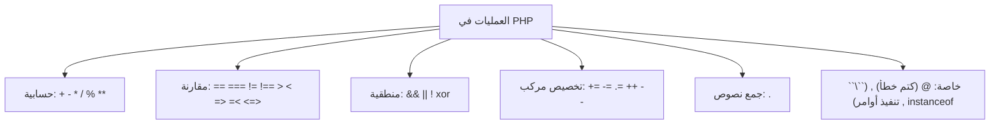
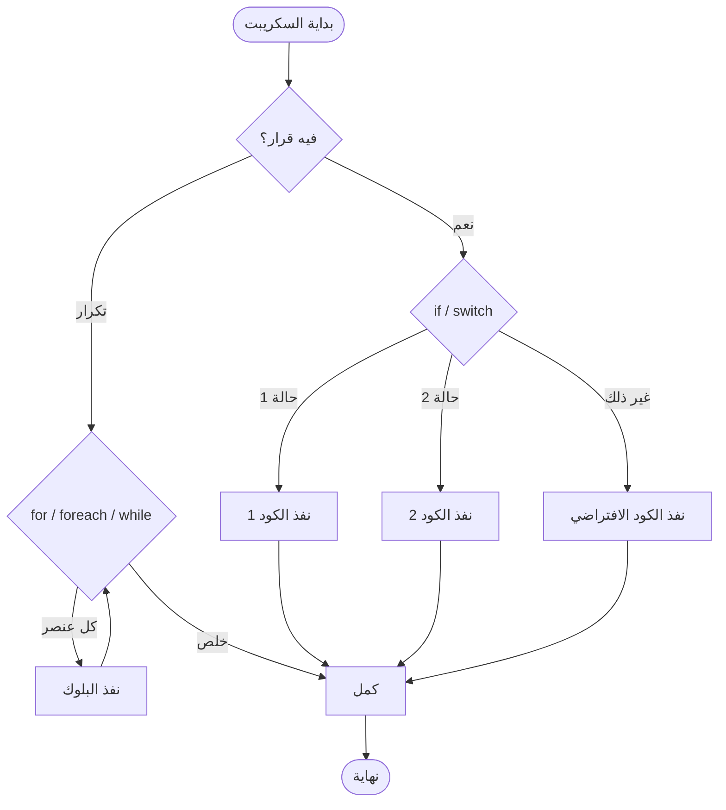
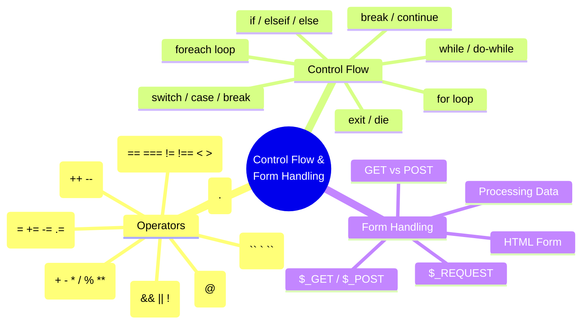

# الفصل التاني — العمليات، القرارات، والتكرار

> **المتطلبات:** تكون مذاكر الفصل الأول — عارف المتغيرات، النطاقات، والثوابت.  
> الفصل ده هو اللي هينقلك من "عامل سكريبت مطبّع كلمتين" لـ "بتاع ويب بيعمل منطق حقيقي".  
> هنتكلم عن إزاي تحسب، تقارن، تاخد قرارات، تلف على البيانات، وتستقبل أول فورم من مستخدم حقيقي.

---

## البداية — لما البيانات تبقى محتاجة عقل

تخيل معايا إنك فتحت دكان. عندك ماكينة الكاشير (البيانات). بس ماكينة الكاشير لوحدها مش بتعمل حاجة — محتاج اللي يشغّلها: **"لو العميل اشترى أكتر من ١٠٠ جنيه، خصم ١٠٪"**، أو **"اطبع كل الأصناف اللي في الفاتورة واحدة واحدة"**، أو **"لو العميل دفع كاش، اطبع إيصال، لو ڤيزا، ابعت إيميل"**.

في PHP، بعد ما خزنت القيم في المتغيرات، محتاج:
- **تحسب** (الخصم، الضريبة، الإجمالي)
- **تقارن** (هل الرقم ده أكبر من ٥٠؟)
- **تاخد قرارات** (لو المستخدم مسجّل دخول، شوفله القايمة. لو لأ، ابعته يسجل)
- **تكرر** (اعرض كل المنتجات اللي في السلة)
- **تستقبل** (البيانات اللي المستخدم باعتها من الفورم)

ده اللي بنسميه **العمليات والتحكم في مسار التنفيذ** — وهو قلب أي لغة برمجة.

---

## [[01-Operators]] — العمليات: إزاي تحسب وتقارن وتجمع

العمليات (Operators) هي الرموز اللي بتستخدمها علشان تعمل حاجة على القيم. أهي كل الأنواع اللي هتقابلك:

### ١. العمليات الحسابية (Arithmetic)

دي بتاعة الحساب العادي اللي اتعلمته في المدرسة.

```php
$a = 10;
$b = 3;

echo $a + $b;   // 13 (جمع)
echo $a - $b;   // 7  (طرح)
echo $a * $b;   // 30 (ضرب)
echo $a / $b;   // 3.333... (قسمة)
echo $a % $b;   // 1  (باقي القسمة — modulus)
echo $a ** $b;  // 1000 (10 أس 3 — exponentiation، من PHP 7.4+)
```

| المشغل | الاسم | الوظيفة |
|--------|------|---------|
| `+` | جمع | يجمع رقمين |
| `-` | طرح | يطرح التاني من الأول |
| `*` | ضرب | يضربهم في بعض |
| `/` | قسمة | يقسم الأول على التاني |
| `%` | باقي القسمة | يديك باقي قسمة الأول على التاني |
| `**` | الأس | الأول أس التاني |

> [!TIP]
> باقي القسمة (`%`) مفيد جداً لما تحب تعرف رقم زوجي ولا فردي: `$num % 2 == 0` معناها زوجي.

---

### ٢. عمليات التعيين المركبة (Combined Assignment)

دي اختصارات جميلة بدل ما تكتب نفس المتغير مرتين:

```php
$x = 10;

$x += 5;  // زي: $x = $x + 5   → 15
$x -= 3;  // زي: $x = $x - 3   → 12
$x *= 2;  // زي: $x = $x * 2   → 24
$x /= 4;  // زي: $x = $x / 4   → 6
$x %= 4;  // زي: $x = $x % 4   → 2
```

كمان فيه للتجميع النصي (String Concatenation):

```php
$name = "محمد";
$name .= " أحمد";        // دلوقتي $name = "محمد أحمد"
// دي اختصار لـ: $name = $name . " أحمد";
```

النقطة `.` في PHP هي مشغل التجميع (Concatenation) — مش `+` زي JavaScript. خد بالك!

---

### ٣. عمليات الزيادة والنقصان (Increment/Decrement)

دي أسرع طريقة تزود أو تنقص واحد من المتغير:

```php
$a = 5;

echo ++$a;   // 6 (pre-increment: زود الأول، بعدين اطبع)
echo $a;     // 6

$a = 5;
echo $a++;   // 5 (post-increment: اطبع الأول، بعدين زود)
echo $a;     // 6

$a = 5;
echo --$a;   // 4 (pre-decrement)
echo $a--;   // 4 (post-decrement)
echo $a;     // 3
```

**القاعدة:** لو العلامتين قبل المتغير (`++$x`) — الزيادة تحصل الأول وبعدين تستخدم القيمة. لو بعد المتغير (`$x++`) — تستخدم القيمة القديمة وبعدين تحصل الزيادة.

---

### ٤. عمليات المقارنة (Comparison)

دي بتقارن بين قيمتين وترجع `true` أو `false`. هي أساس أي قرار (`if`):

```php
$a = 5;
$b = "5";   // لاحظ: ده نص مش رقم!

var_dump($a == $b);       // true  (متساويين في القيمة)
var_dump($a === $b);      // false (متساويين في القيمة لكن مش نفس النوع)
var_dump($a != $b);       // false (القيمة مختلفة؟ لأ)
var_dump($a !== $b);      // true  (القيمة أو النوع مختلفين؟ آه)
var_dump($a > 3);         // true
var_dump($a <= 5);        // true
var_dump($a <=> 4);       // 1 (spaceship: بترجع -1, 0, أو 1)
```

| المشغل | المعنى | لو `$a = 5`, `$b = "5"` |
|--------|--------|------------------------|
| `==` | متساويين في القيمة | `true` |
| `===` | متطابقين (في القيمة والنوع) | `false` |
| `!=` أو `<>` | مختلفين في القيمة | `false` |
| `!==` | مختلفين في القيمة أو النوع | `true` |
| `>` | أكتر من | `true` لو `$a > 3` |
| `<` | أقل من | `false` لو `$a < 3` |
| `>=` | أكتر من أو يساوي | `true` لو `$a >= 5` |
| `<=` | أقل من أو يساوي | `true` لو `$a <= 5` |
| `<=>` | سفينة الفضاء (spaceship) | بترجع `-1` لو الأول أصغر، `0` لو متساويين، `1` لو الأول أكبر |

> [!IMPORTANT]
> **الغلطة الشهيرة:** دايماً استخدم `===` و `!==` إلا لو متعمد تقارن قيم دون النظر للنوع. لأن `"5" == 5` بترجع `true` وده ممكن يعمل سلوك غريب لو كنت مش متوقعه.

---

### ٥. العمليات المنطقية (Logical)

دي بتجمع أكتر من شرط مع بعض:

```php
$age = 25;
$has_id = true;

// AND: الشرطين لازم يبقوا صح
if ($age >= 18 && $has_id) {
    echo "تقدر تدخل";
}

// OR: واحد فيهم على الأقل صح
$is_admin = false;
if ($age >= 18 || $is_admin) {
    echo "مسموح";
}

// NOT: العكس
$is_blocked = false;
if (!$is_blocked) {
    echo "أهلاً";
}
```

| المشغل | الاسم | المعنى |
|--------|------|--------|
| `&&` أو `and` | AND | كل الشروط صح |
| `||` أو `or` | OR | على الأقل شرط واحد صح |
| `xor` | XOR | واحد بس صح (مش الاتنين) |
| `!` | NOT | عكس الشرط |

`&&` و `||` أولويتهم أعلى من `and` و `or`. تقريباً دايماً استخدم `&&` و `||`.

---

### ٦. مشغلات تانية مهمة

**مشغل التجميع (Concatenation) `.`** — علشان تلزق جمل في بعض:

```php
$firstName = "نورة";
$lastName  = "شهاب";
$fullName  = $firstName . " " . $lastName; // "نورة شهاب"
```

**مشغل كتم الخطأ `@`** — بيمنع ظهور warning من سطر معين (استخدمه بحذر!):

```php
$a = @(25 / 0);     // محدش هيصرخ فيك، الناتج INF
var_dump($a);       // float(INF)

$b = 44 / 0;        // ده هيطلع warning: Division by zero
```

> [!WARNING]
> `@` بيخفي الأخطاء، مش بيعالجها. استخدمه بس لو عارف إنت بتعمل إيه، مش علشان تسكت الخطأ وخلاص.

**مشغل التنفيذ `` ` ``** (backticks) — بينفذ أمر في نظام التشغيل اللي السيرفر شغال عليه:

```php
$files = `ls -la`;   // لو على Linux، بيرجع قايمة الملفات
echo "<pre>$files</pre>";
```

ده مش متاح دايمًا علشان الأمان، وبيختلف حسب النظام. خد بالك: العلامة دي مش single quote — هي اللي فوق زرار `Tab` (`~`).

**مشغل `instanceof`** — بيشوف لو متغير ده object من class معينة:

```php
class User {}
$user = new User();
var_dump($user instanceof User);  // true
```

---

### خلاصة العمليات في جدول واحد



---

## [[02-Control-Flow]] — إزاي تخلي الكود يقرر ويختار

لحد دلوقتي، الكود بتاعنا كان بيمشي من فوق لتحت سطر ورا سطر. لكن الحياة مش مستقيمة كده. أحياناً محتاج تقول:

- **"لو المستخدم عامل لوج إن، شوفله الـ Dashboard. لو لأ، وديه على صفحة التسجيل"**
- **"اعرض كل المنتجات اللي في العربية"**
- **"لو الاختيار 'مدير'، اديله صلاحيات زيادة. لو 'مستخدم'، صلاحيات عادية"**

ده اللي بنسميه **التحكم في مسار التنفيذ (Control Flow)**.

---

### ١. `if` / `elseif` / `else` — القرار الشرطي

أشهر جملة في أي لغة برمجة:

```php
$temperature = 35;

if ($temperature > 40) {
    echo "دنيا حر!";
} elseif ($temperature > 30) {
    echo "جو معتدل شوية";
} else {
    echo "الجو لطيف";
}
```

بيبدأ يفحص الشرط الأول. لو صح، ينفذ البلوك بتاعه ويسيب الباقي. لو غلط، ينقل للتاني، وهكذا. لو كله غلط، ينفذ `else` لو موجودة.

**شكل تاني للـ if (للحاجات القصيرة):**

```php
<?php if ($is_logged_in): ?>
    <h1>أهلاً بيك</h1>
<?php else: ?>
    <h1>سجل دخول</h1>
<?php endif; ?>
```

ده بيخليك تدمج HTML مع PHP بنضافة أكتر.

---

### ٢. `switch` — لما يكون الاختيار قيم محددة

لما يكون عندك متغير واحد بتفحصه ضد قيم كتير، `switch` أنضف بكتير من `if` الطويلة:

```php
$role = 'editor';

switch ($role) {
    case 'admin':
        echo "كامل الصلاحيات";
        break;                          // مهم جداً! من غيرها هيكمل للتالي
    case 'editor':
        echo "يقدر يضيف مقالات";
        break;
    case 'subscriber':
        echo "يقدر يقرأ بس";
        break;
    default:
        echo "زائر — صلاحيات محدودة";
}
```

`break;` أساسية هنا. بدونها، بينفذ كل الحالات اللي بعد الحالة المطابقة (ده اسمه "fall-through"). أحياناً يكون مقصود، بس غالباً غلطة.

---

### ٣. `for` — التكرار بعدد معروف

لما تكون عارف كام مرة هتلف:

```php
for ($i = 1; $i <= 5; $i++) {
    echo "رقم $i <br/>";
}
// 1 2 3 4 5
```

**المكونات:**
1. `$i = 1` — التهيئة (تنفذ مرة واحدة أول الدورة)
2. `$i <= 5` — الشرط (يتفحص قبل كل لفة)
3. `$i++` — الزيادة (تنفذ في نهاية كل لفة)

---

### ٤. `foreach` — التكرار على المصفوفات

ده أهم واحد في الشغل. بيلف على كل عنصر في مصفوفة:

```php
$colors = ["أحمر", "أخضر", "أزرق"];

foreach ($colors as $color) {
    echo "لون: $color <br/>";
}
```

لو المصفوفة ترابطية (Associative)، تقدر تجيب المفتاح والقيمة:

```php
$user = [
    "name"  => "أحمد",
    "age"   => 28,
    "email" => "ahmed@example.com"
];

foreach ($user as $key => $value) {
    echo "$key: $value <br/>";
}
// name: أحمد
// age: 28
// email: ahmed@example.com
```

---

### ٥. `while` و `do-while` — التكرار بشرط

`while` تلف طالما الشرط صح (ممكن متلفش ولا مرة لو الشرط غلط من الأول):

```php
$count = 1;
while ($count <= 5) {
    echo "العد: $count <br/>";
    $count++;
}
```

`do-while` تضمن إن البلوك يتنفذ **مرة واحدة على الأقل** قبل ما تشوف الشرط:

```php
$x = 1000;
do {
    echo "هتطبع مرة واحدة حتى لو الشرط غلط!";
} while ($x < 10);
```

---

### ٦. `break` و `continue` و `exit` — التحكم في التكرار

**`break`** يخرج من الحلقة كلياً:

```php
for ($i = 0; $i < 10; $i++) {
    if ($i == 4) {
        break;          // هتخرج من الـ for تماماً
    }
    echo $i . " ";
}
// الناتج: 0 1 2 3
```

**`continue`** ينط للفة الجاية:

```php
for ($i = 0; $i < 10; $i++) {
    if ($i == 4) {
        continue;       // هتسكيب رقم 4 بس وتكمل
    }
    echo $i . " ";
}
// الناتج: 0 1 2 3 5 6 7 8 9
```

**`exit`** أو `die()` توقف تنفيذ السكريبت كله فوراً:

```php
if ($error_occurred) {
    exit("حصل خطأ، توقف التنفيذ.");
}
echo "ده مش هيطبع لو حصل خطأ";
```

---

### خريطة التحكم — إزاي الكود بيفكر؟



---

## [[03-Form-Handling]] — أول تعامل مع المستخدم الحقيقي

دلوقتي جينا لحاجة ممتعة: إزاي تستقبل بيانات من مستخدم حقيقي عن طريق HTML Form.

### إزاي البيانات بتوصل؟

1. المستخدم يملأ فورم (HTML). الفورم عنده `method="GET"` أو `method="POST"`.
2. المستخدم يضغط Submit.
3. البيانات تسافر للسيرفر.
4. PHP تستقبلها في متغيرات Superglobal (`$_GET` أو `$_POST`).
5. إنت تقرأ المتغيرات دي وتعالجها.

### الفرق بين GET و POST

| | GET | POST |
|--|-----|------|
| البيانات بتروح فين؟ | في الـ URL (شريط العنوان) | في جسم الطلب (مخفي عن المستخدم) |
| حد أقصى للبيانات | محدود (حوالي 2048 حرف) | تقريباً مفتوح |
| أمان | مش آمن للبيانات الحساسة — الظاهر في الرابط | أفضل شوية |
| استخدام | بحث، فلترة، صفحات | تسجيل دخول، إرسال معلومات شخصية |

> [!IMPORTANT]
> **قاعدة:** استخدم `POST` لأي بيانات حساسة (باسوورد، معلومات شخصية). استخدم `GET` للحاجات اللي ممكن يشاركها المستخدم في رابط (زي صفحة منتج `?id=5`).

---

### مثال عملي — فورم HTML + معالج PHP

**ملف HTML (form.html):**

```html
<!DOCTYPE html>
<html lang="ar">
<head>
    <meta charset="UTF-8">
    <title>فورم تسجيل</title>
</head>
<body>
    <form action="process.php" method="POST">
        <label>الاسم:</label>
        <input type="text" name="username"><br/><br/>

        <label>الباسوورد:</label>
        <input type="password" name="password"><br/><br/>

        <input type="submit" value="سجل">
    </form>
</body>
</html>
```

**ملف PHP (process.php):**

```php
<?php
// هنقرا البيانات من $_POST
$username = $_POST['username'] ?? 'مجهول';
$password = $_POST['password'] ?? '';

// في الواقع مش هتطبع الباسوورد! ده بس مثال
echo "<h1>مرحباً $username!</h1>";
echo "<p>الباسوورد اللي دخلته: $password</p>";
?>
```

لما تضغط Submit، هتلاقي نفسك في `process.php` والبيانات ظهرت.

`??` ده مشغل "null coalescing" من PHP 7: لو القيمة موجودة، استخدمها. لو لأ، استخدم القيمة الافتراضية (`'مجهول'`). بيدي أمان إن المفتاح مش موجود.

---

### الوصول لكل البيانات دفعة واحدة

تستخدم `$_REQUEST` اللي فيها GET و POST و COOKIE مع بعض، بس دايماً حبذا تحدد (`$_GET` أو `$_POST`) علشان تبقى عارف مصدر البيانات.

```php
var_dump($_POST);   // هيطبع كل اللي جاي من الفورم
var_dump($_GET);    // هيطبع كل اللي جاي في الرابط (لو موجود)
```

---

## 🗺️ خريطة الفصل كاملة



---

## ✅ أسئلة الإنترفيو — قيس فهمك

**س: إيه الفرق بين `==` و `===` في PHP؟**
> `==` بتقارن القيمة بس، وتعمل تحويل تلقائي للنوع لو مختلف (يعني `5 == "5"` بترجع `true`). أما `===` فبتقارن القيمة والنوع معاً (يعني `5 === "5"` بترجع `false`). دايماً استخدم `===` لتجنب السلوك غير المتوقع.

**س: إزاي `switch` بتشتغل؟ وليه بنحط `break`؟**
> `switch` بتفحص متغير واحد ضد قيم محتملة. لو لقت تطابق، بتنفذ الكود اللي تحتها. `break` بتخرج من الـ switch. من غيرها، هتنفذ كل الحالات اللي بعدها (fall-through). أحياناً يكون مقصود، لكن غالباً غلط.

**س: إيه الفرق بين `for` و `foreach`؟ وايمتى تستخدم كل واحدة؟**
> `for` بتستخدم لما تكون عارف كام مرة هتلف (مثلًا من 1 لـ 10). `foreach` مصممة خصيصاً للمصفوفات علشان تلف على كل عنصر من غير ما تحسب العدد. `foreach` أنضف وأأمن للمصفوفات.

**س: إيه الفرق بين `GET` و `POST`؟ وليه مش هنبعت الباسوورد بـ GET؟**
> `GET` بتحط البيانات في الرابط، فالباسوورد هيكون ظاهر وممكن يتسجل في تاريخ المتصفح والسيرفرات. `POST` بتبعت البيانات في جسم الطلب، مش في الرابط، فأأمن شوية. برضه لازم تستخدم HTTPS علشان البيانات متتشوفش في الشبكة.

**س: يعني إيه Superglobal، وإيه أمثلة عليها؟**
> دي متغيرات مبنية جوه PHP، شغالة في أي نطاق (جوه الدوال وبره) من غير `global`. أمثلة: `$_GET`, `$_POST`, `$_SESSION`, `$_COOKIE`, `$_SERVER`.

---

## 🛠️ تمارين تطبيقية — دلوقتي إنت اللي هتكتب

### Task 1 — آلة حاسبة صغيرة

اكتب ملف `calculator.php` يعمل كآلة حاسبة:
- عرّف متغيرين `$num1` و `$num2` بقيمتين رقميات.
- عرّف متغير `$operator` قيمته واحدة من: `+`, `-`, `*`, `/`.
- استخدم `if` أو `switch` علشان تطبق العملية وتطبع الناتج.
- لو القسمة على صفر، اطبع رسالة خطأ بدل ما يطلع warning.

### Task 2 — عرض جدول الضرب

اكتب سكريبت `multiplication.php` يستخدم `for` loop لعرض جدول ضرب الرقم `7` (من 1 لحد 12) بالصيغة:  
`7 × 1 = 7`  
`7 × 2 = 14`  
...

### Task 3 — فورم تقييم

صمم فورم HTML (ملف `review.html`) يحتوي على:
- حقل اسم (text)
- حقل إيميل (email)
- قائمة منسدلة لتقييم الخدمة (select): ممتاز، جيد جدا، جيد، مقبول
- تعليقات (textarea)
- زر إرسال (submit)

الـ action يروح على `thankyou.php` بالـ POST. في `thankyou.php`:
- اعرض رسالة شكر تحتوي على كل البيانات اللي دخلها المستخدم.
- تأكد إن محدش دخل من غير ما يكتب اسمه (لو فاضي، ارجع رسالة تحذير).

### Task 4 — اللاب المتكامل (من الـ Slides)

ده نفس التمرين اللي في المحاضرة. نفذه بنفسك:

**الجزء الأول: فورم HTML**  
أنشئ ملف `lab_form.html` فيه فورم بـ:
- اللقب (radio: Mr / Miss)
- الاسم الأول (text)
- الاسم الأخير (text)
- العنوان (textarea)
- المهارات (checkboxes: PHP, MySQL, HTML, CSS, JavaScript)
- القسم (select: IT, HR, Marketing, Sales)

**الجزء التاني: معالج PHP**  
الـ action لـ `lab_result.php` بـ GET. في `lab_result.php`:
- اطبع جملة في الأول: "Thanks Mr. [الاسم الأول] [الاسم الأخير]" أو "Thanks Miss ..." حسب اختيار اللقب.
- بعدين: "Please Review Your Information"
- اعرض الاسم الكامل، العنوان، المهارات (كل واحدة في سطر)، القسم.

> [!TIP]
> تقدر تجيب المهارات اللي اختارها كمصفوفة: هيجيلك `$_GET['skills']` كمصفوفة تلقائياً لو الـ checkboxes كلهم نفس الـ name ومخلّص بـ `[]` (يعني `name="skills[]"`). اعرضهم بـ `foreach`.

---

## 🫒 زتونة الإنترفيو

> **"بعد ما عرفنا نخزن البيانات، العمليات هي اللغة اللي بتخلينا نحسب ونقارن: `+ - * / %`، `== === !=`، `&& || !`. التحكم في التدفق هو عقل الكود: `if/else` للقرارات، `switch` للاختيارات المتعددة، `for` و `foreach` للتكرار. ولما تتعامل مع المستخدم، بتستقبل بياناته عبر `$_GET` و `$_POST` من HTML Forms — وتتأكد دايمًا من تعقيم المدخلات. إتقان الأساسيات دي هو اللي بيفرق بين اللي بينفذ تعليمات واللي بيبني تطبيقات حقيقية."**

---

*Next → [[03-PHP-Arrays-and-Strings]] — إتقان المصفوفات والنصوص هو الخطوة الجاية. هنتعلم إزاي نرتب، نفلتر، ونحول البيانات، وإزاي نتعامل مع النصوص بشكل محترف (استبدال، تقسيم، تطويل، تقصير...). دول عضم ظهر أي تطبيق PHP.*