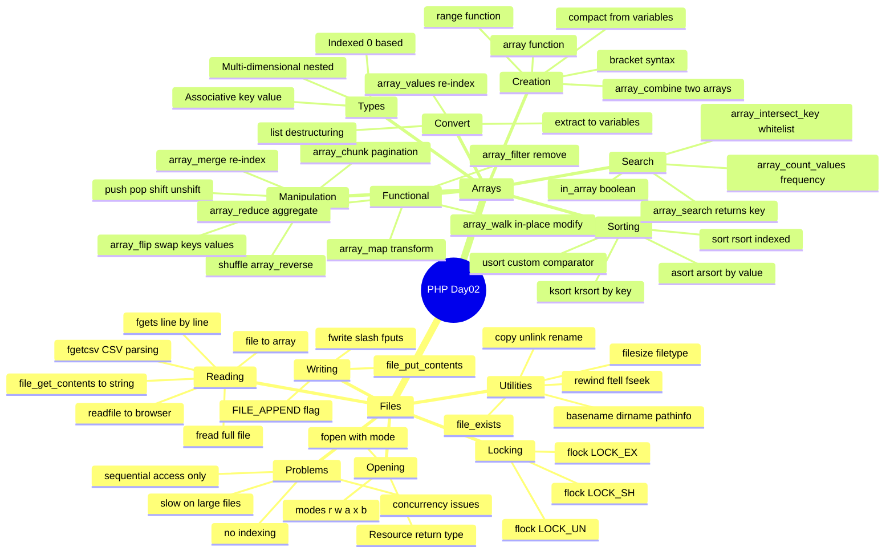

# الفصل 02 — PHP Files & Arrays: السيرفر بيتكلم مع الـ Disk

> **المتطلبات:** الفصل 01 — PHP Basics & Control Flow — لازم تكون مبسوط في الـ variables والـ loops لأن الـ file reading كلها قايمة على loops، والـ arrays هياخدوا وقت أكبر لو ما اتعلمتش تلوّف صح.

---

## البداية — المشكلة: الـ Data بتروح فين لما الـ Script تخلص؟

تخيّل معايا إنك عملت form وجمعت بيانات 100 user. الـ PHP script اشتغلت، طبعت "تم الحفظ"، وبعدين... الـ request خلص. كل الـ variables اتمسحت من الـ memory. كأن محدش اتسجّل خالص.

```php
<?php
// ❌ The naive approach — data lives only in RAM
$users[] = $_POST['name']; // exists ONLY during this request
// When script ends → RAM is cleared → data gone forever 💀
```

اللي بيحصل هنا إن الـ PHP script دورة حياتها قصيرة — بتبدأ مع الـ request وبتموت معاه. عشان تحافظ على الـ data محتاج تكتبها على الـ disk في ملف، أو في database.

> بدل ما تفقد الـ data مع كل request — الـ flat files بتديك persistence بسيطة وسريعة من غير ما تحتاج database.

---

## Flat Files vs Database — امتى تستخدم إيه؟

| | Flat File | Database |
|---|---|---|
| السرعة | سريع للـ reads الصغيرة | أسرع للـ queries المعقدة |
| الـ Search | صعب — لازم تقرأ كل السطور | سهل جداً — SQL |
| الـ Concurrency | مشكلة — محتاج locking | محلولة تلقائياً |
| مناسب لـ | Config files, logs, CSV exports | User data, products, أي data ضخمة |

---

## فتح الملف — fopen() والـ File Modes

تخيّل الـ file زي غرفة فيها كتاب. الـ `fopen()` هي مفتاح الباب — ولازم تقوله هتعمل إيه جوه الغرفة: هتقرأ بس؟ هتكتب؟ هتضيف في الآخر؟

```php
<?php
// fopen(filename, mode) → returns a Resource (file handle)
$handle = fopen("users.txt", "r"); // Open for reading only
var_dump($handle);
// Output: resource(3, stream) ← ده مش string ولا int — ده resource
```

### جدول الـ File Modes — حفّظه

| Mode | الاسم | بيعمل إيه |
|---|---|---|
| `r` | Read | يفتح للقراءة من الأول — الملف لازم يكون موجود |
| `r+` | Read/Write | يفتح للقراءة والكتابة — الملف لازم يكون موجود |
| `w` | Write | يفتح للكتابة — **يمسح المحتوى الموجود** — يخلق الملف لو مش موجود |
| `w+` | Write/Read | زي `w` بس بيسمح بالقراءة كمان |
| `x` | Cautious Write | يفتح للكتابة — **يفشل لو الملف موجود** (protection) |
| `a` | Append | يفتح للكتابة من **الآخر** — يحافظ على المحتوى القديم |
| `a+` | Append/Read | زي `a` بس بيسمح بالقراءة |
| `b` | Binary | بيتستخدم مع غيره (`rb`, `wb`) — للـ images والـ binary files |

> [!WARNING]
> الـ `w` mode بتمسح كل محتوى الملف الحالي فور ما تفتحه — حتى لو ما كتبتش حاجة! لو عايز تضيف على الموجود استخدم `a` (append).

---

## الكتابة على ملف — fwrite()

```php
<?php
declare(strict_types=1);

// Step 1: Open in write mode (creates file if not exists, clears if exists)
$handle = fopen("users.txt", "w");

// Step 2: Write — fwrite() === fputs() (alias)
fwrite($handle, "Ahmed,ahmed@iti.eg,Application\n");
fwrite($handle, "Sara,sara@iti.eg,Cloud\n");
// ← \n is the newline — each user on a separate line

// Step 3: ALWAYS close — releases the file descriptor back to the OS
fclose($handle);
```

> [!DEEP-DIVE]
> الـ `fopen()` بتخلق **File Descriptor** في الـ OS — رقم صغير (زي 3, 4, 5) بيمثّل الملف المفتوح. الـ OS عنده **limit** على عدد الـ file descriptors المفتوحة في نفس الوقت (عادة 1024). لو ما عملتش `fclose()` في loop كبيرة، هتخلّص الـ limit وهياخد error `Too many open files`. دايمًا `fclose()` في الـ finally block أو بعد ما تخلص.

```
fopen("users.txt", "w")
        ↓
OS creates File Descriptor (e.g., fd=3)
        ↓
fwrite($handle, "data")
        ↓
Data written to OS buffer → flushed to disk
        ↓
fclose($handle)
        ↓
fd=3 released ← لو نسيت الخطوة دي → memory/fd leak
```

---

## Append Mode — أضف من غير ما تمسح

```php
<?php
// 'a' mode → moves pointer to END of file before writing
$handle = fopen("log.txt", "a");

$timestamp = date("Y-m-d H:i:s");
fwrite($handle, "[$timestamp] User logged in\n");
// ← Each call adds to the end, never overwrites previous content

fclose($handle);
```

> **نصيحة الخبراء:** للـ log files دايمًا `a` مش `w`. الـ `w` هيمسح كل اللوق القديم كل request — الـ `a` بيضيف في الآخر. الفرق ده فاصل!

---

## القراءة من ملف — كل الطرق

### الطريقة الكاملة: fopen → fread → fclose

```php
<?php
$handle = fopen("users.txt", "r");

// filesize() returns the file size in bytes
$size = filesize("users.txt");

// fread() reads exactly $size bytes
$content = fread($handle, $size);

var_dump($content); // full file as one string
fclose($handle);
```

---

### قراءة سطر سطر — fgets() + feof()

تخيّل إنك بتقرأ كتاب صفحة صفحة — الـ `fgets()` هي "اقرأ الصفحة الجاية"، والـ `feof()` هي "وصلنا لآخر الكتاب؟"

```php
<?php
$handle = fopen("users.txt", "r");

// feof() = "file end of file" — returns true when pointer hits the end
while (!feof($handle)) {
    $line = fgets($handle); // reads ONE line (up to \n)
    if ($line !== false) {  // ← protect against the last empty line
        echo trim($line) . "<br>";
    }
}

fclose($handle);
```

> ⚠️ **انتبه:** بعد آخر سطر، الـ `fgets()` ممكن ترجع `false` أو `""`. دايمًا اعمل check قبل ما تعمل process على الـ line.

---

### fgetcsv() — اقرأ CSV مباشرة في array

```php
<?php
// users.txt content:
// Ahmed,ahmed@iti.eg,Application
// Sara,sara@iti.eg,Cloud

$handle = fopen("users.txt", "r");

while (!feof($handle)) {
    // fgetcsv splits each line by the delimiter into an array
    $row = fgetcsv($handle, 1000, ",");
    // ← $row = ["Ahmed", "ahmed@iti.eg", "Application"]

    if ($row !== false) {
        echo "Name: {$row[0]}, Email: {$row[1]}, Track: {$row[2]}<br>";
    }
}

fclose($handle);
```

---

### القراءة في خطوة واحدة — بدون fopen

PHP عندها shortcut functions بتعمل open + read + close في سطر واحد:

```php
<?php
// readfile() → prints file content directly to browser, returns byte count
readfile("users.txt");
// ← لا ترجع string — تطبع مباشرة. مناسبة لـ file download

// file() → reads entire file into array (each line = one element)
$lines = file("users.txt");
// $lines = ["Ahmed,ahmed@iti.eg,Application\n", "Sara,sara@iti.eg,Cloud\n"]
// ← لاحظ إن الـ \n بييجي مع كل سطر — استخدم trim() لو محتاج

// file_get_contents() → reads entire file into a string (most common)
$content = file_get_contents("users.txt");
// ← ده الأكثر استخدامًا — بترجع string ممكن تعمل عليها processing

// file_put_contents() → write in one step (creates file if needed)
file_put_contents("log.txt", "New log entry\n", FILE_APPEND);
// ← FILE_APPEND flag = equivalent to 'a' mode
```

> [!INFO]
> `file_put_contents()` مع `FILE_APPEND` flag هي الـ best practice للـ simple logging في PHP. بتعمل open + write + close تلقائياً.

---

## File Locking — مشكلة الـ Concurrent Access

تخيّل إن 1000 user بيحاولوا يكتبوا في نفس الملف في نفس الوقت. من غير locking، الـ data هتتكسر — نص واحد هيكتب فوق نص تاني.

الـ `LOCK_EX` بالظبط زي لما بتقفل باب الحمام من جوه — حد تاني بيطق على الباب ولما تخرج بييجي.

```php
<?php
$handle = fopen("orders.txt", "a");

// flock() → advisory lock (cooperative, not enforced by OS)
if (flock($handle, LOCK_EX)) { // ← acquire exclusive write lock
    // Now we are the ONLY writer
    fwrite($handle, "Order #" . time() . ": 2x Pizza\n");

    flock($handle, LOCK_UN); // ← ALWAYS release the lock
} else {
    echo "Could not acquire lock — try again";
}

fclose($handle);
```

| Lock Type | المعنى |
|---|---|
| `LOCK_SH` | Shared (read) lock — كتير يقدروا يقرأوا في نفس الوقت |
| `LOCK_EX` | Exclusive (write) lock — واحد بس يكتب، الباقي بيستنوا |
| `LOCK_UN` | Release the lock |

> [!DEEP-DIVE]
> الـ `flock()` في PHP هو **advisory lock** — يعني الـ OS مش بيـ enforce it. لو process تانية ما استخدمتش `flock()` قبل ما تكتب، الـ lock هيتجاهلها. كل الـ scripts المتنافسة لازم تستخدم `flock()` عشان يشتغل صح. في الـ high concurrency الحقيقية استخدم database.

---

## File Utility Functions — الأدوات الإضافية

```php
<?php
// Check if file/dir exists before opening
if (file_exists("users.txt")) {
    $content = file_get_contents("users.txt");
}

// Get just the filename from a full path
$path = "/var/www/html/uploads/photo.jpg";
echo basename($path);           // "photo.jpg"
echo dirname($path);            // "/var/www/html/uploads"
echo pathinfo($path, PATHINFO_EXTENSION); // "jpg"

// File metadata
echo filesize("users.txt");     // size in bytes
echo filetype("users.txt");     // "file" or "dir"

// File operations
copy("users.txt", "users_backup.txt");  // copy
unlink("temp.txt");                      // delete (think: Unix rm)
rename("old.txt", "new.txt");            // rename/move

// Type checking
var_dump(is_file("users.txt"));    // true
var_dump(is_dir("uploads"));       // true
var_dump(is_readable("users.txt")); // true
var_dump(is_writable("users.txt")); // true

// File pointer navigation
$handle = fopen("users.txt", "r");
echo ftell($handle);          // current position in bytes (starts at 0)
fseek($handle, 10);           // jump to byte 10
echo ftell($handle);          // 10
rewind($handle);              // jump back to start (same as fseek($h, 0))
fclose($handle);
```

---

## مشاكل الـ Flat Files — ليه بنروح للـ Database

المشاكل دي مش تقصير فيك — دي طبيعة الـ flat files:

```
File grows to 1MB+
    ↓ Performance degrades
    ↓ Every read = scan from start to end (sequential)
    ↓ No indexing

Multiple users write simultaneously
    ↓ Race condition even with flock()
    ↓ flock creates bottleneck → queued writes

Search for specific record?
    ↓ Read ALL lines → filter in PHP
    ↓ O(n) always — no shortcuts
```

الـ Flat Files مناسبة لـ: config files, small logs, CSV exports. مش مناسبة لـ: user accounts, products, أي data بتتبحث فيها.

---

## Arrays في PHP — الـ data structure الأكثر استخداماً

### المشكلة الساذجة

```php
<?php
// ❌ Without arrays — how would you store 100 products?
$product1 = "Laptop";
$product2 = "Phone";
$product3 = "Tablet";
// ... $product100 = "..."; // This is insane
```

الـ Array بتخليك تحط مليون قيمة في متغير واحد وتتعامل معاهم بسهولة.

---

## Indexed Arrays — الـ Array الأساسية

```php
<?php
// Two ways to create — both are identical
$skills = ['PHP', 'MySQL', 'Laravel', 'Linux']; // modern syntax ✅
$skills = array('PHP', 'MySQL', 'Laravel');      // old syntax

// Mixed types — PHP arrays accept anything
$mixed = [42, "hello", true, null, 3.14];

// Access by index (0-based)
echo $skills[0]; // "PHP"
echo $skills[2]; // "Laravel"

// Add to end
$skills[] = "Docker"; // auto-index = count($skills)

// Count
echo count($skills); // 5
```

---

### range() — اعمل array من sequence

```php
<?php
// range(start, end, step)
$numbers = range(0, 10, 2);  // [0, 2, 4, 6, 8, 10]
$letters = range('A', 'Z');  // ['A', 'B', ..., 'Z']
$evens   = range(2, 20, 2);  // [2, 4, 6, ..., 20]

// ← محتاجة كتير في pagination وفي الـ test data
```

---

### الـ Loops على الـ Arrays

```php
<?php
$fruits = ['banana', 'apple', 'kiwi', 'orange'];

// Classic for loop — when you need the index
for ($i = 0; $i < count($fruits); $i++) {
    echo "$i: {$fruits[$i]}<br>";
}

// foreach — cleaner, recommended for arrays
foreach ($fruits as $fruit) {
    echo "$fruit<br>";
}

// foreach with index
foreach ($fruits as $index => $fruit) {
    echo "$index: $fruit<br>";
}
```

---

## Associative Arrays — الـ Key-Value Store

تخيّل الـ Associative Array زي بطاقة شخصية — كل حقل عنده اسم (key) وقيمة (value). مش بتدور بالرقم، بتدور بالاسم.

```php
<?php
// Define with string keys
$user = [
    'name'  => 'Ahmed Hassan',
    'email' => 'ahmed@iti.gov.eg',
    'track' => 'Application',
    'age'   => 28,
];

// Access by key
echo $user['name'];  // "Ahmed Hassan"
echo $user['email']; // "ahmed@iti.gov.eg"

// Add new key
$user['intake'] = 35;

// Modify existing
$user['age'] = 29;

// Delete a key
unset($user['age']);

// Loop with key => value
foreach ($user as $key => $value) {
    echo "$key: $value<br>";
}
```

---

### compact() — من variables لـ Associative Array

```php
<?php
// You have separate variables
$name  = "Ahmed";
$email = "ahmed@iti.eg";
$track = "Cloud";

// compact() bundles them into an associative array
// The string keys become the variable names
$user = compact('name', 'email', 'track');
// Result: ['name' => 'Ahmed', 'email' => 'ahmed@iti.eg', 'track' => 'Cloud']
```

---

### extract() و list() — من Array لـ Variables

```php
<?php
// extract() → associative array keys become variable names
$config = ['host' => 'localhost', 'port' => 3306, 'dbname' => 'mydb'];
extract($config);
echo $host;   // "localhost" ← variable created automatically!
echo $port;   // 3306
echo $dbname; // "mydb"
// ← مستخدمة كتير في الـ view files في بعض الـ frameworks

// list() → indexed array positions to named variables
$row = ['Ahmed', 'ahmed@iti.eg', 'Application'];
[$name, $email, $track] = $row; // modern destructuring
// OR: list($name, $email, $track) = $row; // old way

echo "$name teaches $track"; // "Ahmed teaches Application"
```

---

## Multi-dimensional Arrays — Arrays جوه Arrays

بالظبط زي جدول Excel — كل row هي array، والـ table كلها array من الـ rows.

```php
<?php
// Array of students (indexed outer, indexed inner)
$students = [
    ['Ali', 'IoT'],
    ['Mostafa', 'Cloud'],
    ['Noha', 'Application'],
];

echo $students[0][0]; // "Ali"
echo $students[1][1]; // "Cloud"

// More realistic: array of associative arrays
$students = [
    ['name' => 'Ali',     'track' => 'IoT'],
    ['name' => 'Mostafa', 'track' => 'Cloud'],
    ['name' => 'Noha',    'track' => 'Application'],
];

foreach ($students as $student) {
    echo "{$student['name']} → {$student['track']}<br>";
}
```

---

## Array Operators — الـ gotcha بتاع الإنترفيو

```php
<?php
$a = [1, 2, 3];
$b = [4, 5, 6];

// + (Union) — DOES NOT add mathematically
// Takes $a, then adds keys from $b that DON'T exist in $a
$result = $a + $b;
var_dump($result); // [1, 2, 3] ← $b is IGNORED because $a has keys 0,1,2

// == (Equality) — same keys and values, order doesn't matter
$x = ['a' => 1, 'b' => 2];
$y = ['b' => 2, 'a' => 1];
var_dump($x == $y);  // true  ← same pairs
var_dump($x === $y); // false ← different ORDER
```

> ⚠️ **انتبه:** الـ `+` operator على الـ arrays مش addition — هو **union**. كل الـ keys الموجودة في `$a` بتتحافظ عليها. الـ keys من `$b` بتضاف بس لو مش موجودة في `$a`. ده من أكتر أسئلة الإنترفيو اللي بتبهدل الـ seniors!

---

## Sorting Arrays — كل طريقة وموقفها

```php
<?php
$names = ['noha', 'Fatma', 'Dina', 'Andrew'];

// sort() → ascending, REINDEXES the array, CASE SENSITIVE
sort($names);
// Result: ['Andrew', 'Dina', 'Fatma', 'noha']
// ← uppercase comes BEFORE lowercase in ASCII

// rsort() → descending, reindexes
rsort($names);

// ─── Associative array sorting ───────────────────────────────
$prices = ['meat' => 100, 'sugar' => 10, 'tea' => 8];

// asort() → sort by VALUE, PRESERVES keys
asort($prices);
// Result: ['tea' => 8, 'sugar' => 10, 'meat' => 100]

// arsort() → sort by VALUE descending, preserves keys
arsort($prices);

// ksort() → sort by KEY ascending
ksort($prices);

// krsort() → sort by KEY descending
krsort($prices);
```

---

### usort() — الـ Custom Sort

```php
<?php
// Sort by string length
$words = ['banana', 'hi', 'kiwi', 'strawberry'];

usort($words, function($a, $b) {
    return strlen($a) - strlen($b);
    // Negative → $a comes first
    // Zero → equal
    // Positive → $b comes first
});

// Result: ['hi', 'kiwi', 'banana', 'strawberry']

// Modern: spaceship operator <=>
usort($words, fn($a, $b) => strlen($a) <=> strlen($b));
```

---

## Reordering — Manipulation Functions

```php
<?php
$arr = [1, 2, 3, 4, 5];

// shuffle() → random order (in-place)
shuffle($arr); // [3, 1, 5, 2, 4] ← different every time

// array_reverse() → returns reversed copy
$reversed = array_reverse($arr); // doesn't modify original

// array_push() → add to END (same as $arr[] = value)
array_push($arr, 6, 7); // add multiple at once

// array_pop() → remove & return LAST element
$last = array_pop($arr); // removes 7

// array_shift() → remove & return FIRST element (re-indexes!)
$first = array_shift($arr); // removes 1, all keys shift down

// array_unshift() → add to BEGINNING (re-indexes!)
array_unshift($arr, 0); // [0, 2, 3, 4, 5, 6]
```

---

## Functional Array Operations — الـ Modern PHP style

### array_map() — حوّل كل element

```php
<?php
$prices = [100, 200, 300, 400];

// Apply discount to all prices
$discounted = array_map(fn($price) => $price * 0.9, $prices);
// [90, 180, 270, 360]

// Map two arrays together
$instructors = ["Ahmed", "Sara", "Ali"];
$courses      = ['PHP', 'Node', 'Laravel'];

$pairs = array_map(
    fn($instructor, $course) => "$instructor teaches $course",
    $instructors,
    $courses
);
// ["Ahmed teaches PHP", "Sara teaches Node", "Ali teaches Laravel"]
```

---

### array_filter() — شيل اللي مش عاوزه

```php
<?php
$data = [1, 90, 2, null, 3, '', 55, [], 5, 0, 8, ""];

// Default: removes all falsy values (null, '', [], 0, false, "0")
$clean = array_filter($data);
// Note: keys are PRESERVED — use array_values() to re-index

// Custom filter: only even numbers
$numbers = [1, 2, 3, 4, 5, 6, 7, 8];
$evens = array_filter($numbers, fn($n) => $n % 2 === 0);
// [2, 4, 6, 8]
```

---

### array_reduce() — اجمع الـ array في قيمة واحدة

```php
<?php
$cart = [
    ['name' => 'Pizza',  'price' => 120],
    ['name' => 'Pepsi',  'price' => 25],
    ['name' => 'Salad',  'price' => 45],
];

// Calculate total price
$total = array_reduce($cart, fn($carry, $item) => $carry + $item['price'], 0);
echo $total; // 190
```

---

### array_walk() — عدّل في الـ array نفسها

```php
<?php
$fruits = ['banana', 'apple', 'kiwi'];

// array_walk modifies the array IN PLACE
array_walk($fruits, function(&$value, $key) {
    $value = strtoupper($value); // ← & means modify by reference
});
// ['BANANA', 'APPLE', 'KIWI']
```

---

### array_combine() — دمج arrayين في Associative

```php
<?php
$keys   = ['name', 'email', 'track'];
$values = ['Ahmed', 'ahmed@iti.eg', 'Cloud'];

$user = array_combine($keys, $values);
// ['name' => 'Ahmed', 'email' => 'ahmed@iti.eg', 'track' => 'Cloud']
// ← بتستخدمها كتير لما بتقرأ CSV وعندك headers منفصلة عن الـ data
```

---

### array_flip() — قلب الـ Keys والـ Values

```php
<?php
$roles = ['admin' => 1, 'editor' => 2, 'viewer' => 3];

$flipped = array_flip($roles);
// [1 => 'admin', 2 => 'editor', 3 => 'viewer']

// ← Trick: use flip + intersect_key for whitelisting
$data    = ['name' => 'Ahmed', 'password' => 'secret', 'email' => 'a@a.com'];
$allowed = ['name', 'email'];

$safe = array_intersect_key($data, array_flip($allowed));
// ['name' => 'Ahmed', 'email' => 'a@a.com'] ← password stripped! ✅
```

---

### Array Navigation — الـ Internal Pointer

كل array في PHP عندها **internal pointer** بيشاور على الـ current element. بالظبط زي cursor في محرر النصوص.

```php
<?php
$fruits = ['banana', 'apple', 'kiwi', 'orange'];

current($fruits); // 'banana' ← where pointer is now
next($fruits);    // 'apple'  ← advance and return
next($fruits);    // 'kiwi'
current($fruits); // 'kiwi'   ← still at kiwi
prev($fruits);    // 'apple'  ← go back
reset($fruits);   // 'banana' ← jump to START
end($fruits);     // 'orange' ← jump to END
```

---

### array_chunk() — قسّم الـ array

```php
<?php
$items = ['a', 'b', 'c', 'd', 'e', 'f', 'g'];

// Split into chunks of 3
$chunks = array_chunk($items, 3);
// [['a','b','c'], ['d','e','f'], ['g']]
// ← بتستخدمها في الـ pagination
```

---

### array_merge() — دمج الـ Arrays

```php
<?php
$arr1 = ['PHP', 'MySQL'];
$arr2 = ['Laravel', 'Linux'];

$merged = array_merge($arr1, $arr2);
// ['PHP', 'MySQL', 'Laravel', 'Linux'] ← re-indexed

// Trick: reset numeric keys from a non-0-based array
$weirdArr = [5 => 'banana', 22 => 'kiwi'];
$reindexed = array_merge($weirdArr);
// [0 => 'banana', 1 => 'kiwi'] ← now starts at 0
```

---

### array_count_values() — عدّ التكرار

```php
<?php
$students = ["Ali", "Ahmed", "Mostafa", "Omar", "Ahmed", "Ali"];

var_dump(count($students));               // 6 — total elements
var_dump(sizeof($students));             // 6 — alias of count()
var_dump(array_count_values($students)); // ['Ali' => 2, 'Ahmed' => 2, ...]
// ← مفيدة جداً لعمل statistics
```

---

### in_array() و array_search() — ابحث في الـ array

```php
<?php
$fruits = ['banana', 'apple', 'kiwi'];

// in_array() → returns true/false
var_dump(in_array('apple', $fruits)); // true
var_dump(in_array('mango', $fruits)); // false

// array_search() → returns the KEY if found, false if not
$key = array_search('kiwi', $fruits); // 2
$key = array_search('mango', $fruits); // false
// ← لازم تستخدم !== false عشان index 0 هو falsy
```

---

## 🗺️ خريطة PHP Day02 كاملة



---

## ✅ Checkpoint — أسئلة إنترفيو Files & Arrays

**س: إيه الفرق بين `w` و `a` في الـ fopen modes؟**
> الـ `w` بتفتح الملف للكتابة من الأول وبتمسح كل المحتوى الموجود — لو الملف مش موجود بتخلقه. الـ `a` (append) بتفتح الملف وبتحرّك الـ pointer للآخر عشان تكتب من غير ما تمسح أي حاجة موجودة — لو مش موجود بيخلقه. في الـ log files دايمًا `a`، في الـ export files (CSV) ممكن `w`.

**س: ليه لازم نستخدم `flock()` وإيه مشكلته؟**
> لأن لو 100 user بعتوا request في نفس الوقت والكل بيكتب في نفس الملف، الـ data هتتكسر — نص من user هينكتب فوق نص من user تاني. الـ `flock(LOCK_EX)` بيخليك تـ acquire exclusive lock وأنت بس اللي بتكتب. المشكلة إنه **advisory lock** — يعني بس بيشتغل لو كل الـ scripts بتستخدمه. وكمان بيعمل **bottleneck** — الـ requests بتتطابر. في الـ high traffic استخدم database.

**س: إيه الفرق بين `sort()` و `asort()` على الـ Associative Array؟**
> الـ `sort()` بترتب حسب القيمة لكنها **بتمسح الـ keys** وبتعيد ترقيم الـ array من 0. الـ `asort()` بترتب حسب القيمة لكنها **بتحافظ على الـ keys** — فلو عندك `['meat' => 100, 'tea' => 8]` الـ `asort` هترجع `['tea' => 8, 'meat' => 100]` وكل key لسه متربط بقيمته الصح. في الـ associative arrays دايمًا استخدم `asort` / `arsort`.

**س: إيه نتيجة `[1,2,3] + [4,5,6]` في PHP؟**
> النتيجة هي `[1, 2, 3]` — مش `[4,5,6]` ولا حتى merge! الـ `+` operator على الـ arrays هو **union** مش addition. بياخد الـ array الأولى ويضيف بس الـ keys اللي مش موجودة في الأولى من الـ array التانية. لأن الـ arrays الاتنين عندهم نفس الـ indices (0,1,2)، فمحدش من الثانية بيتضاف. ده من أكتر أسئلة الإنترفيو اللي بتبهدل.

**س: إيه الفرق بين `array_map()` و `array_walk()`؟**
> الـ `array_map()` بترجع **array جديدة** من غير ما تعدّل الأصل — functional style. الـ `array_walk()` بتعدّل الـ array **في مكانها** (in-place) عن طريق reference. كمان `array_map()` ممكن تشتغل على أكتر من array في نفس الوقت. الـ `array_map()` هو الـ modern way الأكثر استخدامًا.

**س: امتى تستخدم `in_array()` وامتى `array_search()`؟**
> الـ `in_array()` لما عايز تعرف بس **هل** القيمة موجودة — بترجع `true/false`. الـ `array_search()` لما عايز تعرف **فين** — بترجع الـ key. بس انتبه: الاتنين لازم تعمل check بـ `!== false` مش `!= false`، لأن لو الـ key هو `0` (أول element) هيبقى falsy.

---

## 🛠️ Practical Exercise — Lab 02 الحل الكامل

### المطلوب:
- Form فيه: First Name, Last Name, Email, Gender, Password, Room No (dropdown)
- Server-side validation
- حفظ البيانات في `customers.txt`
- عرض البيانات في جدول
- **Bonus:** زرار حذف

---

### الملفات اللازمة:

```
/
├── register.php    (Form + PHP handler)
├── customers.php   (Display table)
└── delete.php      (Delete handler)
```

---

### register.php — الـ Form + Handler

```php
<?php
declare(strict_types=1);

$errors = [];
$success = false;

// Process form on submission
if ($_SERVER['REQUEST_METHOD'] === 'POST') {

    // ── 1. Read & clean inputs ─────────────────────────────
    $firstName = trim($_POST['first_name'] ?? '');
    $lastName  = trim($_POST['last_name']  ?? '');
    $email     = trim($_POST['email']      ?? '');
    $gender    = trim($_POST['gender']     ?? '');
    $password  = trim($_POST['password']   ?? '');
    $room      = trim($_POST['room']       ?? '');

    // ── 2. Validate ────────────────────────────────────────
    if (empty($firstName) || strlen($firstName) < 2) {
        $errors['first_name'] = "First name must be at least 2 characters.";
    }

    if (empty($lastName) || strlen($lastName) < 2) {
        $errors['last_name'] = "Last name must be at least 2 characters.";
    }

    // Email: two methods as required by the slides
    // Method 1: filter_var (recommended)
    if (!filter_var($email, FILTER_VALIDATE_EMAIL)) {
        $errors['email'] = "Invalid email format.";
    }
    // Method 2: preg_match (regex — for the Bonus if you want both)
    // $pattern = "/^[a-z0-9._%+\-]+@[a-z0-9.\-]+\.[a-z]{2,6}$/i";
    // if (!preg_match($pattern, $email)) { $errors['email'] = "..."; }

    if (!in_array($gender, ['male', 'female'], true)) {
        $errors['gender'] = "Please select a valid gender.";
    }

    // Password: only lowercase letters + underscore, exactly 8 chars (Bonus)
    if (!preg_match('/^[a-z_]{8}$/', $password)) {
        $errors['password'] = "Password: exactly 8 chars, lowercase letters and underscore only.";
    }

    $allowedRooms = ['Application1', 'Application2', 'Cloud'];
    if (!in_array($room, $allowedRooms, true)) {
        $errors['room'] = "Please select a valid room.";
    }

    // ── 3. Save if no errors ───────────────────────────────
    if (empty($errors)) {
        // Build a CSV-like record — use | as delimiter (avoids comma issues)
        $record = implode('|', [
            htmlspecialchars($firstName),
            htmlspecialchars($lastName),
            htmlspecialchars($email),
            $gender,
            $room,
            // Never store plain passwords — hash them!
            password_hash($password, PASSWORD_BCRYPT),
        ]);

        // Append to file — FILE_APPEND + LOCK_EX for safety
        $saved = file_put_contents(
            'customers.txt',
            $record . "\n",
            FILE_APPEND | LOCK_EX
        );

        if ($saved !== false) {
            $success = true;
        } else {
            $errors['general'] = "Could not save data. Check file permissions.";
        }
    }
}
?>
<!DOCTYPE html>
<html lang="en">
<head>
    <meta charset="UTF-8">
    <title>Registration</title>
</head>
<body>
    <h1>Registration Form</h1>

    <?php if ($success): ?>
        <p style="color:green">✅ Registered successfully!
           <a href="customers.php">View all customers</a>
        </p>
    <?php endif; ?>

    <?php if (!empty($errors['general'])): ?>
        <p style="color:red"><?= $errors['general'] ?></p>
    <?php endif; ?>

    <form method="POST" action="register.php">

        <label>First Name:</label>
        <input type="text" name="first_name"
               value="<?= htmlspecialchars($_POST['first_name'] ?? '') ?>">
        <?php if (!empty($errors['first_name'])): ?>
            <span style="color:red"><?= $errors['first_name'] ?></span>
        <?php endif; ?>
        <br><br>

        <label>Last Name:</label>
        <input type="text" name="last_name"
               value="<?= htmlspecialchars($_POST['last_name'] ?? '') ?>">
        <?php if (!empty($errors['last_name'])): ?>
            <span style="color:red"><?= $errors['last_name'] ?></span>
        <?php endif; ?>
        <br><br>

        <label>Email:</label>
        <input type="email" name="email"
               value="<?= htmlspecialchars($_POST['email'] ?? '') ?>">
        <?php if (!empty($errors['email'])): ?>
            <span style="color:red"><?= $errors['email'] ?></span>
        <?php endif; ?>
        <br><br>

        <label>Gender:</label>
        <input type="radio" name="gender" value="male"
            <?= (($_POST['gender'] ?? '') === 'male') ? 'checked' : '' ?>> Male
        <input type="radio" name="gender" value="female"
            <?= (($_POST['gender'] ?? '') === 'female') ? 'checked' : '' ?>> Female
        <?php if (!empty($errors['gender'])): ?>
            <span style="color:red"><?= $errors['gender'] ?></span>
        <?php endif; ?>
        <br><br>

        <label>Password:</label>
        <input type="password" name="password">
        <?php if (!empty($errors['password'])): ?>
            <span style="color:red"><?= $errors['password'] ?></span>
        <?php endif; ?>
        <br><br>

        <label>Room No:</label>
        <select name="room">
            <option value="">-- Select Room --</option>
            <?php foreach (['Application1', 'Application2', 'Cloud'] as $room): ?>
                <option value="<?= $room ?>"
                    <?= (($_POST['room'] ?? '') === $room) ? 'selected' : '' ?>>
                    <?= $room ?>
                </option>
            <?php endforeach; ?>
        </select>
        <?php if (!empty($errors['room'])): ?>
            <span style="color:red"><?= $errors['room'] ?></span>
        <?php endif; ?>
        <br><br>

        <button type="submit">Register</button>
        <button type="reset">Reset</button>
    </form>
</body>
</html>
```

---

### customers.php — عرض الجدول

```php
<?php
declare(strict_types=1);

$customers = [];

// Read all records from file
if (file_exists('customers.txt')) {
    $lines = file('customers.txt', FILE_IGNORE_NEW_LINES | FILE_SKIP_EMPTY_LINES);
    // ← FILE_IGNORE_NEW_LINES removes \n from each line
    // ← FILE_SKIP_EMPTY_LINES skips blank lines

    foreach ($lines as $line) {
        // explode on our | delimiter
        $fields = explode('|', $line);

        if (count($fields) >= 5) {
            $customers[] = [
                'first_name' => $fields[0],
                'last_name'  => $fields[1],
                'email'      => $fields[2],
                'gender'     => $fields[3],
                'room'       => $fields[4],
                // index 5 = hashed password — we DON'T display this
            ];
        }
    }
}
?>
<!DOCTYPE html>
<html lang="en">
<head>
    <meta charset="UTF-8">
    <title>Customers</title>
</head>
<body>
    <h1>All Customers</h1>
    <a href="register.php">+ Add New Customer</a>

    <?php if (empty($customers)): ?>
        <p>No customers yet.</p>
    <?php else: ?>
        <table border="1" cellpadding="8">
            <tr>
                <th>#</th>
                <th>First Name</th>
                <th>Last Name</th>
                <th>Email</th>
                <th>Gender</th>
                <th>Room</th>
                <th>Action</th>
            </tr>

            <?php foreach ($customers as $index => $customer): ?>
            <tr>
                <td><?= $index + 1 ?></td>
                <td><?= htmlspecialchars($customer['first_name']) ?></td>
                <td><?= htmlspecialchars($customer['last_name']) ?></td>
                <td><?= htmlspecialchars($customer['email']) ?></td>
                <td><?= htmlspecialchars($customer['gender']) ?></td>
                <td><?= htmlspecialchars($customer['room']) ?></td>
                <td>
                    <!-- Bonus: Delete button sends the line number -->
                    <form method="POST" action="delete.php"
                          onsubmit="return confirm('Delete this record?')">
                        <input type="hidden" name="line_index" value="<?= $index ?>">
                        <button type="submit" style="color:red">Delete</button>
                    </form>
                </td>
            </tr>
            <?php endforeach; ?>
        </table>
    <?php endif; ?>
</body>
</html>
```

---

### delete.php — Bonus: حذف سجل

```php
<?php
declare(strict_types=1);

if ($_SERVER['REQUEST_METHOD'] !== 'POST' || !isset($_POST['line_index'])) {
    header('Location: customers.php');
    exit;
}

$lineIndex = (int) $_POST['line_index'];
$file = 'customers.txt';

if (!file_exists($file)) {
    header('Location: customers.php');
    exit;
}

// Read all lines
$lines = file($file, FILE_IGNORE_NEW_LINES | FILE_SKIP_EMPTY_LINES);

// Remove the target line by index
if (isset($lines[$lineIndex])) {
    array_splice($lines, $lineIndex, 1);
    // ← array_splice removes element and re-indexes the array

    // Rewrite the file with the remaining lines
    $handle = fopen($file, 'w'); // 'w' overwrites — intentional here
    if (flock($handle, LOCK_EX)) {
        foreach ($lines as $line) {
            fwrite($handle, $line . "\n");
        }
        flock($handle, LOCK_UN);
    }
    fclose($handle);
}

header('Location: customers.php');
exit;
```

---

## 🫒 زتونة الإنترفيو

> **"الـ PHP بتتعامل مع الـ files من خلال resource handle — بتفتح بـ fopen وبتحدد الـ mode (r للقراءة، w للكتابة مع مسح القديم، a للـ append من الآخر). دايمًا لازم fclose عشان ما تعملش file descriptor leak. للـ concurrent writes محتاج flock مع LOCK_EX، وبعد ما تخلص تعمل LOCK_UN. الـ flat files مناسبة للـ config والـ logs — أما لو البيانات ضخمة أو محتاج search، روح على database. في الـ Arrays، الفرق الجوهري في PHP إن الـ array فعلياً ordered hashmap — مش array بالمعنى الكلاسيكي. ممكن تبقى indexed أو associative. الـ + operator هو union مش merge. للـ sorting: sort للـ indexed، asort للـ associative by value، ksort by key. والـ modern PHP استخدم array_map وarray_filter وarray_reduce بدل الـ loops اليدوية — الكود بيبقى أنظف وأسرع في الفهم."**

---

*Next → الفصل 03 — Strings, Regex, File Upload, Sessions & Cookies: بقى عندك سلاح حقيقي للـ real-world features.*
