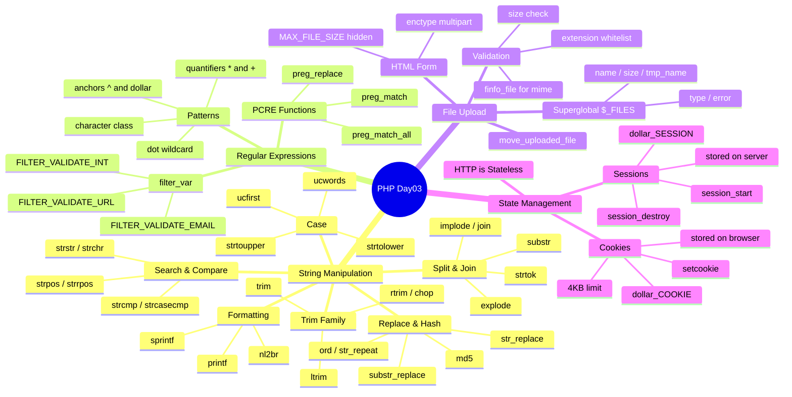

# الفصل 03 — PHP Strings, Regex, Files, Sessions & Cookies: بقى عندك سلاح حقيقي

> **المتطلبات:** الفصل 02 — Arrays & Functions — لازم تكون عارف تتعامل مع الـ arrays والـ functions لأن معظم دوال الـ strings بترجع arrays ومحتاج تفهم الـ flow.

---

## البداية — المشكلة اللي هتقابلها كل يوم

تخيّل معايا إنك بتبني registration form. الـ user بعت الـ email `  AHMED@EXAMPLE.COM  ` — فيه spaces في الأول والآخر، وكل حاجة uppercase. أو بعت اسم فيه `'` زي `Ahmed's Store` وانت بتحاول تحطه في الـ database. أو المفروض يرفع profile picture بس رفع `.php` file خبيث.

```php
// ❌ The naive approach — what every beginner does
$email = $_POST['email']; // raw, dirty, dangerous
$name = $_POST['name'];   // might crash the DB query
// just insert directly... what could go wrong? 💀
```

المشكلة مش في الـ PHP — المشكلة إنك مش بتنضّف الـ input ومش بتـ validate. وكمان مش بتحفظ حالة الـ user بين الـ pages، فكل مرة بيفتح page جديدة إنت بتنساه.

> بدل ما تحشر الـ raw input في الـ database مباشرة — في PHP أدوات جاهزة بتعمل كل ده في سطر أو اتنين.

---

## String Manipulation — أدوات اليومية

### Trim — شيل الزبالة من الأطراف

تخيّل الـ user بعت `"   ahmed@iti.eg   "` — فيه spaces. الـ trim family بتشيل الـ whitespace (spaces, tabs, newlines) من الأطراف.

```php
<?php
declare(strict_types=1);

$email = "   ahmed@iti.eg   ";

// trim() → removes from both sides
$clean = trim($email); // "ahmed@iti.eg"

// ltrim() → left side only
$leftClean = ltrim($email); // "ahmed@iti.eg   "

// rtrim() === chop() → right side only
$rightClean = rtrim($email); // "   ahmed@iti.eg"

// Custom chars to trim — removes \t and "The" chars from edges
$text = "\t\tThese are a few words :) ... ";
$custom = trim($text, "\tThe"); // "se are a few words :) ... "
// ← notice it removes ALL chars in the mask, not the whole word
```

> ⚠️ **انتبه:** الـ `trim($str, "\tThe")` مش بتشيل الكلمة "The" كـ word — بتشيل أي حرف من الـ character list دي (`\t`, `T`, `h`, `e`) من الأطراف. ده من أهم أسئلة الإنترفيو!

---

### Case Functions — التحكم في الحروف الكبيرة والصغيرة

```php
<?php
$str = "welcome to iti";

echo strtoupper($str);  // "WELCOME TO ITI" ← كل حاجة uppercase
echo strtolower($str);  // "welcome to iti" ← كل حاجة lowercase
echo ucfirst($str);     // "Welcome to iti" ← أول حرف بس capital
echo ucwords($str);     // "Welcome To Iti" ← أول حرف من كل كلمة capital
```

---

### Printf & Sprintf — formatting محترم

الـ `printf` بيطبع مباشرة، الـ `sprintf` بيرجّع string بدون ما يطبع — ده اللي هتستخدمه أكتر في الـ real world.

```php
<?php
$num = 5;
$location = 'tree';

// printf → prints directly, returns length
printf("There are %d monkeys in the %s\n", $num, $location);
// Output: There are 5 monkeys in the tree

// sprintf → returns the formatted string, doesn't print
$msg = sprintf("There are %d monkeys in the %s", $num, $location);
// ← now you can store it, log it, or return it from a function

// Padding example
$txt = "welcome to day3 in php";
printf("[%'#10s]\n", $txt); // ← pads with '#' to width 10
// Output: [welcome to day3 in php]
```

> **نصيحة الخبراء:** استخدم `sprintf` بدل الـ string concatenation في الـ templates، الكود بيبقى أنظف بكتير وأسهل في الـ maintenance.

---

### nl2br — الـ newlines في الـ HTML

الـ `\n` مش بيبان في الـ HTML — محتاج تحوّله لـ `<br>`.

```php
<?php
$str = "You came\nto me\nin that hour\nof need";

echo $str;          // browsers ignore the \n — one line
echo nl2br($str);   // inserts <br /> before every \n — each phrase on new line
```

---

### addslashes & stripslashes — الأمان مع الـ DB

تخيّل اسم user هو `Ahmed's Store`. الـ single quote بتكسّر الـ SQL query.

```php
<?php
$name = "What's your name?";

$safe = addslashes($name);    // "What\'s your name?" ← escaped for DB
echo $safe;

$original = stripslashes($safe); // "What's your name?" ← back to normal
echo $original;
```

> [!WARNING]
> `addslashes` مش بديل حقيقي للـ **Prepared Statements**. في الـ production بتستخدم PDO مع prepared statements — مش `addslashes`. ده بس للـ understanding.

---

## Joining & Splitting — الـ explode/implode اللي هتستخدمهم كل يوم

### implode / join — من array لـ string

بالظبط زي لما بتلمّ الـ tags بتاعة post وتحطهم في سطر واحد.

```php
<?php
$skills = ['PHP', 'MySQL', 'Laravel'];

// join without separator
echo implode($skills);    // "PHPMySQLLaravel"

// join with separator (implode === join, same function)
echo implode(", ", $skills);  // "PHP, MySQL, Laravel"
echo join(" | ", $skills);    // "PHP | MySQL | Laravel"
```

---

### explode — من string لـ array

```php
<?php
$csv = "ahmed,ali,sara,mona";

// split on comma → array of names
$names = explode(",", $csv);
// ["ahmed", "ali", "sara", "mona"]

// limit parameter — stop after 2 pieces
$limited = explode(",", $csv, 2);
// ["ahmed", "ali,sara,mona"] ← الباقي بيتحط كـ last element
```

```
"ahmed,ali,sara,mona"
         ↓ explode(",")
["ahmed", "ali", "sara", "mona"]

         ↓ explode(",", str, 2)
["ahmed", "ali,sara,mona"]
```

---

### strtok — tokenizing سطر سطر

الـ `strtok` بتمشي على الـ string خطوة خطوة — زي المشي على كلمات جملة واحدة واحدة.

```php
<?php
$str = "My name is Ahmed, I work at ITI";

$token = strtok($str, " "); // ← first call: needs the full string + delimiter

while ($token !== false) {
    echo "Word: $token\n";
    $token = strtok(" \n\t"); // ← subsequent calls: only the delimiter
}
// Output: Word: My, Word: name, Word: is, ...
```

> ⚠️ **انتبه:** الـ `strtok` بتحتفظ بـ **internal pointer** — يعني state داخلي. الـ call التانية ما بتاخدش الـ string تاني، بتكمّل من آخر وقفت فيه. ده من أكتر الحاجات اللي بتبهدل الـ beginners.

---

### substr — خد جزء من الـ string

```php
<?php
$str = "PHP is simple";
//      0123456789...

echo substr($str, 1);     // "HP is simple" ← from index 1 to end
echo substr($str, 1, 5);  // "HP is"        ← from index 1, take 5 chars
echo substr($str, -2);    // "le"           ← last 2 chars (negative offset)
```

---

## Searching & Comparing

### strcmp / strcasecmp — مقارنة strings

```php
<?php
// strcmp → case-sensitive comparison
// Returns 0 if equal, negative if str1 < str2, positive if str1 > str2
$result = strcmp("Hello", "hello"); // NOT 0 — different ASCII values

// strcasecmp → case-insensitive
$result = strcasecmp("Hello", "hello"); // 0 — equal regardless of case

// ← ده مهم جداً في الـ password comparison و username lookup
```

---

### strstr / strchr — ابحث وإرجع الـ tail

```php
<?php
$email = "ahmed@iti.gov.eg";

// strstr returns everything FROM the needle to the end
$domain = strstr($email, "@"); // "@iti.gov.eg"

// pass true as 3rd param to get BEFORE the needle
$user = strstr($email, "@", true); // "ahmed"
```

---

### strpos / strrpos — موقع الـ needle

```php
<?php
$str = "Hello World Hello";

$first = strpos($str, "Hello");  // 0  ← first occurrence
$last  = strrpos($str, "Hello"); // 12 ← last occurrence
$ci    = stripos($str, "hello"); // 0  ← case-insensitive first
```

> [!DEEP-DIVE]
> لازم تـ check بـ `!== false` مش `!= false` — عشان `strpos` ممكن ترجّع `0` (أول موقف في الـ string) واللي هو falsy في PHP. `if ($pos != false)` هتفشل لو الـ needle في الأول! دايمًا استخدم `!==`.

---

### str_replace — استبدال ذكي

```php
<?php
// Replace an array of chars with empty string
$vowels = ["a", "e", "i", "o", "u", "A", "E", "I", "O", "U"];
$result = str_replace($vowels, "", "Hello World of PHP");
echo $result; // "Hll Wrld f PHP"

// substr_replace → replace at specific position
$input = ['A: XXX', 'B: XXX', 'C: XXX'];
$output = substr_replace($input, 'YYY', 3, 3);
echo implode('; ', $output); // "A: YYY; B: YYY; C: YYY"
// ← بتاخد position 3, تحذف 3 chars وتحط 'YYY'
```

---

### String Hashing & Utilities

```php
<?php
// md5 → 32-char hex hash (للـ non-security checksums فقط)
$hash = md5("Hello World!"); // "ed076287532e86365e841e92bfc50d8c"
// ← لو عايز password hashing استخدم password_hash() مش md5

// ord → ASCII value of first char
echo ord("A");    // 65
echo ord("Noha"); // 78 ← 'N' فقط، مش الكلمة كلها

// str_repeat → repeat a string
echo str_repeat("iti ", 5); // "iti iti iti iti iti"

// str_shuffle → randomize chars
echo str_shuffle("abcdef"); // e.g., "dcbaef" ← random each time
```

---

## Regular Expressions — الـ Regex، مش شبح 👻

### إيه المشكلة؟

تخيّل محتاج تـ validate إن الـ user كتب email صح. بـ string functions هتكتب 10 conditions — والـ Regex بتعملها في سطر واحد.

```
Email Pattern: name@domain.ext
              ↓
/^([a-z0-9\+_\-]+)(\.[a-z0-9\+_\-]+)*@([a-z0-9\-]+\.)+[a-z]{2,6}$/ix
              ↓
ده pattern بيـ match أي valid email
```

---

### POSIX Syntax — الـ Building Blocks

| Pattern | المعنى | مثال |
|---|---|---|
| `.` | أي character واحد | `.at` يـ match `cat`, `rat`, `#at` |
| `[a-z]` | character من a لـ z | `[a-z]at` يـ match `cat`, مش `#at` |
| `[^a-z]` | أي حرف **ماعدا** a-z | |
| `[a-z]*` | صفر أو أكتر | |
| `[a-z]+` | واحد أو أكتر | |
| `^[A-Z]` | يبدأ بـ capital | |
| `[A-Z]$` | ينتهي بـ capital | |
| `[aeiou]` | أي vowel | |

---

### preg_match — تـ validate string واحدة

```php
<?php
// Validate an email using PCRE (Perl-Compatible Regular Expressions)
$email = 'ahmed@iti.gov.eg';
$pattern = "/^([a-z0-9\+_\-]+)(\.[a-z0-9\+_\-]+)*@([a-z0-9\-]+\.)+[a-z]{2,6}$/ix";
// ↑ /pattern/flags  |  i = case-insensitive, x = allow whitespace in pattern

if (preg_match($pattern, $email)) {
    echo "Well formed ✅";
} else {
    echo "Not well formed ❌";
}
// Output: Well formed ✅
```

> [!INFO]
> الـ PCRE (Perl-Compatible) هو الـ standard في PHP الحديث. الـ POSIX functions (`ereg_match` etc.) اتشالت من PHP 7. دايمًا استخدم `preg_*` functions.

---

### preg_match_all — لقّ كل الـ matches

```php
<?php
$str = "The rain in SPAIN falls mainly on the plains.";
$pattern = "/ain/i"; // ← i flag = case insensitive

if (preg_match_all($pattern, $str, $matches)) {
    print_r($matches[0]);
    // ["ain", "AIN", "ain", "ain"] ← 4 matches
}
// ← $matches[0] = full pattern matches
// ← $matches[1] = first capture group, etc.
```

---

### filter_var — الطريقة الأسهل للـ validation

```php
<?php
$email = "ahmed@iti.gov.eg";

// Built-in PHP filter — no regex needed
if (!filter_var($email, FILTER_VALIDATE_EMAIL)) {
    echo "Invalid email ❌";
} else {
    echo "Valid email ✅";
}

// More filters:
filter_var("123", FILTER_VALIDATE_INT);   // valid int?
filter_var("1.5", FILTER_VALIDATE_FLOAT); // valid float?
filter_var("http://iti.gov.eg", FILTER_VALIDATE_URL); // valid URL?
```

> **نصيحة الخبراء:** استخدم `filter_var` للـ common validations (email, URL, int) — الـ Regex للحالات المخصصة زي الـ password rules أو الـ custom formats. مش لازم تعيد اختراع العجلة.

---

## File Uploading — ازاي ترفع ملف بأمان

### المشكلة الساذجة

```php
<?php
// ❌ What beginners do — move without any checks
move_uploaded_file($_FILES['file']['tmp_name'], "uploads/" . $_FILES['file']['name']);
// ← A hacker uploads "shell.php" and now has full server access 💀
```

---

### الـ Flow الصح للـ File Upload

```
Browser (HTML Form)
       ↓ POST multipart/form-data
PHP Server — file lands in /tmp/phpXXXXXX (temp file)
       ↓ validate: extension, size, mime type
       ↓ move_uploaded_file()
uploads/ directory ✅
```

**الـ HTML Form:**

```html
<!-- enctype MUST be multipart/form-data for file uploads -->
<form action="upload.php" method="POST" enctype="multipart/form-data">
    <input type="file" name="profile_pic" />
    <!-- Hidden field — browser-side soft limit (server MUST validate too) -->
    <input type="hidden" name="MAX_FILE_SIZE" value="2097152" />
    <input type="submit" value="Upload" />
</form>
```

**الـ PHP Handler:**

```php
<?php
declare(strict_types=1);

if (isset($_FILES['profile_pic'])) {
    $errors = [];

    // Extract file info from the superglobal
    $fileName = $_FILES['profile_pic']['name'];       // original filename
    $fileSize = $_FILES['profile_pic']['size'];       // bytes
    $fileTmp  = $_FILES['profile_pic']['tmp_name'];   // temp path on server
    $fileType = $_FILES['profile_pic']['type'];       // mime type (NOT reliable alone)

    // ✅ Safe way to get extension
    $fileExt = strtolower(pathinfo($fileName, PATHINFO_EXTENSION));
    // ← pathinfo() is safer than explode('.', $name) — handles edge cases

    // Whitelist allowed extensions — NEVER blacklist
    $allowedExtensions = ['jpeg', 'jpg', 'png', 'gif', 'webp'];

    if (!in_array($fileExt, $allowedExtensions, true)) {
        $errors[] = "Extension not allowed. Images only.";
    }

    if ($fileSize > 2097152) { // 2MB in bytes
        $errors[] = "File must be under 2MB.";
    }

    if (empty($errors)) {
        // Generate unique name to prevent overwriting & path traversal
        $newName = uniqid('img_', true) . '.' . $fileExt;
        move_uploaded_file($fileTmp, "uploads/" . $newName);
        echo "Upload successful: $newName ✅";
    } else {
        print_r($errors);
    }
}
```

> [!DEEP-DIVE]
> الـ `$_FILES['file']['type']` زي `image/jpeg` ممكن يتزوّر من الـ browser — مش تثق فيه وحده. للـ production استخدم `finfo_file()` اللي بتقرأ الـ magic bytes الفعلية من الملف نفسه.

الـ `$_FILES` superglobal structure:

```
$_FILES['profile_pic']
├── ['name']      → "photo.jpg"         (original filename)
├── ['type']      → "image/jpeg"        (browser-provided, untrusted)
├── ['tmp_name']  → "/tmp/phpXk3Abc"    (where PHP stored it temporarily)
├── ['error']     → 0                   (0 = UPLOAD_ERR_OK)
└── ['size']      → 245760              (bytes)
```

**الـ php.ini settings المهمة:**

```ini
file_uploads = On
upload_max_filesize = 10M
post_max_size = 12M          ; ← must be bigger than upload_max_filesize
max_file_uploads = 20
```

---

## HTTP — المشكلة الجذرية قبل Sessions & Cookies

تخيّل معايا إنك بتكلّم حد تليفون — كل مكالمة منفصلة تمامًا. الـ HTTP بالظبط كده — **stateless protocol**. كل request مستقل، السيرفر ما بيعرفش مين اللي بعته.

```
Request 1: GET /home       → Server: "OK, here's the homepage. Bye."
Request 2: GET /dashboard  → Server: "Who are you?? I don't know you!"
```

عشان تحل المشكلة دي، عندك خيارين: **Sessions** (البيانات على السيرفر) و**Cookies** (البيانات على الـ browser).

---

## Sessions — الذاكرة على السيرفر

### التشبيه الواقعي

تخيّل إنك دخلت فندق. الـ receptionist أداك كارت — رقمه `ABC123`. كل ما تطلب أي خدمة، بتقلهم الرقم ده. هم بيدوروا في الـ system بالرقم ده ويعرفوا اسمك وغرفتك وكل حاجة. الرقم ده هو الـ **Session ID**، والـ system هو الـ **$_SESSION array** المحفوظ على السيرفر.

```
User Browser                     PHP Server
     │                                │
     │─── Request + PHPSESSID ───────►│
     │                                │ reads /tmp/sess_PHPSESSID
     │◄── Response + data ────────────│ returns user data
     │                                │
```

---

### الاستخدام خطوة بخطوة

```php
<?php
// ✅ Step 1 — MUST be the VERY first line (before any output)
session_start();
// ← PHP generates a unique PHPSESSID and stores it in a cookie automatically

// Step 2 — Store data in the session
$_SESSION['username'] = 'ahmed';
$_SESSION['role']     = 'admin';
$_SESSION['cart']     = ['item1', 'item2'];
// ← Data is saved in a file on the server (e.g., /tmp/sess_abc123)
```

```php
<?php
// On any OTHER page — retrieve the session data
session_start(); // ← ALWAYS call first, on every page that needs session

if (isset($_SESSION['username'])) {
    echo "Welcome back, " . $_SESSION['username'];
    // ← PHP matched the PHPSESSID cookie to the server file automatically
}
```

```php
<?php
// Proper logout sequence
session_start();

$_SESSION = [];          // Step 1: clear all variables
session_destroy();       // Step 2: delete the session file from server
// ← Now that session ID is invalid
```

> ⚠️ **انتبه:** لو عملت `session_destroy()` من غير ما تعمل `$_SESSION = []` الأول، الـ variables ممكن تفضل في الـ memory لحد نهاية الـ request الحالي. دايمًا امسح الـ array الأول.

---

### Session Flow الكامل

```
أول visit:
Browser → GET /page.php → Server: session_start() يعمل session ID جديد
                                   يحفظ $_SESSION في /tmp/sess_XYZ
                        ← Response + Set-Cookie: PHPSESSID=XYZ

زيارة تانية:
Browser → GET /other.php + Cookie: PHPSESSID=XYZ
                        → Server: session_start() بيقرأ /tmp/sess_XYZ
                                  $_SESSION متاح ✅
```

> [!DEEP-DIVE]
> الـ Session ID افتراضيًا بيتحفظ في **cookie** اسمه `PHPSESSID` على الـ browser. لو الـ user عطّل الـ cookies، ممكن تعمل **session URL passing** — لكن ده خطر أمني (Session Hijacking). دايمًا use `session_regenerate_id(true)` بعد الـ login لتفادي **Session Fixation attacks**.

---

## Cookies — الذاكرة على الـ Browser

### الفرق الجوهري

| | Session | Cookie |
|---|---|---|
| البيانات اتحفظت فين؟ | على السيرفر | على browser الـ user |
| الـ lifetime | لحد ما تقفل المتصفح (default) | انت بتحدد (ممكن سنين) |
| الـ size limit | عملياً unlimited | 4KB فقط |
| الأمان | أآمن (البيانات عند السيرفر) | أقل أمانًا (قابل للـ edit) |
| مناسب لـ | login state, cart, sensitive data | remember me, preferences, tracking |

---

### setcookie — إزاي تبعت Cookie

```php
<?php
// setcookie(name, value, expires, path, domain, secure, httponly)
setcookie(
    "username",         // Cookie name
    "ahmed",            // Cookie value
    time() + 3600,      // Expires in 1 hour (Unix timestamp)
    "/",                // Available on ALL paths
    "",                 // Current domain
    false,              // HTTPS only? (set true in production!)
    true                // HttpOnly — JS can't access it ← security best practice
);

// ← Cookie is sent in the HTTP RESPONSE HEADER
// ← NOT available in $_COOKIE on THIS request — only on the NEXT request!
```

> ⚠️ **انتبه:** الـ `setcookie()` لازم يتنادى **قبل أي output** (قبل أي `echo` أو HTML) — عشان الـ cookie بتتبعت في الـ HTTP headers، والـ headers لازم تيجي قبل الـ body.

---

### قراءة وحذف الـ Cookies

```php
<?php
// Reading — available on the NEXT request after setcookie()
if (isset($_COOKIE['username'])) {
    echo "Welcome back, " . htmlspecialchars($_COOKIE['username']);
    // ← htmlspecialchars() to prevent XSS when printing cookie values
}

// Deleting — set the expiry to the past
setcookie("username", "", time() - 3600, "/");
// ← Browser sees it's expired and deletes it automatically
```

---

### Cookie Lifecycle كاملة

```
First Visit:
Browser ──GET /index.php──────────────────────► Server
         ◄──Response + Set-Cookie: name=ahmed── PHP setcookie()
Browser stores the cookie 🍪

Second Visit:
Browser ──GET /page.php + Cookie: name=ahmed──► Server
         $_COOKIE['name'] = "ahmed" ✅
         ◄──Response ──────────────────────────
```

---

## Session vs Cookie — متى تستخدم إيه؟

```
محتاج تحفظ بيانات حساسة؟ (password, user_id, role)
    ↓
    ✅ Session — البيانات عند السيرفر، الـ browser بس عنده الـ ID

محتاج تتذكر الـ user بعد إغلاق المتصفح؟ (remember me)
    ↓
    ✅ Cookie مع expiry طويل

محتاج تحفظ preferences بسيطة؟ (theme, language)
    ↓
    ✅ Cookie — no need to hit the server

محتاج shopping cart؟
    ↓
    ✅ Session (أو DB) — don't trust the client with cart data
```

---

## 🗺️ خريطة PHP Day03 كاملة



---

## ✅ Checkpoint — أسئلة إنترفيو PHP Day03

**س: إيه الفرق بين `trim()` و`ltrim()` و`rtrim()`؟**
> الـ `trim()` بتشيل الـ whitespace (ومش بس spaces — يعني tabs `\t`، newlines `\n`، وغيرهم) من الاتجاهين. الـ `ltrim()` من اليسار بس، والـ `rtrim()` (اللي اسمها التاني `chop()`) من اليمين بس. وكمان ممكن تديهم second parameter بـ character mask تحدد إيه اللي المفروض يتشال — بس انتبه إنه mask مش substring.

**س: إيه الفرق بين `Session` و`Cookie` وامتى تستخدم كل واحدة؟**
> الـ Session بتحفظ البيانات على **السيرفر** وتبعت للـ browser بس الـ Session ID (في cookie صغيرة اسمها `PHPSESSID`). الـ Cookie بتحفظ البيانات على **browser الـ user** نفسه وليها size limit 4KB. بستخدم Sessions للبيانات الحساسة زي الـ login state والـ user role. بستخدم Cookies للـ preferences والـ remember-me features اللي محتاج تبقى حتى بعد إغلاق المتصفح.

**س: إيه اللي بيحصل لو نسيت `session_start()` في أول الـ page؟**
> الـ `$_SESSION` هيبقى فاضي تماماً — مش هتلاقي فيه أي بيانات حتى لو اتسجلوا في page تانية. الـ PHP مش هتـ throw error تلقائياً — بس البيانات ببساطة مش هتبقى متاحة. كمان لازم `session_start()` يجي **قبل أي output** في الصفحة، حتى spaces فاضية، أو هياخد `Cannot send session cache limiter - headers already sent` error.

**س: إيه أخطر حاجة ممكن تحصل في الـ file upload لو ما عملتش validation؟**
> لو الـ user رفع file باسم `shell.php` وانت حطيته في folder accessible من الـ web — عنده **Remote Code Execution** كامل على السيرفر. الـ solution: دايمًا whitelist الـ extensions المسموح بيها (مش blacklist)، استخدم `finfo_file()` للـ MIME type الحقيقي مش `$_FILES['type']`، وغيّر اسم الملف بـ `uniqid()`.

**س: إيه الفرق بين `preg_match()` و`preg_match_all()`؟**
> الـ `preg_match()` بتوقف عند أول match وبترجع 1 أو 0. مناسبة للـ validation (يعني "هل الـ email valid?"). الـ `preg_match_all()` بتجمع **كل** الـ matches في array وبترجع عددهم. مناسبة لما عايز تستخرج كل البيانات من string — زي لما تشيل كل الـ emails أو كل الـ URLs من نص.

**س: ليه `strpos()` لازم نستخدم `!== false` مش `!= false`؟**
> عشان `strpos()` بترجع **integer** (الـ position) أو `false` لو ما لقتش. لو الـ needle في أول الـ string، بترجع `0`. الـ `0 != false` بيرجع `false` في PHP — يعني كأنها ما لاقتش، وده غلط! الـ strict comparison `!== false` بتتأكد إن الـ type نفسه بيتطابق، فـ `0 !== false` هيرجع `true` بشكل صح.

---

## 🛠️ Practical Exercise — بني Registration System كامل

### Task 1 — Form + String Validation

اعمل form فيها Name, Email, Password. على الـ PHP side:
- `trim()` كل الـ inputs
- `ucwords()` على الـ name
- Validate الـ email بـ `filter_var()` **وبـ** `preg_match()` (الطريقتين كما في السلايدز)
- لو الـ password أقل من 8 characters → error

---

### Task 2 — File Upload

أضف profile picture upload للـ form. الـ PHP يـ validate:

```php
<?php
// Only allow image extensions
$allowed = ['jpg', 'jpeg', 'png', 'gif', 'webp'];
// File must be under 2MB
$maxSize = 2 * 1024 * 1024;
// Save with unique name
$newName = uniqid('user_', true) . '.' . $ext;
```

---

### Task 3 — Session Login Flow

بعد ما الـ user يسجّل بياناته في ملف، اعمل login page:

| الملف | المهمة |
|---|---|
| `register.php` | يحفظ البيانات في `users.txt` بـ `implode("\|", $data)` |
| `login.php` | يقرأ الملف، يـ validate، يبدأ session |
| `dashboard.php` | يتشيك على `$_SESSION['logged_in']` — لو مش موجود يـ redirect للـ login |
| `logout.php` | يمسح الـ session ويـ redirect |

---

## 🫒 زتونة الإنترفيو

> **"الـ PHP بتديك مكتبة ضخمة من الـ string functions — الـ core منها هي الـ trim family للتنظيف، الـ explode/implode للتقطيع والتجميع، والـ str_replace للاستبدال. الـ Regex بتيجي لما الـ pattern معقّد — بستخدم `preg_match` للـ validation و`preg_match_all` للاستخراج، لكن `filter_var` للأشياء الشائعة زي الـ emails أبسط وأفضل. في الـ file upload، القاعدة الذهبية: whitelist مش blacklist، اغيّر اسم الملف، وما تثقش في `$_FILES['type']`. أما الـ Sessions والـ Cookies — هما الحل لإن HTTP stateless. الـ Session بتحفظ على السيرفر وأآمن، الـ Cookie بتحفظ على الـ browser وتبقى حتى بعد ما المتصفح يقفل. الفرق الجوهري: السيرفر عنده البيانات في Session، الـ browser عنده البيانات في Cookie."**

---

*Next → الفصل 04 — PHP & MySQL: ازاي تتكلم مع الـ Database بـ PDO وليه Prepared Statements بتنقذك من الـ SQL Injection.*
