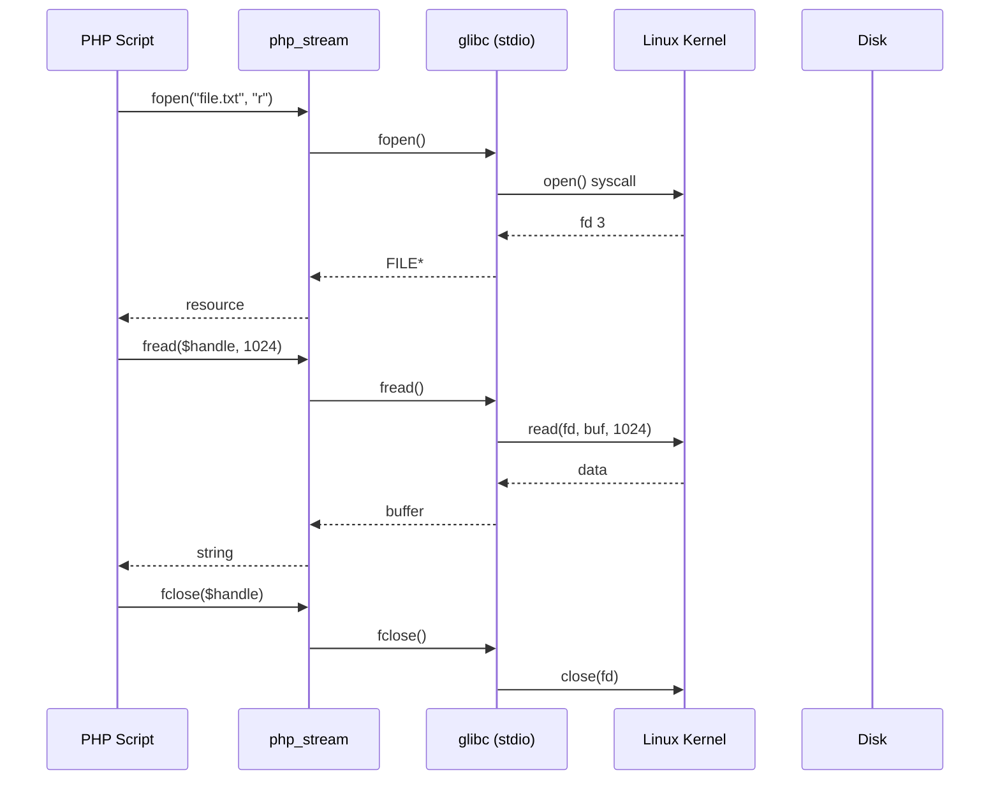

أنا جاهز يا هندسة.. هاردك وراك في Day02.  
هبدأ بـ **الجزء الأول**، وفيه هشرح **كل حاجة عن ملفات (Files)** بالتفاصيل اللي تخلي الـ C++/Java/JS يغيروا رأيهم في PHP.  
الجزء التاني هيكون عن **المصفوفات (Arrays)** بكل أنواعها وأسرارها تحت الكبوت.  
والجزء التالت هنحل **Lab 02** بأسلوب إنتاجي على Ubuntu مع validation وحذف من ملف.

---

# 📄 File 1: `PHPDay02_Part1.md`

# 🗃️ PHP Day02 – الجزء الأول: التعامل مع الملفات (Files) تحت الكبوت

## 🎯 الـ Core Problem

إيه المشكلة الأساسية؟ تخزين البيانات بشكل مؤقت أو دائم بدون قاعدة بيانات.  
حل PHP: **Flat files** (text files). لكن الـ flat files مش مجرد `fopen` وخلاص. لازم تفهم الـ file descriptors، الـ locking، الـ buffering، وفروق الـ modes على Linux.

> [!DEEP-DIVE]
> PHP بتستخدم نفس system calls اللي في C: `open()`, `read()`, `write()`, `close()`, `lseek()`, `flock()`. كل ملف بتفتحه في PHP بيستلم **resource** (وهو رقم file descriptor في الـ OS). الفرق إن PHP بتضيف طبقة من الـ buffering (user-space) عشان تقلل عدد الـ syscalls.

---

## 🐧 1. فتح الملف – `fopen()` وإختيار الـ mode الصح

```php
$handle = fopen("/var/www/data/users.txt", "r");
if ($handle === false) {
    // فشل الفتح – غالباً permissions أو الملف مش موجود
    error_log("Cannot open file");
    exit;
}
```

### جدول الـ modes المهمة على Ubuntu (Linux):

| Mode | المعنى | تحت الكبوت (system call flags) |
|------|--------|--------------------------------|
| `r`  | قراءة فقط، المؤشر في البداية | `O_RDONLY` |
| `r+` | قراءة وكتابة، المؤشر في البداية | `O_RDWR` |
| `w`  | كتابة فقط، إنشاء ملف جديد أو مسح المحتوى الموجود | `O_WRONLY | O_CREAT | O_TRUNC` |
| `w+` | قراءة وكتابة، مسح المحتوى | `O_RDWR | O_CREAT | O_TRUNC` |
| `a`  | كتابة فقط، إلحاق في النهاية (append) | `O_WRONLY | O_CREAT | O_APPEND` |
| `a+` | قراءة وكتابة، إلحاق | `O_RDWR | O_CREAT | O_APPEND` |
| `x`  | كتابة فقط، يفشل لو الملف موجود (cautious) | `O_WRONLY | O_CREAT | O_EXCL` |
| `x+` | قراءة وكتابة، يفشل لو الملف موجود | `O_RDWR | O_CREAT | O_EXCL` |
| `b`  | ثنائي (في Windows مهم، في Linux ممكن تتجاهله) | لا يغير شيئاً في Linux |

> [!WARNING]
> في Linux، الـ `b` (binary) لا معنى له لأن Linux ما بيفرقش بين text و binary. لكن للـ portability، خليها عادة: `"rb"`, `"wb"`.

### مقارنة مع C++:

```cpp
// C++
std::ifstream file("users.txt");  // r
std::ofstream out("log.txt", std::ios::app); // a
```

```php
// PHP
$file = fopen("users.txt", "r");
$log = fopen("log.txt", "a");
```

### تحت الكبوت: لما تفتح ملف في PHP، Zend Engine بتستدعي `php_stream_open_wrapper` اللي بيستخدم `open()` system call. الرجوع resource بيفتح file descriptor في جدول العمليات. كل عملية (FPM worker) ليها حد أقصى لعدد الـ file descriptors (usually 1024). لو فتحت ملفات كتير ومش قفلتهم، هتوصل للحد وتخرب السيرفر.

---

## 📝 2. الكتابة في الملف – `fwrite()` و `fputs()`

```php
$handle = fopen("log.txt", "a");
fwrite($handle, "New entry at " . date('Y-m-d H:i:s') . "\n");
fclose($handle);
```

الـ `fwrite()` بترجع عدد البايتات اللي اكتبتها فعلاً.

### مقارنة مع Java:

```java
// Java
try (FileWriter fw = new FileWriter("log.txt", true);
     BufferedWriter bw = new BufferedWriter(fw)) {
    bw.write("New entry...");
}
```

PHP أقصر بكتير، لكنه مش asynchronous. كل `fwrite` بتنفذ syscall write (ما لم يكن buffering داخلي).

> [!DEEP-DIVE]
> PHP بتستخدم **user-space buffering** افتراضي 8192 bytes (يعني مش كل `fwrite` تعمل syscall على طول). عشان تفرض الكتابة فوراً، استخدم `fflush($handle);` أو قفل الملف.

---

## 📖 3. القراءة من الملف – طرق متعددة لكل سيناريو

### 3.1 `fread()` – القراءة بالبايتات

```php
$handle = fopen("bigfile.log", "rb");
$content = fread($handle, filesize("bigfile.log"));
fclose($handle);
```

**الخطورة**: لو الملف كبير (مثلاً 100 MB)، `fread` هتقرأ كل حاجة في الذاكرة مرة واحدة. هتلبس في memory_limit.

### 3.2 `fgets()` – قراءة سطر بسطر (الأفضل للملفات الكبيرة)

```php
$handle = fopen("access.log", "r");
while (($line = fgets($handle)) !== false) {
    // كل سطر في $line, مع retained newline
    processLine($line);
}
fclose($handle);
```

تحت الكبوت: `fgets` بتقرأ من الـ buffer الحالي، لو خلصت بتطلب syscall جديدة. كفاءة عالية جداً.

### 3.3 `feof()` – التحقق من نهاية الملف

```php
$handle = fopen("data.txt", "r");
while (!feof($handle)) {
    $line = fgets($handle);
    // don't assume $line always has data
}
```

> [!WARNING]
> `feof` بترجع true فقط بعد محاولة قراءة ما بعد النهاية. أحسن استخدام `while (($line = fgets($handle)) !== false)`.

### 3.4 `fgetcsv()` – للملفات المفصولة بفواصل (Excel-like)

```php
$handle = fopen("users.csv", "r");
while (($row = fgetcsv($handle, 1000, ",")) !== false) {
    // $row is array of columns
    var_dump($row);
}
fclose($handle);
```

مقارنة مع Node.js: في Node لازم تستخدم مكتبة خارجية `csv-parser`. في PHP موجودة في القلب.

### 3.5 قراءة كل الملف مرة واحدة – `file_get_contents()`, `readfile()`, `file()`

| الدالة | الإرجاع | مناسب لـ |
|--------|---------|----------|
| `file_get_contents("file.txt")` | string (كل المحتوى) | ملفات صغيرة |
| `readfile("file.txt")` | عدد البايتات، ويطبع مباشرة | خدمة ملفات static |
| `file("file.txt")` | array (كل سطر عنصر) | معالجة سطور معينة |

```php
$config = file_get_contents("/etc/php/8.1/cli/php.ini"); // صغير
$lines = file("log.txt"); // كل سطر في array
```

> [!DEEP-DIVE]
> `file_get_contents` بتستخدم memory mapping (`mmap`) لو كان الملف كبيراً والـ OS بيدعم، لكن في الغالب بتحمل الملف في الذاكرة. لملفات كبيرة جداً، استخدم `fopen` + `fread` بحجم chunk صغير.

---

## 🔒 4. Locking الملفات – `flock()` عشان ما تبوظش البيانات

لما أكتب من أكتر من عملية (FPM workers) في نفس الملف، لازم lock.

```php
$handle = fopen("counter.txt", "r+");
if (flock($handle, LOCK_EX)) {  // Exclusive lock (write)
    $count = (int) fread($handle, 100);
    $count++;
    rewind($handle);
    fwrite($handle, $count);
    fflush($handle);
    flock($handle, LOCK_UN);
}
fclose($handle);
```

### أنواع الـ locks:

| Constant | المعنى | تحت الكبوت |
|----------|--------|------------|
| `LOCK_SH` | قراءة مشتركة (read lock) | `flock(fd, LOCK_SH)` |
| `LOCK_EX` | كتابة حصرية (write lock) | `flock(fd, LOCK_EX)` |
| `LOCK_UN` | فتح القفل | `flock(fd, LOCK_UN)` |
| `LOCK_NB` | عدم الانتظار (غير blocking) | `LOCK_EX \| LOCK_NB` |

> [!WARNING]
> `flock` في Linux بتعمل **advisory locking**، يعني لو برنامج تاني مش بيستخدم `flock`، هو هيكتب في الملف برضه. لا تحمي 100%. لضمان حقيقي استخدم `sqlite` أو قاعدة بيانات.

### مقارنة مع Node.js (نفس المشكلة):

في Node، `fs.createWriteStream` مع `'wx'` flag, أو استخدم `lockfile` package. لكن PHP أسهل.

---

## 🧠 5. وظائف مفيدة إضافية للملفات

| الدالة | الـ استخدام | مثال على Ubuntu |
|--------|-------------|------------------|
| `file_exists($path)` | هل الملف موجود؟ | `if (!file_exists("/tmp/session.txt"))` |
| `is_file($path)`, `is_dir()` | نوع الملف | `is_dir("/var/www")` |
| `is_readable()`, `is_writable()` | صلاحيات | `if (!is_writable("data/"))` |
| `unlink($path)` | حذف الملف | `unlink("/tmp/cache.tmp");` |
| `copy($src, $dest)` | نسخ | `copy("backup.txt", "backup2.txt");` |
| `rename($old, $new)` | نقل/إعادة تسمية | `rename("upload.tmp", "uploads/photo.jpg");` |
| `filesize($path)` | حجم الملف بالبايت | `$size = filesize("bigfile.log");` |
| `fileperms($path)` | الصلاحيات (octal) | `chmod($file, 0644);` |
| `rewind($handle)` | المؤشر للبداية | `rewind($handle);` |
| `ftell($handle)` | مكان المؤشر الحالي (بايت) | |
| `fseek($handle, $offset, $whence)` | نقل المؤشر | `fseek($handle, 10, SEEK_SET);` |

### مثال: قراءة جزء معين من ملف كبير

```php
$handle = fopen("huge.log", "rb");
fseek($handle, 1024 * 1024, SEEK_SET); // ابدأ من الميجابايت 1
$chunk = fread($handle, 4096);
fclose($handle);
```

تحت الكبوت: `fseek` بتستخدم `lseek()` system call.

---

## ⚠️ 6. مشاكل الـ flat files (ليه أتجنبها لقاعدة بيانات)

السلايدات ذكرت المشاكل:

1. **بطء مع الملفات الكبيرة** – كل عملية قراءة sequential.
2. **صعوبة البحث** – مافيش indexes.
3. **صلاحيات محدودة** – بس permissions بتاعت الملف (قراءة/كتابة لكل الـ workers).
4. **التزامن** – الـ flock بيعمل bottleneck.

**متى أستخدم flat files?**
- Config files (small, read rarely)
- Logs (append only)
- Caching (but prefer Redis)
- Import/Export CSV

**متى أستخدم قاعدة بيانات?**
- Concurrent writes
- Complex queries
- Relationships

---

## 📊 Visualization – دورة حياة ملف في PHP على Ubuntu



---

## 🧪 ميكرو-أمثلة (Production-ready snippets)

### مثال 1: كتابة log آمنة مع lock

```php
function writeLog($message) {
    $logFile = "/var/log/myapp.log";
    $handle = fopen($logFile, "a");
    if (!$handle) return false;
    
    if (flock($handle, LOCK_EX)) {
        fwrite($handle, "[" . date('c') . "] " . $message . PHP_EOL);
        fflush($handle);
        flock($handle, LOCK_UN);
    }
    fclose($handle);
    return true;
}
```

### مثال 2: قراءة ملف CSV كبير بدون استهلاك ذاكرة

```php
function processLargeCSV($filename, callable $callback) {
    if (!is_readable($filename)) {
        throw new Exception("File not readable");
    }
    $handle = fopen($filename, "rb");
    if ($handle === false) return;
    
    while (($row = fgetcsv($handle, 0, ",")) !== false) {
        $callback($row);
    }
    fclose($handle);
}
```

### مثال 3: نسخ ملف مع تقدم (للملفات الكبيرة)

```php
function copyFileWithProgress($src, $dest, $chunkSize = 8192) {
    $srcHandle = fopen($src, "rb");
    $destHandle = fopen($dest, "wb");
    if (!$srcHandle || !$destHandle) return false;
    
    while (!feof($srcHandle)) {
        $chunk = fread($srcHandle, $chunkSize);
        fwrite($destHandle, $chunk);
        // optional: flush every X MB
    }
    fclose($srcHandle);
    fclose($destHandle);
    return true;
}
```

---

## 🧠 خلاصة الجزء الأول (Files)

- PHP تدعم flat files بنفس system calls بتاعت C.
- `fopen()` + modes مهمين جداً على Linux (`a` للـ append، `x` للحماية من overwrite).
- `flock()` ضروري للتزامن، لكنه advisory.
- لملفات كبيرة: `fgets()` أو `fgetcsv()` سطر بسطر. تجنب `file_get_contents()`.
- دوال `file_exists`, `is_writable`, `unlink` هي أساس الـ file management.

---

[أنا خلصت الجزء الأول يا هندسة.. قولي "كمل الشرح" عشان أكتبلك الجزء التاني عن Arrays مع 10 أسئلة انترفيو]