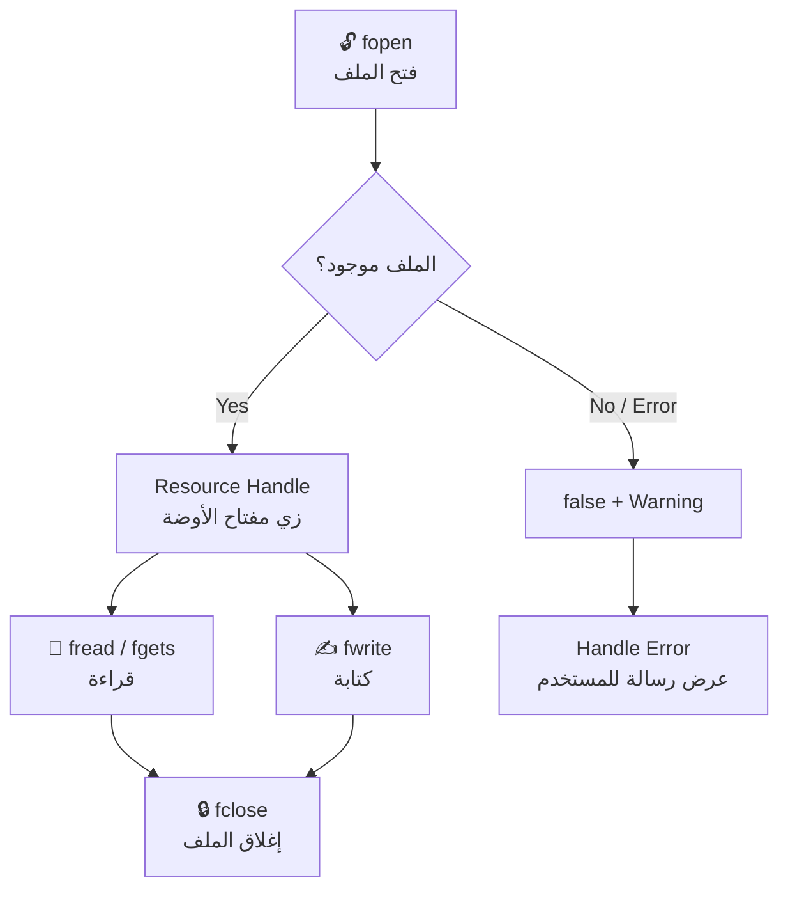
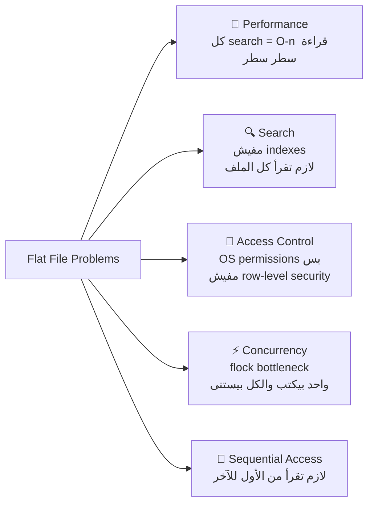
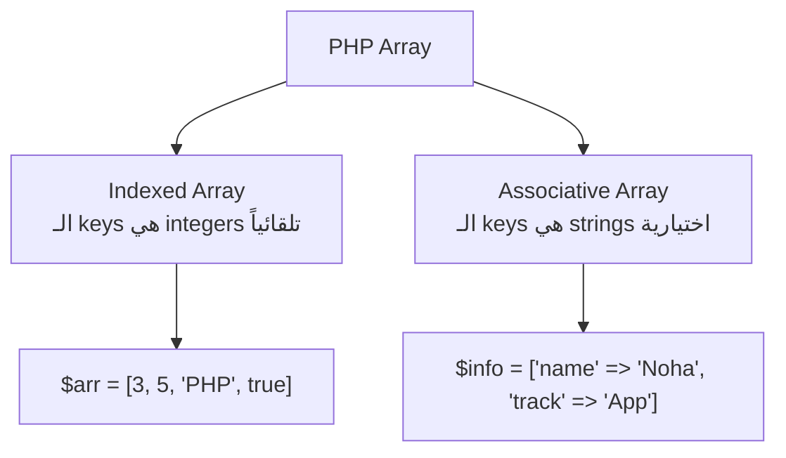
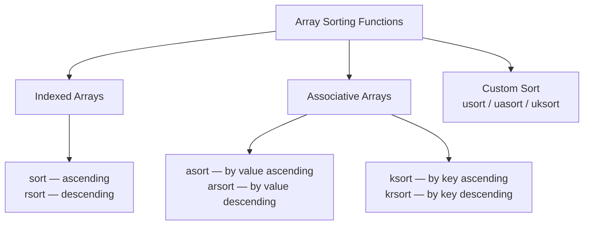
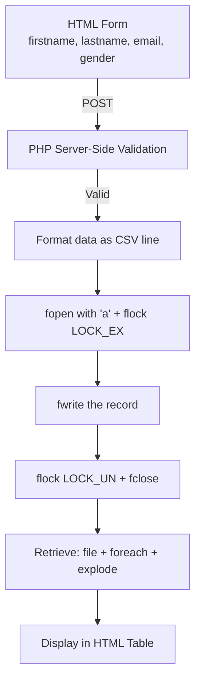

# 🐘 PHP Day 02 — الفايل اللي هيعلمك كل حاجة عن Files & Arrays

---

## 📌 Module 01: Files in PHP

---

### 🧠 المشكلة الساذجة — ليه أصلاً نحتاج نتعامل مع Files؟

تعالى نفكر مع بعض. أنت بتبني موقع registration بسيط. المستخدم بيدخل اسمه وإيميله، وانت عايز تحفظ البيانات دي. 

المبتدئ هيعمل إيه؟

```php
<?php
// A beginner just echoes the data — stored nowhere!
echo "Name: " . $_POST['name'];
// Data is GONE after the request ends
?>
```

مفيش database لسه، مفيش persistence. كل request بتتحفظ في الـ RAM بس، وبعدين... باي باي. 🫠

الحل البدائي الأول في تاريخ البشرية كان **Flat Files** — ملفات نص عادية بنحفظ فيها البيانات على الـ Disk.

---

> [!INFO]
> **Flat File vs Database**
> بتخزن البيانات بطريقتين أساسيتين:
> - **Flat File**: ملف نص بسيط على الـ Disk (`.txt`, `.csv`, `.json`)
> - **Database**: نظام متكامل فيه indexing وqueries وconcurrency control
>
> الـ Flat File كويس للـ small-scale data، لكن بيتعب جداً في الـ production لأسباب هنشوفها بالتفصيل في آخر الـ module.

---

### ⚙️ The File Lifecycle — دورة حياة الملف



---

### 🔑 fopen() — المفتاح الرئيسي

```php
fopen(string $filename, string $mode): resource|false
```

الـ `fopen` بترجع **Resource** — مش string، مش array. Resource ده زي مفتاح أوضة في فندق. إنت مش شايل الأوضة كلها، إنت شايل مفتاح بس عشان تقدر توصل ليها.

> [!DEEP-DIVE]
> **تحت الكبوت — File Descriptor**
>
> لما بتعمل `fopen()`، الـ PHP بيطلب من الـ OS (Linux/Windows) يفتح الملف. الـ OS بيرجع حاجة اسمها **File Descriptor** — رقم integer بسيط (زي 3, 4, 5) بيمثل الملف المفتوح في الـ Kernel. الـ PHP بيـwrap الرقم ده في الـ Resource object. لما بتعمل `fclose()` إنت بتقول للـ OS: "خلاص أنا خلصت، حرر الـ File Descriptor."
>
> لو نسيت `fclose()` في server بيشتغل 24/7، الـ File Descriptors هتـaccumulate لحد ما الـ process تـcrash. ده اللي بنسميه **File Descriptor Leak**.

---

### 📋 File Modes — الـ modes المتاحة

| Mode | الاسم | البيهافيور |
|------|--------|------------|
| `r` | Read | بيفتح للقراءة من البداية. لو الملف مش موجود → `false` |
| `r+` | Read+Write | قراءة وكتابة من البداية. الملف لازم يكون موجود |
| `w` | Write | كتابة من البداية. **يمسح المحتوى الموجود!** لو مش موجود، بيخلقه |
| `w+` | Write+Read | زي `w` بس بيسمح بالقراءة كمان |
| `x` | Cautious Write | **Exclusive creation** — لو الملف موجود، بيرجع `false` + Warning |
| `x+` | Cautious Write+Read | زي `x` + قراءة |
| `a` | Append | كتابة من النهاية. مش بيمسح حاجة. لو مش موجود، بيخلقه |
| `a+` | Append+Read | زي `a` + قراءة |
| `rb` / `wb` | Binary | مهم على Windows. على Linux مفيش فرق عملياً |

> [!WARNING]
> **⚠️ الـ `w` mode خطر جداً!**
> لو فتحت ملف موجود فيه بيانات مهمة بـ`w`، الـ PHP هيمسح كل حاجة جوه **فوراً** حتى لو ما كتبتش حاجة بعد كده. الـ truncation بتحصل عند الـ `fopen` نفسه مش عند الـ `fwrite`.
>
> للـ logging مثلاً، دايماً استخدم `a` (append) مش `w`.

---

### 📝 مثال 1 — فتح ملف بـ read mode

```php
<?php
declare(strict_types=1);

// Open a file in read mode
$fileHandler = fopen("welcome.txt", "r");

// fopen returns resource(3, stream) if successful
var_dump($fileHandler); // resource(3, stream)
```

الـ `resource(3, stream)` ده معناه: File Descriptor رقم 3 (بعد stdin=0, stdout=1, stderr=2).

---

### 🛡️ Error Handling مع fopen

**الطريقة الساذجة (لا تعملها):**
```php
<?php
// Bad practice — no error handling
$file = fopen("notexist.txt", "r");
fread($file, 100); // PHP Warning + Fatal Error
```

**الطريقة الصح — باستخدام `@` suppressor وفحص النتيجة:**
```php
<?php
declare(strict_types=1);

// Suppress PHP's default warning and handle it yourself
@$file = fopen("abc.txt", "r");

if ($file) {
    echo "File opened successfully";
    fclose($file);
} else {
    echo "File not found — please check the path";
}
```

> [!INFO]
> الـ `@` error suppressor بيمنع الـ PHP من طباعة الـ Warning في الـ output، بس مش بيمنع الـ error من الحدوث. في PHP 8+ الأفضل تستخدم `try/catch` مع `set_error_handler`. الـ `@` مقبول في بعض legacy code، بس ماتعتمدش عليه في production.

---

### ✍️ Writing إلى ملف — `fwrite()`

```php
int fwrite(resource $handle, string $string, int $length = ?): int|false
```

**الخطوات الثلاث:**

```php
<?php
declare(strict_types=1);

// Step 1: Open for writing (creates file if not exists, truncates if exists)
$fileHandler = fopen("welcome.txt", "w");

// Step 2: Write to the file
fwrite($fileHandler, "I am writing using fwrite");

// Step 3: Close to flush buffer and release File Descriptor
fclose($fileHandler);
```

> [!INFO]
> `fputs()` هو alias بالظبط لـ `fwrite()`. مفيش فرق. اختار واحدة وثبت عليها.

> [!DEEP-DIVE]
> **Buffer Flushing**
>
> لما بتعمل `fwrite()`، الـ data مش بتروح للـ Disk فوراً. بتتحط في **Write Buffer** في الـ RAM أول. الـ OS بيقرر لما يعمل **flush** فعلي للـ Disk (كل حوالي 512KB أو عند الـ `fclose`). لو السيرفر وقع قبل `fclose()` أو الـ buffer flush، ممكن تخسر بعض الـ data. عشان كده الـ `fclose()` مش اختياري، هو **ضروري**.

---

### 📖 Reading من ملف — `fread()`

```php
<?php
declare(strict_types=1);

$fileHandler = fopen("welcome.txt", "r");

// Get file size to know how many bytes to read
$fileSize = filesize("welcome.txt");

// Read the entire file content
$data = fread($fileHandler, $fileSize);
var_dump($data); // string 'I am writing using fwrite' (length=25)

fclose($fileHandler);
```

---

### 🔄 Reading line by line — `fgets()` + `feof()`

التشبيه الواقعي: تخيل الملف زي رواية. `fgets()` بتقرأ سطر سطر. `feof()` بتقولك "هل وصلنا لآخر الصفحة؟"

```php
<?php
declare(strict_types=1);

$fileHandler = fopen("welcome.txt", "r");

// feof() returns true when the file pointer reaches the end
while (!feof($fileHandler)) {
    // fgets() reads one line at a time including the newline character
    echo fgets($fileHandler) . "<br>";
}

fclose($fileHandler);
```

---

### 📊 `fgetcsv()` — قراءة CSV files

```php
<?php
declare(strict_types=1);

$fileHandler = fopen("data.csv", "r");

while (!feof($fileHandler)) {
    // fgetcsv splits each line by the delimiter into an array
    $row = fgetcsv($fileHandler, 100, ",");
    var_dump($row);
}

fclose($fileHandler);
```

الـ Output بيجي array لكل سطر: `['Andrew', 'Application', 'ITI']`

---

### ⚡ One-Step Reading — من غير فزلكة

ليه كل ده لو في functions أبسط؟

```php
<?php
declare(strict_types=1);

// readfile() — outputs content directly to browser, returns byte count
readfile("welcome.txt"); // Outputs: I am writing using fwrite...

// file() — reads file and returns each line as an array element
$data = file("welcome.txt");
var_dump($data); // array(5) { [0]=> 'line 1</br>', [1]=> 'line 2</br>', ... }

// file_get_contents() — returns entire file as a string (most commonly used)
$content = file_get_contents("welcome.txt");
var_dump($content); // string 'I am writing using fwrite...' (length=57)
```

> [!INFO]
> **الزتونة**: في الـ real world، `file_get_contents()` هي الـ function الأكثر استخداماً لقراءة ملفات صغيرة. وأكثر من كده، بتشتغل مع URLs كمان: `file_get_contents("https://api.example.com/data")` — ده بيستخدمه ناس كتير كـHTTP client بدائي.

---

### 🧭 File Pointer Functions

الـ file pointer زي cursor في editor — بيقولك إنت واقف فين في الملف.

```php
<?php
declare(strict_types=1);

$file = fopen("welcome.txt", "r");

// ftell() — where is the pointer? (in bytes from start)
echo ftell($file); // 0 (at the beginning)

fread($file, 10); // Read 10 bytes
echo ftell($file); // 10

// fseek() — jump to a specific position
fseek($file, 0); // Go back to start (same as rewind)
// Or jump to byte 5
fseek($file, 5);

// rewind() — shortcut to go back to position 0
rewind($file);

fclose($file);
```

---

### 🔧 File Utility Functions

```php
<?php
declare(strict_types=1);

// Check if file exists (before trying to open it)
if (file_exists("welcome.txt")) {
    echo "File is there!";
}

// Delete a file (unlink = "remove the directory entry")
unlink("old_file.txt");

// Copy a file
copy("source.txt", "destination.txt");

// Get only the filename from a full path
$path = "C:\\wamp64\\www\\PHPSmart\\Day02\\filehandling.php";
echo basename($path); // filehandling.php

// Check file type (returns 'file', 'dir', 'link', etc.)
echo filetype("welcome.txt"); // file
echo filetype("/var/www"); // dir

// Check file permissions
var_dump(is_readable("welcome.txt")); // bool(true)
var_dump(is_writable("welcome.txt")); // bool(true)
var_dump(is_executable("welcome.txt")); // bool(false) — it's not a binary
```

---

### 🔐 File Locking — `flock()` — البواب اللي بيمنع الفوضى

**تخيل السيناريو ده:**

الساعة 12 الظهر، 1000 user بيسجلوا في نفس الوقت، وكلهم بيكتبوا في نفس الـ `customers.txt`. لو في concurrent writes من غير locking، ممكن يحصل ده:

```
User A writes: "Ahmed,Cairo</br>"
User B writes: "Mohamed,Alex</br>"
↓
File gets: "Ahmed,MohaCairo</br>med,Alex</br>"  ← Data corruption! 💥
```

ده اسمه **Race Condition**.

```php
<?php
declare(strict_types=1);

$file = fopen("customers.txt", "a");

// Try to acquire an exclusive write lock
// flock() BLOCKS (waits) until the lock is available
if (flock($file, LOCK_EX)) {
    // Write only after we have exclusive access
    fwrite($file, "Ahmed,Cairo</br>");

    // Release the lock so others can write
    flock($file, LOCK_UN);
} else {
    echo "Error: Could not lock file!";
}

fclose($file);
```

| Lock Constant | المعنى |
|---|---|
| `LOCK_SH` | Shared Read Lock — ناس كتير يقدروا يقرأوا في نفس الوقت |
| `LOCK_EX` | Exclusive Write Lock — واحد بس يكتب، الكل تاني بيستنى |
| `LOCK_UN` | Unlock — تحرير القفل |

> [!DEEP-DIVE]
> **`flock()` هي Advisory Lock مش Mandatory Lock**
>
> على Linux، `flock()` بتعمل **advisory lock** — يعني بتشتغل بس لو كل الـ processes بتستخدمها. لو process تانية بتكتب في الملف من غير `flock()`، مش هيتوقفها حاجة. عشان كده في production systems بيستخدموا **database transactions** أو **message queues** (زي Redis) بدل الـ flat files للـ concurrent writes.

---

### 💀 File Problems — ليه الـ Flat Files مش Production-Ready?

السلايد بتسألك سؤال مهم جداً. تعالى نفهم:



ده بالظبط سبب وجود الـ **Relational Databases** — MySQL, PostgreSQL. بتحل كل المشاكل دي بشكل elegant. هنيجيلها في الـ sessions الجاية.

---

### 🎯 أسئلة الإنترفيو — Files

1. **ما الفرق بين `fread()` و `file_get_contents()`؟ امتى تستخدم كل واحدة؟**
2. **إيه هو الـ File Descriptor وإيه هي مشكلة الـ File Descriptor Leak؟**
3. **ما الفرق بين `w` mode و `a` mode في `fopen()`؟ وامتى استخدام `w` يكون كارثي؟**
4. **إيه هو الـ Race Condition في كتابة الملفات وإزاي `flock()` بتحله؟**
5. **إيه الفرق بين `LOCK_SH` و `LOCK_EX`؟ امتى تستخدم كل واحدة؟**

---

### 📝 خلاصة الدرس — Files

التعامل مع الملفات في PHP بيمشي على 3 خطوات: فتح → معالجة → إغلاق. الـ `fopen()` بترجع resource مش data. اختيار الـ mode الغلط ممكن يمسح data بالغلط. الـ `fclose()` واجبة مش اختيارية. في الـ concurrent environments لازم `flock()` مع `LOCK_EX` قبل الكتابة. الـ Flat Files مناسبة للـ simple use cases بس، ولو الـ scale كبر، روح للـ Database.

---

---

## 📌 Module 02: Arrays in PHP

---

### 🧠 الـ PHP Array — الوحش المختلف عن أي لغة تانية

لو جيت من JavaScript أو Java أو C++، هتقول "عارف الـ arrays". لكن خليني أصحيك 👇

في PHP، الـ **Array هو في الحقيقة Ordered Hash Map**. مش array بالمعنى التقليدي اللي بيخزن في contiguous memory blocks. ده structure مختلف تماماً تحت الكبوت.

> [!DEEP-DIVE]
> **Zend Engine Array — HashTable**
>
> الـ PHP Array internally هو `HashTable` في الـ Zend Engine. كل element عنده:
> - **Key**: ممكن يكون integer أو string
> - **Value**: ممكن يكون أي type (حتى array تانية!)
> - **Pointer** للـ element اللي قبله وبعده (للـ ordered traversal)
>
> عشان كده الـ PHP Array بيعمل الوظيفتين: Array (indexed) و HashMap (associative) في نفس الوقت. الـ cost؟ كل element بياخد ~72 bytes في الـ RAM. في C++، integer array بياخد 4 bytes بس.

---

### نوعين الـ Arrays في PHP



---

### 📦 Indexed Arrays

```php
<?php
declare(strict_types=1);

// Method 1: Short syntax (modern PHP)
$arr = [3, 5, "Application", true, "PHP"];

// Method 2: Legacy syntax (still valid)
$arr1 = array("Noha", "Engineering", "ITI");

// Access by index (zero-based)
echo $arr[0]; // 3
echo $arr[2]; // Application

// Loop with count()
for ($i = 0; $i < count($arr); $i++) {
    echo $arr[$i] . " ";
}
// Output: 3 5 Application 1 PHP
```

> [!WARNING]
> لاحظ إن `True` اتطبع كـ`1` مش `true`. في PHP، لما تعمل `echo` على boolean، `true` بيتحول لـ`"1"` و `false` بيتحول لـ`""` (empty string). ده مش bug، ده بيهافيور مقصود بسبب الـ loose typing.

---

### 🎯 `range()` — مولد المتتاليات

```php
<?php
declare(strict_types=1);

// Generate numeric range: 0, 2, 4, 6, 8, 10
$numRange = range(0, 10, 2);
var_dump($numRange); // array(6) { 0, 2, 4, 6, 8, 10 }

// Generate alphabetic range with step
$alphRange = range("A", "Z", 4);
foreach ($alphRange as $char) {
    echo $char . " , "; // A , E , I , M , Q , U , Y ,
}
```

---

### 🗺️ Associative Arrays

التشبيه: تخيل الـ Associative Array زي **بطاقة هوية** — مش بتقول "العنصر رقم 0، 1، 2"، بتقول "الـ name ده، الـ email ده".

```php
<?php
declare(strict_types=1);

// Key => Value pairs
$info = [
    "Name"  => "Noha",
    "Email" => "nshehab@iti.gov.eg",
    "Track" => "Application"
];

// Access by key
echo $info["Name"]; // Noha

// Loop with key and value
foreach ($info as $key => $value) {
    echo $key . " : " . $value . "<br>";
}

// Add new element
$info["Intake"] = 35;
```

---

### 🎁 `compact()` — بناء array من variables موجودة

```php
<?php
declare(strict_types=1);

$name  = "Noha Shehab";
$email = "nshehab@iti.gov.eg";

// compact() uses variable NAMES as keys and their VALUES as values
$info = compact("name", "email");

// Result: ['name' => 'Noha Shehab', 'email' => 'nshehab@iti.gov.eg']
var_dump($info);
```

ده بيستخدم كتير جداً في الـ MVC frameworks لتمرير variables لـ views.

---

### 🔢 Multi-dimensional Arrays

```php
<?php
declare(strict_types=1);

// Array of arrays — each element is itself an array
$students = array(
    1 => array("Ali",    "IOT"),
    2 => array("Mostafa","Cloud"),
    3 => ["Noha",        "Application"]
);

// Access: outer key => inner index
echo $students[1][0]; // Ali
echo $students[3][1]; // Application

// Nested loops for traversal
foreach ($students as $id => $student) {
    echo "Student $id: " . $student[0] . " - " . $student[1] . "<br>";
}
```

---

### ➕ Array Operators — الزتونة اللي بتيجي في الإنترفيو

```php
<?php
declare(strict_types=1);

$num    = [2, 4, 6, 8, 10];  // keys: 0,1,2,3,4
$alphas = ["a", "b", "c", "d"]; // keys: 0,1,2,3

// Union operator (+): keeps LEFT array's values for duplicate keys
$result = $num + $alphas;
var_dump($result);
// Output: [2, 4, 6, 8, 10] — alphas got NO chance!
// Because $num already has keys 0,1,2,3 — union doesn't override existing keys
```

> [!WARNING]
> **الـ Union `+` مش زي `array_merge()`!**
>
> - الـ `+` operator بيحتفظ بـ values الـ array الأيسر لأي key موجود في الاتنين
> - الـ `array_merge()` بيـoverwrite الـ values بتاعة الـ array الأيسر بالـ values بتاعة الـ array الأيمن لو الـ keys strings
> - لو الـ keys أرقام، `array_merge()` بيعيد numbering كل حاجة من 0
>
> ده سؤال إنترفيو classic!

| Operator | المعنى |
|---|---|
| `+` | Union — اتحاد بدون override للـ existing keys |
| `==` | Equality — نفس الـ key-value pairs (بغض النظر عن الترتيب والـ type) |
| `===` | Identity — نفس الـ key-value pairs **ونفس الترتيب ونفس الـ type** |
| `!=` / `<>` | Inequality |
| `!==` | Non-identity |

---

### 🔃 Array Sorting — The Full Map



```php
<?php
declare(strict_types=1);

// sort() — reindexes the array (keys are reset to 0,1,2,...)
$names = ['noha', 'Fatma', 'Dina', 'Andrew', 'Shimaa', 'suliman'];
sort($names);
// Capital letters come BEFORE lowercase in ASCII
// Result: ['Andrew', 'Dina', 'Fatma', 'Shimaa', 'noha', 'suliman']
```

> [!WARNING]
> الـ `sort()` بيمسح الـ original keys وبيعمل re-indexing من 0. لو كنت شاغل بال الـ keys (زي associative array)، استخدم `asort()` بدلها.

```php
<?php
declare(strict_types=1);

// asort() — sort by VALUE, preserves keys
$prices = array("meat" => 100, "sugar" => 10, "tea" => 8);
asort($prices);
// Result: ['tea' => 8, 'sugar' => 10, 'meat' => 100]

// ksort() — sort by KEY, preserves key-value association
$info = ["Name" => "Noha", "Email" => "nshehab@iti.gov.eg", "Track" => "Application"];
ksort($info);
// Result: ['Email' => ..., 'Name' => ..., 'Track' => ...]
```

---

### 🔧 usort() — Custom Comparison

```php
<?php
declare(strict_types=1);

// Custom comparator: returns -1 (a<b), 0 (a==b), 1 (a>b)
function cmp(int $a, int $b): int
{
    if ($a === $b) return 0;
    return ($a < $b) ? -1 : 1;
}

$a = [3, 2, 5, 6, 1];
usort($a, "cmp");

foreach ($a as $key => $value) {
    echo "$key: $value <br>"; // 0:1, 1:2, 2:3, 3:5, 4:6
}
```

في PHP 8+ ممكن تستخدم الـ **Spaceship Operator** بدل الـ function دي:

```php
<?php
declare(strict_types=1);

$a = [3, 2, 5, 6, 1];
// The spaceship operator <=> returns -1, 0, or 1 automatically
usort($a, fn($a, $b) => $a <=> $b);
```

---

### 🔄 Reordering Functions

```php
<?php
declare(strict_types=1);

$fruits = ['banana', 'apple', 'kiwi', 'orange'];

// shuffle() — randomly reorders (modifies in place)
shuffle($fruits);

// array_reverse() — returns new array in reverse order
$reversed = array_reverse($fruits);

// array_push() — add to END (equivalent to $arr[] = value)
array_push($fruits, "mango");

// array_pop() — remove from END and return it
$last = array_pop($fruits); // "mango"

// array_shift() — remove from BEGINNING and return it
$first = array_shift($fruits); // first element

// array_unshift() — add to BEGINNING
array_unshift($fruits, "strawberry");
```

---

### 🔁 Array Flip

```php
<?php
declare(strict_types=1);

$colors = array(
    'one'   => 'red',
    'two'   => 'blue',
    'three' => 'yellow'
);

// Swap keys with values
$flipped = array_flip($colors);
var_dump($flipped);
// Result: ['red' => 'one', 'blue' => 'two', 'yellow' => 'three']
```

> [!WARNING]
> لو في duplicate values في الـ original array، الـ `array_flip()` هيحتفظ بآخر occurrence بس. فـ`['a', 'b', 'a']` بعد الـ flip هيبقى `['a' => 2, 'b' => 1]` — الـ key `'a'` الأولانية اتكسح.

---

### 🧭 Array Navigation & Pointer Functions

الـ PHP Array عنده **internal pointer** — زي cursor في file بالظبط.

```php
<?php
declare(strict_types=1);

$fruits = ['banana', 'apple', 'kiwi', 'orange'];

// Check if value exists
$found = in_array('banana', $fruits); // true

// Pointer functions
var_dump(current($fruits)); // banana — current position
var_dump(next($fruits));    // apple  — move forward
var_dump(next($fruits));    // kiwi   — move forward again
var_dump(current($fruits)); // kiwi   — still at kiwi
var_dump(reset($fruits));   // banana — jump to FIRST
var_dump(end($fruits));     // orange — jump to LAST
var_dump(prev($fruits));    // kiwi   — move backward
```

---

### 🚶 `array_walk()` — اعمل حاجة لكل element

```php
<?php
declare(strict_types=1);

function print_fruits(string $value): void
{
    echo "$value <br/>";
}

$fruits = ['banana', 'apple', 'kiwi', 'orange'];
array_walk($fruits, "print_fruits");
// Output: banana, apple, kiwi, orange (each on new line)
```

في PHP 8+ الأجمل تستخدم `array_map()`:

```php
<?php
declare(strict_types=1);

// array_map() — transform each element, returns new array
$upper = array_map('strtoupper', $fruits);
// Result: ['BANANA', 'APPLE', 'KIWI', 'ORANGE']
```

---

### 🔀 `array_map()` مع Array تانية في نفس الوقت

```php
<?php
declare(strict_types=1);

$instructors = ["Eng. Shery", "Noha", "Andrew"];
$courses     = ['Admin', 'PHP', 'Node'];

// Zip two arrays together with a transformation
$result = array_map(function(string $instructor, string $course): string {
    return "$instructor teaches $course";
}, $instructors, $courses);

var_dump($result);
// ['Eng. Shery teaches Admin', 'Noha teaches PHP', 'Andrew teaches Node']
```

---

### 🤝 `array_combine()` — اعمل associative من اتنين

```php
<?php
declare(strict_types=1);

$instructors = ["Eng. Shery", "Noha", "Andrew"];
$courses     = ['Admin', 'PHP', 'Node'];

// First array becomes KEYS, second becomes VALUES
$combined = array_combine($instructors, $courses);
// Result: ['Eng. Shery' => 'Admin', 'Noha' => 'PHP', 'Andrew' => 'Node']
```

---

### 🔗 `array_merge()` و `array_chunk()`

```php
<?php
declare(strict_types=1);

// array_merge() with a SINGLE array — converts numeric keys to 0,1,2,...
$a = array(5 => "banana", 22 => "kiwi");
var_dump(array_merge($a));
// Result: [0 => 'banana', 1 => 'kiwi'] — keys reset!

// array_chunk() — split array into smaller pieces
$input  = ['a', 'b', 'c', 'd', 'e'];
$chunks = array_chunk($input, 2);
// Result: [['a','b'], ['c','d'], ['e']]
```

---

### 🔍 `array_filter()` — شيل العناصر الفاضية

```php
<?php
declare(strict_types=1);

$my_array = [1, 90, 2, null, 3, '', 55, [], 5, 6, 7, 8, ""];

// Without callback: removes all "falsy" values (null, '', [], 0, false)
$non_empties = array_filter($my_array);
var_dump($non_empties);
// Result: [1, 90, 2, 3, 55, 5, 6, 7, 8] — note: KEYS are preserved!
```

> [!WARNING]
> الـ `array_filter()` بيحافظ على الـ original keys. لو بعدها محتاج re-indexing، استخدم `array_values()`.

---

### 🎯 `array_intersect_key()` — الـ field whitelisting pattern

ده pattern مهم جداً في validation:

```php
<?php
declare(strict_types=1);

// Use case: User sends data, you only want specific fields
$userInput = ['a' => 123, 'b' => 213, 'c' => 321, 'hacked_field' => 'evil'];
$allowed   = ['b', 'c'];

// array_flip converts ['b','c'] to ['b'=>0, 'c'=>1] — giving us keys to compare
$safe = array_intersect_key($userInput, array_flip($allowed));
print_r($safe);
// Result: ['b' => 213, 'c' => 321] — 'a' and 'hacked_field' are gone!
```

ده بيستخدم كتير في form validation عشان تمنع **Mass Assignment vulnerabilities**.

---

### 📊 Counting Functions

```php
<?php
declare(strict_types=1);

$students = ["Ali", "Ahmed", "Mostafa", "Omar", "Ahmed"];

// count() and sizeof() are identical
var_dump(count($students));  // int(5)
var_dump(sizeof($students)); // int(5) — alias for count()

// array_count_values() — frequency count for each unique value
var_dump(array_count_values($students));
// Result: ['Ali'=>1, 'Ahmed'=>2, 'Mostafa'=>1, 'Omar'=>1]
```

---

### 🔓 Convert Array to Scalars — `extract()` و `list()`

```php
<?php
declare(strict_types=1);

// extract() — keys become variable names
$info = ["username" => "Noha", "email" => "nshehab@iti.gov.eg", "track" => "Application"];
extract($info);
echo $username; // Noha
echo $email;    // nshehab@iti.gov.eg
echo $track;    // Application

// list() — destructure indexed array into variables
$data = ['coffee', 'brown', 'caffeine'];
list($drink, $color, $power) = $data;
echo "$drink is $color and $power makes it special.";
// coffee is brown and caffeine makes it special.
```

> [!WARNING]
> **`extract()` خطر جداً على user input!**
> لو عملت `extract($_POST)`، كل variable في الـ POST request هيبقى variable في الـ scope بتاعك. لو المستخدم بعت `isAdmin=1`، هيبقى عندك `$isAdmin = 1`. دايماً حدد الـ keys اللي عايز تـextract منها.

---

### 🏭 الـ Lab Pattern — CSV to HTML Table

```php
<?php
declare(strict_types=1);

// Load entire CSV file, each line becomes an array element
$staff = file("csvfile.csv");

echo "<table border='2'>";
echo "<tr><th>Name</th><th>Track</th><th>Company</th></tr>";

foreach ($staff as $record) {
    echo "<tr>";
    // explode() splits string by delimiter into array
    $data = explode(",", trim($record));
    foreach ($data as $val) {
        echo "<td>" . htmlspecialchars($val) . "</td>";
    }
    echo "</tr>";
}

echo "</table>";
```

> [!INFO]
> لاحظ استخدام `htmlspecialchars()` — ده بيحول `<`, `>`, `&` لـ HTML entities عشان نمنع **XSS (Cross-Site Scripting)**. دايماً افعلها قبل ما تطبع user data في HTML.

---

### 🎯 أسئلة الإنترفيو — Arrays

1. **ما الفرق بين `+` operator و `array_merge()` في PHP؟ هات مثال يوضح الفرق.**
2. **ما الفرق بين `sort()` و `asort()` و `ksort()`؟ امتى تستخدم كل واحدة؟**
3. **إيه هو الـ PHP Array من ناحية الـ data structure الداخلية؟ وإيه الـ memory cost؟**
4. **إيه هو الـ Mass Assignment vulnerability وإزاي `array_intersect_key()` بيحميك منه؟**
5. **ما الفرق بين `array_map()` و `array_walk()`؟**

---

### 📝 خلاصة الدرس — Arrays

الـ PHP Array مش array عادية — هي Ordered Hash Map بتدعم indexed وassociative في نفس الوقت. الـ sort functions اتنين: اللي بتـreindex (sort, rsort) واللي بتحافظ على الـ keys (asort, ksort). الـ `array_map()` بترجع new array والـ `array_walk()` بتعدل in-place. الـ `array_filter()` بتحافظ على الـ keys وده بيتعبك لو عايز re-indexing. الـ `extract()` على user input خطر — خليك صاحي.

---

## 🔗 الربط بين الـ Modules — Lab 02

الـ Lab الحالي بيربط الاتنين مع بعض بشكل عملي:



ده exactly اللي كنا بنعمله قبل كان موجود في كل موقع قبل databases — **simple registration system with flat file storage**. ومن الـ Bonus، بتتعلم إزاي تعمل delete من file: تقرأ كل الـ records، تشيل اللي مش عايزه، وتكتب الباقي من أول في الملف.

---

> **الزتونة الكبيرة 🫒**
>
> الـ Files في PHP هي الـ foundation اللي هتفهم منها ليه الـ Databases وُجدت. والـ Arrays في PHP هي الـ swiss army knife بتاع اللغة — بتستخدمها في كل حاجة من الـ simple list لحد الـ complex nested data structures. افهم الاتنين كويس وهتكون في راحة في الـ Backend كله.