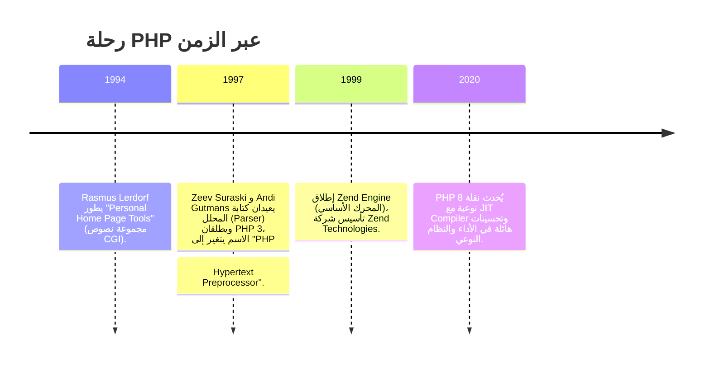

# الفصل الأول — PHP: الأساسيات من البداية

> **المتطلبات:** لا شيء. فقط جهاز كمبيوتر وفضول.  
> هذا الفصل هو بوابتك من عالم HTML الثابت إلى عالم الويب الديناميكي.  
> ستفهم كيف يعمل PHP، ولماذا صُمم، وكيف تكتب أول سكريبت يرد على المستخدم.

---

## البداية — لماذا وُجد PHP أصلاً؟

تخيل معي أنك في عام 1994. الويب كان مجرد صفحات HTML ثابتة. تزور موقعًا، ترى نفس المحتوى دائمًا. لا يوجد "مرحبًا يا محمد"، لا يوجد سلة مشتريات، لا يوجد محتوى يتغير حسب من أنت أو ماذا فعلت.

المشكلة كانت بسيطة وعميقة:  
**كيف نجعل الخادم يبني صفحة HTML خصيصًا لك، بناءً على مدخلاتك وبياناتك، وليس مجرد إرسال ملف جاهز؟**

الحل احتاج لغة تعمل على الخادم (Server-Side). في ذلك العام، بدأ مبرمج دنماركي/جرينلاندي اسمه **Rasmus Lerdorf** بكتابة مجموعة نصوص بسيطة لإدارة موقعه الشخصي. أطلق عليها "Personal Home Page Tools" – ومن هنا جاء الاسم: **PHP**.

لم يتوقع راسموس أن أداته الصغيرة ستتحول إلى لغة تُشغّل أكثر من 75% من مواقع الويب اليوم (بما في ذلك فيسبوك في بداياته، وووردبريس، وملايين المواقع الأخرى).



> [!INFO]
> **القصة وما وراءها:** PHP لم تكن "لغة مصممة من الأكاديميا". لقد وُلدت من احتياج عملي لشخص واحد، ثم نمت بشكل عضوي. هذا هو سر سهولتها وانتشارها – صُنعت بواسطة مبرمجين، للمبرمجين، لحل مشاكل واقعية.

---

## [[01-Why-PHP]] — لماذا PHP بالذات؟

في عالم مليء بالخيارات (Python, Node.js, Ruby, Java...)، لماذا تختار PHP؟ ولماذا لا تزال ضخمة بعد 30 عامًا؟

1.  **سهولة التعلم المذهلة:** لغة لا تحتاج إعدادات معقدة. ملف `.php` واحد، به كود HTML وبعض التعليمات، يتحول إلى صفحة ديناميكية. المنحنى التعليمي لطيف جدًا.

2.  **صُممت للويب من البداية:** على عكس لغات عامة الغرض، تملك PHP أدوات مدمجة لكل ما تحتاجه: قراءة ملفات، إرسال بريد، التعامل مع قواعد البيانات، الجلسات، الكوكيز... كلها دوال جاهزة.

3.  **قابلية النقل (Portability):** تعمل على أي نظام تشغيل (Windows, Linux, macOS) مع أي خادم ويب شهير (Apache, Nginx, IIS). السكريبت الذي تكتبه على جهازك سيعمل على السيرفر دون تغيير.

4.  **دعم هائل للمجتمع والمكتبات:** ووردبريس (أشهر نظام إدارة محتوى) مبني على PHP. Composer هو مدير الحزم الخاص بها. ستجد إجابة لأي سؤال على Stack Overflow.

5.  **المصدر المفتوح والحرية الكاملة:** مجانية تمامًا، كودها مفتوح، ولا توجد تراخيص معقدة.

> [!NOTE]  
> **التشبيه:** لو كانت لغات البرمجة مثل أدوات المطبخ، فـ PHP هي **السكين متعدد الاستخدامات**. ليست الأكثر تخصصًا في كل مهمة، لكنها قادرة على عمل كل شيء تقريبًا بسرعة وبدون تعقيد.

---

## [[02-LAMP-Stack]] — البيئة التي تعيش فيها PHP

لكي يعمل تطبيق PHP، تحتاج إلى كومة من البرمجيات تتضافر معًا. هذه الكومة تُعرف اختصارًا بـ **LAMP**، وهي اختصار لـ:

- **L**inux: نظام التشغيل (الخادم غالبًا).
- **A**pache: خادم الويب (Web Server) الذي يستقبل طلبات HTTP ويمررها لـ PHP.
- **M**ySQL: قاعدة البيانات (ولكن يمكن أن تكون MariaDB أو PostgreSQL).
- **P**HP: لغة البرمجة التي تعالج الطلب وتبني الرد.

هناك توزيعات جاهزة تُثبّت هذه الكومة كلها بنقرة واحدة على جهازك المحلي للتطوير:

| البيئة | المكونات |
|--------|---------|
| **XAMPP** | (X) أي نظام تشغيل، Apache, MariaDB, PHP, Perl – الأكثر شيوعًا. |
| **WAMP** | خاص بـ Windows. |
| **MAMP** | خاص بـ macOS. |

### ماذا يحدث عند زيارة صفحة PHP؟

```
المتصفح يطلب: http://localhost/index.php
        │
        ▼
┌───────────────────┐
│   Apache (الخادم)   │ <-- يستقبل الطلب، ويرى أن الملف ينتهي بـ .php
└────────┬──────────┘
         │ يمرر الملف إلى
         ▼
┌───────────────────┐
│  PHP Interpreter  │ <-- ينفذ كود PHP، يستعلم من MySQL إن لزم
└────────┬──────────┘
         │ الناتج (HTML خالص)
         ▼
┌───────────────────┐
│   Apache (الخادم)   │ <-- يعيد إرسال HTML إلى المتصفح
└───────────────────┘
```

**الخلاصة:** المتصفح لا يرى كود PHP أبدًا. كل ما يراه هو ناتج تنفيذه (HTML، CSS، JavaScript). هذا ما يسمى **Server-Side Scripting**.

---

## [[03-Installation-and-First-Run]] — جهّز مختبرك

لن تحتاج أكثر من 10 دقائق لتجهيز كل شيء.

1.  **حمل XAMPP** من [https://www.apachefriends.org](https://www.apachefriends.org) (اختر الإصدار الذي يحمل PHP 7.4 أو أعلى).
2.  **ثبته** في المسار الافتراضي (مثلاً `C:\xampp`).
3.  **شغل لوحة التحكم** (XAMPP Control Panel) واضغط على **Start** بجانب Apache.
4.  افتح متصفحك واذهب إلى `http://localhost/`. إذا رأيت صفحة ترحيب XAMPP، فأنت جاهز!

ملفاتك ستوضع داخل مجلد `htdocs` (في XAMPP) أو `www` (في WAMP). أي مجلد تنشئه هناك يمكن الوصول إليه عبر `http://localhost/اسم-المجلد/`.

> [!WARNING]
> **لا تنسَ:** الخادم يجب أن يكون شغّالًا (Apache قيد التشغيل) لتتمكن من فتح ملفات PHP في المتصفح. فتح ملف `.php` مباشرة من القرص الصلب (مثل `file:///...`) لن يعمل – لأنه يحتاج إلى PHP Interpreter على الخادم.

---

## [[04-First-PHP-File]] — أول لقاء مع الديناميكية

لننشئ ملفًا جديدًا داخل `htdocs/my_project/` باسم `index.php`:

```php
<!DOCTYPE html>
<html lang="ar">
<head>
    <meta charset="UTF-8">
    <title>أول صفحة PHP لي</title>
</head>
<body>
    <h1>
        <?php
            echo "مرحبًا بك في عالم PHP!";
        ?>
    </h1>
    <p>
        اليوم هو: 
        <?php
            echo date('Y-m-d');
        ?>
    </p>
</body>
</html>
```

عند فتح `http://localhost/my_project/index.php` سترى العنوان "مرحبًا بك في عالم PHP!" والتاريخ الحقيقي لليوم. هذا سحر الخادم: **لقد بنى الـ HTML لحظة طلب الصفحة، بناءً على التاريخ الفعلي.**

---

## [[05-PHP-Tags]] — كيف تخبر الخادم "هذا كود PHP"؟

الخادم لا يعرف أن يعالج كود PHP إلا إذا كان بداخل وسم خاص. هناك عدة طرق لكتابة هذه الوسوم:

1.  **الوسم القياسي (XML Style) – المُوصى به دائمًا:**
    ```php
    <?php
        echo "هذه الطريقة الأفضل";
    ?>
    ```
    هذا الوسم مضمون أن يعمل على أي خادم، ولن يتم تعطيله أبدًا.

2.  **الوسم القصير (Short Style):**
    ```php
    <?
        echo "تحتاج تفعيل short_open_tag في php.ini";
    ?>
    ```
    يعمل فقط إذا تم تفعيل الإعداد `short_open_tag`. لا تستخدمه لضمان توافقية تطبيقك.

3.  **وسم السكريبت (SCRIPT Style):**
    ```php
    <script language="php">
        echo "نادر الاستخدام";
    </script>
    ```
    طويل جدًا وغير مستخدم عمليًا.

4.  **وسم ASP:**
    ```php
    <%
        echo "عتيق ويعتمد على asp_tags";
    %>
    ```
    من بقايا التاريخ، يُستخدم فقط إذا كنت تدمج PHP مع كود ASP قديم.

> [!IMPORTANT]
> **القاعدة الذهبية:** استخدم دائمًا `<?php ... ?>`. لا تغلق الوسم `?>` في نهاية الملف إذا كان الملف PHP خالصًا (بدون HTML بعده). هذا يمنع إرسال مسافات بيضاء غير مقصودة قد تكسر الجلسات أو الكوكيز.

---

## [[06-Echo-and-Print]] — كيف يُخرج PHP الكلام؟

للإخراج إلى المتصفح، نستخدم `echo` أو `print`.

```php
<?php
echo "مرحبًا بك!";            // يُخرج النص
echo "<h2>عنوان كبير</h2>";    // يُخرج HTML (التنسيق يحدث في المتصفح)
echo 'هذا نص';                 // علامات التنصيص المفردة تعمل أيضًا

print "PHP ممتعة";
?>
```

| الخاصية | `echo` | `print` |
|---------|--------|---------|
| عدد المعاملات | يمكنه أخذ عدة معاملات (مفصولة بفواصل) | يأخذ معاملًا واحدًا فقط |
| إرجاع قيمة | لا يرجع شيئًا (void) | يرجع القيمة `1` دائمًا |
| السرعة | أسرع هامشيًا (لعدم إرجاعه قيمة) | أبطأ قليلاً |

```php
echo "مرحبًا", " ", "بالعالم";  // صحيح: مرحبًا بالعالم
// print "مرحبًا", " ", "بالعالم"; // خطأ: print لا تقبل أكثر من معامل
```

> [!TIP]
> استخدم `echo` دائمًا إلا إذا كنت داخل تعبير معقد تحتاج فيه قيمة مرجعة. في الممارسة العملية، لا تكاد تشعر بفرق.

---

## [[07-Variables]] — صناديق الذاكرة

المتغير (Variable) هو صندوق تضع فيه قيمة، وتطلق عليه اسمًا لاستدعائها لاحقًا. في PHP، لست بحاجة لإعلان نوع الصندوق – فقط ضع القيمة وسيُصبح الصندوق من نوعها تلقائيًا.

```php
<?php
$name = "نورة";      // صندوق به نص
$age  = 25;         // صندوق به عدد صحيح
$pi   = 3.14;       // صندوق به عدد عشري
$is_admin = true;   // صندوق به قيمة منطقية
?>
```

**قواعد تسمية المتغيرات:**
- تبدأ دائمًا بعلامة الدولار `$`، ثم حرف أو شرطة سفلية `_`.
- لا يمكن أن تبدأ برقم.
- حساسة لحالة الأحرف (`$name` مختلفة عن `$Name`).
- يمكن أن تحتوي أحرفًا، أرقامًا، وشرطات سفلية بعد الحرف الأول.

### PHP لغة ديناميكية النوع (Loosely Typed)

في اللغات القوية (مثل Java)، تقول: "هذا المتغير رقم صحيح فقط". في PHP، لا تحدد النوع – يُستنتج تلقائيًا:

```php
$var = "مرحبًا";   // $var سلسلة نصية
$var = 42;         // الآن $var عدد صحيح – لا خطأ
```

هذا يعطي مرونة هائلة، لكنه يتطلب منك الانتباه للتحقق من الأنواع حين يلزم ذلك.

---

## [[08-Variable-Scope]] — أين يظهر المتغير؟

قواعد الرؤية (Scope) تحدد أين يمكن استخدام المتغير. PHP لديها أربعة نطاقات أساسية:

1.  **النطاق المحلي (Local)**
    أي متغير يُعرّف داخل دالة (function) يكون مرئيًا فقط داخلها.
    ```php
    function sayHello() {
        $message = "أهلاً";  // متغير محلي
        echo $message;
    }
    sayHello();
    // echo $message;  // خطأ: $message غير معروف خارج الدالة
    ```

2.  **النطاق العام (Global)**
    المتغيرات المُعرّفة خارج أي دالة تكون عامة، لكنها **غير مرئية تلقائيًا** داخل الدوال. لاستخدامها داخل دالة، يجب استيرادها بالكلمة المفتاحية `global` أو عبر المصفوفة `$GLOBALS`.
    ```php
    $app_name = "تطبيقي";

    function showAppName() {
        global $app_name;     // استيراد المتغير العام
        echo $app_name;
    }
    showAppName();             // تطبيقي
    ```

3.  **النطاق الثابت (Static)**
    داخل الدالة، المتغيرات العادية تُمسح بعد انتهاء الدالة. لكن إن أردت أن يحتفظ بقيمته بين النداءات، استخدم `static`.
    ```php
    function counter() {
        static $count = 0; // يُهيأ مرة واحدة فقط
        $count++;
        echo $count;
    }
    counter(); // 1
    counter(); // 2
    counter(); // 3
    ```

4.  **نطاق المُعامل (Parameter)**
    القيم التي تُمرر إلى الدالة عند استدعائها تصبح متغيرات محلية لها.
    ```php
    function greet($name) {
        echo "مرحبًا $name!";
    }
    greet("أحمد"); // مرحبًا أحمد!
    ```

### المتغيرات فائقة النطاق (Superglobals)

PHP تقدم مجموعة من المتغيرات المبنية مسبقًا، مرئية في كل مكان (داخل الدوال وخارجها). هذه أهمها:

| المصفوفة | الوظيفة |
|----------|---------|
| `$_GET` | تحمل البيانات المُرسلة عبر URL (مثلاً: `?name=Ali`). |
| `$_POST` | تحمل البيانات المُرسلة عبر نماذج POST. |
| `$_REQUEST` | تحمل كلاً من `$_GET` و `$_POST` و `$_COOKIE`. |
| `$_SESSION` | بيانات الجلسة (لحفظ حالة المستخدم عبر الصفحات). |
| `$_COOKIE` | ملفات تعريف الارتباط. |
| `$_SERVER` | معلومات عن الخادم ومسار الطلب. |

سنمارسها عمليًا عند التعامل مع النماذج.

---

## [[09-Data-Types]] — أنواع البيانات في PHP

رغم أن PHP ديناميكية، إلا أن لديها أنواعًا داخلية. تعلمها يساعدك على كتابة كود آمن.

| النوع | الوصف | مثال |
|-------|--------|------|
| **Integer** | عدد صحيح بدون فاصلة. | `$x = 42;` |
| **Float / Double** | عدد عشري. | `$pi = 3.14;` |
| **String** | سلسلة نصية. | `$name = "Ahmed";` |
| **Boolean** | قيمة منطقية: `true` أو `false`. | `$is_done = false;` |
| **Array** | مصفوفة (مرتبة أو ترابطية). | `$colors = ["red","green"];` |
| **Object** | كائن من فئة (يُنشأ بـ `new`). | `$obj = new Car();` |
| **NULL** | متغير بلا قيمة. | `$var = null;` |
| **Resource** | مرجع إلى مورد خارجي (ملف مفتوح، اتصال قاعدة بيانات). | `$file = fopen(...);` |

### دوال فحص النوع

PHP تعطيك دوالًا لفحص نوع المتغير في أي لحظة:

```php
$val = 123;
var_dump(is_int($val));      // true
var_dump(is_string($val));   // false
var_dump(is_numeric("42"));  // true (سلسلة رقمية)
var_dump(is_array($val));    // false
var_dump(isset($val));       // true (المتغير موجود)
```

### تحويل النوع (Casting)

يمكنك أن تطلب من PHP معاملة متغير كنوع معين مؤقتًا:

```php
$num = "150";               // سلسلة
$result = (int)$num + 25;   // تُحول إلى عدد صحيح، الناتج 175
```

---

## [[10-Constants]] — الثوابت: قيم لا تتغير

الثوابت تشبه المتغيرات، إلا أن قيمتها تُحدد مرة واحدة ولا يمكن تغييرها أثناء تنفيذ السكريبت. لا تُسبق بعلامة `$`.

**طريقتا التعريف:**

```php
// الطريقة الأولى: define()
define("SITE_NAME", "مدونتي");
define("MAX_USERS", 500);

// الطريقة الثانية: const (مدعومة داخل الفئات وخارجها)
const AUTHOR = "نورة";

// الاستخدام:
echo SITE_NAME;   // مدونتي
echo AUTHOR;      // نورة
```

**الفرق بين `define()` و `const`:**
- `const` تُعرّف في وقت الترجمة (compile-time)، لذا لا يمكن وضعها داخل جمل شرطية.
- `define()` تُعرّف في وقت التشغيل (runtime)، وتقبل تعبيرات كمصفوفات.

```php
if (!defined('SITE_NAME')) {
    define('SITE_NAME', 'موقع جديد'); // صحيح
}

// if (...) { const X = 5; } // خطأ: const لا تعمل داخل الشروط
```

**خصائص الثوابت:**
- نطاقها **عالمي تلقائيًا** – تُرى داخل الدوال وخارجها بدون `global`.
- لا يمكن حذفها أو إعادة تعريفها بعد الإنشاء.

> [!IMPORTANT]
> استخدم الثوابت لأي قيمة ثابتة في تطبيقك: اسم التطبيق، إعدادات قاعدة البيانات، مفاتيح API... هذا يجعل كودك أنظف ويمنع التغيير غير المقصود.

---

## [[11-Variable-Variables-and-References]] — متغيرات بأسماء متغيرة ومراجع

### متغير المتغير (Variable of Variable)

PHP تسمح لك بأن يكون اسم المتغير نفسه قيمة متغير آخر. هذه ميزة متقدمة استخدمها بحذر:

```php
$field = 'username';       // قيمة المتغير هي السلسلة 'username'
$$field = 'Ahmed';         // الآن $username = 'Ahmed' لأن $field = 'username'
echo $username;            // Ahmed
```

تخيلها كأنك تقول: "ضع القيمة 'Ahmed' في المتغير الذي اسمه هو قيمة `$field`".

**استخدام عملي نادر:** عند توليد متغيرات ديناميكية من مدخلات، لكن غالبًا المصفوفات تكون أفضل.

### مرجع المتغير (Reference)

المشغل `&` ينشئ اسمًا آخر لنفس المتغير (نفس قطعة الذاكرة). أي تغيير على أحدهما ينعكس على الآخر:

```php
$a = 10;
$b = &$a;         // $b هو مرجع لـ $a (ليس نسخة)
$b = 20;
echo $a;          // 20
```

المراجع مفيدة عند تمرير متغيرات للدوال لتعديلها مباشرة، لكن استخدامها قد يجعل الكود صعب التتبع. تعامل معها كأنها "اسم مستعار" وليس "نسخة".

---

## 🗺️ خريطة الأساسيات كاملة

```mermaid
mindmap
  root((PHP Basics))
    History
      Rasmus Lerdorf 1994
      PHP 3 / Zend Engine
      PHP 8 JIT
    Why PHP?
      سهولة التعلم
      صُممت للويب
      قابلية النقل
      مجتمع ضخم
      مفتوحة المصدر
    LAMP Stack
      Linux OS
      Apache Web Server
      MySQL Database
      PHP Language
    First Steps
      تثبيت XAMPP
      localhost
      أول echo
    Syntax Core
      الوسوم <?php ?>
      echo vs print
      الفاصلة المنقوطة ;
      التعليقات //
    Variables
      $name
      Dynamic Typing
      Scope: Local, Global, Static
      Superglobals
    Data Types
      Integer, Float
      String, Boolean
      Array, Object
      NULL, Resource
      is_*() functions
    Constants
      define() vs const
      Global visibility
```

---

## ✅ أسئلة مقابلة تقيس الفهم الحقيقي

**س: ما الفرق بين `echo` و `print` في PHP؟**
> `echo` أسرع قليلاً ولا يُرجع قيمة، ويمكنه قبول عدة معاملات مفصولة بفواصل. `print` يُرجع `1` دائمًا ويقبل معاملًا واحدًا فقط. في الممارسة، كلاهما يؤديان نفس الغرض، لكن `echo` هو الأكثر شيوعًا.

**س: كيف يعمل المتغير العام (`global`) داخل دالة؟**
> المتغيرات المُعرّفة خارج الدالة لا تكون مرئية تلقائيًا داخلها. يجب استيرادها باستخدام الكلمة `global` أو عن طريق المصفوفة `$GLOBALS`. هذا يمنع التلوث العرضي للمتغيرات.

**س: لماذا تعتبر PHP لغة "ضعيفة التحقق من النوع" (Loosely Typed)؟ وهل هذا جيد أم سيء؟**
> لا تلزمك بتحديد نوع المتغير مسبقًا، ويمكن تحويله تلقائيًا. هذا يعطي سرعة في التطوير ومرونة، لكنه قد يؤدي إلى أخطاء غير متوقعة إذا لم تنتبه (مثلاً `"10" * 5` تُنتج `50` وليس خطأ). أفضل الممارسات الحديثة تشجع على استخدام التلميحات النوعية (Type Hints) حيث أمكن.

**س: ما الفرق بين `define()` و `const` لتعريف الثوابت؟**
> `const` تُعالج في وقت الترجمة ولا يمكن استخدامها داخل الشروط أو الحلقات. `define()` تُعالج في وقت التشغيل وتقبل التعبيرات. كلا الثابتين يُعرّفان قيمة لا تتغير في النطاق العالمي.

---

## 🛠️ تمارين تطبيقية من الصفر

### Task 1 — أول سكريبت ديناميكي

أنشئ ملف `greet.php` يعرض جملة ترحيبية مع اسمك، والتاريخ، والوقت الحالي. استخدم `echo` ودالة `date`.

**المساعدة:**
```php
echo date('h:i A'); // يعرض الساعة والدقيقة مع AM/PM
```

### Task 2 — مستكشف النطاق

اكتب كودًا يحوي:
- متغيرًا عامًا `$globalName`.
- دالة `printNames()` تأخذ معامل `$localName`.
- داخل الدالة، اطبع `$localName`، ثم استورد `$globalName` واطبعه.

**الهدف:** التفريق بين النطاقين بوضوح.

### Task 3 — ثوابت الإعدادات

أنشئ تطبيقًا صغيرًا يحسب مساحة دائرة ونصف قطرها مخزن في ثابت `RADIUS`. استخدم أيضًا ثابت `PI` بالقيمة `3.14159`. اطبع النتيجة بجملة واضحة.

### Task 4 — متغير المتغير (تحدٍ)

```php
$selected = 'color';
$$selected = 'red';
echo $color; // ماذا تطبع؟
```
جرب تغيير قيمة `$selected` إلى `'size'` وأعد التشغيل. ماذا يحدث؟

---

## 🫒 زيتونة الإنترفيو

> **"PHP هي لغة سكريبتينغ من جانب الخادم، ولدت عام 1994 من احتياج عملي، ونمت لتصبح العمود الفقري لأكثر من 75% من الويب. تعمل داخل كومة LAMP، وتتميز بسهولة الدمج مع HTML. تكتب كود PHP داخل الوسم `<?php ... ?>`، وتستخدم `echo` للإخراج. المتغيرات تبدأ بـ `$`، وهي ديناميكية النوع، وتخضع لقواعد نطاق واضحة (Local, Global, Static, Superglobal). الثوابت بالـ `define()` أو `const` توفر قيمًا خالدة. فهم هذه الأساسيات هو الخطوة الأولى لبناء تطبيقات ويب حقيقية."**

---

*Next → [[02-PHP-Operators-and-Control-Flow]] — بعد أن عرفنا كيف نحمل القيم ونعرضها، سننتقل إلى قلب البرمجة: كيف نتخذ القرارات (`if`, `switch`)، نكرر (`for`, `foreach`)، ونستخدم العمليات الحسابية والمنطقية. هناك سنتعامل مع أول نموذج حقيقي ونستقبل بيانات من المستخدم.*