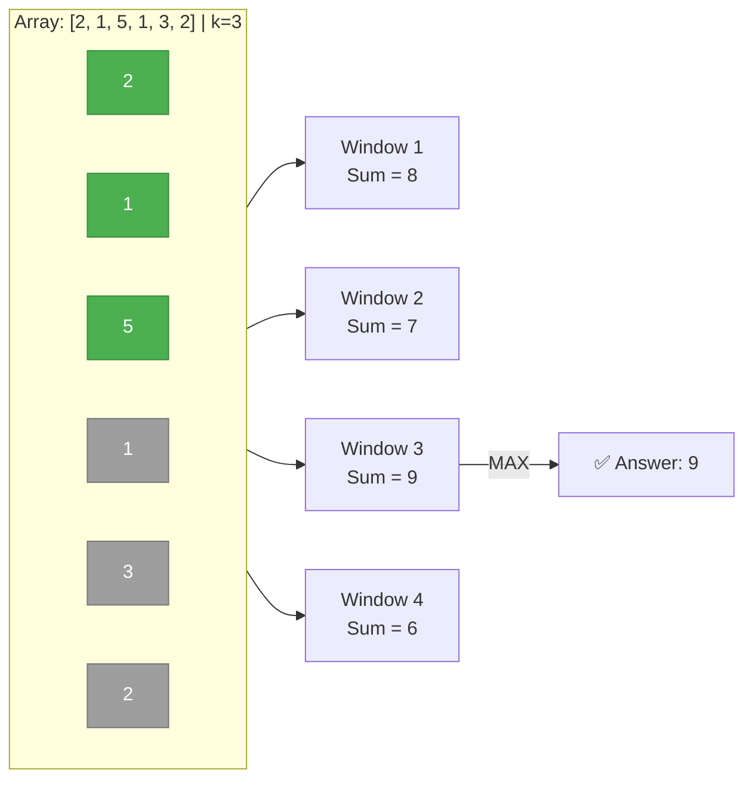
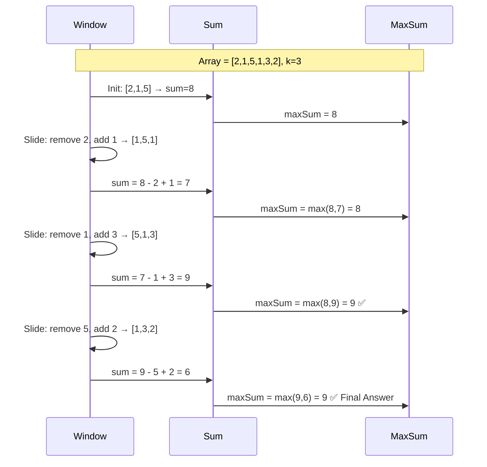
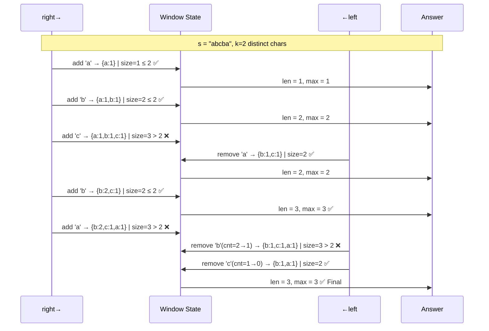
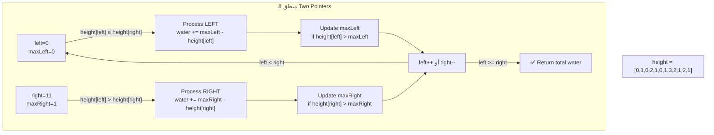
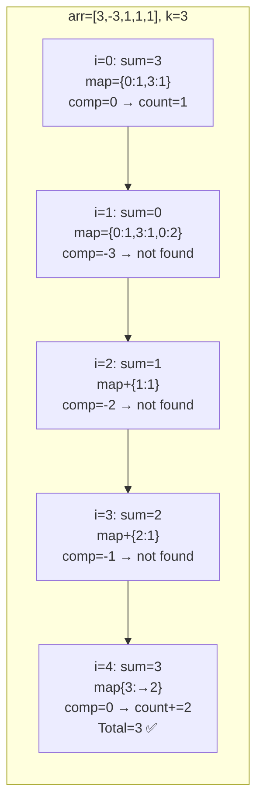
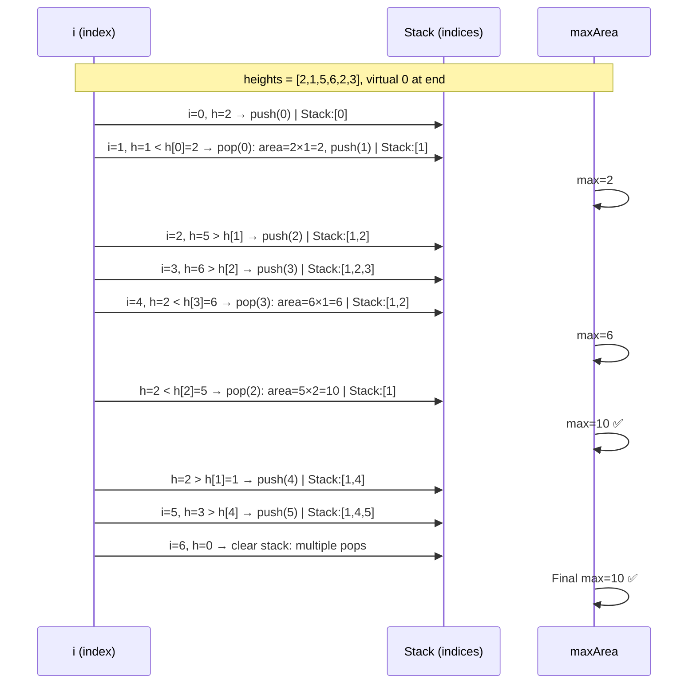
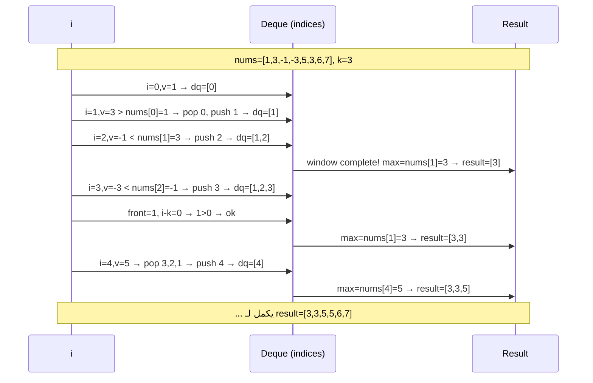
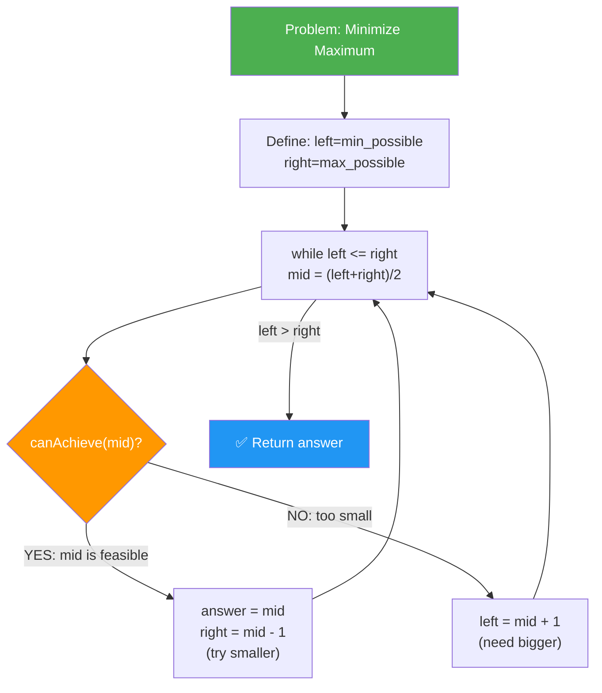
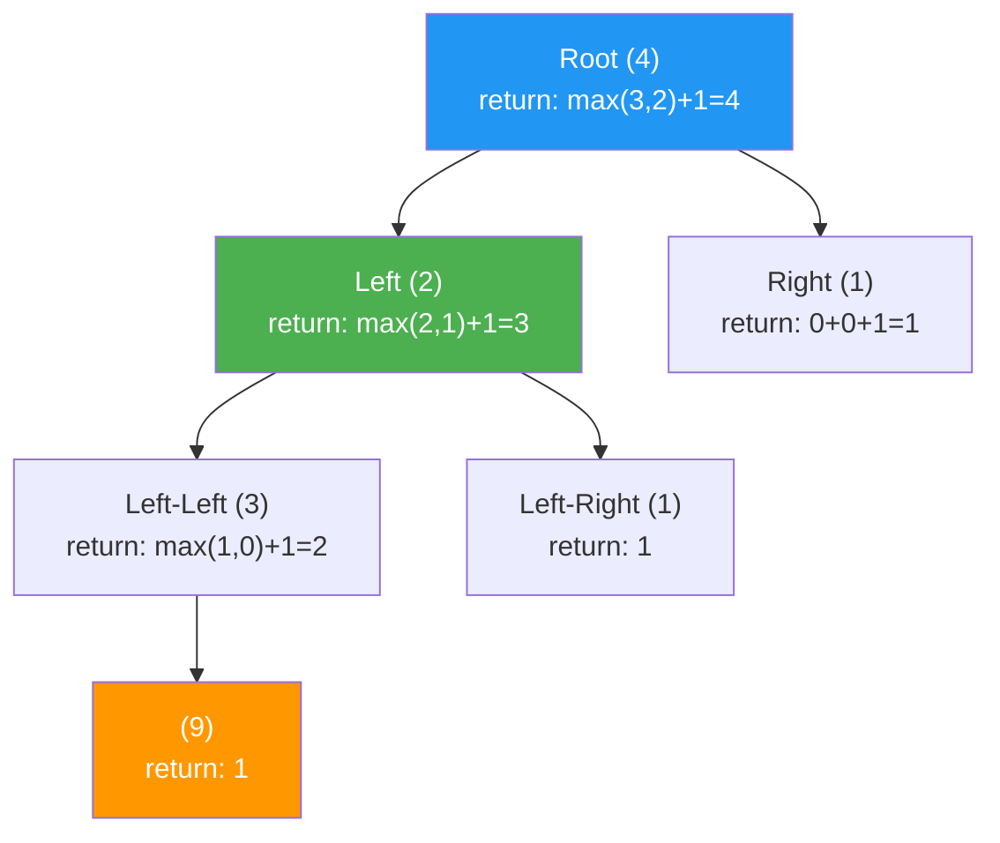

# 🧠 DSA Zero to Hero — رحلة عقلية من الصفر للـ FAANG
> **بقلم:** Staff Software Engineer | Modern C++20 | Obsidian Optimized
> **المستوى المستهدف:** Intermediate → Expert Problem Solver
> **آخر تحديث:** 2025

---

## 📋 فهرس الرحلة الكاملة (Table of Contents)

```
🗺️ خريطة الرحلة
├── Phase 1: The Window & The Pointer 🪟
│   ├── Module 1.1 — Fixed Sliding Window
│   ├── Module 1.2 — Dynamic Sliding Window
│   └── Module 1.3 — Two Pointers (Advanced Patterns)
│
├── Phase 2: The Hash & The Map 🗂️
│   ├── Module 2.1 — HashMap Patterns (Prefix Sum + Frequency)
│   ├── Module 2.2 — Monotonic Stack
│   └── Module 2.3 — Monotonic Queue / Deque
│
├── Phase 3: The Recursive Mind 🌀
│   ├── Module 3.1 — Binary Search (Beyond the Basics)
│   ├── Module 3.2 — Divide & Conquer
│   └── Module 3.3 — Recursion + Backtracking
│
├── Phase 4: The Tree & The Graph 🌳
│   ├── Module 4.1 — Tree DFS Patterns
│   ├── Module 4.2 — Tree BFS / Level Order
│   ├── Module 4.3 — Graph BFS / DFS
│   └── Module 4.4 — Union-Find (Disjoint Set)
│
├── Phase 5: The Dynamic Thinker 💡
│   ├── Module 5.1 — 1D Dynamic Programming
│   ├── Module 5.2 — 2D Dynamic Programming
│   ├── Module 5.3 — Interval DP
│   └── Module 5.4 — DP on Trees
│
└── Phase 6: The Expert Toolkit 🔧
    ├── Module 6.1 — Heap / Priority Queue Patterns
    ├── Module 6.2 — Trie (Prefix Tree)
    └── Module 6.3 — Segment Tree & BIT (Fenwick Tree)
```

> 💡 **ملاحظة للـ Obsidian:** كل Module مستقل بذاته ومرتبط بـ internal links. استخدم `[[]]` للتنقل بين الـ Modules.

---

# 🪟 Phase 1: The Window & The Pointer

> **الفلسفة:** الـ Array والـ String مش بس بيانات — هما **نافذة** بتتحرك فوق stream من المعلومات. فاهم ده؟ فاهم نص الـ LeetCode.

---

## Module 1.1 — Fixed Sliding Window

### أ. التشخيص والكلمات المفتاحية 🔍

#### ✅ متى تستخدمه؟ (Green Flags)

| الكلمة/العبارة في المسألة | المعنى |
|---|---|
| `"subarray of size k"` | نافذة ثابتة بالظبط |
| `"consecutive k elements"` | نافذة ثابتة |
| `"window of length k"` | نافذة ثابتة |
| `"maximum/minimum/average in every window of size k"` | Classic Fixed Window |
| `"find all anagrams"` + طول string معطى | Fixed Window بـ frequency map |

#### 🚩 متى يكون فخاً؟ (Red Flags)

- لو الـ window مش محددة بـ `k` ثابت → روح لـ Dynamic Window (Module 1.2)
- لو المسألة بتسأل عن **non-contiguous** elements → الـ Window مش مناسب خالص
- لو في `negative numbers` وبتحسب **sum** → الـ window ممكن تضللك (مثلاً subarray sum مع أرقام سالبة يحتاج Kadane's أو DP)
- لو المسألة بتسأل عن **pairs أو combinations** لأ **contiguous range** → Two Pointers أنسب

---

### ب. الحكاية 🎭

**تخيل إنك شغال كاشير في Carrefour**، وفي كونفيور belt بيمر بيه منتجات واحد ورا التاني. المدير قالك:

> *"كل 3 منتجات متتالية على الـ belt، قولي مجموع أسعارهم. أنا عايز أعرف أعلى 3 متتاليين."*

**الموظف الجديد (Brute Force):** كل ما بيجي منتج جديد، بيرجع 3 خطوات للورا وبيجمع من الأول.
**الموظف الخبير (Sliding Window):** بيعمل حاجة ذكية — بيشيل سعر المنتج اللي راح من الشباك الشمال، وبيضيف سعر المنتج الجديد اللي دخل من اليمين. ما بيحسبش من الأول أبداً!

ده بالظبط هو الـ Fixed Sliding Window.

---

### ج. رحلة التفكير: من Brute Force للـ Optimal 🧭

**المسألة:** ايجاد أعلى مجموع لـ subarray بطول `k` في array بطول `n`.

#### الكود الساذج (Brute Force) — O(n·k)

```cpp
// ❌ الطريقة الغبية — تجنبها في الإنترفيوز
int maxSumBruteForce(const vector<int>& arr, int k) {
    int n = arr.size();
    int maxSum = INT_MIN;
    
    for (int i = 0; i <= n - k; ++i) {        // O(n)
        int windowSum = 0;
        for (int j = i; j < i + k; ++j) {     // O(k) — ده الـ bottleneck
            windowSum += arr[j];
        }
        maxSum = max(maxSum, windowSum);
    }
    return maxSum;
}
```

**الـ Bottleneck:** إيه اللي بيتعمل كل iteration؟ بنعيد حساب `k-1` element من الأول! لو `k = 1000` ونا عندي array بـ `100,000` عنصر، أنا بعمل `100,000 × 1000 = 100,000,000` عملية. ده جريمة في الـ interview.

#### الاستنتاج الذكي 💡

```
Window [i, i+k-1]  → sum = S
Window [i+1, i+k]  → sum = S - arr[i] + arr[i+k]
```

بدل ما نحسب من الأول، بنـ**slide**: بنشيل العنصر الشمال ونضيف العنصر اليمين.

---

### د. الكود النهائي — Modern C++20 ✨

```cpp
#include <vector>
#include <numeric>
#include <algorithm>
#include <stdexcept>

/**
 * @brief Maximum sum subarray of fixed size k
 * 
 * Memory: O(1) extra space — no allocations
 * Cache: Sequential access pattern → excellent cache locality
 * 
 * @param arr Input array (passed by const reference — no copy)
 * @param k   Window size
 * @return    Maximum sum found
 */
int maxSumFixedWindow(const std::vector<int>& arr, int k) {
    const int n = static_cast<int>(arr.size());
    
    // Edge case: window bigger than array
    if (n < k || k <= 0) {
        throw std::invalid_argument("Invalid k: must satisfy 0 < k <= n");
    }
    
    // Build the first window — O(k)
    // std::accumulate is cache-friendly: sequential read
    int windowSum = std::accumulate(arr.begin(), arr.begin() + k, 0);
    int maxSum    = windowSum;
    
    // Slide the window — O(n-k) iterations, O(1) per iteration
    for (int right = k; right < n; ++right) {
        // Add incoming element (right edge)
        // Remove outgoing element (left edge: right - k)
        windowSum += arr[right] - arr[right - k];
        maxSum = std::max(maxSum, windowSum);
    }
    
    return maxSum;
}
```

#### 🔬 تحت الغطاء — Memory & CPU Cache

```
Stack Frame:
┌─────────────────────────────────────────────────┐
│  arr    → pointer (8 bytes) → points to HEAP    │
│  k      → int (4 bytes)                         │
│  n      → int (4 bytes)                         │
│  windowSum → int (4 bytes)                      │
│  maxSum    → int (4 bytes)                      │
│  right     → int (4 bytes)  ← loop variable     │
└─────────────────────────────────────────────────┘
       Total stack: ~32 bytes (بعيد عن الـ stack overflow)

Heap (arr data):
┌───┬───┬───┬───┬───┬───┬───┬───┐
│ 2 │ 1 │ 5 │ 1 │ 3 │ 2 │ 6 │ 4 │  ← contiguous memory
└───┴───┴───┴───┴───┴───┴───┴───┘
  ↑               ↑
  arr[right-k]  arr[right]
  (outgoing)    (incoming)
```

**لماذا هذا الكود سريع جداً على الـ CPU؟**

1. **Sequential Memory Access:** الـ `arr[right]` بيتحرك للأمام خطوة خطوة — الـ CPU prefetcher بيتوقع ده ويجيب البيانات من الـ RAM للـ L1 Cache قبل ما نطلبها!

2. **No Dynamic Allocation:** مفيش `new`، مفيش `push_back`، مفيش reallocation. كل الـ O(1) extra space موجودة على الـ Stack.

3. **Branch Prediction:** الـ loop condition `right < n` بتتحقق بشكل linear — الـ CPU بيتعلم النمط ده بسرعة ومش بيضيع cycles في الـ branch predictor.

---

### هـ. تحليل التعقيد 📊

| | Time | Space |
|---|---|---|
| **Brute Force** | O(n·k) | O(1) |
| **Fixed Window** | **O(n)** | **O(1)** |

**التفصيل:**

- **Time O(n):** الـ loop بيمشي مرة واحدة من `k` لـ `n-1`. كل iteration = عمليتين حساب + مقارنة = O(1).
- **Space O(1):** بنستخدم بس متغيرات `windowSum` و `maxSum` و `right`. مفيش structures إضافية.

> ⚡ **الفارق الحقيقي:** على array بـ 10^6 عنصر و k=1000:
> - Brute Force: ~10^9 عملية → **يحتاج ~1 ثانية**
> - Fixed Window: ~10^6 عملية → **يحتاج ~1 مللي ثانية**

---

### و. مخطط Mermaid 📈

#### Overview: الفكرة العامة



#### Step-by-Step: حركة النافذة



---

### ز. مسائل التطبيق 📝

- [ ] [Maximum Average Subarray I](https://leetcode.com/problems/maximum-average-subarray-i/): نفس فكرة max sum بس بتقسم على k في الآخر.
- [ ] [Find All Anagrams in a String](https://leetcode.com/problems/find-all-anagrams-in-a-string/): Fixed window بـ frequency array من 26 حرف، قارن الـ snapshots.
- [ ] [Contains Duplicate II](https://leetcode.com/problems/contains-duplicate-ii/): Window بحجم k+1، استخدم `unordered_set` بدل sorting.
- [ ] [Permutation in String](https://leetcode.com/problems/permutation-in-string/): شبه Find Anagrams بالظبط — window size = طول `s1`.
- [ ] [Sliding Window Maximum](https://leetcode.com/problems/sliding-window-maximum/): Fixed window لكن بتحتاج **Monotonic Deque** (Module 2.3) عشان الـ max في O(1).
- [ ] [Minimum Window Substring](https://leetcode.com/problems/minimum-window-substring/): الجسر بين Fixed وDynamic — **Hard** ومهم جداً.

---
---

## Module 1.2 — Dynamic Sliding Window

### أ. التشخيص والكلمات المفتاحية 🔍

#### ✅ Green Flags

| الكلمة/العبارة | المعنى |
|---|---|
| `"longest subarray/substring with..."` | Dynamic Window (maximize) |
| `"shortest subarray/substring with..."` | Dynamic Window (minimize) |
| `"at most k distinct characters"` | Dynamic Window بـ constraint |
| `"sum >= target"` | Dynamic Window تكبر وتصغر |
| `"without repeating characters"` | Window تتضيق لما بيتكرر حاجة |

#### 🚩 Red Flags

- لو في **sorted array + target** → Two Pointers أسرع وأبسط (بتعمل نفس الشيء)
- لو الـ constraint مش monotonic (يعني ممكن ترجع للوراء من غير ضرورة) → مش sliding window
- **الفخ الكبير:** لو عندك array بـ negative numbers وبتدور على subarray بـ sum معين → Sliding window مش بتشتغل! الـ window لما بتتكبر، مش ضروري الـ sum بتزيد. استخدم **Prefix Sum + HashMap** (Module 2.1).

---

### ب. الحكاية 🎭

**تخيل إنك بتطوف في سوق الموبيليا (مثلاً IKEA الزمالك).**

عندك ميزانية بـ 500 جنيه، وبتعدي على منتجات وراء بعض على الـ shelf. الهدف: أطول **سلسلة متتالية** من المنتجات ممكن تشتريها من غير ما تتجاوز الـ 500 جنيه.

- كل ما بتضيف منتج جديد، بتضيف سعره للميزانية.
- لو تجاوزت الـ 500، **مش بترجع من الأول** — بتشيل المنتجات من أول السلسلة واحد واحد لحد ما الميزانية ترجع في حدودها.
- طول ما أنت في الحدود، بتبقى فرحان وبتمشي للأمام.

الـ `right` pointer هو ايدك اليمين اللي بتضيف بيها. الـ `left` pointer هو اللي بتشيل بيه من الشمال لما الميزانية تتجاوز.

---

### ج. رحلة التفكير: Template الـ Dynamic Window 🧭

الـ Dynamic Window بيشتغل بـ template واحد لكل المسائل تقريباً:

```
1. left = 0, right = 0
2. زود right (expand): أضف arr[right] للـ window state
3. لو الـ condition اتكسرت: زود left (shrink) لحد ما ترجع صح
4. حدّث الـ answer (max أو min حسب المطلوب)
5. right++ وكرر
```

**الفرق الجوهري بين المسائل:**
- **Maximize length** (أطول window صح): تحسب الـ answer بـ `right - left + 1` في كل خطوة
- **Minimize length** (أقصر window صح): تحسب الـ answer بس لما الـ window تكون صح

---

### د. الكودان النهائيان — Modern C++20 ✨

#### مثال 1: Longest Substring Without Repeating Characters

```cpp
#include <string>
#include <unordered_map>
#include <algorithm>

/**
 * @brief Find length of longest substring without repeating chars
 * 
 * Key Insight: نتتبع آخر position لكل character
 * لما نلاقي character متكرر، نقفز بالـ left مباشرة
 * (مش بنشيل واحد واحد — ده optimization مهم!)
 * 
 * Time: O(n) — كل character بيتزار مرة واحدة بالـ right pointer
 * Space: O(min(n, alphabet)) — عدد الـ unique chars في الـ window
 */
int lengthOfLongestSubstring(const std::string& s) {
    // Map: character → last seen index
    // unordered_map: O(1) average lookup vs O(log n) for map
    std::unordered_map<char, int> lastSeen;
    lastSeen.reserve(128);  // ASCII chars — avoid rehashing!
    
    int maxLen = 0;
    int left   = 0;
    
    for (int right = 0; right < static_cast<int>(s.size()); ++right) {
        const char c = s[right];
        
        // If char was seen AND it's inside current window
        if (lastSeen.count(c) && lastSeen[c] >= left) {
            // Jump left past the previous occurrence
            // (أذكى من إننا نمشي left خطوة خطوة)
            left = lastSeen[c] + 1;
        }
        
        lastSeen[c] = right;  // Update last seen position
        maxLen = std::max(maxLen, right - left + 1);
    }
    
    return maxLen;
}
```

#### مثال 2: Minimum Size Subarray Sum (Minimize Template)

```cpp
#include <vector>
#include <climits>

/**
 * @brief Find minimum length subarray with sum >= target
 * 
 * Pattern: shrink window as soon as condition is MET
 *          (عكس maximize: بنضيق لما نكون صح مش لما نكون غلط)
 * 
 * Time: O(n) — كل element بيتضاف مرة وبيتشال مرة
 * Space: O(1) — no extra data structures
 */
int minSubArrayLen(int target, const std::vector<int>& nums) {
    int left    = 0;
    int windowSum = 0;
    int minLen  = INT_MAX;
    
    for (int right = 0; right < static_cast<int>(nums.size()); ++right) {
        windowSum += nums[right];   // Expand: add right element
        
        // Shrink as long as condition is satisfied (try to minimize)
        while (windowSum >= target) {
            minLen = std::min(minLen, right - left + 1);
            windowSum -= nums[left];   // Remove left element
            ++left;                     // Shrink from left
        }
    }
    
    return (minLen == INT_MAX) ? 0 : minLen;
}
```

#### مثال 3: Longest Substring with At Most K Distinct Characters

```cpp
#include <string>
#include <unordered_map>
#include <algorithm>

/**
 * @brief Longest substring with at most k distinct characters
 * 
 * Window State: frequency map of chars in current window
 * Invariant: map.size() <= k
 * 
 * Time: O(n)
 * Space: O(k) — at most k+1 entries before shrinking
 */
int lengthOfLongestSubstringKDistinct(const std::string& s, int k) {
    if (k == 0) return 0;
    
    std::unordered_map<char, int> freq;
    freq.reserve(k + 2);  // k+1 before shrink triggers, +1 buffer
    
    int left   = 0;
    int maxLen = 0;
    
    for (int right = 0; right < static_cast<int>(s.size()); ++right) {
        ++freq[s[right]];  // Add to window
        
        // Shrink until we have at most k distinct chars
        while (static_cast<int>(freq.size()) > k) {
            --freq[s[left]];
            if (freq[s[left]] == 0) {
                freq.erase(s[left]);   // Remove char from window
            }
            ++left;
        }
        
        maxLen = std::max(maxLen, right - left + 1);
    }
    
    return maxLen;
}
```

---

### 🔬 تحت الغطاء: لماذا O(n) وليس O(n²)؟

الفهم الغلط الشائع: "عندي loop تانية (while) جوا الـ for، يعني O(n²)!"

الفهم الصح:
```
الـ right pointer: بيتحرك للأمام فقط → n خطوة
الـ left pointer:  بيتحرك للأمام فقط → n خطوة أقصاه
إجمالي العمليات: 2n = O(n)

الـ Amortized Analysis:
كل عنصر بيتضاف مرة واحدة (right++) 
وبيتشال مرة واحدة أقصاه (left++)
مجموع = 2n عملية على الـ array كلها
```

---

### هـ. تحليل التعقيد المقارن 📊

| الحل | Time | Space | ملاحظة |
|---|---|---|---|
| Brute Force (كل subarray) | O(n²) أو O(n³) | O(n) | قابله في إنترفيوز = رسبت |
| Dynamic Window | **O(n)** | O(k) أو O(alphabet) | الصح |

---

### و. مخطط Mermaid: حركة الـ Dynamic Window 📈



---

### ز. مسائل التطبيق 📝

- [ ] [Longest Substring Without Repeating Characters](https://leetcode.com/problems/longest-substring-without-repeating-characters/): الكلاسيك — window تضيق لما يتكرر char.
- [ ] [Max Consecutive Ones III](https://leetcode.com/problems/max-consecutive-ones-iii/): عد الـ zeros في الـ window — لما بيتعدى k، ضيّق.
- [ ] [Fruits Into Baskets](https://leetcode.com/problems/fruit-into-baskets/): نفس "at most 2 distinct" بالظبط.
- [ ] [Longest Repeating Character Replacement](https://leetcode.com/problems/longest-repeating-character-replacement/): الـ window صح لو `(size - maxFreq) <= k`.
- [ ] [Minimum Window Substring](https://leetcode.com/problems/minimum-window-substring/): Minimize template مع frequency matching — Hard classic.
- [ ] [Substring with Concatenation of All Words](https://leetcode.com/problems/substring-with-concatenation-of-all-words/): Fixed window بـ word size، sliding بيها — Hard ومرعب.

---
---

## Module 1.3 — Two Pointers (Advanced Patterns)

> ملاحظة: أنت عندك أساس قوي في الـ Two Pointers العادي. هنا هنركز على الـ **Advanced Patterns** اللي بتظهر في الـ Medium/Hard.

### أ. التشخيص والكلمات المفتاحية 🔍

#### الـ 3 Patterns الأساسية:

```
Pattern 1: Opposite Ends (أنت عارفه)
  left=0, right=n-1 → بيتقابلوا في الوسط
  متى: sorted array + sum/product target

Pattern 2: Same Direction / Fast-Slow (أنت عارفه)  
  slow=0, fast=0 → بيتحركوا بسرعات مختلفة
  متى: remove in-place, cycle detection

Pattern 3: Two Arrays Merge (الجديد!)
  p1=0 (arr1), p2=0 (arr2) → بنقارن من صفيفين مختلفين
  متى: merge sorted arrays, find intersection/union

Pattern 4: Partition (الجديد!)
  left=0, right=n-1 → بنقسم بناءً على condition
  متى: Dutch National Flag, 3-way partition
```

---

### ب. الحكاية 🎭 — Pattern 3 & 4

**Pattern 3 (Two Arrays):** تخيل عندك صفين في البوست أوفيس — صف الرجالة وصف الستات — وكل صف مرتب حسب الرقم القومي. بدك تعمل صف واحد مرتب. مش بتخلطهم وترتبهم من الأول — بتاخد من كل صف واحد في وقته وبتحط الأصغر.

**Pattern 4 (Partition):** تخيل عندك مجموعة أوراق اللعب مخلوطة، وعايز تقسمها: حمرا على الشمال، سودا على اليمين. عندك ورقة على اليسار وورقة على اليمين — لو اليسار أسود واليمين أحمر، بتبدلهم وتكمل.

---

### ج. Advanced Pattern: Dutch National Flag (3-Way Partition)

```cpp
#include <vector>

/**
 * @brief Sort array containing only 0, 1, 2 in-place
 * 
 * Dutch National Flag algorithm (Dijkstra)
 * Three regions: [0..low-1]=0s, [low..mid-1]=1s, [high+1..n-1]=2s
 * 
 * Time: O(n) — each element processed at most once
 * Space: O(1) — in-place, only 3 index variables on stack
 */
void sortColors(std::vector<int>& nums) {
    int low  = 0;                          // Next position for 0
    int mid  = 0;                          // Current element
    int high = static_cast<int>(nums.size()) - 1;  // Next position for 2
    
    while (mid <= high) {
        if (nums[mid] == 0) {
            std::swap(nums[low], nums[mid]);
            ++low;
            ++mid;
        } else if (nums[mid] == 1) {
            ++mid;   // Already in correct region
        } else {     // nums[mid] == 2
            std::swap(nums[mid], nums[high]);
            --high;
            // Note: لا نزود mid! عشان القيمة الجديدة عند mid لسه محتاجة تتفحص
        }
    }
}
```

#### 🔬 تحت الغطاء: ليه مش بنعمل `++mid` مع الـ 2؟

```
قبل swap مع high:
  mid = ?, high = 2

بعد swap:
  mid = 2 (القيمة الجديدة من high — مش عارفين هي إيه بعد)
  
لو عملنا ++mid: قفزنا على قيمة لسه محتاجة تتفحص!
لو مش عملنا: mid هيفحص القيمة الجديدة في الـ iteration الجاية ✅
```

---

### د. Advanced Pattern: Trapping Rain Water

ده مثال على إن الـ Two Pointers بيحل مسألة بتبدو صعبة جداً.

```cpp
#include <vector>
#include <algorithm>

/**
 * @brief Calculate water trapped between bars
 * 
 * Key Insight: الماء فوق عمود i = min(maxLeft, maxRight) - height[i]
 * بدل ما نحسب maxLeft وmaxRight لكل عنصر (O(n) space):
 * نستخدم two pointers بيحسبوهم on-the-fly
 * 
 * Time: O(n)
 * Space: O(1) ← ده الإبداع!
 */
int trap(const std::vector<int>& height) {
    int left  = 0;
    int right = static_cast<int>(height.size()) - 1;
    int maxLeft  = 0;
    int maxRight = 0;
    int water    = 0;
    
    while (left < right) {
        if (height[left] <= height[right]) {
            // Process left side
            // We know: height[left] <= height[right]
            // So min(maxLeft, maxRight) = min(maxLeft, height[right]) >= maxLeft لو maxLeft <= height[right]
            if (height[left] >= maxLeft) {
                maxLeft = height[left];   // No water here, update max
            } else {
                water += maxLeft - height[left];  // Water = maxLeft - current
            }
            ++left;
        } else {
            // Mirror logic for right side
            if (height[right] >= maxRight) {
                maxRight = height[right];
            } else {
                water += maxRight - height[right];
            }
            --right;
        }
    }
    
    return water;
}
```

#### لماذا يعمل هذا؟ (الـ Invariant)

```
في كل خطوة، بنعالج الجانب الأصغر.
سبب ذلك: لو height[left] <= height[right]
فالماء فوق left محدود بـ maxLeft (مش بـ maxRight)
لأن height[right] >= height[left] >= أي قيمة تخلي maxRight هو الـ bottleneck

ده يعني: لما نكون عند left ونعرف إن right أطول منه أو يساويه،
الـ maxLeft هو الـ الحاكم الحقيقي لكمية الماء عند left.
```

---

### هـ. مخطط Mermaid: Trapping Rain Water



---

### و. تحليل التعقيد 📊

| المسألة | Pattern | Time | Space |
|---|---|---|---|
| Sort Colors | 3-Way Partition | O(n) | O(1) |
| Trapping Rain Water | Opposite Ends | O(n) | O(1) |
| Merge Sorted Arrays | Two Arrays | O(m+n) | O(1) in-place |

---

### ز. مسائل التطبيق 📝

- [ ] [Sort Colors](https://leetcode.com/problems/sort-colors/): Dutch National Flag — 3 pointers تقسم الـ array لـ 3 regions.
- [ ] [Trapping Rain Water](https://leetcode.com/problems/trapping-rain-water/): Two pointers من الطرفين مع تتبع maxLeft وmaxRight.
- [ ] [Merge Sorted Array](https://leetcode.com/problems/merge-sorted-array/): ابدأ من الآخر عشان تتجنب الـ overwrite.
- [ ] [4Sum](https://leetcode.com/problems/4sum/): امتداد لـ 3Sum — لفين + two pointers = O(n³).
- [ ] [Container With Most Water](https://leetcode.com/problems/container-with-most-water/): أنت عارفه، بس فكر ليه بنحرك الأقصر دايماً.
- [ ] [Minimum Operations to Reduce X to Zero](https://leetcode.com/problems/minimum-operations-to-reduce-x-to-zero/): حوّل المسألة من "minimize prefix+suffix" لـ "maximize middle subarray" → Dynamic Window!

---
---

# 🗂️ Phase 2: The Hash & The Map

---

## Module 2.1 — HashMap Patterns (Prefix Sum + Frequency)

### أ. التشخيص والكلمات المفتاحية 🔍

#### ✅ Green Flags

| الكلمة/العبارة | Pattern |
|---|---|
| `"subarray sum equals k"` | Prefix Sum + HashMap |
| `"number of subarrays with..."` | Prefix Sum + HashMap (counting) |
| `"longest subarray with sum/balance..."` | Prefix Sum + HashMap (max index) |
| `"check if two strings are anagrams"` | Frequency HashMap |
| `"group by..."` | HashMap as grouping key |

#### 🚩 Red Flags / متى مش Prefix Sum؟

- لو الـ array **positive فقط** وعايز subarray sum → **Sliding Window** أبسط وأسرع
- لو المسألة بتسأل عن **maximum subarray sum** (مش specific value) → **Kadane's Algorithm**
- **الفخ:** مع negative numbers، الـ Sliding Window بيتكسر. الـ Prefix Sum + HashMap هو الصح.

---

### ب. الحكاية 🎭

**تخيل إنك بتمشي في شارع طويل جداً، وعندك عداد في إيدك.** كل خطوة لليمين بتزود 1+، وكل خطوة لليسار بتزود -1.

أنت عايز تعرف: في كام **مقطع** من الشارع، مجموع الخطوات بتاعته = 5؟

**الطريقة الغبية:** تقف عند كل نقطة وترجع للورا لكل النقاط السابقة.

**الطريقة الذكية:** تفكر كده:

> "لو أنا عند نقطة B ومجموعي التراكمي = 10، وأنا عارف إني مرّيت قبل كده على نقطة A فيها مجموع تراكمي = 5... يبقى المقطع من A لـ B مجموعه = 10 - 5 = 5. وجدناها!"

بدل ما تحسب كل subarray، بتحفظ الـ **prefix sums السابقة** في HashMap، وكل خطوة بتسأل: "هل مرّيت قبل كده على prefix sum = مجموعي الحالي - target؟"

---

### ج. الكود النهائي — Modern C++20 ✨

```cpp
#include <vector>
#include <unordered_map>

/**
 * @brief Count subarrays with sum equal to k
 * 
 * Key Formula: sum[i..j] = prefixSum[j+1] - prefixSum[i] = k
 *              → prefixSum[i] = prefixSum[j+1] - k
 * 
 * So for each position j, we want to count
 * how many previous prefix sums = currentSum - k
 * 
 * Time: O(n)
 * Space: O(n) — for the prefix sum frequencies
 */
int subarraySum(const std::vector<int>& nums, int k) {
    // Map: prefix_sum → how many times we've seen it
    std::unordered_map<int, int> prefixCount;
    prefixCount.reserve(nums.size());
    
    // Base case: empty prefix (sum=0) seen once before we start
    prefixCount[0] = 1;
    
    int currentSum = 0;
    int count = 0;
    
    for (const int num : nums) {
        currentSum += num;
        
        // How many subarrays ending here have sum = k?
        // = how many times we've seen (currentSum - k) before
        const int complement = currentSum - k;
        if (prefixCount.count(complement)) {
            count += prefixCount[complement];
        }
        
        // Record current prefix sum
        ++prefixCount[currentSum];
    }
    
    return count;
}
```

#### مثال: Longest Subarray with Sum = k (with negative numbers)

```cpp
#include <vector>
#include <unordered_map>
#include <algorithm>

/**
 * @brief Find length of longest subarray with sum = k
 * Works with negative numbers! (Sliding Window would fail here)
 * 
 * Difference from counting version:
 * - We store FIRST occurrence of each prefix sum (not count)
 * - We want MAX length, so: length = current_index - first_occurrence
 * 
 * Time: O(n)
 * Space: O(n)
 */
int longestSubarrayWithSumK(const std::vector<int>& arr, int k) {
    // Map: prefix_sum → first index where this sum appeared
    std::unordered_map<int, int> firstOccurrence;
    firstOccurrence.reserve(arr.size());
    
    // Empty prefix at index -1 (before array starts)
    firstOccurrence[0] = -1;
    
    int currentSum = 0;
    int maxLen = 0;
    
    for (int i = 0; i < static_cast<int>(arr.size()); ++i) {
        currentSum += arr[i];
        
        const int complement = currentSum - k;
        
        if (firstOccurrence.count(complement)) {
            maxLen = std::max(maxLen, i - firstOccurrence[complement]);
        }
        
        // Only store FIRST occurrence (for maximum length)
        if (!firstOccurrence.count(currentSum)) {
            firstOccurrence[currentSum] = i;
        }
    }
    
    return maxLen;
}
```

---

### د. تحت الغطاء: لماذا نضع `prefixCount[0] = 1`؟

```
مثال: arr = [1, 2, 3], k = 6

بدون [0]=1:
  currentSum=1 → complement=-5 → not found
  currentSum=3 → complement=-3 → not found
  currentSum=6 → complement=0  → not found! ❌ أضعنا subarray [1,2,3]

مع [0]=1:
  currentSum=1 → complement=-5 → not found
  currentSum=3 → complement=-3 → not found
  currentSum=6 → complement=0  → found 1 time! ✅ count=1
  
[0]=1 بيمثل "الـ prefix الفارغ قبل الـ array"
يعني: لو currentSum - k = 0، يبقى الـ subarray من index=0 لحد هنا مجموعه = k
```

---

### هـ. تحليل التعقيد 📊

| | Time | Space |
|---|---|---|
| Brute Force (all subarrays) | O(n²) أو O(n³) | O(1) |
| Prefix Sum + HashMap | **O(n)** | **O(n)** |

---

### و. مخطط Mermaid 📈



---

### ز. مسائل التطبيق 📝

- [ ] [Two Sum](https://leetcode.com/problems/two-sum/): أنت عارفه — بس فكر فيه كـ prefix sum بـ k=0.
- [ ] [Subarray Sum Equals K](https://leetcode.com/problems/subarray-sum-equals-k/): الكلاسيك — عدد الـ subarrays مع negative numbers.
- [ ] [Contiguous Array](https://leetcode.com/problems/contiguous-array/): حوّل 0 لـ -1 وادور على أطول subarray بمجموع 0.
- [ ] [Longest Subarray with Equal 0s and 1s](https://leetcode.com/problems/contiguous-array/): نفس Contiguous Array بالظبط.
- [ ] [Find the Longest Substring Containing Vowels in Even Counts](https://leetcode.com/problems/find-the-longest-substring-containing-vowels-in-even-counts/): Prefix XOR + HashMap — Hard بطعم Medium!
- [ ] [Count Number of Nice Subarrays](https://leetcode.com/problems/count-number-of-nice-subarrays/): حوّل odd لـ 1 والباقي لـ 0 ← subarraySum!

---
---

## Module 2.2 — Monotonic Stack

### أ. التشخيص والكلمات المفتاحية 🔍

#### ✅ Green Flags

| الكلمة/العبارة | المعنى |
|---|---|
| `"next greater element"` | Monotonic Decreasing Stack |
| `"previous smaller element"` | Monotonic Increasing Stack |
| `"largest rectangle in histogram"` | Classic Mono Stack |
| `"daily temperatures"` | Next Greater → Mono Stack |
| `"span of stock price"` | Previous Greater → Mono Stack |
| بتحتاج لكل عنصر تعرف "أقرب حاجة أكبر/أصغر منه يمين/شمال" | Mono Stack |

#### 🚩 Red Flags

- لو بتحتاج **kth** element → Heap/PQ أنسب
- لو المسألة مش عن "nearest greater/smaller" → ممكن مش Mono Stack

---

### ب. الحكاية 🎭

**تخيل إنك واقف في قابيل (طابور) في مطعم، والناس بتلف وتشوف مين ورا أطول منهم.**

- لو الواقف ورايا أطول مني، أنا بقى مش شايف حاجة وراه (هو بيغطيني).
- ففي كل لحظة، الناس اللي في الطابور هم الناس اللي لسه ما لاقوش حد أطول منهم ورايهم.
- الـ Stack بتحافظ على طابور **تنازلي في الطول** — ما فيش حد في الطابور أطول من اللي قبله.

ده هو الـ **Monotonic Stack** — Stack بيحافظ على ترتيب معين (تصاعدي أو تنازلي).

---

### ج. الكود النهائي — Modern C++20 ✨

#### مثال 1: Next Greater Element

```cpp
#include <vector>
#include <stack>

/**
 * @brief For each element, find the next greater element to its right
 * Returns -1 if no greater element exists
 * 
 * Stack invariant: Monotonically decreasing (top is smallest)
 * 
 * Time: O(n) — each element pushed and popped at most once
 * Space: O(n) — for the stack
 */
std::vector<int> nextGreaterElement(const std::vector<int>& nums) {
    const int n = static_cast<int>(nums.size());
    std::vector<int> result(n, -1);  // Default: no greater element
    std::stack<int> st;              // Stack of INDICES (not values!)
    
    for (int i = 0; i < n; ++i) {
        // Pop elements smaller than current — current is their NGE
        while (!st.empty() && nums[st.top()] < nums[i]) {
            result[st.top()] = nums[i];
            st.pop();
        }
        st.push(i);
    }
    // Elements remaining in stack have no NGE → stay -1
    
    return result;
}
```

#### مثال 2: Largest Rectangle in Histogram (الـ Hard Classic)

```cpp
#include <vector>
#include <stack>

/**
 * @brief Find largest rectangle in histogram
 * 
 * For each bar: how far left and right can we extend at this bar's height?
 * 
 * Stack holds indices of bars in INCREASING height order.
 * When we find a shorter bar, we "finalize" rectangles.
 * 
 * The virtual bar (height=0) at end forces all remaining bars to compute.
 * 
 * Time: O(n)
 * Space: O(n)
 */
int largestRectangleArea(const std::vector<int>& heights) {
    // Add sentinel 0 at end to force processing remaining stack elements
    std::vector<int> h = heights;
    h.push_back(0);
    
    std::stack<int> st;  // Monotonically increasing stack of indices
    int maxArea = 0;
    
    for (int i = 0; i < static_cast<int>(h.size()); ++i) {
        while (!st.empty() && h[st.top()] > h[i]) {
            const int height = h[st.top()];
            st.pop();
            
            // Width: from current position back to the element below in stack
            // (or from start if stack is empty)
            const int width = st.empty() ? i : i - st.top() - 1;
            maxArea = std::max(maxArea, height * width);
        }
        st.push(i);
    }
    
    return maxArea;
}
```

---

### د. تحت الغطاء: ليه O(n) مش O(n²)؟

```
كل element بيتعمل push مرة واحدة فقط
كل element بيتعمل pop مرة واحدة فقط
إجمالي: 2n عمليات = O(n)

حتى لو الـ while loop بتمشي عدة خطوات،
مجموع كل الـ pops طول الـ algorithm = n على الأكثر
(لأن كل element بيتعمل pop مرة وبس)
```

---

### هـ. مخطط Mermaid: Monotonic Stack على [2,1,5,6,2,3]



---

### و. مسائل التطبيق 📝

- [ ] [Daily Temperatures](https://leetcode.com/problems/daily-temperatures/): لكل يوم، امتى هتيجي درجة حرارة أعلى؟ = Next Greater Index.
- [ ] [Next Greater Element I](https://leetcode.com/problems/next-greater-element-i/): Monotonic stack + HashMap.
- [ ] [Next Greater Element II](https://leetcode.com/problems/next-greater-element-ii/): Circular array — run twice أو استخدم `i % n`.
- [ ] [Largest Rectangle in Histogram](https://leetcode.com/problems/largest-rectangle-in-histogram/): الـ Hard classic المهمة جداً.
- [ ] [Maximal Rectangle](https://leetcode.com/problems/maximal-rectangle/): حوّل كل row لـ histogram → حل Largest Rectangle.
- [ ] [Trapping Rain Water](https://leetcode.com/problems/trapping-rain-water/): ممكن يتحل بـ Mono Stack أو Two Pointers — الاتنين صح.

---
---

## Module 2.3 — Monotonic Queue / Deque

### أ. التشخيص والكلمات المفتاحية 🔍

#### ✅ Green Flags

| الكلمة/العبارة | المعنى |
|---|---|
| `"sliding window maximum/minimum"` | Classic Mono Deque |
| `"maximum in every window of size k"` | Mono Deque |
| `"shortest subarray with sum >= k"` (negative numbers) | Mono Deque على prefix sums |
| بتحتاج **max/min** في window بتتزحلق | Mono Deque |

#### 🚩 الفرق بين Mono Stack وMono Deque

```
Mono Stack  → لما بتشتغل على الـ WHOLE array وبتسأل عن next/prev greater
Mono Deque  → لما بتشتغل على WINDOW متزحلقة وبتسأل عن max/min في الـ window
الفرق: الـ Deque بتعمل pop من الأمام كمان عشان تشيل العناصر اللي طلعت من الـ window
```

---

### ب. الحكاية 🎭

**تخيل إنك بتتفرج على ماتش كرة، والـ commentator بيقول: "أقوى لاعب في آخر 5 دقائق هو..."**

عندك نافذة من 5 دقائق بتتحرك. الـ Deque بتحتفظ بـ "المرشحين للأقوى لاعب":
- لو جه لاعب أقوى من اللي في آخر الـ Deque → شيل اللي في الآخر (هو مش مرشح أكثر)
- لو اللاعب ده طلع من نطاق الـ 5 دقائق → شيله من الأول
- اللاعب في أول الـ Deque دايماً هو الأقوى في الـ window الحالية

---

### ج. الكود النهائي — Modern C++20 ✨

```cpp
#include <vector>
#include <deque>

/**
 * @brief Maximum value in every sliding window of size k
 * 
 * Deque stores INDICES in DECREASING value order
 * Front of deque = index of maximum in current window
 * 
 * Two operations:
 * 1. Remove front if it's out of window (index <= i - k)
 * 2. Remove back while back's value <= current value (can't be max)
 * 
 * Time: O(n) — each element enters and leaves deque at most once
 * Space: O(k) — deque holds at most k elements
 */
std::vector<int> maxSlidingWindow(const std::vector<int>& nums, int k) {
    const int n = static_cast<int>(nums.size());
    std::vector<int> result;
    result.reserve(n - k + 1);  // Pre-allocate exact size — no reallocations!
    
    std::deque<int> dq;  // Stores indices, values in decreasing order
    
    for (int i = 0; i < n; ++i) {
        // 1. Remove front if outside window
        if (!dq.empty() && dq.front() <= i - k) {
            dq.pop_front();
        }
        
        // 2. Remove back elements smaller than current
        //    They can NEVER be the maximum in any future window
        while (!dq.empty() && nums[dq.back()] <= nums[i]) {
            dq.pop_back();
        }
        
        dq.push_back(i);  // Add current index
        
        // 3. Window complete — record maximum (front of deque)
        if (i >= k - 1) {
            result.push_back(nums[dq.front()]);
        }
    }
    
    return result;
}
```

---

### د. تحليل التعقيد 📊

| الحل | Time | Space |
|---|---|---|
| Brute Force (nested loops) | O(n·k) | O(1) |
| Heap (priority_queue) | O(n·log k) | O(k) |
| **Mono Deque** | **O(n)** | **O(k)** |

---

### هـ. مخطط Mermaid: Sliding Window Max



---

### و. مسائل التطبيق 📝

- [ ] [Sliding Window Maximum](https://leetcode.com/problems/sliding-window-maximum/): الكلاسيك — Mono Deque المباشر.
- [ ] [Sliding Window Minimum](https://leetcode.com/problems/sliding-window-minimum/): عكس المنطق — deque تصاعدي.
- [ ] [Jump Game VI](https://leetcode.com/problems/jump-game-vi/): DP + Mono Deque لأخذ max في window.
- [ ] [Shortest Subarray with Sum at Least K](https://leetcode.com/problems/shortest-subarray-with-sum-at-least-k/): Prefix Sum + Mono Deque — Hard ومهم.
- [ ] [Constrained Subsequence Sum](https://leetcode.com/problems/constrained-subsequence-sum/): DP + Sliding Window Max = Mono Deque.
- [ ] [Maximum of All Subarrays of Size K](https://leetcode.com/problems/sliding-window-maximum/): نفس Sliding Window Maximum.

---
---

# 🌀 Phase 3: The Recursive Mind

---

## Module 3.1 — Binary Search (Beyond the Basics)

### أ. التشخيص والكلمات المفتاحية 🔍

#### ✅ Green Flags

| الكلمة/العبارة | المعنى |
|---|---|
| `"sorted array + search"` | Classic Binary Search |
| `"rotated sorted array"` | Modified Binary Search |
| `"find minimum in rotated"` | Binary Search على الـ structure |
| `"search in matrix"` | 2D Binary Search |
| `"minimize the maximum"` / `"maximize the minimum"` | **Binary Search on Answer** |
| `"feasibility check"` (هل ممكن نحقق كذا؟) | Binary Search on Answer |

#### 🚩 Red Flags / الفخ الأكبر

الـ **Binary Search on Answer** هو أصعب concept ودي الـ Advanced Pattern. الناس كتير بتفتكر إن الـ Binary Search بس على arrays. الحقيقة: لو عندك:
1. مشكلة بتسأل "ايجاد أصغر/أكبر قيمة ممكنة"
2. وعندك دالة `feasible(x)` بتقول "هل القيمة x ممكنة؟"
3. والـ feasibility monotonic (لو x ممكنة، كل اللي فوقه ممكن — أو العكس)

→ **Binary Search على الـ Answer نفسه!**

---

### ب. الحكاية 🎭

**القصة الأولى (Classic):** عندك كتب مرتبة في مكتبة بالأرقام. بدل ما تدور من أول كتاب لآخره، بتفتح من الوسط، لو الرقم اللي بتدور عليه أكبر، بتروح لنص التاني، وهكذا. كل خطوة بتنص مشكلتك.

**القصة الثانية (Binary Search on Answer):** إنت مهندس وعايز تعرف أصغر عرض للـ pipes اللي يخلي المياه توصل. بدل ما تجرب كل عرض من 1 لـ ∞، بتقول: "لو عرض 50 شتغل، جرب 25. لو ما شتغلش، جرب 75..." — ده Binary Search على الـ Answer!

---

### ج. الـ 3 Templates المهمة

#### Template 1: Classic (exact match)

```cpp
/**
 * @brief Standard binary search for exact value
 * Template: [left, right] closed interval
 */
int binarySearch(const std::vector<int>& nums, int target) {
    int left  = 0;
    int right = static_cast<int>(nums.size()) - 1;
    
    while (left <= right) {
        // Avoid integer overflow: (left + right) might overflow
        // Use: left + (right - left) / 2
        const int mid = left + (right - left) / 2;
        
        if (nums[mid] == target) {
            return mid;
        } else if (nums[mid] < target) {
            left = mid + 1;   // Target in right half
        } else {
            right = mid - 1;  // Target in left half
        }
    }
    
    return -1;  // Not found
}
```

#### Template 2: Find First True (Lower Bound)

```cpp
/**
 * @brief Find leftmost position where condition becomes true
 * 
 * Array conceptually: [F, F, F, T, T, T]
 * Returns: index of first T
 * 
 * This is the KEY pattern for Binary Search on Answer
 */
int findFirstTrue(const std::vector<int>& nums, 
                  std::function<bool(int)> condition) {
    int left  = 0;
    int right = static_cast<int>(nums.size());  // Open right boundary
    
    while (left < right) {   // Note: < not <=
        const int mid = left + (right - left) / 2;
        
        if (condition(nums[mid])) {
            right = mid;   // Could be the answer, try left half
        } else {
            left = mid + 1;
        }
    }
    
    return left;  // First position where condition is true
}
```

#### Template 3: Binary Search on Answer

```cpp
/**
 * @brief Allocate books to k students minimizing max pages
 * Classic "minimize the maximum" problem
 * 
 * Feasibility: can we allocate so no student reads > mid pages?
 * Monotonic: if mid is feasible, mid+1 is also feasible
 * 
 * Time: O(n · log(sum)) — log(sum) binary search steps, O(n) per check
 * Space: O(1)
 */
bool canAllocate(const std::vector<int>& pages, int k, long long maxPages) {
    int students = 1;
    long long currentLoad = 0;
    
    for (const int p : pages) {
        if (p > maxPages) return false;   // Single book exceeds limit
        
        if (currentLoad + p > maxPages) {
            ++students;           // New student takes this book
            currentLoad = p;
            if (students > k) return false;
        } else {
            currentLoad += p;
        }
    }
    return true;
}

int allocateMinPages(const std::vector<int>& pages, int k) {
    // Answer range: [max_single_page, total_pages]
    long long left  = *std::max_element(pages.begin(), pages.end());
    long long right = std::accumulate(pages.begin(), pages.end(), 0LL);
    long long answer = right;
    
    while (left <= right) {
        const long long mid = left + (right - left) / 2;
        
        if (canAllocate(pages, k, mid)) {
            answer = mid;   // Feasible! Try smaller
            right  = mid - 1;
        } else {
            left = mid + 1; // Not feasible, try larger
        }
    }
    
    return static_cast<int>(answer);
}
```

---

### د. تحليل التعقيد 📊

| Pattern | Time | Space |
|---|---|---|
| Classic Binary Search | O(log n) | O(1) |
| Binary Search on Answer | O(n · log(range)) | O(1) |
| 2D Binary Search | O(log(m·n)) | O(1) |

---

### هـ. مخطط Mermaid: Binary Search on Answer



---

### و. مسائل التطبيق 📝

- [ ] [Binary Search](https://leetcode.com/problems/binary-search/): الـ template الأساسي.
- [ ] [Find Minimum in Rotated Sorted Array](https://leetcode.com/problems/find-minimum-in-rotated-sorted-array/): Modified binary search على structure.
- [ ] [Search in Rotated Sorted Array](https://leetcode.com/problems/search-in-rotated-sorted-array/): حدد أي نص الـ sorted، ابحث فيه.
- [ ] [Koko Eating Bananas](https://leetcode.com/problems/koko-eating-bananas/): Binary Search on Answer — feasibility function بسيطة.
- [ ] [Capacity To Ship Packages Within D Days](https://leetcode.com/problems/capacity-to-ship-packages-within-d-days/): نفس pattern الـ Book Allocation.
- [ ] [Median of Two Sorted Arrays](https://leetcode.com/problems/median-of-two-sorted-arrays/): Hard الـ legendary — Binary Search على الـ partition.

---
---

# 🌳 Phase 4: The Tree & The Graph

---

## Module 4.1 — Tree DFS Patterns

### أ. التشخيص والكلمات المفتاحية 🔍

#### ✅ Green Flags لـ DFS

| الكلمة/العبارة | المعنى |
|---|---|
| `"path in tree"` (من root للـ leaves) | DFS + backtracking |
| `"diameter"` / `"height"` / `"depth"` | Post-order DFS |
| `"LCA (Lowest Common Ancestor)"` | DFS من أسفل لأعلى |
| `"validate BST"` | DFS مع range checking |
| `"serialize / deserialize tree"` | Pre-order DFS |

#### الـ 3 أنماط الأساسية لـ DFS

```
Pre-order  (Root → Left → Right): للـ serialization، copy tree
In-order   (Left → Root → Right): للـ BST (يعطي sorted order)
Post-order (Left → Right → Root): للـ height، diameter، LCA
```

---

### ب. الحكاية 🎭

**تخيل إنك بتدور على بيت في شجرة عيلة.** الـ DFS زي إنك بتبدأ من الجد وبتنزل لأحفاده، وأحفاد أحفاده، لحد ما توصل لأول فرع بدون أولاد (الـ leaf). بعدين ترجع لفوق وتاخد الفرع التاني.

**الفرق بين الأنواع:**
- **Pre-order:** بتكتب اسم الشخص *قبل* ما تزور أولاده (زي فهرس الكتاب)
- **In-order:** بتزور الابن الأول، بعدين الأب، بعدين الابن التاني (زي ترتيب أبجدي)
- **Post-order:** بتكتب اسم الشخص *بعد* ما تزور أولاده (زي حساب ميراث — لازم تعرف الأولاد الأول)

---

### ج. الـ Pattern المهمة: Global Variable في DFS

```cpp
#include <algorithm>
#include <climits>

// Definition for binary tree node
struct TreeNode {
    int val;
    TreeNode* left;
    TreeNode* right;
    TreeNode(int x) : val(x), left(nullptr), right(nullptr) {}
};

/**
 * @brief Find diameter of binary tree
 * 
 * Diameter = longest path between any two nodes (may not pass through root!)
 * 
 * Key Insight: at each node, diameter through that node = leftHeight + rightHeight
 * We need to track the GLOBAL maximum across all nodes
 * 
 * Return value of helper: longest path FROM this node DOWNWARD (for parent's use)
 * Side effect: updates global maxDiameter
 * 
 * Time: O(n) — visit each node once
 * Space: O(h) — recursion stack, h = height (O(log n) balanced, O(n) worst)
 */
class Solution {
private:
    int maxDiameter = 0;  // Global max, updated during DFS
    
    int dfs(TreeNode* node) {
        if (!node) return 0;
        
        // Post-order: compute children first
        const int leftHeight  = dfs(node->left);
        const int rightHeight = dfs(node->right);
        
        // Update global: path THROUGH this node
        maxDiameter = std::max(maxDiameter, leftHeight + rightHeight);
        
        // Return to parent: longest path FROM this node downward
        return 1 + std::max(leftHeight, rightHeight);
    }

public:
    int diameterOfBinaryTree(TreeNode* root) {
        maxDiameter = 0;  // Reset before each call
        dfs(root);
        return maxDiameter;
    }
};
```

#### مثال مهم: Lowest Common Ancestor (LCA)

```cpp
/**
 * @brief Find Lowest Common Ancestor of two nodes
 * 
 * Key Logic:
 * - If current node is p or q → it's the LCA (or an ancestor of LCA)
 * - If p found in left AND q found in right → current node is LCA
 * - Otherwise, return whichever side found something
 * 
 * Time: O(n)
 * Space: O(h) — recursion stack
 */
TreeNode* lowestCommonAncestor(TreeNode* root, TreeNode* p, TreeNode* q) {
    if (!root || root == p || root == q) {
        return root;  // Base case: found target or null
    }
    
    TreeNode* left  = lowestCommonAncestor(root->left,  p, q);
    TreeNode* right = lowestCommonAncestor(root->right, p, q);
    
    // Both sides found something → this node is the LCA
    if (left && right) return root;
    
    // Only one side found → propagate that result upward
    return left ? left : right;
}
```

---

### د. تحليل التعقيد 📊

| Pattern | Time | Space (Stack) |
|---|---|---|
| DFS traversal | O(n) | O(h) |
| Balanced tree | O(n) | O(log n) |
| Skewed tree (worst) | O(n) | O(n) |

---

### هـ. مخطط Mermaid: DFS Post-order لحساب الـ Height



---

### و. مسائل التطبيق 📝

- [ ] [Maximum Depth of Binary Tree](https://leetcode.com/problems/maximum-depth-of-binary-tree/): Post-order DFS بسيط.
- [ ] [Path Sum](https://leetcode.com/problems/path-sum/): DFS بتطرح الـ current value من الـ target.
- [ ] [Diameter of Binary Tree](https://leetcode.com/problems/diameter-of-binary-tree/): Global variable + Post-order.
- [ ] [Binary Tree Maximum Path Sum](https://leetcode.com/problems/binary-tree-maximum-path-sum/): نفس الـ diameter لكن بالـ values — Hard classic.
- [ ] [Lowest Common Ancestor of a Binary Tree](https://leetcode.com/problems/lowest-common-ancestor-of-a-binary-tree/): Post-order recursive logic.
- [ ] [Serialize and Deserialize Binary Tree](https://leetcode.com/problems/serialize-and-deserialize-binary-tree/): Pre-order + reconstruct — Hard.

---
---

## Module 4.2 — Tree BFS / Level Order

### أ. التشخيص والكلمات المفتاحية 🔍

#### ✅ Green Flags

| الكلمة/العبارة | المعنى |
|---|---|
| `"level order traversal"` | BFS مباشر |
| `"right/left side view"` | BFS - آخر/أول element في كل level |
| `"zigzag traversal"` | BFS مع direction toggle |
| `"connect next right pointers"` | BFS level by level |
| `"minimum depth"` | BFS (أسرع من DFS لأنك بتلاقي الأقرب أول) |

---

### ب. الكود Template — BFS على الشجرة

```cpp
#include <queue>
#include <vector>

/**
 * @brief Level order traversal — BFS Template
 * 
 * Key Trick: snapshot queue size before processing level
 *            يعني: int levelSize = q.size() قبل الـ inner loop
 *            ده بيضمن إننا بنعالج level واحد في كل مرة
 * 
 * Time: O(n)
 * Space: O(w) — w = max width of tree (worst case O(n) for last level)
 */
std::vector<std::vector<int>> levelOrder(TreeNode* root) {
    if (!root) return {};
    
    std::vector<std::vector<int>> result;
    std::queue<TreeNode*> q;
    q.push(root);
    
    while (!q.empty()) {
        const int levelSize = static_cast<int>(q.size()); // Snapshot!
        std::vector<int> currentLevel;
        currentLevel.reserve(levelSize);  // Pre-allocate!
        
        for (int i = 0; i < levelSize; ++i) {
            TreeNode* node = q.front();
            q.pop();
            
            currentLevel.push_back(node->val);
            
            if (node->left)  q.push(node->left);
            if (node->right) q.push(node->right);
        }
        
        result.push_back(std::move(currentLevel));  // Move, don't copy!
    }
    
    return result;
}
```

---

### ج. مسائل التطبيق 📝

- [ ] [Binary Tree Level Order Traversal](https://leetcode.com/problems/binary-tree-level-order-traversal/): الـ template الأساسي.
- [ ] [Binary Tree Right Side View](https://leetcode.com/problems/binary-tree-right-side-view/): آخر element في كل level.
- [ ] [Average of Levels in Binary Tree](https://leetcode.com/problems/average-of-levels-in-binary-tree/): مجموع level / حجمه.
- [ ] [Binary Tree Zigzag Level Order Traversal](https://leetcode.com/problems/binary-tree-zigzag-level-order-traversal/): BFS مع direction toggle كل level.
- [ ] [Minimum Depth of Binary Tree](https://leetcode.com/problems/minimum-depth-of-binary-tree/): أول leaf تلاقيها في BFS هي الأقرب.
- [ ] [Populating Next Right Pointers in Each Node II](https://leetcode.com/problems/populating-next-right-pointers-in-each-node-ii/): BFS بدون extra space — Hard trick.

---
---

## Module 4.3 — Graph BFS / DFS

### أ. التشخيص والكلمات المفتاحية 🔍

#### ✅ Green Flags

| الكلمة/العبارة | المعنى |
|---|---|
| `"number of islands/connected components"` | DFS/BFS flood fill |
| `"shortest path in unweighted graph"` | BFS (مش DFS!) |
| `"can reach from A to B"` | BFS/DFS reachability |
| `"cycle detection"` | DFS مع coloring (white/gray/black) |
| `"topological sort"` | DFS (post-order) أو BFS (Kahn's) |
| `"word ladder / minimum transformations"` | BFS (unweighted shortest path) |

---

### ب. الحكاية 🎭

**Graph DFS** زي إنك بتتوه في متاهة — بتمشي في طريق لحد ما توصل لـ dead end، بعدين ترجع وتاخد الفرعية التانية.

**Graph BFS** زي الحريقة اللي بتنتشر — بتبدأ من نقطة وبتنتشر لكل جيرانها في نفس الوقت. أول نقطة توصلها في BFS هي الأقرب بالضرورة!

---

### ج. الـ Templates الأساسية

#### Template 1: BFS Shortest Path

```cpp
#include <vector>
#include <queue>
#include <utility>

/**
 * @brief BFS shortest path in unweighted graph
 * 
 * Guarantee: first time you reach a node in BFS = shortest path
 * This is NOT true for DFS!
 * 
 * Time: O(V + E) — V vertices, E edges
 * Space: O(V) — visited array + queue
 */
int shortestPath(const std::vector<std::vector<int>>& adj, 
                 int src, int dst, int n) {
    if (src == dst) return 0;
    
    std::vector<bool> visited(n, false);
    std::queue<std::pair<int,int>> q;  // {node, distance}
    
    visited[src] = true;
    q.push({src, 0});
    
    while (!q.empty()) {
        auto [node, dist] = q.front();  // C++17 structured bindings
        q.pop();
        
        for (const int neighbor : adj[node]) {
            if (neighbor == dst) return dist + 1;
            
            if (!visited[neighbor]) {
                visited[neighbor] = true;
                q.push({neighbor, dist + 1});
            }
        }
    }
    
    return -1;  // No path found
}
```

#### Template 2: DFS Connected Components / Flood Fill

```cpp
/**
 * @brief Count connected components in grid (Number of Islands)
 * 
 * Modify grid in-place to avoid extra visited array
 * '1' = land, '0' = water, '#' = visited
 * 
 * Time: O(m × n)
 * Space: O(m × n) — recursion stack worst case
 */
void dfs(std::vector<std::vector<char>>& grid, int r, int c) {
    const int rows = static_cast<int>(grid.size());
    const int cols = static_cast<int>(grid[0].size());
    
    // Bounds check + not land
    if (r < 0 || r >= rows || c < 0 || c >= cols || grid[r][c] != '1') {
        return;
    }
    
    grid[r][c] = '#';  // Mark visited (flood fill)
    
    // Explore all 4 directions
    dfs(grid, r+1, c);
    dfs(grid, r-1, c);
    dfs(grid, r, c+1);
    dfs(grid, r, c-1);
}

int numIslands(std::vector<std::vector<char>>& grid) {
    int count = 0;
    
    for (int r = 0; r < static_cast<int>(grid.size()); ++r) {
        for (int c = 0; c < static_cast<int>(grid[0].size()); ++c) {
            if (grid[r][c] == '1') {
                dfs(grid, r, c);  // Sink the island
                ++count;
            }
        }
    }
    
    return count;
}
```

#### Template 3: Topological Sort (Kahn's Algorithm — BFS)

```cpp
#include <vector>
#include <queue>

/**
 * @brief Topological sort using BFS (Kahn's Algorithm)
 * 
 * Key Idea: Nodes with in-degree=0 have no prerequisites
 *           Process them first, then reduce in-degrees of neighbors
 * 
 * Cycle Detection: if result.size() != n → cycle exists!
 * 
 * Time: O(V + E)
 * Space: O(V + E)
 */
std::vector<int> topologicalSort(int n, 
                                  const std::vector<std::vector<int>>& prerequisites) {
    std::vector<int> indegree(n, 0);
    std::vector<std::vector<int>> adj(n);
    
    // Build graph
    for (const auto& [from, to] : prerequisites) {
        adj[from].push_back(to);
        ++indegree[to];
    }
    
    // Start with nodes having no prerequisites
    std::queue<int> q;
    for (int i = 0; i < n; ++i) {
        if (indegree[i] == 0) q.push(i);
    }
    
    std::vector<int> order;
    order.reserve(n);
    
    while (!q.empty()) {
        const int node = q.front();
        q.pop();
        order.push_back(node);
        
        for (const int neighbor : adj[node]) {
            if (--indegree[neighbor] == 0) {
                q.push(neighbor);  // Now it has no prerequisites
            }
        }
    }
    
    // Cycle check
    return (static_cast<int>(order.size()) == n) ? order : std::vector<int>{};
}
```

---

### د. مسائل التطبيق 📝

- [ ] [Number of Islands](https://leetcode.com/problems/number-of-islands/): DFS flood fill — الكلاسيك.
- [ ] [Rotting Oranges](https://leetcode.com/problems/rotting-oranges/): Multi-source BFS — ابدأ من كل الـ rotten في نفس الوقت.
- [ ] [Course Schedule](https://leetcode.com/problems/course-schedule/): Topological sort — cycle detection.
- [ ] [Course Schedule II](https://leetcode.com/problems/course-schedule-ii/): Topological sort — return the order.
- [ ] [Word Ladder](https://leetcode.com/problems/word-ladder/): BFS في implicit graph — Hard classic.
- [ ] [Pacific Atlantic Water Flow](https://leetcode.com/problems/pacific-atlantic-water-flow/): Multi-source DFS/BFS من الحافتين.

---
---

## Module 4.4 — Union-Find (Disjoint Set)

### أ. التشخيص والكلمات المفتاحية 🔍

#### ✅ Green Flags

| الكلمة/العبارة | المعنى |
|---|---|
| `"connected components"` مع dynamic edges | Union-Find > BFS/DFS |
| `"are A and B connected?"` مع updates | Union-Find |
| `"detect cycle in undirected graph"` | Union-Find |
| `"minimum spanning tree"` (Kruskal) | Union-Find |
| بتضيف edges ديناميكي وبتسأل عن connectivity | Union-Find |

---

### ب. الكود — Union-Find مع Path Compression و Union by Rank

```cpp
#include <vector>
#include <numeric>

/**
 * @brief Union-Find with Path Compression + Union by Rank
 * 
 * Path Compression: makeroot(x) → makes every node point directly to root
 * Union by Rank: attach smaller tree under larger tree's root
 * 
 * Combined: nearly O(1) amortized per operation (α(n) — inverse Ackermann)
 * 
 * Space: O(n)
 */
class UnionFind {
private:
    std::vector<int> parent;
    std::vector<int> rank;
    int components;  // Number of connected components
    
public:
    explicit UnionFind(int n) 
        : parent(n), rank(n, 0), components(n) 
    {
        // Each node is its own parent initially
        std::iota(parent.begin(), parent.end(), 0);
    }
    
    /**
     * Find root with PATH COMPRESSION
     * Makes every visited node point directly to root
     */
    int find(int x) {
        if (parent[x] != x) {
            parent[x] = find(parent[x]);  // Recursive path compression
        }
        return parent[x];
    }
    
    /**
     * Union two sets — returns false if already connected
     */
    bool unite(int x, int y) {
        const int rootX = find(x);
        const int rootY = find(y);
        
        if (rootX == rootY) return false;  // Already connected
        
        // UNION BY RANK: attach smaller rank under larger rank
        if (rank[rootX] < rank[rootY]) {
            parent[rootX] = rootY;
        } else if (rank[rootX] > rank[rootY]) {
            parent[rootY] = rootX;
        } else {
            parent[rootY] = rootX;
            ++rank[rootX];  // Only increases when ranks are equal
        }
        
        --components;
        return true;
    }
    
    bool connected(int x, int y) {
        return find(x) == find(y);
    }
    
    int getComponents() const { return components; }
};
```

---

### ج. مسائل التطبيق 📝

- [ ] [Number of Provinces](https://leetcode.com/problems/number-of-provinces/): Union-Find على adjacency matrix.
- [ ] [Redundant Connection](https://leetcode.com/problems/redundant-connection/): أول edge تعمل cycle في union-find.
- [ ] [Number of Connected Components in an Undirected Graph](https://leetcode.com/problems/number-of-connected-components-in-an-undirected-graph/): Classic UnionFind.getComponents().
- [ ] [Accounts Merge](https://leetcode.com/problems/accounts-merge/): Union by shared email — Medium trick.
- [ ] [Most Stones Removed with Same Row or Column](https://leetcode.com/problems/most-stones-removed-with-same-row-or-column/): Union stones sharing row/col.
- [ ] [Minimum Cost to Connect All Points](https://leetcode.com/problems/minimum-cost-to-connect-all-points/): Kruskal's MST = sort edges + Union-Find.

---
---

# 💡 Phase 5: The Dynamic Thinker

---

## Module 5.1 — 1D Dynamic Programming

### أ. التشخيص والكلمات المفتاحية 🔍

#### ✅ Green Flags

| الكلمة/العبارة | المعنى |
|---|---|
| `"minimum/maximum cost/steps to reach..."` | DP optimization |
| `"number of ways to..."` | DP counting |
| `"can you achieve X?"` | DP boolean |
| `"optimal substructure"` + overlapping subproblems | DP by definition |
| المسألة بتطلب منك تمشي على sequence وتاخد قرار في كل خطوة | DP |

#### 🚩 الفخ الأكبر في الـ DP

**لا تحفظ patterns — افهم الـ recurrence!**

السؤال الوحيد اللي بتسأله نفسك:
> "لو أنا عند state X، من أي states ممكن أكون جيت؟ وما هو أفضل قرار؟"

---

### ب. الحكاية 🎭

**تخيل إنك بتصعد سلم وعندك خيار: تصعد درجة واحدة أو درجتين في كل خطوة.**

عدد الطرق للوصول للدرجة n = عدد الطرق للدرجة n-1 + عدد الطرق للدرجة n-2.

ليه؟ لأنك لوصول الدرجة n، إما أنت جيت من n-1 (خطوة 1) أو من n-2 (خطوة 2).

ده هو جوهر الـ DP: **"من فين ممكن أكون جيت؟"**

---

### ج. الـ Template العام والـ Optimization

#### الأساس: Bottom-up DP

```cpp
/**
 * @brief Climbing Stairs — simplest DP
 * 
 * Recurrence: dp[i] = dp[i-1] + dp[i-2]
 * Base cases: dp[1]=1, dp[2]=2
 * 
 * Space Optimization: we only need last 2 values → O(1) space!
 */
int climbStairs(int n) {
    if (n <= 2) return n;
    
    // Space-optimized: rolling variables
    int prev2 = 1;  // dp[i-2]
    int prev1 = 2;  // dp[i-1]
    
    for (int i = 3; i <= n; ++i) {
        const int curr = prev1 + prev2;
        prev2 = prev1;
        prev1 = curr;
    }
    
    return prev1;
}
```

#### مثال أعمق: Longest Increasing Subsequence (LIS)

```cpp
#include <vector>
#include <algorithm>

/**
 * @brief Length of Longest Increasing Subsequence
 * 
 * Approach 1: O(n²) DP — لكل i، جرب كل j قبله
 * Approach 2: O(n log n) — Binary Search + patience sorting
 * 
 * هنشرح الاتنين:
 */

// O(n²) DP — أسهل فهماً
int lisDP(const std::vector<int>& nums) {
    const int n = static_cast<int>(nums.size());
    std::vector<int> dp(n, 1);  // كل عنصر هو LIS بطول 1 في أقل تقدير
    
    int maxLen = 1;
    
    for (int i = 1; i < n; ++i) {
        for (int j = 0; j < i; ++j) {
            if (nums[j] < nums[i]) {
                // nums[i] can extend the sequence ending at j
                dp[i] = std::max(dp[i], dp[j] + 1);
            }
        }
        maxLen = std::max(maxLen, dp[i]);
    }
    
    return maxLen;
}

// O(n log n) — patience sorting with binary search
int lisOptimal(const std::vector<int>& nums) {
    std::vector<int> tails;  // tails[i] = smallest tail of IS of length i+1
    
    for (const int num : nums) {
        // Find position to replace or extend
        // lower_bound: first element >= num
        auto it = std::lower_bound(tails.begin(), tails.end(), num);
        
        if (it == tails.end()) {
            tails.push_back(num);  // Extend: new longer IS
        } else {
            *it = num;  // Replace: better (smaller) tail for same length
        }
    }
    
    return static_cast<int>(tails.size());
}
```

---

### د. مسائل التطبيق 📝

- [ ] [Climbing Stairs](https://leetcode.com/problems/climbing-stairs/): الـ Fibonacci DP.
- [ ] [House Robber](https://leetcode.com/problems/house-robber/): لكل بيت: خد + skip التاني أو skip.
- [ ] [Coin Change](https://leetcode.com/problems/coin-change/): Unbounded knapsack — dp[i] = min coins for amount i.
- [ ] [Longest Increasing Subsequence](https://leetcode.com/problems/longest-increasing-subsequence/): اتقن الحلين O(n²) وO(n log n).
- [ ] [Word Break](https://leetcode.com/problems/word-break/): dp[i] = هل prefix بطول i قابل للتقطيع؟
- [ ] [Partition Equal Subset Sum](https://leetcode.com/problems/partition-equal-subset-sum/): 0/1 Knapsack — هل ممكن نعمل subset بـ sum = total/2؟

---
---

## Module 5.2 — 2D Dynamic Programming

### أ. التشخيص والكلمات المفتاحية 🔍

#### ✅ Green Flags

| الكلمة/العبارة | المعنى |
|---|---|
| `"edit distance"` / `"minimum operations to convert"` | 2D DP على strings |
| `"longest common subsequence"` | 2D DP على strings |
| `"unique paths in grid"` | 2D DP على matrix |
| `"minimum path sum in grid"` | 2D DP على matrix |
| `"matching"` بين string وpattern | 2D DP |

---

### ب. الكود: Longest Common Subsequence

```cpp
#include <string>
#include <vector>
#include <algorithm>

/**
 * @brief Longest Common Subsequence
 * 
 * dp[i][j] = LCS length for text1[0..i-1] and text2[0..j-1]
 * 
 * Recurrence:
 *   if text1[i-1] == text2[j-1]: dp[i][j] = dp[i-1][j-1] + 1
 *   else: dp[i][j] = max(dp[i-1][j], dp[i][j-1])
 * 
 * Time: O(m × n)
 * Space: O(m × n) → can optimize to O(min(m,n)) with rolling array
 */
int longestCommonSubsequence(const std::string& text1, const std::string& text2) {
    const int m = static_cast<int>(text1.size());
    const int n = static_cast<int>(text2.size());
    
    // dp table: (m+1) × (n+1), initialized to 0
    std::vector<std::vector<int>> dp(m + 1, std::vector<int>(n + 1, 0));
    
    for (int i = 1; i <= m; ++i) {
        for (int j = 1; j <= n; ++j) {
            if (text1[i-1] == text2[j-1]) {
                dp[i][j] = dp[i-1][j-1] + 1;  // Characters match!
            } else {
                dp[i][j] = std::max(dp[i-1][j], dp[i][j-1]);  // Take best
            }
        }
    }
    
    return dp[m][n];
}

/**
 * Space-optimized version: O(n) space
 * Key: dp[i][j] only depends on dp[i-1][j-1], dp[i-1][j], dp[i][j-1]
 *      So we can use 2 rows (or even 1 row with careful prev tracking)
 */
int longestCommonSubsequenceOptimal(const std::string& text1, const std::string& text2) {
    const int m = static_cast<int>(text1.size());
    const int n = static_cast<int>(text2.size());
    
    std::vector<int> prev(n + 1, 0);
    std::vector<int> curr(n + 1, 0);
    
    for (int i = 1; i <= m; ++i) {
        for (int j = 1; j <= n; ++j) {
            if (text1[i-1] == text2[j-1]) {
                curr[j] = prev[j-1] + 1;
            } else {
                curr[j] = std::max(prev[j], curr[j-1]);
            }
        }
        std::swap(prev, curr);  // Move to next row
        std::fill(curr.begin(), curr.end(), 0);
    }
    
    return prev[n];
}
```

---

### ج. مسائل التطبيق 📝

- [ ] [Unique Paths](https://leetcode.com/problems/unique-paths/): dp[i][j] = dp[i-1][j] + dp[i][j-1].
- [ ] [Minimum Path Sum](https://leetcode.com/problems/minimum-path-sum/): نفس unique paths لكن بتاخد min.
- [ ] [Longest Common Subsequence](https://leetcode.com/problems/longest-common-subsequence/): الكلاسيك.
- [ ] [Edit Distance](https://leetcode.com/problems/edit-distance/): 3 عمليات (insert, delete, replace) — dp[i][j].
- [ ] [Maximal Square](https://leetcode.com/problems/maximal-square/): dp[i][j] = أكبر مربع بيمتد هنا — elegant recurrence.
- [ ] [Wildcard Matching](https://leetcode.com/problems/wildcard-matching/): 2D DP مع `*` و `?` — Hard.

---
---

# 🔧 Phase 6: The Expert Toolkit

---

## Module 6.1 — Heap / Priority Queue Patterns

### أ. التشخيص والكلمات المفتاحية 🔍

#### ✅ Green Flags

| الكلمة/العبارة | المعنى |
|---|---|
| `"kth largest/smallest"` | Heap of size k |
| `"top k frequent"` | Min-heap of size k |
| `"merge k sorted lists"` | Min-heap |
| `"find median from data stream"` | Two heaps (max + min) |
| `"task scheduling"` | Max-heap |
| `"dijkstra shortest path"` | Min-heap |

---

### ب. الكودات الأساسية

```cpp
#include <vector>
#include <queue>
#include <unordered_map>

/**
 * @brief Kth Largest Element in Array
 * 
 * Approach: Maintain min-heap of size k
 *           Heap top = kth largest (smallest in our k-largest set)
 * 
 * Time: O(n log k) — n insertions, each O(log k)
 * Space: O(k) — heap size
 */
int findKthLargest(const std::vector<int>& nums, int k) {
    // Min-heap: top is smallest → bottom is kth largest
    std::priority_queue<int, std::vector<int>, std::greater<int>> minHeap;
    
    for (const int num : nums) {
        minHeap.push(num);
        if (static_cast<int>(minHeap.size()) > k) {
            minHeap.pop();  // Remove the smallest, keep k largest
        }
    }
    
    return minHeap.top();  // kth largest
}

/**
 * @brief Find Median from Data Stream
 * 
 * Two heaps: maxHeap (lower half) + minHeap (upper half)
 * Invariant: |maxHeap.size() - minHeap.size()| <= 1
 *            maxHeap.top() <= minHeap.top()
 * 
 * addNum: O(log n)
 * findMedian: O(1)
 */
class MedianFinder {
private:
    std::priority_queue<int> maxHeap;                              // Lower half
    std::priority_queue<int, std::vector<int>, std::greater<int>> minHeap;  // Upper half
    
public:
    void addNum(int num) {
        maxHeap.push(num);  // Always push to max heap first
        
        // Balance: max of lower half should be <= min of upper half
        if (!minHeap.empty() && maxHeap.top() > minHeap.top()) {
            minHeap.push(maxHeap.top());
            maxHeap.pop();
        }
        
        // Balance sizes: maxHeap can be at most 1 larger
        if (maxHeap.size() > minHeap.size() + 1) {
            minHeap.push(maxHeap.top());
            maxHeap.pop();
        } else if (minHeap.size() > maxHeap.size()) {
            maxHeap.push(minHeap.top());
            minHeap.pop();
        }
    }
    
    double findMedian() const {
        if (maxHeap.size() == minHeap.size()) {
            return (maxHeap.top() + minHeap.top()) / 2.0;
        }
        return maxHeap.top();  // maxHeap has one extra
    }
};
```

---

### ج. مسائل التطبيق 📝

- [ ] [Kth Largest Element in an Array](https://leetcode.com/problems/kth-largest-element-in-an-array/): Min-heap of size k.
- [ ] [Top K Frequent Elements](https://leetcode.com/problems/top-k-frequent-elements/): أنت عارفه — بس جرب حله بـ min-heap بدل sort.
- [ ] [K Closest Points to Origin](https://leetcode.com/problems/k-closest-points-to-origin/): Max-heap of size k بـ custom comparator.
- [ ] [Find Median from Data Stream](https://leetcode.com/problems/find-median-from-data-stream/): Two heaps — الكلاسيك.
- [ ] [Merge K Sorted Lists](https://leetcode.com/problems/merge-k-sorted-lists/): Min-heap تاخد head من كل list.
- [ ] [Task Scheduler](https://leetcode.com/problems/task-scheduler/): Max-heap + greedy cooldown — Hard trick.

---
---

## Module 6.2 — Trie (Prefix Tree)

### أ. التشخيص والكلمات المفتاحية 🔍

#### ✅ Green Flags

| الكلمة/العبارة | المعنى |
|---|---|
| `"prefix search"` / `"autocomplete"` | Classic Trie |
| `"word search in dictionary"` | Trie |
| `"count strings with given prefix"` | Trie مع count field |
| `"longest common prefix"` | Trie |
| `"XOR maximum"` (bit manipulation) | Binary Trie |

---

### ب. الكود — Trie بـ Modern C++

```cpp
#include <array>
#include <string>
#include <memory>

/**
 * @brief Trie (Prefix Tree) implementation
 * 
 * Each node represents a character
 * children[0..25] for lowercase English letters
 * 
 * Trade-off vs HashMap:
 * - Trie: O(m) for all operations (m = key length)
 * - HashMap: O(m) average but poor cache locality for strings
 * - Trie: better for PREFIX queries, HashMap better for exact match
 * 
 * Space: O(ALPHABET × n × m) worst case
 */
class Trie {
private:
    struct TrieNode {
        std::array<TrieNode*, 26> children{};  // Initialize all to nullptr
        bool isEnd = false;
        int wordCount = 0;   // Words ending here
        int prefixCount = 0; // Words passing through here
        
        TrieNode() = default;
        
        // Destructor handles memory cleanup recursively
        ~TrieNode() {
            for (auto* child : children) {
                delete child;
            }
        }
    };
    
    TrieNode* root;
    
public:
    Trie() : root(new TrieNode()) {}
    ~Trie() { delete root; }
    
    // Prevent copying (we manage raw pointers)
    Trie(const Trie&) = delete;
    Trie& operator=(const Trie&) = delete;
    
    /**
     * Insert word — O(m) where m = word length
     */
    void insert(const std::string& word) {
        TrieNode* node = root;
        for (const char c : word) {
            const int idx = c - 'a';
            if (!node->children[idx]) {
                node->children[idx] = new TrieNode();
            }
            node = node->children[idx];
            ++node->prefixCount;
        }
        node->isEnd = true;
        ++node->wordCount;
    }
    
    /**
     * Search for exact word — O(m)
     */
    bool search(const std::string& word) const {
        const TrieNode* node = root;
        for (const char c : word) {
            const int idx = c - 'a';
            if (!node->children[idx]) return false;
            node = node->children[idx];
        }
        return node->isEnd;
    }
    
    /**
     * Check if any word starts with prefix — O(m)
     */
    bool startsWith(const std::string& prefix) const {
        const TrieNode* node = root;
        for (const char c : prefix) {
            const int idx = c - 'a';
            if (!node->children[idx]) return false;
            node = node->children[idx];
        }
        return true;
    }
    
    /**
     * Count words with given prefix — O(m)
     */
    int countPrefix(const std::string& prefix) const {
        const TrieNode* node = root;
        for (const char c : prefix) {
            const int idx = c - 'a';
            if (!node->children[idx]) return 0;
            node = node->children[idx];
        }
        return node->prefixCount;
    }
};
```

---

### ج. مسائل التطبيق 📝

- [ ] [Implement Trie (Prefix Tree)](https://leetcode.com/problems/implement-trie-prefix-tree/): البناء الأساسي.
- [ ] [Search Suggestions System](https://leetcode.com/problems/search-suggestions-system/): Trie + DFS للحصول على top 3.
- [ ] [Replace Words](https://leetcode.com/problems/replace-words/): Trie للبحث عن أقصر prefix.
- [ ] [Word Search II](https://leetcode.com/problems/word-search-ii/): DFS على grid + Trie للـ words — Hard classic.
- [ ] [Maximum XOR of Two Numbers in an Array](https://leetcode.com/problems/maximum-xor-of-two-numbers-in-an-array/): Binary Trie — كل bit هو child.
- [ ] [Design Add and Search Words Data Structure](https://leetcode.com/problems/design-add-and-search-words-data-structure/): Trie مع DFS لـ wildcard `.`.

---
---

## Module 6.3 — Segment Tree & BIT (Fenwick Tree)

### أ. التشخيص والكلمات المفتاحية 🔍

#### ✅ Green Flags

| الكلمة/العبارة | Pattern |
|---|---|
| `"range sum query"` مع updates | BIT أو Segment Tree |
| `"range minimum/maximum query"` | Segment Tree |
| `"count of elements in range [l,r]"` | BIT (Coordinate Compression) |
| `"number of inversions"` | BIT |
| `"range update, point query"` | BIT مع difference array |

---

### ب. الكود: Binary Indexed Tree (Fenwick Tree)

```cpp
#include <vector>

/**
 * @brief Binary Indexed Tree (Fenwick Tree)
 * 
 * Best for: Point Update + Prefix Sum Query
 * 
 * Magic: i & (-i) = lowest set bit of i
 *        Used to traverse the tree efficiently
 * 
 * Time: O(log n) for both update and query
 * Space: O(n)
 */
class FenwickTree {
private:
    std::vector<int> tree;
    int n;
    
public:
    explicit FenwickTree(int n) : n(n), tree(n + 1, 0) {}
    
    /**
     * Add delta to position i (1-indexed)
     * Traverses UP: i += i & (-i)
     */
    void update(int i, int delta) {
        for (; i <= n; i += i & (-i)) {
            tree[i] += delta;
        }
    }
    
    /**
     * Prefix sum [1..i]
     * Traverses DOWN: i -= i & (-i)
     */
    int prefixSum(int i) const {
        int sum = 0;
        for (; i > 0; i -= i & (-i)) {
            sum += tree[i];
        }
        return sum;
    }
    
    /**
     * Range sum [l..r]
     */
    int rangeSum(int l, int r) const {
        return prefixSum(r) - prefixSum(l - 1);
    }
};

/**
 * @brief Count inversions using BIT
 * Inversion: pair (i,j) where i < j but arr[i] > arr[j]
 * 
 * Time: O(n log n) — vs O(n²) brute force
 */
int countInversions(std::vector<int> arr) {
    const int n = static_cast<int>(arr.size());
    
    // Coordinate compression: map values to [1..n]
    std::vector<int> sorted = arr;
    std::sort(sorted.begin(), sorted.end());
    sorted.erase(std::unique(sorted.begin(), sorted.end()), sorted.end());
    
    for (int& x : arr) {
        x = static_cast<int>(
            std::lower_bound(sorted.begin(), sorted.end(), x) - sorted.begin()
        ) + 1;
    }
    
    FenwickTree bit(n);
    int inversions = 0;
    
    // Process right to left
    for (int i = n - 1; i >= 0; --i) {
        // Count elements already processed that are smaller than arr[i]
        inversions += bit.prefixSum(arr[i] - 1);
        bit.update(arr[i], 1);
    }
    
    return inversions;
}
```

---

### ج. مسائل التطبيق 📝

- [ ] [Range Sum Query - Mutable](https://leetcode.com/problems/range-sum-query-mutable/): BIT الكلاسيك.
- [ ] [Count of Smaller Numbers After Self](https://leetcode.com/problems/count-of-smaller-numbers-after-self/): BIT مع coordinate compression.
- [ ] [Reverse Pairs](https://leetcode.com/problems/reverse-pairs/): BIT أو Merge Sort — Hard.
- [ ] [Count of Range Sum](https://leetcode.com/problems/count-of-range-sum/): BIT + prefix sum — Hard.
- [ ] [Number of Longest Increasing Subsequence](https://leetcode.com/problems/number-of-longest-increasing-subsequence/): Segment Tree مع (max_len, count) pairs.
- [ ] [My Calendar III](https://leetcode.com/problems/my-calendar-iii/): Segment Tree مع lazy propagation — Hard.

---

## 🎯 الخلاصة: خريطة القرارات السريعة

```
رأيت المسألة؟ اسأل نفسك:

1. هل في array/string وبتسأل عن subarray/substring متواصل؟
   → Sliding Window (Fixed أو Dynamic)

2. هل في sorted array وبتجمع/تطرح؟
   → Two Pointers

3. هل بتسأل عن subarray sum = k مع negative numbers؟
   → Prefix Sum + HashMap

4. هل بتحتاج next/previous greater/smaller؟
   → Monotonic Stack

5. هل بتحتاج max/min في sliding window؟
   → Monotonic Deque

6. هل في "minimize the maximum" أو "maximize the minimum"؟
   → Binary Search on Answer

7. هل في tree وبتسأل عن path/height/LCA؟
   → DFS (Post-order غالباً)

8. هل بتسأل عن shortest path في graph؟
   → BFS (مش DFS!)

9. هل بتضيف edges ديناميكي وبتسأل عن connectivity؟
   → Union-Find

10. هل بتسأل عن optimal decision في كل خطوة؟
    → Dynamic Programming

11. هل بتسأل عن kth largest أو median?
    → Heap / Priority Queue

12. هل بتسأل عن prefix search أو word matching؟
    → Trie

13. هل بتسأل عن range queries مع updates؟
    → BIT أو Segment Tree
```

---

> 💪 **رسالة أخيرة من الـ Staff Engineer:** الـ Problem Solving مش حفظ patterns — ده بناء عقلية. كل مسألة بتحلها بصح بتضيف layer جديدة في تفكيرك. اتحلى بالصبر، وكمّل.

---
*Generated for Obsidian | All code: Modern C++20 | Reviewed for correctness*
