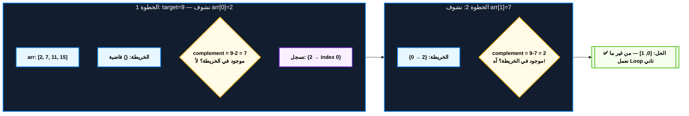
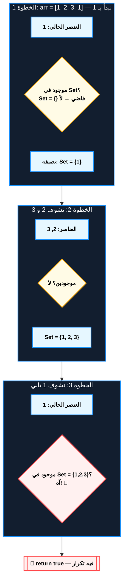
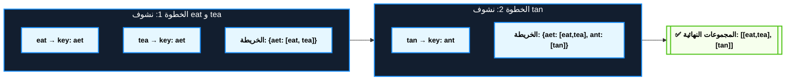
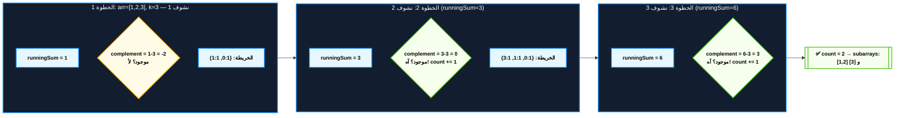

# Hash Map / Hash Set — Problem Solving Deep Dive Notes

**نسبة ظهوره في الـ Coding Interviews:** عالي جداً — يمكن القول إنه أكتر Data Structure بتتكرر في الـ Interviews كلها (مش بس مسائله المباشرة، ده كمان بيبقى "السلاح المساعد" جوه تيكنيكات تانية زي Sliding Window و Two Pointers لما الـ Array مش مرتب).

**اللغة المستخدمة في الأمثلة:** JavaScript

**المتطلب السابق (Prerequisite):** فهم بسيط لـ Array وإزاي بتشتغل الـ Loops، وفكرة عامة عن الـ Big-O قبل ما تدخل في تحليل التعقيد الزمني هنا.

---

## 📋 فهرس المحتوى
1. الأساس: خريطة الكنز — Hash Map Lookup & Frequency Counter
2. الحارس على الباب — Hash Set لمنع التكرار والتحقق من الوجود
3. تجميع الأقارب — Grouping بالـ Canonical Key
4. البصمة الرقمية — Prefix Sum + Hash Map

---

## 1. خريطة الكنز — Hash Map Lookup & Frequency Counter

**أصل الحكاية (The Core Problem):**

تخيل إنت واقف في صيدلية وعندك روشتة فيها 10 أدوية، وعايز تعرف لكل دوا فيه كام علبة على الرف. الطريقة البديهية (Brute Force): كل مرة تدور على الدوا، تمشي على كل الرفوف من الأول للآخر لحد ما تلاقيه. لو عندك n دوا في الروشتة و m رف، هتعمل n × m عملية بحث — يعني كل مرة تدور فيها بتعيد نفس الرحلة من الصفر.

نفس القصة بالظبط بتحصل في مسألة زي "Two Sum": عندك array وعايز تلاقي رقمين مجموعهم = target. الحل الـ Brute Force هو Nested Loop: لكل عنصر i، تدور جوه Loop تاني على كل الباقي عشان تشوف هل فيه عنصر بيكمله للـ target. ده O(n²) — ولو الـ array فيها 10,000 عنصر يبقى إنت بتعمل 100 مليون عملية مقارنة، وده هيرسب في أي test case فيه ضغط وقت (TLE - Time Limit Exceeded).

السؤال اللي غيّر قواعد اللعبة: "ليه أنا بمشي كل مرة من الأول عشان أدور؟ ليه ما أعملش خريطة أسجل فيها مكان كل حاجة أول ما أشوفها، فبعدين الدوا من غير ما يتحرك حرفياً يبقى موجود عندي في نص ثانية؟" هنا اتولدت فكرة الـ Hash Map: بدل ما تدور، إنت "تسجل وتفتش" — كل عنصر بتشوفه، تحطه في خريطة (Key → Value)، وبعدين أي سؤال "هل ده موجود؟" أو "فين مكانه؟" بيتحول من رحلة بحث لعملية Lookup فورية تقريباً O(1).

السر التقني اللي بيخلي الـ O(1) ده ممكن هو الـ Hash Function: دالة بتاخد الـ Key (أي كان نوعه) وتحوله لرقم (Hash Code)، والرقم ده بيتحول لـ Index جوه Array داخلي (Bucket). يعني إنت مش بتدور على العناصر، إنت بتـ"تحسب" مكان العنصر مباشرة زي ما تحسب رقم شقتك من رقم الدور والعمود.

### 🔑 إشارات الاستدعاء (Trigger Keywords)
- "Find pair/triplet that sums to X"
- "Count frequency of elements"
- "Check if two arrays are equal (as multisets)"
- "First non-repeating character"
- "Complement" أو "counterpart" لعنصر معين
- أي مسألة فيها كلمة "in O(1) time" أو "without extra loop"
- "How many times does X appear"

### ⚙️ التشريح التقني — الميكانيزم بالتفصيل

#### أ. البنية الداخلية — "الصناديق البريدية" (Buckets)
- **الفكرة:** الـ Hash Map جواها Array من "الصناديق" (Buckets). كل Key بتدخل على دالة Hash Function فبتطلعلك رقم، والرقم ده (بعد ما ياخد Modulo على حجم الـ Array) بيحدد أي صندوق الـ Key/Value هيتخزن فيه.
- **Collision (تصادم):** لو Keyين مختلفين طلعوا على نفس رقم الصندوق، بيتخزنوا سوا جوه نفس الصندوق (غالباً كـ Linked List قصيرة أو Array صغير). لو الصناديق اتزنقت بعناصر كتير، بيحصل "Resizing" تلقائي — الخريطة بتكبر نفسها وتعيد توزيع كل حاجة، عشان تفضل عمليات البحث سريعة.
- **Time Complexity:** الـ Insert / Lookup / Delete كلهم **O(1) في المتوسط (Average Case)**. لكن لازم تعرف الحقيقة الكاملة: في أسوأ الأحوال (Worst Case، لو كل الـ Keys اتصادفوا في نفس الصندوق) ممكن توصل لـ O(n) — بس ده نادر جداً وبيتجاهل في تحليل الـ Interviews العادية.
- **Space Complexity:** O(n) — إنت بتخزن نسخة من كل عنصر (أو مؤشر عليه) جوه الخريطة.

#### ب. الـ Frequency Counter — "دفتر الحسبة"
- **الفكرة:** بدل ما الـ Value تبقى بيانات عادية، بتخليها **عداد (Counter)**. كل مرة تشوف عنصر، تزود العداد بتاعه بواحد. النتيجة: خريطة كاملة بتقولك "كل عنصر ظهر كام مرة" في مرور واحد بس على الـ array (One Pass، O(n)).
- **الاستخدام النموذجي:** مقارنة Multisets (هل Array A و Array B فيهم نفس العناصر بنفس التكرار؟)، إيجاد أول عنصر غير مكرر، إيجاد الـ Majority Element.

> [!warning] فخ شائع
> الطلبة بينسوا إن الـ Key جوه الـ JavaScript Object بتتحول تلقائياً لـ String. يعني `obj[5]` و `obj["5"]` هما نفس الـ Key بالظبط! لو مسألتك محتاجة تفرق بين الرقم 5 والـ String "5"، لازم تستخدم `Map` مش `Object` العادي، لأن الـ `Map` بيحافظ على نوع الـ Key الحقيقي (Number يفضل Number).

> [!info] نصيحة الحل السريع
> أول ما تقرا كلمة "count"، "frequency"، "how many times"، أو "pair/triplet sums to" — روح دماغك على طول لـ Hash Map قبل أي حاجة تانية. اسأل نفسك سؤال واحد: "أنا محتاج أعرف حاجة عن عنصر شفته قبل كده بسرعة، من غير ما أدور عليه تاني؟" — لو الإجابة "أيوه"، يبقى دي حالتك.

### 🧩 الـ Template الجاهز (Code Skeleton)

```javascript
function hashMapPattern(arr, target) {
  // 1. خريطة الكنز: هنسجل فيها كل عنصر شفناه ومعاه الـ index بتاعه
  //    استخدمنا Map مش Object عشان نحافظ على نوع الـ Key الأصلي
  const seen = new Map();

  for (let i = 0; i < arr.length; i++) {
    // 2. بنحسب "المكمل" (complement) اللي محتاجينه عشان نوصل للـ target
    //    ده بيتغير حسب المسألة — هنا مثال Two Sum
    const complement = target - arr[i];

    // 3. السؤال الذهبي: هل المكمل ده موجود في الخريطة من قبل؟
    //    ده هو الـ Lookup اللي بيوفرلنا الـ Loop التاني بالكامل
    if (seen.has(complement)) {
      return [seen.get(complement), i]; // لقينا الحل من غير ما ندور تاني
    }

    // 4. لو معلقناش، نسجل العنصر الحالي في الخريطة عشان نستخدمه
    //    في التكرارات الجاية (مش قبلها — ده مهم عشان منستخدمش نفس العنصر مرتين)
    seen.set(arr[i], i);
  }

  return []; // معملناش حل — edge case المفروض تتأكد منها دايماً
}
```

### 🏗️ اللوحة المعمارية: رحلة الـ Two Sum جوه الخريطة (Mermaid)



### 📈 أمثلة محلولة متدرجة الصعوبة

#### مثال 1 (Easy): Two Sum
- **الترابط بالمسألة:** المسألة بتسألك "لاقي رقمين مجموعهم = target" — ده تعريف حرفي لـ "أنا محتاج أعرف هل شفت قبل كده رقم معين، بسرعة". دي بالظبط وظيفة الـ Hash Map.
- **Dry Run:** `arr = [3, 2, 4]`, `target = 6`
  1. i=0, arr[0]=3 → complement = 6-3 = 3 → مش موجود في الخريطة → نسجل `{3: 0}`
  2. i=1, arr[1]=2 → complement = 6-2 = 4 → مش موجود → نسجل `{3: 0, 2: 1}`
  3. i=2, arr[2]=4 → complement = 6-4 = 2 → **موجود!** (index 1) → الإجابة `[1, 2]`
- **الكود الكامل:**
```javascript
function twoSum(arr, target) {
  const seen = new Map(); // Key: القيمة، Value: الـ index بتاعها
  for (let i = 0; i < arr.length; i++) {
    const complement = target - arr[i];
    if (seen.has(complement)) return [seen.get(complement), i];
    seen.set(arr[i], i); // نسجل بعد الفحص عشان منستخدمش نفس العنصر مرتين
  }
  return [];
}
```
- **Edge Cases تستاهل وقفة:** لو الـ array فيها رقم مكرر بيدي نفسه target مقسوم على 2 (زي `[3,3]`, target=6) — لازم تتأكد إن ترتيب التسجيل (تسجل بعد الفحص مش قبله) بيمنع إنك تستخدم نفس الـ index مرتين.

#### مثال 2 (Medium): Group Anagrams
- **الترابط بالمسألة:** المسألة بتديك مجموعة كلمات وعايزك تجمع كل مجموعة كلمات هي Anagram لبعض في نفس الـ Bucket. هنا الـ Hash Map مش بيتخزن فيها رقم بسيط، بيتخزن فيها **Array كامل** كـ Value لكل Key.
- **Dry Run:** `words = ["eat", "tea", "tan", "ate", "nat", "bat"]`
  1. `"eat"` → نرتب حروفها → `"aet"` (Key) → مفيش Key كده → ننشئ `{"aet": ["eat"]}`
  2. `"tea"` → نرتبها → `"aet"` → موجود! → `{"aet": ["eat","tea"]}`
  3. `"tan"` → `"ant"` → جديد → `{"aet": [...], "ant": ["tan"]}`
  4. `"ate"` → `"aet"` → موجود → `{"aet": ["eat","tea","ate"], "ant": ["tan"]}`
  5. `"nat"` → `"ant"` → موجود → `{"ant": ["tan","nat"]}`
  6. `"bat"` → `"abt"` → جديد
  - النتيجة النهائية: `[["eat","tea","ate"], ["tan","nat"], ["bat"]]`
- **الكود الكامل:**
```javascript
function groupAnagrams(words) {
  const groups = new Map();
  for (const word of words) {
    // الـ Canonical Key: ترتيب الحروف أبجدياً بيوحد كل الـ anagrams تحت نفس المفتاح
    const key = word.split('').sort().join('');
    if (!groups.has(key)) groups.set(key, []);
    groups.get(key).push(word);
  }
  return Array.from(groups.values());
}
```
- **Edge Cases تستاهل وقفة:** الكلمات الفاضية `""` كلها بتتجمع مع بعض تحت Key فاضية. وكمان الـ Sort هنا O(k log k) على كل كلمة (k = طول الكلمة)، فالتعقيد الكلي O(n · k log k) مش O(n) بسيطة.

#### مثال 3 (Medium/Hard): Longest Consecutive Sequence
- **الترابط بالمسألة:** المسألة عايزاك تلاقي أطول متتالية أرقام متتالية (زي 4,5,6,7) جوه array غير مرتب، وبشرط الحل يكون O(n) — يعني ممنوع تعمل Sort (اللي هتاخد O(n log n)). الـ "Twist" هنا: الحل مش مجرد Lookup عادي، لازم تستخدم الـ Hash Set كـ "كاشف نقطة البداية".
- **Dry Run:** `arr = [100, 4, 200, 1, 3, 2]`
  1. نحط كل العناصر في Set: `{100, 4, 200, 1, 3, 2}`
  2. لكل عنصر، نسأل: "هل `عنصر - 1` موجود في الـ Set؟" لو موجود، يبقى العنصر ده مش بداية متتالية، نتجاهله (نوفر وقت).
  3. `100`: هل `99` موجود؟ لأ → ده بداية متتالية! نعد لقدام: 100 (مش موجود 101) → طول 1
  4. `4`: هل `3` موجود؟ آه → مش بداية، نتجاهله
  5. `1`: هل `0` موجود؟ لأ → بداية متتالية! نعد: 1,2,3,4 (5 مش موجود) → طول 4
  6. باقي العناصر (200, 3, 2) إما بدايات مش أطول أو مش بدايات أصلاً
  - **النتيجة: 4** (المتتالية 1-2-3-4)
- **الكود الكامل:**
```javascript
function longestConsecutive(arr) {
  const numSet = new Set(arr); // Hash Set: بنستخدمه للتحقق الفوري من الوجود
  let longest = 0;

  for (const num of numSet) {
    // بنشتغل بس لو العنصر ده "بداية" متتالية (مفيش num-1 قبله)
    if (!numSet.has(num - 1)) {
      let length = 1;
      let current = num;
      while (numSet.has(current + 1)) { // نعد لقدام لحد ما تنقطع المتتالية
        current++;
        length++;
      }
      longest = Math.max(longest, length);
    }
  }
  return longest;
}
```
- **Edge Cases تستاهل وقفة:** array فاضية لازم ترجع 0. أرقام مكررة (زي `[1,1,2]`) لازم الـ Set يشيلها تلقائياً عشان منعدش نفس الرقم مرتين في المتتالية.

> [!danger] فخ الانترفيو 🚨
> الـ Interviewer ممكن يسألك: "طب ليه معملتش Sort الأول وبعدين تعد المتتاليات؟" — الإجابة الصح إنك تقوله إن الـ Sort هياخدك لـ O(n log n)، بينما الـ Hash Set approach بيدينا O(n) حقيقية لأن كل عنصر بيتفحص كـ "بداية محتملة" مرة واحدة بس على مستوى الـ array كله (مش O(n²))، حتى لو شكل الكود فيه Loop جوه Loop.

### 📊 شفرات الاستدعاء السريع (Pattern Recognition Table)

| السيناريو في نص المسألة (Keyword/Phrase) | التيكنيك المطلوب |
|---|---|
| Find pair that sums to target (unsorted array) | **Hash Map (complement lookup)** |
| Count frequency of each element | **Hash Map (Frequency Counter)** |
| Group words/items by some derived key | **Hash Map (Grouping)** |
| Longest consecutive sequence in O(n) | **Hash Set (sequence start detection)** |
| Check if array contains duplicates | **Hash Set** |
| First unique/non-repeating character | **Hash Map (Frequency Counter)** |

### 📝 واجب التدريب (Homework Set)
1. **Two Sum (LC #1) — Easy:** الأساس اللي لازم تتقنه قبل أي حاجة تانية في الـ Pattern ده.
2. **Contains Duplicate (LC #217) — Easy:** تطبيق مباشر لفكرة الـ Hash Set كـ "كاشف تكرار".
3. **Valid Anagram (LC #242) — Easy:** فرصة تتمرن على Frequency Counter بأبسط صورة قبل ما تروح لـ Group Anagrams.
4. **Group Anagrams (LC #49) — Medium:** بتضيف مفهوم الـ Canonical Key فوق الـ Frequency Counter العادي.
5. **Longest Consecutive Sequence (LC #128) — Hard:** الـ Twist الحقيقي — استخدام الـ Set مش للـ Lookup البسيط، لكن كأداة كشف "نقاط البداية" لتقليل التعقيد. *Hint لو اتعلقت:* فكر إمتى العنصر يستاهل يبدأ عد المتتالية من عنده، وإمتى الأفضل تتجاهله فوراً.

---

## 2. الحارس على الباب — Hash Set لمنع التكرار والتحقق من الوجود

**أصل الحكاية (The Core Problem):**

تخيل إنت بواب في نادي، وشغلانتك إنك تمنع أي حد يدخل مرتين بنفس الكارنيه. الطريقة البديهية: كل واحد داخل، تفتح دفتر الحضور وتقرا كل الأسامي اللي فاتت قبل كده من الأول للآخر عشان تتأكد إنه مش مكرر. لو دخل 1000 شخص، وكل واحد فيهم بتقرا فيه الدفتر من الأول، يبقى إنت بتعمل حتى O(n²) عمليات مقارنة على الأكتر.

الحل الذكي: بدل الدفتر التقليدي، حط "خريطة حضور فورية" — كل واحد داخل، تشوف اسمه موجود في الخريطة ولا لأ (عملية فورية O(1))، لو مش موجود تسجله وتسيبه يدخل، لو موجود تمنعه فوراً. هنا مش محتاج قيمة (Value) خالص — إنت محتاج بس تعرف "موجود ولا لأ"، فده بالظبط تعريف الـ **Hash Set**: خريطة بدون Values، بس Keys.

الفرق الجوهري عن الـ Hash Map: الـ Set بيجاوبك على سؤال واحد بس — "هل ده موجود؟" (Boolean) — بينما الـ Map بيجاوبك على "هل ده موجود، وإيه القيمة/المعلومة المرتبطة بيه؟". لو مش محتاج غير التحقق من الوجود، استخدم Set — أخف وأوضح في القراية.

### 🔑 إشارات الاستدعاء (Trigger Keywords)
- "Check for duplicates"
- "Has the element been seen before?"
- "Detect a cycle" (في Linked List أو Graph)
- "Unique elements only"
- "Intersection/Union of two arrays"
- "Visited nodes" في مسائل الـ Graph/Grid traversal

### ⚙️ التشريح التقني — الميكانيزم بالتفصيل

#### أ. Set كـ "بصمة الزيارة" في الـ Traversal
- **الفكرة:** في مسائل الـ Graph أو الـ Grid (زي BFS/DFS)، لازم "تتذكر" إنك زرت الخلية أو الـ Node دي قبل كده، وإلا هتدخل في **Infinite Loop**. الـ Hash Set هو الأداة القياسية لتسجيل الـ "visited" لأنه بيديك تحقق فوري O(1) بدل ما تدور في Array كامل كل مرة.
- **Time Complexity:** Add / Has كلهم O(1) في المتوسط، بالظبط زي الـ Map لأنهم مبنيين على نفس آلية الـ Hashing.
- **Space Complexity:** O(n) — في أسوأ الأحوال بتسجل كل عنصر/Node مرة واحدة.

#### ب. اكتشاف الدورة (Cycle Detection) بـ Set
- **الفكرة:** لو إنت ماشي في مسار (Linked List أو مسار في Grid) وفجأة رجعت لعنصر إنت سجلته قبل كده في الـ Set، يبقى في **Cycle**. ده أسرع وأوضح كتير من طرق تانية زي Floyd's Cycle Detection في المسائل اللي الـ Space مش قيد صارم فيها.

> [!warning] فخ شائع
> بعض الطلبة بيستخدموا Array عادي مع `.includes()` عشان "يتحقق من الوجود" — ده بيدي نفس النتيجة الصح لكن بـ **O(n)** لكل تحقق، يعني رجعت تاني لنفس مشكلة الـ Brute Force! لازم تستخدم `Set` أو `Map` عشان تضمن الـ O(1).

> [!info] نصيحة الحل السريع
> أي مرة تلاقي نفسك بتفكر "هل أنا شفت ده قبل كده؟" وسط أي Loop أو Traversal — استخدم Set على طول. ده أشيع استخدام للـ Hash Set في الـ Interviews كلها.

### 🧩 الـ Template الجاهز (Code Skeleton)

```javascript
function hasDuplicate(arr) {
  // 1. الحارس: خريطة فاضية هتسجل فيها كل عنصر شفناه
  const seen = new Set();

  for (const num of arr) {
    // 2. السؤال الذهبي: هل العنصر ده دخل الحارس قبل كده؟
    if (seen.has(num)) {
      return true; // اتكرر — رجعنا فوراً من غير ما نكمل الـ Loop
    }
    // 3. أول مرة نشوف العنصر ده، نسجله في دفتر الحضور
    seen.add(num);
  }

  return false; // خلصنا الـ Loop كله من غير ما نلاقي تكرار
}
```

### 🏗️ اللوحة المعمارية: الحارس بيفحص الدخول (Mermaid)



### 📈 أمثلة محلولة متدرجة الصعوبة

#### مثال 1 (Easy): Contains Duplicate
- **الترابط بالمسألة:** أبسط تطبيق مباشر لفكرة "الحارس" — بس عايزين نعرف هل فيه تكرار ولا لأ، من غير أي معلومة إضافية.
- **Dry Run:** `arr = [1, 2, 3, 1]`
  1. 1 → مش موجود → نضيفه → `{1}`
  2. 2 → مش موجود → نضيفه → `{1,2}`
  3. 3 → مش موجود → نضيفه → `{1,2,3}`
  4. 1 → **موجود!** → return true
- **الكود الكامل:** (زي الـ Template فوق بالظبط)
- **Edge Cases تستاهل وقفة:** Array فاضية أو بعنصر واحد لازم ترجع `false` مباشرة — تأكد إن الـ Loop مش بيفترض وجود عنصرين على الأقل.

#### مثال 2 (Medium): Linked List Cycle Detection
- **الترابط بالمسألة:** بدل ما تتبع الـ Nodes في Array، إنت ماشي في Linked List وعايز تعرف هل رجعت لـ Node شفتها قبل كده (يعني فيه Loop). الـ Set هنا بيسجل **مراجع الـ Nodes نفسها** (Object references) مش قيمها.
- **Dry Run:** لينكد ليست `A → B → C → B` (تاني مرة)
  1. Node A → مش موجودة في Set → نضيفها → `{A}`
  2. Node B → مش موجودة → نضيفها → `{A, B}`
  3. Node C → مش موجودة → نضيفها → `{A, B, C}`
  4. Node B (تاني مرة) → **موجودة!** → فيه Cycle
- **الكود الكامل:**
```javascript
function hasCycle(head) {
  const visited = new Set(); // هنسجل فيها مراجع الـ Node objects نفسها
  let current = head;

  while (current !== null) {
    if (visited.has(current)) return true; // رجعنا لنفس الـ Node — فيه Cycle
    visited.add(current);
    current = current.next;
  }

  return false; // وصلنا لآخر اللستة من غير ما نرجع لحد
}
```
- **Edge Cases تستاهل وقفة:** لستة فاضية (`head = null`) لازم ترجع `false` فوراً. لستة من Node واحدة بتشاور على نفسها (`A.next = A`) هي حالة Cycle من أول خطوة.

> [!danger] فخ الانترفيو 🚨
> الـ Interviewer هيسألك: "طب الحل ده بياخد O(n) Space — تقدر تحله بـ O(1) Space؟" — لازم تعرف إن الإجابة الصح هي **Floyd's Cycle Detection (Fast & Slow Pointers)** اللي بيستغني عن الـ Set خالص. الـ Hash Set approach أسهل وأوضح لكنه مش الـ Optimal من ناحية الـ Space، فلازم تذكر البديل ده حتى لو مش هتكتبه.

### 📊 شفرات الاستدعاء السريع (Pattern Recognition Table)

| السيناريو في نص المسألة (Keyword/Phrase) | التيكنيك المطلوب |
|---|---|
| Contains duplicate / any element appears twice | **Hash Set** |
| Detect cycle in Linked List / Graph | **Hash Set (visited tracking)** |
| Avoid revisiting nodes in BFS/DFS | **Hash Set (visited tracking)** |
| Intersection of two arrays | **Hash Set (membership check)** |
| Remove duplicates while preserving structure | **Hash Set** |

### 📝 واجب التدريب (Homework Set)
1. **Contains Duplicate (LC #217) — Easy:** نقطة البداية الأساسية.
2. **Intersection of Two Arrays (LC #349) — Easy:** تطبيق Set في مقارنة مجموعتين مش array واحدة.
3. **Linked List Cycle (LC #141) — Easy/Medium:** أول مرة تستخدم فيها Set على Object references مش قيم بسيطة.
4. **Longest Substring Without Repeating Characters (LC #3) — Medium:** *Hint:* دمج بين Hash Set و Sliding Window — هتحتاجها كمقدمة لملف الـ Sliding Window لو هتذاكره بعدين.

---

## 3. تجميع الأقارب — Grouping بالـ Canonical Key

**أصل الحكاية (The Core Problem):**

فيه مسائل مش عايزاك بس "تلاقي عنصر" — عايزاك **تجمع** عناصر شبه بعض تحت مجموعات. المشكلة: إزاي تعرف إن عنصرين "شبه بعض" بسرعة، من غير ما تقارن كل عنصر بكل عنصر تاني (اللي هيديك O(n²))؟

الفكرة العبقرية: بدل ما تقارن العناصر ببعض مباشرة، اخترع "توقيع" أو **Canonical Key** — صيغة موحدة لو عنصرين متشابهين هيوصلوا لنفس الـ Key بالظبط، حتى لو شكلهم الأصلي مختلف. مثال: كلمة "eat" وكلمة "tea" لو رتبت حروفهم أبجدياً، الاتنين هيطلعوا "aet" — فبقى عندك "بصمة" واحدة تجمعهم تحتها.

بمجرد ما تلاقي الـ Canonical Key، المسألة بترجع لمسألة Hash Map عادية: الـ Key هو التوقيع، والـ Value هي Array بتجمع فيها كل العناصر اللي وصلت لنفس التوقيع ده.

### 🔑 إشارات الاستدعاء (Trigger Keywords)
- "Group by..."
- "Anagrams"
- "Categorize items with similar properties"
- "Cluster elements that share X"

### ⚙️ التشريح التقني — الميكانيزم بالتفصيل

#### أ. اختيار الـ Canonical Key الصح — "بصمة" العنصر
- **الفكرة:** أهم خطوة في الـ Pattern ده مش الكود، هي إنك تلاقي دالة تحويل صح: أي تحويل، طالما بيدي **نفس المخرج بالظبط** للعناصر المتشابهة ومخرج مختلف للمختلفين. للـ Anagrams: ترتيب الحروف، أو (أسرع) عد تكرار كل حرف كـ Array من 26 رقم.
- **Time Complexity:** بيعتمد على تكلفة حساب الـ Key. لو Sort للحروف: O(n · k log k). لو Frequency Array: O(n · k) — أسرع لو الكلمات طويلة.
- **Space Complexity:** O(n · k) — بتخزن كل العناصر الأصلية تاني جوه المجموعات.

> [!tip] التريكة الذهنية (Mental Model)
> فكر في الـ Canonical Key زي "بصمة الإصبع" — شكل الإيد يختلف من حد للتاني، بس البصمة نفسها ثابتة وفريدة لكل شخص. إنت مش بتقارن الإيدين ببعض، إنت بتقارن البصمات.

> [!warning] فخ شائع
> استخدام `.sort()` كـ Canonical Key بيكون بطيء لو الكلمات طويلة جداً (زي DNA sequences بآلاف الحروف). في الحالة دي، استخدام Frequency Array (26 خانة للحروف الإنجليزية الصغيرة) وتحويله لـ String كـ Key بيكون أسرع كتير: O(k) بدل O(k log k) لكل كلمة.

### 🧩 الـ Template الجاهز (Code Skeleton)

```javascript
function groupByCanonicalKey(items, getKey) {
  // 1. خريطة التجميع: Key = التوقيع، Value = Array بالعناصر المتشابهة
  const groups = new Map();

  for (const item of items) {
    // 2. نحسب الـ Canonical Key بتاع العنصر الحالي (الدالة دي بتتغير حسب المسألة)
    const key = getKey(item);

    // 3. لو أول مرة نشوف التوقيع ده، ننشئ مجموعة جديدة فاضية
    if (!groups.has(key)) {
      groups.set(key, []);
    }

    // 4. نضيف العنصر لمجموعته
    groups.get(key).push(item);
  }

  // 5. نرجع بس الـ Values (المجموعات) من غير الـ Keys نفسها
  return Array.from(groups.values());
}
```

### 🏗️ اللوحة المعمارية: تجميع الكلمات تحت بصمتها (Mermaid)



### 📈 أمثلة محلولة متدرجة الصعوبة

#### مثال 1 (Easy): Find All Duplicated Strings
- **الترابط بالمسألة:** أبسط شكل للتجميع — الـ Canonical Key هنا هو الكلمة نفسها، وأي مجموعة فيها أكتر من عنصر يبقى فيها تكرار.
- **Dry Run:** `["cat","dog","cat","bird"]` → المجموعات: `{cat: [cat,cat], dog: [dog], bird: [bird]}` → المكرر: `["cat"]`
- **الكود الكامل:**
```javascript
function findDuplicates(words) {
  const groups = new Map();
  for (const w of words) {
    groups.set(w, (groups.get(w) || 0) + 1);
  }
  return [...groups.entries()].filter(([_, count]) => count > 1).map(([word]) => word);
}
```
- **Edge Cases تستاهل وقفة:** حساسية الحروف الكبيرة/الصغيرة — هل "Cat" و"cat" يعتبروا نفس الكلمة ولا لأ؟ لازم توضحها مع الـ Interviewer الأول.

#### مثال 2 (Medium): Group Anagrams
- (تم شرحها بالتفصيل الكامل في القسم الأول — راجعها هناك، ده نفس التيكنيك بس الـ Canonical Key فيها أعقد شوية.)
- **الترابط بالمسألة:** مثال متقدم على نفس فكرة الـ Grouping، بس بيستخدم Sort كـ Key بدل القيمة المباشرة.

#### مثال 3 (Medium/Hard): Group Shifted Strings
- **الترابط بالمسألة:** كلمتين تعتبروا "متشابهتين" لو ممكن توصل من واحدة للتانية بإزاحة كل الحروف بنفس المقدار (زي `"abc"` → `"bcd"` بإزاحة +1 لكل حرف). الـ Twist: الـ Canonical Key هنا مش ترتيب الحروف، لازم تخترع **مقياس الفروق بين الحروف المتتالية**.
- **Dry Run:** `["abc", "bcd", "acef"]`
  1. `"abc"` → الفروق بين الحروف: `b-a=1, c-b=1` → Key: `"1,1"`
  2. `"bcd"` → `c-b=1, d-c=1` → Key: `"1,1"` → **نفس Key!** تنضم لنفس المجموعة
  3. `"acef"` → فروق مختلفة → Key مختلف → مجموعة لوحدها
  - النتيجة: `[["abc","bcd"], ["acef"]]`
- **الكود الكامل:**
```javascript
function groupShiftedStrings(words) {
  const groups = new Map();

  for (const word of words) {
    // نحسب الفروق بين كل حرف والحرف اللي قبله (مع التعامل مع اللف الدائري a-z)
    const key = [];
    for (let i = 1; i < word.length; i++) {
      let diff = word.charCodeAt(i) - word.charCodeAt(i - 1);
      if (diff < 0) diff += 26; // عشان نتعامل مع حالة زي z → a
      key.push(diff);
    }
    const keyStr = key.join(',');

    if (!groups.has(keyStr)) groups.set(keyStr, []);
    groups.get(keyStr).push(word);
  }

  return Array.from(groups.values());
}
```
- **Edge Cases تستاهل وقفة:** كلمة من حرف واحد (`"a"`) هيبقى الـ Key بتاعها Array فاضي `[]` — لازم كل الكلمات المكونة من حرف واحد تتجمع مع بعض تلقائياً بغض النظر عن الحرف نفسه.

> [!danger] فخ الانترفيو 🚨
> لو نسيت التعامل مع اللف الدائري (زي `z` لـ `a` اللي فرقها المفروض يبقى 1 مش -25)، الحل هيفشل بصمت (Silent Bug) — مش هيعمل Error، بس هيدي نتيجة غلط. ده من أخطر أنواع الأخطاء في الـ Interview لأنه صعب تكتشفه من غير Dry Run دقيق.

### 📊 شفرات الاستدعاء السريع (Pattern Recognition Table)

| السيناريو في نص المسألة (Keyword/Phrase) | التيكنيك المطلوب |
|---|---|
| Group anagrams / similar words | **Hash Map Grouping (sorted key)** |
| Group strings by shift pattern | **Hash Map Grouping (diff-based key)** |
| Categorize by any derived property | **Hash Map Grouping (custom canonical key)** |
| Find all items sharing a signature | **Hash Map Grouping** |

### 📝 واجب التدريب (Homework Set)
1. **Group Anagrams (LC #49) — Medium:** التطبيق الكلاسيكي للـ Pattern ده.
2. **Group Shifted Strings (LC #249) — Medium:** بيدرّبك تخترع Canonical Key من الصفر (مش بس Sort جاهز).
3. **Find Duplicate Subtrees (LC #652) — Medium/Hard:** *Hint:* استخدم الـ Serialization بتاعة الـ Subtree نفسها كـ Canonical Key — نفس فكرة Group Anagrams بس على شجرة مش String.

---

## 4. البصمة الرقمية — Prefix Sum + Hash Map

**أصل الحكاية (The Core Problem):**

مسائل زي "عدد الـ Subarrays اللي مجموعها = target" شكلها بسيط، بس الحل البديهي بيقع في فخ خبيث: تعمل Nested Loop، لكل نقطة بداية i تحسب مجموع كل الـ Subarrays اللي بتبدأ منها لحد كل نقطة نهاية j. ده O(n²) — ولو المسألة بتطلب Subarray مش بس Contiguous elements simple، هتلاقي نفسك بتعيد حساب نفس المجاميع الجزئية آلاف المرات.

الحل الذكي بيتبني على ملاحظة رياضية بسيطة: لو عندك الـ **Prefix Sum** (مجموع كل العناصر من البداية لحد نقطة معينة)، فمجموع أي Subarray من index i لـ j بيساوي `prefixSum[j] - prefixSum[i-1]`. يعني بدل ما تعيد الجمع كل مرة، تحسب الـ Prefix Sum مرة واحدة بس، وبعدين أي Subarray sum بيبقى طرح بسيط.

لكن السؤال المهم: إزاي نعرف عدد الـ Subarrays اللي مجموعها = target بسرعة، من غير ما نقارن كل زوج prefix sums ببعض (وده هيرجعنا لـ O(n²) تاني)؟ هنا بيدخل الـ Hash Map: إحنا عايزين `prefixSum[j] - prefixSum[i] = target`، يعني `prefixSum[i] = prefixSum[j] - target`. فبدل ما نقارن، إحنا بنسأل الخريطة: "هل شفنا قبل كده Prefix Sum يساوي `الحالي - target`؟" — بالظبط نفس فكرة الـ complement بتاعة Two Sum، بس مطبقة على المجاميع الجزئية بدل العناصر نفسها.

### 🔑 إشارات الاستدعاء (Trigger Keywords)
- "Number of subarrays with sum equal to K"
- "Continuous subarray sum"
- "Subarray sum divisible by K"
- "Equal number of 0s and 1s in subarray"
- أي مسألة فيها "contiguous" + "sum" + محتاجة تعداد (count) مش بس وجود (existence)

### ⚙️ التشريح التقني — الميكانيزم بالتفصيل

#### أ. بناء الـ Prefix Sum "أثناء الحركة" (Running Sum)
- **الفكرة:** مش لازم تبني Array كامل للـ Prefix Sums الأول. تقدر تحسب `runningSum` وإنت ماشي في الـ Loop، وتحدّث الخريطة في نفس الوقت — ده بيوفر Space كمان (O(n) بدل O(n) إضافية لـ Array منفصل، لكن الفكرة أنظف وأقل عرضة للأخطاء).
- **Time Complexity:** O(n) — مرور واحد بس على الـ array، وكل عملية Hash Map هي O(1).
- **Space Complexity:** O(n) — لتخزين الـ Prefix Sums المختلفة في الخريطة.

#### ب. الـ Base Case الحرج: `{0: 1}`
- **الفكرة:** لازم تبدأ الخريطة بـ `{0: 1}` — يعني "الـ Prefix Sum صفر ظهر مرة واحدة (قبل ما نبدأ أصلاً)". ده عشان لو الـ Subarray نفسه (من البداية لحد نقطة j) مجموعه = target بالظبط، لازم يتحسب، وده بيحصل لو `runningSum - target = 0`.

> [!danger] فخ الانترفيو 🚨
> نسيان الـ Base Case `{0: 1}` هو **أشهر خطأ** في الـ Pattern ده. لو نسيته، أي Subarray بيبدأ من index 0 وبيدي المجموع المطلوب بالظبط مش هيتحسب في العد، وهتطلع بنتيجة أقل من الصح من غير ما تفهم ليه.

> [!info] نصيحة الحل السريع
> أي مرة تشوف "subarray sum equals K" مع مطلوب **عدد** (count) — مش بس true/false — فكر في Prefix Sum + Hash Map فوراً، وابدأ خريطتك بـ `{0: 1}` بشكل تلقائي.

### 🧩 الـ Template الجاهز (Code Skeleton)

```javascript
function subarraySumEqualsK(arr, k) {
  // 1. خريطة الـ Prefix Sums: Key = قيمة الـ Prefix Sum، Value = كام مرة ظهرت
  //    البداية {0: 1} عشان نغطي حالة الـ Subarray اللي بيبدأ من الصفر
  const prefixCount = new Map([[0, 1]]);

  let runningSum = 0;
  let count = 0;

  for (const num of arr) {
    // 2. نحدّث الـ Running Sum بإضافة العنصر الحالي
    runningSum += num;

    // 3. السؤال الذهبي: هل شفنا قبل كده Prefix Sum يساوي (الحالي - k)؟
    //    لو آه، يبقى فيه Subarray (أو أكتر) مجموعه k بينتهي هنا بالظبط
    const complement = runningSum - k;
    if (prefixCount.has(complement)) {
      count += prefixCount.get(complement); // ممكن يبقى فيه أكتر من subarray بنفس الـ prefix
    }

    // 4. نسجل الـ Prefix Sum الحالي في الخريطة (نزود عداده لو موجود قبل كده)
    prefixCount.set(runningSum, (prefixCount.get(runningSum) || 0) + 1);
  }

  return count;
}
```

### 🏗️ اللوحة المعمارية: تتبع الـ Prefix Sums (Mermaid)



### 📈 أمثلة محلولة متدرجة الصعوبة

#### مثال 1 (Easy): Running Sum of 1D Array
- **الترابط بالمسألة:** مجرد مقدمة لفهم مفهوم الـ Prefix Sum نفسه قبل ما ندخل في التعقيد مع الـ Hash Map — مفيش Hash Map هنا أصلاً، بس أساس مهم.
- **Dry Run:** `[1,2,3,4]` → `[1,3,6,10]`
- **الكود الكامل:**
```javascript
function runningSum(nums) {
  const result = [];
  let sum = 0;
  for (const n of nums) {
    sum += n;
    result.push(sum);
  }
  return result;
}
```
- **Edge Cases تستاهل وقفة:** Array فاضية لازم ترجع Array فاضية.

#### مثال 2 (Medium): Subarray Sum Equals K
- (تم شرحها بالتفصيل الكامل فوق في الـ Template — دي المسألة المرجعية للـ Pattern ده بالكامل.)
- **الترابط بالمسألة:** التطبيق القياسي المباشر لدمج Prefix Sum مع Hash Map عشان توصل لـ O(n) بدل O(n²).

#### مثال 3 (Medium/Hard): Continuous Subarray Sum (Divisible by K)
- **الترابط بالمسألة:** بدل ما نسأل "هل المجموع يساوي k بالظبط؟"، بنسأل "هل المجموع **قابل للقسمة** على k؟". الـ Twist: بدل ما نخزن الـ Prefix Sum نفسه كـ Key، نخزن **باقي القسمة (Remainder)** بتاعه على k — لأن لو رقمين ليهم نفس الـ Remainder، يبقى الفرق بينهم أكيد قابل للقسمة على k.
- **Dry Run:** `arr = [23, 2, 4, 6, 7]`, `k = 6`
  1. runningSum=23 → remainder = 23%6 = 5 → مش موجود → نسجل `{0:-1(index base), 5:0}` (نخزن الـ index مش العدد هنا لأننا محتاجين نتحقق إن طول الـ subarray ≥ 2)
  2. runningSum=25 → remainder = 25%6 = 1 → مش موجود → نسجل `1:1`
  3. runningSum=29 → remainder = 29%6 = 5 → **موجود!** (كان عند index 0) → طول الـ subarray = 2-0 = 2 ≥ 2 → **الحل موجود!** → return true
- **الكود الكامل:**
```javascript
function checkSubarraySum(arr, k) {
  // نخزن: remainder → أول index شفنا فيه الـ remainder ده
  const remainderIndex = new Map([[0, -1]]); // base case: remainder=0 عند index -1 (قبل البداية)
  let runningSum = 0;

  for (let i = 0; i < arr.length; i++) {
    runningSum += arr[i];
    const remainder = runningSum % k;

    if (remainderIndex.has(remainder)) {
      // لو نفس الـ remainder اتكرر، والمسافة بينهم ≥ 2 عناصر، يبقى لقينا subarray صحيح
      if (i - remainderIndex.get(remainder) >= 2) return true;
    } else {
      // نسجل أول ظهور للـ remainder ده بس (عشان نضمن أطول مسافة ممكنة لاحقاً)
      remainderIndex.set(remainder, i);
    }
  }

  return false;
}
```
- **Edge Cases تستاهل وقفة:** لو `k = 0` هتحصل Division by Zero — لازم تتعامل مع الحالة دي بشرط منفصل (بيبقى المطلوب فحص إن فيه صفرين متتاليين على الأقل). وكمان لازم تسجل أول ظهور بس للـ Remainder مش كل ظهور، عشان تضمن أطول مسافة ممكنة بين الاتنين.

> [!danger] فخ الانترفيو 🚨
> الطلبة بيتلخبطوا بين "نخزن الـ Value" (زي مسألة Subarray Sum Equals K) و"نخزن الـ Index" (زي المسألة دي). القاعدة: لو المطلوب **عدد** الـ subarrays، خزّن الـ Count. لو المطلوب **وجود** subarray بشرط على الطول أو الموقع، خزّن الـ Index (وسجّل أول ظهور بس).

### 📊 شفرات الاستدعاء السريع (Pattern Recognition Table)

| السيناريو في نص المسألة (Keyword/Phrase) | التيكنيك المطلوب |
|---|---|
| Count subarrays with sum equal to K | **Prefix Sum + Hash Map (count)** |
| Subarray sum divisible by K | **Prefix Sum + Hash Map (remainder as key)** |
| Equal number of 0s and 1s in subarray | **Prefix Sum + Hash Map (treat 0 as -1)** |
| Maximum length subarray with sum K | **Prefix Sum + Hash Map (store first index)** |

### 📝 واجب التدريب (Homework Set)
1. **Running Sum of 1D Array (LC #1480) — Easy:** مقدمة لازم تفهمها قبل أي حاجة تانية في الـ Pattern ده.
2. **Subarray Sum Equals K (LC #560) — Medium:** المسألة المرجعية للـ Pattern كله.
3. **Continuous Subarray Sum (LC #523) — Medium:** بتضيف مفهوم الـ Remainder كـ Key بدل القيمة المباشرة.
4. **Contiguous Array (LC #525) — Medium:** *Hint:* حوّل كل 0 في الـ array لـ -1 قبل ما تطبق نفس فكرة Prefix Sum + Hash Map، وهتلاقي المسألة اتحولت لنسخة من Subarray Sum Equals K بـ target=0.
5. **Subarray Sums Divisible by K (LC #974) — Medium/Hard:** نفس فكرة Continuous Subarray Sum بس بيطلب **عدد** الـ subarrays مش مجرد وجودها — تمرين ممتاز يدمج بين مفهومي الـ Remainder والـ Count سوا.

---

> [!tip] خلاصة الملف
> الـ Hash Map / Hash Set مش تيكنيك واحد بس — هو "عقلية": كل مرة تحس إنك بتعيد نفس رحلة البحث أو الحساب أكتر من مرة على نفس البيانات، اسأل نفسك "أقدر أسجل الحاجة دي أول مرة أشوفها، وأرجعلها بسرعة بعدين؟" — لو الإجابة أيوه، إنت في مكانك الصح.
