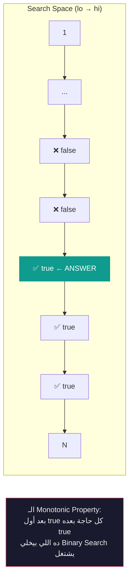
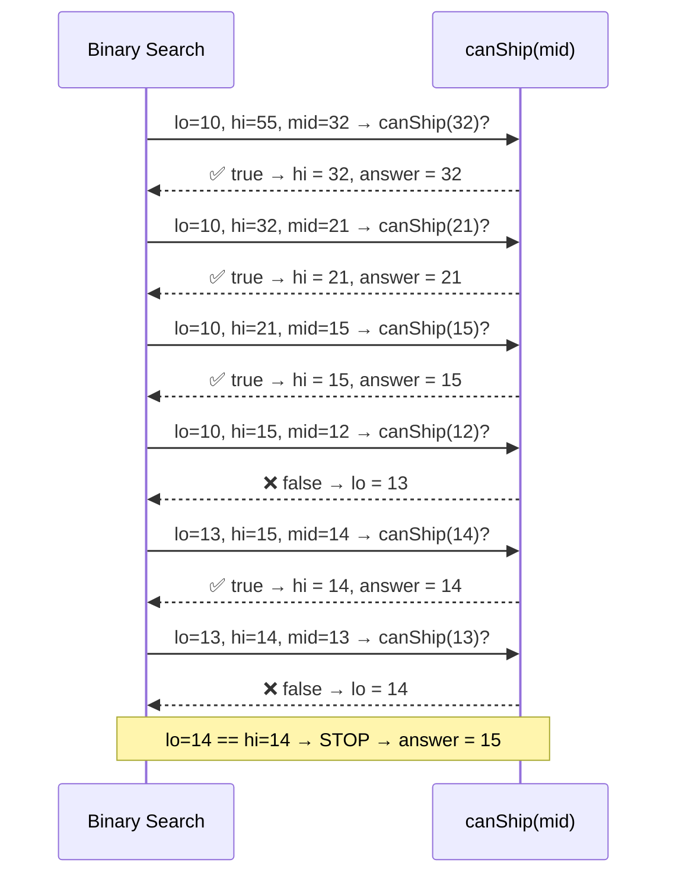
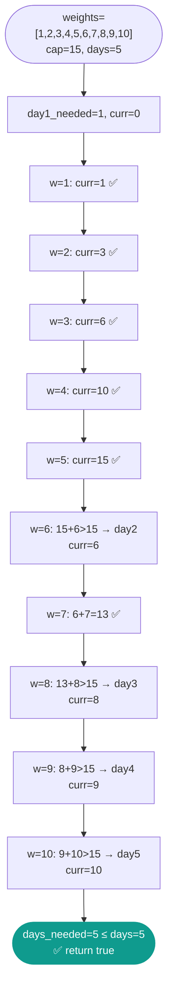

# 🔍 Binary Search on Answer — لعبة "أكبر ولا أصغر؟" في سوق الجمعة

> **Author:** Senior Staff SWE @ FAANG | Cairo → San Francisco
> **Target:** Khaled — Junior Engineer
> **Level:** Intermediate → Advanced
> **Tags:** `#binary-search` `#binary-search-on-answer` `#search-space` `#cpp` `#interview-prep`

---

## الفكرة الأساسية — What Is It?

يا Khaled، إنت رايح سوق الجمعة تشتري موبايل. مش عارف السعر. البائع بيقولك "خمّن."

لو إنت ذكي، مش هتبدأ من جنيه وتعدّي واحد واحد. هتقول **"500 جنيه؟"**

البائع: **"أكتر."**

إنت: **"750؟"**

البائع: **"أقل."**

إنت: **"625؟"**

وهكذا. في كل خطوة بتشيل **نص** الاحتمالات. ده هو الـ Binary Search.

---

**بس إيه هو الـ "Binary Search on Answer"؟**

الـ Binary Search العادي بتدوّر على **عنصر موجود في array**. تمام.

الـ Binary Search on Answer بتدوّر على **قيمة مجهولة** — الـ answer نفسها — في نطاق من الأرقام مش في array حقيقية.

**المثال:** المسألة بتسألك "ما أقل عدد أيام ممكن تُكمل فيه الشغل؟"

إنت مش بتدوّر في array — إنت بتدوّر في الأرقام من 1 لـ N. لكل رقم بتجرّبه بتسأل:

$$\text{"هل ممكن أكمل الشغل في } x \text{ يوم؟"}$$

لو الجواب **نعم** → جرّب أقل.
لو الجواب **لأ** → جرّب أكتر.

**ده هو الـ trick كله.**

---

## التشخيص — Pattern Recognition

### 🔑 الكلمات اللي بتصرخ "Binary Search on Answer"

- **"minimum possible maximum"** / "maximum possible minimum"
- **"minimum number of days/operations/splits to..."**
- **"what is the smallest X such that..."**
- **"can you achieve [condition] within K [resources]?"**
- **"allocate / divide / split into K parts"**
- **"ship packages within D days"**
- **"minimize the largest sum among K groups"**
- أي مسألة فيها **"least" أو "most"** وعندك قيود على عدد العمليات

### 🚩 Red Flags — إمتى مش هينفع

**1. الـ Answer مش monotonic**
الـ Binary Search on Answer بيشتغل لأن الـ answer space فيها خاصية: لو $x$ ينفع، كل حاجة أكبر منه بتنفع كمان (أو العكس). لو مفيش خاصية زي دي، البحث مش هيشتغل.

**2. المسألة بتطلب عدّ combinations**
لو المطلوب "كام طريقة ممكن"، مش "هل ممكن بـ X" — مش ده الـ pattern.

**3. الـ Search Space مش واضح**
لازم تعرف الـ lower bound والـ upper bound للـ answer قبل ما تبدأ.

---

## العمق التقني — Complexity

$$T(N) = O(\log(\text{search space}) \times T(\text{check function}))$$

لو الـ search space حجمه $M$ والـ check function بتاخد $O(N)$:

$$T = O(N \log M)$$

ده بدل $O(N \times M)$ لو عملت brute force وجربت كل قيمة.

**مثال:** $N = 10^5$، $M = 10^9$

- Brute Force: $10^{14}$ operation — **مستحيل**
- Binary Search on Answer: $10^5 \times 30 \approx 3 \times 10^6$ — **سريع جداً**

> 💡 الـ CPU بيقرأ الـ array في الـ check function بشكل sequential — ده كافي تعرفه، مش محتاج تعمق أكتر.

---

## القالب السحري — The Magic Template

```cpp
// ============================================================
// BINARY SEARCH ON ANSWER — Generic Template (C++17)
// ============================================================

// الخطوة 1: حدد الـ search space
long long lo = /* أقل قيمة ممكنة للـ answer */;
long long hi = /* أكبر قيمة ممكنة للـ answer */;
long long answer = hi; // أو lo، حسب اتجاه البحث

// الخطوة 2: ابحث
while (lo <= hi) {
    long long mid = lo + (hi - lo) / 2; // مش (lo+hi)/2 عشان تتجنب overflow

    if (canAchieve(mid)) {
        answer = mid;   // mid ينفع — احفظه وجرّب أحسن
        hi = mid - 1;   // لو بتدوّر على الأقل: اتجه لليسار
        // lo = mid + 1; // لو بتدوّر على الأكبر: اتجه لليمين
    } else {
        lo = mid + 1;   // mid مش كافي — اتجه لليمين
        // hi = mid - 1; // لو عكس
    }
}

return answer;

// ============================================================
// الخطوة 3: اكتب الـ canAchieve(x) function
// السؤال دايماً: "هل الـ answer = x ممكن؟"
// الجواب: true أو false
// ============================================================
```

### ⚠️ الـ `mid = lo + (hi - lo) / 2` — ليه مش `(lo + hi) / 2`؟

لو `lo = 2 * 10^9` و `hi = 2 * 10^9`، مجموعهم هيتعدى الـ `int` max → **overflow**. الصيغة الأولى آمنة دايماً.

---

## أمثلة عملية متدرجة — من الصفر للـ Real Problem

---

### 🟢 المثال الأول — فهم الفكرة (من تأليفنا)

**المشكلة:** عندك شوكولاتة فيها `n` قطعة. عايز تقسمها على `k` أصحاب بالتساوي قدر الإمكان. ما أكبر حصة ممكن يأخذها أي واحد؟

```
n = 10 قطع، k = 3 أصحاب
الإجابة = 3 (3، 3، 4 — بس الحد الأقصى هو 3 لو قسّمت بالتساوي)
```

**فكّر:** لو قلت "كل واحد هياخد `x` قطعة على الأكتر"، هل ينفع؟

- `x = 5`: نعم، 5+5=10، بس في 3 أصحاب — محتاج 3 حصص، مش 2 فقط. ✅ ينفع
- `x = 3`: 3+3+3 = 9 ≤ 10. ✅ ينفع
- `x = 4`: 4+4+4 = 12 > 10. ❌ مش ينفع

**الـ check function:**

$$\text{canAchieve}(x) = \left\lfloor \frac{n}{x} \right\rfloor \geq k$$

يعني: لو قسّمت الشوكولاتة على حصص حجم `x`، هتلاقي على الأقل `k` حصة؟

```
بنـ binary search على x من 1 لـ n
بنـ maximize x مع الشرط ده
```

---

### 🟡 المثال الثاني — تدريجي بالكود (من تأليفنا)

**المشكلة:** عندك `workers = [3, 6, 2, 8, 5]` — كل رقم هو وقت الشغالة للإنجاز مهمة واحدة. عندك `k = 2` ورديات (shifts). كل ورديتين بيشتغلوا بالتوازي. ما أقل وقت ممكن تخلص فيه **كل** المهام؟

```
workers = [3, 6, 2, 8, 5], k = 2

لو الوقت المتاح = 11:
  وردية 1: 3+6+2 = 11 ✅
  وردية 2: 8+5   = 13 ❌ — مش هيخلصوا في 11

لو الوقت المتاح = 13:
  وردية 1: 3+6+2+... = بتوزع
  وردية 2: 8+5 = 13 ✅

الإجابة = 13
```

**الـ Search Space:**

- `lo` = أكبر مهمة منفردة `max(workers)` = 8 (لازم الوقت يكفي أي مهمة لوحدها)
- `hi` = مجموع كل المهام `sum(workers)` = 24 (لو ورديتين واحدة بتشتغل)

**الـ check function `canFinish(time, k)`:**

```
هل نقدر نوزع المهام على k ورديات كل واحدة مدتها <= time؟

نمشي على الـ workers من الأول، وبنحشو ورديات:
- لو الشغالة الجديدة هتعدّي الـ time → افتح وردية جديدة
- لو عدد الورديات اللي محتاجهم > k → مش كافي
```

**الكود خطوة بخطوة:**

```cpp
#include <vector>
#include <numeric>   // accumulate
#include <algorithm> // max_element
using namespace std;

// ─── الـ Check Function ───
// هل نقدر نخلص كل المهام لو كل وردية مدتها على الأكتر `time`؟
bool canFinish(const vector<int>& workers, int k, long long time) {
    int shifts_needed = 1;      // ابدأ بورديتين واحدة
    long long current_load = 0; // الحمل الحالي على الورديتين دي

    for (int w : workers) {
        if (current_load + w <= time) {
            current_load += w;  // ضيف المهمة للورديتين الحالية
        } else {
            shifts_needed++;        // افتح ورديتين جديدة
            current_load = w;    // ابدأ بالمهمة دي

            if (shifts_needed > k) return false; // محتاج أكتر من k
        }
    }
    return true;
}

// ─── الـ Main Function ───
int minTime(vector<int>& workers, int k) {
    long long lo = *max_element(workers.begin(), workers.end());
    long long hi = accumulate(workers.begin(), workers.end(), 0LL);
    long long answer = hi;

    while (lo <= hi) {
        long long mid = lo + (hi - lo) / 2;

        if (canFinish(workers, k, mid)) {
            answer = mid;   // mid ينفع — جرّب أقل
            hi = mid - 1;
        } else {
            lo = mid + 1;   // mid مش كافي — محتاج أكتر
        }
    }

    return static_cast<int>(answer);
}
```

**التتبع خطوة بخطوة:**

```
workers = [3, 6, 2, 8, 5], k = 2
lo = 8, hi = 24

iter 1: mid = 16
  canFinish(16, 2)?
  → shift1: 3+6+2+8=19 > 16, split → shift1=3+6+2=11, shift2=8+5=13 ✅ (2 shifts)
  → true → answer=16, hi=15

iter 2: mid = 11
  canFinish(11, 2)?
  → shift1: 3+6+2=11 ✅, shift2: 8+5=13 > 11
  → 13 > 11, shift3 needed → shifts=3 > k=2
  → false → lo=12

iter 3: mid = 13
  canFinish(13, 2)?
  → shift1: 3+6+2=11, 11+8>13 → split → shift1=11, shift2: 8+5=13 ✅
  → shifts=2 ≤ k=2 → true → answer=13, hi=12

iter 4: lo=12, hi=12 → mid=12
  canFinish(12, 2)?
  → shift1: 3+6+2=11, 11+8>12 → split → shift1=11, shift2: 8+5=13 > 12
  → shift3 needed → false → lo=13

lo=13 > hi=12 → STOP

answer = 13 ✅
```

---

### 🔴 المثال التالت — LeetCode حقيقي
**[LeetCode 1011 — Capacity To Ship Packages Within D Days](https://leetcode.com/problems/capacity-to-ship-packages-within-d-days/)**

**المشكلة:** عندك `weights = [1,2,3,4,5,6,7,8,9,10]` وعايز تشحن كل الطرود في `days = 5` أيام. الكونباني الترتيب محفوظ (مش تقدر تغير ترتيب الطرود). ما أقل حمولة للسفينة تنفع؟

**لاحظ:** ده نفس المسألة اللي اتعلمناها فوق تقريباً بنفس الـ pattern!

---

**Thought Process:**

**الـ Search Space:**
- `lo` = `max(weights)` = 10 — السفينة لازم تحمل أي طرد منفرد
- `hi` = `sum(weights)` = 55 — السفينة تحمل كل حاجة في يوم واحد

**الـ Check Function `canShip(capacity, days)`:**

```
امشي على الطرود بالترتيب (مهم!)
لو الطرد الجديد هيتعدى الـ capacity → يوم جديد
لو الأيام اللي محتاجهم > days → مش كافي
```

**الكود:**

```cpp
class Solution {
public:
    // هل نقدر نشحن كل الطرود في `days` يوم لو حمولة السفينة = `cap`؟
    bool canShip(const vector<int>& weights, int days, int cap) {
        int days_needed = 1;
        int current    = 0;

        for (int w : weights) {
            if (current + w > cap) {
                days_needed++;
                current = 0;
                if (days_needed > days) return false;
            }
            current += w;
        }
        return true;
    }

    int shipWithinDays(vector<int>& weights, int days) {
        int lo = *max_element(weights.begin(), weights.end());
        int hi = accumulate(weights.begin(), weights.end(), 0);

        while (lo < hi) {            // note: lo < hi (not <=) — classic "find minimum" style
            int mid = lo + (hi - lo) / 2;

            if (canShip(weights, days, mid)) {
                hi = mid;            // mid ينفع — هو أو حاجة أصغر
            } else {
                lo = mid + 1;        // mid مش كافي
            }
        }

        return lo; // lo == hi == الـ answer
    }
};
```

---

**لماذا `lo < hi` هنا بدل `lo <= hi`؟**

الـ template الأول (`lo <= hi` + `answer` variable) والتاني (`lo < hi` بدون variable) الاتنين صح. الفرق:

| Style | متى تستخدمه |
|---|---|
| `lo <= hi` + `answer = mid` | لما عايز تحفظ آخر valid mid |
| `lo < hi` والـ answer هو `lo` في النهاية | لما بتدور على أول قيمة `true` في monotonic sequence |

في الـ interviews، استخدم أي منهم بس كن **consistent**. الـ style التاني أكثر شيوعاً في الـ "find minimum" problems.

---

**Complexity:**

| | Time | Space |
|---|---|---|
| Solution | $O(N \log S)$ حيث $S = \sum weights$ | $O(1)$ |

---

## مخططات الذاكرة — Mermaid Diagrams

### Diagram 1: الـ Search Space والـ Monotonic Property



---

### Diagram 2: Binary Search Iterations على مسألة الشحن



---

### Diagram 3: الـ canShip Check — كيف تمشي على الطرود



---

## الـ 3 خطوات اللي لازم تعملهم في أي مسألة Binary Search on Answer

```
الخطوة 1: حدد الـ "Answer Variable"
           إيه الرقم اللي بتدور عليه؟
           (الحمولة؟ الأيام؟ الحجم الأقصى؟)

الخطوة 2: حدد الـ Search Space
           lo = أقل قيمة ممكنة منطقياً
           hi = أكبر قيمة ممكنة منطقياً

الخطوة 3: اكتب canAchieve(x)
           السؤال: "لو الـ answer = x، هينفع؟"
           الجواب: true أو false فقط
           الشرط: لازم يكون monotonic
                  (لو x ينفع → x+1 ينفع كمان، أو العكس)
```

---

## تطبيقات عملية — Obsidian Practice Checklist

- [ ] **[LeetCode 1011 — Capacity To Ship Packages Within D Days](https://leetcode.com/problems/capacity-to-ship-packages-within-d-days/)** `Medium`
  — 🟡 **Hint:** نفس مثالنا بالظبط. `lo=max`, `hi=sum`. الـ check بتعدّ الأيام اللازمة.

- [ ] **[LeetCode 875 — Koko Eating Bananas](https://leetcode.com/problems/koko-eating-bananas/)** `Medium`
  — 🟡 **Hint:** بتدوّر على أقل سرعة أكل `k`. الـ check: `ceil(pile/k)` لكل pile، مجموعهم ≤ `h`؟

- [ ] **[LeetCode 410 — Split Array Largest Sum](https://leetcode.com/problems/split-array-largest-sum/)** `Hard`
  — 🔴 **Hint:** بتدوّر على أقل "largest sum". نفس الـ check بتاع الشحن تقريباً — عدّ الأجزاء اللازمة.

- [ ] **[LeetCode 1482 — Minimum Number of Days to Make m Bouquets](https://leetcode.com/problems/minimum-number-of-days-to-make-m-bouquets/)** `Medium`
  — 🟡 **Hint:** بتدوّر على اليوم. في اليوم `d`، كام زهرة تفتحت؟ تقدر تعمل `m` باقات؟

- [ ] **[LeetCode 1283 — Find the Smallest Divisor Given a Threshold](https://leetcode.com/problems/find-the-smallest-divisor-given-a-threshold/)** `Medium`
  — 🟡 **Hint:** بتدوّر على المقسوم عليه. الـ check: مجموع `ceil(num/d)` ≤ threshold؟

- [ ] **[LeetCode 2064 — Minimized Maximum of Products Distributed to Any Store](https://leetcode.com/problems/minimized-maximum-of-products-distributed-to-any-store/)** `Medium`
  — 🔴 **Hint:** بتدوّر على الـ maximum. الـ check: لو الحد الأقصى لكل store هو `x`، كام store محتاج؟ `ceil(quantity/x)` لكل product.

---

## 🏁 الخلاصة

```
Binary Search على Array العادية:
  "فين العنصر ده في الـ array دي؟"

Binary Search on Answer:
  "أقل/أكبر قيمة X ممكن تحقق الشرط ده؟"

السر كله في سؤال واحد:
  "لو الـ answer = X، هينفع؟ (true/false)"
  لو الإجابة monotonic → Binary Search on Answer
```

*"مش لازم الـ array تكون موجودة — أحياناً إنت بتعمل binary search على فكرة."*
*— Cairo → FAANG, 2024*
