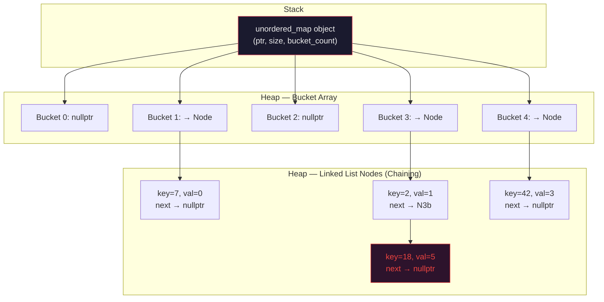
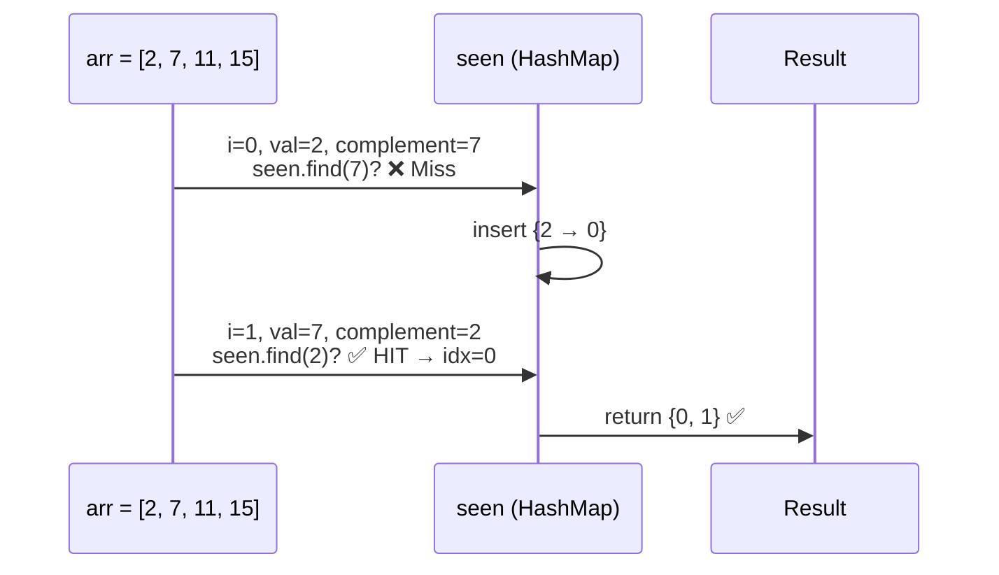
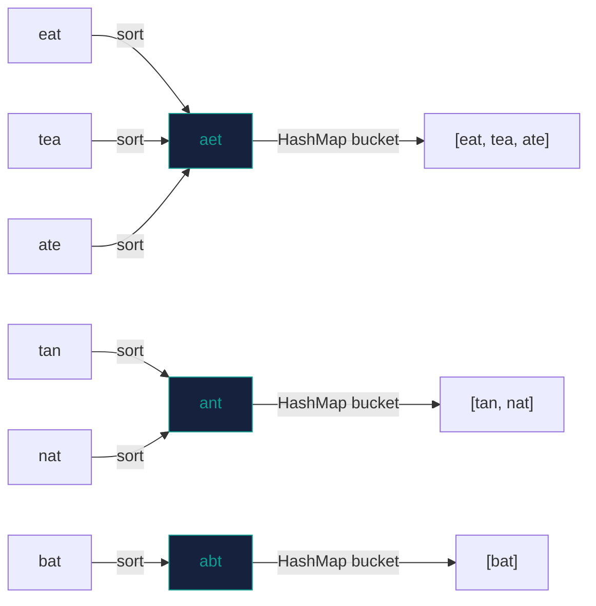
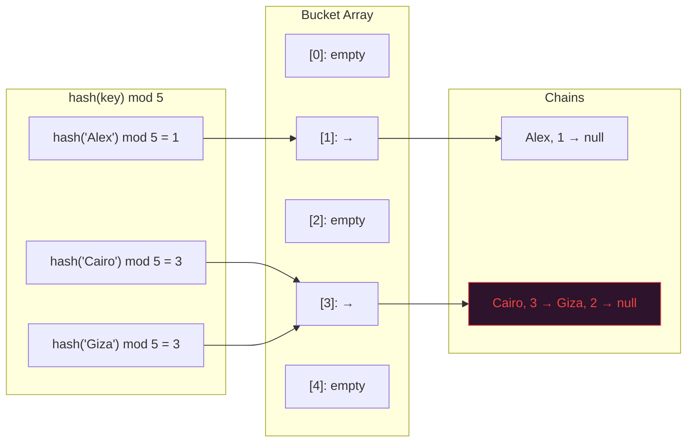

---

## الفكرة الأساسية — What Is It?

يا Khaled، تعالى معايا في موقف المكروباص في ميدان لبنان.

عندك 200 مكروباص. كل واحد بيروح مكان مختلف. إنت شايل ورقة فيها ترتيب كل عربية — رقم 1 لـ المهندسين، رقم 2 لـ الدقي، رقم 3 لـ الجيزة، إلخ.

**السيناريو الأول (الطريقة البدائية):** زبون جه وقال "أنا عايز الجيزة." إنت بتتفرج في الورقة من أولها لآخرها لحد ما تلاقيه. ده $O(N)$ — بطيء ومؤلم.

**السيناريو التاني (الـ Hashing):** إنت عندك **خريطة ذهنية** — كل مدينة ليها **خانة ثابتة**. "الجيزة؟ دايماً في الخانة رقم 7." تروح مباشرة. ده $O(1)$.

الـ **Hash Function** هي الـ "قانون السري" اللي بيحوّل أي input (اسم، رقم، كلمة) لـ **index ثابت** في array. وبكده، أي search أو insert أو delete بتعملها في وقت ثابت بغض النظر عن حجم الداتا.

### المعادلة الأساسية

$$\text{index} = \text{hash}(\text{key}) \mod \text{capacity}$$

بيتحوّل الـ key لـ number، بعدين `mod` بيرجّعه في حدود الـ array.

---

## التشخيص وإمتى نستخدمه — Pattern Recognition

### 🔑 الكلمات اللي بتصرخ "هات الـ HashMap/Set"

- **"two sum"** / "find pair with sum X"
- **"duplicate"** / "has duplicate" / "already seen"
- **"frequency"** / "count occurrences of"
- **"group by"** / "anagram" / "same characters"
- **"first unique"** / "first non-repeating"
- **"complement"** / "difference equals K"
- **"intersection"** / "union" of two arrays
- **"subarray sum equals K"** ← (الـ prefix sum + hashmap اللي اتعلمناه)
- **"longest subarray / substring with condition"**
- **"check if two strings are isomorphic / pattern match"**
- **"in O(1) time"** ← دي ولوحدها كافية

### 🚩 Red Flags — إمتى الـ Hashing هيخذلك

**1. محتاج ترتيب (Ordered Data)**
لو المسألة بتسأل عن "الـ minimum"، "الـ maximum"، أو "اطبعهم sorted"، الـ `unordered_map` مش هينفع. استخدم `std::map` (Red-Black Tree، $O(\log N)$) أو `std::set`.

**2. Range Queries**
لو محتاج "كل العناصر من K1 لـ K2"، الـ hash table مفيهاش concept of range. استخدم Sorted structure.

**3. Worst-Case Guarantees في Real-Time Systems**
الـ `unordered_map` في worst case بيبقى $O(N)$ بسبب الـ hash collisions. في الأنظمة الـ real-time زي embedded systems أو trading engines، ده مقبلوش.

**4. Memory-Constrained Environments**
الـ Hash table بياخد overhead كبير (buckets، load factor، pointers للـ chaining). لو الـ memory ضيقة جداً، فكّر في Sorted Array + Binary Search.

**5. الـ Keys مش Hashable بسهولة**
Custom objects، complex structs — محتاج تكتب custom hash function، وده error-prone لو مش حذر.

---

## العمق التقني — Under-the-Hood Math & Complexity

### Big O — الصورة الكاملة

| Operation | Average Case | Worst Case |
|---|---|---|
| `insert(key, val)` | $O(1)$ amortized | $O(N)$ |
| `find(key)` | $O(1)$ | $O(N)$ |
| `erase(key)` | $O(1)$ | $O(N)$ |
| Iteration over all | $O(N + \text{buckets})$ | $O(N + \text{buckets})$ |

الـ worst case بيحصل لما كل العناصر تعمل **collision** في نفس الـ bucket — ده نادر في العمل بس ممكن يحصل مع adversarial inputs (هجوم مقصود).

---

### 🔬 جوه الـ Hash Table — C++ System-Level Breakdown

#### 1. الـ Hash Function — إيه اللي بيحصل فعلاً؟

```cpp
// الـ default hash لـ int في C++ (simplified)
std::hash<int>{}(42);  // → some size_t value, e.g. 42 itself on most impls

// للـ string، بيعمل polynomial rolling hash:
// h = s[0] * p^(n-1) + s[1] * p^(n-2) + ... + s[n-1]
// where p is usually 31 or 37
std::hash<std::string>{}("hello");  // → 2762169579135187400 (example)
```

الـ `std::hash` في C++ هو `struct` بـ `operator()`. ده بيسمح للـ compiler يعمله **inline** — يعني الـ hash computation مش حتى function call overhead.

#### 2. Collision Handling — إيه اللي بيحصل لما اتنين في نفس الـ bucket؟

**C++ STL (`unordered_map`) بتستخدم Separate Chaining:**

```
Bucket 0: → [key:"Cairo", val:1] → [key:"Giza", val:2] → nullptr
Bucket 1: → nullptr
Bucket 2: → [key:"Alex", val:3] → nullptr
Bucket 3: → [key:"Suez", val:4] → nullptr
```

كل bucket هو linked list من الـ entries. لو الـ hash function رديئة وكتير من الـ keys وقعوا في نفس البكت، الـ list بتطول والـ lookup بتبقى $O(N)$.

**البديل — Open Addressing (مش في STL بس موجود في Google's `absl::flat_hash_map`):**

```
لو Bucket 3 محتل، جرّب 4، لو محتل جرّب 5، إلخ (Linear Probing)
```

الميزة: كل الداتا في array واحدة contiguous ← **cache-friendly جداً**. دي سبب إن `absl::flat_hash_map` أسرع بـ 2-4x من `std::unordered_map` في الـ benchmarks الحقيقية.

#### 3. Load Factor والـ Rehashing

$$\alpha = \frac{\text{number of elements}}{\text{number of buckets}}$$

الـ C++ STL بتعمل **rehash** لما $\alpha > 1.0$ (default). عند الـ rehash:

```
1. بتحجز array جديدة بحجم ضعف القديمة (تقريباً)
2. بتعيد hash كل العناصر في الـ array الجديدة
3. بتحرر الـ array القديمة
```

ده بياخد $O(N)$ لكنه بيحصل نادر بما يكفي إن الـ amortized cost يفضل $O(1)$.

```cpp
// عشان تتجنب الـ rehash overhead لو عارف الـ size مسبقاً:
unordered_map<int, int> freq;
freq.reserve(100000);        // احجز buckets مسبقاً
freq.max_load_factor(0.25);  // اعمل rehash أبكر عشان تقلل collisions
```

ده optimization حقيقي بيستخدمه competitive programmers عشان يتجنبوا الـ TLE.

#### 4. Memory Layout — Heap كلها

```
std::unordered_map<int,int>:
  ┌─────────────────────────────────┐
  │ Stack Frame                     │
  │  ptr → [buckets array on Heap]  │
  │  size, bucket_count, max_load   │
  └─────────────────────────────────┘
          ↓
  Heap: [bucket0][bucket1][bucket2]...
          ↓
  Each bucket: ptr → linked list nodes (also on Heap)
```

ده معناه إن كل insertion ممكن يعمل **malloc()** لـ node جديد — وده اللي بيخلي `unordered_map` أبطأ من `absl::flat_hash_map` في الـ cache-sensitive code.

---

### 🎯 Custom Hash — لما الـ Default مش كافي

```cpp
// لو عايز تعمل hash لـ pair<int,int> (مش موجود في STL بـ default)
struct PairHash {
    size_t operator()(const pair<int, int>& p) const {
        // Cantor pairing — bijective mapping من pairs لـ integers
        size_t h1 = std::hash<int>{}(p.first);
        size_t h2 = std::hash<int>{}(p.second);
        // XOR مع bit shift عشان تتجنب h1==h2 يديك صفر
        return h1 ^ (h2 << 32) ^ (h2 >> 32);
    }
};

unordered_map<pair<int,int>, int, PairHash> myMap;
```

---

## القالب السحري — The Magic Template

```cpp
// ============================================================
// HASHING TEMPLATES — Modern C++17
// Author: Staff SWE @ FAANG
// ============================================================

#include <unordered_map>
#include <unordered_set>
#include <string>
#include <vector>
using namespace std;

// ──────────────────────────────────────────────────────────
// TEMPLATE 1: Frequency Counter
// متى؟ Count occurrences, find majority, find duplicates
// ──────────────────────────────────────────────────────────
auto buildFreqMap(const vector<int>& arr) {
    unordered_map<int, int> freq;
    freq.reserve(arr.size());         // avoid rehash
    for (int x : arr) freq[x]++;     // operator[] default-constructs to 0
    return freq;
}

// ──────────────────────────────────────────────────────────
// TEMPLATE 2: Two-Pass Lookup (Complement Pattern)
// متى؟ Two Sum, pair problems, "find if X exists"
// ──────────────────────────────────────────────────────────
// Pass 1: Build the map
// Pass 2: For each element, check if complement exists
//
// unordered_map<int, int> seen;  // val → index
// for (int i = 0; i < n; i++) {
//     int complement = target - arr[i];
//     if (seen.count(complement))
//         return {seen[complement], i};
//     seen[arr[i]] = i;
// }

// ──────────────────────────────────────────────────────────
// TEMPLATE 3: Grouping / Bucketing
// متى؟ Group Anagrams, classify by property
// ──────────────────────────────────────────────────────────
// unordered_map<string, vector<string>> groups;
// for (auto& word : words) {
//     string key = word;
//     sort(key.begin(), key.end());  // canonical form
//     groups[key].push_back(word);
// }

// ──────────────────────────────────────────────────────────
// TEMPLATE 4: Sliding Window + Hash (Dynamic Window)
// متى؟ Longest substring with at most K distinct chars
// ──────────────────────────────────────────────────────────
// unordered_map<char, int> window;
// int left = 0, result = 0;
// for (int right = 0; right < n; right++) {
//     window[s[right]]++;
//     while (window.size() > k) {
//         window[s[left]]--;
//         if (window[s[left]] == 0) window.erase(s[left]);
//         left++;
//     }
//     result = max(result, right - left + 1);
// }

// ──────────────────────────────────────────────────────────
// TEMPLATE 5: Existence Check Only (Use Set, not Map)
// متى؟ Contains Duplicate, Intersection, Union
// ──────────────────────────────────────────────────────────
// unordered_set<int> seen;
// for (int x : arr) {
//     if (seen.count(x)) return true;  // duplicate found
//     seen.insert(x);
// }
// return false;

// ──────────────────────────────────────────────────────────
// SAFE LOOKUP HELPERS — لازم تعرفهم
// ──────────────────────────────────────────────────────────
void safeAccessExamples(unordered_map<int,int>& mp) {
    // ❌ WRONG: mp[key] بيعمل default insert لو الـ key مش موجود
    // int v = mp[42];  // لو 42 مش موجود → بيضيف {42: 0}

    // ✅ CORRECT: استخدم .count() أو .find() للـ safe check
    if (mp.count(42)) {
        int v = mp[42];  // safe now
    }

    // ✅ أو الـ idiomatic C++17 way:
    if (auto it = mp.find(42); it != mp.end()) {
        int v = it->second;  // no second lookup — أسرع
    }
}
```

---

## أمثلة عملية متدرجة — Step-by-Step Walkthroughs

---

### 🔵 المثال الأول: Two Sum (الكلاسيكية الأولى في LeetCode)
**[LeetCode 1 — Two Sum](https://leetcode.com/problems/two-sum/)**

**المشكلة:** Given an array of integers and a target, return indices of the two numbers that add up to the target.

---

**Thought Process — فكر معايا:**

```
arr = [2, 7, 11, 15], target = 9
```

**السؤال الصح:** لما أنا واقف عند عنصر `arr[i]`، مش بسأل "في حاجة تانية في الـ array؟" — أنا بسأل:

**"هل الـ complement بتاعي (`target - arr[i]`) شُفت قبل كده؟"**

ده بيخلي الحل single-pass — مش محتاج أعدي مرتين.

**خطوة 1:** ابدأ بـ `seen` map فاضية.

```
i=0: arr[0] = 2, complement = 9 - 2 = 7
     seen.count(7)? → NO
     seen = {2: 0}

i=1: arr[1] = 7, complement = 9 - 7 = 2
     seen.count(2)? → YES! seen[2] = 0
     → return {0, 1} ✅
```

لحظة أهم من الكود: **إيه اللي بنحطه في الـ map؟**

بنحط `arr[i] → i` (القيمة mapped لـ الـ index). لأن المطلوب هو الـ indices مش القيم.

---

**C++ Solution:**

```cpp
class Solution {
public:
    vector<int> twoSum(vector<int>& nums, int target) {
        // val → index
        unordered_map<int, int> seen;
        seen.reserve(nums.size());  // avoid rehash overhead

        for (int i = 0; i < static_cast<int>(nums.size()); i++) {
            int complement = target - nums[i];

            // C++17 structured binding — أنيق وأسرع من double-lookup
            if (auto it = seen.find(complement); it != seen.end()) {
                return {it->second, i};
            }

            seen[nums[i]] = i;
        }

        return {};  // مسألة بتضمن إن في solution — مش هيحصل
    }
};
```

**ليه `it->second` وليس `seen[complement]`؟**

الـ `seen[complement]` بيعمل lookup تانية في الـ hash table — ده يعني hash computation تانية. الـ `it->second` بيستخدم الـ iterator اللي عندنا أصلاً — zero extra cost.

---

**Complexity:**

| | Time | Space |
|---|---|---|
| Solution | $O(N)$ | $O(N)$ |

---

### 🔴 المثال الثاني: Group Anagrams (التجميع والتصنيف)
**[LeetCode 49 — Group Anagrams](https://leetcode.com/problems/group-anagrams/)**

**المشكلة:** Given an array of strings, group the anagrams together.

```
Input:  ["eat","tea","tan","ate","nat","bat"]
Output: [["bat"],["nat","tan"],["ate","eat","tea"]]
```

---

**Thought Process — المشكلة الحقيقية هي: إيه الـ Key؟**

الـ insight هو إن كل anagram group ليها **canonical form** واحدة. لو sort كل كلمة alphabetically، كل الـ anagrams هيطلعوا نفس الـ sorted string.

```
"eat" → sort → "aet"
"tea" → sort → "aet"   ← نفس الـ key!
"tan" → sort → "ant"
"ate" → sort → "aet"   ← نفس الـ key!
"nat" → sort → "ant"   ← نفس الـ key!
"bat" → sort → "abt"
```

فـ الـ HashMap هيبقى:
```
"aet" → ["eat", "tea", "ate"]
"ant" → ["tan", "nat"]
"abt" → ["bat"]
```

**خطوة 1:** لكل كلمة، اعمل sorted copy منها → ده هو الـ key.

**خطوة 2:** اضيف الكلمة الأصلية في الـ vector بتاع الـ key ده.

**خطوة 3:** اجمع كل الـ values.

---

**C++ Solution:**

```cpp
class Solution {
public:
    vector<vector<string>> groupAnagrams(vector<string>& strs) {
        // canonical_form → list of original words
        unordered_map<string, vector<string>> groups;

        for (const string& word : strs) {
            string key = word;
            sort(key.begin(), key.end());  // O(L log L) per word
            groups[key].push_back(word);   // amortized O(1)
        }

        // Extract values into result
        vector<vector<string>> result;
        result.reserve(groups.size());  // avoid repeated reallocation

        for (auto& [key, anagram_list] : groups) {  // C++17 structured binding
            result.push_back(move(anagram_list));    // move — لا copy
        }

        return result;
    }
};
```

**لماذا `move(anagram_list)`؟**

الـ `push_back(anagram_list)` كانت هتعمل **deep copy** للـ vector كامل. الـ `move` بتنقل الـ ownership بدون copy — $O(1)$ بدل $O(M)$ حيث $M$ عدد الكلمات في الـ group.

---

**Complexity:**

بنرمز: $N$ = عدد الكلمات، $L$ = متوسط طول الكلمة.

$$T = O(N \cdot L \log L)$$

الـ sort لكل كلمة هو الـ bottleneck.

$$S = O(N \cdot L)$$

لتخزين كل الكلمات في الـ map.

---

**Bonus — التحسين الممتاز للـ Interview:**

بدل الـ sort (اللي تكلفتها $O(L \log L)$)، تقدر تستخدم **frequency array** كـ key:

```cpp
// بدل sort، اعمل count array بحجم 26
string getKey(const string& word) {
    int freq[26] = {};
    for (char c : word) freq[c - 'a']++;

    string key;
    for (int i = 0; i < 26; i++) {
        key += '#';                     // separator عشان تتجنب ambiguity
        key += to_string(freq[i]);
    }
    return key;  // e.g. "#1#0#0#1#1#0...#0"
}
```

ده بيعمل الـ key في $O(L)$ بدل $O(L \log L)$. في الـ interviews الـ FAANG بتقدّر الـ micro-optimizations دي.

---

**Complexity بعد التحسين:**

$$T = O(N \cdot L) \quad \text{(بدل } O(N \cdot L \log L)\text{)}$$

---

## مخططات الذاكرة — Mermaid Diagrams

### Diagram 1: بنية الـ Hash Table في الذاكرة



---

### Diagram 2: Two Sum — Single Pass Walkthrough



---

### Diagram 3: Group Anagrams — Key Generation Flow



---

### Diagram 4: Collision — Separate Chaining بالتفصيل



الـ collision بين "Cairo" و "Giza" — كلاهم وقعوا في Bucket 3. الـ chaining بيحل المشكلة بربطهم في list.

---

## 🧠 الـ HashMap vs الـ Map — متى تختار أي منهم؟

```
السؤال: محتاج ترتيب في الـ keys؟
         ↓ YES                    ↓ NO
    std::map              std::unordered_map
  (Red-Black Tree)         (Hash Table)
  O(log N) ops             O(1) avg ops
  Ordered iteration        Faster in practice
  Range queries work       No range queries
  No hash needed           Needs hashable key
```

في الـ interviews: **ابدأ دايماً بـ `unordered_map`**. لو المسألة محتاجة order أو range، اعدّل لـ `map`.

---

## تطبيقات عملية — Obsidian Practice Checklist

يا Khaled، الـ hashing واسع جداً. الـ problems دي بتغطي كل الـ patterns الأساسية.

- [ ] **[LeetCode 1 — Two Sum](https://leetcode.com/problems/two-sum/)** `Easy`
  — 🟢 **Hint:** Complement pattern. حط `val → index` في map وابحث عن `target - curr` في كل خطوة.

- [ ] **[LeetCode 217 — Contains Duplicate](https://leetcode.com/problems/contains-duplicate/)** `Easy`
  — 🟢 **Hint:** `unordered_set` فقط. لو `insert` فشل (العنصر موجود)، `return true`.

- [ ] **[LeetCode 49 — Group Anagrams](https://leetcode.com/problems/group-anagrams/)** `Medium`
  — 🟡 **Hint:** الـ key هو الـ sorted string. جرّب الـ frequency array كـ key للتحسين.

- [ ] **[LeetCode 128 — Longest Consecutive Sequence](https://leetcode.com/problems/longest-consecutive-sequence/)** `Medium`
  — 🟡 **Hint:** حط كل الأرقام في `unordered_set`. لكل رقم، ابحث بس لو `n-1` مش موجود — عشان تبدأ من الأول.

- [ ] **[LeetCode 383 — Ransom Note](https://leetcode.com/problems/ransom-note/)** `Easy`
  — 🟢 **Hint:** بني freq map للـ magazine، بعدين نقص منه. لو أي قيمة وصلت لـ 0 وإنت لسه محتاجها → false.

- [ ] **[LeetCode 350 — Intersection of Two Arrays II](https://leetcode.com/problems/intersection-of-two-arrays-ii/)** `Easy`
  — 🟢 **Hint:** Freq map للـ array الأصغر. امشي على التانية وانقص. لو الـ freq > 0 → اضيف للـ result.

- [ ] **[LeetCode 76 — Minimum Window Substring](https://leetcode.com/problems/minimum-window-substring/)** `Hard`
  — 🔴 **Hint:** Sliding window + 2 hashmaps. `need` map للـ target، `window` map للـ current window. `formed` counter عشان تتحقق من الـ valid window بـ $O(1)$.

---

## 🏁 الخلاصة — الـ Full Mental Model

```
عايز تعمل lookup سريع → HashMap / HashSet

إيه اللي بتحط فيه الـ map؟
   ↓
   بتبحث عن complement?      → val → index
   بتعد تكرار؟               → val → count
   بتجمّع بـ property?        → canonical_key → list
   بتتحقق من existence بس?   → استخدم Set مش Map

الـ Key بتاعك complicated?
   ↓ YES → اعمل custom hash أو encode الـ key كـ string

محتاج الـ worst case يكون O(1)؟
   ↓ YES → `absl::flat_hash_map` أو robin hood hashing
   ↓ NO  → `std::unordered_map` عادي كافي

محتاج ترتيب؟
   ↓ YES → `std::map` (O(log N) بس ordered)
```

**الـ Hashing مش مجرد data structure — ده طريقة تفكير.** لما تشوف مسألة وتسأل "إيه اللي محتاج أتذكره من الماضي عشان أجاوب سؤال الحاضر؟" — الجواب دايماً HashMap.

---

*"الـ HashMap هو الـ سكين السويسري بتاعت الـ interviews — لكن اللي يستخدمه صح هو اللي يعرف جواه إيه."*
*— Cairo → FAANG, 2024*
