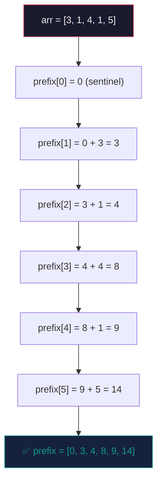
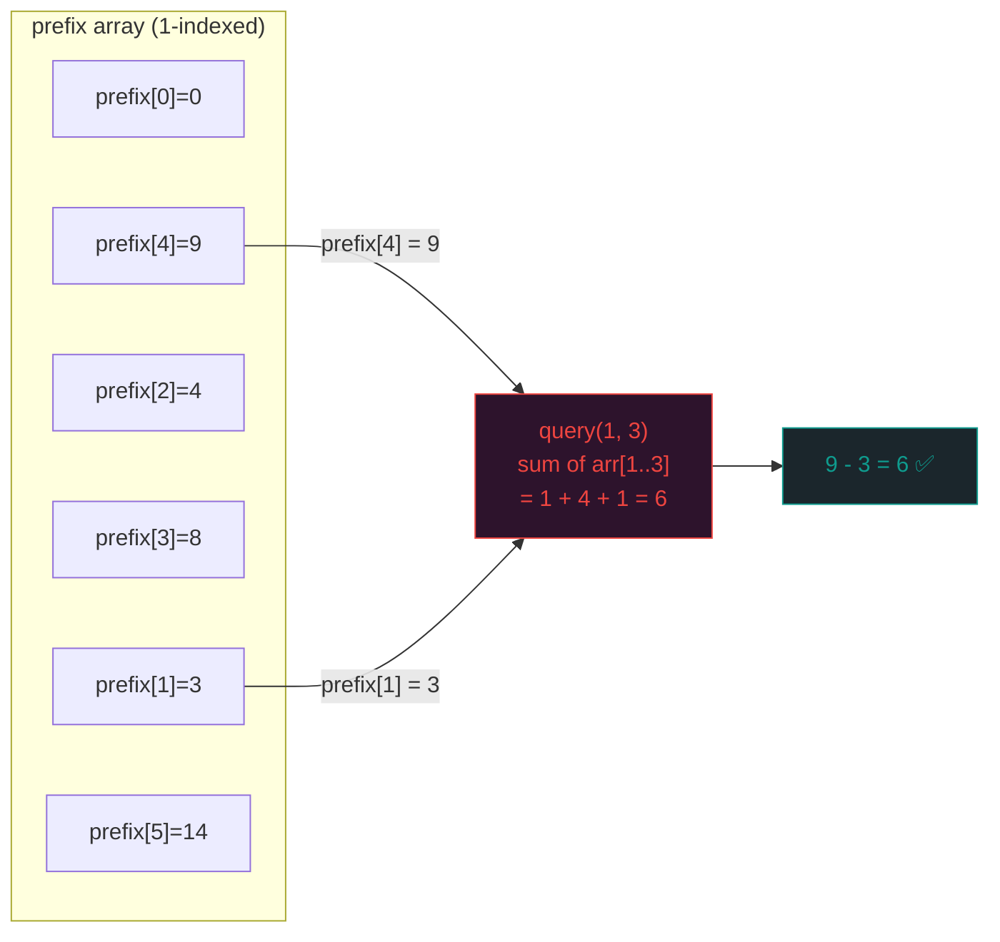
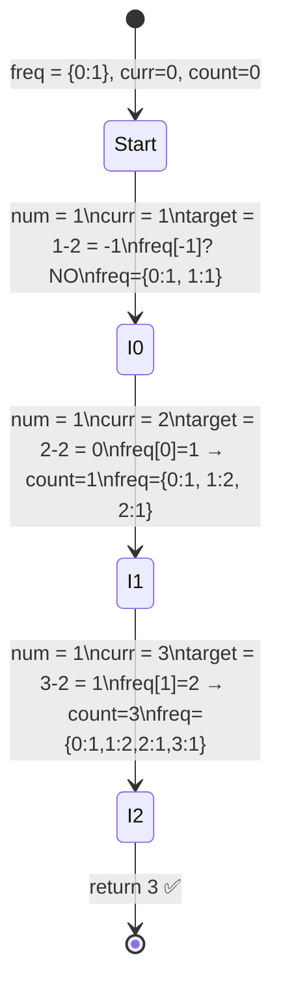

# 🧮 Prefix Sum — The Koshary Counter Trick

> **Author:** Senior Staff SWE @ FAANG | Cairo → San Francisco  
> **Target:** Khaled — Junior Engineer, promising kid  
> **Level:** Intermediate → Advanced  
> **Tags:** `#arrays` `#prefix-sum` `#range-queries` `#cpp` `#interview-prep`

---

## الفكرة الأساسية — What Is It?

يا Khaled، خليني أسألك سؤال بسيط.

أنت واقف في طابور في **كشري التحرير**. عندك قائمة بعدد الأطباق اللي اتباعت كل ساعة من الساعة 10 الصبح للساعة 10 بالليل. والمدير بيسألك بسرعة: "كام طبق اتباع من الساعة 2 للساعة 7؟"

لو فكرت ساذجاً، هتجمع كل ساعة من 2 لـ 7 في كل مرة المدير يسأل. ده بيبقى بطيء جداً لو بيسأل كتير.

**الـ Prefix Sum** هي إنك تعمل **طبق محسوب مسبقاً** — تجمع كل شيء من الأول مرة واحدة، وبعدين أي سؤال تجاوبه في $O(1)$ بالطرح البسيط.

### الفكرة بالكود المبدئي

بدل ما تجمع كل مرة:
```
أطباق من 2 لـ 7 = arr[2] + arr[3] + arr[4] + arr[5] + arr[6] + arr[7]
```

تعمل مرة واحدة:
```
prefix[i] = arr[0] + arr[1] + ... + arr[i]
```

وبعدين أي range query بتعملها في خطوة واحدة:
```
sum(L, R) = prefix[R] - prefix[L - 1]
```

**ده هو الـ trick كله.** Build once, query forever.

---

## التشخيص وإمتى نستخدمه — Pattern Recognition

### 🔑 الكلمات اللي تلوح في وشك وتقول "هات الـ Prefix Sum"

عندما تقرأ المسألة وتشوف:

- **"sum of subarray"** / "sum between indices L and R"
- **"range sum query"** / "queries on intervals"
- **"number of elements between i and j"**
- **"count of [condition] in a subarray"**
- **"running total"** / "cumulative"
- **"difference between two points in an array"**
- **"subarray sum equals K"**
- **"find if subarray with sum X exists"**
- **"2D grid sum"** / "matrix sum in rectangle"

### 🚩 Red Flags — إمتى الـ Prefix Sum مش هينفع

الـ technique دي بتفشل لو:

**1. الـ Array بيتعدّل (Mutable Array with Updates)**
لو في update queries جنب الـ range queries، الـ prefix sum بتبقى stale. في الحالة دي محتاج **Segment Tree** أو **Fenwick Tree (BIT)**.

**2. المشكلة مش عن Sum**
لو السؤال عن Maximum في range — الـ prefix sum مش هينفع. Prefix Max موجود بس نادراً مفيد. استخدم **Sparse Table** أو **Segment Tree**.

**3. Non-Additive Operations**
العمليات اللي مش بتنفع مع الطرح زي GCD أو XOR في بعض الحالات محتاجة معاملة خاصة.

**4. مفيش ترتيب (Unordered Data / Streaming)**
لو الداتا بتيجي streaming وعايز range queries، الـ prefix sum static مش كافي.

---

## العمق التقني — Under-the-Hood Math & Complexity

### Big O Analysis

بناء الـ prefix array:

$$T_{build}(N) = O(N)$$

كل query بعد كده:

$$T_{query}(L, R) = O(1)$$

لو عندك $Q$ queries على array بحجم $N$:

| Approach | Build | Per Query | Total |
|---|---|---|---|
| Brute Force | $O(1)$ | $O(N)$ | $O(N \cdot Q)$ |
| Prefix Sum | $O(N)$ | $O(1)$ | $O(N + Q)$ |

لما $Q$ يكبر (زي $10^5$ queries)، الفرق هيبقى **catastrophic** للـ brute force.

---

### 🧠 C++ System-Level Deep Dive

يا Khaled، هنا بتيجي الـ سحر الحقيقي. مش بس الـ algorithm، لكن إيه اللي بيحصل جوه الـ CPU.

#### Memory Layout & Cache Locality

الـ `std::vector<int>` بيحجز memory على الـ **Heap** في block واحد متتالي (contiguous). ده معناه:

```
prefix[0], prefix[1], prefix[2], ..., prefix[N-1]
[  4 bytes  ][  4 bytes  ][  4 bytes  ] ... all contiguous in RAM
```

لما الـ CPU يقرأ `prefix[i]`، الـ **L1 Cache Line** (عادةً 64 bytes = 16 integers) بيتحمّل معاه تلقائياً. يعني الـ loop بتاعت البناء:

```cpp
for (int i = 1; i <= n; i++)
    prefix[i] = prefix[i-1] + arr[i-1];
```

ده **sequential access pattern** — أعلى حاجة ممكنة من الـ cache efficiency. الـ CPU prefetcher بيتوقع الـ access القادم ويجيبه قبل ما محتاجه. نسميها **spatial locality** ودي من أسباب ما الـ prefix sum في الواقع يكون أسرع من الـ theoretical analysis.

#### Stack vs. Heap

لو الـ array صغيرة ومعروفة compile-time:
```cpp
// Stack allocated — blazing fast, no heap fragmentation
int prefix[1001] = {};
```

لو الـ size dynamic:
```cpp
// Heap allocated — flexible, but one malloc() call
std::vector<int> prefix(n + 1, 0);
```

في الـ interviews، `std::vector` هو الـ default. لكن في الـ competitive programming أو الـ embedded contexts، الـ stack array أسرع بسبب zero heap allocation overhead.

#### Integer Overflow — الـ Trap الشهير

لو الـ values كبيرة، الـ cumulative sum بيتعدى $2^{31} - 1$:

$$\text{Max Sum} = N \times \text{Max\_Val} = 10^5 \times 10^4 = 10^9 \leq 2^{31}$$

بس لو $N = 10^5$ و $\text{Max\_Val} = 10^9$:

$$\text{Max Sum} = 10^{14} > 2^{31}$$

**الحل الإلزامي:**
```cpp
std::vector<long long> prefix(n + 1, 0LL);  // 64-bit — always safe
```

عادةً في الـ interviews استخدم `long long` من الأول وريّح دماغك.

---

## القالب السحري — The Magic Template

```cpp
// ============================================================
// PREFIX SUM — Generic Template (Modern C++17)
// Author: Staff SWE @ FAANG
// ============================================================

#include <vector>
#include <numeric>  // std::partial_sum — C++ stdlib جاهزة
using namespace std;

class PrefixSum {
private:
    vector<long long> prefix;
    int n;

public:
    // Constructor — builds the prefix array in O(N)
    // The prefix array is 1-indexed for cleaner range queries
    explicit PrefixSum(const vector<int>& arr) {
        n = arr.size();
        prefix.assign(n + 1, 0LL);  // prefix[0] = 0 (sentinel)

        for (int i = 1; i <= n; i++) {
            prefix[i] = prefix[i - 1] + arr[i - 1];
        }
    }

    // Query sum of arr[L..R] — both L and R are 0-indexed
    // Returns sum in O(1)
    long long query(int L, int R) const {
        // Translate to 1-indexed prefix array
        return prefix[R + 1] - prefix[L];
    }

    // Optional: check if total sum of range equals target
    bool rangeEqualsTarget(int L, int R, long long target) const {
        return query(L, R) == target;
    }
};

// ============================================================
// USAGE EXAMPLE
// ============================================================
// vector<int> arr = {3, 1, 4, 1, 5, 9, 2, 6};
// PrefixSum ps(arr);
// ps.query(1, 4)  => 1 + 4 + 1 + 5 = 11
// ps.query(0, 7)  => full array sum
// ============================================================
```

### الـ 1-Indexed Trick — ليه بنعمله؟

```
arr (0-indexed):  [ 3,  1,  4,  1,  5 ]
                    0   1   2   3   4

prefix (1-indexed): [ 0,  3,  4,  8,  9, 14 ]
                      0   1   2   3   4   5
                      ↑
                  sentinel — بيخلي الـ query(0, R) تشتغل بدون edge case
```

لو بنيت 0-indexed prefix، الـ query(0, R) محتاجة `if (L == 0) return prefix[R]` — ugly. الـ sentinel بيلغي الـ edge case ده تماماً.

---

## أمثلة عملية متدرجة — Step-by-Step Walkthroughs

---

### 🔵 المثال الأول: Range Sum Query (Standard)
**[LeetCode 303 - Range Sum Query - Immutable](https://leetcode.com/problems/range-sum-query-immutable/)**

**المشكلة:** عندك array ثابتة، وعندك $Q$ queries كل واحدة بتسأل عن sum من `L` لـ `R`.

---

**Thought Process — فكر معايا خطوة خطوة:**

لنفرض:
```
arr = [-2, 0, 3, -5, 2, -1]
       [0] [1][2]  [3][4] [5]
```

**خطوة 1:** ابني الـ prefix array.

```
prefix[0] = 0                         (sentinel)
prefix[1] = 0 + (-2) = -2
prefix[2] = -2 + 0   = -2
prefix[3] = -2 + 3   = 1
prefix[4] = 1 + (-5) = -4
prefix[5] = -4 + 2   = -2
prefix[6] = -2 + (-1)= -3
```

```
prefix = [ 0, -2, -2, 1, -4, -2, -3 ]
```

**خطوة 2:** Query (0, 2) = sum of arr[0..2] = -2 + 0 + 3 = 1

```
query(0, 2) = prefix[3] - prefix[0] = 1 - 0 = 1 ✅
```

**خطوة 3:** Query (2, 5) = sum of arr[2..5] = 3 + (-5) + 2 + (-1) = -1

```
query(2, 5) = prefix[6] - prefix[2] = -3 - (-2) = -1 ✅
```

الـ insight هو إن `prefix[R+1]` بتحتوي على مجموع كل حاجة من الأول لـ R، و `prefix[L]` بتحتوي على مجموع كل حاجة قبل L. الطرح بيديك بالظبط ما بين L و R.

---

**C++ Solution:**

```cpp
class NumArray {
private:
    vector<long long> prefix;

public:
    NumArray(vector<int>& nums) {
        int n = nums.size();
        prefix.assign(n + 1, 0LL);
        for (int i = 1; i <= n; i++) {
            prefix[i] = prefix[i - 1] + nums[i - 1];
        }
    }

    int sumRange(int left, int right) {
        return static_cast<int>(prefix[right + 1] - prefix[left]);
    }
};
```

**Complexity:**

| Phase | Time | Space |
|---|---|---|
| Constructor | $O(N)$ | $O(N)$ |
| `sumRange()` | $O(1)$ | $O(1)$ |
| $Q$ queries total | $O(N + Q)$ | $O(N)$ |

---

### 🔴 المثال الثاني: Subarray Sum Equals K (Variant — الأصعب)
**[LeetCode 560 - Subarray Sum Equals K](https://leetcode.com/problems/subarray-sum-equals-k/)**

**المشكلة:** Find the total number of subarrays whose sum equals $k$.

---

**Thought Process — هنا الـ trick أعمق:**

الفكرة المبدئية هي: لو عندنا prefix sum عند index $j$ هو $P[j]$، واحنا عايزين نلاقي subarray ينتهي عند $j$ وعنده مجموع $k$، إيه اللي محتاج يكون prefix sum عند بداية الـ subarray ده؟

$$P[j] - P[i-1] = k \implies P[i-1] = P[j] - k$$

يعني إحنا محتاجين نعرف: **كام مرة قبل كده شفنا prefix sum قيمتها `P[j] - k`؟**

ده بيتحل بـ **HashMap** (اتعلم تحب الـ HashMap يا Khaled).

```
arr = [1, 1, 1], k = 2

نبني الـ prefix sum وهو بيمشي:
```

**خطوة 1:** ابدأ بـ `freq = {0: 1}` — يعني "الـ prefix sum الصفري شفناه مرة واحدة" (sentinel في الـ hashmap).

**خطوة 2:** امشي على الـ array:

```
i=0: curr_sum = 1, target = 1 - 2 = -1, freq[-1] = 0, count = 0
     freq = {0:1, 1:1}

i=1: curr_sum = 2, target = 2 - 2 = 0,  freq[0]  = 1, count = 1
     freq = {0:1, 1:2, 2:1}

i=2: curr_sum = 3, target = 3 - 2 = 1,  freq[1]  = 2, count = 3 (!)
     freq = {0:1, 1:2, 2:1, 3:1}
```

الـ answer = 3 ✅ (subarrays: [1,1] من 0-1، [1,1] من 1-2، و [1,1,1]? لا — تحقق: [1,1]=2 ✅, [1,1]=2 ✅, مفيش [1,1,1]=3 ≠ 2. الـ 3 subarray هي index 0-1, 1-2, وانتبه `freq[1]=2` يعني في مرتين شفنا prefix=1 يعني في subarrays بتبدأ من بعدهم.)

---

**C++ Solution:**

```cpp
class Solution {
public:
    int subarraySum(vector<int>& nums, int k) {
        // freq[s] = how many times we've seen prefix sum = s
        unordered_map<long long, int> freq;
        freq[0] = 1;  // sentinel — empty prefix

        long long curr_sum = 0;
        int count = 0;

        for (int num : nums) {
            curr_sum += num;

            long long target = curr_sum - k;

            // لو الـ target ده شفناه قبل كده، كل مرة دي subarray صح
            if (freq.count(target)) {
                count += freq[target];
            }

            freq[curr_sum]++;
        }

        return count;
    }
};
```

**Complexity:**

| | Time | Space |
|---|---|---|
| Solution | $O(N)$ | $O(N)$ |

الـ `unordered_map` بتعمل insert وlookup بـ $O(1)$ amortized. في worst case (كتير collisions) ممكن تبقى $O(N)$ per operation، لكن في الغالب $O(1)$.

> 💡 **Pro tip من الـ FAANG interviews:** لو المدير جالك وقاله "اعمل الحل ده thread-safe"، هتحتاج تبدل `unordered_map` بـ `std::mutex` أو تستخدم atomic prefix approach. ده سؤال follow-up شائع.

---

## مخططات الذاكرة — Mermaid Diagrams

### Diagram 1: بناء الـ Prefix Array



---

### Diagram 2: Range Query Visualization



---

### Diagram 3: Subarray Sum = K — HashMap State Machine



---

## تطبيقات عملية — Obsidian Practice Checklist

يا Khaled، دي الـ roadmap بتاعتك. حلّها بالترتيب ده — متعديش مسألة من غير ما تفهم الـ pattern.

- [ ] **[LeetCode 303 — Range Sum Query - Immutable](https://leetcode.com/problems/range-sum-query-immutable/)** `Easy`
  - 🟢 **Hint:** الـ warm-up المثالي. ابني prefix 1-indexed وجاوب كل query بطرحة بسيطة.

- [ ] **[LeetCode 525 — Contiguous Array](https://leetcode.com/problems/contiguous-array/)** `Medium`
  - 🟡 **Hint:** حوّل الـ 0s لـ -1s وبعدين شوف `prefix[i] == prefix[j]` ده subarray متوازن. استخدم HashMap.

- [ ] **[LeetCode 560 — Subarray Sum Equals K](https://leetcode.com/problems/subarray-sum-equals-k/)** `Medium`
  - 🟡 **Hint:** الـ technique اللي اتشرحت فوق. المفتاح هو `curr_sum - k` في الـ HashMap.

- [ ] **[LeetCode 724 — Find Pivot Index](https://leetcode.com/problems/find-pivot-index/)** `Easy`
  - 🟢 **Hint:** `left_sum == total_sum - left_sum - arr[i]` — بلاش تبني prefix array كاملة، امشي بـ running sum.

- [ ] **[LeetCode 304 — Range Sum Query 2D - Immutable](https://leetcode.com/problems/range-sum-query-2d-immutable/)** `Medium`
  - 🟡 **Hint:** الـ 2D prefix. المعادلة هي `P[r2][c2] - P[r1-1][c2] - P[r2][c1-1] + P[r1-1][c1-1]` — Inclusion-Exclusion.

- [ ] **[LeetCode 1480 — Running Sum of 1D Array](https://leetcode.com/problems/running-sum-of-1d-array/)** `Easy`
  - 🟢 **Hint:** أسهل مسألة في الموضوع ده. ادرسها كـ baseline وافهم الـ in-place prefix.

- [ ] **[LeetCode 974 — Subarray Sums Divisible by K](https://leetcode.com/problems/subarray-sums-divisible-by-k/)** `Medium`
  - 🔴 **Hint:** بدل ما تدور على `curr - k`، دوّر على `(curr % k + k) % k` في الـ freq map. Modular arithmetic + prefix sum.

---

## 🏁 الخلاصة — الـ Mental Model

يا Khaled، لما تشوف مسألة array وفي range queries:

```
هل الـ array ثابتة؟
    ↓ YES
هل الـ operation هي SUM؟
    ↓ YES
→ PREFIX SUM — ابنيه مرة وجاوب في O(1)

هل بتدور على عدد subarrays؟
    ↓ YES
→ PREFIX SUM + HASHMAP — الـ pattern بتاع 560 و 974

هل الـ array بتتعدّل (updates)?
    ↓ YES
→ Fenwick Tree / Segment Tree (الموضوع الجاي)
```

**الـ Prefix Sum مش مجرد technique — ده تفكير.** فكر دايماً: "إيه اللي أقدر أحسبه مرة واحدة وأعيد استخدامه؟" ده الـ mindset بتاع الـ Staff Engineer.

---

*"الـ optimization الحقيقي مش في الـ code — في إنك تفكر قبل ما تكتب."*
*— Cairo → FAANG, 2024*
