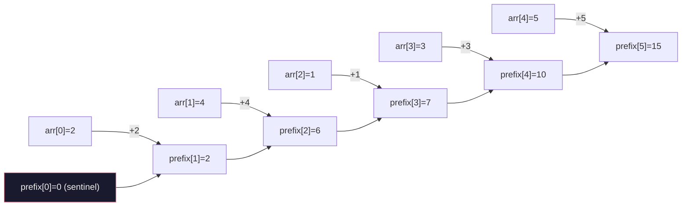
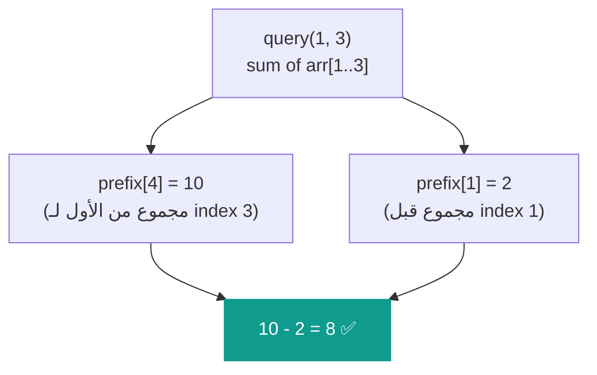
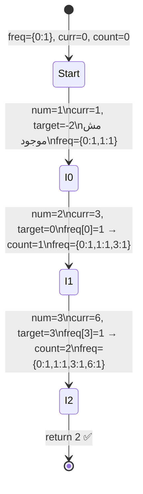

# 🧮 Prefix Sum — فهرس كشري التحرير

> **Author:** Senior Staff SWE @ FAANG | Cairo → San Francisco
> **Target:** Khaled — Junior Engineer
> **Level:** Beginner → Intermediate
> **Tags:** `#prefix-sum` `#arrays` `#range-queries` `#cpp` `#interview-prep`

---

## الفكرة الأساسية — What Is It?

يا Khaled، إنت شغال كاشير في كشري التحرير. عندك قائمة بعدد الأطباق اللي اتباعت كل ساعة:

```
الساعة:   1   2   3   4   5
الأطباق:  3   1   4   1   5
```

المدير بيسألك كل شوية: "كام طبق اتباع من الساعة 2 للساعة 4؟"

**الطريقة البدائية:** تجمع كل مرة من الأول:
```
1 + 4 + 1 = 6
```

لو المدير سأل 1000 مرة؟ هتجمع 1000 مرة. ده بطيء.

---

**الفكرة الذكية:** قبل ما المدير يسأل، اعمل جدول فيه **المجموع التراكمي**:

```
الساعة:    1   2   3   4   5
الأطباق:   3   1   4   1   5
prefix:    3   4   8   9  14
```

يعني:
```
prefix[1] = 3
prefix[2] = 3 + 1 = 4
prefix[3] = 3 + 1 + 4 = 8
prefix[4] = 3 + 1 + 4 + 1 = 9
prefix[5] = 3 + 1 + 4 + 1 + 5 = 14
```

دلوقتي أي سؤال بتجاوبه بطرحة واحدة:

```
من الساعة 2 للساعة 4 = prefix[4] - prefix[1] = 9 - 3 = 6 ✅
```

**ابني مرة واحدة، جاوب بسرعة للأبد. ده هو الـ Prefix Sum.**

---

## التشخيص — Pattern Recognition

### 🔑 الكلمات اللي بتقول "هات الـ Prefix Sum"

- **"sum of subarray"** / "sum between index L and R"
- **"range sum query"**
- **"running total"** / "cumulative sum"
- **"subarray sum equals K"**
- **"number of subarrays with sum..."**

### 🚩 إمتى مش هينفع

- لو الـ array بتتغير (فيه updates) — محتاج Segment Tree
- لو المطلوب maximum أو minimum مش sum — مش الأداة دي
- لو العملية مش بتنفع مع الطرح — زي الضرب

---

## الـ Complexity

$$\text{بناء الـ prefix array} = O(N)$$
$$\text{كل query بعد كده} = O(1)$$

بدل ما كل query تاخد $O(N)$، بتبنيه مرة وكل سؤال بياخد ثانية.

---

## القالب السحري

```cpp
// بناء الـ prefix array
vector<int> prefix(n + 1, 0);  // فاضي بالصفر، حجمه n+1
for (int i = 1; i <= n; i++) {
    prefix[i] = prefix[i - 1] + arr[i - 1];
}

// Query: مجموع من index L لـ R (0-indexed)
int sum = prefix[R + 1] - prefix[L];
```

---

## أمثلة عملية متدرجة

---

### 🟢 المثال الأول — ابني الـ Prefix Array

**المطلوب:** عندك الـ array دي، ابني الـ prefix array.

```
arr = [2, 4, 1, 3, 5]
```

**خطوة بخطوة:**

نبدأ بـ `prefix[0] = 0` دايماً (الـ sentinel — هنشرح ليه بعدين):

```
prefix[0] = 0
prefix[1] = prefix[0] + arr[0] = 0 + 2 = 2
prefix[2] = prefix[1] + arr[1] = 2 + 4 = 6
prefix[3] = prefix[2] + arr[2] = 6 + 1 = 7
prefix[4] = prefix[3] + arr[3] = 7 + 3 = 10
prefix[5] = prefix[4] + arr[4] = 10 + 5 = 15
```

```
arr    = [ 2,  4,  1,  3,  5]
prefix = [ 0,  2,  6,  7, 10, 15]
          ↑
        sentinel
```

**الكود:**

```cpp
#include <iostream>
#include <vector>
using namespace std;

int main() {
    vector<int> arr = {2, 4, 1, 3, 5};
    int n = arr.size();

    vector<int> prefix(n + 1, 0);
    for (int i = 1; i <= n; i++) {
        prefix[i] = prefix[i - 1] + arr[i - 1];
    }

    // اطبع الـ prefix array
    for (int x : prefix) cout << x << " ";
    // Output: 0 2 6 7 10 15
}
```

---

### 🟢 المثال الثاني — استخدم الـ Prefix للـ Query

**المطلوب:** من نفس الـ array، احسب مجموع من index 1 لـ 3.

```
arr    = [ 2,  4,  1,  3,  5]
index:     0   1   2   3   4

prefix = [ 0,  2,  6,  7, 10, 15]
```

**المعادلة:**
```
sum(L, R) = prefix[R + 1] - prefix[L]
sum(1, 3) = prefix[4]     - prefix[1]
          = 10             - 2
          = 8
```

**تحقق يدوي:** arr[1] + arr[2] + arr[3] = 4 + 1 + 3 = 8 ✅

**الكود:**

```cpp
#include <iostream>
#include <vector>
using namespace std;

int main() {
    vector<int> arr = {2, 4, 1, 3, 5};
    int n = arr.size();

    vector<int> prefix(n + 1, 0);
    for (int i = 1; i <= n; i++) {
        prefix[i] = prefix[i - 1] + arr[i - 1];
    }


    int L = 1, R = 3;
    int sum = prefix[R + 1] - prefix[L];
    cout << sum << "\n";  // 8
}
```

---

### ليه الـ Sentinel (الصفر في الأول)؟

ده سؤال مهم. لو عملنا prefix بدون sentinel:

```
prefix = [2, 6, 7, 10, 15]  ← بدون الصفر في الأول
```

ولو حد سأل `sum(0, 2)`:
```
محتاج prefix[2] - prefix[-1]   ← ❌ index سالب!
```

بوجود الـ sentinel:
```
prefix = [0, 2, 6, 7, 10, 15]
sum(0, 2) = prefix[3] - prefix[0] = 7 - 0 = 7 ✅
```

**الصفر في الأول بيلغي الـ edge case تماماً.**

---

### 🟡 المثال التالت — LeetCode 303: Range Sum Query

**[LeetCode 303 — Range Sum Query - Immutable](https://leetcode.com/problems/range-sum-query-immutable/)**

**المشكلة:** اعمل class بتاخد array، وبعدين تجاوب على queries بسرعة.

```
NumArray obj({-2, 0, 3, -5, 2, -1});
obj.sumRange(0, 2);  // → 1
obj.sumRange(2, 5);  // → -1
obj.sumRange(0, 5);  // → -3
```

**Thought Process:**

الـ array مش هتتغير. عندنا queries كتير. ده بالظبط اللي الـ prefix sum اتعمل عشانه.

**خطوة 1:** ابني الـ prefix في الـ constructor مرة واحدة.

**خطوة 2:** كل `sumRange` بتجاوب بطرحة واحدة.

```
arr    = [-2,  0,  3, -5,  2, -1]
prefix = [ 0, -2, -2,  1, -4, -2, -3]

sumRange(0, 2) = prefix[3] - prefix[0] = 1  - 0  =  1 ✅
sumRange(2, 5) = prefix[6] - prefix[2] = -3 - (-2) = -1 ✅
sumRange(0, 5) = prefix[6] - prefix[0] = -3 - 0  = -3 ✅
```

**الكود:**

```cpp
class NumArray {
    vector<int> prefix;

public:
    NumArray(vector<int>& nums) {
        int n = nums.size();
        prefix.resize(n + 1, 0);

        for (int i = 1; i <= n; i++) {
            prefix[i] = prefix[i - 1] + nums[i - 1];
        }
    }

    int sumRange(int left, int right) {
        return prefix[right + 1] - prefix[left];
    }
};
```

**Complexity:**

| | Time | Space |
|---|---|---|
| Constructor | $O(N)$ | $O(N)$ |
| `sumRange` | $O(1)$ | — |

---

### 🔴 المثال الرابع — Subarray Sum Equals K

**[LeetCode 560 — Subarray Sum Equals K](https://leetcode.com/problems/subarray-sum-equals-k/)**

---

## الفكرة الأساسية الأول

عندنا:

```
arr = [1, 2, 3],  k = 3
```

المطلوب: **كام subarray مجموعه = 3؟**

الإجابة = 2 ← اللي هما `[1,2]` و `[3]`

---

## طريقة Brute Force الأول — عشان نفهم

```cpp
int count = 0;
for (int i = 0; i < n; i++) {
    int sum = 0;
    for (int j = i; j < n; j++) {
        sum += arr[j];
        if (sum == k) count++;
    }
}
```

دي شغالة بس بطيئة — $O(N^2)$.

---

## نفهم الـ Prefix Sum الأول

```
arr    = [1, 2, 3]
prefix = [0, 1, 3, 6]
```

**الملاحظة المهمة:**

مجموع الـ subarray من index `i` لـ `j` = `prefix[j+1] - prefix[i]`

مثلاً: مجموع `[1, 2]` = `prefix[2] - prefix[0]` = 3 - 0 = 3 ✅

---

## السؤال اللي هيغير كل حاجة

بدل ما أجمع من `i` لـ `j` وأشوف هل = k...

**أقول:** أنا واقف عند `j` وعارف إن `prefix[j]` = قيمة معينة.

عايز ألاقي `i` قبلي عشان:

```
prefix[j] - prefix[i] = k
```

يعني:

```
prefix[i] = prefix[j] - k
```

**بمعنى أبسط:** أنا مش بدور على subarray — أنا بسأل سؤال واحد بس:

> **"هل فيه prefix sum رأيته قبل كده قيمته = `prefix[j] - k`؟"**

لو آه → في subarray صح ينتهي عندي.

---

## التتبع بالتفصيل

```
arr = [1, 2, 3],  k = 3
```

بنمشي على الـ array ونحسب الـ prefix وهو بيمشي.

بنحتاج **HashMap** نحط فيه كل prefix شفناه وكام مرة.

نبدأ بـ `{0: 1}` ← الصفر موجود مرة قبل ما نبدأ.

---

**الخطوة الأولى — عند index 0، القيمة = 1:**

```
curr = 0 + 1 = 1
```

بسأل: هل `curr - k` = `1 - 3` = **-2** موجود في الـ map؟ الـ map = `{0:1}` ← **لأ**

بضيف الـ curr للـ map:

```
map = {0:1, 1:1}
count = 0
```

---

**الخطوة التانية — عند index 1، القيمة = 2:**

```
curr = 1 + 2 = 3
```

بسأل: هل `curr - k` = `3 - 3` = **0** موجود في الـ map؟ الـ map = `{0:1, 1:1}` ← **آه! موجود مرة واحدة**

```
count = 0 + 1 = 1
```

بضيف الـ curr للـ map:

```
map = {0:1, 1:1, 3:1}
```

---

**الخطوة التالتة — عند index 2، القيمة = 3:**

```
curr = 3 + 3 = 6
```

بسأل: هل `curr - k` = `6 - 3` = **3** موجود في الـ map؟ الـ map = `{0:1, 1:1, 3:1}` ← **آه! موجود مرة واحدة**

```
count = 1 + 1 = 2
```

بضيف الـ curr للـ map:

```
map = {0:1, 1:1, 3:1, 6:1}
```

---

**النتيجة = 2 ✅**

---

## الكود

```cpp
int subarraySum(vector<int>& nums, int k) {
    unordered_map<int, int> freq;
    freq[0] = 1;

    int curr  = 0;
    int count = 0;

    for (int i = 0; i < nums.size(); i++) {
        curr = curr + nums[i];

        int target = curr - k;

        if (freq.count(target) > 0) {
            count = count + freq[target];
        }

        freq[curr] = freq[curr] + 1;
    }

    return count;
}
```

---

دلوقتي واضح ولا في حاجة لسه مش واضحة؟ 🙂
---

## مخططات الذاكرة — Mermaid Diagrams

### Diagram 1: بناء الـ Prefix Array



---

### Diagram 2: الـ Query بالطرح



---

### Diagram 3: Subarray Sum = K — الـ HashMap State



---

## تطبيقات عملية — Obsidian Practice Checklist

- [ ] **[LeetCode 1480 — Running Sum of 1D Array](https://leetcode.com/problems/running-sum-of-1d-array/)** `Easy`
  — 🟢 **Hint:** أسهل مسألة في الموضوع. الـ output هو الـ prefix array نفسه.

- [ ] **[LeetCode 724 — Find Pivot Index](https://leetcode.com/problems/find-pivot-index/)** `Easy`
  — 🟢 **Hint:** الـ pivot هو الـ index اللي `left_sum == right_sum`. `right_sum = total - left_sum - arr[i]`.

- [ ] **[LeetCode 303 — Range Sum Query - Immutable](https://leetcode.com/problems/range-sum-query-immutable/)** `Easy`
  — 🟢 **Hint:** نفس المثال اللي اتشرح. ابني في الـ constructor، جاوب في $O(1)$.

- [ ] **[LeetCode 560 — Subarray Sum Equals K](https://leetcode.com/problems/subarray-sum-equals-k/)** `Medium`
  — 🟡 **Hint:** `curr - k` في الـ HashMap. ابدأ بـ `freq[0] = 1` (الـ sentinel).

- [ ] **[LeetCode 525 — Contiguous Array](https://leetcode.com/problems/contiguous-array/)** `Medium`
  — 🟡 **Hint:** حوّل الـ 0s لـ -1s. لو `prefix[i] == prefix[j]` ده subarray متوازن بين `i` و `j`.

- [ ] **[LeetCode 974 — Subarray Sums Divisible by K](https://leetcode.com/problems/subarray-sums-divisible-by-k/)** `Medium`
  — 🔴 **Hint:** بدل ما تدور على `curr - k`، دور على `curr % k` في الـ HashMap. لو اتنين عندهم نفس الـ remainder، الـ subarray بينهم قسمته على k = صفر.

---

## 🏁 الخلاصة

```
الـ Prefix Sum = ابنيه مرة، استخدمه للأبد

ابني:
  prefix[0] = 0  ← sentinel دايماً
  prefix[i] = prefix[i-1] + arr[i-1]

Query:
  sum(L, R) = prefix[R+1] - prefix[L]

لو في HashMap جنبه:
  بتعرف تعدّ subarrays بشرط معين في O(N)
```

*"أي سؤال عن sum في array — أول حاجة تفكر فيها هي الـ prefix."*
*— Cairo → FAANG, 2024*
