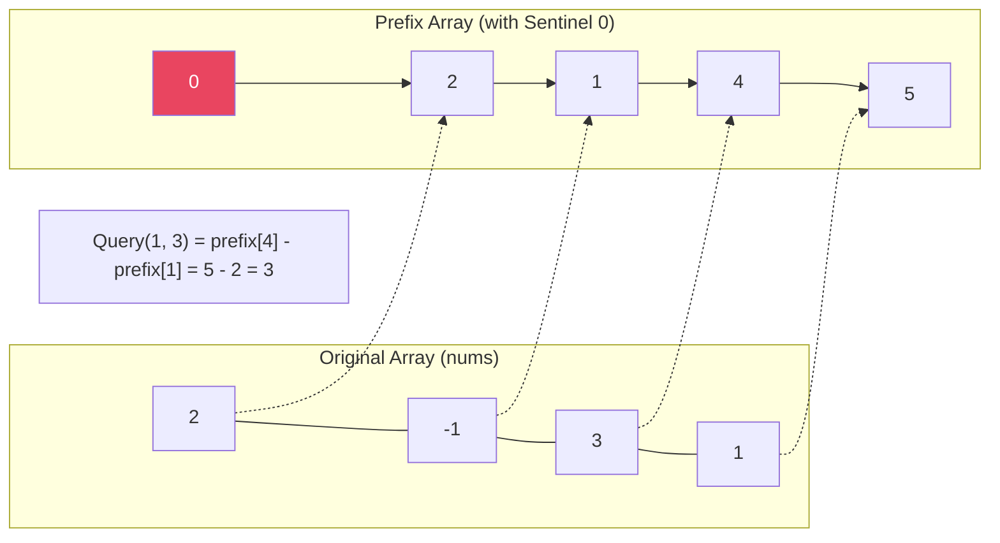
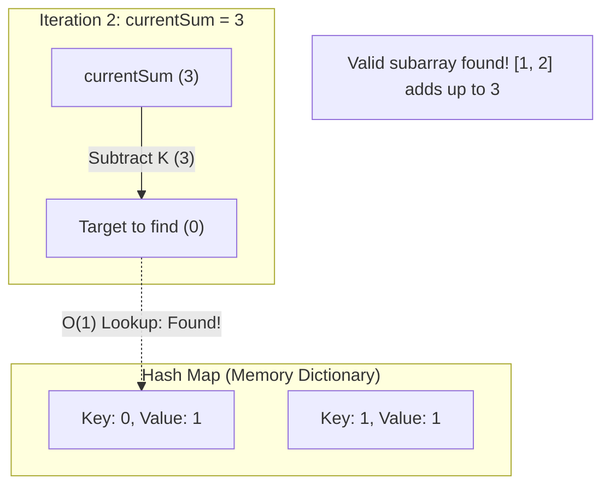

# 🧮 Prefix Sum — الذاكرة التراكمية (الجزء الأول)

## 1. الفكرة الأساسية (The Odometer Analogy)

سيبك من البرمجة ثانية واحدة. تخيل إنك مسافر بعربيتك من القاهرة لإسكندرية، وبعدين لمطروح.

في التابلوه قدامك "عداد المسافات" (Odometer) بيسجل إنت مشيت كام كيلو من ساعة ما طلعت من البيت.

لو إنت في مطروح (العداد قاري 500 كيلو)، وعايز تعرف المسافة بين إسكندرية ومطروح بس.. هل هتنزل تقيس الشارع؟

لأ طبعاً! هتبص في نوتة مذكراتك تشوف العداد كان قاري كام وإنت في إسكندرية (مثلاً 200 كيلو)، وتطرح:

`500 - 200 = 300 كيلو`.

**في عالم الـ Arrays:**

الـ Prefix Sum هو "عداد المسافات" بتاع المصفوفة. بدل ما تعمل `for` loop كل شوية عشان تجمع شريحة من الإندكس `L` للإندكس `R` (وده بياخد $\mathcal{O}(N)$ في كل سؤال)، إحنا بنمشي على المصفوفة مرة واحدة بس نجمع الأرقام تراكمياً في مصفوفة تانية اسمها `prefix`.

ولما حد يطلب مجموع أي شريحة في النص، بنرد عليه بطرح رقمين بس في خطوة واحدة $\mathcal{O}(1)$.

---

## 2. التشخيص (Pattern Recognition)

### 🔑 إمتى تستخدم الـ Prefix Sum؟

أول ما عينك تلمح السيناريوهات دي في المسألة:

- **"Range Sum Queries"**: المسألة بتطلب منك تجيب مجموع شريحة معينة كذا مرة.
    
- **"Subarray Sum Equals K"**: عايز يدور على شريحة مجموعها بيساوي رقم معين.
    
- **"Divisibility"**: مسائل القسمة، زي "مجموع الشريحة بيقبل القسمة على K".
    

### 🚩 إمتى التكنيك ده بيلبسنا في الحيط؟

لو المصفوفة **بتتحدث (Dynamic Updates)**. يعني لو المسألة قالتلك "غيرلي الرقم اللي في الإندكس 3، وبعدين هاتلي المجموع الجديد". الـ Prefix Sum هنا هيفشل لأنك هتضطر تعيد حساب المصفوفة التراكمية كلها في كل تعديل. (ساعتها بنروح لهيكل بيانات تاني اسمه Segment Tree).

---

## 3. العمق التقني وسر الـ (Sentinel Zero)

عشان نجيب مجموع من `L` لـ `R`، المعادلة الرياضية هي:

$Sum = Prefix[R] - Prefix[L-1]$

**المشكلة الهندسية:** لو الشريحة بتبدأ من أول المصفوفة خالص (يعني `L = 0`)، فتعويضة الـ $L-1$ هتبقى `-1`، وده هيضرب Memory Error لأن مفيش إندكس بالسالب!

المبرمج العادي هيحلها بـ `if condition` جوه اللوب: `if (L == 0) return Prefix[R]`.

بس في هندسة النظم، الـ `if` جوه اللوبس الكبيرة بتعمل حاجة اسمها **Branch Prediction Penalty** في الـ CPU، وبتبطأ الكود.

**الحل الهندسي (The Sentinel):** بنكبر مصفوفة الـ `Prefix` خطوة واحدة زيادة في الأول، ونحط في الإندكس `0` رقم (صفر) ملوش قيمة، ونشفت الـ Indices كلها خطوة لقدام. كده الـ $L-1$ عمرها ما هتبقى بالسالب، ومفيش `if conditions` خالص، والـ CPU يطير من غير فرملة!

---

## 4. القالب السحري (The Magic Template)

ده القالب الأساسي اللي بيبني الـ Prefix Array بخدعة الـ Sentinel Zero عشان تتجنب أي Errors.


```C++
class RangeQuery {
    vector<int> prefix;
public:
    RangeQuery(vector<int>& nums) {
        // Allocate space for nums.size() + 1, initialized with 0
        // prefix[0] is the sentinel zero
        prefix.assign(nums.size() + 1, 0); 
        
        // Build the prefix sum array
        for (int i = 0; i < nums.size(); i++) {
            prefix[i + 1] = prefix[i] + nums[i];
        }
    }
    
    int query(int left, int right) {
        // O(1) mathematical calculation without any if-conditions
        return prefix[right + 1] - prefix[left];
    }
};
```

---

## 5. مثال عملي متدرج (Walkthrough)

**[LeetCode 303 — Range Sum Query - Immutable](https://leetcode.com/problems/range-sum-query-immutable/)**

**المشكلة:** معاك مصفوفة، وهتتطرح عليك أسئلة كتير جداً من نوع "إيه مجموع الأرقام من الإندكس `left` للاندكس `right`؟".


```Plaintext
nums = [2, -1, 3, 1]
Query: left = 1, right = 3
```

**التتبع (Dry Run):**

1. **بناء الكشكول (Prefix Array):**
    
    - حط الصفر الوهمي الأول: `prefix = [0]`
        
    - ضيف 2: `prefix = [0, 2]`
        
    - ضيف -1: `prefix = [0, 2, 1]`
        
    - ضيف 3: `prefix = [0, 2, 1, 4]`
        
    - ضيف 1: `prefix = [0, 2, 1, 4, 5]`
        
2. **الاستعلام (Query):** - المطلوب من الإندكس 1 للإندكس 3. (يعني الأرقام `-1, 3, 1`).
    
    - هنعوض في المعادلة السحرية: `prefix[right + 1] - prefix[left]`
        
    - يعني `prefix[4] - prefix[1]`
        
    - يعني `5 - 2 = 3`. (وفعلاً مجموعهم 3).
        

**الكود (C++):**


```C++
class NumArray {
private:
    vector<int> prefix;
public:
    NumArray(vector<int>& nums) {
        prefix.resize(nums.size() + 1, 0);
        for (int i = 0; i < nums.size(); i++) {
            prefix[i + 1] = prefix[i] + nums[i];
        }
    }
    
    int sumRange(int left, int right) {
        // Retrieve the sum in O(1) time
        return prefix[right + 1] - prefix[left];
    }
};
```

---

## 6. مخطط الذاكرة (Mermaid Diagram)




---

زي ما تحب يا خالد، وده تفكير سليم جداً 100%. مستحيل تفهم الجزء التاني من الـ Prefix Sum وتقتنع بيه من غير ما تكون هاضم الـ **Hash Map** كـ Data Structure بتشتغل إزاي تحت الغطاء (Under the hood) وليه هي سريعة للدرجة دي.

جهز الـ Obsidian بتاعك، الجزء ده متقسم لـ "تمهيد الهاش ماب" وبعده على طول "الجزء التاني من الـ Prefix Sum". انسخ يا بطل:

---

# 🗄️ تمهيد هندسي: إيه هو الـ Hash Map؟ (The Memory Dictionary)

## 1. الفكرة الأساسية (The National ID Analogy)

تخيل إنك موظف في السجل المدني، وعندك ملايين الملفات للمواطنين. لو دخل عليك مواطن وادالك رقم بطاقته وعايز ملفه، هل هتمشي على الرفوف ملف ملف تدور على رقمه؟ ده هياخد وقت $\mathcal{O}(N)$ والراجل هيعجز وهو واقف.

في هندسة النظم، إحنا بنعمل حاجة أذكى: بنجيب "دالة رياضية" (Hash Function). الموظف بيدخل رقم البطاقة (Key) في الدالة دي، تقوم الدالة مطلعاله **رقم الدرج بالظبط** اللي فيه الملف (Value). الموظف بيروح يفتح الدرج ده فوراً في خطوة واحدة $\mathcal{O}(1)$ ويجيب الملف.

**الهاش ماب (Hash Map) في البرمجة:**

هو Data Structure بيسمحلك تخزن بيانات على شكل "مفتاح وقيمة" `(Key, Value)`. الميزة الجبارة بتاعته إنك تقدر تسأله: "هل المفتاح ده موجود؟" أو "إيه القيمة بتاعة المفتاح ده؟" ويرد عليك في $\mathcal{O}(1)$ مهما كان حجم البيانات ضخم.

## 2. العمق التقني في C++ (`map` vs `unordered_map`)

في لغة C++، عندنا نوعين من الكشكول ده، وكل واحد مبني بـ Architecture مختلف تماماً:

1. **`std::map`**: مبني من جوه على حاجة اسمها Red-Black Tree. بيخزن المفاتيح "مترتبة"، بس عملية البحث جواه بتاخد $\mathcal{O}(\log N)$.
    
2. **`std::unordered_map`**: ده الـ Hash Map الحقيقي! مبني على Hash Table. مش بيرتب المفاتيح، بس البحث والإضافة جواه بياخدوا $\mathcal{O}(1)$ (Average Case). وده اللي الشركات بتدور عليه في الانترفيوهات عشان الـ Performance.
    


```C++
unordered_map<int, int> myMap;
myMap[5] = 1; // "يا كشكول، المفتاح رقم 5 اتكرر مرة واحدة" -> O(1)
int count = myMap[5]; // "يا كشكول، المفتاح 5 اتكرر كام مرة؟" هيرد: 1 -> O(1)
```

---

# 🧮 Prefix Sum — الذاكرة التراكمية (الجزء الثاني: ليفل الوحش)

## 1. المشكلة اللي الهاش ماب بيحلها

في الجزء الأول، كنا بنجيب مجموع شريحة إحنا عارفين بدايتها ونهايتها.

لكن في انترفيوهات جوجل وفيسبوك، المسألة بتيجي معكوسة: **"إيه هي الشريحة اللي مجموعها بيساوي $K$؟"** (زي مسألة LeetCode 560 الشهيرة).

إحنا عارفين إن معادلة الـ Prefix Sum هي:

$Prefix[R] - Prefix[L-1] = K$

بما إننا ماشيين في المصفوفة وعارفين الـ $Prefix[R]$ (المجموع التراكمي لحد اللحظة دي)، والـ $K$ كده كده رقم ثابت في المسألة.. إذن إحنا بندور على:

$Prefix[L-1] = Prefix[R] - K$

## 2. دمج الـ Prefix Sum مع الـ Hash Map

بدل ما نعمل `for` loop تانية تدور على $Prefix[L-1]$، إحنا هنخلي الـ **Hash Map** هو "كشكول الذكريات" بتاعنا.

وإحنا ماشيين بنجمع الأرقام، هنسأل الهاش ماب سؤال واحد سريع بـ $\mathcal{O}(1)$:

_"يا كشكول، هل المجموع ($Prefix[R] - K$) متسجل عندك في الماضي؟"_

- لو **آه**: معناه إن في شريحة ورايا اتقطعت مجموعها بيساوي $K$ بالظبط! (نزود عداد النتيجة).
    
- وفي كل خطوة: بنسجل المجموع التراكمي الحالي في الكشكول عشان الأرقام الجاية تدور عليه.
    

## 3. القالب السحري (Prefix Sum + Hash Map)

ده القالب اللي بيحل أعقد مسائل الـ Subarrays في $\mathcal{O}(N)$ من غير Nested Loops.


```C++
int subarraySum(vector<int>& nums, int k) {
    // Hash map to store the frequencies of prefix sums seen so far
    unordered_map<int, int> prefixFreq;
    
    // The Sentinel Zero: Base case for subarrays starting from index 0
    prefixFreq[0] = 1; 
    
    int currentSum = 0;
    int totalValidSubarrays = 0;
    
    for (int i = 0; i < nums.size(); i++) {
        // Calculate the running prefix sum
        currentSum += nums[i];
        
        // What sum do we need to have seen before to make the current subarray equal to K?
        int targetToFind = currentSum - k;
        
        // Check if we have seen this sum in the past in O(1) time
        if (prefixFreq.contains(targetToFind)) {
            // Add the frequency of how many times we've seen it
            totalValidSubarrays += prefixFreq[targetToFind];
        }
        
        // Store the current prefix sum in the hash map for future iterations
        prefixFreq[currentSum]++;
    }
    
    return totalValidSubarrays;
}
```

## 4. مخطط الذاكرة (Mermaid Diagram)

تخيل `nums = [1, 2, 3]` والـ `K = 3`.




---

## 5. التطبيق العملي (Obsidian Practice Checklist)

القايمة دي تتنسخ وتتعمل (Done) مسألة مسألة:

- [ ] **[LeetCode 724 — Find Pivot Index](https://leetcode.com/problems/find-pivot-index/)** `Easy`
    
    — 🟢 **Hint:** الـ pivot هو الإندكس اللي `left_sum == right_sum`. الحسبة ببساطة: `right_sum = total - left_sum - arr[i]`.
    
- [ ] **[LeetCode 303 — Range Sum Query - Immutable](https://leetcode.com/problems/range-sum-query-immutable/)** `Easy`
    
    — 🟢 **Hint:** تطبيق مباشر على الجزء الأول. ابني الكشكول في الـ constructor وجاوب في $\mathcal{O}(1)$.
    
- [ ] **[LeetCode 560 — Subarray Sum Equals K](https://leetcode.com/problems/subarray-sum-equals-k/)** `Medium`
    
    — 🟡 **Hint:** تطبيق مباشر على القالب السحري بتاع الجزء التاني (Hash Map).
    
- [ ] **[LeetCode 525 — Contiguous Array](https://leetcode.com/problems/contiguous-array/)** `Medium`
    
    — 🟡 **Hint:** تريكة هندسية: حوّل الـ 0s لـ -1s، واستخدم الهاش ماب عشان تدور على شريحة مجموعها = 0!
    
- [ ] **[LeetCode 974 — Subarray Sums Divisible by K](https://leetcode.com/problems/subarray-sums-divisible-by-k/)** `Medium`
    
    — 🔴 **Hint:** بدل ما تدور على `currSum - k`، هتدور على باقي القسمة (Modulo).
    

---
