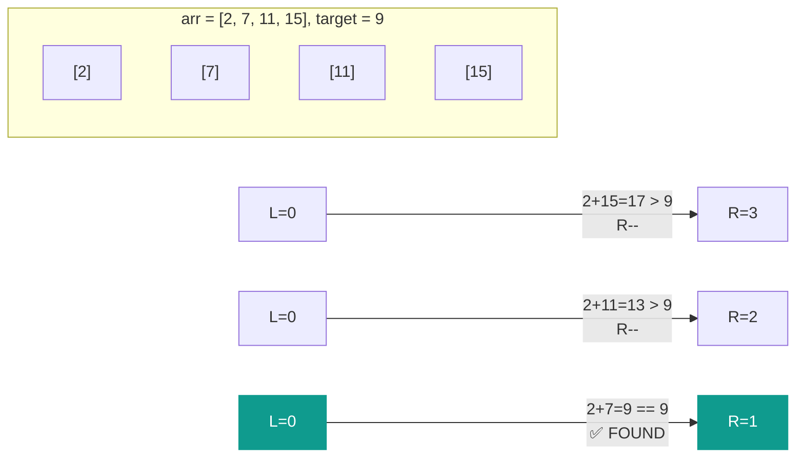
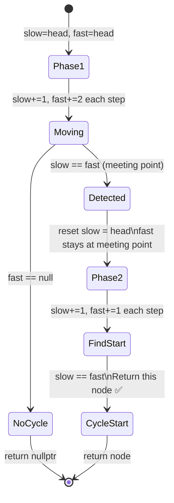
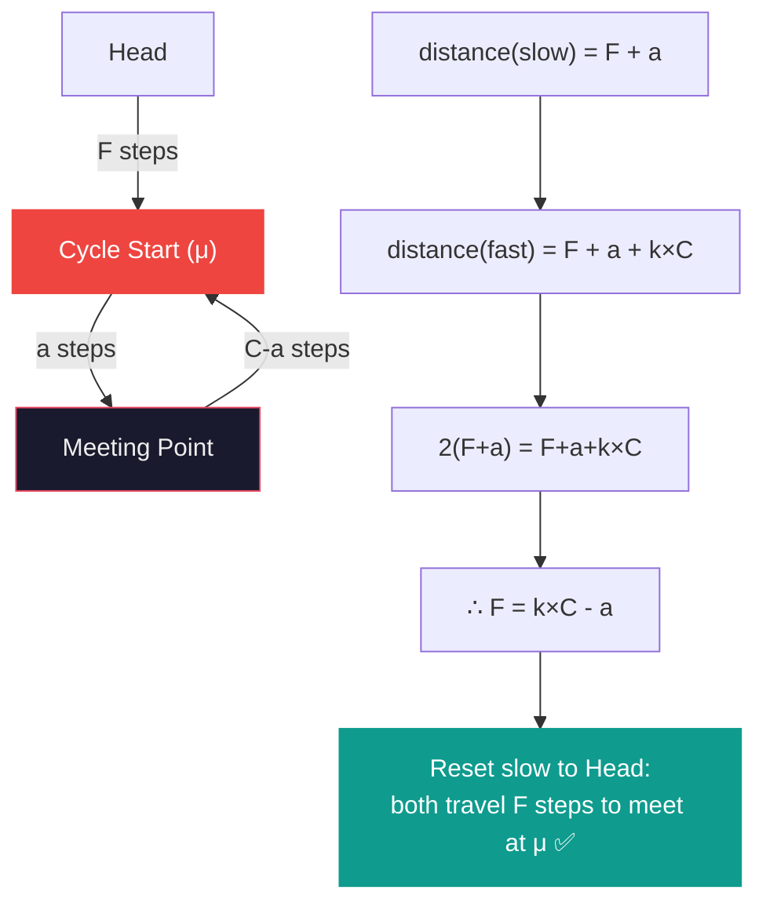
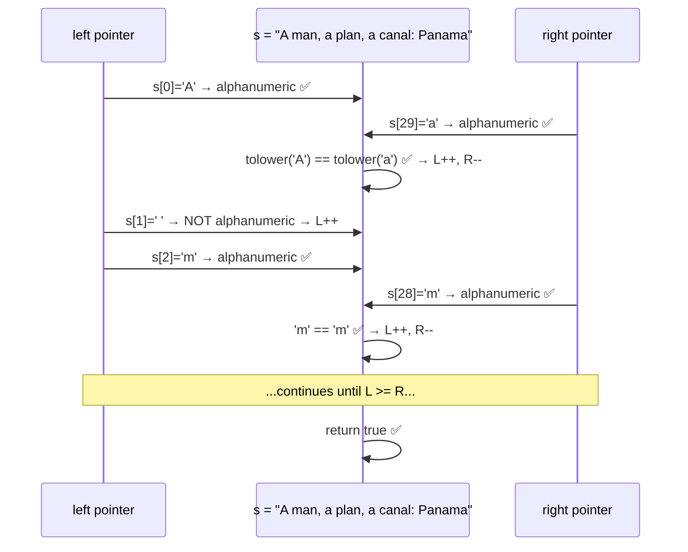

# 👆👆 Two Pointers — لعبة الشيلة في أتوبيس النقل العام

> **Author:** Senior Staff SWE @ FAANG | Cairo → San Francisco
> **Target:** Khaled — Junior Engineer, الواد اللي بيكمّل
> **Level:** Intermediate → Advanced
> **Tags:** `#two-pointers` `#opposite-ends` `#fast-slow` `#floyd` `#cpp` `#interview-prep`

---

## الفكرة الأساسية — What Is It?

يا Khaled، تعالى نتخيل موقفين مختلفين تماماً — واللي هيخليك تفرق بين الـ variant اتين للـ technique دي للأبد.

---

### الـ Variant الأول — Opposite Ends (من الطرفين)

إنت راكب أتوبيس نقل عام من المحطة الأولى للمحطة الأخيرة. الكمسري عايز يتأكد إن الأتوبيس **متوازن** — يعني وزن الركاب في الأمام تقريباً يساوي وزن الركاب في الخلف.

بيبعت واحد يمشي من **الباب الأمامي للخلف** وواحد تاني يمشي من **الباب الخلفي للأمام** — وبيشوفوا لما يلتقوا في النص إيه الحال.

ده هو الـ **Opposite Ends pattern** — بتبدأ بـ pointer من الطرف الأيسر وواحد من الطرف الأيمن، وبيتحركوا ناحية بعض.

---

### الـ Variant التاني — Fast & Slow (الأرنب والسلحفاة)

إنت في كوبري دائري — الشارع بيلف على نفسه (زي الـ ring road بس بيرجع لنفس النقطة).

عندك عربيتين: واحدة بتيجي بسرعة وواحدة بطيئة. **لو في حلقة (cycle)**، العربية السريعة هتلحق العربية البطيئة في يوم ما — هتدوروا في نفس النقطة.

**لو مفيش حلقة**، العربية السريعة هتوصل لـ `nullptr` الأول وخلاص.

ده هو الـ **Fast & Slow (Floyd's Tortoise & Hare)** — pointer بيتحرك خطوة واحدة وتاني بيتحرك خطوتين.

---

### المعادلة الأساسية للاتنين

$$\text{Opposite Ends: } left = 0,\ right = n-1,\ \text{يتحركوا ناحية بعض}$$

$$\text{Fast \& Slow: } slow += 1,\ fast += 2,\ \text{في نفس الاتجاه}$$

---

## التشخيص وإمتى نستخدمه — Pattern Recognition

### 🔑 كلمات الـ Opposite Ends

- **"sorted array"** + "find pair" / "two sum in sorted array"
- **"palindrome"** / "valid palindrome" / "reverse"
- **"container with most water"** / "maximize area"
- **"remove duplicates in-place"** / "in-place modification"
- **"squaring a sorted array"** / "sorted squares"
- **"three sum"** / "four sum" / "k-sum" ← (بتحتاج loop + opposite ends)
- **"closest to target"** / "minimum difference pair"
- اللي بيفرّق: الـ **array بيكون sorted** أو الـ solution بتعتمد على الـ order

### 🔑 كلمات الـ Fast & Slow

- **"linked list"** + "cycle" / "loop detection"
- **"find middle of linked list"**
- **"happy number"** / "detect cycle in sequence"
- **"find duplicate number"** ← (في array تتعامل زي linked list)
- **"find start of cycle"**
- اللي بيفرّق: الـ **structure فيها cycles محتملة** أو محتاج تلاقي نقطة وسط بدون extra memory

### 🚩 Red Flags — إمتى الـ Two Pointers هيفشل

**1. الـ Array مش Sorted وإنت محتاج Opposite Ends**
الـ opposite ends بتاخد advantage من الـ sorted order. على unsorted array، تحريك الـ pointer مش هيديك معلومة مفيدة.

**2. محتاج تشوف كل pair ممكنة**
لو المسألة بتقول "جيب كل الـ pairs" مش "جيب أحسن pair" — الـ two pointers ممكن تفوّتك combinations. في الحالة دي Brute Force أو HashSet أنسب.

**3. الـ Linked List مش circular وإنت بتستخدم Fast/Slow للـ cycle**
لو مفيش loop، الـ fast pointer هيوصل `nullptr` — ده مش error، ده intended behavior. بس لو كتبت الكود غلط هتعمل segfault.

**4. 2D Arrays أو Non-Linear Structures**
الـ two pointers بيشتغل على الـ linear sequences. على 2D grid، محتاج approach مختلف.

---

## العمق التقني — Under-the-Hood Math & Complexity

### Big O Analysis

#### Opposite Ends على sorted array:

$$T(N) = O(N)$$

الـ left و right بيتحركوا مع بعض نحو بعض. الـ left ما بيرجعش للخلف والـ right ما بيرجعش للأمام. إجمالي الـ moves:

$$\text{moves}_{left} + \text{moves}_{right} \leq N$$

يعني أقصى حاجة $N$ iterations للاتنين مع بعض.

#### Fast & Slow على Linked List بحجم $N$:

$$T(N) = O(N)$$

في أسوأ حالة، الـ fast pointer بيعدي كل الـ list مرتين قبل ما يلتقي بالـ slow أو يوصل النهاية.

$$S(N) = O(1)$$

ده الـ beauty الحقيقية — مش بنستخدم أي extra memory. مقارنةً بالـ HashSet approach اللي بياخد $O(N)$ space.

---

### 🔬 C++ System-Level Deep Dive

#### Pointer Arithmetic في الـ Arrays — الـ CPU بيشوف إيه؟

```cpp
vector<int> arr = {1, 3, 5, 7, 9};
int* left  = arr.data();          // points to arr[0] in heap
int* right = arr.data() + 4;      // points to arr[4] in heap

// بدل indices، ممكن تستخدم raw pointers
// arr.data() بيديك pointer للأول عنصر في الـ contiguous heap block
```

الـ array في memory بيكون هكذا:

```
Heap:  [1][3][5][7][9]
        ↑           ↑
       left        right
Address: 0x100  0x114  (كل int = 4 bytes، فـ offset = 4 * index)
```

لما بتعمل `left++`، الـ CPU بيزود الـ address بـ `sizeof(int) = 4` bytes. ده **pointer arithmetic** — مش manual، الـ compiler بيحسبه تلقائياً بناءً على الـ type.

#### الـ Index-Based vs Pointer-Based — إيه الأفضل في الـ Interviews؟

```cpp
// INDEX-BASED — أوضح وأأمن، recommended في interviews
int left = 0, right = n - 1;
while (left < right) {
    // arr[left], arr[right]
}

// POINTER-BASED — أسرع نظرياً (no bounds check overhead)
// لكن أصعب في الـ debugging
auto* l = arr.data();
auto* r = arr.data() + arr.size() - 1;
while (l < r) {
    // *l, *r
}
```

في الـ interviews استخدم **index-based** دايماً — أوضح للـ interviewer وأقل error-prone. الـ performance difference negligible في competitive context.

#### الـ Fast & Slow في Linked List — الـ Pointer Safety

```cpp
struct ListNode {
    int val;
    ListNode* next;
};

// الـ CRITICAL bug اللي بيوقع الـ juniors:
ListNode* fast = head;
while (fast->next->next != nullptr) {  // ❌ CRASH لو fast->next == nullptr
    fast = fast->next->next;
}

// الـ CORRECT way — تحقق من الاتنين
while (fast != nullptr && fast->next != nullptr) {  // ✅
    fast = fast->next->next;
}
```

الـ order في الـ condition مهم جداً بسبب **short-circuit evaluation** في C++. `fast != nullptr` لازم يكون الأول. لو `fast` هو `nullptr`، الـ `fast->next` هيعمل **undefined behavior** (غالباً segfault على Linux أو access violation على Windows).

#### Cache Behavior — Array vs Linked List

```
Array (Two Pointers من طرفين):
Heap: [1][3][5][7][9][11][13]...
       ↑                    ↑
      left               right

left بيتحرك للأمام → sequential access → cache-friendly ✅
right بيتحرك للخلف → reverse sequential → still cache-friendly ✅
(الـ CPU prefetcher بيشتغل في الاتجاهين)

Linked List (Fast & Slow):
Node1 → Node2 → Node3 → Node4
0x100   0x340   0x218   0x4A0  ← scattered في الـ Heap

كل node في address مختلف → cache miss في كل خطوة → أبطأ من Array
ده مش bug، ده طبيعة الـ Linked List
```

ده بيفسر ليه في الـ FAANG interviews بيسألوا "إيه الـ tradeoff بين array وlinked list؟" — مش بس الـ Big O، ده الـ cache performance.

#### Floyd's Cycle Detection — الرياضيات وراه

لو في cycle بطول $\lambda$ وبيبدأ عند index $\mu$:

$$\text{لما الـ pointers يلتقوا: } \text{distance}_{slow} = k \cdot \lambda$$

حيث $k$ هو عدد صحيح. يعني الـ meeting point دايماً عند مضاعف من طول الـ cycle.

$$\text{لإيجاد بداية الـ cycle: رجّع أحدهم للـ head وامشي بنفس السرعة}$$

$$\text{هيلتقوا عند } \mu \text{ — بداية الـ cycle بالظبط}$$

ده اللي بيخلي LeetCode 142 ممكن الحل بتاعه.

---

## القالب السحري — The Magic Template

```cpp
// ============================================================
// TWO POINTERS TEMPLATES — Modern C++17
// Author: Staff SWE @ FAANG
// ============================================================

#include <vector>
#include <string>
using namespace std;

// ──────────────────────────────────────────────────────────
// TEMPLATE 1: Opposite Ends — Pair Finding
// متى؟ Sorted array + find pair with property
// ──────────────────────────────────────────────────────────
// int left = 0, right = n - 1;
// while (left < right) {
//     int curr = arr[left] + arr[right];  // أو أي constraint
//
//     if (curr == target) {
//         // ✅ found — process result
//         left++; right--;   // move both inward
//     }
//     else if (curr < target) {
//         left++;   // محتاج أكبر → حرك اليسار للأمام
//     }
//     else {
//         right--;  // محتاج أصغر → حرك اليمين للخلف
//     }
// }

// ──────────────────────────────────────────────────────────
// TEMPLATE 2: Opposite Ends — Two-Pass Verification
// متى؟ Palindrome check, reverse comparison
// ──────────────────────────────────────────────────────────
// int left = 0, right = n - 1;
// bool valid = true;
// while (left < right) {
//     if (arr[left] != arr[right]) { valid = false; break; }
//     left++;
//     right--;
// }

// ──────────────────────────────────────────────────────────
// TEMPLATE 3: Opposite Ends — In-Place Modification
// متى؟ Remove elements, partition array
// ──────────────────────────────────────────────────────────
// int left = 0, right = n - 1;
// while (left < right) {
//     while (left < right && CONDITION_FOR_LEFT)  left++;
//     while (left < right && CONDITION_FOR_RIGHT) right--;
//     if (left < right) swap(arr[left++], arr[right--]);
// }

// ──────────────────────────────────────────────────────────
// TEMPLATE 4: Fast & Slow — Cycle Detection (Array/List)
// متى؟ Linked List cycle, duplicate detection
// ──────────────────────────────────────────────────────────
// auto* slow = head;
// auto* fast = head;
// bool has_cycle = false;
//
// while (fast != nullptr && fast->next != nullptr) {
//     slow = slow->next;           // +1
//     fast = fast->next->next;     // +2
//     if (slow == fast) { has_cycle = true; break; }
// }

// ──────────────────────────────────────────────────────────
// TEMPLATE 5: Fast & Slow — Find Middle
// متى؟ Middle of linked list, split list
// ──────────────────────────────────────────────────────────
// auto* slow = head;
// auto* fast = head;
//
// while (fast != nullptr && fast->next != nullptr) {
//     slow = slow->next;
//     fast = fast->next->next;
// }
// // لما fast يوصل النهاية، slow بيكون في النص بالظبط

// ──────────────────────────────────────────────────────────
// TEMPLATE 6: Two Pointers على اتنين Arrays/Strings مختلفين
// متى؟ Merge sorted arrays, compare subsequence
// ──────────────────────────────────────────────────────────
// int i = 0, j = 0;
// while (i < n && j < m) {
//     if (MATCH_CONDITION(a[i], b[j])) {
//         i++; j++;
//     } else {
//         j++;  // أو i++ حسب المنطق
//     }
// }
```

---

## أمثلة عملية متدرجة — Step-by-Step Walkthroughs

---

### 🔵 المثال الأول: Valid Palindrome (Opposite Ends)
**[LeetCode 125 — Valid Palindrome](https://leetcode.com/problems/valid-palindrome/)**

**المشكلة:** A phrase is a palindrome if, after converting all uppercase letters into lowercase letters and removing all non-alphanumeric characters, it reads the same forward and backward.

```
Input:  "A man, a plan, a canal: Panama"
Output: true  ← "amanaplanacanalpanama"
```

---

**Thought Process — فكر معايا خطوة بخطوة:**

الـ naive approach هو إنك تعمل cleaned string جديدة وتقارنها بـ reverse بتاعها. ده $O(N)$ time و $O(N)$ space.

الـ two pointers approach هيعمل نفس الشيء بـ $O(1)$ space — من غير ما نعمل string جديدة خالص.

**الفكرة:** عندنا `left` من الأول و `right` من الآخر. بنتحرك للداخل. في كل خطوة:

**خطوة 1:** لو `s[left]` مش alphanumeric، تجاهله وامشي `left++`.

**خطوة 2:** لو `s[right]` مش alphanumeric، تجاهله وامشي `right--`.

**خطوة 3:** لو الاتنين alphanumeric، قارنهم (ignore case). لو مختلفين → مش palindrome. لو متساويين → `left++`, `right--`.

```
s = "A man, a plan, a canal: Panama"
     L                            R

Step 1: s[L]='A', s[R]='a' → tolower: 'a'=='a' ✅ → L++, R--
Step 2: s[L]=' ' → skip L++
Step 3: s[L]='m', s[R]='m' ✅ → L++, R--
...وهكذا لحد ما L >= R
```

**الـ key insight:** إحنا مش بنعمل string جديدة — بنـ "simulate" الـ cleaned string بتحريك الـ pointers وتجاهل الـ non-alphanumeric في نفس الوقت.

---

**C++ Solution:**

```cpp
class Solution {
public:
    bool isPalindrome(const string& s) {
        int left  = 0;
        int right = static_cast<int>(s.size()) - 1;

        while (left < right) {
            // تخطى كل حاجة مش alphanumeric من الشمال
            while (left < right && !isalnum(s[left]))  left++;
            // تخطى كل حاجة مش alphanumeric من اليمين
            while (left < right && !isalnum(s[right])) right--;

            // قارن بعد التحويل لـ lowercase
            if (tolower(s[left]) != tolower(s[right])) {
                return false;
            }

            left++;
            right--;
        }

        return true;
    }
};
```

**ليه `static_cast<int>`؟**

`s.size()` بترجع `size_t` اللي هو **unsigned**. لو الـ string فاضية، `s.size() - 1` هيبقى `size_t(-1)` اللي هو رقم ضخم جداً (integer underflow على unsigned). الـ cast لـ `int` بيحمينا من الـ bug ده.

---

**Complexity:**

| | Time | Space |
|---|---|---|
| Solution | $O(N)$ | $O(1)$ |
| Naive (with extra string) | $O(N)$ | $O(N)$ |

---

### 🟡 المثال الثاني: Two Sum II — Input Array Is Sorted (Opposite Ends)
**[LeetCode 167 — Two Sum II](https://leetcode.com/problems/two-sum-ii-input-array-is-sorted/)**

**المشكلة:** Sorted array، لاقي اتنين أرقامهم مجموعهم = target.

---

**Thought Process — ليه الـ Sorting بيخلي الـ Two Pointers يشتغل؟**

ده الـ intuition الأهم في الـ Opposite Ends pattern كله. لازم تفهمه مش تحفظه.

```
arr = [2, 7, 11, 15], target = 9
       L            R
```

**الحالة الأولى:** `arr[L] + arr[R] = 2 + 15 = 17 > 9`

ايه اللي نعمله؟ محتاج **نقلل المجموع**. الطريقة الوحيدة هي إننا نغير أحد الـ pointers. لو حركنا `L` للأمام، المجموع هيزيد أو يفضل كبير. **الوحيد اللي ينفع نحركه هو `R` للخلف** — ده هيجيب عنصر أصغر.

**الحالة التانية:** `arr[L] + arr[R] < target`

محتاج **نزود المجموع**. الوحيد اللي ينفع هو `L` للأمام — عنصر أكبر.

**الحالة التالتة:** `arr[L] + arr[R] == target` → وجدنا الإجابة.

ده مش guesswork — ده **mathematical proof بالاستبعاد**. في كل خطوة، بنستبعد حالة مستحيلة بدليل من الـ sorted order.

```
arr = [2, 7, 11, 15], target = 9

Step 1: L=0, R=3 → 2+15=17 > 9  → R--
Step 2: L=0, R=2 → 2+11=13 > 9  → R--
Step 3: L=0, R=1 → 2+7=9  == 9  ✅ → return {1, 2} (1-indexed)
```

---

**C++ Solution:**

```cpp
class Solution {
public:
    vector<int> twoSum(vector<int>& numbers, int target) {
        int left  = 0;
        int right = static_cast<int>(numbers.size()) - 1;

        while (left < right) {
            long long curr = static_cast<long long>(numbers[left])
                           + static_cast<long long>(numbers[right]);

            if (curr == target) {
                return {left + 1, right + 1};  // 1-indexed per problem
            } else if (curr < target) {
                left++;
            } else {
                right--;
            }
        }

        return {};  // guaranteed to have solution
    }
};
```

**ليه `long long` للـ sum؟**

الـ constraints ممكن تكون `numbers[i]` حتى $10^9$. مجموع اتنين = $2 \times 10^9$ اللي بيتعدى الـ `int` max ($\approx 2.1 \times 10^9$). بالـ cast لـ `long long` قبل الجمع بنضمن مفيش overflow.

---

**Complexity:**

| | Time | Space |
|---|---|---|
| Solution | $O(N)$ | $O(1)$ |
| Brute Force | $O(N^2)$ | $O(1)$ |
| HashSet | $O(N)$ | $O(N)$ |

الـ Two Pointers هنا هو **الـ optimal solution** — نفس الـ time complexity بتاعة الـ HashSet بس بـ $O(1)$ space.

---

### 🔴 المثال التالت: Linked List Cycle II — Find Cycle Start (Fast & Slow)
**[LeetCode 142 — Linked List Cycle II](https://leetcode.com/problems/linked-list-cycle-ii/)**

**المشكلة:** Find the node where the cycle begins. Return `nullptr` if no cycle.

---

**Thought Process — الرياضيات خطوة بخطوة:**

```
List: 3 → 1 → 2 → 0
              ↑       ↓
              ←←←←←←←←
```

**Phase 1: اكتشف لو في cycle**

ابدأ `slow = fast = head`. حرك slow خطوة وfast خطوتين. لو في cycle، هيلتقوا.

**Phase 2: لاقي بداية الـ cycle (الـ magic)**

لما slow وfast يلتقوا عند node معينة:

نسمي:
- $F$ = المسافة من الـ head لبداية الـ cycle
- $C$ = طول الـ cycle
- $a$ = المسافة من بداية الـ cycle للـ meeting point

في وقت الالتقاء:
$$\text{distance}_{slow} = F + a$$
$$\text{distance}_{fast} = F + a + k \cdot C \quad \text{(fast عمل } k \text{ لفات في الـ cycle)}$$

وبما إن fast بيتحرك ضعف slow:
$$2(F + a) = F + a + k \cdot C$$
$$F + a = k \cdot C$$
$$F = k \cdot C - a$$

**معنى ده إيه؟**

لو رجّعنا `slow` للـ `head` وخليناه يمشي بنفس سرعة `fast`، هيلتقوا في بداية الـ cycle بالظبط بعد $F$ خطوة.

```
Phase 1 — Detect:
slow: head→1→2→0→1→2  (meeting at node "2")
fast: head→2→1→2→0→2  (also at node "2")

Phase 2 — Find Start:
reset slow to head
slow: head→3→1→2  (+3 steps)
fast:      2→0→1→2  (+3 steps from meeting point)
Both arrive at node "1" — بداية الـ cycle ✅
```

---

**C++ Solution:**

```cpp
class Solution {
public:
    ListNode* detectCycle(ListNode* head) {
        if (!head || !head->next) return nullptr;

        ListNode* slow = head;
        ListNode* fast = head;

        // ─── Phase 1: Detect cycle ───
        while (fast != nullptr && fast->next != nullptr) {
            slow = slow->next;
            fast = fast->next->next;

            if (slow == fast) {
                // ─── Phase 2: Find cycle start ───
                slow = head;  // reset slow to head
                // fast يفضل في meeting point

                while (slow != fast) {
                    slow = slow->next;
                    fast = fast->next;  // الاتنين بسرعة 1 دلوقتي
                }

                return slow;  // بداية الـ cycle
            }
        }

        return nullptr;  // no cycle
    }
};
```

**لماذا `slow == fast` تعني التقاء وليس مجرد نفس القيمة؟**

في C++، المقارنة دي هي **pointer equality** — بنقارن الـ memory addresses مش الـ values. اتنين nodes ممكن يكون عندهم نفس الـ `val` بس هما nodes مختلفة في الـ memory. `slow == fast` تعني إنهم بيشيروا لنفس الـ node object تماماً.

---

**Complexity:**

| | Time | Space |
|---|---|---|
| Floyd's Algorithm | $O(N)$ | $O(1)$ |
| HashSet approach | $O(N)$ | $O(N)$ |

---

### 🟣 مثال بونص: Find the Duplicate Number (Fast & Slow على Array)
**[LeetCode 287 — Find the Duplicate Number](https://leetcode.com/problems/find-the-duplicate-number/)**

**المشكلة:** Array of $n+1$ integers where each integer is in $[1, n]$. Find the duplicate. No modification allowed, $O(1)$ space.

---

**Thought Process — الـ Array كـ Linked List؟**

الـ insight الجميل هنا: بنتعامل مع الـ array كـ linked list!

```
arr = [1, 3, 4, 2, 2]
idx:   0  1  2  3  4

"next" pointer من index i = arr[i]

يعني: 0 → arr[0]=1 → arr[1]=3 → arr[3]=2 → arr[2]=4 → arr[4]=2 → arr[2]=4 → ...
                                                             ↑ cycle! ↑
```

لأن في duplicate، فيه اتنين indexes بيشيروا لنفس المكان → ده بيعمل cycle. نطبق Floyd's ونلاقي بداية الـ cycle = الـ duplicate.

```cpp
class Solution {
public:
    int findDuplicate(vector<int>& nums) {
        int slow = nums[0];
        int fast = nums[0];

        // Phase 1: Detect
        do {
            slow = nums[slow];
            fast = nums[nums[fast]];
        } while (slow != fast);

        // Phase 2: Find entrance
        slow = nums[0];
        while (slow != fast) {
            slow = nums[slow];
            fast = nums[fast];
        }

        return slow;
    }
};
```

ده اللي بيخلي الـ FAANG interviews صعبة — مش حفظ algorithms، ده **رؤية إن الـ array ممكن تتعامل معاها كـ linked list**.

---

## مخططات الذاكرة — Mermaid Diagrams

### Diagram 1: Opposite Ends — Two Sum II Motion



---

### Diagram 2: Fast & Slow — Cycle Detection Phases



---

### Diagram 3: Floyd's Math — لماذا Phase 2 تشتغل؟



---

### Diagram 4: Palindrome — Opposite Ends على String



---

## الفرق الجوهري بين الـ Variants — متى تختار أيهما؟

```
المشكلة بتتكلم عن array أو string؟
    ↓
    هل الـ array sorted أو محتاج تقارن طرفين؟
        ↓ YES → Opposite Ends (L=0, R=n-1)
        ↓
    هل محتاج تقسّم أو تعدّل in-place؟
        ↓ YES → Opposite Ends مع partition logic

المشكلة بتتكلم عن Linked List أو sequence؟
    ↓
    هل في cycle detection أو middle finding؟
        ↓ YES → Fast & Slow (slow+=1, fast+=2)
        ↓
    هل الـ array ممكن تتعامل معاها كـ linked list؟
        ↓ YES → Floyd's على Array (LeetCode 287 style)

المشكلة عندها اتنين arrays/strings مختلفين؟
    ↓ YES → Two Separate Pointers (i على arr1، j على arr2)
```

---

## تطبيقات عملية — Obsidian Practice Checklist

يا Khaled، الـ roadmap مقسوم بالـ variant عشان تبني الـ muscle memory صح.

**Opposite Ends:**

- [ ] **[LeetCode 125 — Valid Palindrome](https://leetcode.com/problems/valid-palindrome/)** `Easy`
  — 🟢 **Hint:** تخطى الـ non-alphanumeric بـ inner while loops وقارن بـ `tolower`. خليك فاكر الـ unsigned size bug.

- [ ] **[LeetCode 167 — Two Sum II](https://leetcode.com/problems/two-sum-ii-input-array-is-sorted/)** `Medium`
  — 🟡 **Hint:** الـ sorted order هو الـ key. إذا المجموع كبير حرك R، إذا صغير حرك L. استحلف نفسك تفهم ليه ده correct بالاستبعاد.

- [ ] **[LeetCode 11 — Container With Most Water](https://leetcode.com/problems/container-with-most-water/)** `Medium`
  — 🟡 **Hint:** `area = min(h[L], h[R]) * (R - L)`. دايماً حرك الـ pointer بتاع الـ أقصر خط. فكر ليه تحريك الأطول خط مش هيحسّن الـ answer.

- [ ] **[LeetCode 15 — 3Sum](https://leetcode.com/problems/3sum/)** `Medium`
  — 🟡 **Hint:** Sort الأول. Fix عنصر واحد بـ outer loop، بعدين Two Pointers على الباقي. تجنب duplicates بـ `while (arr[L]==arr[L-1]) L++`.

**Fast & Slow:**

- [ ] **[LeetCode 141 — Linked List Cycle](https://leetcode.com/problems/linked-list-cycle/)** `Easy`
  — 🟢 **Hint:** Phase 1 بس — هل بيلتقوا؟ الـ warm-up للـ 142.

- [ ] **[LeetCode 142 — Linked List Cycle II](https://leetcode.com/problems/linked-list-cycle-ii/)** `Medium`
  — 🟡 **Hint:** Phase 1 للاكتشاف، Phase 2 لإيجاد البداية بعد reset. اشرح الرياضيات لنفسك قبل ما تكتب كود.

- [ ] **[LeetCode 287 — Find the Duplicate Number](https://leetcode.com/problems/find-the-duplicate-number/)** `Medium`
  — 🔴 **Hint:** الـ array كـ linked list. `next(i) = arr[i]`. طبق Floyd's كأنك على linked list. ده أصعب الـ 7 — اتركه للآخر.

---

## 🏁 الخلاصة — الـ Full Mental Model

```
Two Pointers = استغلال الـ structure عشان تتجنب الـ O(N²)

Opposite Ends:
  ✔ Array/String + sorted أو symmetric
  ✔ بتدور على pair/triplet بـ property
  ✔ بتعمل in-place modification أو verification

Fast & Slow:
  ✔ Linked List + cycle detection
  ✔ محتاج تلاقي الـ middle بدون extra memory
  ✔ Array ممكن تتعامل معاها كـ implicit linked list

القاسم المشترك:
  كلاهم بياخد O(N²) problem ويحلها في O(N)
  كلاهم بيستخدم O(1) space
  كلاهم بيستغل خاصية معينة في الـ data structure
```

**السؤال الذهبي اللي هتسأله لنفسك في الـ interview:**

> "لو أنا واقف عند element معينة وعارف حاجة عن الـ elements قبلها أو بعدها بسبب الـ sorted order أو الـ structure — ممكن استغل ده عشان أتجنب الـ nested loop؟"

لو الجواب "أيوه" — Two Pointers هو صاحبك.

---

*"الـ Pointer مش بس variable — ده قرار. كل تحريك بتعمله لازم يكون مبرر رياضياً."*
*— Cairo → FAANG, 2024*
