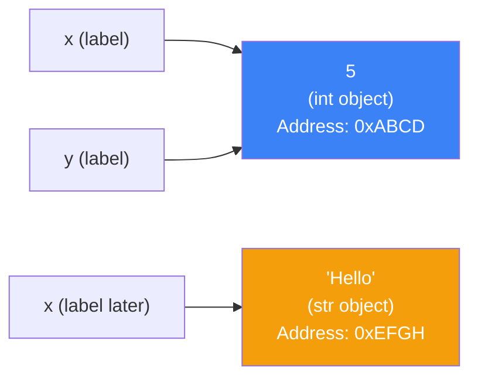
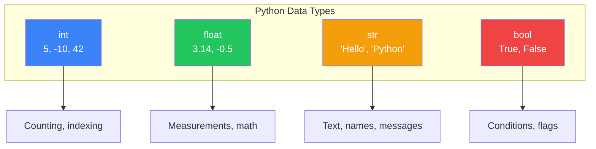
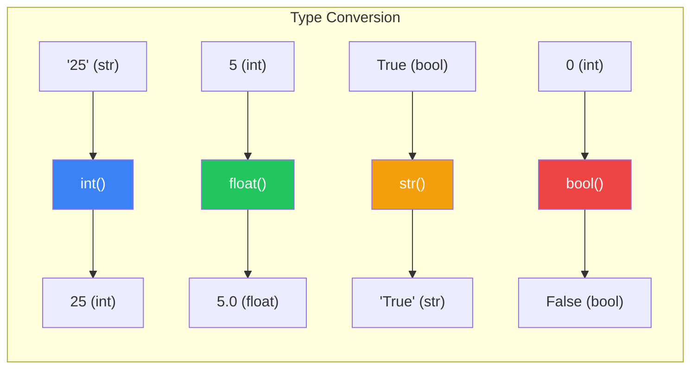
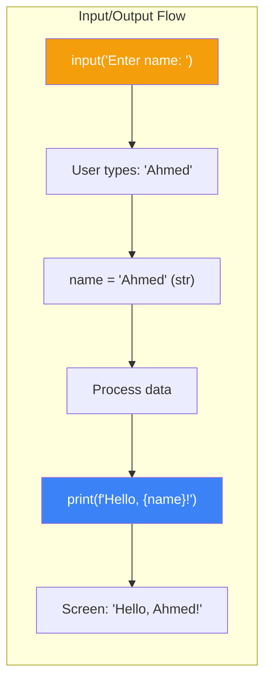

---

# Python Syntax والـ Data Types: أول خطوة في الرحلة

> **المتطلبات:** لا يوجد. أي حد عنده فضول يتعلم Python — حتى لو أول مرة يشوف كود في حياته. الفصل ده هو البداية المطلقة.

---

## البداية — ليه Python؟

تخيّل معايا إنك عايز تطلب أكل من مطعم. تقدر تطلب بـ:
- **لغة الإشارة:** معقدة ومحدودة.
- **لغة المطعم المحلية:** سريعة ومباشرة، لكن مش هتفهمها بره المطعم ده.
- **لغة إنجليزية مكسرة:** بسيطة، مفهومة، وكل الناس بتفهمها.

Python هي "الإنجليزي المكسر" بتاع البرمجة. لغة بسيطة، قريبة من لغة البشر، ومش محتاجة تعقيدات. مش بس كده — Python هي اللغة اللي بتشغل Instagram، Spotify، Netflix، وأجزاء كبيرة من Google و NASA.

في الفصل ده، هناخد أول خطوة: هنفهم إزاي نكتب كود Python، إزاي نخزن بيانات، وإزاي نتعامل مع الأنواع المختلفة للبيانات.

---

## [[01-Variables]] — المتغيرات: صناديق التخزين

### 🧠 الشرح النظري

في Python، المتغير هو مجرد **اسم** بتديه لـ **قيمة** موجودة في الذاكرة. المتغير مش الصندوق نفسه — هو **ورقة لاصقة** مكتوب عليها اسم الصندوق.

لما بتكتب `x = 5`، Python بتعمل:
1. تخزن القيمة `5` في مكان ما في الذاكرة.
2. تلصق عليها ورقة مكتوب عليها `x`.

تقدر تغير الورقة اللاصقة في أي وقت. تقدر تحطها على قيمة تانية: `x = "Hello"`. Python هتشيل الورقة من على `5` وتحطها على `"Hello"`. القيمة `5` هتفضل موجودة في الذاكرة لحد ما Python تكتشف إن محدش بيستخدمها وتنضفها (وده موضوع File 01 المتقدم).

ده اسمه **Dynamic Typing** — المتغير نفسه ملهوش نوع ثابت. هو بس بيشاور على قيمة. القيمة هي اللي ليها نوع (`int`, `str`).

تخيّل الموضوع زي **مستودع ضخم**:
- **الصناديق:** القيم (`5`, `"Hello"`, `True`).
- **الورق اللاصق:** أسماء المتغيرات (`x`, `name`, `is_active`).
- **إنت:** بتلصق الورق على الصناديق اللي عايزها.

### 📊 Visualization



### 💻 Micro-Example

```python
x = 5                       # x points to integer 5
print(x)                    # 5

x = "Hello, HireLink!"      # x now points to a string
print(x)                    # Hello, HireLink!

y = x                       # y points to the SAME string object
print(y)                    # Hello, HireLink!
```

---

## [[02-Data-Types]] — أنواع البيانات: إيه اللي بنخزنه؟

### 🧠 الشرح النظري

القيم اللي بنخزنها في Python ليها أنواع مختلفة. كل نوع ليه استخداماته وخصائصه.

**الأربع أنواع الأساسية:**

**1. Integers (`int`):**
أرقام صحيحة. `5`, `-10`, `0`, `1000000`. في Python، الـ integers مالهاش حد أقصى (زي ما في لغات تانية). تقدر تخزن أرقام ضخمة جداً من غير ما تقلق.

**2. Floating-Point Numbers (`float`):**
أرقام عشرية. `3.14`, `-0.5`, `2.0`. Python بتستخدم معيار IEEE 754 — ده معناه إن فيه دقة محدودة. `0.1 + 0.2` ممكن يطلع `0.30000000000000004` مش `0.3` بالظبط.

**3. Strings (`str`):**
نصوص. `"Hello"`, `'World'`, `"Python 3.12"`. تقدر تستخدم علامات تنصيص مفردة `'` أو مزدوجة `"`. النص ممكن يكون حرف واحد أو ملايين الحروف.

**4. Booleans (`bool`):**
قيم منطقية. `True` أو `False`. دول كلمتين محفوظتين في Python (مش `true` أو `false` زي لغات تانية).

تخيّل الأنواع دي زي **أشكال الصناديق في المستودع**:
- **`int`:** صندوق أرقام — بتحط فيه أعداد صحيحة.
- **`float`:** صندوق قياسات — بتحط فيه أرقام بفواصل.
- **`str`:** صندوق نصوص — بتحط فيه كلمات وجمل.
- **`bool`:** مفتاح — إما `True` (شغال) أو `False` (مطفى).

### 📊 Visualization



### 💻 Micro-Example

```python
age = 25                    # int
price = 99.99               # float
name = "Ahmed"              # str
is_active = True            # bool

print(type(age))            # <class 'int'>
print(type(price))          # <class 'float'>
print(type(name))           # <class 'str'>
print(type(is_active))      # <class 'bool'>
```

---

## [[03-Type-Conversion]] — تحويل الأنواع: من شكل لشكل

### 🧠 الشرح النظري

أحياناً بتحتاج تحول قيمة من نوع لنوع تاني. مثال: المستخدم دخل `"25"` (نص) وأنت عايز تعاملها كـ رقم `25`.

Python بتقدم functions جاهزة للتحويل:
- **`int(value)`:** تحول لـ integer. `int("25")` → `25`. `int(3.9)` → `3` (بتقطع العلامة العشرية — مش بتقرب).
- **`float(value)`:** تحول لـ float. `float("3.14")` → `3.14`. `float(5)` → `5.0`.
- **`str(value)`:** تحول لـ string. `str(25)` → `"25"`. `str(True)` → `"True"`.
- **`bool(value)`:** تحول لـ boolean. `bool(0)` → `False`. `bool("Hello")` → `True`.

**الـ Truthy و Falsy:**
في Python، أي قيمة ممكن تتعامل كـ boolean في السياقات المنطقية:
- **Falsy (بتتعامل كـ `False`):** `0`, `0.0`, `""` (نص فاضي), `[]` (list فاضية), `None`.
- **Truthy (بتتعامل كـ `True`):** أي حاجة تانية.

تخيّل الموضوع زي **تغيير شكل الصندوق**:
- **`int()`:** بتاخد اللي جوا الصندوق وتحطه في صندوق أرقام صحيحة. لو اللي جواه مش رقم، الصندوق بيتقفل في وشك (error).
- **`str()`:** بتحط أي حاجة في صندوق نصوص. دايمًا شغالة.
- **`bool()`:** بتسأل "الصندوق فيه حاجة؟" لو فاضي (`0`, `""`) → `False`. لو فيه أي حاجة → `True`.

### 📊 Visualization



### 💻 Micro-Example

```python
age_str = "25"
age_int = int(age_str)          # String to integer
print(age_int + 5)              # 30 (math works!)

price_float = float("99.99")    # String to float
print(price_float * 2)          # 199.98

num = 42
num_str = str(num)              # Integer to string
print("Answer: " + num_str)     # "Answer: 42"

print(bool(0))                  # False
print(bool("Hello"))            # True
print(bool(""))                 # False
```

---

## [[04-Basic-IO]] — الإدخال والإخراج: التحدث مع المستخدم

### 🧠 الشرح النظري

البرامج مش بتشتغل في فراغ. محتاجة تاخد بيانات من المستخدم (Input) وترجع نتايج (Output).

**الإخراج — `print()`:**
دي function جاهزة بتطبع أي حاجة على الشاشة. تقدر تطبع أكتر من حاجة بفصلهم بفاصلة `,` و Python هتحط مسافة بينهم. تقدر تتحكم في النهاية (`end`) والفاصل (`sep`).

**الإدخال — `input()`:**
دي function بتوقف البرنامج وتستنى المستخدم يكتب حاجة ويضغط Enter. اللي المستخدم بيكتبه بيرجع دايمًا كـ **string**. لو عايز تتعامل معاه كـ رقم، لازم تحوله بـ `int()` أو `float()`.

**f-Strings (Formatted String Literals):**
دي طريقة نظيفة لدمج المتغيرات مع النصوص. بتحط `f` قبل علامات التنصيص، وبعدين تحط المتغيرات بين `{ }`. `f"Hello, {name}!"`.

تخيّل الموضوع زي **كاشير في سوبر ماركت**:
- **`input()`:** الكاشير بيسأل "عايز إيه؟" والمستمع بيرد. الرد بيكون كلام.
- **`print()`:** الكاشير بيقول "الحساب كذا" أو "اتفضل".
- **f-Strings:** الكاشير بيقول "شكراً يا أستاذ [الاسم]" — بيدمج الاسم في الجملة بسلاسة.

### 📊 Visualization



### 💻 Micro-Example

```python
name = input("Enter your name: ")           # User types: Ahmed
age_str = input("Enter your age: ")         # User types: 25
age = int(age_str)                          # Convert to integer

print("Hello,", name)                       # Hello, Ahmed
print(f"{name}, you are {age} years old.")  # f-string is cleaner
print(f"Next year you'll be {age + 1}.")    # Can do math inside {}
```

---

## 🛠️ Progressive Exercise 00 — حاسبة بسيطة

**المهمة:** اكتب برنامج Python يعمل الآتي:
1. يطلب من المستخدم إدخال رقمين.
2. يحسب مجموع الرقمين، حاصل ضربهم، وطرحهم.
3. يطبع النتايج بشكل منسق باستخدام f-strings.

**تلميحات:**
- `input()` دايمًا بترجع string — حولها لـ `int()` أو `float()`.
- استخدم `f"{variable}"` عشان تدمج المتغيرات في النص.

**مثال للتنفيذ المتوقع:**
```
Enter first number: 10
Enter second number: 5

Sum: 10 + 5 = 15
Product: 10 * 5 = 50
Difference: 10 - 5 = 5
```

**🎯 جرب بنفسك:** افتح أي Python environment (IDLE, VS Code, Replit) واكتب الحل. لو اتعطلت، الحل تحت.

---

<details>
<summary><b>✨ اضغط هنا عشان تشوف الحل</b></summary>

```python
# PE-00: Simple Calculator

# Get input from user
num1_str = input("Enter first number: ")
num2_str = input("Enter second number: ")

# Convert strings to integers
num1 = int(num1_str)
num2 = int(num2_str)

# Calculate results
sum_result = num1 + num2
product_result = num1 * num2
difference_result = num1 - num2

# Display results using f-strings
print(f"\nSum: {num1} + {num2} = {sum_result}")
print(f"Product: {num1} * {num2} = {product_result}")
print(f"Difference: {num1} - {num2} = {difference_result}")
```

**نسخة مختصرة (للمحترفين):**
```python
num1 = int(input("Enter first number: "))
num2 = int(input("Enter second number: "))

print(f"\nSum: {num1} + {num2} = {num1 + num2}")
print(f"Product: {num1} * {num2} = {num1 * num2}")
print(f"Difference: {num1} - {num2} = {num1 - num2}")
```
</details>

---

## 📝 خلاصة الدرس

- **المتغيرات:** أسماء بتشاور على قيم في الذاكرة. Python ديناميكية — المتغير ممكن يشاور على أي نوع في أي وقت.
- **أنواع البيانات الأساسية:** `int` (أرقام صحيحة)، `float` (أرقام عشرية)، `str` (نصوص)، `bool` (`True`/`False`).
- **تحويل الأنواع:** `int()`, `float()`, `str()`, `bool()`. `input()` دايمًا بترجع string — لازم تحولها لو عايز تتعامل معاها كأرقام.
- **الإدخال والإخراج:** `print()` للعرض، `input()` لاستقبال بيانات من المستخدم. f-strings (`f"{var}"`) هي أنضف طريقة لدمج المتغيرات مع النصوص.
- **Truthy/Falsy:** القيم الفاضية (`0`, `""`, `[]`) بتتعامل كـ `False` في السياقات المنطقية.

---

*Next → [[01-Control-Flow]] — عرفنا إزاي نخزن بيانات. دلوقتي هنتعلم إزاي نخلي البرنامج يتخذ قرارات: `if`, `elif`, `else`، والـ `match` statement الجديدة في Python 3.10. وهنحل PE-01: برنامج درجة الطالب.*