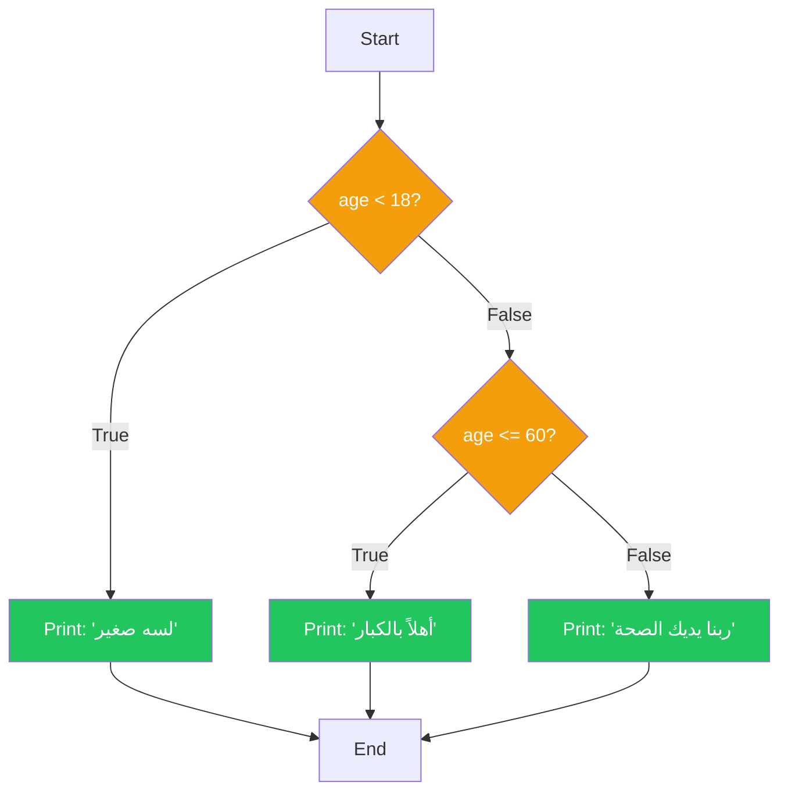
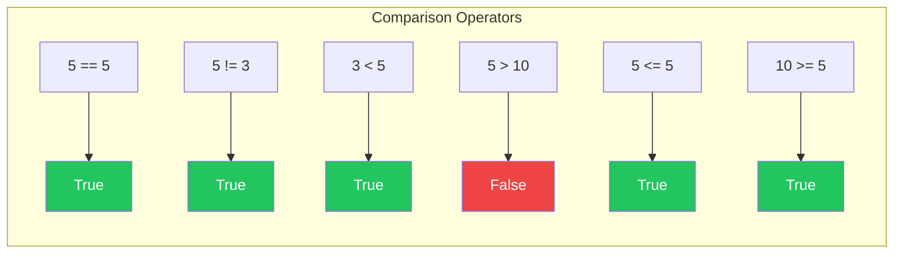
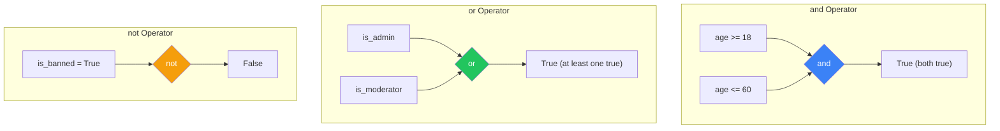
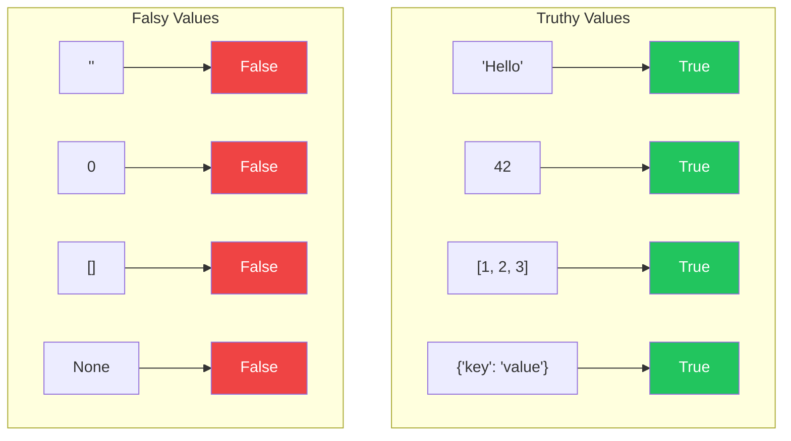
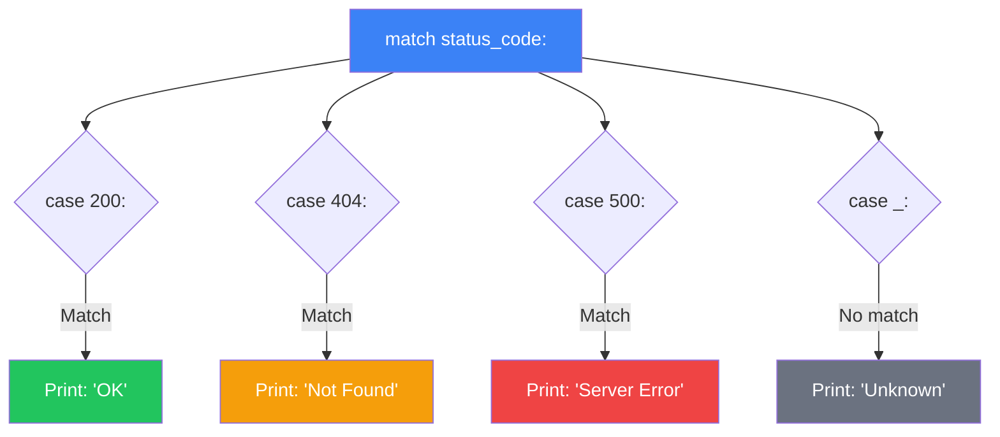

#  Control Flow: إزاي تخلي البرنامج يفكر ويتخذ قرارات

> **المتطلبات:** [[00-Python-Syntax-And-DataTypes]] — لازم تكون فاهم إيه هي المتغيرات، أنواع البيانات الأساسية (`int`, `float`, `str`, `bool`)، وإزاي تستخدم `input()` و `print()` و f-strings.

---

## البداية — البرامج الغبية مقابل البرامج الذكية

تخيّل معايا إنك كاتب برنامج بيطلب من المستخدم عمره وبيطبعله "أهلاً". البرنامج ده **غبي** — بيطبع نفس الحاجة لكل الناس. عمره 15 سنة؟ أهلاً. عمره 65 سنة؟ أهلاً.

إيه رأيك لو البرنامج كان **ذكي** شوية؟
- لو العمر أقل من 18: "لسه صغير يا بطل!"
- لو العمر بين 18 و 60: "أهلاً بيك في عالم الكبار."
- لو العمر أكبر من 60: "ربنا يديك الصحة والعافية."

الفرق بين البرنامجين هو **Control Flow** — إزاي البرنامج بياخد قرارات بناءً على البيانات. النهارده هنتعلم إزاي نخلي كود Python "يفكر" باستخدام `if`, `elif`, `else`.

---

## [[01-Conditionals]] — الجمل الشرطية: الطريق المتفرع

### 🧠 الشرح النظري

في الحياة، بناخد قرارات طول الوقت: "لو الجو حار، هفتح التكييف. لو الجو بارد، هلبس جاكت. غير كده، هعمل عادي." في البرمجة، بنستخدم نفس المنطق بالظبط.

**التركيب الأساسي:**
```
if الشرط الأول:
    # الكود اللي هيتنفذ لو الشرط الأول صحيح
elif الشرط التاني:
    # الكود اللي هيتنفذ لو الشرط التاني صحيح
else:
    # الكود اللي هيتنفذ لو كل الشروط غلط
```

**إزاي Python بتفهم الشروط؟**
الشرط هو أي تعبير بيرجع `True` أو `False` (Boolean). أمثلة:
- `age >= 18` → هل العمر أكبر من أو يساوي 18؟
- `name == "Ahmed"` → هل الاسم يساوي "Ahmed"؟
- `is_active` → هل المتغير `is_active` قيمته `True`؟

**نقطة مهمة عن الـ Indentation:**
في Python، المسافات في أول السطر مش للزينة — هي **إجبارية**. الكود اللي جوا `if` لازم يكون متزحلق لليمين (4 مسافات أو Tab). ده بيعرف Python إن الكود ده جزء من الـ block بتاع الـ `if`.

تخيّل الموضوع زي **لافتات المرور على الطريق**:
- **`if`:** "لو رايح إسكندرية، خد اليمين."
- **`elif`:** "لو رايح أسوان، خد الشمال." (بتتفحص بس لو الشرط الأول غلط).
- **`else`:** "لو مش رايح ولا هنا ولا هنا، كمل مستقيم."

الـ Indentation هو إنك **تدخل في الحارة** اللي اخترتها. طول ما إنت ماشي في الحارة، إنت ملتزم بالمسار ده. لما ترجع لمحاذاة الطريق الرئيسي (نفس مستوى `if`)، إنت خرجت من الحارة.

### 📊 Visualization



### 💻 Micro-Example

```python
age = int(input("Enter your age: "))

if age < 18:
    print("You are a minor.")
elif age <= 60:
    print("You are an adult.")
else:
    print("You are a senior. Respect!")
```

---

## [[02-Comparison-Operators]] — عوامل المقارنة: أدوات طرح الأسئلة

### 🧠 الشرح النظري

عشان تسأل Python أسئلة، محتاج **عوامل مقارنة** (Comparison Operators). دول بيرجعوا دايمًا `True` أو `False`.

**القائمة الكاملة:**
| العامل | المعنى | مثال | النتيجة |
|---|---|---|---|
| `==` | يساوي | `5 == 5` | `True` |
| `!=` | لا يساوي | `5 != 3` | `True` |
| `<` | أصغر من | `3 < 5` | `True` |
| `>` | أكبر من | `5 > 10` | `False` |
| `<=` | أصغر من أو يساوي | `5 <= 5` | `True` |
| `>=` | أكبر من أو يساوي | `10 >= 5` | `True` |

**نقطة خطيرة: `=` vs `==`**
- `=` : عامل **تعيين** (Assignment). بيحط قيمة في متغير. `x = 5`.
- `==` : عامل **مقارنة** (Comparison). بيسأل "هل القيمتين متساويين؟". `x == 5`.

استخدام `=` مكان `==` في `if` statement هو من أشهر أخطاء المبتدئين.

**مقارنة النصوص (Strings):**
Python بتقارن النصوص ترتيبياً (Lexicographically) بناءً على Unicode. `"apple" < "banana"` → `True`. `"A" < "a"` → `True` (الحروف الكبيرة قبل الصغيرة).

تخيّل عوامل المقارنة زي **أسئلة نعم/لا**:
- `==` : "الكنبة دي نفس لون الكنبة اللي في الصورة؟"
- `!=` : "الكنبة دي مختلفة عن اللي في الصورة؟"
- `<` : "العربية دي أرخص من اللي جنبها؟"
- `>=` : "المرتب الشهر ده أكبر من أو يساوي اللي قبله؟"

كل سؤال ليه إجابة واحدة: إما "أيوه" (`True`) أو "لأ" (`False`).

### 📊 Visualization



### 💻 Micro-Example

```python
x = 10
y = 20

print(x == y)   # False
print(x != y)   # True
print(x < y)    # True
print(x > y)    # False
print(x <= 10)  # True
print(y >= 30)  # False

# String comparison
print("apple" < "banana")   # True (a comes before b)
print("Zebra" < "apple")    # True (uppercase comes before lowercase)
```

---

## [[03-Logical-Operators]] — العوامل المنطقية: دمج الأسئلة

### 🧠 الشرح النظري

أحياناً السؤال الواحد مش كافي. عايز تسأل: "هل العمر **أكبر من 18** **و** **أقل من 60**؟" أو "هل المستخدم **أدمن** **أو** **مشرف**؟". هنا بتيجي **العوامل المنطقية**.

**الثلاثة الأساسيين:**
- **`and`:** كل الشروط لازم تكون `True`. `age > 18 and age < 60`.
- **`or`:** شرط واحد على الأقل يكون `True`. `is_admin or is_moderator`.
- **`not`:** عكس الشرط. `not is_banned` → لو مش محظور.

**جدول الحقيقة (Truth Table):**
| A | B | A and B | A or B | not A |
|---|---|---------|--------|-------|
| True | True | True | True | False |
| True | False | False | True | False |
| False | True | False | True | True |
| False | False | False | False | True |

**Short-Circuit Evaluation:**
Python ذكية. لو في `and` وأول شرط `False`، مش هتكمل تشوف باقي الشروط — النتيجة هتبقى `False` في كل الحالات. لو في `or` وأول شرط `True`، مش هتكمل — النتيجة هتبقى `True`. ده بيوفر وقت.

تخيّل العوامل المنطقية زي **شروط الاشتراك في مسابقة**:
- **`and`:** "لازم تكون **مصري** **و** **عمرك فوق 18**". لو مش مصري، خلاص مفيش داعي تسأل عن العمر.
- **`or`:** "تقدر تدفع **كاش** **أو** **فيزا**". لو معاك كاش، خلاص عديت — مش محتاج تشوف الفيزا.
- **`not`:** "المسابقة **مش** للموظفين الحكوميين". `not is_government_employee`.

### 📊 Visualization



### 💻 Micro-Example

```python
age = 25
has_license = True
is_suspended = False

# and: both conditions must be true
if age >= 18 and has_license and not is_suspended:
    print("You can drive!")

# or: at least one condition must be true
is_weekend = True
is_holiday = False
if is_weekend or is_holiday:
    print("No work today!")

# Combining multiple operators
score = 85
attendance = 90
if (score >= 80 and attendance >= 85) or score >= 95:
    print("Excellent performance!")
```

---

## [[04-Truthy-And-Falsy]] — لما القيم تبقى True أو False من غير ما تقول

### 🧠 الشرح النظري

في Python، مش بس `True` و `False` اللي ممكن يتحطوا في `if`. أي قيمة ممكن تتعامل كـ Boolean. ده اسمه **Truthy** و **Falsy**.

**القيم الـ Falsy (بتتعامل كـ `False`):**
- `False` (طبعاً).
- `None` (يمثل "لا شيء").
- `0` (الصفر بأي شكل: `0`, `0.0`, `0j`).
- `""` (نص فاضي).
- `[]` (list فاضية).
- `{}` (dict فاضي).
- `()` (tuple فاضية).
- `set()` (set فاضية).

**القيم الـ Truthy:**
أي حاجة تانية. `"Hello"`, `42`, `[1, 2, 3]`, `True`.

**ليه ده مفيد؟**
بدل ما تكتب `if name != "":` (لو الاسم مش فاضي)، تقدر تكتب `if name:` مباشرةً.
بدل `if len(items) > 0:`، تقدر تكتب `if items:`.

تخيّل الموضوع زي **صندوق الهدايا**:
- **Falsy:** الصندوق فاضي (`""`, `[]`, `0`). لما تسأل "فيه حاجة؟" → لأ (`False`).
- **Truthy:** الصندوق فيه أي حاجة (`"كتاب"`, `[لعبة]`, `42`). لما تسأل "فيه حاجة؟" → أيوه (`True`).

### 📊 Visualization



### 💻 Micro-Example

```python
name = ""
if name:
    print(f"Hello, {name}!")
else:
    print("Name is empty!")  # This runs

items = ["apple", "banana"]
if items:
    print(f"You have {len(items)} items.")  # This runs

score = 0
if score:
    print(f"Your score is {score}.")
else:
    print("You scored zero.")  # This runs

user = None
if user:
    print("User exists.")
else:
    print("No user found.")  # This runs
```

---

## [[05-Match-Statement]] — `match`: الـ switch الحديثة في Python

### 🧠 الشرح النظري

من Python 3.10، أضافت Python `match` statement. دي نسخة متطورة من `switch` اللي في لغات تانية. بتسمحلك تقارن قيمة واحدة مع احتمالات كتير.

**التركيب:**
```
match variable:
    case pattern1:
        # code
    case pattern2:
        # code
    case _:
        # default (optional)
```

**ليه `match` أفضل من `if/elif` الطويلة؟**
- أنضف وأوضح لما يكون عندك احتمالات كتير.
- بتدعم **Pattern Matching** متقدم (تقدر تفكك tuples, lists, dicts).
- `_` هو wildcard — بيمثل أي حاجة تانية (زي `default`).

**متى تستخدم `match`؟** لما تكون بتقارن **نفس المتغير** مع قيم مختلفة. لو الشروط معقدة (زي `age > 18 and score > 80`)، `if` أفضل.

تخيّل `match` زي **ماكينة بيع المشروبات**:
- **`case "cola":`** → تطلع كانز كولا.
- **`case "water":`** → تطلع زجاجة مية.
- **`case "coffee":`** → تطلع قهوة.
- **`case _:`** → "الاختيار ده مش موجود".

الماكينة بتبص على الاختيار اللي دخلته وتنفذ الإجراء المناسب.

### 📊 Visualization



### 💻 Micro-Example

```python
status_code = 404

match status_code:
    case 200:
        print("OK - Request succeeded")
    case 201:
        print("Created - Resource created")
    case 400:
        print("Bad Request - Client error")
    case 404:
        print("Not Found - Resource doesn't exist")
    case 500:
        print("Internal Server Error")
    case _:
        print(f"Unknown status code: {status_code}")

# Advanced pattern matching with tuples
point = (0, 5)

match point:
    case (0, 0):
        print("Origin")
    case (0, y):
        print(f"On Y-axis at y={y}")
    case (x, 0):
        print(f"On X-axis at x={x}")
    case (x, y):
        print(f"Point at ({x}, {y})")
```

---

## 🛠️ Progressive Exercise 01 — حاسبة درجة الطالب

**المهمة:** اكتب برنامج Python يعمل الآتي:
1. يطلب من المستخدم إدخال درجة الطالب (رقم من 0 لـ 100).
2. يحدد التقدير بناءً على الدرجة:
   - 90 - 100: `A` (ممتاز)
   - 80 - 89: `B` (جيد جداً)
   - 70 - 79: `C` (جيد)
   - 60 - 69: `D` (مقبول)
   - أقل من 60: `F` (راسب)
3. يطبع التقدير المناسب. لو الدرجة مش في المدى 0-100، يطبع رسالة خطأ.

**متطلبات من PE-00:**
- استخدام `input()` و `int()`.
- استخدام f-strings للطباعة.

**متطلبات جديدة من PE-01:**
- استخدام `if/elif/else`.
- استخدام Comparison Operators (`>=`, `<=`).
- استخدام `and` للتحقق من المدى.

**مثال للتنفيذ المتوقع:**
```
Enter student score: 85
Score: 85 → Grade: B (Very Good)

Enter student score: 105
Error: Score must be between 0 and 100.

Enter student score: 92
Score: 92 → Grade: A (Excellent)
```

**🎯 جرب بنفسك:** افتح أي Python environment واكتب الحل. لو اتعطلت، الحل تحت.

---

<details>
<summary><b>✨ اضغط هنا عشان تشوف الحل</b></summary>

```python
# PE-01: Student Grade Calculator

# Get score from user (reusing PE-00 concepts)
score_str = input("Enter student score: ")
score = int(score_str)

# Check if score is in valid range
if score < 0 or score > 100:
    print("Error: Score must be between 0 and 100.")
else:
    # Determine grade using if/elif/else (new concept)
    if score >= 90:
        grade = "A"
        description = "Excellent"
    elif score >= 80:
        grade = "B"
        description = "Very Good"
    elif score >= 70:
        grade = "C"
        description = "Good"
    elif score >= 60:
        grade = "D"
        description = "Pass"
    else:
        grade = "F"
        description = "Fail"
    
    # Display result using f-string (PE-00 concept)
    print(f"Score: {score} → Grade: {grade} ({description})")
```

**نسخة متقدمة باستخدام `match` (Python 3.10+):**
```python
score = int(input("Enter student score: "))

if score < 0 or score > 100:
    print("Error: Score must be between 0 and 100.")
else:
    # Calculate grade bracket (integer division)
    bracket = score // 10
    
    match bracket:
        case 10 | 9:  # 90-100
            grade = "A"
            description = "Excellent"
        case 8:        # 80-89
            grade = "B"
            description = "Very Good"
        case 7:        # 70-79
            grade = "C"
            description = "Good"
        case 6:        # 60-69
            grade = "D"
            description = "Pass"
        case _:        # 0-59
            grade = "F"
            description = "Fail"
    
    print(f"Score: {score} → Grade: {grade} ({description})")
```

**نسخة مع التحقق من الإدخال (Error Handling — متقدم شوية):**
```python
try:
    score = int(input("Enter student score: "))
    
    if score < 0 or score > 100:
        print("Error: Score must be between 0 and 100.")
    elif score >= 90:
        print(f"Score: {score} → Grade: A (Excellent)")
    elif score >= 80:
        print(f"Score: {score} → Grade: B (Very Good)")
    elif score >= 70:
        print(f"Score: {score} → Grade: C (Good)")
    elif score >= 60:
        print(f"Score: {score} → Grade: D (Pass)")
    else:
        print(f"Score: {score} → Grade: F (Fail)")
        
except ValueError:
    print("Error: Please enter a valid number.")
```
</details>

---

## 📝 خلاصة الدرس

- **الجمل الشرطية:** `if`, `elif`, `else` بتسمح للبرنامج يتخذ قرارات بناءً على شروط. الـ Indentation إجباري — بيعرف Python إيه اللي جوا الـ block.
- **عوامل المقارنة:** `==`, `!=`, `<`, `>`, `<=`, `>=` — بيرجعوا `True` أو `False`. خلي بالك من الفرق بين `=` (تعيين) و `==` (مقارنة).
- **العوامل المنطقية:** `and` (كل الشروط لازم تتحقق)، `or` (شرط واحد على الأقل)، `not` (عكس الشرط). Python بتستخدم Short-Circuit Evaluation — مش بتكمل لو عرفت النتيجة بدري.
- **Truthy و Falsy:** أي قيمة ممكن تتعامل كـ Boolean. القيم الفاضية (`0`, `""`, `[]`, `None`) Falsy. أي حاجة تانية Truthy. مفيد في `if items:` بدل `if len(items) > 0:`.
- **`match` statement:** (Python 3.10+) بديل أنضف لـ `if/elif` الطويلة لما تقارن نفس المتغير مع قيم مختلفة. بتدعم Pattern Matching متقدم.

---

*Next → [[02-Loops-And-Iterations]] — عرفنا إزاي نخلي البرنامج يتخذ قرارات. دلوقتي هنتعلم إزاي نخليه يكرر نفس العملية كذا مرة: `while`, `for`, `range`، وحل PE-02: برنامج جدول الضرب.*