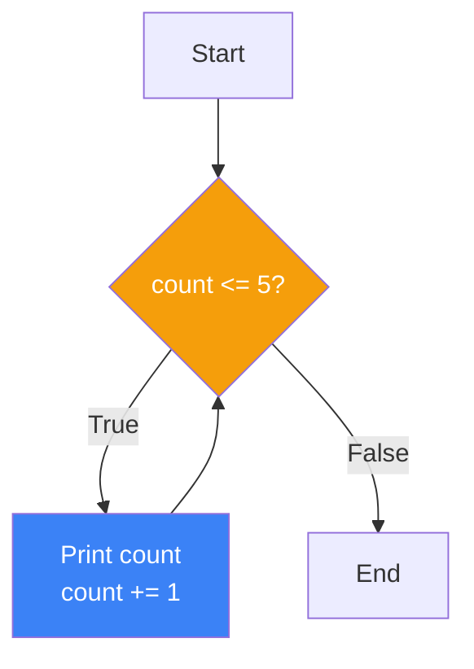
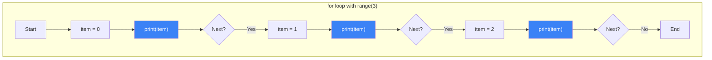
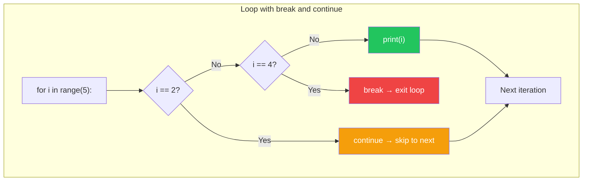
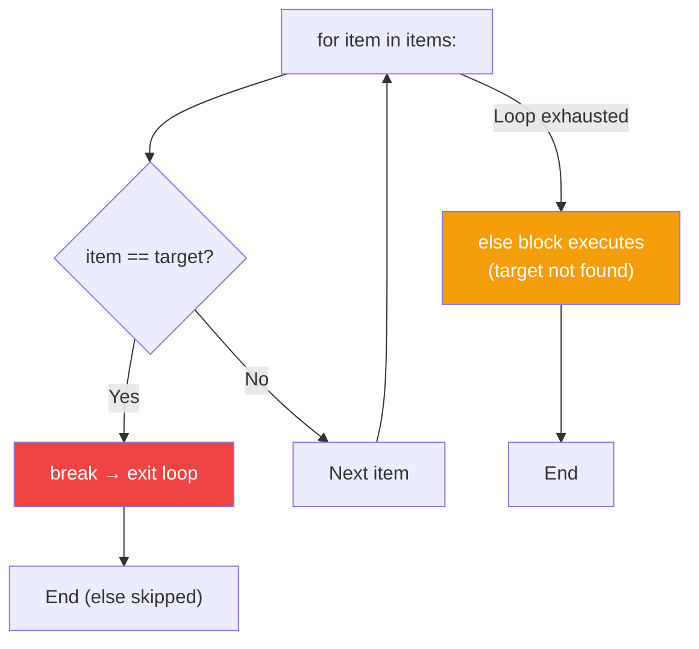

# الفصل صفر-إثنان — Loops and Iterations: إزاي تخلي البرنامج يشتغل بدالك

> **المتطلبات:** [[01-Control-Flow]] — لازم تكون فاهم إزاي تستخدم `if/elif/else`، عوامل المقارنة، والعوامل المنطقية. الفصل ده هيبني فوقهم عشان يوريك إزاي تخلي الكود يتكرر من غير ما تكتبه كذا مرة.

---

## البداية — مشكلة التكرار

تخيّل معايا إنك عايز تطبع الأرقام من 1 لـ 5. الطريقة الساذجة:

```python
print(1)
print(2)
print(3)
print(4)
print(5)
```

ده شغال. بس إيه لو عايز تطبع الأرقام من 1 لـ 1000؟ هتكتب 1000 سطر `print`؟ ده مش عملي.

المشكلة التانية: إنت مش دايمًا عارف كام مرة هتحتاج تكرر العملية. ممكن العدد يعتمد على إدخال المستخدم. هنا بييجي دور **Loops** — هياكل برمجية بتخليك تكرر كود عدد معين من المرات (أو لحد ما شرط معين يتحقق).

النهارده هنتعلم نوعين من الـ loops في Python: `while` (لما تكون مش عارف كام مرة هتكرر) و `for` (لما تكون عارف أو بتتعامل مع مجموعة بيانات).

---

## [[01-While-Loop]] — `while`: كرر طالما الشرط صحيح

### 🧠 الشرح النظري

حلقة `while` بتقول لـ Python: "طالما الشرط ده صحيح (`True`)، استمر في تنفيذ الكود اللي جوايا."

**التركيب:**
```
while الشرط:
    # الكود اللي هيتكرر
```

**إزاي بيشتغل؟**
1. Python بتفحص الشرط.
2. لو الشرط `True` → تنفذ الكود اللي جوا الـ loop.
3. ترجع تفحص الشرط تاني.
4. تستمر كده لحد ما الشرط يبقى `False`.
5. أول ما الشرط يبقى `False`، Python بتخرج من الـ loop وتكمل اللي بعدها.

**خطر التكرار اللانهائي (Infinite Loop):**
لو الشرط فضل `True` للأبد، البرنامج مش هيخلص. لازم تتأكد إن جوا الـ loop فيه حاجة بتغير الشرط عشان يبقى `False` في وقت ما.

تخيّل `while` زي **عداد في مطعم**:
"طالما فيه زباين مستنيين (`waiting_customers > 0`)، استمر في إدخالهم."
كل ما تدخل زبون، العداد بيقل (`waiting_customers -= 1`). لما العداد يوصل لـ 0، الحلقة بتقف.

### 📊 Visualization



### 💻 Micro-Example

```python
count = 1
while count <= 5:
    print(f"Count: {count}")
    count += 1  # Increment — without this, infinite loop!
print("Done!")
```
<details>
<summary><b>📋 مثال إضافي: تخمين رقم</b></summary>

```python
import random

secret = random.randint(1, 10)
guess = 0

while guess != secret:
    guess = int(input("Guess the number (1-10): "))
    if guess < secret:
        print("Too low!")
    elif guess > secret:
        print("Too high!")

print(f"You got it! The number was {secret}.")
```
</details>

---

## [[02-For-Loop-And-Range]] — `for` و `range`: التكرار على مجموعة

### 🧠 الشرح النظري

حلقة `for` بتستخدم لما تكون عايز **تكرر على عناصر مجموعة** (زي list، string، tuple) أو لما تكون عارف **كام مرة** عايز تكرر (باستخدام `range`).

**التركيب:**
```
for متغير in مجموعة:
    # الكود اللي هيتكرر — المتغير بياخد قيمة كل عنصر في المجموعة
```

**`range(start, stop, step)`:**
دي function بتولد سلسلة من الأرقام. مش بترجع list — بترجع `range` object (lazy — بيولد الأرقام وقت الحاجة).
- `range(5)` → `0, 1, 2, 3, 4` (بيبدأ من 0، بيوقف قبل الـ stop).
- `range(2, 6)` → `2, 3, 4, 5`.
- `range(1, 10, 2)` → `1, 3, 5, 7, 9` (step = 2).

**ليه `range` مش بترجع list؟**
عشان لو عايز `range(1000000)`، مش هياخد memory قد ما هياخد `list` فيها مليون رقم. الأرقام بتتولد واحد واحد وقت الحاجة.

تخيّل `for` زي **عامل بيمسح على رفوف مكتبة**:
- **الرف (المجموعة):** `["Python", "Django", "DRF"]`.
- **العامل (`for book in shelf`):** بيمسك كتاب، يعمله حاجة (يقرا عنوانه)، يحطه، ويمسك اللي بعده.
- **`range(5)`:** بيدي العامل 5 كروت مرقمين من 0 لـ 4. العامل بيمسك كارت ويشتغل عليه.

### 📊 Visualization



### 💻 Micro-Example

```python
# Using range to repeat a specific number of times
for i in range(3):
    print(f"Iteration {i}")

# range with start and stop
for num in range(5, 8):
    print(f"Number: {num}")

# range with step
for even in range(0, 10, 2):
    print(f"Even: {even}")

# Looping over a string (strings are iterable!)
for char in "HireLink":
    print(char)
```
<details>
<summary><b>📋 مثال إضافي: حساب المجموع</b></summary>

```python
total = 0
for i in range(1, 6):  # 1, 2, 3, 4, 5
    total += i
    print(f"Added {i}, total is now {total}")

print(f"Final sum: {total}")  # 15
```
</details>

---

## [[03-Break-Continue-Pass]] — التحكم في سريان الـ Loop

### 🧠 الشرح النظري

أحياناً مش عايز الـ loop تكمل للآخر. عايز تخرج منها بدري (`break`)، أو ت skip تكرار معين (`continue`). Python بتقدم 3 أدوات للتحكم ده.

**`break`:**
بيخرج من الـ loop **فوراً** — بغض النظر عن الشرط. مفيد لما تلاقي اللي بتدور عليه ومش محتاج تكمل.

**`continue`:**
بي skip باقي الكود في التكرار **الحالي** وينتقل للتكرار اللي بعده. مفيد لما تكون عايز تتجاهل حالة معينة.

**`pass`:**
ده **placeholder**. بيعمل ولا حاجة. بتستخدمه لما يكون syntax محتاج كود لكن إنت لسه مش عارف هتكتب إيه (أو مش عايز تعمل حاجة).

تخيّل إنك بتدور على كتاب معين في المكتبة:
- **`break`:** لقيت الكتاب. بتوقف التدوير وتخرج من المكتبة. (خرج من الـ loop).
- **`continue`:** لقيت كتاب مبلول. بتسيبه وتكمل تدوير على الرف التالي. (skip التكرار الحالي).
- **`pass`:** واقف قدام رف فاضي. بتعمل "ولا حاجة" وتروح للرف اللي بعده. (مطلوب syntactically لكن functionally مفيش حاجة بتحصل).

### 📊 Visualization



### 💻 Micro-Example

```python
# break: exit loop early
for i in range(10):
    if i == 5:
        print("Found 5, stopping!")
        break
    print(f"Checking: {i}")

# continue: skip current iteration
for i in range(5):
    if i == 2:
        print("Skipping 2...")
        continue
    print(f"Processing: {i}")

# pass: do nothing (placeholder)
for i in range(3):
    if i == 1:
        pass  # TODO: implement later
    print(f"Item: {i}")
```
<details>
<summary><b>📋 مثال إضافي: البحث عن أول رقم سالب</b></summary>

```python
numbers = [10, 5, -3, 8, -1, 7]

for num in numbers:
    if num < 0:
        print(f"First negative number found: {num}")
        break
    print(f"{num} is positive")
else:
    # This else runs only if loop completes without break
    print("No negative numbers found!")
```
</details>

---

## [[04-Loop-Else]] — `else` مع الـ Loops: ميزة Python الفريدة

### 🧠 الشرح النظري

في Python، الـ `else` ممكن يتحط مع `while` أو `for`. لكنه مش `else` بتاع `if`. الـ `else` هنا بتنفذ **بس لو الـ loop خلصت naturally** (من غير `break`).

**الاستخدام الأساسي:**
لما تكون بتدور على حاجة في loop:
- لو لقيتها → `break`.
- لو ملقتهاش → الـ `else` بتنفذ (عشان تعمل fallback).

ده مفيد جداً في الـ searching patterns. بدل ما تستخدم flag variable (`found = False`)، تقدر تستخدم `else` مباشرةً.

تخيّل إنك بتدور على مفاتيحك في الأوضة:
- **`for درج in الأوضة:`** بتبحث في كل درج.
- لو لقيت المفاتيح → `break` (و `else` مش هتتنفذ).
- لو فتشت كل حاجة وملقيتش → `else` بتنفذ: "المفاتيح مش في الأوضة. دور في المطبخ."

### 📊 Visualization



### 💻 Micro-Example

```python
# Search for a number — with else for fallback
numbers = [1, 3, 5, 7, 9]
target = 4

for num in numbers:
    if num == target:
        print(f"Found {target}!")
        break
else:
    print(f"{target} not found in the list.")

# Another example: check if a number is prime
n = 17
for i in range(2, int(n ** 0.5) + 1):
    if n % i == 0:
        print(f"{n} is not prime (divisible by {i})")
        break
else:
    print(f"{n} is prime!")
```
<details>
<summary><b>📋 مثال إضافي: البحث في قائمة مستخدمين</b></summary>

```python
users = ["ahmed", "sara", "omar", "layla"]
search = "khaled"

for user in users:
    if user == search:
        print(f"Welcome back, {search}!")
        break
else:
    print(f"User '{search}' not found. Please register.")
```
</details>

---

## 🛠️ Progressive Exercise 02 — برنامج جدول الضرب

**المهمة:** اكتب برنامج Python يعمل الآتي:
1. يطلب من المستخدم إدخال رقم.
2. يطبع جدول الضرب للرقم ده من 1 لـ 12.
3. يتأكد إن الإدخال رقم صحيح (موجب). لو المستخدم دخل رقم سالب أو 0، يطلب الإدخال تاني.

**متطلبات من PE-00:**
- `input()`, `int()`, f-strings.

**متطلبات من PE-01:**
- `if/elif/else` للتحقق من صحة الرقم.

**متطلبات جديدة من PE-02:**
- `for` loop مع `range`.
- (اختياري) `while` loop للتحقق من الإدخال.

**مثال للتنفيذ المتوقع:**
```
Enter a positive number: -5
Please enter a positive number (greater than 0).
Enter a positive number: 7

Multiplication Table for 7:
7 x 1 = 7
7 x 2 = 14
7 x 3 = 21
7 x 4 = 28
7 x 5 = 35
7 x 6 = 42
7 x 7 = 49
7 x 8 = 56
7 x 9 = 63
7 x 10 = 70
7 x 11 = 77
7 x 12 = 84
```

**🎯 جرب بنفسك:** افتح أي Python environment واكتب الحل. لو اتعطلت، الحل تحت.


<details>
<summary><b>✨ اضغط هنا عشان تشوف الحل</b></summary>

```python
# PE-02: Multiplication Table Generator

# Get valid input using while loop (new concept)
while True:
    num_str = input("Enter a positive number: ")
    num = int(num_str)
    
    if num > 0:
        break  # Valid input — exit the while loop
    else:
        print("Please enter a positive number (greater than 0).")

# Print multiplication table using for loop (new concept)
print(f"\nMultiplication Table for {num}:")
for i in range(1, 13):  # 1 to 12
    result = num * i
    print(f"{num} x {i} = {result}")
```

**نسخة متقدمة مع تنسيق أفضل:**
```python
# Get valid input
while True:
    try:
        num = int(input("Enter a positive number: "))
        if num > 0:
            break
        else:
            print("Please enter a positive number (greater than 0).")
    except ValueError:
        print("Invalid input. Please enter a valid integer.")

# Print formatted table
print(f"\n{'=' * 30}")
print(f"   Multiplication Table for {num}")
print('=' * 30)

for i in range(1, 13):
    print(f"{num:2} x {i:2} = {num * i:3}")
```

**نسخة باستخدام while loop بدل for (للمقارنة):**
```python
# Using while instead of for
i = 1
while i <= 12:
    print(f"{num} x {i} = {num * i}")
    i += 1
```

**Bonus: طباعة جدول الضرب كامل من 1 لـ 10 (Nested Loops — متقدم):**
```python
print("Complete Multiplication Table (1-10):")
print("    ", end="")
for i in range(1, 11):
    print(f"{i:4}", end="")
print("\n" + "-" * 44)

for i in range(1, 11):
    print(f"{i:2} |", end="")
    for j in range(1, 11):
        print(f"{i * j:4}", end="")
    print()
```
</details>

---

## 📝 خلاصة الدرس

- **`while` loop:** تكرر **طالما** الشرط `True`. مفيدة لما تكون مش عارف عدد التكرارات مسبقاً. انتبه من Infinite loops — لازم تعدل الشرط جوا الـ loop.
- **`for` loop:** تكرر على **عناصر مجموعة** (list, string, range). مفيدة لما تكون عارف عدد التكرارات أو بتتعامل مع مجموعة بيانات.
- **`range(start, stop, step)`:** بتولد سلسلة أرقام. Lazy — بتوفر memory. `range(5)` = 0,1,2,3,4.
- **`break`:** تخرج من الـ loop فوراً.
- **`continue`:** ت skip باقي التكرار الحالي وتنتقل للتالي.
- **`pass`:** placeholder — بتعمل ولا حاجة. مفيد للـ syntax لما تكون مش جاهز تكتب الكود.
- **`else` مع loops:** ميزة فريدة في Python. الكود اللي جوا `else` بيتنفذ **بس لو الـ loop خلصت من غير `break`**. مثالي للـ search operations.

---

*Next → [[03-Lists-And-Tuples]] — عرفنا إزاي نكرر الكود. دلوقتي هنتعلم إزاي نخزن **مجموعات** من البيانات: Lists (قابلة للتغيير) و Tuples (ثابتة). وهنحل PE-03: برنامج عربة التسوق.*