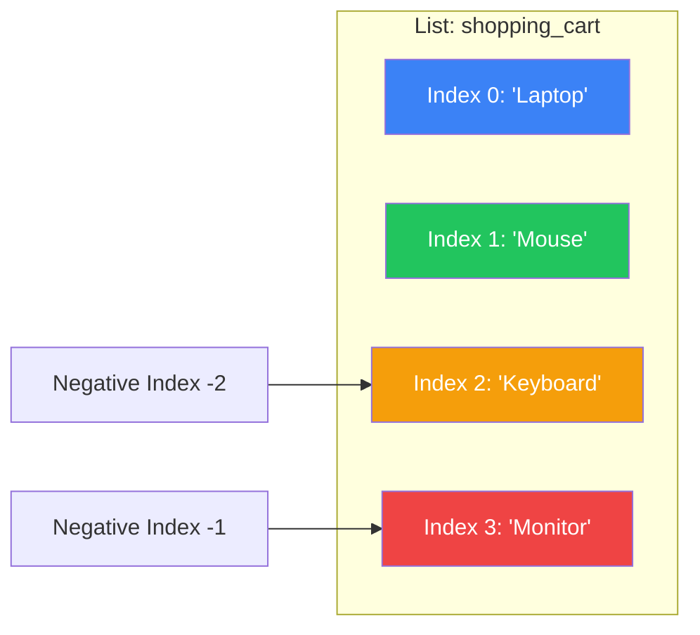
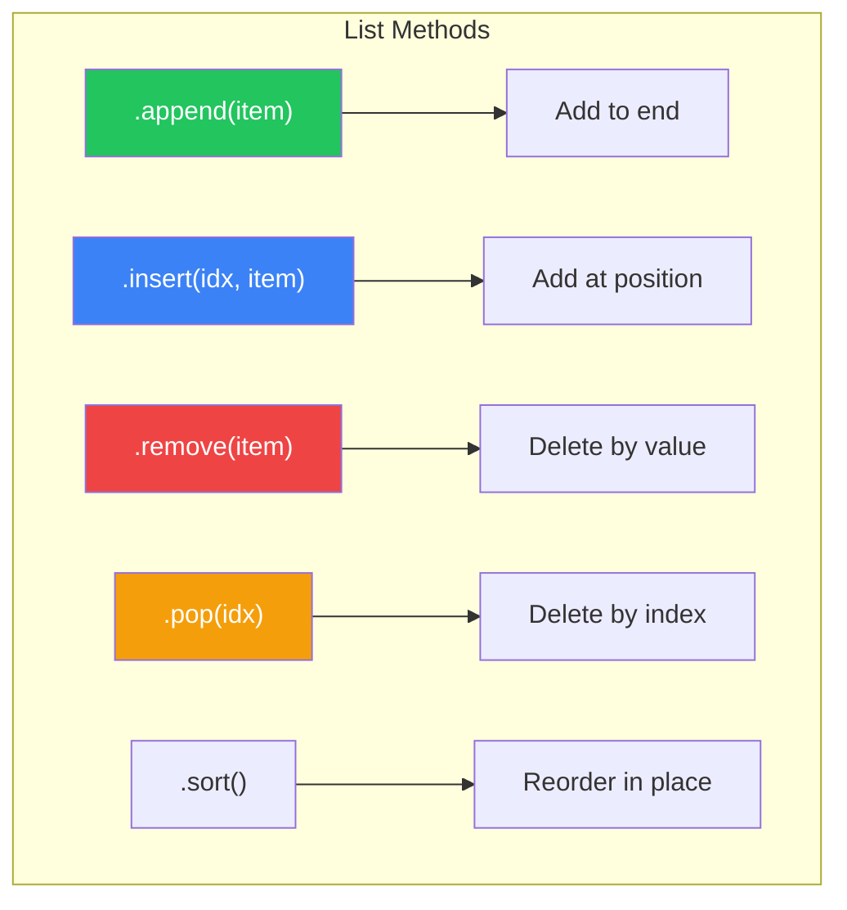
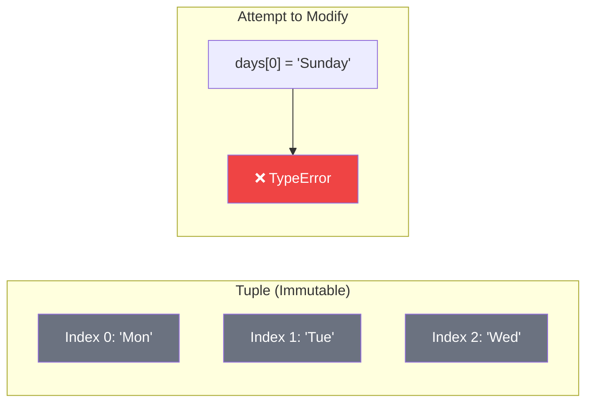
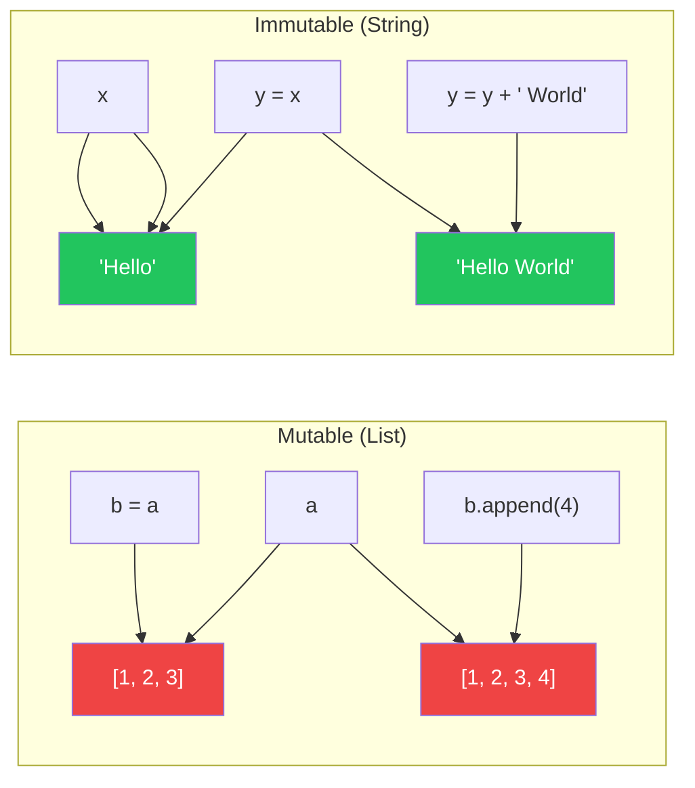

# الفصل صفر-ثلاثة — Lists و Tuples: أول خطوة في عالم تجميع البيانات

> **المتطلبات:** [[02-Loops-And-Iterations]] — لازم تكون فاهم إزاي تستخدم `for` و `while` loops، وعارف `range`، و `break`/`continue`. الفصل ده هيبني فوقهم عشان يوريك إزاي تخزن وتتعامل مع **مجموعات** من البيانات.

---

## البداية — مشكلة المتغيرات الكتير

تخيّل معايا إنك بتبني برنامج عربة تسوق لـ HireLink. عايز تخزن المنتجات اللي المستخدم اختارها. الطريقة الساذجة:

```python
product1 = "Laptop"
product2 = "Mouse"
product3 = "Keyboard"
product4 = "Monitor"
```

المشاكل:
1. إيه لو المستخدم اختار 100 منتج؟ هتعمل 100 متغير؟
2. إزاي تعرف كام منتج في العربة؟ تعد المتغيرات يدوي؟
3. إزاي تضيف منتج جديد؟ تعمل متغير جديد `product5`؟
4. إزاي تشيل منتج من النص؟ هتحتاج تعيد ترتيب كل المتغيرات.

الحل: **Data Structures** — طرق لتخزين مجموعة من القيم في متغير واحد. النهارده هنتعلم أول وأهم Data Structure في Python: **List** (القائمة). وهنتعرف على ابن عمها الثابت: **Tuple**.

---

## [[01-Lists-Basics]] — الـ List: صندوق متعدد الأدراج

### 🧠 الشرح النظري

الـ List في Python هي مجموعة **مرتبة** من العناصر. تقدر تحط فيها أي حاجة: أرقام، نصوص، حتى Lists تانية. أهم خاصية: الـ List **Mutable** — تقدر تغيرها (تضيف، تشيل، تعدل) بعد ما تنشئها.

**الخصائص الأساسية:**
- **مرتبة (Ordered):** العناصر بتحتفظ بترتيب إضافتها. أول عنصر في المكان رقم 0، تاني عنصر في المكان رقم 1، وهكذا.
- **قابلة للتغيير (Mutable):** تقدر تغير العناصر اللي جواها من غير ما تعمل List جديدة.
- **بتقبل تكرار:** نفس القيمة ممكن تظهر أكتر من مرة.
- **بتقبل أي نوع بيانات:** `[1, "Hello", 3.14, True]`.

**الـ Indexing (الفهرسة):**
كل عنصر في الـ List ليه **رقم** (index) بيبدأ من **0**. أول عنصر `my_list[0]`، تاني عنصر `my_list[1]`. تقدر تستخدم **negative indexing** عشان تبدأ من الآخر: آخر عنصر `my_list[-1]`، قبل الأخير `my_list[-2]`.

**الـ Slicing (التقطيع):**
تقدر تاخد جزء من الـ List باستخدام `[start:end:step]`. `my_list[1:4]` بيرجع العناصر من index 1 لحد (قبل) index 4. `my_list[::2]` بيرجع كل تاني عنصر.

تخيّل الـ List زي **قطار بضائع**:
- **القاطرة:** اسم الـ List (`shopping_cart`).
- **العربيات:** العناصر اللي جوا الـ List. كل عربية ليها رقم (index).
- **الترتيب مهم:** عربية الماوس ورا عربية اللابتوب. لو شلت عربية من النص، باقي العربيات بتتقرب لبعض.
- **تقدر تعدل:** تقدر تفرغ عربية وتحط فيها حاجة تانية.

### 📊 Visualization



### 💻 Micro-Example

```python
shopping_cart = ["Laptop", "Mouse", "Keyboard", "Monitor"]

# Indexing
print(shopping_cart[0])      # Laptop (first item)
print(shopping_cart[2])      # Keyboard (third item)
print(shopping_cart[-1])     # Monitor (last item)
print(shopping_cart[-2])     # Keyboard (second to last)

# Slicing
print(shopping_cart[1:3])    # ['Mouse', 'Keyboard'] (index 1 to 2)
print(shopping_cart[:2])     # ['Laptop', 'Mouse'] (from start to index 1)
print(shopping_cart[2:])     # ['Keyboard', 'Monitor'] (from index 2 to end)
print(shopping_cart[::2])    # ['Laptop', 'Keyboard'] (every 2nd item)
```
<details>
<summary><b>📋 مثال إضافي: Lists داخل List (Nested Lists)</b></summary>

```python
matrix = [
    [1, 2, 3],
    [4, 5, 6],
    [7, 8, 9]
]

print(matrix[0])        # [1, 2, 3] (first row)
print(matrix[1][2])     # 6 (second row, third column)
print(matrix[-1][-1])   # 9 (last row, last column)
```
</details>

---

## [[02-List-Methods]] — عمليات الـ List: إضافة، حذف، تعديل

### 🧠 الشرح النظري

الـ List في Python بتيجي مع مجموعة من الـ methods الجاهزة اللي بتخليك تتحكم فيها بسهولة. دول أهمهم:

**الإضافة:**
- **`.append(item)`:** تضيف عنصر **في نهاية** الـ List.
- **`.insert(index, item)`:** تضيف عنصر في **مكان محدد** (index).
- **`.extend(iterable)`:** تضيف **كل عناصر** List تانية لنهاية الـ List الأصلية.

**الحذف:**
- **`.remove(item)`:** تشيل **أول ظهور** للعنصر. لو مش موجود، بتطلع error.
- **`.pop(index)`:** تشيل العنصر اللي في المكان ده و**ترجعه**. لو محددتش index، بتشيل آخر عنصر.
- **`.clear()`:** تفضي الـ List بالكامل.

**التعديل والبحث:**
- **تعديل مباشر:** `my_list[index] = new_value`.
- **`.index(item)`:** ترجع الـ index بتاع **أول ظهور** للعنصر.
- **`.count(item)`:** ترجع كام مرة العنصر ظهر في الـ List.
- **`.sort()`:** ترتب الـ List في مكانها (بتعدل الـ List الأصلية).
- **`.reverse()`:** تعكس ترتيب الـ List في مكانها.

**دوال مفيدة:**
- **`len(my_list)`:** ترجع عدد العناصر.
- **`item in my_list`:** بيرجع `True` لو العنصر موجود.

تخيّل إن الـ List زي **أجندة تليفونات**:
- **`.append()`:** تضيف اسم في آخر صفحة.
- **`.insert(2, "Ahmed")`:** تفتح الأجندة وتضيف "Ahmed" في الصفحة رقم 2 (وتزحلق باقي الأسماء).
- **`.remove("Sara")`:** تشطب على اسم "Sara" (أول واحدة تلاقيها).
- **`.pop(0)`:** تقطع أول صفحة من الأجندة.
- **`len(contacts)`:** تعد كام اسم في الأجندة.

### 📊 Visualization



### 💻 Micro-Example

```python
fruits = ["apple", "banana"]
print(f"Original: {fruits}")

# Adding
fruits.append("orange")
print(f"After append: {fruits}")

fruits.insert(1, "grape")
print(f"After insert at index 1: {fruits}")

fruits.extend(["kiwi", "mango"])
print(f"After extend: {fruits}")

# Removing
fruits.remove("banana")
print(f"After remove 'banana': {fruits}")

popped = fruits.pop(2)
print(f"Popped index 2 ('{popped}'): {fruits}")

# Searching
print(f"Index of 'kiwi': {fruits.index('kiwi')}")
print(f"Count of 'apple': {fruits.count('apple')}")

# Ordering
fruits.sort()
print(f"Sorted: {fruits}")

fruits.reverse()
print(f"Reversed: {fruits}")

# Utility
print(f"Length: {len(fruits)}")
print(f"Is 'mango' in fruits? {'mango' in fruits}")
```
<details>
<summary><b>📋 مثال إضافي: إدارة قائمة مهام</b></summary>

```python
tasks = ["Write report", "Check emails"]

# Add tasks
tasks.append("Meeting at 2pm")
tasks.insert(0, "Daily standup")  # Add to beginning

print("Today's tasks:")
for i, task in enumerate(tasks, 1):
    print(f"{i}. {task}")

# Complete and remove first task
completed = tasks.pop(0)
print(f"\nCompleted: {completed}")
print(f"Remaining tasks: {tasks}")

# Check if task exists
if "Check emails" in tasks:
    tasks.remove("Check emails")
    print("Email checked and removed!")
```
</details>

---

## [[03-Tuples]] — الـ Tuple: القائمة الثابتة

### 🧠 الشرح النظري

الـ Tuple هي ابن عم الـ List — لكنها **Immutable** (غير قابلة للتغيير). بعد ما تنشئها، متقدرش تغير العناصر اللي جواها، تضيف، أو تشيل.

**الخصائص:**
- **مرتبة (Ordered):** زي الـ List، العناصر بتحتفظ بترتيبها.
- **ثابتة (Immutable):** متقدرش تعدلها بعد الإنشاء.
- **بتقبل تكرار:** نفس القيمة ممكن تظهر أكتر من مرة.
- **أسرع من List:** لأن Python عارفة إنها مش هتتغير، بتقدر تخزنها بشكل أكفأ.

**ليه نستخدم Tuple؟**
1. **حماية البيانات:** لما تكون عايز تتأكد إن مجموعة القيم متتغيرش (زي أيام الأسبوع، إحداثيات نقطة).
2. **Dictionary Keys:** الـ Lists مش ينفع يبقوا keys في dict. Tuples ينفع.
3. **أداء أفضل:** أسرع شوية من Lists في بعض العمليات.

**إنشاء Tuple:**
- `my_tuple = (1, 2, 3)`
- `single_item_tuple = (42,)` — **اللازمة مهمة!** `(42)` ده رقم مش Tuple.
- `empty_tuple = ()`

**Tuple Unpacking:**
تقدر تفك عناصر الـ Tuple في متغيرات منفصلة: `x, y, z = (10, 20, 30)`.

تخيّل Tuple زي **علبة أدوات مختومة**:
- **List:** صندوق خشب تقدر تفتحه وتغير اللي جواه.
- **Tuple:** علبة بلاستيك مقفولة — اللي جواها ثابت. تقدر تشوفه وتستخدمه، لكن متقدرش تغيره.

### 📊 Visualization



### 💻 Micro-Example

```python
coordinates = (10, 20)
print(f"X: {coordinates[0]}, Y: {coordinates[1]}")

# Tuple unpacking
x, y = coordinates
print(f"Unpacked: x={x}, y={y}")

# This would raise an error (uncomment to see):
# coordinates[0] = 30  # TypeError: 'tuple' object does not support item assignment

# Single-item tuple (comma is crucial!)
single = (42,)
print(f"Type of (42,): {type(single)}")
print(f"Type of (42): {type(42)}")  # This is an int!

# Tuple as dictionary key (lists can't be used)
locations = {
    (30.0444, 31.2357): "Cairo",
    (31.2001, 29.9187): "Alexandria",
}
print(f"City at (30.0444, 31.2357): {locations[(30.0444, 31.2357)]}")

# Returning multiple values from a function (actually a tuple)
def get_min_max(numbers):
    return min(numbers), max(numbers)

result = get_min_max([5, 2, 8, 1, 9])
print(f"Result tuple: {result}")  # (1, 9)
min_val, max_val = result  # Unpack
print(f"Min: {min_val}, Max: {max_val}")
```
<details>
<summary><b>📋 مثال إضافي: تحويل بين List و Tuple</b></summary>

```python
# List to Tuple
shopping_list = ["milk", "bread", "eggs"]
shopping_tuple = tuple(shopping_list)
print(f"Tuple: {shopping_tuple}")

# Tuple to List
days_tuple = ("Mon", "Tue", "Wed", "Thu", "Fri")
days_list = list(days_tuple)
days_list.append("Sat")  # Now we can modify!
days_list.append("Sun")
print(f"Modified list: {days_list}")

# Back to tuple
week_tuple = tuple(days_list)
print(f"Full week: {week_tuple}")
```
</details>

---

## [[04-Mutable-vs-Immutable]] — الفرق الجوهري: ليه القصة مهمة؟

### 🧠 الشرح النظري

الفرق بين Mutable (قابل للتغيير) و Immutable (ثابت) هو من أهم المفاهيم في Python. فهمه هيفسرلك Bugs كتير هتقابلك.

**Mutable Objects (List, Dict, Set):**
لما تعدل في الـ object، انت بتعدل في **نفس المكان في الذاكرة**. أي متغيرات تانية بتشاور على نفس الـ object هتشوف التغيير.

**Immutable Objects (int, str, tuple):**
لما "تغير" قيمة، Python في الحقيقة **بتخلق object جديد** في مكان جديد في الذاكرة. الـ object القديم بيفضل كما هو.

**المشكلة الشهيرة:**
```python
a = [1, 2, 3]
b = a           # b points to the SAME list
b.append(4)
print(a)        # [1, 2, 3, 4] — a changed too!
```

**مع Immutable:**
```python
x = "Hello"
y = x           # y points to "Hello"
y = y + " World"  # Creates NEW string "Hello World"
print(x)        # "Hello" — unchanged!
```

تخيّل الموضوع زي **نسخة من ورقة**:
- **Mutable:** انت وصاحبك ماسكين نفس الورقة. لو صاحبك كتب عليها حاجة، إنت هتشوفها.
- **Immutable:** انت وصاحبك ماسكين نسختين منفصلتين. لو صاحبك كتب على نسخته، نسختك متتأثرش.

### 📊 Visualization



### 💻 Micro-Example

```python
# Mutable — List
print("Mutable (List):")
a = [1, 2, 3]
b = a
print(f"Before: a={a}, b={b}")
b.append(4)
print(f"After b.append(4): a={a}, b={b}")  # Both changed!
print(f"Same object? {a is b}")  # True

print("\nImmutable (String):")
x = "Hello"
y = x
print(f"Before: x={x}, y={y}")
y = y + " World"
print(f"After y = y + ' World': x={x}, y={y}")  # x unchanged!
print(f"Same object? {x is y}")  # False
```
<details>
<summary><b>📋 مثال إضافي: تمرير List لـ Function</b></summary>

```python
def add_item(lst, item):
    lst.append(item)
    print(f"Inside function: {lst}")

my_list = [1, 2, 3]
print(f"Before function: {my_list}")
add_item(my_list, 4)
print(f"After function: {my_list}")  # Changed! List is mutable

def modify_string(s):
    s = s + " World"  # Creates new string
    print(f"Inside function: {s}")

my_string = "Hello"
print(f"\nBefore function: {my_string}")
modify_string(my_string)
print(f"After function: {my_string}")  # Unchanged! String is immutable
```
</details>

---

## 🛠️ Progressive Exercise 03 — برنامج عربة التسوق

**المهمة:** اكتب برنامج Python يحاكي عربة تسوق بسيطة. البرنامج يقدم للمستخدم قائمة خيارات:
1. إضافة منتج
2. إزالة منتج
3. عرض العربة
4. حساب المجموع (أسعار وهمية)
5. خروج

**متطلبات من PE-00:**
- `input()`, f-strings.

**متطلبات من PE-01:**
- `if/elif/else` للتحكم في القائمة.

**متطلبات من PE-02:**
- `while` loop للاستمرار في عرض القائمة.
- `for` loop لعرض محتويات العربة.

**متطلبات جديدة من PE-03:**
- استخدام List لتخزين المنتجات.
- استخدام List methods (`.append()`, `.remove()`).

**مثال للتنفيذ المتوقع:**
```
=== Shopping Cart Menu ===
1. Add item
2. Remove item
3. View cart
4. Calculate total (demo prices)
5. Exit
Choose an option (1-5): 1
Enter item name: Laptop
'Laptop' added to cart.

Choose an option (1-5): 1
Enter item name: Mouse
'Mouse' added to cart.

Choose an option (1-5): 3
Your cart contains:
1. Laptop
2. Mouse

Choose an option (1-5): 2
Enter item name to remove: Keyboard
'Keyboard' not found in cart.

Choose an option (1-5): 4
Total price: $850 (Laptop: $800, Mouse: $50)

Choose an option (1-5): 5
Thank you for shopping!
```

**🎯 جرب بنفسك:** افتح أي Python environment واكتب الحل. لو اتعطلت، الحل تحت.


<details>
<summary><b>✨ اضغط هنا عشان تشوف الحل</b></summary>

```python
# PE-03: Shopping Cart Program

cart = []  # Initialize empty list (PE-03 concept)

# Demo prices dictionary
prices = {
    "laptop": 800,
    "mouse": 25,
    "keyboard": 50,
    "monitor": 300,
    "headphones": 100,
}

while True:  # PE-02 concept
    print("\n=== Shopping Cart Menu ===")
    print("1. Add item")
    print("2. Remove item")
    print("3. View cart")
    print("4. Calculate total (demo prices)")
    print("5. Exit")
    
    choice = input("Choose an option (1-5): ")  # PE-00 concept
    
    if choice == "1":  # PE-01 concept
        item = input("Enter item name: ")
        cart.append(item)  # PE-03 concept
        print(f"'{item}' added to cart.")
        
    elif choice == "2":
        item = input("Enter item name to remove: ")
        if item in cart:  # PE-03 concept
            cart.remove(item)
            print(f"'{item}' removed from cart.")
        else:
            print(f"'{item}' not found in cart.")
            
    elif choice == "3":
        if cart:
            print("\nYour cart contains:")
            for i, item in enumerate(cart, 1):  # PE-02 concept
                print(f"{i}. {item}")
        else:
            print("\nYour cart is empty.")
            
    elif choice == "4":
        if not cart:
            print("Cart is empty. Total: $0")
        else:
            total = 0
            print("\nPrice breakdown:")
            for item in cart:  # PE-02 concept
                # Use lower() for case-insensitive lookup
                price = prices.get(item.lower(), 50)  # Default $50 if not in prices
                total += price
                print(f"  {item}: ${price}")
            print(f"\nTotal price: ${total}")
            
    elif choice == "5":
        print("Thank you for shopping!")
        break  # PE-02 concept
        
    else:
        print("Invalid option. Please choose 1-5.")
```

**نسخة متقدمة مع تخزين الكمية والسعر:**
```python
cart = []  # Each item will be a dict: {"name": str, "qty": int, "price": float}

while True:
    print("\n=== Advanced Shopping Cart ===")
    print("1. Add item")
    print("2. Remove item")
    print("3. View cart")
    print("4. Checkout")
    
    choice = input("Choose an option: ")
    
    if choice == "1":
        name = input("Item name: ")
        qty = int(input("Quantity: "))
        price = float(input("Price per item: "))
        cart.append({"name": name, "qty": qty, "price": price})
        print(f"Added {qty}x {name} at ${price} each.")
        
    elif choice == "2":
        name = input("Item name to remove: ")
        for item in cart:
            if item["name"].lower() == name.lower():
                cart.remove(item)
                print(f"Removed {name} from cart.")
                break
        else:
            print(f"{name} not found.")
            
    elif choice == "3":
        if not cart:
            print("Cart is empty.")
        else:
            total = 0
            print("\nYour Cart:")
            for i, item in enumerate(cart, 1):
                subtotal = item["qty"] * item["price"]
                total += subtotal
                print(f"{i}. {item['qty']}x {item['name']} @ ${item['price']} = ${subtotal}")
            print(f"\nTotal: ${total:.2f}")
            
    elif choice == "4":
        if not cart:
            print("Cart is empty. Goodbye!")
        else:
            total = sum(item["qty"] * item["price"] for item in cart)
            print(f"\nTotal amount: ${total:.2f}")
            print("Thank you for your purchase!")
        break
```

**نسخة باستخدام Tuple للعناصر (للمقارنة):**
```python
# Using tuple for items that shouldn't change (catalog)
catalog = (
    ("laptop", 800),
    ("mouse", 25),
    ("keyboard", 50),
    ("monitor", 300),
)

print("Available items:")
for name, price in catalog:  # Tuple unpacking in loop
    print(f"  {name}: ${price}")
```
</details>

---

## 📝 خلاصة الدرس

- **List:** مجموعة **مرتبة** و **قابلة للتغيير** (Mutable). بتستخدم `[]`. بتدعم indexing (`[0]`)، slicing (`[1:3]`)، و methods زي `.append()`, `.remove()`, `.pop()`.
- **List Methods:** `.append(item)` تضيف في الآخر، `.insert(idx, item)` تضيف في مكان محدد، `.remove(item)` تشيل أول ظهور، `.pop(idx)` تشيل وترجع العنصر، `.sort()` ترتب.
- **Tuple:** مجموعة **مرتبة** و **ثابتة** (Immutable). بتستخدم `()`. أسرع من List، وتنفع كـ dictionary keys. مهمة الـ comma: `(42,)` Tuple، `(42)` int.
- **Mutable vs Immutable:** Mutable objects (List) بتتعدل في نفس المكان — أي reference تاني بيشوف التغيير. Immutable objects (str, tuple) بتخلق object جديد عند التعديل — الـ references القديمة مش بتتأثر.
- **الـ `in` operator:** `item in my_list` بيرجع `True` لو العنصر موجود. `len(my_list)` ترجع عدد العناصر.

---

*Next → [[04-Dictionaries-And-Sets]] — عرفنا إزاي نخزن مجموعات مرتبة. دلوقتي هنتعلم إزاي نخزن بيانات بـ **مفاتيح** (Dictionaries) — زي دليل التليفونات. وإزاي نتعامل مع مجموعات **فريدة** من العناصر (Sets). وهنحل PE-04: برنامج دليل التليفونات.*