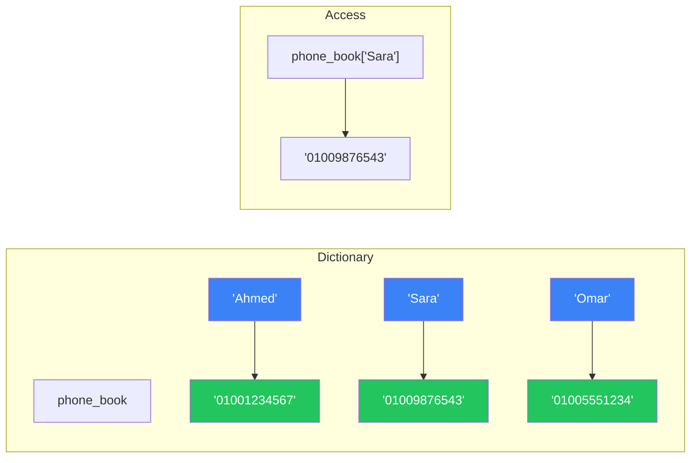
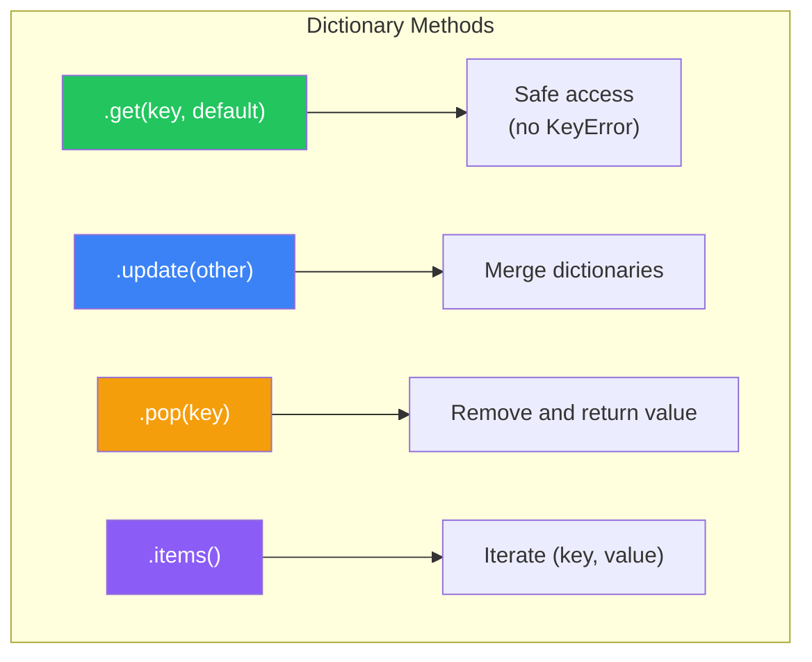
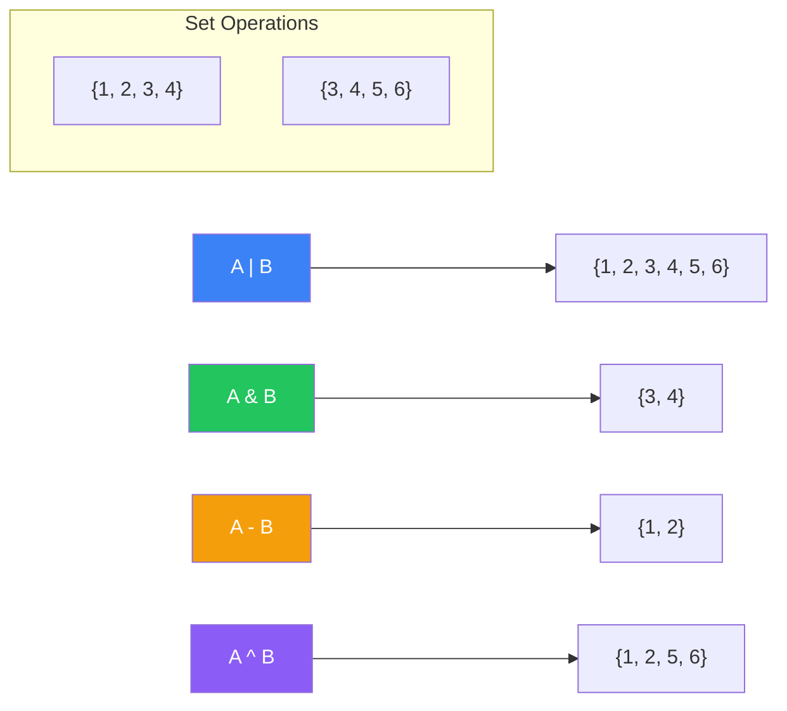
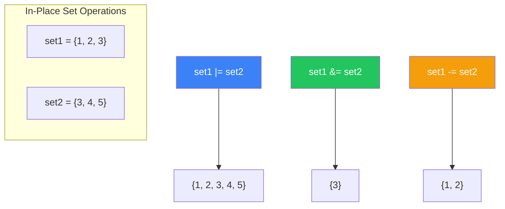
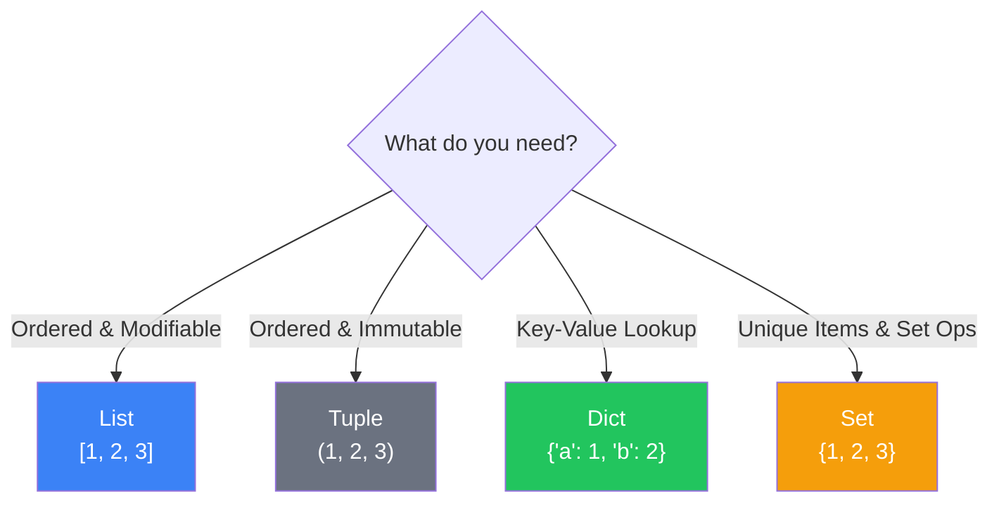

# الفصل صفر-أربعة — Dictionaries و Sets: البيانات الغير مرتبة والقوية

> **المتطلبات:** [[03-Lists-And-Tuples]] — لازم تكون فاهم إزاي تتعامل مع Lists (إضافة، حذف، فهرسة) و Tuples (الثوابت). الفصل ده هيقدملك أقوى Data Structures في Python: **Dictionary** (تخزين بالمفاتيح) و **Set** (العناصر الفريدة).

---

## البداية — مشكلة البحث في Lists

تخيّل معايا إنك بنيت برنامج عربة التسوق (PE-03) وعايز تعرف سعر المنتج. لو عندك List:
```python
products = ["Laptop", "Mouse", "Keyboard"]
prices = [800, 25, 50]
```
عشان تعرف سعر الـ Mouse، هتحتاج:
1. تدور على index الـ Mouse في `products` (`products.index("Mouse")`).
2. تستخدم الـ index ده عشان تجيب السعر من `prices` (`prices[1]`).

ده **بطيء** و **عرضة للأخطاء**. إيه لو الـ Lists مش مترتبين بنفس الترتيب؟ إيه لو عايز تدور على منتج بسرعة من غير ما تلف على الـ List كلها؟

الحل: **Dictionary** — بتخزن البيانات كـ **أزواج (مفتاح: قيمة)**. بدل ما تلف على List، بتقول للـ dictionary: "هات القيمة بتاعة المفتاح `Mouse`". Python بتروح **مباشرةً** للمكان اللي فيه البيانات. أسرع بكتير.

النهارده كمان هنتعلم **Set** — مجموعة بتخزن **عناصر فريدة فقط** (من غير تكرار). مثالية لشيل التكرارات وعمل عمليات زي الاتحاد والتقاطع.

---

## [[01-Dictionaries-Basics]] — الـ Dictionary: دليل التليفونات بتاع Python

### 🧠 الشرح النظري

الـ Dictionary (أو `dict`) هو مجموعة من **أزواج (مفتاح: قيمة)**. بدل ما توصل للعناصر بـ index (زي List)، بتوصل ليها بـ **مفتاح** (key). المفتاح لازم يكون **Immutable** (نص، رقم، tuple). القيمة ممكن تكون أي حاجة.

**الخصائص الأساسية:**
- **غير مرتبة (Unordered):** في الإصدارات القديمة (< 3.7). من Python 3.7، الـ dict بتحتفظ بترتيب الإضافة (Insertion Order).
- **قابلة للتغيير (Mutable):** تقدر تغير القيم، تضيف أزواج جديدة، تشيل أزواج.
- **المفاتيح فريدة:** مفيش مفتاحين متطابقين. لو ضفت مفتاح موجود، القيمة القديمة هتتكتب.
- **المفاتيح لازم تكون Immutable:** `str`, `int`, `float`, `tuple` — مش List أو Dict.

**ليه الـ Dict سريعة؟**
الـ Dict مبنية على **Hash Table**. Python بتحول المفتاح لـ hash (رقم) وتستخدمه عشان تعرف **بالظبط** فين القيمة في الذاكرة. العملية بتاخد وقت ثابت O(1) — مش بتعتمد على حجم الـ dict.

تخيّل الـ Dict زي **دليل تليفونات**:
- **المفتاح (Key):** اسم الشخص.
- **القيمة (Value):** رقم التليفون.
- بدل ما تلف على كل الصفحات (زي List)، بتفتح على حرف الألف، وبعدين تدور على "أحمد" — بتوصل بسرعة.

### 📊 Visualization



### 💻 Micro-Example

```python
phone_book = {
    "Ahmed": "01001234567",
    "Sara": "01009876543",
    "Omar": "01005551234",
}

print(phone_book["Sara"])        # 01009876543
print(phone_book.get("Khaled", "Not found"))  # Not found (safe access)

phone_book["Layla"] = "01007778888"  # Add new entry
phone_book["Ahmed"] = "01009999999"  # Update existing

print(phone_book)
```
<details>
<summary><b>📋 مثال إضافي: قاموس متعدد الأنواع</b></summary>

```python
user_profile = {
    "name": "Ahmed Hassan",
    "age": 28,
    "skills": ["Python", "Django", "DRF"],
    "is_active": True,
    "contact": {
        "email": "ahmed@example.com",
        "phone": "01001234567"
    }
}

print(user_profile["name"])
print(user_profile["skills"][1])  # Django
print(user_profile["contact"]["email"])  # Nested dict access
```
</details>

---

## [[02-Dictionary-Methods]] — عمليات الـ Dict: التحكم في المفاتيح والقيم

### 🧠 الشرح النظري

الـ Dict بتيجي مع مجموعة طرق جاهزة بتخلي التعامل معاها سهل جداً.

**الوصول الآمن:**
- **`.get(key, default)`:** ترجع القيمة بتاعة المفتاح. لو المفتاح مش موجود، ترجع `default` (بدل ما ترمي `KeyError`).

**الإضافة والتحديث:**
- **`dict[key] = value`:** تضيف أو تحدث مفتاح.
- **`.update(other_dict)`:** تدمج Dict تانية في الـ Dict الحالية (تضيف مفاتيح جديدة، تحدث الموجودة).

**الحذف:**
- **`del dict[key]`:** تشيل المفتاح وقيمته.
- **`.pop(key, default)`:** تشيل المفتاح و**ترجع قيمته**. لو مش موجود، ترجع `default` أو ترمي `KeyError`.
- **`.popitem()`:** تشيل وترجع **آخر** زوج (مفيد في LIFO).
- **`.clear()`:** تفضي الـ Dict.

**التكرار (Iteration):**
- **`.keys()`:** ترجع View لكل المفاتيح.
- **`.values()`:** ترجع View لكل القيم.
- **`.items()`:** ترجع View لكل الأزواج `(key, value)`. الأكثر استخداماً.

**دوال مفيدة:**
- **`len(dict)`:** عدد الأزواج.
- **`key in dict`:** بيرجع `True` لو المفتاح موجود.

تخيّل إن الـ Dict زي **أجندة تليفونات إلكترونية**:
- **`.get("Sara", "مش موجود")`:** بتدور على Sara بأمان. لو مش موجودة، بتقول "مش موجودة".
- **`.update(new_contacts)`:** بتنسخ كل الأسماء من أجندة تانية لأجندتك.
- **`.pop("Ahmed")`:** بتشيل أحمد من الأجندة وبتاخد رقمه معاك (عشان تحطه في أجندة تانية مثلاً).
- **`.items()`:** بتمر على كل الأسماء والأرقام واحد واحد.

### 📊 Visualization



### 💻 Micro-Example

```python
inventory = {"apple": 5, "banana": 3}
print(f"Initial: {inventory}")

# Safe access
print(inventory.get("orange", 0))  # 0 (not present)

# Update
inventory.update({"orange": 4, "banana": 6})
print(f"After update: {inventory}")

# Remove
banana_count = inventory.pop("banana")
print(f"Removed bananacount: {banana_count}")
print(f"After pop: {inventory}")

# Iterate
print("\nCurrent inventory:")
for fruit, quantity in inventory.items():
    print(f"  {fruit}: {quantity}")

# Check existence
if "apple" in inventory:
    print("\nWe have apples!")
```
<details>
<summary><b>📋 مثال إضافي: عد الكلمات في نص</b></summary>

```python
text = "apple banana apple orange banana apple"
word_count = {}

for word in text.split():
    word_count[word] = word_count.get(word, 0) + 1

print("Word frequencies:")
for word, count in word_count.items():
    print(f"  {word}: {count}")
# Output:
#   apple: 3
#   banana: 2
#   orange: 1
```
</details>

---

## [[03-Sets-Basics]] — الـ Set: مجموعة العناصر الفريدة

### 🧠 الشرح النظري

الـ Set هي مجموعة من **العناصر الفريدة** (مفيش تكرار). هي **غير مرتبة** (مفيش indexing) و **قابلة للتغيير** (تقدر تضيف وتشيل).

**الخصائص الأساسية:**
- **عناصر فريدة:** أي عنصر مكرر بيتم تجاهله تلقائياً.
- **غير مرتبة (Unordered):** مفيش ترتيب مضمون (متقدرش تعمل `my_set[0]`).
- **قابلة للتغيير (Mutable):** تقدر تضيف وتشيل عناصر.
- **العناصر لازم تكون Immutable:** `str`, `int`, `float`, `tuple` — مش List أو Dict.

**عمليات المجموعات الرياضية:**
الـ Set بتدعم العمليات الرياضية بشكل أصلي:
- **اتحاد (Union):** `set1 | set2` أو `set1.union(set2)` — كل العناصر من المجموعتين.
- **تقاطع (Intersection):** `set1 & set2` — العناصر الموجودة في الاتنين.
- **فرق (Difference):** `set1 - set2` — العناصر في set1 ومش في set2.
- **فرق متماثل (Symmetric Difference):** `set1 ^ set2` — العناصر في واحدة بس (مش في الاتنين).

**ليه نستخدم Set؟**
- شيل التكرارات من List بسرعة: `unique_items = list(set(duplicate_list))`.
- اختبار العضوية سريع جداً: `item in my_set` (O(1) زي الـ Dict).
- عمليات رياضية بين مجموعات.

تخيّل الـ Set زي **كيس فيه كرات ملونة**:
- مينفعش يكون فيه كرتين بنفس اللون (عناصر فريدة).
- الكرات مش مترتبة — مش هتعرف تجيب "تاني كرة" (غير مرتبة).
- تقدر تضيف كرة جديدة (`add`)، تشيل كرة (`remove`).
- تقدر تشوف إيه الألوان المشتركة بين كيسين (`&`).

### 📊 Visualization



### 💻 Micro-Example

```python
fruits = {"apple", "banana", "orange"}
print(f"Original set: {fruits}")

fruits.add("grape")      # Add single
fruits.add("apple")      # Duplicate — ignored!
print(f"After add: {fruits}")

fruits.remove("banana")  # Remove (raises error if not found)
fruits.discard("kiwi")   # Remove (no error if not found)
print(f"After remove: {fruits}")

# Set operations
set_a = {1, 2, 3, 4}
set_b = {3, 4, 5, 6}

print(f"Union: {set_a | set_b}")           # {1, 2, 3, 4, 5, 6}
print(f"Intersection: {set_a & set_b}")    # {3, 4}
print(f"Difference: {set_a - set_b}")      # {1, 2}
print(f"Symmetric Diff: {set_a ^ set_b}")  # {1, 2, 5, 6}
```
<details>
<summary><b>📋 مثال إضافي: إزالة التكرارات من List</b></summary>

```python
numbers = [1, 2, 2, 3, 3, 3, 4, 5, 5]
unique_numbers = list(set(numbers))
print(f"Original: {numbers}")
print(f"Unique: {unique_numbers}")

# Find common elements between two lists
list1 = ["apple", "banana", "orange", "grape"]
list2 = ["banana", "kiwi", "orange", "mango"]

common = list(set(list1) & set(list2))
print(f"Common fruits: {common}")  # ['banana', 'orange']
```
</details>

---

## [[04-Set-Methods]] — عمليات الـ Set: إضافة وحذف ومقارنة

### 🧠 الشرح النظري

الـ Set بتيجي مع مجموعة طرق قوية للتحكم في العناصر والعلاقات بين المجموعات.

**الإضافة والحذف:**
- **`.add(item)`:** تضيف عنصر واحد.
- **`.update(iterable)`:** تضيف كل عناصر مجموعة تانية.
- **`.remove(item)`:** تشيل عنصر (ترمي `KeyError` لو مش موجود).
- **`.discard(item)`:** تشيل عنصر (من غير Error لو مش موجود).
- **`.pop()`:** تشيل وترجع **عنصر عشوائي** (لأن الـ Set غير مرتبة).
- **`.clear()`:** تفضي الـ Set.

**العمليات الرياضية (In-Place):**
- **`.union_update(other)` أو `|=`:** تضيف كل عناصر other.
- **`.intersection_update(other)` أو `&=`:** تحتفظ بالعناصر المشتركة بس.
- **`.difference_update(other)` أو `-=`:** تشيل عناصر other.
- **`.symmetric_difference_update(other)` أو `^=`:** تحتفظ بالعناصر الموجودة في واحدة بس.

**المقارنات:**
- **`.issubset(other)` أو `<=`:** هل كل عناصر set موجودة في other؟
- **`.issuperset(other)` أو `>=`:** هل set بتحتوي على كل عناصر other؟
- **`.isdisjoint(other)`:** هل مفيش عناصر مشتركة؟

تخيّل إن الـ Set زي **صندوق أدوات**:
- **`.add(screwdriver)`:** تضيف مفك للصندوق.
- **`.update(toolbox2)`:** تفرغ كل أدوات صندوق تاني في صندوقك.
- **`.discard(hammer)`:** تشيل الشاكوش (لو مش موجود، عادي).
- **`.intersection_update(toolbox2)`:** تسيب في صندوقك الأدوات اللي موجودة في الصندوقين بس.

### 📊 Visualization



### 💻 Micro-Example

```python
skills = {"Python", "Django"}
skills.add("DRF")
print(f"After add: {skills}")

skills.update(["SQL", "Git"])
print(f"After update: {skills}")

skills.discard("Java")  # No error
print(f"After discard: {skills}")

# Subset and Superset
backend_skills = {"Python", "Django", "DRF"}
my_skills = {"Python", "Django"}

print(f"Is my_skills subset of backend? {my_skills.issubset(backend_skills)}")
print(f"Is backend superset of my_skills? {backend_skills.issuperset(my_skills)}")

# Disjoint (no common elements)
frontend_skills = {"React", "Vue", "Angular"}
print(f"Disjoint with frontend? {skills.isdisjoint(frontend_skills)}")
```
<details>
<summary><b>📋 مثال إضافي: إدارة المهارات لمستخدم</b></summary>

```python
user_skills = {"Python", "Django"}
required_skills = {"Python", "Django", "DRF", "SQL"}

# Check if user has all required skills
if required_skills.issubset(user_skills):
    print("User has all required skills!")
else:
    missing = required_skills - user_skills
    print(f"Missing skills: {missing}")

# Add missing skills
user_skills.update(missing)
print(f"Updated skills: {user_skills}")

# Find common skills with another user
other_skills = {"Python", "React", "SQL"}
common = user_skills & other_skills
print(f"Common skills: {common}")
```
</details>

---

## [[05-Choosing-Data-Structure]] — اختيار الـ Data Structure المناسب

### 🧠 الشرح النظري

كل Data Structure ليها نقاط قوة وضعف. اختيار الصح بيفرق في أداء البرنامج وسهولة كتابته.

| Data Structure | مميزات | عيوب | استخدامات |
|---|---|---|---|
| **List** | مرتبة، Mutable، سهلة | البحث بطيء O(n) | قائمة مهام، عربة تسوق، أي حاجة محتاجة ترتيب وتعديل |
| **Tuple** | أسرع، Immutable (آمنة) | متقدرش تغيرها | إحداثيات، أيام الأسبوع، إرجاع قيم متعددة من دالة |
| **Dict** | بحث سريع O(1)، مفاتيح | بتاخد Memory أكتر | دليل تليفونات، Cache، JSON، أي حاجة محتاجة lookup سريع |
| **Set** | عناصر فريدة، عمليات رياضية، بحث O(1) | غير مرتبة | إزالة تكرار، عمليات التقاطع/الاتحاد، اختبار عضوية |

**القاعدة الذهبية:**
- **محتاج ترتيب وتعديل؟** → List.
- **محتاج حماية من التغيير؟** → Tuple.
- **محتاج بحث سريع بمفتاح؟** → Dict.
- **محتاج عناصر فريدة أو عمليات مجموعات؟** → Set.

تخيّل إنك في **مكتبة**:
- **List:** رفوف الكتب — مرتبة، تقدر تضيف وتشيل.
- **Tuple:** مجموعة كتب مرجعية — ثابتة، متقدرش تغيرها.
- **Dict:** فهرس المكتبة — بتدور على كتاب باسمه، بتلاقيه فوراً.
- **Set:** قائمة الكتب الممنوعة من الإعارة — مفيش تكرار، وسريعة في التفقّد.

### 📊 Visualization



### 💻 Micro-Example

```python
# When to use List
tasks = ["Write code", "Test", "Deploy"]
tasks.append("Document")
print(f"Tasks: {tasks}")

# When to use Tuple
point_3d = (10, 20, 30)
x, y, z = point_3d  # Unpacking
print(f"Point: ({x}, {y}, {z})")

# When to use Dict
user_scores = {"Ahmed": 95, "Sara": 88, "Omar": 92}
print(f"Sara's score: {user_scores['Sara']}")

# When to use Set
visited_pages = {"/home", "/about", "/contact"}
visited_pages.add("/home")  # Duplicate ignored
print(f"Unique pages: {visited_pages}")
```
<details>
<summary><b>📋 مثال إضافي: تحويل بين Data Structures</b></summary>

```python
# List to Set (remove duplicates)
numbers = [1, 2, 2, 3, 3, 3]
unique = list(set(numbers))
print(f"Unique numbers: {unique}")

# Dict keys/values to List
scores = {"Ahmed": 95, "Sara": 88, "Omar": 92}
names = list(scores.keys())
grades = list(scores.values())
print(f"Names: {names}, Grades: {grades}")

# List of tuples to Dict
pairs = [("apple", 5), ("banana", 3), ("orange", 4)]
inventory = dict(pairs)
print(f"Inventory: {inventory}")

# Set to sorted List
colors = {"red", "blue", "green", "yellow"}
sorted_colors = sorted(colors)
print(f"Sorted colors: {sorted_colors}")
```
</details>

---

## 🛠️ Progressive Exercise 04 — برنامج دليل التليفونات

**المهمة:** اكتب برنامج Python يعمل كـ دليل تليفونات. البرنامج يقدم للمستخدم قائمة خيارات:
1. إضافة جهة اتصال (اسم ورقم)
2. البحث عن جهة اتصال بالاسم
3. عرض كل جهات الاتصال
4. حذف جهة اتصال
5. خروج

**متطلبات من PE-00:**
- `input()`, f-strings.

**متطلبات من PE-01:**
- `if/elif/else` للتحكم في القائمة.

**متطلبات من PE-02:**
- `while` loop للاستمرار في عرض القائمة.
- `for` loop لعرض جهات الاتصال.

**متطلبات من PE-03:**
- استخدام List لتخزين... لأ! مش List. **Dict** (مفهوم جديد).

**متطلبات جديدة من PE-04:**
- استخدام Dictionary لتخزين `{name: phone}`.
- استخدام `in` operator للتحقق من وجود المفتاح.
- استخدام `.items()` للتكرار على الـ Dict.

**مثال للتنفيذ المتوقع:**
```
=== Phone Book Menu ===
1. Add contact
2. Search contact
3. View all contacts
4. Delete contact
5. Exit
Choose an option (1-5): 1
Enter name: Ahmed
Enter phone: 01001234567
Contact 'Ahmed' added.

Choose an option (1-5): 1
Enter name: Sara
Enter phone: 01009876543
Contact 'Sara' added.

Choose an option (1-5): 3
All contacts:
  Ahmed: 01001234567
  Sara: 01009876543

Choose an option (1-5): 2
Enter name to search: Ahmed
Phone: 01001234567

Choose an option (1-5): 4
Enter name to delete: Omar
Contact 'Omar' not found.

Choose an option (1-5): 5
Goodbye!
```

**🎯 جرب بنفسك:** افتح أي Python environment واكتب الحل. لو اتعطلت، الحل تحت.


<details>
<summary><b>✨ اضغط هنا عشان تشوف الحل</b></summary>

```python
# PE-04: Phone Book Program

phone_book = {}  # Initialize empty dictionary (PE-04 concept)

while True:  # PE-02 concept
    print("\n=== Phone Book Menu ===")
    print("1. Add contact")
    print("2. Search contact")
    print("3. View all contacts")
    print("4. Delete contact")
    print("5. Exit")
    
    choice = input("Choose an option (1-5): ")  # PE-00 concept
    
    if choice == "1":  # PE-01 concept
        name = input("Enter name: ")
        phone = input("Enter phone: ")
        phone_book[name] = phone  # PE-04 concept (dict assignment)
        print(f"Contact '{name}' added.")
        
    elif choice == "2":
        name = input("Enter name to search: ")
        if name in phone_book:  # PE-04 concept (in operator)
            print(f"Phone: {phone_book[name]}")
        else:
            print(f"Contact '{name}' not found.")
            
    elif choice == "3":
        if phone_book:
            print("\nAll contacts:")
            for name, phone in phone_book.items():  # PE-04 concept
                print(f"  {name}: {phone}")
        else:
            print("\nPhone book is empty.")
            
    elif choice == "4":
        name = input("Enter name to delete: ")
        if name in phone_book:
            del phone_book[name]  # PE-04 concept
            print(f"Contact '{name}' deleted.")
        else:
            print(f"Contact '{name}' not found.")
            
    elif choice == "5":
        print("Goodbye!")
        break  # PE-02 concept
        
    else:
        print("Invalid option. Please choose 1-5.")
```

**نسخة متقدمة مع أرقام متعددة لكل جهة اتصال:**
```python
phone_book = {}  # name -> list of phone numbers

while True:
    print("\n=== Advanced Phone Book ===")
    print("1. Add contact")
    print("2. Add phone to existing contact")
    print("3. Search contact")
    print("4. View all")
    print("5. Delete contact")
    print("6. Exit")
    
    choice = input("Choose an option: ")
    
    if choice == "1":
        name = input("Enter name: ")
        phone = input("Enter phone: ")
        phone_book[name] = [phone]
        print(f"Contact '{name}' added.")
        
    elif choice == "2":
        name = input("Enter name: ")
        if name in phone_book:
            phone = input("Enter additional phone: ")
            phone_book[name].append(phone)  # List inside dict!
            print(f"Phone added to '{name}'.")
        else:
            print(f"Contact '{name}' not found.")
            
    elif choice == "3":
        name = input("Enter name to search: ")
        if name in phone_book:
            phones = phone_book[name]
            if len(phones) == 1:
                print(f"Phone: {phones[0]}")
            else:
                print("Phones:")
                for i, p in enumerate(phones, 1):
                    print(f"  {i}. {p}")
        else:
            print(f"Contact '{name}' not found.")
            
    elif choice == "4":
        if phone_book:
            print("\nAll contacts:")
            for name, phones in phone_book.items():
                phone_str = ", ".join(phones)
                print(f"  {name}: {phone_str}")
        else:
            print("\nPhone book is empty.")
            
    elif choice == "5":
        name = input("Enter name to delete: ")
        if name in phone_book:
            del phone_book[name]
            print(f"Contact '{name}' deleted.")
        else:
            print(f"Contact '{name}' not found.")
            
    elif choice == "6":
        print("Goodbye!")
        break
```

**نسخة باستخدام Set لتتبع الأسماء الفريدة:**
```python
phone_book = {}
unique_names = set()  # Track names for quick check

# ... inside add contact:
if name not in unique_names:
    phone_book[name] = phone
    unique_names.add(name)
else:
    print(f"Contact '{name}' already exists. Use option 2 to add more phones.")
```
</details>

---

## 📝 خلاصة الدرس

- **Dictionary (`dict`):** مجموعة **أزواج (مفتاح: قيمة)**. المفاتيح فريدة و Immutable. الوصول للعناصر سريع جداً O(1). بتستخدم `{}` أو `dict()`.
- **Dict Methods:** `.get(key, default)` للوصول الآمن، `.update(other)` للدمج، `.pop(key)` للحذف، `.items()` للتكرار على الأزواج.
- **Set (`set`):** مجموعة **عناصر فريدة** و **غير مرتبة**. مثالية لإزالة التكرارات والعمليات الرياضية. بتستخدم `set()` أو `{1, 2, 3}`.
- **Set Operations:** `|` (اتحاد)، `&` (تقاطع)، `-` (فرق)، `^` (فرق متماثل). طرق In-Place: `|=`, `&=`, `-=`.
- **اختيار Data Structure:**
  - **List:** ترتيب وتعديل.
  - **Tuple:** ثوابت، أمان.
  - **Dict:** بحث سريع بمفتاح.
  - **Set:** عناصر فريدة، عمليات مجموعات.

---

*Next → [[05-Functions-Deep-Dive]] — عرفنا إزاي نخزن بيانات بطرق مختلفة. دلوقتي هنتعلم إزاي ننظم الكود بتاعنا في **Functions** — عشان نعيد استخدامه، ننظمه، ونخليه مقروء. وهنحل PE-05: إعادة كتابة عربة التسوق بـ Functions.*