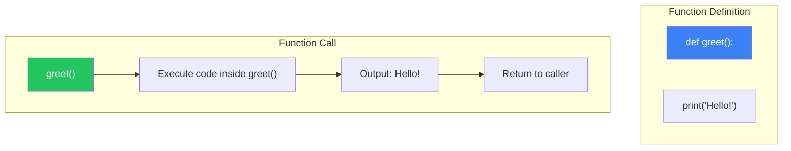
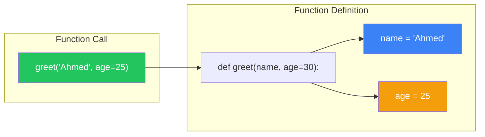
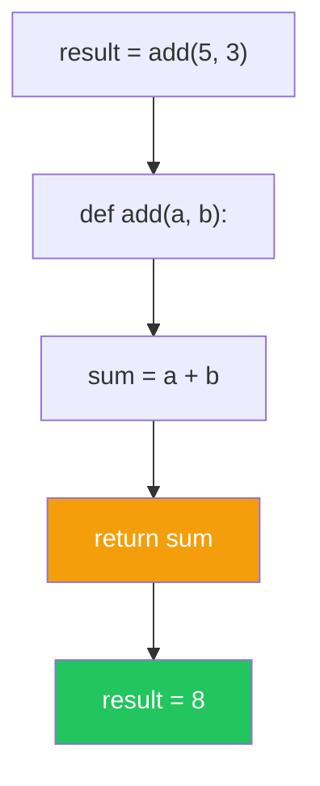
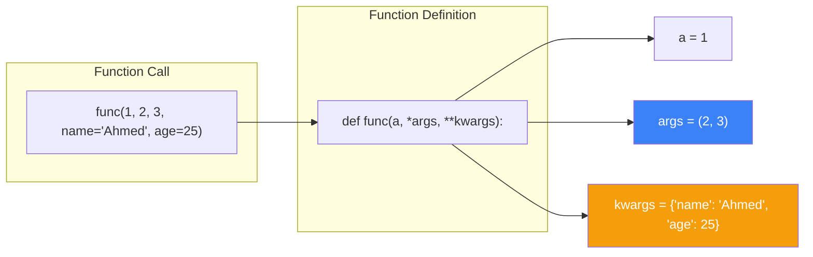
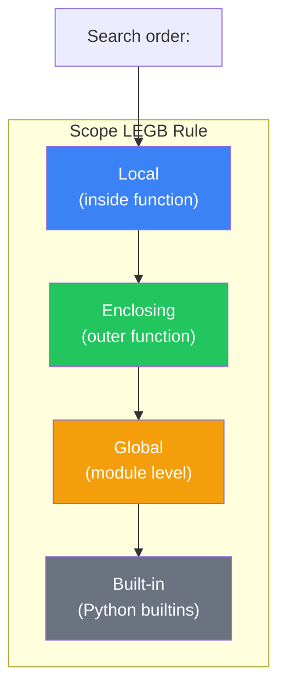

# الفصل صفر-خمسة — Functions Deep Dive: تنظيم الكود وإعادة الاستخدام

> **المتطلبات:** [[04-Dictionaries-And-Sets]] — لازم تكون فاهم إزاي تتعامل مع Lists, Tuples, Dicts, و Sets. الفصل ده هيوريك إزاي تحزم الكود بتاعك في **Functions** عشان يبقى منظم، قابل لإعادة الاستخدام، وسهل الصيانة.

---

## البداية — مشكلة الكود المتكرر

تخيّل معايا إنك كاتب برنامج عربة التسوق (PE-03) وعايز تضيف ميزة إنك تحسب المجموع أكتر من مرة في البرنامج. هتضطر تنسخ وتلصق نفس كود الحساب في كل مكان.

المشاكل:
1. **تكرار الكود:** نفس المنطق مكتوب كذا مرة.
2. **صعوبة الصيانة:** لو عايز تغير طريقة الحساب (تضيف ضريبة مثلاً)، هتضطر تعدل في كل مكان.
3. **صعوبة القراءة:** البرنامج يبقى طويل وملخبط.
4. **صعوبة الـ Testing:** متقدرش تختبر جزء صغير من الكود لوحده.

الحل: **Functions** — بتاخد الكود اللي بيعمل مهمة محددة، تحطه في "صندوق" ليه اسم، وتنادي على الصندوق ده كل ما تحتاج المهمة.

النهارده هنتعلم إزاي نعرف Functions، نمرر ليها بيانات (Parameters)، نرجع منها نتايج (Return Values)، ونستخدم الـ Scope بشكل صحيح.

---

## [[01-Defining-Functions]] — تعريف الدوال: الصندوق السحري

### 🧠 الشرح النظري

الـ Function هي block من الكود بيعمل مهمة محددة. بتعرفها مرة واحدة، وتنادي عليها مليون مرة.

**التركيب الأساسي:**
```python
def function_name():
    # الكود اللي هيتنفذ
    # ...
```

**إزاي بيشتغل؟**
1. Python بتشوف `def` فتعرف إنك بتعرف Function جديدة.
2. بتحفظ اسم الـ function والكود بتاعها في الذاكرة.
3. الكود **مش بيتنفذ** غير لما **تنادي** على الـ function باسمها: `function_name()`.
4. لما تناديها، Python بتروح تنفذ الكود اللي جوا الـ function، وبعدين ترجع للنقطة اللي ناديت منها.

**ليه نستخدم Functions؟**
- **DRY (Don't Repeat Yourself):** اكتب الكود مرة، استخدمه مليون.
- **Abstraction:** خبئ التفاصيل المعقدة ورا اسم بسيط. `calculate_total()` بدل ١٠ أسطر كود.
- **Modularity:** قسم البرنامج الكبير لأجزاء صغيرة كل جزء ليه وظيفة.
- **Testability:** تقدر تختبر كل Function لوحدها.

تخيّل الـ Function زي **جهاز الميكروويف**:
- **الاسم:** "سخن".
- **المهمة:** تسخين الأكل.
- **الـ Parameters:** إنت بتدخل الأكل (ووقت التسخين).
- **الـ Return Value:** الأكل السخن.
- **إنت مش محتاج تعرف إزاي الميكروويف بيشتغل من جوا** (Abstraction). كل اللي يهمك إنك تحط الأكل وتضغط زرار.

### 📊 Visualization



### 💻 Micro-Example

```python
def greet():
    print("Hello, HireLink!")
    print("Welcome to the platform.")

print("Before function call")
greet()  # Function is called here
print("After function call")

# You can call it multiple times
greet()
greet()
```
<details>
<summary><b>📋 مثال إضافي: Function بترسم خط فاصل</b></summary>

```python
def print_separator():
    print("=" * 30)

def print_header(title):
    print_separator()
    print(f"   {title}")
    print_separator()

print_header("Shopping Cart")
print("Item 1: Laptop")
print("Item 2: Mouse")
print_header("Total")
print("$850")
```
</details>

---

## [[02-Parameters-And-Arguments]] — المدخلات: إزاي تدّي بيانات للـ Function

### 🧠 الشرح النظري

الـ Function اللي بتعمل نفس الحاجة كل مرة مفيدة، لكن الـ Function اللي بتقدر **تتكيف** مع مدخلات مختلفة أقوى بكتير. عشان كده بنستخدم **Parameters**.

**المصطلحات:**
- **Parameter:** المتغير اللي في تعريف الـ function (`name` في `def greet(name):`).
- **Argument:** القيمة الفعلية اللي بتمررها لما تنادي الـ function (`"Ahmed"` في `greet("Ahmed")`).

**أنواع الـ Arguments:**
- **Positional Arguments:** بتمررها بالترتيب. `greet("Ahmed", 25)`.
- **Keyword Arguments:** بتمررها بالاسم. `greet(age=25, name="Ahmed")`. الترتيب مش مهم.
- **Default Parameters:** بتدي قيمة افتراضية للـ parameter. `def greet(name="Guest"):`. لو منادتش عليه، بياخد القيمة الافتراضية.

**ليه Default Parameters مفيدة؟**
بتخلي الـ function مرنة. تقدر تناديها بـ argument (فتستخدمه) أو من غيره (فتستخدم الـ default).

تخيّل الـ Parameters زي **فاتورة طلب**:
- **Positional:** "عايز ساندوتش **فراخ**، حجم **كبير**، و**بدون مايونيز**". الترتيب مهم: الفراخ الأول، الحجم تاني، الإضافات تالت.
- **Keyword:** "عايز حجم **كبير**، بدون **مايونيز**، والنوع **فراخ**". الترتيب مش مهم.
- **Default:** "لو متقوليش، الحجم هيبقى **وسط**".

### 📊 Visualization



### 💻 Micro-Example

```python
def greet(name, greeting="Hello"):
    print(f"{greeting}, {name}!")

# Positional arguments
greet("Ahmed", "Hi")        # Hi, Ahmed!

# Keyword arguments (order doesn't matter)
greet(greeting="Welcome", name="Sara")  # Welcome, Sara!

# Using default parameter
greet("Omar")               # Hello, Omar!

# Mixing positional and keyword
greet("Layla", greeting="Hey")  # Hey, Layla!
```
<details>
<summary><b>📋 مثال إضافي: حاسبة مساحة الأشكال</b></summary>

```python
def calculate_area(shape, *dimensions):
    if shape == "rectangle":
        length, width = dimensions
        return length * width
    elif shape == "circle":
        radius = dimensions[0]
        return 3.14159 * radius ** 2
    elif shape == "triangle":
        base, height = dimensions
        return 0.5 * base * height

print(calculate_area("rectangle", 5, 3))  # 15
print(calculate_area("circle", 4))        # 50.26544
print(calculate_area("triangle", 6, 4))   # 12.0
```
</details>

---

## [[03-Return-Values]] — المخرجات: إزاي تاخد نتيجة من الـ Function

### 🧠 الشرح النظري

الـ Function مش بس بتنفذ كود — ممكن **ترجع قيمة** للي ناداها. ده بيخليها مفيدة جداً في العمليات الحسابية وتحويل البيانات.

**`return` statement:**
- بترجع قيمة من الـ function.
- **بتنهي تنفيذ الـ function فوراً.** أي كود بعد `return` مش هيتنفذ.
- لو الـ function مش محتاجة ترجع حاجة، `return` لوحدها أو متكتبهاش خالص (بترجع `None` تلقائياً).

**استخدام القيمة المرتجعة:**
- تخزينها في متغير: `result = calculate_total(cart)`.
- استخدامها مباشرةً: `print(calculate_total(cart))`.
- تمريرها لـ function تانية: `apply_discount(calculate_total(cart))`.

**الفرق بين `print()` و `return`:**
- `print()`: بتعرض حاجة على الشاشة (للمستخدم). القيمة مش بتخرج من الـ function.
- `return`: بترجع قيمة للكود اللي نادى الـ function. القيمة تقدر تستخدمها في عمليات تانية.

تخيّل `return` زي **شيف في مطعم**:
- **`print()`:** الجرسون بيقول للشيف "عايز بيتزا". الشيف بيعملها وبيسيبها في المطبخ (مش بيديها للجرسون).
- **`return`:** الشيف بيعمل البيتزا و**يديها** للجرسون. الجرسون يقدر ياخدها للترابيزة (يستخدمها).

### 📊 Visualization



### 💻 Micro-Example

```python
def add(a, b):
    result = a + b
    return result

def is_even(number):
    return number % 2 == 0  # Returns True or False

def get_user_status(is_active, is_verified):
    if not is_active:
        return "inactive"
    if not is_verified:
        return "unverified"
    return "active"

sum_result = add(5, 3)
print(f"5 + 3 = {sum_result}")

print(f"Is 7 even? {is_even(7)}")
print(f"User status: {get_user_status(True, False)}")

# Using return value directly
print(f"10 + 20 = {add(10, 20)}")
```
<details>
<summary><b>📋 مثال إضافي: حاسبة متكاملة</b></summary>

```python
def calculate(operation, a, b):
    if operation == "add":
        return a + b
    elif operation == "subtract":
        return a - b
    elif operation == "multiply":
        return a * b
    elif operation == "divide":
        if b == 0:
            return "Error: Division by zero"
        return a / b
    else:
        return "Error: Unknown operation"

result = calculate("multiply", 6, 7)
print(f"6 * 7 = {result}")

# Chain operations
total = calculate("add", calculate("multiply", 5, 3), 10)
print(f"(5 * 3) + 10 = {total}")
```
</details>

---

## [[04-Args-And-Kwargs]] — `*args` و `**kwargs`: المرونة القصوى

### 🧠 الشرح النظري

أحياناً مش عارف كام argument الـ user هيبعت للـ function. عايز تعمل `multiply_all()` تضرب أي عدد من الأرقام. هنا بيجي دور `*args` و `**kwargs`.

**`*args` (Non-Keyword Arguments):**
- بيجمع أي عدد من الـ **positional arguments** الزيادة في **tuple**.
- الاسم `args` تقليدي، لكن ممكن تسميه أي حاجة. المهم `*`.

**`**kwargs` (Keyword Arguments):**
- بيجمع أي عدد من الـ **keyword arguments** الزيادة في **dictionary**.
- الاسم `kwargs` تقليدي. المهم `**`.

**الترتيب في تعريف الـ function:**
`def func(normal, *args, default="x", **kwargs):`
1. Parameters عادية.
2. `*args`.
3. Keyword-only parameters (أو default parameters).
4. `**kwargs`.

تخيّل `*args` و `**kwargs` زي **صندوق المفاجآت**:
- **`*args`:** "كل الحاجات اللي مش معروف عددها ومالهاش أسماء — حطهم في tuple".
- **`**kwargs`:** "كل الحاجات اللي جاية بأسماء — حطهم في dict".

### 📊 Visualization



### 💻 Micro-Example

```python
def multiply_all(*numbers):
    if not numbers:
        return 0
    result = 1
    for num in numbers:
        result *= num
    return result

print(multiply_all(2, 3, 4))      # 24
print(multiply_all(5, 10))        # 50
print(multiply_all())             # 0

def create_profile(name, **details):
    profile = {"name": name}
    profile.update(details)
    return profile

user1 = create_profile("Ahmed", age=28, city="Cairo", role="Developer")
print(user1)

user2 = create_profile("Sara", age=25, country="Egypt", verified=True)
print(user2)

def combined_example(required, *args, default="default", **kwargs):
    print(f"Required: {required}")
    print(f"Args: {args}")
    print(f"Default: {default}")
    print(f"Kwargs: {kwargs}")

combined_example("must", 1, 2, 3, default="custom", extra="value", another=42)
```
<details>
<summary><b>📋 مثال إضافي: Logger مرن</b></summary>

```python
def log_message(level, message, **metadata):
    print(f"[{level.upper()}] {message}")
    if metadata:
        print("  Metadata:")
        for key, value in metadata.items():
            print(f"    {key}: {value}")

log_message("info", "User logged in", user_id=42, ip="192.168.1.1")
log_message("error", "Payment failed", transaction_id="abc123", reason="insufficient_funds")
log_message("debug", "Processing request")
```
</details>

---

## [[05-Scope]] — الـ Scope: مين بيشوف إيه؟

### 🧠 الشرح النظري

الـ Scope هو "مدى الرؤية" للمتغيرات. فين المتغير متاح وفين لأ. Python عندها 4 مستويات من الـ Scope (قاعدة LEGB):

**1. Local Scope:**
المتغيرات اللي جوا function. بتتخلق لما الـ function بتنادي، وتتمسح لما الـ function تخلص. مش مرئية بره الـ function.

**2. Enclosing Scope:**
لما يكون عندك nested functions. الـ inner function بتقدر تشوف متغيرات الـ outer function (بس متقدرش تعدلها من غير `nonlocal`).

**3. Global Scope:**
المتغيرات اللي في مستوى الـ module (بره أي function). أي function في الـ module تقدر تشوفها. عشان تعدلها، محتاج `global` keyword.

**4. Built-in Scope:**
الدوال والثوابت الجاهزة في Python (`print`, `len`, `True`). مرئية في كل حتة.

**القاعدة الذهبية:**
- **قراءة:** Python بتدور على المتغير في الـ scopes بالترتيب: Local → Enclosing → Global → Built-in.
- **كتابة (تعيين قيمة):** دايمًا في الـ Local Scope **إلا لو** استخدمت `global` أو `nonlocal`.

تخيّل الـ Scope زي **غرف في بيت**:
- **Local:** غرفة مقفولة. اللي جواها بيشوف بعض، لكن بره الغرفة مش شايف اللي جوا.
- **Enclosing:** غرفة جوا غرفة. اللي في الغرفة الداخلية بيشوف اللي في الغرفة الخارجية.
- **Global:** الصالة — كل اللي في البيت بيشوفوها.
- **Built-in:** السما — كل الناس بتشوفها.

### 📊 Visualization



### 💻 Micro-Example

```python
# Global variable
app_name = "HireLink"
version = "1.0"

def show_app_info():
    # Local variable
    user = "Ahmed"
    print(f"App: {app_name}")  # Can read global
    print(f"User: {user}")      # Local

def update_version():
    global version  # Tell Python we want to modify global
    version = "2.0"

def outer():
    message = "Hello"  # Enclosing variable
    
    def inner():
        nonlocal message  # Modify enclosing variable
        message = "Hi"
        print(f"Inner: {message}")
    
    print(f"Outer before: {message}")
    inner()
    print(f"Outer after: {message}")

print(f"Version before: {version}")
update_version()
print(f"Version after: {version}")

outer()
```
<details>
<summary><b>📋 مثال إضافي: عداد باستخدام Closure</b></summary>

```python
def create_counter():
    count = 0  # Enclosing variable
    
    def increment():
        nonlocal count
        count += 1
        return count
    
    return increment

counter1 = create_counter()
print(counter1())  # 1
print(counter1())  # 2
print(counter1())  # 3

counter2 = create_counter()
print(counter2())  # 1 (independent counter)
```
</details>

---

## 🛠️ Progressive Exercise 05 — إعادة كتابة عربة التسوق بـ Functions

**المهمة:** خد برنامج عربة التسوق من PE-03 وأعد كتابته باستخدام Functions. البرنامج لازم يكون منظم ومقسم لـ Functions واضحة.

**المطلوب تعريف الـ Functions التالية:**
1. `display_menu()` — تعرض قائمة الخيارات.
2. `add_item(cart)` — تطلب من المستخدم اسم المنتج وتضيفه للعربة.
3. `remove_item(cart)` — تطلب اسم المنتج وتشيله من العربة.
4. `view_cart(cart)` — تعرض محتويات العربة.
5. `calculate_total(cart)` — تحسب المجموع (باستخدام أسعار وهمية) وترجع القيمة.
6. `main()` — الـ function الرئيسية اللي تدير البرنامج كله.

**متطلبات من PE-00 لـ PE-04:**
- Lists، Dicts، Loops، Conditionals.

**متطلبات جديدة من PE-05:**
- تعريف Functions مع Parameters و Return Values.
- استخدام Default Parameters (اختياري).
- تنظيم الكود في `main()` function.

**مثال للتنفيذ المتوقع:** (نفس PE-03، لكن الكود منظم في Functions).

**🎯 جرب بنفسك:** افتح أي Python environment واكتب الحل. لو اتعطلت، الحل تحت.


<details>
<summary><b>✨ اضغط هنا عشان تشوف الحل</b></summary>

```python
# PE-05: Shopping Cart with Functions

PRICES = {
    "laptop": 800,
    "mouse": 25,
    "keyboard": 50,
    "monitor": 300,
    "headphones": 100,
}

def display_menu():
    print("\n=== Shopping Cart Menu ===")
    print("1. Add item")
    print("2. Remove item")
    print("3. View cart")
    print("4. Calculate total")
    print("5. Exit")

def add_item(cart):
    item = input("Enter item name: ")
    cart.append(item)
    print(f"'{item}' added to cart.")
    return cart

def remove_item(cart):
    item = input("Enter item name to remove: ")
    if item in cart:
        cart.remove(item)
        print(f"'{item}' removed from cart.")
    else:
        print(f"'{item}' not found in cart.")
    return cart

def view_cart(cart):
    if cart:
        print("\nYour cart contains:")
        for i, item in enumerate(cart, 1):
            print(f"  {i}. {item}")
    else:
        print("\nYour cart is empty.")

def calculate_total(cart):
    if not cart:
        return 0
    
    total = 0
    print("\nPrice breakdown:")
    for item in cart:
        price = PRICES.get(item.lower(), 50)
        total += price
        print(f"  {item}: ${price}")
    
    return total

def main():
    cart = []
    
    while True:
        display_menu()
        choice = input("Choose an option (1-5): ")
        
        if choice == "1":
            cart = add_item(cart)
        elif choice == "2":
            cart = remove_item(cart)
        elif choice == "3":
            view_cart(cart)
        elif choice == "4":
            total = calculate_total(cart)
            print(f"\nTotal price: ${total}")
        elif choice == "5":
            print("Thank you for shopping!")
            break
        else:
            print("Invalid option. Please choose 1-5.")

# Run the program
if __name__ == "__main__":
    main()
```

**نسخة متقدمة مع تخزين الكمية والسعر:**
```python
def add_item_advanced(cart):
    name = input("Enter item name: ")
    qty = int(input("Enter quantity: "))
    price = float(input("Enter price per item: "))
    
    cart.append({
        "name": name,
        "qty": qty,
        "price": price
    })
    print(f"Added {qty}x {name} at ${price} each.")
    return cart

def view_cart_advanced(cart):
    if not cart:
        print("\nCart is empty.")
        return
    
    print("\nYour Cart:")
    for i, item in enumerate(cart, 1):
        subtotal = item["qty"] * item["price"]
        print(f"  {i}. {item['qty']}x {item['name']} @ ${item['price']} = ${subtotal}")

def calculate_total_advanced(cart):
    return sum(item["qty"] * item["price"] for item in cart)

# Bonus: Function with default parameter
def apply_discount(total, discount_percent=0):
    discount = total * discount_percent / 100
    return total - discount

# Usage
total = 850
discounted = apply_discount(total, 10)  # 10% discount
print(f"Total: ${total}, After 10% discount: ${discounted}")
```

**نسخة مع Type Hints (Python 3.5+):**
```python
from typing import List, Dict, Union

def add_item(cart: List[str]) -> List[str]:
    item: str = input("Enter item name: ")
    cart.append(item)
    print(f"'{item}' added to cart.")
    return cart

def calculate_total(cart: List[str]) -> float:
    total: float = 0.0
    for item in cart:
        total += PRICES.get(item.lower(), 50)
    return total

def main() -> None:
    cart: List[str] = []
    # ... rest of code
```
</details>

---

## 📝 خلاصة الدرس

- **تعريف الدوال:** `def function_name():` — الكود اللي جواها مش بيتنفذ غير لما تناديها.
- **Parameters vs Arguments:** Parameters في التعريف، Arguments في الاستدعاء. تقدر تمررها Positional أو Keyword.
- **Default Parameters:** `def greet(name="Guest"):` — بتدي قيمة افتراضية لو الـ argument متبعتش.
- **Return Values:** `return` بترجع قيمة وبتنهي الـ function. `print()` بتعرض بس.
- **`*args` و `**kwargs`:** لاستقبال عدد غير محدد من الـ arguments. `*args` → tuple، `**kwargs` → dict.
- **Scope (LEGB):** Local → Enclosing → Global → Built-in. عشان تعدل global، استخدم `global`. عشان تعدل enclosing، استخدم `nonlocal`.
- **تنظيم الكود:** استخدم `main()` function عشان تجمع الـ flow بتاع البرنامج. استخدم `if __name__ == "__main__": main()` عشان تشغل البرنامج.

---

*Next → [[06-Strings-And-Files]] — عرفنا إزاي ننظم الكود في Functions. دلوقتي هنتعمق في **Strings** (النصوص) وكل عملياتها المتقدمة، و**File I/O** (قراءة وكتابة الملفات). وهنحل PE-06: برنامج يقرا ملف نصي فيه أسماء، ويعمل ملف جديد بالأسماء المرتبة.*