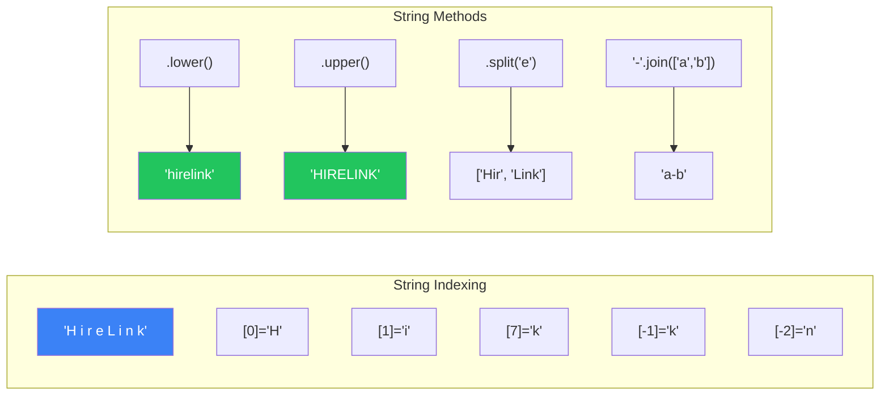
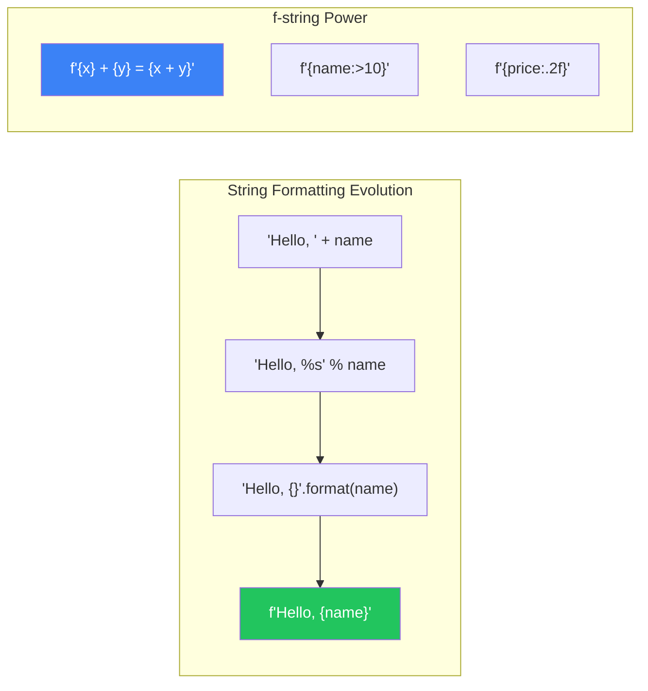
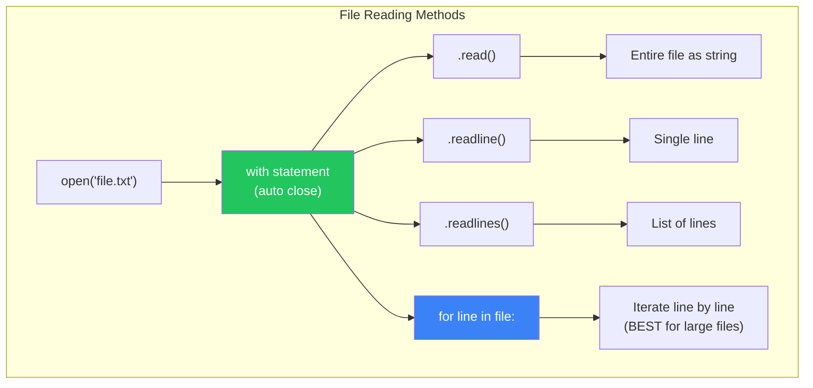
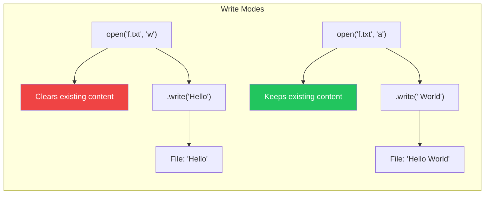

#  Strings و Files: التعامل مع النصوص والملفات

> **المتطلبات:** [[05-Functions-Deep-Dive]] — لازم تكون فاهم إزاي تعرف Functions، تمرر Parameters، وترجع Values. الفصل ده هيعمق فهمك للـ **Strings** (النصوص) وكل عملياتها، ويعلمك إزاي تقرا وتكتب **Files** (الملفات) — مهارة أساسية لأي تطبيق حقيقي.

---

## البداية — البيانات مش دايمًا في الـ RAM

كل البرامج اللي كتبناها لحد دلوقتي كانت بتتعامل مع بيانات المستخدم وهي شغالة. أول ما البرنامج يقفل، كل البيانات بتضيع. إيه لو عايز تحفظ إعدادات المستخدم؟ أو تقرا قائمة منتجات من ملف؟ أو تسجل log بالأحداث؟

الحل: **Files** — تخزين البيانات على القرص الصلب عشان تفضل موجودة بعد ما البرنامج يقفل.

وقبل ما نتعامل مع الملفات، محتاجين نبقى أساتذة في **Strings** — لأن كل حاجة في الملفات (تقريباً) بتتخزن كنص. النهارده هنتعلم كل حاجة عن النصوص: التنسيق، البحث، التقطيع، والتنضيف. وبعدين هنستخدم المهارات دي عشان نقرا ونكتب ملفات.

---

## [[01-Strings-Deep-Dive]] — الـ Strings: أكتر من مجرد نصوص

### 🧠 الشرح النظري

الـ String في Python هي **سلسلة من الحروف**. هي **Immutable** — متقدرش تغير حرف في النص مباشرةً. أي عملية "بتغير" النص بترجعلك String جديدة.

**طرق إنشاء النصوص:**
- `'Single quotes'`
- `"Double quotes"`
- `'''Triple quotes'''` أو `"""Triple quotes"""` — للنصوص متعددة الأسطر.
- `f"Formatted {variable}"` — f-strings (أفضل طريقة).

**الـ Indexing و Slicing:**
زي الـ List بالظبط! كل حرف ليه index بيبدأ من 0. تقدر تجيب حرف معين: `text[0]`. تقدر تقطع جزء: `text[0:5]`. تقدر تبدأ من الآخر: `text[-1]`.

**التحقق من المحتوى (Useful Methods):**
- **`.startswith(prefix)`** — هل النص بيبدأ بـ...؟
- **`.endswith(suffix)`** — هل النص بينتهي بـ...؟
- **`.isdigit()`** — هل كل الحروف أرقام؟
- **`.isalpha()`** — هل كل الحروف أبجدية؟
- **`.isalnum()`** — هل كل الحروف أبجدية أو أرقام؟
- **`.islower()` / `.isupper()`** — هل كل الحروف small/capital؟
- **`.isspace()`** — هل النص كله مسافات؟

**التعديل (بيرجع String جديدة):**
- **`.lower()` / `.upper()`** — تحويل لـ small/capital.
- **`.capitalize()`** — أول حرف capital والباقي small.
- **`.title()`** — أول حرف من كل كلمة capital.
- **`.strip()`** — شيل المسافات من الأول والآخر.
- **`.lstrip()` / `.rstrip()`** — شيل المسافات من اليسار/اليمين.
- **`.replace(old, new)`** — استبدال نص بنص.

**البحث والتقسيم:**
- **`.find(sub)`** — يرجع index أول ظهور للنص. `-1` لو مش موجود.
- **`.index(sub)`** — زي `.find` لكن بترمي error لو مش موجود.
- **`.count(sub)`** — عدد مرات ظهور النص.
- **`.split(separator)`** — تقسيم النص لـ List.
- **`.join(iterable)`** — دمج List لنص واحد (العكس).

تخيّل الـ String زي **عقد لولو**:
- **الحروف:** اللولو.
- **Immutable:** متقدرش تغير لولية في النص. تقدر تعمل عقد جديد.
- **`.split()`:** تفك العقد وتخلي اللولو في علبة (List).
- **`.join()`:** تاخد اللولو من العلبة وترجع تعمل عقد جديد.

### 📊 Visualization



### 💻 Micro-Example

```python
text = "  Hello, HireLink World!  "

print(f"Original: '{text}'")
print(f"Strip: '{text.strip()}'")
print(f"Lower: '{text.lower()}'")
print(f"Upper: '{text.upper()}'")
print(f"Replace: '{text.replace('World', 'Egypt')}'")

print(f"Starts with '  Hello'? {text.startswith('  Hello')}")
print(f"Is digit? {'123'.isdigit()}")  # True
print(f"Is alpha? {'abc'.isalpha()}")  # True

words = text.strip().split()
print(f"Split: {words}")
print(f"Join: {'-'.join(words)}")
```
<details>
<summary><b>📋 مثال إضافي: تنظيف إدخال المستخدم</b></summary>

```python
def clean_username(username):
    return username.strip().lower().replace(" ", "_")

def validate_email(email):
    email = email.strip().lower()
    if "@" not in email:
        return False, "Email must contain @"
    if email.count("@") > 1:
        return False, "Email must contain only one @"
    if not email.endswith((".com", ".org", ".net")):
        return False, "Email must end with .com, .org, or .net"
    return True, "Valid email"

print(clean_username("  Ahmed Hassan  "))  # ahmed_hassan
print(validate_email("AHMED@EXAMPLE.COM"))  # (True, 'Valid email')
print(validate_email("invalid.email"))      # (False, 'Email must contain @')
```
</details>

---

## [[02-String-Formatting]] — تنسيق النصوص: إزاي تبني جمل ديناميكية

### 🧠 الشرح النظري

نادراً ما هتطبع نصوص ثابتة. غالباً هتحتاج تدمج متغيرات مع نصوص. Python بتقدم 3 طرق رئيسية (والرابعة هي الأفضل).

**1. Concatenation (`+`):**
`"Hello, " + name + "!"` — بسيطة لكنها بطيئة وبتخلي الكود مش مقروء مع المتغيرات الكتير.

**2. Old Style Formatting (`%`):**
`"Hello, %s!" % name` — مستوحاة من C. قديمة ومش مستحبة.

**3. `.format()` method:**
`"Hello, {}!".format(name)` — أفضل من `%`، لكن لسه فيها تكرار.

**4. f-Strings (Python 3.6+):** ⭐ **الأفضل**
`f"Hello, {name}!"` — مباشرة، سريعة، ومقروءة جداً. تقدر تحط أي تعبير Python جوا `{}`.

**تنسيق متقدم في f-strings:**
- **تبطين (Padding):** `f"{name:>10}"` (يمين)، `f"{name:<10}"` (يسار)، `f"{name:^10}"` (وسط).
- **أرقام عشرية:** `f"{price:.2f}"` (رقمين بعد العلامة).
- **آلاف:** `f"{population:,}"` (فاصلة كل 3 أرقام).
- **نسبة مئوية:** `f"{progress:.1%}"` (نسبة مئوية برقم عشرى واحد).
- **تاريخ ووقت:** `f"{datetime.now():%Y-%m-%d}"`.

تخيّل f-strings زي **قالب كيك**:
- القالب: `f"Hello, {name}! Your score is {score}."`
- إنت بتحط المكونات (المتغيرات) في الأماكن المخصصة (`{}`).
- النتيجة: كيكة جاهزة (النص النهائي).

### 📊 Visualization



### 💻 Micro-Example

```python
name = "Ahmed"
age = 28
price = 99.999
population = 123456789

print(f"Hello, {name}! You are {age} years old.")
print(f"Next year you'll be {age + 1}.")

print(f"Price: ${price:.2f}")
print(f"Population: {population:,}")

print(f"{'Name':<10} {'Age':>5}")
print(f"{name:<10} {age:>5}")

score = 0.856
print(f"Progress: {score:.1%}")

# f-string with dictionary
user = {"name": "Sara", "role": "Developer"}
print(f"User: {user['name']} - Role: {user['role']}")
```
<details>
<summary><b>📋 مثال إضافي: تنسيق تقرير</b></summary>

```python
def format_invoice(items, customer_name, tax_rate=0.14):
    lines = []
    lines.append(f"INVOICE FOR: {customer_name}")
    lines.append("=" * 40)
    lines.append(f"{'Item':<20} {'Qty':>5} {'Price':>8} {'Total':>10}")
    lines.append("-" * 40)
    
    subtotal = 0
    for name, qty, price in items:
        total = qty * price
        subtotal += total
        lines.append(f"{name:<20} {qty:>5} {price:>8.2f} {total:>10.2f}")
    
    tax = subtotal * tax_rate
    grand_total = subtotal + tax
    
    lines.append("-" * 40)
    lines.append(f"{'Subtotal:':<33} {subtotal:>10.2f}")
    lines.append(f"{'Tax (14%):':<33} {tax:>10.2f}")
    lines.append(f"{'TOTAL:':<33} {grand_total:>10.2f}")
    lines.append("=" * 40)
    
    return "\n".join(lines)

items = [
    ("Laptop", 1, 800.00),
    ("Mouse", 2, 25.50),
    ("Keyboard", 1, 49.99),
]

print(format_invoice(items, "Ahmed Hassan"))
```
</details>

---

## [[03-File-Reading]] — قراءة الملفات: إزاي تاخد بيانات من القرص الصلب

### 🧠 الشرح النظري

الملفات هي الطريقة الأساسية لتخزين البيانات بشكل دائم. Python بتخلي قراءة الملفات سهلة جداً.

**فتح الملف:**
`file = open("filename.txt", "mode")`

**أوضاع الفتح (Modes):**
- **`"r"`:** Read (قراءة فقط). الملف لازم يكون موجود.
- **`"w"`:** Write (كتابة). بيمسح الملف لو موجود، بينشئه لو مش موجود.
- **`"a"`:** Append (إضافة في الآخر). بيحافظ على المحتوى القديم.
- **`"x"`:** Exclusive Creation. بينشئ ملف جديد، بيرمي error لو الملف موجود.
- **`"r+"`:** Read and Write.

**طرق القراءة:**
- **`.read()`:** بيقرا الملف **كله** في String واحدة.
- **`.readline()`:** بيقرا **سطر واحد** (للـ memory efficiency).
- **`.readlines()`:** بيقرا كل الأسطر في **List**.
- **Iteration:** `for line in file:` — أفضل طريقة للملفات الكبيرة. بتقرا سطر سطر من غير ما تحمل الملف كله في الذاكرة.

**قفل الملف:**
- **`.close()`:** لازم تقفل الملف بعد ما تخلص. لو مقفلتهوش، ممكن يحصل data loss أو memory leak.
- **`with` statement:** ⭐ **الأفضل**. `with open("file.txt") as f:` بتقفل الملف تلقائياً حتى لو حصل Exception.

**التعامل مع المسارات (Paths):**
- استخدم `pathlib` (Python 3.4+) بدل strings. `from pathlib import Path`.
- `Path("data") / "file.txt"` — بتشتغل على Windows و Mac و Linux.

تخيّل قراءة ملف زي **فتح كتاب**:
- **`open()`:** تفتح الكتاب.
- **`for line in file:`:** تقرا سطر سطر من غير ما تشيل الكتاب كله.
- **`.read()`:** تقرا الكتاب كله مرة واحدة (مش عملي للكتب الكبيرة).
- **`with`:** البواب بيقفل الكتاب وراك تلقائياً.

### 📊 Visualization



### 💻 Micro-Example

```python
from pathlib import Path

# Writing a test file first
test_file = Path("test.txt")
test_file.write_text("Line 1\nLine 2\nLine 3\n")

# Reading entire file
print("=== .read() ===")
with open("test.txt", "r", encoding="utf-8") as f:
    content = f.read()
    print(repr(content))

# Reading line by line (memory efficient)
print("\n=== for line in file ===")
with open("test.txt", "r", encoding="utf-8") as f:
    for i, line in enumerate(f, 1):
        print(f"Line {i}: {line.strip()}")

# Using pathlib
print("\n=== pathlib ===")
file_path = Path("test.txt")
if file_path.exists():
    print(f"File size: {file_path.stat().st_size} bytes")
    lines = file_path.read_text(encoding="utf-8").splitlines()
    print(f"Lines: {lines}")
```
<details>
<summary><b>📋 مثال إضافي: قراءة ملف CSV بسيط</b></summary>

```python
# Create sample CSV
csv_content = """Name,Age,City
Ahmed,28,Cairo
Sara,25,Alexandria
Omar,32,Giza"""

Path("users.csv").write_text(csv_content)

# Read and parse CSV manually
print("Users List:")
with open("users.csv", "r", encoding="utf-8") as f:
    header = f.readline().strip().split(",")
    print(f"Header: {header}")
    
    for line in f:
        name, age, city = line.strip().split(",")
        print(f"  {name} is {age} years old from {city}")
```
</details>

---

## [[04-File-Writing]] — كتابة الملفات: إزاي تحفظ بيانات للأبد

### 🧠 الشرح النظري

كتابة الملفات زي قراءتها، بس بتستخدم أوضاع مختلفة (`"w"`, `"a"`, `"x"`).

**طرق الكتابة:**
- **`.write(string)`:** بتكتب String في الملف.
- **`.writelines(iterable)`:** بتكتب List من الـ strings (من غير ما تضيف أسطر جديدة تلقائياً).

**الفرق بين `"w"` و `"a"`:**
- **`"w"` (Write):** بيمسح الملف لو كان موجود، ويبدأ من الأول.
- **`"a"` (Append):** بيضيف في **نهاية** الملف من غير ما يمسح القديم.

**الـ Newline Character (`\n`):**
لما تكتب في ملف، لازم تضيف `\n` يدوي في نهاية كل سطر عشان تروح لسطر جديد. `.writelines()` مش بتضيفها تلقائياً.

**الـ Encoding:**
دايماً حدد `encoding="utf-8"` لما تتعامل مع ملفات نصية. ده بيضمن إن الحروف غير الإنجليزية (زي العربي) تتكتب صح.

**الكتابة الآمنة (Atomic Write):**
لما تكتب ملف مهم، الأفضل تكتبه في ملف مؤقت الأول، وبعدين تستبدل الملف الأصلي. ده بيمنع تلف البيانات لو البرنامج قفل في نص الكتابة. `pathlib` بتدعم ده بـ `.write_text()` (بتعمل atomic write تلقائياً).

تخيّل كتابة ملف زي **الكتابة على سبورة**:
- **`"w"`:** تمسح السبورة كلها وتبدأ من الأول.
- **`"a"`:** تكمل في آخر حتة فاضية في السبورة.
- **`\n`:** تنزل لسطر جديد.
- **Atomic Write:** تكتب على سبورة صغيرة، ولما تتأكد إن كل حاجة تمام، تبدل السبورة القديمة بالجديدة.

### 📊 Visualization



### 💻 Micro-Example

```python
from pathlib import Path

file_path = Path("output.txt")

# Write mode (overwrites)
with open(file_path, "w", encoding="utf-8") as f:
    f.write("Line 1\n")
    f.write("Line 2\n")
    f.writelines(["Line 3\n", "Line 4\n"])

print("After write:")
print(file_path.read_text(encoding="utf-8"))

# Append mode (adds to end)
with open(file_path, "a", encoding="utf-8") as f:
    f.write("Line 5 (appended)\n")

print("After append:")
print(file_path.read_text(encoding="utf-8"))

# Simple write with pathlib
Path("simple.txt").write_text("Hello, HireLink!", encoding="utf-8")
print(Path("simple.txt").read_text(encoding="utf-8"))
```
<details>
<summary><b>📋 مثال إضافي: مسجل أحداث (Logger) بسيط</b></summary>

```python
from datetime import datetime
from pathlib import Path

class SimpleLogger:
    def __init__(self, log_file):
        self.log_file = Path(log_file)
    
    def log(self, level, message):
        timestamp = datetime.now().strftime("%Y-%m-%d %H:%M:%S")
        log_line = f"[{timestamp}] [{level.upper()}] {message}\n"
        
        with open(self.log_file, "a", encoding="utf-8") as f:
            f.write(log_line)
    
    def info(self, message):
        self.log("INFO", message)
    
    def error(self, message):
        self.log("ERROR", message)
    
    def read_last(self, n=5):
        lines = self.log_file.read_text(encoding="utf-8").strip().split("\n")
        return lines[-n:] if lines else []

logger = SimpleLogger("app.log")
logger.info("Application started")
logger.info("User 'Ahmed' logged in")
logger.error("Failed to connect to database")

print("Last 3 log entries:")
for line in logger.read_last(3):
    print(f"  {line}")
```
</details>

---

## 🛠️ Progressive Exercise 06 — معالج ملف الأسماء

**المهمة:** اكتب برنامج Python يقرا ملف نصي (`names.txt`) فيه قائمة أسماء (كل اسم في سطر)، ويعمل الآتي:
1. ينضف الأسماء (يشيل المسافات الزيادة من الأول والآخر).
2. يرتب الأسماء أبجدياً.
3. يشيل الأسماء المكررة.
4. يكتب الأسماء المرتبة والفريدة في ملف جديد (`sorted_names.txt`).
5. يطبع إحصائيات: عدد الأسماء الأصلي، عدد الأسماء بعد التنضيف، عدد الأسماء الفريدة.

**متطلبات من PE-00 لـ PE-05:**
- Lists, Dicts/Sets, Loops, Functions, String methods.

**متطلبات جديدة من PE-06:**
- قراءة ملف (`open` مع `"r"`).
- كتابة ملف (`open` مع `"w"`).
- استخدام String methods (`.strip()`, `.lower()`, إلخ).
- استخدام `Set` لإزالة التكرار.

**مثال للملف `names.txt`:**
```
Ahmed
 Sara
sara
Mohamed
  ahmed
Khaled
Mohamed
```

**المخرجات المتوقعة (`sorted_names.txt`):**
```
Ahmed
Khaled
Mohamed
Sara
```

**الإحصائيات المتوقعة:**
```
Original names count: 7
Cleaned names count: 7
Unique names count: 4
Sorted names saved to 'sorted_names.txt'
```

**🎯 جرب بنفسك:** افتح أي Python environment واكتب الحل. لو اتعطلت، الحل تحت.


<details>
<summary><b>✨ اضغط هنا عشان تشوف الحل</b></summary>

```python
# PE-06: Name File Processor

from pathlib import Path

def create_sample_file():
    sample_content = """Ahmed
 Sara
sara
Mohamed
  ahmed
Khaled
Mohamed"""
    Path("names.txt").write_text(sample_content, encoding="utf-8")
    print("Sample 'names.txt' created.")

def read_and_clean_names(filename):
    names = []
    with open(filename, "r", encoding="utf-8") as f:
        for line in f:
            cleaned = line.strip()
            if cleaned:  # Skip empty lines
                names.append(cleaned)
    return names

def process_names(original_names):
    cleaned = [name.strip() for name in original_names]
    unique = list(set(name.lower() for name in cleaned))
    sorted_unique = sorted(unique)
    return cleaned, sorted_unique

def write_sorted_names(filename, names):
    with open(filename, "w", encoding="utf-8") as f:
        for name in names:
            f.write(f"{name}\n")

def main():
    # Create sample file if it doesn't exist
    if not Path("names.txt").exists():
        create_sample_file()
    
    # Read names
    original_names = read_and_clean_names("names.txt")
    
    # Process names
    cleaned_names, unique_sorted = process_names(original_names)
    
    # Write results
    write_sorted_names("sorted_names.txt", unique_sorted)
    
    # Statistics
    print(f"Original names count: {len(original_names)}")
    print(f"Cleaned names count: {len(cleaned_names)}")
    print(f"Unique names count: {len(unique_sorted)}")
    print("Sorted names saved to 'sorted_names.txt'")
    
    # Preview
    print("\nUnique sorted names:")
    for name in unique_sorted:
        print(f"  {name.capitalize()}")

if __name__ == "__main__":
    main()
```

**نسخة متقدمة مع الحفاظ على حالة الأحرف الأصلية:**
```python
def process_names_preserve_case(original_names):
    cleaned = [name.strip() for name in original_names if name.strip()]
    
    seen = set()
    unique = []
    for name in cleaned:
        if name.lower() not in seen:
            seen.add(name.lower())
            unique.append(name)
    
    sorted_unique = sorted(unique, key=str.lower)
    return cleaned, sorted_unique
```

**نسخة مع دعم CSV:**
```python
import csv

def read_names_csv(filename):
    names = []
    with open(filename, "r", encoding="utf-8") as f:
        reader = csv.reader(f)
        for row in reader:
            if row:
                names.append(row[0])
    return names

def write_names_csv(filename, names):
    with open(filename, "w", encoding="utf-8", newline="") as f:
        writer = csv.writer(f)
        for name in names:
            writer.writerow([name])
```

**نسخة مع Type Hints كاملة:**
```python
from typing import List, Tuple
from pathlib import Path

def read_and_clean_names(filename: str) -> List[str]:
    names: List[str] = []
    with open(filename, "r", encoding="utf-8") as f:
        for line in f:
            cleaned: str = line.strip()
            if cleaned:
                names.append(cleaned)
    return names

def process_names(original: List[str]) -> Tuple[List[str], List[str]]:
    cleaned: List[str] = [name.strip() for name in original]
    unique: List[str] = sorted(set(name.lower() for name in cleaned))
    return cleaned, unique
```
</details>

---

## 📝 خلاصة الدرس

- **Strings Immutable:** أي عملية بتغير النص بترجع String جديدة. الـ indexing و slicing زي List.
- **String Methods مفيدة:** `.strip()` (شيل مسافات)، `.lower()`/`.upper()` (حالة الأحرف)، `.split()` (تقسيم)، `.join()` (دمج)، `.startswith()`/`.endswith()` (تحقق).
- **f-Strings:** أفضل طريقة لتنسيق النصوص. `f"{variable}"`. تدعم padding (`:>10`)، أرقام عشرية (`:.2f`)، آلاف (`:,`).
- **قراءة الملفات:** `with open("file", "r", encoding="utf-8") as f:`. `for line in f` أفضل للملفات الكبيرة. `pathlib` للتعامل مع المسارات.
- **كتابة الملفات:** `"w"` (يمسح القديم)، `"a"` (يضيف في الآخر). لازم تضيف `\n` يدوي. `encoding="utf-8"` دايمًا.
- **Atomic Write:** `Path("file").write_text(content)` بتعمل atomic write تلقائياً — أأمن.

---

*Next → [[07-OOP-Basics]] — عرفنا إزاي ننظم الكود في Functions ونتعامل مع الملفات. دلوقتي هنتعلم **Object-Oriented Programming (OOP)** — النموذج اللي بيخليك تبني برامج معقدة بطريقة منظمة. وهنحل PE-07: نظام إدارة طلاب وكورسات بـ Classes.*