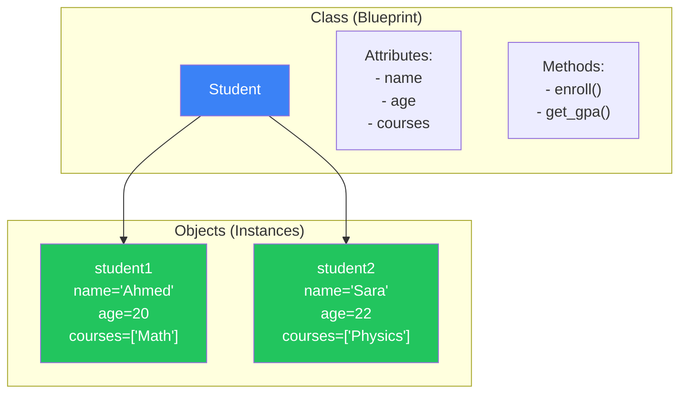
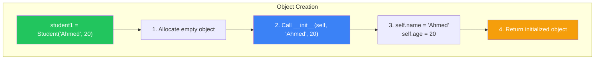
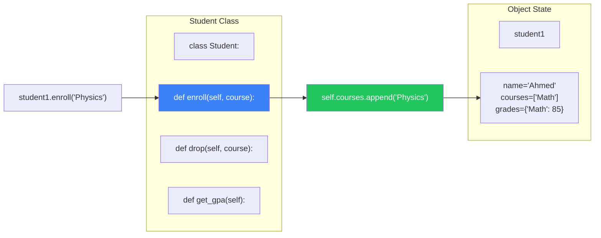
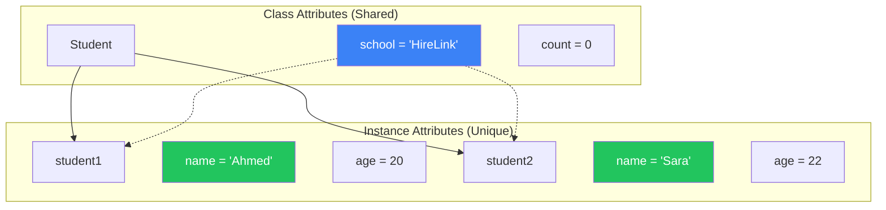
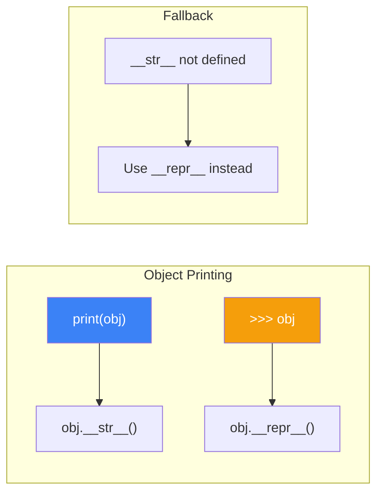

#  OOP Basics: Classes و Objects

> **المتطلبات:** [[06-Strings-And-Files]] — لازم تكون فاهم Functions كويس، وعارف إزاي تتعامل مع Lists, Dicts, و Strings. الفصل ده هيقدملك **Object-Oriented Programming (OOP)** — النموذج اللي هيغير طريقة تفكيرك في البرمجة.

---

## البداية — مشكلة البيانات المرتبطة ببعض

تخيّل معايا إنك بتبني نظام إدارة طلاب في HireLink. عندك بيانات لكل طالب: اسم، عمر، المواد المسجل فيها، درجاته. لو استخدمنا اللي اتعلمناه لحد دلوقتي:

```python
student1_name = "Ahmed"
student1_age = 20
student1_courses = ["Math", "Physics"]
student1_grades = {"Math": 85, "Physics": 90}

student2_name = "Sara"
student2_age = 22
student2_courses = ["Chemistry", "Biology"]
student2_grades = {"Chemistry": 88, "Biology": 92}
```

المشاكل:
1. البيانات متفرقة — مفيش حاجة بتربط `student1_name` بـ `student1_age`.
2. لو عايز تعمل 100 طالب، هتعمل 400 متغير.
3. لو عايز تمرر بيانات طالب لـ Function، هتمرر 4 parameters منفصلة.
4. صعب تتابع إيه الـ attributes بتاعة "طالب".

الحل: **Object-Oriented Programming (OOP)**. بدل ما تخزن البيانات في متغيرات منفصلة، بتجمعهم في **Class** (قالب) وبتعمل منه **Objects** (نسخ).

النهارده هنتعلم أساسيات OOP: إيه هي Classes و Objects، إزاي تعرفهم، وإزاي تستخدمهم عشان تنظم الكود بتاعك.

---

## [[01-What-Is-OOP]] — إيه هو OOP؟ القوالب والنسخ

### 🧠 الشرح النظري

**Object-Oriented Programming (OOP)** هي طريقة لتنظيم الكود بتعتمد على فكرة إنك بتجمع **البيانات** (attributes) و **السلوكيات** (methods) المرتبطة ببعض في وحدة واحدة اسمها **Object**.

**المفاهيم الأساسية:**
- **Class:** هو "القالب" أو "المخطط". بيوصف إيه الـ attributes والـ methods اللي الـ objects هيكون عندها. مثال: `Student` class بيوصف إن كل طالب عنده `name`, `age`, `courses`.
- **Object (Instance):** هو "نسخة" من الـ class. مثال: `student1 = Student()` — ده طالب محدد اسمه Ahmed عنده 20 سنة.
- **Attribute:** بيانات خاصة بالـ object. `student1.name = "Ahmed"`.
- **Method:** Function جوا الـ class بتشتغل على الـ object نفسه. `student1.enroll("Math")`.

**ليه OOP؟**
- **تنظيم:** كل حاجة متعلقة بـ "طالب" في class واحد.
- **Reusability:** تقدر تعمل ملايين الـ objects من نفس الـ class.
- **Encapsulation:** تجمع البيانات والسلوكيات مع بعض.
- **Abstraction:** تخبي التفاصيل المعقدة ورا interface بسيط.

تخيّل OOP زي **مصنع عربيات**:
- **Class:** المخطط الهندسي للعربية (Toyota Corolla 2024). المخطط بيوصف إن كل عربية هيكون فيها 4 كاوتش، عجلة قيادة، ماتور.
- **Object:** العربية اللي طالعة من خط الإنتاج. عربية أحمد (رقم شاسيه 123)، عربية سارة (رقم شاسيه 456).
- **Attribute:** لون العربية، رقم الشاسيه، سرعتها الحالية.
- **Method:** `start_engine()`, `accelerate()`, `brake()`.

### 📊 Visualization



### 💻 Micro-Example

```python
class Student:
    pass  # Empty class (placeholder)

student1 = Student()
student1.name = "Ahmed"
student1.age = 20
student1.courses = ["Math", "Physics"]

student2 = Student()
student2.name = "Sara"
student2.age = 22
student2.courses = ["Chemistry", "Biology"]

print(f"{student1.name} is {student1.age} years old.")
print(f"{student2.name} is taking {student2.courses}.")
```
<details>
<summary><b>📋 مثال إضافي: Class بسيط لتمثيل نقطة</b></summary>

```python
class Point:
    pass

p1 = Point()
p1.x = 10
p1.y = 20

p2 = Point()
p2.x = 30
p2.y = 40

print(f"Point 1: ({p1.x}, {p1.y})")
print(f"Point 2: ({p2.x}, {p2.y})")
```
</details>

---

## [[02-Constructor-And-Self]] — `__init__` و `self`: إزاي تبني Object مظبوط

### 🧠 الشرح النظري

الطريقة اللي فوق (إضافة attributes بعد الإنشاء) مش عملية. عايز تحط البيانات أول ما تعمل الـ object. هنا بيجي دور **Constructor**.

**`__init__(self, ...)`:**
دي method خاصة في Python بتنادي **تلقائياً** لما تعمل object جديد. بتستخدمها عشان تحط القيم الأولية للـ attributes.

**`self`:**
أول parameter في أي method جوا class. بيشاور على **الـ object نفسه** اللي الطريقة بتنادي عليه. لما تعمل `student1.enroll("Math")`، Python بتبعت `student1` كـ `self` تلقائياً.

**إزاي بيشتغل:**
1. `student1 = Student("Ahmed", 20)` → Python بتعمل object فاضي.
2. بتنادي `Student.__init__(student1, "Ahmed", 20)`.
3. جوا `__init__`: `self.name = "Ahmed"` → بتحط attribute `name` في الـ object `student1`.
4. الـ object بيرجع جاهز.

تخيّل `__init__` زي **موظف استقبال في مصنع**:
- **الـ Class:** المخطط.
- **`__init__`:** الموظف اللي بياخد المواصفات (name, age) ويظبط العربية الجديدة (object) قبل ما تخرج من المصنع.
- **`self`:** "العربية اللي بنظبطها دلوقتي".

### 📊 Visualization



### 💻 Micro-Example

```python
class Student:
    def __init__(self, name, age):
        self.name = name
        self.age = age
        self.courses = []  # Initialize empty list
    
    def introduce(self):
        print(f"Hi, I'm {self.name}, {self.age} years old.")

student1 = Student("Ahmed", 20)
student2 = Student("Sara", 22)

student1.introduce()  # self = student1
student2.introduce()  # self = student2

print(f"{student1.name}'s courses: {student1.courses}")
```
<details>
<summary><b>📋 مثال إضافي: Bank Account مع Constructor</b></summary>

```python
class BankAccount:
    def __init__(self, owner, initial_balance=0):
        self.owner = owner
        self.balance = initial_balance
        self.transactions = []
    
    def deposit(self, amount):
        self.balance += amount
        self.transactions.append(f"Deposit: +${amount}")
        return self.balance
    
    def withdraw(self, amount):
        if amount <= self.balance:
            self.balance -= amount
            self.transactions.append(f"Withdraw: -${amount}")
            return amount
        else:
            print("Insufficient funds!")
            return 0

account1 = BankAccount("Ahmed", 1000)
account2 = BankAccount("Sara", 500)

print(f"{account1.owner}: ${account1.balance}")
account1.deposit(250)
account1.withdraw(100)
print(f"Transactions: {account1.transactions}")
```
</details>

---

## [[03-Instance-Methods]] — Instance Methods: السلوكيات

### 🧠 الشرح النظري

الـ Methods هي Functions جوا الـ class. بتشتغل على الـ object نفسه (عشان كده أول parameter دايمًا `self`).

**أنواع الـ Methods (هنغطي دلوقتي):**
- **Instance Methods:** بتشتغل على instance محددة. أول parameter `self`. دي اللي بنستخدمها غالباً.

**ليه نستخدم Methods بدل Functions عادية؟**
1. **تنظيم:** الـ methods بتاعة `Student` موجودة جوا `Student` class.
2. **وصول للـ Attributes:** الـ method تقدر توصل لـ `self.courses` من غير ما تمررها كـ parameter.
3. **Polymorphism (هنشوفه بعدين):** Classes مختلفة تقدر يكون عندها Methods بنفس الاسم وسلوك مختلف.

**الوصول للـ Attributes:**
- جوا الـ class: `self.name`.
- بره الـ class: `student1.name`.

**تعديل الـ State:**
الـ methods تقدر تغير attributes الـ object. `self.courses.append("Math")`. ده اسمه **تغيير الحالة الداخلية**.

تخيّل Instance Methods زي **أزرار التحكم في العربية**:
- **`accelerate()`:** بضغط على دواسة البنزين (بتزود السرعة).
- **`brake()`:** بضغط على الفرامل (بتقلل السرعة).
- كل زر بيعدل حالة العربية (`self.speed`).

### 📊 Visualization



### 💻 Micro-Example

```python
class Student:
    def __init__(self, name, age):
        self.name = name
        self.age = age
        self.courses = []
        self.grades = {}
    
    def enroll(self, course):
        if course not in self.courses:
            self.courses.append(course)
            self.grades[course] = None
            print(f"{self.name} enrolled in {course}.")
    
    def set_grade(self, course, grade):
        if course in self.courses:
            self.grades[course] = grade
            print(f"{self.name} got {grade} in {course}.")
    
    def get_gpa(self):
        valid_grades = [g for g in self.grades.values() if g is not None]
        if not valid_grades:
            return 0.0
        return sum(valid_grades) / len(valid_grades)

student = Student("Ahmed", 20)
student.enroll("Math")
student.enroll("Physics")
student.set_grade("Math", 85)
student.set_grade("Physics", 90)

print(f"{student.name}'s GPA: {student.get_gpa():.1f}")
```
<details>
<summary><b>📋 مثال إضافي: Todo List Manager</b></summary>

```python
class TodoList:
    def __init__(self, owner):
        self.owner = owner
        self.tasks = []
    
    def add_task(self, description, priority="medium"):
        task = {
            "description": description,
            "priority": priority,
            "completed": False
        }
        self.tasks.append(task)
        print(f"Task added: '{description}'")
    
    def complete_task(self, index):
        if 0 <= index < len(self.tasks):
            self.tasks[index]["completed"] = True
            print(f"Task '{self.tasks[index]['description']}' completed!")
    
    def show_tasks(self):
        print(f"\n{self.owner}'s Todo List:")
        for i, task in enumerate(self.tasks):
            status = "✓" if task["completed"] else " "
            print(f"  [{status}] {i}: {task['description']} ({task['priority']})")

my_list = TodoList("Ahmed")
my_list.add_task("Buy groceries", "high")
my_list.add_task("Read book")
my_list.complete_task(0)
my_list.show_tasks()
```
</details>

---

## [[04-Class-Attributes]] — Class Attributes vs Instance Attributes

### 🧠 الشرح النظري

في نوعين من الـ attributes في Python:

**Instance Attributes:**
- بتتعرف جوا `__init__` بـ `self.attribute`.
- كل object ليه نسخته الخاصة.
- مثال: `self.name` — كل طالب ليه اسم مختلف.

**Class Attributes:**
- بتتعرف بره `__init__`، مباشرةً جوا الـ class.
- كل الـ objects بتشارك نفس القيمة.
- مثال: `school = "HireLink Academy"` — كل الطلاب في نفس المدرسة.

**الوصول للـ Class Attributes:**
- جوا الـ class: `Student.school` أو `self.school` (للقراءة).
- بره الـ class: `Student.school` أو `student1.school`.

**تعديل Class Attribute:**
- `Student.school = "New Academy"` — بيغير القيمة لكل الـ objects.
- `student1.school = "Something Else"` — **بيخلق Instance Attribute جديد!** (خطر).

**متى تستخدم Class Attributes؟**
- ثوابت مشتركة بين كل الـ objects (`PI = 3.14159`).
- عدادات (`total_students = 0`).
- إعدادات افتراضية (`default_currency = "USD"`).

تخيّل Class Attribute زي **إذاعة المدرسة**:
- **Instance Attribute:** شنطة كل طالب (خاصة بيه).
- **Class Attribute:** الإذاعة — كل الطلاب بيسمعوا نفس الحاجة. لو غيرت الإذاعة، الكل بيسمع التغيير.

### 📊 Visualization



### 💻 Micro-Example

```python
class Student:
    school = "HireLink Academy"  # Class attribute
    total_students = 0           # Class attribute (counter)
    
    def __init__(self, name, age):
        self.name = name         # Instance attribute
        self.age = age           # Instance attribute
        Student.total_students += 1
    
    def introduce(self):
        print(f"Hi, I'm {self.name} from {Student.school}.")

print(f"School: {Student.school}")
print(f"Total before: {Student.total_students}")

student1 = Student("Ahmed", 20)
student2 = Student("Sara", 22)

print(f"Total after: {Student.total_students}")
student1.introduce()
student2.introduce()

# Change class attribute
Student.school = "HireLink University"
student1.introduce()  # Now says "University"

# Danger: This creates an instance attribute, not changing class!
student1.school = "Personal School"
print(f"student1.school: {student1.school}")  # Personal School
print(f"student2.school: {student2.school}")  # HireLink University
print(f"Student.school: {Student.school}")    # HireLink University
```
<details>
<summary><b>📋 مثال إضافي: عداد Objects تلقائي</b></summary>

```python
class Product:
    total_products = 0
    currency = "USD"
    
    def __init__(self, name, price):
        self.name = name
        self.price = price
        self.id = Product.total_products + 1
        Product.total_products += 1
    
    def display(self):
        print(f"[{self.id}] {self.name}: {self.price} {Product.currency}")

p1 = Product("Laptop", 800)
p2 = Product("Mouse", 25)
p3 = Product("Keyboard", 50)

p1.display()
p2.display()
p3.display()
print(f"Total products: {Product.total_products}")
```
</details>

---

## [[05-Str-And-Repr]] — `__str__` و `__repr__`: طباعة الـ Object بشكل مفهوم

### 🧠 الشرح النظري

لما تطبع object في Python (`print(student1)`)، الناتج بيكون حاجة زي `<__main__.Student object at 0x7f8a1c0b4a90>`. ده مش مفيد. عشان تتحكم في إزاي الـ object بيتطبع، بتستخدم **Special Methods** (Dunder Methods).

**`__str__(self)`:**
- بتنادي لما تستخدم `print(obj)` أو `str(obj)`.
- المفروض ترجع string **مقروء للإنسان** (user-friendly).
- مثال: `"Ahmed (20 years old)"`.

**`__repr__(self)`:**
- بتنادي لما تكتب `obj` في الـ interactive shell أو `repr(obj)`.
- المفروض ترجع string **تقني** بيمثل الـ object. لو ممكن، يكون string لو شغلته كـ Python code يرجع نفس الـ object.
- مثال: `"Student('Ahmed', 20)"`.

**القاعدة الذهبية:**
- لو هتعمل واحدة بس، اعمل `__repr__`. Python هتستخدمها كـ fallback لـ `__str__`.
- `__str__` للناس، `__repr__` للمبرمجين.

تخيّل الفرق بين **بطاقة تعريف** و **وصف تقني**:
- **`__str__`:** "أحمد، 20 سنة، طالب في هندسة".
- **`__repr__`:** "Student(name='Ahmed', age=20, major='Engineering', id=123)".

### 📊 Visualization



### 💻 Micro-Example

```python
class Student:
    def __init__(self, name, age):
        self.name = name
        self.age = age
    
    def __str__(self):
        return f"{self.name} ({self.age} years old)"
    
    def __repr__(self):
        return f"Student(name='{self.name}', age={self.age})"

student = Student("Ahmed", 20)

print(student)           # Uses __str__
print(str(student))      # Uses __str__
print(repr(student))     # Uses __repr__

# In interactive shell, just typing 'student' would use __repr__
```
<details>
<summary><b>📋 مثال إضافي: Point Class مع __str__ و __repr__</b></summary>

```python
class Point:
    def __init__(self, x, y):
        self.x = x
        self.y = y
    
    def __str__(self):
        return f"({self.x}, {self.y})"
    
    def __repr__(self):
        return f"Point({self.x}, {self.y})"
    
    def distance_from_origin(self):
        return (self.x ** 2 + self.y ** 2) ** 0.5

p1 = Point(3, 4)
p2 = Point(10, 20)

print(f"Point 1: {p1}")  # Uses __str__
print(f"Point 2: {p2}")  # Uses __str__

points = [Point(1, 2), Point(3, 4), Point(5, 6)]
print(points)  # Uses __repr__ for each item
```
</details>

---

## 🛠️ Progressive Exercise 07 — نظام إدارة طلاب وكورسات

**المهمة:** ابني نظام OOP بسيط لإدارة طلاب وكورسات في HireLink Academy.

**المطلوب تعريف الـ Classes التالية:**

**1. `Course` Class:**
- Attributes: `name`, `instructor`, `max_students`, `students` (list).
- Methods:
  - `add_student(student)` — تضيف طالب للكورس (لو فيه مكان).
  - `remove_student(student)` — تشيل طالب من الكورس.
  - `is_full()` — ترجع `True` لو الكورس كامل.
  - `__str__` — ترجع اسم الكورس والمدرس وعدد الطلاب.

**2. `Student` Class:**
- Attributes: `name`, `age`, `student_id` (يتولد تلقائياً), `courses` (list).
- Class Attribute: `total_students` (عداد).
- Methods:
  - `enroll(course)` — تسجل الطالب في كورس (وتضيفه للكورس).
  - `drop(course)` — تلغي تسجيل الطالب من كورس.
  - `list_courses()` — تطبع الكورسات المسجل فيها.
  - `__str__` — ترجع اسم الطالب وID.
  - `__repr__` — ترجع `Student(name='...', age=..., id=...)`.

**3. اختبر النظام:**
- اعمل 3 كورسات.
- اعمل 5 طلاب.
- سجل الطلاب في كورسات مختلفة.
- جرب تسجيل طالب في كورس كامل.
- اطبع حالة كل كورس وحالة كل طالب.

**🎯 جرب بنفسك:** افتح أي Python environment واكتب الحل. لو اتعطلت، الحل تحت.


<details>
<summary><b>✨ اضغط هنا عشان تشوف الحل</b></summary>

```python
# PE-07: Student and Course Management System

class Course:
    def __init__(self, name, instructor, max_students):
        self.name = name
        self.instructor = instructor
        self.max_students = max_students
        self.students = []
    
    def add_student(self, student):
        if self.is_full():
            print(f"Cannot add {student.name} to {self.name}: Course is full!")
            return False
        if student in self.students:
            print(f"{student.name} is already enrolled in {self.name}.")
            return False
        self.students.append(student)
        print(f"{student.name} added to {self.name}.")
        return True
    
    def remove_student(self, student):
        if student in self.students:
            self.students.remove(student)
            print(f"{student.name} removed from {self.name}.")
            return True
        print(f"{student.name} is not enrolled in {self.name}.")
        return False
    
    def is_full(self):
        return len(self.students) >= self.max_students
    
    def __str__(self):
        return f"{self.name} (Instructor: {self.instructor}) - {len(self.students)}/{self.max_students} students"

class Student:
    total_students = 0
    
    def __init__(self, name, age):
        self.name = name
        self.age = age
        Student.total_students += 1
        self.student_id = f"STU{Student.total_students:03d}"
        self.courses = []
    
    def enroll(self, course):
        if course.add_student(self):
            if course not in self.courses:
                self.courses.append(course)
            return True
        return False
    
    def drop(self, course):
        if course.remove_student(self):
            if course in self.courses:
                self.courses.remove(course)
            return True
        return False
    
    def list_courses(self):
        if self.courses:
            print(f"\n{self.name}'s courses:")
            for course in self.courses:
                print(f"  - {course.name} ({course.instructor})")
        else:
            print(f"\n{self.name} is not enrolled in any courses.")
    
    def __str__(self):
        return f"{self.name} (ID: {self.student_id})"
    
    def __repr__(self):
        return f"Student(name='{self.name}', age={self.age}, id='{self.student_id}')"

# ============= Test the System =============
print("=" * 50)
print("HireLink Academy Management System")
print("=" * 50)

# Create courses
python_course = Course("Python Programming", "Dr. Mohamed", 3)
django_course = Course("Django Web Development", "Eng. Ahmed", 2)
data_science = Course("Data Science Fundamentals", "Dr. Sara", 4)

print("\n--- Courses Created ---")
print(python_course)
print(django_course)
print(data_science)

# Create students
students = [
    Student("Ahmed Hassan", 20),
    Student("Sara Ali", 22),
    Student("Omar Khaled", 21),
    Student("Layla Mahmoud", 23),
    Student("Khaled Youssef", 19),
]

print("\n--- Students Created ---")
for student in students:
    print(student)

# Enroll students in courses
print("\n--- Enrolling Students ---")
students[0].enroll(python_course)   # Ahmed -> Python
students[0].enroll(django_course)   # Ahmed -> Django
students[1].enroll(python_course)   # Sara -> Python
students[2].enroll(python_course)   # Omar -> Python (Python is now full - 3/3)
students[3].enroll(django_course)   # Layla -> Django (Django is now full - 2/2)
students[4].enroll(python_course)   # Khaled -> Python (Should fail - full)
students[4].enroll(data_science)    # Khaled -> Data Science

# Try to enroll already enrolled student
students[0].enroll(python_course)   # Should say already enrolled

# Drop a course
print("\n--- Dropping Course ---")
students[2].drop(python_course)     # Omar drops Python
students[4].enroll(python_course)   # Khaled can now enroll

# Display final status
print("\n--- Final Course Status ---")
print(python_course)
print(django_course)
print(data_science)

print("\n--- Final Student Status ---")
for student in students:
    student.list_courses()

print("\n--- Statistics ---")
print(f"Total students created: {Student.total_students}")
```

**ناتج التشغيل المتوقع (مختصر):**
```
==================================================
HireLink Academy Management System
==================================================

--- Courses Created ---
Python Programming (Instructor: Dr. Mohamed) - 0/3 students
Django Web Development (Instructor: Eng. Ahmed) - 0/2 students
Data Science Fundamentals (Instructor: Dr. Sara) - 0/4 students

--- Students Created ---
Ahmed Hassan (ID: STU001)
Sara Ali (ID: STU002)
Omar Khaled (ID: STU003)
Layla Mahmoud (ID: STU004)
Khaled Youssef (ID: STU005)

--- Enrolling Students ---
Ahmed Hassan added to Python Programming.
Ahmed Hassan added to Django Web Development.
Sara Ali added to Python Programming.
Omar Khaled added to Python Programming.
Layla Mahmoud added to Django Web Development.
Cannot add Khaled Youssef to Python Programming: Course is full!
Khaled Youssef added to Data Science Fundamentals.
Ahmed Hassan is already enrolled in Python Programming.

--- Dropping Course ---
Omar Khaled removed from Python Programming.
Khaled Youssef added to Python Programming.

--- Final Course Status ---
Python Programming (Instructor: Dr. Mohamed) - 3/3 students
Django Web Development (Instructor: Eng. Ahmed) - 2/2 students
Data Science Fundamentals (Instructor: Dr. Sara) - 1/4 students
```
</details>

---

## 📝 خلاصة الدرس

- **Class vs Object:** Class هو القالب، Object هو النسخة. `class Student:` vs `student1 = Student()`.
- **`__init__` و `self`:** Constructor بينادي تلقائياً. `self` بيشاور على الـ object الحالي. `self.name = name`.
- **Instance Methods:** Functions جوا الـ class. أول parameter `self`. بتشتغل على الـ object. `def enroll(self, course):`.
- **Class Attributes vs Instance Attributes:** Class attributes مشتركة بين كل الـ objects (`Student.school`). Instance attributes خاصة بكل object (`self.name`).
- **`__str__` و `__repr__`:** `__str__` للطباعة المقروءة (`print(obj)`). `__repr__` للتمثيل التقني (`repr(obj)`). لو هتعمل واحدة، اعمل `__repr__`.

---

*Next → [[08-OOP-Advanced]] — عرفنا أساسيات OOP. دلوقتي هنتعمق في **Inheritance** (الوراثة)، **Method Overriding**، `super()`، `@property`، و `@classmethod` / `@staticmethod`. وهنحل PE-08: نظام HireLink مصغر — `User` → `Client` و `Freelancer`.*